# Fixture F-008 — Mission-profile-qualified device reliability

- **Status:** hostile cross-candidate benchmark fixture; no new principle or
  candidate
- **Primary owners:**
  [Candidate 001 — adaptive topology](../candidates/001-adaptive-topology.md),
  [Candidate 005 — severity-ordered containment](../candidates/005-severity-ordered-containment.md),
  [Candidate 006 — reversible physical skill](../candidates/006-reversible-physical-skill.md),
  [Candidate 009 — graded assurance envelopes](../candidates/009-graded-assurance-envelopes.md),
  [Candidate 010 — reset-coupled staged verification](../candidates/010-reset-coupled-staged-verification.md),
  [Candidate 012 — latency-qualified authority](../candidates/012-latency-qualified-authority.md),
  [Candidate 014 — versioned observation contract](../candidates/014-versioned-observation-contract.md),
  [Candidate 017 — contract-preserving semantic compaction](../candidates/017-contract-preserving-semantic-compaction.md),
  and
  [Candidate 018 — value- and reconstructability-aware tiering](../candidates/018-value-reconstructability-aware-tiering.md)
- **Evidence source:**
  [semiconductor device and circuit reliability audit](../../research/audits/2026-08-05-semiconductor-device-reliability.md)
- **Mathematics:**
  [mission-profile-qualified device reliability contract](../../math/mission-profile-qualified-device-reliability.md)
- **Promotion state:** fixture only; success strengthens the listed candidates
  within their existing scopes and failure removes unsupported composition

## Question

At equal fabrication, sensing, protection, reserve, compute, energy, material,
labor, risk, and wall-time budgets, can a versioned **characterize–estimate–
allocate–execute–contain–update–repair-or-retire** composition deliver more
accepted service from a variable and aging physical population than the complete
mature reliability stack?

The benchmark is hostile to both hardware marketing and architectural
storytelling. It awards no credit for nominal yield, mean accuracy, component
TOPS/W, a favorable accelerated-stress fit, recovery inferred from restored task
score, sparse activation inferred to be cool, error injection without a physical
fault model, or lifetime extension that excludes fabrication and replacement.
The proposed composition must beat the strongest compatible conventional stack
on sealed mission profiles while keeping silent corruption, escaped side
effects, calibration, availability, and retirement constraints intact.

## Durable contract under test

The normalized task is to **deliver accepted service from a variable and aging
physical substrate under limited sensing, correction, reserve, and lifecycle
resources**. Each accepted transaction must retain a causal chain from:

1. lot, wafer, die, block, package, board, hardware, firmware, and calibration
   identity;
2. measured workload, voltage, clock, current, temperature, radiation, cooling,
   route, protection, and elapsed-time history;
3. raw monitor, syndrome, tester, reference-structure, and failure-analysis
   evidence with uncertainty, validity, missingness, censoring, and evidence age;
4. mechanism-qualified estimate of native margin, reversible degradation,
   permanent damage, fault state, wear, reserve, and out-of-support status;
5. bounded operating, routing, verification, correction, replay, remapping, and
   fallback authority;
6. accepted quality, calibration, latency, availability, correction, silent
   corruption, and escaped-side-effect outcome; and
7. operational energy, embodied energy, material, human work, repair,
   replacement, and end-of-life allocation.

If a link is absent, the output may be useful operational telemetry but cannot
support a reliability, recovery, or lifecycle-efficiency claim.

## Identity, population, and leakage boundary

Before any arm sees an episode, seal the identity envelope $I_{e,t}$ from the
[mathematical contract](../../math/mission-profile-qualified-device-reliability.md):

1. fabrication lot, wafer, wafer coordinates, die, block, array, test structure,
   package, board, interconnect, regulator, clock, cooling path, and site;
2. process, mask, material-stack, assembly, burn-in, screening, tester,
   qualification, firmware, microcode, compiler, controller, ECC, and repair-map
   versions;
3. every calibration target, instrument, reference structure, uncertainty,
   timestamp, validity envelope, descendant, and invalidation event;
4. commanded and measured voltage, frequency, current, activity, temperature,
   droop, radiation flux or dose proxy, workload, cooling, idle, recovery, scrub,
   program, erase, and write histories;
5. native physical margin, tester outcome, monitor trace, syndrome, replay,
   correction, failure-analysis result, repair, spare, remap, derating,
   repurposing, replacement, and retirement lineage;
6. task corpus, simulator, injected-fault generator, hardware-aware training
   distribution, optimizer, model checkpoint, calibration corpus, inventory
   database, and value/reconstructability labels; and
7. sealed mission generator, paired random seed, analysis plan, hard limits,
   resource ceilings, inventory sensitivity cases, and future-time release.

Hashes establish byte identity; calibrated measurements establish physical
meaning. The evaluator withholds future lots, wafers, die regions, device ranks,
field times, stress transitions, fault classes, common causes, monitor faults,
workload shifts, array nonidealities, write distributions, failure mechanisms,
repair outcomes, electricity cases, and replacement options unless a track
explicitly exposes them.

Development, validation, and confirmation splits group by lot, wafer, die,
package, board, site, calibration lineage, workload family, physical simulator,
failure-analysis method, and future time. A random row or transaction split is
never confirmatory. All fabricated and acquired units remain in the population
ledger, including dead-on-arrival, untestable, unpackageable, discarded,
repaired, binned, and retired units.

```mermaid
flowchart LR
    identity["Sealed physical identity<br/>lot · wafer · die · block · package · firmware"] --> mission["Actual mission profile<br/>workload · V/f · current · temperature · radiation · cooling · time"]
    mission --> substrate["Variable aging substrate<br/>time-zero variation · latent damage · reversible drift · wear · faults"]
    interactions["Coupled mechanisms<br/>electrical · thermal · mechanical · radiation · endurance"] --> substrate
    substrate --> observation["Qualified observations<br/>monitors · syndromes · calibration · uncertainty · censoring · evidence age"]
    calibration["Independent metrology<br/>tester lineage · failure analysis · reference structures"] --> observation
    observation --> estimator["Mechanism- and support-qualified estimator<br/>margin · fault class · remaining service · extrapolation validity"]
    estimator --> firewall{"Soft/hard error firewall<br/>correctable · replayable · contained · permanent · unsafe"}
    firewall -->|"correctable or replayable"| authority["Bounded authority<br/>voltage/frequency/body bias · route · scrub · verify · fallback"]
    firewall -->|"permanent but contained"| repair["Repair lifecycle<br/>remap · spare · derate · repurpose · replace"]
    firewall -->|"unsafe or uncontained"| retire["Hard retirement<br/>isolate · stop acceptance · preserve evidence"]
    authority --> execute["Protected execution<br/>exact control boundary · provisional effects · side-effect gate"]
    execute --> service["Accepted service<br/>quality · calibration · latency · availability · tail risk"]
    service --> telemetry["Outcome telemetry<br/>errors · replay · energy · temperature · degradation · work"]
    telemetry --> recovery["State update<br/>wear · adaptation · recovery · compensation · reserve consumption"]
    recovery --> substrate
    repair --> population["Population state<br/>yield · bins · spares · repairs · retired units"]
    population --> mission
    service --> ledgers["Complete ledgers<br/>service · operational/embodied energy · material · labor · replacement"]
    population --> ledgers
    nulls["Mature null stack<br/>qualification · guardbands · ECC/scrub · sparing · AVFS/Razor<br/>thermal control · calibration · wear leveling · lifecycle policy"] --> compare{"Matched budgets + held-out missions<br/>hierarchical splits · ablations · sensitivity cases"}
    ledgers --> compare
    compare --> verdict["Retain only a cross-candidate residual<br/>otherwise retire the composition"]
```

Editable source:
[mission-profile-qualified-degradation-recovery.mmd](../../assets/diagrams/mission-profile-qualified-degradation-recovery.mmd).

## Ten adversarial tracks

Track identities match E-SEMI-01 through E-SEMI-10 in the source audit. They
share the sealed cohort, mission generator, resource ledger, and outcome
firewall, but no track inherits success from another.

| ID | Audit track | Construct under pressure | Sealed primary outcomes |
| --- | --- | --- | --- |
| T1 | E-SEMI-01 | hierarchical variation, joint yield, monitor transfer, and fabrication leakage | joint accepted yield, false accept/reject, tail timing/power, monitor error, test burden, post-aging yield |
| T2 | E-SEMI-02 | mechanism-qualified accelerated-life extrapolation with censoring and transitions | survival coverage, false-safe rate, residuals, mechanism agreement, support distance, stress cost |
| T3 | E-SEMI-03 | sparse routing across energy, temperature, droop, and cumulative wear | accepted-service frontier, spatial temperature, current density, droop, damage, migration, reserve, repair |
| T4 | E-SEMI-04 | fault geometry against correction, replay, sparing, and common causes | CE, DUE, SDC, miscorrection, escaped effect, availability, correction cost, wear |
| T5 | E-SEMI-05 | voltage authority under aging, stale evidence, and controller faults | accepted joules, tail latency, monitor misses, protected faults, replay storms, fallback, damage |
| T6 | E-SEMI-06 | approximate-state containment under rare and shifted outcomes | task-loss distribution, calibration, exact-state corruption, SDC/escape, verification, fallback |
| T7 | E-SEMI-07 | analog/in-memory end-to-end crossover over devices and time | accepted quality, tail error, latency, complete energy, yield, calibration, endurance, operator life |
| T8 | E-SEMI-08 | hardware-aware training outside measured nonideality support | transfer, calibration, abstention, residual detection, silent failure, samples, retraining, writes |
| T9 | E-SEMI-09 | wear, value, and reconstructability placement against mature leveling | service before failure, worst-cell wear, silent loss, movement, metadata, recovery, attack sensitivity |
| T10 | E-SEMI-10 | keep, derate, repair, repurpose, or replace over full lifecycle | accepted service, availability, tail risk, operational/embodied energy, material, work, uncertainty |

## Track protocols

### T1 — Hierarchical variation and yield transfer

Sample preregistered counts of lots, wafers per lot, spatial sites per wafer,
dies per site, and local blocks per die. Measure timing, leakage, droop, SRAM
margin, analog transfer, monitor offset, thermal response, repairability, and
post-aging behavior. Preserve die failures and missing measurements as outcomes.

Compare process-corner guardbands, worst-case signoff, conventional screening,
per-die binning, redundancy repair, static body bias, regional calibrated
control, and the proposed adaptive mapper at equal sensor, regulator, area,
test-time, calibration, spare, and energy budgets. Release holdouts in order:
new block, die, wafer region, wafer, lot, site, and future time. A learned mapper
fails if random-record performance does not transfer to any hierarchical holdout
or if its selected population hides rejected or unmeasured units.

Report joint yield across all service constraints, marginal yields only as
diagnostics, false accept and false reject by hierarchy, monitor-to-protected-
path tracking, tail power and latency, controller area and energy, test and
calibration person-hours, spare use, and post-aging yield. The decisive residual
is a prospective improvement beyond correctly tuned corners, binning, repair,
and hierarchical statistical control.

### T2 — Mechanism-qualified accelerated-life extrapolation

For one declared material stack, geometry, failure criterion, and mission class,
preregister competing Arrhenius, voltage/field, current-density, duty-cycle,
recovery, Weibull, and hierarchical models. Design the stress matrix to include
use-like conditions, stress reversals, waveform and duty-cycle changes, and
suspected mechanism transitions. Retain right-, interval-, and administratively
censored units and record destructive failure analysis separately from model
labels.

Fit a conventional single-factor model, mechanism-separated engineering models,
a hierarchical competing-risks model, and the proposed support-qualified model.
Hold out low-stress use-like conditions, an acceleration axis, a waveform, a
geometry, a device cohort, and a combined-stress region. Score survival and
quantile calibration, interval coverage, false-safe extrapolation, residual
structure, failure-analysis agreement, support alarms, sample count, chamber
time, energy, devices consumed, and analyst work.

Any unexplained change of mechanism, failed low-stress coverage, or confident
prediction outside registered support forbids field authority. An apparently
better fit inside the accelerated matrix is insufficient.

### T3 — Sparse routing energy–temperature–wear frontier

Run identical accepted workloads on the same characterized multi-block devices
under uniform, random, energy-minimal, thermal-aware, droop-aware, wear-rotating,
cumulative-damage-aware, and proposed routes. Match clocks, voltage authority,
cooling, quality, deadline, total work, routing metadata, monitor access, spare
capacity, and recovery budget. Use workloads with static, burst, drifting,
spatially correlated, and adversarial activation maps.

Measure every power rail, leakage, regulation, cooling, migration, monitoring,
and repair energy; spatial temperature and thermal cycles; current density,
droop, timing errors, replay, write/program counts, calibrated aging proxies,
native margin, reserve consumption, and observed failures. Compare both the
short-run energy frontier and lifetime-adjusted accepted-service frontier.

Sparse routing fails if it reduces switched energy while concentrating heat,
electromigration, endurance loss, timing risk, or spare consumption enough to
erase lifecycle advantage. Routing fairness is not a goal by itself; preserved
qualified service is.

### T4 — Fault geometry versus correction stack

Build the injected distribution from measured radiation cross-sections, voltage
and timing characterization, memory field data, aging observations, package and
interconnect evidence, and failure analysis. Independently induce or inject
single-bit, adjacent, burst, word, row, column, bank, chip, address, decoder,
route, clock, regulator, permanent, intermittent, and common-cause faults. Cross
quiet versus active state, scrub age, data pattern, temperature, voltage, and
external side effects.

Compare parity; SEC–DED; stronger ECC and interleaving; ECC plus scrub; sparing;
checkpoint/replay; Razor-style timing detection; diverse replication; and the
proposed severity-ordered adaptive composition. Match area, bandwidth, latency,
energy, storage, scrub traffic, replay reserve, spares, and availability.

Count corrected error, detected uncorrectable error, silent corruption,
miscorrection, escaped unsafe effect, containment time, replay, data loss,
bandwidth, wear, energy, downtime, and common-cause failure separately. Withhold
fault geometries, correlations, persistence classes, and controller faults. A
composition that beats parity but not the strongest fixed compatible stack has
no residual.

### T5 — Evidence-age-qualified voltage authority

Characterize many devices over temperature, spatial gradient, workload, droop,
IR loss, clock path, SRAM state, analog margin, time-zero monitor offset,
calibration age, wear, and cumulative aging. Inject independent and compound
faults into monitor, calibration store, regulator, clock, droop detector,
controller, replay path, fallback, and protected logic.

Compare datasheet voltage, characterized DVFS, static per-die undervolting,
canary AVS, Razor/replay, conventional adaptive body bias, and the proposed
evidence-age-qualified controller with an independent margin lower bound and
safe fallback. Match sensors, characterization time, control bandwidth, replay,
reserve, peak power, quality, and risk ceilings.

Report accepted joules, every power rail, tail latency, timing, SRAM, analog,
control, and silent faults, monitor false negatives and positives, replay storms,
fallback availability, temperature, droop, and cumulative damage. Authority is
withdrawn when evidence is stale, the current regime is outside calibration, or
the independent lower bound fails. Any single controller fault escaping the
protected transaction boundary triggers hard retirement of the proposed
authority.

### T6 — Approximate-state containment

Publish a machine-checkable map of exact control, address, protection, identity,
calibration, safety, and commitment state versus state eligible for approximate
representation or execution. Cross independent random faults with structured,
burst, timing, analog, correlated, adversarial, and objective-targeted errors.
Shift input distribution, task objective, rarity of high-consequence cases, and
the cost of false acceptance.

Compare exact digital execution, quantized exact control, untyped approximation,
typed approximation with an exact control plane, outcome-gated approximation
with verification, and the proposed staged verification and containment path.
Match model size, training data, compute, latency, memory, correction, verifier,
fallback, and lifecycle energy budgets.

Report the full loss distribution, group and tail calibration, constraint
violations, address or control corruption, SDC, escaped effects, verifier false
negative and false positive rates, fallback, replay, energy, latency, and wear.
Mean quality cannot compensate for an unbounded protected-outcome tail. Any
approximate mutation of the exact boundary is a protocol violation.

### T7 — Analog in-memory end-to-end crossover

Preregister arrays across lots, wafers, dies, locations, ages, temperature
histories, and endurance states. Characterize programming error, read noise,
drift, retention, cycling, stuck cells, spatial correlation, wire effects,
converters, reference circuits, calibration, yield, and failed devices. Run
fixed, convolutional, recurrent, attention-like, sparse, and update-bearing
operators across shape, precision, batch, reuse, duty cycle, temperature, and
time since program.

Compare a strongest matched GPU, FPGA, or ASIC; quantized digital; an idealized
array simulator; measured array; measured array with periodic calibration;
mixed-precision digital residual; device-aware route; and fallback scheduler.
Match task information, effective precision, service deadline, chip area,
device count, programming, memory, conversion, host, cooling, calibration,
repair, and replacement budgets.

Measure accepted quality and calibration, tail error, SDC, latency, throughput,
array, DAC, ADC, communication, host, control, monitoring, cooling, programming,
and calibration energy; area, joint yield, endurance, drift, write count, repair,
operator lifetime, embodied cost, and labor. Component-level operations per
joule are diagnostic only. The route loses wherever the complete digital null
reaches the same accepted-service frontier.

### T8 — Hardware-aware training out-of-support test

Train on a subset of device lots, arrays, die regions, temperatures, voltage
curves, converter laws, drift ages, programming noise, stuck-cell maps, spatial
correlations, wire conditions, workload shapes, and endurance states. Seal
single-factor and compound holdouts, including physically supported states that
have low probability under the training generator.

Compare software training plus digital deployment, post-training quantization,
nominal nonideality injection, hardware-aware training, hardware-aware training
with residual-triggered calibration, robust or distributionally conservative
training, and digital fallback. Match training data, physical samples, devices,
simulation calls, optimizer work, calibration, writes, memory, and energy.

Report task quality, coverage and calibration, abstention, residual alarms,
false alarms, transfer by hierarchy, confident silent failures, calibration
samples, retraining energy, program writes, wear, and service life. Hardware-
aware training fails as a robustness claim if it merely memorizes one measured
nonideality distribution.

### T9 — Wear, value, and reconstructability placement

Use measured heterogeneous endurance and failure maps with workloads spanning
uniform, skewed, phase-shifting, burst, hot-key, adversarial, and correlated
writes. Assign each object value and reconstruction cost from evidence collected
independently of placement and failure outcomes. Reveal value shifts and restore
requests only after policies freeze.

Compare no leveling, static rotation, Start-Gap-class dynamic wear leveling,
endurance-aware placement, hot/cold separation, remapping and sparing,
value/reconstructability-aware placement, and replicated or coded placement at
equal usable capacity, metadata, movement, write, latency, energy, repair, and
recovery budgets.

Measure accepted service before failure, worst and distributional wear, silent
loss, lost value, reconstruction success and cost, movement amplification,
metadata size and corruption, latency, energy, spare use, attack sensitivity,
and recovery time. The value-aware arm fails if leakage-free held-out value adds
no benefit beyond endurance-aware leveling or makes high-value state a stable
attack target.

### T10 — Keep, derate, repair, repurpose, or replace

Prospectively follow a device cohort with measured mission histories,
degradation, faults, maintenance, repair, workload evolution, energy, and
service. Register low, base, and high fabrication inventories; marginal and
average electricity cases; cooling and facility allocations; repair yields;
replacement hardware trajectories; workload growth; material categories; and
end-of-life routes.

Compare fixed retirement age, run-to-failure, static derating, telemetry-based
derating, repair/remap, repurpose to qualified tolerant work, replacement with
current hardware, and the proposed policy. Policies see only causally available
evidence. Match service demand, risk limit, capital and spare inventory, repair
capacity, downtime, labor, material, and lifecycle-energy budgets.

Report accepted outputs and value, quality, calibration, availability, SDC and
escape risk, operational and embodied energy, cooling, repair, replacement,
material mass, carbon inventory, role-stratified work, downtime, uncertainty,
and stranded reserve. Reject universal replacement or lifetime-extension rules;
retain only a policy that remains Pareto-competitive across registered
sensitivity cases and obeys hard retirement.

## Mature null stack and competitive arms

| ID | Mature method family | Required competitive implementation |
| --- | --- | --- |
| B0 | fabrication statistics and design margin | process corners, statistical timing/power, hierarchical variation, sensitivity, worst-case signoff, design rules, guardbands |
| B1 | qualification and reliability engineering | AEC/JEDEC-style qualification, JEP122-style mechanism models, Weibull/competing risks, acceleration limits, censoring, failure analysis, mission profiles |
| B2 | yield, screening, binning, repair, and redundancy | wafer sort, screening, burn-in where justified, per-die binning, fuse repair, spares, redundancy allocation, defect-aware mapping |
| B3 | fault tolerance and containment | parity, SEC–DED and stronger ECC, interleaving, scrub, sparing, checkpoint/replay, replication, watchdogs, side-effect containment |
| B4 | adaptive operating control | characterized DVFS, AVS/canaries, Razor/replay, adaptive body bias, droop response, thermal throttling, safe fallback |
| B5 | degradation, thermal, and wear management | electrothermal models, hotspot control, load balancing, route rotation, native-margin monitors, derating, maintenance, ordinary prognostics |
| B6 | approximate and mixed-precision computation | quantization, approximate arithmetic, exact control plane, verification, selective fallback, calibrated tail testing |
| B7 | analog and in-memory co-design | measured arrays, conversion and wire models, periodic calibration, mixed-precision residual, device-aware training, digital fallback |
| B8 | endurance and data placement | dynamic wear leveling, Start-Gap-class methods, endurance-aware placement, remapping, sparing, ECC, replication, recovery testing |
| B9 | lifecycle asset management | condition-based maintenance, repair, derating, repurposing, replacement optimization, sensitivity analysis, LCA and material/work inventories |
| B10 | complete conventional composition | strongest compatible B0–B9 components with versioned telemetry, calibrated uncertainty, conservative authority, repair and hard retirement |
| F8 | cross-candidate composition | only the nine existing candidates listed in the header, constrained by this fixture and the same physical stack |
| O0 | trace-aware oracle | true latent damage, mechanism, future mission, future fault, device rank, repair result, and inventory future; unattainable ceiling only |

B10 is decisive. F8 receives no credit for beating an incomplete guardband,
uncalibrated aging model, parity-only memory, open-loop voltage controller,
ideal analog simulator, naive write mapping, or replacement policy without a
lifecycle inventory.

## Cross-candidate responsibilities and boundaries

| Candidate | Fixture responsibility | Forbidden shortcut |
| --- | --- | --- |
| 001 adaptive topology | route, migrate, rotate, remap, and allocate spares using physical placement, thermal, fault-domain, wear, and recovery state | treating logical sparsity as physical cooling or migration as free |
| 005 severity-ordered containment | classify transient, replayable, persistent, cumulative, unclassifiable, and unsafe outcomes; choose bounded containment | collapsing degradation, upset, recovery, and monitor uncertainty into one score |
| 006 reversible physical skill | expose fabrication distribution, programming, drift, endurance, peripherals, compensation, reset, and digital fallback | treating calibrated or compensated output as native physical recovery |
| 009 graded assurance envelopes | bind qualification, workload, monitor, calibration, controller, firmware, and hardware versions to permitted service | granting assurance from nominal test accuracy or undocumented operating points |
| 010 reset-coupled staged verification | use syndrome, residual, shadow result, replay, verify-and-program, checkpoint, and side-effect gates where effects remain reversible | accepting external effects before verification or omitting verification cost |
| 012 latency-qualified authority | age monitor, calibration, scrub, radiation, droop, thermal, and damage evidence; withdraw stale authority | allowing a fast controller to act from stale or non-tracking evidence |
| 014 versioned observation contract | preserve mission profile, calibration, uncertainty, hierarchy, missingness, censoring, and support | using commanded conditions, population means, or overwritten telemetry as observations |
| 017 semantic compaction | preserve reliability and incident queries across ECC, remap, firmware, aging, and retention changes | deleting raw traces or fault lineage needed to audit a later escape |
| 018 value/reconstructability tiering | qualify physical placement by independent value and reconstruction cost beyond endurance-aware nulls | leaking future value, ignoring metadata/movement, or creating an attack oracle |

The composition is tested as a joint system, then decomposed. No candidate can
claim a residual that is fully supplied by another candidate or by B10.

## Population and mission-profile generator

Freeze development, public validation, and sealed confirmatory generators with:

1. multiple lots, wafers, wafer regions, dies, blocks, arrays, packages, boards,
   regulators, clock paths, cooling paths, sites, testers, and physical monitors;
2. measured time-zero distributions for timing, leakage, SRAM margin, analog
   transfer, conductance, thermal response, monitor offset, droop, and repair;
3. normal, burst, skewed, spatially concentrated, shifting, sparse, dense,
   update-heavy, idle/recovery, and adversarial workload histories;
4. measured voltage, clock, current, activity, temperature, thermal cycling,
   current density, cooling, radiation, scrub, write, program, erase, and
   calibration histories rather than nominal labels;
5. electrical, thermal, mechanical, radiation, retention, endurance,
   interconnect, package, converter, monitor, controller, and compound stresses;
6. correctable transient, replayable timing, burst, adjacent, chip, address,
   decoder, permanent, intermittent, common-cause, latent, and unsafe fault
   geometries with physical provenance;
7. native degradation, partial recovery, compensation, calibration, remapping,
   derating, repair, spare use, repurposing, replacement, and retired states;
8. right-, left-, and interval-censored observations; dead and missing monitors;
   field-data gaps; independent tester evidence; destructive failure analysis;
9. fabrication, packaging, test, operational, cooling, maintenance, repair,
   replacement, end-of-life, material, carbon, and role-stratified work records;
   and
10. low, base, and high inventory, electricity, workload-growth, repair-yield,
    replacement-efficiency, material-allocation, and service-value cases.

Each paired arm receives the same realized physical cohort or a randomized,
blocked cohort allocation before failures are known. Destructive stress uses
matched sibling structures or preregistered cohort randomization. Simulators may
expand power but cannot replace physical confirmation, and simulator lineage is
grouped during splitting.

## Matched budgets

Every arm receives identical or preregistered componentwise ceilings for:

1. fabricated wafers, dies, blocks, arrays, test structures, packages, boards,
   devices screened, failed units, binned units, destructive units, and field
   devices;
2. silicon and package area, regulators, sensors, monitors, reference structures,
   fuses, ECC bits, interleaving, spares, repair blocks, converters, thermal
   structures, and redundant controllers;
3. qualification stresses, chamber-hours, tester-seconds, radiation fluence,
   calibration observations, failure analyses, physical fault inductions,
   simulations, labels, and unique workload instances;
4. training examples, device samples, nonideality samples, optimizer operations,
   model parameters, controller state, fault maps, calibration maps, wear maps,
   retained raw traces, indexes, checkpoints, and stored bytes;
5. peak and average power, current, voltage range, frequency range, thermal
   envelope, cooling access, bandwidth, memory, compute, control steps, scrub
   traffic, replay reserve, fallback, and wall deadline;
6. program, erase, write, read, remap, migration, movement, calibration, repair,
   replacement, actuator, and thermal cycles;
7. accepted risk, downtime, data loss, SDC, escaped side effect, unavailable
   service, reserve exhaustion, and replacement inventory;
8. design, fabrication support, test, characterization, labeling, calibration,
   failure analysis, model fitting, tuning, safety review, monitoring,
   maintenance, repair, recovery, incident response, and lifecycle analysis in
   role-stratified person-hours;
9. fabrication, packaging, test, compute, memory, movement, conversion, monitor,
   correction, calibration, cooling, idle, recovery, repair, replacement, and
   end-of-life energy in joules; and
10. material mass by registered category, water or process inventory where
    available, carbon dioxide equivalent under the same inventory, and waste or
    end-of-life allocation.

An arm exceeding any binding ceiling is infeasible for that paired episode. Do
not normalize an over-budget run after execution, exclude failed devices from
the denominator, amortize calibration over hypothetical work, donate a removed
component's budget to an ablation, or reuse future telemetry retrospectively.

## Outcome and construct firewall

Report these families separately by track, lot, wafer, die, block, site, mission,
mechanism, fault geometry, controller version, evidence age, and lifecycle case:

1. **Identity and population:** all physical/version identities, units entering
   each stage, missing and censored units, yield denominator, bins, spares,
   repairs, replacements, and retirements.
2. **Actual mission:** timestamped workload, voltage, frequency, current,
   activity, temperature, droop, radiation, cooling, route, scrub, write,
   calibration, recovery, and idle histories with coverage and gaps.
3. **Time-zero variation:** timing, leakage, SRAM, analog, conductance, thermal,
   and monitor distributions; spatial and hierarchical covariance; joint yield;
   false accept and reject.
4. **Latent degradation:** irreversible damage, reversible degradation, wear,
   native margin, remaining reserve, mechanism identity, survival, and remaining-
   service intervals with support status.
5. **Observable evidence:** raw monitor/test/syndrome values, instrument and
   calibration versions, uncertainty, missingness, censoring, evidence age,
   residuals, and independent failure-analysis agreement.
6. **Adaptation versus recovery:** compensation voltage, calibration, remapping,
   route change, replay, and fallback separately from restored native margin;
   permanent damage is never decremented by task-score recovery.
7. **Soft/hard firewall:** corrected errors, DUE, SDC, miscorrection, escaped side
   effects, persistence, spatial geometry, common cause, containment, replay,
   unavailable service, and data loss.
8. **Authority and assurance:** margin lower bound, evidence validity and age,
   operating envelope, controller and fallback health, hard limits, assurance
   grade, violations, and withdrawal time.
9. **Service:** accepted and rejected transactions, task quality, uncertainty
   calibration, constraint compliance, p50/p95/p99/max latency, throughput,
   availability, tail loss, and registered service value.
10. **Operational resources:** all-rail energy, peak power, memory and bytes moved,
    correction, scrub, replay, monitor, calibration, cooling, idle, recovery,
    write amplification, wear, and wall time.
11. **Physical lifecycle:** fabrication, packaging, test, yield loss, spare,
    maintenance, repair, replacement, transport if included, and end-of-life
    energy; material mass, carbon inventory, waste, and allocation uncertainty.
12. **Human work:** role-stratified design, test, calibration, failure analysis,
    monitoring, tuning, repair, incident, and lifecycle work; automated work does
    not erase operator or infrastructure burden.

No scalar "reliability score," average accuracy, mean time to failure, energy-
delay product, or carbon-adjusted utility may collapse the protected families.
Pareto summaries follow, not replace, the firewall.

## Calibration, missingness, and censoring protocol

1. Qualify instruments, reference structures, tester repeatability, resolution,
   drift, cross-sensitivity, timing alignment, and uncertainty before policy
   comparison.
2. Seal calibration versions and descendants. Recalibration creates a new
   interval; it never rewrites previous measurements.
3. Compare monitors with the protected path over voltage, temperature, spatial
   gradient, workload, droop, time-zero offset, aging, and evidence age.
4. Blind calibration and failure-analysis personnel to arm and downstream claim
   where feasible. Record disagreements rather than forcing a consensus label.
5. Preserve dead monitors, saturation, below-resolution readings, administrative
   censoring, interval-censored failures, loss to follow-up, and telemetry gaps.
6. Model censoring prospectively. Complete-case analysis is diagnostic only
   unless missingness is justified independently of state and arm.
7. Publish calibration curves and intervals for survival, remaining service,
   task uncertainty, fault class, monitor alarms, and retirement decisions.
8. Treat an out-of-support alarm as an outcome with cost and availability, not
   as a free exclusion. Confident operation outside support is a safety failure.

## Cross-mechanism interaction protocol

The confirmatory matrix includes each registered stress alone, pairwise
combinations selected by physics and mission prevalence, and at least one
high-consequence compound regime. Electrical, thermal, mechanical, radiation,
retention, endurance, package, interconnect, calibration, and workload mechanisms
retain separate labels.

For every tested pair, report additive-null departure, order dependence, duty
cycle, recovery interval, waveform, geometry, failure criterion, mechanism
classification, and uncertainty. Fit single-mechanism and interaction models on
development cohorts, then test combinations on sealed cohorts. If a combined
stress changes failure mode or invalidates acceleration, retire extrapolation
authority for that region. A generic latent "health" state cannot substitute for
this analysis.

## Ablation matrix

All ablations retain the same physical cohort allocation and budgets; saved
resources are recorded but cannot be reassigned.

| ID | Removed or frozen component | Question exposed | Required comparison |
| --- | --- | --- | --- |
| A1 | hierarchical identity and grouped holdouts | did the effect exploit fabrication or time leakage? | random-record versus die-, wafer-, lot-, site-, and future-held-out |
| A2 | actual mission history, replaced by averages or commands | is telemetry history necessary for damage and service prediction? | commanded/average versus measured time series |
| A3 | censoring and missingness model | are failed or unobserved units driving optimistic survival? | complete case versus preregistered censored likelihood |
| A4 | mechanism and support qualification | is a generic aging score extrapolating across changed physics? | pooled model versus mechanism-separated/support-gated null |
| A5 | interaction terms | do compound stresses invalidate additive damage? | single-stress sum versus held-out combined stress |
| A6 | independent metrology and reference channel | does the controller trust a co-degrading monitor? | self-monitor only versus qualified independent evidence |
| A7 | evidence-age gate and conservative margin bound | is adaptive authority safe when evidence becomes stale? | always-on authority versus age-qualified fallback |
| A8 | exact-control and side-effect boundary | does approximation contaminate protected state? | untyped approximation versus exact control and staged commit |
| A9 | correction, scrub, replay, and fallback | is task quality hiding physical error exposure? | inference-only route versus full fault-tolerance stack |
| A10 | thermal and cumulative-wear state | is sparse/adaptive routing consuming a small physical subset? | energy-only route versus electrothermal-wear route |
| A11 | calibration and digital residual from physical compute | is apparent analog recovery actually compensation? | native array versus calibrated/mixed-precision path |
| A12 | value and reconstructability labels | does placement beat endurance-aware wear leveling without privileged value? | endurance-only versus independently labeled value-aware |
| A13 | repair, spares, and retirement | does lifetime extension rely on depleted reserve or unsafe degraded units? | run/derate path versus full lifecycle state machine |
| A14 | embodied energy, materials, failed yield, labor, and replacement | does operational efficiency survive lifecycle accounting? | core/operational ledger versus complete ledger |
| A15 | each candidate mechanism in turn | which existing candidate supplies a genuine residual? | leave-one-candidate-out F8 versus B10 and full F8 |

## Held-out mission profiles

The sealed confirmation set contains at minimum:

1. a future lot and wafer whose monitor offsets and spatial covariance differ
   within physically credible process bounds;
2. a workload with identical mean utilization but different burst, duty-cycle,
   current-density, thermal, and recovery ordering;
3. a use-like low-stress interval withheld from accelerated model fitting;
4. a combined stress that changes the dominant mechanism or interaction sign;
5. an adjacent or burst fault under a code/interleaving geometry tuned on
   independent faults;
6. a monitor or calibration fault coincident with low-voltage or thermal stress;
7. a rare exact-control outcome under distribution and objective shift;
8. an analog operator, device lot, drift age, temperature, reuse, and converter
   regime outside the training combination but inside the physical envelope;
9. a phase-shifting or adversarial write workload with independently changed
   value and reconstruction costs; and
10. future electricity, inventory, repair-yield, workload-growth, and replacement
    cases whose rankings differ from the development case.

Methods freeze before release. Hyperparameter changes, new calibration samples,
new stress labels, route retuning, failure taxonomy changes, or inventory updates
after release count as adaptation cost and consume the preregistered online
budget. The unchanged frozen result remains the confirmatory result.

## Statistical analysis

1. Power or precision calculations determine lots, wafers, dies, failures,
   fault events, mission episodes, and confirmatory replications before data
   release. Rare SDC and escape bounds use exposure appropriate to the claimed
   rate; zero observed events is not zero risk.
2. Models include lot, wafer, die, block, site, device, workload family, and time
   as nested or crossed effects where physically justified. Unit and failure
   maps accompany population summaries.
3. Survival analysis retains censoring and competing risks. Accelerated tests
   report fitted support, residuals, failure-analysis agreement, and withheld
   low-stress coverage.
4. Paired effects use the same mission or randomized matched cohorts. Report
   effect sizes and hierarchical intervals, not only significance.
5. Multiplicity control covers ten tracks, protected outcomes, candidate
   compositions, and confirmatory sensitivity cases. Exploratory findings remain
   labeled exploratory.
6. Calibration is reported by hierarchy and regime with intervals. Mean error
   cannot hide wafer, device, tail, mechanism, or evidence-age failure.
7. Pareto comparison uses preregistered beneficial directions and minimum
   relevant effects. Hard constraints are applied before any scalar preference.
8. Publish unfavorable regions, infeasible arms, missing units, protocol
   deviations, all retirement events, and whether the oracle shows attainable
   headroom.

## Hard retirement rules

The affected authority, route, unit, candidate component, or full composition is
retired immediately when any applicable rule triggers:

1. an uncontained, unclassifiable, or escaped protected side effect occurs;
2. the upper bound on SDC or escape probability exceeds the registered limit;
3. native physical margin or correction, thermal, timing, endurance, spare, or
   repair reserve falls below its hard lower bound;
4. calibration, monitor tracking, evidence age, hardware/firmware version, or
   mission covariates leave the qualified envelope and fallback cannot restore a
   qualified state;
5. a controller, regulator, clock, monitor, correction, replay, fallback, repair,
   or retirement fault can bypass the protected transaction boundary;
6. failure mode or stress interaction changes outside the accelerated model's
   validated support;
7. recovery is claimed only through compensation, calibration, remapping, or
   task-score restoration while native margin continues to decline;
8. an approximate or physical-compute path corrupts exact identity, address,
   control, calibration, assurance, protection, safety, or commitment state;
9. a hidden population exclusion, future-data leak, overwritten trace, missing
   yield loss, or unavailable incident lineage prevents an auditable result;
10. repair, derating, repurposing, or lifetime extension violates service, risk,
    material, work, availability, or lifecycle-energy ceilings; or
11. B10 matches the claimed frontier, the residual fails hierarchical or
    held-out missions, or leave-one-candidate-out analysis shows the claimed
    composition is unnecessary.

Hard retirement stops acceptance and preserves evidence. It does not require
physical destruction: a unit may be isolated, safely de-energized, retained for
failure analysis, or reassessed for a separately qualified lower-risk service.
No economic, energy, carbon, average-quality, or sunk-cost argument overrides a
protected limit.

## Reporting packet

Every track publishes one immutable packet containing:

1. preregistration, cohort and randomization manifest, physical identity graph,
   hardware/software/calibration hashes, and analysis code;
2. actual mission-profile traces and coverage map, with commanded values retained
   separately;
3. all device and population outcomes, missingness, censoring, yield, failures,
   bins, spares, repairs, replacements, and retirement reasons;
4. raw and calibrated observations, uncertainties, evidence age, monitor tracking,
   failure-analysis labels, support status, and mechanism disagreements;
5. firewall events and denominators, task outcomes, calibration, latency,
   availability, fallback, replay, and incident lineage;
6. componentwise budget use and complete operational, lifecycle-energy, material,
   carbon, human-work, and wall-time ledgers;
7. mature-null tuning records, F8 candidate responsibilities, oracle ceiling,
   ablations, held-out results, sensitivity cases, and unfavorable regimes;
8. hierarchical effect estimates, survival and calibration plots, Pareto tables,
   uncertainty propagation, protocol deviations, and multiplicity decisions; and
9. a machine-readable verdict for each track, candidate component, authority,
   route, device, and overall composition: retain, narrow, recalibrate, derate,
   repurpose, repair, replace, or retire.

## Pass condition

F8 passes only if it produces a preregistered, hierarchy-aware residual over B10
on sealed held-out mission profiles within every matched budget, improves at
least one accepted-service or lifecycle outcome by its minimum relevant amount,
violates no firewall or hard retirement limit, remains calibrated under
censoring and support tests, survives inventory and cross-mechanism sensitivity,
and retains the gain after failed units, monitors, correction, recovery, spares,
repairs, replacements, embodied energy, materials, and human work are charged.

Passing one track does not pass another. If B10 reaches the same frontier, if a
single existing candidate or conventional component explains the effect, or if
the gain depends on leakage, weak nulls, pooled averages, hidden exclusions, or
unmetered lifecycle resources, retire the composition. The result remains a
fixture and does not allocate a new principle or candidate.
