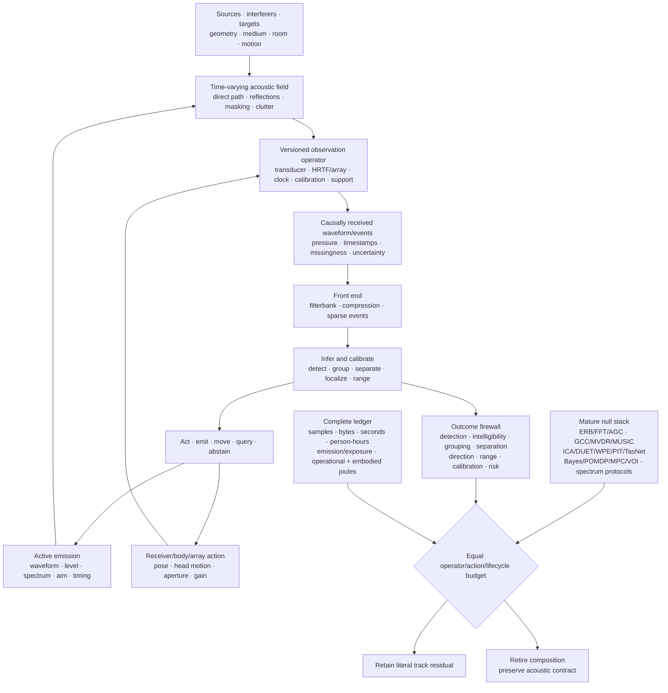

# Fixture F-009 — Operator-qualified active acoustic inference

- **Status:** hostile cross-candidate benchmark fixture; no new principle or
  candidate
- **Primary owners:** [Candidate 002](../candidates/002-multiscale-context-broadcast.md),
  [Candidate 006](../candidates/006-reversible-physical-skill.md),
  [Candidate 007](../candidates/007-endogenous-observation-surveillance.md),
  [Candidate 009](../candidates/009-graded-assurance-envelopes.md),
  [Candidate 012](../candidates/012-latency-qualified-authority.md), and
  [Candidate 014](../candidates/014-versioned-observation-contract.md)
- **Evidence source:** [acoustics, hearing, and auditory-scene analysis
  audit](../../research/audits/2026-08-05-acoustics-auditory-scene-analysis.md)
- **Mathematics:** [operator-qualified acoustic inference](../../math/operator-qualified-acoustic-inference.md)

## Evidence links

The direct evidence range is [C-1054](../../research/claims.md#c-1054)–[C-1099](../../research/claims.md#c-1099). The range supplies traceability to the scoped source claims; the fixture remains a joint engineering test.

## Question

Can a proposed acoustic system detect, group, separate, localize, range, and act
when sources, rooms, media, arrays, bodies, clocks, calibration, masks,
reverberation, interference, and action opportunities change? Does active
emission or receiver motion add causal decision value after waveform design,
beamforming, separation, state estimation, POMDP/dual control, value of
information, spectrum protocols, hardware, exposure, human work, and lifecycle
energy are charged?

The fixture operationalizes all nine E-ACOUSTIC experiments. It tests one
operator/action contract across tracks; it does not award a shared score to
unrelated acoustic outcomes.

## Identity, support, and leakage boundary

Every episode publishes
$\mathcal A=(X,S,E,R,H,O,C,T,U,B)$ from the
[mathematical contract](../../math/operator-qualified-acoustic-inference.md).
The runtime receives only waveforms, events, metadata, and calibration records
whose receipt time precedes the decision. The evaluator separately retains
clean sources, target/source identities, geometry, time-varying room kernels,
true clocks, reflection paths, masker class, source count, counterfactual action
seed, device state, and complete energy trace.

The record includes:

1. pressure in pascals and every decibel reference, weighting, integration
   interval, frequency band, sensor position, orientation, and uncertainty;
2. device, corrected, capture, emission, event, and receipt timestamps in
   seconds plus clock version, offset, drift, jitter, and synchronization path;
3. source waveform, position, motion, directivity, class, identity, source
   level, target/interferer role, and selection history;
4. geometry, medium, boundaries, temperature, humidity, flow, occupancy,
   time-varying impulse response, early/late boundary, and operator support;
5. receiver/body/array identity, HRTF or manifold, aperture, transducer response,
   gain, health, saturation, feasible motion, authority, and calibration;
6. actual filterbank, compression, masking, event threshold, refractory state,
   front-end version, missingness, clipping, and preprocessing;
7. commanded and realized emission, sensor, gain, head/body, communication, and
   task actions with acoustic energy, exposure, motion work, latency, and risk;
8. practice/adaptation scenes, rooms, sources, labels, clean references,
   augmentations, feedback, exclusions, and stopping rules; and
9. independent waveform, event, source, room, listener/receiver, device, site,
   and population identifiers.

Training/test splits group neighboring waveform windows, convolved variants,
the same clean source, room simulation lineage, HRTF/manifold family, array
calibration, device, speaker/listener identity, and derived labels. A rendered
mixture cannot enter one split when its clean source or impulse response enters
another.

Editable source:
[operator-qualified-active-acoustic-inference.mmd](../../assets/diagrams/operator-qualified-active-acoustic-inference.mmd).

## Outcome firewall

| Outcome | Required literal measurement | Forbidden substitution |
| --- | --- | --- |
| pressure and exposure | pascals, RMS interval, referenced level, pascal-squared seconds, weighting, calibration | unreferenced dB or electrical power |
| detection | hit/false-alarm rates, dimensionless $d'$, criterion, calibration | recognition accuracy or mixture SNR |
| discrimination | psychometric threshold in the manipulated unit | detection or preference |
| identification/intelligibility | confusion matrix; words, phonemes, or information units under a protocol | SI-SDR or loudness |
| grouping | event-to-source assignment, ambiguity, switch rate, source count | separated waveform or attention weight |
| separation | SI-SDR plus waveform/task/perceptual measures and causal source identity | localization or intelligibility alone |
| dereverberation | direct/early/late operator-specific waveform and downstream measures | “dryness” or word score alone |
| localization | azimuth/elevation error in degrees, front/back errors, calibration | source identity, range, or beam width |
| ranging | bias, absolute error, interval coverage in metres | echo detection or direction |
| sparse timing | timestamp error, missed/false events, information, task value, bytes, joules | event count or active fraction |
| active sensing | causal emission/motion contrast, information, target value, latency, detectability, exposure, risk, energy | action--success correlation |
| gain/efferent control | intervention on gain with endpoint-specific effect, distortion, recovery, cost | gain suppression or attention saliency |
| beamforming | beampattern, array gain, distortion, mismatch robustness, downstream task | biological directional hearing |
| uncertainty | proper score, coverage, risk--coverage, abstention value by held-out operator | confidence magnitude |
| lifecycle efficiency | protected outcomes plus samples, bytes, seconds, person-hours, exposure, harms, operational and embodied joules | acoustic output, inference joules, or FLOPs |

## Nine adversarial tracks

| ID | Audit experiment | Sealed changes | Decisive outcomes |
| --- | --- | --- | --- |
| T1 | E-ACOUSTIC-01 level-dependent front end | level, band, dynamic range, transient/continuous input, compression history, sensor response, domain | detection/discrimination, calibration, clipping, recoverable information, bytes, latency, joules |
| T2 | E-ACOUSTIC-02 sparse event timing | thresholds, refractory periods, timestamp precision, band, SNR, modulation, overlap, loss, clock jitter | information/task, timing microseconds, misses/false events, active fraction, bytes, latency, joules |
| T3 | E-ACOUSTIC-03 active emission/reception | waveform, level, spectrum, aim, timing, receiver motion, reflectivity, range, clutter, interferer, exposure | detection, range/direction, calibration, decision value, time, detectability, risk, motion and lifecycle energy |
| T4 | E-ACOUSTIC-04 localization under operator shift | ITD/ILD/spectral conflict, HRTF/manifold, array/body, aperture, head motion, failure, room, correlated source | direction/range, front/back error, source count, coverage, recovery, latency, bytes, joules |
| T5 | E-ACOUSTIC-05 reverberation adaptation | consistent/inconsistent context, source/receiver move, direct/reverberant ratio, early/late reflections, spectral controls, new rooms | intelligibility, event identity, waveform, distance, calibration, transfer, forgetting, adaptation time, cost |
| T6 | E-ACOUSTIC-06 scene grouping/separation | energetic/informational masker, harmonicity, onset/coherence conflict, space, room, source count, novelty, motion, ambiguity | detection, intelligibility, grouping, SI-SDR, localization, identity, uncertainty, downstream value, cost |
| T7 | E-ACOUSTIC-07 efferent-like gain | target/masker band and level, stationarity, contralateral input, task cue, delay, saturation, drift, target absence | gain, sensitivity, intelligibility, calibration, distortion, recovery, false suppression, joules |
| T8 | E-ACOUSTIC-08 multi-emitter interference | emitter count, cooperative/adversarial policy, geometry, spectral/temporal collision, clutter, identity, authentication, turnover | detect/range, collision, association, throughput, fairness, exploitability, cross-play, messages, exposure, energy |
| T9 | E-ACOUSTIC-09 complete lifecycle | source/room/media, transducer/array/body, model, site, hardware, natural-scene stream | entire firewall and all data/training/emission/sensing/motion/compute/maintenance/embodied costs |

Tracks remain statistically and semantically separate. T1 success does not
establish sparse efficiency; separation does not establish grouping or source
identity; localization does not establish range; active information gain does
not establish net energy or safe dose.

## Mature null stack and arms

| ID | Method | Required competitive implementation |
| --- | --- | --- |
| B0 | calibrated physical front end | IEC-compatible measurement chain, transfer-function/clock calibration, FFT, wavelet, constant-Q, mel, ERB, gammatone/gammachirp, modulation and learned filterbanks |
| B1 | level and event processing | multiband compression/AGC, PCEN, onset/offset and VAD, codecs, sparse convolution, duty-cycled DSP, event hardware under identical decoding |
| B2 | delay and localization | matched filter, GCC/PHAT, Bayesian delay, SRP, delay-and-sum, robust/superdirective/MVDR beamforming, MUSIC/ESPRIT, particle/source tracking |
| B3 | separation and dereverberation | spectral subtraction, Wiener, NMF, ICA/IVA, DUET, WPE, spatial mixture models, deep clustering, PIT, Conv-TasNet, neural beamforming, target extraction |
| B4 | calibrated scene inference | state-space/Bayesian scene and source-count models, ensembles, conformal/selective prediction, abstention, proper scoring, multi-hypothesis association |
| B5 | active sensing and control | ambiguity-optimal waveform, adaptive sonar/radar scheduling, POMDP, dual control, active SLAM, Bayesian design, VOI, sensing/motion MPC, constrained control |
| B6 | interference coordination | TDMA/FDMA/CDMA, random access, listen-before-talk, power control, hopping/coded probes, cancellation, authentication, explicit protocol, game-theoretic allocation |
| B7 | complete conventional composition | strongest compatible B0--B6 modules with versioned operators, monitoring, calibration, fallback, and complete ledger |
| F9 | operator-qualified active acoustic composition | proposed multiscale context, physical front end, active observation, assurance, authority, and observation-contract modules |
| O0 | trace-aware oracle | clean sources, true scene/operator/clock, reflection paths, source identities, future motion, association, and counterfactual action; ceiling only |

B7 is decisive. F9 must beat the strongest complete conventional composition,
not an incomplete filterbank, single beamformer, weak separator, or passive
policy.

## Sealed scene and operator generator

Freeze before confirmatory evaluation:

1. at least two speech, animal, machine, environmental, impulsive, sustained,
   tonal, broadband, and adversarial source families where relevant;
2. quiet, energetic masking, informational masking, coherent/conflicting
   grouping, stationary/moving sources, unknown counts, and ambiguous mixtures;
3. free field, diffuse and non-diffuse rooms, indoor/outdoor/underwater media,
   early/late reflection changes, moving boundaries, temperature/flow change,
   and time-varying impulse responses;
4. held-out microphones/transducers, individual HRTFs, arrays, apertures,
   bodies, head/pinna/receiver geometries, clocks, sample rates, gain stages,
   and hardware classes;
5. nominal, drifting, clipped, saturated, delayed, jittered, dropped,
   miscalibrated, failed, and support-mismatched observation channels;
6. fixed and active emitters with unseen waveform, source level, directivity,
   aim, repetition, target reflectivity, clutter, and association ambiguity;
7. fixed, mobile, and action-limited receivers with body/head/sensor moves,
   exposure limits, motion constraints, task deadlines, and detectability cost;
8. cooperative, selfish, deceptive, imitating, colluding, unauthenticated, and
   turnover-prone emitter populations; and
9. at least two renderer/simulator lineages, physical sites, model families,
   sensor/body designs, and CPU/GPU/DSP/FPGA/ASIC/analog hardware classes.

An untouched natural-scene stream evaluates final false alarms, rare hazards,
unknown sources, clock faults, room changes, and interference. Development
never sees its clean sources, impulse responses, HRTFs/manifolds, operator
versions, source counts, collision schedule, or counterfactual action seeds.

## Matched-budget contract

Every inferential arm receives identical or preregistered componentwise limits
for:

1. causally received pressure samples/events, channels, aperture, sample rate,
   precision, bandwidth, timestamps, support, metadata, and missingness;
2. calibration probes, reference sources, impulse responses, HRTFs/manifolds,
   synchronization messages, drift checks, and operator-identification samples;
3. clean sources, mixtures, rooms, labels, source identities, demonstrations,
   augmentations, simulated/physical scenes, environment steps, and target data;
4. parameters, front-end state, optimizer state, event buffers, replay, source
   memories, room/operator banks, external storage, checkpoints, and bytes;
5. optimization steps, filter updates, correlation/beam search, spatial grid,
   separation permutations, rollouts, evaluator calls, tuning trials, and seeds;
6. emission waveform bandwidth, duration, peak/RMS pressure, acoustic joules,
   repetition, spectrum, aim, duty cycle, and cumulative exposure;
7. body/head/sensor motion authority, path length, speed, acceleration, actuator
   work, wear, deadline, collision risk, and recovery/fallback;
8. communication spectrum, messages, bits/bytes, latency, identities,
   authentication, shared state, partner access, and centralized compute;
9. CPU/GPU/DSP/FPGA/ASIC/analog/neuromorphic time, wall deadline, peak memory,
   network/storage traffic, host/idle/cooling boundary, and failed runs;
10. design, recording, annotation, listening tests, calibration, tuning,
    supervision, safety review, monitoring, maintenance, and repair in
    role-stratified person-hours; and
11. data, training, emission, sensing, inference, motion, communication,
    storage, calibration, maintenance, replacement, facility, and amortized
    embodied energy in joules under one service interval.

An arm crossing a binding ceiling is infeasible for that seed. Do not normalize
it into compliance, hide failed runs, reuse oracle calibration, or transfer an
ablation's freed energy, bytes, samples, aperture, action, or time elsewhere.

## Required ablations

Run F9 with released resources left unused after removing:

1. pressure reference, weighting, integration, and exposure identity;
2. capture/receipt time, clock offset/drift/jitter, and synchronization version;
3. time-varying propagation/room kernel, source/receiver motion, and support;
4. receiver/body/array geometry, HRTF/manifold, aperture, health, and calibration;
5. filterbank identity and state;
6. level/history-qualified compression and saturation state;
7. explicit energetic/informational masking and source-count uncertainty;
8. sparse event threshold/refractory/timestamp identity;
9. ITD, ILD, spectral-cue, and head-motion decomposition;
10. direct/early/late reverberation decomposition;
11. grouping, separation, localization, range, and causal-identity firewall;
12. correlation/beamformer uncertainty and steering/covariance mismatch state;
13. active-emission command/realization, dose, detectability, and interference;
14. receiver/body/sensor action and feasible-action envelope;
15. task-conditioned gain/efferent analogue;
16. calibrated abstention and value of information; and
17. full hardware, person-hour, operational, maintenance, and embodied-energy
    ledger.

Also intervene on one field at a time: decibel reference, clock version, room
kernel, early/late boundary, masker class, compression history, event threshold,
HRTF/array/body, aperture, steering vector, covariance support, source count,
source identity, emission waveform/level/aim, head motion, gain control,
exposure ceiling, and hardware. An ablation earns causal credit only when it
selectively damages its registered outcome without changing available evidence
or resources.

## Analysis

Randomize and analyze at the unit receiving the intervention. Use hierarchical
models or hierarchical bootstrap across waveform, clean source, event, source
set, room/medium, receiver/body, HRTF/array, clock/operator version, device,
site, model seed, and hardware. Adjacent samples or overlapping windows are not
independent sources; convolved versions are not independent rooms.

Preregister paired comparisons against B7, 95% intervals, multiplicity control,
protected non-inferiority margins, material-improvement thresholds, calibration
coverage, tail-failure ceilings, and stopping rules. Report every missing
channel, clip, saturation, association failure, false source, abstention,
override, unsafe exposure, collision, failed run, exclusion, unused budget, and
complete trial course.

A residual must replicate across at least two source families, rooms/media,
arrays/bodies, operator/calibration versions, scene types, model families,
sites, and hardware classes. Active tracks also require unseen targets,
interferers, action limits, and counterfactual paired seeds; T8 requires
never-coordinated population cross-play.

## Hard retirement rules

Retire the proposed composition and preserve F-009 as a measurement benchmark
when any relevant condition fires:

1. B7 matches F9 on the protected vector at equal operator, action, calibration,
   human-work, exposure, harm, and lifecycle-energy budgets;
2. an unreferenced level, omitted weighting, unknown integration interval,
   stale calibration, or unsupported sensor position creates the gain;
3. capture/receipt-time leakage, clock offset, simulator synchronization, or
   future packet fields explain timing or ranging performance;
4. a time-invariant room assumption, shared renderer, shared impulse response,
   clean-source overlap, HRTF/manifold overlap, or derived-window leakage creates
   an inverse crime;
5. FFT, wavelet, mel, ERB, gammatone/gammachirp, learned filters, PCEN, AGC, or
   multiband compression matches T1 under held-out level and sensor changes;
6. sparse events reduce count but not measured bytes/joules, or lose weak
   sustained signals, fine timing, rare hazards, calibration, or downstream task;
7. VAD, onset coding, sparse convolution, a codec, compressed sensing under its
   valid assumptions, or duty-cycled DSP matches T2;
8. matched filtering, ambiguity-optimal waveforms, adaptive sonar scheduling,
   POMDP, dual control, active SLAM, Bayesian design, VOI, or sensing MPC
   matches active emission/reception value;
9. active gains vanish after acoustic/electrical emission energy, exposure,
   detectability, interference, receiver motion, actuator work, and calibration
   are charged;
10. GCC/PHAT, Bayesian delay, SRP, conventional/robust/MVDR beamforming,
    MUSIC/ESPRIT, or particle tracking matches localization/range at equal
    bandwidth, aperture, samples, clocks, and calibration;
11. a localization gain fails held-out HRTFs, arrays, bodies, rooms, source
    spectra, correlated sources, microphone faults, or head-motion controls;
12. apparent super-resolution depends on unreported priors, incorrect source
    count, training overlap, or physical spatial frequencies outside the
    declared aperture/bandwidth support;
13. WPE, Wiener filtering, blind system identification, room-conditioned
    normalization, state-space context, or equal-sample target adaptation
    matches reverberation outcomes;
14. speech compensation is reported as direct-waveform recovery, or one decay
    scalar replaces band/source/receiver-specific impulse responses;
15. NMF, ICA/IVA, DUET, spatial mixtures, deep clustering, PIT, Conv-TasNet,
    neural beamforming, target extraction, or their complete composition matches
    grouping/separation on held-out sources, counts, rooms, and cue conflicts;
16. SI-SDR improves while intelligibility, localization, causal identity,
    calibration, perceptual/task quality, or risk is worse;
17. a separated waveform is assigned causal source identity without count,
    permutation, association, provenance, and uncertainty evidence;
18. multiband AGC, compression, Wiener/adaptive filtering, beamforming, feature
    attention, or selective prediction matches the gain/efferent track;
19. a gain/efferent analogue changes internal activation or suppression but no
    preregistered detection, intelligibility, distortion, recovery, or cost
    endpoint;
20. TDMA/FDMA/CDMA, random access, listen-before-talk, power control, hopping,
    coded probes, cancellation, authentication, explicit protocol, or
    game-theoretic allocation matches multi-emitter performance;
21. a frequency shift or timing change fails new emitter populations,
    adversaries, collusion, turnover, clutter, or equal-power cross-play;
22. confidence is uncalibrated under held-out rooms/operators, multimodal
    correlation peaks are collapsed to one point, or abstention has negative
    protected utility;
23. any gain disappears on held-out source, room/media, array/body, clock,
    transducer, calibration, site, model, natural scene, or hardware strata;
24. no ablation isolates value beyond the complete mature stack; or
25. the advantage disappears after recording, labeling, clean references,
    simulation, failed trials, tuning, emission, exposure, sensing, motion,
    communication, storage, calibration, maintenance, replacement, facility,
    role-stratified person-hours, and complete lifecycle joules are charged.

A pass refines only the owner candidates on the literal tracks passed. It does
not create another principle or candidate.
