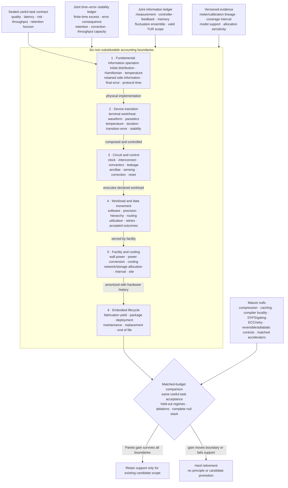

# Fixture F-010 — Boundary-qualified physical computation

- **Status:** hostile cross-candidate benchmark fixture; no new principle or
  candidate
- **Primary owners:**
  [Candidate 001 — adaptive topology](../candidates/001-adaptive-topology.md),
  [Candidate 005 — severity-ordered containment](../candidates/005-severity-ordered-containment.md),
  [Candidate 006 — reversible physical skill](../candidates/006-reversible-physical-skill.md),
  [Candidate 009 — graded assurance envelopes](../candidates/009-graded-assurance-envelopes.md),
  [Candidate 010 — reset-coupled staged verification](../candidates/010-reset-coupled-staged-verification.md),
  [Candidate 012 — latency-qualified authority](../candidates/012-latency-qualified-authority.md),
  [Candidate 014 — versioned observation contracts](../candidates/014-versioned-observation-contract.md),
  [Candidate 017 — contract-preserving semantic compaction](../candidates/017-contract-preserving-semantic-compaction.md),
  and
  [Candidate 018 — value- and reconstructability-aware tiering](../candidates/018-value-reconstructability-aware-tiering.md)
- **Evidence source:**
  [information thermodynamics and physical computation audit](../../research/audits/2026-08-05-information-thermodynamics-physical-computation.md)
- **Mathematics:**
  [boundary-qualified physical-computation contract](../../math/boundary-qualified-physical-computation.md)
- **Promotion state:** fixture only; success can strengthen an existing
  candidate within its present scope, while failure retires the unsupported
  physical-efficiency composition

## Question

At equal useful-task quality, latency, risk, throughput, retention, hardware
capacity, design effort, fabrication, sensing, control, correction, energy,
facility, material, and lifecycle budgets, can a proposed physical-computation
composition beat the strongest compatible conventional stack across all
boundaries it claims to improve?

The benchmark is hostile to boundary movement. It awards no credit for a
Landauer comparison attached to an unspecified logical operation, a device
transition that excludes its waveform source, reversible logic that leaves
history unclosed, adiabatic loss that excludes the power clock, a memory result
without retention, arithmetic savings that increase movement, an
information-engine result without the controller, PUE used as task efficiency,
or operational savings that never amortize new hardware. A result survives only
if it delivers more accepted useful service under the common contract.

## Durable contract under test

Every accepted result retains a versioned chain through six non-substitutable
boundaries:

1. **fundamental information operation:** logical map, physical encoding,
   initial distribution, Hamiltonian, bath, side information, correlations,
   final error, protocol duration, and cycle closure;
2. **device transition:** terminal voltage/current or other supplied work,
   waveform, parasitics, temperature, time, transition-error distribution,
   retained state, and measured heat when claimed;
3. **circuit and control:** gates, clocks, power-clock recovery, wires,
   converters, sensors, controller, ancillae, history, leakage, correction,
   reset, and I/O;
4. **workload and data movement:** software, model, precision, hierarchy,
   routing, metadata, utilization, idle capacity, retries, task quality,
   latency, and accepted outcomes;
5. **facility and cooling:** wall meters, power conversion, cooling, network and
   storage allocation, site, weather, measurement interval, and PUE category;
6. **embodied lifecycle:** fabrication yield, packaging, transport, deployment,
   maintenance, support life, utilization, replacement, end of life, and
   uncertainty under one functional unit.

If any claimed boundary lacks its required evidence, the result can remain a
component diagnostic but cannot support the cross-boundary efficiency claim.

## Sealed identity and leakage boundary

Before any arm sees a development episode, seal:

1. logical operation, physical state preparation, input prior, side information,
   final-state acceptance, allowed controls, temperature, and cycle boundary;
2. device, process, lot, die, package, board, clock/power-clock, interconnect,
   memory, converter, sensor, controller, meter, calibration, and firmware
   identities;
3. software, compiler, model, checkpoint, precision, data layout, routing,
   error-correction, retry, calibration, and host-orchestration versions;
4. task corpus, request distribution, quality/safety gate, latency/throughput
   limits, risk ceiling, retention horizon, and abstention policy;
5. facility, rack, cooling path, storage/network boundary, meter interval,
   weather, site, electricity case, idle-allocation, and overhead-allocation
   policy;
6. fabrication inventory, yield, packaging, transport, maintenance, utilization,
   demand, support lifetime, replacement, and end-of-life cases;
7. development, validation, confirmation, and future-time group assignments;
8. all budget ceilings, uncertainty models, sensitivity cases, stopping rules,
   and hard retirement rules; and
9. source code, instrument output, rejected trials, failed devices, missing
   records, retries, discarded hardware, and analysis-environment hashes.

Confirmation groups withhold physical devices, fabrication cohorts, waveform
and duration regimes, error targets, temperatures, retention horizons,
workload families, hierarchy and routing patterns, controller versions,
facilities, seasons, lifecycle cases, and future time. Random transitions,
requests, or meter samples from one physical group are never confirmatory.

## System diagram

Editable source:
[boundary-qualified-physical-computation.mmd](../../assets/diagrams/boundary-qualified-physical-computation.mmd).

## Twelve adversarial tracks

Track identities preserve `E-THERMO-01` through `E-THERMO-12` in the source
audit. They share the useful-task contract, physical identities, meters,
resource ledger, and retirement rules. No track inherits success from another.

| ID | Audit track | Construct under pressure | Sealed primary outcomes |
| --- | --- | --- | --- |
| T1 | `E-THERMO-01` | finite-time, finite-error generalized erasure | work distribution, duration, final logical/physical error, free-energy change, rare-event coverage |
| T2 | `E-THERMO-02` | reversible kernel with closed history | accepted joules, throughput, capacity, ancilla/history closure, leakage, I/O, reset, error |
| T3 | `E-THERMO-03` | real adiabatic crossover | terminal/power-clock joules, leakage, recovered energy, throughput, area, timing/error yield |
| T4 | `E-THERMO-04` | retention--write--error frontier | read/write/refresh/correction energy, retention distribution, endurance, silent loss, accepted retrievals |
| T5 | `E-THERMO-05` | analog precision and noise closure | accepted quality, resolution, noise/drift, conversion, calibration, communication, complete joules |
| T6 | `E-THERMO-06` | information-engine boundary closure | joint work/heat, mutual information, sensing, record, controller, actuation, reset, cycle time |
| T7 | `E-THERMO-07` | uncertainty-relation applicability | current precision, entropy-production estimate, process diagnostics, coverage, scope rejection |
| T8 | `E-THERMO-08` | modularity and distribution mismatch | accepted joules, cross-module traffic/information, reset, calibration, shifted-prior quality |
| T9 | `E-THERMO-09` | data movement and hierarchy | joules/bytes by level, routing/sync/metadata, utilization, latency tails, accepted quality |
| T10 | `E-THERMO-10` | cooling and facility allocation | IT/facility/cooling joules, accepted service, demand, ambient state, allocation sensitivity |
| T11 | `E-THERMO-11` | specialization lifecycle crossover | yield, embodied/operational energy, utilization, lifetime, replacement, break-even distribution |
| T12 | `E-THERMO-12` | complete six-boundary composition | quality--latency--risk--capacity--energy--lifecycle Pareto decision with uncertainty |

## Common experimental design

### Equal budgets

Every arm receives the same task and acceptance contract, development data,
design and tuning person-hours, fabrication opportunity, area or provisioned
hardware capacity, memory, sensors, controller resources, error-correction and
reserve budget, training compute, wall-time window, throughput requirement,
retention horizon, facility access, maintenance opportunity, and lifecycle
functional unit. A track may vary one registered independent quantity such as
protocol duration or target error; all other ceilings remain shared.

If a slower arm needs replication to deliver the same throughput, the added
devices, clocks, idle capacity, fabrication, and facility load are charged. If
an error-tolerant arm needs correction or retry, that work and residual risk are
charged. If an analog or physical arm needs a digital host, converter, or
calibration loop, it is inside the boundary.

### Complete ordinary null stack

Use the strongest technically compatible composition of:

- Shannon coding, compression, quantization, pruning, batching, memoization,
  caching, compiler common-subexpression elimination, and recomputation;
- clock and power gating, dynamic voltage/frequency scaling, near-threshold
  operation, mixed precision, structured sparsity, tiling, locality, and data
  reuse;
- reversible logic with explicit ancilla/history closure, adiabatic or
  energy-recovery logic with its power clock, and ordinary irreversible logic
  at matched process, layout, area, error, and throughput;
- guardbands, ECC, checksums, retry, checkpoint/replay, redundancy, calibration,
  correction, abstention, and safe fallback;
- matched digital, analog, in-memory, optical, and neuromorphic paths with
  conversion, programming, drift control, communication, thermal, and host work;
- interval-calibrated facility metering and multiple registered overhead
  allocations; and
- ISO 14040/14044 lifecycle inventories with common functional unit, yield,
  utilization, service life, replacement, geography, electricity, and
  uncertainty cases.

### Common outcome firewall

Report without post-hoc scalarization:

1. accepted fraction and task-native quality distribution;
2. median, 95th, 99th, and maximum registered latency [s];
3. transition, task, silent-corruption, uncorrectable, escaped-harm, and
   availability risks under their registered denominators;
4. useful throughput [accepted outcome/s] and provisioned capacity [device s];
5. fundamental lower bound, device-terminal, circuit/control, IT-workload,
   facility, and embodied/lifecycle energy as distinct quantities [J];
6. data movement [byte] and energy [J] by physical hierarchy;
7. measurement, controller, clock, reset, calibration, correction, retry,
   refresh, cooling, idle, and replacement terms [J];
8. fabrication yield, hardware utilization, service lifetime, accepted lifetime
   outcomes, and break-even distribution;
9. meter/calibration uncertainty, model support, allocation sensitivity, and
   covariance; and
10. non-energy climate, water, material, labor, and safety outcomes in declared
    native units.

### Shared ablations

Ablate one term at a time: generalized state/free-energy model; finite-time
optimization; finite-error consequence; retention/correction; closed reversible
history; power-clock recovery; joint sensor/controller boundary; TUR scope gate;
hierarchy-aware routing; facility metering; embodied inventory; uncertainty and
support gating. Retune only within the original development budget. Also run
boundary-drop diagnostics that intentionally omit each of the six boundaries;
these cannot win, but they reveal where an apparent advantage was created.

## Track protocols

### T1 — Finite-time, finite-error generalized erasure

Implement the same physical memory and state-preparation apparatus for all
arms. Compare the proposed reset protocol with the best full-control or
restricted-control conventional protocol available on that device and a slow
reference approaching the registered quasistatic regime. Cross uniform and
biased input distributions, degenerate and declared nondegenerate Hamiltonians,
correlated and uncorrelated side state, target error, protocol duration,
temperature, and control bandwidth. Where reservoir size is relevant, include
at least one finite-reservoir regime rather than importing an infinite-bath
formula.

Estimate initial/final physical distributions and nonequilibrium free energy
independently of work. Measure signed work on every terminal for every
realization, final logical and microstate error, correlation retained or
destroyed, protocol time, controller energy, reset closure, and complete work
tails. Report individual sub-bound trajectories without calling them
violations; test ensemble fluctuation relations only when their preparation and
reverse-protocol assumptions are met.

Hold out one input prior, target-error band, duration decade, temperature,
physical device, control waveform family, and correlated-side-information
condition. Retire a generalized-erasure advantage if it vanishes after matching
initial/final state, duration, error, and controller boundary; if it depends on
destroying uncharged correlation; if rare-work tails are undersampled; or if a
special $k_BT\ln2$ expression is used outside its uniform degenerate binary
scope.

### T2 — Reversible kernel with closed history

Select at least three useful kernels with different information-loss and memory
profiles: a bijective transform, a many-to-one reduction with retained output,
and a search or iterative update requiring temporary history. Implement:

1. best optimized irreversible circuit and software schedule;
2. reversible circuit with explicit ancilla preparation, output copy, history,
   uncomputation, export/retention, and final reset;
3. irreversible checkpoint/recompute schedule at the same memory ceiling; and
4. reversible pebbling variants spanning registered time--space points.

Use the same process or calibrated technology translation, I/O contract,
problem instances, correctness, error rate, throughput, and hardware-capacity
ceiling. Instrument logic, memory, wires, clocks, controls, leakage, I/O,
history storage, uncomputation, output preservation, and eventual reset.
Preserved history must satisfy its declared retention and error requirement.

Hold out problem size, input entropy, kernel, routing distance, memory pressure,
clock regime, and retention horizon. Retire the reversible advantage if any
logical state is left without an uncompute/retain/export/erase disposition; if
throughput requires uncharged replication; if output copying or final reset is
excluded; or if the complete accepted-task frontier is matched by ordinary
checkpointing, compiler elimination, or recomputation.

### T3 — Real adiabatic crossover

Fabricate or lay out an adiabatic/energy-recovery circuit and a conventional
CMOS null at matched function, process, physical design effort, area or die
budget, timing yield, output load, and transition error. Include the complete
power-clock generator and distribution network in the adiabatic arm. Add
clock-gated, power-gated, voltage-scaled, and near-threshold conventional nulls.

Sweep frequency, waveform duration and shape, supply voltage, temperature,
output load, utilization, data activity, routing length, and idle interval.
Measure terminal energy, recovered energy with sign, power-clock and control
energy, leakage, short-circuit current, interconnect, synchronization, area,
timing/error distribution, useful throughput, and capacity needed to meet the
service rate. Verify the expected slow-ramp RC trend only within its fitted
support; do not extrapolate it through leakage- or clock-dominated regimes.

Hold out a frequency band, temperature, load, waveform, layout region, device
cohort, activity pattern, and burst/idle regime. Retire a universal or
workload-level adiabatic claim if no measured crossover exists; if it disappears
after the power clock and replication are charged; if recovered energy is
double-counted; or if conventional voltage/frequency and gating controls match
the accepted-service frontier.

### T4 — Retention--write--error frontier

Compare the proposed memory or state-retention mechanism with the appropriate
SRAM, DRAM, nonvolatile, recomputation, and tiered-storage nulls. Match useful
capacity, access pattern, read/write acceptance, retention horizon,
temperature distribution, endurance requirement, failure-risk ceiling, and
physical area or provisioned capacity.

Measure write, read, verify, refresh, scrub, ECC, retry, migration, idle, and
reconstruction energy; raw and post-correction error distributions; retention
survival; detected uncorrectable errors; miscorrections and silent loss;
latency; bandwidth; endurance; wear distribution; spare consumption; and
accepted retrievals before repair or retirement. Fit activated-barrier models
only to regimes where their diagnostics and independent physical evidence hold.

Hold out temperature, retention duration, data pattern, access intensity,
device cohort, weak-cell tail, disturbance, correction regime, and combined
retention/endurance stress. Retire the memory advantage if low write energy is
offset by refresh, correction, verification, reconstruction, capacity, or
replacement; if mean retention hides an unacceptable tail; or if an errorful
state is credited without its consequence.

### T5 — Analog precision and noise closure

Use tasks whose acceptance depends on declared numerical or inferential
precision, tail behavior, calibration, and shift robustness. Compare the
proposed analog path with optimized digital mixed precision, digitally
simulated low precision or stochastic arithmetic, and any compatible in-memory,
optical, or neuromorphic null. Use the same task data, model capacity, tuning
effort, latency/throughput contract, and physical deployment boundary.

Include DAC/ADC or sensor front end, drivers, amplifiers, programming, sample
and hold, references, memory, interconnect, serialization, digital host,
calibration, drift detection, correction/refinement, cooling, and retries.
Measure signal and noise spectra, bandwidth, dynamic range, effective usable
bits, nonlinearity, device variation, drift with time and temperature,
calibration frequency, task-quality distribution, failure tails, and
wall-plug/facility joules per accepted outcome.

Hold out signal amplitude and spectrum, noise color, temperature, device,
calibration age, workload shift, adversarial near-threshold examples, and
required precision. Retire the analog advantage if it depends on ideal real
numbers, excludes conversion/host/calibration, fails the tail-quality gate, or
is matched by a digital implementation using the same precision and sparsity.

### T6 — Information-engine boundary closure

Build one feedback-controlled physical process whose measurement record can
change extracted work or dissipation. Compare feedback with a matched open-loop
protocol, the best predictive controller using the same sensor record, and a
randomized action null with the same actuator budget. Seal the plant, sensor,
record memory, estimator, controller, actuator, communication, power supply,
and reset boundary before measurement.

Estimate state/record mutual information with uncertainty and calibration
checks. Measure work and heat of the plant, sensor energy, record preparation
and retention, computation/control, communication, actuation, error handling,
reset, net extracted work, cycle time, output variance, and every external
resource that prepares the measurement. Report subsystem and joint ledgers side
by side.

Hold out measurement-noise level, delay, prior, feedback gain, controller
version, memory-retention interval, plant parameter, and nonstationary regime.
Retire a net-gain claim if it survives only around the plant; if records or
control are precomputed outside the ledger; if mutual-information estimation
fails calibration; or if open-loop/predictive nulls match joint net work and
accepted service.

### T7 — Thermodynamic-uncertainty applicability

Choose a measured physical current with a candidate precision--dissipation
claim. Before fitting the bound, register current orientation and integration,
state and transition graph, stationarity interval, Markov order, local detailed
balance or other entropy-production construction, time-reversal convention,
hidden-state assumptions, observation cadence, and entropy-production
estimator. Compare:

1. the registered stationary continuous-time Markov model;
2. finite-time and transient variants whose assumptions are satisfied;
3. hidden-state, semi-Markov, nonstationary, and non-Markov alternatives; and
4. a purely predictive empirical model that makes no thermodynamic claim.

Measure current mean/variance and full distribution, duration, entropy
production with uncertainty, waiting-time residuals, transition dependence,
stationarity, hidden-state diagnostics, held-out predictive likelihood, and
coverage of the claimed inequality. Separately test whether current precision
predicts useful-task acceptance; an internal current can satisfy a relation
while remaining irrelevant to the task.

Hold out time window, initial condition, drive, temperature, device, current
definition, observation cadence, and nonstationary change. Retire the
uncertainty-relation explanation if its process assumptions fail, entropy
production is not identifiable, allowed model alternatives reverse the result,
or the bound does not constrain task-relevant precision. Do not reinterpret
scope rejection as a thermodynamic violation.

### T8 — Modularity and distribution mismatch

Implement the same input--output computation as a jointly coupled system, a
module composition with independent resets, a module composition that shares
registered sufficient statistics, and the proposed modular architecture.
Calibrate every arm on the same development distribution. Create shifts in
input prior, cross-module correlation, task mixture, temporal dependence, and
route availability while holding quality and throughput requirements fixed.

Measure complete task energy, per-module device/circuit energy, intermodule
bytes and joules, synchronization, reset and calibration work, correlation or
mutual information discarded at each boundary, latency, utilization, quality,
error, and mismatch loss. Compare the actual physical process, not only the
abstract input--output map. Account for any distribution detector or online
recalibration.

Hold out prior, correlation structure, task mixture, module failure, topology,
and shift rate. Retire the modular thermodynamic claim if savings disappear
against the joint or shared-statistic null; if it assumes the deployment prior;
if recalibration cost is external; or if communication and discarded
correlations erase the accepted-service advantage. A maintainability benefit
may remain, but it is reported as a different coordinate.

### T9 — Data movement and hierarchy

Evaluate a sparse, conditional, modular, or physically compiled workload on a
metered hierarchy. Compare dense optimized execution, static structured
sparsity, compiler tiling/cache/data-reuse optimization, and the proposed route
using the same model quality, precision, batch/latency contract, and hardware
capacity. Preserve requested work and route failures rather than measuring only
active kernels.

Count bytes and joules separately for register files, local SRAM, each cache,
on-chip network, chip-to-chip link, DRAM or other external memory, host,
storage, and network. Measure arithmetic, index/metadata, routing, load balance,
synchronization, conversion, idle, cache/TLB misses, retries, latency tails,
throughput, and wall-plug IT energy. Calibrate component models to top-level
meters and expose the closure residual.

Hold out batch size, sequence or graph length, sparsity pattern, route skew,
working-set size, cache fit, precision, topology, model, and workload family.
Retire the compute-efficiency claim if saved arithmetic is offset by movement,
metadata, synchronization, fragmentation, or idle capacity; if peak TOPS/W
replaces accepted-task energy; or if the null obtains the same locality with
ordinary compiler and storage methods.

### T10 — Cooling and facility allocation

Run proposed and conventional systems in randomized, matched facility time
blocks or calibrated side-by-side infrastructure. Match accepted service,
queueing and deadline policy, site capacity, storage/network boundary, ambient
conditions as closely as possible, and maintenance state. Directly meter IT,
power conversion, cooling subsystems, and total facility energy over intervals
long enough to cover representative utilization and thermal dynamics.

Report IT and facility joules, facility demand [W], cooling-component energy,
PUE under the registered ISO/IEC 30134-2 category, accepted outcomes, latency,
utilization, ambient dry/wet bulb, humidity, thermal set points, flow, network
and storage allocation, and idle baseline. Test direct-submeter,
IT-energy-share, peak-demand-share, and provisioned-capacity allocation cases.
PUE remains a facility diagnostic and is not multiplied into a component result
without interval evidence.

Hold out season, weather band, utilization, rack density, cooling mode, site,
workload burst pattern, and partial outage. Retire the facility claim if it is
inferred from TDP, a generic PUE, or a nonrepresentative short run; if savings
move to shared storage/network; or if the ranking changes under every plausible
registered allocation. Report location/time-specific carbon and water
separately from energy.

### T11 — Specialization lifecycle crossover

Compare new specialized hardware with existing general-purpose hardware,
software optimization on already deployed hardware, and a shared specialized
service. Use one functional unit: accepted outcomes meeting the same quality,
latency, risk, retention, and support contract over a declared demand and
service-life distribution.

Build a cradle-to-retirement inventory for started wafers or devices,
fabrication yield, packaging, test, discarded units, transport, deployment,
operational facility energy, maintenance, calibration, repair, replacement,
spares, support, and end of life. Measure utilization and accepted lifetime
service rather than assuming peak use. Propagate inventory uncertainty and
test geography, electricity, fab yield, package, lifetime, demand, utilization,
replacement, and displaced-hardware credit cases.

Hold out demand trajectory, workload generation, yield lot, failure/repair
history, electricity case, site, support-life shock, and replacement policy.
Retire lifecycle superiority if operational savings do not cross embodied
burden within the registered lifetime; if break-even depends on unsupported
yield/utilization/demand; if incumbent embodied burden is counted again without
being incurred; or if replacement and retired hardware disappear from the
inventory.

### T12 — Full six-boundary composition

Choose one candidate-backed system claim that spans at least four boundaries
and run the complete composition. The proposed arm must use only mechanisms
already owned by the listed candidates. Compare the strongest ordinary stack
and factorial ablations for algorithm, logical operation, device, circuit and
controller, memory/hierarchy, facility, and lifecycle policy.

The primary outcome is the simultaneous uncertainty region over accepted
quality, latency, risk, throughput, capacity, device/circuit/IT/facility/lifecycle
energy, error consequences, data movement, utilization, yield, support life,
replacement, carbon, water, material, and labor coordinates defined by the
[mathematical contract](../../math/boundary-qualified-physical-computation.md).
Declare hard gates before release and test Pareto dominance without selecting a
new scalar weight after results.

Release held-out regimes in increasing distance from development: new request,
workload shape, error/retention target, device, circuit operating point,
hierarchy regime, controller version, temperature, facility/season, lifecycle
case, and future time. Stop authority when the registered support threshold is
crossed. Retire the broad composition if no Pareto improvement survives all
hard gates and required sensitivity cases, even when one component energy
metric improves.

## Analysis and controls

### Preregistered comparisons

For each track, preregister:

1. primary arm/null contrasts and direction of every outcome;
2. physical unit of randomization and independent replication;
3. development, validation, confirmation, lifecycle, and future-time groups;
4. minimum detectable effect in task-native and joule units;
5. simultaneous interval or multiplicity procedure;
6. meter accuracy, bandwidth, synchronization, calibration, and covariance;
7. missingness, censoring, failed-device, rejected-request, and retry treatment;
8. support test, stopping rule, hard gates, and retirement threshold; and
9. allocation, lifecycle, electricity, demand, and replacement sensitivities.

Use paired physical instances or time blocks where carryover can be randomized
and washed out; otherwise use hierarchical models that preserve device, lot,
site, and time dependence. Report effect distributions and coverage intervals,
not only point estimates or significance. Confirmation is rerun from immutable
raw instrument and service records in a clean analysis environment.

### Calibration and accounting controls

- calibrate electrical meters with traceable references across amplitude,
  frequency, phase, power factor, temperature, and integration duration;
- synchronize device, circuit, IT, and facility intervals and quantify clock
  offset, missing samples, probe loading, and unclosed energy residual;
- verify work/heat sign conventions and do not infer heat from terminal energy
  without a validated thermal balance;
- estimate state distributions and errors with blinded independent measurement
  where possible rather than the control sensor alone;
- preserve individual trajectories for fluctuation tests and confirm
  independence or model dependence explicitly;
- version every energy table, lifecycle factor, facility allocation, carbon
  factor, uncertainty model, and invalidation event; and
- keep negative, failed, unstable, unpackageable, retired, and zero-acceptance
  outcomes in denominators.

### Leakage and gaming controls

- no random row split across the same device, circuit, workload family,
  facility interval, lifecycle inventory, or future lineage;
- no tuning against confirmation meters, held-out error targets, future demand,
  or lifecycle sensitivity cases;
- no denominator change after observing which arm rejects, abstains, times out,
  or silently corrupts requests;
- no boundary-specific energy table selected after results;
- no recovered-energy credit counted both at a device terminal and power supply;
- no offset or renewable certificate used to change a physical energy result;
- no unsupported extrapolation from a toy bit, component, or short interval to a
  computer, facility, or lifecycle; and
- no candidate-specific extra development effort or hidden conventional null
  handicap.

## Hard retirement rules

Retire the physical-efficiency claim when any applicable rule fires:

1. the information operation lacks a physical encoding, initial distribution,
   Hamiltonian, bath, side information, error, duration, or cycle closure;
2. a device result is presented as circuit, task, facility, or lifecycle energy;
3. finite-time savings disappear at matched error, or error savings disappear
   after detection, correction, retry, fallback, and harm are charged;
4. a reversible run leaves history, ancillae, garbage, output preservation,
   retained state, or eventual reset outside its ledger;
5. an adiabatic crossover disappears after power clock, leakage, interconnect,
   controller, throughput capacity, and error are matched;
6. an information-engine gain survives only by excluding sensor, record,
   controller, communication, actuation, or reset;
7. a fluctuation or uncertainty-relation conclusion fails its registered
   ensemble, stationarity, Markov, observation, current, or entropy-production
   scope;
8. a memory advantage fails retention, endurance, correction, silent-loss,
   accepted-retrieval, or replacement gates;
9. an analog or stochastic advantage disappears under matched precision,
   conversion, calibration, host, shift, and tail-quality accounting;
10. arithmetic reduction is offset by movement, metadata, synchronization,
    imbalance, conversion, or idle capacity;
11. facility savings rely on component power, TDP, or generic PUE rather than
    calibrated interval and allocation evidence;
12. lifecycle superiority relies on unsupported yield, utilization, demand,
    lifetime, geography, electricity, displaced-hardware, or replacement cases;
13. a required held-out regime fails or the support gate does not abstain;
14. a claimed advantage is smaller than meter, model, or allocation uncertainty;
15. quality, risk, latency, throughput, retention, coverage, or capacity is
    worse than the sealed useful-task contract; or
16. the strongest compatible ordinary null lies on the same or better joint
    accepted-service frontier.

## Interpretation

Passing one track validates only that scoped construct and boundary. Passing all
twelve supports a boundary-qualified implementation of one or more existing
candidates; it does not establish a universal physical lower bound or promote a
new principle. Failure localizes the invalid transfer:

- T1 separates a theorem-qualified erasure result from a special-case slogan;
- T2 and T3 separate logical/circuit ideas from complete physical crossovers;
- T4 and T5 expose stability, correction, precision, and conversion costs;
- T6 and T7 close controller and theorem-scope boundaries;
- T8 and T9 expose correlation, mismatch, movement, and locality costs;
- T10 and T11 close facility and lifecycle boundaries; and
- T12 decides whether any cross-boundary advantage survives as useful service.

The fixture creates no central `C-` claim. Evidence remains attached to its
track, versions, physical identities, held-out regimes, and uncertainty until a
separate project-wide promotion decision is made.
