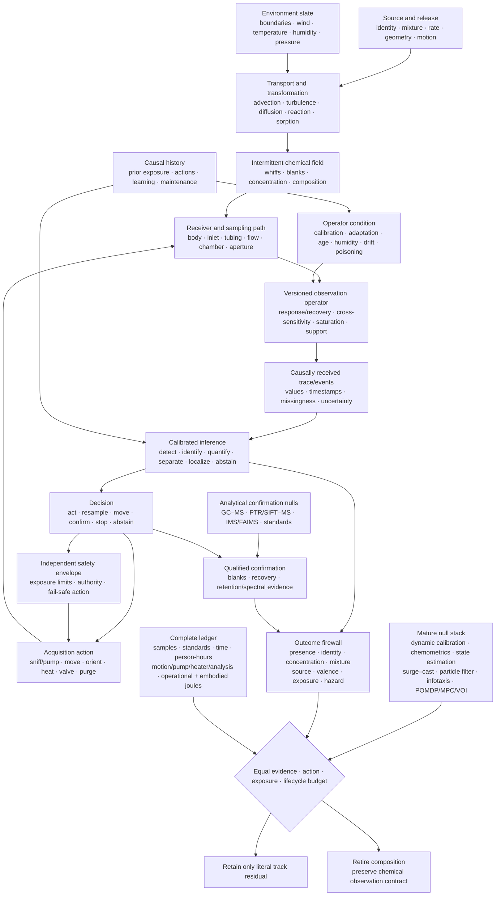

# Fixture F-011 — Operator-qualified active chemical sensing

- **Status:** hostile cross-candidate benchmark fixture; no new principle or
  candidate
- **Primary owners:** [Candidate 002](../candidates/002-multiscale-context-broadcast.md),
  [Candidate 006](../candidates/006-reversible-physical-skill.md),
  [Candidate 007](../candidates/007-endogenous-observation-surveillance.md),
  [Candidate 009](../candidates/009-graded-assurance-envelopes.md),
  [Candidate 010](../candidates/010-reset-coupled-staged-verification.md),
  [Candidate 012](../candidates/012-latency-qualified-authority.md),
  [Candidate 014](../candidates/014-versioned-observation-contract.md),
  [Candidate 017](../candidates/017-contract-preserving-semantic-compaction.md),
  and [Candidate 018](../candidates/018-value-reconstructability-aware-tiering.md)
- **Evidence source:** [olfaction, chemical sensing, and plume-tracking
  audit](../../research/audits/2026-08-05-olfaction-chemical-sensing-plume-tracking.md)
- **Mathematics:** [operator-qualified active chemical sensing](../../math/operator-qualified-chemical-sensing.md)
- **Closest existing fixtures:** [F-005 flow inference/control](005-regime-qualified-flow-inference-control.md),
  [F-008 device reliability](008-mission-profile-qualified-device-reliability.md),
  and [F-009 active acoustic inference](009-operator-qualified-active-acoustic-inference.md)

## Evidence links

The direct evidence range is [C-1152](../../research/claims.md#c-1152)–[C-1203](../../research/claims.md#c-1203). The range supplies traceability to the scoped source claims; the fixture remains a joint engineering test.

## Question

Can a proposed chemical-sensing system detect, identify, quantify, separate,
localize, attribute, learn, and act when source chemistry, concentration,
mixture, release, reaction, turbulent transport, sampling trajectory,
receiver/body, sensor response, humidity, calibration, adaptation, drift,
poisoning, analytical support, exposure rule, and action opportunity change?

Does receptor-like population coding, normalization, temporal acquisition,
sparse representation, active sniffing, encounter-driven navigation, rapid
association, or tiered confirmation add causal value after dynamic calibration,
chemometrics, system identification, GC--MS and direct-inlet analytical methods,
Bayesian state estimation, surge--cast, particle-filter control, infotaxis,
POMDP/MPC/value-of-information policies, safety controls, hardware, human work,
consumables, and complete lifecycle energy are charged?

The fixture operationalizes all fourteen `E-OLFACT-` experiments. Tracks share
the same episode and cost contract but not a pooled success score. A pass on
identity does not establish concentration, mixture recovery, localization,
hazard, safety, sparse efficiency, rapid learning, or net lifecycle value.

## Identity, support, and leakage boundary

Every episode publishes
$\mathcal C=(S,X,A,R,O,K,H,T,U,B)$ from the
[mathematical contract](../../math/operator-qualified-chemical-sensing.md).
The runtime receives only sensor traces, actions, calibration records, context,
and analytical results whose receipt time precedes the decision. The evaluator
separately retains source composition and release, full concentration field,
reaction/sorption state, high-bandwidth plume truth, true pose and airflow,
operator and calibration truth, device damage, exposure, sample lineage,
analytical standards, future observations, and counterfactual action seeds.

The record includes:

1. chemical identity, CAS or other registered identifier, phase, target or
   interferent role, amount fraction, amount/mass concentration, release rate,
   source geometry/motion, mixture, and selection history;
2. domain geometry, boundaries, surfaces, velocity field, turbulence, pressure,
   temperature, humidity, buoyancy, reaction, loss, adsorption/desorption,
   deposition, background chemicals, and support;
3. receiver/body, bilateral or array geometry, pose, path, feasible motion,
   inlet, tubing, filter, pump, volumetric flow, chamber, heater, valve,
   preconcentrator, purge, sensor and saturation state;
4. commanded and realized sniff, pump, movement, orientation, heat, valve,
   purge, sampling, query, confirmation, declaration, stopping and abstention
   actions with time, sampled volume, exposure, wear and energy;
5. causal response and recovery kernels, cross-sensitivity, nonlinearity,
   hysteresis, quantization, dynamic range, clock, latency, preprocessing,
   missingness, selection, model/operator version and validity support;
6. device and manufacturing batch, reference-gas identity/composition and
   uncertainty, blank, zero/span, flow, temperature/humidity compensation,
   calibration version/interval, age, drift, contamination, poisoning,
   maintenance, replacement and traceability;
7. prior exposure, adaptation, habituation, storage, cleaning, reinforcement,
   training, feedback, previous actions, learned representation/readout state,
   remapping and timestamps;
8. analytical method, sample handling, blank, recovery, breakthrough, carryover,
   separation, retention, spectrum, deconvolution, library and standard version,
   confirmation criterion, uncertainty and result receipt time;
9. literal outcome, decision loss, deadline, unknown and abstention policy,
   exposure averaging time, safety limit, independent authority and fallback;
10. independent molecule, injection, vial, sample, source, release, plume seed,
    device, manufacture batch, calibration, day, site, body, animal/subject,
    model seed and hardware identity; and
11. every sample, standard, label, action, metre, second, byte, optimization and
    tuning trial, person-hour, joule, consumable, exposure, unsafe event,
    replacement, embodied device and opportunity cost.

Splits group neighboring time windows, aliquots and repeated injections from one
sample, mixtures sharing a stock solution, concentrations derived from one
dilution, plume windows sharing one release/flow seed, simulated siblings,
sensor-device and manufacture-batch lineage, calibration gas and session,
animal/subject, source, site/day, analytical run and derived labels. A target
cannot enter a confirmatory split when its parent sample, mixture stock, plume
seed, sensor, batch, calibration session, source or analytical run entered
development.

Editable source:
[operator-qualified-active-chemical-sensing.mmd](../../assets/diagrams/operator-qualified-active-chemical-sensing.mmd).

## Outcome firewall

| Outcome | Required literal measurement | Forbidden substitution |
| --- | --- | --- |
| presence/detection | hit and false-alarm rates, $d'$, criterion, matrix, concentration, support and calibration | sensor voltage or closed-set accuracy |
| chemical identity | confusion set, unknown rejection, standard/retention/spectral evidence and calibrated probability | odor label, valence or one library hit |
| concentration | amount fraction, `mol/m^3` or `kg/m^3`, bias/error, temperature, pressure, support and uncertainty | raw resistance, peak area or perceived intensity |
| release/flux | `mol/s` or `mol/(m^2 s)`, geometry, history and uncertainty | local concentration |
| mixture composition | component-wise identity/concentration, recovery, censoring, interferents, uncertainty and non-identifiable set | dominant label or similarity |
| odor identity | behavioral/perceptual confusion under a registered protocol | molecular identity |
| intensity | psychometric magnitude with context and uncertainty | concentration alone |
| masking | target threshold/confusion change across a registered mixture | mixture overlap or total concentration |
| adaptation | input-locked receptor/sensor change and recovery in seconds | habituation, ageing or drift |
| habituation | repeated-presentation behavioral/circuit change and generalization | receptor adaptation |
| plume encounter | synchronized fast field truth, receiver pose, threshold and sensor operator | a slow sensor peak |
| direction/position | angular error; position error and interval coverage in metres; source-off false declarations | instantaneous gradient or contact |
| source attribution | competing emitter model, transport evidence, association and posterior calibration | chemical identity or location alone |
| sparse/temporal representation | active fraction, bin/clock, missed/false events, information, endpoint error, bytes and joules | unit/event count |
| learned association | acquisition curve, retained/transfer outcome, context, intervention, reinforcement and uncertainty | decoder accuracy or coactivation |
| innate/learned valence | separately measured unlearned and acquired choice/rating under causal controls | identity, toxicity or hazard |
| hazard | chemical-, route-, population- and endpoint-specific authoritative rule | aversion, odor threshold or intensity |
| exposure/dose | external concentration-time by analyte and route; absorbed dose only with dosimetry | sampling duty cycle or detection |
| active sensing | causal acquisition/action contrast, sampled amount, information, literal outcome, latency, exposure, wear and energy | action--success correlation |
| analytical confirmation | method-qualified recovery, blanks, retention/spectral evidence, standards, uncertainty and turnaround | instrument name or library score |
| uncertainty/abstention | proper score, coverage, risk--coverage and protected abstention utility under held-out operators | confidence magnitude |
| lifecycle efficiency | protected vector plus samples, standards, actions, time, bytes, person-hours, consumables, exposure, operational and embodied joules | inference power, sparse events or organism metabolism |

## Fourteen adversarial tracks

| ID | Audit experiment | Sealed changes | Decisive outcomes |
| --- | --- | --- | --- |
| T1 | E-OLFACT-01 concentration--identity factorization | analyte, log concentration, background, mixture, humidity, sniff/pump waveform, saturation and unknowns | identity confusion/unknown rejection, concentration bias/error, calibration, latency and complete cost |
| T2 | E-OLFACT-02 receptor/sensor coverage versus architecture | channel chemistry, coverage basis, equal channel count/area, outside-basis chemicals, mixtures, concentration and SNR | detection/identity/mixture, out-of-support abstention, information, bytes, latency, lifecycle cost |
| T3 | E-OLFACT-03 normalization under saturation/interferents | dynamic range, common background, rare target, saturation, novel interferent, gain drift and absolute-signal task | identity, concentration, rare-target recall, calibration, distortion and energy |
| T4 | E-OLFACT-04 temporal code versus operator deconvolution | inlet/tube/chamber, response/recovery, sample clock, plume timescale, pump/heater, marginal-preserving shuffle and time reversal | causal temporal information, task error, timestamp support, latency, bytes and joules |
| T5 | E-OLFACT-05 adaptive sniff/pump value | adaptive, fixed, random, replayed and dose-matched acquisition; flow, waveform, heater, plume and deadline | literal outcome, information, calibration, sampled mass/volume, exposure, wear, latency and energy |
| T6 | E-OLFACT-06 bilateral/serial/wind factorial | bilateral/unilateral, natural/phase-scrambled serial timing, real/random wind, near/far, regular/intermittent plume, body geometry | direction/position, source-off false declaration, coverage, path/time, exposure and energy |
| T7 | E-OLFACT-07 plume-statistic sufficiency | mean, peak, slope, duration, encounter frequency, time-since-hit, whiff/blank sequence, bilateral lag, full history, shuffled/reversed time | held-out source-bearing information, calibrated direction/position, latency and compute |
| T8 | E-OLFACT-08 source-search tournament | recorded/live plume seeds, flow, source count/on/off, geometry, terrain, model/prior access, sensor dynamics and action limit | success, false declaration, position error/coverage, path, time, collision/risk, exposure and lifecycle joules |
| T9 | E-OLFACT-09 simulation-to-embodiment transfer | DNS/render lineage, tubing delay, slow response/recovery, humidity, drift, saturation, locomotor latency, Reynolds number and real site | unchanged-policy transfer, calibration, failure/abstention, source search, retuning work and complete cost |
| T10 | E-OLFACT-10 sparse representation total cost | dense, top-$k$, threshold/event and distributed sparse representations; concentration, mixture, drift and rare hazard | active fraction, bytes/memory traffic, remapping, error/calibration, latency and total/lifecycle joules |
| T11 | E-OLFACT-11 drifting ensemble/readout maintenance | gradual gain/baseline drift, sensor replacement, representation remapping, abrupt poisoning, future time and missing labels | future-time task/calibration, false alarms, abstention, update writes, downtime, human work and energy |
| T12 | E-OLFACT-12 mixture foreground and masking | component count/ratio, chemical/perceptual similarity, target/background overlap, novel interferents/combinations and target absence | detection, component identity/concentration, masking threshold, mixture recovery, non-identifiability and abstention |
| T13 | E-OLFACT-13 e-nose drift/humidity/poisoning | sensor/device, manufacture batch, future month, site/operator, temperature/humidity, contamination, reversible drift, poisoning, replacement and unknown analyte | closed/open-set task, calibration, condition diagnosis, safe degradation, maintenance/replacement and lifecycle cost |
| T14 | E-OLFACT-14 tiered analysis and safety | knowns, mixtures, blanks, interferents, unknowns and concentrations around task/exposure boundaries; screen/abstain/confirm policies | false reassurance/alarm, identity/concentration, risk, turnaround, confirmation count, exposure, consumables, people and lifecycle energy |

Tracks remain statistically and semantically separate. T1 concentration
retention cannot be traded for identity; T2 coverage cannot be credited to the
decoder; T4 temporal information cannot exceed the physical operator bandwidth;
T5 cannot buy more dose; T8 success excludes failed and source-off trials only
from no denominator; T10 event sparsity is not joules; T14 instrument use is not
confirmation unless its sampling, method and uncertainty contract is met.

## Mature null stack and arms

| ID | Method | Required competitive implementation |
| --- | --- | --- |
| B0 | calibrated sampling and metrology | passivated canister or active sorbent/appropriate collection, inlet/tubing characterization, traceable flow/clock, certified gas mixtures, blanks, duplicates, zero/span, recovery, breakthrough/carryover and uncertainty |
| B1 | targeted and analytical chemistry | GC--MS, GC--FID/PID, GC×GC where justified, retention indices and standards, PTR--MS/SIFT--MS, IMS/FAIMS, electrochemical/PID, infrared or other targeted spectroscopy under their support |
| B2 | cross-reactive array and chemometrics | matched MOX/polymer/electrochemical/QCM/SAW/optical array; baseline correction; PCA/PLS; LDA/QDA; calibrated regression/logistic, SVM, trees/ensembles and neural alternatives |
| B3 | dynamic operator identification | causal inlet/chamber/sensor state-space model, deconvolution, system identification, attack/recovery/hysteresis and saturation model, temperature/humidity compensation and response-aware features |
| B4 | mixture and unknown inference | nonnegative/generative mixture models, calibrated multi-label/component inference, Bayesian model selection, novelty/open-set detection, selective prediction, conformal/risk--coverage analysis and abstention |
| B5 | transport and source inference | measured or validated CFD/DNS operator, advection--diffusion--reaction state-space model, Gaussian-process plume model, Kalman/particle filter, observability analysis and posterior calibration |
| B6 | navigation and active control | correlated random walk, gas-gradient/tropotaxis, wind-only anemotaxis, surge--cast/off-zigzag, infotaxis, particle-belief control, finite-state controller, POMDP/dual control/MPC/VOI and matched-memory RL |
| B7 | representation and online learning | dense and compressed classifiers, top-$k$/threshold/event models, sparse convolution, reservoirs/recurrent models, online calibration/domain adaptation, replay, prototype/retrieval, supervised and reinforcement learners |
| B8 | drift and device reliability | prospective time/device/batch splits, orthogonal correction, dynamic calibration, supervised/unsupervised adaptation, health/poisoning diagnostics, recalibration, redundancy, replacement and safe fallback |
| B9 | staged assurance and safety | conditioned sequential test, calibrated cascade, always-confirm/never-confirm, independent analytical verification, exposure constraints, interlocks, authority envelope, fail-safe action and audit trail |
| B10 | complete conventional composition | strongest compatible B0--B9 modules with versioned source/operator/calibration/history, causal receipt time, monitoring, abstention, maintenance, fallback and complete ledger |
| F11 | candidate-owned composition | proposed multiscale context, physical front end, active observation, assurance, staged verification, authority, observation contract, retained-query and tiering modules |
| O0 | trace-aware oracle | true field/source/operator/calibration/damage, authentic component standards, future plume/action, causal representation/valence state and counterfactual action; ceiling only |

B10 is decisive. F11 must beat the strongest complete conventional composition,
not a raw threshold, random row split, static classifier, single gas-gradient
controller, uncalibrated e-nose, weak GC--MS pipeline, or analyst-free cost
fiction. B1 methods remain qualified measurements rather than perfect truth.

## Sealed source, transport, operator, and body generator

Freeze before confirmatory evaluation:

1. at least two chemically distinct target families and two interferent families
   for every claimed generalization, including isomers or response-overlapping
   chemicals, outside-panel unknowns, target-absent samples and matrix blanks;
2. concentration spanning the registered detection-to-saturation support,
   mixture component counts and ratios, release rates, source shapes/heights,
   phases, temperatures and stationary/moving/intermittent sources;
3. regular gradients, turbulent whiff/blank plumes, open/forest-like or
   unobstructed/cluttered flows, near/far source, thermal/buoyant cases, reaction
   or deposition where relevant, held-out velocity/Reynolds regimes and
   source-off episodes;
4. at least two independent measured or simulated plume/operator lineages plus
   synchronized high-bandwidth field truth for diagnostic subsets;
5. fixed, mobile, bilateral/unilateral and array receivers; held-out bodies,
   sensor spacing, inlet/tube length/material, filter, chamber volume, pump/flow,
   heater, valve, preconcentrator, purge and action latency;
6. at least two sensing chemistries and manufacture batches; held-out devices,
   channel failures, gain/baseline differences, response/recovery, hysteresis,
   saturation, quantization and sample clocks;
7. crossed temperature, pressure and humidity; reversible baseline/gain drift,
   ordinary ageing, contamination, abrupt poisoning, cleaning, recalibration,
   component replacement and out-of-support condition;
8. certified standards, independent blanks and spikes, future calibration lots,
   held-out analytical columns/sorbents/libraries, retention shifts, co-elution,
   carryover, recovery loss and confirmation delays;
9. fixed and adaptive acquisition with held-out action constraints, pump/heater
   faults, sampled-volume and exposure ceilings, collision/no-go regions,
   deadlines, communication loss and independent fallback; and
10. at least two sites, days/seasons where applicable, source operators,
    animal/subject or robot bodies, model families, and CPU/GPU/DSP/FPGA/ASIC/
    analog/neuromorphic hardware classes.

An untouched prospective stream evaluates future devices and time, rare
hazards, unknown chemicals, unexpected mixtures, source-off false declarations,
humidity and poisoning, calibration expiry, flow change, analytical failure and
unsafe action. Development never sees its parent samples, stock solutions,
release/plume seeds, device/batch, calibration session, source identity, site,
analytical run, damage schedule, or counterfactual action seed.

## Matched-budget contract

Every inferential arm receives identical or preregistered componentwise limits
for:

1. causally received raw traces/events, channels, sensor area/aperture, sample
   rate and precision, response support, timestamps, metadata and missingness;
2. target/interferent samples, certified reference gases, standards, blanks,
   spikes, dilution points, labels, authentic components and destructive
   analytical aliquots;
3. source releases, plume realizations, exposure opportunities, measured-field
   truth, simulations, domain-randomization draws and physical episodes;
4. calibration and system-identification challenges, zero/span checks,
   humidity/temperature sweeps, drift labels, poisoning probes, maintenance and
   replacement reserve;
5. parameters, front-end and dynamic state, optimizer state, event buffers,
   replay, calibration/operator banks, raw trace/sample retention, checkpoints,
   external memory and bytes;
6. optimization and online-update steps, model fits, deconvolution iterations,
   particle/filter states, spatial grid, planner rollouts, environment steps,
   evaluator calls, hyperparameter trials and random seeds;
7. sniff/pump waveform, sampled volume/mass, flow, heater power/dwell, valve,
   preconcentration, purge, duty cycle, consumables, sensor exposure and wear;
8. receiver/body motion authority, path length, speed/acceleration, actuator
   work, navigation time, collision/no-go risk, source declaration and stopping
   rule;
9. analytical confirmations, sample preparation, separation/ionization/vacuum
   time, carrier gas, sorbent/column use, library/standard access, turnaround
   and analyst review;
10. communication messages/bytes, centralized state, source/wind/operator prior,
    CFD or likelihood access, authentication, clock synchronization and latency;
11. CPU/GPU/DSP/FPGA/ASIC/analog/neuromorphic time, wall deadline, peak memory,
    storage/network traffic, host/idle/cooling/facility boundary and failed runs;
12. design, sampling, annotation, animal/robot operation, calibration, chemical
    analysis, tuning, safety review, monitoring, cleaning, maintenance and repair
    in role-stratified person-hours; and
13. data, training, motion, pump, heater, sensor, chromatography/separation,
    vacuum/ionization, inference, communication, storage, calibration,
    consumables, maintenance, replacement, facility and amortized embodied
    energy in joules over one accepted service interval.

An arm crossing a binding ceiling is infeasible for that seed. Failed runs,
false source declarations, abstentions and source-off trials remain in
denominators. Do not normalize an arm into compliance, hide destructive samples
or analyst time, reuse oracle calibration, or transfer an ablation's freed
channels, labels, standards, samples, dose, exposure, motion, compute, bytes,
time or energy elsewhere.

## Required ablations and causal controls

Run F11 with released resources left unused after removing:

1. source identity, mixture, concentration, release-rate and source-motion
   fields;
2. resolved flow, turbulence, boundary, reaction, deposition and sorption state;
3. synchronized high-bandwidth field truth from evaluation while retaining it
   only for evaluator diagnostics;
4. commanded versus realized sniff/pump/heater/valve/motion action identity;
5. receiver/body geometry, bilateral spacing, inlet, tubing, chamber, flow and
   feasible-action state;
6. causal response/recovery kernel, nonlinearity, hysteresis and saturation;
7. receptor/sensor cross-sensitivity and declared chemical-support map;
8. capture/receipt time, clock offset/drift/jitter and operator version;
9. certified-gas composition/uncertainty, blank, zero/span, flow and calibration
   validity interval;
10. temperature, pressure, humidity and compensation state;
11. device/batch, age, baseline/gain drift, contamination, poisoning,
    maintenance and replacement state;
12. detection, identity, concentration, mixture, direction, position,
    attribution, valence, exposure and hazard outcome firewall;
13. explicit mixture null space/non-identifiability set, unknown class and
    calibrated abstention;
14. fast adaptation/recovery state while retaining slow drift, and slow drift
    while retaining fast state;
15. temporal order while preserving marginal channel values, duty cycle,
    encounter count and window support;
16. bilateral lag, serial-history and wind cues one at a time and in crossed
    combinations;
17. plume encounter/blank memory and time-since-hit;
18. source-off trials, wrong-source alternatives and false-declaration penalty;
19. source/transport likelihood, prior support and particle/belief state;
20. pooled/divisive normalization or recurrent/gain-control state;
21. sparse threshold, top-$k$, event, route and index state, with dense evidence
    retained only when the ablation definition permits it;
22. learned receptor/representation channel or readout one at a time, without
    changing training evidence, decoder capacity or available budget;
23. reinforcement, context and feedback fields from rapid-association episodes;
24. innate and learned valence outputs separately, never as one importance
    target;
25. analytical method, standard, retention, spectral, recovery, blank,
    deconvolution and library version;
26. confirmatory escalation and value-of-information policy;
27. independent exposure/safety constraint, authority envelope and fallback;
28. retained raw trace/sample/analytical lineage needed for recalibration or
    future-query reconstruction; and
29. complete consumable, person-hour, exposure, maintenance, replacement,
    facility, operational and embodied-energy ledger.

Also intervene on one field at a time: amount-fraction unit, temperature,
pressure, concentration grid, mixture ratio, source count/on/off, release rate,
plume seed, wind direction, whiff/blank ordering, body spacing, inlet/tube,
sample flow, pump waveform, heater, response time, recovery time, channel gain,
common-mode background, saturation, humidity, device, manufacture batch,
calibration lot/version, future day, poisoning, replacement, representation
address, reinforcement, valence label, analytical library/column, exposure
ceiling and hardware. An ablation earns causal credit only when it selectively
changes its registered endpoint without changing available evidence or a
binding resource.

## Analysis and controls

Randomize and analyze at the unit receiving the intervention. Use hierarchical
models or a hierarchical bootstrap across source chemical, parent sample/stock,
mixture, concentration series, release, plume realization, receiver/body,
sensor/device, manufacture batch, calibration lot/session, day, site,
analytical run, animal/subject, model seed and hardware. Adjacent samples,
overlapping windows, repeated injections, aliquots, dilution siblings and
frames from one plume are not independent episodes.

For T4, T5, T6, T7 and T8, use paired plume seeds and common random numbers for
counterfactual policies where the physics permits it. Preserve concentration
marginals and encounter duty cycle in temporal shuffles; preserve stationary
spatial statistics in time reversal; preserve sampled material and energy in
fixed/adaptive acquisition comparisons. For live plumes, supplement rather than
replace paired replay with independent physical releases.

For T1, T2, T3, T10, T11, T12 and T13, freeze splits by parent chemistry,
device/batch and future time before feature construction. Report both
within-support and out-of-support strata. Fit normalization, drift correction,
calibration, unknown thresholds and abstention only on development vintages.
Never use future blanks, future device baselines, test-humidity statistics,
confirmatory spectra or post-poisoning maintenance labels causally upstream.

For T9, freeze every simulation-trained policy before physical testing and log
all bridge calibration or retuning as target-domain supervision. Report zero-
shot, fixed-budget adaptation and fully retuned results separately. A simulator
using the same CFD mesh, response kernel, source schedule or random seed as the
evaluator is an inverse crime, not transfer.

For T14, blind the screen, confirmatory laboratory and decision evaluator to
each other's future labels. Include authentic target-absent, unknown and unsafe
samples. Analytical confirmation requires independent blanks, spikes/recovery,
retention/spectral support, standards and uncertainty appropriate to the
decision; it is not defined by instrument brand.

Preregister paired comparisons against B10, 95% intervals, multiplicity
control across tracks and outcomes, protected non-inferiority margins,
material-improvement thresholds, calibration/coverage goals, risk--coverage,
tail-failure and false-reassurance ceilings, source-off false declarations,
unsafe-action ceilings and stopping rules. Report all missing channels,
saturation, carryover, recovery failure, unknowns, abstentions, overrides,
unsafe exposures, collisions, poisoned devices, analytical failures, failed
runs, exclusions and unused budgets.

A residual must replicate across at least two target chemical families,
interferent/matrix families, concentration regimes, source/plume regimes,
sensor chemistries, manufacture batches, operator/calibration versions, days,
sites, model families and hardware classes. Active tracks additionally require
unseen source positions, plume seeds, bodies, action limits and paired
counterfactual seeds. Drift tracks require prospective future time; tiered
analysis requires independent analytical runs and source-off/unknown samples.

## Hard retirement rules

Retire the proposed composition and preserve F-011 only as a measurement and
evaluation fixture when any relevant condition fires:

1. B10 matches F11 on the protected vector at equal source, operator,
   calibration, action, confirmation, exposure, human-work, consumable and
   lifecycle-energy budgets;
2. sample, stock solution, dilution, source, plume seed, device, batch,
   calibration, day/site, animal/subject or analytical-run leakage creates the
   gain;
3. random row/window splits exploit acquisition time, concentration schedule,
   batch, contamination, baseline or future calibration instead of chemistry;
4. a static concentration vector, instantaneous sensor value, time-invariant
   response or smooth-gradient assumption is used outside measured support;
5. identity “invariance” improves only because concentration information was
   discarded, while concentration, exposure, leak or safety outcomes worsen;
6. broader receptor/sensor chemistry, more sensor area, better SNR, higher
   concentration, more sampled volume or extra calibration—not the proposed
   architecture—creates the improvement;
7. robust scaling, explicit gain-state estimation, calibrated generative
   modelling or ordinary divisive normalization matches T3 under saturation,
   rare targets and novel interferents;
8. dynamic system identification, matched filtering, derivatives or causal
   state-space deconvolution matches T4 under held-out inlet/chamber/sensor
   operators;
9. claimed temporal information lies outside the measured transport, inlet,
   sensor or clock bandwidth, or disappears under marginal-preserving temporal
   controls;
10. adaptive sniffing/pumping receives more sampled mass/volume, time, energy,
    heater authority, motion, exposures or plume encounters than fixed, random,
    replayed and dose-matched schedules;
11. instantaneous bilateral gradient, lag correlation, unilateral history,
    wind-only or their conventional calibrated fusion matches T6 across held-
    out ranges, bodies and plume regularity;
12. a simple mean, peak, slope, encounter frequency, time-since-hit or finite
    whiff/blank state matches the claimed plume representation at equal window,
    bandwidth, calibration and compute;
13. correlated random walk, gradient/tropotaxis, wind-only anemotaxis,
    surge--cast/off-zigzag, particle-belief control, infotaxis, finite-state
    control, POMDP/MPC/VOI or matched-memory RL matches T8;
14. policy success is reported only conditional on successful trials, or
    source-off/wrong-source declarations, boundary exits, collisions, timeouts,
    failed runs and abstentions are excluded;
15. a simulation gain disappears with measured tubing, response/recovery,
    humidity, saturation, drift, motion/action latency or physical plume change,
    or requires uncharged target-domain retuning;
16. sparse/event activity reduces active count but not measured memory traffic,
    total joules or lifecycle cost, or loses weak sustained signals, rare hazards,
    calibration or task value;
17. pruning, compression, dense low precision, sparse convolution, a codec/
    event encoder or ordinary indexed retrieval matches T10 under identical
    hardware and deadlines;
18. frozen readout, scheduled recalibration, dynamic state estimation,
    orthogonal correction, domain adaptation, ensemble remapping, redundancy or
    replacement matches T11 at equal future labels and maintenance cost;
19. drift robustness uses future blanks, test-device statistics, post-failure
    labels or device/batch identity leaked through the split;
20. the system cannot distinguish reversible humidity/baseline effects,
    ordinary ageing, contamination, irreversible poisoning, replacement and
    out-of-support state early enough for safe action;
21. calibrated multivariate models, PLS/LDA/SVM/trees, nonnegative or generative
    mixture models, open-set detection and abstention match T12 under held-out
    combinations and target-absent mixtures;
22. mixture recovery reports one dominant label while component concentration,
    censoring, interferents or a materially large observation-equivalent set
    remain hidden;
23. an e-nose closed-panel classifier is presented as open-world chemical
    identification, source attribution or safety without standards and support;
24. GC--MS/GC--FID/PID, PTR--MS/SIFT--MS, IMS/FAIMS, targeted spectroscopy or a
    calibrated staged composition matches the task after sampling, turnaround,
    analyst, consumable and energy costs are charged;
25. a chromatogram, spectral library score or instrument label is treated as
    ground truth without sample lineage, blanks, recovery, carryover,
    separation/deconvolution, retention, authentic standard and uncertainty;
26. a receptor-like, sparse, temporal or learned representation changes
    activation, decoding or mutual information but no preregistered literal
    endpoint under a selective intervention;
27. rapid association is inferred from final accuracy without acquisition
    curve, reinforcement/context history, retention, transfer, reversal and
    region/readout or module-specific causal ablation;
28. chemical identity, odor identity, perceptual intensity, innate valence,
    learned valence, irritation, toxicity, hazard, external exposure or absorbed
    dose is substituted for another;
29. odor threshold, preference or aversion is used as an exposure/safety limit,
    or the sensing policy self-certifies its own authority without independent
    constraint/fallback;
30. active gains disappear after movement, pump/heater/valve, sampled material,
    exposure, collision, wear, calibration and opportunity are charged;
31. confidence is uncalibrated under held-out chemicals, mixtures, plumes,
    sensors, batches, humidity, poisoning, days/sites or analytical runs, or
    abstention has negative protected utility;
32. raw traces, calibration/operator history or sample/analytical lineage were
    compacted so a registered recalibration, changed library, exposure rule or
    hidden future query cannot be reconstructed;
33. any gain disappears on held-out source chemistry, mixture, concentration,
    release/plume, receiver/body, sensor chemistry/device/batch, operator/
    calibration version, future time, site, model or hardware;
34. no ablation isolates value beyond the complete mature stack; or
35. the advantage disappears after sample acquisition, standards, blanks,
    labeling, simulation, failed trials, tuning, motion, pump/heater, sensing,
    chromatography/separation, vacuum/ionization, inference, communication,
    storage, calibration, consumables, exposure, safety review, cleaning,
    maintenance, replacement, facility, role-stratified person-hours and
    complete lifecycle joules are charged.

A pass refines only the audit-supported owner candidates on the literal tracks
passed. It does not create another principle, candidate, biological claim,
general intelligence claim, or safety claim.
