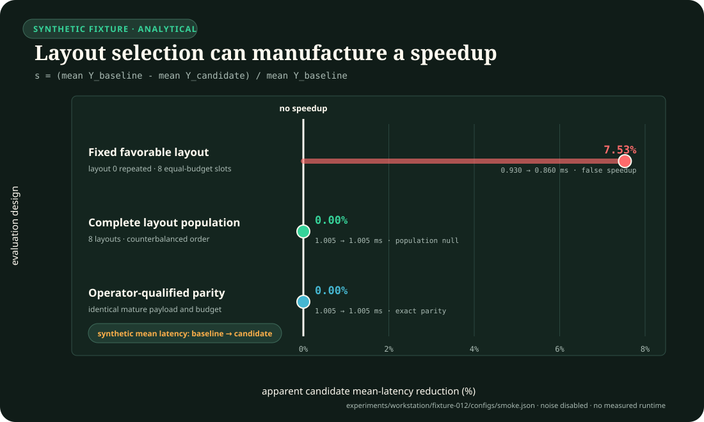

# Fixture F-012 — Layout-randomized performance inference

- **Status:** hostile synthetic benchmark; validated smoke plumbing only
- **Executable slice:**
  [layout-population inference harness](../workstation/fixture-012/README.md)
- **Evidence source:** [C-1407](../../research/claims.md#c-1407) and its
  compiler/performance-measurement sources
- **Authority:** no development or smoke output is a scientific result

## Question or hypothesis

Can a performance procedure distinguish a genuine variant effect from a
variant-by-layout interaction? The diagnostic hypothesis is deliberately
negative: when the population-average true effect is zero, repeated timing of
one favorable executable layout should report a false speedup, while a complete
randomized and counterbalanced layout-population analysis should reject it.

The operator-qualified arm receives the identical randomized observation
payload and componentwise budget as the strongest mature null. It must match
that null exactly. Any advantage is evidence of leakage or comparator
asymmetry, not a success.

## System and scenario family

Each independent unit is a `seed × study` layout population. A deterministic
generator creates an even number of layouts, paired baseline/candidate
invocations, repeat measurements, layout offsets, variant-by-layout
interactions, process noise, repeat noise, and an order carryover. Latency is
recorded in nanoseconds. The latent population effect is fixed at zero:

$$
\mathbb{E}_{L}\!\left[\tau_L\right]=0,
\qquad
Y_{sLirv}=\mu+\alpha_L+\mathbb{1}[v=c]\tau_L+\kappa p+\epsilon_{sLirv},
$$

where $Y$ and $\mu$ are in `ns`, $\alpha_L$ is the layout offset in `ns`,
$\tau_L$ is the candidate interaction in `ns`, $p\in\{0,1\}$ is run position,
$\kappa$ is carryover in `ns`, and $\epsilon$ is synthetic timing noise in
`ns`. The fixed-layout control repeatedly samples favorable layout zero and
always runs the candidate first. The mature arms sample every configured
layout and counterbalance order.

This is a measurement-inference fixture. It does not execute a compiler,
relink binaries, or measure wall-clock latency on physical hardware.

## Arms and strongest nulls

1. `fixed-layout-negative-control` repeats one favorable layout and applies a
   naive candidate-minus-baseline mean. It must expose the fixture's ability to
   manufacture a spurious speedup.
2. `mature-randomized-counterbalanced` is the decisive null. It samples the
   complete declared layout population, blocks by independent study, and
   counterbalances baseline/candidate order.
3. `operator-qualified-randomized` receives byte-identical observation content
   and the same estimand, replication, work, and modeled-energy budget as arm 2.
   Exact metric parity is required.

No oracle is needed because the generator records the zero population truth.
That truth is available to the evaluator only and cannot alter any arm.

## Equal budget and cost boundary

All three arms receive the same number of studies, layout slots, invocations,
repeats, and variant observations. Every observation is charged the same
modeled work units and modeled joules. The mature and operator-qualified arms
also share the exact latency payload. The ledger checks equality of:

1. observation count;
2. modeled work units;
3. modeled energy in joules;
4. layout-population support and order balance; and
5. causally available observation content.

The energy field is a synthetic accounting coefficient, not a meter reading.
`measured_energy_present`, `claim_eligible`, and `scientific_result` remain
false. A physical campaign would additionally need rebuild, launch, thermal,
frequency, machine, operating-system, compiler, workload, and external-meter
boundaries.

## Measurements and units

The raw append-only JSONL ledger retains latency (`ns`), modeled work
(`work-unit`), modeled energy (`J`), seed, study, layout, invocation, repeat,
variant, run position, estimand, setup policy, sequence, and SHA-256 chain.
Its `true_population_effect_fraction` is the complete-layout estimand, not the
conditional effect of the deliberately favorable layout-zero control.
Analysis reports:

- study-level candidate-minus-baseline fractional effects (`1`);
- apparent speedup fraction (`1`);
- cluster standard error across independent studies (`1`);
- a two-sided normal 95% interval (`1`);
- layouts represented per study (count);
- first-position observations by variant (count); and
- total observations, modeled work, and modeled energy (`J`) by arm.

For randomized arm $a$, the study effect is the ratio of aggregate means over
the complete equally weighted layout population, and the across-study estimate
is

$$
d_s^{(a)}=
\frac{|\mathcal L_s|^{-1}\sum_{L\in\mathcal L_s}\bar Y_{sL,c}
-|\mathcal L_s|^{-1}\sum_{L\in\mathcal L_s}\bar Y_{sL,b}}
{|\mathcal L_s|^{-1}\sum_{L\in\mathcal L_s}\bar Y_{sL,b}},
\qquad
\hat\theta_a=\frac{1}{S}\sum_{s=1}^{S}d_s^{(a)},
$$

where $S$ is the number of seed–study units and $\mathcal L_s$ is the complete
layout set for study $s$. Repeats are not treated as independent studies.
With synthetic noise disabled, the configured layout offsets are mean-zero,
the additive candidate interactions cancel exactly, and counterbalanced order
gives $d_s^{(a)}=0$ exactly. With noise enabled, the finite development sample
need not equal zero even though the generating population effect is zero.

The noise-free analytical fixture plot makes the selection effect visible: it
compares the favorable fixed-layout control with the complete layout population
and its operator-qualified copy.
The plotted means are generated from the smoke configuration with synthetic
process and repeat noise set to zero; they are not hardware measurements.

## Required ablations and interventions

1. Hold the true population effect at exactly zero while alternating the layout
   interaction sign.
2. Remove layout randomization by repeatedly selecting favorable layout zero.
3. Remove order counterbalancing in that negative control.
4. Restore the complete layout population and counterbalanced order in the
   mature null.
5. Clone the mature observation path and budgets into the operator-qualified
   arm to test exact parity.
6. Corrupt a recorded value without recomputing its digest; analysis must stop.
7. Replay or append an already signed event; sequence or chain validation must
   stop.
8. Alter a stored summary to claim scientific authority; validation must stop.

## Analysis and statistical plan

The configuration, visible development seeds, estimand, effect threshold, null
tolerance, and all checks are frozen in repository files. Analysis rereads and
validates every event, recomputes all aggregates from raw data, forms a ratio of
aggregate variant means over the complete equally represented layout set, and
clusters uncertainty at the seed–study level. No row is deleted as an outlier.

The diagnostic speedup threshold is 0.02 and the randomized-null tolerance is
0.01 in fractional units. The fixed control passes only if its complete 95%
interval is faster than the threshold. The mature null passes only if its point
estimate remains within the null tolerance and its decision is
`no-detectable-effect`. Exact canonical equality, not a tolerance, governs the
mature/operator comparison.

The visible development profile has 4 seeds × 12 studies × 16 layouts × 3
invocations × 2 repeats × 2 variants = 9,216 observations per arm and 27,648
raw events overall. Confirmation and held-out seeds remain pending; therefore
the normal interval is only a deterministic diagnostic, not confirmatory
inference.

## Promotion and rejection rules

The smoke diagnostic passes only when all nine registered checks pass:

1. the fixed-layout control exposes a false speedup;
2. the mature randomized null rejects that speedup;
3. mature and operator-qualified metrics match exactly;
4. their observation payload digests match exactly;
5. observation budgets are equal;
6. modeled-work budgets are equal;
7. modeled-energy budgets are equal;
8. randomized layout support is complete and order is counterbalanced; and
9. zero truth and the no-authority boundary remain intact.

Any failed check returns a nonzero result and rejects the executable slice.
Workstation promotion remains blocked until the implementation and analysis are
frozen, disjoint confirmation and held-out seed packs are committed and
revealed under the repository procedure, a real layout-randomization adapter is
implemented, independent hardware replication is run, and measured energy has
calibrated external provenance. Smoke or development output cannot promote
[C-1407](../../research/claims.md#c-1407).

## Executable smoke slice and limits

The [runner](../workstation/fixture-012/README.md) implements `prepare`,
`smoke`, `run`, `analyze`, and `validate`; the manifest scopes execution to
C-1407. It uses a versioned runtime validator, exclusive raw-ledger creation,
per-event SHA-256 chaining, deterministic development generation, recomputed
analysis, and hostile corruption tests.

The fixture proves that this code detects its constructed bias. It does not
estimate how often layout bias occurs, its magnitude on a real toolchain, or
the performance of any AI model or system.
