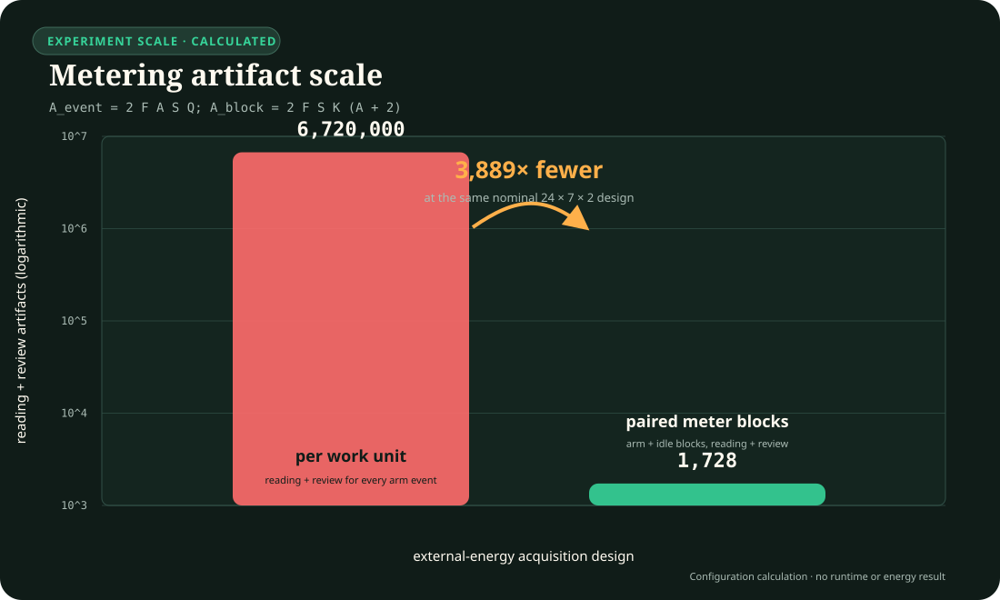

# Candidate 010 workstation harness

This is the first executable layer of
[Candidate 010](../../candidates/010-reset-coupled-staged-verification.md).
It is deliberately **smoke-ready, not workstation-ready**.

The current harness provides:

1. deterministic correlated cheap evidence plus a verifier constructed only by
   temporary execution; non-oracle policies receive neither the latent truth nor
   the trace-construction job;
2. all seven original eligible arms, a trace-withholding ablation, and the
   ineligible oracle ceiling;
3. a correlation-conditioned sequential-test baseline;
4. the same real filesystem stage, temporary-execution, and commit/reset
   boundary for every arm, with boundary timing and byte counts; every modeled
   arm is also charged the temporary-execution term whether or not its policy
   receives the trace;
5. append-only raw opportunity-by-arm events and deterministic
   declared-checkpoint resume rebuilt from that ledger rather than a mutable
   record counter;
6. a checkpoint identity bound to the configuration, ordered seed pack, and
   work schedule, with mismatch, duplicate, corruption, and truncated-tail
   rejection; complete ledger records and checkpoint replacements request file
   `fsync`, while directory-entry persistence and arbitrary power-loss recovery
   remain outside the claim;
7. a byte-exact source bundle covering the generator, policies, trace job,
   adapters, runner, analysis, release validator, configs, lockfile, an
   immutable execution-manifest projection, every registered test, its golden
   fixture, and exact source-commit provenance. Mutable readiness state and
   result locations are kept outside that projection, while changes to code,
   tests, schemas, dependencies, commands, or claim scope change the identity;
   deterministic discovery rejects unlisted production modules, unregistered
   tests, unclassified files, symlinks, and production or test imports outside
   the frozen closure;
8. a version-3 frozen-release contract that derives confirmation authority only
   after separate binding/source roots, source, execution-capsule descriptor,
   exact runtime identity, config, design, registry, preregistration, seed
   commitment, reveal, and cross-partition disjointness all verify; no real
   release exists yet;
9. separate modeled and measured energy paths: external wall/rail readings need
   meter, calibration, interval, clock, boundary, uncertainty, and integrity
   records; fixtures and software telemetry cannot become measured-energy
   evidence;
10. a bounded 48-scenario factorial contract, six registered comparator
   policies, equal-budget accounting, held-out task-family contracts, and a
   multiplicity-controlled confirmatory analyzer that refuses
   smoke/development claims; retry/rollback now executes and charges two real
   effect lifecycles whose observed filesystem snapshots are recomputed, while
   the independent-verifier arm uses a separately implemented detector whose
   lineage hashes are regenerated from its frozen input and output;
11. four common-interface effect boundaries: filesystem publication,
   hash-linked transactional KV, Ed25519-signed append-only publication, and a
   versioned local actuator simulator with physical actuation forbidden;
12. a complete 48-scenario implementation test that sends all six comparators and the
    candidate through every backend, exercises trace/reset ablations, checks
    paired budgets and rollback/commit proofs, and remains claim-ineligible;
13. deterministic scientific-payload hashes, a per-record SHA-256 hash chain,
   corruption detection, and a committed golden smoke/checkpoint digest;
14. a longitudinal diagnostic that drives transactional-KV and simulated-
    actuator instances through commit, reset, later commit, and stale-version
    refusal without recreating the service between operations, binds resume to
    the complete executable source identity, and revalidates the full durable
    history against the completed ledger;
15. an eight-case deterministic fault campaign covering reset leakage,
    incomplete rollback, precommit effects, delayed cleanup, stale or corrupt
    verification, failed finalization, and an irreversible-effect sentinel;
16. tests for generation, conditioning, trace revelation, rollback, commit,
    resume equivalence, seed sealing, energy rejection, budget parity,
    confirmatory abstention/kill rules, and smoke reproducibility; and
17. atomic, ownership-checked single-writer leases for factorial and persistent
    output roots, with contention rejected before mutation and no automatic
    stale-lock breaking; and
18. one executable raw-event contract shared by smoke and factorial writers,
    readers, analyzers, and validators; it rejects unknown top-level fields and
    recomputes identity, privilege, interval, finalization, byte-accounting,
    energy-separation, and nonphysical-boundary relations before use; and
19. three claim-ineligible bootstrap layers: an exact local Node/runtime and
    installed-production-dependency identity; an isolated capsule made only
    from clean regular blobs at the current Git `HEAD`; and an outer execution
    capsule that materializes only those dependencies into capsule-local
    `node_modules`; and
20. a fixed fresh-child protocol that requires an empty Node argument vector,
    an exact allowlisted environment, and verified executable, source,
    dependency, runtime, request, and entrypoint identities before dynamically
    importing Candidate code. Confirmation then runs, validates, and analyzes
    only inside a callback-scoped, nonserializable capsule capability; an
    interrupted invocation reuses the exact durable launch precommit; and
21. a parent-validated final launch receipt plus separate run-level setup
    accounting. Capsule construction, source/runtime/release verification,
    request bytes, and timings remain unallocated to arms; the inclusive child
    envelope is non-additive and the experiment action is subtracted rather
    than double-counted as setup;
22. a claim-ineligible external-energy block scheduler and importer that bind
    exact ordered input manifests, rotate and reverse arm order from frozen
    identities, preserve warm-up and idle observations separately, and reject
    unresolved, overlapping, duplicated, linked, or unreviewed meter records;
23. a deterministic confirmation preflight that treats the seed as the
    independent unit, derives the powered seed requirement from hashed pilot
    variance and endpoint effects, projects record/block/time/byte/file/disk
    demand, rejects per-event metering, and never creates or reveals seeds; and
24. a commitment-only seed-release operator that jointly generates disjoint
    confirmation and held-out packs, publishes only commitments and frozen
    identities, and keeps the seed values in separate AES-256-GCM escrow until
    an explicit source/runtime/capsule-matched reveal. Injected fixture entropy
    is permanently claim-ineligible;
25. a claim-ineligible paired-block executor that consumes the frozen schedule,
    sends the exact ordered opportunities through a fixture-only adapter,
    persists complete immutable block prefixes, and resumes only at block
    boundaries without inventing external-meter observations;
26. a seed-level energy analyzer that joins those execution outcomes to the
    reviewed acquisition bundle, aggregates repetitions and scenarios inside
    each seed, refuses zero correct-commit denominators or invalid metrology,
    and performs paired inference across seeds rather than blocks; and
27. a fixture-only release-v4 envelope that binds the v3 source authority,
    seed-operator plan and reveal attestation, powered preflight, held-out pack,
    paired acquisition policy, and exact energy schedule without minting
    confirmation or promotion authority.

Run:

```powershell
npm run workstation:candidate-010 -- prepare --profile smoke
npm run workstation:candidate-010 -- smoke --profile smoke
npm run workstation:candidate-010 -- factorial --profile development --splits development --output <run-directory>
npm run workstation:candidate-010 -- factorial --profile development --splits development --output <run-directory> --resume true
npm run workstation:candidate-010 -- analyze --output <run-directory>
npm run workstation:candidate-010 -- validate --output <run-directory>
npm run test:workstation
```

After a real version-3 release exists, the only confirmation entrypoint is:

```powershell
node experiments/workstation/candidate-010/runner.mjs capsule-confirmation --release-root <release-root> --release <release.json> --disjoint-with <development-pack.json>,<held-out-pack.json> --output <run-directory>
```

`--release` and every comma-separated `--disjoint-with` path are relative to
the explicit release root. An interrupted declared-boundary run is retried with
the same arguments plus `--resume true`. The operator refuses `--profile`, raw
seeds, legacy release roots, unknown options, and in-process confirmation.

The existing per-work-unit promotion path remains useful for adversarial
plumbing tests. It is not the real metering path selected by
[Decision 0011](../../../decisions/0011-measure-energy-in-paired-blocks.md):

```powershell
node experiments/workstation/candidate-010/runner.mjs capsule-promotion-build --run-directory <run-directory> --release-root <release-root> --release <release.json> --energy-assignments <energy-assignments.json> --disjoint-seed-packs <held-out-pack.json> --capsule-parent <existing-temporary-parent> --evidence-output <new-promotion-directory>/evidence.json --receipt-output <new-promotion-directory>/promotion-validation.launch-receipt.json
```

The builder refuses an existing target directory. A later readiness check does
not trust those two files alone: it reconstructs the release-bound historical
capsule and recomputes the evidence under a new live capability.

Generated runs are ignored under `experiments/workstation/runs/`. Each run
retains raw JSONL events, the exact config and seeds, environment identity, a
scientific digest, checkpoint identity, filesystem effects, optional raw and
normalized external-meter provenance, and a derived summary. The
[`energy-reading.template.json`](energy-reading.template.json) is intentionally
invalid until real meter, calibration, interval, uncertainty, and readings are
entered. A single whole-run reading can exercise the non-factorial plumbing but
is rejected for the interleaved factorial package because it cannot be assigned
to arms without a declared interval design.

## Why external energy is now measured in blocks

The nominal confirmation shape has 24 scenarios, seven arms, 10,000
opportunities per seed, and at least two seeds. Per-work-unit metering would
therefore demand 3,360,000 readings and the same number of review records. The
current two-repetition block design needs 864 observed arm/idle blocks, or 1,728
reading-plus-review artifacts. That is a configuration calculation, not a
runtime or energy result.



Editable assumptions: [`core-models.json`](../../../assets/plots/core-models.json).
The block importer still leaves every bundle claim-ineligible. A successor
analyzer now implements the required aggregation: blocks and scenarios collapse
inside each seed before paired seed-level inference. It still cannot open the
energy gate without a real calibrated acquisition, frozen non-fixture release,
and the existing promotion authority chain.

## Current structural gate state: 6/9

The structural gates currently pass exact claim scope, frozen-profile hash,
the complete factorial implementation test, corruption-evident ledger
integration with declared-boundary resume tests, and external-meter provider
capability.
They still fail confirmation seeds, held-out seeds, and the final readiness
declaration with validated hardware evidence.

This is deliberate. Seed packs will be freshly generated and sealed only after
the runner, task backends, block analysis, powered seed plan, resource
preflight, and target-meter contract are frozen.
Seeds that were visible during implementation are ineligible for confirmation.
The release validator and encrypted seed escrow operator are executable, but
the repository deliberately contains no real confirmation commitment, escrow,
release document, or revealed seed pack.

## Exact implementation limits

- The factorial runner gives every opportunity–arm work unit a fresh isolated
  effect root. A separate longitudinal diagnostic now exercises persistent
  transactional-KV and actuator history, including stale-version refusal and
  recovery from a declared interruption after backend finalization and the
  pending-receipt destination-file `fsync`, but before ledger append. The
  main factorial does not yet test concurrent shared-service contention.
  Concurrent writers are refused rather than used as an experimental factor.
- Ledger appends, checkpoints, persistent run identity, pending receipts, and
  final run metadata request temp-file and destination-file `fsync`; a
  truncated final record fails closed. Derived orphan temporaries may be rebuilt
  only from the authoritative ledger and state, while orphan identity or receipt
  temporaries are preserved and refused. This does not establish directory-entry
  persistence, recovery by truncating a torn tail, or safety under arbitrary
  process, filesystem, or power-loss crashes.
- The source bundle binds direct selected repository bytes, an immutable
  execution-manifest projection, and the exact execution commit. The mutable
  registry manifest may later change only readiness, promotion status, and
  result locations without changing that projection. Promotion reconstructs
  the release-bound historical commit and also requires the current scoped
  source hash to match, so a metadata-only follow-up commit is admissible but a
  code, test, schema, dependency, or claim-contract substitution is not.
  Runtime identity, immutable source capsule, dependency-local execution
  capsule, and fixed child now compose into a freshly spawned process with
  pre/post verification. Confirmation mode refuses the ordinary worktree path
  and requires the live capsule capability plus a version-3 release binding the
  same source, descriptor, runtime, dependencies, config, design, and seed
  authority. This closes the ordinary loaded-ESM-versus-later-hash gap under the
  declared local filesystem/process assumptions. The child rejects loaders,
  preloads, inspector arguments, and unbound environment entries, but this does
  not provide hostile-kernel or hostile-same-user isolation or prevent a
  transient malicious mutation restored between checks.
- Retry/rollback and independent verification now have distinct executable
  mechanics. They remain local synthetic comparators rather than evidence that
  either mechanism is independent or effective in a deployed system.
- The eight-case fault campaign actively produces and detects declared failure
  modes, but it is a separate nonphysical diagnostic rather than a factorial or
  external failure-rate result. Zero violations in ordinary implementation
  scenarios still establish plumbing behavior only.
- The strict release validator, fresh-child confirmation and resume paths, and
  atomic promotion-evidence builder exist, but no real frozen confirmation or
  held-out release and no validated promotion evidence bundle exist.
- No interval-owned calibrated energy observation has been collected or bound
  to factorial assignments. The provider, paired-block schedule/importer,
  fixture block executor, preflight, and seed-level block analyzer validate the
  complete data-shape and aggregation path only. The production confirmation
  command and promotion-evidence builder still use the older per-work-unit
  resource path; moving them onto the release-v4 block bundle remains required
  before a real block-measured run.
- The seed-release operator has no built-in key custodian, witness, password
  manager, or hardware security module. It accepts an external 32-byte key and
  never persists it. Key custody and the reveal ceremony must be selected and
  recorded before a real commitment is created.

## Why this does not yet count as an experiment result

The smoke profile contains only 64 paired opportunities. Its coefficient and
threshold values exercise the pipeline; they are not frozen confirmatory
choices. Confirmation and held-out seed files contain no disclosed seeds or
commitment yet. The four implemented task families are local, synthetic effect
boundaries; their passing tests establish executable contracts, not external
validity. The persistent-service and injected-fault tracks likewise test
declared local invariants, not superiority or field reliability. No calibrated
hardware reading has been collected, and a whole-run
reading cannot be silently allocated to interleaved arms. The synthetic trace
generator is not evidence that a real temporary action exposes useful
information. The 48-scenario run is therefore an implementation and
falsification diagnostic, not a superiority result.

The manifest limits this execution track to primary claim `C-170`. Even after a
future workstation-ready promotion, the other claims linked to Candidate 010
remain protocol-only unless a manifest names and implements their own execution
tracks.

The next promotion step is therefore not seed generation or a label change.
First run a target-hardware development pilot with a real calibrated meter,
freeze the powered preflight from those pilot measurements, migrate the
confirmation/promotion entrypoint to the release-v4 block bundle, and complete
a scaled claim-ineligible rehearsal. Only then seal genuinely unseen
confirmation and held-out commitments, create the real release, execute the
fixed paired blocks, and build the validated confirmation bundle. Only that
completed chain may change the manifest from
`smoke-ready` to `workstation-ready` and upgrade claim coverage.
