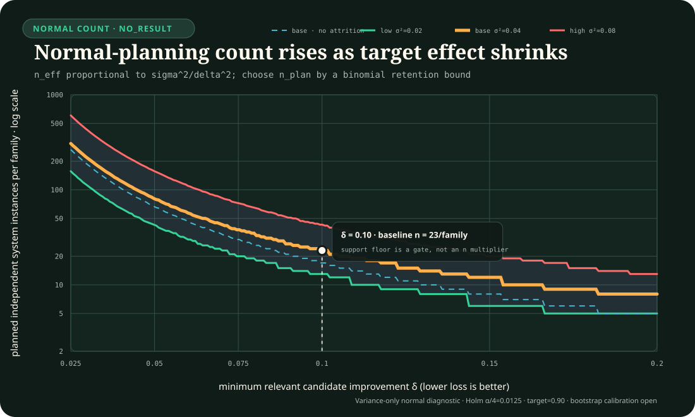
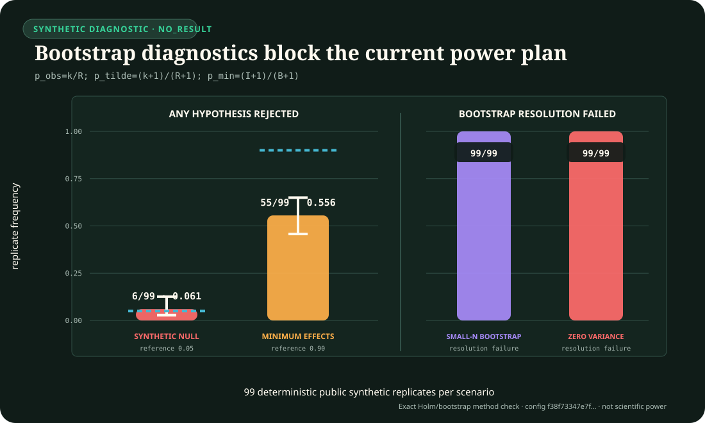

# Fixture 026 public-development CPU smoke harness

This directory contains a deterministic CPU-only plumbing harness for the
`RSD-T01` / `C-1540` slice of Fixture F-026. It validates the exact
generator-family × history grid and evaluator-only trace-fact vector
construction, then exercises two legacy generator-family diagnostics over
response shapes that endpoint and peak summaries deliberately conflate.
The bounded `RSD-T02` mechanism-conformance slice is connected to the runner.
Its source-shaped boundary-layer floor foundation remains isolated and
non-executable. Neither stratum has result authority.

Every event and every successful command response is labelled `NO_RESULT`.
This is not the registered RSD-T01 primary experiment, a comparison of trained
arms, or evidence for a scientific, performance, complete-work, or energy
claim.

## Synthetic scope

Each public seed contains an exact Cartesian grid of five constructed generator
families by four history families, for 20 valid cells:

1. an exact paired-trajectory match;
2. an approximate paired-trajectory match with frozen nonzero discrepancy;
3. an endpoint-return lookalike with two causal finite-memory windows;
4. a history-responsive causal trace and its fixed past-only delay, preserving
   peak amplitude while shifting latency and the time-indexed trajectory, not
   the intrinsic waveform; and
5. a static-ratio map with a frozen initial background.

This is a direct causal paired-trace fixture, not a collection of initialized
state-space systems and not a test of system-level symmetry across scales. The
generator-family labels name construction recipes, not mutually exclusive
scientific properties. After each probe response is frozen, the evaluator
records only trace-qualified facts: `paired_trajectory_match`,
`finite_horizon_endpoint_return`, `peak_amplitude_equal`,
`causal_memory_status: unassessed`, and `support_membership: inside`. The probes
do not predict that vector, so no property-performance score exists and the
fixture makes no structural memory claim.

Four additional malformed-record sentinels per seed are outside the
generator-family denominator and stop before accepted policy work. They cover
ordering, checksum, unit, and future-derived reference failures exactly once per
seed.

The two unequal-information probes retain their legacy `arm` event field but
are deliberately named diagnostics:

1. `full-trajectory-diagnostic` receives only `trace_valid` plus samples with
   `ordinal`, `time_s`, normalized `input_ratio`, `output_base_y`, and
   `output_scaled_y`;
2. `peak-endpoint-lookalike` receives only `trace_valid`,
   `peak_discrepancy`, and `endpoint_discrepancy`.

Their information and feature-construction work are not matched. Their
generator-family accuracy or counters therefore cannot support a comparative,
property-performance, or resource conclusion. The second probe exists only to
make registered lookalike collisions visible in the plumbing.

## Frozen score and firewall

For accepted samples, the evaluator computes

$$
D=\sqrt{\frac{\Delta t}{T}\left[
\frac{e_0^2+e_N^2}{2}+\sum_{k=1}^{N-1}e_k^2
\right]},\qquad
e_k=\frac{y_{p,k}-y_{1,k}}{s_y},
$$

with trapezoidal quadrature, `Δt = 0.02 s`, `T = 4 s`, and dimensionless
`s_y = 1`. Peak amplitude is the maximum absolute departure from each
trajectory's own prestimulus value, using the earliest sample on ties. Peak,
paired-final endpoint, final-0.5-second tail, and latency discrepancies remain
separate fields. The policy response freezes a generator-family label and an
estimate of `D` before the evaluator opens the family, semantic vector, and
evaluator `D`. Because the full probe receives both trajectories, its `D` is
directly computable; zero estimation error is conformance plumbing, not learned
symmetry.
Policy projections contain no seed, index, world ID, initialization ID, scale
factor, absolute background, checksum, provenance, parameter, unit, or
interface metadata.

This is a field and code-path firewall only. Because the development seeds,
generator, and generated trajectories are public and deterministic, it does
not establish information-theoretic blindness against an arm precomputed from
that public generator. A separately committed private confirmation partition
is the future epistemic boundary. Raw-event world and initialization hashes
are bookkeeping identifiers, not secrets, and never enter either policy view.

Inputs use normalized unit `U`; outputs are dimensionless log-ratio-like
signals with unit `1`. The declared positive floor is `0.05 U`. No hidden
epsilon is added. `band-limited-stochastic` is a seed-dependent random Fourier
realization with frozen harmonics 1--4, bounded random amplitudes and phases,
and an endpoint envelope. Its final 1.4 seconds are exactly flat, longer than
the largest 0.8-second finite-memory window. The same realized history drives
both scale members of a paired world. Endpoint-return traces compare the current
ratio only with samples 0.4 or 0.8 seconds in the past and apply the recorded
scaled-branch gain increment. Equal-peak delayed trajectories apply one recorded
common gain to a 0.6-second past window and then a fixed 0.3-second causal delay.
No earlier output uses a future sample or a full-horizon statistic.

The event parameter object is closed and family-qualified. Every record carries
the common background, scale factor, and input floor. The causal-reference
`tau` is non-null only for the exact, approximate, and malformed-sentinel
underlying traces. Approximate additive amplitude, endpoint gain increment and
two endpoint lags, and equal-peak common gain, memory lag, and delay have
distinct fields; every field not used by that generator family is explicitly
`null`.

## Accounting and non-energy boundary

For schema-valid accepted records, `serialized_policy_view_utf8_bytes` is the
exact UTF-8 byte length of `JSON.stringify(policyView)`, including
`trace_valid` and the observation.
The peak/endpoint arm reads exactly two exposed summary values.

`modeled_diagnostic_scalar_operations` is a frozen model, not an observed CPU
counter. For the full arm with $N$ samples and $M$ tail samples it is
$18N+4M+18$: $4N$ for the paired trajectory squared-error accumulation,
$8N$ for two static-fit squared-error accumulations, $6N$ for two absolute-
departure peak scans (subtraction, absolute value, and earliest-tie comparison),
$4M$ for the tail squared-error accumulation, and 18 fixed normalization,
endpoint, peak, latency, square-root, and decision operations. Here
$N=201$ and $M=26$. The summary arm uses a fixed worst-case model of three
numeric threshold comparisons: peak versus the approximate ceiling, endpoint
versus its tolerance, and peak versus its exact tolerance. Boolean OR, branch,
property-access, and control-flow operations are explicitly outside this
scalar model. These counts exclude transcendental-library implementation work
and are not timing, energy, or complete-work measurements.

Both probe classifiers retain zero persistent state across events.
`temporary_memory_measured` and `peak_memory_measured` are false; temporary
objects, live memory, allocator/runtime overhead, generator, validator,
evaluator, view hashing, precomputed-summary construction, wall time,
artifacts, tuning, fallback, maintenance, communication, and the full
registered resource vector remain unmeasured. `serialized_event_bytes_written`
alone is the exact UTF-8 JSONL line size. No counter is converted to joules and
no resource comparison is permitted.

The harness contains no meter path, GPU path, physical input, confirmation or
transfer seed, commitment, private custody, measured energy, or promotion
authority.

## Scientific-grid foundation

`scientific-grid.mjs` is an isolated prospective contract foundation. It
freezes ordered history × scale descriptors, multiple scale roles per shared
initialization, valid scientific hostile descriptors, the eight actionable arm
IDs, the evaluator-only oracle, and fail-closed system aggregation. It is not
called by the v2 runner and does not turn either diagnostic into a comparator.
The dimensionless cells are `2×` and `4×` as observed-development roles and
`8×` as a withheld-prospective role, each relative to the same `1×` reference.
All remain in the machine-readable `public-development` partition with
`information_cut_status: unregistered`; the eight unimplemented arms have no
current parity or ranking eligibility. Exact and approximate discrepancy
thresholds are contract constants, and aggregation requires one shared
initialization ID. Input-domain, transformation, instrument, initialization,
causal-observation, and evaluation-window support remain separate axes.

The current complete-trajectory packet remains a conformance-and-cost input. A
predictive arm comparison stays blocked until a separate protocol freezes the
information cut—such as a withheld suffix, scale cell, or intervention—and the
evaluator target visible only after response freeze. Public descriptor roles do
not create a private confirmation partition.

## RSD-T02 interventional mechanism-equivalence construction runtime

`rsd-t02-contract.mjs`, `rsd-t02-models.mjs`, and `rsd-t02-floor.mjs` freeze a
public-development foundation for two distinct strata. The checked-in
T02-MECH generator, evaluator, event contract and runner execute only the first:

1. `T02-MECH` gives five initialized two-state construction recipes the same
   canonical fold-step trajectory, then separates generator provenance from a
   scored four-property vector and exact input-output equivalence classes.
2. `T02-FLOOR` freezes a source-shaped singular perturbation check over 105
   model × epsilon × scale cells. Its primary discrepancy is the fast-layer
   supremum norm; integrated RMS remains diagnostic because it can vanish while
   the instantaneous discrepancy stays finite.

The mechanism panel contains 26 fixed episodes across canonical steps,
repeated pulses, ramps, opaque-state resets and freezes, one reported-output
clamp, interrupted holds, and same- versus cross-channel restimulation. Three
observation regimes distinguish a mandatory matched-step abstention baseline,
the fixed full panel, and a six-query active-design ceiling. Nine actionable
arm IDs remain parity- and ranking-ineligible; `O-GRAPH` is evaluator-only. An
additive whole-system stage now activates all nine only as fixed
public-development policy-conformance references. The Stage-2b raw,
normalization, log-ratio, difference, streaming and dual-consensus policies use
frozen public-construction bands; they are not trained estimators, calibrated
posteriors or mature nulls.
Pair certificates describe one analytic isomorphism and nine numerically
refined public-development constructions under their frozen schedules, not
scientific results.

The O0 registry count is per conditioned model instance: three background
steps and 4,611 rows for each $\tau_*$, crossed over $0.5$, $1$, and $2$ seconds
by the runtime for nine executions and 13,833 rows per recipe. O1 is exactly 26
episodes and 39,962 rows per recipe at $\tau_*=1$ second.

The square-pulse episodes do not instantiate the Rahi-style refractory or
period-skipping signature: the v1 feedback nonlinearity vanishes at both pulse
levels. C-1561 is therefore excluded from the base event runtime. The separate
`rsd-t02-pulse.mjs` module now implements a bounded six-world construction
layer with adaptive exact-edge integration, support gates, response/count/
latency extraction, recurrence through $q=5$, refractory search and typed
costs. Its checked cell and diagnostics remain evaluator-side
public-development constructions, not results of the base runner.
The companion `rsd-t02-pulse-panel-runner.mjs` freezes a separate 229-unit
append-only schedule and exposes zero-work preparation plus bounded resume. It
does not make the pulse subtrack part of the base T02-MECH event stream.

T02-MECH now has a deterministic bounded construction/conformance runtime: 175
events per selected seed, a closed actionable projection and response commit,
independent `O-GRAPH` evaluation, typed costs, append-only hash-chain resume,
exact pair matrices and recomputed analysis. The hashed profile deliberately
uses one public seed for smoke and two of 64 for bounded development
conformance; it is not the full development pack. Before any evaluator-bearing
event is generated, all 35 projections (53,795 rows) for each seed × system are
hashed, delivered identically to all nine active policies, and committed with
their ordered whole-system responses. Responses retain a
joint compatible property-vector set and three separate work ledgers: shared
acquisition, policy construction/prior, and actual inference. Every numerical
band is construction-tuned on the five public worlds, with zero labels and zero
tuning trials. Actual work is not padded to the identical common caps.
Each packet executes in a fresh permission-restricted Node child and one new
hardened VM context loaded from a verified SHA-named nine-policy bundle. One canonical LF request crosses the boundary; the
policy VM receives no process, filesystem, network, environment, clock, random
or evaluator capability. Bounded failures become ordered pre-evaluator
abstentions with no retry or same-process fallback. The canonical
`rsd-t02-arm-abstention.json` is atomically persisted and replay-bound, and it
cannot coexist with an arm commitment or evaluator ledger. This remains a
checked-in public-development conformance reference, not secret confirmation
custody.
C-1561 and C-1564 are excluded from the base event stream, and every artifact
is `NO_RESULT`. The separate C-1561 panel runner has not executed its full
refractory, robustness or mixed-window schedule. No mature null or
runner-integrated trained or calibrated estimator, comparison, execution
claim, confirmation custody, promotion path, O2 runtime, T02-FLOOR runtime,
asymptotic result, workstation measurement or energy result exists. The
additive level-two prototypes documented below do not change that boundary.
RSD-T01 remains the only claim-scoped implemented track.

## Commands

From the repository root:

```powershell
npm run test:workstation:fixture-026:foundations
npm run test:workstation:fixture-026:execution-v52
node experiments/workstation/fixture-026/build-rsd-t02-policy-bundle.mjs --check
node experiments/workstation/fixture-026/build-rsd-t02-fixed-instance-conformance-policy.mjs --check
node experiments/workstation/fixture-026/runner.mjs prepare --profile smoke
node experiments/workstation/fixture-026/runner.mjs smoke --profile smoke --output experiments/workstation/runs/fixture-026-smoke --resume false
node experiments/workstation/fixture-026/runner.mjs run --profile development --output experiments/workstation/runs/fixture-026-development --resume false
node experiments/workstation/fixture-026/runner.mjs analyze --output experiments/workstation/runs/fixture-026-development
node experiments/workstation/fixture-026/runner.mjs validate --output experiments/workstation/runs/fixture-026-development
node --test experiments/workstation/fixture-026/rsd-t02-pulse.test.mjs
node --test experiments/workstation/fixture-026/rsd-t02-pulse-panel-runner.test.mjs
node --test experiments/workstation/fixture-026/rsd-t02-stage3-design.test.mjs
node --test --experimental-test-isolation=none experiments/workstation/fixture-026/rsd-t02-isolated-policy.test.mjs
node --test --experimental-test-isolation=none experiments/workstation/fixture-026/build-rsd-t02-policy-bundle.test.mjs
node --test --experimental-test-isolation=none experiments/workstation/fixture-026/rsd-t02-transform-policies.test.mjs
node --test --experimental-test-isolation=none experiments/workstation/fixture-026/rsd-t02-population-contract.test.mjs
node --test --experimental-test-isolation=none experiments/workstation/fixture-026/rsd-t02-system-family-generator.test.mjs
node --test --experimental-test-isolation=none experiments/workstation/fixture-026/rsd-t02-null-maturation-contract.test.mjs
node experiments/workstation/fixture-026/rsd-t02-fixed-instance-runner.test.mjs
node experiments/workstation/fixture-026/rsd-t02-null-prototypes.test.mjs
node experiments/workstation/fixture-026/rsd-t02-null-prototype-adapter.test.mjs
node experiments/workstation/fixture-026/rsd-t02-holm4.test.mjs
node experiments/workstation/fixture-026/rsd-t02-power-plan.test.mjs

node experiments/workstation/fixture-026/runner.mjs t02-prepare --profile smoke
node experiments/workstation/fixture-026/runner.mjs t02-smoke --profile smoke --output experiments/workstation/runs/fixture-026-t02-smoke --resume false
node experiments/workstation/fixture-026/runner.mjs t02-run --profile development --output experiments/workstation/runs/fixture-026-t02-development --resume false
node experiments/workstation/fixture-026/runner.mjs t02-analyze --output experiments/workstation/runs/fixture-026-t02-development
node experiments/workstation/fixture-026/runner.mjs t02-validate --output experiments/workstation/runs/fixture-026-t02-development
```

Focused tests:

```powershell
node --test --experimental-test-isolation=none experiments/workstation/fixture-026/contract.test.mjs experiments/workstation/fixture-026/runner.test.mjs experiments/workstation/fixture-026/scientific-grid.test.mjs experiments/workstation/fixture-026/rsd-t02-contract.test.mjs experiments/workstation/fixture-026/rsd-t02-models.test.mjs experiments/workstation/fixture-026/rsd-t02-floor.test.mjs experiments/workstation/fixture-026/rsd-t02-generator.test.mjs experiments/workstation/fixture-026/rsd-t02-evaluator.test.mjs experiments/workstation/fixture-026/rsd-t02-event.test.mjs experiments/workstation/fixture-026/rsd-t02-arm-bank.test.mjs experiments/workstation/fixture-026/rsd-t02-runner.test.mjs
```

## Integrity

Raw events are canonical LF-only newline-delimited JSON in an append-only
SHA-256 chain. An ownership-checked exclusive output lease rejects concurrent
writers and is never automatically broken. Symlink, junction, reparse-point
and resolved-path escapes are rejected before output mutation. CRLF, blank
lines, and multiple terminal newlines are rejected.
The separate `rsd-t02-arm-commitment.json` is created from the full ordered
packet grid before the raw ledger is opened. Once any evaluator-bearing raw,
checkpoint or run state exists, a missing commitment cannot be reconstructed;
resume instead fails closed. The run document binds both its semantic
commitment hash and exact file hash. New commitment creation is exclusive,
flushes file data and metadata before proceeding, and requests a parent-
directory sync where the platform exposes one. Policy source hash and byte
count come from the same immutable in-memory read. Seed and configuration JSON
are parsed from the exact byte buffers that supply their recorded hashes and
sizes.
If the isolated policy boundary abstains first, the runner instead publishes a
closed-schema, self-hashed `rsd-t02-arm-abstention.json` through a pending-file,
file flush and atomic same-directory link, then requests parent-directory sync
where the platform permits it. Windows can reject directory-handle `fsync`, so
that directory sync is best-effort there; artifact-file synchronization and
atomic publication remain enforced. A repeated invocation revalidates and
replays the exact artifact; replacement, disappearance, mutation or coexistence
with evaluator-bearing state fails closed.

The active policy computation no longer relies on the parent process's
statically imported policy helpers: it loads a checked-in content-addressed
classic-script bundle in a fresh restricted child and binds the exact bundle,
worker, source inventory, request, packet, configuration and runtime identities
to its receipt. The parent still statically loads generator and evaluator
modules before fingerprinting their source files. Because the output lease
protects the run directory rather than the repository source tree, concurrent
repository mutation across that parent-module load boundary can still separate
loaded generator/evaluator code from later file fingerprints. That residual is
outside this public-development authority.

The isolated bank is authored in
[`rsd-t02-policy-bundle.source.js`](rsd-t02-policy-bundle.source.js) and
reproduced by
[`build-rsd-t02-policy-bundle.mjs`](build-rsd-t02-policy-bundle.mjs). The
checked-in inventory binds the exact SHA-named output and every source file.
Resume is reconstructed from the raw ledger, binds the profile and every frozen
source identity, requires the ledger to be an exact ordered prefix of the work
grid, semantically replays every prior record before deriving remaining work,
repairs a missing or stale derivable checkpoint before declaring a complete
run, and rejects torn tails, substitutions, and mutations. Checkpoint,
`run.json`, and nested run-ledger documents are exact-keyed and typed; the raw
and checkpoint paths and `NO_RESULT` interpretation are frozen. World and initialization IDs
are deterministic SHA-256 bookkeeping identifiers with no secrecy claim and
are excluded from policy inputs. Public seeds are canonical decimal strings in
the full unsigned 64-bit range, then encoded as exactly eight little-endian
bytes and domain-separated before custom generator seeding. Noncanonical forms
such as leading-zero strings are rejected. The exact generator is PCG-CM-DXSM
128/64: its 128-bit
state transition uses multiplier `0xda942042e4dd58b5`, and DXSM maps the
pre-transition state to 64 output bits. Initial state and odd increment are
derived directly from SHA-256. This custom seeding is not NumPy `SeedSequence`
compatible, so equal decimal labels do not promise NumPy-compatible streams.
Confirmation and transfer files are literal `not-created` records.

The original v1 smoke contract remains reproducible from Git commit
`3daf857df3452f54e3caacacabd1782fdd460a99`. Version 2 intentionally changes
the seed grammar, grid, generator, event schema, run identity, and analysis
identity; current-source validation therefore rejects v1 run directories
instead of silently reinterpreting them.

## Prospective Stage-3 cut

[`configs/rsd-t02-stage3-design.json`](configs/rsd-t02-stage3-design.json)
freezes the public 64-seed pack into disjoint 32/16/16 fit, calibration and
evaluation roles. It also freezes the permitted actions at each boundary, the
two generic-null targets, primary endpoint families, future Holm procedure,
resource requirements and promotion gates. The validator rejects overlap,
seed reordering, calibration refitting, evaluation threshold changes and any
attempt to promote the design out of `NO_RESULT`.

This is an access-control design, not an effective sample-size claim. Current
RSD-T02 seeds change only an opaque two-state handle permutation, so no
seed-level inference is allowed. The design becomes comparison-capable only
after independent system instances, an outer system-family holdout, trained
nulls, frozen numeric budgets and prospectively powered private confirmation
exist.

The sibling prospective population contract closes the next design boundary.
It treats structural lineage, system family and independently drawn fixed-
parameter instance as separate levels; a seed remains only a replay key. One
instance packet must keep its complete parameter vector—including the time
constant—fixed across all episodes. The existing 35-projection packet mixes
three O0 time constants with one O1 time constant and is therefore retained
only for construction conformance. Development, outer-confirmation and
outer-transfer families are lineage-disjoint, causal memory is non-primary
until a valid negative-memory lineage exists, and the four endpoint-by-
comparator hypotheses share one experiment-level Holm correction.

Machine-readable files:

- [`configs/rsd-t02-population-design.json`](configs/rsd-t02-population-design.json)
- [`rsd-t02-population-design.schema.json`](rsd-t02-population-design.schema.json)
- [`rsd-t02-population-contract.mjs`](rsd-t02-population-contract.mjs)
- [`rsd-t02-population-contract.test.mjs`](rsd-t02-population-contract.test.mjs)

## Public fixed-instance construction

The additive family-construction layer is deliberately separate from the
35-projection conformance runtime. It registers the five public equation
families and generates four deterministic conformance coordinates per family.
The HMAC-SHA-256 generator draws one exact integer time constant in
`[500000, 2000000] us` with rejection-before-modulo, binds the complete
  rational parameter vector, nuisance interface, property-certificate set and
  declared equation-template digest to the canonical system identity. The
  scientific registry projection excludes coverage, custody, packet and
  authority metadata; the full registry, population design and model source are
  separate provenance bindings. One metadata packet contains the 26 unique
  full-panel episodes at that same time constant, and its episode-protocol
  digest covers every schedule plus horizon, step, rate, bounds, units and
  interpreter semantics.

The resulting 20 artifacts test replay, identity and packet invariants. They
contain no trajectories or policy responses and are not a powered population
sample. The coverage audit counts structural lineages rather than draws or
recipe names. It currently fails four values: log-fold, feedback-present,
channel-local-present and memory-negative.

Machine-readable files:

- [`configs/rsd-t02-system-family-registry.json`](configs/rsd-t02-system-family-registry.json)
- [`rsd-t02-system-family-registry.schema.json`](rsd-t02-system-family-registry.schema.json)
- [`configs/rsd-t02-development-instance-plan.json`](configs/rsd-t02-development-instance-plan.json)
- [`rsd-t02-development-instance-plan.schema.json`](rsd-t02-development-instance-plan.schema.json)
- [`rsd-t02-generated-artifacts.schema.json`](rsd-t02-generated-artifacts.schema.json)
- [`rsd-t02-system-family-generator.mjs`](rsd-t02-system-family-generator.mjs)
- [`rsd-t02-system-family-generator.test.mjs`](rsd-t02-system-family-generator.test.mjs)

### Fixed-instance transcript and resource conformance

The additive fixed-instance runner validates one generated public-development
system instance, executes all 26 schedules at that instance's one exact
parameter vector, and emits 39,962 ordered transcript rows. The full transcript
receipts bind scientific identity, parameters, nuisance, property certificates,
episode protocol, schedule, realization and model-source provenance. A
separate causal policy view recursively excludes evaluator truth, family,
equation, lineage, instance, packet and provenance identifiers.

All nine registered arm slots receive the identical packet and causal-view
digest. Their response/resource records form an append-only SHA-256 chain,
charge shared acquisition once, preserve per-arm algorithmic counts, and turn
runtime or malformed responses into terminal charged abstentions without
retry. Partial object artifacts resume deterministically and retain the exact
prefix.

This base module is transcript and resource conformance, not actual policy
execution. Its only successful executor is an in-process built-in digest
abstention, and object resume is not durable. The separate overlay described
below adds a content-addressed restricted child and on-disk recovery without
changing the base artifact or granting comparison authority.

- [`configs/rsd-t02-fixed-instance-runner.json`](configs/rsd-t02-fixed-instance-runner.json)
- [`rsd-t02-fixed-instance-runner.schema.json`](rsd-t02-fixed-instance-runner.schema.json)
- [`rsd-t02-fixed-instance-runner.mjs`](rsd-t02-fixed-instance-runner.mjs)
- [`rsd-t02-fixed-instance-runner.test.mjs`](rsd-t02-fixed-instance-runner.test.mjs)

The ten focused tests establish the closed config and schema, single-parameter
26-schedule execution, 39,962-row causal view, recursive leakage exclusions,
same-packet arm parity, response/resource chaining, object-level resume,
tamper and reorder rejection, terminal failure accounting, malformed-input
closure and a bounded single-thread CPU path. They do not establish real policy
semantics, process isolation, durable recovery, measured resources,
comparison validity or scientific correctness of the registered families.

### Isolated policy replay and durable fixed-instance recovery

The additive isolated overlay binds the fixed packet to a content-addressed
26-projection policy bundle and starts one fresh restricted Node child. The
policy receives only the recursively allowlisted causal view. Filesystem write,
network, environment, clock, randomness, evaluator truth and dynamic code are
not exposed to policy code. The current policy returns deterministic
abstentions for all nine arm slots; it is a semantic boundary check, not an
implementation of the candidate or null estimators.

Each terminal arm record is synchronized into an exclusive owner-bound raw
JSONL ledger. Raw-ledger replay is authoritative over a missing or stale
checkpoint; torn, altered, foreign-owner, aliased-path, redirected-leaf and
oversized recovery inputs fail closed. Session operations are serialized so
append, checkpoint and close cannot race the lease. The exact raw leaf handle,
filesystem identity and expected byte length remain bound throughout the open
session. Lock release atomically retires the verified lock under a randomized
name and deliberately retains that retired artifact instead of risking a final
pathname-delete race; acquisition never auto-cleans retired locks. The contract
claims only the requested file-sync operations, not survival of arbitrary
storage or power-loss behavior.

- [`configs/rsd-t02-fixed-instance-isolated-durable.json`](configs/rsd-t02-fixed-instance-isolated-durable.json)
- [`rsd-t02-fixed-instance-conformance-policy.source.js`](rsd-t02-fixed-instance-conformance-policy.source.js)
- [`build-rsd-t02-fixed-instance-conformance-policy.mjs`](build-rsd-t02-fixed-instance-conformance-policy.mjs)
- [`rsd-t02-fixed-instance-conformance-policy-worker.mjs`](rsd-t02-fixed-instance-conformance-policy-worker.mjs)
- [`rsd-t02-fixed-instance-durable-store.mjs`](rsd-t02-fixed-instance-durable-store.mjs)
- [`rsd-t02-fixed-instance-durable-store.test.mjs`](rsd-t02-fixed-instance-durable-store.test.mjs)
- [`rsd-t02-run-lock.mjs`](rsd-t02-run-lock.mjs)
- [`rsd-t02-run-lock.test.mjs`](rsd-t02-run-lock.test.mjs)
- [`rsd-t02-fixed-instance-isolated-durable-runner.mjs`](rsd-t02-fixed-instance-isolated-durable-runner.mjs)
- [`rsd-t02-fixed-instance-isolated-durable-runner.schema.json`](rsd-t02-fixed-instance-isolated-durable-runner.schema.json)
- [`rsd-t02-fixed-instance-isolated-durable-runner.test.mjs`](rsd-t02-fixed-instance-isolated-durable-runner.test.mjs)

### Complete public-development population receipts

The population runner crosses all five registered development families with
all four conformance draw indices, deduplicates by canonical system-instance
identity, and processes the resulting 20 independent instances in frozen
draw-major/family-order sequence. The complete deterministic workload contains
520 episodes, 799,240 transcript rows and 180 arm invocations. Family weights
are exactly 1/5 and within-family instance weights are exactly 1/4, but those
weights remain design metadata because no endpoint aggregation executes.

The compact artifact retains hashes and workload receipts rather than full
causal views or fixed-run payloads. Every imported prefix is replay-verified
against the frozen design, registry, plan and fixed-runner inputs. Its hash
chain provides internal content/order integrity only; without an externally
retained head it cannot prove that a valid prefix was not rolled back.

- [`configs/rsd-t02-public-development-population-runner.json`](configs/rsd-t02-public-development-population-runner.json)
- [`rsd-t02-public-development-population-runner.schema.json`](rsd-t02-public-development-population-runner.schema.json)
- [`rsd-t02-public-development-population-runner.mjs`](rsd-t02-public-development-population-runner.mjs)
- [`rsd-t02-public-development-population-runner.test.mjs`](rsd-t02-public-development-population-runner.test.mjs)

### Integrated isolated durable population execution

The integrated runner composes the complete 20-instance traversal with the
restricted child and durable fixed-instance layer. Each canonical instance has
one identity-keyed directory and must reach a complete, current nine-arm
summary before one compact outer record can append. If a process stops after
finishing an instance but before that outer append, reopening validates the
completed directory and appends it exactly once. Reopening a completed panel
revalidates all 20 summaries and performs zero new scientific-unit work.

The outer raw ledger and checkpoint have bounded recovery, owner and filesystem
identity checks, one exclusive writer, and the same retained-lock retirement
rule as the fixed-instance layer. Tests cover a partial restart, the
post-instance/pre-outer crash window, a zero-remaining restart, foreign-owner
contention, replaced raw leaves, aliases, torn or altered records, oversized
inputs, and a checkpoint ahead of the raw ledger. The completed construction
contains 20 outer records, 20 instance directories, and 180 terminal arm
records. It contains no endpoints, causal payloads, trained policy results,
model comparison, or claim authority; every record remains `NO_RESULT`.

- [`configs/rsd-t02-public-development-isolated-durable-population.json`](configs/rsd-t02-public-development-isolated-durable-population.json)
- [`rsd-t02-public-development-isolated-durable-population-runner.mjs`](rsd-t02-public-development-isolated-durable-population-runner.mjs)
- [`rsd-t02-public-development-isolated-durable-population-runner.schema.json`](rsd-t02-public-development-isolated-durable-population-runner.schema.json)
- [`rsd-t02-public-development-isolated-durable-population-runner.test.mjs`](rsd-t02-public-development-isolated-durable-population-runner.test.mjs)

### Level-two null prototypes and post-validation adapter

Two separate modules now implement bounded deterministic learned prototypes:

- `B-STATE-SPACE` uses a three-state learned causal latent state-space core;
- `B-RECURRENT` uses a three-state compact GRU-style causal recurrence.

Both fit and emit the same drive-transform, reported-output-feedback and
channel-local-state property domains. Frozen seeds, parameter order, 48
finite-difference epochs, normalization, support envelopes, tie rules, model
hashes, and algorithmic work ledgers make same-environment replay explicit.
Outputs include normalized joint and marginal property probabilities,
identifiability probabilities, support status, and deterministic abstention.
They are level-two `trainable-public-prototype` artifacts, explicitly
uncalibrated and without comparison or claim authority. Wall time, peak memory
and energy are not measured.

The post-validation adapter first revalidates a fixed-instance source artifact,
copies every causal sample field into the prototype transcript schema, drops
schedule and identity/provenance material, binds the source run, causal view,
model and converted transcript by digest, and then runs one prototype over all
39,962 rows. It operates after source-run validation and is not installed in
the runner's executor. It therefore provides no fresh-process isolation and
does not replace the runner's built-in abstention ledger.

The eight prototype tests check deterministic fitting and replay, objective
decrease, normalized posterior coherence, the recursive causal allowlist,
bounded work, model integrity, support abstention and exact-threshold ties. The
tiny fit fixture contains eight constructed property combinations and six rows
per transcript; its at-least-two-thirds training-label check is not a held-out
generalization or calibration result. The six adapter tests check exact
39,962-row conversion, removal of schedule and identity material, source/model
bindings, deterministic replay, tamper refusal and honest limitation labels.
They do not establish mature-null status, isolated execution, calibration,
comparative performance or scientific identification.

- [`rsd-t02-null-prototypes.mjs`](rsd-t02-null-prototypes.mjs)
- [`rsd-t02-null-prototypes.test.mjs`](rsd-t02-null-prototypes.test.mjs)
- [`rsd-t02-null-prototype-adapter.mjs`](rsd-t02-null-prototype-adapter.mjs)
- [`rsd-t02-null-prototype-adapter.test.mjs`](rsd-t02-null-prototype-adapter.test.mjs)

The original `B-STATE-SPACE` and `B-RECURRENT` policies in the isolated
35-projection construction bundle remain level-one fixed conformance
references. The additive learned modules are separate level-two prototypes.
Only level five, `confirmation-frozen-mature-null`, satisfies the population
gate. The isolated parameterized runner gate is now satisfied by the
exact-bound 20-instance execution release. Incomplete primary lineage coverage,
absent sealed outer-family templates, absent instance-role assignment,
uncalibrated models and all later model-freeze, calibration, resource-audit and
comparison gates still block affected fitting and comparison.

The non-energy ledger therefore has five satisfied applicable gates and 15
open gates. Seven intrinsic null-maturity gates and three affected-fitting
blockers remain; mature-null, comparison and claim authority are false.

- [`configs/rsd-t02-parameterized-runner-release.json`](configs/rsd-t02-parameterized-runner-release.json)
- [`rsd-t02-parameterized-runner-release.schema.json`](rsd-t02-parameterized-runner-release.schema.json)
- [`configs/rsd-t02-null-maturation-design.json`](configs/rsd-t02-null-maturation-design.json)
- [`rsd-t02-null-maturation-design.schema.json`](rsd-t02-null-maturation-design.schema.json)
- [`rsd-t02-null-maturation-contract.mjs`](rsd-t02-null-maturation-contract.mjs)
- [`rsd-t02-null-maturation-contract.test.mjs`](rsd-t02-null-maturation-contract.test.mjs)

### Four-hypothesis Holm/bootstrap method check

The public analyzer registers exactly four candidate comparisons: property log
loss and dimensionless decision loss for `C-MECHANISM-BANK` against each of
`B-STATE-SPACE` and `B-RECURRENT`. It requires complete paired arm records for
each scientific system-instance identity, at least two effective instances per
registered fixed family, equal family weights, and registered in-denominator
penalties for runtime failures. Hash-identical replays collapse; conflicting
duplicates, missing arms, family drift and non-finite endpoints fail closed.

Each one-sided candidate-minus-comparator contrast uses a deterministic
SHA-256-indexed centered stratified bootstrap-$t$, followed by one
experiment-wide sequentially rejective Holm step-down family. For each
hypothesis, the analyzer exposes the attainable data-dependent floor

$$
p_{\min,h}=\frac{I_h+1}{B+1},
$$

where $I_h$ is the number of zero- or non-finite-standard-error resamples among
$B$ bootstrap draws. The resolution gate requires
$p_{\min,h}\le\alpha/4$ for all four hypotheses. The nine tests exercise Holm
ordering and ties, incomplete and malformed families, paired equal-family
calculations, duplicate handling, deterministic resampling and runtime-failure
penalties on synthetic records. A two-family-by-two-instance hostile panel
produces enough zero-standard-error resamples to fail that gate and block all
mathematical rejections.

This remains an unfrozen public method check. Family IDs, alpha, resample
count, resampling key and failure penalties are caller supplied; no endpoint
artifact, analysis release or information cut is frozen. The tests do not
establish independence, estimator validity, family-superpopulation inference,
powered error control for future data or confirmation evidence. Every report
remains `NO_RESULT`.

- [`rsd-t02-holm4.mjs`](rsd-t02-holm4.mjs)
- [`rsd-t02-holm4.test.mjs`](rsd-t02-holm4.test.mjs)

### Prospective power and retention planner

The prospective planner uses the conservative first Holm threshold
$\alpha/4$, an exposed normal approximation for the equal-weighted fixed-family
contrast, and the exact binomial lower tail to choose the smallest planned
count meeting an experiment-level retention assurance under registered
pre-response attrition. Runtime failures stay in the denominator at registered
penalties. Support coverage is a separate mandatory gate, not an unregistered
sample-size multiplier.

For $F$ fixed families, family variances $s_f^2$, and minimum relevant
improvement $\delta$, its variance-only retained-count diagnostic is

$$
n_{\mathrm{eff}}
=
\max\!\left\{
2,
\left\lceil
\frac{\sum_{f=1}^{F}s_f^2}{F^2}
\left(
\frac{z_{1-\alpha/4}+z_{1-\beta}}{\delta}
\right)^2
\right\rceil
\right\}.
$$



The seven tests check deterministic counts and units, approximate inverse-
square effect scaling, attrition inflation, separate coverage handling,
registered-maximum refusal, pseudo-replication and private-adaptation refusal,
normal-quantile accuracy, and exact stochastic retention assurance. They do
not validate pilot variances, freeze effect margins or a population count,
calibrate bootstrap power, prove the normal diagnostic adequate for the exact
analyzer, or establish achieved power.

The plot's three variance profiles, 90% target power, 10% pre-response
attrition and 95% retention assurance are illustrative sensitivity inputs.
They are not pilot estimates or frozen design choices. Its dashed cyan series
is the baseline-variance diagnostic without pre-response attrition. Per-
hypothesis values are explicitly named
`normal_approximation_power_diagnostic`, while
`bootstrap_power_calibrated=false`.

The planner can refuse a nominal Monte Carlo plus-one floor $1/(B+1)$ that is
already above $\alpha/4$; variance-only input cannot reveal the higher data-
dependent floor caused by zero-standard-error bootstrap resamples. It does not
claim to reject that future condition. Instead it keeps
`prospective_power_plan_passes=false` and `plan_freeze_permitted=false` pending
pilot-transcript simulation through the exact analyzer. Four authority
blockers remain: reviewed pilot-variance bytes and role, a release-bound
analysis hash, a joint freeze of effects/power/resampling/failure penalties,
and calibration against data-dependent bootstrap degeneracy.

- [`rsd-t02-power-plan.mjs`](rsd-t02-power-plan.mjs)
- [`rsd-t02-power-plan.test.mjs`](rsd-t02-power-plan.test.mjs)
- [`core-models.json`](../../../assets/plots/core-models.json)
- [`generate-plots.mjs`](../../../scripts/generate-plots.mjs)
- [`rsd-t02-power-effect-curve.svg`](../../../public/plots/rsd-t02-power-effect-curve.svg)

### Synthetic exact-analyzer calibration diagnostic

The additive pilot-transcript module samples declared four-dimensional paired
contrast distributions, applies pre-response attrition and registered runtime-
failure penalties, and invokes the exact existing bootstrap/Holm analyzer for
every synthetic transcript. Scenario roles are executable contracts: the null
requires zero contrasts and arm-symmetric failure probabilities; the
alternative requires a registered candidate improvement; and the degeneracy
hostiles bind their small-sample or zero-variance construction.

Scientific system IDs and transcript generation bind a DGP-only fingerprint of
the scenario, simulation key, registered family order, baselines, attrition,
failure probabilities, contrast means and covariances. Reporting confidence,
the total replicate ceiling, bootstrap count, alpha and endpoint penalties do
not rotate that scientific identity. The full configuration hash remains in
the transcript/report audit root, so report-control changes are visible without
changing a common generated replicate prefix or its analyzer point decision.

For $k$ events among $R$ simulation replicates, the reported plus-one point
diagnostic is

$$
\widetilde p_{\mathrm{MC}}=\frac{k+1}{R+1},
$$

while the Wilson interval is computed from the observed binomial count $k/R$.
The canonical public configuration uses 99 replicates per scenario and 1,000
bootstrap draws per hypothesis. It records 6/99 any-rejection events under the
declared synthetic null and 55/99 under the declared minimum-relevant-effects
scenario. The null Wilson interval, 0.028--0.126, spans the 0.05 reference; the
alternative interval, 0.457--0.650, is far below the illustrative 0.90 target.
Both two-instance hostiles fail bootstrap resolution in all 99 replicates, so
this diagnostic rejects acceptance of the current planning assumptions.

Those counts are deterministic synthetic method behavior, not achieved power,
model performance, pilot evidence or a frozen sample-size plan. The narrow
normal-versus-bootstrap implementation blocker closes only when the required
scenario coverage and accepted analyzer executions are present. Reviewed real
pilot bytes, a frozen analyzer release, joint margins/target/key/penalties and
an accepted final count remain open.



- [`configs/rsd-t02-pilot-transcript-calibration.json`](configs/rsd-t02-pilot-transcript-calibration.json)
- [`rsd-t02-pilot-transcript-calibration.schema.json`](rsd-t02-pilot-transcript-calibration.schema.json)
- [`rsd-t02-pilot-transcript-calibration-output.schema.json`](rsd-t02-pilot-transcript-calibration-output.schema.json)
- [`rsd-t02-pilot-transcript-calibration.mjs`](rsd-t02-pilot-transcript-calibration.mjs)
- [`rsd-t02-pilot-transcript-calibration.test.mjs`](rsd-t02-pilot-transcript-calibration.test.mjs)
- [`rsd-t02-bootstrap-calibration.svg`](../../../public/plots/rsd-t02-bootstrap-calibration.svg)

The dated implementation audit records the composition, test boundaries and
remaining gates in one place:
[RSD-T02 workstation execution foundations](../../../research/audits/2026-08-27-rsd-t02-workstation-execution-foundations.md).
The later same-day
[population execution, isolation, and calibration diagnostic](../../../research/audits/2026-08-27-rsd-t02-population-execution-isolation-calibration.md)
records the complete-panel, restricted-child, durable-recovery, synthetic-
calibration and adversarial-review layers.

Run identity also freezes the actual Node version, V8 version, libuv version,
platform, architecture, endianness, OS release, numeric model, and Math API
boundary. Checkpoints, events, replay, and analyses bind that fingerprint.
Same-environment tests observed byte-identical output under the recorded
fingerprint. Different fingerprints are distinct run identities and are
rejected, but this fingerprint is not a cross-host guarantee and does not bind
the executable hash, CPU model/features, or host math-library identity. No
byte guarantee is made across hosts or unrecorded differences in `Math.sin`,
`Math.log`, the executable, CPU features, or host math libraries.

## Missing before the registered experiment exists

This smoke slice deliberately lacks:

1. the eight actionable RSD-T01 arms (`A-RAW`, `B-STATIC-DIV`, `B-STREAM`,
   `B-LOG-RATIO`, `B-DIFFERENCE`, `B-STATE-SPACE`, `B-RECURRENT`, and `C-DUAL`)
   and their actual algorithms; `O-STATISTIC` remains evaluator-only;
2. matched information, state, tuning, feature-construction, and runtime budgets;
3. causal system equations, system-level symmetry across multiple scales, and
   genuinely structural memory truth;
4. held-out scale extrapolation and all registered near-zero, clipping,
   additive-offset, hidden-reset, slow-tail, and scientific leakage hostiles;
5. reference lifecycle, fallback, complete resource, and artifact accounting;
6. a registered prospective information cut, powered statistics, paired
   confirmation analysis, multiplicity control, and the simultaneous primary
   property-performance/trajectory-conformance endpoint;
7. confirmation and transfer seeds, commitments, custody, and releases;
8. calibrated workstation time, memory, and energy measurement; and
9. a coverage-complete lineage bank, an isolated content-addressed
   26-projection policy runner with semantic replay and durable checkpoints,
   mature calibrated nulls, a frozen analysis release and power plan, sealed
   lineage-disjoint outer families, comparison/claim authority, confirmation
   custody, O2 selection, and T02-FLOOR execution for the bounded T02-MECH
   construction runtime; and
10. machine contracts and runners for RSD-T03 through RSD-T10.

Until those gaps are closed and separately reviewed, this directory remains a
public development smoke harness with `NO_RESULT` authority.
