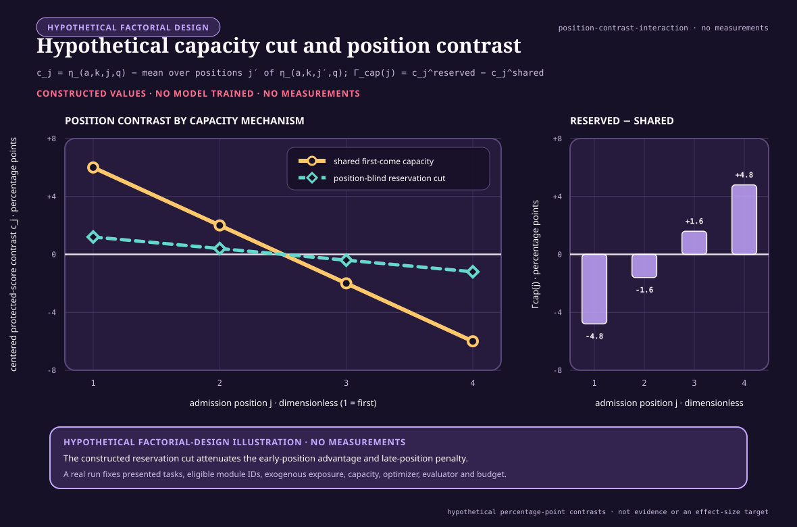

# History-conditioned modular succession: mathematical contract

<!-- markdownlint-disable MD013 -->

- **Status:** frontier notation and experiment design; no result
- **Audit:** [history-conditioned modular succession and priority effects](../research/audits/2026-08-26-history-conditioned-modular-succession.md)
- **Promotion boundary:** this note creates no claim, principle, candidate,
  protocol, or fixture identifier
- **Purpose:** define fixed-task-and-eligibility order estimands, resource identities,
  causal-cut contrasts, endpoint units, multiplicity control, and kill
  boundaries before any large implementation is proposed

## Scope

The mathematical question is whether a randomized sequence changes a final
learned system after the presented task multiset, eligible module identity set,
and all declared resources are held fixed. Realized active, consolidated,
merged, or retired module state may differ and is an endpoint. The notation
does not assume that an order effect exists or that any effect is ecological in
mechanism.

Microbial abundance, model accuracy, allocated parameters, examples, seconds,
bytes, and joules remain different quantities. No conversion among them is
introduced here.

## Indices, objects, and units

| Symbol | Definition | Unit |
| --- | --- | --- |
| $K$ | number of distinct task blocks and eligible module identities in the bounded design; initially $K=4$ | count |
| $k$ | paired admission-unit index, $k\in\{1,\ldots,K\}$ | count |
| $\ell$ | executing-module index when tasks and modules are evaluated separately | count |
| $j,j'$ | sequence-position indices, each in $\{1,\ldots,K\}$ | count |
| $r$ | paired random-seed index | count |
| $a$ | learning-method index | category |
| $q$ | endpoint index | category |
| $h,h'$ | distinct mechanism-factor indices when used together | category |
| $\mathcal T$ | frozen multiset of task blocks | set-valued |
| $T_k$ | checksummed task block with identity $k$ | data object |
| $M_k$ | eligible module identity paired with $T_k$ before randomization | typed identity |
| $A_k=(T_k,M_k)$ | frozen task/module admission unit | typed pair |
| $\Pi_K$ | set of all permutations of $K$ identities | set-valued |
| $\pi$ | one randomized permutation in $\Pi_K$ | dimensionless mapping |
| $\pi_j$ | paired admission-unit identity shown at sequence position $j$ | count |
| $\mathbf z$ | vector of binary mechanism interventions | dimensionless vector |
| $s_{a,j}$ | complete learned and structural state for method $a$ after position $j$ | typed state |
| $\theta_{a,j}$ | trainable parameter state within $s_{a,j}$ | parameter vector |
| $\rho_{a,j}$ | router/admission state within $s_{a,j}$ | typed state |
| $\omega_{a,j}$ | optimizer state within $s_{a,j}$ | typed state |
| $m_{a,j}$ | replay or external learning-memory state within $s_{a,j}$ | typed state |
| $c_{a,j}$ | capacity-allocation state within $s_{a,j}$ | parameter/byte vector |
| $Y_{a,\pi,\mathbf z,r,q}$ | observed endpoint $q$ for one method, order, intervention cell, and seed | endpoint-specific |
| $\mu_{a,\pi,\mathbf z,q}$ | seed expectation of $Y_{a,\pi,\mathbf z,r,q}$ under the frozen generator | endpoint-specific |
| $N^{\mathrm{data}}_k$ | exogenous examples presented from task $k$ | count |
| $N^{\mathrm{acc}}_{a,\pi,k\ell}$ | examples from task $T_k$ accepted by executing module $M_\ell$ | count |
| $U_{a,\pi,k\ell}$ | optimizer-update applications to $M_\ell$ attributed to examples from $T_k$ under the frozen attribution rule | count |
| $C^{\mathrm{tot}}_a$ | total installed parameter-capacity ceiling | parameters |
| $C^{\mathrm{act}}_a$ | maximum simultaneously active parameter ceiling | parameters |
| $B^{\mathrm{peak}}_a$ | peak live attributed storage | bytes |
| $t$ | elapsed wall time from the registered run start | seconds |
| $E_a$ | calibrated externally measured run energy at the declared boundary | joules |
| $P_a$ | mean measured power over a declared interval | watts |

Every typed state is serialized or hashed at each task boundary. A variable
that affects later updates but is absent from $s_{a,j}$ is an unmeasured shared
state and invalidates the corresponding causal cut.

## Fixed-task-multiset and module-eligibility identity

For the initial design, freeze a one-to-one admission map $g(T_k)=M_k$ before
order assignment and define $A_k=(T_k,M_k)$. Each pair appears exactly once. A
valid permutation satisfies

$$
\pi:\{1,\ldots,K\}\rightarrow\{1,\ldots,K\}
$$

as a bijection, and therefore

$$
\biguplus_{j=1}^{K}\{T_{\pi_j}\}=\mathcal T,
$$

where $\biguplus$ denotes multiset union. Equivalently, for every identity
$k$,

$$
\sum_{j=1}^{K}\mathbb 1\{\pi_j=k\}=1.
$$

Here $\mathbb 1\{\cdot\}$ is a dimensionless indicator. If a later design
repeats blocks, the right-hand side becomes a frozen multiplicity $n_k$ that is
identical for every order. Adding or deleting a presented task, eligible module
identity, initialization image, example, label, augmentation, or response
opportunity violates the order estimand. Realized activation, consolidation,
merge, or retirement does not violate it; those states remain measured
outcomes.

Let $I_{k,r}$ be the stored initialization image for paired module $M_k$ and
seed $r$. It is drawn before $\pi$ is assigned, so

$$
I_{k,r}(\pi)=I_{k,r}(\pi')
$$

for all compared orders $\pi$ and $\pi'$. Every other random stream is keyed by
its typed identity and paired seed rather than by global call order. Otherwise
a permutation could change initialization, dropout, augmentation, router, or
fault draws and the contrast would not isolate order.

Let $\boldsymbol\xi_{k,r}$ denote the frozen stream bundle keyed by admission
unit $A_k$, paired seed $r$, stream type, and within-identity draw index. A
sequence position selects that identity's bundle; it does not create a new
position-keyed bundle.

The method-specific state transition is written abstractly as

$$
s_{a,j}
=
F_a\!\left(
s_{a,j-1},A_{\pi_j},\mathbf z,\boldsymbol\xi_{\pi_j,r}
\right),
$$

where $F_a$ is the frozen transition implementation and
$\boldsymbol\xi_{\pi_j,r}$ is the paired random-input bundle for the identity
occupying position $j$. Position-indexed exogenous disturbances are prohibited
unless they are a separately registered, randomized factor. This notation
permits parameters, routers, optimizer moments, replay, and structure to carry
history; it does not require all methods to contain every component.

## Exposure, capacity, optimizer, evaluator, and budget identities

### Exogenous exposure

For each task $k$, let $\mathcal D_k$ be the frozen checksummed sequence of
examples, labels, augmentations, and interaction outcomes. Exogenous parity
requires

$$
N^{\mathrm{data}}_{a,\pi,k}
=
N^{\mathrm{data}}_k
$$

for every method $a$ and order $\pi$ in a matched comparison. The equality is
in counts and content: equal counts with different examples are not equal
exposure.

Routed acceptance may be an endogenous mechanism. The accepted-exposure ledger
therefore retains both task identity $k$ and executing-module identity $\ell$.
Define the task-total accepted count and its dimensionless exposure ratio as

$$
N^{\mathrm{acc}}_{a,\pi,k\cdot}
=
\sum_{\ell=1}^{K}N^{\mathrm{acc}}_{a,\pi,k\ell},
\qquad
x_{a,\pi,k\cdot}
=
\frac{N^{\mathrm{acc}}_{a,\pi,k\cdot}}
{N^{\mathrm{data}}_k},
\qquad x_{a,\pi,k\cdot}\ge0.
$$

The ratio can exceed one only when the registered method duplicates or fans out
one presented example to more than one module; every duplicate remains charged.
Module-total accepted exposure is

$$
N^{\mathrm{acc}}_{a,\pi,\cdot\ell}
=
\sum_k N^{\mathrm{acc}}_{a,\pi,k\ell}.
$$

The exposure-equalizer intervention freezes
the complete task-by-executing-module targets $N^{\star}_{k\ell}$ and
$U^{\star}_{k\ell}$ such that

$$
N^{\mathrm{acc}}_{a,\pi,k\ell}=N^{\star}_{k\ell},
\qquad
U_{a,\pi,k\ell}=U^{\star}_{k\ell}
$$

for every task $k$, executing module $\ell$, and evaluated order in that
intervention level. Thus equal task totals cannot hide a different routing
allocation. Mixed-task update attribution and any fan-out rule are frozen
before order assignment. Rejected, downweighted, or duplicate work remains
charged even when it is not applied as an update.

Let $b_{a,\pi,k}$ be module $k$'s birth time in seconds from run start and let
$T^{\mathrm{wall}}_{a,\pi}$ be the registered run duration in seconds. Its
final wall-clock age is

$$
A^{\mathrm{final}}_{a,\pi,k}
=
T^{\mathrm{wall}}_{a,\pi}-b_{a,\pi,k}
\quad [\mathrm{s}].
$$

The pre-instantiation cut sets all $b_{a,\pi,k}=0$ while freezing inactive
state. The exposure equalizer changes the $N^{\mathrm{acc}}_{k\ell}$ and
$U_{k\ell}$ matrices, not $b$. This is why age and accepted exposure can be
crossed independently.

### Capacity

Let $C_{a,\pi,k}(t)$ be parameters allocated to module $k$ at time $t$, and
let $A_{a,\pi,k}(t)\in\{0,1\}$ indicate that the module is active. Valid runs
satisfy

$$
\sum_{k=1}^{K}C_{a,\pi,k}(t)\le C^{\mathrm{tot}}_a
$$

and

$$
\sum_{k=1}^{K}A_{a,\pi,k}(t)C_{a,\pi,k}(t)
\le C^{\mathrm{act}}_a
$$

for all measured $t$. Every term is a parameter count. Storage for optimizer
state, router state, replay, checkpoints, and metadata is counted separately in
bytes; parameter count is not treated as bytes without the registered
representation width.

For the position-blind reservation cut, frozen quotas $C_k^{\star}$ obey

$$
\sum_{k=1}^{K}C_k^{\star}=C^{\mathrm{tot}}_a,
\qquad
C_{a,\pi,k}(t)\le C_k^{\star}.
$$

Unused reserved capacity cannot be borrowed. Otherwise the later order could
change effective total opportunity while nominal capacity remained fixed.

### Optimizer and evaluator

Let $U^{\mathrm{tot}}_{a,\pi}$ be all optimizer updates, including replay,
router, consolidation, recovery, and failed-attempt updates. Let
$V^{\mathrm{eval}}_{a,\pi}$ be evaluator calls. Within a method-specific order
contrast,

$$
U^{\mathrm{tot}}_{a,\pi}=U^{\mathrm{tot}}_{a,\pi'},
\qquad
V^{\mathrm{eval}}_{a,\pi}=V^{\mathrm{eval}}_{a,\pi'}
$$

for every compared $\pi$ and $\pi'$, unless a count is itself a declared
endpoint under a common ceiling. If early stopping is allowed, unused budget is
reported; it is not silently transferred to tuning.

Across different methods, the optimizer mechanism may differ. Equality then
means equal allowed update, search, evaluator, precision, and stopping budgets,
not pretending that EWC, OGD, replay, PBT, and ordinary SGD execute identical
operations. Method-specific work remains visible in the complete ledger.

### Complete budget vector

Let $N^{\mathrm{data}}=\sum_kN^{\mathrm{data}}_k$ be total presented exposure.
Total accepted task-by-module exposure is

$$
N^{\mathrm{acc}}
=
\sum_k\sum_\ell N^{\mathrm{acc}}_{a,\pi,k\ell}.
$$

Let $N^{\mathrm{fwd}}$ and $N^{\mathrm{bwd}}$ be
forward- and backward-evaluation counts, and let $B^{\mathrm{read}}$,
$B^{\mathrm{write}}$, and $B^{\mathrm{peak}}$ be attributed read, written, and
peak-live byte counts. Let $T^{\mathrm{worker}}$ be summed provisioned worker
time in seconds, $T^{\mathrm{wall}}$ be elapsed run time in seconds, and $E$ be
calibrated external energy in joules. $U^{\mathrm{tot}}$ and
$V^{\mathrm{eval}}$ retain the definitions above.

Define

$$
\mathbf B_{a,\pi}
=
\left[
N^{\mathrm{data}},
N^{\mathrm{acc}},
U^{\mathrm{tot}},
N^{\mathrm{fwd}},
N^{\mathrm{bwd}},
V^{\mathrm{eval}},
B^{\mathrm{read}},
B^{\mathrm{write}},
B^{\mathrm{peak}},
T^{\mathrm{worker}},
T^{\mathrm{wall}},
E
\right]_{a,\pi}.
$$

The first six entries are counts; the next three are bytes;
$T^{\mathrm{worker}}$ and $T^{\mathrm{wall}}$ are seconds; $E$ is joules.
This vector is never summed directly. Paired order arms require componentwise
equality within frozen tolerances or are compared on a preregistered Pareto
frontier.

Mean measured power is derived only when a calibrated energy interval of
duration $\Delta t>0$ seconds exists:

$$
P=\frac{E}{\Delta t}.
$$

Because $\mathrm{J}/\mathrm{s}=\mathrm{W}$, $P$ is in watts. Operations,
parameters, or bytes cannot replace $E$ in this equation.

## Potential outcomes and order estimands

For endpoint $q$, method $a$, intervention vector $\mathbf z$, and order
$\pi$, define the seed expectation

$$
\mu_{a,\pi,\mathbf z,q}
=
\mathbb E_r
\left[
Y_{a,\pi,\mathbf z,r,q}
\right],
$$

where the expectation is over the frozen seed generator, not over all possible
tasks or machines.

### Pairwise order effect

For two preregistered orders $\pi$ and $\pi'$, the controlled order effect is

$$
\tau_{a,q}(\pi,\pi';\mathbf z)
=
\mu_{a,\pi,\mathbf z,q}
-
\mu_{a,\pi',\mathbf z,q}.
$$

Its unit is the endpoint unit. A positive value is beneficial only when higher
values of endpoint $q$ are defined as better. Costs and errors retain their
natural lower-is-better direction rather than having signs silently reversed.

The paired estimator over $R$ seeds is

$$
\widehat\tau_{a,q}(\pi,\pi';\mathbf z)
=
\frac{1}{R}
\sum_{r=1}^{R}
\left(
Y_{a,\pi,\mathbf z,r,q}
-Y_{a,\pi',\mathbf z,r,q}
\right),
$$

where $R$ is a dimensionless seed count.

### Order-distribution sensitivity

Let $|\Pi_K|=K!$. The permutation-average endpoint is

$$
\bar\mu_{a,\mathbf z,q}
=
\frac{1}{K!}
\sum_{\pi\in\Pi_K}
\mu_{a,\pi,\mathbf z,q}.
$$

The between-order variance is

$$
V^{\mathrm{order}}_{a,\mathbf z,q}
=
\frac{1}{K!}
\sum_{\pi\in\Pi_K}
\left(
\mu_{a,\pi,\mathbf z,q}
-\bar\mu_{a,\mathbf z,q}
\right)^2.
$$

This is the finite-population variance for an order drawn uniformly from all
$K!$ permutations. If only $m<K!$ orders are sampled uniformly without
replacement, the preregistered sample estimator uses denominator $m-1$ and
reports its sampling uncertainty; it is not silently substituted for the
complete enumeration. If $q$ is a dimensionless score, the variance is squared
score units. The order range is

$$
R^{\mathrm{order}}_{a,\mathbf z,q}
=
\max_{\pi\in\Pi_K}\mu_{a,\pi,\mathbf z,q}
-
\min_{\pi\in\Pi_K}\mu_{a,\pi,\mathbf z,q},
$$

in the endpoint unit. The range is descriptive and selection-biased as an
estimate of a future best order; it cannot replace simultaneous pairwise
intervals.

### Position effect

For task identity $k$ and position $j$, define

$$
\eta_{a,k,j,q}(\mathbf z)
=
\frac{1}{(K-1)!}
\sum_{\pi\in\Pi_K:\,\pi_j=k}
\mu_{a,\pi,\mathbf z,q}.
$$

The position contrast

$$
\eta_{a,k,j,q}(\mathbf z)-\eta_{a,k,j',q}(\mathbf z)
$$

compares the same task at two positions averaged over all orders of the other
tasks. It is not an “early-arrival law” unless it replicates across protected
task families and survives the mechanism cuts.

For a plot or table that compares every position with the task's mean over
positions, define

$$
\bar\eta_{a,k,\cdot,q}(\mathbf z)
=
\frac{1}{K}
\sum_{j'=1}^{K}
\eta_{a,k,j',q}(\mathbf z),
\qquad
c_{a,k,j,q}(\mathbf z)
=
\eta_{a,k,j,q}(\mathbf z)
-
\bar\eta_{a,k,\cdot,q}(\mathbf z).
$$

Thus $\sum_j c_{a,k,j,q}(\mathbf z)=0$. If the only changed factor is the
capacity-reservation cut, its position-specific interaction is

$$
\Gamma^{(\mathrm{cap,pos})}_{a,k,j,q}(\mathbf z_{-\mathrm{cap}})
=
c_{a,k,j,q}(z_{\mathrm{cap}}=1,\mathbf z_{-\mathrm{cap}})
-
c_{a,k,j,q}(z_{\mathrm{cap}}=0,\mathbf z_{-\mathrm{cap}}).
$$

The figure is an algebraic reading aid. It substitutes constructed percentage-
point contrasts for $c_{a,k,j,q}$ and plots their constructed difference as
$\Gamma^{(\mathrm{cap,pos})}_{a,k,j,q}$. The values are not measurements,
estimates, predictions, recommended effect sizes, or evidence that a capacity
mechanism exists. Its editable specification is the
[`history-conditioned-position-contrast` entry](../assets/plots/core-models.json).

### Optimized-order advantage

Let $g$ be a frozen order-selection algorithm, let $\widehat\pi_g$ be its
selected order using discovery information only, and let $\Pi^{\mathrm{rand}}$
be the uniform distribution over admissible orders. The held-out optimized
advantage is

$$
\Delta^{\mathrm{opt}}_{a,g,q}
=
\mu_{a,\widehat\pi_g,\mathbf z,q}
-
\mathbb E_{\pi\sim\Pi^{\mathrm{rand}}}
\left[
\mu_{a,\pi,\mathbf z,q}
\right].
$$

The quality contrast is incomplete until the order optimizer's pilot examples,
similarity or curvature measurements, candidate sequences, evaluator calls,
failed runs, bytes, seconds, and joules are appended to
$\mathbf B_{a,\widehat\pi_g}$. Selecting the observed maximum from confirmation
orders is not $g$ and is not a valid optimized-order estimate.

## Factorial mechanism estimands

Define the binary intervention vector

$$
\mathbf z
=
\left[
z_{\mathrm{age}},
z_{\mathrm{exp}},
z_{\mathrm{cap}},
z_{\mathrm{state}},
z_{\mathrm{fac}},
z_{\mathrm{lock}}
\right]
\in\{0,1\}^{6},
$$

where $0$ is the natural-history level and $1$ is the causal-cut level defined
in the audit. Let $\mathbf z_{-h}$ denote all factors except mechanism $h$.

For one order $\pi$, the controlled main contrast of mechanism $h$ at fixed
$\mathbf z_{-h}$ is

$$
\Delta^{(h)}_{a,\pi,q}(\mathbf z_{-h})
=
\mu_{a,\pi,(z_h=1,\mathbf z_{-h}),q}
-
\mu_{a,\pi,(z_h=0,\mathbf z_{-h}),q}.
$$

The order-by-mechanism interaction for two orders is

$$
\Gamma^{(h)}_{a,q}(\pi,\pi';\mathbf z_{-h})
=
\tau_{a,q}\!\left(
\pi,\pi';z_h=1,\mathbf z_{-h}
\right)
-
\tau_{a,q}\!\left(
\pi,\pi';z_h=0,\mathbf z_{-h}
\right).
$$

$\Gamma^{(h)}$ has the endpoint unit. If cutting a path reduces an order
contrast toward zero, that is evidence that the measured effect depends on the
cut under the frozen design. It is not proof that mechanism $h$ is the only
mediator.

For distinct mechanisms $h$ and $h'$, the two-factor interaction at one order is the
inclusion--exclusion contrast

$$
\Delta^{(h,h')}_{a,\pi,q}
=
\mu_{11}-\mu_{10}-\mu_{01}+\mu_{00},
$$

where the two subscripts give $(z_h,z_{h'})$ and all remaining factors are
fixed. Higher-order interactions use the same inclusion--exclusion rule.

### Decomposition limits

The factorial is randomized, but a unique additive causal decomposition is not
generally available because:

1. capacity changes which exposures are accepted;
2. exposure changes optimizer and shared-state trajectories;
3. shared state changes routing and therefore capacity demand;
4. facilitation changes both information and subsequent work;
5. lock-in changes the set of later admissible states; and
6. nonlinearity allows higher-order interactions.

Consequently,

$$
\tau_{a,q}(\pi,\pi';\mathbf 0)
\ne
\sum_h \Gamma^{(h)}_{a,q}(\pi,\pi';\mathbf z_{-h})
$$

in general. The right side also depends on the levels at which the other
factors are fixed. “Percent mediated” is not reported unless a separate causal
model supplies and defends the required cross-world assumptions.

## Ordinary-scheduling negative control

Let $J_k$ denote a task job that consumes the same declared compute and I/O but
does not update parameters, routers, optimizer state, replay, normalization, or
structure. Let $\sigma_\pi$ be its completion order under scheduler input
$\pi$. Scheduling may change a service endpoint
$L(\sigma_\pi)$ such as latency in seconds.

Separately, let $u_k$ be the complete checksummed learned update record produced
for task $k$. Apply all records after job completion in one canonical order
$\kappa$ to obtain

$$
s^{\mathrm{canon}}_{a,K}
=
u_{\kappa_K}\circ\cdots\circ u_{\kappa_1}(s_{a,0}).
$$

If $s^{\mathrm{canon}}_{a,K}$ and all final capability endpoints are identical
across input permutations while only $L(\sigma_\pi)$ differs, the detected
effect is ordinary scheduling under this control. If update records themselves
depend on the live history, canonical replay is diagnostic rather than an
oracle; that dependence must be attributed to one or more serialized state
paths.

## Learning endpoints

Assume higher task score is better. Let $Q_{a,\pi,k}^{\mathrm{post}}$ be task
$k$'s held-out score immediately after its acquisition block, and let
$Q_{a,\pi,k}^{\mathrm{final}}$ be its score after all $K$ blocks at the frozen
retention horizon. Both retain the declared task score unit.

Backward transfer is

$$
\operatorname{BWT}_{a,\pi,k}
=
Q_{a,\pi,k}^{\mathrm{final}}
-Q_{a,\pi,k}^{\mathrm{post}}.
$$

Positive values indicate improvement and negative values indicate forgetting.
The nonnegative forgetting magnitude is

$$
F_{a,\pi,k}
=
\max\left(
0,
Q_{a,\pi,k}^{\mathrm{post}}
-Q_{a,\pi,k}^{\mathrm{final}}
\right).
$$

Let $Q_k^{\mathrm{floor}}$ be the preregistered protected score floor for task
$k$. The protected shortfall is

$$
H_{a,\pi}^{\mathrm{prot}}
=
\max_{1\le k\le K}
\max\left(
0,
Q_k^{\mathrm{floor}}
-Q_{a,\pi,k}^{\mathrm{final}}
\right).
$$

This has the score unit and cannot be cancelled by high performance on another
task. The worst-task score is

$$
Q_{a,\pi}^{\min}
=
\min_{1\le k\le K}
Q_{a,\pi,k}^{\mathrm{final}}.
$$

For newcomer task $k$, let $Q_k^{\star}$ be a frozen competence threshold and
let $n_{a,\pi,k}^{\star}$ be the first accepted-example count at which the
threshold is met and remains met for the frozen confirmation window. If the
threshold is never met, $n_{a,\pi,k}^{\star}$ is right-censored at the task
budget rather than deleted. Forward facilitation is evaluated through this
sample-complexity endpoint and a matched no-history baseline, not through final
score alone.

## Structural and routing endpoints

Let $p_{a,\pi,\ell}(t)$ be the fraction of routed load assigned to executing
module $\ell$ at
time $t$, with

$$
p_{a,\pi,\ell}(t)\ge0,
\qquad
\sum_{\ell=1}^{K}p_{a,\pi,\ell}(t)=1
$$

when at least one module is eligible. Router entropy is

$$
H^{\mathrm{route}}_{a,\pi}(t)
=
-\sum_{\ell=1}^{K}
p_{a,\pi,\ell}(t)
\log p_{a,\pi,\ell}(t),
$$

in nats when the natural logarithm is used. Terms with $p=0$ contribute zero.
Low entropy is not by itself specialization or quality.

For a frozen task-by-module evaluation matrix $G_{a,\pi,k\ell}$, where row
$k$ is task identity and column $\ell$ is module identity, define a
dimensionless specialization contrast for module $\ell$ as

$$
S_{a,\pi,\ell}
=
\max_k G_{a,\pi,k\ell}
-
\frac{1}{K-1}
\sum_{k'\ne k^{\star}_{\ell}}
G_{a,\pi,k'\ell},
$$

where $k^{\star}_{\ell}$ is the task attaining the maximum under a frozen tie
rule. This metric is meaningful only if $G$ uses a common dimensionless score.
If tasks have different native units, their raw matrix is reported and no such
subtraction is allowed.

Admission time, commitment time, unlock count, retirement count, allocated
capacity, accepted load, dropped load, and lineage remain separate endpoints.
An expert label or high $S$ does not prove independent function, causal
necessity, or efficient routing.

## Service and lifecycle endpoints

If $N^{\mathrm{due}}$ predictions are due and
$N^{\mathrm{accepted}}$ are correct, current, integrity-valid, and within the
frozen deadline, accepted service is

$$
S^{\mathrm{acc}}
=
\frac{N^{\mathrm{accepted}}}{N^{\mathrm{due}}},
$$

a dimensionless fraction. Missing, late, stale, duplicated, and inaccurate
predictions remain separate counts before aggregation.

Latency $L_i$ for due item $i$ is completion time minus original due time, in
seconds. Every due item remains in the denominator; missing completions receive
the preregistered right-censor value. p50, p95, and p99 are reported with the
exact quantile convention.

The mandatory result is a vector,

$$
\mathbf V_{a,\pi}
=
\left[
\{Q_{a,\pi,k}^{\mathrm{final}}\}_{k=1}^{K},
Q_{a,\pi}^{\min},
H_{a,\pi}^{\mathrm{prot}},
\{\operatorname{BWT}_{a,\pi,k}\}_{k=1}^{K},
\{n_{a,\pi,k}^{\star}\}_{k=1}^{K},
S^{\mathrm{acc}},
L_{0.99},
\mathbf B_{a,\pi}
\right].
$$

The entries have different units and are not averaged. Method $a$ dominates
method $a'$ only under preregistered direction and relevance margins, with no
protected endpoint worse and at least one endpoint materially better.

## Multiplicity and uncertainty

Let $\mathcal H_{\mathrm{primary}}$ be the frozen family of primary order,
method, and order-by-mechanism contrasts. Its membership is committed before
confirmation outcomes are opened.

For randomization inference, compute one test statistic for each
$h\in\mathcal H_{\mathrm{primary}}$ and, under the registered treatment
re-randomizations, use the maximum absolute standardized statistic

$$
M^{\mathrm{perm}}
=
\max_{h\in\mathcal H_{\mathrm{primary}}}
\left|T_h^{\mathrm{perm}}\right|.
$$

The empirical distribution of $M^{\mathrm{perm}}$ supplies family-wise
adjusted decisions and simultaneous intervals. If that procedure is
computationally unavailable, Holm's step-down correction is the fallback.
Unadjusted effect estimates and intervals remain visible, but they cannot carry
the confirmatory decision.

Seeds are paired experimental units only for the generator they instantiate.
Tasks, orders, endpoints, or repeated checkpoints from one run are not treated
as independent sample-size multipliers. Generalization to a task population or
machine population requires corresponding sampled levels and a second-family
or second-machine replication.

The minimum relevant effect $\delta_q^{\min}$ is declared in endpoint $q$'s
native unit. “Statistically nonzero” without crossing
$\delta_q^{\min}$ does not keep the frontier alive.

## Dimensional analysis checklist

1. Task scores may be dimensionless proportions or native score units; the
   unit is declared before subtraction.
2. Counts of examples, updates, parameters, modules, calls, and operations are
   dimensionless counts with different meanings and are not interchangeable.
3. Storage and traffic are bytes; parameter counts become bytes only after
   representation width and metadata are included.
4. Latency, worker time, and wall time are seconds but have different
   boundaries and remain separately named.
5. Energy is joules and power is joules per second, or watts.
6. Throughput is accepted items per second and is not an energy efficiency.
7. Quality per joule is reported only beside its raw quality and energy
   components at matched task, quality floor, horizon, and boundary.
8. Ecological abundance and artificial router load are not assigned a common
   unit merely to make an analogy.

## Testable predictions

These are preregistrable hypotheses, not findings:

1. In high-overlap task strata, the capacity reservation cut yields
   $\Gamma^{(\mathrm{cap})}$ opposite in sign to the natural order contrast if
   incumbency is carried by capacity pre-emption.
2. If shared-state modification is a carrier, the magnitude of
   $\tau(\pi,\pi';\mathbf z)$ decreases when
   $z_{\mathrm{state}}=1$ while private post-acquisition scores remain within
   their non-inferiority margins.
3. If typed facilitation improves newcomer acquisition, setting
   $z_{\mathrm{fac}}=1$ increases the newcomer threshold count
   $n^{\star}$ or right-censoring rate without a corresponding change under the
   sham-only scheduler control.
4. If lock-in is useful rather than merely persistent, the irreversible arm
   improves protected delayed outcomes after the inducing module is removed
   and remains non-dominated after checkpoint, unlock, migration, and recovery
   costs enter $\mathbf B$.
5. If the effect is ordinary continual-learning interference, replay, EWC, or
   OGD matches the complete frontier without module-birth factors.
6. If the effect is curriculum selection, a held-out optimized order yields
   the same frontier after its search budget is charged.
7. $V^{\mathrm{order}}$ and the sign of position contrasts vary with feature
   overlap, readout conflict, horizon, and method; no universal early/late rule
   is predicted.

## Numerical and contract checks

1. Every stored permutation is a bijection and has the same task-multiset and
   eligible-module-set digests.
2. Every task identity has identical exogenous example and update opportunity
   digests across orders.
3. Capacity inequalities hold at every event, not only at final state.
4. Every shared-state reset restores the same checksummed boundary image while
   retaining only the explicitly exempt private state.
5. Sham facilitation payloads match byte count, availability time, parser work,
   and transport work, and are provably answer-free.
6. Canonical replay applies exactly the same update-record multiset in the same
   canonical order for every scheduling control.
7. Invalid, missing, censored, timed-out, and resource-exceeded runs remain in
   result tables and multiplicity families.
8. The full budget vector is reconstructed from raw events before any method
   comparison.
9. Half-precision, quantized, sparse, or parallel execution receives its own
   parameter, byte, work, and energy accounting; nominal operation equality is
   insufficient.
10. No equation in this note authorizes a scientific, performance, or energy
    result before a registered executable package and sealed execution exist.

## Kill boundary

This mathematical contract supplies no residual architecture contribution if:

1. for every protected primary contrast on both task families, the registered
   simultaneous interval lies wholly inside
   $(-\delta_q^{\min},+\delta_q^{\min})$; the unobserved population condition
   $|\tau|<\delta_q^{\min}$ is the corresponding no-effect region, not an
   executable decision rule;
2. canonical replay or the non-learning scheduler reproduces the effect;
3. equal age plus equal accepted exposure removes it;
4. no randomized causal cut changes it on fresh seeds;
5. a complete conventional null is non-inferior at lower or equal lifecycle
   cost;
6. results depend on selecting the best confirmation permutation;
7. protected-task harm or resource ceilings are violated; or
8. the second task family or machine replication fails.

Passing these equations and checks would justify evaluating evidence. It would
not by itself establish a biological equivalence, universal mechanism, or
novel architecture.
