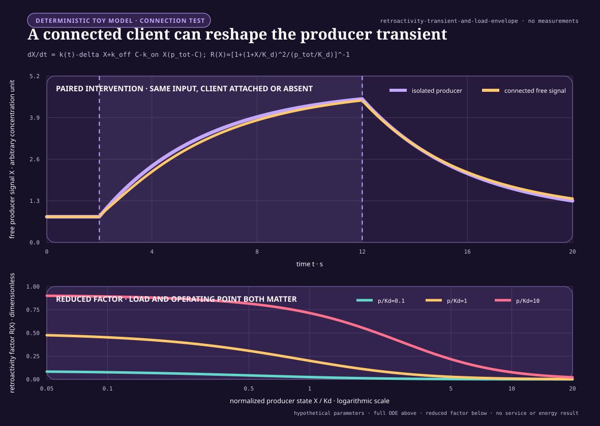

# Interface-qualified retroactivity and insulation

<!-- markdownlint-disable MD013 -->

- **Purpose:** distinguish direct output sequestration, substrate competition,
  generic shared-resource competition, and intentional useful coupling; define
  measurable effects; and bound claims about insulating module interfaces
- **Evidence audit:** [interface-qualified retroactivity and insulation](../research/audits/2026-08-25-interface-qualified-retroactivity-insulation.md)
- **Experiment contract:** [Fixture F-027](../experiments/fixtures/027-interface-qualified-retroactivity-insulation.md)
- **Result state:** analytical definitions and synthetic experiment
  specifications only; every empirical, workstation, and energy result is
  **NO_RESULT**

## Four coupling classes

Let an upstream module produce a signal for one or more downstream clients.
Four effects that can look similar in a latency or output trace must remain
distinct.

1. **Direct output sequestration or connection back-action** occurs when the
   receiver binds, pins, drains, blocks, or otherwise changes the output
   carrier or producer-owned state that participates in upstream dynamics.
   Removing the output connection removes this path even when total work is
   held fixed.
2. **Substrate competition** occurs when multiple downstream transformations
   compete for a declared pathway-specific enzyme, catalyst, transformer, or
   service pool. It can change the service delivered to other substrates and,
   when substrate binding changes enzyme modification or availability, can
   also feed back into pathway state. It is not generic compute contention.
3. **Generic shared-resource competition** occurs when otherwise unrelated
   modules contend for a processor, memory channel, accelerator, allocator,
   network, transcription or translation capacity, thermal limit, power cap,
   or another common resource. A disconnected work-matched load can reproduce
   this path.
4. **Intentional useful coupling** is an admitted interaction whose effect is
   part of the declared objective: for example signal integration by substrate
   competition or a designed gradient, acknowledgement, feedback, or
   feedforward controller. Intended coupling is not called a defect merely
   because it alters another component, but its authority and costs remain in
   the ledger.

For upstream state $x$, intended input $u$, direct output-binding state
$s$, pathway-specific substrate-service state $v$, generic shared-resource
state $q$, and admitted coupling signal $c$, a mechanism ledger can write

$$
\dot{x}
=
f(x,u)
+b_{\mathrm{seq}}(x,s)
+b_{\mathrm{sub}}(x,v)
+b_{\mathrm{shared}}(x,q)
+b_{\mathrm{useful}}(x,c)
+b_{\mathrm{cross}}(x,s,v,q,c),
$$

where every term has the state unit of $x$ per second. The terms are isolated
dynamics, direct sequestration, pathway-specific substrate competition,
generic shared-resource coupling, declared useful coupling, and their
interactions. A term may be identically zero in a particular system. The names
do not identify a mechanism; selective interventions do. In particular,
functional value is an objective label, not a fifth physical pathway: a
substrate-competition path can be intentionally useful in one task and
harmful in another.

## Biological source model and units

The source-shaped model uses one free signalling species and one downstream
binding pool. Its notation is:

| Symbol | Meaning | Unit |
| --- | --- | --- |
| $t$ | elapsed time | second (s) |
| $X(t)$ | free upstream signalling concentration | mole per cubic metre (mol m$^{-3}$) |
| $C(t)$ | concentration bound to downstream sites | mol m$^{-3}$ |
| $p_{\mathrm{tot}}$ | total downstream-site concentration | mol m$^{-3}$ |
| $k(t)$ | production flux of free signal | mol m$^{-3}$ s$^{-1}$ |
| $\delta$ | first-order loss rate of free signal | s$^{-1}$ |
| $k_{\mathrm{on}}$ | association-rate constant | m$^3$ mol$^{-1}$ s$^{-1}$ |
| $k_{\mathrm{off}}$ | dissociation-rate constant | s$^{-1}$ |
| $K_d$ | dissociation concentration, $k_{\mathrm{off}}/k_{\mathrm{on}}$ | mol m$^{-3}$ |
| $Y(t)$ | total signal concentration, $X(t)+C(t)$ | mol m$^{-3}$ |
| $\varepsilon$ | timescale ratio, $\delta/k_{\mathrm{off}}$ | dimensionless |
| $g(Y)$ | quasi-steady bound concentration | mol m$^{-3}$ |
| $R(X)$ | reduced retroactivity factor | dimensionless |

The isolated upstream module is

$$
\dot X_{\mathrm{iso}}=k(t)-\delta X_{\mathrm{iso}}.
$$

After a downstream binding pool is connected, the mass-action model is

$$
\dot X
=
k(t)-\delta X
+k_{\mathrm{off}}C
-k_{\mathrm{on}}X\left(p_{\mathrm{tot}}-C\right),
$$

$$
\dot C
=
k_{\mathrm{on}}X\left(p_{\mathrm{tot}}-C\right)
-k_{\mathrm{off}}C.
$$

The binding fluxes appear with opposite signs and therefore conserve
$X+C$ in the absence of production and loss. Connection changes the free
signal trajectory without requiring an unrelated shared resource.

When binding and unbinding are fast relative to production and loss,
$\varepsilon\ll1$, the quasi-steady bound concentration satisfies

$$
C=g(Y),
\qquad
0
=
-k_{\mathrm{off}}C
+k_{\mathrm{on}}\left(Y-C\right)
\left(p_{\mathrm{tot}}-C\right).
$$

The reduced free-signal dynamics are

$$
\dot{\bar X}
=
\left(k(t)-\delta\bar X\right)
\left[1-R(\bar X)\right],
$$

with

$$
R(\bar X)
=
\left[
1+
\frac{\left(1+\bar X/K_d\right)^2}
{p_{\mathrm{tot}}/K_d}
\right]^{-1}.
$$

Here $\bar X$ is the reduced approximation to $X$, in mol m$^{-3}$.
The formula predicts stronger dynamic back-action when the load
$p_{\mathrm{tot}}$ is large relative to the signal and when binding affinity
is high, meaning $K_d$ is small. It is not licensed when the timescale
separation or mass-action model fails.

## Worked mass-action reference

The figure is an explanatory rendering of the registered source equations,
not an experiment result. Its editable definition is the
[core-model plot specification](../assets/plots/core-models.json) under the
identifier **interface-qualified-retroactivity**; the generated SVG is kept
beside the public site assets. Any parameter or caption change must begin in
that editable specification and must retain the **NO_RESULT** boundary.

For client $j$, let $p_j$, $C_j$, $k_{\mathrm{on},j}$,
$k_{\mathrm{off},j}$, and $K_{d,j}$ have the corresponding units above.
The full multiple-client model is

$$
\dot X
=
k(t)-\delta X
+
\sum_{j=1}^{N}
\left[
k_{\mathrm{off},j}C_j
-
k_{\mathrm{on},j}X(p_j-C_j)
\right],
$$

$$
\dot C_j
=
k_{\mathrm{on},j}X(p_j-C_j)
-
k_{\mathrm{off},j}C_j,
$$

where $N$ is the dimensionless number of attached clients. Client effects
need not be independent after they couple through the same free signal.

For heterogeneous fast-binding pools, define

$$
\bar C_j(\bar X)
=
\frac{p_j\bar X}{K_{d,j}+\bar X},
\qquad
A_N(\bar X)
=
\sum_{j=1}^{N}
\frac{p_jK_{d,j}}{(K_{d,j}+\bar X)^2}.
$$

Because
$Y=\bar X+\sum_j\bar C_j$ and
$\mathrm dY/\mathrm d\bar X=1+A_N(\bar X)$, the reduced free-signal model is

$$
R_N(\bar X)
=
\frac{A_N(\bar X)}{1+A_N(\bar X)},
\qquad
\dot{\bar X}
=
\bigl(k(t)-\delta\bar X\bigr)
\bigl[1-R_N(\bar X)\bigr].
$$

The empty sum gives $R_0=0$; for one client the expression reduces exactly to
the single-pool factor above. It is licensed only when every registered fast-
binding condition and the full-versus-reduced error gate pass. Replacing
heterogeneous $K_{d,j}$ values by an averaged affinity is not this reduction.

## Artificial bounded-publisher model

The AI translation is an interface test, not a claim that digital activations
are molecules. It uses a stateful producer whose published states occupy a
finite producer-owned slot until every direct consumer releases it.

| Symbol | Meaning | Unit |
| --- | --- | --- |
| $n$ | logical input-step index | dimensionless integer |
| $\Delta t$ | scheduled interval between input steps | s |
| $d$ | producer-state dimension | dimensionless count |
| $x_n$ | producer state at step $n$ | normalized state unit (NSU) |
| $u_n$ | registered producer input | normalized input unit (NIU) |
| $A$ | state transition from NSU to NSU | dimensionless |
| $B$ | input transition from NIU to NSU | NSU NIU$^{-1}$ |
| $H$ | output map from NSU to normalized output unit | NOU NSU$^{-1}$ |
| $y_n$ | producer output | normalized output unit (NOU) |
| $S$ | producer-owned publication slots | dimensionless count |
| $a_n$ | slots available at step $n$ | dimensionless count |
| $\mathcal P_n$ | distinct publication-slot IDs with at least one unreleased client reference | dimensionless finite set |
| $h_{j,n}$ | registered hold time for client $j$ and publication $n$ | s |
| $K$ | pathway-specific downstream transform servers | dimensionless count |
| $w_{j,n}$ | transform-service demand for client $j$ at step $n$ | logical operation count |
| $V$ | finite substrate-service intervention indicator | dimensionless, zero or one |
| $Z$ | direct output-sequestration intervention indicator | dimensionless, zero or one |
| $Q$ | generic shared-resource intervention indicator | dimensionless, zero or one |
| $F$ | intentional-feedback intervention indicator | dimensionless, zero or one |
| $c_{\mathrm{copy}}$ | work for one snapshot copy | logical operation count |
| $b_{\mathrm{copy}}$ | bytes written for one snapshot | byte (B) |
| $L_n$ | deadline-lateness at step $n$ | s |
| $m_n$ | deadline-miss indicator | dimensionless, zero or one |

The isolated logical update is

$$
x_{n+1}^{\mathrm{iso}}
=
A x_n^{\mathrm{iso}}+B u_n,
\qquad
y_n^{\mathrm{iso}}=H x_{n+1}^{\mathrm{iso}}.
$$

Here $u_n$ is due at $t_n=n\Delta t$. Publication sequence $n$ semantically
exposes the post-update state $x_{n+1}$ and derived scalar $y_n$, carries $t_n$
as its due time, and records the update-completion time separately. The
fixture's physical 96 B record serializes the state and metadata only; deriving
$y_n$ requires the charged state reduction. A missing record leaves a
permanent due-sequence gap; sequence IDs are not compacted or reused. State
$x_0$ is an initial condition, not publication sequence zero.
The non-published initial scalar is $y_{\mathrm{init}}=H x_0$.

For the direct finite interface,

$$
\mathcal P_n
=
\left\{
s\in\{1,\ldots,S\}:
\exists j\text{ with an unreleased reference to slot }s
\right\},
\qquad
a_n=S-|\mathcal P_n|.
$$

Multiple clients may hold the same publication slot; that slot appears once
in $\mathcal P_n$. Summing client references would double-count a shared slot
and is prohibited.

If a publication requires one slot, the frozen blocking rule is

$$
x_{n+1}^{\mathrm{direct}}
=
\begin{cases}
A x_n^{\mathrm{direct}}+B u_n,
& a_n\ge1,\\
x_n^{\mathrm{direct}},
& a_n<1,
\end{cases}
$$

$$
m_n=\mathbf 1[a_n<1],
\qquad
y_n^{\mathrm{direct}}=H x_{n+1}^{\mathrm{direct}}.
$$

The indicator $\mathbf 1[\cdot]$ equals one when its condition is true and
zero otherwise. Holding the state is one registered policy. Drop-input,
queue-input, and block-wall-clock policies are separate arms because they
produce different trajectories.

An immutable-snapshot interface acquires the physical $x_{n+1}$ record, queues
its charged copy into consumer-owned storage, and releases the producer slot
only after copy completion, cancellation, or TTL expiry. Consumer work and
consumer-storage lifetime cannot extend that source pin. The logical state
transition may therefore retain a bounded copy-time effect under slot pressure;
$c_{\mathrm{copy}}$, $b_{\mathrm{copy}}$, reference work, copy latency,
queueing, staleness, and consumer-storage lifetime are all charged to the
snapshot arm. The model exposes the benefit and cost rather than assuming free
insulation.

Unless the fixture declares an override, snapshot, actor, backpressure,
substrate-service, private-service, and replica arms reuse one capture law:
capacity admission precedes source acquisition; an accepted 24 B descriptor
reserves the 96 B destination; the producer worker acquires the exact source;
and a charged per-client capture worker copies it before handoff to downstream
service. Rejection creates no source reference, while cancellation releases the
descriptor, reservation, any partial destination, and the source reference.
These ownership intervals enter both $B_{\mathrm{peak}}$ and worker accounting.

### Pathway-specific substrate-service control

The artificial substrate-competition control starts from identical immutable
snapshot acquisition in its shared and private arms. Snapshot copying may pin
the producer for its bounded copy interval, but transform service never owns or
extends that reference; the $V$ contrast must therefore have zero producer-
state effect even if both arms share the same copy-time effect. Every
publication creates one transform request per subscribed client. The primary causal comparison fixes $K=N$ and
uses $N$ identical 4096-operation-per-second servers in both arms. With $V=1$,
requests enter one deterministic FCFS queue feeding those $N$ servers. With
$V=0$, each client has one permanently assigned deterministic FCFS queue and
one of the same servers. Both arms therefore have equal server count,
per-server rate, nameplate capacity, and transform demand; only request
pooling changes. Cells with $K\ne N$ are capacity diagnostics and cannot
identify $V$. Pooling can improve or worsen a client stratum, so the effect is
two-sided.

This control represents competition for a declared domain-specific transform
service, not a biochemical claim. Under exclusive producer placement its
construction requires

$$
x_{n+1}=A x_n+B u_n
$$

for both values of $V$. Thus finite transform service may change client
outputs or latency, but it must not change logical producer state unless a
separate path is enabled. A nonzero upstream distortion in that exclusive,
immutable control falsifies the implementation boundary.

## Causal identification

Let $Z\in\{0,1\}$ indicate direct output sequestration, let
$V\in\{0,1\}$ indicate finite pathway-specific substrate service, let
$Q\in\{0,1\}$ indicate disconnected work-matched load on a generic shared
resource, and let $F\in\{0,1\}$ indicate the separately logged intentional
feedback channel. For a dimensionless endpoint $D$, write
$D_{z,v,q,f}$ for the paired aggregate under the four binary settings. The
baseline-referenced one-factor contrasts are

$$
\Delta_{\mathrm{seq}}
=
D_{1,0,0,0}-D_{0,0,0,0},
$$

$$
\Delta_{\mathrm{sub}}
=
D_{0,1,0,0}-D_{0,0,0,0},
$$

$$
\Delta_{\mathrm{shared}}
=
D_{0,0,1,0}-D_{0,0,0,0},
$$

and

$$
\Delta_{\mathrm{useful}}
=
D_{0,0,0,1}-D_{0,0,0,0}.
$$

For example, the sequestration-by-shared-resource interaction is

$$
\Delta_{\mathrm{seq,shared}}
=
D_{1,0,1,0}
-D_{1,0,0,0}
-D_{0,0,1,0}
+D_{0,0,0,0}.
$$

All contrasts above are dimensionless because $D$ is dimensionless. Other
pair and higher-order interactions use the same inclusion--exclusion rule and
must be reported rather than absorbed into a main effect. Direct output
back-action is identified only if $\Delta_{\mathrm{seq}}$ survives exclusive
resource allocation, collapses when the pinning path is cut, and cannot be
reproduced by $V=1$ or $Q=1$. Substrate competition is identified through
client-service changes under immutable producer reads that collapse when
private transform servers replace the finite pool. Generic contention must be
reproducible by disconnected work and must respond to resource placement.
Intentional feedback is identified by replaying its logged messages with
reads disabled and by disabling it while reads remain.

The disconnected load must match observed logical operations, bytes read,
bytes written, allocation count, service-time distribution, and scheduling
class as closely as the registered platform permits. Matching only nominal
consumer count is insufficient. Equal total work does not identify substrate
competition: requests must additionally be reassigned from the shared
pathway-specific service to private services without changing snapshots or
their demand.

## Observation, noise-memory, and bandwidth estimators

Let $y^{\mathrm{prod}}_{r,n}$ be the output derived from the current producer
state record, let
$y^{\mathrm{client}}_{r,n}$ be the latest completed client output, and let
$y^{\mathrm{live}}_{r,n,b}$ be buffered live version $b$, all in normalized
output units for replicate $r$ and sample $n$. If $B_{r,n}$ is the
dimensionless live-version count, the total-live observation is

$$
y^{\mathrm{total}}_{r,n}
=
\frac{
y^{\mathrm{prod}}_{r,n}
+\sum_{b=1}^{B_{r,n}}y^{\mathrm{live}}_{r,n,b}
}{1+B_{r,n}}.
$$

This arithmetic mean is an artificial observation map, not a conserved
biochemical total. It remains in normalized output units. Artificial
publication records serialize eight state components and metadata, not a
second output scalar. Each $y^{\mathrm{prod}}$ or $y^{\mathrm{live}}$ therefore
requires a 64 B state read and the fixture's charged eight-operation reduction.
At each telemetry due time the distinct physical record set is frozen before
asynchronous copying; duplicate client references do not duplicate a version,
and logical expiry cannot turn a telemetry-pinned record into accepted service.

For observation map $o$, let $R_s$ be the dimensionless replicate count,
let $M$ be the dimensionless post-warm-up sample count, and let $\Delta t$
be the sample period in seconds. All replicates must share byte-identical
input, hold, service, deadline, and fault histories; only the registered
componentwise process-noise stream may differ. Let $\mu_n^{(o)}$ be the
deterministic process-noise-disabled trajectory under those exact same events.
The residual is

$$
e^{(o)}_{r,n}
=
y^{(o)}_{r,n}
-\mu_n^{(o)},
$$

in normalized output units. Varying the input or any non-noise event across
replicates invalidates the estimator rather than entering the residual. For
the registered post-warm-up window, define the grand residual mean and centred
residual

$$
\bar e_o
=
\frac{1}{R_sM}\sum_{r=1}^{R_s}\sum_{n=0}^{M-1}e^{(o)}_{r,n},
\qquad
\widetilde e^{(o)}_{r,n}=e^{(o)}_{r,n}-\bar e_o.
$$

Both retain normalized output units. For dimensionless lag index $k$, estimate the
autocovariance

$$
\widehat\gamma_o(k)
=
\frac{1}{R_s(M-k)}
\sum_{r=1}^{R_s}
\sum_{n=0}^{M-k-1}
 \widetilde e^{(o)}_{r,n}\widetilde e^{(o)}_{r,n+k},
$$

in squared normalized output units, and
$\widehat\rho_o(k)=\widehat\gamma_o(k)/\widehat\gamma_o(0)$, which is
dimensionless. Let $K_o$ be the first nonnegative lag at which two
consecutive autocorrelations are nonpositive; if no such pair occurs before
$M/4$, the estimate is unavailable. The integrated correlation-time
estimator is

$$
\tau_{c,o}
=
\Delta t
\left[
1+2\sum_{k=1}^{K_o}\widehat\rho_o(k)
\right],
$$

in seconds. A nonpositive estimate, a nonstationary residual diagnostic, or
missing observation events invalidates the estimate rather than triggering
imputation.

The fixture's executable nonstationarity diagnostic divides the complete
post-warm-up residual sequence into ten contiguous equal-count blocks. With
block mean $\mu_b$, population variance $v_b$, grand mean $\mu$, and
$v_{\min}=10^{-12}\ \mathrm{NOU}^2$, it reports

$$
\Delta_\mu=\max_b|\mu_b-\mu|,
\qquad
R_v
=
\frac{\max_b\max(v_b,v_{\min})}
{\min_b\max(v_b,v_{\min})}.
$$

$\widehat\tau_{c,o}$ is available only when
$\Delta_\mu\le0.01$ NOU, $R_v\le4$, every block is complete, and no
observation is missing. These are fixture decisions, not universal
stationarity criteria; the registered sensitivity thresholds are reported.

For an input sinusoid of angular frequency $\omega=2\pi f$ in radians per
second, where $f$ is in hertz, fit the post-warm-up output

$$
y(t)=a_0+a_s\sin(\omega t)+a_c\cos(\omega t)+\epsilon(t),
$$

where $a_0$, $a_s$, $a_c$, and residual $\epsilon(t)$ have the output
unit and $t$ is in seconds. If the fitted input amplitude is $A_u>0$ in
normalized input units, output amplitude
$A_y=(a_s^2+a_c^2)^{1/2}$ has the output unit and gain
$G(\omega)=A_y/A_u$ has output units per input unit. Phase is
$\phi(\omega)=\operatorname{atan2}(a_c,a_s)$ in radians. The DC probe uses
two constant inputs around $u_0=0.5$ NIU, $u_-=0.49$ NIU and
$u_+=0.51$ NIU, with the explicit shared override $x_{0,i}=0.5$ NSU for every
component, plus the same event history and observation map. If $\bar y_-$ and
$\bar y_+$ are their final-50-second means after a
300 s run, define

$$
G(0)
=
\frac{\bar y_+-\bar y_-}{0.02\ \mathrm{NIU}}
\quad[\mathrm{NOU\,NIU^{-1}}].
$$

This is the fixture's operational DC estimate; failure of either constant
trajectory to converge makes it unavailable. The minus-three-decibel
bandwidth is the smallest interpolated frequency

$$
\omega_B
=
\inf\left\{
\omega>0:
G(\omega)\le\frac{G(0)}{\sqrt{2}}
\right\},
$$

in radians per second. Log-linear interpolation is allowed only between two
adjacent excited frequencies bracketing the threshold; otherwise
$\omega_B$ is unavailable.

## Distortion, competition, and service endpoints

Let $T$ be a registered evaluation duration in seconds, $y(t)$ an upstream
output in a declared output unit, and $s_y>0$ a frozen scale in the same
unit. The upstream trajectory distortion is

$$
D_U
=
\sqrt{
\frac{1}{T}
\int_0^T
\left\|
\frac{y_{\mathrm{connected}}(t)-y_{\mathrm{isolated}}(t)}
{s_y}
\right\|_2^2 dt
}.
$$

$D_U$ is dimensionless. Its discrete, duration-weighted implementation is

$$
D_U^{\mathrm{disc}}
=
\sqrt{
\frac{
\sum_{n=0}^{M-1}
\Delta t_n
\left\|
y_n^{\mathrm{connected}}-y_n^{\mathrm{isolated}}
\right\|_2^2
}{
s_y^2\sum_{n=0}^{M-1}\Delta t_n
}
},
$$

where $M$ is the dimensionless sample count and $\Delta t_n$ is the
duration represented by sample $n$, in seconds.

For the artificial fixture, samples are always taken on the exogenous due grid
$t_n=n\Delta t$. The value at $t_n$ is the latest producer state whose service
completed by $t_n$, held from its actual completion, or $y_{\mathrm{init}}$ if none has
completed. Blocked and queued updates are not realigned by logical sequence.
The same sample-and-hold trace defines $D_U$, $t_{20}$, and $t_{50}$; client
latency remains completion time minus the original due time.

For an existing downstream client, let $z_{1,n}^{(N)}$ and $z_{1,n}^{(1)}$ be
the integrity-valid outputs for exact sequence $n$ completed by its fixed
deadline in the $N$-client and paired one-client arms. Let $a_n^{(N)}$ and
$a_n^{(1)}$ be their zero-or-one availability indicators, let $s_z>0$ be the
frozen output scale, and let $P_{\mathrm{miss}}=10$ be the fixture's
dimensionless missing penalty. Define

$$
e_{C,n}
=
\begin{cases}
(z_{1,n}^{(N)}-z_{1,n}^{(1)})/s_z,
&a_n^{(N)}a_n^{(1)}=1,\\
P_{\mathrm{miss}},
&a_n^{(N)}a_n^{(1)}=0,
\end{cases}
\qquad
D_C
=
\sqrt{\frac{1}{M}\sum_{n=0}^{M-1}e_{C,n}^2}.
$$

The endpoint is dimensionless, retains every due sequence, and separates harm
to an existing client from distortion of the producer. Complete-case values
are diagnostic only; sensitivity uses $P_{\mathrm{miss}}\in\{2,10,100\}$.

For a registered step whose output changes from $y_0$ to $y_\infty$, and for
$p\in\{0.2,0.5\}$, define

$$
t_p
=
\inf\left\{
t\ge0:
\left|y(t)-y_0\right|
\ge
p\left|y_\infty-y_0\right|
\right\}.
$$

$t_{20}$ and $t_{50}$ are therefore the $p=0.2$ and $p=0.5$ cases and are in
seconds. Upward and downward values are reported separately; their difference
is not called sign-sensitive unless the input, initial state, endpoint, and
observation map are registered.

If $N_{\mathrm{due}}$ outputs are due and $N_{\mathrm{accepted}}$ meet the
frozen accuracy and deadline criteria, accepted service is

$$
S_{\mathrm{acc}}
=
\frac{N_{\mathrm{accepted}}}{N_{\mathrm{due}}},
$$

a dimensionless fraction. Dropped, stale, duplicated, late, and inaccurate
outputs remain separate counts before any accepted-service aggregation.

For latency, every due output contributes one value. An integrity-valid
completion contributes completion time minus original due time; any dropped,
stale, duplicated, integrity-failed, or unavailable output contributes the
right-censor value $L_{\mathrm{cens}}=300.25$ s. The ordinary nearest-rank p99
is reported. The protected $L_{0.99}$ used below equals $L_{\mathrm{cens}}$ if
any censored value exists, and otherwise equals that ordinary p99. A
valid-completion-only quantile is diagnostic only.

## Insulation and weak-coupling frontiers

An insulating interface is evaluated on a vector, not a scalar:

$$
\mathbf v
=
\left(
D_U,
D_C,
1-S_{\mathrm{acc}},
L_{0.99},
O,
B_{\mathrm{peak}},
B_{\mathrm{write}},
C_{\mathrm{prov}},
W_{\mathrm{peak}},
E
\right).
$$

Here $L_{0.99}$ is p99 latency in seconds, $O$ is logical operation count,
$B_{\mathrm{peak}}$ is peak retained memory in bytes,
$B_{\mathrm{write}}$ is total bytes written, and
$C_{\mathrm{prov}}$ is provisioned reference-worker time, and
$W_{\mathrm{peak}}$ is peak concurrent worker count, a dimensionless count.
For worker $k$ at
rate $\nu_k$ logical operations per second and provisioned duration $T_k$,

$$
C_{\mathrm{prov}}
=
\sum_k\frac{\nu_k}{4096\ \mathrm{s}^{-1}}T_k
\quad [\mathrm{RWS}].
$$

The same ledger reports active and idle reference-worker seconds. Including
$W_{\mathrm{peak}}$ in the mandatory vector prevents an arm from treating extra parallel
workers or a higher service-rate multiplier as free merely because its
operation count is unchanged. $E$ is measured energy in joules. Until
calibrated workstation measurement exists, $E$ is unavailable and cannot be
replaced by $O$ or $C_{\mathrm{prov}}$.

One arm dominates another only if it is no worse on every registered endpoint
and strictly better on at least one, with uncertainty and relevance margins
applied as frozen in the experiment contract.

Let $\alpha>0$ be a dimensionless coupling-strength multiplier, let
$D_U(\alpha)$ be dimensionless upstream distortion, let
$\epsilon_{\mathrm{track}}(\alpha,\omega)$ be dimensionless tracking error
at angular frequency $\omega$ in radians per second, and let
$\epsilon_{\mathrm{leak}}(\alpha,\ell)$ be dimensionless error when each
scheduled direct-reference release independently fails with dimensionless
probability $\ell$. If a continuous-time comparison is needed at constant
scheduled reference-release rate $\rho_{\mathrm{rel}}$ in s$^{-1}$, the
corresponding hazard is

$$
\lambda_{\mathrm{leak}}
=
-\rho_{\mathrm{rel}}\ln(1-\ell)
\quad [\mathrm{s}^{-1}],
$$

which is approximately $\rho_{\mathrm{rel}}\ell$ only for small $\ell$.
A low-coupling regime can satisfy

$$
\frac{\partial D_U}{\partial\alpha}>0
$$

while simultaneously satisfying

$$
\frac{\partial\epsilon_{\mathrm{track}}}{\partial\alpha}<0
\quad\text{or}\quad
\frac{\partial\epsilon_{\mathrm{leak}}}{\partial\alpha}<0.
$$

Thus reducing back-action can worsen bandwidth or leak robustness. No
universal monotone energy law follows from the coupling label.

## Deliberate temporal-use comparator

Fixture F-027's RIN-T10 asks whether a declared back-action should be
suppressed, preserved, or used for a temporal objective. Let
$\tau_*\in\{0.25,1,4\}$ s be the target time constant and define the
dimensionless coefficient

$$
a=\exp\!\left(-\frac{\Delta t}{\tau_*}\right).
$$

For isolated output $y_n^{\mathrm{iso}}$ in NOU, the causal target state is

$$
y^*_{n+1}
=
y_n^{\mathrm{iso}}
+
a\left(y^*_n-y_n^{\mathrm{iso}}\right),
\qquad
y^*_0=y_0^{\mathrm{iso}}.
$$

Here $y_n^{\mathrm{iso}}=Hx_{n+1}^{\mathrm{iso}}$ is the post-update isolated
publication for due sequence $n$. Sequence $n$ uses the already-existing
$y_n^*$; only after emission may the recurrence consume
$y_n^{\mathrm{iso}}$ to form $y_{n+1}^*$. The state is initialized once and is
not reset when clients detach at 150 s. The active scored reference is

$$
r_n
=
\begin{cases}
y^*_n, & t_n<225\ \mathrm{s},\\
y_n^{\mathrm{iso}}, & t_n\ge225\ \mathrm{s}.
\end{cases}
$$

For ordinary client $j$, let $\mathcal A_j$ be its exact set of due sequences
while active, let $M_j=|\mathcal A_j|$, let $\widetilde y_{j,n}$ be its
delivered target sample, and let $m_{j,n}\in\{0,1\}$ indicate that the sample
is available, timely, current, and integrity-valid. With the registered missing
penalty $P_{\mathrm{target}}=10\ \mathrm{NOU}$, define

$$
e_{j,n}^{\mathrm{target}}
=
\begin{cases}
\widetilde y_{j,n}-r_n, & m_{j,n}=1,\\
P_{\mathrm{target}}, & m_{j,n}=0,
\end{cases}
$$

and

$$
\operatorname{RMSE}_{j}
=
\sqrt{\frac{1}{M_j}\sum_{n\in\mathcal A_j}
\left(e_{j,n}^{\mathrm{target}}\right)^2}
\quad [\mathrm{NOU}].
$$

The primary target endpoint is

$$
\operatorname{RMSE}_{\mathrm{target}}^{\max}
=
\max_{j:M_j>0}\operatorname{RMSE}_j.
$$

Client 1 and the pooled active-client RMSE are separate reports; neither can
replace the maximum in the primary gate.

Sensitivity substitutes 2 and 100 NOU for $P_{\mathrm{target}}$; invalid
samples never leave the denominator.

The explicit-filter null emits its current state before applying a recurrence.
Let $M_{<225}=4500$ be the number of due sequences before the switch and let
$R_{<225}=M_{<225}-1=4499$ be the number of useful next-state recurrences. The
fixture's scalar-allocation and read/write law gives these nominal filter-
specific totals for a complete chain:

$$
O_{\mathrm{filter}}
=
50+2M_{<225}+11R_{<225},
$$

$$
B_{\mathrm{read,filter}}
=
8M_{<225}+88R_{<225}\ \mathrm{B},
\qquad
B_{\mathrm{write,filter}}
=
48+8M_{<225}+8R_{<225}\ \mathrm{B}.
$$

The physical ingress stores eight state components, not $y_n^{\mathrm{iso}}$.
Deriving that scalar reads 64 B and costs seven additions plus one
multiplication. The displayed operation total expands to coefficient setup,
the sequence-zero derivation and state initialization, $M_{<225}$ emissions,
$R_{<225}$ recurrence cores, $R_{<225}-1$ later input derivations, and final
release. The constant 48 B written is the associated coefficient, state,
allocator, and release ledger.
Filter-specific peak live storage is 24 B: coefficient, state, and transient
output. Missing ingress changes actual counts and is reconstructed from raw
events; the nominal formulas cannot be applied to a broken chain. One fixed-
TTL B-SNAPSHOT ingress is additional. Every successful pre-switch emission also
creates one filter-owned typed 96 B source on the FCFS filter worker, paying the
common allocation, initialization, transient-read, reference-acquisition, and
eventual release charges. Its per-client descriptors pin that source until
copy completion, cancellation, or source TTL; every destination then pays the
ordinary B-SNAPSHOT allocation, copy, reference-release, destination-release,
queue, and client-service charges. The filter worker serially executes
coefficient setup, input derivation, emission, source creation, descriptor
acquisition, and recurrence work, so these counts determine timing. From 225 s
the arm cancels remaining pre-switch sources and copies, bypasses the recurrence
and uses the ordinary immutable isolated-output route while retaining
coefficient and state until episode end.

## Numerical and dimensional checks

1. Every term in each differential equation must have the dependent
   variable's unit per second.
2. $0\le C(t)\le p_{\mathrm{tot}}$ and $X(t)\ge0$ are invariants of valid
   biological-source simulations with nonnegative initial states and
   nonnegative production.
3. The binding-only contribution conserves $X+C$ to the registered solver
   tolerance.
4. The reduced formula is tested only against the full model; it is never its
   own oracle.
5. State and client trajectories are integrated on the same time grid before
   a paired discrepancy is evaluated.
6. Fixed-step convergence is checked against half-step and quarter-step
   solutions or an independently configured adaptive solver.
7. Event ties in the artificial system use this frozen order: expire snapshot
   TTLs and normally scheduled direct references; apply detachments and joins;
   complete copies; complete consumer/transform service and create valid
   feedback messages; complete and deliver feedback service; complete and route
   C-ADAPT decisions; record crash, restart, or version change; deliver input;
   update the producer and apply already delivered feedback; publish, execute
   the block/drop/queue rule, or enqueue a controller request; acquire an
   immediately routed publication; enqueue telemetry; score deadlines; append
   the event record.
8. A count, byte, second, joule, and watt are never added without an explicit
   objective and dimensional conversion.

## Validity and kill boundaries

1. A read of immutable state with abundant independent storage may have no
   direct output back-action. In that regime, the sequestration translation
   must collapse.
2. Competition among declared downstream transformations is not inferred from
   generic CPU delay; it requires a pathway-specific finite-service
   intervention.
3. General CPU, memory, transcription, or translation contention is not
   relabelled direct sequestration or substrate competition.
4. A coupling that improves a declared integration objective is not insulated
   automatically. Its benefit and harm must be evaluated under an ablation
   that preserves input information and total work.
5. Intended gradients, acknowledgements, feedforward controllers, or
   supervisory control remain declared useful coupling.
6. A reporter or monitor can itself be a downstream client; an observation is
   not assumed non-invasive.
7. A lower $D_U$ is not useful if client service, task accuracy, latency,
   memory, recovery, or complete lifecycle work becomes unacceptable.
8. Static equality does not imply dynamic modularity. Step, pulse, periodic,
   burst, and stochastic histories remain separate.
9. The source model does not establish that phosphorylation cycles evolved to
   insulate, or that the same mechanism exists in artificial systems.
10. The fixture is retired as an architecture contribution if ordinary
   snapshots, queues, backpressure, process isolation, admission control, or
   resource reservation match the complete frontier.
11. Logical operations and bytes are resource measures, not joules.
12. Every equation and experiment in this note remains **NO_RESULT** until a
    registered execution produces a valid artifact.
