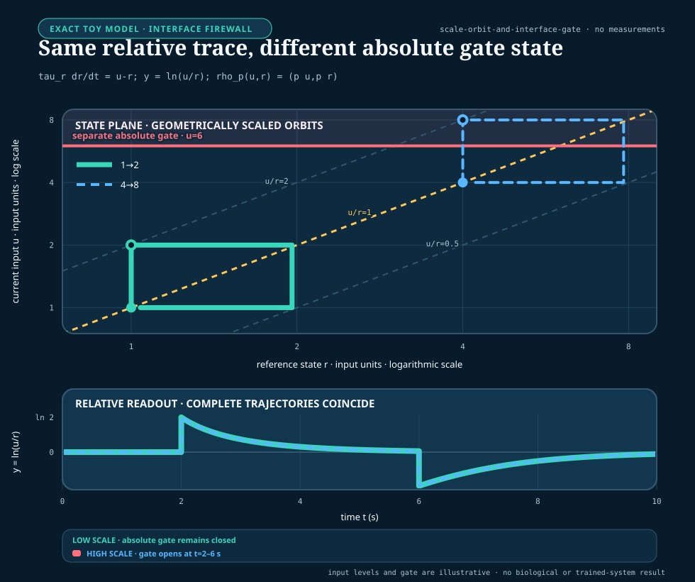

# Interface-qualified scale symmetry

<!-- markdownlint-disable MD013 -->

- **Purpose:** define and visualize full-trajectory fold-change detection,
  weaker lookalikes, observation-interface dependence, and the cost of
  preserving an absolute side channel
- **Claims:** [C-1540](../research/claims.md#c-1540)--[C-1549](../research/claims.md#c-1549)
- **Evidence audit:** [relative sensing and scale symmetry](../research/audits/2026-08-25-relative-sensing-scale-symmetry.md)
- **Experiment contract:** [Fixture F-026](../experiments/fixtures/026-interface-qualified-relative-sensing.md)
- **Result state:** analytical definitions and one illustrative exact model;
  no trained-model, biological, workstation or energy result

## Notation, units, and interfaces

| Symbol | Meaning | Unit |
| --- | --- | --- |
| $t$ | time | seconds (s) |
| $x(t)$ | internal state vector | model-declared |
| $u(t)$ | positive external input | model-declared input unit |
| $b$ | positive background input | same unit as $u$ |
| $p$ | positive multiplicative scale factor | dimensionless |
| $G$ | registered set of admissible scale factors | dimensionless set |
| $y(t)$ | output at one declared interface | model-declared |
| $r(t)$ | positive reference state | same unit as $u$ |
| $\tau_r$ | reference time constant | seconds (s) |
| $m$ | pulse fold multiplier | dimensionless |
| $D_{j,p}$ | normalized trajectory discrepancy | dimensionless |
| $s_{y,j}$ | frozen nonzero scale for output component $j$ | same unit as $y_j$ |

The observation chain is

$$
u_{\mathrm{external}}
\longrightarrow
u_{\mathrm{internal}}
\longrightarrow
y_{\mathrm{readout}}
\longrightarrow
a_{\mathrm{action}}.
$$

Scale symmetry at one arrow does not imply it at the next. The input, state,
readout, target and action must therefore be named independently.

## Exact full-trajectory definition

Consider a causal system

$$
\dot{x}=f(x,u),
\qquad
y=h(x,u),
$$

and let $x_{\mathrm{ss}}(b)$ be the initialized steady state associated with
positive background $b$. Exact FCD over scale support $G$ requires

$$
y\!\left(t; p u, x_{\mathrm{ss}}(pb)\right)
=
y\!\left(t; u, x_{\mathrm{ss}}(b)\right)
$$

for every registered input history, time, and $p\in G$. The equality is between
complete trajectories. Equality of a final value, peak, integral or selected
time point is insufficient.

Approximate FCD needs a frozen discrepancy, support, uncertainty model and
acceptance margin. It is not licensed by a visually attractive overlay.

## State-equivariance certificate

Assume the model has unique solutions on a declared forward-invariant positive
domain, and that $\rho_p$ maps that domain into itself for every $p\in G$.
Let $\rho_p$ transform internal state when the positive input is multiplied by
$p$. Under those conditions, a sufficient certificate is

$$
f\!\left(\rho_p(x),pu\right)
=
D\rho_p(x)f(x,u),
$$

$$
h\!\left(\rho_p(x),pu\right)
=
h(x,u),
$$

and

$$
\rho_p\!\left(x_{\mathrm{ss}}(b)\right)
=
x_{\mathrm{ss}}(pb).
$$

$D\rho_p(x)$ is the Jacobian of the state transformation. These equalities
belong to a defined model and observation map. Changing the output can change
both invariance and identifiability.

## Worked reference model

Use the positive-domain reference system

$$
\tau_r\dot r=u-r,
\qquad
y=\ln\frac{u}{r}.
$$

Under the transformation $(u,r)\mapsto(pu,pr)$, the state equation scales by
$p$ while the output remains

$$
\ln\frac{pu}{pr}=\ln\frac{u}{r}.
$$

If $r(0)=b$, then the transformed initial state is $pr(0)=pb$, so the entire
output trajectory is identical.

For a pulse that changes $u$ from $b$ to $mb$ at $t_0$ and returns to $b$ at
$t_1$, the reference during the pulse is

$$
r(t)
=
b\left[m-(m-1)e^{-(t-t_0)/\tau_r}\right],
\qquad t_0\le t<t_1,
$$

and the relative output is

$$
y(t)
=
\ln\frac{m}{m-(m-1)e^{-(t-t_0)/\tau_r}}.
$$

The background $b$ cancels. After the pulse, define

$$
q
=
(m-1)\left(1-e^{-(t_1-t_0)/\tau_r}\right).
$$

Then

$$
r(t)=b\left[1+q e^{-(t-t_1)/\tau_r}\right],
\qquad
y(t)=-\ln\left[1+q e^{-(t-t_1)/\tau_r}\right],
$$

which is again independent of $b$.

The figure uses $b\in\{1,4\}$, $m=2$, $\tau_r=1.25\,\mathrm{s}$ and an
illustrative absolute gate at $u=6$ input units. The relative traces coincide
exactly in this model, but the $4\rightarrow8$ pulse crosses the gate while the
$1\rightarrow2$ pulse does not. The gate is a mathematical counter-task, not a
biological or safety threshold.

## Weaker lookalikes

The constructions below are properties, not disjoint mechanism classes. A
static ratio map with its reference supplied at the interface can satisfy exact
trajectory symmetry, and endpoint return can coexist with equal peak. F-026
therefore keeps generator family as secondary provenance and evaluates
cross-cutting properties separately while retaining their logical dependencies.

### Finite-horizon endpoint return

A finite recorded trajectory can test return relative to each trajectory's own
prestimulus output. On a frozen discrete horizon with endpoint tolerance
$\varepsilon_{\mathrm{end}}$, define

$$
A_{\mathrm{end},j,h,p}
=
\mathbb{1}\!\left[
|y_{j,h,1,N}-y_{j,h,1,0}|\le\varepsilon_{\mathrm{end}}
\;\land\;
|y_{j,h,p,N}-y_{j,h,p,0}|\le\varepsilon_{\mathrm{end}}
\right].
$$

This finite-sample predicate is not general exact adaptation. A pulse can
return because the input itself returned, and one forced final sample says
nothing about causality or settling. Exact adaptation instead requires a
declared sustained-input equilibrium or registered settling-tail condition;
in the ideal infinite-horizon form,

$$
\lim_{t\rightarrow\infty}y(t)=y_0.
$$

Two systems can share $y_0$ while their peak, latency, width and tail differ.

### Weber-like peak equality

Peak equality is measured as maximum absolute departure from each trajectory's
own prestimulus value,

$$
P_{j,h,p}=\max_k |y_{j,h,p,k}-y_{j,h,p,0}|,
\qquad
P_{j,h,1}=\max_k |y_{j,h,1,k}-y_{j,h,1,0}|.
$$

The first maximizing sample is the frozen latency tie-break. Equality of
$P_{j,h,p}$ and $P_{j,h,1}$ does not constrain latency or the rest of the
trajectory.

### Static normalization

A static value $u_t/r_t$ has no necessary causal rule for producing, aging,
validating or resetting $r_t$. Its output can look relative while its reference
uses future data or stale support.

### Additive difference and derivative

For positive $u$ and a frozen positive reference unit $u_*$ with the same input
unit,

$$
\ln\frac{u(t)}{u_*}-\ln\frac{b}{u_*}
=\ln\frac{u(t)}{b}
$$

is invariant to a common multiplicative scale. In contrast,
$u(t)-b$ is invariant to a common additive offset, and $du/dt$ responds to a
rate in input units per second. Limited step or ramp families can confound
these statistics.

## Approximate trajectory score

For output component $j$, registered input history $h\in\mathcal H$, held-out
factor $p\in\mathcal P$, duration $T$ seconds and frozen nonzero scale
$s_{y,j}$, use

$$
D_{j,h,p}
=
\sqrt{
\frac{1}{T}
\int_0^T
\left\|
\frac{y_{j,h,p}(t)-y_{j,h,1}(t)}{s_{y,j}}
\right\|^2dt
}.
$$

The score is dimensionless. The scale $s_{y,j}$, integration grid, time
window, scale factors and uncertainty procedure must be frozen before
confirmation. Report peak, latency, duration and tail discrepancies separately
so a low integral error cannot hide one dangerous phase.

System-level classification uses the worst registered cell, not an unstated
average:

$$
D_{j,\max}=\max_{h\in\mathcal H,\,p\in\mathcal P}D_{j,h,p}.
$$

With frozen tolerances
$0\le\varepsilon_{\mathrm{exact}}<\varepsilon_{\mathrm{approx}}$, define the
tolerance-qualified class

$$
S_{\mathrm{system},j}=
\begin{cases}
\mathrm{exact}, & D_{j,\max}\le\varepsilon_{\mathrm{exact}},\\
\mathrm{approximate}, & \varepsilon_{\mathrm{exact}}<D_{j,\max}
\le\varepsilon_{\mathrm{approx}},\\
\mathrm{absent}, & D_{j,\max}>\varepsilon_{\mathrm{approx}}.
\end{cases}
$$

Missing or rejected cells do not disappear from the maximum; they make the
system classification unavailable and retain an abstention in its registered
denominator.

If an actionable arm receives both complete output trajectories on this grid,
$D_{j,h,p}$, paired trajectory match, finite-horizon endpoint return and peak
equality are directly computable. Their errors measure numerical conformance
and the resource cost of producing the values; they are not evidence that a
representation learned the properties. A predictive interpretation needs a
separately registered prospective observation cut, such as a withheld suffix,
scale cell, or future intervention. That cut must state what the arm observes,
what remains evaluator-only, and when its response freezes. Merely labelling a
publicly enumerated scale as “withheld” does not create confirmatory secrecy.

The RSD-T01 development foundation therefore separates three objects:

1. a complete history × scale descriptor grid, including multiple scale cells
   per shared initialization and a predeclared prospective role;
2. valid scientific hostile worlds with explicit support membership and
   expected leakage behavior; and
3. malformed-record sentinels, which test fail-closed parsing and never enter
   the scientific denominator.

Its dimensionless scale sets are

$$
\mathcal P_{\mathrm{development}}=\{2,4\},
\qquad
\mathcal P_{\mathrm{prospective}}=\{8\},
\qquad
\mathcal P=\mathcal P_{\mathrm{development}}
\cup\mathcal P_{\mathrm{prospective}}.
$$

Every $p\in\mathcal P$ multiplies the same $p=1$ reference trajectory and
shares the registered initialization identity. “Prospective” is a public
descriptor role here, not a concealed confirmation partition.

This descriptor foundation can test grid construction and aggregation while
the predictive observation cut remains blocked. It has no comparator-result or
claim authority.

For the current RSD-T01 contract the evaluator's property target is

$$
\boldsymbol\pi_j=
\left(
S_{\mathrm{system},j},
\{A_{\mathrm{end},j,h,p}\}_{h,p},
\{E_{\mathrm{peak},j,h,p}\}_{h,p},
M_{\mathrm{causal}},
\mathbf Q_{\mathrm{membership},j}
\right),
$$

where
$S_{\mathrm{system},j}\in\{\mathrm{exact},\mathrm{approximate},\mathrm{absent}\}$
is evaluated by $D_{j,\max}$ across the complete frozen history × scale grid
rather than inferred from one pair,
$A_{\mathrm{end},j,h,p}$ is the per-cell finite-horizon endpoint predicate,
$E_{\mathrm{peak},j,h,p}$ is the per-cell tolerance-qualified equality of
$P_{j,h,p}$ and $P_{j,h,1}$,
$M_{\mathrm{causal}}$ requires a machine-readable state equation or identifying
intervention, and
$\mathbf Q_{\mathrm{membership},j}$ is generator truth with one
$\{\mathrm{inside},\mathrm{outside}\}$ coordinate for each registered support
axis: input domain, transformation family, instrument range, initialization
contract, causal observation contract, and evaluation window. This vector
prevents an additive transformation, clipped measurement, hidden reset, or
future-aware normalizer from being collapsed into one ambiguous bit. An arm's
support-detection decision is a separate output because detectability depends
on its observation interface. The endpoint and peak matrices remain primary
data. A compact summary may use only the frozen reducer
`all` when every registered cell is true, `none` when every cell is false, and
`partial` otherwise; it may not silently substitute a mean. These coordinates
are asserted without using the generator-family name, but they are not
logically independent: exact trajectory equality, for example, implies equal
peak under the same peak definition.

The public generator-only smoke layer records a narrower per-world vector:
paired-trajectory match, finite-horizon endpoint return, peak-amplitude
equality, `causal_memory_status: unassessed`, and
`support_membership: inside`. It does not promote one paired trace to a system
symmetry certificate. That legacy scalar is a narrower v2 smoke field; it does
not replace the axis-qualified vector in the scientific-grid foundation.

### Property vector, not family label

The family ID remains a secondary synthetic diagnostic. The primary vector is
evaluated from the registered trajectory grid, structural equations and
interventions; it is never copied from a family-to-property lookup. The current
smoke records only its directly observable subset and marks causal memory
unassessed. The editable figure
specification is the `rsd-t01-family-property-overlap` entry in
[`core-models.json`](../assets/plots/core-models.json).

RSD-T02 uses the same rule at a deeper causal level. Its dedicated
[intervention-qualified mechanism-equivalence note](interventional-mechanism-equivalence.md)
constructs five exact matched-step recipes, scores separately certified
structural properties and retains observational equivalence or abstention. It
also keeps the Skataric--Nikolaev--Sontag fast-boundary-layer endpoint separate
from the RMS score above: the source-qualified floor is a supremum-norm result
on an $\epsilon$-scaled temporal grid, while an integrated RMS discrepancy can
vanish as the layer narrows.

## Validity and failure boundaries

1. **Positive support.** Log ratio is undefined at zero and changes meaning
   across sign. A hidden epsilon is not a scientific solution.
2. **Saturation and clipping.** Multiplicative histories can become
   observationally identical for the wrong reason.
3. **Additive shift.** A ratio-qualified model need not transfer across added
   backgrounds.
4. **Reference age.** A stale or contaminated $r_t$ changes the statistic even
   when the current $u_t$ is valid.
5. **Initialization.** Comparing trajectories from unmatched states does not
   test the stated symmetry.
6. **Protocol support.** Steps alone do not certify pulses, ramps, stochastic
   histories or closed-loop action.
7. **Interface.** Relative encoding upstream can become absolute or
   difference-based downstream.
8. **Absolute target.** If the target depends on $u$ rather than $u/r$, a
   relative-only representation is insufficient by construction.

## Observation and recoverability

If an output is exactly invariant under a transformation, that transformed
quantity can be structurally unidentifiable from that output interface under
the declared initialized model. This is an observation-qualified statement,
not universal destruction of information. Recoverability can change when one
adds an output, fixes a parameter, changes initialization, or supplies a
calibrated absolute observation.

F-026 therefore reports three axes separately:

1. robustness to nuisance multiplicative scale;
2. recoverability of every protected absolute quantity; and
3. complete observation, state, compute and maintenance cost.

## Resource model

The authoritative report is a typed vector, not a sum of unlike units:

$$
\mathbf q=
\left(
L_{\mathrm{task}},
\mathbf r_{\mathrm{risk}},
N_{\mathrm{op}},
B_{\mathrm{comm}},
B_{\mathrm{state}},
T_{\mathrm{wall}},
E_{\mathrm{ws}},
N_{\mathrm{ref}}
\right).
$$

Here $L_{\mathrm{task}}$ retains its task-native unit;
$\mathbf r_{\mathrm{risk}}$ retains one registered unit per risk component;
$N_{\mathrm{op}}$ and $N_{\mathrm{ref}}$ are operation and reference-lifecycle
counts; $B_{\mathrm{comm}}$ and $B_{\mathrm{state}}$ are bytes;
$T_{\mathrm{wall}}$ is seconds; and measured workstation energy
$E_{\mathrm{ws}}$ is joules. None is inferred from another.

If a frozen decision rule genuinely needs a scalar diagnostic, every component
requires its own conversion weight into one declared decision unit:

$$
J=
\lambda_L L_{\mathrm{task}}
+\boldsymbol{\lambda}_r^{\mathsf T}\mathbf r_{\mathrm{risk}}
+\lambda_N N_{\mathrm{op}}
+\lambda_{Bc}B_{\mathrm{comm}}
+\lambda_{Bs}B_{\mathrm{state}}
+\lambda_TT_{\mathrm{wall}}
+\lambda_EE_{\mathrm{ws}}
+\lambda_U N_{\mathrm{ref}}.
$$

Reference updates, calibration, resets, selector execution, abstention,
fallback, writes and artifacts must appear in the appropriate count, byte and
time components. A biological FCD paper does not supply any of these AI
conversion weights.

## Test and retirement conditions

The relative translation remains viable only if it:

1. lowers held-out task loss or complete work against static, streaming,
   log-ratio, state-space and recurrent nulls;
2. preserves every absolute-critical counter-task or abstains before action;
3. survives non-step multiplicative histories inside declared support;
4. rejects additive, near-zero, saturated and stale-reference cases; and
5. retains its advantage after reference maintenance and fallback are charged.

Retire the translation if a simpler explicit transform or ordinary estimator
matches it, if full-trajectory invariance collapses to peak equality, or if a
calibrated absolute channel recreates the cost of keeping raw state everywhere.
