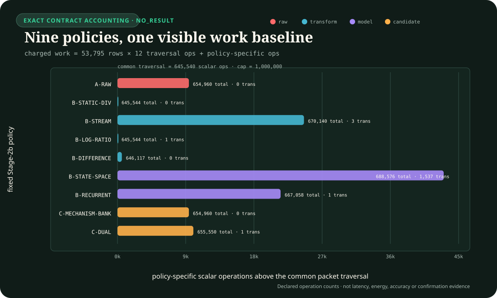
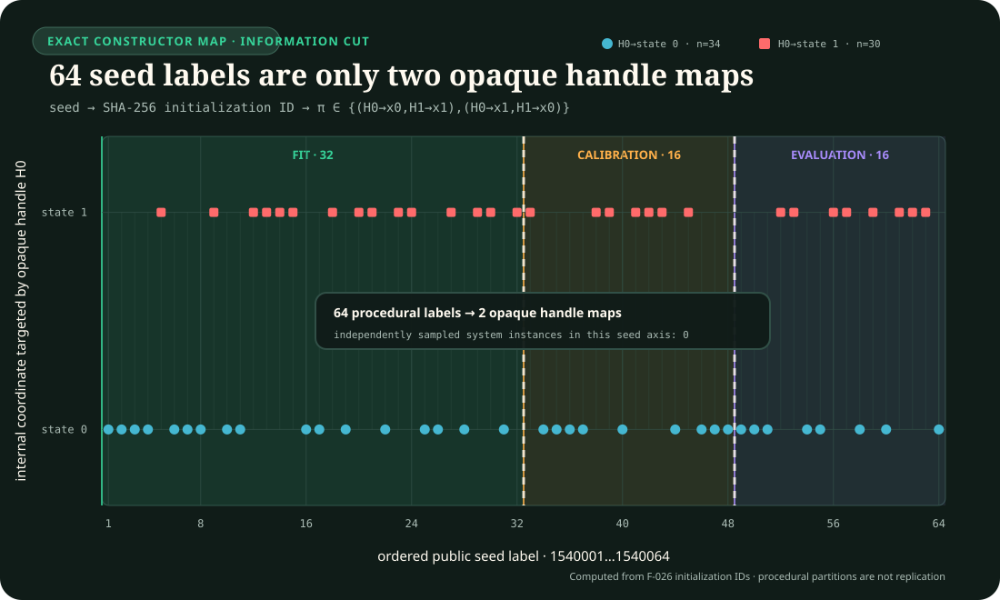
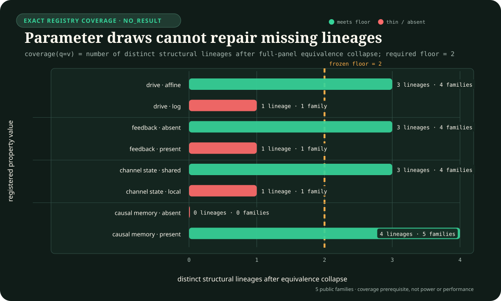
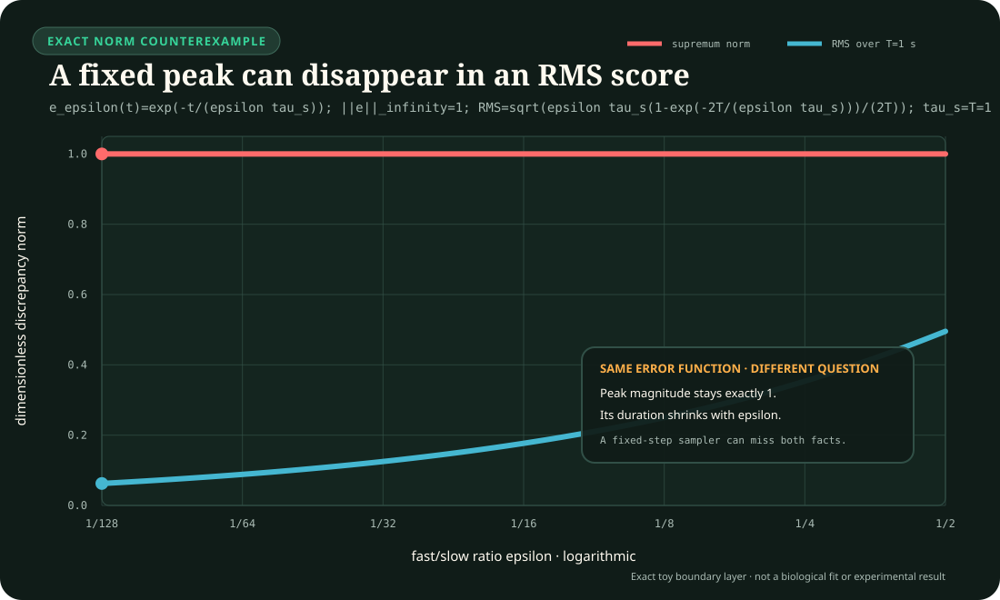

# Intervention-qualified mechanism equivalence

<!-- markdownlint-disable MD013 -->

- **Purpose:** freeze the equations, property ontology, intervention interface,
  abstention rule and singular-boundary-layer metric for RSD-T02
- **Claims:** [C-1541](../research/claims.md#c-1541) and
  [C-1560](../research/claims.md#c-1560),
  [C-1561](../research/claims.md#c-1561),
  [C-1562](../research/claims.md#c-1562),
  [C-1563](../research/claims.md#c-1563),
  [C-1564](../research/claims.md#c-1564),
  [C-1565](../research/claims.md#c-1565),
  [C-1566](../research/claims.md#c-1566),
  [C-1567](../research/claims.md#c-1567), and
  [C-1568](../research/claims.md#c-1568)
- **Evidence audits:** [mechanism equivalence and intervention-qualified discrimination](../research/audits/2026-08-26-rsd-t02-mechanism-equivalence.md) · [population, identifiability, calibration, and null maturity](../research/audits/2026-08-27-rsd-t02-population-identifiability-calibration.md)
- **Decisions:** [0019 — score interventional properties, not generator names](../decisions/0019-score-interventional-properties-not-generator-names.md) · [0020 — separate information cuts from scientific replication](../decisions/0020-separate-information-cuts-from-replication.md) · [0021 — bind population inference to system lineages and instances](../decisions/0021-bind-population-inference-to-system-lineages-and-instances.md)
- **Experiment contract:** [Fixture F-026, RSD-T02](../experiments/fixtures/026-interface-qualified-relative-sensing.md#rsd-t02--mechanism-discrimination-under-matched-step-behavior)
- **Result state:** public-development equation and contract foundation;
  `NO_RESULT`, no implemented estimator comparison, no confirmation custody and
  no energy measurement

## Two different questions

RSD-T02 contains two linked but mathematically different strata:

1. `T02-MECH` asks which structural or interventional properties can be
   distinguished after several synthetic systems are forced to have the same
   canonical step response.
2. `T02-FLOOR` asks whether an estimator recovers a source-qualified
   supremum-norm error floor in a singularly perturbed system.

The first is a model-discrimination problem. The second is a norm and temporal
resolution problem. Combining them into one family label or one integrated
trajectory score would make both endpoints ambiguous.

## Notation and units

| Symbol | Meaning | Unit |
| --- | --- | --- |
| $t$ | physical time | seconds (s) |
| $u_c(t)$ | input on channel $c\in\{A,B\}$ | input unit (U) |
| $b$ | registered positive background | U |
| $v_c(t)=u_c(t)/b$ | background-normalized input | dimensionless |
| $F_*$ | canonical fold, fixed to $2$ | dimensionless |
| $\tau_*$ | matched response time constant | s |
| $x,a,r_c,z$ | internal states | dimensionless |
| $\widetilde y(t)$ | internal output before a registered clamp | dimensionless |
| $y(t)$ | reported output | dimensionless |
| $P$ | registered intervention panel | finite set |
| $D_{\infty}^{m,n,i}$ | maximum output difference between recipes $m,n$ under intervention $i$ | dimensionless |
| $D_2^{m,n,i}$ | RMS output difference | dimensionless |
| $\epsilon$ | fast/slow time-scale ratio | dimensionless |
| $p$ | positive multiplicative scale factor | dimensionless |
| $E_{\infty}(\epsilon,p)$ | maximum instantaneous FCD discrepancy | dimensionless |
| $E_2(\epsilon,p)$ | integrated RMS discrepancy | dimensionless |

The synthetic T02 input support uses $b\in\{0.5,2,8\}\,\mathrm U$,
$\tau_*\in\{0.5,1,2\}\,\mathrm s$, and strictly positive normalized input.
These are frozen benchmark design values, not biological estimates.

## Exact matched-step construction

Every mechanism recipe starts at the steady normalized background $v=1$ and
receives the canonical step $v:1\rightarrow F_*$. All five recipes must produce

$$
y_*(t)=e^{-t/\tau_*},
\qquad t\ge0.
$$

This removes ordinary step fit as a discriminator by construction. The
generator recipe remains evaluator-only provenance.

### Input-driven incoherent feed-forward recipe

Use

$$
\tau_*\dot x=v-x,
\qquad
\widetilde y=\frac{v-x}{F_*-1},
\qquad
x(0^-)=1.
$$

The direct $v\rightarrow y$ path and delayed antagonistic
$v\rightarrow x\rightarrow y$ path form the operational feed-forward
structure. For a constant post-step input $F_*$,

$$
x(t)=F_*-(F_*-1)e^{-t/\tau_*},
$$

and therefore $\widetilde y(t)=e^{-t/\tau_*}$.

This is a synthetic reduced recipe inspired by the functional structure. It is
not asserted to be the molecular equation set of a particular organism.

### Nonlinear output-feedback recipe

Let

$$
\widetilde y=\frac{v-a}{F_*-1},
$$

$$
\tau_*\dot a
=
(F_*-1)y
+
\kappa(v-1)(v-F_*)y^2,
\qquad
a(0^-)=1,
\qquad
\kappa=0.25.
$$

Normally $y=\widetilde y$. During the registered output-clamp intervention,
$y=0$ is forced inside the feedback edge while $\widetilde y$ remains
evaluator-visible after response freeze. The nonlinear term is zero at both
$v=1$ and $v=F_*$. On the canonical step,

$$
\tau_*\dot a=F_*-a,
$$

which gives the same $y_*(t)$. Away from that step and under the output clamp,
the state update differs.

### Channel-local receptor/reference memory

For $c\in\{A,B\}$, use

$$
\tau_*\dot r_c
=
\chi_c(t)\,[v_c-r_c],
\qquad
r_A(0^-)=r_B(0^-)=1,
$$

$$
\widetilde y
=
\frac{v_{c_{\mathrm{active}}}-r_{c_{\mathrm{active}}}}{F_*-1}.
$$

$\chi_c(t)=1$ only for the active channel. The inactive channel retains its
own reference. The first active-channel step again yields $y_*(t)$, while
same-channel and cross-channel restimulation test state locality.

### Static normalization plus an ordinary high-pass readout

Define the static affine fold transform

$$
\phi_{\mathrm{lin}}(v)=\frac{v-1}{F_*-1},
$$

followed by

$$
\tau_*\dot z=\phi_{\mathrm{lin}}(v)-z,
\qquad
\widetilde y=\phi_{\mathrm{lin}}(v)-z,
\qquad
z(0^-)=0.
$$

The normalization reference $b$ is static, but the complete system is not
memoryless: the ordinary high-pass filter has causal state. On the canonical
step $\phi_{\mathrm{lin}}=1$, so $z=1-e^{-t/\tau_*}$ and
$\widetilde y=y_*(t)$.

This recipe is input--output isomorphic to the reduced I1-FFL recipe under the
registered affine interface. Their names must not be forced apart.

### Explicit log difference plus the same readout order

For $v>0$, define

$$
\phi_{\log}(v)=\frac{\ln v}{\ln F_*},
$$

$$
\tau_*\dot z=\phi_{\log}(v)-z,
\qquad
\widetilde y=\phi_{\log}(v)-z,
\qquad
z(0^-)=0.
$$

The canonical step again has $\phi_{\log}=1$. Other folds and ramps distinguish
the log transform from the affine transform. Nonpositive input is outside
support and forces abstention; no hidden numerical epsilon is inserted.

## Matched-step certificate

For recipes $m$ and $n$, background $b$, time constant $\tau_*$ and output
samples $t_k$, define

$$
D_{\mathrm{step},\infty}^{m,n}
=
\max_k |y_m(t_k)-y_n(t_k)|.
$$

A public-development pack is invalid unless:

1. every initialization residual is at most $10^{-12}$;
2. every registered recipe pair has
   $D_{\mathrm{step},\infty}^{m,n}\le10^{-10}$;
3. the canonical step policy projection contains no recipe, equation, state,
   parameter or property identifier; and
4. every actionable arm receives the same projection hash.

The tolerances are benchmark design constants. They are not empirical
biological margins and grant no result authority.

## Property vector and equivalence

The primary target is the evaluator-certified vector

$$
\boldsymbol\pi
=
\left(
T_{\mathrm{drive}},
F_{y},
C_{\mathrm{local}},
M_{\mathrm{causal}}
\right),
$$

where:

1. $T_{\mathrm{drive}}\in\{\text{affine-fold},\text{log-fold}\}$;
2. $F_y$ states whether the reported output participates in a state-update
   feedback edge;
3. $C_{\mathrm{local}}$ states whether reference state is channel-local;
4. $M_{\mathrm{causal}}\in\{\text{true},\text{false},\text{unassessed}\}$ is
   certified from equations or an identifying intervention, never from a
   finite trace alone.

Nonlinear update form remains equation provenance in the v1 bank. It perfectly
co-varies with the output-feedback coordinate across these five worlds, so the
contract cannot honestly score it as a separately identified property without
adding a counterworld that breaks that dependence.

For intervention panel $P$, observation map $h$, sample grid $\mathcal T$ and
initialized recipes $m,n$, define

$$
D_{\infty}^{m,n,i}
=
\max_{t_k\in\mathcal T_i}
|y_m^i(t_k)-y_n^i(t_k)|,
$$

$$
D_2^{m,n,i}
=
\sqrt{
\frac{1}{T_i}
\int_0^{T_i}
[y_m^i(t)-y_n^i(t)]^2dt
}.
$$

A pair with different property vectors is numerically separated only when one
frozen intervention has estimate $\widehat D_{\infty}^{m,n,i}$ and numerical
error bound $\eta$ satisfying

$$
\widehat D_{\infty}^{m,n,i}-\eta\ge10^{-3},
\qquad
\eta\le10^{-8}.
$$

An analytic equivalence or a complete bounded finite-grid equivalence with
$\widehat D+\eta\le10^{-10}$ may retain both recipes. A claimed analytic
equivalence that conflicts with its numerical bound is invalid rather than
silently unresolved. Every other case is unresolved.

The I1-FFL and affine high-pass recipes deliberately share one operational
property vector and one full-panel equivalence class. Guessing between their
hidden names is an error, not added accuracy.

The v1 construction certificates are scoped to $b=2\,\mathrm U$,
$\tau_*=1\,\mathrm s$, a $24\,\mathrm s$ horizon, 64 output samples per
second and binary64 RK4. Discontinuous commands use half-open intervals and
the left limit for the final RK4 stage ending on an event; the next step starts
from the right-limit command. Distances at internal steps $1/1024\,\mathrm s$
and $1/2048\,\mathrm s$ must differ by at most $10^{-12}$. The conservative
construction lower bounds are $0.23$ for the clamp and cross-channel
certificates and $0.07$ for the affine-versus-log ramp certificate. These
margin checks reproduce a synthetic construction; they are not empirical
mechanism evidence or confirmation results.

## Nested intervention panels

The full fixed panel contains exactly 26 episodes:

1. three canonical steps at the three backgrounds;
2. six repeated-pulse cells obtained from
   $w\in\{1/8,1/2,2\}\,\mathrm s$ and
   $\Pi\in\{1/2,2,8\}\,\mathrm s$ with $w<\Pi$;
3. eight ramps: linear or exponential, up or down, each lasting $0.5$ or
   $4\,\mathrm s$;
4. two opaque-state resets;
5. two opaque-state freezes;
6. one reported-output clamp;
7. two interrupted-ramp holds lasting $0.5$ or $4\,\mathrm s$; and
8. same-channel and cross-channel restimulation.

Every episode lasts $24\,\mathrm s$. The noncanonical episodes use
$b=2\,\mathrm U$ and $\tau_*=1\,\mathrm s$. Periodic pulses have
$v(t)=2$ on $[j\Pi,j\Pi+w)$ while that interval remains inside the episode and
$v(t)=1$ otherwise. For ramp duration $d$, let
$s(t)=\min\{1,\max\{0,t/d\}\}$. Linear-in-fold ramps use

$$
v(t)=1+s(t)(v_1-1),
$$

and linear-in-log-fold ramps use

$$
v(t)=\exp\!\left[s(t)\ln v_1\right],
$$

with $v_1=2$ for up-ramps and $v_1=0.5$ for down-ramps. Reset occurs at
$0.75\,\mathrm s$; state freezes and the reported-output clamp occupy
$[0.5,1)\,\mathrm s$. Interrupted ramps pause after one second of active ramp
progress and resume after the registered hold. Restimulation drives channel A
on $[0,1)\,\mathrm s$, returns both channels to one on $[1,2)\,\mathrm s$,
then drives A or B on $[2,3)\,\mathrm s$. The machine contract carries these
numbers in each episode descriptor.

Every recipe exposes two opaque handles. A single-state recipe receives an
inert padding state, and a seed-derived hidden permutation maps states to
handles. State count and semantic node names therefore do not identify the
recipe.

The observation regimes are:

1. `O0-MATCHED-STEP`: three background episodes and at most 4,611 sample rows
   per conditioned $\tau_*$ model instance. The construction runtime crosses
   $\tau_*=0.5,1,2,\mathrm s$, so each recipe has nine executions and 13,833
   rows; every varying structural coordinate requires abstention.
2. `O1-FULL-PANEL`: all 26 episodes and at most 39,962 sample rows at the fixed
   $\tau_*=1,\mathrm s$ construction scope; this is the full-panel regime.
3. `O2-SELECT6`: the three step episodes plus at most six selected queries, no
   more than two privileged internal queries, and at most 13,833 sample rows;
   it is a secondary active-design regime.

The current code freezes these regimes and analytic construction certificates.
An additive whole-system Stage 2 now implements all nine registered
public-development policy-conformance references. These fixed policies close
the executable feature-family matrix; they do not constitute trained
estimators, calibrated posteriors, mature nulls, a claim-eligible run or a
comparison.

## Fixed whole-system policy-conformance references

Let the ordered packet be $P=(P_1,\ldots,P_{35})$ with 53,795 sample rows.
All nine active policies receive the same canonical bytes and common cap. Their
responses are committed before `O-GRAPH` opens any member of $P$. The bands
below were chosen after inspecting the five enumerated public construction
worlds. They are therefore **construction-tuned protocol constants**, not
fitted parameters or confirmation-calibrated decision limits.

Each packet is evaluated in a fresh Node child and one new hardened VM context.
The self-contained bank evaluates the nine ordered policies in that context.
The child receives one canonical LF JSON request and can read only the verified
SHA-named policy bundle. The policy VM receives no
process, filesystem, network, environment, clock, random or evaluator
capability.
Request, packet, configuration, bundle and runtime identities are bound into
the returned receipt. Time, memory, request, stdout and stderr are capped, and
any timeout, crash, malformed frame, replay or work-envelope violation becomes
an ordered pre-evaluator abstention with no retry or same-process fallback. The
runner atomically persists that outcome as a self-hashed
`rsd-t02-arm-abstention.json`, replay-binds it on later invocations and forbids
it from coexisting with the commitment or evaluator ledger.
Commitment creation remains exclusive and file-synchronized before the raw
evaluator ledger opens. The generator and evaluator are still statically
loaded before their later file fingerprints, so concurrent repository mutation
across that parent-module load boundary remains outside this
public-development authority; the policy computation itself executes from the
verified content-addressed bundle.

The six transform-policy references added in Stage 2b are deliberately small
and causal. Let $y_k$ be the reported output, $u_k$ the active-channel input,
$u_0$ the same-episode initial background, $r_k=u_k/u_0$, and
$\Delta t=1/64\,\mathrm s$.

`A-RAW` uses no engineered drive coordinate. It reads the intervention traces
directly:

$$
z_f=|y_{\mathrm{CLAMP}}(1\,\mathrm s)|,
\qquad
z_c=\max_{2\le t\le3}|y_{\mathrm{RESTIM}}(t)|,
$$

and uses the reset/freeze distance $h$ defined below. It declares a feedback
edge for $z_f\ge0.5$, no edge for $z_f\le0.45$, local channel state for
$z_c\ge0.9$, shared state for $z_c\le0.85$, memory for $h\ge0.1$, and no
memory for $h\le10^{-8}$. It always abstains on the drive transform.

`B-STATIC-DIV` evaluates the ramp at $t=0.25\,\mathrm s$ using

$$
z_s=\frac{y(t)}{r(t)-1}.
$$

It declares log-fold for $z_s\ge0.98$, affine-fold for $z_s\le0.92$, and
otherwise abstains. `B-LOG-RATIO` instead uses the positive-domain coordinate

$$
z_\ell=\frac{y(t)}{\log_2 r(t)},
$$

declaring log-fold for $z_\ell\ge0.85$, affine-fold for $z_\ell\le0.8$, and
abstaining when the logarithm is undefined or the evidence lies in the gap.

`B-DIFFERENCE` uses only the first 64 ramp increments. With
$\dot y_k=(y_k-y_{k-1})/\Delta t$ and
$\dot r_k=(r_k-r_{k-1})/\Delta t$, its projection coefficient is

$$
z_d=
\frac{\sum_{k=1}^{64}\dot y_k\dot r_k}
     {\sum_{k=1}^{64}\dot r_k^2}.
$$

It declares affine-fold for $z_d\ge0.78$, log-fold for $z_d\le0.77$, and
otherwise abstains.

`B-STREAM` processes each selected trace in chronological order. For
$\alpha=\exp[-\Delta t/(0.25\,\mathrm s)]$, it updates

$$
\delta_k=y_k-m_{k-1},\qquad
m_k=\alpha m_{k-1}+(1-\alpha)y_k,
\qquad
v_k=\alpha v_{k-1}+(1-\alpha)\delta_k^2,
$$

and scores the causal standardized innovation
$z_k=|\delta_k|/(\sqrt{v_k}+1)$. Clamp-release evidence at one second uses
true/false thresholds $0.38/0.30$; cross-channel restimulation at two seconds
uses $0.94/0.85$. Intermediate evidence abstains.

`C-DUAL` requires all three drive votes from $z_s$, $z_\ell$, and $z_d$ to be
present and identical. It then carries the supported raw intervention
decisions for the other three coordinates. Missing or discordant drive votes
produce an abstention; the frozen fallback count is zero.

For `B-STATE-SPACE`, define the fold $r_k=u_k/u_0$ and two fixed drives

$$
\phi_{\mathrm{aff}}(r)=r-1,
\qquad
\phi_{\log}(r)=\log_2 r.
$$

For each drive, the reference recursion and one-step reported-output residual
are

$$
x_{k+1}=x_k+\Delta t\,[\phi(r_k)-x_k],
\qquad
e_k=y_k-[\phi(r_k)-x_k].
$$

With $S_j=n^{-1}\sum_k e_{j,k}^2$, the margin
$m=S_{\log}-S_{\mathrm{aff}}$ declares affine for $m\ge10^{-5}$, log for
$m\le-10^{-5}$, and otherwise abstains. Its memory signature is

$$
h=\max\{\lVert y_{\mathrm{RESET-H0}}-y_{\mathrm{RESET-H1}}\rVert_\infty,
\lVert y_{\mathrm{FREEZE-H0}}-y_{\mathrm{FREEZE-H1}}\rVert_\infty\}.
$$

It declares memory present for $h\ge0.1$, absent for $h\le10^{-8}$, and
otherwise abstains. Feedback-edge and channel-local coordinates are always
outside this reference's bounded scope.

For `B-RECURRENT`, the causal state update is

$$
x_{k+1}=\alpha x_k+(1-\alpha)y_k,
\qquad
\alpha=\exp[-\Delta t/(0.25\,\mathrm s)].
$$

The absolute innovation at reported-output clamp release declares a feedback
edge for values at least $0.45$, no edge for values at most $0.35$, and
otherwise abstains. A separate state per observed channel gives the
cross-channel restimulation innovation; values at least $0.9$ declare local
state, values at most $0.85$ declare shared state, and intermediate values
abstain. Drive and causal-memory coordinates remain outside this reference's
scope.

`C-MECHANISM-BANK` uses four direct, frozen source-shaped signatures: linear
up-ramp output at $0.25\,\mathrm s$ (log at least $0.48$, affine at most
$0.46$), absolute clamp-release output (feedback at least $0.5$, absent at
most $0.45$), maximum absolute cross-restimulation output on $[2,3],\mathrm s$
(local at least $0.9$, shared at most $0.85$), and $h$ above (memory at least
$0.1$, absent at most $10^{-8}$). Every indifference band forces abstention.
The five candidate equation identities and their bytes are charged separately
from the four distinct joint property-prior vectors and their bytes.

The semantic output is the joint set

$$
\mathcal V(P)=\{v(M):M\in\mathcal M,\ v_q(M)=\widehat v_q
\text{ for every declared coordinate }q\},
$$

with duplicate vectors removed but their compatible hypothesis IDs retained.
$\mathcal V(P)$ must be nonempty, and every declared marginal must agree with
every member of $\mathcal V(P)$. This prevents independently plausible
marginals from forming an impossible property combination.

Resource accounting is three-part: (1) shared acquisition of 35 episodes,
53,795 rows, 197 input commands, two resets, two freezes, one output clamp, one
channel switch and two state writes; (2) policy construction/prior artifacts,
threshold provenance, equations, vectors, labels and tuning; and (3) actual
per-inference work. Every policy is charged 12 declared traversal operations
per row, or 645,540 before its specific operations. Common caps are $10^6$
scalar operations, 2,000 transcendental evaluations, 128 retained-state bytes,
4,096 influential-parameter bytes, 16 MiB scratch, 256 KiB combined policy and
configuration artifacts, and zero fallbacks. Actual counts are not padded to
the caps. Across the nine references, charged scalar work ranges from 645,544
(`B-STATIC-DIV` and `B-LOG-RATIO`) to 688,576 (`B-STATE-SPACE`), including the
common packet traversal. Wall time and joules remain null.



The plot exposes the common charge and the remaining policy-specific work
without turning the declared scalar-operation model into a wall-time, energy
or architecture-ranking claim.

The repeated-pulse grid is retained because the Rahi evidence makes
refractory stabilization and period skipping useful one-sided signatures in a
different bounded model class. The current five-world bank does not instantiate
that signature: its registered feedback nonlinearity is zero at both square-
pulse levels. C-1561 is specified separately in the
[repeated-stimulus topology-signature contract](repeated-stimulus-topology-signatures.md);
it is not a claim supported by these five-world construction tests.

## Prospective fit, calibration and evaluation cut

The Stage-3 design partitions the ordered 64-seed public pack once: ordered
positions 1--32 are `fit`, 33--48 are `calibration`, and 49--64 are
`evaluation`. The literal seed labels remain the frozen values
`1540001`--`1540064`; the position numbers are not substitute seeds.
Parameters and fit-only model selection stop at the first boundary;
probability calibration plus support and abstention thresholds stop at the
second; evaluation is one-pass frozen inference and scoring. Every future
artifact must bind the preceding artifact and the exact partition identity.

That split controls access, not replication. In the present generator, a seed
selects one of only two hidden permutations of two opaque state handles. The
permutation can swap which internal coordinate a reset or freeze targets, but
it does not sample a new equation, parameter set, input history or noisy
system. The 64 labels therefore cannot be analyzed as 64 independent systems,
and the public split has no comparison or power authority.
This is the scoped experimental-unit problem described by
[Hurlbert (1984)](https://doi.org/10.2307/1942661), bibliography key
[`hurlbert1984pseudoreplication`](../research/references.bib), not a statement
that seeds can never be valid units in other generators.



The plotted points are computed from the checked-in initialization-ID and
opaque-permutation functions. The colored regions show the access cut; they do
not add independent system variation.

The two generic references become mature nulls only after trainable causal
state-space and compact recurrent estimators are implemented against the same
fixed-parameter packet schema, with no direct plant state, recipe or equation access.
Their construction, selection, calibration, failures and fallbacks enter the
resource ledger. A later confirmatory comparison needs independently generated
held-out system instances and an outer system-family holdout; neither exists in
the present five-world bank.

For that later design, the fixed primary endpoint families are mean property
log loss in nats and mean dimensionless decision loss. Coverage, selective
risk, reliability, compatible-vector coverage and the resource vector are
reported alongside them. The earlier Stage-3 wording grouped the two
candidate-versus-generic-null contrasts within each endpoint. The later
population contract supersedes that weaker boundary and uses the sequentially rejective procedure of
[Holm (1979)](https://www.jstor.org/stable/4615733), bibliography key
[`holm1979sequential`](../research/references.bib), once across all four fixed
endpoint-by-comparator hypotheses at familywise $\alpha=0.05$. Sample size must be powered before private
confirmation seeds are created; 16 public evaluation labels are not assumed
sufficient.

The closed machine form is
[`rsd-t02-stage3-design.json`](../experiments/workstation/fixture-026/configs/rsd-t02-stage3-design.json),
validated by
[`rsd-t02-stage3-design.mjs`](../experiments/workstation/fixture-026/rsd-t02-stage3-design.mjs).

## Prospective system population and outer-family boundary

The information cut above remains valid, but it is not a population design.
The next contract uses the following nesting, from inferentially broad to
repeated measurement:

$$
\text{design}\supset\text{structural lineage}\supset\text{family}
\supset\text{independent instance}\supset\text{packet}
\supset\text{episode}\supset\text{realization}.
$$

A procedural seed is only a replay key. A family is one frozen equation
template plus a declared parameter distribution. An instance is one accepted
parameter vector drawn independently from that family; it is the unit for a
fixed-family estimand. Episodes, rows, property coordinates, solver refinements
and noise realizations remain nested measurements and never increase the
reported independent $n$.

This distinction also invalidates a tempting reuse of the current packet. Its
nine O0 executions cross $\tau_*=0.5,1,2\,\mathrm s$, while its 26 O1
executions hold $\tau_*=1\,\mathrm s$. One population instance must bind one
parameter vector—including one time constant—across every episode. The old
mixed-$\tau$ packet remains a construction-conformance artifact; a population
packet must be regenerated per fixed parameter vector.

The first defensible claim mode is a **fixed finite family panel**. Visible
development families and separately sealed outer-confirmation and
outer-transfer families are split by structural lineage, not by recipe label or
instance. Related equations, derivations, code siblings and full-panel-
equivalent recipes share a leakage group and cannot cross partitions. An outer
result therefore generalizes only to the prospectively frozen weighted panel,
not to arbitrary future mechanisms. A family-superpopulation claim requires a
separate frozen probabilistic family grammar and powers on independently drawn
families or lineages.

For coordinate $q$, instance $i$, family $f$ and arm $a$, first aggregate the
coordinate loss inside the instance,

$$
\ell_{afi}=\sum_q w_q L_{afiq},
\qquad
d_{fi}^{a,b}=\ell_{afi}-\ell_{bfi}.
$$

Then form the equal-family weighted contrast

$$
\widehat\Delta^{a,b}=\sum_f w_f\bar d_f^{a,b},
\qquad
\bar d_f^{a,b}=\frac{1}{n_f}\sum_i d_{fi}^{a,b},
\qquad
w_f=\frac1F.
$$

Resampling occurs over instances within the fixed families; rows are never
resampled as independent systems. The prospective power artifact must freeze
the smallest effect of interest, alpha, power, family heterogeneity, family and
instance counts, abstention coverage, failure disposition and the calculation
implementation hash before private responses. The experiment-level success
rule applies Holm's procedure across all four fixed endpoint-by-comparator
hypotheses at $\alpha=0.05$; controlling two contrasts separately inside each
endpoint would not close the cross-endpoint multiplicity boundary.

The causal-memory coordinate is not primary-scorable in this first population
design because the current family bank contains no valid memory-negative
lineage. It can become primary only after both values have prospective,
lineage-diverse coverage. Outer family templates and truth remain encrypted or
evaluator-custodied until the model, calibration, thresholds, analyzer,
resource caps and power plan are frozen. A bare public hash is a commitment,
not secrecy for a small family search space.

The closed prospective machine form is
[`rsd-t02-population-design.json`](../experiments/workstation/fixture-026/configs/rsd-t02-population-design.json),
validated by
[`rsd-t02-population-contract.mjs`](../experiments/workstation/fixture-026/rsd-t02-population-contract.mjs).

## Exact public fixed-instance construction

The public family registry currently contains the five named equation
families only. Four generator-conformance coordinates are crossed with every
family, producing 20 metadata artifacts. This count tests deterministic
construction; it is not a powered sample size.

For family $f$, draw index $j$, parameter key $k$, and HMAC attempt $a$, let

$$
w_{f,j,k,a}
=
\operatorname{U64BE}
\left[
\operatorname{HMAC}_{K_{\mathrm{public}}}
\left(
\operatorname{canon}(d,H_{\mathcal F},H_f,f,v_f,j,k,a)
\right)_{0:8}
\right].
$$

$H_{\mathcal F}$ hashes the ordered scientific family definitions only;
coverage policy, custody state, packet metadata and generator authority are
excluded. $H_f$ binds the selected family, including its declared equation-
template digest. $K_{\mathrm{public}}$ is committed replay material rather
than a secret. The sole sampled parameter is an integer time constant

$$
\tau_{\mu s}\sim
\operatorname{DiscreteUniform}\{500000,\ldots,2000000\}.
$$

With $K=1{,}500{,}001$ possible integers and

$$
L=2^{64}-(2^{64}\bmod K),
$$

the generator rejects $w\ge L$ before applying modulo reduction, then uses

$$
\tau_{\mu s}=500000+(w\bmod K),
\qquad
\tau_s=\frac{\tau_{\mu s}}{10^6}\ \mathrm{s}.
$$

The complete parameter document stores exact numerator, denominator and unit
objects. Its digest, the fixed nuisance-interface digest and complete
certificate-set digest, including the equation-template digest, enter the
canonical system identity. The full registry, population-design bytes and
model-source bytes remain separate provenance bindings. The draw index is
recorded in the receipt but not in that identity. Every generated packet lists
the same parameter digest and $\tau_s$ on all 26 unique episodes. A distinct
episode-protocol digest binds every schedule, the horizon, integration step,
output rate, input bounds, units and interpreter semantics into the packet ID
without contaminating the system ID. The packet contains no trajectories or
policy response and cannot be fed to the older 35-projection arm bank without
a new parameterized transcript contract.

The coverage function counts distinct structural lineages per property value,
collapsing the full-panel-equivalent I1-FFL and affine high-pass siblings into
one lineage. The frozen minimum is two:



`log-fold`, feedback-present and channel-local-present each have one lineage;
memory-negative has zero. More draws from the current equations cannot close
those structural gaps. The closed machine artifacts are the
[`family registry`](../experiments/workstation/fixture-026/configs/rsd-t02-system-family-registry.json),
[`instance plan`](../experiments/workstation/fixture-026/configs/rsd-t02-development-instance-plan.json), and
[`generator`](../experiments/workstation/fixture-026/rsd-t02-system-family-generator.mjs).

## Generic-null maturity is a state machine

The executable `B-STATE-SPACE` and `B-RECURRENT` policies remain fixed
construction references. Their target names do not make the former a learned
state-space estimator or the latter a trained GRU. The maturation sequence is:

1. fixed conformance reference;
2. trainable public prototype;
3. fit-frozen development estimator;
4. calibrated development comparator;
5. confirmation-frozen mature null; and
6. confirmation-evaluated run state.

Only level 5 satisfies the population gate. Both current references are at
level 1. A target generic null must emit normalized value posteriors for all
three primary coordinates, identifiability probabilities, one coherent joint
posterior, support status, a deterministic decide-or-abstain action, reason
codes and a complete work ledger.

For instance $i$ and property $q$, a prospective common objective family is

$$
J(\theta)
=
\sum_{i,q}a_q
\left[
\operatorname{BCE}(I_{iq},s_{iq})
+I_{iq}\operatorname{CE}(\pi_{iq},p_{iq})
\right]
-\lambda_E\sum_i\log\!\left(\sum_{v\in\mathcal E_i}q_i(v)\right)
+\lambda_P L_{\mathrm{pred}}(\theta)
+\lambda_R R(\theta).
$$

$\theta$ is the trainable parameter vector, $i$ indexes system instances, and
$q$ indexes active property coordinates. Let $\mathcal V$ be the finite active
joint property-vector domain. For each $i$, the joint posterior
$q_i:\mathcal V\to[0,1]$ is normalized by
$\sum_{v\in\mathcal V}q_i(v)=1$, while the evaluator supplies a nonempty set
$\varnothing\ne\mathcal E_i\subseteq\mathcal V$ of compatible vectors. Zero
posterior mass on all of $\mathcal E_i$ gives an infinite negative log-mass
penalty.

$I_{iq}\in\{0,1\}$ is certified identifiability and $s_{iq}\in[0,1]$ its
predicted probability. If $I_{iq}=1$, $\pi_{iq}$ is the unique property truth
and $p_{iq}$ a normalized posterior over the registered values of coordinate
$q$. If $I_{iq}=0$, $\pi_{iq}$ is not required and the masked expression is
defined as $I_{iq}\operatorname{CE}(\pi_{iq},p_{iq})=0$.
$L_{\mathrm{pred}}(\theta)$ and $R(\theta)$ are respectively the auxiliary
causal-prediction loss and frozen regularizer. They, BCE, CE, and the log-mass
term are normalized to dimensionless quantities.

The fit-only training weights satisfy $a_q\ge0$ and $\sum_q a_q=1$; they are
not the common endpoint-aggregation weights $w_q\ge0$,
$\sum_qw_q=1$, which freeze before development evaluation. The coefficients
$\lambda_E>0$ and $\lambda_P,\lambda_R\ge0$ are dimensionless and selected
inside fit.
Predictive horizon, optimizer and stopping rule remain fit-only choices, while
the deterministic trial tie-break freezes before any trial outcome exists.
Until the causal-memory activation condition passes, $\mathcal E_i$ and $q_i$
span the three primary coordinates only; activating the fourth coordinate
requires a new contract version, head and calibration.

The exact six-level status, freeze order, common resource requirements and
three separate gate scopes are frozen in the
[`null-maturation design`](../experiments/workstation/fixture-026/configs/rsd-t02-null-maturation-design.json).
All ten intrinsic null-maturity gates are open. Two of ten comparison-release
gates—the registry and generator—are satisfied; the measured-energy meter gate
is conditionally applicable only when an energy claim is requested. It is not
counted among the 20 mandatory gates for a non-energy comparison. Affected
fitting remains
blocked by incomplete lineage coverage, absent sealed outer-family templates,
the absent parameterized runner and the absent instance-role assignment.

## Calibration and abstention

Probability quality is evaluated with logarithmic loss as a proper scoring
rule in the sense reviewed by
[Gneiting and Raftery (2007)](https://doi.org/10.1198/016214506000001437),
bibliography key [`gneiting2007scoring`](../research/references.bib). The
separate decision loss below encodes this fixture's abstention costs; it is not
silently folded into calibration.

For property coordinate $q$, let $\mathcal E_q$ be the set of values compatible
with the registered observation packet and define

$$
I_q=\mathbb 1[|\mathcal E_q|=1].
$$

When $I_q=1$, let $\pi_q$ denote the unique element of $\mathcal E_q$.

An arm returns a probability $\widehat P(I_q=1)$, a posterior over property
values, including posterior mass $\widehat P(\pi_q)$ on that unique compatible
value, and either `decide` or `abstain`. With probabilities clipped at
$10^{-12}$, the calibration loss in nats is

$$
L_{\mathrm{cal},q}
=
-I_q\ln\widehat P(I_q=1)
-(1-I_q)\ln[1-\widehat P(I_q=1)]
-I_q\ln\widehat P(\pi_q).
$$

When $I_q=0$, the final masked term is defined to be exactly zero;
$\pi_q$ and $\widehat P(\pi_q)$ are not evaluated.

The decision loss is dimensionless:

$$
L_{\mathrm{dec},q}
=
\begin{cases}
0, & I_q=1\text{ and the decision is correct},\\
0.25, & I_q=1\text{ and the arm abstains},\\
0, & I_q=0\text{ and the arm abstains},\\
1, & \text{wrong decision or declaration on a non-singleton set}.
\end{cases}
$$

Coverage, selective risk and reliability remain separate. Sensitivity analyses
later vary the identifiable-case abstention cost to $0.1$ and $0.5$; they do
not replace the primary loss.

## The fast boundary layer needs the right norm

The source-qualified stratum uses the nondimensional input-degradation model

$$
\tau_s\dot x=\bar u-x,
\qquad
\epsilon\tau_s\dot y=x-\bar u y,
$$

with $\tau_s=1\,\mathrm s$, $\bar u_0=1$, $\bar u_*=2$,
$x(0)=\bar u_0$ and $y(0)=1$. The scaled member uses
$\bar u_p=p\bar u$, $x_p(0)=p\bar u_0$ and $y_p(0)=1$.

The primary finite-grid truth is

$$
D_{\infty,\epsilon,p}
=
\sup_{0\le t\le8\tau_s}
|y_{\epsilon,p}(t)-y_{\epsilon,1}(t)|.
$$

For this registered construction, the associated fast initial-value systems
give

$$
M_p
=
\left|1-\frac{\bar u_0}{\bar u_*}\right|
|p-1|p^{p/(1-p)}>0,
\qquad p\ne1,
$$

and a source-shaped finite-$\epsilon$ bound has the form

$$
D_{\infty,\epsilon,p}
\ge
M_p-\epsilon\widetilde N_p.
$$

The protected construction does not infer this asymptotic statement from a
finite sweep. It checks the declared generator and bound.

An RMS score measures something else:

$$
D_{2,\epsilon,p}
=
\sqrt{
\frac{1}{8\tau_s}
\int_0^{8\tau_s}
|y_{\epsilon,p}(t)-y_{\epsilon,1}(t)|^2dt
}.
$$

The exact physical-time metric counterexample

$$
e_{\epsilon}(t)=e^{-t/(\epsilon\tau_s)}
$$

has

$$
\|e_{\epsilon}\|_{\infty}=1,
\qquad
\operatorname{RMS}(e_{\epsilon})
=
\sqrt{
\frac{\epsilon\tau_s}{2T}
\left(1-e^{-2T/(\epsilon\tau_s)}\right)
}
\longrightarrow0.
$$



The figure is an exact toy norm comparison, not a biological fit or a run of
the source-shaped generator.

## Fast- and slow-time sampling

The protected grid freezes

$$
\epsilon\in
\{10^{-1},10^{-2},10^{-3},10^{-4},10^{-5},10^{-6},10^{-7}\},
$$

$$
p\in\{0.5,2,4,8,20\}.
$$

The critical initial-layer time is

$$
t_{\epsilon,p}
=
\epsilon\tau_s
\frac{\ln p}{(p-1)\bar u_*}.
$$

Every cell samples the union

$$
\left\{
\epsilon\tau_s\frac{j}{128}:j=0,\ldots,1024
\right\}
\cup
\left\{
\tau_s\frac{k}{64}:k=0,\ldots,512
\right\}.
$$

The first grid resolves the shrinking boundary layer; the second retains the
eight-second slow response. Deduplication leaves at most 1,537 paired rows per
cell.

The floor stratum crosses three equation-defined models, seven epsilon values
and five scale factors. Besides the singular system above, both controls share

$$
\tau_s\dot x=\bar u-x.
$$

The exact-equivariance control reports

$$
y_{0}=\frac{\bar u}{x}-1.
$$

Because the scaled member has $\bar u_p=p\bar u$ and $x_p=px$, its discrepancy
is identically zero. The regular-perturbation control reports

$$
y_{\epsilon}
=
\frac{\bar u}{x}-1
+\epsilon(\bar u-\bar u_0).
$$

Its scaled-versus-unscaled discrepancy is
$\epsilon|p-1||\bar u-\bar u_0|$ and therefore tends to zero. The three
registered models are consequently:

1. the source-shaped singular construction;
2. an exact-equivariance zero-floor control; and
3. a regular-perturbation control whose discrepancy tends to zero.

That is 105 public-development cells and at most 161,385 paired rows. RMS is
diagnostic only and cannot establish or refute the supremum floor.

## Information firewall

Every actionable arm receives only causal inputs, reported outputs, masks,
opaque intervention commands, timestamps and units. Before the arm response is
frozen it does not receive:

1. recipe or equation identity;
2. semantic state names or the hidden handle permutation;
3. parameters or evaluator properties;
4. future samples or future-derived normalization;
5. the equivalence or separation certificate; or
6. continuous evaluator truth.

The actionable registry has nine roles:

1. `A-RAW`;
2. `B-STATIC-DIV`;
3. `B-STREAM`;
4. `B-LOG-RATIO`;
5. `B-DIFFERENCE`;
6. `B-STATE-SPACE`;
7. `B-RECURRENT`;
8. `C-MECHANISM-BANK`; and
9. `C-DUAL`.

`O-GRAPH` is evaluator-only and excluded from parity, tuning, promotion and
resource rankings. Public source code does not create confirmation secrecy; a
claim-eligible run later needs separately committed sealed seed mapping and
custody.

## Typed acquisition and computation cost

Do not collapse intervention access and execution into one score. Every arm
retains at least:

1. episodes and sample rows;
2. serialized observation bytes and input commands;
3. internal resets, freezes and output clamps;
4. channel switches and state writes;
5. scalar operations and transcendental evaluations;
6. retained-state and parameter bytes;
7. tuning trials and wall seconds; and
8. later measured joules, when a calibrated physical protocol exists.

The foundation suggests future caps of one CPU thread, binary64 arithmetic,
16 retained scalars, 512 trainable scalars and 32 tuning trials. They are not
active parity claims because actionable algorithms and a complete arm-level
parity/resource ledger are absent.

## Support and fail-closed cases

Each scientific case retains the six independent support axes already frozen
for RSD-T01:

1. input domain;
2. transformation family;
3. instrument range and temporal resolution;
4. initialization;
5. causal observation; and
6. evaluation window.

Valid scientific hostiles include additive offset, near-zero input, clipping,
hidden reset, future-aware normalization, channel-state contamination and
boundary-layer censoring. Parser, checksum, order or unit failures remain
malformed sentinels outside the scientific denominator.

Missing, duplicate, rejected or mixed-initialization transcripts force system
abstention and remain visible. A fixed slow-time sampler that misses the
protected fast layer is a scientific failure, not a missing-data deletion.

## Current authority and kill rules

The machine registry states:

```json
{
  "authority": "contract-foundation-only",
  "partition": "public-development",
  "information_cut_status": "registered-projection-no-secret-custody",
  "comparison_authority": false,
  "result_authority": "NO_RESULT"
}
```

The registry is the foundation authority, not the execution result. A separate
deterministic bounded public-development runtime now consumes the T02-MECH
registry to generate all O0/O1 construction episodes, enforce the policy
firewall and response commitment, reconstruct evaluator truth, retain typed
acquisition/construction/inference ledgers, and validate append-only resume.
Its additive Stage 2 commits all nine fixed whole-system policy-conformance
responses before evaluator access, with zero inactive placeholders. Every event
and analysis remains `NO_RESULT`; trained or
calibrated estimators, mature nulls, comparisons, claim eligibility, O2, T02-FLOOR
execution, confirmation, workstation measurement and energy conclusions are
absent.

The future T02 comparison is killed if any of the following occurs:

1. step fit, recipe name or graph access supplies the primary answer;
2. a declared separating intervention lacks a pairwise certificate;
3. an arm is rewarded for guessing inside an observational equivalence class;
4. privileged access is unequal or missing from the cost vector;
5. RMS or a fixed slow grid substitutes for the registered supremum endpoint;
6. a finite epsilon sweep is presented as proof of an asymptotic theorem; or
7. a mechanism-specific bank cannot beat the generic state-space/recurrent
   null under the same projection and budget.

The current foundation and construction runtime can test equations, exact step
matching, operational equivalence, registry closure, schedule semantics,
abstention aggregation, replay integrity and temporal-grid coverage. They
cannot support architecture superiority, natural-mechanism attribution,
workstation readiness or energy efficiency.
