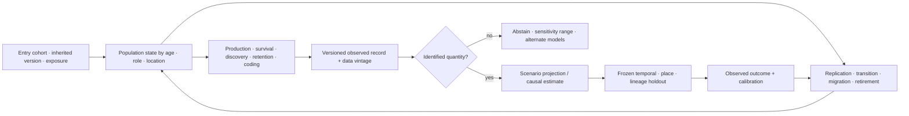

# Cohort-aware population and historical observation

This note prevents aggregate counts and retrospective stories from silently
standing in for lifecycle state, causality, or prospective prediction. It is a
mathematical companion to the
[quantitative-history and demography audit](../research/audits/2026-08-05-quantitative-history-demography.md)
and [Candidate 014](../experiments/candidates/014-versioned-observation-contract.md).

## Stock and flow

For an accounting interval of duration $\Delta t$ seconds,

$$
N_{t+\Delta t}=N_t+B_t-D_t+I_t-O_t,
$$

where $N_t$ is the count of qualified active units at time $t$, and $B_t$,
$D_t$, $I_t$, and $O_t$ are replication/entry, retirement/death, immigration,
and outmigration counts during the same interval. A rate such as
$b_t=B_t/(N_t\Delta t)$ has units s$^{-1}$. The identity detects inconsistent
bookkeeping; it neither explains the flows nor predicts the next interval.

## Cohort-component transition

Let $\mathbf n_t$ be a vector of unit counts indexed by lifecycle stage,
role, version cohort, or another declared partition. Then

$$
\mathbf n_{t+\Delta t}=\mathbf L_t\mathbf n_t+\mathbf m_t,
$$

where $\mathbf L_t$ is a transition matrix and $\mathbf m_t$ is the net
migration vector in unit counts. Survival/transition entries in $\mathbf L_t$
are dimensionless probabilities per interval; replication entries are new
units per source unit per interval. A constant matrix is a scenario assumption,
not evidence that transition rates remain stationary.

Equal totals $\mathbf 1^\top\mathbf n_t$ can conceal different future paths
because stage composition changes exposure, replication, failure, maintenance,
and retirement. Every population-level result therefore retains the vector or
a registered sufficient aggregation.

## Age, period, and cohort are not freely separable

If lifecycle age $a$, observation period $p$, and entry cohort $c$ satisfy
$c=p-a$, then

$$
g\!\left(\mathbb E[Y_{a,p}]\right)
=\mu+\alpha_a+\beta_p+\gamma_c
$$

is not uniquely identified in its unrestricted linear components. $Y$ uses a
declared task unit and $g$ is a specified link. More samples or less noise do
not remove the exact dependency. Constraints, priors, curvature, external
variation, or mechanistic structure must be declared because they determine
part of the decomposition.

## Adoption curves do not identify influence

For adoption share $F(t)\in[0,1]$,

$$
\frac{dF(t)}{dt}=(p+qF(t))(1-F(t)),
$$

where $p$ and $q$ have units s$^{-1}$. A close fit is compatible with multiple
generative processes: independent exposure, common broadcast, command,
homophilous selection, network influence, or mixtures. Identifying influence
requires intervention or additional assumptions, not curve shape alone.

## Selected observation

For latent event count $N_{\mathrm{latent}}$ and a simplified chain,

$$
\mathbb E[N_{\mathrm{observed}}]
=N_{\mathrm{latent}}
p_{\mathrm{produce}}p_{\mathrm{survive}}p_{\mathrm{discover}}
p_{\mathrm{retain}}p_{\mathrm{code}},
$$

where every $p$ is a dimensionless conditional probability under a declared
dependency order. The product is diagnostic, not an independence claim. If
missingness depends on an unobserved value after conditioning on available
data, unrestricted recovery is impossible without external data or additional
selection assumptions.

## Collapse and recovery remain vectors

A population or institution state is reported as

$$
\mathbf r_t=(N_t,Q_t,A_t,S_t,G_t,H_t),
$$

where $N_t$ is qualified unit count, $Q_t$ task/service quality, $A_t$
effective authority coverage, $S_t$ network/service connectivity, $G_t$
governance or maintenance capacity, and $H_t$ reserve/headroom. Every component
uses its native declared unit. No scalar “collapse” or “recovery” score is
formed without explicit authorized weights and sensitivity analysis.

## Prospective gate

Retrospective explanation is separated from prediction by freezing model,
features, coding, hyperparameters, data vintage, and evaluation before the
held-out period, place, lineage, or regime becomes available. Rolling-origin,
geographic, lineage, and live holdouts test different forms of transfer; random
row splits are insufficient when adjacent rows share history.

Editable source:
[cohort-observation-contract.mmd](../assets/diagrams/cohort-observation-contract.mmd).
