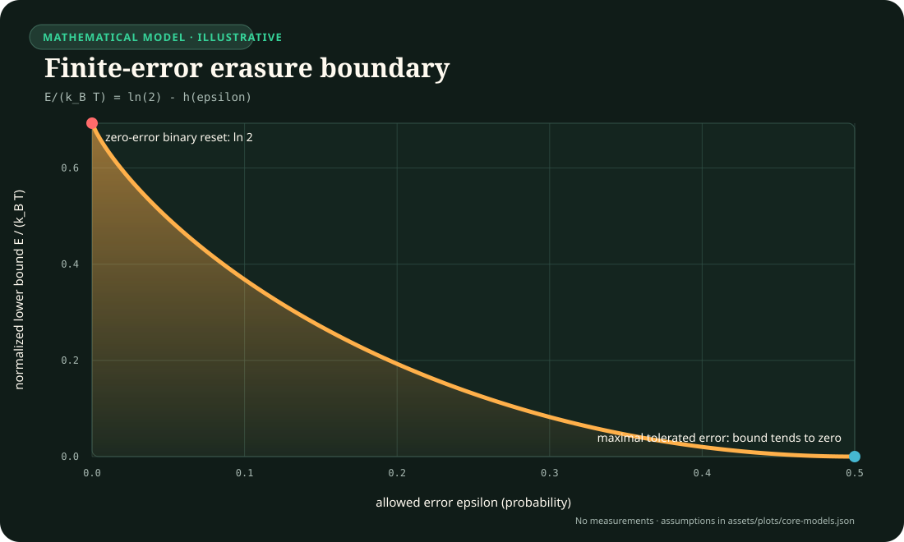
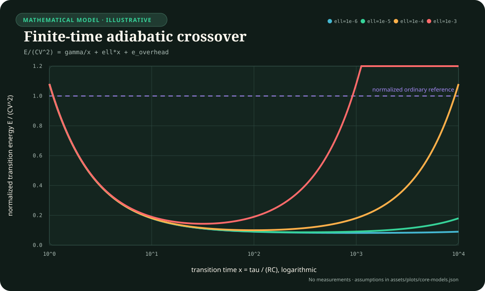
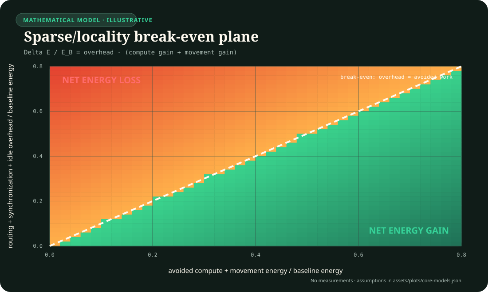
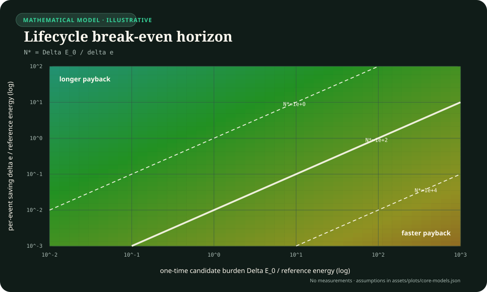
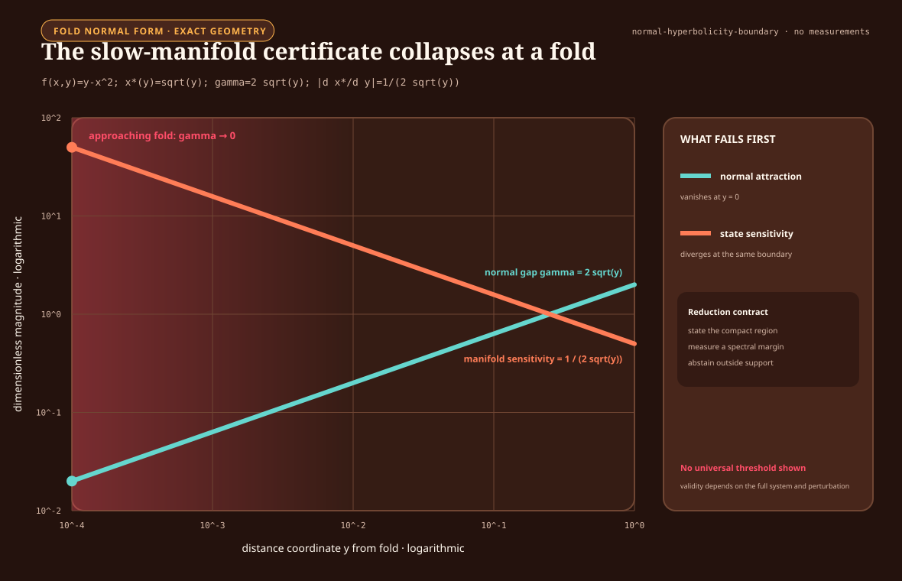

# Visual models

These plots turn recurring equations into inspectable boundaries. They are not
result figures: no curve contains workstation measurements. The equations come
from the canonical math and concept notes; normalized sweeps, analytical fixture
models, and explicitly hypothetical ledgers make their consequences visible
before an implementation exists.

## Finite-error erasure boundary

For a uniform binary reset with tolerated error $\epsilon$,

$$
\frac{E_{\mathrm{fund,reset}}}{k_B T}
=\ln 2-h(\epsilon),
\qquad
h(\epsilon)=-\epsilon\ln\epsilon-(1-\epsilon)\ln(1-\epsilon).
$$

The plot shows why $k_B T\ln 2$ is not a universal energy-per-operation
constant. Relaxing the logical error changes the lower bound, while correction,
retry, retained side information, duration, and downstream harm remain outside
this curve. See the
[full derivation](boundary-qualified-physical-computation.md#logical-loss-and-generalized-erasure).

## Finite-time adiabatic crossover

The normalized diagnostic model is

$$
\frac{E_{\mathrm{ad}}}{CV^2}
=\frac{\gamma}{x}+\ell x+e_{\mathrm{overhead}},
\qquad x=\frac{\tau}{RC}.
$$

Slowing a transition reduces the first term but increases leakage exposure.
The minimum therefore occurs at a finite duration, and a real advantage exists
only where the complete curve beats a matched ordinary reference. The plotted
$\ell$ and overhead values are illustrative, not device coefficients. See the
[device-boundary model](boundary-qualified-physical-computation.md#measured-device-transition).

## Sparse/locality break-even plane

Normalize all candidate-minus-baseline energy changes by baseline energy. Let
$g$ be avoided arithmetic plus avoided movement and $o$ be added routing,
synchronization, metadata, conversion, and idle burden. Then

$$
\frac{\Delta E}{E_B}=o-g.
$$

Sparse activation is beneficial only below the diagonal. A lower active
parameter count on its own says nothing about which side of the boundary an
implementation occupies. The underlying event ledger is defined in the
[energy model](../concept/80-energy-model.md#data-movement-ledger).

## Lifecycle break-even horizon

For candidate one-time burden $\Delta E_0$ and accepted-service saving
$\delta e=e_B^{\mathrm{serve}}-e_C^{\mathrm{serve}}$,

$$
N^*=\frac{\Delta E_0}{\delta e},
\qquad
T^*=\frac{N^*}{\lambda_q}.
$$

The contour map makes a common failure explicit: a component can save energy
per event but never repay compilation, search, fabrication, migration, or
qualification within its useful service horizon. If $\delta e\leq0$, no
positive break-even exists. See the
[lifecycle accounting rule](../concept/80-energy-model.md#break-even-horizon).

## Memory-kernel truncation boundary

For the illustrative normalized kernel
$K(\tau)=K_0\exp(-\tau/\tau_m)$, the fraction beyond a retained window $H$ is

$$
R(H)=
\frac{\int_H^\infty K(\tau)\,d\tau}
{\int_0^\infty K(\tau)\,d\tau}
=\exp\!\left(-\frac{H}{\tau_m}\right).
$$

The curve makes the storage--approximation trade explicit for this one kernel:
one, two, and three decimal places of remaining tail mass require progressively
longer histories. It does not supply a cutoff for another kernel, observable,
horizon, or intervention. Those require an empirical closure test under the
[multiscale reduction contract](multiscale-reduction-contract.md).

## Slow-manifold fold boundary

For the dimensionless fast equation $f(x,y)=y-x^2$, the attracting critical
branch for $y>0$ is $x^*(y)=\sqrt y$. Its normal attraction margin and local
sensitivity are

$$
\gamma(y)=\left|\partial_xf(x^*(y),y)\right|=2\sqrt y,
\qquad
\left|\frac{dx^*}{dy}\right|=\frac{1}{2\sqrt y}.
$$

As the fold at $y=0$ is approached, ordinary normal hyperbolicity disappears at
the same time that a small change in $y$ produces an increasingly large change
in the reduced state. The plot is an exact property of this normal form, not a
universal abstention threshold. The full validity conditions are kept in the
[multiscale reduction contract](multiscale-reduction-contract.md).

## Contextual analytical figures

The next figures are embedded where their equations first matter in the book;
this index keeps their editable model and evidence status discoverable without
duplicating every full-size image here.

1. **Simultaneous Pareto decision.**
   Illustrative uncertainty regions in relative lifecycle energy and task-native
   quality, with latency, risk, and support retained as hard gates. First used in
   [Biology is a launchpad](../concept/05-biology-is-a-launchpad.md#efficiency-mechanism).
2. **Costed active-acquisition frontier.**
   A hypothetical action ledger for
   $\Delta U-\lambda_EE-\lambda_LL-\lambda_BB$ after risk and latency
   admissibility. First used in
   [Sparse prediction and adaptive compute](../concept/30-sparse-predictive-compute.md#price-a-menu-of-acquisitions).
3. **Recovery-time fragility curve.**
   Exact evaluation of the Candidate 003 linear-simulator equation
   $\tau_{95}=\Delta t\ln(0.05)/\ln(g)$ with its declared illustrative Stage-1
   threshold. First used in
   [Maturity and structural consolidation](../concept/50-grokking-and-pruning.md#recovery-dynamics-as-a-maturity-signal).
4. **Memory-action price envelope.**
   Hypothetical single-item lines $G_a-\lambda_EE_a$ and their admissible upper
   envelope. First used in
   [Fast memory, replay, and consolidation](../concept/40-memory-and-consolidation.md#3-allocate-the-maintenance-budget).
5. **Mission-profile damage history.**
   Two constructed equal-mean temperature histories passed through one
   hypothetical Arrhenius-rate model. First used in
   [Reliability under mission profiles](../concept/26-reliability-under-mission-profiles.md#drive-degradation-models-from-the-actual-mission-profile).
6. **Fixture F-007 identifiability.**
   Analytical likelihoods that coincide under a base operator and separate
   after an added measurement. First used in
   [Operator-qualified sensing](../concept/24-operator-qualified-sensing.md#separate-measured-information-from-prior-supported-reconstruction).

Every value in these figures is labeled analytical or illustrative. None is a
workstation result, a promoted claim, or a recommended deployment threshold.

## Reproduction and editing

The editable parameter source is
[core-models.json](../assets/plots/core-models.json). The deterministic
generator is `scripts/generate-plots.mjs`; generated SVG files live under
`public/plots/`. Change the specification or generator, regenerate, and commit
source and output together.
