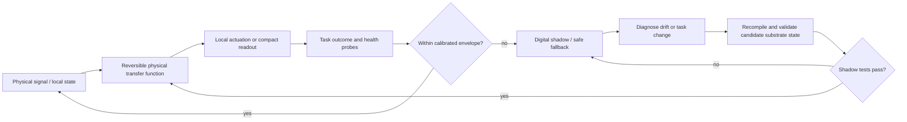

# Adaptive materials and self-assembly: substrate null-model audit

<!-- markdownlint-disable MD013 -->

**Date:** 2026-08-05

**Scope:** adaptive and mechanical metamaterials, morphological computation,
self-assembly, reaction–diffusion patterning, programmable matter, hysteretic
memory, self-healing materials, and physical reservoir computing

**Purpose:** determine when physical dynamics replace repeated software
control, expose lifecycle costs and failure boundaries, and prevent
[P-006](../principle-registry.md#p-006--homeostatic-negative-feedback),
[P-009](../principle-registry.md#p-009--maintenance-plane), and
[P-010](../principle-registry.md#p-010--structural-offloading-and-co-design)
from relabelling established hardware, control, or materials engineering.

## Executive finding

The central idea is established: geometry, constitutive laws, chemical
interactions, phase state, and coupled dynamics can store information and
implement useful transformations without executing the equivalent sequence of
digital instructions on every use. Passive-dynamic walkers, compliant bodies,
mechanical logic, physical reservoirs, reaction–diffusion systems, molecular
self-assembly, material memories, and autonomous crack healing demonstrate
parts of this claim.

The computation has not disappeared. It has moved into:

- a fabricated transfer function or energy landscape;
- transient physical state, such as deformation, oscillator phase, chemical
  concentration, or delayed feedback;
- persistent metastable state, such as a bistable shell or hysteretic
  configuration;
- interaction rules encoded in geometry, binding sequences, or local robot
  programs; or
- stored chemical free energy and healing-agent inventory.

This movement can be valuable when sensing, transformation, and actuation are
physically colocated and the same mapping is reused many times. It is not
automatically energy-efficient, precise, fast, programmable, or maintainable.
Fabrication, programming, drive energy, environmental stabilization, conversion
between physical and digital domains, readout, calibration, reset, drift,
fatigue, and disposal must be counted over the device lifetime.

At the current abstraction level, all proposed principles deduplicate:

- **P-006:** physical attractors, passive stability, and reaction–diffusion
  feedback are established plant/controller implementations;
- **P-009:** autonomous damage detection and local healing are established
  maintenance mechanisms, often with finite consumables; and
- **P-010:** morphological computation, ASIC/analog specialization,
  metamaterial response, and physical reservoirs are direct examples of
  structural offloading.

One discriminating project candidate remains, but it is a system hypothesis
rather than a novelty claim:

> Compile a mature, high-frequency, environment-coupled AI skill into a
> reversible local physical transfer function; retain a digital shadow,
> calibrated health probes, and fallback; and recompile only when measured
> drift or task change repays the lifecycle cost.

The candidate is distinct from a fixed passive body because it includes
versioned compilation, reversible reprogramming, validation, and fallback. It
is distinct from ordinary accelerators only if it eliminates a material
sensing–representation–decision–actuation path, not merely arithmetic. It must
still beat passive mechanics, analog control, an FPGA/ASIC, a matched digital
reservoir, and a conventional redundant design.

## Audit questions and evidence boundary

For each mechanism, this audit asks:

1. What physical state contains the program, working state, and memory?
2. Which repeated sensing, arithmetic, communication, or actuation is removed?
3. Which fabrication, drive, conversion, readout, reset, and maintenance costs
   replace it?
4. What are the response time, bandwidth, precision, programmability, and
   retention limits?
5. Can the mechanism be reset, rewritten, repaired, and audited?
6. Which environmental, scaling, correlated-failure, and semantic boundaries
   invalidate the claimed benefit?

The cited work demonstrates mechanisms in specific devices and conditions.
Source-specific performance is not a reusable constant. A proof that a
mechanical body or chemical field can compute a benchmark is not proof that it
uses less wall-plug energy than a digital implementation with the complete
sensor/readout boundary included.

## Mechanism-family map

| Family | Program or persistent state | Working state | Repeated work displaced | Main replacement costs | Reset/recovery | Hard boundary | Audit disposition |
| --- | --- | --- | --- | --- | --- | --- | --- |
| Passive morphology | Geometry, mass distribution, stiffness, damping, contact layout | Position, velocity, elastic deformation | Continuous trajectory generation and stabilization | Fabrication, actuation against losses, narrow operating envelope | Mechanical repositioning or external stabilization | Terrain/load/task specificity; wear; low programmability | Established P-006/P-010 null |
| Compliant-body computation | Body topology and material parameters; trained readout | Distributed strain and transient modes | Explicit state expansion and short-term memory | Sensors, actuators, data acquisition, readout training, damping losses | Relaxation plus recalibration | State is indirect, noisy, task- and time-constant-specific | Established morphological/reservoir null |
| Mechanical/metamaterial logic | Unit-cell geometry, connectivity, bistable-state pattern | Force, displacement, snap-through sequence | Electronic logic near mechanical inputs/outputs | Drive force, transduction, area, latency, fabrication tolerance, reset | Reverse actuation or explicit initialization | Low density/speed; fatigue; crosstalk; reset can dominate | Established special-purpose hardware |
| Reprogrammable mechanical memory | Metastable equilibrium of each unit | Elastic response under read load | Repeated software selection of material properties | Write actuation, addressing, readout, state verification | Switch units back or rewrite | Finite states, hysteresis variation, cycling fatigue | Established non-volatile material state |
| Physical reservoir | Fixed nonlinear dynamics and trainable readout weights | Transient oscillator, optical, electrical, fluid, or body state | Digital recurrent state update | Input encoding, drive, ADC/DAC or optics, state sampling, readout | Washout/relaxation; recalibrate readout | Memory–nonlinearity tradeoff, drift, observability, timing match | Established P-010 null |
| Reaction–diffusion patterning | Reaction network, rates, boundary conditions, initial/source fields | Spatial concentration field | Central coordinate calculation and per-site messaging | Reagents/free energy, diffusion time, containment, sensing/readout | Flush, reverse chemistry, regrow, or discard | \(L^2/D\) scaling, parameter sensitivity, limited addressability | Established decentralized field computation |
| Molecular self-assembly | Component shapes and binding sequences | Population of intermediates and local bonds | Placement of every component by a central fabricator | Component synthesis, concentration/temperature control, annealing, purification, yield loss | Denature/disassemble if reversible; otherwise remake | Kinetic traps, defects, finite targets, slow equilibration | Established bottom-up fabrication |
| Robot programmable matter | Local programs, target bitmap/shape, module state | Position, local messages, battery state, attachments | Central motion planning and placement | One controller/actuator/power source per module, localization, collisions | Local retries, undocking, replacement | Coordination time, congestion, hardware count, target still preprogrammed | Distributed robotics, not controller-free matter |
| Hysteretic material memory | Metastable microstructure or history-dependent response | Configuration during cyclic drive/read probe | Explicit storage of recent drive thresholds or extrema | Training cycles, nonequilibrium maintenance/noise, probing, low-density readout | Overdrive, anneal, noise, or reverse cycling | Often transient, aggregate, analog, and not randomly addressable | Established physical memory |
| Self-healing material | Capsules, catalyst, reversible bonds, or vascular agent network | Crack geometry, released agent, bond reformation | Separate damage sensor, localization, and technician/robot delivery | Added mass/complexity, finite agent, healing time, altered bulk properties | Refill network or reverse/reform bonds | Single-use locality, incomplete strength, hidden damage, channel failure | Established local P-009 mechanism |
| Reversible compiled physical skill | Versioned geometry/state plus digital specification and fallback | Local physical state coupled directly to environment | Sensor serialization, repeated inference, command transport, and some actuation | Compilation, fabrication/programming, validation, health monitoring, reconfiguration | Roll back physical state or fall back digitally | Only useful for stable frequent tasks; lifecycle break-even unproven | Residual project candidate |

## 1. Shared physical model and lifecycle accounting

### State is embodied, not absent

A broad class of substrates can be written as

$$
M(z,\theta)\dot z =
f(z,u,\theta,\xi),
\qquad
y=h(z,u,\theta)+\epsilon.
$$

\(z\) is physical state, \(u\) the input or applied stimulus, \(y\) the measured
output, \(\theta\) fabricated or programmed parameters, \(\xi\) environmental
conditions and disturbances, \(M\) an inertia/capacitance/storage operator,
and \(\epsilon\) readout noise. The units are substrate-specific. A mechanical
\(z\) may combine metres and metres per second; a chemical \(z\) may be
mol/m³; an oscillator may use voltage, phase, or magnetization.

The program is usually \(\theta\), including topology, geometry, stiffness,
binding affinity, reaction rate, delay, or bias. Short-term memory is the
dependence of \(z(t)\) on recent inputs. Long-term material memory requires a
metastable or structurally changed component of \(z\) or \(\theta\).

This framing prevents two category errors:

- Dynamics that naturally map \(u\) to \(y\) are real computation for an
  application, but do not imply general programmability.
- Zero static power in a bistable state does not imply zero write, read,
  conversion, or reset energy.

### Lifecycle energy and break-even

For \(N\) deployed uses, a minimum boundary is

$$
E_{\mathrm{life}} =
E_{\mathrm{design}}+
E_{\mathrm{fabrication}}+
E_{\mathrm{program}}+
\sum_{i=1}^{N}
\left(
E_{\mathrm{drive},i}+
E_{\mathrm{convert},i}+
E_{\mathrm{read},i}+
E_{\mathrm{reset},i}+
E_{\mathrm{maint},i}
\right)
+E_{\mathrm{recovery}}.
$$

Every term is joules over a declared boundary. Embodied manufacturing energy
may be reported separately when measurement is unavailable, but it cannot be
silently assigned zero. If a digital reference costs \(E_d\) joules/use and
the deployed physical path costs \(E_p\) joules/use, a simplified break-even
use count is

$$
N_{\mathrm{break}}
>
\frac{
E_{\mathrm{design}}+
E_{\mathrm{fabrication}}+
E_{\mathrm{program}}+
E_{\mathrm{recovery}}
}{
E_d-E_p
},
\qquad E_d>E_p.
$$

This expression is intentionally incomplete: lifetime, yield, reprogramming,
replacement, and quality constraints can eliminate the break-even point.
Latency, precision, risk, and material waste remain separate objectives.

### Useful-computation efficiency

A claim that substrate dynamics replace control should report

$$
\eta_{\mathrm{useful}} =
\frac{
N_{\mathrm{accepted}}U_{\mathrm{task}}
}{
E_{\mathrm{life}}
},
$$

where \(N_{\mathrm{accepted}}\) is the number of outputs passing predeclared
quality and safety tests and \(U_{\mathrm{task}}\) is declared task utility,
not raw operations. Joules per correct decision, metre of stable locomotion,
valid assembly, or recovered function are preferable to an incomparable
operations-per-watt extrapolation.

## 2. Morphological computation and passive dynamics

### What the body stores and transforms

Passive morphology stores a control policy implicitly in geometry, mass,
compliance, damping, contact constraints, and the environment. Position and
velocity evolve according to those parameters, so the body continuously
integrates forces and filters disturbances without a processor numerically
integrating an internal model.

Passive-dynamic walkers show the cleanest null. Simple articulated mechanisms
can walk stably down a slope without motors or controllers. Collins, Ruina,
Tedrake, and Wisse then built level-ground robots that retained passive-dynamic
principles with modest actuation and simple control
([Collins et al. 2005](https://doi.org/10.1126/science.1107799)). The result
supports a precise claim: well-matched mechanics can remove much active
trajectory generation. It does not support control without energy; gravity or
actuators supply work, collisions and damping dissipate it, and stability is
tied to morphology, speed, ground, and disturbance range.

Hauser et al. formalized compliant nonlinear mass–spring bodies as filters that
can implement complex continuous-time input/output operators with a static
linear readout
([Hauser et al. 2011](https://link.springer.com/article/10.1007/s00422-012-0471-0)).
Nakajima et al. demonstrated the corresponding physical idea with a soft
silicone arm in water: sensed transient body dynamics supplied short-term
memory for timing, emulation, and closed-loop tasks
([Nakajima et al. 2014](https://royalsocietypublishing.org/doi/10.1098/rsif.2014.0437)).

The full experimental system still included a motor, embedded sensors, a water
tank, a PC sensing/actuation loop, and trained output weights. The body replaced
part of recurrent state processing, not the complete controller.

### When repeated software is actually removed

Morphology is a credible offload when:

- the same force-to-motion or sensor-history-to-action mapping recurs;
- mechanical state already exists where the input is generated;
- the desired response lies within the body's stable operating envelope;
- a small readout or no readout is sufficient; and
- fabrication/programming cost is amortized across many cycles.

It is weak when a task requires arbitrary symbolic state, exact replay, rapid
policy updates, broad out-of-distribution operation, or inspectable causal
reasoning. A compliant structure can reject disturbances mechanically, but it
cannot explain which semantic constraint justified the response.

### Control and hardware nulls

The comparison must include:

- a passive spring–damper or tuned mass mechanism;
- a conventional analog feedback loop;
- model-predictive or robust digital control;
- an FPGA/ASIC implementing the same fixed filter; and
- co-designed mechanics plus the smallest digital supervisor.

The relevant question for P-010 is not whether the body computes. It is whether
colocated physical dynamics reduce total sensing, conversion, communication,
and actuation energy at equal task envelope and failure risk.

## 3. Mechanical and metamaterial computation

### Bistability as memory and logic

Mechanical metamaterials encode functions in unit-cell geometry and coupling.
Inputs are forces or displacements; states can be buckled configurations;
nonlinear snap-through supplies thresholding; connectors and load paths
propagate signals.

Chen, Pauly, and Reis demonstrated tileable physical bits made from bistable
shells. Magnetic actuation reversibly switched each unit between two stable
equilibria, and the state changed the material's elastic response
([Chen et al. 2021](https://www.nature.com/articles/s41586-020-03123-5)).
The state is persistent geometry, not a hidden digital register. It can be
read mechanically and remains until rewritten, but addressing and writing
require magnetic actuation and state verification.

Mei et al. demonstrated a reprogrammable mechanical metamaterial using
bistable curved beams, sequential electromagnetic excitations, function-complete
logic, an instruction-memory pattern, combinational examples, and sequential
memory
([Mei et al. 2021](https://www.nature.com/articles/s41467-021-27608-7)).
The same paper makes the reset boundary explicit: logic execution changes
stable state, so reusable operation needs initialization, slide-switch
sequencing, and reprogramming excitations.

These systems establish that mechanical logic and non-volatile material state
are possible. They do not erase the electronic null:

- mechanical signals propagate at finite elastic-wave or quasi-static loading
  speeds and may be far slower than CMOS;
- feature size, routing, fan-out, crosstalk, and fabrication variation limit
  density and depth;
- force thresholds drift with temperature, creep, damage, and cycle count;
- each switch dissipates hysteresis and actuation energy;
- reading can perturb state; and
- resetting a cascade may cost as much as or more than evaluation.

### Physical learning

Stern et al. proposed and demonstrated supervised learning in creased sheets:
training forces altered local crease stiffness, sculpting a nonlinear folding
energy landscape that generalized to held-out force patterns
([Stern et al. 2020](https://doi.org/10.1073/pnas.2000807117)). This is a
strong null for “a material learns.” Training examples and a local
strain-dependent update changed physical parameters; inference was then the
sheet's force response.

The result does not imply autonomous end-to-end learning. A training protocol
must supply labeled desired responses and implement the local material update;
performance is tied to the available plasticity, geometry, loading range, and
readout. Relearning can overwrite prior response, and irreversible plasticity
complicates reset and provenance.

### State and cost checklist

For every proposed mechanical AI primitive, record:

- number of stable states and measured retention time;
- write force/energy, write time, and addressing mechanism;
- read force/energy, read error, and whether read is destructive;
- reset energy/time and reachable-state fraction;
- switching threshold distribution across units and cycles;
- fatigue, creep, temperature, humidity, and radiation range;
- signal restoration, fan-out, routing, and cascade depth;
- fabrication yield and embodied material/processing cost; and
- digital transduction still required at the boundary.

Absent these fields, zero-power mechanical memory is an incomplete boundary.

## 4. Physical reservoir computing

### Fixed dynamics, trained readout

Reservoir computing drives a fixed nonlinear dynamical system and trains a
comparatively simple output map. In discrete notation,

$$
x_{t+1}=F_\theta(x_t,u_t,\xi_t),
\qquad
\hat y_t=W_{\mathrm{out}}\phi(x_t).
$$

\(x_t\) is reservoir state, \(u_t\) input, \(\theta\) fixed physical
parameters, \(\xi_t\) noise/drift, \(\phi\) sampled features, and
\(W_{\mathrm{out}}\) the trained readout. The reservoir must combine nonlinear
separation with fading memory. Too much damping erases useful history; too
little forgetting retains irrelevant history or destabilizes reproducibility.

Appeltant et al. demonstrated that one nonlinear electronic node with delayed
feedback can emulate many virtual reservoir nodes and process time-dependent
signals
([Appeltant et al. 2011](https://www.nature.com/articles/ncomms1476)).
Their experimental path also illustrates the systems boundary: the nonlinear
node was physical, while input preprocessing, the delay implementation, and
output postprocessing used digital/analog conversion and electronics.

The Nakajima soft-arm work stores recent input in distributed viscoelastic and
fluid-coupled body state. Torrejon et al. later used the transient response of
a nanoscale spin-torque oscillator for spoken-digit recognition
([Torrejon et al. 2017](https://www.nature.com/articles/nature23011)). These
substrates differ radically, but share the same computational abstraction.

### Time, energy, and precision boundaries

A fair throughput is bounded by physical relaxation and sampling:

$$
f_{\mathrm{useful}}
\lesssim
\min\!\left(
f_{\mathrm{drive}},
f_{\mathrm{sample}},
\frac{1}{\tau_{\mathrm{settle}}},
\frac{K}{\tau_{\mathrm{memory}}}
\right),
$$

where \(K\) is the number of effective temporal distinctions available in the
memory interval. This is an engineering heuristic, not a universal theorem; it
forces every benchmark to expose drive, sample, settling, and memory scales.

The energy boundary is

$$
E_{\mathrm{PRC}}=
E_{\mathrm{encode}}+
E_{\mathrm{drive}}+
E_{\mathrm{reservoir}}+
E_{\mathrm{sense}}+
E_{\mathrm{ADC/DAC}}+
E_{\mathrm{readout}}+
E_{\mathrm{calibrate}}.
$$

Claims of a passive or zero-power reservoir refer only to
\(E_{\mathrm{reservoir}}\). Lasers, oscillators, bias currents, motors,
photodetectors, ADCs, DACs, and a trained digital readout may dominate.

Precision is limited by thermal and device noise, sensor resolution, component
variation, state observability, and drift. Retraining \(W_{\mathrm{out}}\) can
compensate within the span of observed states, but cannot restore a vanished
dynamical mode or correct an unobserved failure. Physical reservoirs are
especially plausible at the sensor edge for noisy temporal inference, and
especially weak for exact symbolic manipulation and arbitrary random-access
memory.

### Physical-reservoir deduplication result

Physical reservoirs are an established implementation of P-010. The project
should not present “use the body's dynamics as hidden-state computation” as a
new biological principle. A valid candidate must instead identify a particular
sensor/body whose unavoidable dynamics provide useful features more cheaply
than digitizing the raw signal and running a matched digital reservoir.

## 5. Reaction–diffusion patterning

### State and transformation

For concentration field \(c(x,t)\in\mathbb{R}^m\),

$$
\frac{\partial c}{\partial t}
=
D\nabla^2 c+
R(c;\theta)+s(x,t),
$$

\(D\) is a diffusion matrix in m²/s, \(R\) local reaction rates in
concentration/s, \(s\) sources/sinks, and \(\theta\) kinetic parameters.
Turing showed that diffusion coupled to reaction can destabilize a homogeneous
state and generate spatial structure
([Turing 1952](https://royalsocietypublishing.org/doi/10.1098/rstb.1952.0012)).

The program is the reaction network, rates, diffusion constants, geometry,
boundaries, and source pattern. The working memory is the concentration field.
Local chemistry and diffusion replace explicit coordinate broadcasts and a
central loop that tells each location what state to adopt.

Basu et al. engineered sender and receiver bacteria so a diffusible signal
gradient selected a ring-like response band
([Basu et al. 2005](https://pubmed.ncbi.nlm.nih.gov/15858574/)).
Tabor et al. combined light sensing, diffusible communication, and genetic
logic so an _E. coli_ community detected light–dark edges
([Tabor et al. 2009](https://doi.org/10.1016/j.cell.2009.04.048)).
These synthetic systems demonstrate programmable distributed pattern
processing, but they also show that biological chemistry can be an engineered
computing substrate rather than an AI-absent principle.

### Scaling and energy

Diffusive communication has a characteristic time

$$
\tau_{\mathrm{diff}}\sim\frac{L^2}{D},
$$

where \(L\) is distance in metres and \(D\) diffusivity in m²/s. Doubling
linear scale roughly quadruples diffusion time when other conditions remain
fixed. Advection, active transport, relays, or hierarchical patterning can
change the scaling only by adding mechanisms and energy.

Pattern wavelength and stability depend on kinetic and transport parameters.
Noise can seed a pattern but also move boundaries; concentration thresholds
produce analog uncertainty; reagent depletion, growth, temperature, geometry,
and flow alter behavior. Maintaining a far-from-equilibrium pattern consumes
chemical free energy or continually renewed reagents. Reset may require
flushing, degradation, reversal, regrowth, or replacement.

### Control null and project mapping

Reaction–diffusion is a distributed analog controller/PDE, not an escape from
control theory. Nulls include:

- a numerical PDE on local processors;
- cellular automata or stencil computation;
- event-driven neighbor messaging;
- analog diffusion networks; and
- a precomputed coordinate or lookup field.

For P-006, the test is whether local physical diffusion restores a useful range
under disturbances with less communication and energy than these nulls. For
P-010, the test is whether the task naturally accepts the substrate's slow,
analog, spatial field. It is not a plausible general replacement for fast,
exact global routing.

## 6. Self-assembly and programmable matter

### Molecular self-assembly

Molecular self-assembly compiles target adjacency and geometry into component
shape and local binding affinity. Components explore configurations through
thermal motion and settle into lower-free-energy structures. A central robot
does not place every component, but synthesis and interaction design contain a
large part of the plan.

Winfree et al. programmed sticky-end complementarity in DNA double-crossover
tiles to produce specific periodic two-dimensional crystals
([Winfree et al. 1998](https://www.nature.com/articles/28998)).
Rothemund's DNA origami routed one long scaffold with more than 200 designed
staple strands to form addressable two-dimensional shapes and patterns
([Rothemund 2006](https://www.nature.com/articles/nature04586)).

The state and cost ledger is concrete:

- **program:** nucleotide sequences, stoichiometry, geometry, and assembly
  schedule;
- **working state:** concentrations and partially bonded intermediates;
- **drive:** thermal motion plus chemical free-energy differences, often with
  controlled annealing;
- **output:** a population distribution, not one guaranteed perfect object;
- **readout:** microscopy, assay, or downstream binding;
- **failure:** kinetic traps, malformed structures, aggregation, missing/excess
  strands, and off-target binding; and
- **reset:** strand displacement, denaturation, or destructive remake,
  depending on design.

If fraction \(Y\) of input material becomes acceptable product, a simple
non-recycling lower bound is

$$
E_{\mathrm{per\ valid}}
\geq
\frac{E_{\mathrm{synthesis}}+
E_{\mathrm{assembly}}+
E_{\mathrm{separation}}}
{N_{\mathrm{input}}Y}.
$$

\(Y\) is measured yield and \(N_{\mathrm{input}}\) the intended object count.
Purification and discarded material make low yield an energy and waste cost,
not merely an accuracy metric.

### Robot swarms and programmable matter

Rubenstein, Cornejo, and Nagpal demonstrated predefined shape formation in a
1,024-robot Kilobot swarm using local communication and distributed rules
([Rubenstein et al. 2014](https://doi.org/10.1126/science.1254295)).
This is important distributed engineering, but each “material particle” has a
microcontroller, sensors/communication, locomotion, and power. The target shape
is still specified; assembly time includes motion, local congestion, and
straggler handling.

Robot programmable matter exchanges a central high-bandwidth planner for many
local controllers and physical motion. It wins only if modular reuse,
parallelism, fault replacement, or shape adaptability repays:

- module count and idle power;
- attachment/detachment energy;
- localization and communication traffic;
- collision and deadlock recovery;
- slow transport of modules through space; and
- reduced strength, precision, or density at interfaces.

### Self-assembly deduplication result

Self-assembly is established compilation of global structure into local
interaction rules. It is relevant to P-010 as a fabrication and placement
strategy, but it is not evidence that arbitrary AI architecture can organize
itself cheaply. The closest software nulls are constraint solving, distributed
graph construction, content-addressed placement, dependency resolution, and
local rule-based growth.

A remaining experiment may ask whether identical accelerator tiles can
configure network topology from local workload signals more cheaply than a
centralized placement/router. The self-assembly literature contributes error,
yield, congestion, and convergence questions—not a presumption that the local
scheme wins.

## 7. Hysteretic and nonequilibrium material memory

### What is remembered

Hysteretic systems store path history because their present metastable state
depends on the sequence and amplitude of prior drive. A bistable element with
different up/down thresholds is a hysteron. Collections can encode extrema or
nested reversal points in aggregate response without an addressed memory
array.

Keim and Nagel identified generic multiple transient memory behavior in
cyclically driven disordered systems: a system can retain signatures of several
training amplitudes, while long training tends to erase most but the largest;
noise can preserve plasticity and multiple memories
([Keim and Nagel 2011](https://doi.org/10.1103/PhysRevLett.107.010603)).

This mechanism stores statistics of drive in microconfiguration. Reading
typically means sweeping a probe and detecting a kink, change in reversibility,
or response threshold. That can be global, analog, and partially destructive.
It is not equivalent to high-density randomly addressed memory.

### Limits relevant to AI

- Memory capacity is determined by available hysterons/modes and their
  interactions, not by a clean nominal bit count.
- Training and forgetting may be the same relaxation process.
- Noise can preserve multiple memories while reducing precision.
- Readout may require a sweep over candidate amplitudes.
- Overdriving can erase or transform stored signatures.
- Temperature, aging, creep, and structural rearrangement shift thresholds.
- A stored exposure amplitude lacks semantic provenance and source identity.

Hysteretic material memory is therefore a plausible cheap local statistic for
threshold histories, overload envelopes, or wear exposure. It is a poor null
for episodic or factual AI memory. P-006 may use such state as a local adaptive
setpoint; P-009 must still verify drift and decide when the memory is no longer
trustworthy.

## 8. Self-healing materials

### Damage-triggered local repair

White et al. embedded microcapsules of healing agent and catalyst in a polymer.
A propagating crack ruptured capsules, released agent into the crack plane, and
triggered polymerization; the reported specimen-level result reached up to 75%
recovery of fracture toughness under the studied conditions
([White et al. 2001](https://www.nature.com/articles/35057232)).

The material combines sensing, localization, delivery, and repair:

- the crack itself is the detector and transport trigger;
- capsule location supplies local addressability;
- stored monomer/catalyst supplies free energy and material; and
- capillary flow and polymerization perform the repair.

This is a strong P-009 analogue because it removes a separate damage-scanning
and delivery path. It is also resource-bounded: a ruptured capsule is consumed,
repair chemistry changes the material, and a repeatedly damaged location may
have no agent left.

Toohey et al. addressed repetition with a three-dimensional microvascular
network that delivered healing agent to repeated coating cracks
([Toohey et al. 2007](https://www.nature.com/articles/nmat1934)).
The vascular network replaces local one-shot inventory with distribution
infrastructure, but adds channels, reservoirs, pumping/pressure conditions,
fabrication complexity, and the possibility that damage disables the repair
path itself.

Reversible-bond materials provide another point in the design space. Cordier
et al. demonstrated a supramolecular rubber that could heal after cut surfaces
were brought back into contact at room temperature
([Cordier et al. 2008](https://www.nature.com/articles/nature06669)).
Repeatability comes from reversible associations and molecular mobility, which
trade against stiffness, temperature range, healing time, and interface
requirements.

### AI and hardware normalization

Digital systems already have exact copies, spare modules, error-correcting
codes, reconfiguration, and rollback. Physical self-healing is most compelling
where the failure is a crack, open interconnect, delamination, seal leak, or
mechanical wear that digital state restoration cannot repair.

An AI-substrate proposal must distinguish:

- restoring electrical/mechanical continuity;
- restoring calibrated analog transfer characteristics;
- restoring exact logical state; and
- restoring semantic model behavior.

A healed conductor may reconnect a path yet change resistance and timing. A
healed mechanical reservoir may have a different mode spectrum, requiring
recalibration. Material healing is not sufficient evidence of functional AI
recovery.

## 9. Normalization against the project principles

| Project item | Established null model | Wording or inference to reject | Residual testable opportunity |
| --- | --- | --- | --- |
| [P-006 — homeostatic negative feedback](../principle-registry.md#p-006--homeostatic-negative-feedback) | Passive stability, analog feedback, attractor dynamics, reaction–diffusion fields, hysteretic setpoints | “The material self-regulates” does not imply no controller; the controller is the constitutive law and energy landscape | Local substrate response that stabilizes a directly sensed physical variable with less conversion/communication cost over a wider disturbance range |
| [P-009 — maintenance plane](../principle-registry.md#p-009--maintenance-plane) | Condition monitoring, failover, scheduled inspection, consumable and vascular self-healing | Autonomous healing is not unlimited regeneration; inventory, access, time, and residual property loss must be exposed | Damage-triggered repair colocated with an AI device where it beats sensors plus redundant bypass on lifetime energy and recovered calibration |
| [P-010 — structural offloading and co-design](../principle-registry.md#p-010--structural-offloading-and-co-design) | Passive mechanics, ASIC/FPGA, analog filters/controllers, mechanical logic, physical reservoirs, self-assembly | “Physics computes for free” and “no software controller” omit fabrication, drive, I/O, reset, and drift | Reversible compilation of mature high-frequency sensorimotor mappings into physical transfer functions with shadow validation and fallback |
| Memory hierarchy implications | Bistable state, phase-change/magnetic memory, hysteresis, short-term reservoir dynamics | All material memory is not one tier; retention, addressability, precision, provenance, and destructive read differ | Use material state only for statistics matched to its natural retention and read mechanism |
| Biological repair analogy | Self-healing polymers, re-mendable bonds, spare modules, exact digital restore | Crack closure does not imply restored computation or intended behavior | Joint material/electrical/behavioral health contract with post-repair recalibration |
| Development/self-assembly analogy | DNA nanotechnology, distributed robotics, local constraint solving | Local rules do not remove the target specification or guarantee high yield | Workload-driven topology formation that wins against centralized placement under identical convergence and fault budgets |

## 10. The residual candidate: reversible physical skill compilation

### Operational definition

A system qualifies only if:

1. The input originates as a physical signal and the output acts on the same
   local environment.
2. A mature mapping is invoked often enough to amortize design/programming and
   validation.
3. The physical substrate removes at least one conversion, transport, recurrent
   update, or command path rather than duplicating it.
4. The mapping is rewritable or the system can fall back to a versioned digital
   implementation.
5. Health probes detect drift, damage, and out-of-envelope inputs.
6. Quality, risk, response time, lifecycle energy, and material cost are
   measured at the same boundary as the engineering nulls.

This is best understood as **compilation across physics**, not a new model
class. The learned system chooses \(\theta\); the substrate repeatedly realizes
\(F_\theta\); the digital shadow preserves auditability and handles exceptions.

### Candidate control loop



The maintenance path is not free. It is intentionally separated from the fast
physical path so its frequency and energy can be measured.

### Decisive experiments

#### Experiment A — reflex-like sensorimotor skill

Use a force/tactile stabilization task with repeatable disturbances and a
declared out-of-envelope set. Compare:

1. rigid mechanism plus high-rate digital feedback;
2. tuned passive compliance;
3. analog electronic controller;
4. FPGA/ASIC fixed controller;
5. fixed morphological or metamaterial transfer function;
6. reversible compiled physical skill with digital shadow/fallback.

Hold payload, sensor placement, actuator authority, response envelope, and
safety constraints constant. Measure wall-plug joules/disturbance, peak power,
settling time, overshoot, failure probability, mass/volume, calibration time,
drift, reset/rewrite cost, and performance after damage.

The candidate wins only if comparison 6 creates a Pareto improvement over 2–4,
not merely over an inefficient software loop.

#### Experiment B — matched physical versus digital reservoir

Feed the same raw physical time series to:

- a direct sensor plus matched digital echo-state network;
- a sensor plus FPGA/ASIC reservoir;
- the proposed physical reservoir with trainable readout; and
- the same physical system used only as a sensor/filter, followed by the
  digital reservoir.

Match effective state dimension, training data, readout class, latency, and
accuracy. Include sensor excitation, bias, ADC/DAC, readout, calibration,
temperature control, and retry energy. Test drift across temperature, aging,
mounting, and input rate. Report worst-slice accuracy and recalibration
frequency, not only mean benchmark score.

Experiment B distinguishes useful intrinsic dynamics from an ordinary analog
front-end and exposes whether the reservoir itself or its digital boundary
dominates.

#### Experiment C — substrate damage and healing

Introduce controlled cracks, opens, stiffness changes, and partial sensor loss
into a physical AI edge device or soft-robot reservoir. Compare:

- no repair with degraded routing;
- redundant bypass/spare module;
- external detection plus injected repair;
- autonomous local material healing; and
- healing plus automatic behavioral recalibration.

Measure detection latency, restoration of continuity, transfer-function error,
task recovery, second-damage survival, consumed healing inventory, added mass,
and lifecycle energy. The material candidate is useful only if it restores
calibrated function, not just apparent closure.

#### Experiment D — local topology formation

Give identical modular compute tiles a changing communication workload.
Compare centralized placement/routing, distributed digital optimization, and
local physically mediated attachment or link adaptation. Predeclare topology
utility, convergence time, messages/bytes, movement or rewiring energy,
deadlocks, yield, recovery after tile loss, and cost of returning to the prior
topology.

Self-assembly contributes only if local interaction materially reduces global
state/communication while meeting the same topology and recovery contract.

### Falsifiers

Reject or narrow the candidate if:

- a passive spring/filter matches it;
- an analog controller or FPGA has lower lifecycle energy at equal quality;
- ADC/DAC, drive, or calibration dominates the claimed savings;
- reset/reprogramming eliminates the amortization;
- drift requires frequent digital correction;
- task or environment change invalidates the compiled response before
  break-even;
- a healed substrate fails calibration or safety checks; or
- reported benefits vanish when fabrication yield and embodied energy are
  included.

## 11. Cross-domain deductions

### Structural offload is a spectrum

The surveyed systems form a useful continuum:

1. **Fixed geometry:** cheap repeated response, narrow task envelope.
2. **Bistable/reprogrammable material:** persistent local state with explicit
   write/reset.
3. **Physical reservoir:** rich transient response with trained digital
   readout.
4. **Self-assembling structure:** topology compiled into local interactions,
   with convergence/yield cost.
5. **Self-healing structure:** failure supplies a local trigger, with finite
   repair resource.
6. **Digitally supervised adaptive substrate:** broader envelope and
   auditability, but more I/O and maintenance.

Calling every point embodied intelligence hides the actual engineering choice.
The repository should identify which state and cost boundary applies.

### Resetability competes with passive retention

Deep energy wells improve non-volatile retention and noise rejection but
increase switching/reset work. Shallow or compliant dynamics are easier to
rewrite but drift and forget. This is the substrate version of the
stability–plasticity tradeoff and should be measured as:

$$
\left(
T_{\mathrm{retention}},
E_{\mathrm{write}},
T_{\mathrm{write}},
E_{\mathrm{reset}},
N_{\mathrm{cycles}},
\sigma_{\mathrm{threshold}}
\right),
$$

not compressed into “adaptive.”

### Locality removes transport but narrows observability

Crack-triggered capsules, diffusion fields, mechanical couplings, and
self-assembling bonds act where signals already exist. They can avoid
digitization and long-distance messages. The same locality makes global
invariants, provenance, and remote side effects hard to observe. A hybrid
architecture should leave frequent, low-risk transformations in the substrate
and reserve global validation and exceptional decisions for the digital layer.

### Physical speed is task-relative

Elastic waves may be fast relative to robot motion but slow and bulky relative
to CMOS. Molecular diffusion may be acceptable for development or fabrication
but unusable for interactive inference. Spin dynamics may be fast but require
precise bias/readout. “Physics is faster” is meaningless without distance,
device scale, settling tolerance, and complete transduction latency.

## Proposed claims for ledger integration

The identifiers are provisional audit-local labels. Root integration should
assign the next stable claim IDs.

### C-AM-01 — Passive morphology can replace repeated trajectory control

- **Statement:** Properly designed geometry, inertia, compliance, damping, and
  contact can produce stable task-specific motion with simpler active control
  than a rigid fully actuated design.
- **Proposed status:** established.
- **Primary source:** collins2005passive.
- **Rationale:** Structural offload is demonstrated engineering, not a new
  biological principle.
- **Boundary:** The response is tied to load, terrain, speed, and disturbance
  envelope; actuation and dissipative losses remain.
- **Affected principles:** P-006, P-010.

### C-AM-02 — Compliant-body dynamics provide nonlinear filtering and short-term memory

- **Statement:** A compliant nonlinear body can implement continuous-time
  input/output transformations, and measured transient dynamics of a soft
  silicone arm can provide task-usable short-term memory with a trained
  readout.
- **Proposed status:** established for the theoretical model and demonstrated
  platforms.
- **Primary sources:** hauser2011morphological; nakajima2014softbody.
- **Rationale:** “Use the body as computation” deduplicates into morphological
  and physical reservoir computing.
- **Boundary:** Sensors, actuation, sampling, readout, time-scale matching, and
  calibration are still required.
- **Affected principle:** P-010.

### C-AM-03 — Physical reservoirs trade recurrent arithmetic for substrate dynamics

- **Statement:** Fixed nonlinear physical dynamics with fading memory can
  replace explicit recurrent state updates while a trainable readout performs
  task mapping.
- **Proposed status:** established.
- **Primary sources:** appeltant2011delay; torrejon2017spintronic.
- **Rationale:** The useful state is transient physical state, not free or
  absent state.
- **Boundary:** Complete efficiency depends on encoding, drive, conversion,
  sampling, readout, calibration, and drift.
- **Affected principle:** P-010.

### C-AM-04 — Mechanical metamaterials can store and execute reprogrammable logic

- **Statement:** Bistable mechanical unit cells can retain rewritable state and
  change bulk response, while coupled curved-beam structures can implement
  reprogrammable combinational and sequential logic under ordered excitation.
- **Proposed status:** established for the reported prototypes.
- **Primary sources:** chen2021mechanicalmemory; mei2021mechanologic.
- **Rationale:** Mechanical memory and logic are established substrate
  specializations.
- **Boundary:** Drive, addressing, reset, density, latency, variation, and
  fatigue prevent extrapolation to general efficient computing.
- **Affected principles:** P-006, P-010.

### C-AM-05 — Material plasticity can implement task-specific physical learning

- **Statement:** Local stiffness changes induced during supervised force
  training can reshape a mechanical energy landscape so a creased sheet
  generalizes a learned force-response classification to held-out inputs.
- **Proposed status:** established for the studied simulated and physical
  systems.
- **Primary source:** stern2020physicallearning.
- **Rationale:** A physical material can store trained parameters in its
  constitutive response.
- **Boundary:** Labels/training protocol, update implementation, reset,
  overwrite, loading envelope, and lifetime cost remain external.
- **Affected principle:** P-010.

### C-AM-06 — Local chemistry and diffusion can generate and process spatial patterns

- **Statement:** Reaction–diffusion dynamics can convert local kinetics,
  diffusion, boundaries, and source fields into spatial patterns; engineered
  multicellular systems have used diffusible signals and genetic logic to form
  bands and detect edges.
- **Proposed status:** established.
- **Primary sources:** turing1952morphogenesis; basu2005pattern; tabor2009edge.
- **Rationale:** Decentralized pattern computation is already formal and
  experimentally engineered.
- **Boundary:** Diffusion time scales as \(L^2/D\) in the simple regime, while
  reagents, noise, growth, environmental sensitivity, and reset constrain use.
- **Affected principles:** P-006, P-010.

### C-AM-07 — Self-assembly compiles global structure into local interactions

- **Statement:** Designed molecular binding rules and distributed robot rules
  can assemble specified structures without centrally placing each component.
- **Proposed status:** established.
- **Primary sources:** winfree1998dnacrystal; rothemund2006dnaorigami;
  rubenstein2014kilobot.
- **Rationale:** Global placement work is exchanged for component programming,
  local motion, convergence, and yield.
- **Boundary:** The target remains specified; kinetic traps, malformed output,
  congestion, assembly time, and reset/recycling are material costs.
- **Affected principle:** P-010.

### C-AM-08 — Hysteretic matter stores drive history in metastable configuration

- **Statement:** Cyclically driven disordered systems can retain multiple
  transient signatures of prior drive amplitudes, with learning, forgetting,
  noise, and overdrive jointly determining retention.
- **Proposed status:** established for the modeled and associated experimental
  class; not a claim of general-purpose memory.
- **Primary source:** keim2011transientmemory.
- **Rationale:** Material history can serve as a low-complexity local memory
  matched to threshold/exposure statistics.
- **Boundary:** State is often analog, transient, aggregate, and probe-dependent
  rather than randomly addressable or provenance-rich.
- **Affected principles:** P-006, P-009, P-010.

### C-AM-09 — Autonomous material healing is local and resource-bounded

- **Statement:** Crack-triggered microcapsules can autonomously deliver and
  polymerize healing agent, and microvascular delivery can support repeated
  healing events; repeatability and recovered properties depend on available
  agent, transport paths, chemistry, and damage geometry.
- **Proposed status:** established for the studied material systems.
- **Primary sources:** white2001autonomic; toohey2007microvascular;
  cordier2008rubber.
- **Rationale:** Material self-repair is a mature null for P-009, but it does
  not guarantee restoration of computation or semantics.
- **Boundary:** Finite inventory, healing time, channel damage, incomplete
  property recovery, and recalibration must be measured.
- **Affected principle:** P-009.

### C-AM-10 — Reversible physical skill compilation is an unvalidated systems candidate

- **Statement:** For a mature, frequent, physically coupled task, compiling a
  learned mapping into a reversible local substrate with health probes,
  digital shadow, and fallback may reduce lifecycle sensing, conversion,
  communication, and inference energy at equal task quality and risk.
- **Proposed status:** speculative.
- **Primary source:** none sufficient; it is a synthesis hypothesis after
  engineering deduplication.
- **Rationale:** The candidate integrates physical offload with versioning,
  validation, exception handling, and reversible deployment.
- **Boundary:** It is not distinct if a passive component, analog controller,
  FPGA/ASIC, or matched physical reservoir occupies the same Pareto region.
- **Affected principles:** P-006, P-009, P-010.

## BibTeX

```bibtex
@article{collins2005passive,
  author  = {Collins, Steven H. and Ruina, Andy and Tedrake, Russ and Wisse, Martijn},
  title   = {Efficient Bipedal Robots Based on Passive-Dynamic Walkers},
  journal = {Science},
  year    = {2005},
  volume  = {307},
  number  = {5712},
  pages   = {1082--1085},
  month   = feb,
  doi     = {10.1126/science.1107799},
  url     = {https://doi.org/10.1126/science.1107799}
}

@article{hauser2011morphological,
  author  = {Hauser, Helmut and Ijspeert, Auke J. and F{\"u}chslin, Rudolf M.
             and Pfeifer, Rolf and Maass, Wolfgang},
  title   = {Towards a Theoretical Foundation for Morphological Computation
             with Compliant Bodies},
  journal = {Biological Cybernetics},
  year    = {2011},
  volume  = {105},
  number  = {5--6},
  pages   = {355--370},
  doi     = {10.1007/s00422-012-0471-0},
  url     = {https://link.springer.com/article/10.1007/s00422-012-0471-0}
}

@article{nakajima2014softbody,
  author  = {Nakajima, Kohei and Li, Tao and Hauser, Helmut and Pfeifer, Rolf},
  title   = {Exploiting Short-Term Memory in Soft Body Dynamics as a
             Computational Resource},
  journal = {Journal of the Royal Society Interface},
  year    = {2014},
  volume  = {11},
  number  = {100},
  pages   = {20140437},
  doi     = {10.1098/rsif.2014.0437},
  url     = {https://royalsocietypublishing.org/doi/10.1098/rsif.2014.0437}
}

@article{appeltant2011delay,
  author  = {Appeltant, Laurent and Soriano, Manuel C. and Van der Sande, Guy
             and Danckaert, Jan and Massar, Serge and Dambre, Joni and
             Schrauwen, Benjamin and Mirasso, Claudio R. and Fischer, Ingo},
  title   = {Information Processing Using a Single Dynamical Node as Complex System},
  journal = {Nature Communications},
  year    = {2011},
  volume  = {2},
  pages   = {468},
  doi     = {10.1038/ncomms1476},
  url     = {https://www.nature.com/articles/ncomms1476}
}

@article{torrejon2017spintronic,
  author  = {Torrejon, Jacob and Riou, Mathieu and Abreu Araujo, Flavio and
             Tsunegi, Sumito and Khalsa, Guru and Querlioz, Damien and
             Bortolotti, Paolo and Cros, Vincent and Yakushiji, Kay and
             Fukushima, Akio and Kubota, Hitoshi and Yuasa, Shinji and
             Stiles, Mark D. and Grollier, Julie},
  title   = {Neuromorphic Computing with Nanoscale Spintronic Oscillators},
  journal = {Nature},
  year    = {2017},
  volume  = {547},
  number  = {7664},
  pages   = {428--431},
  month   = jul,
  doi     = {10.1038/nature23011},
  url     = {https://www.nature.com/articles/nature23011}
}

@article{chen2021mechanicalmemory,
  author  = {Chen, Tian and Pauly, Mark and Reis, Pedro M.},
  title   = {A Reprogrammable Mechanical Metamaterial with Stable Memory},
  journal = {Nature},
  year    = {2021},
  volume  = {589},
  pages   = {386--390},
  month   = jan,
  doi     = {10.1038/s41586-020-03123-5},
  url     = {https://www.nature.com/articles/s41586-020-03123-5}
}

@article{mei2021mechanologic,
  author  = {Mei, Tie and Meng, Zhiqiang and Zhao, Kejie and Chen, Chang Qing},
  title   = {A Mechanical Metamaterial with Reprogrammable Logical Functions},
  journal = {Nature Communications},
  year    = {2021},
  volume  = {12},
  pages   = {7234},
  month   = dec,
  doi     = {10.1038/s41467-021-27608-7},
  url     = {https://www.nature.com/articles/s41467-021-27608-7}
}

@article{stern2020physicallearning,
  author  = {Stern, Menachem and Arinze, Chukwunonso and Perez, Leron and
             Palmer, Stephanie E. and Murugan, Arvind},
  title   = {Supervised Learning through Physical Changes in a Mechanical System},
  journal = {Proceedings of the National Academy of Sciences},
  year    = {2020},
  volume  = {117},
  number  = {26},
  pages   = {14843--14850},
  month   = jun,
  doi     = {10.1073/pnas.2000807117},
  url     = {https://doi.org/10.1073/pnas.2000807117}
}

@article{turing1952morphogenesis,
  author  = {Turing, Alan M.},
  title   = {The Chemical Basis of Morphogenesis},
  journal = {Philosophical Transactions of the Royal Society of London.
             Series B, Biological Sciences},
  year    = {1952},
  volume  = {237},
  number  = {641},
  pages   = {37--72},
  month   = aug,
  doi     = {10.1098/rstb.1952.0012},
  url     = {https://royalsocietypublishing.org/doi/10.1098/rstb.1952.0012}
}

@article{basu2005pattern,
  author  = {Basu, Subhayu and Gerchman, Yoram and Collins, Cynthia H. and
             Arnold, Frances H. and Weiss, Ron},
  title   = {A Synthetic Multicellular System for Programmed Pattern Formation},
  journal = {Nature},
  year    = {2005},
  volume  = {434},
  number  = {7037},
  pages   = {1130--1134},
  month   = apr,
  doi     = {10.1038/nature03461},
  url     = {https://pubmed.ncbi.nlm.nih.gov/15858574/}
}

@article{tabor2009edge,
  author  = {Tabor, Jeffrey J. and Salis, Howard M. and Simpson, Zachary Booth
             and Chevalier, Aaron A. and Levskaya, Anselm and
             Marcotte, Edward M. and Voigt, Christopher A. and
             Ellington, Andrew D.},
  title   = {A Synthetic Genetic Edge Detection Program},
  journal = {Cell},
  year    = {2009},
  volume  = {137},
  number  = {7},
  pages   = {1272--1281},
  month   = jun,
  doi     = {10.1016/j.cell.2009.04.048},
  url     = {https://doi.org/10.1016/j.cell.2009.04.048}
}

@article{winfree1998dnacrystal,
  author  = {Winfree, Erik and Liu, Furong and Wenzler, Lisa A. and Seeman, Nadrian C.},
  title   = {Design and Self-Assembly of Two-Dimensional DNA Crystals},
  journal = {Nature},
  year    = {1998},
  volume  = {394},
  pages   = {539--544},
  month   = aug,
  doi     = {10.1038/28998},
  url     = {https://www.nature.com/articles/28998}
}

@article{rothemund2006dnaorigami,
  author  = {Rothemund, Paul W. K.},
  title   = {Folding DNA to Create Nanoscale Shapes and Patterns},
  journal = {Nature},
  year    = {2006},
  volume  = {440},
  pages   = {297--302},
  month   = mar,
  doi     = {10.1038/nature04586},
  url     = {https://www.nature.com/articles/nature04586}
}

@article{rubenstein2014kilobot,
  author  = {Rubenstein, Michael and Cornejo, Alejandro and Nagpal, Radhika},
  title   = {Programmable Self-Assembly in a Thousand-Robot Swarm},
  journal = {Science},
  year    = {2014},
  volume  = {345},
  number  = {6198},
  pages   = {795--799},
  month   = aug,
  doi     = {10.1126/science.1254295},
  url     = {https://doi.org/10.1126/science.1254295}
}

@article{keim2011transientmemory,
  author  = {Keim, Nathan C. and Nagel, Sidney R.},
  title   = {Generic Transient Memory Formation in Disordered Systems with Noise},
  journal = {Physical Review Letters},
  year    = {2011},
  volume  = {107},
  number  = {1},
  pages   = {010603},
  month   = jul,
  doi     = {10.1103/PhysRevLett.107.010603},
  url     = {https://doi.org/10.1103/PhysRevLett.107.010603}
}

@article{white2001autonomic,
  author  = {White, Scott R. and Sottos, Nancy R. and Geubelle, Philippe H.
             and Moore, Jeffrey S. and Kessler, Michael R. and Sriram, S. R.
             and Brown, Eric N. and Viswanathan, S.},
  title   = {Autonomic Healing of Polymer Composites},
  journal = {Nature},
  year    = {2001},
  volume  = {409},
  pages   = {794--797},
  month   = feb,
  doi     = {10.1038/35057232},
  url     = {https://www.nature.com/articles/35057232}
}

@article{toohey2007microvascular,
  author  = {Toohey, Kathleen S. and Sottos, Nancy R. and Lewis, Jennifer A.
             and Moore, Jeffrey S. and White, Scott R.},
  title   = {Self-Healing Materials with Microvascular Networks},
  journal = {Nature Materials},
  year    = {2007},
  volume  = {6},
  pages   = {581--585},
  month   = aug,
  doi     = {10.1038/nmat1934},
  url     = {https://www.nature.com/articles/nmat1934}
}

@article{cordier2008rubber,
  author  = {Cordier, Philippe and Tournilhac, Fran{\c{c}}ois and
             Souli{\'e}-Ziakovic, Corinne and Leibler, Ludwik},
  title   = {Self-Healing and Thermoreversible Rubber from Supramolecular Assembly},
  journal = {Nature},
  year    = {2008},
  volume  = {451},
  pages   = {977--980},
  month   = feb,
  doi     = {10.1038/nature06669},
  url     = {https://www.nature.com/articles/nature06669}
}
```
