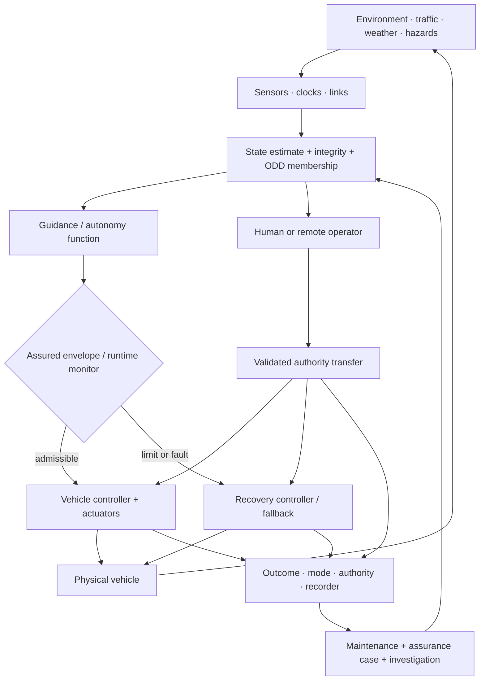
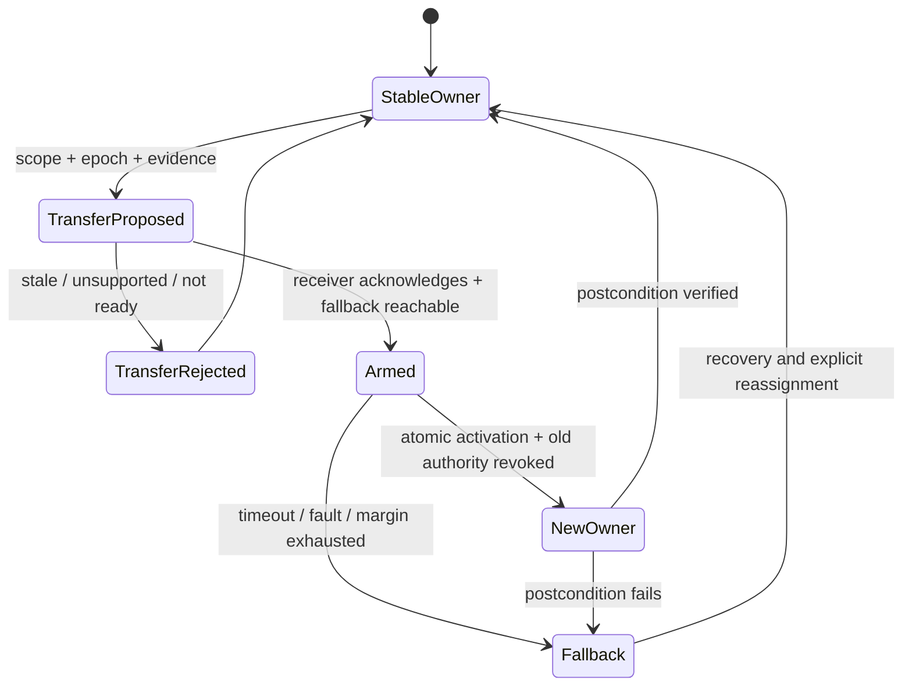

# Aerospace, maritime, and safety-critical autonomy audit

<!-- markdownlint-disable MD013 -->

**Audit date:** 2026-08-05  
**Scope:** flight and ship control; guidance, navigation, and state estimation;
operational and protection envelopes; redundancy and dissimilar backup; fault
detection, isolation, and accommodation; degraded modes and fallback;
collision avoidance; remote operation and human–autonomy handoff;
certification, assurance cases, maintenance, and accident investigation.  
**Purpose:** test whether safety-critical vehicle engineering contains a
transferable mechanism absent from the current architecture, after mature
control, runtime-assurance, human-factors, lifecycle, and investigation methods
are treated as the null rather than renamed as biological novelty.  
**Status:** research audit; no registry promotion. All `AERO-T` identifiers are
temporary and do not alter the shared claim ledger.

**Deduplication targets:**
[P-002](../principle-registry.md#p-002--local-autonomy-with-exception-escalation),
[P-003](../principle-registry.md#p-003--temporary-trace-before-commitment),
[P-006](../principle-registry.md#p-006--homeostatic-negative-feedback),
[P-008](../principle-registry.md#p-008--compartmentalized-interaction),
[P-009](../principle-registry.md#p-009--maintenance-plane),
[P-011](../principle-registry.md#p-011--transient-communication-coalitions),
[P-013](../principle-registry.md#p-013--externalized-shared-state),
[Candidate 005](../../experiments/candidates/005-severity-ordered-containment.md),
[Candidate 009](../../experiments/candidates/009-graded-assurance-envelopes.md),
[Candidate 011](../../experiments/candidates/011-dual-loop-operational-assurance.md),
[Candidate 012](../../experiments/candidates/012-latency-qualified-authority.md),
[Candidate 014](../../experiments/candidates/014-versioned-observation-contract.md),
the [power-grid](2026-08-05-power-grids-protection-and-recovery.md),
[high-reliability-organization](2026-08-05-high-reliability-organizations-incident-learning.md),
[security](2026-08-05-security-cryptography.md),
[programming-languages and verification](2026-08-05-programming-languages-verification.md),
and [HCI and human-factors](2026-08-05-hci-human-factors.md) audits.

## Executive finding

This audit finds no registry-ready aerospace or maritime principle. Mature
vehicle engineering already separates stabilization from mission planning,
state estimates from navigation integrity, nominal authority from protected
envelopes, primary function from independently assured recovery, redundancy
from common-cause independence, fault detection from accommodation, degraded
service from minimum-risk fallback, advisories from commands, and product
assurance from independent occurrence investigation.

The strongest result is a constraint on
[Candidate 012](../../experiments/candidates/012-latency-qualified-authority.md):

> Authority over a safety-relevant effect is valid only while observation,
> integrity, mode, headroom, communication, fallback reachability, and the
> controller-to-controller transfer state jointly support it.

That is not a new principle. It is the vehicle-domain form of latency-qualified
authority, with Candidate 005 owning severity-ordered response, Candidate 009
owning graded assurance and change impact, Candidate 011 owning live containment
versus longitudinal learning, and Candidate 014 owning evidence vintage and
lineage. The audit-local residual is a **validated asynchronous authority
transfer record**. It makes control transfer among local automation, human
crew, remote operators, and independent recovery controllers explicit enough
to test. It must not be promoted unless it beats standard mode annunciation,
interlocks, shared control, runtime assurance, and ordinary token/lease
protocols at equal sensing, training, reserve, communications, and assurance
cost.

Several attractive slogans fail immediately:

- low tracking error does not establish navigation integrity or mission safety;
- an operational design domain (ODD) is a declared validity region, not a
  proof that the vehicle remains inside it;
- a safety filter protects only the modeled set under its timing, sensing,
  actuation, and disturbance assumptions;
- three channels do not yield independent evidence when sensors, requirements,
  power, timing, environment, implementation, or voter are common;
- detecting a fault does not isolate it, and isolating it does not establish a
  safe reconfiguration;
- “fail safe” and “fail operational” are different objectives;
- a human nominally available for takeover is not a recovery function unless
  information, skill, authority, and reaction time are demonstrated; and
- certification evidence, operational safety, and accident reconstruction are
  related but non-substitutable assurance layers.

## Evidence and scope boundary

| Evidence type | What it supports | What it does not establish |
| --- | --- | --- |
| Control or estimation theorem | A property for the stated dynamics, sets, noise, sample time, and controller assumptions | Correctness under unmodeled dynamics, sensor corruption, actuator limits, software defects, or adversarial behavior |
| System architecture paper | A real implementation pattern and declared design rationale | Independent causal effect of one feature or transfer to another vehicle and hazard model |
| Standard or advisory circular | A current vocabulary, process, or acceptable means of compliance in its jurisdiction and scope | Unique compliance route, achieved safety, or a measured effect size |
| Simulation, flight, sea, or road trial | Behavior in the sampled scenarios, equipment, operators, weather, traffic, and fault injections | Coverage of open-world combinations or a universal failure probability |
| Accident investigation | Evidence-supported event sequence, causal factors, and recommendations for that occurrence | Base rates, simple single-cause attribution, or randomized counterfactual effect |
| Equal-budget fault injection | Comparative performance inside the declared plant, ODD, fault, operator, and cost model | Protection against omitted faults, incentives, or lifecycle changes |

The [FAA advisory circulars](https://www.faa.gov/regulations_policies/advisory_circulars)
cited here generally describe an acceptable means, not the only means, of
compliance. [ARP4754B](https://doi.org/10.4271/ARP4754B) and
[ARP4761A](https://doi.org/10.4271/ARP4761A) address aircraft and system
development and safety assessment; ARP4761A explicitly does not cover security
or in-service safety. [DO-178C](https://www.rtca.org/do-178/) supplies airborne
software development-assurance objectives; satisfying a process objective is
not an empirical failure-rate measurement or proof of correct requirements.

As of the audit date, the IMO's
[MASS Code](https://wwwcdn.imo.org/localresources/en/MediaCentre/Documents/MSC%20111-22-Annex%2016%20%28Secretariat%29.pdf)
was adopted as non-mandatory Resolution MSC.595(111) in May 2026 and took
effect on 1 July 2026. It supplies a particularly strong current null because
it already covers operational context, modes, ODD and operational envelope,
fallback, human oversight, remote operation, redundancy, data quality,
validation, alerting, software, connectivity, maintenance, and override. Its
goal-based requirements are authoritative engineering scope, not evidence that
any particular MASS is safe. It supplements rather than replaces applicable
SOLAS and collision regulations, and its principal scope is SOLAS Chapter I
cargo ships.

## Terms that must remain distinct

| Term | Audit meaning | Must not be collapsed into |
| --- | --- | --- |
| stabilization/control | apply inputs so selected state or output follows a reference or remains bounded | guidance, navigation, collision avoidance, or mission correctness |
| guidance | generate a desired path, speed, or maneuver | accurate state estimation or stable execution |
| navigation | estimate position, velocity, attitude, time, and related state | integrity: timely confidence that the solution is safe to use |
| accuracy | closeness of estimate to truth under a declared statistic | integrity, continuity, or availability |
| integrity | ability to bound hazardous misleading information and alert within a required time | average accuracy or a model confidence score |
| ODD | declared operating conditions for which a function is designed | a runtime proof that current conditions are in-domain |
| protection envelope | state/action constraints enforced by a controller or monitor | correctness of the protected mission or completeness of the constraint model |
| fault | hypothesized or detected abnormal condition | failure: loss of required function; hazard: condition with potential harm |
| detection | decide that behavior is inconsistent with a null or model | isolation, identification, prognosis, or accommodation |
| degraded mode | intentional operation with reduced capability or margin | nominal operation or guaranteed minimum-risk state |
| fallback | alternate function or procedure after a limit or fault | instantaneous safety, successful recovery, or preserved mission |
| fail safe | transition toward a state with acceptably bounded consequences | continue the requested service |
| fail operational | preserve specified function after declared faults | immunity to further faults or common causes |
| redundancy | more than one means or channel | independence, diversity, diagnosability, or correct voting |
| dissimilarity | deliberate difference in implementation or technology | statistical independence or absence of shared requirements and environment |
| advisory | information recommending or constraining action | an executed command or exclusive control authority |
| override | higher-priority interruption of an active control path | successful transfer, correct intent, or safe postcondition |
| verification | evidence that an artifact meets specified requirements | validation that the intended use and environment are adequately represented |
| certification | formal acceptance against applicable rules and evidence | perpetual safety after change, maintenance, or novel operation |
| safety case | structured claim–argument–evidence for a scoped use | proof by diagram, completeness of evidence, or numerical risk by itself |
| investigation | independent reconstruction for prevention and learning | blame allocation, telemetry collection alone, or causal certainty |

## Shared mathematical boundary and units

### Plant, controller, and estimation model

A generic vehicle is represented as

$$
\dot{x}(t)=f\!\left(x(t),u(t),d(t)\right),
\qquad y(t)=h\!\left(x(t)\right)+v(t).
$$

State $x$ may mix metres, metres per second, radians, radians per second, and
component states; input $u$ may contain newtons, newton-metres, radians, or
dimensionless actuator commands; disturbance $d$ retains its physical units;
and observation $y$ and noise $v$ share sensor units. Therefore norms and costs
require declared scaling. A learned controller is not comparable to a
conventional one unless both receive the same sensors, update period, actuator
limits, disturbance set, fallback reserve, and latency budget.

For a closed-loop model $\dot{x}=f_{\mathrm{cl}}(x)$, a Lyapunov certificate
may establish local or regional stability when

$$
V(x)>0,\qquad
\dot V(x)=\nabla V(x)^\mathsf{T}f_{\mathrm{cl}}(x)
\leq-\alpha(\lVert x\rVert).
$$

$V$ has chosen storage-like units, and $\alpha$ must match $V$ per second. The
claim is only over the certified set and model. It does not establish obstacle
avoidance, correct guidance, robustness outside the disturbance assumptions, or
safety of the software implementation.

For a discrete linear-Gaussian estimator,

$$
x_{k+1}=F_kx_k+B_ku_k+w_k,
\qquad z_k=H_kx_k+v_k,
$$

$$
P_k^-=F_{k-1}P_{k-1}F_{k-1}^{\mathsf T}+Q_{k-1},
\qquad
K_k=P_k^-H_k^{\mathsf T}
\left(H_kP_k^-H_k^{\mathsf T}+R_k\right)^{-1},
$$

$$
\hat x_k=\hat x_k^-+K_k(z_k-H_k\hat x_k^-),
\qquad P_k=(I-K_kH_k)P_k^-.
$$

$P$, $Q$, and $R$ are covariance matrices whose element $(i,j)$ has the product
of the units of variables $i$ and $j$; $K$ converts observation units into
state units. These equations are optimal only under their declared model and
second-order assumptions. Innovation consistency is evidence about that model,
not access to ground truth
([Kalman 1960](https://doi.org/10.1115/1.3662552)).

### Navigation integrity is not estimator confidence

A stylized protection level is

$$
PL=K_{\mathrm{int}}\sigma_{\mathrm{pos}},
\qquad \text{usable only when } PL\leq AL,
$$

where $PL$, position standard uncertainty $\sigma_{\mathrm{pos}}$, and alert
limit $AL$ are in metres, while integrity multiplier $K_{\mathrm{int}}$ is
dimensionless and depends on the declared fault and risk allocation. Actual
aviation algorithms account for geometry, fault hypotheses, bias bounds, and
continuity requirements. The equation is a dimensional scaffold, not an ICAO
or RAIM implementation. [Brown's baseline RAIM study](https://doi.org/10.1002/j.2161-4296.1992.tb02278.x)
shows that equal alarm rate is essential when methods are compared.

### Barrier and envelope assumptions

For safe set $\mathcal C=\{x:h(x)\geq0\}$ and control-affine dynamics
$\dot x=f(x)+g(x)u$, a control-barrier condition is

$$
\sup_{u\in\mathcal U}
\left[L_fh(x)+L_gh(x)u\right]\geq-\alpha(h(x)).
$$

$h$ has a declared state-derived unit, its Lie derivatives have that unit per
second, and $\alpha(h)$ must match. Under the modeled dynamics, admissible input
set, regularity, and continuous-time or sufficiently justified sampled-data
implementation, the inequality can support forward invariance
([Ames et al. 2017](https://doi.org/10.1109/TAC.2016.2638961)). Sensor bias,
delayed switching, actuator saturation, wrong obstacles, and infeasible safe
inputs remain outside an unqualified guarantee.

[Candidate 012](../../experiments/candidates/012-latency-qualified-authority.md)
already defines the wider action envelope

$$
\mathcal U_i(t)=\mathcal E_i
\!\left(\tau_i(t),q_i(t),m_i(t),b_i(t),c_i(t)\right).
$$

This audit adds no second envelope. Instead, it requires an ODD membership
assessment, fallback reachable set, transfer epoch, and acknowledged controller
identity to be represented in those typed inputs or handoff state.

### Redundancy and common cause

For three identical independent channels with reliability $R$ over the same
interval and a perfect majority voter,

$$
R_{\mathrm{TMR}}=3R^2(1-R)+R^3=3R^2-2R^3.
$$

The dimensionless result is invalid if channel failures are dependent, coverage
or voter behavior is imperfect, or the system-level success condition differs.
[Knight and Leveson's experiment](https://doi.org/10.1109/TSE.1986.6312924)
found coincident failures above the independence expectation in independently
developed program versions. Dissimilar computers can be valuable, but
“different” is not a probability model.

### Detection, reconfiguration, and the physical deadline

For estimator residual $r_k=y_k-\hat y_k$ with modeled covariance $S_k$, a
common detector alarms when

$$
r_k^{\mathsf T}S_k^{-1}r_k>\gamma.
$$

The statistic and threshold $\gamma$ are dimensionless after correct
normalization. Report false-alarm probability, missed-detection probability,
detection delay in seconds, and the tested fault magnitude and duration. A safe
active reconfiguration additionally needs

$$
T_{\mathrm{detect}}+T_{\mathrm{isolate}}+
T_{\mathrm{reconfigure}}+T_{\mathrm{settle}}<T_{\mathrm{boundary}},
$$

with every term in seconds and $T_{\mathrm{boundary}}$ derived from reachable
plant behavior, not an arbitrary response target. This necessary timing
inequality does not establish correct isolation or stable post-fault control.

### Collision geometry and rule compliance

For relative position $r$ in metres and constant relative velocity $v$ in
metres per second,

$$
t_{\mathrm{CPA}}=max\!\left(0,-\frac{r\mathbin{\cdot}v}
{\lVert v\rVert^2}\right),
\qquad
d_{\mathrm{CPA}}=\lVert r+v t_{\mathrm{CPA}}\rVert.
$$

Time and distance at closest point of approach are seconds and metres. The
formula fails as a complete collision policy when motion changes, observations
are uncertain, multiple agents interact, or right-of-way rules constrain
maneuvers. Maritime compliance also requires the qualitative duties in the
[COLREGs](https://www.imo.org/en/about/conventions/pages/colreg.aspx), including
lookout, safe speed, risk assessment, and early, substantial action. In aviation,
[ACAS](https://www.faa.gov/about/office_org/headquarters_offices/avs/offices/afx/afs/afs400/afs410/airborne-collision-avoidance-system-acas)
is an independently operating collision-avoidance family; traffic advisories
and resolution advisories are distinct outputs.

### Handoff, alerts, risk, and maintenance

A takeover or authority-transfer margin is

$$
M_{\mathrm{handoff}}=T_{\mathrm{hazard}}-
\left(T_{\mathrm{detect}}+T_{\mathrm{alert}}+T_{\mathrm{orient}}+
T_{\mathrm{decide}}+T_{\mathrm{actuate}}\right),
$$

in seconds. Every term is a context-dependent distribution, not a fixed human
constant. Positive margin is necessary but not sufficient: the incoming
controller must receive correct state, mode, intent, outstanding commands, and
executable authority. For an exclusive control effect, a useful invariant is

$$
\sum_{i=1}^{n}a_i(t)\leq1,
$$

where dimensionless $a_i\in\{0,1\}$ denotes effective authority for that effect.
The invariant prevents simultaneous owners but permits a dangerous zero-owner
gap, so a verified fallback must cover transfer intervals.

For alert sensitivity $s$, specificity $c$, and event prevalence $\pi$,

$$
PPV=\frac{s\pi}{s\pi+(1-c)(1-\pi)}.
$$

All variables are dimensionless. Rare hazards can yield low positive predictive
value despite an apparently strong detector; alarm workload and false action
must therefore be in the budget.

An elementary hazard-risk decomposition is

$$
\mathcal R=\sum_{h\in\mathcal H}P(h\mid\text{context})C(h),
$$

where $C(h)$ has the selected consequence unit and risk shares that unit. For
systematic software and novel autonomy, numerical $P(h)$ may be poorly
identified; development-assurance levels are not measured rates. A structured
safety case must expose that uncertainty rather than manufacture precision.

For stationary alternating up/down intervals,

$$
A=\frac{MTBF}{MTBF+MTTR},
$$

where $A$ is dimensionless and both mean times use the same unit. Availability
is not safety. Condition-based maintenance is useful only if the full response
fits within the uncertain potential-failure interval:

$$
T_{\mathrm{detect}}+T_{\mathrm{plan}}+T_{\mathrm{access}}+
T_{\mathrm{repair}}+T_{\mathrm{validate}}<T_{P-F}.
$$

Every term is in seconds, hours, or cycles consistently. The inequality does
not justify a sensor, prognosis, or interval unless failure consequences,
detectability, task effectiveness, and induced-maintenance faults are included.

## Mechanism map and initial disposition

| Mechanism | Exact problem | Strongest mature null | Project owner after deduplication | Initial disposition |
| --- | --- | --- | --- | --- |
| inner-loop control and guidance | stabilize and track within actuator and disturbance limits | robust/gain-scheduled/MPC control with verified monitors | P-006, Candidate 012 | established control family |
| navigation and integrity | estimate state and bound hazardous misleading information | Kalman/factor-graph estimation, RAIM, protection levels | Candidate 014, Candidate 012 | observation and authority contract |
| ODD and envelope protection | restrict operation to modeled conditions and safe sets | operational envelope, barrier/reference-governor/RTA protection | Candidate 009, Candidate 012 | no new envelope principle |
| redundancy and dissimilar backup | preserve or safely shed function after faults | FHA/FMEA/FTA-informed partitioning, monitors, voting, dissimilar lanes | P-008, Candidate 005 | common-cause boundary retained |
| FDI and accommodation | detect, isolate, and reconfigure before boundary crossing | analytical redundancy, residual tests, active/passive FTC | P-006, Candidate 005/012 | mature null |
| degraded modes and fallback | trade service for recoverability under reduced capability | mode logic, fallback state, minimum-risk condition, procedures | Candidate 005/012 | severity-ordered containment |
| collision avoidance | coordinate under uncertain trajectories and rules | COLREG-compliant planner, ACAS/TCAS, reachable-set avoidance | P-011, Candidate 012 | domain policy, not generic novelty |
| remote operations | preserve observation, command, timing, and responsibility over links | redundant connectivity, local safety, remote-center procedures | P-002/P-013, Candidate 012/014 | latency-qualified authority |
| human–autonomy handoff | transfer effective control without ambiguity or recovery gap | explicit modes, interlocks, shared control, RTA, trained procedures | Candidate 012, HCI audit | residual test fixture only |
| certification and safety case | justify scoped acceptability and control change impact | ARP4754B/ARP4761A/DO-178C, GSN, UL 4600, MASS Code | Candidate 009, PL audit | assurance-envelope implementation |
| maintenance and configuration | retain function across wear, repair, update, and drift | RCM, approved maintenance program, configuration/change control | P-009, Candidate 009/014 | maintenance-plane implementation |
| accident investigation | reconstruct occurrence and prevent recurrence | Annex 13, IMO Casualty Investigation Code, independent reports | Candidate 011/014, HRO audit | dual-loop learning implementation |

## Safety and authority loop



The diagram is a coverage map, not a safety proof. The monitor must not depend
only on the complex function it constrains; the recovery controller must have a
reachable region and adequate resources; the recorder must preserve clocks and
versions; and lifecycle findings must change requirements, tests, training,
configuration, or operating limits through controlled processes.

## 1. Vehicle stabilization, guidance, and automatic flight or ship control

**Evidence design.** [FAA AC 25.1329-1C](https://www.faa.gov/airports/resources/advisory_circulars/index.cfm/go/document.information/documentNumber/25.1329-1C)
defines an accepted framework for transport-airplane flight-guidance systems,
including autopilot, flight director, and autothrust interactions. Brière and
Traverse describe the architecture, monitoring, redundancy, reconfiguration,
and service experience of an actual fly-by-wire family
([1993](https://doi.org/10.1109/FTCS.1993.627364)). These establish mature
design patterns, not a universal controller or independent estimate of safety.

**Exact problem.** Convert pilot, navigator, or mission intent into actuator
commands while stabilizing a nonlinear plant, tracking references, respecting
loads and actuator limits, and avoiding harmful cross-axis or mode interactions.

**Information/authority path.** Sensors feed estimators; guidance produces
references; the active control law commands actuators; limiters and monitors
constrain those commands; crew or supervisory functions select modes and
targets. “The AI flies” hides at least five separable authority assignments.

**Timescale and units.** Inner loops range from milliseconds to seconds;
guidance updates from fractions of a second to minutes. State and control use
metres, metres per second, radians, radians per second, newtons, newton-metres,
degrees, percentages, and seconds. Mixed-state norms require scaling.

**Resource cost.** Sensors, redundant computers, actuator reserve, power,
verified control software, plant models, simulation, hardware-in-the-loop,
training, and flight or sea test. A neural controller's inference joules are a
small subset of the assurance cost.

**Assumptions.** Sufficient controllability and observability, representative
dynamics and disturbances, bounded delay and sampling jitter, valid actuator
authority, and correct configuration and mode logic.

**Failure boundary.** Unmodeled dynamics, adverse weather or hydrodynamics,
sensor disagreement, saturation, limit cycles, unstable switching, control-law
mode confusion, or a stable vehicle faithfully tracking an unsafe reference.

**Strongest statistical/engineering null.** Gain-scheduled robust control or
constrained MPC with explicit actuator/rate limits, independent monitors,
hardware-in-the-loop and scenario testing, and a qualified fallback controller.

**P mapping and disposition.** P-006 owns bounded regulation; P-002 owns local
action and escalation; Candidate 012 owns state-qualified authority. This is an
established engineering analogue, not a new principle.

## 2. Navigation, state estimation, and integrity monitoring

**Evidence design.** Kalman's paper gives a recursive linear estimator under a
declared stochastic model
([1960](https://doi.org/10.1115/1.3662552)). Brown derives a baseline GPS
receiver-autonomous integrity-monitoring comparison at equal alarm rate
([1992](https://doi.org/10.1002/j.2161-4296.1992.tb02278.x)). The
[ICAO GNSS Manual](https://store.icao.int/en/global-navigation-satellite-system-gnss-manual-doc-9849)
separates accuracy, integrity, continuity, and availability. Method results do
not show integrity under omitted faults, spoofing, or misconfigured frames.

**Exact problem.** Estimate latent vehicle and environmental state from noisy,
biased, delayed, asynchronous, and sometimes faulty measurements while warning
before an unacceptably misleading solution is used.

**Information/authority path.** Raw sensor observations, calibration, frames,
clocks, and fault hypotheses enter an estimator; residual and geometry checks
produce integrity state and protection levels; downstream control receives
both an estimate and authorization to use it. The estimator must not silently
turn “unknown” into a precise state.

**Timescale and units.** Inertial updates may be sub-second; satellite,
celestial, radar, sonar, AIS, or map updates span seconds to minutes; drift and
calibration span missions. Position is metres, velocity metres per second,
attitude radians, time seconds, and covariances use pairwise product units.

**Resource cost.** Sensor diversity, timing, calibration, maps, atmospheric or
propagation models, fault hypotheses, compute, bandwidth, integrity risk
allocation, and independent reference measurements for validation.

**Assumptions.** Known coordinate and time standards, adequate geometry,
bounded biases or explicit alternatives, representative noise/correlation,
correct association, and enough independent observations for the claimed fault
detection or exclusion.

**Failure boundary.** Common sensor or map bias, multipath, spoofing, clock
error, covariance inconsistency, frame mismatch, data association error,
unmodeled maneuver, or high-confidence estimates outside calibrated support.

**Strongest statistical/engineering null.** A calibrated state-space or factor-
graph estimator with RAIM-like fault hypotheses, protection levels, innovation
tests, out-of-support state, and injection against correlated and common-mode
faults.

**P mapping and disposition.** Candidate 014 already owns response, vintage,
selection, support, lineage, and supersession; Candidate 012 owns whether the
estimate authorizes action; P-013 owns externalized state. Navigation integrity
strengthens their test schema but creates no new principle.

## 3. Operational design domains and protection envelopes

**Evidence design.** The current IMO MASS Code explicitly requires operational
context, ODD, operational envelope, modes, fallback, and validation. Ames and
colleagues establish a control-barrier-function construction under stated
dynamics and safe-set assumptions
([2017](https://doi.org/10.1109/TAC.2016.2638961)).
[ASTM F3269-21](https://doi.org/10.1520/F3269-21) specifies a runtime-assurance
architecture for aircraft systems with complex functions. These are strong
nulls, not evidence that an ODD declaration or monitor is complete.

**Exact problem.** Prevent a high-capability function from exercising authority
where its requirements, data, models, sensing, control margin, or recovery
assumptions do not hold.

**Information/authority path.** Operational conditions are measured and
classified against a versioned ODD; state and reachable-set estimates feed an
envelope monitor; a switch accepts the complex command, modifies it, or selects
a recovery function; the decision and evidence are recorded.

**Timescale and units.** Safety filters can run in milliseconds; ODD transition
and fallback can span seconds to hours. Margins use domain units—metres,
seconds, knots, degrees, load factor, visibility, sea state, bandwidth, or
energy reserve—not a unitless “confidence.”

**Resource cost.** Independent sensors and computation, conservative margins,
recovery authority and energy, ODD taxonomy, coverage analysis, switch testing,
and validation of every update and fallback transition.

**Assumptions.** The safe set and ODD boundary are observable early enough; the
monitor is simpler or better assured than the complex function; recovery is
reachable; switching dynamics and actuator limits are included.

**Failure boundary.** Unknown conditions, delayed boundary detection,
misclassified weather or traffic, monitor dependence on corrupted primary
inputs, infeasible recovery, chattering, simultaneous faults, and model error
that keeps a dangerous state “inside” the certified set.

**Strongest statistical/engineering null.** Static operating limits plus a
verified Simplex/RTA monitor and recovery controller, compared with barrier
filters or reference governors under the same sensing, reserve, and timing.

**P mapping and disposition.** Candidate 009 owns assurance scope and Candidate
012 already defines a dynamic admissible-action set. Merge ODD membership and
fallback-reachability fields into their evaluation; do not create an “envelope
protection” principle.

## 4. Runtime assurance and reflex-like recovery paths

**Evidence design.** The Simplex architecture separates an advanced controller
from a high-assurance safety controller and switching logic
([Sha 2001](https://doi.org/10.1109/MS.2001.936213);
[Seto et al. 1998](https://doi.org/10.1109/ACC.1998.703255)). ASTM F3269-21
codifies input manager, safety monitor, switch, recovery function, coverage,
and latency concerns for aviation RTA. This is already the mature engineering
version of a “reflex path.”

**Exact problem.** Permit a complex or incompletely assured controller to add
performance while preventing it from exhausting the state and time margin
needed by a simpler recovery function.

**Information/authority path.** Trusted inputs reach both complex and safety
paths; the safety monitor predicts boundary approach; the RTA switch transfers
command authority; the recovery controller acts; postconditions and monitor
coverage are logged. A switch after the recovery region is lost is useless.

**Timescale and units.** Monitor and switching latency are milliseconds or
seconds; safety margin is expressed in state units and time-to-boundary seconds;
recovery consumes actuator, energy, path, or separation reserve in native units.

**Resource cost.** Independent implementation and inputs, reserve actuators or
control authority, conservative switching, recovery validation, monitor proof
or testing, and mission performance lost to early intervention.

**Assumptions.** The monitor covers relevant hazards, receives trustworthy and
fresh inputs, can preempt the complex path, and selects a recovery function that
remains feasible through delay, computation, and actuation.

**Failure boundary.** Shared sensor or requirement faults, monitor blindness,
unsafe switch transients, recovery-controller defect, adversarially induced
oscillation, resource exhaustion, or a safe-state concept that ignores traffic
and environmental consequences.

**Strongest statistical/engineering null.** ASTM-style RTA or conventional
independent limiter/trip logic with a verified recovery region and injected
timing, sensor, actuator, and common-mode faults.

**P mapping and disposition.** Candidate 005 already owns least-destructive
qualified action and escalation; P-008 owns compartments; Candidate 012 owns
authority shrinkage and validated handoff. “Reflex-like path” is retired as a
new concept unless it beats these exact architectures.

## 5. Redundancy, voting, and dissimilar backup

**Evidence design.** Brière and Traverse report monitored, redundant, and
reconfigurable Airbus flight-control computers
([1993](https://doi.org/10.1109/FTCS.1993.627364)); Yeh describes the 777's
triple-triple primary flight computer
([1996](https://doi.org/10.1109/AERO.1996.495891)). Knight and Leveson directly
tested the independence assumption in multiversion software and found dependent
failures that simple independent-reliability multiplication misses
([1986](https://doi.org/10.1109/TSE.1986.6312924)).

**Exact problem.** Continue a required function or fail without hazardous
output after component, channel, sensor, power, software, or communication
faults, while identifying common causes and voter failure.

**Information/authority path.** Independent or partitioned channels compute;
cross-monitors or voters compare; fault containment regions limit propagation;
reconfiguration removes suspect channels; a degraded or backup path receives
authority; maintenance identifies and repairs latent failures.

**Timescale and units.** Detection and voting occur in microseconds to seconds;
latent-fault exposure spans dispatch intervals and missions. Reliability and
coverage are probabilities over a declared duration or demand count; delay is
seconds; power and mass are watts and kilograms.

**Resource cost.** Hardware, mass, power, wiring, diverse sensors and software,
partitioning, synchronized data, voter assurance, test independence, spare
capacity, maintenance, and configuration control.

**Assumptions.** Fault hypotheses and containment regions are credible,
channels are sufficiently independent for the calculation, disagreement is
diagnosable, voter and shared resources are covered, and backup capability is
adequate for the required duration.

**Failure boundary.** Common requirement, sensor, clock, power, environment,
toolchain, or maintenance fault; correlated software errors; Byzantine output;
bad data agreed by all channels; voter defect; or latent backup failure revealed
only on demand.

**Strongest statistical/engineering null.** Hazard-driven redundancy with
explicit common-cause analysis, dissimilarity argument, fault containment,
coverage and latent-fault tests, rather than channel count or majority accuracy.

**P mapping and disposition.** P-008 owns compartmentalization and Candidate
005 owns containment and escalation. Candidate 009 owns the assurance argument.
Redundancy is an implementation family; independence metadata and common-mode
fault injections belong in candidate tests.

## 6. Fault detection, isolation, identification, and accommodation

**Evidence design.** Zhang and Jiang review 376 references spanning fault
detection and diagnosis and active reconfigurable fault-tolerant control
([2008](https://doi.org/10.1016/j.arcontrol.2008.03.008)). The breadth is a
strong mature null, while a review is not performance evidence for any plant.
Aircraft architecture papers provide deployed examples of monitoring and
reconfiguration but not a universal diagnosis method.

**Exact problem.** Recognize that required behavior is no longer credible,
distinguish sufficiently among competing fault hypotheses, and adapt control or
operation before the plant crosses a consequential boundary.

**Information/authority path.** Sensors and analytical redundancy produce
residuals; a detector alarms; an isolation stage ranks fault location/type;
decision logic selects passive robustness, channel removal, controller
reconfiguration, service reduction, or shutdown; outcomes update diagnostics
and maintenance records.

**Timescale and units.** Abrupt actuator and sensor faults may require response
within milliseconds or seconds; incipient wear may evolve over hours or cycles.
Report fault magnitude in native units, false and missed probabilities,
detection/isolation delay in seconds, and post-fault error and stability margin.

**Resource cost.** Extra sensing, excitation, models, observers, fault
dictionaries, compute, conservative thresholds, false alarms, test scenarios,
and reserve needed by reconfigured control.

**Assumptions.** Relevant faults are structurally distinguishable under the
available excitation; noise and model error are bounded or calibrated; residual
thresholds match context; the isolated fault maps to a validated response.

**Failure boundary.** Confounded faults, weak excitation, simultaneous or
intermittent faults, model drift, corrupted residual covariance, threshold
adaptation that hides a fault, false isolation, or stable reconfiguration to the
wrong plant model.

**Strongest statistical/engineering null.** Residual/observer or data-driven
detector calibrated at equal false-alarm and compute budget, followed by an
explicit isolation-confusion matrix and verified passive/active FTC response.

**P mapping and disposition.** P-006 owns negative feedback, P-009 owns
longitudinal diagnostics, Candidate 005 owns response ordering, and Candidate
012 owns the shrinking post-fault action set. No generic “immune-like FDIR”
principle survives.

## 7. Degraded modes, fallback, and minimum-risk conditions

**Evidence design.** The IMO MASS Code distinguishes normal, degraded, and
fallback operation and requires modes, fallback, contingency, and operational
envelopes to be addressed. [FAA AC 25.1309-1B](https://www.faa.gov/regulations_policies/advisory_circulars/index.cfm/go/document.information/documentID/1043037)
frames system design and analysis for transport aircraft. These provide design
and assessment vocabulary, not a universal ordering of service sacrifice.

**Exact problem.** When nominal capability or assurance is lost, choose a
reachable state and reduced service that bound consequence without introducing
a larger hazard to occupants, other traffic, infrastructure, or environment.

**Information/authority path.** Fault and context evidence enter supervisory
logic; a response table or constrained optimizer selects continue, isolate,
limit, hold, divert, stop, anchor, land, abandon mission, or emergency action;
the active mode, unavailable functions, and next escalation are exposed to all
controllers and logged.

**Timescale and units.** Immediate trips take milliseconds; landing, diversion,
anchoring, or remote assistance can take minutes to hours. Required reserves are
fuel/energy, separation metres, stopping distance, sea room, controllability
margin, communication duration, and crew or operator minutes.

**Resource cost.** Preplanned modes, spare function, alternate routes and sites,
reserve energy, drills, remote support, decision tables, certification, and
repeated proof that fallback remains reachable after configuration changes.

**Assumptions.** Failure state is known well enough, the fallback is compatible
with traffic and environment, resources remain available, mode transitions are
safe, and another controller can understand the reduced configuration.

**Failure boundary.** Cascading faults, fallback destination unavailable,
minimum-risk state harmful to others, ambiguous degraded capability, hidden
loss of redundancy, recovery attempt that exhausts reserve, or mode oscillation.

**Strongest statistical/engineering null.** Hazard-analysis-derived degraded
mode tables and RTA reachability, exercised with combinations of failed
resources and unavailable destinations, at equal mission reserve.

**P mapping and disposition.** This is an especially direct instantiation of
Candidate 005's severity-ordered containment and Candidate 012's authority
shrinkage. P-002 supplies exception escalation. Do not create a separate
“graceful degradation” principle.

## 8. Collision avoidance in air and at sea

**Evidence design.** The [COLREGs](https://www.imo.org/en/about/conventions/pages/colreg.aspx)
establish international maritime navigation rules, including lookout, safe
speed, collision risk, and vessel-specific responsibilities. The FAA describes
ACAS as an airborne family independent of ground ATC; ACAS II emits traffic and
resolution advisories. Kochenderfer, Holland, and Chryssanthacopoulos describe
the probabilistic decision process developed for next-generation ACAS
([2012](https://www.ll.mit.edu/sites/default/files/publication/doc/next-generation-airborne-collision-avoidance-system-kochenderfer-ja-20264.pdf)).
These sources establish mature policy and systems, not cross-domain equivalence.

**Exact problem.** Maintain adequate separation among interacting agents under
uncertain observation, intent, maneuverability, communication, and asymmetric
rules, while limiting unnecessary alerts and evasive maneuvers.

**Information/authority path.** Own-state and traffic sensors produce tracks
with uncertainty and association; a conflict predictor evaluates time and
distance; a rules/policy layer selects advisory or maneuver; coordination and
acknowledgement may align agents; vehicle control executes; outcomes and
non-cooperation remain monitored.

**Timescale and units.** Airborne encounters may evolve in seconds to minutes;
ship encounters in minutes to hours. Position is metres or nautical miles,
speed metres per second or knots, bearing degrees, time seconds/minutes, and
probabilities are tied to a horizon and encounter model.

**Resource cost.** Independent surveillance, transponders or AIS, tracking,
encounter models, rule encoding, communications, false-alert burden, path and
fuel deviation, controller attention, and validation of multi-agent behavior.

**Assumptions.** Tracks and identities are sufficiently reliable, vehicle
dynamics and delays are modeled, other agents respond within the assumed set,
rules are correctly interpreted, and the recommended maneuver remains feasible.

**Failure boundary.** Constant-velocity extrapolation failure, sensor/AIS
absence or spoofing, multiple simultaneous conflicts, incompatible advisories,
late or non-compliant action, ambiguous COLREG situations, and safe pairwise
actions that create a multi-agent conflict.

**Strongest statistical/engineering null.** Domain-compliant ACAS/TCAS or
COLREG planner with probabilistic tracking, reachable dynamics, multi-agent
encounter simulation, and equal false-alert and deviation cost—not nearest-
neighbor geometry or learned imitation alone.

**P mapping and disposition.** P-011 owns temporary coordination; Candidate 012
owns authority and headroom; Candidate 014 owns tracks and observation lineage.
Collision avoidance is a domain policy and game under physical constraints, not
a generic consensus principle.

## 9. Connectivity and remote operations

**Evidence design.** The IMO MASS Code includes connectivity, remote operations,
human oversight, data quality, cybersecurity, modes, and override. The IMO's
[interim trial guidelines](https://wwwcdn.imo.org/localresources/en/MediaCentre/HotTopics/Documents/MSC.1-Circ.1604%20-%20Interim%20Guidelines%20For%20Mass%20Trials%20%28Secretariat%29.pdf)
also require risk management, appropriate communications/data exchange,
reporting, and affected-third-party awareness. Standards specify scope and
process; operational distributions must still be measured.

**Exact problem.** Allow an off-vehicle controller to observe, decide, and act
without assuming that a variable-delay, lossy, partitionable, or compromised
link provides local-time state or exclusive authority.

**Information/authority path.** Vehicle state and video/radar/health telemetry
cross a timestamped channel to a remote center; remote intent and commands
cross an authenticated authority path; the vehicle independently checks
freshness, epoch, mode, and admissibility; link degradation shrinks remote
authority and activates local fallback.

**Timescale and units.** Control and perception streams range from milliseconds
to seconds; outages from seconds to hours. Report p50/p95/p99.9 latency and
jitter in seconds, loss fraction, bandwidth in bit/s, age of information in
seconds, energy in joules, and local reserve duration.

**Resource cost.** Diverse links, spectrum and bandwidth, remote-center
staffing, local autonomy, cybersecurity, clocks, compression, simulation,
training, and fallbacks sized for link loss rather than average connectivity.

**Assumptions.** End-to-end clocks and identity are valid, channel dependence is
modeled, remote displays preserve decision-relevant state, command age and
order are checked, and local action can remain safe when the link disappears.

**Failure boundary.** Correlated link loss, stale but plausible video,
out-of-order or duplicated command, split-brain control, compromised remote
center, bandwidth competition, silent local takeover, or remote staffing unable
to handle simultaneous exceptions.

**Strongest statistical/engineering null.** Local fail-safe/RTA autonomy with
authenticated epoch-bound commands, age limits, diverse-link accounting, and
remote supervisory procedures tested under burst loss and partitions.

**P mapping and disposition.** P-002 owns local action plus exception
escalation; P-013 and Candidate 014 own shared state and observation vintage;
Candidate 012 owns latency-qualified remote authority; the security audit owns
identity, revocation, compromise, and clean recovery. No new “distributed ship
brain” principle survives.

## 10. Human–autonomy handoff, shared control, and mode awareness

**Evidence design.** Bainbridge identifies the abnormal-event burden left to
operators by automation
([1983](https://doi.org/10.1016/0005-1098(83)90046-8)); Sarter and Woods analyze
mode error and awareness in supervisory control
([1995](https://doi.org/10.1518/001872095779049516)); Endsley and Kiris measure
out-of-the-loop takeover impairment under levels of automation
([1995](https://doi.org/10.1518/001872095779064555)). The NTSB's Uber Tempe
[investigation](https://www.ntsb.gov/investigations/Pages/HWY18MH010.aspx)
found a developmental ADS detected the pedestrian 5.6 seconds before impact but
did not respond effectively; reliance on a distracted operator was embedded in
wider risk-assessment, oversight, and safety-culture failures. These results do
not yield one universal takeover time.

**Exact problem.** Move control among automation, onboard humans, remote humans,
and safety controllers without ambiguous ownership, incompatible goals, stale
situation models, double command, or an uncovered gap.

**Information/authority path.** The outgoing controller publishes actual and
pending mode, reason, observation age/integrity, intended trajectory, active
constraints, outstanding commands, faults, and remaining fallback; the incoming
controller acknowledges and demonstrates effective authority; the plant
postcondition confirms transfer; a fallback covers timeout or refusal.

**Timescale and units.** Automation transitions may occur in milliseconds;
human orientation, decision, and action span seconds to minutes with heavy
tails. Measure alert-to-gaze, comprehension, correct action, actuator response,
hazard margin, and workload—not a nominal fixed delay.

**Resource cost.** Stable mode design, annunciation, crew/remote training and
practice, staffing, attention, simulator exercises, authority interlocks,
fallback reserve, and post-event reconstruction. Human monitoring is not free.

**Assumptions.** The incoming controller is available, alert, trained, receives
enough correct state, can perceive actual authority, and can affect the vehicle
before the remaining margin expires.

**Failure boundary.** Automation surprise, mode-display mismatch, nuisance
takeovers, skill decay, startle, simultaneous remote/onboard commands, latent
command continuing after transfer, no-owner gap, or safety arbitration hidden
from the operator.

**Strongest statistical/engineering null.** Stable explicit modes with an
interlock, trained procedure, takeover request with measured response
distribution, RTA fallback, and ordinary exclusive token/lease transfer;
compare shared-control and richer contract variants at equal training and alert
load.

**P mapping and disposition.** Candidate 012 is the direct owner. Candidate 011
and the HRO audit own handoff traces and operational learning; the HCI audit
already defines actual/pending mode, authority, delta, recovery, and
acknowledgement fields. Retain only the vehicle-specific falsification fixture.

## 11. Certification, system safety, and assurance cases

**Evidence design.** [ARP4754B](https://doi.org/10.4271/ARP4754B),
[ARP4761A](https://doi.org/10.4271/ARP4761A), and FAA-recognized
[DO-178C guidance](https://www.faa.gov/airports/resources/advisory_circulars/index.cfm/go/document.information/documentNumber/20-115D)
provide mature development and safety-assessment processes for civil aircraft.
The [GSN Community Standard](https://scsc.uk/gsn-standard) structures assurance
arguments. The goal-based MASS Code and
[UL 4600](https://www.ul.com/news/ul-4600-edition-3-updates-incorporate-autonomous-trucking)
require broad autonomy safety arguments. Conformance is not outcome evidence,
and a claim–argument–evidence graph can be incomplete or invalid.

**Exact problem.** Make the system-level safety claim, operating context,
hazards, allocated requirements, assumptions, evidence, residual uncertainty,
configuration, and change impact reviewable rather than inferring safety from
component accuracy or test mileage.

**Information/authority path.** Concept and hazards generate safety
requirements and assurance levels; requirements allocate to systems, hardware,
software, people, operations, and maintenance; verification and validation
produce evidence; configuration and change control preserve traceability;
operational data and incidents challenge the case.

**Timescale and units.** Evidence spans requirement decisions, test cases,
hours/cycles, missions, updates, and service life. Consequence and probability
units are hazard-specific; software assurance levels and GSN nodes are ordinal
or structural, not failure rates.

**Resource cost.** Safety analysis, requirements and traceability, independent
reviews, qualified tools where needed, simulation and testing, human-factors
assessment, configuration baselines, evidence maintenance, audits, and
recertification/change impact.

**Assumptions.** Hazards and operating context are sufficiently complete,
evidence actually supports claims, independence arguments are credible,
requirements are correct and traceable, and field configuration matches the
assessed baseline.

**Failure boundary.** Correct implementation of unsafe requirements,
unsupported quantitative risk, assurance-case confirmation bias, evidence
staleness after update, emergent interaction, invalid tool/simulation model,
and operational drift beyond assessed scope.

**Strongest statistical/engineering null.** Conventional system safety and
development assurance plus a versioned safety case, explicit defeaters,
configuration/change impact, independent review, and post-deployment evidence.

**P mapping and disposition.** Candidate 009 already owns proof, empirical,
runtime, provenance, migration, rollback, and authority envelopes; Candidate
011 supplies operational feedback; Candidate 014 supplies evidence lineage. The
PL-verification audit owns specification and proof boundaries. Assurance cases
are implementation infrastructure, not a new principle.

## 12. Maintenance, condition monitoring, and configuration

**Evidence design.** Nowlan and Heap's aviation-derived
*Reliability-Centered Maintenance* (1978, report AD-A066579) ties tasks to
function, failure mode, consequence, and task applicability rather than assuming
all equipment benefits from age-based overhaul. Current
[FAA AC 120-16G](https://www.faa.gov/regulations_policies/advisory_circulars/index.cfm/go/document.information/documentID/1028859)
describes ten elements of air-carrier maintenance programs. These are mature
lifecycle disciplines; neither guarantees a useful prognostic signal.

**Exact problem.** Preserve required function and known configuration across
wear, hidden failures, environmental exposure, repair, replacement, calibration,
software/data updates, and organizational handoff without maintenance-induced
faults or silent loss of redundancy.

**Information/authority path.** Operational and inspection observations update
component health and failure evidence; consequence and detectability determine
scheduled, condition-based, failure-finding, redesign, or run-to-failure tasks;
approved work changes configuration; independent checks return the vehicle to
service; findings update the assurance case.

**Timescale and units.** Vibration and temperature may be sampled in
milliseconds; inspection intervals use hours, cycles, days, or calendar age;
remaining-useful-life estimates must retain the same unit and uncertainty.
Downtime, labor hours, parts, induced faults, and energy are costs.

**Resource cost.** Sensors and storage, inspections, access and downtime,
trained maintainers, spares, manuals, calibration, configuration records,
independent inspection, post-maintenance test, and false removals.

**Assumptions.** Failure modes and consequences are known enough, the condition
indicator precedes functional failure, the task is applicable and effective,
parts and skills are available, and configuration records match the vehicle.

**Failure boundary.** No detectable P–F interval, abrupt or common-mode
failure, sensor drift, prognosis trained on selected removals, maintenance
damage, wrong part/software/data load, hidden backup failure, or optimization
that improves availability while increasing hazardous exposure.

**Strongest statistical/engineering null.** RCM/approved maintenance program
with configuration control, failure-finding of dormant protections, survival or
degradation analysis, controlled interventions, and post-maintenance validation.

**P mapping and disposition.** P-009 is the direct owner; Candidate 009 owns
update/change assurance; Candidate 014 owns observation and configuration
lineage; Candidate 005 owns replenishment after containment. No new
“self-healing vehicle” principle is justified.

## 13. Accident and incident investigation

**Evidence design.** [ICAO Annex 13](https://store.icao.int/en/annex-13-aircraft-accident-and-incident-investigation)
and the [IMO Casualty Investigation Code](https://wwwcdn.imo.org/localresources/en/KnowledgeCentre/IndexofIMOResolutions/MSCResolutions/MSC.255%2884%29.pdf)
define prevention-focused, independent safety investigation rather than blame
allocation. Leveson's systems-theoretic accident model broadens analysis beyond
component chains
([2004](https://doi.org/10.1016/S0925-7535(03)00047-X)). Individual reports
provide causal evidence for their event, not incident base rates.

**Exact problem.** Reconstruct what happened across physical state, sensing,
software, modes, commands, people, organization, maintenance, regulation, and
environment; identify actionable causal factors; and ensure findings alter the
live system and recurrence controls.

**Information/authority path.** Independent investigators preserve wreckage,
recorders, logs, versions, procedures, training, communications, and testimony;
align clocks and establish evidence provenance; test hypotheses; publish
findings and recommendations; accountable owners implement and verify actions.

**Timescale and units.** Event reconstruction can require milliseconds of
control data, seconds of communication, months of organizational history, and
years of lifecycle evidence. Clock offset and uncertainty are seconds;
parameters retain native units; recommendation closure has dates and evidence.

**Resource cost.** Crash-protected and tamper-evident recording, synchronized
clocks, data retention, independent expertise, laboratories, interviews,
publication, recommendation tracking, and protected reporting channels.

**Assumptions.** Evidence is recoverable and authentic, clocks and versions can
be aligned, investigators are independent and competent, alternative sequences
are considered, and organizations act on findings rather than merely archive
them.

**Failure boundary.** Missing or overwritten logs, recorder variables selected
for old architectures, vendor-only semantics, blame pressure, survivor and
reporting bias, hindsight certainty, recommendations without owners, and fixes
that address the last sequence while leaving the hazard-generating control
structure intact.

**Strongest statistical/engineering null.** Annex-13/Casualty-Code-style
independent investigation with typed versioned evidence, causal alternatives,
systems analysis, recommendation ownership, due dates, and verified recurrence
tests.

**P mapping and disposition.** Candidate 011 directly owns live containment
versus longitudinal repair; Candidate 014 owns evidence lineage and
supersession; P-009 owns the maintenance plane; P-013 owns reconstructable
shared state. The HRO audit owns reporting and learning conditions. No new
“learn from failure” principle survives.

## Accident evidence as mechanism boundary

| Occurrence and primary report | Evidence relevant to this audit | Invalid one-line lesson | Contract or test implication |
| --- | --- | --- | --- |
| [Air France 447, BEA](https://bea.aero/en/investigation-reports/notified-events/detail/accident-to-the-airbus-a330-203-registered-f-gzcp-and-operated-by-air-france-occured-on-06-01-2009-in-the-atlantic-ocean/) | Pitot icing produced erroneous speed indications, loss of automated assistance, a stall, and collision with the ocean; the final report and appendices cover procedures, training, warnings, probes, and certification context. | “Automation handed back too late” or “envelope protection failed” as a complete cause. | Inject inconsistent air data, mode transitions, warning logic, startle, procedure use, and high-altitude manual control together; preserve sensor, law, alert, command, and mode chronology. |
| [USS *John S McCain*, NTSB](https://www.ntsb.gov/news/press-releases/Pages/NR20190805.aspx) | In backup manual mode, an unintentional unilateral transfer of steering control created a perceived loss of steering; steering remained available, while situation awareness, procedures, training, and oversight were deficient. | “The steering system failed.” | Authority identity and transfer must come from the effective controller, not user expectation; test split control, unilateral transfer, display mismatch, and emergency procedure execution in traffic. |
| [USS *Fitzgerald*, NTSB MAR-20/02](https://ntsb.gov/investigations/AccidentReports/Reports/MAR2002.pdf) | The investigation identified training, fatigue, AIS-broadcast practice, COLREG compliance, radar/ARPA use, and actions of both ships as safety issues. | “More collision-avoidance AI would have prevented it.” | Evaluate lookout, track use, rule compliance, communication, workload, policy, and organization as well as prediction; an unused or misunderstood sensor is not an effective safety channel. |
| [Uber Tempe, NTSB HAR-19/03](https://www.ntsb.gov/investigations/Pages/HWY18MH010.aspx) | The ADS detected the pedestrian before impact but misclassified and failed to respond effectively; the system relied on operator intervention amid distraction, automation-complacency, risk-assessment, oversight, and safety-culture deficiencies. | “A safety driver was in the loop,” or conversely, “the classifier alone caused the crash.” | A human fallback requires monitored engagement, usable time, actionable state, authority, braking path, organizational supervision, and proof that intervention can meet the hazard deadline. |

These cases are not interchangeable. They do jointly falsify component-only
stories: capability, sensor detection, channel availability, nominal human
presence, or a written procedure does not establish that the closed safety loop
worked.

## Deduplication against the current architecture

| Existing owner | What it already owns | Vehicle-domain refinement | Deduplication decision |
| --- | --- | --- | --- |
| P-002 | bounded local autonomy with escalation on exception or uncertainty | local vehicle must retain safe action during link, crew, or supervisory delay | direct application; no remote-autonomy principle |
| P-003 | temporary trace before durable commitment | arm/cancel/preview for mode, route, control-law, and authority changes when timing permits | direct application; emergency action still records post-event evidence |
| P-006 | homeostatic negative feedback | stabilization, envelope margin, residual correction, and post-fault regulation | mature control analogue; do not biologicalize it |
| P-008 | compartmentalized interaction | fault-containment regions, independent monitors, dissimilar lanes, and bounded interfaces | add common-cause and voter tests, not a redundancy principle |
| P-009 | distinct maintenance plane | RCM, configuration, calibration, dormant-protection tests, and field evidence | exact lifecycle owner |
| P-011 | transient communication coalitions | crew/remote/ATC/VTS coordination and encounter-specific collision advisories | domain-specific protocol; not consensus truth |
| P-013 | externalized shared state | actual mode, controller, track, route, limits, fault, command, and recorder state | exact reconstructability owner |
| Candidate 005 | contain, choose least-destructive qualified action, verify, escalate, replenish | trip, isolate, reconfigure, degrade, land/stop/divert, repair and return to service | merge degraded-mode and FDIR ordering immediately |
| Candidate 009 | typed proof, effect, capability, empirical, runtime, provenance, update, and security envelopes | system safety case, ODD, change impact, certification baseline, operational defeaters | merge assurance-case lifecycle; no second envelope |
| Candidate 011 | live containment separated from longitudinal learning and recurrence control | occurrence recording, investigation, recommendation ownership, and verified fleet change | merge investigation and operational feedback |
| Candidate 012 | action set qualified by age, integrity, mode, headroom, and coordination, plus independent safety path and handoff | ODD membership, fallback reachable set, controller epoch, transfer acknowledgement, outstanding command, and postcondition | principal owner of the residual fixture |
| Candidate 014 | response, acquisition, selection, support, lineage, supersession, and stale-evidence invalidation | sensor calibration, time/frame, navigation integrity, track association, recorder schema, and configuration | merge navigation and investigation evidence fields |
| power-grid audit | protection hierarchy, selective trips, stability, reserve, restoration, and wide-area coordination | vehicle FDIR/RTA has the same control-versus-protection separation under different physics | cross-domain convergence, not novelty |
| HRO audit | reporting, challenge, incident command, containment, handoff, and learning | crew/remote procedures and investigation require real information, time, and authority | organization remains part of the safety loop |
| security audit | authenticated scoped authority, revocation, adversary model, independent roots, and clean recovery | command authenticity cannot substitute for safe effect; link safety cannot ignore compromise | security profile composes with, not collapses into, physical envelope |
| PL-verification audit | specification, type, proof, runtime, and compositional boundaries | certified code can implement wrong requirements; runtime monitor coverage remains scoped | formal and process evidence are typed, not universal proof |
| HCI audit | actual/pending mode, effective authority, arbitration, recovery, acknowledgement, and measured human cost | vehicle handoff adds hazard deadline, plant postcondition, fallback reachability, and outstanding control effects | reuse recoverable initiative contract |

### Deduplication verdict

Do not add principles named “reflex path,” “graceful degradation,” “dissimilar
redundancy,” “human in the loop,” “runtime assurance,” “safety case,” or
“incident learning.” All are mature, conditional engineering families already
covered by current owners. The only retained artifact is a falsifiable transfer
record for Candidate 012.

## Applicability map for AI systems

| AI setting | Vehicle mechanism that transfers | What does not transfer | Strongest baseline |
| --- | --- | --- | --- |
| tool-using agent with consequential APIs | typed command authority, interlock, action envelope, postcondition | aerodynamic or nautical margin without an analogous plant state | capability security plus transaction preview/commit and runtime policy |
| embodied robot | state/integrity separation, safe set, RTA recovery, actuator reserve | certified aircraft dynamics or fixed disturbance set | calibrated estimator, constrained controller, independent E-stop/RTA |
| remote AI operator | age-qualified observations, epoch-bound commands, local fallback | assuming network availability or video equals local state | authenticated leases, age checks, local safety controller, partition tests |
| multi-agent coordinator | track association, encounter prediction, explicit rules, advisory/command distinction | COLREG or ACAS policy outside its domain | probabilistic data association plus domain rule and collision planner |
| continual model update | configuration baseline, change impact, regression evidence, rollback | certification status persisting automatically across learned change | Candidate 009 lifecycle envelope and controlled deployment |
| anomaly detector and auto-remediator | detection/isolation/accommodation separation and physical deadline | detector score as fault identity or response authority | calibrated FDI, confusion matrix, severity-ordered runbook, rollback |
| model ensemble | common-cause analysis, voter coverage, dissimilar evidence | treating architecture or random seed diversity as independence | dependence-aware ensemble plus independent monitor and fault injection |
| AI safety monitor | RTA coverage, trusted inputs, switch latency, recovery region | “simpler monitor” as automatically correct or complete | Simplex/ASTM F3269-style architecture with verified fallback |
| human–AI decision system | explicit mode, initiative, authority, time margin, acknowledgement | a person nominally present as an assurance layer | HCI recoverable initiative contract and measured takeover distribution |
| incident-learning platform | synchronized evidence, versioned semantics, independent reconstruction, recommendation closure | log volume as causal explanation or learning | Candidate 011 plus Candidate 014 and HRO investigation process |
| high-assurance model deployment | claim–argument–evidence, ODD, defeaters, configuration and change control | confidence score or test count as certification | Candidate 009, GSN-like safety case, PL verification, independent review |
| long-lived AI service | failure-consequence-based maintenance and dormant fallback tests | age-based retraining as universal preventive maintenance | P-009 maintenance plane with controlled intervention evidence |

## Residual fixture: validated asynchronous authority transfer

The residual is not a new safety architecture. It is a typed state-transition
record for a transfer that may cross asynchronous controllers and communication
links while the physical or logical plant continues evolving.

| Required field | Why it is necessary | Machine-testable form |
| --- | --- | --- |
| controlled effect | prevent an actor from receiving vague “system control” | typed actuator, function, resource, or capability set |
| transfer ID and epoch | reject replay, duplicate, and previous-owner commands | monotonic or otherwise uniqueness-enforced epoch bound to effect |
| outgoing and incoming controller | make effective ownership explicit | authenticated workload/person/controller IDs and versions |
| actual and pending mode | expose current mappings and armed transition | controller-derived mode IDs, triggers, cancel path, earliest/latest activation |
| observation basis | show what state supports transfer | Candidate 014 packet references with timestamps, frames, calibration, integrity, and support |
| plant and traffic state | allow the receiver to orient and predict | state estimate, uncertainty, tracked alternatives, active trajectory and constraints |
| physical/computational headroom | show whether safe intervention is still possible | native-unit margins, actuator/energy/latency reserve, time-to-boundary |
| active faults and unavailable functions | prevent nominal assumptions after degradation | typed fault hypotheses, detection/isolation status, disabled capabilities |
| outstanding commands and effects | prevent latent actions after ownership changes | command IDs, issue/execute/expiry state, cancellability, predicted effect |
| fallback reachable set | cover refusal, timeout, or no-owner interval | versioned recovery controller, certified set, switch deadline, required reserve |
| proposed authority interval | prevent open-ended takeover | effect scope, start condition, expiry, revocation and renewal conditions |
| acknowledgement and readiness | distinguish delivery from executable acceptance | schema/version acceptance plus required comprehension or controller self-test |
| activation and exclusion proof | prevent double ownership and hidden gap | atomic/verified arbitration event and exclusive-authority invariant |
| postcondition | establish that authority and plant changed as intended | controller-derived owner/mode plus observed physical or logical effect |
| provenance and recorder link | support investigation and change impact | immutable references to software/data/configuration, clocks, decisions, and outcome |

The minimum state machine is:



This record must compose with Candidate 012 rather than enlarge authority. It
may cause only three outcomes: validated transfer, continued current authority,
or qualified fallback. If a transfer is too urgent for conversational
acknowledgement, the prevalidated arbitration and recovery design must already
specify the effect, controller, timing, and postcondition.

### Residual novelty gate

Retain the fixture only if, in at least two domains, it predicts or prevents
failures not caught by all of:

1. explicit stable mode annunciation and trained procedure;
2. an independent RTA monitor and recovery controller;
3. an exclusive token/lease with epoch, expiry, and revocation;
4. ordinary shared-control arbitration with visible applied command;
5. a typed observation packet and event log; and
6. the HCI recoverable initiative contract.

If those baselines reproduce its benefit, merge the useful fields into
Candidate 012 and retire the residual name.

## Equal-budget falsification programme

### A. Stabilization and envelope protection

Use nonlinear aircraft, surface-vessel, and ground-robot plants with actuator
limits, delay, wind/current, sensor bias, and model mismatch. Compare a learned
controller alone; gain-scheduled robust or constrained MPC; learned controller
with barrier filter; and learned controller with ASTM-style RTA. Hold sensors,
actuator authority, update rate, training/simulation compute, recovery reserve,
and evaluation scenarios constant. Report tracking error in native units,
constraint violations and severity, unnecessary interventions, p99 latency,
joules, and recovery. The biological/reflex framing loses if conventional RTA
matches the frontier.

### B. Navigation accuracy versus integrity

Fuse inertial, GNSS/map, radar/sonar/vision, and cooperative tracks under
nominal noise, correlated bias, frame/time errors, multipath/spoofing, data-
association ambiguity, and sensor dropout. Compare learned fusion confidence;
Kalman/factor-graph estimation; RAIM-like fault hypotheses and protection
levels; and the Candidate 014 plus Candidate 012 contract. Hold measurements,
bandwidth, compute, and false-alert budget constant. Measure state error,
coverage, hazardous misleading information, time to alert, continuity loss,
and denied service. The contract loses if calibrated conventional integrity
monitoring ties it.

### C. Redundancy and common-cause fault injection

Build single, dual-monitored, TMR, and dissimilar-channel variants with equal
mass/power/compute where possible. Inject independent component faults plus
shared sensor, requirement, clock, power, toolchain, environment, maintenance,
and voter faults. Report hazardous output, service availability, detection and
isolation delay, false removal, common-mode coverage, watts, kilograms, and
maintenance hours. Any independence claim must predict joint failures within
prespecified uncertainty; channel count alone receives no credit.

### D. FDI, accommodation, and degradation ladder

Inject abrupt, incipient, intermittent, simultaneous, and confounded sensor and
actuator faults with varied excitation. Compare passive robust control;
model-based residual FDI plus reconfiguration; learned diagnosis; and Candidate
005/012 severity-ordered action. Hold sensor and actuation reserve, detector
compute, and false-alarm cost constant. Measure fault-wise ROC/precision-recall,
isolation matrix, deadline miss, post-fault stability and service, unnecessary
shutdown, and replenishment time. The candidate loses if an ordinary FDI/FTC
table matches it.

### E. Air and maritime encounter policy

Generate single and multi-agent encounters with uncertain tracks, non-
cooperation, communication loss, rules ambiguity, weather, and limited
maneuverability. Compare CPA thresholding; domain rule planner; ACAS/POMDP-like
or reachable-set policy; learned imitation/RL; and contract-carrying
coordination. Hold surveillance, compute, message bytes, false-alert rate, and
path/fuel deviation constant. Measure collision and near-miss severity, rule
violations, incompatible advisories, minimum separation, alert burden, and
multi-agent secondary conflicts. No generic “swarm” gain is inferred.

### F. Remote-operation partitions and control transfer

Run local automation, onboard human, remote operator, and safety controller
through burst loss, latency tails, stale video, command replay/reordering,
clock error, remote-center overload, and abrupt local faults. Compare static
authority; authenticated lease; mode-annunciated takeover request; RTA fallback;
HCI initiative contract; and the residual transfer record. Hold staffing,
training, link diversity/bandwidth, alerts, local autonomy, and reserve constant.
Measure double-owner and zero-owner duration, stale commands executed,
time-to-effective-control, comprehension, boundary violations, mission loss,
operator minutes, bytes, and recovery. Promotion requires benefit beyond every
component baseline, not the weakest one.

### G. Assurance-case change impact

Start from a hazard analysis and safety case for a bounded autonomous function;
then change model weights, training data, sensor calibration, ODD, remote link,
recovery controller, procedure, and dependency versions. Compare checklist
review; conventional requirements/configuration traceability; Candidate 009
graded envelope; and machine-linked live assurance plus Candidate 014 lineage.
Hold reviewer hours, test/simulation budget, and change lead time constant.
Measure missed affected claims, invalid evidence reused, false recertification
work, post-change hazard detection, rollback completeness, and reviewer
agreement. A richer graph loses if standard traceability ties it.

### H. Maintenance and dormant-protection discovery

Simulate or use fleet data with age-related, random, condition-detectable,
hidden, and maintenance-induced failures under selected inspection/removal.
Compare fixed-interval replacement, run-to-failure, RCM, learned remaining-
useful-life scheduling, and P-009/Candidate 014 versioned maintenance. Hold
downtime, sensor cost, labor, spare inventory, and safety exposure constant.
Measure hazardous failure, false removal, latent backup failure at demand,
maintenance-induced fault, availability, calibration, and lifecycle cost. No
fixed preventive interval or prognostic gain transfers without its failure-mode
boundary.

### I. Incident reconstruction and recurrence control

Create events with asynchronous clocks, partial/corrupted logs, changing
schemas, proprietary component versions, operator testimony, and several
plausible causal sequences. Compare ordinary logs and root-cause meeting;
Annex-13-style independent investigation; Candidate 011 dual loop; and Candidate
011 plus Candidate 014 evidence invalidation. Hold investigator hours, storage,
instrumentation, and follow-up budget constant. Blind teams reconstruct event
order and propose controls; later red-team replays variants. Measure sequence
accuracy, calibrated alternative ranking, blame concentration, actionable
recommendations, closure latency, and recurrence under variants.

## Stopping and retirement rules

- Stop a trial if the recovery controller cannot maintain the declared safe
  region, a human participant lacks an immediate physical/software override, or
  an injected fault can affect people or public infrastructure outside the
  approved simulation or controlled test range.
- Do not progress from simulation to hardware-in-the-loop, closed range, sea,
  or flight trials until lower-level hazards, emergency authority, geofencing,
  communications loss, recording, and independent abort are reviewed.
- Retire any residual that wins only by consuming more sensor coverage,
  bandwidth, actuator reserve, operator attention, training, validation, or
  scenario tuning than its baseline.
- Retire an integrity method whose nominal accuracy improves while hazardous
  misleading information, alert latency, or denied service is hidden.
- Retire a redundancy claim if its benefit vanishes under credible common-mode,
  voter, latent-backup, or maintenance faults.
- Retire a handoff contract if ordinary interlock plus epoch lease, RTA, typed
  observation, and measured takeover procedure match it.
- Retire an assurance graph that increases evidence volume without improving
  change-impact recall, invalidation, reviewer agreement, or hazard outcomes.
- Retire incident-learning machinery that cannot show recommendation ownership,
  verified change, and lower recurrence on variant replay.

## Temporary claim ledger

These identifiers are audit-local and must not enter the shared ledger without
source review, deduplication, and a decision record.

| ID | Temporary claim | Status | Boundary, falsifier, and affected chapters |
| --- | --- | --- | --- |
| AERO-T01 | Stabilization, guidance, navigation, and mission safety are distinct functions with distinct evidence. | established engineering distinction | Falsified only by an explicitly equivalent decomposition; affects [system synthesis](../../concept/70-system-synthesis.md) and [grounding](../../concept/20-sensorimotor-grounding.md). |
| AERO-T02 | Navigation integrity requires a timely bound on hazardous misleading information, not only low average error or estimator confidence. | established, scoped to integrity-relevant operation | Exact allocation is operation-specific; affects Candidate 014 and [system synthesis](../../concept/70-system-synthesis.md). |
| AERO-T03 | An ODD declaration is not runtime evidence of ODD membership or fallback reachability. | established conceptual boundary | Test with boundary misclassification and delayed recovery; affects Candidate 009/012 and [roadmap](../../concept/90-research-roadmap.md). |
| AERO-T04 | Barrier functions and RTA protect only the modeled set, inputs, timing, disturbances, and monitor coverage. | established formal/engineering boundary | Inject sensor, model, latency, actuator, and common-mode violations; affects Candidate 012 and [hardening](../../concept/60-hardening-and-factual-memory.md). |
| AERO-T05 | Channel redundancy improves system reliability only through a justified dependence, coverage, voter, and success model. | established | Common-cause and voter faults falsify naive TMR benefit; affects P-008 and [system synthesis](../../concept/70-system-synthesis.md). |
| AERO-T06 | Dissimilar implementation does not by itself establish statistically independent failures. | established empirical warning | Joint-failure tests and shared-cause analysis required; affects Candidate 009. |
| AERO-T07 | Detection, isolation, identification, prognosis, and accommodation answer different questions. | established engineering distinction | Confusion and deadline reporting required; affects Candidate 005/012 and [roadmap](../../concept/90-research-roadmap.md). |
| AERO-T08 | Safe reconfiguration requires completion before a reachable physical boundary and a validated post-fault controller. | plausible general systems constraint | Boundary/recovery models may be wrong; falsify with equal-budget passive robustness or standard FTC; affects Candidate 005/012. |
| AERO-T09 | Degraded operation and minimum-risk fallback trade different service and consequence objectives. | established design distinction | No universal fallback ordering; affects Candidate 005 and [system synthesis](../../concept/70-system-synthesis.md). |
| AERO-T10 | Collision avoidance requires state uncertainty, maneuver dynamics, other-agent response, and domain rules beyond closest-point geometry. | established in scoped domains | Compare against COLREG/ACAS and reachable policies; affects P-011 and Candidate 012/014. |
| AERO-T11 | Remote authority must shrink with observation age, link integrity, mode, local headroom, and fallback state. | plausible synthesis already owned by Candidate 012 | Falsified if static authority plus local RTA and ordinary leases tie it; affects Candidate 012. |
| AERO-T12 | Nominal human availability does not establish a recovery function without information, skill, effective authority, reaction margin, and postcondition. | established human-factors boundary | No universal takeover time; affects Candidate 012, Candidate 011, and the HCI audit. |
| AERO-T13 | Certification process evidence, runtime evidence, operational safety, and accident evidence are non-substitutable assurance types. | established conceptual distinction | Their combination is application-specific; affects Candidate 009/011/014 and [roadmap](../../concept/90-research-roadmap.md). |
| AERO-T14 | Safety cases must remain versioned against configuration, ODD, assumptions, defeaters, and field evidence. | plausible lifecycle requirement; immediate Candidate 009 merge | Falsified if conventional traceability/change control ties it; affects Candidate 009 and P-009. |
| AERO-T15 | Maintenance selection must depend on function, failure mode, consequence, detectability, and task effectiveness rather than a universal age rule. | established RCM discipline | Data selection and induced-maintenance faults remain boundaries; affects P-009. |
| AERO-T16 | Accident reports support claims about an occurrence and plausible controls, not population incidence or a single universal causal law. | established inference boundary | Requires surveillance denominator for rates; affects Candidate 011/014. |
| AERO-T17 | A validated asynchronous authority-transfer record may prevent split-brain, stale-command, and no-owner failures across human, remote, autonomous, and recovery controllers. | speculative residual | Reject if interlock + epoch lease + RTA + HCI/observation contracts tie it in tests F and I; affects Candidate 012 only. |
| AERO-T18 | Aerospace and maritime autonomy supply no new registry principle after control, integrity, containment, assurance, maintenance, HCI, and investigation nulls are applied. | audit conclusion | Reopen only for a mechanism with distinct state, information path, cost, failure boundary, and equal-budget win; affects [cross-domain convergence](../../concept/07-cross-domain-convergence.md). |

## Bibliography (audit-local BibTeX)

```bibtex
@article{kalman1960filtering,
  author = {Kalman, Rudolf E.},
  title = {A New Approach to Linear Filtering and Prediction Problems},
  journal = {Journal of Basic Engineering},
  year = {1960},
  volume = {82},
  number = {1},
  pages = {35--45},
  doi = {10.1115/1.3662552},
  url = {https://doi.org/10.1115/1.3662552}
}

@article{brown1992raim,
  author = {Brown, R. Grover},
  title = {A Baseline {GPS RAIM} Scheme and a Note on the Equivalence of Three {RAIM} Methods},
  journal = {Navigation},
  year = {1992},
  volume = {39},
  number = {3},
  pages = {301--316},
  doi = {10.1002/j.2161-4296.1992.tb02278.x},
  url = {https://doi.org/10.1002/j.2161-4296.1992.tb02278.x}
}

@article{ames2017cbf,
  author = {Ames, Aaron D. and Xu, Xiangru and Grizzle, Jessy W. and Tabuada, Paulo},
  title = {Control Barrier Function Based Quadratic Programs for Safety Critical Systems},
  journal = {IEEE Transactions on Automatic Control},
  year = {2017},
  volume = {62},
  number = {8},
  pages = {3861--3876},
  doi = {10.1109/TAC.2016.2638961},
  url = {https://doi.org/10.1109/TAC.2016.2638961}
}

@article{sha2001simplex,
  author = {Sha, Lui},
  title = {Using Simplicity to Control Complexity},
  journal = {IEEE Software},
  year = {2001},
  volume = {18},
  number = {4},
  pages = {20--28},
  doi = {10.1109/MS.2001.936213},
  url = {https://doi.org/10.1109/MS.2001.936213}
}

@inproceedings{seto1998simplex,
  author = {Seto, Donald and Krogh, Bruce H. and Sha, Lui and Chutinan, Alongkrit},
  title = {The {Simplex} Architecture for Safe Online Control System Upgrades},
  booktitle = {Proceedings of the American Control Conference},
  year = {1998},
  volume = {6},
  pages = {3504--3508},
  doi = {10.1109/ACC.1998.703255},
  url = {https://doi.org/10.1109/ACC.1998.703255}
}

@inproceedings{briere1993airbus,
  author = {Bri{\`e}re, Dominique and Traverse, Pascal},
  title = {{AIRBUS A320/A330/A340} Electrical Flight Controls: A Family of Fault-Tolerant Systems},
  booktitle = {The Twenty-Third International Symposium on Fault-Tolerant Computing},
  year = {1993},
  pages = {616--623},
  doi = {10.1109/FTCS.1993.627364},
  url = {https://doi.org/10.1109/FTCS.1993.627364}
}

@inproceedings{yeh1996triple,
  author = {Yeh, Yueh-Ching},
  title = {Triple-Triple Redundant 777 Primary Flight Computer},
  booktitle = {1996 IEEE Aerospace Applications Conference Proceedings},
  year = {1996},
  volume = {1},
  pages = {293--307},
  doi = {10.1109/AERO.1996.495891},
  url = {https://doi.org/10.1109/AERO.1996.495891}
}

@article{knight1986multiversion,
  author = {Knight, John C. and Leveson, Nancy G.},
  title = {An Experimental Evaluation of the Assumption of Independence in Multiversion Programming},
  journal = {IEEE Transactions on Software Engineering},
  year = {1986},
  volume = {SE-12},
  number = {1},
  pages = {96--109},
  doi = {10.1109/TSE.1986.6312924},
  url = {https://doi.org/10.1109/TSE.1986.6312924}
}

@article{zhang2008ftc,
  author = {Zhang, Youmin and Jiang, Jin},
  title = {Bibliographical Review on Reconfigurable Fault-Tolerant Control Systems},
  journal = {Annual Reviews in Control},
  year = {2008},
  volume = {32},
  number = {2},
  pages = {229--252},
  doi = {10.1016/j.arcontrol.2008.03.008},
  url = {https://doi.org/10.1016/j.arcontrol.2008.03.008}
}

@article{bainbridge1983ironies,
  author = {Bainbridge, Lisanne},
  title = {Ironies of Automation},
  journal = {Automatica},
  year = {1983},
  volume = {19},
  number = {6},
  pages = {775--779},
  doi = {10.1016/0005-1098(83)90046-8},
  url = {https://doi.org/10.1016/0005-1098(83)90046-8}
}

@article{sarter1995mode,
  author = {Sarter, Nadine B. and Woods, David D.},
  title = {How in the World Did We Ever Get into That Mode? Mode Error and Awareness in Supervisory Control},
  journal = {Human Factors},
  year = {1995},
  volume = {37},
  number = {1},
  pages = {5--19},
  doi = {10.1518/001872095779049516},
  url = {https://doi.org/10.1518/001872095779049516}
}

@article{endsley1995outofloop,
  author = {Endsley, Mica R. and Kiris, Esin O.},
  title = {The Out-of-the-Loop Performance Problem and Level of Control in Automation},
  journal = {Human Factors},
  year = {1995},
  volume = {37},
  number = {2},
  pages = {381--394},
  doi = {10.1518/001872095779064555},
  url = {https://doi.org/10.1518/001872095779064555}
}

@article{parasuraman2000levels,
  author = {Parasuraman, Raja and Sheridan, Thomas B. and Wickens, Christopher D.},
  title = {A Model for Types and Levels of Human Interaction with Automation},
  journal = {IEEE Transactions on Systems, Man, and Cybernetics -- Part A},
  year = {2000},
  volume = {30},
  number = {3},
  pages = {286--297},
  doi = {10.1109/3468.844354},
  url = {https://doi.org/10.1109/3468.844354}
}

@article{leveson2004accident,
  author = {Leveson, Nancy},
  title = {A New Accident Model for Engineering Safer Systems},
  journal = {Safety Science},
  year = {2004},
  volume = {42},
  number = {4},
  pages = {237--270},
  doi = {10.1016/S0925-7535(03)00047-X},
  url = {https://doi.org/10.1016/S0925-7535(03)00047-X}
}

@techreport{nowlan1978rcm,
  author = {Nowlan, F. Stanley and Heap, Howard F.},
  title = {Reliability-Centered Maintenance},
  institution = {United Airlines for the Office of Assistant Secretary of Defense},
  year = {1978},
  number = {AD-A066579},
  url = {https://apps.dtic.mil/sti/citations/ADA066579}
}

@article{kochenderfer2012acas,
  author = {Kochenderfer, Mykel J. and Holland, Jessica E. and Chryssanthacopoulos, James P.},
  title = {Next-Generation Airborne Collision Avoidance System},
  journal = {Lincoln Laboratory Journal},
  year = {2012},
  volume = {19},
  number = {1},
  pages = {17--33},
  url = {https://www.ll.mit.edu/sites/default/files/publication/doc/next-generation-airborne-collision-avoidance-system-kochenderfer-ja-20264.pdf}
}

@misc{faa251329c,
  author = {{Federal Aviation Administration}},
  title = {{AC 25.1329-1C}: Approval of Flight Guidance Systems},
  year = {2014},
  howpublished = {Advisory Circular},
  url = {https://www.faa.gov/airports/resources/advisory_circulars/index.cfm/go/document.information/documentNumber/25.1329-1C}
}

@misc{faa251309b,
  author = {{Federal Aviation Administration}},
  title = {{AC 25.1309-1B}: System Design and Analysis},
  year = {2024},
  howpublished = {Advisory Circular},
  url = {https://www.faa.gov/regulations_policies/advisory_circulars/index.cfm/go/document.information/documentID/1043037}
}

@misc{faa20115d,
  author = {{Federal Aviation Administration}},
  title = {{AC 20-115D}: Airborne Software Development Assurance Using {EUROCAE ED-12} and {RTCA DO-178}},
  year = {2017},
  howpublished = {Advisory Circular},
  url = {https://www.faa.gov/airports/resources/advisory_circulars/index.cfm/go/document.information/documentNumber/20-115D}
}

@misc{faa90120,
  author = {{Federal Aviation Administration}},
  title = {{AC 90-120}: Operational Use of Airborne Collision Avoidance Systems},
  year = {2024},
  howpublished = {Advisory Circular},
  url = {https://www.faa.gov/regulations_policies/advisory_circulars/index.cfm/go/document.information/documentID/1043337}
}

@misc{faa12016g,
  author = {{Federal Aviation Administration}},
  title = {{AC 120-16G}: Air Carrier Maintenance Programs},
  year = {2016},
  howpublished = {Advisory Circular},
  url = {https://www.faa.gov/regulations_policies/advisory_circulars/index.cfm/go/document.information/documentID/1028859}
}

@misc{sae4754b,
  author = {{SAE International}},
  title = {{ARP4754B}: Guidelines for Development of Civil Aircraft and Systems},
  year = {2023},
  doi = {10.4271/ARP4754B},
  url = {https://doi.org/10.4271/ARP4754B}
}

@misc{sae4761a,
  author = {{SAE International}},
  title = {{ARP4761A}: Guidelines for Conducting the Safety Assessment Process on Civil Aircraft, Systems, and Equipment},
  year = {2023},
  doi = {10.4271/ARP4761A},
  url = {https://doi.org/10.4271/ARP4761A}
}

@misc{rtca178c,
  author = {{RTCA}},
  title = {{DO-178C}: Software Considerations in Airborne Systems and Equipment Certification},
  year = {2011},
  url = {https://www.rtca.org/do-178/}
}

@misc{astmf3269,
  author = {{ASTM International}},
  title = {{F3269-21}: Standard Practice for Methods to Safely Bound Behavior of Aircraft Systems Containing Complex Functions Using Run-Time Assurance},
  year = {2021},
  doi = {10.1520/F3269-21},
  url = {https://doi.org/10.1520/F3269-21}
}

@misc{imo1972colregs,
  author = {{International Maritime Organization}},
  title = {Convention on the International Regulations for Preventing Collisions at Sea, 1972},
  year = {1972},
  url = {https://www.imo.org/en/about/conventions/pages/colreg.aspx}
}

@misc{imo2019masstrials,
  author = {{International Maritime Organization}},
  title = {{MSC.1/Circ.1604}: Interim Guidelines for {MASS} Trials},
  year = {2019},
  url = {https://www.imo.org/en/MediaCentre/HotTopics/Pages/Autonomous-shipping.aspx}
}

@misc{imo2026mass,
  author = {{International Maritime Organization}},
  title = {{MSC.595(111)}: International Code of Safety for Maritime Autonomous Surface Ships},
  year = {2026},
  url = {https://www.imo.org/en/mediacentre/hottopics/pages/autonomous-shipping.aspx}
}

@misc{imo2008casualty,
  author = {{International Maritime Organization}},
  title = {{MSC.255(84)}: Casualty Investigation Code},
  year = {2008},
  url = {https://www.imo.org/en/ourwork/iiis/pages/casualty.aspx}
}

@book{icao2025gnss,
  author = {{International Civil Aviation Organization}},
  title = {Global Navigation Satellite System Manual, Doc 9849},
  edition = {5},
  year = {2025},
  publisher = {ICAO},
  url = {https://store.icao.int/en/global-navigation-satellite-system-gnss-manual-doc-9849}
}

@misc{icao2024annex13,
  author = {{International Civil Aviation Organization}},
  title = {Annex 13: Aircraft Accident and Incident Investigation},
  edition = {13},
  year = {2024},
  url = {https://store.icao.int/en/annex-13-aircraft-accident-incident-investigation}
}

@misc{gsn2021standard,
  author = {{Safety-Critical Systems Club Assurance Case Working Group}},
  title = {Goal Structuring Notation Community Standard, Version 3},
  year = {2021},
  url = {https://scsc.uk/gsn-standard}
}

@misc{ul2023ul4600,
  author = {{UL Standards and Engagement}},
  title = {{UL 4600}: Standard for Safety for the Evaluation of Autonomous Products, Edition 3},
  year = {2023},
  url = {https://www.ul.com/news/ul-4600-edition-3-updates-incorporate-autonomous-trucking}
}

@techreport{bea2012af447,
  author = {{Bureau d'Enqu{\^e}tes et d'Analyses pour la s{\'e}curit{\'e} de l'aviation civile}},
  title = {Final Report on the Accident on 1 June 2009 to the Airbus A330-203 Registered F-GZCP Operated by Air France Flight AF 447},
  year = {2012},
  institution = {BEA},
  url = {https://bea.aero/en/investigation-reports/notified-events/detail/accident-to-the-airbus-a330-203-registered-f-gzcp-and-operated-by-air-france-occured-on-06-01-2009-in-the-atlantic-ocean/}
}

@techreport{ntsb2019mccain,
  author = {{National Transportation Safety Board}},
  title = {Collision between {US Navy} Destroyer {John S McCain} and Tanker {Alnic MC}, Singapore Strait},
  year = {2019},
  number = {MAR-19/01},
  institution = {NTSB},
  url = {https://www.ntsb.gov/investigations/Pages/DCA17PM024.aspx}
}

@techreport{ntsb2019uber,
  author = {{National Transportation Safety Board}},
  title = {Collision Between Vehicle Controlled by Developmental Automated Driving System and Pedestrian, Tempe, Arizona},
  year = {2019},
  number = {HAR-19/03},
  institution = {NTSB},
  url = {https://www.ntsb.gov/investigations/Pages/HWY18MH010.aspx}
}

@techreport{ntsb2020fitzgerald,
  author = {{National Transportation Safety Board}},
  title = {Collision between {US Navy} Destroyer {Fitzgerald} and Philippine-Flag Container Ship {ACX Crystal}, Sagami Nada Bay, Japan},
  year = {2020},
  number = {MAR-20/02},
  institution = {NTSB},
  url = {https://www.ntsb.gov/investigations/AccidentReports/Reports/MAR2002.pdf}
}
```
