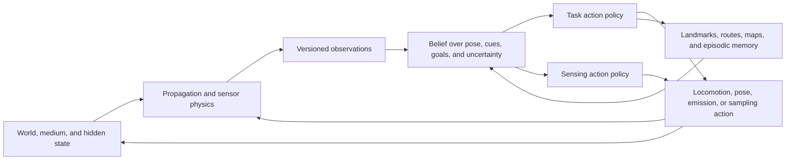

# Animal navigation and sensory ecology: primary-source audit

**Audit date:** 2026-08-05

**Scope:** path integration, landmarks and map-like behavior, optic flow,
active electrosensing, echolocation, olfactory-plume tracking,
magnetoreception, multisensory cue weighting, uncertainty, homing, route
memory, and energy-aware foraging and navigation.

**Purpose:** identify portable mechanisms not already represented in the
project while keeping four evidence layers separate: demonstrated behavior,
neural implementation, sensor physics, and engineered analogue.

**Status:** research audit. Temporary `C-NAV-` claims are local to this file.
Nothing here is project evidence until it passes normal ledger review.

**Primary deduplication targets:**
[P-001](../principle-registry.md#p-001--selective-allocation),
[P-002](../principle-registry.md#p-002--local-autonomy-with-exception-escalation),
[P-007](../principle-registry.md#p-007--prediction-error-allocation),
[P-010](../principle-registry.md#p-010--structural-offloading-and-co-design),
and [P-012](../principle-registry.md#p-012--memory-matched-to-information-lifetime);
[Candidate 002](../../experiments/candidates/002-multiscale-context-broadcast.md),
[Candidate 004](../../experiments/candidates/004-closed-endogenous-curriculum.md),
[Candidate 007](../../experiments/candidates/007-endogenous-observation-surveillance.md),
[Candidate 013](../../experiments/candidates/013-deficit-capability-routing.md),
and [Candidate 014](../../experiments/candidates/014-versioned-observation-contract.md);
plus the [sensorimotor-grounding chapter](../../concept/20-sensorimotor-grounding.md)
and the existing
[active-sensing note](../neuroscience-opportunity-map.md#6-active-sensing-perception-is-a-controlled-intervention).

## Executive finding

No new project principle survives this audit. Navigation biology supplies
excellent test cases and several sharp boundary conditions for existing
principles:

- path integration is a local, low-latency state update whose error accumulates
  without external correction: P-002 plus a standard state estimator;
- landmarks, views, route memories, and map-like behavior constrain or reset
  that estimate: P-007/P-012 plus loop closure, map matching, or memory-based
  control;
- optic flow, electric images, echoes, and odor encounters depend on
  self-motion, emission, propagation, geometry, and medium: P-010 plus the
  sensorimotor chapter's action-conditioned observation contract;
- changing where one looks, swims, calls, sniffs, or casts changes the future
  evidence: P-007 and Candidate 007, with Candidate 014 carrying sensor support
  and calibration;
- reliability-weighted fusion is a mature statistical null and does not imply
  a common biological fusion circuit; and
- route reuse and foraging efficiency demonstrate memory and constrained
  optimization, not proof that an animal explicitly solves shortest-path,
  travelling-salesperson, or joule-minimization problems.

The strongest retained residual is a **controlled-observability sensing
contract**. It separates a task controller from a sensing controller and asks
the latter to keep the observation process informative by changing sensor pose,
emission, sampling density, or locomotor microstructure. The contract is held
only as a more specific experiment for C-022/P-007 and Candidate 007. It is
rejected as distinct if ordinary active SLAM, dual control, model-predictive
control, or one-step expected value of sample information matches it at equal
action, sensor, compute, time, and energy cost.

Six tempting claims are rejected at the outset:

1. **Homing does not identify a map.** Successful return can arise from path
   integration, beaconing, landmark chains, route memory, gradients, compass
   cues, search, or combinations.
2. **A spatially tuned neuron is not a navigation algorithm.** Correlation with
   place, heading, or grid phase does not establish necessity, sufficiency, or
   the circuit computation used in behavior.
3. **Sensor physics is not cognition.** A directional sonar beam, conductive
   perturbation, optic-flow field, or odor filament can structure input without
   specifying how it is inferred or acted upon.
4. **Active sensing is not free information.** Emissions and motion consume
   energy and time, alter observability, may expose or disturb the agent, and
   can produce self-generated confounds.
5. **Near-optimal cue weighting is not universal Bayesian optimality.** It is a
   task- and model-scoped fit that can fail under cue dependence, causal
   ambiguity, non-Gaussian error, or changing calibration.
6. **Magnetic orientation does not identify a receptor.** Behavioral responses
   to manipulated fields, radio-frequency disruption, and magnetic sensitivity
   of an isolated molecule occupy different causal layers. None alone proves a
   complete in-vivo transduction chain.

## Evidence ladder and inference firewall

| Layer | Required observation | What it can support | What it cannot support alone |
|---|---|---|---|
| behavior | tracked choices or trajectories under a controlled cue manipulation | the manipulated cue affected the measured behavior in that preparation | receptor identity, neural code, subjective map, optimal objective, or transfer to another species |
| causal behavior | reversible deprivation, displacement, conflict, lesion, or closed-loop perturbation with controls | necessity or influence of the manipulated channel for that task and state | sufficiency of one channel in the wild or a complete neural mechanism |
| neural correlate | spikes, calcium, field potential, or anatomy covarying with navigation variables | candidate representation and testable circuit hypotheses | causal computation, behavioral necessity, or an engineering architecture |
| causal neural intervention | cell/pathway perturbation with behavioral and sensory controls | scoped contribution of the targeted circuit | identity of the full algorithm or universal species mechanism |
| sensor physics | measured or modeled propagation, transduction, noise, field, beam, flow, or plume | what information can reach receptors under declared conditions | which information the animal uses or how it represents it |
| engineered analogue | estimator, SLAM system, active sensor, search policy, or controller tested on a declared task | performance of that implementation and its cost frontier | biological identity or novelty from resemblance |

Evidence is not promoted upward by vocabulary. “Compass,” “map,” “attention,”
“uncertainty,” and “optimal” are operational labels unless their corresponding
variables and interventions were measured.

## Terms that must remain distinct

| Term | Operational meaning here | Do not collapse into |
|---|---|---|
| orientation | select or maintain a direction relative to a cue | localization, navigation, or homing |
| localization | estimate current state or position in a declared frame | knowing a goal or route |
| path integration | update displacement from self-motion signals over time | landmark navigation, a global map, or exact integration |
| homing | return to a home region from displacement | proof of a cognitive map or one sensory modality |
| landmark | environmental feature whose relation to action or location is learned or innate | global coordinates or object recognition |
| beaconing | move toward a directly detectable goal-associated cue | map-based navigation |
| route memory | stored sequence or policy tied to experienced transitions, views, or actions | survey-like metric map or shortest path |
| cognitive map | latent spatial representation supporting a specifically declared flexible inference | any spatial memory, place cell, shortcut, or successful detour |
| optic flow | angular image velocity generated by relative observer–scene motion | metric distance without geometry, speed, or calibration |
| active sensing | action or emission deliberately changes obtainable sensory evidence | all locomotion, all sensor readings, or generic exploration |
| electrolocation | inference from perturbations of a self-generated electric field | passive electroreception or field generation alone |
| echolocation | inference from echoes of self-generated acoustic signals | passive hearing or ultrasonic emission alone |
| plume tracking | source-directed movement using intermittent chemical encounters plus flow and other cues | continuous gradient ascent |
| magnetic compass | directional information derived from a magnetic field | magnetic map, receptor, radical-pair mechanism, or homing |
| magnetic map | positional information inferred from spatial magnetic variation | compass orientation or a molecular magnetic response |
| cue weighting | measured contribution of cues to an estimate or decision | conditional independence, causal binding, or fixed sensor trust |
| energy-aware behavior | behavior changes with a measured or manipulated energetic constraint or declared currency | direct minimization of joules |

## Navigation is a layered closed loop



The diagram separates three loops:

1. physics maps world and action to possible observations;
2. estimation combines path-dependent state, observations, and memory; and
3. task action and sensing action may share actuators but have different
   immediate objectives and costs.

Calling the entire loop “a cognitive map” prevents falsification. Each claim
below attaches to one arrow or state transition.

## Shared mathematical boundary

### Path integration is dead reckoning with accumulating uncertainty

For planar position estimate $\hat{\mathbf p}_k$ in metres, estimated heading
$\hat\psi_k$ in radians, body-frame velocity $\hat{\mathbf v}_k$ in metres per
second, and sampling interval $\Delta t_k$ in seconds,

$$
\hat{\mathbf p}_{k+1}
=\hat{\mathbf p}_k+
\mathbf R(\hat\psi_k)\hat{\mathbf v}_k\Delta t_k,
$$

where $\mathbf R$ is a dimensionless rotation matrix. In a one-dimensional
independent-error null with velocity-error variance $\sigma_{v,k}^{2}$ in
$\mathrm{m^2,s^{-2}}$,

$$
\operatorname{Var}(\hat p_N-p_N)
=\operatorname{Var}(\hat p_0-p_0)
+\sum_{k=0}^{N-1}\sigma_{v,k}^{2}\Delta t_k^2,
$$

in square metres. Correlated velocity, heading, timing, slip, and calibration
errors require the corresponding covariance terms; the simple equation is a
lower-complexity null, not a biological model.

[Müller and Wehner 1988](https://doi.org/10.1073/pnas.85.14.5287) used
outbound-route manipulations to expose systematic approximation errors in
desert-ant path integration. A later leg-length manipulation shifted the ants'
home-distance search, supporting a stride-related odometer in that preparation
([Wittlinger, Wehner, and Wolf 2006](https://doi.org/10.1126/science.1126912)).
Neither result identifies a universal animal integrator.

### Landmarks correct a belief; they do not erase the observation model

For latent pose $x_k$, action history $a_{0:k-1}$, and landmark observation
$z_k$ under sensor/version state $v_k$,

$$
p(x_k\mid z_{0:k},a_{0:k-1},v_{0:k})
\propto
p(z_k\mid x_k,v_k)
p(x_k\mid z_{0:k-1},a_{0:k-1},v_{0:k-1}).
$$

The first factor is a versioned observation model; the second is the
path-integrated prediction. A familiar view can narrow, reset, split, or
mislead the belief depending on aliasing and cue reliability. This is a
Bayesian-filter/SLAM null, not a claim that animals explicitly encode this
equation.

### Optic flow entangles self-motion and scene depth

For lateral translational velocity component $v_{\perp}$ in metres per second
and scene depth $Z$ in metres, the small-angle translational optic-flow
magnitude is approximately

$$
|\omega|\approx\frac{|v_{\perp}|}{Z},
$$

in radians per second. Rotational flow adds a depth-independent component, so
metric depth or travel distance cannot be recovered from flow without motion,
orientation, and scene assumptions. Integrated image motion

$$
\Theta=\int_{t_0}^{t_1}|\omega(t)|\,dt
$$

is in radians, not metres. Honeybee tunnel manipulations show that increased
image motion changes the reported odometric distance
([Srinivasan et al. 2000](https://doi.org/10.1126/science.287.5454.851)) and
the distance communicated to recruits
([Esch et al. 2001](https://doi.org/10.1038/35079072)). These results establish
environment-dependent visual odometry, not an absolute distance sensor.

### Echolocation range is conditional on propagation and association

For echo delay $\Delta t$ in seconds and sound speed $c$ in metres per second,

$$
r=\frac{c\Delta t}{2},
$$

where range $r$ is in metres and the factor two accounts for outbound and
return travel. Temperature, medium, multipath, target motion, call–echo
association, beam direction, bandwidth, and receiver thresholds all alter the
usable observation. The equation is a sensor-physics null; it is not a neural
mechanism.

### Active electrosensing is a boundary-value problem

In a quasi-static conductive medium,

$$
\nabla\!\cdot\!\left(\sigma(\mathbf r)\nabla\phi(\mathbf r,t)\right)
=-q(\mathbf r,t),
$$

where conductivity $\sigma$ is in siemens per metre (S/m), electric potential
$\phi$ is in volts (V), and source density $q$ is in amperes per cubic metre
($\mathrm{A/m^3}$). Objects alter conductivity and boundary conditions, thereby
changing transcutaneous potentials. Geometry and conductivity can be
non-identifiable from one electric image. Rasnow measured and modeled such
object-dependent perturbations in *Apteronotus*
([Rasnow 1996](https://doi.org/10.1007/BF00193977)); this establishes physical
structure in the signal, not the fish's full inference.

### An odor plume is intermittent transport, not a stable scalar hill

A minimal concentration model is

$$
\frac{\partial c}{\partial t}
+\mathbf u\!\cdot\!\nabla c
=D\nabla^2c+s-\lambda c,
$$

where concentration $c$ is in kilograms per cubic metre ($\mathrm{kg/m^3}$),
flow velocity $\mathbf u$ is in metres per second, diffusivity $D$ is in square
metres per second, source $s$ is in kilograms per cubic metre per second, and
loss rate $\lambda$ is in reciprocal seconds. Turbulence makes the animal's
sample sequence intermittent and action-dependent. Moth and fly experiments
show responses to encounter timing and plume structure, not access to a smooth
spatial gradient
([Mafra-Neto and Cardé 1994](https://doi.org/10.1038/369142a0);
[Demir et al. 2020](https://doi.org/10.7554/eLife.57524)).

### Reliability weighting is a null model, not a universal circuit

For conditionally independent, unbiased estimates $y_i$ of the same scalar in
degrees with Gaussian variances $\sigma_i^2$ in square degrees, the
minimum-variance linear estimate is

$$
\hat y=\sum_i w_i y_i,
\qquad
w_i=\frac{\sigma_i^{-2}}{\sum_j\sigma_j^{-2}},
\qquad
\operatorname{Var}(\hat y)=\left(\sum_i\sigma_i^{-2}\right)^{-1}.
$$

[Ernst and Banks 2002](https://doi.org/10.1038/415429a) found behavior close
to this prediction in a scoped visual–haptic height task. In a visual–vestibular
heading task, humans and macaques dynamically changed weights with reliability,
but some subjects overweighted vestibular evidence relative to the simple
model ([Fetsch et al. 2009](https://doi.org/10.1523/JNEUROSCI.2574-09.2009)).
Dependence, bias, cue conflict, common cause uncertainty, and heavy tails break
the inverse-variance result.

### Navigation efficiency is a vector before it is a scalar

For a route of duration $T$ seconds,

$$
E_{\mathrm{route}}
=\int_0^T P_{\mathrm{move}}(t)\,dt
+\sum_{j=1}^{N_s}E_{\mathrm{sense},j}
+E_{\mathrm{compute}},
$$

where power is in watts and every energy term is in joules. Report at least

$$
\mathbf m=
(P_{\mathrm{goal}},T,L,E_{\mathrm{route}},R,N_s,H,\Delta),
$$

where goal success $P_{\mathrm{goal}}$ is dimensionless, path length $L$ is in
metres, risk $R$ is a declared expected-loss unit, $N_s$ is a dimensionless
sample/emission count, uncertainty score $H$ is in bits or nats, and map or
calibration drift $\Delta$ is in its native unit. Do not hide these axes in one
“navigation efficiency” score.

For patch foraging, a classical rate currency is

$$
G=\frac{E_{\mathrm{gain}}-E_{\mathrm{cost}}}
{T_{\mathrm{travel}}+T_{\mathrm{search}}+T_{\mathrm{handle}}},
$$

in watts when energy is in joules and time in seconds. Charnov's marginal-value
model is an important optimization null
([Charnov 1976](https://doi.org/10.1016/0040-5809(76)90040-X)), not evidence
that every animal uses this currency or knows every patch distribution.

## Mechanism map and initial disposition

| ID | Scoped biological mechanism or observation | Evidence layer | Nearest AI/engineering null | Initial disposition |
|---|---|---|---|---|
| NAV-01 | integrate direction and travel into a home vector | manipulated behavior; some candidate circuit data | inertial/visual odometry, Kalman or particle filtering | established family; no new principle |
| NAV-02 | correct accumulated position error with learned landmarks or views | behavior and neural correlates | localization, loop closure, scan/image matching | established family; P-007/P-012 |
| NAV-03 | store experienced view/action sequences or repeated routes | tracked behavior | topological maps, route policies, episodic control | P-012; not a metric-map claim |
| NAV-04 | use optic flow for speed regulation, odometry, depth, and landing | causal cue manipulation | optical flow, visual odometry, time-to-contact control | P-010 sensor physics |
| NAV-05 | move relative to a self-generated electric field to shape electric images | physics plus closed-loop behavior | active impedance imaging, observability control | C-022/P-007; held test case |
| NAV-06 | aim and schedule acoustic emissions to acquire echoes | causal deprivation plus field/lab behavior | active sonar, beam steering, waveform scheduling | C-022/P-007; mature analogue |
| NAV-07 | alternate upwind surge, crosswind casting, stopping, or stochastic turns based on odor encounters | controlled plume behavior | infotaxis, POMDP search, flow-aware control | P-007/Candidate 007 |
| NAV-08 | orient or derive positional cues from magnetic-field manipulation | behavioral manipulation | magnetometer-aided navigation | established behavior in scoped taxa; mechanism unresolved |
| NAV-09 | reweight visual, vestibular, tactile, chemical, and other cues with reliability/context | psychophysics/behavior | Bayesian and robust sensor fusion | mature null; Candidate 014 |
| NAV-10 | switch among path integration, landmarks, routes, and search | behavior; algorithm often underdetermined | interacting multiple-model filters and hierarchical planners | composition, not new invariant |
| NAV-11 | refine repeated foraging routes and retain useful transitions | individual tracking | TSP heuristics, graph search, model-free/model-based RL | P-012/Candidate 004 |
| NAV-12 | trade reward, time, risk, sensing, and locomotor expenditure | behavior only when currencies manipulated/measured | constrained MDP/POMDP, optimal foraging, orienteering | P-001/P-007/Candidate 013 |
| NAV-13 | regulate sensor motion or emission to keep observations informative while pursuing a task | strongest in closed-loop electric-fish experiment | active SLAM, dual control, observability MPC | hold as controlled-observability experiment |

## 1. Path integration: continuity with drift

### Demonstrated behavior

Desert ants return along a direct homeward course after tortuous outbound
travel and show systematic errors under controlled route geometries
([Müller and Wehner 1988](https://doi.org/10.1073/pnas.85.14.5287)). Changing
leg length after the outbound journey displaced the return-distance search in
the predicted direction
([Wittlinger, Wehner, and Wolf 2006](https://doi.org/10.1126/science.1126912)).
These are strong behavioral interventions on distance integration. They do not
show that stride count is the only odometric input, that the internal update is
exact vector addition, or that the same mechanism operates in flight and
vertebrate navigation.

Path integration is useful because it provides an immediately available local
estimate without waiting for recognition of an external reference. Its
defining liability is cumulative error. Systematic bias, heading drift,
locomotor slip, flow-dependent visual scaling, and timing errors persist until
an external cue or known boundary corrects them.

### Neural mechanism boundary

[Stone et al. 2017](https://doi.org/10.1016/j.cub.2017.08.052) combined
intracellular recordings, anatomy, electron microscopy, and an anatomically
constrained bee central-complex model. The work identifies convergence of
compass and optic-flow speed signals and proposes a vector-memory circuit. It
does not causally establish that the entire proposed circuit is necessary and
sufficient for free-flight homing.

In mammals, grid-like spatial firing persists under some conditions without
visible landmarks
([Hafting et al. 2005](https://doi.org/10.1038/nature03721)), but the same study
also found landmark anchoring. Grid activity is evidence for a spatial neural
code, not proof that grid cells alone compute path integration or that a grid
code is required for every route task.

### AI translation and strongest null

The translation is a local state estimator with explicit covariance, clock,
motion-source version, and reset events. It belongs to P-002 for local update,
P-007 for correction from residual evidence, and Candidate 014 for observation
support. The strongest null is a tuned extended/unscented Kalman filter,
particle filter, factor graph, or learned odometry model using the same
measurements and compute.

Every claimed advantage must survive:

- correlated rather than independent drift;
- scale-factor and heading bias;
- slip and unmodeled current or wind;
- irregular sample intervals and delayed measurements;
- kidnapped-agent/global-relocation tests;
- aliased landmarks and false loop closure; and
- return paths outside the training geometry.

**Prediction NAV-P1.** A path-integrator arm should have lower short-horizon
latency than global relocalization but error should grow with cue-denied path
length or duration. If error does not grow, inspect hidden landmarks, simulator
state, or future leakage before claiming a superior integrator.

## 2. Landmarks, map-like use, route memory, and homing

### Demonstrated behavior is algorithmically underdetermined

Hippocampal place-related firing was reported in freely moving rats by
[O'Keefe and Dostrovsky 1971](https://doi.org/10.1016/0006-8993(71)90358-1).
Hippocampal lesions caused a lasting impairment in hidden-goal place navigation
while permitting controls that separated motor, motivation, and reinforcement
components in the water-maze preparation
([Morris et al. 1982](https://doi.org/10.1038/297681a0)). These results support
a causal role for the hippocampus in that spatial task; they do not identify
one data structure called “the cognitive map.”

When self-motion and environmental cues were put in mismatch on a linear
track, rat hippocampal ensemble activity showed a dynamic correction process
([Gothard, Skaggs, and McNaughton 1996](https://doi.org/10.1523/JNEUROSCI.16-24-08027.1996)).
This is direct evidence that idiothetic prediction and landmark information can
interact, but not that their weights follow one fixed Bayesian rule.

Displaced honeybees in a familiar area performed searches and then flew toward
either hive or feeder in harmonic-radar tracks
([Menzel et al. 2005](https://doi.org/10.1073/pnas.0408550102)). The authors
argued that arbitrary release positions and goal choice support map-like
memory. That scoped interpretation is stronger than beaconing, yet alternative
combinations of learned landscape relations, vectors, and route fragments must
still be tested before equating the result with a survey map.

Repeated GPS tracks of experienced homing pigeons became individually
stereotyped, supporting familiar visual pilotage and route loyalty
([Biro, Meade, and Guilford 2004](https://doi.org/10.1073/pnas.0406984101)).
Route stereotypy shows reusable memory; by itself it does not show a metric map,
shortest path, or optimality.

### Three memory products

Keep at least three products distinct:

1. **place/view association:** current sensory pattern predicts proximity or a
   local action;
2. **route memory:** ordered views, turns, local vectors, or transitions guide a
   familiar path; and
3. **relational/map-like state:** supports a declared novel relation such as
   shortcut, detour, goal switch, or localization after displacement.

All three can coexist. A system should earn the third label only on held-out
relational tests that the first two cannot solve.

### Engineering nulls and failure modes

The mature nulls are visual place recognition, topological localization,
metric or semantic SLAM, graph search, route-conditioned policies, episodic
retrieval, and multi-hypothesis filtering. A learned “cognitive map” must beat
these on the same sensor stream and memory bytes, not merely display spatially
tuned units.

Failure modes include perceptual aliasing, seasonal/lighting change, moved
landmarks, route blockage, representation reset across contexts, map–odometry
frame mismatch, overlearned route capture, and a novel release outside the
familiar region.

**Prediction NAV-P2.** A route-only system should excel on repeated familiar
paths but fail more sharply than a relational-map system on novel shortcuts and
detours. If both systems receive a complete graph or privileged pose, the test
does not discriminate the memory type.

## 3. Optic flow: useful structure with scale ambiguity

### Sensor physics and behavior

Optic flow is generated jointly by scene geometry, translation, rotation, and
gaze. Translational flow contains depth-dependent information; rotational flow
does not. Animals can simplify the inference by stabilizing gaze, separating
fast turns from translational intervals, maintaining altitude, or controlling
speed. Those behaviors are P-010 structural/sensorimotor offloading: they alter
the measurement geometry before neural inference.

In controlled honeybee tunnels, wall texture and proximity altered accumulated
image motion and the bees' odometric report
([Srinivasan et al. 2000](https://doi.org/10.1126/science.287.5454.851)).
Recruits interpreted dances produced after tunnel flight as exaggerated travel
distance outside the tunnel
([Esch et al. 2001](https://doi.org/10.1038/35079072)). The result is especially
important because it exposes a calibration boundary: the biological odometer
can be useful while being systematically wrong in metres under altered scene
geometry.

### AI translation and strongest null

Use optic flow as a low-latency motion observable with explicit scale,
rotation, depth, field-of-view, exposure, and texture uncertainty. Compare with
classical optical flow
([Horn and Schunck 1981](https://doi.org/10.1016/0004-3702(81)90024-2)),
visual–inertial odometry, event-camera flow, time-to-contact control, and direct
image alignment. “Insect-inspired” does not count as a mechanism advantage.

**Prediction NAV-P3.** A flow-regulating policy may reduce collision and
control latency at low compute, but its metric odometry should shift when scene
depth statistics change unless another cue calibrates scale. A method whose
reported distance remains perfect under tunnel-width changes probably uses
hidden metric information.

## 4. Active electrosensing: emission, body motion, and electric image

### Sensor physics

Weakly electric fish generate an electric organ discharge and measure
object-dependent perturbations across a distributed receptor surface. The
resulting image depends on fish shape, object geometry, relative pose,
conductivity, water conductivity, discharge waveform, and receptor transfer.
[Rasnow 1996](https://doi.org/10.1007/BF00193977) measured and modeled the
electric images of simple objects; it supplies a forward-model null, not a
perceptual theory.

### Demonstrated behavior

Three-dimensional tracking of *Apteronotus* prey capture in darkness showed
body positioning that brought prey into informative regions of the receptor
surface, and water conductivity altered aspects of prey-capture behavior
([MacIver, Sharabash, and Nelson 2001](https://doi.org/10.1242/jeb.204.3.543)).
In a spatial-learning task, pulse-type electric fish increased discharge
sampling density and scanning behavior initially at landmarks and food, then
concentrated some sensing at the food location after learning
([Jun, Longtin, and Maler 2016](https://doi.org/10.1152/jn.00979.2015)). These
are behavioral signatures of task- and memory-dependent sampling, not direct
measurements of expected information gain.

The strongest causal control result in this audit comes from a real-time
closed-loop refuge manipulation. Changing reafferent gain by a factor of four
caused *Eigenmannia* to up- or downregulate ancillary fore–aft movements so
that sensory slip remained comparatively stable
([Biswas et al. 2018](https://doi.org/10.1016/j.cub.2018.11.002)). The authors
separated an active-sensing movement loop from refuge-tracking behavior. This
supports controlled observability in one preparation; it does not prove a
general uncertainty-minimization objective.

### AI translation and kill condition

The portable translation is not “add an electric sense.” It is: when a
change-sensitive observation channel loses informative variation, choose a
small sensing action that restores observability without compromising the task.
That is already C-022/P-007, Candidate 007, and standard active sensing.

Reject distinctiveness if a dither/probe signal, active-SLAM viewpoint policy,
dual controller, or observability-aware MPC matches task success, estimation
error, risk, and joules. Also reject if the movement only prevents receptor
adaptation but provides no downstream task benefit, or if it is counted as
free locomotion.

## 5. Echolocation: acoustic gaze under a finite echo budget

### Causal behavioral foundation

Blindfolded bats retained obstacle avoidance in the classic deprivation
experiments, whereas gagging or plugging the ears substantially impaired it
([Griffin and Galambos 1941](https://doi.org/10.1002/jez.1400860310)). The
experiment supports emitted ultrasound and hearing as causal components of the
tested behavior. It does not imply that vision is irrelevant to all bats or
that every echolocation computation was identified.

### Sensor physics and active control

Echolocation is a two-way propagation channel. Range resolution depends on
bandwidth and signal processing; maximum useful range depends on source level,
beam direction, spreading, absorption, target strength, noise, and receiver
threshold. Call interval also limits which outgoing call can be associated with
which returning echo. These are ordinary sonar constraints.

Field microphone arrays showed that *Myotis daubentonii* calls were
directional, with frequency-dependent beam width and differences between field
and laboratory emissions
([Surlykke, Pedersen, and Jakobsen 2009](https://doi.org/10.1098/rspb.2008.1505)).
The result establishes an acoustic field of view shaped by emission and
frequency. It does not show what internal object representation the bat builds.

Free-swimming porpoises alternated acoustic gaze between targets, changed click
rate, and entered a high-rate terminal phase during active target selection
([Wisniewska et al. 2012](https://doi.org/10.1242/jeb.074013)). This is a strong
behavioral analogue of gaze allocation, but attention is inferred from
emission aim and task behavior rather than read out as a unique neural state.

### AI translation and failure modes

The closest translation is adaptive waveform, beam, and dwell scheduling in
active sonar/radar, with a planner that values task-relevant posterior change.
It is P-001/P-007 plus P-010 transducer geometry and Candidate 014's response
contract.

Test clutter, multipath, masking, multiple simultaneous emitters, Doppler,
moving targets, incorrect sound speed, echo–call ambiguity, eavesdropping,
emission detectability, and the energy of call production and reception. A
policy that sends more or louder pulses has purchased more information, not
discovered a free biological efficiency.

**Prediction NAV-P4.** Adaptive acoustic gaze should concentrate emissions on
ambiguous task-relevant targets and reduce irrelevant ensonification, but it
must lose or tie when a fixed scan already covers the scene within the same
energy, revisit, and latency budget.

## 6. Olfactory-plume tracking: event timing plus flow

### Demonstrated behavior

Male moths use odor-gated anemotaxis: odor contact promotes upwind flight,
whereas loss shifts the flight angle toward crosswind with reversals
([Kennedy and Marsh 1974](https://doi.org/10.1126/science.184.4140.999)).
Controlled single-strand experiments showed that individual pheromone contacts
can elicit stereotyped surge components that concatenate during source
approach
([Vickers and Baker 1994](https://doi.org/10.1073/pnas.91.13.5756)). Changing
pulse frequency and plume continuity changed almond-moth track straightness
and source-location success
([Mafra-Neto and Cardé 1994](https://doi.org/10.1038/369142a0)).

In a wind tunnel where odor packets and freely walking flies were imaged
simultaneously, *Drosophila* in irregular plumes used stochastic walks/stops and
turns biased by encounter timing, whereas behavior was more continuously
modulated in more regular environments
([Demir et al. 2020](https://doi.org/10.7554/eLife.57524)). This is evidence
against treating every plume as a smooth gradient and against one universal
surge–cast controller.

### Information boundary

One concentration sample rarely identifies the source direction. Wind or water
flow can provide a direction frame, while encounter onset, intermittency,
duration, and recent absence constrain source likelihood. Self-motion changes
both where and when packets are encountered. The observation model therefore
requires:

- chemical identity and sensor response/recovery;
- concentration or threshold crossing in native units;
- air/water velocity and its uncertainty;
- sample pose, capture time, and latency;
- plume regime and boundary geometry;
- adaptation, saturation, and contamination state; and
- action history that selected the sample path.

### Strongest nulls and AI translation

Use reactive surge–cast, chemotaxis/anemotaxis, Bayesian source localization,
particle filtering, POMDP search, and infotaxis as nulls. Infotaxis explicitly
chooses movement to maximize expected entropy reduction when local gradients
are unreliable
([Vergassola et al. 2007](https://doi.org/10.1038/nature05464)); an
“odor-inspired uncertainty search” must beat it rather than rename it.

The portable abstraction is a sparse event-history policy with flow-relative
actions and calibrated search expansion after evidence loss. It belongs to
P-007 and Candidate 007; route/resource dispatch after localization belongs to
Candidate 013.

**Prediction NAV-P5.** Event-timing policies should outperform continuous
gradient ascent in intermittent turbulent plumes, but no single fixed
surge–cast parameterization should dominate across laminar, intermittent,
multi-source, and shifting-wind regimes.

## 7. Magnetoreception: behavior ahead of receptor identification

### What behavioral experiments establish

European robins changed migratory orientation with magnetic-field inclination
in controlled cages
([Wiltschko and Wiltschko 1972](https://doi.org/10.1126/science.176.4030.62)).
This supports an inclination compass in the tested birds and conditions. It
does not identify a molecule, cell, nerve, or full navigation map.

Oscillating radio-frequency fields disrupted robin magnetic orientation in an
angle-dependent way
([Ritz et al. 2004](https://doi.org/10.1038/nature02534)). The result is
consistent with a radical-pair mechanism, but “consistent with” is not a direct
measurement of the in-vivo receptor or causal molecular species.

Bonnethead sharks exposed to magnetic fields corresponding to displaced
locations changed orientation in one of the displacement conditions
([Keller et al. 2021](https://doi.org/10.1016/j.cub.2021.03.103)). This supports
map-like use of magnetic cues in that species and protocol. It does not show
that a shark carries a global magnetic chart or identify transduction.

### Molecular and anatomical boundaries

Purified European-robin cryptochrome 4 showed light-driven magnetic
sensitivity in vitro
([Xu et al. 2021](https://doi.org/10.1038/s41586-021-03618-9)). This makes it a
candidate molecule; it does not establish expression geometry, neuronal
coupling, behavioral necessity, or sufficiency in vivo.

A previously influential anatomical claim illustrates why the evidence ladder
matters. Iron-rich cells in the pigeon upper beak were identified as
macrophages rather than magnetosensitive neurons
([Treiber et al. 2012](https://doi.org/10.1038/nature11046)). Anatomical iron,
field-correlated movement, and molecular magnetic sensitivity must never be
spliced into a receptor story without the missing causal links.

### Extraordinary-claim gate

Reject any magnetoreception-derived architecture claim unless it states which
of the following has actually been demonstrated:

1. a reproducible behavioral response to a calibrated magnetic manipulation;
2. exclusion or measurement of nonmagnetic cues, coil artifacts, vibration,
   heat, light, electric induction, experimenter effects, and site effects;
3. receptor candidate with native localization and adequate sensitivity;
4. transduction into a recorded neural signal;
5. pathway perturbation that changes magnetic behavior while preserving
   relevant control behavior; and
6. recovery, rescue, or convergent intervention consistent with the same chain.

Until then, the engineering translation is simply magnetometer-aided
orientation/localization with a versioned calibration and disturbance model.
Modern silicon already measures magnetic fields directly; a speculative
quantum-biological transducer has no default efficiency advantage.

**Prediction NAV-P6.** A multimodal navigator should downweight or reject a
magnetic cue under calibrated local interference. A method that treats
magnetic orientation as ground truth without anomaly detection should fail
under infrastructure, vehicle, or payload magnetic distortion.

## 8. Multisensory cue weighting, conflict, and uncertainty

### Behavior and mathematical null

The inverse-variance equations above predict one special case: unbiased,
independent Gaussian cues measuring the same latent variable. The visual–haptic
experiment of [Ernst and Banks 2002](https://doi.org/10.1038/415429a) closely
matched this model in its task. The visual–vestibular study of
[Fetsch et al. 2009](https://doi.org/10.1523/JNEUROSCI.2574-09.2009) showed
rapid reliability-sensitive reweighting but also systematic departures for
some subjects. Biology therefore motivates dynamic calibration, not the slogan
“the brain is Bayes-optimal.”

### Cue combination is preceded by causal and frame questions

Before fusing two observations, ask:

- do they concern the same latent object, location, time, and coordinate frame?
- are their errors conditionally independent?
- did one sensing action cause both observations?
- does one sensor saturate, adapt, lag, or select the sample?
- are conflicts evidence of noise, recalibration, different causes, or model
  failure?
- is the loss symmetric, or should the system abstain on a safety-critical
  disagreement?

These are Candidate 014 observation-contract questions. Cue weights must carry
calibration version, support, latency, and dependence rather than becoming
free-floating “trust scores.”

### Navigation-mode arbitration

Path integration, landmarks, route memory, optic flow, smell, sound, and
magnetic cues often differ in range, latency, drift, and availability. A useful
system may maintain multiple hypotheses or navigation modes rather than fuse
everything into one state. The strongest nulls are robust filters,
interacting-multiple-model estimators, mixture filters, factor graphs, and
POMDPs with explicit observation modes.

**Prediction NAV-P7.** Reliability-aware fusion should improve calibrated
error when cues are conditionally compatible. Under causal mismatch or strong
dependence, a hypothesis-preserving or abstaining system should outperform
naive inverse-variance fusion.

## 9. Homing, route refinement, and energy-aware foraging

### Route memory and iterative improvement

Harmonic radar and flower cameras showed individual bumblebees developing
repeatable multi-destination routes over repeated bouts
([Lihoreau et al. 2012](https://doi.org/10.1371/journal.pbio.1001392)). Route
length and transition use changed with experience, supporting memory-guided
iterative refinement. It does not establish that bees enumerate permutations,
solve travelling-salesperson instances, or minimize energy directly.

Pigeon route loyalty and bumblebee traplines illustrate two properties useful
for AI:

- reuse of validated transitions can reduce repeated search; and
- retaining some transitions while varying others creates local improvement.

Both are already P-012 memory and Candidate 004's generate–test–retain loop.
The strongest null is ordinary graph search, route caching, stochastic local
search, model-based planning, or reinforcement learning with matched episodes
and memory.

### Energy evidence boundary

Distance, duration, wingbeat, call count, or sample count are proxies until
converted through a measured power or energy model. Likewise, net energetic
rate is only one possible fitness currency. Predation risk, information,
nutrient composition, offspring provisioning, thermal state, and future patch
availability can rationally change a route.

The marginal-value theorem
([Charnov 1976](https://doi.org/10.1016/0040-5809(76)90040-X)) supplies a mature
rate-maximization null under explicit patch assumptions. Shortest path
([Dijkstra 1959](https://doi.org/10.1007/BF01386390)), orienteering,
travelling-salesperson heuristics, resource-constrained shortest path, and
constrained MDP/POMDP planning cover other objectives.

### AI translation

Use a navigation ledger that keeps raw reward, time, risk, energy, samples,
compute, memory, and uncertainty separate. Candidate 013 owns any claim that
local opportunity plus global deficit improves resource routing. Candidate 004
owns route-proposal, evaluation, and retained-transition claims. P-001 owns
selective spending of sensing and locomotor budget.

**Prediction NAV-P8.** A memory-guided route policy should reduce search and
travel on stable tasks but become suboptimal after resource relocation unless
it preserves exploration and invalidates stale transitions. Energy benefit
must remain after actual sensor, actuator, compute, and failed-search joules are
charged.

## 10. Held residual: controlled-observability sensing contract

### Contract

For task state $x_t$, observation $y_t$, task action $a_t$, sensing action
$u_t$, and versioned observation model $h_v$,

$$
x_{t+1}=f(x_t,a_t,u_t,w_t),
$$

$$
y_t=h_v(x_t,a_{0:t-1},u_{0:t},\eta_t)+\epsilon_t,
$$

where $w_t$ is process disturbance, $\eta_t$ is propagation/environment state,
and $y_t$, $h_v$, and $\epsilon_t$ share the sensor's native unit. Sensing
action may be sensor pose in metres/radians, emission power in watts, waveform
or frequency in hertz, sampling rate in samples per second, or a discrete
sensor request. Task and sensing actions may share an actuator, but their
declared effects remain separate.

The sensing controller receives the task-relevant belief and may choose $u_t$
to preserve or improve a declared observability statistic, expected posterior
change, or decision value. It must not directly consume oracle state. One
possible evaluation quantity is

$$
\rho_u=
\frac{\mathbb E[H(b_t)-H(b_{t+1})\mid u_t]}
{E_{\mathrm{sense}}(u_t)},
$$

in bits per joule when entropy $H$ is in bits and sensing energy is in joules.
This ratio is diagnostic only: entropy reduction can be task-irrelevant or
unsafe, so task utility, calibration, and risk remain separate axes.

Each sensing decision records:

- latent quantity and task decision it is intended to inform;
- observation-model, calibration, clock, and coordinate-frame version;
- predicted response/support and identifiable directions;
- sensing action, realized action, onset, duration, and energy;
- effect on the world and on later observations;
- expected versus realized posterior or decision change;
- collision, disturbance, detectability, and opportunity cost;
- fallback if the action reduces observability; and
- expiry or condition under which the sensing policy is invalid.

### Why held rather than promoted

The contract composes existing work:

- the sensorimotor chapter already separates commanded and realized actions,
  capture and receipt time, response version, active acquisition, and energy;
- C-022 already establishes action-dependent sensor mechanics;
- P-007 already allocates sensing to unresolved uncertainty;
- Candidate 007 already models action-dependent hidden and observation state;
- Candidate 014 already carries observation support and versioning; and
- active SLAM, dual control, and observability-aware control are mature nulls.

The electric-fish result makes the composition worth an isolated test, not a
new principle. Promote nothing unless the separation of sensing and task
controllers yields a reproducible quality–risk–energy frontier unavailable to
the complete conventional stack.

## Deduplication against existing principles

| Existing principle | Navigation/sensory manifestations | Residual after deduplication | Disposition |
|---|---|---|---|
| [P-001 — selective allocation](../principle-registry.md#p-001--selective-allocation) | gaze, sonar beam/dwell, electric discharge density, odor search, cue-specific compute, route exploration | allocation must include physical sample/action cost and coverage; no new invariant | established implementation |
| [P-002 — local autonomy with exception escalation](../principle-registry.md#p-002--local-autonomy-with-exception-escalation) | local path integration, reflexive steering, low-latency flow or echo avoidance, escalation on lost localization | uncertainty/exception threshold and stale local frame must be explicit | ordinary estimator/control hierarchy |
| [P-007 — prediction-error allocation](../principle-registry.md#p-007--prediction-error-allocation) | active view, emission, scanning, casting, cue conflict, landmark correction | controlled-observability test is a narrow implementation | primary owner |
| [P-010 — structural offloading and co-design](../principle-registry.md#p-010--structural-offloading-and-co-design) | eye/head/body geometry, gaze stabilization, electric receptor surface, sonar aperture, odor-flow-relative locomotion | sensor physics and morphology can simplify inference but require lifecycle accounting | established co-design examples |
| [P-012 — memory matched to information lifetime](../principle-registry.md#p-012--memory-matched-to-information-lifetime) | transient home vector, persistent landmark/view memory, route cache, map, calibration, seasonal cue validity | retain separate lifetimes and invalidate stale routes/maps | established memory hierarchy |

The audit also touches P-013 when animals leave external cues or systems share
maps, but no new environmental-memory mechanism is established here.

## Deduplication against held candidates and concept chapters

| Existing owner | Navigation overlap | Strong null / kill boundary | Verdict |
|---|---|---|---|
| [Candidate 002 — multiscale context broadcast](../../experiments/candidates/002-multiscale-context-broadcast.md) | a compact state such as “odor present,” “home vector uncertain,” or “landmark conflict” changes local sensor/motor responses | FiLM, recurrent gate, supervisory mode, or explicit finite-state controller at equal messages | biological mode labels add no residual |
| [Candidate 004 — closed endogenous curriculum](../../experiments/candidates/004-closed-endogenous-curriculum.md) | route variation, retained transitions, learning flights, exploration after resource change | stochastic local search, graph planning, RL, evolutionary search, active learning at equal trials | owns generate–test–retain claim |
| [Candidate 007 — intervention-aware surveillance](../../experiments/candidates/007-endogenous-observation-surveillance.md) | sensing action changes observation stream; movement/emission can hide, reveal, disturb, or select evidence | delay-aware POMDP/dual control with explicit observation model | primary owner of endogenous observation |
| [Candidate 013 — deficit–capability routing](../../experiments/candidates/013-deficit-capability-routing.md) | move agent or sensing resource toward unresolved, rewarding, or reachable location | centralized planner, backpressure, primal–dual allocation, learned routing | owns any bidirectional resource-routing residual |
| [Candidate 014 — versioned observation contract](../../experiments/candidates/014-versioned-observation-contract.md) | cue support, calibration, coordinate frame, propagation, selection, association, uncertainty, data vintage | typed sensor schema plus correct likelihood, lineage, predictive checks, and value-of-information scheduling | primary owner of evidence qualification |
| [Sensorimotor grounding](../../concept/20-sensorimotor-grounding.md) | asynchronous trajectory, realized action, self-generated sensing, active acquisition, energy and intervention tests | passive multimodal, world model, system identification, EVSI, oracle-state ceiling | already contains the general architecture |
| [Active-sensing note](../neuroscience-opportunity-map.md#6-active-sensing-perception-is-a-controlled-intervention) | choose view, modality, manipulation, tool, or question to reduce uncertainty | fixed acquisition, random, entropy seeking, one-step EVSI | controlled-observability is one stricter test case |

## Strongest mature null suite

Every proposed navigation mechanism must include the applicable complete null,
not a weakened single baseline:

| Problem | Mature nulls | Required parity |
|---|---|---|
| dead reckoning | calibrated kinematic model, Kalman/extended/unscented filter, particle filter, learned odometry | sensors, clocks, calibration, compute, reset cues |
| landmark localization | image/scan matching, topological localization, factor-graph SLAM, robust loop closure | map bytes, pose labels, false closures, relocalization time |
| visual navigation | Horn–Schunck or modern optical flow, direct visual odometry, visual–inertial fusion, time-to-contact control | pixels/events, field of view, exposure, IMU, latency, watts |
| route memory | cached route, graph policy, episodic control, Dijkstra/A*, stochastic local search, TSP heuristic | demonstrations, graph access, memory, replanning calls |
| active view/emission | one-step EVSI, entropy search, active SLAM, dual control, observability MPC, fixed raster | action count, energy, motion risk, sensor dwell, compute |
| sonar/electric imaging | calibrated forward model, matched filter/inverse solver, adaptive beam/waveform scheduler | source power, bandwidth, aperture, noise, medium model |
| plume source search | surge–cast controller, gradient/flow control, Bayesian filter, infotaxis, POMDP | odor and wind samples, plume realizations, motion energy |
| magnetic assistance | calibrated magnetometer plus anomaly detection and other-cue fusion | field map, calibration opportunities, local interference |
| multisensory fusion | inverse-variance, robust M-estimation, covariance intersection, mixture filter, causal-inference model | dependence, calibration, latency, common cause, abstention |
| foraging/navigation economy | marginal-value, shortest path, orienteering, constrained MDP/POMDP, model-based RL | reward, risk, energy, time, samples, environmental trials |

[Kalman 1960](https://doi.org/10.1115/1.3662552) is the minimum linear
state-estimation reference, [Horn and Schunck 1981](https://doi.org/10.1016/0004-3702(81)90024-2)
the classical optical-flow reference, [Dijkstra 1959](https://doi.org/10.1007/BF01386390)
the shortest-path reference, and
[Vergassola et al. 2007](https://doi.org/10.1038/nature05464) the
information-seeking odor-search reference. Contemporary stronger variants are
required where their assumptions apply.

## Equal-budget falsification program

### Common accounting contract

Use identical environment seeds and latent trajectories where logically
possible. Match or report:

- training episodes, labels, simulator calls, and map-building traversals;
- online sensor exposures, fields of view, bandwidth, sample rate, and dynamic
  range;
- physical actions, path length, speed/acceleration envelope, and collisions;
- emission count, spectrum, source level/power, dwell, and duty cycle;
- compute operations, accelerator and sensor power, memory bytes, network
  bytes, wall time, and total joules;
- privileged pose, landmark identity, wind/flow, medium parameters, and future
  information;
- calibration opportunities, reset markers, intervention labels, and data
  vintage;
- failure/retry/search cost and degraded fallback; and
- task utility, calibrated uncertainty, risk, subgroup/environment stratum, and
  lifecycle maintenance separately.

An oracle-state arm may bound partial observability but is ineligible to win.
No method receives final corrected maps, future frames, or post-hoc route
labels at the time of an online decision.

### Experiment A: path integration and landmark correction

**Question.** Does a biologically derived vector-memory update beat mature
filtering once drift and loop closure are explicit?

**Arms.** Pure dead reckoning; EKF/UKF; particle/factor-graph localization;
learned recurrent odometry; candidate vector memory; oracle pose.

**Sweep.** Path length, heading noise, scale drift, slip/current, irregular
time steps, landmark density, aliasing, moved landmarks, kidnapped-agent
relocation, and novel geometry.

**Measures.** Pose RMSE in metres/degrees, covariance coverage, false loop
closures, relocalization seconds, home success, compute, bytes, and joules.

**Falsification.** Reject distinctiveness if a conventional estimator ties the
quality–latency–energy frontier or if gain depends on hidden pose/landmark IDs.

### Experiment B: route memory versus relational map

**Question.** Does the representation support relations unavailable to route
replay and local view policies?

**Arms.** Behavioral cloning, view-action route memory, topological map plus
A*, metric SLAM plus planner, learned map, memoryless recurrent policy.

**Sweep.** Familiar routes, reversed traversal, blocked segments, novel
shortcut, detour, goal switch, start displacement, landmark rearrangement, and
outside-familiar-area release.

**Measures.** Success, excess path metres, replanning latency, map bytes,
calibration, novel-shortcut rate, unsafe entry, and energy.

**Falsification.** Spatially tuned hidden units or familiar-route success do not
qualify. The map claim must beat view/route and graph nulls on held-out
relations.

### Experiment C: optic-flow control under geometry shift

**Question.** Does controlled motion simplify sensing beyond standard visual
odometry and control?

**Arms.** Fixed-speed policy; classical/modern optical flow; visual–inertial
odometry; learned end-to-end policy; flow-regulating candidate.

**Sweep.** Tunnel width, altitude, texture spatial frequency, contrast,
lighting, rotation, moving objects, event/frame sensor, and scale calibration.

**Measures.** collision rate, speed error in m/s, distance error in metres,
time-to-contact error in seconds, latency, pixels/events, compute, and joules.

**Falsification.** Reject if apparent robustness comes from privileged depth or
if geometry-induced metric bias is hidden by task scoring.

### Experiment D: controlled observability in active electrosensing

**Question.** Does a separate sensing controller preserve information and task
performance better than ordinary probing and dual control?

**Arms.** no ancillary motion; fixed dither; random dither; one-step EVSI;
observability MPC/dual control; two-loop controlled-observability candidate.

**Sweep.** object/refuge motion, water conductivity, receptor adaptation,
sensor noise, reafferent gain, task/sensing actuator conflict, and energy cap.

**Measures.** tracking RMSE in metres, object-state error, posterior coverage,
sensory-slip spectrum, sensing/task motion metres, collision, latency, and
joules.

**Falsification.** The candidate must beat the full dual-control/null frontier,
not merely reproduce fish motion. If fixed small dither matches it, merge into
ordinary excitation design.

### Experiment E: acoustic gaze and adaptive emissions

**Question.** Does adaptive beam/dwell scheduling buy decision-relevant
evidence rather than simply more acoustic exposure?

**Arms.** fixed raster, fixed-rate broad beam, uncertainty-only beam, one-step
EVSI, active sonar POMDP, biology-derived acoustic gaze.

**Sweep.** target count/separation, clutter, multipath, masking, moving targets,
sound-speed error, emitter interference, and emission-detection penalty.

**Measures.** localization/classification error, calibrated confidence, missed
targets, false associations, decision latency, emitted acoustic joules, duty
cycle, compute, and total energy.

**Falsification.** Match spectrum, source level, aperture, revisit, and receiver
bandwidth. A louder or higher-rate method has not won adaptively.

### Experiment F: plume tracking across regimes

**Question.** Which event-history and active-search mechanism generalizes
across plume physics?

**Arms.** gradient ascent; reactive surge–cast; Bayesian particle filter;
infotaxis; POMDP; learned event-history controller.

**Sweep.** laminar/turbulent/intermittent plume, wind shift, boundaries,
multi-source mixtures, distractor odor, sensor adaptation, missing wind, and
source motion.

**Measures.** source success, time and path to source, posterior calibration,
false-source capture, samples, casts, motion energy, sensor energy, and compute.

**Falsification.** Reject a universal biological controller if its advantage is
confined to one plume generator or if it receives more accurate wind/odor
timing than the nulls.

### Experiment G: magnetoreception evidence gate

**Question.** Can a proposed magnetic sensing chain separate true magnetic
effects from artifacts and predict behavior?

**Tracks.** calibrated behavioral orientation; molecular response; native
localization; neural transduction; causal perturbation/rescue. Do not combine
scores across tracks.

**Controls.** double-wrapped coils, sham current, thermal/vibration/electric
monitoring, blind protocol, site replication, light spectrum, field vector and
gradient calibration, preregistered circular statistics, and positive
nonmagnetic orientation controls.

**Falsification.** No architecture promotion from behavior or in-vitro
sensitivity alone. Reject a receptor claim without native pathway and causal
behavioral linkage.

### Experiment H: cue weighting under dependence and conflict

**Question.** Does adaptive fusion know when not to fuse?

**Arms.** fixed weights; inverse variance; learned attention; covariance
intersection/robust estimator; causal mixture filter; candidate fusion.

**Sweep.** reliability, bias, latency, correlated noise, shared calibration,
frame mismatch, causal mismatch, adversarial cue, and abrupt sensor failure.

**Measures.** error in native units, interval coverage, NLL in nats/item,
misassociation, abstention utility, recovery time, bytes, and joules.

**Falsification.** Reject if gains disappear when the null receives correct
dependence or if a scalar attention weight masks unsupported fusion.

### Experiment I: route learning and energy-aware foraging

**Question.** Does the proposed memory/search composition improve net task
frontiers rather than only path length?

**Arms.** nearest neighbor; Dijkstra/A* on known graph; TSP/orienteering
heuristic; model-based RL; cached route with invalidation; Candidate 004 loop;
biology-derived transition retention.

**Sweep.** stable and moving rewards, unequal reward, replenishment, risk,
energy-dependent motion, sensor cost, blocked routes, day/reset boundary, and
limited memory.

**Measures.** reward J or declared units, net energy J, time s, path m, risk,
route regret, exploration cost, stale-transition failures, memory bytes, and
compute J.

**Falsification.** Reject energy-optimal language without direct power/energy
measurement. Reject distinctiveness if ordinary route caching or planning
matches the frontier.

## Cross-domain failure checklist

Before reporting an animal-inspired navigation gain, state or test:

- coordinate frame, clock domains, spatial/temporal support, and calibration
  version;
- commanded versus realized locomotion, gaze, emission, sniff, or sample;
- propagation medium, weather/flow, temperature, conductivity, absorption,
  clutter, and boundary geometry;
- field of view, beam pattern, aperture, frequency, bandwidth, dynamic range,
  adaptation, saturation, and missingness;
- path-integration scale, heading, timing, slip, current, wind, and correlated
  drift;
- landmark identity, visibility, aliasing, moved cues, and false loop closure;
- whether the goal is visible, odorized, audible, electrically detectable, or
  otherwise a beacon;
- familiar-area boundary and prior route exposure;
- causal cue conflict, common-mode calibration, and unsupported independence;
- action-induced selection, disturbance, concealment, or self-confirmation;
- multi-agent signal interference, eavesdropping, and cue copying;
- search cost after signal loss and recovery after false localization;
- actual sensing, emission, actuator, compute, memory, communication,
  calibration, and maintenance energy;
- risk, predation/exposure, collision, opportunity, and time cost;
- privileged simulator pose, wind, map, object ID, or final corrected data;
- species, life stage, motivational state, task training, and laboratory/field
  applicability; and
- a complete conventional estimator, planner, active-sensing, and robust-fusion
  stack with equal information and budget.

## Temporary claim ledger

These IDs are audit-local and have no standing in `research/claims.md`.

| Temporary ID | Scoped claim | Status | Primary evidence / strongest boundary | Project consequence |
|---|---|---|---|---|
| C-NAV-01 | Desert ants update a homeward estimate during indirect outbound travel and exhibit systematic integration errors under path manipulation. | established for studied species/tasks | Müller & Wehner 1988 | P-002; state-estimation null |
| C-NAV-02 | Changing desert-ant leg length after outbound travel shifts home-distance search, supporting stride-related odometry in that preparation. | established causal behavior | Wittlinger et al. 2006 | sensor/motion calibration example |
| C-NAV-03 | Bee central-complex anatomy and recordings support a biologically constrained compass–speed vector-memory model, but do not causally establish the complete circuit in free homing. | plausible circuit model with measured components | Stone et al. 2017 | no architecture promotion |
| C-NAV-04 | Grid cells provide a periodic spatial code that can persist without visible landmarks and is also landmark anchored. | established neural correlate | Hafting et al. 2005 | representation, not algorithm |
| C-NAV-05 | Hippocampal lesions impair hidden-goal place navigation in the scoped water-maze experiment. | established causal contribution | Morris et al. 1982 | map-like memory boundary |
| C-NAV-06 | Landmark/self-motion mismatch dynamically changes hippocampal ensemble position coding in a rat track task. | established neural observation | Gothard et al. 1996 | multi-cue correction test case |
| C-NAV-07 | Displaced familiar-area honeybees can search and then select hive or feeder goals in full tracked flights, supporting map-like spatial memory under the authors' criteria. | established behavior; representation underdetermined | Menzel et al. 2005 | relational test, not map proof |
| C-NAV-08 | Experienced homing pigeons develop individual familiar route stereotypy consistent with visual pilotage. | established tracked behavior | Biro et al. 2004 | P-012 route-memory example |
| C-NAV-09 | Honeybee odometric reports vary with accumulated optic flow and scene geometry rather than absolute metres. | established scoped behavior | Srinivasan et al. 2000; Esch et al. 2001 | P-010/calibration null |
| C-NAV-10 | Object geometry, relative pose, and conductivity structure electric images in weakly electric fish. | established physics/model boundary | Rasnow 1996 | forward-model null |
| C-NAV-11 | Weakly electric fish position body/receptor surfaces during prey capture, and conductivity changes aspects of the behavior. | established scoped behavior | MacIver et al. 2001 | C-022 active mechanics |
| C-NAV-12 | Electric-fish scanning and discharge sampling change with spatial learning and task location. | established behavioral association | Jun et al. 2016 | active allocation, not EVSI proof |
| C-NAV-13 | Closed-loop manipulation of reafferent gain changes electric-fish ancillary motion consistently with regulation of sensory slip separate from refuge tracking. | established causal control in one preparation | Biswas et al. 2018 | strongest held observability test |
| C-NAV-14 | Bat obstacle avoidance in the classic deprivation preparation depends on emitted ultrasonic calls and hearing more than vision. | established causal behavior in scoped setup | Griffin & Galambos 1941 | active-sonar precedent |
| C-NAV-15 | Bat and porpoise emissions are directional and behaviorally aimed or scheduled during search/selection. | established scoped behavior/physics | Surlykke et al. 2009; Wisniewska et al. 2012 | P-001/P-007/P-010 |
| C-NAV-16 | Moth upwind flight is gated by odor encounter/loss and is modulated by pulse/plume temporal structure. | established scoped behavior | Kennedy & Marsh 1974; Vickers & Baker 1994; Mafra-Neto & Cardé 1994 | event-history search null |
| C-NAV-17 | Walking flies in irregular plumes use stochastic decisions biased by odor-encounter timing rather than continuous gradient following. | established in measured wind-tunnel regimes | Demir et al. 2020 | Candidate 007/P-007 |
| C-NAV-18 | Controlled magnetic-field manipulations can alter orientation in European robins and bonnethead sharks under scoped protocols. | established behavior; modality/map scope differs | Wiltschko & Wiltschko 1972; Keller et al. 2021 | magnetometer null only |
| C-NAV-19 | Radio-frequency disruption of robin orientation is consistent with a radical-pair compass but does not identify the in-vivo receptor. | plausible mechanistic constraint | Ritz et al. 2004 | extraordinary-claim gate |
| C-NAV-20 | Purified robin Cry4 is magnetically sensitive in vitro; this does not establish native neural transduction or behavioral necessity. | established molecular property; receptor role plausible | Xu et al. 2021 | no AI mechanism |
| C-NAV-21 | Previously proposed iron-rich pigeon-beak receptor cells were macrophages, illustrating failure of anatomy-only receptor inference. | established refutation of that candidate anatomy | Treiber et al. 2012 | require causal chain |
| C-NAV-22 | Reliability-sensitive multisensory weighting can approximate inverse-variance fusion in scoped tasks but shows deviations and depends on assumptions. | established scoped psychophysics/behavior | Ernst & Banks 2002; Fetsch et al. 2009 | robust fusion null |
| C-NAV-23 | Individual bumblebees iteratively develop repeatable multi-destination foraging routes. | established tracked behavior | Lihoreau et al. 2012 | P-012/Candidate 004 |
| C-NAV-24 | Route shortening or stereotypy alone does not establish explicit shortest-path, energy, or global-map optimization. | established inference boundary | route studies plus engineering nulls | reject overclaim |
| C-NAV-25 | A controlled-observability sensing contract may improve task-relevant evidence acquisition beyond one-step EVSI and ordinary dual control. | speculative synthesis | no direct comparative evidence | hold; Experiments D/E/F/H |

## Promote, hold, and reject

### Promote

**Nothing.** The audit expands primary evidence and benchmark design for
existing principles, candidates, and the sensorimotor chapter. It does not
establish a new portable AI invariant.

### Hold

Hold only C-NAV-25, the controlled-observability sensing contract, as an
audit-local experimental schema. It advances only if:

1. Experiment D beats fixed excitation, one-step EVSI, active SLAM or
   observability MPC, and dual control on a task–calibration–risk–energy
   frontier at equal actions and information;
2. the useful regime is predicted in advance from sensor adaptation,
   observability loss, action coupling, and task dynamics;
3. the benefit transfers beyond electrosensing to at least one different
   physical modality without modality-specific hidden information; and
4. ablation shows that separating sensing and task controllers—not extra state,
   probes, compute, or labels—causes the gain.

Passing an animal imitation task is insufficient. A successful result would
refine P-007/C-022 or Candidate 007 before it justified another candidate.

### Reject

Reject as principles or unsupported claims:

- a universal “cognitive map module” inferred from homing, shortcuts, place
  cells, grid cells, or spatially tuned artificial units;
- path integration described as drift-free coordinates;
- route stereotypy described as global optimal planning;
- optic flow described as absolute metric distance without scene and motion
  calibration;
- every sensor or body motion labeled active sensing without a tested
  information or decision consequence;
- active emission treated as zero-cost, private, non-disturbing, or immune to
  interference;
- plume tracking reduced to smooth gradient ascent in turbulence;
- near-optimal cue integration generalized beyond the tested likelihood,
  dependence, task, and loss assumptions;
- a fixed “trust weight” detached from cue support, calibration, latency, and
  common cause;
- magnetic behavior promoted to a receptor, quantum sensor, cognitive map, or
  navigation architecture without the causal evidence chain;
- isolated molecular magnetic sensitivity presented as in-vivo perception;
- route distance, duration, or call/sample count presented as joules without a
  physical energy model; and
- any biology-derived method that does not beat the complete mature null suite
  at equal information, physical interaction, and lifecycle cost.

## Integration disposition

1. Do not add a new principle or navigation candidate from this audit.
2. Route C-NAV-01–C-NAV-24 through normal evidence review only if a concept or
   experiment needs the scoped claim; do not bulk-import them.
3. Use Experiments A–C to strengthen the sensorimotor chapter's localization,
   route-memory, and optic-flow test families.
4. Use Experiments D–F as modality-diverse instances of the existing active
   acquisition comparison against random, entropy, one-step EVSI, POMDP, and
   dual-control baselines.
5. Add the magnetoreception evidence ladder as a review rule, not an
   architecture idea: behavior, receptor, transduction, neural pathway, and
   navigation function remain separate claims.
6. Require every navigation representation claim to declare which held-out
   relation distinguishes it from beaconing, route replay, view matching, and
   graph planning.
7. Require cue fusion to preserve support, frame, latency, calibration, and
   dependence under Candidate 014.
8. Require energy-aware navigation claims to publish a raw vector containing
   task utility, risk, time, path, sensing, actuation, compute, and total
   joules.

## Audit-local bibliography

These entries are local to this audit and are not project evidence by
themselves. DOI links identify the primary or formal sources checked on
2026-08-05.

```bibtex
@article{muller1988path,
  author = {M\"uller, Martin and Wehner, R\"udiger},
  title = {Path Integration in Desert Ants, {Cataglyphis fortis}},
  journal = {Proceedings of the National Academy of Sciences},
  year = {1988},
  volume = {85},
  number = {14},
  pages = {5287--5290},
  doi = {10.1073/pnas.85.14.5287}
}

@article{wittlinger2006odometer,
  author = {Wittlinger, Matthias and Wehner, R\"udiger and Wolf, Harald},
  title = {The Ant Odometer: Stepping on Stilts and Stumps},
  journal = {Science},
  year = {2006},
  volume = {312},
  number = {5782},
  pages = {1965--1967},
  doi = {10.1126/science.1126912}
}

@article{stone2017bee,
  author = {Stone, Thomas and Webb, Barbara and Adden, Andrea and Weddig, Nicolai Ben and Honkanen, Anna and Templin, Rachel and Wcislo, William and Scimeca, Luca and Warrant, Eric and Heinze, Stanley},
  title = {An Anatomically Constrained Model for Path Integration in the Bee Brain},
  journal = {Current Biology},
  year = {2017},
  volume = {27},
  number = {20},
  pages = {3069--3085.e11},
  doi = {10.1016/j.cub.2017.08.052}
}

@article{hafting2005grid,
  author = {Hafting, Torkel and Fyhn, Marianne and Molden, Sturla and Moser, May-Britt and Moser, Edvard I.},
  title = {Microstructure of a Spatial Map in the Entorhinal Cortex},
  journal = {Nature},
  year = {2005},
  volume = {436},
  number = {7052},
  pages = {801--806},
  doi = {10.1038/nature03721}
}

@article{okeefe1971place,
  author = {O'Keefe, John and Dostrovsky, Jonathan},
  title = {The Hippocampus as a Spatial Map: Preliminary Evidence from Unit Activity in the Freely-Moving Rat},
  journal = {Brain Research},
  year = {1971},
  volume = {34},
  number = {1},
  pages = {171--175},
  doi = {10.1016/0006-8993(71)90358-1}
}

@article{morris1982place,
  author = {Morris, Richard G. M. and Garrud, Patricia and Rawlins, John N. P. and O'Keefe, John},
  title = {Place Navigation Impaired in Rats with Hippocampal Lesions},
  journal = {Nature},
  year = {1982},
  volume = {297},
  number = {5868},
  pages = {681--683},
  doi = {10.1038/297681a0}
}

@article{gothard1996mismatch,
  author = {Gothard, Katalin M. and Skaggs, William E. and McNaughton, Bruce L.},
  title = {Dynamics of Mismatch Correction in the Hippocampal Ensemble Code for Space: Interaction between Path Integration and Environmental Cues},
  journal = {Journal of Neuroscience},
  year = {1996},
  volume = {16},
  number = {24},
  pages = {8027--8040},
  doi = {10.1523/JNEUROSCI.16-24-08027.1996}
}

@article{menzel2005map,
  author = {Menzel, Randolf and Greggers, Uwe and Smith, Alan and Berger, Sandra and Brandt, Robert and Brunke, Sascha and Bundrock, Gerhard and H\"ulse, Stefan and Pl\"umpe, Tobias and Schaupp, Frank and Sch\"uttler, Elisabeth and Stach, Silke and Stindt, Jutta and Stollhoff, Natascha and Watzl, Simone},
  title = {Honey Bees Navigate According to a Map-Like Spatial Memory},
  journal = {Proceedings of the National Academy of Sciences},
  year = {2005},
  volume = {102},
  number = {8},
  pages = {3040--3045},
  doi = {10.1073/pnas.0408550102}
}

@article{biro2004route,
  author = {Biro, Dora and Meade, Jessica and Guilford, Tim},
  title = {Familiar Route Loyalty Implies Visual Pilotage in the Homing Pigeon},
  journal = {Proceedings of the National Academy of Sciences},
  year = {2004},
  volume = {101},
  number = {50},
  pages = {17440--17443},
  doi = {10.1073/pnas.0406984101}
}

@article{srinivasan2000odometer,
  author = {Srinivasan, Mandyam V. and Zhang, Shaowu and Altwein, Matthias and Tautz, J\"urgen},
  title = {Honeybee Navigation: Nature and Calibration of the ``Odometer''},
  journal = {Science},
  year = {2000},
  volume = {287},
  number = {5454},
  pages = {851--853},
  doi = {10.1126/science.287.5454.851}
}

@article{esch2001dances,
  author = {Esch, Harald E. and Zhang, Shaowu and Srinivasan, Mandyam V. and Tautz, J\"urgen},
  title = {Honeybee Dances Communicate Distances Measured by Optic Flow},
  journal = {Nature},
  year = {2001},
  volume = {411},
  pages = {581--583},
  doi = {10.1038/35079072}
}

@article{horn1981flow,
  author = {Horn, Berthold K. P. and Schunck, Brian G.},
  title = {Determining Optical Flow},
  journal = {Artificial Intelligence},
  year = {1981},
  volume = {17},
  number = {1--3},
  pages = {185--203},
  doi = {10.1016/0004-3702(81)90024-2}
}

@article{rasnow1996electric,
  author = {Rasnow, Brian},
  title = {The Effects of Simple Objects on the Electric Field of {Apteronotus}},
  journal = {Journal of Comparative Physiology A},
  year = {1996},
  volume = {178},
  number = {3},
  pages = {397--411},
  doi = {10.1007/BF00193977}
}

@article{maciver2001prey,
  author = {MacIver, Malcolm A. and Sharabash, Nader M. and Nelson, Mark E.},
  title = {Prey-Capture Behavior in Gymnotid Electric Fish: Motion Analysis and Effects of Water Conductivity},
  journal = {Journal of Experimental Biology},
  year = {2001},
  volume = {204},
  number = {3},
  pages = {543--557},
  doi = {10.1242/jeb.204.3.543}
}

@article{jun2016attention,
  author = {Jun, James J. and Longtin, Andr\'e and Maler, Leonard},
  title = {Active Sensing Associated with Spatial Learning Reveals Memory-Based Attention in an Electric Fish},
  journal = {Journal of Neurophysiology},
  year = {2016},
  volume = {115},
  number = {5},
  pages = {2577--2592},
  doi = {10.1152/jn.00979.2015}
}

@article{biswas2018slip,
  author = {Biswas, Debojyoti and Arend, Lisa A. and Stamper, Sarah A. and V\'agv\"olgyi, B\'alint and Fortune, Eric S. and Cowan, Noah J.},
  title = {Closed-Loop Control of Active Sensing Movements Regulates Sensory Slip},
  journal = {Current Biology},
  year = {2018},
  volume = {28},
  number = {24},
  pages = {4029--4036.e4},
  doi = {10.1016/j.cub.2018.11.002}
}

@article{griffin1941bats,
  author = {Griffin, Donald R. and Galambos, Robert},
  title = {The Sensory Basis of Obstacle Avoidance by Flying Bats},
  journal = {Journal of Experimental Zoology},
  year = {1941},
  volume = {86},
  number = {3},
  pages = {481--506},
  doi = {10.1002/jez.1400860310}
}

@article{surlykke2009beam,
  author = {Surlykke, Annemarie and Pedersen, Simon Boel and Jakobsen, Lasse},
  title = {Echolocating Bats Emit a Highly Directional Sonar Sound Beam in the Field},
  journal = {Proceedings of the Royal Society B: Biological Sciences},
  year = {2009},
  volume = {276},
  number = {1658},
  pages = {853--860},
  doi = {10.1098/rspb.2008.1505}
}

@article{wisniewska2012gaze,
  author = {Wisniewska, Danuta M. and Johnson, Mark and Beedholm, Kristian and Wahlberg, Magnus and Madsen, Peter T.},
  title = {Acoustic Gaze Adjustments during Active Target Selection in Echolocating Porpoises},
  journal = {Journal of Experimental Biology},
  year = {2012},
  volume = {215},
  number = {24},
  pages = {4358--4373},
  doi = {10.1242/jeb.074013}
}

@article{kennedy1974anemotaxis,
  author = {Kennedy, J. S. and Marsh, D.},
  title = {Pheromone-Regulated Anemotaxis in Flying Moths},
  journal = {Science},
  year = {1974},
  volume = {184},
  number = {4140},
  pages = {999--1001},
  doi = {10.1126/science.184.4140.999}
}

@article{vickers1994strands,
  author = {Vickers, Neil J. and Baker, Thomas C.},
  title = {Reiterative Responses to Single Strands of Odor Promote Sustained Upwind Flight and Odor Source Location by Moths},
  journal = {Proceedings of the National Academy of Sciences},
  year = {1994},
  volume = {91},
  number = {13},
  pages = {5756--5760},
  doi = {10.1073/pnas.91.13.5756}
}

@article{mafra1994plumes,
  author = {Mafra-Neto, Agenor and Card\'e, Ring T.},
  title = {Fine-Scale Structure of Pheromone Plumes Modulates Upwind Orientation of Flying Moths},
  journal = {Nature},
  year = {1994},
  volume = {369},
  pages = {142--144},
  doi = {10.1038/369142a0}
}

@article{demir2020plumes,
  author = {Demir, Mahmut and Kadakia, Nitin and Anderson, Hope D. and Clark, Damon A. and Emonet, Thierry},
  title = {Walking {Drosophila} Navigate Complex Plumes Using Stochastic Decisions Biased by the Timing of Odor Encounters},
  journal = {eLife},
  year = {2020},
  volume = {9},
  pages = {e57524},
  doi = {10.7554/eLife.57524}
}

@article{vergassola2007infotaxis,
  author = {Vergassola, Massimo and Villermaux, Emmanuel and Shraiman, Boris I.},
  title = {Infotaxis as a Strategy for Searching without Gradients},
  journal = {Nature},
  year = {2007},
  volume = {445},
  pages = {406--409},
  doi = {10.1038/nature05464}
}

@article{wiltschko1972compass,
  author = {Wiltschko, Wolfgang and Wiltschko, Roswitha},
  title = {Magnetic Compass of European Robins},
  journal = {Science},
  year = {1972},
  volume = {176},
  number = {4030},
  pages = {62--64},
  doi = {10.1126/science.176.4030.62}
}

@article{ritz2004radical,
  author = {Ritz, Thorsten and Thalau, Peter and Phillips, John B. and Wiltschko, Roswitha and Wiltschko, Wolfgang},
  title = {Resonance Effects Indicate a Radical-Pair Mechanism for Avian Magnetic Compass},
  journal = {Nature},
  year = {2004},
  volume = {429},
  pages = {177--180},
  doi = {10.1038/nature02534}
}

@article{keller2021sharks,
  author = {Keller, Bryan A. and Putman, Nathan F. and Grubbs, R. Dean and Portnoy, David S. and Murphy, Timothy P.},
  title = {Map-Like Use of Earth's Magnetic Field in Sharks},
  journal = {Current Biology},
  year = {2021},
  volume = {31},
  number = {13},
  pages = {2881--2886.e3},
  doi = {10.1016/j.cub.2021.03.103}
}

@article{xu2021cryptochrome,
  author = {Xu, Jingjing and others},
  title = {Magnetic Sensitivity of Cryptochrome 4 from a Migratory Songbird},
  journal = {Nature},
  year = {2021},
  volume = {594},
  pages = {535--540},
  doi = {10.1038/s41586-021-03618-9}
}

@article{treiber2012macrophages,
  author = {Treiber, Christoph Daniel and others},
  title = {Clusters of Iron-Rich Cells in the Upper Beak of Pigeons Are Macrophages Not Magnetosensitive Neurons},
  journal = {Nature},
  year = {2012},
  volume = {484},
  pages = {367--370},
  doi = {10.1038/nature11046}
}

@article{ernst2002integration,
  author = {Ernst, Marc O. and Banks, Martin S.},
  title = {Humans Integrate Visual and Haptic Information in a Statistically Optimal Fashion},
  journal = {Nature},
  year = {2002},
  volume = {415},
  pages = {429--433},
  doi = {10.1038/415429a}
}

@article{fetsch2009reweighting,
  author = {Fetsch, Christopher R. and Turner, Alexandre H. and DeAngelis, Gregory C. and Angelaki, Dora E.},
  title = {Dynamic Reweighting of Visual and Vestibular Cues during Self-Motion Perception},
  journal = {Journal of Neuroscience},
  year = {2009},
  volume = {29},
  number = {49},
  pages = {15601--15612},
  doi = {10.1523/JNEUROSCI.2574-09.2009}
}

@article{lihoreau2012routes,
  author = {Lihoreau, Mathieu and Raine, Nigel E. and Reynolds, Andrew M. and Stelzer, Ralph J. and Lim, Kenneth S. and Smith, Alan D. and Osborne, Juliet L. and Chittka, Lars},
  title = {Radar Tracking and Motion-Sensitive Cameras on Flowers Reveal the Development of Pollinator Multi-Destination Routes over Large Spatial Scales},
  journal = {PLOS Biology},
  year = {2012},
  volume = {10},
  number = {9},
  pages = {e1001392},
  doi = {10.1371/journal.pbio.1001392}
}

@article{charnov1976foraging,
  author = {Charnov, Eric L.},
  title = {Optimal Foraging, the Marginal Value Theorem},
  journal = {Theoretical Population Biology},
  year = {1976},
  volume = {9},
  number = {2},
  pages = {129--136},
  doi = {10.1016/0040-5809(76)90040-X}
}

@article{dijkstra1959graphs,
  author = {Dijkstra, Edsger W.},
  title = {A Note on Two Problems in Connexion with Graphs},
  journal = {Numerische Mathematik},
  year = {1959},
  volume = {1},
  pages = {269--271},
  doi = {10.1007/BF01386390}
}

@article{kalman1960filtering,
  author = {Kalman, Rudolf E.},
  title = {A New Approach to Linear Filtering and Prediction Problems},
  journal = {Journal of Basic Engineering},
  year = {1960},
  volume = {82},
  number = {1},
  pages = {35--45},
  doi = {10.1115/1.3662552}
}
```
