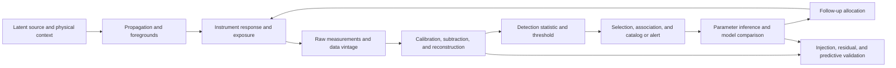

# Astronomy and planetary remote inference: primary-source audit

<!-- markdownlint-disable MD013 -->

**Date:** 2026-08-05

**Scope:** inverse problems, calibration and deconvolution, selection effects,
survey design, hierarchical population inference, source association and sensor
fusion, model comparison, rare-event detection, time-domain alerts,
non-detections, indirect causal claims, cosmic variance, and adaptive follow-up

**Purpose:** determine whether astronomy and planetary remote sensing contribute
an AI mechanism beyond established statistics, inverse methods, surveillance,
active sensing, and graded assurance; state the observation and selection model
that each inference requires; and deduplicate findings against
[P-001](../principle-registry.md#p-001--selective-allocation),
[P-002](../principle-registry.md#p-002--local-autonomy-with-exception-escalation),
[P-003](../principle-registry.md#p-003--temporary-trace-before-commitment),
[P-004](../principle-registry.md#p-004--diversity-selection-and-protection),
[P-005](../principle-registry.md#p-005--use-dependent-topology),
[P-006](../principle-registry.md#p-006--homeostatic-negative-feedback),
[P-007](../principle-registry.md#p-007--prediction-error-allocation),
[P-008](../principle-registry.md#p-008--compartmentalized-interaction),
[P-009](../principle-registry.md#p-009--maintenance-plane),
[P-010](../principle-registry.md#p-010--structural-offloading-and-co-design),
[P-011](../principle-registry.md#p-011--transient-communication-coalitions),
[P-012](../principle-registry.md#p-012--memory-matched-to-information-lifetime),
and [P-013](../principle-registry.md#p-013--externalized-shared-state).

## Executive finding

Astronomy is an extreme observation-model discipline, not evidence for a new
kind of intuition. A distant source is not observed directly. Photons, particles,
or strain propagate from a latent physical process; an instrument transforms
them; cadence, footprint, weather, and thresholds decide what is recorded; a
pipeline calibrates and detects; a catalog or alert selects a subset; and only
then does a scientific model infer source properties or compare explanations.

The principal reusable requirement is therefore:

> Preserve a versioned forward observation contract from latent target through
> instrument response, survey exposure, detection and selection, association,
> likelihood, uncertainty, and data vintage. An inference or alert is valid only
> relative to that contract and its tested domain.

This contract is useful, but it is not currently a fourteenth principle. Its
parts reduce to calibrated generative models, missing-data and survey statistics,
Bayesian or frequentist model comparison, provenance, typed schemas, runtime
monitoring, and active experimental design. It also substantially overlaps the
repository's surveillance audit and graded assurance envelope. Astronomy adds
severe and productive tests:

- the latent source often cannot be revisited in the same state;
- the same sky is filtered by different point-spread functions, passbands,
  backgrounds, coordinate errors, and selection policies;
- non-detections are informative only through detection power and exposure;
- rare-event searches scan enormous template, sky, time, and parameter spaces;
- one physical event can produce several delayed, differently localized
  messengers, while unrelated events can coincide by chance;
- some uncertainty is reducible by more observing, but cosmic/sample variance
  and structural non-identifiability can remain after detector noise falls;
- a mechanistic explanation can be strongly supported without creating the
  intervention-based identification available in a laboratory.

No source supports “astronomical inference” as a mechanism that eliminates
hallucination or converts correlation into causation. The residual observation-
contract candidate survives only if it reduces overconfident conclusions,
selection errors, false associations, and wasted follow-up at equal sensor,
compute, latency, storage, and human-review budget versus the strongest null:
a typed evidence schema plus calibrated likelihood, explicit selection function,
data lineage, standard detection statistics, posterior/predictive checks,
simulation-based calibration, and value-of-information scheduling.

## Evidence and inference boundary

| Evidence design | What it supports | What it cannot establish alone |
| --- | --- | --- |
| Analytic inverse-method derivation | Estimator behavior under a declared forward model, noise law, and regularization | Correct instrument model, unique physical solution, out-of-distribution validity |
| Injection/recovery or end-to-end simulation | Detection efficiency, bias, coverage, or computation under injected populations | Fidelity for unmodeled sky, detector artifacts, or unknown phenomena |
| Controlled instrument calibration | Response and uncertainty for calibration sources and conditions | Stability across time, field, wavelength, brightness, or science target |
| Survey/cadence design study | Trade-offs for declared science utilities and operational constraints | Universal optimum across incompatible objectives or future conditions |
| Observational multi-instrument event | Compatibility and temporal/spatial association across messengers | Randomized causal effect; independence of shared models and calibration |
| Population likelihood or catalog analysis | Population parameters under selection, measurement, and structural assumptions | The unseen population without a modeled selection process |
| Authoritative interoperability standard | Packet semantics, identifiers, roles, and exchange boundaries | Detection accuracy, scientific truth, or policy effectiveness |
| Prospective alert/follow-up operation | Latency, throughput, classification, and yield in its operating regime | Completeness for events that never triggered or were not followed |

“Established” below means that a method, limitation, or observation chain is
well established in its native domain. It does not mean an AI analogue inherits
an effect size, guarantee, or calibrated uncertainty.

## Terms that must remain distinct

| Term | Operational meaning | Not equivalent to |
| --- | --- | --- |
| latent source/state | Physical quantities that generated the arriving signal | calibrated pixels, a catalog row, or inferred parameters |
| forward model | Distribution of measurements conditional on source, nuisance state, response, and exposure | inverse predictor trained only on paired examples |
| instrument response | Point-spread, line-spread, throughput, passband, detector, timing, and coordinate transformation | astrophysical source structure |
| background | Instrumental, atmospheric, foreground, or unrelated-source contribution in measurement space | zero-mean independent noise by default |
| detection statistic | Score used to decide whether a candidate crosses a threshold | posterior probability that a scientific hypothesis is true |
| selection function | Probability that an object/event with declared properties enters the analyzed sample | completeness as a single constant |
| completeness | Detection/inclusion probability over a specified property and context region | purity; representativeness; calibration |
| purity | Fraction of selected candidates belonging to the target class under a declared base rate | completeness; per-candidate confidence |
| cross-identification | Hypothesis that records from different observations refer to the same source/event | feature concatenation or guaranteed causal relation |
| upper limit | Detection-power boundary under a specified false-positive threshold | measured zero; upper confidence/credible bound |
| model evidence | Likelihood averaged over a model's prior parameter volume | maximum likelihood or proof that the model is physically complete |
| alert | Versioned claim that timely follow-up may be valuable | confirmed discovery or authority for an irreversible action |
| cosmic variance | Variation due to observing one finite realization or finite modes of a stochastic process | detector noise removable by longer exposure |

## The end-to-end observation chain



Every arrow can add a nuisance parameter, latency, selection effect, or common-
mode error. A pipeline that stores only the final embedding or class score has
discarded the information needed to decide whether a later inference is valid.

## Shared mathematical boundary

### A forward model precedes an inverse

For instrument or messenger $k$, use a measurement model such as

$$
\mathbf{y}_k \sim
p_k\!\left(
\mathbf{y}_k \mid
\mathcal{R}_k\,\mathbf{f}(\boldsymbol{\theta},\boldsymbol{\eta}),
\mathbf{b}_k,
\boldsymbol{\psi}_k
\right).
$$

$p_k$ is the instrument-specific measurement distribution;
$\mathbf{f}(\boldsymbol{\theta},\boldsymbol{\eta})$ predicts the incident
physical signal; $\boldsymbol{\theta}$ is the scientific source state;
$\boldsymbol{\eta}$ contains physical nuisance variables such as foreground
or atmospheric state; $\mathcal{R}_k$ is the calibrated response operator;
$\mathbf{b}_k$ is background; and $\boldsymbol{\psi}_k$ parameterizes the
noise/counting law. Units must match measurement space: for an imaging detector,
$\mathbf{y}_k$, $\mathcal{R}_k\mathbf{f}$, and $\mathbf{b}_k$ may be
electrons or photon counts per pixel per exposure. A posterior is

$$
p(\boldsymbol{\theta},\boldsymbol{\eta}\mid\mathbf{y})
\propto
p(\mathbf{y}\mid\boldsymbol{\theta},\boldsymbol{\eta})
p(\boldsymbol{\theta},\boldsymbol{\eta}),
$$

not an unqualified property of the source. Misspecified response, background,
prior support, or likelihood can yield a concentrated but wrong posterior.

### Catalog selection is part of the likelihood

For a population intensity $\lambda(\boldsymbol{\theta}\mid\boldsymbol{\phi})$
in objects per unit parameter volume and selection efficiency
$\epsilon(\boldsymbol{\theta})\in[0,1]$, a schematic thinned Poisson-process
likelihood is

$$
\mathcal{L}(\boldsymbol{\phi})
\propto
\exp[-N_{\mathrm{exp}}(\boldsymbol{\phi})]
\prod_{i=1}^{N_{\mathrm{det}}}
\int
p(\mathbf{d}_i\mid\boldsymbol{\theta})
\lambda(\boldsymbol{\theta}\mid\boldsymbol{\phi})
\,d\boldsymbol{\theta},
$$

with

$$
N_{\mathrm{exp}}(\boldsymbol{\phi})=
\int
\epsilon(\boldsymbol{\theta})
\lambda(\boldsymbol{\theta}\mid\boldsymbol{\phi})
\,d\boldsymbol{\theta}.
$$

$\mathbf{d}_i$ is the calibrated data for detected object $i$;
$\boldsymbol{\phi}$ contains population hyperparameters; and
$N_{\mathrm{det}}$ and $N_{\mathrm{exp}}$ are object counts. The exact
placement of selection factors depends on what data are conditioned upon and
how detection is performed; the schematic equation is a requirement to model
the thinning, not a universal likelihood template. Selection and measurement
often use the same noisy data and cannot be corrected safely by a constant
weight after catalog creation.

### Fusion requires an association and dependence hypothesis

For data streams $\mathbf{y}_{1:K}$ and common-source hypothesis $H_S$,

$$
p(\boldsymbol{\theta}\mid\mathbf{y}_{1:K},H_S)
\propto
p(\boldsymbol{\theta}\mid H_S)
\prod_{k=1}^{K}
p(\mathbf{y}_k\mid\boldsymbol{\theta},H_S)
$$

only when the streams are conditionally independent given all shared source and
nuisance variables. Shared catalogs, calibration stars, ephemerides, simulation
priors, or backgrounds violate a naive product. Association itself is compared,
for example, by

$$
B_{S/D}=
\frac{p(\mathbf{y}_{1:K}\mid H_S)}
{p(\mathbf{y}_{1:K}\mid H_D)},
$$

Here $K$ is the number of streams and $\boldsymbol{\theta}$ is the common
source state. $H_D$ represents distinct sources/events. The Bayes factor is
dimensionless and depends on positional, temporal, property, and base-rate
models—not distance alone.

### Model evidence includes prior volume

For model $M_j$,

$$
Z_j=p(\mathbf{y}\mid M_j)=
\int p(\mathbf{y}\mid\boldsymbol{\theta}_j,M_j)
p(\boldsymbol{\theta}_j\mid M_j)
\,d\boldsymbol{\theta}_j,
\qquad
K_{10}=\frac{Z_1}{Z_0}.
$$

$\boldsymbol{\theta}_j$ is model $M_j$'s parameter vector, the second factor in
the integrand is its normalized prior, and $Z_j$ is a density or probability
in the data measure. $K_{10}$ is
dimensionless when the same data are compared. Evidence rewards predictive
fit averaged across prior volume. It is sensitive to prior support and numerical
integration, and says nothing about a physically important alternative omitted
from both models.

### Rare-event significance includes the search

For a known waveform $h$ in stationary Gaussian noise with one-sided power
spectral density $S_n(f)$, a standard noise-weighted inner product is

$$
(a\mid b)=4\,\operatorname{Re}
\int_{f_{\min}}^{f_{\max}}
\frac{\tilde{a}(f)\tilde{b}^{*}(f)}{S_n(f)}\,df,
\qquad
\rho=\frac{(s\mid h)}{\sqrt{(h\mid h)}}.
$$

$a$ and $b$ are trial time series, a tilde is their Fourier transform, the
asterisk denotes complex conjugation, $s$ is measured strain, $h$ is the
template, and $f_{\min}$ and $f_{\max}$ bound frequency $f$ in hertz. For
gravitational-wave strain, $s$ and $h$ are dimensionless, $S_n$ has units
$1/\mathrm{Hz}$, and $\rho$ is dimensionless. Real
detector noise is nonstationary and non-Gaussian; unknown time, sky, waveform,
and template parameters create trials. Local score or local tail probability is
not the global false-alarm probability after the search.

### A non-detection is a power statement

For source flux $F$, statistic $T$, and threshold $\tau_{\alpha}$ chosen
for false-positive rate $\alpha$, define detection power

$$
\pi(F)=P_F(T>\tau_{\alpha}).
$$

A detection upper limit can be defined by
$\pi(F_{\mathrm{UL}})=\beta_{\min}$, where $F_{\mathrm{UL}}$ has the flux
unit of the instrument and $\beta_{\min}$ is dimensionless. Kashyap and
colleagues emphasize that this detectability limit is not the upper endpoint of
a confidence or credible interval
([2010](https://doi.org/10.1088/0004-637X/719/1/900)). “Not detected” is not
$F=0$.

### Some uncertainty is realization-limited

For an idealized angular power spectrum estimate over sky fraction
$f_{\mathrm{sky}}$, one common approximation is

$$
\operatorname{Var}(\widehat{C}_{\ell})
\approx
\frac{2}{(2\ell+1)f_{\mathrm{sky}}}
(C_{\ell}+N_{\ell})^2.
$$

$\widehat{C}_{\ell}$ estimates signal power $C_{\ell}$ at angular multipole
$\ell$; $N_{\ell}$ is noise power; and $f_{\mathrm{sky}}$ is observed sky
fraction. $C_{\ell}$ and $N_{\ell}$ share power-spectrum units and the variance
has their square; $\ell$ and $f_{\mathrm{sky}}$ are dimensionless. Longer
exposure can reduce $N_{\ell}$, but it does not create another independent
sky or new low-$\ell$ modes. Masks, mode coupling, foregrounds, and estimator
details make the real covariance more complicated
([Knox 1995](https://doi.org/10.1103/PhysRevD.52.4307)).

## Mechanism map and initial disposition

| Mechanism | Exact problem | Strongest statistical/engineering null | P mapping | Initial disposition |
| --- | --- | --- | --- | --- |
| Forward inverse modeling | Infer latent state through a known response and nuisance process | calibrated generative likelihood, regularized inverse, optimal estimation | P-007, P-008 | Established measurement discipline |
| Calibration/deconvolution | Separate source structure from blur, throughput, background, and sampling | PSF/response calibration, Richardson–Lucy, CLEAN, regularized reconstruction | P-009, P-010 | Maintenance and inverse-method null |
| Selection/completeness | Infer from a noisy, truncated catalog | injection/recovery, survey sampling, thinned point-process likelihood | P-001, P-007 | Surveillance analogue |
| Survey design | Allocate footprint, cadence, band, depth, and follow-up | optimal experimental design, Fisher information, scheduling, Pareto optimization | P-001, P-007 | Active sensing analogue |
| Hierarchical population inference | Combine uncertain individuals without plug-in bias | multilevel errors-in-variables and point-process models | P-012, P-013 | Established statistics |
| Source association/sensor fusion | Decide whether heterogeneous records share a source and how to combine them | probabilistic record linkage, data association, joint likelihood | P-008, P-011, P-013 | No fusion-by-concatenation novelty |
| Model comparison/checking | Compare explanations and detect misspecification | Bayes factors, predictive scoring, residual/PPC/SBC validation | P-004, P-006, P-009 | Evidence/assurance layer |
| Rare-event detection | Detect weak structured signals across a large search space | matched filter, likelihood ratio, empirical background, multiple-testing correction | P-001, P-007 | Selective allocation and surveillance |
| Time-domain alerting | Publish uncertain events before their value decays | streaming ETL, event schemas, brokers, queues, SRE latency budgets | P-002, P-003, P-011, P-013 | Temporary trace and escalation |
| Indirect mechanistic/causal inference | Distinguish remote physical causes without intervention on the source | generative causal models, natural variation, laboratory calibration, model comparison | P-004, P-007 | No causal shortcut |
| Irreducible uncertainty | Separate noise, systematics, degeneracy, and finite-realization limits | covariance decomposition, partial identification, sensitivity analysis | P-006, P-009 | Boundary, not mechanism |
| Adaptive follow-up | Spend scarce observation where it changes a decision | expected value of information, Bayesian design, POMDP/bandit scheduling | P-001, P-007 | Existing active sensing |

## 1. Forward models and inverse retrieval

**Evidence design.** Rodgers systematized estimation-theoretic inverse methods
for remotely sounded atmospheres, including forward models, priors, averaging
kernels, information content, and retrieval error
([2000](https://doi.org/10.1142/9789812813718)). Line and colleagues compared
atmospheric retrieval techniques on simulated secondary-eclipse spectra and
analyzed retrievability under declared temperature/composition models
([2013](https://doi.org/10.1088/0004-637X/775/2/137)). These establish method
behavior under modeled spectra; they do not establish that the model family
contains a real exoplanet atmosphere.

**Exact problem.** Many distinct source states can map through propagation,
instrument response, and noise to similar measurements. Direct inversion may be
unstable, non-unique, or dominated by directions to which the instrument is
nearly insensitive.

**Information path.** Physical source parameters and nuisance state enter a
radiative-transfer or other forward model; the instrument response maps the
predicted signal to detector space; a likelihood compares that prediction with
calibrated data; priors or regularization constrain weak directions; posterior
and averaging-kernel diagnostics expose what the data resolved.

**Timescale and units.** Exposure may last milliseconds to hours; retrieval can
take seconds to days. Native units include radiance per wavelength/solid angle,
flux density, counts per detector element, temperature in kelvin, mixing ratios
as dimensionless fractions, and pressure in pascals or bars. Conversions must be
inside the forward model.

**Resource cost.** High-fidelity radiative transfer, instrument convolution,
line databases, nuisance marginalization, posterior sampling, and validation.
Surrogate forward models save compute only after error is measured across the
relevant parameter domain.

**Assumptions.** Physics, opacity/response data, geometry, nuisance structure,
noise, prior support, and numerical solver are adequate; data reduction has not
conditioned away relevant alternatives.

**Failure boundary.** Non-identifiability, prior-dominated parameters,
multimodality, missing absorbers or physical processes, stellar/foreground
contamination, response drift, and inverse networks that are accurate on the
training simulator but wrong for reality.

**Strongest statistical/engineering null.** A calibrated forward likelihood
with regularized optimization or Bayesian retrieval, posterior predictive
checks, sensitivity to priors/model variants, and injection recovery. A learned
inverse must beat it on accuracy, calibration, compute, and model-shift detection.

**P mapping and disposition.** P-007 spends new observations on unresolved
directions; P-008 separates physical, instrument, and nuisance compartments.
No new principle. The observation contract must expose which posterior
directions are data-informed versus prior- or simulator-informed.

## 2. Instrument calibration, point-spread functions, and reconstruction

**Evidence design.** Richardson derived an iterative Bayesian image-restoration
method ([1972](https://doi.org/10.1364/JOSA.62.000055)); Lucy independently
developed an iterative rectification/deconvolution method that preserves
normalization and non-negativity and increases likelihood under its assumptions
([1974](https://doi.org/10.1086/111605)). Högbom introduced CLEAN for irregular
radio-interferometer baseline coverage
([1974](https://ui.adsabs.harvard.edu/abs/1974A%26AS...15..417H)). These are
foundational method papers and scoped demonstrations, not guarantees that a
reconstructed feature is physical.

**Exact problem.** Finite aperture, detector sampling, incomplete Fourier
coverage, atmosphere, motion, timing, throughput, and background transform the
sky before inference. Naive reconstruction can convert response sidelobes or
noise into apparent structure.

**Information path.** Calibration sources and engineering telemetry estimate
response/background; raw data remain versioned; the reconstruction algorithm
uses the response and a source/regularization assumption; residuals are returned
to detector space; injected sources measure recovery and artifacts.

**Timescale and units.** Response varies across pixel, wavelength, field, focus,
temperature, exposure, night, and mission lifetime. Point-spread kernels are
normalized fractions per pixel or angular area; images may be electrons/pixel,
Jy/beam, or surface brightness; interferometric baselines are metres and Fourier
coordinates wavelengths.

**Resource cost.** Calibration observing time, reference sources, telemetry,
response storage, iterative compute, human artifact review, and repeated
reprocessing when calibration changes.

**Assumptions.** Calibration source properties are known enough; response is
interpolable to the science observation; background and sampling are modeled;
regularization matches relevant source morphology.

**Failure boundary.** Response/source confounding, over-iteration fitting noise,
CLEAN bias and point-source assumptions, correlated residuals, saturation,
unmodeled persistence/cosmic rays, and a visually plausible artifact that is not
stable across instruments or reductions.

**Strongest statistical/engineering null.** Conventional calibration pipeline,
PSF-aware likelihood, regularized deconvolution, residual whitening checks,
alternative reconstruction, and blind injection/recovery.

**P mapping and disposition.** Maps to P-009 because calibration is a maintenance
plane, and P-010 because stable response corrections can be compiled into the
pipeline. The astronomical contribution is a hard separation between detector-
space fit and source-space interpretation, not a new AI primitive.

## 3. Selection functions, completeness, and non-detections

**Evidence design.** Schmidt's flux-limited quasar analysis introduced the
$V/V_{\max}$ family for space-density inference under explicit limiting flux
and completeness assumptions
([1968](https://doi.org/10.1086/149446)). Loredo's simulations showed how source
measurement uncertainty and detection efficiency interact in population
analysis ([2004](https://doi.org/10.1063/1.1835214)). Kashyap and colleagues
formally distinguished a detection upper limit from an inferential upper bound.
These methods expose rather than eliminate selection assumptions.

**Exact problem.** A catalog contains objects that crossed a context-dependent
pipeline threshold. Faint, blended, fast, slow, colored, moving, masked, or
poorly localized objects enter with different probabilities; objects absent
from the catalog usually have no rows at all.

**Information path.** Survey exposure and raw data define opportunities;
injected or modeled sources pass through the real detection pipeline; recovery
estimates $\epsilon(\boldsymbol{\theta},\mathbf{c})$ over properties and
context $\mathbf{c}$; population likelihood conditions on that thinning;
non-detections retain exposure and detection power.

**Timescale and units.** Selection can change per exposure, processing version,
night, season, or survey release. Efficiency and purity are dimensionless
functions, not constants. Exposure uses seconds and solid angle; limiting flux
uses the instrument's flux unit; event rates require exposure such as
square-degree-days or detector-years.

**Resource cost.** End-to-end injections, negative-example retention, survey
metadata, multidimensional efficiency estimation, reprocessing, and storage of
non-detection opportunities.

**Assumptions.** Injected populations cover the relevant morphology and context;
the production pipeline is replayed faithfully; detection and measurement
dependence is included; unavailable observations are distinguished from observed
non-detections.

**Failure boundary.** Unknown classes outside injection support, threshold and
pipeline drift, human vetting not replayed, source confusion, missing exposure
metadata, post-selection use of the same noisy quantity, and completeness
averaged across a subgroup where it varies sharply.

**Strongest statistical/engineering null.** Survey-sampling/missing-data methods,
inverse-probability or full likelihood approaches where justified, injection-
recovery surfaces, censored/truncated-data models, and explicit power analysis.

**P mapping and disposition.** Maps to P-001 and P-007 and almost entirely
deduplicates into the surveillance audit's coverage/ascertainment boundary. The
observation contract must make “not selected,” “not observed,” and “observed but
not detected” separate states.

## 4. Survey design and cadence

**Evidence design.** The LSST/Rubin reference-design paper derives an integrated
wide/deep/fast survey design from multiple science objectives and describes the
anticipated data products
([Ivezić et al. 2019](https://doi.org/10.3847/1538-4357/ab042c)). It is a
requirements and design synthesis, not a randomized comparison proving one
cadence optimal for all science. Competing objectives share telescope time and
produce a Pareto surface rather than one scalar optimum.

**Exact problem.** Fixed observing capacity must allocate sky position, cadence,
exposure, filter/wavelength, depth, revisit gap, weather opportunity, and
follow-up while transients and population targets occupy different timescales.

**Information path.** Science hypotheses define utilities and required
measurement precision; a source/population and observatory simulator predicts
outcomes under candidate schedules; optimization selects a schedule under time,
slew, visibility, calibration, and risk constraints; realized conditions update
the queue and later selection function.

**Timescale and units.** Exposure and alert seconds; revisits minutes to years;
survey lifetime years. Budgets include seconds/night, square degrees, wavelength
band, limiting flux/magnitude, slew angle/time, and compute or network capacity.

**Resource cost.** Simulator development, scheduling compute, telescope time,
slews, readout, calibration, weather losses, and opportunity cost across science
programs. More cadence usually trades against area or depth.

**Assumptions.** Utilities represent actual science/decision value; source
population and weather/observatory models are adequate; scheduling decisions do
not invalidate the performance estimator; rare classes are not assigned zero
weight merely because their prior rate is uncertain.

**Failure boundary.** Metric gaming, brittle assumed populations, objectives
with incomparable units collapsed by hidden weights, schedule-induced aliasing,
unmodeled downtime, and adaptive follow-up that changes the survey's selection
without recording it.

**Strongest statistical/engineering null.** Optimal experimental design, Fisher
information or expected utility, constrained scheduling, multi-objective Pareto
optimization, bandits/POMDPs for adaptive queues, and end-to-end survey simulation.

**P mapping and disposition.** Directly P-001 and P-007. It is a mature active-
sensing/resource-allocation problem. Astronomy contributes adversarial cadence,
aliasing, and mixed-timescale benchmarks, not a new allocation rule.

## 5. Hierarchical population inference

**Evidence design.** Loredo analyzed source-level nuisance parameters and
population inference with simulations motivated by astronomical surveys; the
thinned latent point-process perspective joins measurement error, population
structure, and selection. Schmidt's survey analysis is an earlier scoped
population estimator. These are inferential methods whose coverage/calibration
depends on the data-generating model.

**Exact problem.** Plugging each object's noisy best estimate into a population
histogram or regression treats heterogeneous uncertainty as truth, creates
Eddington/Malmquist-type distortions, and fails when the number of latent
source parameters grows with sample size.

**Information path.** Each source retains a likelihood or sufficient detector-
space evidence; a population distribution supplies shared hyperparameters;
source states are marginalized, not fixed; the selection/exposure integral
normalizes the detected sample; posterior predictive simulated catalogs are
compared with observed catalogs.

**Timescale and units.** Individual exposures feed releases over months/years;
population fits may take hours/days. Source and hyperparameter units remain
physical—luminosity, radius, rate density, abundance—not normalized away.

**Resource cost.** Per-source likelihood retention, high-dimensional
marginalization, selection integrals, population simulations, compute, and
versioned reanalysis when calibrations or catalog membership change.

**Assumptions.** Exchangeability or structured population model is appropriate;
selection and source likelihoods are coherent; the hyperprior has support;
dependencies among sources, fields, and calibration are modeled.

**Failure boundary.** Over-shrinkage erases rare subpopulations, mixture
misspecification, duplicated sources, ignored correlation, selection double
counting, plug-in posterior samples used as independent data, and hyperparameters
that absorb instrument errors.

**Strongest statistical/engineering null.** Multilevel errors-in-variables,
mixture and point-process models, empirical Bayes with sensitivity analysis,
simulation-based calibration, and held-out predictive assessment.

**P mapping and disposition.** Maps to P-012 and P-013 only as a lifetime/shared-
state implementation: individual evidence remains local while population state
is shared. No new principle; hierarchical pooling is a statistical null any
modular AI population-learning claim must beat.

## 6. Probabilistic source association and multi-messenger fusion

**Evidence design.** Budavári and Szalay developed Bayesian cross-identification
for records with positional uncertainty and extensions for physical properties
([2008](https://doi.org/10.1086/587156)). The coordinated observations of
GW170817 linked gravitational-wave, gamma-ray, and broad electromagnetic
follow-up through time, localization, and physical interpretation
([Abbott et al. 2017](https://doi.org/10.3847/2041-8213/aa91c9)). The event is a
landmark observational demonstration, not a randomized estimate of a generic
fusion algorithm's benefit.

**Exact problem.** Heterogeneous instruments produce records with different
localization regions, clocks, sensitivities, backgrounds, cadences, and physical
selection. The first question is whether records refer to one source/event;
only then is parameter fusion coherent.

**Information path.** Each stream publishes calibrated likelihood/localization,
time, response, and provenance; association compares common-source and distinct-
source hypotheses using event rates; accepted or weighted associations feed a
joint physical model; contradictory observations remain visible.

**Timescale and units.** Subsecond to days between messengers; milliseconds to
months for follow-up. Coordinates use radians/degrees with covariance or sky-
map probability per solid angle; timestamps require reference/time standard;
event rates use events per area-time or detector-time.

**Resource cost.** Clock and astrometric calibration, catalog indexing,
probabilistic matching, joint sampling, network transfer, false-coincidence
review, and broad follow-up of large localization regions.

**Assumptions.** Association priors/base rates are calibrated; shared nuisance
variables are included; coordinate/time systems align; physical model predicts
cross-messenger delays and observability; non-detections are exposure-aware.

**Failure boundary.** Crowding, moving sources, broad/localization multimodality,
catalog epoch differences, chance coincidence, shared calibration or simulation
priors, publication-conditioned counterpart search, and forced one-to-one match
when one-to-many or no-match is possible.

**Strongest statistical/engineering null.** Probabilistic record linkage/data
association, joint likelihood with shared nuisance variables, track-before-
detect, factor graphs, and deterministic schema/provenance validation.

**P mapping and disposition.** Maps to P-008, P-011, and P-013. “Multimodal
fusion” is not feature concatenation; the residual is a versioned association
hypothesis with alternatives and dependence metadata, already expressible in
the graded assurance envelope.

## 7. Model comparison, checking, and computational assurance

**Evidence design.** Trotta reviews Bayesian parameter inference and model
selection in cosmology ([2008](https://doi.org/10.1080/00107510802066753));
Skilling developed nested sampling for evidence calculation
([2006](https://doi.org/10.1214/06-BA127)); Gelman, Meng, and Stern formalized
posterior predictive assessment
([1996](https://www3.stat.sinica.edu.tw/statistica/oldpdf/A6n41.pdf)); Talts and
colleagues introduced simulation-based calibration for Bayesian algorithms
([2018](https://doi.org/10.48550/arXiv.1804.06788)). These test different layers:
relative models, observed-data adequacy, and computational calibration.

**Exact problem.** A flexible model can fit detector data yet be unsupported
after parameter volume, predict the wrong replicated structure, or be sampled
incorrectly. Comparing only best fits confounds parameter inference, model
comparison, model checking, and computation checking.

**Information path.** Versioned model and prior produce likelihood/evidence;
competing models receive the same data and nuisance treatment; predictive
replicates test declared discrepancies; simulated truths test algorithmic rank/
coverage; residual failures return to model revision rather than being hidden
inside a wider posterior.

**Timescale and units.** Computation takes seconds to weeks; scientific model
revision can take years. Log evidence and log Bayes factors are dimensionless;
predictive discrepancies retain data units; Monte Carlo error must be reported
in the same quantity being compared.

**Resource cost.** Alternative models, prior elicitation, evidence integration,
posterior simulation, replicated data, held-out tests, and independent pipeline
implementation for high-consequence claims.

**Assumptions.** Compared models and priors are meaningful; likelihood
normalization is correct; sampling explores all important modes; checking
statistics are sensitive to relevant failures; simulations represent the
implemented model.

**Failure boundary.** Prior-volume manipulation, arbitrary verbal Bayes-factor
thresholds, omitted alternatives, double use of adaptively selected data,
multimodal sampler failure, posterior predictive tests with no power, and SBC
passing for the simulator while the simulator misses reality.

**Strongest statistical/engineering null.** Likelihood-ratio or information-
criterion tests where regularity holds, cross-validation/predictive scores,
Bayes factors with prior sensitivity, residual/PPC checks, SBC, unit tests,
reproducible environments, and independent analysis.

**P mapping and disposition.** P-004 supplies competing explanations, P-006
feeds residual failure back, and P-009 owns revalidation. Programming-language
assurance covers versioning and executable guarantees but not scientific model
adequacy. The observation contract must label proof, computation check,
calibration, and empirical model comparison separately.

## 8. Rare-event detection and trials

**Evidence design.** Allen and colleagues document FINDCHIRP, a matched-filter
search adapted to unknown compact-binary parameters and nonstationary,
non-Gaussian detector artifacts
([2012](https://doi.org/10.1103/PhysRevD.85.122006)). Kovács, Zucker, and Mazeh
derive and simulate box-fitting least squares for periodic exoplanet-transit
signals ([2002](https://doi.org/10.1051/0004-6361:20020802)). Gross and Vitells
analyze trial factors/look-elsewhere corrections for searches over unknown
signal location ([2010](https://doi.org/10.1140/epjc/s10052-010-1470-8)).

**Exact problem.** A weak structured signal is buried in noise and artifacts,
while searching many times, templates, periods, sky positions, and classes makes
the maximum background fluctuation large.

**Information path.** A physical signal family defines templates/statistics;
calibrated data and data-quality masks enter the search; candidates undergo
consistency and coincidence tests; off-source/time-slide or simulation
background estimates global false-alarm behavior; injections estimate power;
survivors become alerts, not truths.

**Timescale and units.** Sample intervals microseconds to days; events
subseconds to years; background exposure detector-years or searched area-time.
Signal-to-noise and likelihood ratios are dimensionless; false-alarm rate must
be events per stated search time/exposure, not a context-free sigma label.

**Resource cost.** Template banks, FFTs/search compute, background trials,
injections, storage, data-quality monitoring, candidate vetting, and follow-up.
Lower thresholds consume downstream capacity.

**Assumptions.** Signal family covers relevant events; background estimation is
exchangeable with on-source search; trial accounting covers adaptive searches;
artifacts are not synchronized across supposedly independent detectors.

**Failure boundary.** Unknown morphology, nonstationary/glitchy noise,
template mismatch, leakage/aliasing, data-quality cuts tuned after viewing a
candidate, uncounted researcher degrees of freedom, and publication selection.

**Strongest statistical/engineering null.** Matched filtering/generalized
likelihood ratio, scan statistics, multiple-testing/extreme-value correction,
empirical background, conformal or calibrated anomaly scoring where appropriate,
and end-to-end injection/recovery.

**P mapping and disposition.** Maps directly to P-001 and P-007 and duplicates
the surveillance audit's detector/investigation distinction. A neural anomaly
score contributes only if its global false-alarm and power surfaces beat these
nulls at equal search and follow-up cost.

## 9. Time-domain alerts and brokered follow-up

**Evidence design.** ZTF describes a wide-field time-domain system with near-
real-time reduction, moving/variable-object detection, data products, archive,
and public alert stream
([Bellm et al. 2019](https://doi.org/10.1088/1538-3873/aaecbe)). VOEvent 2.0 is
an authoritative interoperability recommendation for compact, machine-readable,
persistently identified transient-event packets and citations
([Seaman et al. 2011](https://doi.org/10.5479/ADS/bib/2011ivoa.spec.0711S)). The
standard specifies semantics, not transport policy or scientific accuracy.

**Exact problem.** Transient information value decays faster than central human
review can process all candidates; follow-up resources have heterogeneous
visibility, latency, wavelength, and priorities.

**Information path.** Image difference or stream detector emits a versioned
candidate with who/what/where/when/how and uncertainty; a broker enriches and
filters without erasing the original; subscribers apply local utility and
capability policies; follow-up observations cite and revise the event lineage.

**Timescale and units.** A latency budget is

$$
T_{\mathrm{follow}}=
T_{\mathrm{readout}}+T_{\mathrm{calibrate}}+T_{\mathrm{detect}}+
T_{\mathrm{publish}}+T_{\mathrm{broker}}+T_{\mathrm{schedule}},
$$

with every term in seconds or minutes from a declared exposure/event reference.
Report p50/p95/p99 and missed-deadline fraction, not only mean latency. Throughput
uses alerts/second; downstream load uses telescope-seconds or reviewer-minutes.

**Resource cost.** Streaming compute/network, schema/version maintenance,
crossmatch/enrichment, broker storage, subscriber filtering, false-alert load,
and follow-up opportunity cost.

**Assumptions.** Clocks and identifiers are stable; uncertainty and provenance
survive broker transformations; subscriber utilities are explicit; corrections
and retractions propagate; rate limits do not preferentially erase rare classes.

**Failure boundary.** Alert storms, duplicate identity, stale enrichment,
classification feedback loops, latency-tail collapse, proprietary/missing
context, retraction not consumed, and brokers trained on followed candidates
whose labels inherit the old selection policy.

**Strongest statistical/engineering null.** Event streaming with typed schemas,
idempotent identifiers, provenance, queues/backpressure, calibrated classifiers,
ordinary alert brokers, SRE latency objectives, and cost-sensitive scheduling.

**P mapping and disposition.** Maps to P-002, P-003, P-011, and P-013. VOEvent is
a direct engineered analogue for temporary claims in a shared workspace. It
strongly constrains novelty claims for an AI “global workspace” alert bus.

## 10. Indirect mechanistic and causal inference

**Evidence design.** Catling and colleagues propose a Bayesian framework for
assessing exoplanet biosignatures using prior context and likelihoods under life
and non-life hypotheses
([2018](https://doi.org/10.1089/ast.2017.1737)). Atmospheric retrieval and
multi-messenger studies provide other examples of fitting shared mechanistic
forward models to remote evidence. These support comparative explanatory
inference; they do not create randomized interventions on an exoplanet, merger,
or galaxy.

**Exact problem.** Remote observations are effects of hidden processes. Several
causes can produce the same spectrum, light curve, morphology, or abundance;
the scientifically important cause may have a low or poorly known prior rate.

**Information path.** Candidate causal processes generate forward predictions
conditioned on environment; laboratory, Earth/Solar-System, and population
observations constrain components; multiple observables test discriminating
predictions; alternative abiotic/instrumental/foreground explanations receive
explicit likelihoods; follow-up targets the largest decision-relevant difference.

**Timescale and units.** Physical mechanisms span seconds to gigayears; signals
arrive after light-travel delay but inference uses observation time and source-
frame model explicitly. Odds and likelihood ratios are dimensionless; chemical
mixing ratios, fluxes, temperatures, ages, and rates retain physical units.

**Resource cost.** Mechanistic simulation, laboratory and field analogues,
context observations, alternative-model construction, expert review, and
decades of follow-up. The cost of an unmodeled alternative cannot be estimated
from posterior concentration alone.

**Assumptions.** Relevant causal alternatives are represented; transfer from
laboratory/Solar-System conditions is justified; latent confounding and
selection are modeled; temporal or cross-context invariance discriminates
mechanisms; priors are exposed.

**Failure boundary.** Equifinality, unknown chemistry/physics, proxy mistaken
for cause, collider selection through detectability, anthropic/target selection,
model monoculture, and posterior odds presented as intervention-identified
causal probability.

**Strongest statistical/engineering null.** Structural/generative causal models
with explicit identification assumptions, natural-variation comparisons,
mechanistic likelihoods, sensitivity/bounds, model averaging, and targeted
discriminating observation. Ordinary model comparison remains the null when no
causal estimand is identifiable.

**P mapping and disposition.** Maps to P-004 and P-007. Astronomy teaches
epistemic restraint and model pluralism, not a causal-discovery shortcut. The AI
translation is to label “best of modeled explanations” separately from
“identified effect of intervention.”

## 11. Irreducible distance, degeneracy, and finite-realization uncertainty

**Evidence design.** Knox derives forecasted CMB-parameter limits including
finite mode/cosmic variance; Rodgers exposes averaging-kernel and null-space
limits of atmospheric retrieval; model-checking literature exposes structural
misspecification. These are analytic/model-based boundaries, not evidence that
all uncertainty can be cleanly classified in practice.

**Exact problem.** More precise detectors cannot recover information that the
response never encoded, distinguish exactly degenerate source states, observe
unseen population members without a selection model, or generate another
independent realization of the same Universe.

**Information path.** Uncertainty is decomposed into counting/read noise,
calibration and foreground systematics, source/model degeneracy, selection and
association uncertainty, sampling variance, and finite-realization limits;
each component maps to a possible observation, calibration, model change, or
explicit irreducible interval.

**Timescale and units.** Noise may average with exposure seconds; calibration
drifts over exposures/years; population and cosmic variance remain at survey
completion. Covariance entries carry products of the variables' units; total
variance is not a unitless “confidence” score.

**Resource cost.** Replicated instruments/fields, calibration, broader
wavelengths, nuisance models, sensitivity analysis, robust intervals, and the
opportunity cost of declaring a parameter only partially identified.

**Assumptions.** Covariance components are not double counted; repeated fields
are independent where claimed; nuisance/model uncertainty has adequate support;
reported intervals correspond to the actual selection and data vintage.

**Failure boundary.** Treating systematic uncertainty as independent Gaussian
noise, adding error bars in incompatible units, averaging correlated surveys,
calling a prior-bound posterior “high confidence,” and continuing observation
when the limiting direction is structural rather than photon noise.

**Strongest statistical/engineering null.** Identifiability/rank analysis,
Fisher or full posterior covariance with limitations, partial identification,
variance components, sensitivity analysis, independent calibration, and
decision-making under ambiguity.

**P mapping and disposition.** Maps to P-006 and P-009 as uncertainty diagnosis
and maintenance. Irreducible uncertainty is a stopping/escalation condition, not
a new computational mechanism and not permission to fabricate precision.

## 12. Adaptive follow-up as active sensing

**Evidence design.** Time-domain facilities and VOEvent document operational
trigger/follow-up ecosystems; multi-messenger observations show scientific value
from rapid heterogeneous follow-up; survey design studies formalize observing
trade-offs. These examples establish feasibility and historical yield, not a
universal acquisition policy.

**Exact problem.** A candidate's class, source state, or scientific importance
is uncertain, observations differ in cost and visibility, and information value
decays with time.

Most stellar and extragalactic follow-up is passive: the observer chooses when,
where, and in which channel to listen, not how to perturb the source. Some
Solar-System radar, lidar, and spacecraft experiments can actively illuminate
or change viewing geometry. That is an active system-identification regime and
must not be generalized to targets for which illumination or intervention is
physically infeasible.

**Information path.** Current posterior/model odds and operational state generate
candidate actions; a utility model values decision changes rather than entropy
alone; scheduler chooses an observation under time/capability constraints; the
new likelihood updates both source inference and the recorded selection policy.

**Timescale and units.** Seconds for explosive transients, days/months for
orbital or atmospheric characterization, and years for population surveys.
Costs use telescope-seconds, energy, slew/readout seconds, bytes, monetary cost,
and human minutes; value must name the decision or scientific endpoint.

**Resource cost.** Opportunity cost, scheduling and visibility computation,
coordination, calibration, network, and risk that repeated attention to familiar
classes starves discovery space.

**Assumptions.** Posterior and utility are calibrated enough to rank actions;
the observation outcome model is valid; action-dependent selection is logged;
fallback exploration protects against model misspecification.

**Failure boundary.** Entropy reduction on irrelevant parameters, self-
confirming target selection, exploitation feedback, inaccessible optimal sensor,
latency exceeding event lifetime, weather/failure, and failure to include
non-observation caused by scheduling.

**Strongest statistical/engineering null.** Expected value of sample
information, Bayesian experimental design, optimal scheduling, POMDP/bandit
policies, stratified exploration, and ordinary active sensing.

**P mapping and disposition.** Directly P-001 and P-007. No new principle.
Astronomy supplies unusually constrained, delayed, heterogeneous acquisition
benchmarks and a clean requirement to version the policy-induced selection
function.

## Applicability map for AI systems

| AI setting | Astronomy mechanism that transfers | What does not transfer | Strongest null/baseline |
| --- | --- | --- | --- |
| Tool-using agent observes an API or database | Response/schema, missingness, selection, data vintage, provenance | Photon statistics or spatial PSF without an analogous transform | typed API, lineage, schema validation, missing-data model |
| Multimodal model combines camera, audio, logs, and agents | probabilistic association, shared nuisance variables, contradiction retention | assumption that channels are independent because modalities differ | factor graph/joint likelihood, probabilistic record linkage |
| Anomaly detector scans many modules and times | global trial accounting, empirical background, injection/recovery, follow-up budget | astronomical sigma thresholds as universal constants | likelihood/scan test, multiple testing, calibrated detector |
| Retrieval/RAG answers from a selected corpus | corpus/query selection, non-retrieval versus absence, source likelihood/provenance | completeness from document count alone | calibrated retrieval evaluation and missing-evidence state |
| Learned world-model estimates latent state | forward observation model, nuisance separation, identifiability, posterior predictive checks | confident inverse embedding as evidence of uniqueness | state-space/generative model, system identification, SBC |
| Multi-agent evidence market or debate | independent evidence paths, common-mode accounting, source association hypotheses | multiplying confidence votes as independent likelihoods | Bayesian evidence aggregation with dependence graph |
| Safety monitor emits urgent alerts | versioned event packets, uncertainty, revisions/retractions, latency tails, subscriber policy | alert score as authority for irreversible action | typed event bus, SRE alerting, escalation/interlock |
| Continual learner studies deployed successes | selection/exposure and policy-induced observation, population hierarchy | treating observed training examples as representative by default | surveillance audit, off-policy/missing-data methods |
| Scientific AI proposes mechanisms | explicit alternatives, mechanistic forward predictions, discriminating follow-up | model comparison as intervention-identified causality | causal identification analysis plus model checking |

## Residual candidate: a versioned observation contract

The only integration candidate is an evidence packet attached to every
measurement-derived AI claim. It should contain:

1. **Target:** latent variable, event, population, or decision the claim concerns.
2. **Opportunity/exposure:** where and when the target could have been observed,
   including unavailable and deliberately unsampled regions.
3. **Response:** sensor/API/tool transformation, calibration version, units,
   background, resolution, and known null space.
4. **Detection/selection:** statistic, threshold, search/trial family,
   efficiency/power surface, and policy or human vetting.
5. **Association:** source/entity/event identity hypotheses, alternatives,
   base rates, coordinate/time standards, and shared nuisance variables.
6. **Inference:** likelihood or empirical calibration, priors/regularization,
   model alternatives, numerical error, and identifiability boundary.
7. **Validation:** injections, negative controls, predictive/residual checks,
   calibration coverage, and out-of-support flags.
8. **Lineage:** raw-data and model versions, transformations, alert revisions,
   retractions, and downstream consumers.
9. **Acquisition provenance:** why this observation was taken or retrieved, what
   alternatives were not sampled, and how follow-up changes later selection.

This candidate is rejected as distinct novelty if the graded assurance envelope
plus typed provenance schema can express it without loss, or if a conventional
calibrated state estimator/surveillance pipeline matches its decisions. Its
possible residual is the automatic propagation of response, selection, and
association invalidation through multi-agent claims—not the astronomical names.

## Equal-budget falsification tests

### A. Forward model versus learned inverse

Generate latent scenes with calibrated in-family response and adversarial shifts
in PSF, background, missing component, and nuisance correlation. Compare a
learned inverse, calibrated forward-likelihood inference, hybrid amortized
posterior, and observation-contract candidate. Hold simulator calls, training
compute, inference joules, and latency constant. Measure source-state error,
interval coverage, posterior predictive failure detection, abstention, and
calibration under shift. The candidate loses if the forward model plus ordinary
shift checks ties it.

### B. Selection-aware population learning

Create a population with rare subtypes, context-dependent detection, noisy
selection on the measured variable, policy changes, and unavailable regions.
Compare catalog-only learning, inverse-probability correction, a full thinned
point-process/missing-data likelihood, and the observation contract. Hold
labeled detections, injection budget, and compute constant. Measure population
parameter bias/coverage, rare-class recall, false prevalence, and detection of
unsupported regions. The candidate loses if established survey statistics tie it.

### C. Association and fusion under common modes

Simulate asynchronous agents/sensors with uncertain identity, moving targets,
chance coincidences, shared calibration, and contradictory observations.
Compare embedding concatenation, nearest-neighbor/entity-key matching,
probabilistic data association with shared nuisance variables, and contract-
carrying evidence fusion. Hold bandwidth, compute, and false-match review budget
constant. Measure association precision/recall, posterior calibration, harmful
forced matches, and decision utility. Fusion novelty is falsified if standard
factor-graph/record-linkage inference wins.

### D. Rare-event search and alert load

Inject known structured anomalies into nonstationary, heavy-tailed module traces
while varying the number of searched templates, modules, and tuning attempts.
Compare neural anomaly score, matched/generalized likelihood detector, scan/
multiple-testing baseline, and contract-aware alert. Hold false alerts per
reviewer-hour and search compute constant. Measure power by event family,
global false-alarm rate, detection latency, calibration after adaptive tuning,
and verified follow-up yield.

### E. Time-domain packet lineage

Run event streams with duplicates, partial updates, retractions, stale
enrichment, broker outages, clock mismatch, and rate spikes. Compare free-form
agent messages, typed ordinary events, VOEvent-like versioned packets, and the
full observation contract. Hold bytes, end-to-end latency, and subscriber
compute constant. Measure p50/p99 follow-up latency, duplicate actions, missed
retractions, provenance loss, incorrect irreversible actions, and recovery.

### F. Mechanism claims under omitted alternatives

Construct remote observations generated by one of several equifinal mechanisms,
including an initially omitted cause. Compare single-model posterior confidence,
Bayes-factor/model-averaging workflow, causal-graph sensitivity analysis, and
contract-driven discriminating follow-up. Hold observation and model-simulation
budget constant. Measure correct mechanism ranking, overconfidence, omitted-
model detection, and decision regret. No system may claim intervention-identified
causality when the design supplies only observational model comparison.

### G. Adaptive follow-up without self-confirmation

Present decaying-value events drawn from familiar and novel classes. Compare
random/stratified follow-up, entropy acquisition, expected decision value,
bandit/POMDP scheduling, and the observation contract with policy provenance.
Hold telescope/sensor seconds and processing budget constant. Measure scientific/
decision utility, rare-class discovery, posterior calibration, selection-induced
bias, and coverage of unexplored regimes.

## Failure conditions for the residual candidate

- A typed schema, ordinary lineage, and calibrated likelihood reproduce every
  benefit without the additional contract machinery.
- The contract adds metadata but does not improve calibration, selection-bias
  detection, association, follow-up yield, or decision regret.
- Maintaining response and selection versions costs more observing/engineering
  budget than the errors it prevents.
- Automatic invalidation floods consumers or retracts valid downstream claims
  more often than it catches stale evidence.
- Learned modules ignore the metadata, so decisions are unchanged despite a
  formally complete packet.
- Injection/recovery passes only for the simulator and the contract makes
  out-of-model reality look more, rather than less, authoritative.
- Standard surveillance, PL assurance, and active-sensing baselines win tests
  A–G at equal budget.

## Temporary claim ledger

These identifiers are audit-local and must not be added to the shared ledger
without deduplication and review.

| ID | Temporary claim | Status | Boundary and disposition |
| --- | --- | --- | --- |
| ASTRO-01 | Remote inference requires a forward observation model separating source, nuisance state, response, background, and noise. | established method boundary | A concentrated inverse estimate can still be wrong under misspecification; P-007/P-008. |
| ASTRO-02 | Richardson–Lucy and CLEAN demonstrate established response-aware reconstruction families, not proof that reconstructed features are physical. | established | Residual/injection and alternative-reduction tests remain mandatory; P-009/P-010. |
| ASTRO-03 | Catalog membership is a selection event whose probability can depend on the same noisy data later analyzed. | established | Constant completeness correction is invalid when efficiency varies; P-001/P-007 and surveillance duplicate. |
| ASTRO-04 | Non-detection constrains a source only through exposure, background, threshold, and detection power. | established | “Absent” and zero are unsupported without that model; surveillance duplicate. |
| ASTRO-05 | Survey design is multi-objective allocation across area, depth, cadence, wavelength, and latency. | established design problem | No astronomy-specific universal policy; P-001/P-007. |
| ASTRO-06 | Hierarchical marginalization can prevent plug-in source uncertainties from corrupting population inference under a correct model. | established method, scoped | Misspecified population/selection models can remain confidently wrong; P-012/P-013. |
| ASTRO-07 | Multi-sensor fusion requires a source-association hypothesis and a dependence model before likelihoods are multiplied. | established | Different modality does not imply conditional independence; P-008/P-011/P-013. |
| ASTRO-08 | Model evidence, predictive checking, and computation calibration answer different assurance questions. | established conceptual distinction | Passing one cannot substitute for the others; P-006/P-009 and PL assurance. |
| ASTRO-09 | Rare-event significance must account for the searched template/time/space family and downstream follow-up exposure. | established | Local scores and context-free sigma thresholds are insufficient; P-001/P-007 and surveillance duplicate. |
| ASTRO-10 | A versioned alert is a temporary follow-up claim, not a confirmed discovery. | established operational distinction | Accuracy depends on detector, broker, revisions, and subscribers; P-003/P-013. |
| ASTRO-11 | Remote mechanistic model comparison does not by itself identify an intervention effect or exclude omitted causes. | established causal boundary | Best modeled explanation must be labeled separately from identified causality; P-004/P-007. |
| ASTRO-12 | Some uncertainty is limited by response null spaces, exact degeneracy, or finite realized modes rather than detector noise. | established in scoped problems | More exposure cannot resolve every direction; P-006/P-009. |
| ASTRO-13 | Adaptive astronomical follow-up is an instance of value-of-information sensing under policy-induced selection. | established problem family | Must beat ordinary Bayesian design, scheduling, POMDP, and bandit baselines; P-001/P-007. |
| ASTRO-14 | A versioned observation contract may reduce invalid multi-agent evidence composition by propagating response, selection, and association dependencies. | speculative | Reject as novelty if the assurance envelope plus surveillance schema or standard state estimation matches it. |

## Bibliography (BibTeX)

```bibtex
@article{richardson1972bayesian,
  author = {Richardson, William Hadley},
  title = {Bayesian-Based Iterative Method of Image Restoration},
  journal = {Journal of the Optical Society of America},
  year = {1972},
  volume = {62},
  number = {1},
  pages = {55--59},
  doi = {10.1364/JOSA.62.000055},
  url = {https://doi.org/10.1364/JOSA.62.000055}
}

@article{lucy1974iterative,
  author = {Lucy, Leon B.},
  title = {An Iterative Technique for the Rectification of Observed Distributions},
  journal = {The Astronomical Journal},
  year = {1974},
  volume = {79},
  number = {6},
  pages = {745--754},
  doi = {10.1086/111605},
  url = {https://doi.org/10.1086/111605}
}

@article{hogbom1974aperture,
  author = {H{\"o}gbom, Jan A.},
  title = {Aperture Synthesis with a Non-Regular Distribution of Interferometer Baselines},
  journal = {Astronomy and Astrophysics Supplement Series},
  year = {1974},
  volume = {15},
  pages = {417--426},
  url = {https://ui.adsabs.harvard.edu/abs/1974A%26AS...15..417H}
}

@book{rodgers2000inverse,
  author = {Rodgers, Clive D.},
  title = {Inverse Methods for Atmospheric Sounding: Theory and Practice},
  publisher = {World Scientific},
  address = {Singapore},
  series = {Series on Atmospheric, Oceanic and Planetary Physics},
  volume = {2},
  year = {2000},
  doi = {10.1142/9789812813718},
  isbn = {9789810227401},
  url = {https://doi.org/10.1142/9789812813718}
}

@article{line2013retrieval,
  author = {Line, Michael R. and Wolf, Aaron S. and Zhang, Xi and Knutson, Heather and Kammer, Joshua A. and Ellison, Elias and Deroo, Pieter and Crisp, David and Yung, Yuk L.},
  title = {A Systematic Retrieval Analysis of Secondary Eclipse Spectra. I. A Comparison of Atmospheric Retrieval Techniques},
  journal = {The Astrophysical Journal},
  year = {2013},
  volume = {775},
  number = {2},
  pages = {137},
  doi = {10.1088/0004-637X/775/2/137},
  url = {https://doi.org/10.1088/0004-637X/775/2/137}
}

@article{schmidt1968space,
  author = {Schmidt, Maarten},
  title = {Space Distribution and Luminosity Functions of Quasi-Stellar Radio Sources},
  journal = {The Astrophysical Journal},
  year = {1968},
  volume = {151},
  pages = {393--409},
  doi = {10.1086/149446},
  url = {https://doi.org/10.1086/149446}
}

@inproceedings{loredo2004source,
  author = {Loredo, Thomas J.},
  title = {Accounting for Source Uncertainties in Analyses of Astronomical Survey Data},
  booktitle = {Bayesian Inference and Maximum Entropy Methods in Science and Engineering},
  editor = {Fischer, Rainer and Preuss, Roland and Toussaint, Udo von},
  series = {AIP Conference Proceedings},
  volume = {735},
  pages = {195--206},
  publisher = {American Institute of Physics},
  address = {Melville, NY},
  year = {2004},
  doi = {10.1063/1.1835214},
  url = {https://doi.org/10.1063/1.1835214}
}

@article{kashyap2010upper,
  author = {Kashyap, Vinay L. and van Dyk, David A. and Connors, Alanna and Freeman, Peter E. and Siemiginowska, Aneta and Xu, Jin and Zezas, Andreas},
  title = {On Computing Upper Limits to Source Intensities},
  journal = {The Astrophysical Journal},
  year = {2010},
  volume = {719},
  number = {1},
  pages = {900--914},
  doi = {10.1088/0004-637X/719/1/900},
  url = {https://doi.org/10.1088/0004-637X/719/1/900}
}

@article{ivezic2019lsst,
  author = {Ivezi{\'c}, {\v Z}eljko and Kahn, Steven M. and Tyson, J. Anthony and Abel, Bob and Acosta, Emily and Allsman, Robyn and Alonso, David and AlSayyad, Yusra and Anderson, Scott F. and Andrew, John and others},
  title = {{LSST}: From Science Drivers to Reference Design and Anticipated Data Products},
  journal = {The Astrophysical Journal},
  year = {2019},
  volume = {873},
  number = {2},
  pages = {111},
  doi = {10.3847/1538-4357/ab042c},
  url = {https://doi.org/10.3847/1538-4357/ab042c}
}

@article{budavari2008crossid,
  author = {Budav{\'a}ri, Tam{\'a}s and Szalay, Alexander S.},
  title = {Probabilistic Cross-Identification of Astronomical Sources},
  journal = {The Astrophysical Journal},
  year = {2008},
  volume = {679},
  number = {1},
  pages = {301--309},
  doi = {10.1086/587156},
  url = {https://doi.org/10.1086/587156}
}

@article{abbott2017multimessenger,
  author = {{LIGO Scientific Collaboration} and {Virgo Collaboration} and {Fermi Gamma-Ray Burst Monitor} and {INTEGRAL} and others},
  title = {Multi-Messenger Observations of a Binary Neutron Star Merger},
  journal = {The Astrophysical Journal Letters},
  year = {2017},
  volume = {848},
  number = {2},
  pages = {L12},
  doi = {10.3847/2041-8213/aa91c9},
  url = {https://doi.org/10.3847/2041-8213/aa91c9}
}

@article{trotta2008bayes,
  author = {Trotta, Roberto},
  title = {Bayes in the Sky: Bayesian Inference and Model Selection in Cosmology},
  journal = {Contemporary Physics},
  year = {2008},
  volume = {49},
  number = {2},
  pages = {71--104},
  doi = {10.1080/00107510802066753},
  url = {https://doi.org/10.1080/00107510802066753}
}

@article{skilling2006nested,
  author = {Skilling, John},
  title = {Nested Sampling for General Bayesian Computation},
  journal = {Bayesian Analysis},
  year = {2006},
  volume = {1},
  number = {4},
  pages = {833--859},
  doi = {10.1214/06-BA127},
  url = {https://doi.org/10.1214/06-BA127}
}

@article{gelman1996posterior,
  author = {Gelman, Andrew and Meng, Xiao-Li and Stern, Hal},
  title = {Posterior Predictive Assessment of Model Fitness via Realized Discrepancies},
  journal = {Statistica Sinica},
  year = {1996},
  volume = {6},
  number = {4},
  pages = {733--807},
  url = {https://www3.stat.sinica.edu.tw/statistica/oldpdf/A6n41.pdf}
}

@article{allen2012findchirp,
  author = {Allen, Bruce and Anderson, Warren G. and Brady, Patrick R. and Brown, Duncan A. and Creighton, Jolien D. E.},
  title = {{FINDCHIRP}: An Algorithm for Detection of Gravitational Waves from Inspiraling Compact Binaries},
  journal = {Physical Review D},
  year = {2012},
  volume = {85},
  number = {12},
  pages = {122006},
  doi = {10.1103/PhysRevD.85.122006},
  url = {https://doi.org/10.1103/PhysRevD.85.122006}
}

@article{kovacs2002box,
  author = {Kov{\'a}cs, G{\'e}za and Zucker, Shay and Mazeh, Tsevi},
  title = {A Box-Fitting Algorithm in the Search for Periodic Transits},
  journal = {Astronomy \& Astrophysics},
  year = {2002},
  volume = {391},
  pages = {369--377},
  doi = {10.1051/0004-6361:20020802},
  url = {https://doi.org/10.1051/0004-6361:20020802}
}

@article{gross2010trials,
  author = {Gross, Eilam and Vitells, Ofer},
  title = {Trial Factors for the Look Elsewhere Effect in High Energy Physics},
  journal = {The European Physical Journal C},
  year = {2010},
  volume = {70},
  number = {1--2},
  pages = {525--530},
  doi = {10.1140/epjc/s10052-010-1470-8},
  url = {https://doi.org/10.1140/epjc/s10052-010-1470-8}
}

@article{bellm2019ztf,
  author = {Bellm, Eric C. and Kulkarni, Shrinivas R. and Graham, Matthew J. and Dekany, Richard and Smith, Roger M. and Riddle, Reed and Masci, Frank J. and Helou, George and Prince, Thomas A. and Adams, Scott M. and others},
  title = {The Zwicky Transient Facility: System Overview, Performance, and First Results},
  journal = {Publications of the Astronomical Society of the Pacific},
  year = {2019},
  volume = {131},
  number = {995},
  pages = {018002},
  doi = {10.1088/1538-3873/aaecbe},
  url = {https://doi.org/10.1088/1538-3873/aaecbe}
}

@techreport{seaman2011voevent,
  author = {Seaman, Rob and Williams, Roy and Allan, Alasdair and Barthelmy, Scott and Bloom, Joshua and Brewer, John and Denny, Robert and Fitzpatrick, Mike and Graham, Matthew and Gray, Norman and Hessman, Frederic and Marka, Szabolcs and Rots, Arnold and Vestrand, Tom and Wozniak, Przemyslaw},
  title = {Sky Event Reporting Metadata Version 2.0},
  institution = {International Virtual Observatory Alliance},
  type = {IVOA Recommendation},
  year = {2011},
  month = jul,
  doi = {10.5479/ADS/bib/2011ivoa.spec.0711S},
  url = {https://www.ivoa.net/documents/VOEvent/}
}

@article{catling2018biosignatures,
  author = {Catling, David C. and Krissansen-Totton, Joshua and Kiang, Nancy Y. and Crisp, David and Robinson, Tyler D. and DasSarma, Shiladitya and Rushby, Andrew J. and Del Genio, Anthony and Bains, William and Domagal-Goldman, Shawn},
  title = {Exoplanet Biosignatures: A Framework for Their Assessment},
  journal = {Astrobiology},
  year = {2018},
  volume = {18},
  number = {6},
  pages = {709--738},
  doi = {10.1089/ast.2017.1737},
  url = {https://doi.org/10.1089/ast.2017.1737}
}

@article{knox1995inflationary,
  author = {Knox, Lloyd},
  title = {Determination of Inflationary Observables by Cosmic Microwave Background Anisotropy Experiments},
  journal = {Physical Review D},
  year = {1995},
  volume = {52},
  number = {8},
  pages = {4307--4318},
  doi = {10.1103/PhysRevD.52.4307},
  url = {https://doi.org/10.1103/PhysRevD.52.4307}
}

@misc{talts2018sbc,
  author = {Talts, Sean and Betancourt, Michael and Simpson, Daniel and Vehtari, Aki and Gelman, Andrew},
  title = {Validating Bayesian Inference Algorithms with Simulation-Based Calibration},
  year = {2018},
  eprint = {1804.06788},
  archivePrefix = {arXiv},
  primaryClass = {stat.ME},
  doi = {10.48550/arXiv.1804.06788},
  url = {https://doi.org/10.48550/arXiv.1804.06788}
}
```

## Deduplication decision

Do not add “remote intelligence,” “multi-messenger reasoning,” “cosmic
uncertainty,” or “astronomical alerting” as principles. Route evidence to
selective allocation, prediction-error sensing, compartmentalized likelihoods,
temporary claims, shared versioned state, maintenance/calibration, memory and
provenance, and established statistical assurance. Preserve the observation
contract as a falsifiable integration candidate only. A genuinely new principle
would need an information path, control action, timescale, and failure boundary
not already expressed by survey statistics, active sensing, surveillance, or
the graded assurance envelope.

No audited mechanism maps materially to P-005: astronomical surveys may revise
cadence or network configuration, but the inferential content is budgeted
experimental design and response/selection calibration, not use-dependent
reinforcement and decay of the interaction topology itself.
