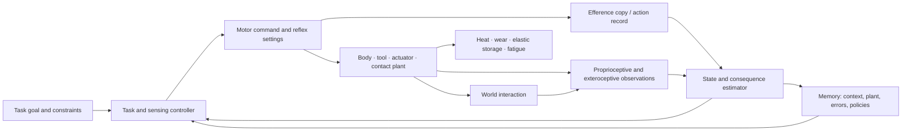

# Biomechanics, motor control, and embodied skill learning: primary-source audit

**Audit date:** 2026-08-05

**Scope:** morphological computation and passive dynamics; muscle synergies and
their identifiability; impedance and equilibrium-point control; motor
primitives; optimal feedback control; the uncontrolled-manifold framework;
internal and forward models; efference copy; adaptation, savings, and
interference; tendon elasticity; compliant actuation; reflex modulation; and
tool incorporation.

**Purpose:** identify transferable state transitions while separating physical
plant dynamics, measured behavior, neural mechanism, fitted representation,
and engineered analogue.

**Status:** research audit. Temporary `C-BMC-` claims are local to this file.
Nothing here is project evidence until it passes normal ledger review.

**Primary deduplication targets:**
[P-001 through P-013](../principle-registry.md#registry-summary),
[Candidates 001 through 020](../../experiments/candidates/README.md), the
[sensorimotor-grounding chapter](../../concept/20-sensorimotor-grounding.md),
[adaptive-materials audit](2026-08-05-adaptive-materials-and-self-assembly.md),
[neurodevelopment/global-control audit](2026-08-05-neurodevelopment-global-control.md),
[memory/replay audit](2026-08-05-memory-replay-forgetting.md), and
[engineering-analogue audit](2026-08-05-engineering-analogues.md).

## Executive finding

No new project principle or experiment candidate survives this audit.

The strongest results are important, but they normalize cleanly:

- passive mechanics, tendon elasticity, and compliant actuation move repeated
  work into geometry, inertia, constitutive response, and stored elastic
  energy: [P-010](../principle-registry.md#p-010--structural-offloading-and-co-design)
  and the physical null already recorded in
  [C-112](../claims.md#c-112)–[C-121](../claims.md#c-121);
- task-dependent feedback, impedance, reflex gain, and minimal intervention are
  instances of selective, local, uncertainty- and error-sensitive control:
  P-001, P-002, P-006, and P-007, with mature control and robotics nulls;
- fast/slow adaptation, savings, structural learning, and interference are
  state-estimation and memory-lifetime problems under contextual ambiguity:
  P-003, P-007, P-008, P-009, and P-012;
- efference copy is an action-conditioned observation or prediction input, not
  proof of a complete forward model: the sensorimotor chapter and
  [Candidate 014](../../experiments/candidates/014-versioned-observation-contract.md);
  and
- tool use can recalibrate reachable space, dynamics, body-related kinematics,
  and neural receptive fields without proving that a tool permanently becomes
  part of a unitary body representation.

The narrowest residual is therefore a **counterfactual controller–plant binding
test**, not a new mechanism. Every claimed embodied skill should bind its
controller, estimator, task Jacobian, compliance policy, and safety envelope to
a declared body/tool version. A body, payload, contact, or tool swap must then
invalidate or update only the state whose predictions fail. This sharpens:

- [Candidate 006 — reversible physical skill compilation](../../experiments/candidates/006-reversible-physical-skill.md)
  with body/controller factorials, passivity tests, and lifecycle energy;
- [Candidate 014](../../experiments/candidates/014-versioned-observation-contract.md)
  with a versioned plant and attachment contract, not observation metadata
  alone; and
- [Candidate 012 — latency-qualified authority](../../experiments/candidates/012-latency-qualified-authority.md)
  with contact-, delay-, and impedance-qualified action envelopes.

This residual is rejected as distinct if robust/adaptive model-predictive
control, operational-space impedance control, system identification plus gain
scheduling, or a bank of context-gated state-space models matches it under the
same sensors, actuators, perturbations, compute, and lifecycle energy.

## Inference firewall

| Evidence layer | What was measured | Permitted inference | Not permitted alone |
| --- | --- | --- | --- |
| mechanics | force, torque, displacement, strain, work, power, stiffness, damping, or contact | transfer function and energetic behavior inside the tested envelope | cognition, neural representation, optimality, or generalization |
| behavior | trajectory, endpoint error, adaptation, after-effect, transfer, or response latency | the manipulation changed scoped performance | neural implementation or unique control algorithm |
| EMG or neural correlate | muscle activity, spikes, fields, or receptive-field change | candidate low-dimensional structure or circuit involvement | identifiable neural primitive, causal necessity, or sufficiency |
| causal neural intervention | lesion, inactivation, stimulation, or pathway perturbation with sensory and motor controls | scoped circuit contribution | the complete algorithm or a species-general architecture |
| model fit | factorization, state-space fit, optimal-control fit, or estimated internal model | compact description and predictions on declared tests | ontological identity of fitted factors with neural modules |
| engineered system | robot, controller, actuator, or physical reservoir under declared tests | performance and cost of that implementation | biological identity or novelty from resemblance |

Four rules follow.

1. **Passive dynamics is the physical null.** Stable or economical movement
   without a high-rate controller is mechanics until an additional adaptive
   state transition is measured.
2. **Low rank is not neural modularity.** Task geometry, muscle moment arms,
   signal filtering, normalization, and factorization constraints can all
   produce low-dimensional EMG.
3. **Prediction is not uniquely an internal model.** Delayed robust feedback,
   state estimation, impedance, cached commands, and contextual policies can
   reproduce some behavioral signatures.
4. **Energy return is not energy creation.** Tendons and springs return a
   fraction of previously stored work; hysteresis, muscle force cost,
   actuation, sensing, stabilization, and fabrication remain charged.

## Terms that must remain distinct

| Term | Operational meaning here | Do not collapse into |
| --- | --- | --- |
| plant | body, tool, actuator, contact, and environment dynamics mapping input to state and force | controller or learned policy |
| passive dynamics | motion generated by inertia, gravity, compliance, damping, and contact without feedback actuation for that motion component | zero energy, intelligence, or adaptation |
| morphological computation | useful input–state–output transformation performed by physical dynamics or structure | cognition or cost-free computation |
| muscle synergy | specified low-dimensional model of muscle activation, force, or timing | identified spinal module or fixed innate primitive |
| motor primitive | reusable basis element in a declared command, dynamics, trajectory, or policy space | muscle synergy, reflex, or behavior in general |
| equilibrium point | state at which net generalized force is zero under a declared plant and command | complete movement trajectory or sole neural command |
| impedance | relation between motion and interaction force, including stiffness, damping, and inertia | position control, force control, or co-contraction alone |
| optimal feedback control | controller minimizing a stated expected cost under a stated dynamics/noise model | biological proof of globally optimal behavior |
| uncontrolled manifold | local set of elemental states that leave a declared task variable unchanged to first order | uncontrolled body or absence of feedback |
| internal model | learned or specified mapping of actions, states, and consequences | every adaptive policy or neural representation |
| forward model | predictor of next state or sensory consequence from current state and action | inverse controller or efference copy by itself |
| efference copy | internal copy or collateral signal related to a motor command | accurate prediction or sensory cancellation by itself |
| adaptation | performance change that compensates a perturbation | durable skill, savings, consolidation, or structural learning |
| savings | faster measured reacquisition under a declared relearning protocol | persistence of the original motor command |
| tool incorporation | tool-dependent change in control, estimation, reachable space, or body-related measure | permanent literal extension of the biological body |

## Closed-loop decomposition



The physical plant transforms every command before sensors observe its
consequences. A claim about “motor intelligence” must identify which arrow
changes, which state persists, and which physical null cannot explain the
result.

## Shared mathematical and accounting boundary

### Neuromechanical plant

For generalized coordinates $q\in\mathbb R^n$,

$$
M(q)\ddot q+C(q,\dot q)\dot q+g(q)+B(q)\dot q+
\tau_{\mathrm{pass}}(q,\dot q)=
\tau_m(u,q,\dot q)+\tau_{\mathrm{ext}}.
$$

- $q$ is joint angle in radians or translation in metres, declared per
  coordinate;
- $M$ has compatible entries such as kg·m² for rotational coordinates;
- $C\dot q$, $g$, $B\dot q$, $\tau_{\mathrm{pass}}$, $\tau_m$, and
  $\tau_{\mathrm{ext}}$ are generalized forces, typically N·m;
- $u$ is neural or actuator command in declared activation, current, voltage,
  pressure, or torque units.

The decomposition is model-dependent. Moving a term from “plant” into
“controller” does not change measured torque or energy.

### Mechanical energy and dissipation

$$
E_{\mathrm{mech}}=
\frac12\dot q^\top M(q)\dot q+V_g(q)+V_e(q),
\qquad
P_{\mathrm{diss}}=\dot q^\top B(q)\dot q.
$$

$E_{\mathrm{mech}}$, gravitational potential $V_g$, and elastic potential
$V_e$ are joules; $P_{\mathrm{diss}}$ is watts. Over interval $[0,T]$,

$$
W_m=\int_0^T \tau_m^\top\dot q\,dt,
\qquad
W_{\mathrm{ext}}=\int_0^T \tau_{\mathrm{ext}}^\top\dot q\,dt,
$$

with work in joules. Positive and negative work, regenerative recovery, and
metabolic or electrical conversion efficiency must be reported separately.

For locomotion, dimensionless net cost of transport is

$$
\mathrm{COT}=\frac{E_{\mathrm{net}}}{m g d},
$$

where $E_{\mathrm{net}}$ is net supplied energy in J, mass $m$ is kg,
$g$ is m·s$^{-2}$, and distance $d$ is m. The energy boundary must say whether
electronics, idle power, sensing, and recovery are included.

### Interaction impedance

Near a reference state,

$$
F=K_x(x^*-x)+D_x(\dot x^*-\dot x)+F_{\mathrm{ff}},
$$

where $F$ is N, $K_x$ is N·m$^{-1}$, $D_x$ is N·s·m$^{-1}$, position is m,
and feedforward force $F_{\mathrm{ff}}$ is N. Joint-space rotational stiffness
uses N·m·rad$^{-1}$ and damping N·m·s·rad$^{-1}$. A measured endpoint stiffness
ellipse is not itself an equilibrium-point trajectory, and a commanded
stiffness is not necessarily the rendered stiffness under delay and contact.

### Synergy factorization and non-identifiability

For $m$ measured muscles and $r$ components,

$$
a(t)=Wc(t)+\epsilon(t),
$$

where activation or normalized EMG $a(t)\in\mathbb R^m$, component weights
$W\in\mathbb R^{m\times r}$, activations $c(t)\in\mathbb R^r$, and residual
$\epsilon(t)$ are dimensionless unless calibrated force units are used.
Even with nonnegativity,

$$
Wc=(WD)(D^{-1}c)
$$

for positive diagonal $D$, so scale is not identified. Permutation is also
free, and more general alternative factorizations may fit within noise.
Musculoskeletal and task constraints can lower observed rank without a neural
group command.

### Task-relevant and task-equivalent variation

For task variable $y=h(q)$ with Jacobian $J_h=\partial h/\partial q$,

$$
\delta y\approx J_h\delta q,
\qquad
\mathcal N(J_h)=\{\delta q:J_h\delta q=0\}.
$$

If covariance $\Sigma_q$ is projected with $P_{\parallel}$ onto
$\mathcal N(J_h)$ and $P_{\perp}=I-P_{\parallel}$,

$$
V_{\parallel}=\operatorname{tr}(P_{\parallel}\Sigma_qP_{\parallel}^\top),
\qquad
V_{\perp}=\operatorname{tr}(P_{\perp}\Sigma_qP_{\perp}^\top).
$$

Both have squared coordinate units. Their ratio depends on coordinate scaling,
the selected task map, operating point, noise, and estimator. Greater variance
inside the null space supports task-structured variability, not a unique neural
controller.

### Feedback control and estimation null

For discrete state $x_t$, command $u_t$, and observation $y_t$,

$$
x_{t+1}=f_{\theta_p}(x_t,u_t)+w_t,
\qquad
y_t=h_{\theta_s}(x_t)+v_t.
$$

A standard finite-horizon controller minimizes

$$
J=\mathbb E\!\left[
\phi(x_T)+\sum_{t=0}^{T-1}
\left(\ell_{\mathrm{task}}(x_t)+u_t^\top R u_t\right)
\right].
$$

$x$ and $u$ retain their physical units; $R$ converts squared command units
to the declared objective scale. Cost weights are hypotheses, not measured
neural utilities. LQG, robust control, MPC, and constrained stochastic control
are mandatory nulls before claiming a biological optimization principle.

### Forward prediction, efference copy, and adaptation

An explicit predictor is

$$
\hat x_{t+1}=f_{\hat\theta_p}(\hat x_t,e_t),
\qquad
r_{t+1}=y_{t+1}-h_{\hat\theta_s}(\hat x_{t+1}),
$$

where $e_t$ is an action-related signal and residual $r$ has observation units.
Efference copy means $e_t$ exists; a forward-model claim additionally requires
prediction with calibrated residuals and a perturbation that separates the
prediction from sensory feedback or memorized policy.

A conventional two-rate adaptation null is

$$
z^f_{n+1}=a_fz^f_n+b_fe_n,
\qquad
z^s_{n+1}=a_sz^s_n+b_se_n,
\qquad
u_n=z^f_n+z^s_n,
$$

with $0\leq a_f<a_s\leq1$ and often $b_f>b_s\geq0$. Compensation $z$ and error
$e$ carry the task's angular, force, or displacement units; $a$ is
dimensionless and $b$ converts error to compensation. Spontaneous recovery,
savings-like curves, and anterograde interference can arise from latent-state
dynamics without a distinct biological memory store.

### Tendon and series-elastic storage

For an approximately linear elastic element,

$$
F_t=k_t\Delta l,
\qquad
E_t=\int_0^{\Delta l}F_t(l)\,dl\approx\frac12k_t(\Delta l)^2,
$$

where force $F_t$ is N, stiffness $k_t$ is N·m$^{-1}$, extension is m, and
stored energy $E_t$ is J. Cycle efficiency is

$$
\eta_{\mathrm{return}}=
\frac{E_{\mathrm{returned}}}{E_{\mathrm{stored}}},
\qquad 0\leq\eta_{\mathrm{return}}\leq1,
$$

after defining preload, hysteresis, and measurement boundary. Elastic return
can reduce active fibre work while force maintenance and activation still cost
energy.

### Lifecycle accounting

For $N$ qualified uses,

$$
E_{\mathrm{life}}=E_{\mathrm{design}}+E_{\mathrm{fabrication}}+
E_{\mathrm{training}}+
\sum_{i=1}^{N}\left(E_{\mathrm{act},i}+E_{\mathrm{sense},i}+
E_{\mathrm{compute},i}+E_{\mathrm{loss},i}+E_{\mathrm{maint},i}
+E_{\mathrm{reset},i}\right)+E_{\mathrm{retire}}.
$$

Every energy term is J over one named organism, robot, device, node, or
facility boundary. Also report mass kg, peak force N, peak torque N·m, response
and settling time s, bandwidth Hz, error in task units, fatigue cycles,
calibration time s, and failure probability. A single scalar objective may be
used for optimization, but the raw outcome vector must remain visible.

## Mechanism map and initial disposition

| ID | Scoped mechanism | Strongest evidence | Mature null | Project disposition |
| --- | --- | --- | --- | --- |
| BMC-01 | geometry, inertia, compliance, damping, and contact generate useful motion | passive walkers and physical bodies | passive mechanics, underactuated dynamics, trajectory optimization | [C-112](../claims.md#c-112)/P-010; no cognition |
| BMC-02 | low-dimensional muscle activation or spinal output | stimulation, EMG, force, factorization | NMF/PCA/ICA plus biomechanics and task constraints | disputed neural identity |
| BMC-03 | tune stiffness and damping to interaction | perturbation and co-contraction experiments | impedance/admittance control, gain scheduling | P-006/P-007 |
| BMC-04 | compose reusable movement or dynamics bases | behavioral generalization and factor models | basis-function adaptive control, DMPs, mixture policies | representation not uniquely identified |
| BMC-05 | correct only task-relevant deviations | task-dependent perturbation response | stochastic OFC, MPC, robust control | P-001/P-007 |
| BMC-06 | allow variability in goal-equivalent directions | covariance relative to task Jacobian | constrained covariance and null-space control | descriptive test, not architecture |
| BMC-07 | predict action consequences | psychophysics and force-field adaptation | state observer, system identification, MPC | sensorimotor chapter/Candidate 014 |
| BMC-08 | use action-related copies to distinguish reafference | identified circuits and pathway perturbation | known-input observer and disturbance cancellation | action-conditioned observation |
| BMC-09 | update compensation with multiple rates and contexts | perturbation, washout, relearning, interference | multi-rate/contextual state-space models | P-003/P-012 |
| BMC-10 | extract reusable perturbation structure | transfer after varied task exposure | hierarchical Bayes, meta-learning, adaptive control | P-004/P-010/P-012 |
| BMC-11 | store and return elastic energy | force–length and work-loop measurements | springs, tuned compliance, regenerative actuation | physical null/P-010 |
| BMC-12 | modulate reflex pathways by phase and task | nerve stimulation, mechanical perturbation, cortical intervention | local feedback plus gain scheduling | P-002/P-006/P-007 |
| BMC-13 | recalibrate control and body-related state for tools | receptive fields, after-effects, transfer | online system identification and context-gated plant models | Candidate 014 refinement |

## 1. Morphological computation and passive dynamics

McGeer's passive walker demonstrated a stable gait down a shallow slope without
an active gait controller, showing that a mechanical design can possess a
task-specific limit cycle
([McGeer 1990](https://doi.org/10.1177/027836499000900206)). Collins and
colleagues then built level-ground walkers that substituted small active power
sources for gravitational input and reported lower energy use than comparison
robots of that period
([Collins et al. 2005](https://doi.org/10.1126/science.1107799)). These are
strong demonstrations that body dynamics can reduce active control and work in
a bounded gait regime. They do not show that stability is free, that the design
generalizes across terrain and payload, or that human locomotion uses the same
controller.

Compliant mass–spring bodies can implement nonlinear continuous-time
transformations with a trained readout
([Hauser et al. 2012](https://doi.org/10.1007/s00422-012-0471-0)). Measured
transients of a silicone arm have also supported fading-memory tasks and
closed-loop control
([Nakajima et al. 2014](https://doi.org/10.1098/rsif.2014.0437)). The body in
those systems is a physical reservoir: input energy, deformation state,
sensors, sampling, readout, damping, and reset remain in the system.

**Physical null.** Optimize geometry, passive elements, contact, and a fixed or
gain-scheduled controller under the same design envelope. A morphology claim
must beat the best co-designed passive/active system, not a deliberately rigid
body with an untuned controller.

**Failure modes.** Narrow attraction basin; sensitivity to slope, load, wear,
temperature, or mounting; hidden external stabilization; costly fabrication;
and an active controller that quietly performs the claimed computation.

**Deduplication.** This is already
[adaptive-materials §2](2026-08-05-adaptive-materials-and-self-assembly.md#2-morphological-computation-and-passive-dynamics),
[C-112](../claims.md#c-112)/[C-113](../claims.md#c-113), P-006, and P-010.
No new invariant remains.

## 2. Muscle synergies and the identifiability dispute

Focal spinal stimulation in frogs produced force fields and muscle-activation
patterns consistent with reusable spinal modules
([Bizzi, Mussa-Ivaldi, and Giszter 1991](https://doi.org/10.1126/science.1857964)).
Focal NMDA iontophoresis in frog spinal cord yielded EMG patterns described by
a limited set of extracted synergies
([Saltiel et al. 2001](https://doi.org/10.1152/jn.2001.85.2.605)). Natural frog
kicks were likewise reconstructed with combinations of time-varying components
([d'Avella, Saltiel, and Bizzi 2003](https://doi.org/10.1038/nn1010)), and cat
postural responses showed a limited factorization linked to endpoint force
([Ting and Macpherson 2005](https://doi.org/10.1152/jn.00681.2004)). These
findings support low-dimensional regularity and candidate modular organization
in the studied preparations.

They do not identify a unique neural basis. Factor-recovery quality changes
with noise, correlation, algorithm, and rank criterion
([Tresch, Cheung, and d'Avella 2006](https://doi.org/10.1152/jn.00222.2005)).
Cadaveric measurements and musculoskeletal simulation showed that limb
biomechanics plus independent commands resisting muscle-length change can
produce low-dimensional EMG without neural grouping
([Kutch and Valero-Cuevas 2012](https://doi.org/10.1371/journal.pcbi.1002434)).
Task constraints can also make extracted components difficult to recover or
interpret
([Steele, Tresch, and Perreault 2015](https://doi.org/10.1152/jn.00769.2013)).

**Strongest null stack.** NMF, PCA, ICA, and probabilistic factor analysis;
musculoskeletal moment-arm and task-feasibility models; independent muscle
controllers; matched low-rank policy networks; and factor recovery from
synthetic data with known ground truth.

**Causal requirement.** A neural-synergy claim should perturb a proposed module
while holding task mechanics constant, predict a selective deficit and
cross-task reuse, and recover the same module with out-of-sample force and EMG.
Reconstruction variance alone is insufficient.

## 3. Impedance and equilibrium-point control

Hogan formalized antagonist coactivation as one means of adapting mechanical
impedance
([Hogan 1984](https://doi.org/10.1109/TAC.1984.1103644)). Human arm
perturbations revealed approximately spring-like endpoint behavior around held
postures and quantified the stiffness matrix
([Mussa-Ivaldi, Hogan, and Bizzi 1985](https://doi.org/10.1523/JNEUROSCI.05-10-02732.1985)).
In unstable force fields, people changed stiffness geometry in a task-relevant
fashion
([Burdet et al. 2001](https://doi.org/10.1038/35106566)). These results support
adaptive impedance, not one universal equilibrium-point trajectory.

Measured stiffness during multijoint movement yielded an estimated equilibrium
trajectory inconsistent with the claim that the brain sends only an
equilibrium-point trajectory resembling actual motion
([Gomi and Kawato 1996](https://doi.org/10.1126/science.272.5258.117)). The
negative result rejects a strong formulation, not all referent-control or
impedance models.

Robotics already supplies explicit impedance control for coupled interaction
([Hogan 1985](https://doi.org/10.1115/1.3140702)) and operational-space
motion/force control
([Khatib 1987](https://doi.org/10.1109/JRA.1987.1087068)). Adaptive and robust
variants estimate changing plant or payload parameters. Any biological
translation must beat these at equal contact stability, tracking, force,
latency, actuator saturation, and energy.

**Failure modes.** Co-contraction increases stiffness but also metabolic or
electrical cost; rendered impedance differs from command under delay and
saturation; high stiffness can amplify impact; and equilibrium inference is
sensitive to unmodeled dynamics.

## 4. Motor primitives, optimal feedback control, and the uncontrolled manifold

Minimum-jerk optimization reproduced several kinematic regularities of planar
reaching
([Flash and Hogan 1985](https://doi.org/10.1523/JNEUROSCI.05-07-01688.1985)).
Force-field learning has been described as adaptive combination of
velocity-tuned primitives
([Thoroughman and Shadmehr 2000](https://doi.org/10.1038/35037588)). These are
useful predictive representations, but smoothness and generalization kernels do
not uniquely identify stored biological basis functions.

Stochastic optimal feedback control explains task-dependent correction and the
minimal-intervention pattern: correct deviations that threaten the goal while
tolerating task-equivalent variation
([Todorov and Jordan 2002](https://doi.org/10.1038/nn963)). Human perturbation
experiments found flexible changes consistent with predicted stability–accuracy
trade-offs
([Liu and Todorov 2007](https://doi.org/10.1523/JNEUROSCI.1110-06.2007)).
The theory remains conditional on dynamics, observations, cost, constraints,
and noise; many cost functions can rationalize the same behavior.

The uncontrolled-manifold method operationalizes whether covariance lies more
along goal-equivalent directions than goal-changing directions
([Scholz and Schöner 1999](https://doi.org/10.1007/s002210050738)). It is a
task-relative covariance test, not proof that the nervous system explicitly
computes a null-space projector.

**Strongest null stack.** Trajectory optimization; LQG/iLQR; robust and
stochastic MPC; operational-space and null-space control; learned policies with
the same observation/action state; dynamical movement primitives
([Ijspeert et al. 2013](https://doi.org/10.1162/NECO_a_00393)); and direct
high-dimensional policies. Equalize model capacity and optimization effort.

**Inference boundary.** “Primitive,” “synergy,” and “uncontrolled manifold”
refer to different factorizations: command basis, covariation, and task
geometry. They must not be merged into one biological module.

## 5. Internal models and efference copy

In a dark, force-perturbed hand-localization task, temporal error propagation
supported an internal predictive model used in state estimation
([Wolpert, Ghahramani, and Jordan 1995](https://doi.org/10.1126/science.7569931)).
Humans adapting to velocity-dependent fields showed after-effects and
generalization consistent with an acquired representation of interaction
dynamics
([Shadmehr and Mussa-Ivaldi 1994](https://doi.org/10.1523/JNEUROSCI.14-05-03208.1994)).
These are strong behavioral-model results, but do not uniquely locate a forward
model or distinguish every predictor/controller decomposition.

In mormyrid electric fish, an action-related signal is modified by reafferent
input, providing an identified example of adaptive cancellation
([Bell 1981](https://doi.org/10.1126/science.7291985)). In macaques, perturbing a
superior-colliculus–thalamus–frontal-eye-field pathway impaired presaccadic
visual updating, supporting a causal corollary-discharge route
([Sommer and Wurtz 2006](https://doi.org/10.1038/nature05279)). These establish
action-related internal signals and scoped circuit function, not a universal
copy format or complete sensory predictor.

**Strongest null stack.** Known-input Kalman or particle observer; delay-aware
robust feedback; disturbance observer; predictive-state representation;
system identification plus MPC; cached command/response policy; and recurrent
state model trained only on observation/action histories.

**Decisive manipulation.** Independently perturb commanded action, realized
motion, and sensory consequence. A forward model should predict the consequence
of the command when feedback is delayed, update when plant dynamics change, and
preserve calibrated uncertainty. An efference-only controller, sensory-only
observer, and full predictor must make different held-out predictions.

## 6. Adaptation, savings, interference, and structural learning

Force-field adaptation and after-effects demonstrate learned compensation, not
one memory architecture. Early work reported time-dependent protection of one
motor memory from an opposing task
([Brashers-Krug, Shadmehr, and Bizzi 1996](https://doi.org/10.1038/382252a0)).
Visuomotor work later showed that apparent consolidation depends on washout,
training amount, and separating retrograde from anterograde interference
([Krakauer, Ghez, and Ghilardi 2005](https://doi.org/10.1523/JNEUROSCI.4218-04.2005)).
The protocol and retrieval context are therefore part of the claim.

A two-rate state-space model explains adaptation, rebound, spontaneous
recovery, and interference patterns
([Smith, Ghazizadeh, and Shadmehr 2006](https://doi.org/10.1371/journal.pbio.0040179)).
Error-history-dependent learning rates provide another account of savings and
meta-learning
([Herzfeld et al. 2014](https://doi.org/10.1126/science.1253138)). In
visuomotor rotation, explicit action selection can dominate measured savings
([Morehead et al. 2015](https://doi.org/10.1523/JNEUROSCI.1046-15.2015)).
“Savings” therefore cannot be assigned to implicit motor memory without process
separation.

Exposure to varied perturbations can improve later adaptation in a manner
consistent with learning task structure
([Braun et al. 2009](https://doi.org/10.1016/j.cub.2009.01.036)). The mature
nulls are hierarchical Bayesian learning, meta-learning, contextual mixture
models, adaptive control, and basis-function reuse.

**Deduplication.** Multi-rate memory and context protection belong to P-003,
P-008, P-009, and P-012; error-dependent allocation belongs to P-007;
structural reuse belongs to P-004/P-010. The
[memory audit](2026-08-05-memory-replay-forgetting.md#deduplication-result)
already rejects a uniform append-and-consolidate story.

## 7. Tendon elasticity and compliant actuation

Elastic tissues store and return strain energy in running, jumping, and flight
under species- and tissue-specific conditions
([Alexander and Bennet-Clark 1977](https://doi.org/10.1038/265114a0)). Human
foot-arch measurements quantified spring-like storage and return
([Ker et al. 1987](https://doi.org/10.1038/325147a0)). Direct turkey
muscle–tendon measurements showed active fibres producing force with little
shortening while tendon and muscle elasticity supplied cyclic work
([Roberts et al. 1997](https://doi.org/10.1126/science.275.5303.1113)).

The transferable lesson is physical: separate force production from work and
use elasticity where the task repeats. It is not evidence that tendons compute
an abstract policy. Resonance narrows bandwidth; hysteresis loses energy;
preload and force maintenance cost energy; and impacts, fatigue, and variable
terrain can reverse the benefit.

Series-elastic actuators deliberately place a spring between motor and load to
improve force control, shock tolerance, and interaction compliance
([Pratt and Williamson 1995](https://doi.org/10.1109/IROS.1995.525827)). This is
a mandatory engineering null. Compare rigid transmission, fixed spring,
variable stiffness, active impedance, and regenerative drive at equal payload,
force bandwidth, tracking, peak impact, mass, and lifecycle energy.

**Deduplication.** Tendon and compliant-actuator results refine Candidate 006's
Track A. They do not add a state transition beyond P-010.

## 8. Reflex modulation and fast feedback

In decerebrate cats, stretch reflex action compensated nonlinear muscle
mechanics and regulated net stiffness over a bounded force range
([Nichols and Houk 1976](https://doi.org/10.1152/jn.1976.39.1.119)). In humans,
soleus H-reflex amplitude changes across walking phase and differs from standing
([Capaday and Stein 1986](https://doi.org/10.1523/JNEUROSCI.06-05-01308.1986));
cutaneous responses can even reverse sign with gait phase
([Yang and Stein 1990](https://doi.org/10.1152/jn.1990.63.5.1109)). Reflex is
therefore a context- and phase-conditioned pathway, not one immutable arc.

Multi-joint perturbation experiments in monkeys and humans implicated primary
motor cortex in integrating shoulder and elbow information for feedback near
50 ms
([Pruszynski et al. 2011](https://doi.org/10.1038/nature10436)). Fast feedback
spans spinal, brainstem, cortical, mechanical, and task-dependent components;
latency alone does not identify the pathway.

**Strongest null stack.** Local PD/impedance control; gain scheduling by phase,
contact, and state; disturbance observers; finite-state gait controllers;
hierarchical MPC with a fast safety loop; and robust control under delay.

**Project boundary.** P-002 owns local fast paths, P-006 owns regulation, P-007
owns error-sensitive effort, Candidate 002 owns low-bandwidth contextual gain,
and Candidate 012 owns admissible action. A “reflex layer” is not new unless it
shows a state transition not expressible by this bundle.

## 9. Tool incorporation and plant-version binding

After rake use, macaque postcentral neurons showed expanded visual receptive
fields around the tool-reachable region
([Iriki, Tanaka, and Iwamura 1996](https://doi.org/10.1097/00001756-199610020-00010)).
Human tool-use experiments reported after-effects in arm kinematics interpreted
as body-schema updating
([Cardinali et al. 2009](https://doi.org/10.1016/j.cub.2009.05.009)). These
support tool-dependent recalibration of neural and behavioral measures, but the
measure determines the scope: reachable space, peripersonal attention,
kinematics, dynamics, and body estimate are not interchangeable.

Force-field transfer experiments show that error schedule can influence whether
learning generalizes as if attributed to a tool or to the arm
([Kluzik et al. 2008](https://doi.org/10.1152/jn.90334.2008)). Early adaptation
can combine increased impedance with an emerging internal model
([Milner and Franklin 2005](https://doi.org/10.1113/jphysiol.2005.090449)).
The system need not choose one monolithic representation.

**Narrow residual test.** Let plant contract

$$
\Pi=(\nu_b,\nu_t,\nu_a,\theta_p,\mathcal C,\mathcal O,
\mathcal E_K,\mathcal S),
$$

where $\nu_b$, $\nu_t$, and $\nu_a$ are body, tool, and attachment versions;
$\theta_p$ are plant parameters; $\mathcal C$ and $\mathcal O$ are declared
controllable and observable subspaces; $\mathcal E_K$ is the qualified
impedance/passivity envelope; and $\mathcal S$ is sensor support and latency.
On a swap, identify which fields changed and invalidate only dependent
predictors, policies, and compiled physical paths.

This is a useful refinement of the
[versioned observation contract](../../concept/20-sensorimotor-grounding.md#observation-is-a-versioned-contract)
and Candidate 006. It is not a new candidate unless dependency-aware partial
invalidation beats full reset, unversioned online adaptation, contextual model
banks, and adaptive MPC across held-out body/tool combinations.

## 10. Explicit deduplication against the principle registry

| Existing principle | What this audit contributes | Disposition |
| --- | --- | --- |
| [P-001 — selective allocation](../principle-registry.md#p-001--selective-allocation) | task-relevant feedback, selective co-contraction, and phase-dependent reflex gain | implementation evidence; no new invariant |
| [P-002 — local autonomy with exception escalation](../principle-registry.md#p-002--local-autonomy-with-exception-escalation) | passive mechanics and spinal feedback can absorb bounded disturbances before slower pathways respond | established instance; local mechanics are not an autonomous cognitive agent |
| [P-003 — temporary trace before commitment](../principle-registry.md#p-003--temporary-trace-before-commitment) | fast adaptation and transient impedance can precede slower retention | timescale analogy only; the two-rate fit does not identify a physical trace |
| [P-004 — diversity, selection, and protection](../principle-registry.md#p-004--diversity-selection-and-protection) | candidate primitives or strategies may be recombined across tasks | ordinary basis selection or structural learning unless generation, selection, and retention are separately observed |
| [P-005 — use-dependent topology](../principle-registry.md#p-005--use-dependent-topology) | long-term musculoskeletal remodeling could change a plant graph | not established by the short-timescale studies audited here |
| [P-006 — homeostatic negative feedback](../principle-registry.md#p-006--homeostatic-negative-feedback) | impedance, stretch feedback, state feedback, and error-based adaptation | direct established examples; stability margins remain mechanism specific |
| [P-007 — prediction-error allocation](../principle-registry.md#p-007--prediction-error-allocation) | sensory-prediction error, task-relevant correction, and error-history-dependent learning | direct overlap; prediction error is not proof of one neural implementation |
| [P-008 — compartmentalized interaction](../principle-registry.md#p-008--compartmentalized-interaction) | joints, muscles, spinal circuits, and cortical loops form nested physical/control compartments | architectural description; no new boundary-changing mechanism |
| [P-009 — maintenance plane](../principle-registry.md#p-009--maintenance-plane) | calibration, health estimation, and controller reset after a plant change | Candidate 006 lifecycle refinement; not evidenced as a separate biological plane here |
| [P-010 — structural offloading and co-design](../principle-registry.md#p-010--structural-offloading-and-co-design) | passive dynamics, tendon elasticity, compliance, and morphology reduce some active-control work | strongest direct overlap; all savings require a declared physical and lifecycle boundary |
| [P-011 — transient communication coalitions](../principle-registry.md#p-011--transient-communication-coalitions) | phase- and task-dependent spinal/cortical participation | compatible but no evidence here that coalition formation is the irreducible operation |
| [P-012 — memory matched to information lifetime](../principle-registry.md#p-012--memory-matched-to-information-lifetime) | fast/slow adaptation and structural learning span distinct retention scales | model-level overlap; timescale separation alone does not locate memory media |
| [P-013 — externalized shared state](../principle-registry.md#p-013--externalized-shared-state) | tools and compliant environments alter the state through which action is coordinated | an external plant is not automatically a shared memory or blackboard |

## 11. Explicit deduplication against held candidates

| Candidate | Contact with this audit | Required refinement or rejection boundary |
| --- | --- | --- |
| [001 — adaptive topology](../../experiments/candidates/001-adaptive-topology.md) | morphology or attachment can alter the active plant graph | parameter adaptation is not topology change; require a changed graph and charge transition safety and fabrication |
| [002 — multiscale context broadcast](../../experiments/candidates/002-multiscale-context-broadcast.md) | gait phase and task context schedule reflex and impedance gains | a receiver or gain schedule is sufficient until autonomous phase state beats timers, recurrent gating, and supervisory control |
| [003 — recovery dynamics as fragility sensing](../../experiments/candidates/003-recovery-dynamics-fragility.md) | stiffness, damping, and recovery time report local stability | retain only mechanism-qualified indicators; passive return rate is not a universal fragility coordinate |
| [004 — closed endogenous curriculum](../../experiments/candidates/004-closed-endogenous-curriculum.md) | task variation can induce transfer or structural learning | generate–test–retain stages and total training work must be observed separately |
| [005 — severity-ordered containment](../../experiments/candidates/005-severity-ordered-containment.md) | a controller may stiffen, limit authority, reset, or fall back after damage | ordinary fault detection, safe stop, robust control, or repair policy remains the null |
| [006 — reversible physical skill](../../experiments/candidates/006-reversible-physical-skill.md) | passive dynamics, tendons, and compliant actuators instantiate physical offloading | add body/controller factorials, passivity and bandwidth qualifications, health probes, and lifecycle energy |
| [007 — endogenous-observation surveillance](../../experiments/candidates/007-endogenous-observation-surveillance.md) | action changes contact, viewpoint, and proprioceptive evidence through the plant | already owned by sensorimotor grounding and Candidate 014; no new surveillance mechanism |
| [008 — contestable modular allocation](../../experiments/candidates/008-contestable-modular-allocation.md) | motor modules compete only metaphorically in these studies | not applicable without persistent strategic modules, private information, and real opportunity cost |
| [009 — graded assurance envelopes](../../experiments/candidates/009-graded-assurance-envelopes.md) | plant version and impedance bounds can invalidate a certification | use existing version/grade invalidation; biomechanics adds no new assurance state transition |
| [010 — reset-coupled staged verification](../../experiments/candidates/010-reset-coupled-staged-verification.md) | exploration can precede physical commitment | ordinary system identification or staged control; no distinct discriminatory escape-and-reset mechanism established |
| [011 — dual-loop operational assurance](../../experiments/candidates/011-dual-loop-operational-assurance.md) | deployment feedback and later controller revision can be separated | compatible lifecycle pattern; no new incident-learning interface |
| [012 — latency-qualified authority](../../experiments/candidates/012-latency-qualified-authority.md) | contact state, delay, model confidence, and impedance bound safe action | refine its authority envelope with plant contract $\Pi$; do not let a controller self-certify |
| [013 — deficit–capability routing](../../experiments/candidates/013-deficit-capability-routing.md) | muscle recruitment allocates force capacity to deficits | superficial overlap; ordinary constrained control and redundancy resolution suffice |
| [014 — versioned observation contract](../../experiments/candidates/014-versioned-observation-contract.md) | sensor support and plant/tool identity determine what observations mean | add versioned body, tool, attachment, controllability, observability, and passivity fields |
| [015 — repairable conventions](../../experiments/candidates/015-versioned-repairable-conventions.md) | none beyond generic adaptation | no convention formation, semantic uptake, or repair protocol is established |
| [016 — conflict-bounded unit transition](../../experiments/candidates/016-conflict-bounded-unit-transition.md) | none | no collective heredity or level-of-selection transition is at issue |
| [017 — semantic compaction](../../experiments/candidates/017-contract-preserving-semantic-compaction.md) | primitives compress trajectories only in a statistical sense | low rank is not contract-preserving semantic compaction |
| [018 — value/reconstructability tiering](../../experiments/candidates/018-value-reconstructability-aware-tiering.md) | none beyond storing motor state on multiple timescales | P-012 and ordinary memory hierarchy suffice |
| [019 — audited cumulative inheritance](../../experiments/candidates/019-audited-cumulative-inheritance.md) | skill transfer may accumulate across tasks | no learner turnover, audited inheritance, or cross-generation capability gain is demonstrated |
| [020 — constitutional control plane](../../experiments/candidates/020-constitutional-control-plane.md) | hierarchical control is only a control-theory homonym | not applicable without asymmetric information, conflicting interests, authorized standing, or governance capture |

## 12. Adjacent-audit deduplication

| Existing document | Boundary retained here |
| --- | --- |
| [Sensorimotor grounding](../../concept/20-sensorimotor-grounding.md) | owns action-conditioned observation and world interaction; this audit adds a versioned physical plant contract |
| [Adaptive materials and self-assembly](2026-08-05-adaptive-materials-and-self-assembly.md) | owns material adaptation and self-assembly; this audit uses fixed or deliberately variable compliance as the plant |
| [Neurodevelopment and global control](2026-08-05-neurodevelopment-global-control.md) | owns development, trophic allocation, and global control; short-timescale motor adaptation is not neurogenesis |
| [Memory, replay, and forgetting](2026-08-05-memory-replay-forgetting.md) | owns memory lifecycle and replay; this audit scopes online adaptation, interference, savings, and plant-indexed retention |
| [Engineering analogues](2026-08-05-engineering-analogues.md) | owns generic robust/adaptive control, routing, scheduling, and compilation nulls; they remain mandatory comparators |

## 13. Strongest mature null suite

Any proposed biologically inspired motor primitive must tie or beat this suite
under equal sensing, calibration data, actuator mass, controller state,
latency, compute, peak power, and safety margin:

1. a correctly identified passive plant with no learned controller;
2. inverse dynamics plus PD or impedance feedback;
3. gain scheduling or a finite-state controller keyed to contact and phase;
4. robust $H_\infty$ or passivity-based control under declared uncertainty;
5. adaptive control with online parameter estimation;
6. model-predictive control with constraints and disturbance estimation;
7. task-space or operational-space control with redundancy resolution;
8. learned basis functions, dynamic movement primitives, and matched low-rank
   policies;
9. model banks or mixture-of-experts indexed by body, tool, and context; and
10. full reset and retraining after a plant change.

The statistical nulls are equally important: unconstrained PCA/ICA/NMF,
biomechanically constrained surrogate data, shuffled phase/context labels,
matched smoothness, and explicit re-aiming reports. A mechanistic claim fails
if its signature survives in these nulls.

## 14. Equal-budget falsification program

### Common accounting contract

Every arm receives equal external demonstrations, environment interactions,
calibration time, sensors, actuator envelope, wall-clock opportunity, and
hyperparameter-search budget. Report at least:

$$
J_{\mathrm{life}}=
E_{\mathrm{fab}}+E_{\mathrm{cal}}+E_{\mathrm{train}}+E_{\mathrm{infer}}
+E_{\mathrm{act}}+E_{\mathrm{maint}}+E_{\mathrm{reset}}+E_{\mathrm{dispose}},
$$

with every $E$ in joules; task loss; failures per trial; peak force in newtons;
settling time in seconds; tracking bandwidth in hertz; latency in seconds;
mass in kilograms; and useful mechanical work in joules. Give confidence
intervals across plant instances and random seeds. Do not count recovered
elastic energy as negative compute energy, and do not omit failed trials,
standby, sensing, transduction, or fabrication.

### Experiment A — passive physical null

Cross rigid/compliant morphology with controller off, PD, impedance, and MPC on
matched downhill walking and level-ground perturbation tasks. The hypothesis
survives only if controller–body co-design improves the quality–risk–lifecycle
energy frontier beyond the best separately tuned pair. It fails if passive
dynamics explains the apparent intelligence or if benefit disappears off the
tuned gait/terrain.

### Experiment B — synergy identifiability

Collect EMG, force, kinematics, and musculoskeletal geometry across tasks, then
compare NMF/PCA/ICA factors with factors recovered from cadaveric or simulated
biomechanics driven by independent commands. Perturb putative components while
matching endpoint force. A neural-synergy claim survives only if components are
stable under algorithm choice, predict unseen perturbations, and cannot be
generated by plant constraints alone.

### Experiment C — impedance versus internal prediction

Apply matched stable, unstable, curl-field, and catch perturbations. Compare
fixed impedance, time-varying co-contraction, adaptive impedance, forward-model
control, robust control, and MPC. Separate stiffness, damping, feedforward
compensation, metabolic/electrical cost, and after-effects. Reject a dedicated
internal-model account if impedance or disturbance estimation ties it.

### Experiment D — primitives, OFC, and UCM

Train minimum-jerk, dynamic movement primitive, low-rank policy, OFC, and
task-space MPC baselines on the same reaches. Change cost, redundancy, delay,
and perturbation direction out of distribution. A reusable primitive survives
only if it transfers with less total data/work and retains task success beyond
matched smoothness and optimal-control fits; low-dimensional trajectories alone
are insufficient.

### Experiment E — efference copy and delayed sensing

Factorial-cross motor-command access, delayed/corrupted sensory feedback, a
learned forward predictor, a disturbance observer, and history-only prediction.
Use unexpected command cancellation and exogenous matched motion. A distinct
action-copy channel survives only if it predicts sensory consequences before
feedback, distinguishes self-generated from imposed motion, and adds value
beyond controller state and delayed observations.

### Experiment F — adaptation, savings, and interference

Use ABA, ABC, washout, explicit-report, and error-clamp schedules across body,
tool, and coordinate-frame changes. Compare one-state, two-state, contextual
inference, error-memory, model-bank, and full-retraining baselines. Charge all
practice. A plant-indexed reusable state survives only if savings remain after
explicit strategy is removed and selective interference follows preregistered
plant-contract dependencies.

### Experiment G — elastic and compliant actuation

Compare rigid, fixed-series-elastic, variable-stiffness, and regenerative
actuation at equal total mass, motor/drive efficiency, payload, force bandwidth,
tracking error, peak impact, and safety. Sweep cadence and terrain. Claim an
efficiency gain only from metered wall energy and lifecycle accounting, with
hysteresis, preload, force maintenance, added mass, and retuning included.

### Experiment H — reflex modulation under latency

Compare local mechanical feedback, fixed PD, phase-scheduled gains, learned
reflex gates, disturbance observers, and hierarchical MPC under contact changes,
delay, sensor dropout, and adversarial phase errors. The biological translation
survives only if a local pathway expands the certified disturbance/latency
envelope at equal false-trigger and reserve cost; response latency alone does
not identify the mechanism.

### Experiment I — tool incorporation and selective invalidation

Train on a factorial family of bodies, tools, attachments, sensor delays, and
impedance envelopes. Swap one field at a time and compare full reset,
unversioned adaptation, model banks, adaptive MPC, and plant-contract selective
invalidation. The residual survives only if declared dependencies predict both
safe reuse and necessary invalidation on held-out combinations, lowering
recalibration work without hidden unsafe transfer.

## 15. Temporary claim ledger

These IDs are audit-local. They are not additions to `research/claims.md`.

| ID | Scoped claim | Status | Primary support and qualification | Existing owner |
| --- | --- | --- | --- | --- |
| C-BMC-01 | An unpowered physical walker can exhibit a stable human-like gait on a suitable slope. | established, scoped | McGeer 1990; narrow morphology, slope, and basin of attraction | P-010 |
| C-BMC-02 | Adding small actuation and control to passive-dynamic designs can yield low measured transport cost in particular robots. | established, scoped | Collins et al. 2005; does not establish lifecycle superiority | P-010; Candidate 006 |
| C-BMC-03 | A compliant body can supply fading memory usable by a trained readout. | established, scoped | Nakajima et al. 2014; reservoir capacity is task/body/bandwidth dependent | P-010; Candidate 006 |
| C-BMC-04 | Focal spinal stimulation in frogs can evoke fields decomposable into combinations resembling behavioral fields. | established, scoped | Bizzi et al. 1991; Saltiel et al. 2001 | P-008/P-010 |
| C-BMC-05 | Natural EMG datasets can be approximated with low-dimensional nonnegative components. | established, scoped | d'Avella et al. 2003; Ting and Macpherson 2005 | P-001/P-010 |
| C-BMC-06 | Recovered synergy number and composition depend on factorization method and data conditions. | established | Tresch et al. 2006 | statistical null |
| C-BMC-07 | Biomechanical task constraints can generate apparent low-dimensional muscle structure without low-dimensional neural commands. | established counterexample | Kutch and Valero-Cuevas 2012; Steele et al. 2015 | physical null/P-010 |
| C-BMC-08 | Human arm endpoint behavior near posture can be described by a direction-dependent stiffness field. | established, scoped | Mussa-Ivaldi et al. 1985 | P-006 |
| C-BMC-09 | Humans can increase arm impedance selectively to stabilize unstable task dynamics. | established, scoped | Burdet et al. 2001 | P-001/P-006 |
| C-BMC-10 | Strong equilibrium-point-only accounts are insufficient for at least some multi-joint movements. | established challenge | Gomi and Kawato 1996; does not reject all referent-coordinate models | conventional null boundary |
| C-BMC-11 | Minimum-jerk and movement-primitive models can compactly reproduce classes of smooth movement. | established model fit | Flash and Hogan 1985; Thoroughman and Shadmehr 2000; Ijspeert et al. 2013 | P-010 |
| C-BMC-12 | Optimal-feedback-control models predict selective correction of task-relevant deviations. | established model prediction; plausible biological account | Todorov and Jordan 2002; Liu and Todorov 2007 | P-001/P-006/P-007 |
| C-BMC-13 | Variability can be decomposed relative to a task Jacobian into task-relevant and task-equivalent subspaces. | established analysis | Scholz and Schöner 1999; decomposition is not proof of an explicit neural UCM | statistical/control null |
| C-BMC-14 | Motor-command-correlated signals can support prediction of sensory consequences before ordinary feedback arrives. | established principle, circuit-specific | Bell 1981; Sommer and Wurtz 2006 | P-007 |
| C-BMC-15 | Humans adapt reaches to novel force fields and express after-effects. | established | Shadmehr and Mussa-Ivaldi 1994 | P-003/P-006/P-007/P-012 |
| C-BMC-16 | A two-state linear model can fit fast/slow components of some motor-adaptation data. | established model fit | Smith et al. 2006; latent states need not be distinct substrates | P-003/P-012 |
| C-BMC-17 | Motor memories can interfere across schedules, frames, and delays, but consolidation conclusions are protocol dependent. | established, qualified | Brashers-Krug et al. 1996; Krakauer et al. 2005 | P-009/P-012 |
| C-BMC-18 | Error history can alter trial-to-trial learning rate. | established, scoped | Herzfeld et al. 2014 | P-007/P-012 |
| C-BMC-19 | Some apparent savings can be explained by recall of an explicit re-aiming strategy. | established counterexample | Morehead et al. 2015 | memory null |
| C-BMC-20 | Variation across related tasks can improve later learning of a shared structure. | established, scoped | Braun et al. 2009 | Candidate 004/P-012 |
| C-BMC-21 | Animal tendons and foot structures can store and return mechanical strain energy. | established | Alexander and Bennet-Clark 1977; Ker et al. 1987; Roberts et al. 1997 | P-010 |
| C-BMC-22 | Series elasticity can improve force control and shock tolerance in an engineered actuator. | established technique | Pratt and Williamson 1995; bandwidth and added mass must be matched | Candidate 006/P-010 |
| C-BMC-23 | Reflex gain and even response sign can vary with gait phase and task context. | established, scoped | Capaday and Stein 1986; Yang and Stein 1990 | P-002/P-006 |
| C-BMC-24 | Long-latency feedback can integrate multi-joint information and involve motor cortex. | established, scoped | Pruszynski et al. 2011 | P-002/P-006 |
| C-BMC-25 | Tool use can recalibrate receptive fields, kinematics, and learned dynamics, but the affected representation is measure specific. | established, scoped | Iriki et al. 1996; Cardinali et al. 2009; Kluzik et al. 2008 | sensorimotor grounding; Candidate 014 |
| C-BMC-26 | A versioned controller–plant contract may permit safer selective reuse after body, tool, attachment, sensor, or impedance changes. | speculative, testable | inference from C-BMC-08, C-BMC-15, C-BMC-22, and C-BMC-25; Experiment I must beat mature nulls | refine Candidates 006/012/014 only |

## 16. Promotion disposition

### Promote

**None.** No distinct transferable state transition survives deduplication and
the mature null suite strongly enough to justify a fourteenth principle or a
twenty-first candidate.

### Hold as refinements

1. Add body/controller factorials, passivity and bandwidth qualifications,
   health probes, and full lifecycle energy to
   [Candidate 006](../../experiments/candidates/006-reversible-physical-skill.md).
2. Add the plant contract $\Pi$ and dependency-aware invalidation to
   [Candidate 014](../../experiments/candidates/014-versioned-observation-contract.md).
3. Add contact, delay, plant-confidence, and qualified impedance/passivity
   fields to the admissible-action calculation in
   [Candidate 012](../../experiments/candidates/012-latency-qualified-authority.md).

The narrowest residual is C-BMC-26: **counterfactual controller–plant binding**.
It is retained only as an Experiment I refinement. It becomes candidate-worthy
only if its explicit dependency graph predicts safe reuse and unsafe transfer
across held-out plants better than model banks, adaptive MPC, unversioned
adaptation, and reset/retraining at equal lifecycle cost.

### Reject as unsupported generalizations

- passive mechanics are cognition;
- low-rank EMG uniquely identifies neural synergies;
- equilibrium-point commands alone explain general movement;
- an OFC fit proves that the nervous system solves that optimum;
- UCM structure proves an explicit neural null-space computation;
- behavioral adaptation uniquely proves a forward model;
- every efference-copy signal is an accurate sensory prediction;
- savings is necessarily implicit motor-memory retention;
- elastic return is free energy or removes force-maintenance cost;
- a tool literally becomes part of the body in every representational sense;
- reflexes are fixed, immutable, or purely spinal; and
- mechanical work or controller compute alone measures embodied efficiency.

## 17. Integration note

This audit should not be merged mechanically into shared registries. A later
cross-audit edit may copy only the three refinements above, after checking that
their experiment contracts do not already exist verbatim. All temporary claims
remain here until the project-wide evidence ledger assigns canonical IDs.

## Audit-local bibliography

The entries below are the primary or formal sources used in this audit. A DOI
link establishes identity and retrieval, not the truth or generality of a
claim.

```bibtex
@article{mcgeer1990passive,
  author = {McGeer, Tad}, title = {Passive Dynamic Walking},
  journal = {The International Journal of Robotics Research}, year = {1990},
  volume = {9}, number = {2}, pages = {62--82},
  doi = {10.1177/027836499000900206}
}

@article{collins2005efficient,
  author = {Collins, Steve and Ruina, Andy and Tedrake, Russ and Wisse, Martijn},
  title = {Efficient Bipedal Robots Based on Passive-Dynamic Walkers},
  journal = {Science}, year = {2005}, volume = {307}, number = {5712},
  pages = {1082--1085}, doi = {10.1126/science.1107799}
}

@article{hauser2011morphological,
  author = {Hauser, Helmut and Ijspeert, Auke J. and F{\"u}chslin, Rudolf M. and Pfeifer, Rolf and Maass, Wolfgang},
  title = {Towards a Theoretical Foundation for Morphological Computation with Compliant Bodies},
  journal = {Biological Cybernetics}, year = {2011}, volume = {105},
  number = {5--6}, pages = {355--370}, doi = {10.1007/s00422-012-0471-0}
}

@article{nakajima2014softbody,
  author = {Nakajima, Kohei and Li, Tao and Hauser, Helmut and Pfeifer, Rolf},
  title = {Exploiting Short-Term Memory in Soft Body Dynamics as a Computational Resource},
  journal = {Journal of the Royal Society Interface}, year = {2014},
  volume = {11}, number = {100}, pages = {20140437}, doi = {10.1098/rsif.2014.0437}
}

@article{bizzi1991computations,
  author = {Bizzi, Emilio and Mussa-Ivaldi, Ferdinando A. and Giszter, Simon},
  title = {Computations Underlying the Execution of Movement: A Biological Perspective},
  journal = {Science}, year = {1991}, volume = {253}, number = {5017},
  pages = {287--291}, doi = {10.1126/science.1857964}
}

@article{saltiel2001synergies,
  author = {Saltiel, Philippe and Wyler-Duda, Karen and d'Avella, Andrea and Tresch, Matthew C. and Bizzi, Emilio},
  title = {Muscle Synergies Encoded Within the Spinal Cord},
  journal = {Journal of Neurophysiology}, year = {2001}, volume = {85},
  number = {2}, pages = {605--619}, doi = {10.1152/jn.2001.85.2.605}
}

@article{davella2003combinations,
  author = {d'Avella, Andrea and Saltiel, Philippe and Bizzi, Emilio},
  title = {Combinations of Muscle Synergies in the Construction of a Natural Motor Behavior},
  journal = {Nature Neuroscience}, year = {2003}, volume = {6}, pages = {300--308},
  doi = {10.1038/nn1010}
}

@article{ting2005limited,
  author = {Ting, Lena H. and Macpherson, Jane M.},
  title = {A Limited Set of Muscle Synergies for Force Control During a Postural Task},
  journal = {Journal of Neurophysiology}, year = {2005}, volume = {93},
  number = {1}, pages = {609--613}, doi = {10.1152/jn.00681.2004}
}

@article{tresch2006matrix,
  author = {Tresch, Matthew C. and Cheung, Vincent C. K. and d'Avella, Andrea},
  title = {Matrix Factorization Algorithms for the Identification of Muscle Synergies},
  journal = {Journal of Neurophysiology}, year = {2006}, volume = {95},
  number = {4}, pages = {2199--2212}, doi = {10.1152/jn.00222.2005}
}

@article{kutch2012challenges,
  author = {Kutch, Jason J. and Valero-Cuevas, Francisco J.},
  title = {Challenges and New Approaches to Proving the Existence of Muscle Synergies of Neural Origin},
  journal = {PLoS Computational Biology}, year = {2012}, volume = {8},
  number = {5}, pages = {e1002434}, doi = {10.1371/journal.pcbi.1002434}
}

@article{steele2015biomechanical,
  author = {Steele, Katherine M. and Tresch, Matthew C. and Perreault, Eric J.},
  title = {Consequences of Biomechanically Constrained Tasks in the Design and Interpretation of Synergy Analyses},
  journal = {Journal of Neurophysiology}, year = {2015}, volume = {113},
  pages = {2102--2113}, doi = {10.1152/jn.00769.2013}
}

@article{hogan1984adaptive,
  author = {Hogan, Neville}, title = {Adaptive Control of Mechanical Impedance by Coactivation of Antagonist Muscles},
  journal = {IEEE Transactions on Automatic Control}, year = {1984}, volume = {29},
  number = {8}, pages = {681--690}, doi = {10.1109/TAC.1984.1103644}
}

@article{mussa1985posture,
  author = {Mussa-Ivaldi, Ferdinando A. and Hogan, Neville and Bizzi, Emilio},
  title = {Neural, Mechanical, and Geometric Factors Subserving Arm Posture in Humans},
  journal = {Journal of Neuroscience}, year = {1985}, volume = {5}, number = {10},
  pages = {2732--2743}, doi = {10.1523/JNEUROSCI.05-10-02732.1985}
}

@article{burdet2001stabilizes,
  author = {Burdet, Etienne and Osu, Rieko and Franklin, David W. and Milner, Theodore E. and Kawato, Mitsuo},
  title = {The Central Nervous System Stabilizes Unstable Dynamics by Learning Optimal Impedance},
  journal = {Nature}, year = {2001}, volume = {414}, pages = {446--449},
  doi = {10.1038/35106566}
}

@article{gomi1996equilibrium,
  author = {Gomi, Hiroaki and Kawato, Mitsuo},
  title = {Equilibrium-Point Control Hypothesis Examined by Measured Arm Stiffness During Multijoint Movement},
  journal = {Science}, year = {1996}, volume = {272}, number = {5258},
  pages = {117--120}, doi = {10.1126/science.272.5258.117}
}

@article{hogan1985impedance,
  author = {Hogan, Neville}, title = {Impedance Control: An Approach to Manipulation: Part I---Theory},
  journal = {Journal of Dynamic Systems, Measurement, and Control}, year = {1985},
  volume = {107}, number = {1}, pages = {1--7}, doi = {10.1115/1.3140702}
}

@article{khatib1987operational,
  author = {Khatib, Oussama}, title = {A Unified Approach for Motion and Force Control of Robot Manipulators: The Operational Space Formulation},
  journal = {IEEE Journal on Robotics and Automation}, year = {1987}, volume = {3},
  number = {1}, pages = {43--53}, doi = {10.1109/JRA.1987.1087068}
}

@article{flash1985coordination,
  author = {Flash, Tamar and Hogan, Neville}, title = {The Coordination of Arm Movements: An Experimentally Confirmed Mathematical Model},
  journal = {Journal of Neuroscience}, year = {1985}, volume = {5}, number = {7},
  pages = {1688--1703}, doi = {10.1523/JNEUROSCI.05-07-01688.1985}
}

@article{thoroughman2000primitives,
  author = {Thoroughman, Kurt A. and Shadmehr, Reza}, title = {Learning of Action Through Adaptive Combination of Motor Primitives},
  journal = {Nature}, year = {2000}, volume = {407}, number = {6805},
  pages = {742--747}, doi = {10.1038/35037588}
}

@article{todorov2002optimal,
  author = {Todorov, Emanuel and Jordan, Michael I.}, title = {Optimal Feedback Control as a Theory of Motor Coordination},
  journal = {Nature Neuroscience}, year = {2002}, volume = {5}, number = {11},
  pages = {1226--1235}, doi = {10.1038/nn963}
}

@article{liu2007flexible,
  author = {Liu, D. and Todorov, E.}, title = {Evidence for the Flexible Sensorimotor Strategies Predicted by Optimal Feedback Control},
  journal = {Journal of Neuroscience}, year = {2007}, volume = {27}, number = {35},
  pages = {9354--9368}, doi = {10.1523/JNEUROSCI.1110-06.2007}
}

@article{scholz1999ucm,
  author = {Scholz, John P. and Sch{\"o}ner, Gregor}, title = {The Uncontrolled Manifold Concept: Identifying Control Variables for a Functional Task},
  journal = {Experimental Brain Research}, year = {1999}, volume = {126},
  number = {3}, pages = {289--306}, doi = {10.1007/s002210050738}
}

@article{ijspeert2013dmp,
  author = {Ijspeert, Auke J. and Nakanishi, Jun and Hoffmann, Heiko and Pastor, Peter and Schaal, Stefan},
  title = {Dynamical Movement Primitives: Learning Attractor Models for Motor Behaviors},
  journal = {Neural Computation}, year = {2013}, volume = {25}, number = {2},
  pages = {328--373}, doi = {10.1162/NECO_a_00393}
}

@article{wolpert1995internal,
  author = {Wolpert, Daniel M. and Ghahramani, Zoubin and Jordan, Michael I.},
  title = {An Internal Model for Sensorimotor Integration}, journal = {Science},
  year = {1995}, volume = {269}, number = {5232}, pages = {1880--1882},
  doi = {10.1126/science.7569931}
}

@article{shadmehr1994adaptive,
  author = {Shadmehr, Reza and Mussa-Ivaldi, Ferdinando A.},
  title = {Adaptive Representation of Dynamics During Learning of a Motor Task},
  journal = {Journal of Neuroscience}, year = {1994}, volume = {14}, number = {5},
  pages = {3208--3224}, doi = {10.1523/JNEUROSCI.14-05-03208.1994}
}

@article{bell1981efference,
  author = {Bell, Curtis C.}, title = {An Efference Copy Which Is Modified by Reafferent Input},
  journal = {Science}, year = {1981}, volume = {214}, number = {4519},
  pages = {450--453}, doi = {10.1126/science.7291985}
}

@article{sommer2006thalamus,
  author = {Sommer, Marc A. and Wurtz, Robert H.},
  title = {Influence of the Thalamus on Spatial Visual Processing in Frontal Cortex},
  journal = {Nature}, year = {2006}, volume = {444}, number = {7117},
  pages = {374--377}, doi = {10.1038/nature05279}
}

@article{brasherskrug1996consolidation,
  author = {Brashers-Krug, Thomas and Shadmehr, Reza and Bizzi, Emilio},
  title = {Consolidation in Human Motor Memory}, journal = {Nature}, year = {1996},
  volume = {382}, number = {6588}, pages = {252--255}, doi = {10.1038/382252a0}
}

@article{krakauer2005adaptation,
  author = {Krakauer, John W. and Ghez, Claude and Ghilardi, M. Felice},
  title = {Adaptation to Visuomotor Transformations: Consolidation, Interference, and Forgetting},
  journal = {Journal of Neuroscience}, year = {2005}, volume = {25}, number = {2},
  pages = {473--478}, doi = {10.1523/JNEUROSCI.4218-04.2005}
}

@article{smith2006interacting,
  author = {Smith, Maurice A. and Ghazizadeh, Alireza and Shadmehr, Reza},
  title = {Interacting Adaptive Processes with Different Timescales Underlie Short-Term Motor Learning},
  journal = {PLoS Biology}, year = {2006}, volume = {4}, number = {6},
  pages = {e179}, doi = {10.1371/journal.pbio.0040179}
}

@article{herzfeld2014errors,
  author = {Herzfeld, David J. and Vaswani, Pavan A. and Marko, Mollie K. and Shadmehr, Reza},
  title = {A Memory of Errors in Sensorimotor Learning}, journal = {Science},
  year = {2014}, volume = {345}, number = {6202}, pages = {1349--1353},
  doi = {10.1126/science.1253138}
}

@article{morehead2015savings,
  author = {Morehead, J. Ryan and Qasim, Sarah E. and Crossley, Matthew J. and Ivry, Richard},
  title = {Savings upon Re-Aiming in Visuomotor Adaptation}, journal = {Journal of Neuroscience},
  year = {2015}, volume = {35}, number = {42}, pages = {14386--14396},
  doi = {10.1523/JNEUROSCI.1046-15.2015}
}

@article{braun2009structural,
  author = {Braun, Daniel A. and Aertsen, Ad and Wolpert, Daniel M. and Mehring, Carsten},
  title = {Motor Task Variation Induces Structural Learning}, journal = {Current Biology},
  year = {2009}, volume = {19}, number = {4}, pages = {352--357},
  doi = {10.1016/j.cub.2009.01.036}
}

@article{alexander1977elastic,
  author = {Alexander, R. McNeill and Bennet-Clark, H. C.},
  title = {Storage of Elastic Strain Energy in Muscle and Other Tissues},
  journal = {Nature}, year = {1977}, volume = {265}, pages = {114--117},
  doi = {10.1038/265114a0}
}

@article{ker1987arch,
  author = {Ker, R. F. and Bennett, M. B. and Bibby, S. R. and Kester, R. C. and Alexander, R. McNeill},
  title = {The Spring in the Arch of the Human Foot}, journal = {Nature},
  year = {1987}, volume = {325}, number = {6100}, pages = {147--149},
  doi = {10.1038/325147a0}
}

@article{roberts1997turkeys,
  author = {Roberts, Thomas J. and Marsh, Richard L. and Weyand, Peter G. and Taylor, C. Richard},
  title = {Muscular Force in Running Turkeys: The Economy of Minimizing Work},
  journal = {Science}, year = {1997}, volume = {275}, number = {5303},
  pages = {1113--1115}, doi = {10.1126/science.275.5303.1113}
}

@inproceedings{pratt1995series,
  author = {Pratt, Gill A. and Williamson, Matthew M.}, title = {Series Elastic Actuators},
  booktitle = {Proceedings of the IEEE/RSJ International Conference on Intelligent Robots and Systems},
  year = {1995}, volume = {1}, pages = {399--406}, doi = {10.1109/IROS.1995.525827}
}

@article{nichols1976stiffness,
  author = {Nichols, T. R. and Houk, J. C.},
  title = {Improvement in Linearity and Regulation of Stiffness That Results from Actions of Stretch Reflex},
  journal = {Journal of Neurophysiology}, year = {1976}, volume = {39}, number = {1},
  pages = {119--142}, doi = {10.1152/jn.1976.39.1.119}
}

@article{capaday1986hreflex,
  author = {Capaday, Charles and Stein, Richard B.},
  title = {Amplitude Modulation of the Soleus H-Reflex in the Human During Walking and Standing},
  journal = {Journal of Neuroscience}, year = {1986}, volume = {6}, number = {5},
  pages = {1308--1313}, doi = {10.1523/JNEUROSCI.06-05-01308.1986}
}

@article{yang1990reflex,
  author = {Yang, Jaynie F. and Stein, Richard B.},
  title = {Phase-Dependent Reflex Reversal in Human Leg Muscles During Walking},
  journal = {Journal of Neurophysiology}, year = {1990}, volume = {63}, number = {5},
  pages = {1109--1117}, doi = {10.1152/jn.1990.63.5.1109}
}

@article{pruszynski2011multijoint,
  author = {Pruszynski, J. Andrew and Kurtzer, Isaac and Nashed, Joseph Y. and Omrani, Mohsen and Brouwer, Benjamin and Scott, Stephen H.},
  title = {Primary Motor Cortex Underlies Multi-Joint Integration for Fast Feedback Control},
  journal = {Nature}, year = {2011}, volume = {478}, pages = {387--390},
  doi = {10.1038/nature10436}
}

@article{iriki1996tools,
  author = {Iriki, Atsushi and Tanaka, Michio and Iwamura, Yoshiaki},
  title = {Coding of Modified Body Schema During Tool Use by Macaque Postcentral Neurones},
  journal = {NeuroReport}, year = {1996}, volume = {7}, number = {14},
  pages = {2325--2330}, doi = {10.1097/00001756-199610020-00010}
}

@article{cardinali2009tool,
  author = {Cardinali, Lucilla and Frassinetti, Francesca and Brozzoli, Claudio and Urquizar, Cedric and Roy, Alice C. and Farn{\`e}, Alessandro},
  title = {Tool-Use Induces Morphological Updating of the Body Schema},
  journal = {Current Biology}, year = {2009}, volume = {19}, number = {12},
  pages = {R478--R479}, doi = {10.1016/j.cub.2009.05.009}
}

@article{kluzik2008reach,
  author = {Kluzik, JoAnn and Diedrichsen, J{\"o}rn and Shadmehr, Reza and Bastian, Amy J.},
  title = {Reach Adaptation: What Determines Whether We Learn an Internal Model of the Tool or Adapt the Model of Our Arm?},
  journal = {Journal of Neurophysiology}, year = {2008}, volume = {100}, number = {3},
  pages = {1455--1464}, doi = {10.1152/jn.90334.2008}
}

@article{milner2005impedance,
  author = {Milner, Theodore E. and Franklin, David W.},
  title = {Impedance Control and Internal Model Use During the Initial Stage of Adaptation to Novel Dynamics in Humans},
  journal = {The Journal of Physiology}, year = {2005}, volume = {567}, number = {2},
  pages = {651--664}, doi = {10.1113/jphysiol.2005.090449}
}
```
