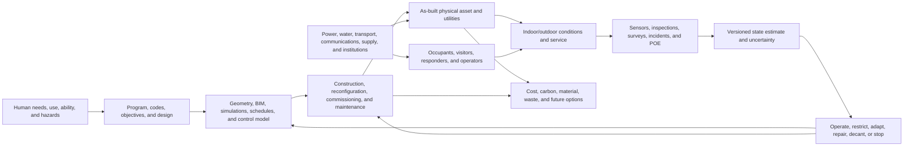

# Built environment and urban systems: primary-source audit

**Audit date:** 2026-08-05

**Scope:** architecture, urban planning, building science, space syntax,
wayfinding, modular and open construction, passive design, adaptive reuse,
building controls, evacuation, infrastructure interdependence, accessibility,
occupancy feedback, embodied carbon, life-cycle cost, asset management, and
community resilience.

**Purpose:** test whether the built environment contributes a computational or
systems principle not already represented in this project. Buildings and cities
are treated as coupled physical--human service systems, not as metaphors for
neural networks.

**Status:** research audit. The `BE-T` claims below are audit-local and must not
be cited as project evidence without separate claim-ledger review. Standards
show accepted scope or practice; they are not empirical proof that every
compliant asset performs as intended.

**Primary deduplication targets:**
[P-001](../principle-registry.md#p-001--selective-allocation),
[P-002](../principle-registry.md#p-002--local-autonomy-with-exception-escalation),
[P-003](../principle-registry.md#p-003--temporary-trace-before-commitment),
[P-004](../principle-registry.md#p-004--diversity-selection-and-protection),
[P-005](../principle-registry.md#p-005--use-dependent-topology),
[P-006](../principle-registry.md#p-006--homeostatic-negative-feedback),
[P-007](../principle-registry.md#p-007--prediction-error-allocation),
[P-008](../principle-registry.md#p-008--compartmentalized-interaction),
[P-009](../principle-registry.md#p-009--maintenance-plane),
[P-010](../principle-registry.md#p-010--structural-offloading-and-co-design),
[P-011](../principle-registry.md#p-011--transient-communication-coalitions),
[P-012](../principle-registry.md#p-012--memory-matched-to-information-lifetime),
and [P-013](../principle-registry.md#p-013--externalized-shared-state).

The audit deduplicates against Candidates 001--020 and especially the
[mechanical/civil](2026-08-05-mechanical-civil-resilience.md),
[process-engineering](2026-08-05-process-engineering.md),
[supply-chain/operations-research](2026-08-05-supply-chain-operations-research.md),
[power-grid](2026-08-05-power-grids-protection-and-recovery.md),
[human-factors](2026-08-05-hci-human-factors.md),
[fault-tolerance](2026-08-05-fault-tolerance-and-reconstruction.md), and
[high-reliability-organization](2026-08-05-high-reliability-organizations-incident-learning.md)
audits.

## Executive finding

**No new principle survives deduplication.** The broad proposals have mature
homes:

- urban accessibility, assignment, routing, and facility placement are graph
  optimization, equilibrium modelling, and operations research;
- passive envelopes, thermal mass, buoyancy-driven ventilation, daylight, and
  shading are P-010 physical offloading constrained by heat, mass, and momentum
  balances;
- zoning, compartmentation, modular construction, and open building instantiate
  P-008/P-010, but do not imply cheap, safe, or reversible change;
- controls and occupant-responsive operation are feedback, estimation, MPC,
  supervisory control, and human factors;
- BIM and digital twins are P-013 information structures plus Candidate 014
  observation contracts, not the asset or its verified state;
- commissioning, post-occupancy evaluation, maintenance, and incident learning
  belong to P-009 and Candidate 011;
- evacuation and inclusive access are constrained multi-user service and
  life-safety problems, not scalar shortest-path problems;
- adaptive reuse, embodied carbon, and life-cycle cost require conventional LCA
  and discounted-cost boundaries before any adaptive-system claim; and
- community resilience and infrastructure dependence are established
  multi-hazard, multi-service, network, and recovery-planning fields.

One narrow residual is **held**, not promoted:

> An **occupancy- and life-safety-qualified spatial reconfiguration contract**
> may be a useful Candidate 001 domain track when geometry, use, circulation,
> fire/smoke boundaries, accessibility, utilities, controls, structure, and
> authority change while people and irreversible material commitments remain in
> the system.

It is only a composition of Candidates 001, 005, 009, 011, 012, 014, 017, and
018. It must carry the current and target physical/service topology, transition
sequence, in-place users, accessible routes, egress and tenability, structural
and utility state, observation support, permits, reversible/irreversible work,
decanting, embodied and operating impacts, commissioning, and post-occupancy
verification. It collapses if ordinary modular/open-building design,
code-compliant change control, BIM/IFC information management, commissioning,
MPC, post-occupancy evaluation, and ISO 55001-style asset management match it at
equal life-cycle budget.

Claims rejected at the boundary:

1. **A plan is not a building.** BIM, a digital twin, a sensor dashboard, and a
   simulation are observations or models of an asset.
2. **Passive is not free.** Passive physics can reduce actuation but still has
   fabrication, land, material, maintenance, tuning, comfort, and failure costs.
3. **Modular is not reversible.** Standard dimensions or prefabrication do not
   prove separability, reuse, code validity, low carbon, or safe occupied change.
4. **Compliance is not universal safety.** Codes declare minimum or accepted
   procedures within applicability; hazards, workmanship, use, deterioration,
   and correlated failures remain.
5. **Accessibility is not average travel time.** A route that exists in a graph
   may be unusable for a person, unavailable during construction, or untenable
   during a fire.
6. **Comfort is not indoor-air quality, health, or productivity.** These require
   separate measurands and evidence.
7. **Reuse is not zero carbon.** Functional equivalence, retained components,
   added work, replacements, operation, end of life, and study period determine
   the comparison.
8. **Reopening is not recovery.** Minimum service, full function, accessible
   service, reserve, and readiness for the next event are distinct.

## Evidence and inference boundary

| Evidence type | Supports | Does not establish |
|---|---|---|
| conservation law or calibrated physical model | response under declared geometry, properties, boundary conditions, weather, schedules, and controls | as-built fidelity, occupant experience, future deterioration, or omitted failure modes |
| graph metric or optimization | a property or optimum of the encoded nodes, edges, costs, capacities, demands, and objective | causal movement, perceived legibility, equitable access, or physical feasibility outside that encoding |
| laboratory or virtual-navigation experiment | behavior for the tested participants, layout, cues, task, and exposure | population-wide wayfinding, emergency behavior, or long-term adaptation |
| occupied-building field study | measured outcomes in the sampled assets, seasons, occupants, and operation | a portable effect size or one-feature causal attribution without a design supporting it |
| simulation or digital twin | consequences within the model, calibration, uncertainty, and scenario set | correspondence to the current asset without observations and validation |
| code, standard, or professional guidance | accepted terminology, requirements, or workflow within its applicability | absence of residual risk or empirical superiority over alternatives |
| LCA or LCC | impacts or costs within a declared functional equivalent, modules, data, study period, scenarios, and discounting | a universal advantage for modularity, reuse, retrofit, or demolition |
| post-event investigation | a particular failure path, behavior, dependency, and organizational context | event frequency or an invariant remedy |
| occupant survey | reported perception by respondents at a time and under a survey instrument | measured energy, contaminant exposure, causal productivity, or nonrespondent experience |

Foundational urban work includes Hansen's accessibility formulation
[@hansen1959], Wardrop's traffic principles [@wardrop1952], Hillier et al.'s
configuration/movement study [@hillier1993], and O'Neill's wayfinding
experiments [@oneill1991; @oneill1992]. They are scoped models and studies, not
universal laws of human movement.

## State firewall and exact system boundary

The object of evaluation is an **occupied built-asset service transition** over
a declared parcel, building, district, or infrastructure catchment and a
declared time interval. At minimum, preserve these states separately:

| State | Required representation | Never substitute |
|---|---|---|
| physical geometry | surveyed/as-built dimensions, topology, materials, connections, penetrations, and uncertainty | design intent, render, BIM object, or permit drawing |
| functional program | allowed uses, occupancy groups, schedules, critical functions, and service priorities | room name or historical use |
| human presence | persons by location, ability, role, familiarity, schedule, and assistance dependency | design occupancy or aggregate footfall |
| circulation | ordinary, accessible, construction, emergency, responder, and goods routes with capacities and closures | one shortest-path graph |
| life safety | detection, alarm, suppression, compartmentation, smoke/heat state, ASET/RSET, refuge, egress, responder access | code checkbox or evacuation animation |
| structure | loads, load paths, damage/deterioration, temporary works, capacity, and restrictions | visual completion or component count |
| utilities | power, water, drainage, ventilation, heat, cooling, communications, lifts, controls, and external dependencies | command state or one-line diagram alone |
| indoor environment | temperature, radiation, humidity, air speed, contaminants, light, acoustics, and spatial/temporal support | thermostat setpoint or mean satisfaction |
| control | objective, estimator, forecast, policy/version, command, actuator state, fallback, and authority | controller output as delivered service |
| information | source, support, timestamp, version, transformation, uncertainty, and invalidation dependencies | model integrity as physical truth |
| legal/organizational | owner, duty holder, permit, inspection, work package, acceptance, operating restriction, and emergency authority | model recommendation |
| material commitment | installed, removed, stored, reusable, damaged, waste, lead-time, and irreversible work state | procurement order or planned sequence |
| lifecycle | reference study period, functional equivalent, cost, GWP, energy, water, waste, disruption, and distribution across users | one capital-cost or operational-energy number |
| service | delivered function by user group, location, time, quality, safety, accessibility, and reserve | open/closed or occupied/unoccupied |

Also keep design occupancy distinct from sensed occupancy, expected load from
current demand, controller command from actuator output, zone condition from
occupant exposure, route existence from route usability, ASET from RSET, and
restored minimum service from restored reserve.



No arrow licenses a collapse of layers. In particular, `model -> work -> asset`
requires physical verification, and `obs -> est` requires a Candidate 014-style
observation contract.

## Quantitative boundary and dimensional checks

### Accessibility and network assignment

A Hansen-type potential accessibility measure can be written

$$
A_i=\sum_j O_j f(c_{ij}),
$$

where $O_j$ is opportunities (jobs, beds, services, or a declared weighted
count), $c_{ij}$ is generalized cost in minutes, currency, or a declared
composite, and $f$ is an impedance function with units chosen so $A_i$ remains
interpretable. Results change with population, opportunity definition, mode,
time, disability, reliability, and the cost function [@hansen1959].

For an unweighted graph, closeness may be

$$
C_i=\frac{n-1}{\sum_{j\ne i}d_{ij}},
$$

where $d_{ij}$ is edge count and $C_i$ has units of inverse edges. It is a graph
descriptor, not a causal model of movement or legibility. Hillier et al. found
configuration/movement associations in studied urban grids [@hillier1993]; land
use, destinations, time, perception, and self-selection remain in the causal
system.

On a transport network, link flow $x_a$ in vehicles/hour and link travel time
$t_a(x_a)$ in hours produce the travel-time rate

$$
T_{\mathrm{sys}}=\sum_a x_a t_a(x_a)\quad\text{vehicle-hours/hour}.
$$

The unit is conventionally reported as vehicle-hours accumulated per analysis
hour; its dimension reduces algebraically to vehicles. Wardrop user equilibrium
and system optimum are different objectives
[@wardrop1952]. Dynamic demand, spillback, mode shift, induced demand,
accessibility, emissions, and distributional outcomes cannot be inferred from a
static shortest path.

### Heat, air, contaminants, and daylight

For a well-mixed thermal zone,

$$
C_z\frac{dT_z}{dt}
=\sum_k U_kA_k(T_{o,k}-T_z)
+\dot Q_{\mathrm{solar}}+\dot Q_{\mathrm{people}}
+\dot Q_{\mathrm{equipment}}+\dot Q_{\mathrm{HVAC}},
$$

where $C_z$ is effective heat capacity in J/K, $T$ is K, $U_k$ is W/(m²·K),
$A_k$ is m², and every right-hand term is W. At steady conduction,
$\dot Q=UA\Delta T$ W. Natural ventilation is governed by coupled momentum and
buoyancy/wind pressure, not by a fixed air-change slogan [@linden1999]. A useful
sensible-load approximation is

$$
\dot Q_{\mathrm{vent}}=\rho c_p\dot V(T_o-T_i)\quad\text{W},
$$

with air density $\rho$ in kg/m³, heat capacity $c_p$ in J/(kg·K), and volume
flow $\dot V$ in m³/s.

For a well-mixed contaminant with mass concentration $c$ in kg/m³,

$$
V\frac{dc}{dt}=G+\dot V(c_o-c),
$$

where zone volume $V$ is m³ and source $G$ is kg/s. Both sides are kg/s.
Filtration, deposition, interzonal transport, chemistry, spatial gradients, and
sensor support require additional terms. Thermal acceptability under ASHRAE 55
[@ashrae55] is not compliance with ventilation/IAQ requirements under ASHRAE
62.1 [@ashrae621].

Daylight autonomy at an evaluated point or area is

$$
DA_{E^*}=\frac{1}{N_{\mathrm{occ}}}
\sum_{h\in\mathrm{occupied}}\mathbf 1[E_h\ge E^*],
$$

a dimensionless fraction where illuminance $E_h$ and threshold $E^*$ are lux
and $N_{\mathrm{occ}}$ is occupied time steps. Weather file, sensor grid,
shading, schedule, glare, view, solar heat, and electric-light response must be
declared; one daylight metric is not visual comfort [@reinhart2006].

### Control and observation

A sampled building model may be written

$$
x_{t+1}=Ax_t+Bu_t+Ed_t+w_t,
$$

with state $x_t$ carrying typed physical units, command $u_t$, disturbance
$d_t$, and process error $w_t$. MPC chooses a horizon-$H$ sequence under
equipment and comfort/IAQ constraints, for example

$$
J=\sum_{k=0}^{H-1}
\left[p_{t+k}E_{t+k}
+\lambda_TD_{T,t+k}+\lambda_cD_{c,t+k}
+\lambda_sS_{t+k}\right].
$$

$pE$ is currency when $p$ is currency/kWh and $E$ is kWh. The $\lambda$
weights must convert temperature-discomfort, contaminant-violation, and
switching terms into the same objective unit; hard life-safety limits should
not be silently monetized. MPC and weather-aware building control are mature
nulls [@oldewurtel2012], as are standard HVAC sequences with functional tests
[@ashrae36]. Forecast occupancy, sensed occupancy, actuator response, zone
state, and human outcome need separate error terms.

### Evacuation, capacity, and tenability

Required safe egress time is commonly decomposed as

$$
RSET=t_{\mathrm{detect}}+t_{\mathrm{alarm}}+t_{\mathrm{pre}}
+t_{\mathrm{move}}\quad\text{s}.
$$

For a scenario-specific margin $M$ in seconds, a necessary design check is

$$
ASET-RSET\ge M,
$$

where available safe egress time (ASET) is determined by tenability, not merely
route length. Detection, interpretation, preparation, helping, mobility,
familiarity, congestion, smoke, door/lift state, and responder interaction
matter [@iso16738; @kuligowski2008]. A stylized corridor flow relation is

$$
q=kvw\quad\text{persons/s},
$$

with density $k$ in persons/m², speed $v$ in m/s, and effective width $w$ in m.
The speed-density relation is model- and population-dependent. Helbing et al.'s
simulation [@helbing2000] is a useful mechanistic model, not universal evidence
that real evacuees panic or follow one fundamental diagram.

### Carbon, cost, recovery, and interdependence

A whole-life GWP inventory can be summarized as

$$
GWP=\sum_i q_iEF_i+G_{A4}+G_{A5}+G_B+G_C
\quad\text{kg CO}_{2}\text{e},
$$

where $q_i$ is material/product quantity in the unit matched to emission factor
$EF_i$, and the remaining terms cover declared transport/construction, use and
replacement, and end-of-life modules. Benefits/loads beyond the boundary
(Module D) must remain separately reported. Functional equivalent, reference
study period, data vintage/geography, biogenic treatment, grid scenarios,
replacement, and allocation follow a declared standard such as EN 15978
[@en15978] or RICS WLCA [@rics2023].

For annual cash flows, a simple net present cost is

$$
NPC=C_0+\sum_{t=1}^{N}\frac{C_t}{(1+r)^t}
-\frac{R_N}{(1+r)^N}\quad\text{currency},
$$

where $r$ is a dimensionless discount rate per year, $N$ is years, and $R_N$ is
residual value. Scope and period must be agreed [@iso15686; @nist135]. Carbon,
fatality risk, accessibility, and irreversible heritage loss are not converted
to currency without an explicit, contestable valuation rule.

For service component $m$ over horizon $T$,

$$
L_m=\int_0^T [Q_{m,\mathrm{ref}}(t)-Q_m(t)]_+\,dt,
$$

with units such as person-hours without accessible service, bed-hours, m³ water
not delivered, or passenger-hours. Keep $\mathbf L=(L_1,\ldots,L_M)$ as a
vector unless aggregation weights are declared. A resilience area is not a
guarantee [@bruneau2003]. Infrastructure state may be represented as a coupled
model

$$
x_{t+1}=F(x_t,u_t,D_t;\theta),
$$

where $x_t$ carries typed capacities and service states, $D_t$ dependency links
and common-cause groups, and $\theta$ model/version parameters. A link is not
independent capacity, and stylized interdependent-network cascades require
validation before application [@rinaldi2001; @buldyrev2010].

## Audit cards

### BE-01 — Urban accessibility and land-use/transport interaction

**Mechanism.** Opportunities are connected to people through spatial networks,
time, price, schedules, capacity, reliability, and ability. Accessibility can
affect location choices, while land use and demand change the network in
return.

**Evidence and null.** Hansen [@hansen1959], Wardrop [@wardrop1952], network
flow, facility location, gravity/radiation models, activity-based demand,
dynamic traffic assignment, and multi-objective planning are mature baselines.

**AI boundary.** P-001/P-005/P-013 and Candidates 001/013 already own allocation
and routing. A learned planner must beat calibrated optimization/equilibrium
models on held-out demand and policy shifts, not merely imitate observed flows.

**Failure modes and prediction.** Average accessibility can rise while a
mobility-limited, low-income, night-shift, or disrupted group loses reachable
opportunities. Report distributions by user, mode, time, reliability, and
hazard. **Disposition: established null; no new principle.**

### BE-02 — Space syntax, configuration, and movement

**Mechanism.** Configurational relations can make some routes more available
for through movement; destinations and movement then co-evolve. Hillier et al.
reported associations between integration and observed movement in the studied
grids [@hillier1993].

**Strong null and boundary.** Centrality, betweenness, visibility graphs,
network assignment, destination choice, and causal spatial models are the
nulls. Axial/segment representation, radius, angular metric, land use, density,
weather, time, and sampling must be preregistered.

**Failure modes and prediction.** A high-integration route may be inaccessible,
unsafe, unpleasant, capacity-limited, or irrelevant to a destination. If a
space-syntax score adds no held-out predictive or decision value beyond graph,
land-use, and flow baselines, the claim collapses. **Disposition: scoped
empirical method; no principle.**

### BE-03 — Wayfinding, legibility, signage, and familiarity

**Mechanism and evidence.** Plan complexity and signage affected wayfinding in
O'Neill's field experiment [@oneill1991]; familiarity moderated complexity in a
simulated-building experiment [@oneill1992]. Geometry, visibility, landmarks,
signage, maps, language, memory, stress, impairment, and crowd cues interact.

**AI translation.** This is HCI, externalized state (P-013), local decision
support, and Candidate 015 convention repair. A route recommender is not useful
if signs, doors, maps, and spoken instructions disagree.

**Failure modes and prediction.** Familiar users can mask poor first-visit
performance; signs can become stale during works; visual signage excludes some
users; the fastest route may not be the most comprehensible. Compare against
ordinary human-factors design with first-visit, impaired, emergency, and stale-
information cohorts. **Disposition: HCI null; no principle.**

### BE-04 — Modular, prefabricated, and open-building systems

**Mechanism.** Standard interfaces, off-site production, separable subsystems,
service zones, tolerance management, and reserved capacity can reduce some
site work or future disturbance. They also move work, inventory, transport,
quality risk, and capital elsewhere.

**Evidence and null.** Quale et al.'s comparative residential LCA found
trade-offs rather than an unconditional modular advantage [@quale2012]. Design
for manufacture/assembly, product platforms, interface control, ordinary
configuration management, and adaptable/open-building design are strong nulls.

**Failure modes and prediction.** Nominal modules can share foundations,
utilities, fire boundaries, cranes, suppliers, tolerances, proprietary
interfaces, or approval; disassembly can damage them; standardized layouts can
reduce accessibility or fit. Charge factory, transport, lifting, temporary
works, joints, rework, storage, vacancy, and end-of-life recovery. **Disposition:
P-008/P-010 and Candidate 001 substrate track; no principle.**

### BE-05 — Passive envelope, solar control, and thermal storage

**Mechanism.** Orientation, form, insulation, airtightness, thermal mass,
shading, surface properties, and coupled ground/sky exchange shape loads before
active control. This is genuine physical offloading.

**Null.** Heat-balance simulation such as EnergyPlus [@energyplus], passive-
house engineering, robust envelope optimization, and conventional HVAC sizing
are mature. The null receives the same weather years, geometry, schedules,
material uncertainty, and commissioning effort.

**Failure modes and prediction.** Thermal mass can shift rather than eliminate
load; airtightness without ventilation can worsen IAQ; solar gain helps in one
season and harms another; passive measures can lose under future climate or
changed use. Measure annual/peak energy, comfort/IAQ hours, embodied impact,
resilience, maintenance, and rebound. **Disposition: direct P-010.**

### BE-06 — Natural ventilation and daylight

**Mechanism.** Wind/buoyancy pressure and openings move air; sky/sun and optical
paths deliver light. Linden reviewed the fluid-mechanical basis and limits of
natural ventilation [@linden1999]. Dynamic daylight metrics encode weather,
time, and occupancy [@reinhart2006].

**Boundary.** Airflow, contaminant transport, acoustics, security, insects,
rain, outdoor pollution, glare, view, heat gain, and user control remain
separate. A window is both envelope discontinuity and human interface.

**Failure modes and prediction.** Outdoor pollution, smoke, noise, wind, or
heat can close the passive path exactly during peak need. Compare against
hybrid ventilation and automated shading/lighting under future weather and
failure scenarios. **Disposition: P-010 with P-006 control; no principle.**

### BE-07 — Thermal comfort and occupant heterogeneity

**Mechanism and evidence.** Comfort depends on environmental and personal
variables; field evidence supports adaptive relations in applicable naturally
conditioned contexts [@dedear2001]. ASHRAE 55 explicitly provides standard and
adaptive methods and acknowledges person-to-person variation [@ashrae55].

**AI boundary.** Personalization is multi-user constrained control, not proof
that a building “learns.” Preference reports, exposure, clothing/activity,
adaptation opportunity, and zone actuation must remain separate.

**Failure modes and prediction.** Majority satisfaction hides minority harm;
preference models drift with season, health, task, and adaptation; sensors
proxy exposure; local devices shift energy or noise. Beat fixed setpoint,
adaptive standard, zoned control, and personal comfort systems under equal
hardware/privacy cost. **Disposition: established human-in-loop control.**

### BE-08 — Occupancy-responsive operation and feedback

**Mechanism and evidence.** Occupancy estimates can schedule or reset services;
occupants can report problems and adapt windows, blinds, clothing, location,
and controls. Agarwal et al. tested occupancy-driven building automation in a
particular deployment [@agarwal2010]; it does not provide a portable saving.

**Null.** Schedules, presence detectors, demand-controlled ventilation, booking
systems, Bayesian/state-space occupancy inference, and value-of-information
sensing are mature.

**Failure modes and prediction.** False vacancy can remove ventilation, light,
or accessibility; sparse occupancy can still require full service; sensors
create privacy and maintenance burden; actions change observations. Candidate
007/014 already own that endogeneity. **Disposition: no new principle.**

### BE-09 — Building controls, standard sequences, and MPC

**Mechanism and evidence.** Feedback stabilizes zone variables; supervisory
logic coordinates modes; MPC anticipates weather, occupancy, tariffs, and
constraints. Oldewurtel et al. provide a primary building-MPC study
[@oldewurtel2012]. ASHRAE Guideline 36 supplies uniform high-performance
sequences and functional tests [@ashrae36].

**Strong null.** Tuned PID, reset schedules, Guideline 36, fault detection,
robust/stochastic MPC, rule-based supervisory control, and operator override.

**Failure modes and prediction.** Model mismatch, occupancy/weather error,
stuck dampers, simultaneous heating/cooling, unsafe overrides, and objective
gaming can erase savings. Evaluate command-to-actuator-to-zone-to-person and
charge commissioning, sensing, compute, communication, switching, and fallback.
**Disposition: P-006/P-007/P-009; no principle.**

### BE-10 — BIM, IFC, digital twins, and commissioning

**Mechanism.** ISO 19650 covers versioned whole-life information management
[@iso19650]; ISO 16739-1 defines an open IFC data schema [@iso16739]. Digital-
twin research combines semantic models, sensing, storage, simulation, and
optimization [@boje2020]. None guarantees current correspondence.

**Null.** BIM/common-data environments, IFC, asset registers, BMS historians,
calibrated simulation, commissioning, functional performance tests, issue
tracking, and configuration management.

**Failure modes and prediction.** Geometry is stale, tags disagree, sensors
drift, temporary works are absent, manual overrides are hidden, and semantic
interoperability does not imply dynamic validity. A twin must expose support,
latency, uncertainty, version, invalidation, and last physical verification.
**Disposition: P-013/Candidate 014; no principle.**

### BE-11 — Post-occupancy evaluation and learning from use

**Mechanism and evidence.** POE combines measured performance, observation,
interviews/surveys, and feedback to design/operation. PROBE occupant surveys
showed a structured performance-in-use method [@leaman2001]; Bordass and Leaman
argued for routine feedback [@bordass2005].

**Boundary.** A survey is one observation channel. A closed loop requires a
finding, owner, authorized change, test, measured effect, applicability record,
and retirement or revision.

**Failure modes and prediction.** Response bias, novelty, seasonal confounding,
untracked work orders, and design teams that never receive results create
“feedback” without learning. Candidate 011 is the existing home. **Disposition:
P-009/P-013 and Candidate 011.**

### BE-12 — Adaptive reuse and change of use

**Mechanism and evidence.** Retaining structure/envelope can avoid new product
burdens, but new use changes load, fire strategy, accessibility, acoustics,
services, envelope, permits, and operation. Bullen and Love documented practical
barriers and piecemeal adoption [@bullen2010]. Hasik et al. proposed comparable
renovation/new-build LCA boundaries and found large reductions in one case,
with non-structural work still important [@hasik2019].

**Null.** Condition survey, structural/fire/accessibility assessment,
functional-equivalent LCA, LCC, code change-of-use, option appraisal, staged
works, commissioning, and POE.

**Failure modes and prediction.** A nominal reuse may require high-impact
replacement, lock in poor operation, displace users, lose heritage, or fail the
new service. No case-study percentage transfers without aligned boundaries.
**Disposition: lifecycle comparison, not a principle.**

### BE-13 — Evacuation, fire safety, and crowd movement

**Mechanism and evidence.** Detection, cues, interpretation, pre-movement,
helping, route selection, flow, smoke/heat tenability, protection systems, and
responder action jointly determine outcome. ISO/TR 16738 scopes behavioral and
movement evaluation [@iso16738]; NIST identifies gaps from unrealistic behavior
assumptions [@kuligowski2008].

**Strong null.** Prescriptive egress/code analysis, performance-based fire
engineering, ASET/RSET, scenario analysis, calibrated evacuation models,
drills, signage, refuge/assisted-evacuation plans, and independent review.

**Failure modes and prediction.** Simulated agents know exits, alarms are
assumed understood, mobility/hearing/vision/cognition are homogenized, lifts or
doors are idealized, and construction closes a route. An adaptive layout loses
on any life-safety violation; average evacuation time cannot compensate.
**Disposition: Candidates 005/009/012 constraints, no principle.**

### BE-14 — Accessibility and inclusive ordinary/emergency use

**Mechanism and standard boundary.** ISO 21542 covers access, circulation,
ordinary egress, and fire evacuation for new work and work in existing
buildings [@iso21542]. Accessibility includes reach, clearance, gradient,
surface, force, sensory information, controls, sanitation, assistance, and
usability—not only a connected path.

**AI boundary.** Ability-based and participatory design, accessibility codes,
universal design, user testing, and HCI are the null. Protected service floors
are hard constraints, not preferences inferred from majority data.

**Failure modes and prediction.** A compliant drawing is obstructed in use;
temporary works remove an accessible route; a refuge depends on failed power or
communication; personalization reveals disability. Evaluate each relevant user
journey in ordinary, transition, and emergency modes. **Disposition: hard
service constraint; no principle.**

### BE-15 — Infrastructure interdependence and cascading loss

**Mechanism and evidence.** Buildings depend on external power, water,
communications, transport, fuel, waste, suppliers, staff, and institutions.
Rinaldi et al. supplied a taxonomy and analysis agenda [@rinaldi2001]; Buldyrev
et al. showed severe cascades in a stylized coupled-network model
[@buldyrev2010].

**Null.** Dependency matrices, flow/capacity models, fault trees, common-cause
analysis, multi-network simulation, restoration scheduling, microgrids/storage,
mutual aid, and business-continuity planning.

**Failure modes and prediction.** Nominal dual supply shares a substation,
road, telecom, crew, floodplain, software, or fuel; backup duration is shorter
than repair; restored infrastructure cannot deliver the social function. Report
scenario-specific service and reserve, not node connectivity. **Disposition:
P-004/P-008 plus fault-tolerance and power-grid audits.**

### BE-16 — Embodied carbon and whole-life assessment

**Mechanism and standard boundary.** EN 15978:2026 specifies a building-level
LCA method around a functional equivalent and life-cycle model [@en15978]. RICS
WLCA separates embodied, operational, and user carbon [@rics2023].

**Null.** Quantity take-off, EPD/generic data hierarchy, scenario/sensitivity
analysis, reference-study-period alignment, component replacement, operational
simulation, end-of-life modules, and uncertainty analysis.

**Failure modes and prediction.** Comparing unequal floor area, service,
lifespan, grid, occupancy, or system boundary can reverse a result. Module D,
biogenic carbon, reuse allocation, and future decarbonization can be gamed.
Modular/reuse/adaptive proposals must publish inventories and ranges.
**Disposition: accounting boundary; no principle.**

### BE-17 — Life-cycle cost, asset management, and adaptive options

**Mechanism.** Capital, operation, maintenance, replacement, disruption,
failure, residual value, and option value occur on different timescales. ISO
15686-5 [@iso15686] and NIST Handbook 135 [@nist135] are mature LCC nulls; ISO
55001 requires a managed asset system linking objectives, decisions, risk,
performance, and expenditure [@iso55001].

**Failure modes and prediction.** A cheap adaptable interface can add routine
maintenance; discounting can suppress long-horizon harm; uncertain future uses
are assigned fictitious option value; public/user costs are externalized.
Report cash flows, uncertainty, distribution, nonmonetized constraints, and
decision reversibility. **Disposition: Candidate 018 may tier artifacts, but
ordinary asset management remains the null.**

### BE-18 — Codes, reliability, resilience, and service recovery

**Mechanism and evidence.** ISO 2394 provides a reliability-informed structural
decision foundation [@iso2394]; FEMA P-58 supplies performance-based seismic
assessment with explicit uncertainty and limitations [@femap58]. NIST's
community guide links buildings/infrastructure to social/economic functions and
recovery goals [@nist1190], while its economic guide compares resilience
investments [@nist1197].

**Boundary.** Hazard resistance, reliability, robustness, redundancy,
resilience, recovery, adaptation, and sustainability are different. Service
must be a vector by population and time.

**Failure modes and prediction.** Code minimum becomes a claimed resilience
guarantee; recovery curves omit displacement and accessibility; correlated
regional demand defeats crews/spares; restored shell lacks staff or utilities.
Candidate 005/011/012 and the mechanical/civil audit already own the assurance
and restoration contracts. **Disposition: no new principle.**

## Deduplication against current project homes

| Built-environment pattern | Existing home | Deduplicated result |
|---|---|---|
| allocate land, routes, rooms, energy, ventilation, crews, or investment | P-001; Candidates 008 and 013 | facility location, network flow, MPC, scheduling, and MCDA are mandatory nulls |
| local zone/room control with supervisory escalation | P-002/P-006/P-008; Candidate 012 | BMS hierarchy and constrained control already instantiate it |
| mock-up, pilot, temporary works, snag/issue trace before acceptance | P-003; Candidate 010 | ordinary staged verification unless a distinct verifier adds information before irreversible work |
| alternate routes, suppliers, utilities, compartments, or typologies | P-004/P-008; Candidate 005 | benefit requires capacity and common-cause qualification |
| reconfigure adjacency, circulation, services, or control zones | P-005; Candidate 001 | hold only occupied physical transition with material and life-safety state |
| maintain comfort/IAQ/service under disturbance | P-006; Candidates 007/012/013 | standard feedback, estimation, MPC, and robust control are the nulls |
| inspect anomalies and spend sensing on uncertainty | P-007; Candidates 003/007/014 | commissioning, FDD, POE, and active inspection already cover it |
| rooms, zones, fire cells, structure/services layers, and modules | P-008 | physical partitioning is established; modularity does not establish independence |
| commissioning, maintenance, repair, POE, and asset management | P-009; Candidates 005/011 | monitoring or lessons without verified work do not close the loop |
| envelope, mass, shading, natural ventilation, form, and placement | P-010; Candidate 006 for physical-skill claims | passive physics is the strongest null and must be lifecycle charged |
| temporary teams, routes, work fronts, and mutual aid | P-011; Candidate 013 | ordinary scheduling/routing unless coalition state has a distinct causal role |
| short-lived occupancy, long-lived structure, replaceable services, archive | P-012; Candidates 017/018 | match update medium to lifetime; LCC/LCA and asset registers are nulls |
| signs, maps, BIM, twins, work orders, permits, and public dashboards | P-013; Candidates 014/015 | external state needs version, support, uptake, and physical verification |

### Adjacent-audit deduplication

| Adjacent audit | What it already owns | What remains domain-specific here |
|---|---|---|
| mechanical/civil resilience | passive mechanics, residual capacity, damage, monitoring, graceful degradation, repair and reserve | occupancy/use, indoor environment, access, egress, lifecycle program change |
| process engineering | balance laws, MPC, plantwide control, safety lifecycle, conservation-qualified reconfiguration | building geometry, people-in-place, accessible circulation, permits and construction sequence |
| supply-chain/OR | flow, queues, inventory, commitments, routing, recovery, service contracts | physical as-built topology and life-safety/accessibility validity during works |
| power grid | protection, restoration, reserve, islanding, correlated failures | downstream building service and dependency duration |
| HCI/human factors | displays, modes, automation reliance, interruption, accessibility, mixed initiative | physical circulation, environmental exposure, construction and evacuation |
| fault tolerance | redundancy, independence, failover, reconstruction, verification | human tenability and material irreversibility |
| HRO/incident learning | operational response, learning, authority and recurrence | commissioning/POE fields and built-asset acceptance evidence |

## Held residual: occupancy- and life-safety-qualified spatial reconfiguration

### Applicability gate

Use this track only if all are true:

1. physical adjacency, circulation, compartmentation, utility zoning, control
   zoning, structural load path, or functional use actually changes;
2. people, critical services, or hazardous inventories remain within the
   affected dependency boundary during at least part of the change;
3. some work is material, slow, costly, or irreversible enough that a simple
   software rollback is impossible;
4. accessibility, egress, tenability, service, and authority must remain valid
   through intermediate configurations; and
5. ordinary scheduled maintenance or a pre-approved fixed sequence does not
   already dominate.

Otherwise this is standard design/construction/asset management, or ordinary
Candidate 001 routing.

### Minimum transition record

For transition version $v$ and step $k$, record:

- current, target, and verified as-built topology $G_{v,k}$;
- functional program and service vector by user group and time;
- actual/forecast occupancy with support, uncertainty, and assistance needs;
- ordinary, accessible, construction, emergency, responder, and goods routes;
- fire/smoke compartments, detection, alarm, suppression, ASET/RSET scenarios,
  and temporary impairment permits;
- structural/load state, temporary works, capacity, inspections, and hold
  points;
- utility/control dependencies, isolation boundaries, backup duration,
  commands, actuator verification, and safe fallback;
- indoor-environment constraints and measurement locations;
- owner, designer, contractor, duty holder, authority, permits, operating
  restrictions, stop-work and emergency powers;
- installed/removed/in-transit/reusable/waste materials and irreversible steps;
- workfront, decanting, logistics, noise/dust/vibration, and affected neighbors;
- cost, energy, GWP, water, waste, person-hours of disruption, and uncertainty;
- commissioning tests, independent acceptance, POE, open defects, rollback or
  safe-stop state, and reserve restoration.

An intermediate configuration is admissible only if every hard constraint is
verified from sufficiently current evidence. The contract must abstain or enter
a pre-approved safe state when support, authority, or observability expires.

### Exact project refinements if the track survives

| Candidate | Built-environment refinement |
|---|---|
| [001](../../experiments/candidates/001-adaptive-topology.md) | Add an occupied spatial track in which topology changes carry material commitment, temporary geometry, accessibility, egress/tenability, utility/structure dependencies, transition duration, and physical acceptance. |
| [005](../../experiments/candidates/005-severity-ordered-containment.md) | Distinguish restrict, isolate, decant, shore, ventilate, repair, replace, reopen, and restore reserve; charge displacement and transferred exposure. |
| [009](../../experiments/candidates/009-graded-assurance-envelopes.md) | Bind assurance grade to use/occupancy, fire strategy, accessibility, structural state, utility mode, work step, evidence age, responsible authority, and acceptance tests. |
| [011](../../experiments/candidates/011-dual-loop-operational-assurance.md) | Bind incidents, near misses, complaints, commissioning defects, and POE findings to an owner, versioned work/change, retest, recurrence check, and retirement. |
| [012](../../experiments/candidates/012-latency-qualified-authority.md) | Limit authority jointly by occupancy evidence age, impairment state, ASET/RSET margin, structural/utility headroom, communication, backup duration, permit, and revocation epoch. |
| [014](../../experiments/candidates/014-versioned-observation-contract.md) | Add spatial support, sensor/inspection coverage, BIM/as-built correspondence, occupancy ascertainment, calibration, temporary-condition version, actuator/door/damper state, and invalidation dependencies. |
| [017](../../experiments/candidates/017-contract-preserving-semantic-compaction.md) | Preserve the finite registered set needed to reconstruct permits, topology, fire/accessibility basis, test evidence, defects, and acceptance across renovation cycles. |
| [018](../../experiments/candidates/018-value-reconstructability-aware-tiering.md) | Treat survey, structural/fire basis, permits, commissioning, and incident evidence as high-value, low-reconstructability artifacts; beat ordinary records management. |

## Equal-budget falsification experiments

All experiments use frozen development/evaluation splits and compare methods
under equal access to geometry, weather, schedules, sensors, surveys, compute,
staff time, floor/plant space, equipment, material, construction windows,
inspection, commissioning, maintenance, and life-cycle budget. Safety and
accessibility are hard constraints; a violation cannot be compensated by energy
or average-service gains. Each reports uncertainty and distribution by user.

### E-BE-01 — Accessibility, configuration, and wayfinding

- **Question:** does the proposed spatial representation improve actual reached
  opportunities and first-visit navigation beyond graph/OR and human-factors
  baselines?
- **Arms:** shortest path; calibrated network assignment/facility model; space
  syntax; signage/landmark redesign; complete ordinary stack; residual contract.
- **Boundary:** matched destinations, demand, signage budget, map access,
  closures, user abilities, familiarity, and data collection.
- **Metrics:** reached opportunities/user-hour, wrong turns, backtracking,
  completion time, accessibility failures, cognitive workload, unequal loss,
  and maintenance cost.
- **Kill:** retire the residual if graph + signage/wayfinding engineering ties it
  on held-out layouts, closures, first visits, and ability profiles.

### E-BE-02 — Passive design versus active compensation

- **Question:** when does passive physics reduce lifecycle burden without
  exporting discomfort, IAQ, carbon, or failure risk?
- **Arms:** code-minimum envelope; optimized passive design; efficient active
  HVAC/lighting; passive + conventional control; passive + MPC.
- **Boundary:** identical functional area, climate/future weather, occupancy,
  comfort/IAQ constraints, reliability, grid scenarios, and study period.
- **Metrics:** kWh/m²·year, peak kW, comfort and contaminant person-hours,
  kgCO2e/m², cost, material, maintenance, and outage service.
- **Kill:** reject broad passive-superiority claims if active or hybrid design
  matches the Pareto frontier after embodied and resilience costs.

### E-BE-03 — Occupancy sensing and personal comfort

- **Question:** does learned occupant-responsive operation beat schedules,
  standard adaptive comfort, and simple presence control?
- **Arms:** fixed schedule; presence reset; adaptive-standard control; zoned
  preference model; candidate joint occupancy/preference controller.
- **Boundary:** equal sensor/privacy hardware, training interactions, actuation,
  ventilation floors, overrides, compute, and maintenance.
- **Metrics:** energy, temperature/IAQ exposure, satisfaction distribution,
  false-vacancy harm, override rate, privacy burden, calibration, and drift.
- **Kill:** retire if simple presence + standard comfort ties, or any subgroup's
  protected environmental service worsens.

### E-BE-04 — HVAC control and MPC under real faults

- **Question:** does a candidate controller add value beyond Guideline 36,
  tuned feedback, fault detection, and robust/stochastic MPC?
- **Arms:** tuned PID/reset; Guideline 36; deterministic MPC; robust/stochastic
  MPC; candidate.
- **Boundary:** equal weather/occupancy forecasts, models, sensors, commissioning,
  fallback, actuator cycling, operator time, and compute/energy.
- **Metrics:** cost, kWh, peak kW, constraint violations, recovery, actuator wear,
  command-delivery error, operator interventions, and tail risk.
- **Kill:** retire if conventional MPC/Guideline 36 matches it or if gains vanish
  under sensor drift, stuck actuators, overrides, and forecast shift.

### E-BE-05 — BIM/digital twin correspondence and commissioning

- **Question:** does a “twin” improve decisions beyond a maintained asset
  register, IFC/BIM, BMS historian, issue tracker, and commissioning?
- **Arms:** drawings/register; BIM/IFC; calibrated simulation; conventional
  digital twin; Candidate 014-qualified twin; full residual contract.
- **Boundary:** equal survey, tagging, sensors, updates, semantic engineering,
  inspections, staff, compute, and test access.
- **Metrics:** as-built discrepancy detection, stale-state decisions, false
  alarms, defect closure, energy/service effect, time to invalidate, and cost.
- **Kill:** retire if ordinary configuration management + commissioning ties, or
  model integrity is repeatedly mistaken for physical validity.

### E-BE-06 — Modular/open-building reconfiguration while occupied

- **Question:** does the held contract enable safer/cheaper spatial change than
  conventional modular design and construction management?
- **Arms:** conventional fit-out; modular/prefabricated; open-building/service
  separation; same with mature permit/change control; held contract.
- **Boundary:** identical target service, users in place, code basis, accessible
  and emergency routes, material/plant, crews, schedule, and inspection.
- **Metrics:** person-hours disrupted, route/egress impairments, defects,
  rework, material loss, transition time, energy, GWP, cost, and reusable yield.
- **Kill:** collapse into Candidate 001/asset management if mature modular +
  code-compliant sequencing ties it or if “reversible” components are not reused.

### E-BE-07 — Adaptive reuse versus new build

- **Question:** under aligned functional equivalence, when does reuse dominate
  renovation, replacement, or new construction?
- **Arms:** maintain/status quo; targeted retrofit; deep/adaptive reuse; new
  construction; each with conventional optimization; candidate contract.
- **Boundary:** same service capacity/quality, study period, climate/grid,
  occupancy, displacement, retained-component treatment, replacements, end of
  life, discounting, and uncertainty.
- **Metrics:** module-resolved kgCO2e, NPC, energy, water, waste, accessibility,
  comfort/IAQ, heritage, disruption, and option value.
- **Kill:** reject categorical reuse claims if rank changes under credible
  boundary/sensitivity analysis; retire contract if standard LCA/LCC appraisal
  ties it.

### E-BE-08 — Inclusive evacuation through a changing building

- **Question:** can every intermediate configuration preserve scenario-specific
  accessible egress and tenability better than ordinary fire/change control?
- **Arms:** static code check; performance-based fire engineering; conventional
  impairment permit and phasing; digital-twin aid; held contract.
- **Boundary:** equal fire scenarios, populations/abilities, alarm knowledge,
  staff assistance, route/door/lift states, smoke model, drills, review, and cost.
- **Metrics:** ASET-RSET margin distribution, stranded persons, untenable
  exposure, pre-movement, route conflicts, false confidence, and stop-work rate.
- **Kill:** any protected-user life-safety violation kills the arm; retire the
  residual if mature fire engineering + impairment control ties it.

### E-BE-09 — Dependency-aware service and recovery

- **Question:** does explicit cross-infrastructure state improve continuity and
  recovery beyond business continuity, common-cause analysis, and restoration OR?
- **Arms:** independent-link assumption; dependency matrix; calibrated coupled
  model; robust restoration schedule; full built-asset service contract.
- **Boundary:** equal hazards, repair crews, spares, backup energy/fuel, roads,
  communication, mutual aid, forecasts, and scenario knowledge.
- **Metrics:** service-loss vector, displacement, unmet critical function,
  cascade size, restoration time, reserve-restoration time, cost, and inequity.
- **Kill:** retire if ordinary dependency analysis + restoration scheduling ties;
  reject any gain relying on unvalidated stylized coupling.

### E-BE-10 — Full occupied-transition contract

- **Question:** does the narrow composition create decision value after every
  mature null is present?
- **Arms:** complete ordinary stack; ordinary stack + Candidate 014; ordinary
  stack + Candidates 001/005/009/011/012; full held contract; ablations removing
  occupancy, accessibility, life safety, material commitment, or lifecycle data.
- **Boundary:** matched asset portfolio, transition difficulty, hazards, staff,
  information, compute, professional review, material, schedule, and whole-life
  budget; preregistered adversarial stale-model and mid-transition faults.
- **Metrics:** hard violations, total/user-specific service loss, incorrect
  continuation, unnecessary stop, defect recurrence, material/cost/carbon,
  evidence burden, and time to safe accepted target state.
- **Kill:** retire/merge unless the full contract improves a preregistered
  protected-service and lifecycle Pareto frontier in at least two distinct asset
  classes, survives all ablations, and its gain cannot be reproduced by ordinary
  checklists, permits, configuration management, commissioning, and asset
  management.

## Scoped temporary claims

| ID | Status | Claim | Evidence/rationale | Affected home |
|---|---|---|---|---|
| BE-T01 | established | Accessibility is opportunity- and impedance-dependent, not distance alone. | Hansen formulation [@hansen1959]; definition depends on opportunities and cost. | P-001; Candidate 013 |
| BE-T02 | established | User-equilibrium and system-optimal traffic objectives differ. | Wardrop [@wardrop1952]. | Candidate 013 |
| BE-T03 | plausible | Spatial configuration adds movement information in some contexts but is not a universal causal law. | Scoped empirical study [@hillier1993]; representation and omitted-variable sensitivity. | P-005/P-013 |
| BE-T04 | established | Plan complexity, signage, and familiarity can materially affect wayfinding in tested settings. | Experiments [@oneill1991; @oneill1992]. | P-013; Candidate 015 |
| BE-T05 | established | Passive building behavior is constrained by heat, mass, momentum, radiation, and material laws. | Building physics and natural-ventilation theory [@linden1999; @energyplus]. | P-010 |
| BE-T06 | established | Thermal acceptability and ventilation/IAQ are separate assessment domains. | ASHRAE 55 and 62.1 [@ashrae55; @ashrae621]. | P-006; Candidate 014 |
| BE-T07 | established | Adaptive thermal comfort has scoped empirical support in applicable free-running/naturally conditioned contexts. | Global field-data analysis [@dedear2001]. | P-006/HCI |
| BE-T08 | established | Building MPC and standardized high-performance control sequences are mature nulls. | Primary MPC study and Guideline 36 [@oldewurtel2012; @ashrae36]. | P-006/P-007 |
| BE-T09 | plausible | Occupancy-responsive control can save energy in some deployments, but effect size is building-, service-, and sensing-specific. | Deployment study [@agarwal2010]. | Candidates 007/014 |
| BE-T10 | established | BIM/IFC standardize information management/exchange; they do not establish current asset state. | ISO 19650, ISO 16739, digital-twin review [@iso19650; @iso16739; @boje2020]. | P-013; Candidate 014 |
| BE-T11 | established | POE can structure feedback, but survey/measurement does not itself implement or verify change. | PROBE and feedback method [@leaman2001; @bordass2005]. | P-009; Candidate 011 |
| BE-T12 | established | Modular construction has conditional environmental trade-offs rather than an intrinsic lifecycle advantage. | Comparative LCA [@quale2012]. | P-008/P-010 |
| BE-T13 | plausible | Adaptive reuse can substantially reduce embodied impacts when comparable service and lifecycle boundaries favor retained components. | One comparative case/method [@hasik2019]; field barriers [@bullen2010]. | Candidate 001; lifecycle model |
| BE-T14 | established | Evacuation time includes detection, notification, pre-movement, and movement under scenario-specific human behavior and tenability. | ISO/TR 16738 and NIST review [@iso16738; @kuligowski2008]. | Candidates 005/009/012 |
| BE-T15 | established | Accessibility includes usability, ordinary circulation/egress, and fire evacuation, including work in existing buildings. | ISO 21542 scope [@iso21542]. | HCI; Candidate 009 |
| BE-T16 | established | Infrastructure dependencies can propagate service loss; nominal redundancy does not prove independence. | Taxonomy/model evidence [@rinaldi2001; @buldyrev2010]. | P-004/P-008 |
| BE-T17 | established | Whole-building environmental comparisons require functional equivalence, lifecycle modules, data, and a reference period. | EN 15978 and RICS [@en15978; @rics2023]. | lifecycle model |
| BE-T18 | established | LCC requires an agreed scope, period, cash flows, discounting, and alternatives. | ISO 15686-5 and NIST [@iso15686; @nist135]. | Candidate 018 |
| BE-T19 | established | Asset management is already a lifecycle system linking objectives, decisions, performance, risk, and expenditure. | ISO 55001 [@iso55001]. | P-009 |
| BE-T20 | established | Community resilience connects building/infrastructure performance to social/economic functions and recovery goals. | NIST SP 1190/1197 and Bruneau framework [@nist1190; @nist1197; @bruneau2003]. | Candidates 005/011/012 |
| BE-T21 | speculative | The occupied-transition contract may expose consequential invalid intermediate states missed by ordinary document-centric change control. | Mechanistic composition only; requires E-BE-06, 08, and 10. | Candidate 001 track |
| BE-T22 | audit conclusion | No reviewed built-environment mechanism warrants a new registry principle. | Every abstract mechanism has a stronger P/C or mature engineering home; only a narrow test track remains. | principle registry |

## Stopping and promotion rules

Stop or merge the residual immediately when:

- no physical/service topology changes;
- the asset is fully unoccupied and isolated during work;
- a fixed, code-compliant, pre-approved sequence has equal outcomes;
- BIM/twin fields do not change decisions or are not physically verified;
- accessibility or life safety is treated as a weighted preference;
- claimed reuse/modularity benefit disappears under functional-equivalent LCA/LCC;
- benefits depend on future information, perfect sensors, ideal evacuees, or
  independent infrastructure that the method did not possess; or
- ordinary design review, permits, impairment control, configuration
  management, commissioning, POE, and ISO 55001 asset management tie at equal
  lifecycle budget.

Promotion remains limited to a **Candidate 001 domain track**, never a new
principle, unless preregistered E-BE-10 results across at least two asset classes
show:

1. no hard life-safety or accessibility loss relative to the strongest null;
2. a reproducible improvement in total and subgroup service loss plus at least
   one lifecycle burden dimension;
3. gain under stale models, failed sensors/actuators, mid-transition hazard,
   changed occupancy, and common-cause dependency;
4. causal dependence on the joint contract rather than more professional labor,
   information, reserve, or conservative stopping; and
5. net benefit after modelling, sensing, review, delay, material, disruption,
   commissioning, data retention, and future maintenance are charged.

## Audit-local bibliography

```bibtex
@article{hansen1959,
  author = {Hansen, Walter G.},
  title = {How Accessibility Shapes Land Use},
  journal = {Journal of the American Institute of Planners},
  year = {1959}, volume = {25}, number = {2}, pages = {73--76},
  doi = {10.1080/01944365908978307}
}

@article{wardrop1952,
  author = {Wardrop, J. G.},
  title = {Some Theoretical Aspects of Road Traffic Research},
  journal = {Proceedings of the Institution of Civil Engineers},
  year = {1952}, volume = {1}, number = {3}, pages = {325--362},
  doi = {10.1680/ipeds.1952.11259}
}

@article{hillier1993,
  author = {Hillier, Bill and Penn, Alan and Hanson, Julienne and Grajewski, T. and Xu, Jianwei},
  title = {Natural Movement: Or, Configuration and Attraction in Urban Pedestrian Movement},
  journal = {Environment and Planning B: Planning and Design},
  year = {1993}, volume = {20}, number = {1}, pages = {29--66},
  doi = {10.1068/b200029}
}

@article{oneill1991,
  author = {O'Neill, Michael J.},
  title = {Effects of Signage and Floor Plan Configuration on Wayfinding Accuracy},
  journal = {Environment and Behavior},
  year = {1991}, volume = {23}, number = {5}, pages = {553--574},
  doi = {10.1177/0013916591235002}
}

@article{oneill1992,
  author = {O'Neill, Michael J.},
  title = {Effects of Familiarity and Plan Complexity on Wayfinding in Simulated Buildings},
  journal = {Journal of Environmental Psychology},
  year = {1992}, volume = {12}, number = {4}, pages = {319--327},
  doi = {10.1016/S0272-4944(05)80080-5}
}

@article{linden1999,
  author = {Linden, P. F.},
  title = {The Fluid Mechanics of Natural Ventilation},
  journal = {Annual Review of Fluid Mechanics},
  year = {1999}, volume = {31}, pages = {201--238},
  doi = {10.1146/annurev.fluid.31.1.201}
}

@article{reinhart2006,
  author = {Reinhart, Christoph F. and Mardaljevic, John and Rogers, Zack},
  title = {Dynamic Daylight Performance Metrics for Sustainable Building Design},
  journal = {LEUKOS},
  year = {2006}, volume = {3}, number = {1}, pages = {7--31},
  doi = {10.1582/LEUKOS.2006.03.01.001}
}

@article{dedear2001,
  author = {de Dear, Richard and Brager, Gail Schiller},
  title = {The Adaptive Model of Thermal Comfort and Energy Conservation in the Built Environment},
  journal = {International Journal of Biometeorology},
  year = {2001}, volume = {45}, number = {2}, pages = {100--108},
  doi = {10.1007/s004840100093}
}

@standard{ashrae55,
  organization = {ASHRAE},
  title = {ANSI/ASHRAE Standard 55-2023: Thermal Environmental Conditions for Human Occupancy},
  year = {2023},
  url = {https://www.ashrae.org/technical-resources/bookstore/standard-55-thermal-environmental-conditions-for-human-occupancy}
}

@standard{ashrae621,
  organization = {ASHRAE},
  title = {ANSI/ASHRAE Standard 62.1-2022: Ventilation and Acceptable Indoor Air Quality},
  year = {2022},
  url = {https://www.ashrae.org/file%20library/about/government%20affairs/advocacy%20toolkit/virtual%20packet/standard-62.1-fact-sheet.pdf}
}

@standard{ashrae36,
  organization = {ASHRAE},
  title = {ASHRAE Guideline 36-2024: High-Performance Sequences of Operation for HVAC Systems},
  year = {2024},
  url = {https://www.ashrae.org/technical-resources/standards-and-guidelines/titles-purposes-and-scopes}
}

@article{oldewurtel2012,
  author = {Oldewurtel, Frauke and Parisio, Alessandra and Jones, Colin N. and Gyalistras, Dimitrios and Gwerder, Markus and Stauch, Vanessa and Lehmann, Beat and Morari, Manfred},
  title = {Use of Model Predictive Control and Weather Forecasts for Energy Efficient Building Climate Control},
  journal = {Energy and Buildings},
  year = {2012}, volume = {45}, pages = {15--27},
  doi = {10.1016/j.enbuild.2011.09.022}
}

@inproceedings{agarwal2010,
  author = {Agarwal, Yuvraj and Balaji, Bharathan and Gupta, Rajesh K. and Lyles, Jacob and Wei, Michael and Weng, Thomas},
  title = {Occupancy-Driven Energy Management for Smart Building Automation},
  booktitle = {Proceedings of BuildSys 2010},
  year = {2010}, pages = {1--6},
  doi = {10.1145/1878431.1878433}
}

@manual{energyplus,
  organization = {U.S. Department of Energy},
  title = {EnergyPlus Engineering Reference},
  year = {2022},
  url = {https://energyplus.net/assets/nrel_custom/pdfs/pdfs_v22.1.0/EngineeringReference.pdf}
}

@standard{iso19650,
  organization = {International Organization for Standardization},
  title = {ISO 19650-1:2018: Information Management Using Building Information Modelling---Concepts and Principles},
  year = {2018},
  url = {https://www.iso.org/standard/68078.html}
}

@standard{iso16739,
  organization = {International Organization for Standardization},
  title = {ISO 16739-1:2024: Industry Foundation Classes---Data Schema},
  year = {2024},
  url = {https://www.iso.org/standard/84123.html}
}

@article{boje2020,
  author = {Boje, Calin and Guerriero, Annie and Kubicki, Sylvain and Rezgui, Yacine},
  title = {Towards a Semantic Construction Digital Twin: Directions for Future Research},
  journal = {Automation in Construction},
  year = {2020}, volume = {114}, pages = {103179},
  doi = {10.1016/j.autcon.2020.103179}
}

@article{leaman2001,
  author = {Leaman, Adrian and Bordass, Bill},
  title = {Assessing Building Performance in Use 4: The Probe Occupant Surveys and Their Implications},
  journal = {Building Research and Information},
  year = {2001}, volume = {29}, number = {2}, pages = {129--143},
  doi = {10.1080/09613210010008045}
}

@article{bordass2005,
  author = {Bordass, Bill and Leaman, Adrian},
  title = {Making Feedback and Post-Occupancy Evaluation Routine 1: A Portfolio of Feedback Techniques},
  journal = {Building Research and Information},
  year = {2005}, volume = {33}, number = {4}, pages = {347--352},
  doi = {10.1080/09613210500162016}
}

@article{quale2012,
  author = {Quale, John and Eckelman, Matthew J. and Williams, Kyle W. and Sloditskie, Greg and Zimmerman, Julie B.},
  title = {Construction Matters: Comparing Environmental Impacts of Building Modular and Conventional Homes in the United States},
  journal = {Journal of Industrial Ecology},
  year = {2012}, volume = {16}, number = {2}, pages = {243--253},
  doi = {10.1111/j.1530-9290.2011.00424.x}
}

@article{bullen2010,
  author = {Bullen, Peter A. and Love, Peter E. D.},
  title = {The Rhetoric of Adaptive Reuse or Reality of Demolition: Views from the Field},
  journal = {Cities},
  year = {2010}, volume = {27}, number = {4}, pages = {215--224},
  doi = {10.1016/j.cities.2009.12.005}
}

@article{hasik2019,
  author = {Hasik, Vaclav and Escott, Erin and Bates, Rachel and Carlisle, Stephanie and Faircloth, Billie and Bilec, Melissa M.},
  title = {Comparative Whole-Building Life Cycle Assessment of Renovation and New Construction},
  journal = {Building and Environment},
  year = {2019}, volume = {161}, pages = {106218},
  doi = {10.1016/j.buildenv.2019.106218}
}

@techreport{iso16738,
  organization = {International Organization for Standardization},
  title = {ISO/TR 16738:2009: Fire-Safety Engineering---Methods for Evaluating Behaviour and Movement of People},
  year = {2009},
  url = {https://www.iso.org/standard/42887.html}
}

@techreport{kuligowski2008,
  author = {Kuligowski, Erica D.},
  title = {Modeling Human Behavior during Building Fires},
  institution = {National Institute of Standards and Technology},
  number = {NIST TN 1619}, year = {2008},
  url = {https://www.nist.gov/publications/modeling-human-behavior-during-building-fires}
}

@article{helbing2000,
  author = {Helbing, Dirk and Farkas, Illes and Vicsek, Tamas},
  title = {Simulating Dynamical Features of Escape Panic},
  journal = {Nature}, year = {2000}, volume = {407}, pages = {487--490},
  doi = {10.1038/35035023}
}

@standard{iso21542,
  organization = {International Organization for Standardization},
  title = {ISO 21542:2021: Building Construction---Accessibility and Usability of the Built Environment},
  year = {2021},
  url = {https://www.iso.org/standard/71860.html}
}

@article{rinaldi2001,
  author = {Rinaldi, Steven M. and Peerenboom, James P. and Kelly, Terrence K.},
  title = {Identifying, Understanding, and Analyzing Critical Infrastructure Interdependencies},
  journal = {IEEE Control Systems Magazine},
  year = {2001}, volume = {21}, number = {6}, pages = {11--25},
  doi = {10.1109/37.969131}
}

@article{buldyrev2010,
  author = {Buldyrev, Sergey V. and Parshani, Roni and Paul, Gerald and Stanley, H. Eugene and Havlin, Shlomo},
  title = {Catastrophic Cascade of Failures in Interdependent Networks},
  journal = {Nature}, year = {2010}, volume = {464}, pages = {1025--1028},
  doi = {10.1038/nature08932}
}

@standard{en15978,
  organization = {European Committee for Standardization},
  title = {EN 15978:2026: Sustainability of Construction Works---Assessment of Environmental Performance of Buildings},
  year = {2026},
  url = {https://www.cencenelec.eu/news-events/news/2026/en-in-the-spotlight/2026-04-17-en-15978-2026/}
}

@manual{rics2023,
  organization = {Royal Institution of Chartered Surveyors},
  title = {Whole Life Carbon Assessment for the Built Environment},
  edition = {2}, year = {2023}, note = {Version 3 issued August 2024},
  url = {https://www.rics.org/content/dam/ricsglobal/documents/standards/Whole_life_carbon_assessment_PS_Sept23.pdf}
}

@standard{iso15686,
  organization = {International Organization for Standardization},
  title = {ISO 15686-5:2017: Buildings and Constructed Assets---Service Life Planning---Life-Cycle Costing},
  year = {2017},
  url = {https://www.iso.org/standard/61148.html}
}

@techreport{nist135,
  author = {Kneifel, Joshua D. and Webb, David H.},
  title = {Life Cycle Costing Manual for the Federal Energy Management Program},
  institution = {National Institute of Standards and Technology},
  number = {NIST HB 135e2022}, year = {2022},
  doi = {10.6028/NIST.HB.135e2022}
}

@standard{iso55001,
  organization = {International Organization for Standardization},
  title = {ISO 55001:2024: Asset Management---Asset Management System---Requirements},
  year = {2024},
  url = {https://www.iso.org/standard/83054.html}
}

@standard{iso2394,
  organization = {International Organization for Standardization},
  title = {ISO 2394:2015: General Principles on Reliability for Structures},
  year = {2015},
  url = {https://www.iso.org/standard/58036.html}
}

@techreport{femap58,
  organization = {Federal Emergency Management Agency},
  title = {FEMA P-58-1: Seismic Performance Assessment of Buildings, Volume 1---Methodology},
  year = {2018}, edition = {2},
  url = {https://www.fema.gov/sites/default/files/documents/fema_p-58-1-se_volume1_methodology.pdf}
}

@article{bruneau2003,
  author = {Bruneau, Michel and Chang, Stephanie E. and Eguchi, Ronald T. and Lee, George C. and O'Rourke, Thomas D. and Reinhorn, Andrei M. and Shinozuka, Masanobu and Tierney, Kathleen and Wallace, William A. and von Winterfeldt, Detlof},
  title = {A Framework to Quantitatively Assess and Enhance the Seismic Resilience of Communities},
  journal = {Earthquake Spectra}, year = {2003}, volume = {19}, number = {4}, pages = {733--752},
  doi = {10.1193/1.1623497}
}

@techreport{nist1190,
  author = {McAllister, Therese P.},
  title = {Community Resilience Planning Guide for Buildings and Infrastructure Systems, Volume I},
  institution = {National Institute of Standards and Technology},
  number = {NIST SP 1190v1}, year = {2015},
  doi = {10.6028/NIST.SP.1190v1}
}

@techreport{nist1197,
  author = {Gilbert, Stanley W. and Butry, David T. and Helgeson, Jennifer F. and Chapman, Robert E.},
  title = {Community Resilience Economic Decision Guide for Buildings and Infrastructure Systems},
  institution = {National Institute of Standards and Technology},
  number = {NIST SP 1197}, year = {2015},
  doi = {10.6028/NIST.SP.1197}
}
```

## Verdict

The built environment contributes unusually strict **evaluation boundaries**,
not a new AI architecture principle. Geometry has occupants; topology changes
consume time and material; wrong intermediate states can block access, violate
tenability, overload structure, or interrupt utilities; models become stale;
and lifecycle gains can reverse with the functional equivalent or study period.

The useful research move is therefore narrow: add an occupied, physical,
life-safety-qualified stress track to Candidate 001 and try to kill it with the
complete ordinary stack. If it survives, it refines an experiment. If it does
not, the mature fields of building science, operations research, controls,
human factors, fire engineering, LCA/LCC, commissioning, and asset management
remain the correct explanation.
