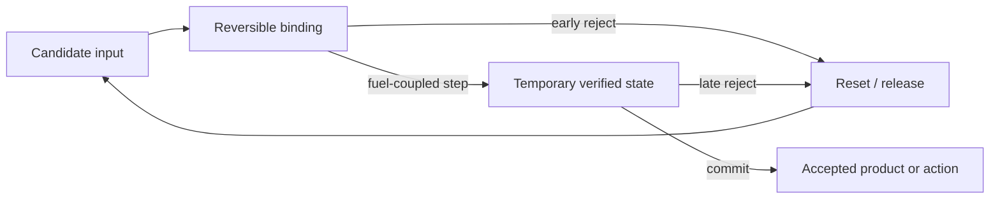

# Chemistry, reaction networks, and proofreading: information–energy audit

<!-- markdownlint-disable MD013 -->

**Date:** 2026-08-05

**Scope:** kinetic proofreading, molecular recognition, energy–accuracy tradeoffs,
nonequilibrium reaction networks, autocatalysis, reaction–diffusion,
compartmentalization, dissipative self-assembly, catalytic networks, chemical
oscillators, and stochastic chemical control

**Ledger state:** candidate evidence only; temporary `CHEM-C*` labels below are
not stable claim IDs and this audit does not change the principle registry

**Purpose:** identify transferable information and control operations without
mistaking a chemical substrate, a biological label, or dissipation itself for a
new AI principle

## Executive finding

Chemistry contributes unusually clean examples of three operations that ordinary
equilibrium recognition does not provide:

1. **Driven staged rejection.** Kinetic proofreading consumes free energy to
   create a delay/reset cycle in which incorrect substrates have additional
   opportunities to leave before commitment. It can exceed equilibrium
   discrimination, but only by paying in rejected work, latency, fuel, or some
   combination of them.
2. **Provenance-preserving locality.** Compartments can keep a catalyst's product
   near the encoding replicator, so selection rewards the producer rather than a
   faster parasite using a shared product. The boundary is an information and
   credit-assignment device as well as a diffusion barrier.
3. **Fuel-coupled lifetime.** A dissipative assembly can exist only while an
   activation flux outruns spontaneous deactivation. Fuel amount and reaction
   rates can therefore program a transient lifetime, although side products,
   kinetic traps, and residual structures prevent assuming perfect fail-closed
   expiration.

The first operation leaves one held project candidate: **reset-coupled staged
verification**. It is not a new registry principle; it composes
[P-003](../principle-registry.md#p-003--temporary-trace-before-commitment),
[P-007](../principle-registry.md#p-007--prediction-error-allocation), and
[P-009](../principle-registry.md#p-009--maintenance-plane). It survives only if a
stage can acquire conditionally useful evidence or run a distinct check, a failed
stage erases or quarantines the partial action, and the design beats a sequential
probability-ratio test, calibrated cascade, retry protocol, and error-correcting
code at equal total cost.

The second operation sharpens the existing P-004/P-008/P-013 bundle but currently
does not justify a new principle. The third is a physical implementation of
P-003/P-009/P-012 and must beat an ordinary lease, time-to-live, watchdog, or
revocable capability.

All other audited families deduplicate:

- equilibrium molecular recognition is statistical classification implemented in
  binding free energies and conformational state;
- general nonequilibrium reaction networks expose the real chemical-work and
  entropy-production budget but do not imply adaptation or intelligence;
- autocatalysis is positive feedback plus resource competition and is already
  represented by selection, reinforcement, and homeostatic constraints;
- reaction–diffusion and equilibrium self-assembly are already covered in the
  [materials audit](2026-08-05-adaptive-materials-and-self-assembly.md);
- programmable catalytic networks are an established analog/molecular computing
  substrate under P-010;
- chemical oscillators reduce to limit-cycle clocks, phase-coupled control, and
  the held entrainable-phase candidate; and
- antithetic integral feedback is a chemically implemented integral controller
  with a scoped mean-adaptation guarantee, not a new control invariant.

## Evidence and transfer boundary

The audit distinguishes four statements that must not be collapsed:

- **physical possibility:** a chemical mechanism exists under stated laboratory
  conditions;
- **formal guarantee:** a theorem holds for a declared rate law, stochastic
  process, or controller class;
- **systems advantage:** the mechanism improves task quality, latency, energy, or
  risk over a matched engineered null; and
- **AI transfer:** an abstract operation remains useful after chemistry-specific
  transport, binding, fabrication, and fuel assumptions are removed.

Primary or foundational papers establish the first two statements. They do not by
themselves establish the last two. Source-specific concentrations, time constants,
error rates, amplification factors, or molecule counts are not reusable constants.

## Common notation and accounting boundary

For a chemical reaction network (CRN) with species-count or concentration vector
$x$, stoichiometric matrix $N$, and reaction-rate vector $v(x)$,

$$
\dot{x}=Nv(x).
$$

$x_i$ is measured in molecules or mol/m³; $N$ is dimensionless molecules per
reaction event; and $v_\rho$ is reaction events/s or mol/(m³·s), consistently with
$x$. In a stochastic well-mixed model, reaction $\rho$ has propensity $a_\rho(x)$
in s⁻¹ and changes the state by stoichiometric vector $\nu_\rho$.

For a reversible reaction with forward and reverse event fluxes $J_\rho^+$ and
$J_\rho^-$, a useful steady-state dissipation boundary is

$$
\dot S_{\mathrm{i}}
=k_B\sum_\rho
\left(J_\rho^+-J_\rho^-\right)
\ln\frac{J_\rho^+}{J_\rho^-}
\ge 0.
$$

$\dot S_{\mathrm{i}}$ is J/(K·s), $k_B$ is J/K, and each $J$ is events/s.
$T\dot S_{\mathrm{i}}$ is W only for an isothermal boundary at absolute
temperature $T$. A deployed comparison must additionally count reagent synthesis,
mixing, pumps, temperature control, containment, purification, sensing, conversion,
reset, waste treatment, and embodied hardware. Chemical free energy consumed in a
reaction vessel is not wall-plug energy.

For one accepted decision or product, report

$$
E_{\mathrm{accepted}}
=\frac{
E_{\mathrm{fuel}}+E_{\mathrm{drive}}+E_{\mathrm{sense}}+E_{\mathrm{reset}}
+E_{\mathrm{reject}}+E_{\mathrm{maint}}+E_{\mathrm{waste}}
}{N_{\mathrm{accepted}}},
$$

where every term is joules over the same boundary. `Rejected` includes fuel and
compute spent on candidates that are later discarded; it is central rather than
overhead in proofreading.

## Mechanism map

| Mechanism | Exact problem | State/information path | Budget and characteristic time | Guarantee and assumptions | Hard failure boundary | Strongest null | Registry mapping | Residual |
| --- | --- | --- | --- | --- | --- | --- | --- | --- |
| Equilibrium molecular recognition | distinguish a target from similar ligands | ligand identity → binding/conformational occupancy → reaction or release | binding free energy, receptor inventory; association/dissociation and conformational times | equilibrium selectivity follows free-energy/occupancy models under equilibrium and specified concentrations | look-alikes with insufficient free-energy separation; saturation; nonspecific binding; slow unbinding | Bayesian classifier, likelihood-ratio test, calibrated threshold, learned embedding | P-001/P-007/P-010 | none |
| Kinetic proofreading | reduce false commitment beyond one equilibrium binding step | bind → driven intermediate(s) → repeated dissociation opportunity → product or reset | chemical work per cycle plus rejected work; dwell time grows with checks | enhanced discrimination in stated kinetic networks; no free universal error factor | correlated or non-discriminating stages, leak/bypass, fuel limitation, intolerable delay | SPRT, cascaded selective classifier, retry/abstention, error-correcting code | P-003/P-007/P-009 | held: reset-coupled staged verification |
| Energy–accuracy bounds | state what accuracy/precision costs are unavoidable | noisy events/current → estimator/controller → output | samples, reaction events, entropy production, delay | Berg–Purcell, TUR, copying, and feedback bounds each hold only for their model class | hidden memory, non-Markov state, external drive, transient operation, changed observable or boundary | estimation theory, rate–distortion, sequential analysis, control/information bounds | evaluation constraint across P-006/P-007/P-009 | none |
| Open nonequilibrium CRNs | maintain a distribution or current away from equilibrium | chemostats/fuel → cycle affinities → reaction fluxes → concentrations | chemical work and entropy production continuously; relaxation/mixing time | first/second-law decompositions for elementary mass-action networks under declared chemostats | unknown coarse-graining, side reactions, spatial gradients, nonideal solution, omitted reservoirs | stochastic thermodynamics and ordinary state-space control | P-006/P-009/P-010 | none |
| Autocatalysis and cooperative catalytic networks | amplify a species or maintain mutually enabling replicators | product catalyses more product; shared substrates couple lineages | feedstock and waste removal; exponential phase only before depletion/inhibition | exponential/cross-catalytic amplification in specific in-vitro systems | parasites, error catastrophe, resource collapse, inhibition, stochastic extinction | branching/replicator dynamics, evolutionary algorithms, beam search | P-004/P-005/P-006 | none |
| Compartmentalization | preserve producer–product association and contain parasites | genotype/catalyst → local product → compartment score → selective propagation | boundary formation, occupancy control, fusion/fission, transport; reaction and generation times | causal genotype–phenotype linkage and parasite resistance in scoped systems | leakage, multiple occupancy, fusion, starvation, small-number extinction, bad group objective | sandbox/provenance, quotas, group selection, sharded evaluation | P-004/P-008/P-013 | sharper test factor, not new P |
| Reaction–diffusion | form or propagate spatial decisions without global address tables | local reactions + diffusion → concentration field → local threshold/action | reagents and gradients; diffusion time $L^2/D$ | pattern/gradient formation in specified models and synthetic systems | quadratic spatial latency, parameter drift, boundary sensitivity, weak addressability | cellular automata, PDE/analog hardware, message-passing controller | P-006/P-010 | none; deduplicated with materials audit |
| Dissipative self-assembly | create temporary structure whose lifetime is kinetically programmed | fuel activates precursor → assembly → spontaneous deactivation/disassembly | activation fuel, deactivation, by-products, cycling; lifetime set by rates and fuel | transient reusable assemblies in specific chemistries | traps, side products, incomplete decay, cumulative waste, replenishment overhead | TTL, lease, watchdog, ephemeral capability, reversible material state | P-003/P-009/P-012 | physical fail-closed lease only if null loses |
| Programmable catalytic/strand-displacement networks | implement nonlinear dynamics or logic in molecular state | formal species/reactions → compiler/design → concentrations → readout | synthesis, auxiliary gates, fuel strands, leakage cleanup, slow kinetics/readout | approximation/compilation results and laboratory logic/oscillators under scale separation | leak reactions, depletion, crosstalk, concentration range, slow propagation, difficult reset | digital/analog circuits, neuromorphic accelerators, CRN simulator | P-010 | none |
| Chemical oscillators | generate autonomous phase, pulses, and waves | chemical free energy → limit cycle → phase/coupling → downstream threshold | reactant turnover and phase maintenance; chemical period and phase-diffusion time | limit-cycle behavior for specified mechanisms; experimental BZ oscillations/waves | depletion, phase noise, entrainment rigidity, temperature sensitivity, mode change | timer, ring oscillator, PLL, recurrent controller, cyclic scheduler | P-006/P-011; held phase candidate | none |
| Stochastic chemical control | regulate noisy molecular abundance despite disturbances | sensed output → controller species → annihilation/integral state → actuation | controller synthesis/annihilation, plant actuation, molecule-count noise; settling time | antithetic integral feedback gives robust mean adaptation under ergodicity/stability/controllability conditions | instability, unreachable set point, finite resources, variance growth, burden, population heterogeneity | integral control, Kalman/LQG, robust/MPC, queue regulation | P-006/P-009 | none |

## 1. Equilibrium molecular recognition is classification, not proofreading

### Observation and scoped evidence

Koshland's induced-fit proposal and the Monod–Wyman–Changeux model establish that
binding can change or select conformational state, and that ligand occupancy can
allosterically alter another site's activity
([Koshland 1958](https://doi.org/10.1073/pnas.44.2.98);
[Monod, Wyman, and Changeux 1965](https://doi.org/10.1016/S0022-2836(65)80285-6)).
Savir and Tlusty provide a statistical-mechanical model in which a small structural
mismatch can improve selectivity by balancing binding energy and deformation cost
([Savir and Tlusty 2007](https://doi.org/10.1371/journal.pone.0000468)). That last
result is a theoretical mechanism, not a universal empirical law that recognizers
should be deliberately mismatched.

At equilibrium, a simple discrimination ratio can be written

$$
D_{\mathrm{eq}}
=\frac{K_d^{W}}{K_d^{R}}
=\exp\!\left(\frac{\Delta G_W-\Delta G_R}{RT}\right),
$$

where $K_d^R$ and $K_d^W$ are molar dissociation constants for right and wrong
ligands, $\Delta G_R$ and $\Delta G_W$ are molar binding free energies in J/mol,
$R$ is J/(mol·K), and $T$ is K. This expression requires equilibrium and a declared
binding model. Occupancy also depends on ligand concentrations; affinity alone is
not posterior probability.

### Transfer and null

The transferable operation is a physically implemented likelihood filter: local
state combines compatibility, concentration, and conformational cost before an
output fires. The strongest null is ordinary signal detection or Bayesian
classification with a calibrated threshold and abstention. A learned embedding or
specialized sensor already moves recurring discrimination into structure under
P-010.

### Failure boundary and disposition

Recognition fails under saturation, nonspecific binding, concentrations outside the
calibration range, slow off-rates, conformational traps, or look-alikes whose score
distributions overlap. Adding states does not create proofreading unless a
nonequilibrium drive and reject/reset path prevent detailed-balance collapse.

**Disposition:** established physical classifier; no residual principle.

## 2. Kinetic proofreading: driven delay and reset before commitment

### Exact problem and mechanism

Hopfield and Ninio independently showed how a delayed, driven reaction pathway can
amplify modest molecular discrimination beyond a single equilibrium binding step
([Hopfield 1974](https://doi.org/10.1073/pnas.71.10.4135);
[Ninio 1975](https://doi.org/10.1016/S0300-9084(75)80139-8)). A candidate binds,
enters one or more intermediates, and either advances or dissociates. A chemical
drive makes the network cyclic rather than merely a reversible chain. Wrong
candidates with faster dissociation are preferentially removed during the added
dwell time.



An idealized $n$-stage scheme may multiply stagewise selectivity, but no expression
such as an error ratio raised to $n$ is universal. Forward rates, reverse rates,
substrate concentrations, bypass reactions, saturation, chemical driving, and
product removal all matter. Murugan, Huse, and Leibler show a three-way
speed–error–dissipation landscape: proofreading is not summarized by “more energy
always gives more accuracy,” and regimes can trade a higher permitted error for a
large speed gain
([Murugan, Huse, and Leibler 2012](https://doi.org/10.1073/pnas.1119911109)).

### State path, budget, and timescale

The information path is candidate identity → bound-state lifetime → driven
intermediate occupancy → accept or reset. The temporary intermediate is useful only
because it remains reversible until commitment. Per accepted output, charge:

$$
W_{\mathrm{proof}}
=n_{\mathrm{fuel}}|\Delta G_{\mathrm{fuel}}|
+W_{\mathrm{rejected}}
+W_{\mathrm{reset}},
$$

where $n_{\mathrm{fuel}}$ is mol of fuel consumed per mol of accepted output,
$\Delta G_{\mathrm{fuel}}$ is J/mol under the actual concentrations, and all terms
are J/mol of accepted output. Average decision time includes every rejected attempt,
not only the successful path.

### Guarantee, assumptions, and boundary

The foundational result is scoped: driven cycling plus discriminatory kinetic rates
can exceed equilibrium selectivity. Sartori and Pigolotti derive thermodynamic
relations for cyclic template-assisted copying and show that effective proofreading
error reduction is limited by the chemical driving in that framework
([Sartori and Pigolotti 2015](https://doi.org/10.1103/PhysRevX.5.041039)). Neither
paper guarantees a particular error reduction for an arbitrary classifier.

The mechanism collapses when successive stages reuse fully correlated evidence,
wrong and right candidates have indistinguishable survival kinetics, leak paths skip
checks, a rejected partial action cannot be undone, or delay cost dominates false-
commit cost.

### Strongest AI/control/statistical null

For observations $z_1,\ldots,z_t$, a sequential probability-ratio test accumulates

$$
L_t=\sum_{i=1}^{t}
\log\frac{p(z_i\mid R,z_{<i})}{p(z_i\mid W,z_{<i})}
$$

and stops at accept/reject thresholds. The conditioning term is essential: treating
correlated repeated checks as independent fabricates confidence. Other mandatory
nulls are a calibrated early-exit cascade, selective classification with abstention,
independent verifier, retry with rollback, and an error-detecting/correcting code.
Here $L_t$ is the dimensionless cumulative log-likelihood ratio and $R$ and $W$
denote the right and wrong hypotheses.

### Residual candidate

**Held candidate: reset-coupled staged verification.** Let a cheap path create only
a reversible trace. Spend a distinct verification budget on uncertain or high-cost
cases, and commit only after the verifier clears the action. On failure, reset the
trace and preserve provenance about which stage rejected it. The candidate is
chemistry-derived only in the conjunction of driven delay, discriminatory escape,
and reset; “check twice” is not sufficient.

**Reject the candidate** if a matched SPRT/cascade achieves the same error–latency–
energy frontier, if later stages acquire no conditional information, or if rollback
is incomplete.

## 3. Energy–accuracy, precision, and speed are model-specific frontiers

### Four non-interchangeable bounds

1. **Diffusive sensing.** Berg and Purcell derived a finite-time concentration-
   sensing limit; in their geometry the least fractional error scales approximately
   as $(t_{\mathrm{obs}} c a D)^{-1/2}$, where $t_{\mathrm{obs}}$ is observation time in s, $c$ is number density,
   $a$ is sensor size in m, and $D$ is m²/s
   ([Berg and Purcell 1977](https://doi.org/10.1016/S0006-3495(77)85544-6)).
   This is a sampling/transport limit, not a cost formula for every sensor.
2. **Noisy feedback.** Lestas, Vinnicombe, and Paulsson bound molecular-noise
   suppression under finite signaling rates. Their quartic-root scaling and the
   associated “16-fold events” interpretation belong to that stochastic biochemical
   control model, not a universal price for doubling AI accuracy
   ([Lestas, Vinnicombe, and Paulsson 2010](https://doi.org/10.1038/nature09333)).
3. **Sensory adaptation.** Lan et al. analyze a minimal stochastic feedback network
   and bacterial chemotaxis data, finding an energy–speed–accuracy tradeoff in that
   adaptation setting
   ([Lan et al. 2012](https://doi.org/10.1038/nphys2276)).
4. **Steady-state currents.** Barato and Seifert's original thermodynamic uncertainty
   relation constrains the relative dispersion of a current in a steady-state Markov
   network by entropy production
   ([Barato and Seifert 2015](https://doi.org/10.1103/PhysRevLett.114.158101)). It
   is not an unrestricted bound for arbitrary transient, externally clocked,
   non-Markov, or feedback-controlled systems.

### Transfer rule

Every proposed “energy buys accuracy” claim must name:

- the random variable being estimated or controlled;
- the observation window and stopping rule;
- whether samples are independent, Markov, or correlated;
- whether the system is transient, periodic, or in a steady state;
- the physical boundary over which entropy production or energy is counted; and
- which latency, throughput, false-positive, and false-negative constraints are held
  equal.

These results are evaluation constraints across P-006/P-007/P-009. They do not
select one architecture and do not justify spending energy on repeated correlated
checks.

## 4. Nonequilibrium reaction networks: the work ledger, not an intelligence theorem

### Exact problem and state path

An open CRN uses chemostatted species or time-varying reservoirs to maintain
concentrations and fluxes that would relax at equilibrium. The path is external
chemical potential → cycle affinity → net reaction currents → maintained state or
product stream. Schnakenberg's network formulation relates master-equation cycles
to generalized forces, fluxes, and entropy production
([Schnakenberg 1976](https://doi.org/10.1103/RevModPhys.48.571)). Rao and Esposito
give first- and second-law balances for open elementary mass-action networks and a
nonequilibrium Gibbs free energy whose excess over equilibrium is the minimal
chemostat work in their framework
([Rao and Esposito 2016](https://doi.org/10.1103/PhysRevX.6.041064)).

### Guarantee and assumptions

Those formalisms are rigorous for their specified stochastic master equation or
deterministic elementary mass-action network, reservoir definitions, and state
variables. A coarse observable can hide dissipative cycles. Crowding, nonideal
activity coefficients, spatial gradients, unmodeled reservoirs, and side reactions
change the accounting.

### Failure boundary and null

Far-from-equilibrium persistence demonstrates maintained state, not goal-directed
adaptation. Horowitz and England found fine-tuning toward environmental forcing in
an *in-silico* class of random many-species networks with forcing accessible to rare
concentration combinations
([Horowitz and England 2017](https://doi.org/10.1073/pnas.1700617114)). That result
does not establish that arbitrary dissipative systems learn, optimize useful work,
or generalize.

The strongest null is the same stochastic thermodynamics plus ordinary nonlinear
state-space control. **Disposition:** accounting framework and P-006/P-009/P-010
constraint; no residual mechanism.

## 5. Autocatalysis and catalytic cooperation: amplification with ecological debts

### Exact problem and mechanism

Autocatalysis solves amplification: a product increases its own production rate.
With abundant substrate $S$, a minimal net model is

$$
\frac{dx}{dt}=(kS-\delta)x,
\qquad
t_{2}=\frac{\ln 2}{kS-\delta},
$$

where $x$ is mol/m³, $kS$ and $\delta$ are s⁻¹, and the doubling time $t_2$ exists
only when $kS>\delta$. Resource depletion, inhibition, mutation, dilution, or
parasites end the exponential regime.

Lincoln and Joyce experimentally constructed two cross-catalytic RNA enzymes that
underwent self-sustained exponential amplification; their reported approximately
one-hour doubling time belongs to that reagent system
([Lincoln and Joyce 2009](https://doi.org/10.1126/science.1167856)). Vaidya et al.
showed that fragments forming cooperative catalytic RNA networks could outgrow
selfish autocatalytic cycles in their in-vitro competition
([Vaidya et al. 2012](https://doi.org/10.1038/nature11549)). These are primary
demonstrations of amplification and cooperative catalysis, not a theorem that
cooperation dominates across substrates or population structures.

### Budget, failure boundary, and null

Charge feedstock, catalyst synthesis, dilution/transfer, temperature control,
unproductive mutants, selection, purification, and waste. Amplification also
amplifies defects. Eigen's error-threshold analysis is the foundational warning:
selection cannot preserve arbitrary information when copying error and sequence
length exceed the model's maintainable regime
([Eigen 1971](https://doi.org/10.1007/BF00623322)).

The strongest nulls are branching processes, replicator dynamics, evolutionary
algorithms, population-based optimization, and beam search with explicit compute
and diversity budgets. The chemistry adds no optimization guarantee.

**Disposition:** established positive feedback and P-004/P-005/P-006 interaction;
no residual principle.

## 6. Compartmentalization as provenance and credit assignment

### Exact problem and state path

A diffusible public product lets a fast nonproducer exploit a catalyst made by
another replicator. A compartment changes the selection unit:

```text
encoding molecule -> local catalyst -> local product
        |                                |
        +------ retained association ----+
                         |
              compartment-level selection
```

Tawfik and Griffiths used water-in-oil compartments to link a gene, its translated
catalyst, and a product attached to the encoding gene, demonstrating selection from
a declared model mixture
([Tawfik and Griffiths 1998](https://doi.org/10.1038/nbt0798-652)). This is a direct
laboratory demonstration that a boundary can implement provenance, not just
isolation.

Szathmáry and Demeter's stochastic-corrector model formalizes selection between
compartments containing competing replicators
([Szathmáry and Demeter 1987](https://doi.org/10.1016/S0022-5193(87)80191-1)).
Ichihashi et al. then evolved a translation-coupled RNA replication system through
repeated compartment cycles; controls without compartmentalization did not show the
same increase in replication ability, and parasitic RNA remained part of the
dynamics
([Ichihashi et al. 2013](https://doi.org/10.1038/ncomms3494)). Matsumura et al.
showed that cycles of transient droplet compartmentalization, selection, and mixing
prevented parasite-driven extinction in their RNA-replicator system
([Matsumura et al. 2016](https://doi.org/10.1126/science.aag1582)).

### Occupancy, budget, and timescale

If molecules enter droplets independently with mean occupancy $\lambda$, the
Poisson baseline is

$$
P(n)=e^{-\lambda}\frac{\lambda^n}{n!}.
$$

Too-large $\lambda$ mixes producer and parasite credit; too-small $\lambda$ wastes
compartments and increases extinction risk. Charge boundary production, loading,
leakage, fusion/fission or re-emulsification, within-compartment resources,
selection/readout, and mixing. Timescales include reaction time inside a compartment
and generation-scale selection across compartments.

### Guarantee, boundary, and strongest null

The evidence is causal but scoped to declared emulsions, occupancy distributions,
selection protocols, and replicators. Compartments fail through leakage, fusion,
multiple occupancy, unequal resources, slow transport, stochastic loss of useful
lineages, or a compartment score that rewards the wrong collective phenotype.

The strongest engineered null is a sandbox with immutable provenance, per-lineage
quotas, sharded evaluation, and group-level selection. This maps to P-004/P-008/
P-013. A sharper experimental factor—**provenance-coupled compartments**—is worth
testing, but it is not a new principle unless physical locality beats explicit
provenance and access control at equal isolation, throughput, and auditability.

## 7. Reaction–diffusion: spatial analog control already audited

### Exact problem and mechanism

Reaction–diffusion systems form spatial fields from local kinetics and transport:

$$
\frac{\partial c}{\partial t}
=D\nabla^2c+R(c;\theta)+s(r,t),
$$

where $c(r,t)$ is mol/m³, $D$ is m²/s, $R$ is mol/(m³·s), $s$ is an imposed source
with the same units, and $\theta$ contains kinetic parameters. Turing showed that
diffusion can destabilize a homogeneous reaction equilibrium and select stationary
spatial modes under stated conditions
([Turing 1952](https://doi.org/10.1098/rstb.1952.0012)). Basu et al. engineered
bacterial sender/receiver circuits whose diffusion and gene-response thresholds
formed declared two-dimensional patterns
([Basu et al. 2005](https://doi.org/10.1038/nature03461)).

The state/information path is a local source or fluctuation → reaction and diffusion
→ concentration profile → local thresholded response. No cell needs a global
coordinate table, but the network, boundary conditions, initial conditions, and
material domain encode the patterning program.

### Budget, timescale, and failure boundary

A diffusive distance $L$ has characteristic time

$$
\tau_D\sim\frac{L^2}{D}.
$$

This quadratic spatial time is the decisive scaling warning. Charge reagent
synthesis, continued source production, transport, containment, cell growth,
environmental stabilization, field sensing, and reset. Patterns drift or disappear
when kinetic ratios, geometry, temperature, boundary conditions, degradation, or
source strength leave the pattern-forming regime.

### Null and deduplication

The strongest nulls are a numerical PDE controller, cellular automaton, local
message passing, resistive/analog field hardware, and a precomputed spatial lookup.
The [materials audit](2026-08-05-adaptive-materials-and-self-assembly.md) already
records reaction–diffusion as distributed analog field computation under P-006 and
P-010. The present audit adds no residual. A chemical wave is not evidence of
reasoning, and a Turing pattern is not a trainable neural network by analogy.

## 8. Dissipative self-assembly: fuel-coupled expiration, not free adaptation

### Difference from the materials audit

The materials audit covers equilibrium molecular self-assembly: target structure is
encoded in component shape and local binding, while annealing and purification
handle kinetic traps. Dissipative self-assembly is a different information–energy
operation. Fuel converts an inactive precursor $A$ to an assembly-competent state
$A^*$; $A^*$ both assembles and spontaneously deactivates:

$$
A+F\xrightarrow{k_a}A^*+W,
\qquad
A^*\xrightarrow{k_d}A,
\qquad
nA^*\rightleftharpoons (A^*)_n.
$$

The structure persists while activation flux exceeds the combined deactivation and
loss flux. Its lifetime is therefore kinetic state, not merely equilibrium binding
energy.
$A$ and $A^*$ are inactive and activated precursor concentrations in mol/m³, $F$
is fuel, $W$ is chemical waste, $n$ is a dimensionless aggregation number,
$k_a$ has the order-dependent mass-action units required by the activation
reaction, and $k_d$ is s⁻¹.

### Primary evidence, budget, and timescale

Boekhoven et al. demonstrated chemically fueled transient fibers whose lifetime,
stiffness, and regeneration depended on fuel-conversion kinetics; nonlinear growth,
shrinkage, and collapse were observed in that material system
([Boekhoven et al. 2015](https://doi.org/10.1126/science.aac6103)). Tena-Solsona et
al. constructed colloids, hydrogels, and self-erasing inks with lifetimes from
minutes to hours in the reported chemistries; additional fuel restored several
cycles, while assemblies could also alter their own hydrolysis rate
([Tena-Solsona et al. 2017](https://doi.org/10.1038/ncomms15895)).

Charge fuel formation and delivery, molar chemical work, deactivation, unproductive
fuel hydrolysis, by-products, assembly loss, sensing, cleanup, and all cycles. A
batch-fuel lifetime is not the same as continuous steady-state power. Do not transfer
the cited minute/hour ranges to another chemistry or to digital memory.

### Guarantee, boundary, null, and residual

The experiments establish tunable transient state in specified networks. They do
not guarantee complete erasure, arbitrary lifetime accuracy, indefinite reusability,
or semantic adaptation. Kinetic traps, side reactions, precipitates, product
poisoning, spatial fuel gradients, cumulative waste, and incomplete disassembly are
the hard boundaries.

The strongest null is an ordinary lease/TTL, watchdog heartbeat, expiring cache,
revocable capability, or volatile memory. The mapping is P-003/P-009/P-012.

**Conditional residual:** a *physical fail-closed lease* is interesting only when
loss of fuel makes continued hazardous action physically impossible, and the design
beats a powered interlock plus watchdog after fuel delivery, residue, verification,
and restart are counted. Otherwise the chemistry is an implementation, not a new
operation.

## 9. Programmable catalytic networks: CRNs are already a computing substrate

### Exact problem and formal result

Abstract CRNs are a programming language for nonlinear dynamics. Soloveichik,
Seelig, and Winfree constructed a systematic DNA strand-displacement translation
for arbitrary formal CRNs and proved approximation in a limit requiring auxiliary
species in large excess and target dynamics slow relative to fast strand-
displacement steps
([Soloveichik, Seelig, and Winfree 2010](https://doi.org/10.1073/pnas.0909380107)).
This is a strong formal result with explicit scale-separation assumptions, not a
claim that a finite wet-lab realization perfectly implements every CRN.

Qian and Winfree experimentally built multilayer digital circuits with catalytic
restoration and thresholding, including a four-bit square-root circuit using the
reported DNA system
([Qian and Winfree 2011](https://doi.org/10.1126/science.1200520)). Qian, Winfree,
and Bruck implemented a four-neuron associative-memory computation with DNA strand
displacement
([Qian, Winfree, and Bruck 2011](https://doi.org/10.1038/nature10262)). Srinivas et
al. compiled formal reaction networks to enzyme-free DNA components and built a
chemical oscillator
([Srinivas et al. 2017](https://doi.org/10.1126/science.aal2052)). These papers are
decisive nulls against presenting “chemical neural networks” or “reaction-network
programming” as an unworked AI idea.

### State path, budget, and failure boundary

The path is formal species and reactions → sequence/compiler design → physical
strand populations → concentration dynamics → optical or molecular readout. Charge
oligonucleotide synthesis, purification, auxiliary gates, fuel strands, leakage and
cleanup reactions, incubation, temperature control, readout, dilution/reset, and
waste. Latency is governed by concentration-dependent kinetics and cascade depth;
reported circuits are not clock-for-clock substitutes for electronics.

Leak reactions, crosstalk, imperfect rate tuning, finite auxiliary inventory,
depletion, concentration dynamic range, slow signal propagation, difficult fan-out,
and expensive reset bound the implementation. The strongest nulls are digital,
analog, and neuromorphic circuits plus a numerical CRN simulator.

**Disposition:** established P-010 substrate offloading; no residual principle.

## 10. Chemical oscillators: autonomous phase with fuel and noise

### Observation and mechanism

Belousov–Zhabotinsky chemistry established macroscopic temporal oscillations and
traveling concentration waves. Field, Körös, and Noyes analyzed the bromate–cerium–
malonic-acid mechanism
([Field, Körös, and Noyes 1972](https://doi.org/10.1021/ja00780a001)); Field and
Noyes derived the Oregonator model and numerically exhibited a stable closed
trajectory reached from different initial conditions
([Field and Noyes 1974](https://doi.org/10.1063/1.1681288)); Zaikin and Zhabotinsky
experimentally reported two-dimensional propagating concentration waves
([Zaikin and Zhabotinsky 1970](https://doi.org/10.1038/225535b0)).

The transferable state is phase on an attracting cycle. Local coupling can
synchronize or propagate phase without transmitting a full global state. The
program resides in reaction topology, rate constants, concentrations, geometry,
and coupling.

### Budget, timescale, guarantee, and boundary

The period is a kinetic property of the specified network; phase precision is
limited by molecule-count noise, environmental fluctuations, and dissipation. Count
reactant turnover, feed and waste removal, mixing, thermal stabilization, coupling,
readout, and restart. A batch oscillator stops as reagents are consumed. A
continuously stirred reactor moves that cost into pumps and chemostats.

The evidence establishes limit-cycle and wave behavior for specified chemical
mechanisms. It does not guarantee an accurate clock, useful computation, or optimal
coordination. Phase diffusion, depletion, entrainment to the wrong signal,
multistability, coupling-induced rigidity, temperature dependence, and bifurcation
to another mode are failure boundaries.

The strongest nulls are an electronic timer, ring oscillator, phase-locked loop,
recurrent controller, and cyclic scheduler. This maps to P-006/P-011 and the held
entrainable-local-phase candidate. **Disposition:** cross-domain evidence for phase
state; no chemistry-specific residual.

## 11. Stochastic chemical control: integral action with molecular costs

### Exact problem and controller state

Gillespie's stochastic simulation algorithm samples statistically exact trajectories
for the assumed well-mixed, elementary, Markov reaction system with known
propensities
([Gillespie 1977](https://doi.org/10.1021/j100540a008)). “Exact” describes the
simulation of that stochastic model, not exact prediction of a real vessel whose
mixing, elementary reactions, rates, and hidden species may be wrong.

Briat, Gupta, and Khammash proposed antithetic integral feedback (AIF) for noisy
biomolecular networks
([Briat, Gupta, and Khammash 2016](https://doi.org/10.1016/j.cels.2016.01.004)).
A minimal controller creates an actuator species $Z_1$ at reference rate $\mu$ and
a sensor species $Z_2$ in proportion $\theta$ to regulated output $Y$; $Z_1$ and
$Z_2$ annihilate:

$$
\varnothing\xrightarrow{\mu}Z_1,
\qquad
Y\xrightarrow{\theta}Y+Z_2,
\qquad
Z_1+Z_2\xrightarrow{\eta}\varnothing.
$$

Taking expectations gives the integral-state relation

$$
\frac{d}{dt}\mathbb E[Z_1-Z_2]
=\mu-\theta\mathbb E[Y].
$$

At a stationary regime satisfying the theorem's conditions,
$\mathbb E[Y]=\mu/\theta$. Aoki et al. later engineered an AIF controller in living
*E. coli* and demonstrated adaptation and growth-rate control in the reported
systems
([Aoki et al. 2019](https://doi.org/10.1038/s41586-019-1321-1)).
$Y$, $Z_1$, and $Z_2$ are molecule counts; $\mu$ is molecules/s, $\theta$ is s⁻¹,
$\eta$ is molecule⁻¹·s⁻¹, and $\mathbb E[\cdot]$ denotes ensemble expectation.

### Guarantee and assumptions

The guarantee is robust perfect adaptation of the regulated **mean** for a class of
stochastic reaction networks under conditions including ergodicity/stability,
finite moments, and a plant/controller interconnection capable of reaching the set
point. It is not zero variance, zero transient error, arbitrary disturbance
rejection, or stability for every gain. The experimental paper validates specific
circuits and conditions rather than every intracellular network.

### Budget, boundary, null, and disposition

Charge synthesis and annihilation of controller molecules, plant actuation,
measurement coupling, metabolic burden, settling time, overshoot, variance, and
population heterogeneity. Integral action can destabilize a delayed plant, amplify
noise, saturate actuators, or demand an unreachable set point. Low molecule counts
also create extinction and burst effects.

The strongest nulls are standard integral control, Kalman/LQG estimation, robust
control, model-predictive control, and queue regulation. AIF is an elegant molecular
realization of P-006 with maintenance costs under P-009. **Disposition:** no new
principle.

## Cross-mechanism deduplication

### Distinct operations retained

| Retained operation | Why it is not the materials-audit mechanism | Existing bundle | Promotion gate |
| --- | --- | --- | --- |
| Reset-coupled staged verification | information is revisited through driven reject/reset paths before irreversible commitment; it is not structure formation | P-003 + P-007 + P-009 | beat SPRT, calibrated cascades, retry/rollback, and codes with conditionally informative stages |
| Provenance-coupled compartment | boundary preserves producer–product association so selection credits the producer; not merely component isolation | P-004 + P-008 + P-013 | beat explicit provenance, sandboxing, quota, and sharded group evaluation under leakage and occupancy sweeps |
| Fuel-coupled expiration | continuous or batch activation creates a finite-lived nonequilibrium state; equilibrium assembly seeks a persistent low-free-energy structure | P-003 + P-009 + P-012 | beat TTL/lease/watchdog and powered interlock including residue, fuel delivery, verification, and restart |

### Mechanisms rejected as duplicates

- Molecular recognition is equilibrium classification and structural specialization.
- Reaction–diffusion is distributed analog field computation already recorded in
  the materials audit.
- Autocatalysis is positive feedback and population amplification, with ordinary
  resource and parasite failure modes.
- Catalytic networks and DNA circuits are established special-purpose computing.
- Chemical oscillation is phase-state control and scheduling.
- Antithetic feedback is integral control in a stochastic molecular substrate.
- Nonequilibrium thermodynamics is the correct work ledger, not a behavioral
  mechanism by itself.

## Equal-budget decisive tests

### Test A — staged verification versus sequential statistical nulls

**Task.** High-cost false commitment under a stream of cheap, correlated evidence
and an optional expensive independent check: for example tool execution with a
reversible dry-run followed by a separately implemented safety verifier.

**Arms.** Single calibrated threshold; fixed-depth cascade; SPRT with the correct
conditional likelihood; selective classifier with abstention; retry plus rollback;
error-detecting code or redundant verifier; reset-coupled staged verification.

**Equalize.** Total observations, verifier calls, model FLOPs, bytes moved, wall
time, rollback work, false-positive cost, and energy at the wall. Include rejected
attempts and partial actions.

**Measure.** False commits, false rejects, expected stopping time, joules/accepted
correct action, tail latency, rollback completeness, calibration, and performance as
check correlation rises.

**Decisive prediction.** The chemistry-derived candidate should help only when a
later stage adds conditional information or a different failure detector and reset
is cheaper than a false commit. Reject it if the SPRT/cascade frontier matches it or
if correlated checks create false confidence.

### Test B — provenance-coupled compartments versus explicit attribution

**Task.** Evolving or selecting modules that emit a shareable useful artifact while
fast free riders can consume the artifact without producing it.

**Arms.** Global pool; static sandbox; cryptographic provenance with per-lineage
reward; resource quotas; sharded group evaluation; transient compartment/mixing
cycles.

**Equalize.** Total evaluations, population size, compute, communication, storage,
selection pressure, and artifact access. Sweep group size and leakage.

**Measure.** Producer survival, useful artifact rate, parasite fraction, diversity,
misattributed credit, stochastic extinction, and joules/useful artifact.

**Decisive prediction.** Compartments should matter when locality makes
producer–product attribution cheaper or more causally faithful. Reject a biological
advantage claim if explicit provenance and quotas dominate or if compartment-level
selection rewards mediocre groups and suppresses superior specialists.

### Test C — physical fuel-coupled lease versus digital expiration

**Task.** A hazardous actuator or capability must become unavailable after loss of
authorization/maintenance energy.

**Arms.** Software TTL; signed renewable lease; watchdog plus powered interlock;
volatile hardware latch; fuel-coupled transient material/state.

**Equalize.** Availability window, false-shutdown tolerance, attack model, sensing,
renewal traffic, standby energy, restart time, verification, and manufacturing
boundary.

**Measure.** Probability of action after authority loss, premature expiry, residual
hazard, joules/authorized hour, waste/cycle, recovery latency, and failure under
stuck-on, stuck-off, and communication-partition faults.

**Decisive prediction.** The chemical mechanism survives only if fuel loss enforces
physical unavailability with lower lifecycle risk/cost than the best powered
interlock. Visible fading or nominal disassembly is insufficient.

### Test D — CRN substrate versus matched electronic and simulated dynamics

**Task.** A declared nonlinear controller or temporal classifier at a physical
sensor boundary.

**Arms.** Wet CRN/strand displacement; analog electronic circuit; microcontroller;
FPGA/ASIC estimate; numerical CRN; physical reservoir.

**Equalize.** Input/output transduction, task accuracy, bandwidth, latency,
temperature control, calibration, reset, drift, fabrication yield, and lifetime uses.

**Measure.** Joules/correct output, response time, dynamic range, programmability,
leak/crosstalk error, reagent and waste mass, and recalibration interval.

**Decisive prediction.** Chemistry wins only when sensing, dynamics, and actuation
are colocated so conversion and communication disappear. A demonstration that
computes the function is not an efficiency result.

### Test E — stochastic integral controller versus control-theory nulls

**Task.** Regulate a noisy birth–death plant with disturbances, delay, actuator
saturation, and changing load.

**Arms.** AIF; digital PI; LQG; robust PI; MPC; feed-forward plus PI.

**Equalize.** Sensing rate, actuation range, controller state precision/molecule
count, energy, and settling-time target.

**Measure.** mean steady-state error, variance, overshoot, stability region,
recovery time, control effort, and joules within tolerance.

**Decisive prediction.** AIF should reproduce its mean-adaptation guarantee inside
the theorem's conditions and lose outside them. Reject any broader “noise exploits
itself for free control” claim if variance or controller turnover erases the gain.

## Temporary candidate claims for ledger review

These labels deliberately avoid the stable `C-` namespace. Promotion requires a
later edit to `research/claims.md` and `research/references.bib` by the integrating
agent.

| Temporary label | Proposed scoped claim | Status | Primary support | Principle impact |
| --- | --- | --- | --- | --- |
| CHEM-C01 | Equilibrium binding and conformational change can implement selective molecular recognition, but affinity alone is not posterior probability and does not constitute kinetic proofreading. | established mechanism; transfer boundary established | `koshland1958specificity`, `monod1965allosteric`, `savir2007conformational` | P-001/P-007/P-010; no new P |
| CHEM-C02 | A driven multistep pathway with discriminatory dissociation and reset can improve specificity beyond a single equilibrium discrimination step. | established within stated kinetic models | `hopfield1974proofreading`, `ninio1975kinetic` | P-003/P-007/P-009 composition |
| CHEM-C03 | Proofreading occupies a speed–error–dissipation frontier; added stages or fuel do not provide a universal monotonic accuracy gain. | established theoretical result for declared networks | `murugan2012speed`, `sartori2015thermodynamics` | evaluation constraint |
| CHEM-C04 | Finite-time sensing, noisy feedback, copying, and steady-state current precision have different lower bounds and assumptions; their numerical scalings are not interchangeable. | established scoped theories | `berg1977chemoreception`, `lestas2010limits`, `lan2012tradeoff`, `barato2015tur` | cross-cutting evaluation constraint |
| CHEM-C05 | Open elementary mass-action networks require explicit chemostat work and entropy-production accounting to maintain nonequilibrium state; coarse-graining can hide reservoirs and cycles. | established theoretical framework | `schnakenberg1976network`, `rao2016nonequilibrium` | P-006/P-009/P-010 boundary |
| CHEM-C06 | Autocatalytic and cooperative RNA systems can amplify and compete in vitro, while resource depletion, parasites, mutation, and selection conditions limit transfer. | established scoped experiments | `lincoln2009replication`, `vaidya2012network`, `eigen1971selforganization` | P-004/P-005/P-006 |
| CHEM-C07 | Compartments can causally preserve genotype–phenotype association and, under scoped selection/mixing protocols, prevent parasite-driven extinction. | established scoped experiments and model | `tawfik1998compartments`, `szathmary1987group`, `ichihashi2013darwinian`, `matsumura2016transient` | sharpens P-004/P-008/P-013 |
| CHEM-C08 | Reaction and diffusion can form spatial patterns from local fields, with a characteristic diffusion time scaling as $L^2/D$. | established theory and scoped synthetic demonstration | `turing1952morphogenesis`, `basu2005pattern` | existing P-006/P-010; materials-audit duplicate |
| CHEM-C09 | Chemical fuel can program transient assembly lifetime in specific synthetic materials, but complete erasure and lifecycle efficiency are unproven outside each chemistry. | established scoped experiments | `boekhoven2015transient`, `tenasolsona2017nonequilibrium` | P-003/P-009/P-012 implementation |
| CHEM-C10 | Formal CRNs can be compiled approximately into DNA strand-displacement systems under scale-separation and inventory assumptions, and molecular logic/neural/oscillator circuits have been demonstrated. | established formal and experimental result | `soloveichik2010dna`, `qian2011scaling`, `qian2011neural`, `srinivas2017enzymefree` | established P-010 substrate null |
| CHEM-C11 | Chemical limit cycles and propagating waves provide autonomous phase state, not a general accuracy, computation, or energy-efficiency guarantee. | established scoped mechanism | `field1972oscillations`, `field1974oregonator`, `zaikin1970waves` | P-006/P-011; held phase candidate |
| CHEM-C12 | Antithetic integral feedback can guarantee robust perfect adaptation of a regulated mean under stated stochastic-network conditions and has been implemented experimentally, but it does not guarantee low variance or universal stability. | established theorem and scoped experiment | `briat2016antithetic`, `aoki2019universal` | P-006/P-009; no new P |
| CHEM-C13 | Reset-coupled staged verification may reduce costly false commitment when stages add conditional information and rollback is cheap. | speculative project hypothesis after sequential-testing normalization | components in `hopfield1974proofreading`, `murugan2012speed`; strongest nulls have no chemistry dependency | held candidate across P-003/P-007/P-009 |
| CHEM-C14 | Physical locality may improve credit assignment when producer and shareable product cannot otherwise be attributed cheaply and reliably. | plausible systems hypothesis; not established AI advantage | `tawfik1998compartments`, `matsumura2016transient` | test factor across P-004/P-008/P-013 |
| CHEM-C15 | A fuel-coupled transient state may serve as a fail-closed physical lease when loss of fuel makes hazardous action impossible. | speculative engineering hypothesis | component feasibility in `boekhoven2015transient`, `tenasolsona2017nonequilibrium` | P-003/P-009/P-012; no new P unless interlock null loses |

## Unsupported analogies to reject

- **“ATP makes the brain efficient, so add a compute currency.”** A chemical
  potential is a physical work reservoir with stoichiometry and waste. A software
  token is useful only if it constrains measured resources and cannot be bypassed.
- **“More proofreading stages eliminate hallucinations.”** Stages help only with
  discriminatory, conditionally informative checks; correlated self-review can
  increase confidence without reducing error.
- **“Dissipation causes learning.”** Driven CRNs can maintain currents or favor
  states under a specified forcing landscape. Goal alignment, generalization, and
  useful adaptation require separate evidence.
- **“Autocatalysis is recursive self-improvement.”** It is amplification. It can
  amplify parasites, copying error, and resource collapse as readily as useful
  function.
- **“A compartment is a mixture-of-experts router.”** The distinctive operation is
  producer–product provenance and interaction containment, not merely placing items
  in groups.
- **“Chemical oscillations are a free clock.”** Reactants, chemostats, waste
  removal, stabilization, phase noise, and readout carry the clock cost.
- **“Exact Gillespie simulation means exact chemistry.”** It is exact sampling of a
  declared Markov jump model; model mismatch remains.
- **“Threshold or associative molecular circuits imply cognitive equivalence.”**
  The cited circuits implement the named formal computations. Their substrate
  does not supply semantic learning or an efficiency advantage by itself.
- **“A self-erasing ink guarantees secure deletion.”** Residue, by-products,
  incomplete disassembly, and recoverable traces must be assayed.
- **“A thermodynamic uncertainty relation is one universal AI energy law.”** The
  observable, stochastic dynamics, stationarity, driving protocol, and physical
  boundary determine whether a specific relation applies.

## Recommended experiment order

1. Run Test A in software first. It directly tests the only held information-
   processing candidate and cheaply exposes correlated-check failure.
2. Run Test B in a synthetic modular population with controlled free riders. It
   separates provenance from mere isolation.
3. Formalize the project's energy boundary using the CRN ledger before quoting any
   biochemical energy–accuracy result.
4. Run Test E in simulation to validate that theorem conditions and mean/variance
   reporting are understood before considering wet hardware.
5. Defer Test C until a safety-critical physical actuator offers a real colocated
   advantage; otherwise digital leases dominate.
6. Defer wet CRN compute comparisons until a sensor–compute–actuator path can avoid
   conversions; molecular logic alone is already established.

## Bibliography (audit-local BibTeX)

These entries are complete for the works cited by this audit. They are duplicated
locally so the evidence remains reviewable without modifying the shared bibliography
during parallel work.

```bibtex
@article{aoki2019universal,
  author = {Aoki, Stephanie K. and Lillacci, Gabriele and Gupta, Ankit and Baumschlager, Armin and Schweingruber, David and Khammash, Mustafa},
  title = {A Universal Biomolecular Integral Feedback Controller for Robust Perfect Adaptation},
  journal = {Nature},
  year = {2019},
  volume = {570},
  number = {7762},
  pages = {533--537},
  doi = {10.1038/s41586-019-1321-1},
  url = {https://doi.org/10.1038/s41586-019-1321-1}
}

@article{barato2015tur,
  author = {Barato, Andre C. and Seifert, Udo},
  title = {Thermodynamic Uncertainty Relation for Biomolecular Processes},
  journal = {Physical Review Letters},
  year = {2015},
  volume = {114},
  number = {15},
  pages = {158101},
  doi = {10.1103/PhysRevLett.114.158101},
  url = {https://doi.org/10.1103/PhysRevLett.114.158101}
}

@article{basu2005pattern,
  author = {Basu, Subhayu and Gerchman, Yoram and Collins, Cynthia H. and Arnold, Frances H. and Weiss, Ron},
  title = {A Synthetic Multicellular System for Programmed Pattern Formation},
  journal = {Nature},
  year = {2005},
  volume = {434},
  number = {7037},
  pages = {1130--1134},
  doi = {10.1038/nature03461},
  url = {https://doi.org/10.1038/nature03461}
}

@article{berg1977chemoreception,
  author = {Berg, Howard C. and Purcell, Edward M.},
  title = {Physics of Chemoreception},
  journal = {Biophysical Journal},
  year = {1977},
  volume = {20},
  number = {2},
  pages = {193--219},
  doi = {10.1016/S0006-3495(77)85544-6},
  url = {https://doi.org/10.1016/S0006-3495(77)85544-6}
}

@article{boekhoven2015transient,
  author = {Boekhoven, Job and Hendriksen, Wouter E. and Koper, Ger J. M. and Eelkema, Rienk and van Esch, Jan H.},
  title = {Transient Assembly of Active Materials Fueled by a Chemical Reaction},
  journal = {Science},
  year = {2015},
  volume = {349},
  number = {6252},
  pages = {1075--1079},
  doi = {10.1126/science.aac6103},
  url = {https://doi.org/10.1126/science.aac6103}
}

@article{briat2016antithetic,
  author = {Briat, Corentin and Gupta, Ankit and Khammash, Mustafa},
  title = {Antithetic Integral Feedback Ensures Robust Perfect Adaptation in Noisy Biomolecular Networks},
  journal = {Cell Systems},
  year = {2016},
  volume = {2},
  number = {1},
  pages = {15--26},
  doi = {10.1016/j.cels.2016.01.004},
  url = {https://doi.org/10.1016/j.cels.2016.01.004}
}

@article{eigen1971selforganization,
  author = {Eigen, Manfred},
  title = {Selforganization of Matter and the Evolution of Biological Macromolecules},
  journal = {Naturwissenschaften},
  year = {1971},
  volume = {58},
  number = {10},
  pages = {465--523},
  doi = {10.1007/BF00623322},
  url = {https://doi.org/10.1007/BF00623322}
}

@article{field1972oscillations,
  author = {Field, Richard J. and K{\H{o}}r{\H{o}}s, Endre and Noyes, Richard M.},
  title = {Oscillations in Chemical Systems. {II}. Thorough Analysis of Temporal Oscillation in the Bromate--Cerium--Malonic Acid System},
  journal = {Journal of the American Chemical Society},
  year = {1972},
  volume = {94},
  number = {25},
  pages = {8649--8664},
  doi = {10.1021/ja00780a001},
  url = {https://doi.org/10.1021/ja00780a001}
}

@article{field1974oregonator,
  author = {Field, Richard J. and Noyes, Richard M.},
  title = {Oscillations in Chemical Systems. {IV}. Limit Cycle Behavior in a Model of a Real Chemical Reaction},
  journal = {The Journal of Chemical Physics},
  year = {1974},
  volume = {60},
  number = {5},
  pages = {1877--1884},
  doi = {10.1063/1.1681288},
  url = {https://doi.org/10.1063/1.1681288}
}

@article{gillespie1977exact,
  author = {Gillespie, Daniel T.},
  title = {Exact Stochastic Simulation of Coupled Chemical Reactions},
  journal = {The Journal of Physical Chemistry},
  year = {1977},
  volume = {81},
  number = {25},
  pages = {2340--2361},
  doi = {10.1021/j100540a008},
  url = {https://doi.org/10.1021/j100540a008}
}

@article{hopfield1974proofreading,
  author = {Hopfield, John J.},
  title = {Kinetic Proofreading: A New Mechanism for Reducing Errors in Biosynthetic Processes Requiring High Specificity},
  journal = {Proceedings of the National Academy of Sciences of the United States of America},
  year = {1974},
  volume = {71},
  number = {10},
  pages = {4135--4139},
  doi = {10.1073/pnas.71.10.4135},
  url = {https://doi.org/10.1073/pnas.71.10.4135}
}

@article{horowitz2017finetuning,
  author = {Horowitz, Jordan M. and England, Jeremy L.},
  title = {Spontaneous Fine-Tuning to Environment in Many-Species Chemical Reaction Networks},
  journal = {Proceedings of the National Academy of Sciences of the United States of America},
  year = {2017},
  volume = {114},
  number = {29},
  pages = {7565--7570},
  doi = {10.1073/pnas.1700617114},
  url = {https://doi.org/10.1073/pnas.1700617114}
}

@article{ichihashi2013darwinian,
  author = {Ichihashi, Norikazu and Usui, Kazufumi and Kazuta, Yasuaki and Sunami, Takeshi and Matsuura, Tomoaki and Yomo, Tetsuya},
  title = {Darwinian Evolution in a Translation-Coupled {RNA} Replication System within a Cell-Like Compartment},
  journal = {Nature Communications},
  year = {2013},
  volume = {4},
  pages = {2494},
  doi = {10.1038/ncomms3494},
  url = {https://doi.org/10.1038/ncomms3494}
}

@article{koshland1958specificity,
  author = {Koshland, Daniel E.},
  title = {Application of a Theory of Enzyme Specificity to Protein Synthesis},
  journal = {Proceedings of the National Academy of Sciences of the United States of America},
  year = {1958},
  volume = {44},
  number = {2},
  pages = {98--104},
  doi = {10.1073/pnas.44.2.98},
  url = {https://doi.org/10.1073/pnas.44.2.98}
}

@article{lan2012tradeoff,
  author = {Lan, Ganhui and Sartori, Pablo and Neumann, Silke and Sourjik, Victor and Tu, Yuhai},
  title = {The Energy--Speed--Accuracy Trade-Off in Sensory Adaptation},
  journal = {Nature Physics},
  year = {2012},
  volume = {8},
  number = {5},
  pages = {422--428},
  doi = {10.1038/nphys2276},
  url = {https://doi.org/10.1038/nphys2276}
}

@article{lestas2010limits,
  author = {Lestas, Ioannis and Vinnicombe, Glenn and Paulsson, Johan},
  title = {Fundamental Limits on the Suppression of Molecular Fluctuations},
  journal = {Nature},
  year = {2010},
  volume = {467},
  number = {7312},
  pages = {174--178},
  doi = {10.1038/nature09333},
  url = {https://doi.org/10.1038/nature09333}
}

@article{lincoln2009replication,
  author = {Lincoln, Tracey A. and Joyce, Gerald F.},
  title = {Self-Sustained Replication of an {RNA} Enzyme},
  journal = {Science},
  year = {2009},
  volume = {323},
  number = {5918},
  pages = {1229--1232},
  doi = {10.1126/science.1167856},
  url = {https://doi.org/10.1126/science.1167856}
}

@article{matsumura2016transient,
  author = {Matsumura, Shigeyoshi and Kun, {\'A}d{\'a}m and Ryckelynck, Michael and Coldren, Faith and Szil{\'a}gyi, Andr{\'a}s and Jossinet, Fabrice and Rick, Christian and Nghe, Philippe and Szathm{\'a}ry, E{\"o}rs and Griffiths, Andrew D.},
  title = {Transient Compartmentalization of {RNA} Replicators Prevents Extinction Due to Parasites},
  journal = {Science},
  year = {2016},
  volume = {354},
  number = {6317},
  pages = {1293--1296},
  doi = {10.1126/science.aag1582},
  url = {https://doi.org/10.1126/science.aag1582}
}

@article{monod1965allosteric,
  author = {Monod, Jacques and Wyman, Jeffries and Changeux, Jean-Pierre},
  title = {On the Nature of Allosteric Transitions: A Plausible Model},
  journal = {Journal of Molecular Biology},
  year = {1965},
  volume = {12},
  number = {1},
  pages = {88--118},
  doi = {10.1016/S0022-2836(65)80285-6},
  url = {https://doi.org/10.1016/S0022-2836(65)80285-6}
}

@article{murugan2012speed,
  author = {Murugan, Arvind and Huse, David A. and Leibler, Stanislas},
  title = {Speed, Dissipation, and Error in Kinetic Proofreading},
  journal = {Proceedings of the National Academy of Sciences of the United States of America},
  year = {2012},
  volume = {109},
  number = {30},
  pages = {12034--12039},
  doi = {10.1073/pnas.1119911109},
  url = {https://doi.org/10.1073/pnas.1119911109}
}

@article{ninio1975kinetic,
  author = {Ninio, Jacques},
  title = {Kinetic Amplification of Enzyme Discrimination},
  journal = {Biochimie},
  year = {1975},
  volume = {57},
  number = {5},
  pages = {587--595},
  doi = {10.1016/S0300-9084(75)80139-8},
  url = {https://doi.org/10.1016/S0300-9084(75)80139-8}
}

@article{qian2011neural,
  author = {Qian, Lulu and Winfree, Erik and Bruck, Jehoshua},
  title = {Neural Network Computation with {DNA} Strand Displacement Cascades},
  journal = {Nature},
  year = {2011},
  volume = {475},
  number = {7356},
  pages = {368--372},
  doi = {10.1038/nature10262},
  url = {https://doi.org/10.1038/nature10262}
}

@article{qian2011scaling,
  author = {Qian, Lulu and Winfree, Erik},
  title = {Scaling Up Digital Circuit Computation with {DNA} Strand Displacement Cascades},
  journal = {Science},
  year = {2011},
  volume = {332},
  number = {6034},
  pages = {1196--1201},
  doi = {10.1126/science.1200520},
  url = {https://doi.org/10.1126/science.1200520}
}

@article{rao2016nonequilibrium,
  author = {Rao, Riccardo and Esposito, Massimiliano},
  title = {Nonequilibrium Thermodynamics of Chemical Reaction Networks: Wisdom from Stochastic Thermodynamics},
  journal = {Physical Review X},
  year = {2016},
  volume = {6},
  number = {4},
  pages = {041064},
  doi = {10.1103/PhysRevX.6.041064},
  url = {https://doi.org/10.1103/PhysRevX.6.041064}
}

@article{sartori2015thermodynamics,
  author = {Sartori, Pablo and Pigolotti, Simone},
  title = {Thermodynamics of Error Correction},
  journal = {Physical Review X},
  year = {2015},
  volume = {5},
  number = {4},
  pages = {041039},
  doi = {10.1103/PhysRevX.5.041039},
  url = {https://doi.org/10.1103/PhysRevX.5.041039}
}

@article{savir2007conformational,
  author = {Savir, Yonatan and Tlusty, Tsvi},
  title = {Conformational Proofreading: The Impact of Conformational Changes on the Specificity of Molecular Recognition},
  journal = {PLOS ONE},
  year = {2007},
  volume = {2},
  number = {5},
  pages = {e468},
  doi = {10.1371/journal.pone.0000468},
  url = {https://doi.org/10.1371/journal.pone.0000468}
}

@article{schnakenberg1976network,
  author = {Schnakenberg, J{\"u}rgen},
  title = {Network Theory of Microscopic and Macroscopic Behavior of Master Equation Systems},
  journal = {Reviews of Modern Physics},
  year = {1976},
  volume = {48},
  number = {4},
  pages = {571--585},
  doi = {10.1103/RevModPhys.48.571},
  url = {https://doi.org/10.1103/RevModPhys.48.571}
}

@article{soloveichik2010dna,
  author = {Soloveichik, David and Seelig, Georg and Winfree, Erik},
  title = {{DNA} as a Universal Substrate for Chemical Kinetics},
  journal = {Proceedings of the National Academy of Sciences of the United States of America},
  year = {2010},
  volume = {107},
  number = {12},
  pages = {5393--5398},
  doi = {10.1073/pnas.0909380107},
  url = {https://doi.org/10.1073/pnas.0909380107}
}

@article{srinivas2017enzymefree,
  author = {Srinivas, Niranjan and Parkin, James and Seelig, Georg and Winfree, Erik and Soloveichik, David},
  title = {Enzyme-Free Nucleic Acid Dynamical Systems},
  journal = {Science},
  year = {2017},
  volume = {358},
  number = {6369},
  pages = {eaal2052},
  doi = {10.1126/science.aal2052},
  url = {https://doi.org/10.1126/science.aal2052}
}

@article{szathmary1987group,
  author = {Szathm{\'a}ry, E{\"o}rs and Demeter, L{\'a}szl{\'o}},
  title = {Group Selection of Early Replicators and the Origin of Life},
  journal = {Journal of Theoretical Biology},
  year = {1987},
  volume = {128},
  number = {4},
  pages = {463--486},
  doi = {10.1016/S0022-5193(87)80191-1},
  url = {https://doi.org/10.1016/S0022-5193(87)80191-1}
}

@article{tawfik1998compartments,
  author = {Tawfik, Dan S. and Griffiths, Andrew D.},
  title = {Man-Made Cell-Like Compartments for Molecular Evolution},
  journal = {Nature Biotechnology},
  year = {1998},
  volume = {16},
  number = {7},
  pages = {652--656},
  doi = {10.1038/nbt0798-652},
  url = {https://doi.org/10.1038/nbt0798-652}
}

@article{tenasolsona2017nonequilibrium,
  author = {Tena-Solsona, Marta and Rie{\ss}, Benedikt and Gr{\"o}tsch, Raphael K. and L{\"o}hrer, Franziska C. and Wanzke, Caren and K{\"a}sdorf, Benjamin and Bausch, Andreas R. and M{\"u}ller-Buschbaum, Peter and Lieleg, Oliver and Boekhoven, Job},
  title = {Non-Equilibrium Dissipative Supramolecular Materials with a Tunable Lifetime},
  journal = {Nature Communications},
  year = {2017},
  volume = {8},
  pages = {15895},
  doi = {10.1038/ncomms15895},
  url = {https://doi.org/10.1038/ncomms15895}
}

@article{turing1952morphogenesis,
  author = {Turing, Alan M.},
  title = {The Chemical Basis of Morphogenesis},
  journal = {Philosophical Transactions of the Royal Society of London. Series B, Biological Sciences},
  year = {1952},
  volume = {237},
  number = {641},
  pages = {37--72},
  doi = {10.1098/rstb.1952.0012},
  url = {https://doi.org/10.1098/rstb.1952.0012}
}

@article{vaidya2012network,
  author = {Vaidya, Nilesh and Manapat, Michael L. and Chen, Irene A. and Xulvi-Brunet, Ramon and Hayden, Eric J. and Lehman, Niles},
  title = {Spontaneous Network Formation among Cooperative {RNA} Replicators},
  journal = {Nature},
  year = {2012},
  volume = {491},
  number = {7422},
  pages = {72--77},
  doi = {10.1038/nature11549},
  url = {https://doi.org/10.1038/nature11549}
}

@article{zaikin1970waves,
  author = {Zaikin, Anatol M. and Zhabotinsky, Anatol M.},
  title = {Concentration Wave Propagation in Two-Dimensional Liquid-Phase Self-Oscillating System},
  journal = {Nature},
  year = {1970},
  volume = {225},
  number = {5232},
  pages = {535--537},
  doi = {10.1038/225535b0},
  url = {https://doi.org/10.1038/225535b0}
}
```
