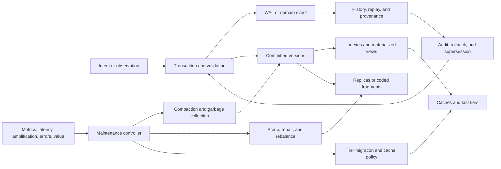

# Databases and storage systems: contracts, lifecycle, and placement audit

<!-- markdownlint-disable MD013 -->

**Date:** 2026-08-05

**Scope:** transactions, recovery, isolation, consistency, replication,
quorums, indexing, locality, caches, log-structured merge trees, compaction,
garbage collection, event sourcing, temporal and versioned data, erasure
coding, repair, and adaptive storage tiering

**Purpose:** establish the strongest conventional database and storage nulls
for claims about AI memory, consolidation, shared state, repair, and resource
allocation; keep distinct guarantees distinct; and determine whether any
experiment-ready residual remains after deduplication against
[P-001](../principle-registry.md#p-001--selective-allocation),
[P-002](../principle-registry.md#p-002--local-autonomy-with-exception-escalation),
[P-003](../principle-registry.md#p-003--temporary-trace-before-commitment),
[P-004](../principle-registry.md#p-004--diversity-selection-and-protection),
[P-005](../principle-registry.md#p-005--use-dependent-topology),
[P-006](../principle-registry.md#p-006--homeostatic-negative-feedback),
[P-007](../principle-registry.md#p-007--prediction-error-allocation),
[P-008](../principle-registry.md#p-008--compartmentalized-interaction),
[P-009](../principle-registry.md#p-009--maintenance-plane),
[P-010](../principle-registry.md#p-010--structural-offloading-and-co-design),
[P-011](../principle-registry.md#p-011--transient-communication-coalitions),
[P-012](../principle-registry.md#p-012--memory-matched-to-information-lifetime),
and [P-013](../principle-registry.md#p-013--externalized-shared-state).

This audit also explicitly checks
[Candidate 009](../../experiments/candidates/009-graded-assurance-envelopes.md),
[Candidate 011](../../experiments/candidates/011-dual-loop-operational-assurance.md),
and
[Candidate 014](../../experiments/candidates/014-versioned-observation-contract.md)
against the existing
[memory](2026-08-05-memory-replay-forgetting.md),
[fault-tolerance](2026-08-05-fault-tolerance-and-reconstruction.md), and
[programming-languages](2026-08-05-programming-languages-verification.md)
audits.

## Executive finding

There is no new storage principle in the present concept. There is a much more
useful result: databases force us to replace the single word **memory** with a
set of contracts that must not be conflated.

- **Atomicity** concerns all-or-nothing effects inside a declared transaction
  boundary. **Isolation** concerns interference among concurrent transactions.
  **Durability** concerns what survives acknowledged completion. None of these
  means that the stored proposition is true or the application invariant is
  correctly specified.
- **Serializability** constrains concurrent transaction histories.
  **Linearizability** additionally respects real-time operation order for a
  concurrent object. Neither follows merely from keeping versions.
- **Replication, quorum protocols, consensus, and erasure codes** preserve
  bytes or an ordered state-machine history under stated failure models. They
  do not create independent judgment, semantic diversity, or correct commands.
- An **index** is an access path. A **cache** is a capacity-limited copy chosen
  for an objective such as latency, bandwidth, or cost. A **materialized view**
  is derived state. None is automatically an importance model, factual memory,
  or cognitive association.
- **LSM compaction** trades write, read, space, and tail-latency costs while
  preserving a declared key-value view. **Garbage collection** reclaims objects
  or versions that are unreachable or no longer visible under explicit roots,
  snapshots, and retention rules. Neither is evidence of biological
  consolidation or adaptive forgetting.
- **Event sourcing, write-ahead logging, change-data capture, audit logs, and
  provenance** are different. Replaying an event stream reconstructs state only
  if order, schemas, handlers, upcasters, and relevant external-effect semantics
  remain valid.
- **Valid time, system/transaction time, event time, and processing time** are
  different clocks. Candidate 014 already owns the project-level requirement
  to expose observation vintage, support, lineage, supersession, and response
  version.
- **Adaptive cache and tiering policies** already learn from recency, frequency,
  object size, miss penalty, and device economics. Any proposal based only on
  “hotness” or “move important memories to a faster tier” is conventional.

Two residual integration hypotheses are worth controlled experiments, not
promotion to principles:

1. **Contract-preserving semantic compaction:** replace long event/version
   histories with summaries while preserving a declared set of queries,
   evidence links, rollback horizons, uncertainty, and invalidation behavior.
2. **Value- and reconstructability-aware tiering:** place AI memory artifacts
   using access forecast, recomputation cost, task loss, evidence value,
   invalidation risk, and correlated-failure exposure rather than access
   frequency alone.

Both residuals should be expected to retire into Candidates 009, 011, and 014,
P-001/P-009/P-012/P-013, and ordinary database engineering unless they beat
equal-budget conventional stacks. Coded placement of experts or memory shards
is retired immediately into the fault-tolerance audit unless it reconstructs a
missing function that no replica, codeword, checkpoint, or retained event can
specify.

## Evidence and inference boundary

The evidence base is deliberately conservative:

- foundational peer-reviewed database, operating-system, and distributed-
  systems papers;
- primary system papers whose assumptions and workloads can be inspected; and
- authoritative specifications or vendor documentation where an operational
  contract, rather than a novelty claim, is at issue.

System measurements establish results only for the reported implementation,
hardware, dataset, workload, and fault injection. For example, SILK reported
large tail-latency reductions on its tested production and synthetic workloads;
that is evidence for compaction interference and a particular scheduler, not a
universal multiplier for every LSM store
([Balmau et al. 2019](https://www.usenix.org/conference/atc19/presentation/balmau)).

The audit uses the following rule throughout:

> A storage mechanism is credited only with the property its abstract model
> and implementation boundary establish. A durable falsehood remains false; a
> replicated bug remains a bug; a reachable obsolete belief remains reachable;
> and a correctly reclaimed record may still have been epistemically valuable.

## Terms that must remain distinct

| Term | Exact role | It does not imply |
| --- | --- | --- |
| Transaction | Groups state operations under declared atomicity, isolation, and recovery semantics | Truth, correct business invariant, retraction of outside effects |
| Atomicity | Effects in scope appear all committed or all aborted after recovery | Isolation from concurrent readers, durability, semantic reversibility |
| Consistency in ACID | Transactions are intended to preserve declared integrity constraints | Distributed replica consistency, factual correctness, specification adequacy |
| Isolation | Constrains which concurrent histories or observations are allowed | Real-time order, durability, absence of application races outside the database |
| Durability | Acknowledged effects survive failures within a stated storage/fault model | Geographic survival, correctness, indefinite retention |
| Serializability | A concurrent history is equivalent to some serial transaction history | Respect for external real-time order |
| Linearizability | Each completed operation can take effect at one point between invocation and response, respecting real time | Multi-operation transaction isolation unless defined at that level |
| Snapshot isolation | Reads use a snapshot and concurrent write conflicts are constrained by the implementation | Serializability; write skew can remain |
| Replication | Stores or executes multiple copies | Independent implementations, independent errors, semantic diversity |
| Quorum | A set with enough voting weight under a declared protocol | Truth, universal consistency, survival of correlated or Byzantine faults |
| Consensus | Correct participants agree on an ordered value/log under a model | Correctness of the proposed value or command |
| Index | Maps search keys or predicates to candidate locations | Authority, truth, or a complete semantic representation |
| Cache | Capacity-limited faster copy selected by a policy | Persistence, source-of-truth status, importance |
| Materialized view | Stored derived result maintained from base data | Complete provenance or preservation of every historical query |
| Write-ahead log | Recovery record ordered before affected data is made durable | Domain-event history suitable for arbitrary future replay |
| Event sourcing | Application state is derived from retained domain events | Stable event meaning, automatically reversible external effects |
| Change-data capture | Emits observed changes from a source system | Original intent, causal provenance, complete event semantics |
| Audit log | Evidence intended to support accountability or investigation | Reconstructible state or tamper-proofness without further controls |
| Compaction | Reorganizes or removes redundant physical representations while preserving a declared logical view | Lossless answers to arbitrary historical or epistemic questions |
| Garbage collection | Reclaims state outside a defined reachability/visibility/retention set | Unimportance, falsity, safe forgetting under future tasks |
| Valid time | When a fact is asserted to hold in the modeled world | When the database learned or stored it |
| System/transaction time | When a version was current in the database | When the represented event occurred in the world |
| Repair | Restores replicas/fragments or an invariant under a declared failure model | Discovery of a new correct function or proposition |
| Tiering | Places data among media with different cost/performance/failure traits | Cognitive abstraction, importance, or epistemic confidence |

## Shared mathematical and dimensional boundary

### Recovery ordering is not semantic correctness

In an ARIES-style write-ahead logging boundary, the log describing an update
must reach stable storage before the corresponding changed page:

$$
\operatorname{stableLSN}
\geq
\operatorname{pageLSN}(p)
\quad\text{before page }p\text{ is flushed}.
$$

An acknowledged commit additionally requires the commit record to cross the
declared durability boundary. A log sequence number (LSN) is an ordered logical
identifier or byte offset, hence dimensionless or measured in bytes by an
implementation. Flush latency is measured in milliseconds, bytes written in
bytes, bandwidth in bytes per second, and energy in joules. The equation says
nothing about whether the update was wise or whether an email, tool call, or
physical act outside the transaction can be undone. ARIES specifies recovery
under steal/no-force buffer management and physiological logging
([Mohan et al. 1992](https://doi.org/10.1145/128765.128770)).

### Serializability and snapshot visibility are scoped relations

For a history (H), a conflict-serializable history has an acyclic precedence
graph

$$
G(H)=(T,E),
\qquad
G(H)\text{ is acyclic},
$$

where (T) is the set of transactions and an edge in (E) records an ordered
conflict on a data item. More general serializability definitions use the
read-from and final-write relations rather than only syntactic conflicts.

Under an idealized snapshot with read timestamp (s), a version selection rule
can be written

$$
V(x,s)=
\underset{v\in\mathcal{V}(x)}{\operatorname{arg\,max}}
\left\{c(v):c(v)\leq s\land v\text{ is committed and visible}\right\}.
$$

(mathcal{V}(x)) is the set of versions of item (x); (c(v)) is a logical
or physical commit timestamp; and (s) has the same unit or logical clock
domain. Real implementations also encode transaction status, deletion markers,
reader horizons, and visibility rules. Snapshot isolation is not automatically
serializable; the classic definitions and anomalies are discussed by
[Berenson et al. (1995)](https://doi.org/10.1145/223784.223785) and the
multiversion theory by
[Bernstein and Goodman (1983)](https://doi.org/10.1145/319996.319998).

### Linearizability adds a real-time constraint

For operation (o), linearizability requires a conceptual effect point
(ell(o)) such that

$$
\operatorname{inv}(o)\leq \ell(o)\leq \operatorname{resp}(o),
$$

and the sequential order of those points respects the object's specification
and non-overlapping real-time order. Invocation, linearization, and response
times use seconds or a real-time clock; the proof relation itself is logical.
This is not the same property as serializability across a set of database
transactions
([Herlihy and Wing 1990](https://doi.org/10.1145/78969.78972)).

### Quorum arithmetic has assumptions

For a simple fixed set of (N) replicas with read quorum (R) and write quorum
(W), the familiar overlap conditions are

$$
R+W>N,
\qquad
2W>N.
$$

The counts are dimensionless. They ensure intersections for that set; they are
not a universal consistency theorem. The protocol still needs version/order
rules, correct members, repair behavior, and a specified response to concurrent
writes, membership changes, partitions, sloppy quorums, or Byzantine actors.
Weighted voting was formalized by
[Gifford (1979)](https://doi.org/10.1145/800215.806583). Consensus protocols
such as Paxos and Raft provide a different ordered-log contract
([Lamport 1998](https://doi.org/10.1145/279227.279229);
[Ongaro and Ousterhout 2014](https://www.usenix.org/conference/atc14/technical-sessions/presentation/ongaro)).

If each of (r) replicas independently disappears with identical probability
(p) during a stated interval, then the toy probability of losing all copies is

$$
P_{\mathrm{loss}}=p^r.
$$

Both (p) and (P_{\mathrm{loss}}) are dimensionless probabilities. The
equation is invalid for correlated racks, regions, software bugs, credentials,
operators, or model-generated content. Those correlations are often the
dominant risk.

### Indexes and learned indexes retain a correction path

An idealized B-tree with fanout (f) and (n) indexed entries needs
(O(\log_f n)) page visits. Fanout and entry count are dimensionless; page size
is bytes; storage reads are counted in I/O operations; latency is milliseconds.
Large fanout converts comparisons into fewer storage transfers
([Bayer and McCreight 1972](https://doi.org/10.1007/BF00288683)).

A learned cumulative-distribution index predicts a sorted position

$$
\widehat{p}(k)=N F_\theta(k),
\qquad
\epsilon=\max_k|p(k)-\widehat{p}(k)|.
$$

(N), (p), (widehat p), and (epsilon) are record positions
(dimensionless counts, or convertible to bytes by record width). Exact lookup
still needs a bounded search or fallback covering prediction error. The model
alone is not an exact index
([Kraska et al. 2018](https://doi.org/10.1145/3183713.3196909)).

### Cache objectives must expose value and cost

For independent requests with item probability (q_i), binary residency
(a_i), item size (s_i), and capacity (C), a static hit-rate idealization is

$$
H=\sum_i q_i a_i,
\qquad
\sum_i s_i a_i\leq C.
$$

(H) and (q_i) are dimensionless, while (s_i) and (C) are bytes. With
uniform hit and miss latencies,

$$
\mathbb{E}[T]=H T_{\mathrm{hit}}+(1-H)T_{\mathrm{miss}},
$$

where latency is seconds. Real objectives must include heterogeneous miss
penalty, object size, write cost, invalidation, staleness, and tail latency.
ARC adapts between recency and frequency and TinyLFU estimates recent frequency
for admission
([Megiddo and Modha 2003](https://www.usenix.org/conference/fast-03/presentation/arc-self-tuning-low-overhead-replacement-cache);
[Einziger, Friedman, and Manes 2017](https://doi.org/10.1145/3149371)). They
are strong nulls for any vaguely “adaptive memory” policy.

### LSM trade-offs need amplification and tail metrics

Report at least

$$
WA=\frac{B_{\mathrm{physical\ writes}}}{B_{\mathrm{user\ writes}}},
\quad
RA=\frac{B_{\mathrm{storage\ reads}}}{B_{\mathrm{logical\ reads}}},
\quad
SA=\frac{B_{\mathrm{physical\ occupied}}}{B_{\mathrm{logical\ live}}}.
$$

Write, read, and space amplification are dimensionless ratios of bytes. They
must be accompanied by throughput in operations per second, I/O bandwidth in
bytes per second, p50/p95/p99/p99.9 latency in milliseconds, CPU-seconds,
memory bytes, and joules where energy is claimed. An LSM converts random writes
into buffered sequential organization but later pays merges, reads, filters,
and deletion handling
([O'Neil et al. 1996](https://doi.org/10.1007/s002360050048)).

A simple maintenance-debt state is

$$
D_{t+1}=\max\{0,D_t+I_t-M_t\},
$$

where (D_t) is uncompacted bytes, (I_t) is new compaction debt in bytes per
interval, and (M_t) is bytes retired by maintenance in the same interval. It
exposes a stability requirement: long-run maintenance capacity must match debt
arrival. It does not define the correct scheduler.

### Reclamation requires a visibility contract

For a version or object (v), a conservative reclamation predicate is

$$
\operatorname{reclaim}(v)
\Longleftrightarrow
\neg\operatorname{Reach}_{R}(v)
\land
\neg\operatorname{Visible}_{S}(v)
\land
\operatorname{retentionExpired}(v)
\land
\neg\operatorname{hold}(v).
$$

(R) is the defined root/reference set and (S) the active reader/snapshot
set. The predicates are Boolean; retention age is seconds; reclaimed capacity
is bytes. Additional rollback, legal, provenance, or replication horizons may
be necessary. PostgreSQL, for example, retains old row versions while they may
remain visible and uses vacuum maintenance to reclaim them later; this creates
real I/O and transaction-ID lifecycle obligations
([PostgreSQL documentation](https://www.postgresql.org/docs/17/routine-vacuuming.html)).

### Event replay and temporal coordinates are explicit

For deterministic application function (A), event-sourced state is

$$
S_n=\operatorname{fold}(A,S_0,[e_1,\ldots,e_n]).
$$

(n) is a dimensionless event count; event bytes, replay throughput in events
per second, and replay latency in seconds must be reported. Equality with the
historical state additionally depends on event order, schemas, code semantics,
configuration, deterministic inputs, and treatment of external effects. Event
sourcing is an architecture pattern, not a proof of those conditions
([Fowler 2005](https://martinfowler.com/eaaDev/EventSourcing.html)).

A bitemporal version may carry

$$
[v_s,v_e)\times[s_s,s_e),
$$

where the first interval is valid time and the second is system/transaction
time, each in seconds or a declared calendar/clock domain. A query must say
which coordinate it asks about. Temporal database work established this
distinction decades ago
([Snodgrass and Ahn 1985](https://doi.org/10.1145/318898.318921);
[Kulkarni and Michels 2012](https://doi.org/10.1145/2380776.2380786)).

### Coding and tiering trade storage for repair and access cost

An ([n,k]) maximum-distance-separable code stores (n) fragments for (k)
source fragments, has storage overhead

$$
O_s=\frac{n}{k},
$$

and can recover from at most (n-k) known erasures when enough correct
fragments remain. Counts and overhead are dimensionless; fragment size is
bytes; repair fan-in counts nodes; repair bandwidth is bytes; latency is
seconds; and energy is joules. Regenerating and locally repairable codes expose
additional storage, bandwidth, and locality trade-offs
([Reed and Solomon 1960](https://doi.org/10.1137/0108018);
[Dimakis et al. 2010](https://doi.org/10.1109/TIT.2010.2054295);
[Huang et al. 2012](https://www.usenix.org/conference/atc12/erasure-coding-windows-azure-storage)).

Over horizon (h), promoting item (i) from slow to fast storage has a simple
monetary break-even condition

$$
\lambda_i h(c_{r,s}-c_{r,f})
>
c_{\mathrm{move},i}+h(c_{\mathrm{store},f,i}-c_{\mathrm{store},s,i}),
$$

where (lambda_i) is expected reads per second; (h) is seconds; read costs
(c_{r,*}) are currency per read; movement cost is currency; and storage costs
are currency per second. A latency or energy objective needs explicit weights
rather than mixing milliseconds, joules, and money. Gray and Putzolu's classic
five-minute rule made exactly this kind of hardware-economic comparison; its
numeric threshold is not a biological or timeless constant
([1987](https://doi.org/10.1145/38714.38755)).

## Mechanism map and initial disposition

| Mechanism | Exact guarantee or objective | Strongest conventional null | P mapping | Initial disposition |
| --- | --- | --- | --- | --- |
| Transactions and WAL | Atomic/recoverable declared state transition under a recovery model | ACID DB + outbox/idempotency for external effects | P-003, P-008, P-009, P-013 | Established substrate |
| Isolation and MVCC | Allowed concurrent histories and version visibility | Serializable MVCC/locking plus anomaly tests | P-003, P-008, P-012, P-013 | Established substrate |
| Linearizable/temporal consistency | Operation/history order under a declared model | Linearizable store or explicitly weaker session/causal model | P-002, P-008, P-011, P-013 | Established contract family |
| Replication, quorum, consensus | Byte/state/log survival and agreement under bounded faults | Consensus replication with fault-domain placement and repair | P-004, P-008, P-011, P-013 | Established; not diversity |
| Indexes and learned access paths | Reduce candidate locations for declared queries | B-tree/hash/columnar index; learned index with correction | P-001, P-005, P-010, P-013 | Established allocation mechanism |
| Caching | Minimize workload cost under capacity and freshness constraints | ARC/TinyLFU/cost-aware caching | P-001, P-005, P-012 | Strong null for adaptive memory |
| LSM and compaction | Trade write, read, and space amplification through deferred organization | Leveled/tiered/adaptive LSM with I/O scheduling | P-003, P-009, P-010, P-012 | Established maintenance plane |
| Garbage/version collection | Reclaim unreachable or invisible state under explicit horizons | Tracing/reference GC + MVCC vacuum + retention policy | P-006, P-009, P-012 | Strong null for forgetting |
| Event sourcing | Reconstruct application state from retained ordered domain events | Event log + snapshots + schema evolution + idempotent projections | P-003, P-009, P-012, P-013 | Established history pattern |
| Temporal/versioned data | Query data along declared valid/system-time coordinates | Bitemporal DB + lineage + supersession metadata | P-003, P-012, P-013 | Merge Candidate 014 |
| Erasure coding and repair | Exact reconstruction under bounded missing-fragment model | Replication/coding/scrubbing/placement | P-004, P-006, P-009, P-013 | Merge fault audit |
| Adaptive tiering | Allocate media by access, size, cost, and migration objective | ARC/TinyLFU/cost-aware placement/5-minute rule | P-001, P-005, P-009, P-010, P-012 | Residual only with semantic value |

## System lifecycle and authority path



The diagram is intentionally not a brain analogy. It marks where authority and
information differ: an application author declares invariants; a transaction
manager decides commit; a recovery manager interprets WAL; an index chooses an
access path; a cache policy chooses residency; a replication protocol orders
copies; and a maintenance controller decides when physical representations can
be rewritten or reclaimed.

## 1. Transactions, atomic commit, and recovery logs

**Evidence design.** Gray's transaction paper defined the virtues and limits of
atomic, durable state transformations and explicitly discussed cases where
transactions are inappropriate or insufficient
([1981](https://www.sigmod.org/publications/dblp/db/conf/vldb/Gray81.html)).
ARIES is a primary recovery algorithm paper with explicit logging, page, redo,
undo, and crash assumptions
([Mohan et al. 1992](https://doi.org/10.1145/128765.128770)). Evidence is formal
algorithm reasoning plus system design, not a claim that every storage stack
honors a flush identically.

**Exact problem.** Prevent partial database updates and recover an internally
consistent declared state after transaction aborts or crashes, despite dirty
buffer pages and concurrent work.

**Information/authority path.** Application issues operations; the transaction
manager assigns identity and isolation context; validation/locking determines
admissibility; WAL records changes and transaction status; storage acknowledges
the durability boundary; recovery analysis, redo, and undo reconstruct state.
Only the application or schema knows the intended domain invariant.

**Timescale and units.** Operations take microseconds to seconds; group commit
windows microseconds to milliseconds; logs and pages are bytes; LSNs are ordered
identifiers; throughput is transactions per second; recovery point and time
objectives are bytes/seconds and seconds.

**Resource cost.** Log bytes, checksums, force/group-commit latency, locks or
validation metadata, dirty-page tracking, checkpoint I/O, redo/undo CPU, and
retained log/storage capacity.

**Assumptions.** The transactional resource boundary is complete; log records
are ordered and durable as specified; storage flush semantics are correct;
recovery code and checksums are trustworthy; operations have usable undo/redo
semantics; external effects are coordinated separately.

**Failure boundary.** Torn or lying storage, corrupt recovery software,
misdeclared constraints, logical bugs, nondeterministic replay, two resources
without atomic coordination, and irreversible outside effects. Compensation is
a new action and may fail; it is not a mathematical inverse.

**Strongest statistical/engineering null.** A mature transactional database
with WAL, checksums, crash-injection tests, idempotency keys, transactional
outbox/inbox, and explicit saga compensation for non-transactional boundaries.

**P mapping and disposition.** P-003 maps to uncommitted/private state before
commit; P-008 to the transaction boundary; P-009 to recovery/checkpoint work;
P-013 to the committed shared record. Candidate 009 already owns rollback,
state migration, and assurance metadata. No new principle.

## 2. Isolation, MVCC, and serializability

**Evidence design.** Bernstein and Goodman formalized multiversion concurrency
control and one-copy serializability
([1983](https://doi.org/10.1145/319996.319998)). Berenson et al. showed that the
ANSI phenomena were ambiguous and that snapshot isolation admits anomalies such
as write skew
([1995](https://doi.org/10.1145/223784.223785)). These papers establish model
relations and counterexamples, not the configuration of an unnamed product.

**Exact problem.** Permit concurrent reads and writes while constraining which
interleavings and observations can affect results, without necessarily forcing
all work to execute sequentially.

**Information/authority path.** Transactions obtain timestamps, locks, or
validation positions; reads choose visible versions; writes create tentative or
new versions; the concurrency controller accepts, blocks, retries, or aborts;
garbage collection later consults active snapshots and retention horizons.

**Timescale and units.** Transaction durations are microseconds to hours;
logical timestamps and transaction IDs are dimensionless ordered values;
lock/validation wait is milliseconds; version storage is bytes; abort rate is a
dimensionless fraction.

**Resource cost.** Multiple row/object versions, read/write sets, locks,
timestamps, validation, retries, abort waste, vacuuming, long-reader retention,
and possible coordination across partitions.

**Assumptions.** The declared isolation level matches the application proof;
all relevant data and predicates are inside the conflict model; timestamp/order
allocation is sound; transactions do not bypass the database; readers respect
visibility rules.

**Failure boundary.** Write skew, phantoms, lost update under weaker modes,
application invariants spanning untracked state, long snapshots blocking
reclamation, clock/order bugs, and operator assumptions based on isolation
names rather than observed histories.

**Strongest statistical/engineering null.** Serializable execution or
serializable snapshot isolation where available, plus history-based anomaly
testing under faults and the exact production configuration. Weaker isolation
must be justified by an invariant-specific analysis and measured contention.

**P mapping and disposition.** P-003 resembles private tentative versions, but
the analogy ends at commit semantics. P-008 maps to isolation boundaries;
P-012 to version lifetime; P-013 to versioned shared state. Candidate 014 must
not use “versioned” as a substitute for specifying visibility and supersession.

## 3. Distributed consistency and temporal ordering

**Evidence design.** Herlihy and Wing defined linearizability as a local and
compositional correctness condition
([1990](https://doi.org/10.1145/78969.78972)). Gilbert and Lynch formalized a
specific asynchronous-network CAP impossibility statement
([2002](https://doi.org/10.1145/564585.564601)). Spanner is a primary system
paper showing how a bounded-time API, replication, and transaction protocol
support externally consistent distributed transactions in its system
([Corbett et al. 2012](https://www.usenix.org/conference/osdi12/technical-sessions/presentation/corbett)).

**Exact problem.** Define which operation orders and read results clients may
observe when state is distributed, messages are delayed or lost, and clocks or
replicas disagree.

**Information/authority path.** Clients send operations to replicas or leaders;
the protocol assigns versions/order, exchanges acknowledgements, and returns a
result; session tokens, clocks, or dependency metadata may constrain later
reads. The contract belongs at the client-observable API, not only inside a
replica.

**Timescale and units.** Network delays and uncertainty are microseconds to
seconds; timestamps are seconds plus uncertainty or logical order; staleness is
seconds or versions; availability is a success fraction under a declared fault
schedule; latency percentiles are milliseconds.

**Resource cost.** Coordination round trips, clock infrastructure, dependency
metadata, blocked or failed operations during partitions, retries, deduplication,
and monitoring of actual staleness and order.

**Assumptions.** The consistency model is precisely defined; client libraries
carry required tokens; membership and clocks meet their contracts; the fault
and timing model matches deployment; measurements distinguish unavailable,
timed-out, and stale responses.

**Failure boundary.** Treating CAP as a three-position product selector,
silently mixing models across APIs, clock uncertainty beyond bound, failover
that loses session context, stale caches outside the proof, and semantically bad
operations consistently ordered.

**Strongest statistical/engineering null.** A datastore with a declared
linearizable, serializable, causal, session, or bounded-staleness contract,
verified by client-observable histories and partition/clock fault injection.

**P mapping and disposition.** P-002 and P-011 govern local work and transient
coordination; P-008 isolates ordering domains; P-013 carries authoritative
shared state. A consistency level is not a confidence level. No new principle.

## 4. Replication, quorum, and consensus

**Evidence design.** Gifford analyzed weighted quorum voting
([1979](https://doi.org/10.1145/800215.806583)); Lamport established Paxos's
consensus structure
([1998](https://doi.org/10.1145/279227.279229)); Raft offered an equivalent
understandability-oriented decomposition and evaluation
([Ongaro and Ousterhout 2014](https://www.usenix.org/conference/atc14/technical-sessions/presentation/ongaro)).
Dynamo is a primary system paper for availability-oriented quorum-like storage
and reconciliation
([DeCandia et al. 2007](https://doi.org/10.1145/1294261.1294281)).

**Exact problem.** Keep data or a state-machine log available and ordered despite
bounded replica crashes, message loss, and maintenance, with explicit choices
about partition behavior and concurrent updates.

**Information/authority path.** A coordinator or leader proposes versions/log
entries; replicas persist and acknowledge; a quorum or consensus rule decides
commit; reads contact selected replicas and may reconcile or repair; membership
and placement controllers change the replica set.

**Timescale and units.** Replication round trips are milliseconds; lag is bytes,
entries, or seconds; quorum size is nodes/votes; throughput is operations per
second; recovery and rebalance traffic is bytes per second.

**Resource cost.** (r\)-fold copies, network write amplification, quorum
latency, logs and snapshots, leader or coordinator load, anti-entropy, repair,
rebalancing, and spare capacity during faults.

**Assumptions.** Fault count and type stay within the model; membership and
versioning are sound; durable acknowledgements are honest; placement separates
relevant fault domains; retry and deduplication rules prevent duplicate effects.

**Failure boundary.** Common-mode software or model error, correlated regions,
stolen credentials, Byzantine behavior outside the model, quorum loss, stale or
sloppy quorum semantics, split-brain side effects, and a wrong command faithfully
replicated everywhere.

**Strongest statistical/engineering null.** Consensus replication or a
precisely documented leaderless design, fault-domain-aware placement,
checksums/scrubbing, anti-entropy, disaster recovery, and chaos tests with
measured recovery point/time and client history.

**P mapping and disposition.** P-004 can use replicas only as redundancy, not as
functional diversity; P-008 constrains failure/authority compartments; P-011
describes transient coordination; P-013 describes the shared ordered record.
Exact-repair content merges into the fault-tolerance audit.

## 5. Indexing, locality, and learned access paths

**Evidence design.** B-trees are a foundational balanced index structure
([Bayer and McCreight 1972](https://doi.org/10.1007/BF00288683)). Learned
indexes reinterpret some index structures as distribution models but retain
error-bounded search and fallback for exactness
([Kraska et al. 2018](https://doi.org/10.1145/3183713.3196909)). Claims must be
tested on insertions, skew, range scans, cache state, storage media, and model
retraining—not only static in-memory lookup.

**Exact problem.** Find records satisfying keys, ranges, or predicates while
reducing storage transfers, comparisons, and unnecessary scans under a known or
changing workload.

**Information/authority path.** Data changes feed index maintenance or model
training; a query planner selects an access path; the index predicts or narrows
locations; verification against base data returns exact rows; statistics and
telemetry update planning or retraining.

**Timescale and units.** Lookups take nanoseconds to seconds across hierarchy;
pages and models are bytes; fanout and tree height are counts; selectivity and
prediction error are fractions/record positions; rebuilds take seconds to hours.

**Resource cost.** Index storage, write amplification, cache occupancy, planner
statistics, model training, correction search, rebuild/reorganization, and
multi-index selection.

**Assumptions.** Key ordering and query workload are sufficiently stable;
base-data verification is retained; updates are reflected with declared
freshness; planner estimates and index statistics are monitored.

**Failure boundary.** Distribution drift, adversarial keys, out-of-range
queries, insertion gaps, stale statistics, index corruption, hidden maintenance
cost, and a predictor mistaken for exact membership evidence.

**Strongest statistical/engineering null.** Tuned B-tree/hash/inverted/columnar
indexes and query planning, plus a learned index with bounded correction and
fallback, compared over the same memory, update, and rebuild budget.

**P mapping and disposition.** P-001 selects where search work is spent; P-005
applies only if access topology truly adapts with use; P-010 maps layout to
media; P-013 exposes shared searchable state. This is an access-path null, not a
new associative-memory principle.

## 6. Cache hierarchies, admission, and eviction

**Evidence design.** Belady derived an offline optimal replacement benchmark
for a known future reference string
([1966](https://doi.org/10.1147/sj.52.0078)). Denning's working-set model related
locality to recent reference windows
([1968](https://doi.org/10.1145/363095.363141)). ARC and TinyLFU are primary
adaptive cache-policy work
([Megiddo and Modha 2003](https://www.usenix.org/conference/fast-03/presentation/arc-self-tuning-low-overhead-replacement-cache);
[Einziger, Friedman, and Manes 2017](https://doi.org/10.1145/3149371)).

**Exact problem.** Choose which copies occupy scarce fast capacity so expected
latency, bandwidth, monetary cost, or another declared workload loss is reduced
while respecting freshness and write policy.

**Information/authority path.** Requests produce recency/frequency and miss-cost
signals; admission decides whether a new object enters; eviction chooses a
victim; invalidation/version rules preserve freshness; lower tiers remain the
authority unless the cache is explicitly write-back authoritative state.

**Timescale and units.** Request interarrival and reuse distance range from
microseconds to days; sizes are bytes; capacity is bytes; hit rate is a fraction;
latency is milliseconds; bandwidth bytes per second; cost currency or joules.

**Resource cost.** Cached bytes, metadata/sketches, policy CPU, fill and eviction
traffic, write-back and invalidation, pollution, warm-up, and duplicated copies.

**Assumptions.** Past requests predict future requests enough to help; the
objective prices heterogeneous misses correctly; version/freshness checks work;
the trace and capacity represent deployment; rare high-value items are not
silently treated as low value.

**Failure boundary.** Scan pollution, phase shifts, cache stampedes, stale data,
feedback loops among tiers, high hit rate with worse tail or task loss, and
frequency policies discarding rare safety/provenance records.

**Strongest statistical/engineering null.** LRU plus ARC, W-TinyLFU, and an
oracle Belady bound where the full trace is available; add size- and miss-cost-
aware variants under equal metadata, memory, CPU, and bandwidth.

**P mapping and disposition.** P-001 governs selective capacity; P-005 only if
associations/routes strengthen and decay with use; P-012 governs residence
lifetime. Ordinary misses are not P-007 prediction errors. The memory audit's
budgeted lifecycle must beat these cache nulls before biological language adds
anything.

## 7. LSM trees and compaction

**Evidence design.** O'Neil et al. introduced the LSM-tree as a disk-based
structure for sustained high-rate inserts
([1996](https://doi.org/10.1007/s002360050048)). Dostoevsky explores adaptive
merge-policy space/time trade-offs
([Dayan and Idreos 2018](https://doi.org/10.1145/3183713.3196927)). SILK isolates
I/O interference from flushes and compactions and evaluates scheduling on
declared traces
([Balmau et al. 2019](https://www.usenix.org/conference/atc19/presentation/balmau)).

**Exact problem.** Absorb writes cheaply in memory/sequential runs, then merge
and reorganize those runs so reads, deletions, and space remain manageable under
finite storage and I/O capacity.

**Information/authority path.** Writes enter a memory table and WAL, flush into
immutable sorted runs, consult filters/indexes on reads, and later enter
compaction jobs selected by level/tier and scheduler. Tombstones suppress older
values until it is safe to discard them.

**Timescale and units.** Foreground operations are microseconds to seconds;
flushes/compactions seconds to hours; levels and runs are counts; bytes and
bytes per second dominate; amplification is dimensionless; latency percentiles
are milliseconds.

**Resource cost.** Repeated reads and writes of existing data, CPU for merge and
compression, filters/indexes, temporary space, SSD wear, background bandwidth,
and foreground tail-latency interference.

**Assumptions.** Key/version order and tombstone semantics preserve the logical
view; compaction capacity keeps up with ingestion; snapshots/replication no
longer need discarded versions; crash recovery covers in-progress jobs.

**Failure boundary.** Write stalls, runaway space or read amplification,
tombstone resurrection across replicas, premature deletion, hot-key skew,
compaction storms, SSD endurance limits, and throughput optimization that harms
tail latency.

**Strongest statistical/engineering null.** Leveled, tiered, and adaptive LSM
policies with filters, rate limiting, debt-aware I/O scheduling, and workload-
shift tests, all measured at equal storage, memory, CPU, and durability.

**P mapping and disposition.** P-003 maps only weakly to short-lived write
buffers; P-009 directly maps to background compaction; P-010 maps data layout to
media; P-012 maps tombstone/version retention. Physical compaction is not
semantic consolidation. Residual A must preserve more than a key-value view.

## 8. Garbage collection and version reclamation

**Evidence design.** Dijkstra et al. presented concurrent on-the-fly tracing
garbage collection and its synchronization problem
([1978 journal version](https://doi.org/10.1145/359642.359655)). PostgreSQL's
authoritative documentation gives an operational MVCC example: old tuple
versions cannot be removed while potentially visible, and vacuum also maintains
statistics, visibility information, and transaction-ID safety
([PostgreSQL 17](https://www.postgresql.org/docs/17/routine-vacuuming.html)).

**Exact problem.** Reclaim finite storage occupied by objects or versions no
longer reachable, visible, retained, or legally held, while concurrent readers
and writers continue.

**Information/authority path.** A collector starts from declared roots or
visibility horizons, marks/traces or counts references, consults snapshots and
retention holds, reclaims eligible objects, and reports debt and pauses. The
root/retention authority—not the collector—defines what counts as live.

**Timescale and units.** Allocation is nanoseconds to milliseconds; collection
cycles milliseconds to hours; object/version age seconds; heap/table sizes
bytes; pause time milliseconds; scan/reclaim bandwidth bytes per second.

**Resource cost.** Mark bits/reference counts, barriers, CPU, memory scans,
vacuum I/O, fragmentation, pauses, retained old versions, and emergency work
when debt exceeds maintenance capacity.

**Assumptions.** Roots, references, visibility horizons, and holds are complete;
concurrent barriers are correct; unreachable state is outside the future
semantic contract; rollback and provenance windows are explicit.

**Failure boundary.** Missing roots, premature reclamation, memory/storage leak,
long readers pinning history, resurrection, cycles under reference counting,
stop-the-world latency, wraparound, and “unreachable now” mistaken for “not
valuable for a future task.”

**Strongest statistical/engineering null.** Mature tracing/generational or
reference-management GC plus database vacuum/version GC, explicit TTL/holds,
rollback horizon, backups, and tests with long readers and crash/restart.

**P mapping and disposition.** P-006 regulates capacity/debt; P-009 is the
collector/vacuum plane; P-012 declares lifetime. A forgetting proposal is
distinct only if it predicts future task/evidence value better than roots,
retention rules, recency/frequency, and budgeted memory policies.

## 9. Event sourcing and log-derived state

**Evidence design.** Fowler's 2005 description is authoritative for the named
enterprise pattern but explicitly a draft practitioner document, not
peer-reviewed evidence
([Event Sourcing](https://martinfowler.com/eaaDev/EventSourcing.html)). Gray and
ARIES establish why recovery logs exist, allowing the audit to keep domain
events separate from physiological recovery records
([Gray 1981](https://www.sigmod.org/publications/dblp/db/conf/vldb/Gray81.html);
[Mohan et al. 1992](https://doi.org/10.1145/128765.128770)).

**Exact problem.** Retain application-significant changes as an ordered event
history from which current and selected prior projections can be rebuilt,
audited, or corrected by later events.

**Information/authority path.** A command is validated; one or more domain
events are appended; projectors fold events into query views; snapshots shorten
replay; schema/upcaster code interprets old events; external effect handlers
deduplicate and record delivery outcomes.

**Timescale and units.** Append latency milliseconds; events bytes; stream
position dimensionless; replay events per second and seconds; snapshot interval
events or seconds; retention days/years.

**Resource cost.** Permanent or long-lived log bytes, indexes, snapshots,
projectors, upcasters, replay compute, duplicate delivery handling, schema
governance, privacy erasure strategy, and audit access controls.

**Assumptions.** Events capture all state-changing semantics at the boundary;
order is well-defined; handlers/upcasters reproduce intended historical
meaning; nondeterministic inputs are recorded; projections and external effects
are idempotent or deduplicated.

**Failure boundary.** Event-schema drift, changed business semantics,
nondeterministic replay, missing configuration/model versions, reordered or
duplicated events, sensitive data that cannot be retained, and replay that
re-emits irreversible side effects.

**Strongest statistical/engineering null.** Conventional database state plus
WAL/CDC/audit history versus an event-sourced design with immutable append,
snapshots, projection versioning, upcasters, checksums, idempotency, and replay
tests. Compare total operational complexity and recovery, not narrative appeal.

**P mapping and disposition.** P-003 maps tentative command to committed event;
P-009 owns replay/schema maintenance; P-012 owns event and snapshot lifetimes;
P-013 owns shared history. Candidate 011 already requires traces and
longitudinal learning; Candidate 009 already owns versioned migration/rollback.

## 10. Temporal, bitemporal, and versioned data

**Evidence design.** Snodgrass and Ahn supplied a foundational taxonomy of
valid, transaction, and user-defined time
([1985](https://doi.org/10.1145/318898.318921)). Kulkarni and Michels describe
temporal features standardized in SQL:2011
([2012](https://doi.org/10.1145/2380776.2380786)). This is evidence that
multiple temporal coordinates and time-travel queries are established database
concepts, not that a timestamp makes an observation trustworthy.

**Exact problem.** Represent when a proposition is asserted to hold in the
world separately from when a database recorded, changed, or superseded that
proposition, and answer reproducible as-of queries.

**Information/authority path.** Ingestion records source/event time and system
time; transactions close and create version intervals; lineage links sources
and transformations; supersession creates a new version; queries select valid
and/or system-time slices; retention policy decides which history remains.

**Timescale and units.** Clock resolution ranges nanoseconds to days; intervals
use a declared time zone/calendar/clock; uncertainty is seconds; version count
dimensionless; history bytes; query latency milliseconds.

**Resource cost.** Additional interval columns and versions, temporal indexes,
overlap/constraint checks, lineage, correction workflows, history retention,
and more complex queries and privacy policy.

**Assumptions.** Clock domains and interval conventions are declared; late and
retroactive corrections are representable; identity across versions is sound;
source, processing, and response versions are retained when reproducibility
requires them.

**Failure boundary.** Confusing event with ingestion time, timezone/calendar
bugs, mutable rows that erase prior state, invalid overlapping intervals,
lineage gaps, retroactive facts without uncertainty, and retention that removes
the evidence needed to reproduce a decision.

**Strongest statistical/engineering null.** Bitemporal relational storage with
system-versioned tables, immutable source artifacts, lineage/provenance, explicit
supersession, and as-of integration tests across late/corrected events.

**P mapping and disposition.** P-003 separates provisional from authoritative
versions; P-012 matches history to evidence lifetime; P-013 externalizes shared
state. This directly merges into Candidate 014. The residual is not “versioned
memory” but whether the full observation-response contract improves calibration
and invalidation.

## 11. Erasure coding, scrubbing, and repair

**Evidence design.** Reed and Solomon established polynomial erasure/error codes
([1960](https://doi.org/10.1137/0108018)). Dimakis et al. characterized a
storage-repair-bandwidth trade-off for regenerating codes
([2010](https://doi.org/10.1109/TIT.2010.2054295)). Azure's LRC paper reports a
production-motivated locality/storage design with explicit fault-domain layout
([Huang et al. 2012](https://www.usenix.org/conference/atc12/erasure-coding-windows-azure-storage)).
CRUSH is a primary placement paper for mapping replicated data across failure
domains
([Weil et al. 2006](https://doi.org/10.1145/1188455.1188582)).

**Exact problem.** Preserve exact source bytes despite bounded missing or
corrupt fragments, discover latent damage before redundancy is exhausted, and
restore redundancy with acceptable storage, fan-in, bandwidth, and placement.

**Information/authority path.** Encoder creates fragments and checksums;
placement maps them across fault domains; scrubbers read and verify; a monitor
detects failure; repair selects helpers, transfers fragments/functions, decodes
or reconstructs, validates, and places a replacement.

**Timescale and units.** Encoding/reads milliseconds; scrubs hours to weeks;
repair seconds to days; fragment and object sizes bytes; bandwidth bytes per
second; fan-in nodes; durability probability per stated horizon.

**Resource cost.** (n/k) storage overhead, encode/decode CPU, checksum scans,
repair reads and network, temporary degraded exposure, reserved headroom, and
rebalancing after topology change.

**Assumptions.** Erasures/errors remain within code distance; enough correct
fragments are identifiable; checksum/code and metadata are sound; placement
separates correlated faults; repair completes before additional loss.

**Failure boundary.** Too many correlated losses, latent errors accumulated
before scrub, bad fragments accepted as valid, metadata/key loss, repair storms,
shared software corruption, and semantically wrong but bit-valid content.

**Strongest statistical/engineering null.** Replication, Reed-Solomon/LRC or
regenerating codes, checksums, fault-domain-aware placement, proactive scrubbing,
and repair-rate simulations with measured correlation and rebuild traffic.

**P mapping and disposition.** P-004 covers protected redundancy only; P-006
and P-009 cover detection and repair loops; P-013 covers externalized durable
state. This entire family merges into the fault-tolerance audit. It does not
support “regeneration” of an absent semantic function.

## 12. Adaptive tiering and placement

**Evidence design.** The five-minute rule explicitly derives a break-even
placement threshold from device and memory economics
([Gray and Putzolu 1987](https://doi.org/10.1145/38714.38755)). ARC and TinyLFU
show online adaptation to request history; CRUSH shows controlled topology-aware
placement
([Megiddo and Modha 2003](https://www.usenix.org/conference/fast-03/presentation/arc-self-tuning-low-overhead-replacement-cache);
[Einziger, Friedman, and Manes 2017](https://doi.org/10.1145/3149371);
[Weil et al. 2006](https://doi.org/10.1145/1188455.1188582)). These are
engineering nulls, not one universal policy.

**Exact problem.** Place and migrate artifacts among media with different
latency, capacity, bandwidth, write endurance, energy, price, and failure
correlation so a declared workload objective is minimized under constraints.

**Information/authority path.** Telemetry estimates access, size, miss penalty,
device health, migration cost, and fault exposure; a policy ranks candidates;
the controller copies, verifies, switches authority, and later evicts or
demotes; version/provenance metadata follows the artifact.

**Timescale and units.** Accesses microseconds to days; decisions seconds to
weeks; bytes, IOPS, bytes per second, milliseconds, joules, currency per
gigabyte-month, endurance writes, and failure probabilities must not be mixed
without declared weights.

**Resource cost.** Monitoring and prediction, duplicate capacity during move,
copy bandwidth, verification, write endurance, metadata, control instability,
and cold-start or demotion mistakes.

**Assumptions.** Access/value distributions are learnable; migration horizon is
long enough to repay cost; fast-tier capacity is enforced; source copies and
authority handoff remain correct; fault domains and data dependencies are known.

**Failure boundary.** Oscillation, herding, bursty phase changes, costly moves
before reuse, correlated placement, hot but low-value noise, cold but crucial
evidence, invalidated copies, and policies trained with future information.

**Strongest statistical/engineering null.** Static optimal placement with known
trace as a lower bound; LRU/ARC/W-TinyLFU; size/miss-cost-aware caching; and
economic tiering with topology/failure constraints, all at equal capacity,
bandwidth, metadata, and CPU.

**P mapping and disposition.** P-001 chooses scarce fast capacity; P-005 applies
if routes/placement adapt from use; P-009 runs migration and health work; P-010
matches representation to media; P-012 matches residence to information
lifetime. A residual remains only if semantic value and reconstructability add
out-of-sample benefit beyond engineered workload features.

## Deduplication against active candidates and prior audits

| Storage idea | Candidate/audit already owning it | What must not be duplicated | Only possible residual |
| --- | --- | --- | --- |
| Transactional module admission, rollback, migration | Candidate 009; programming-languages audit | Calling commit/rollback/version metadata a new assurance principle | Measure whether one envelope correctly composes heterogeneous evidence and recovery contracts |
| Runtime containment plus longitudinal learning | Candidate 011 | Renaming WAL, traces, scrubbing, compaction, replay, or repair as a second loop | Measure whether live containment and slower learning need different signals/authority and outperform one controller |
| Versioned observations, lineage, supersession | Candidate 014; astronomy audit | Calling MVCC/bitemporal tables alone an epistemic contract | Link observation, response, model, support, calibration, and invalidation versions and test decision quality |
| Replay, retention, forgetting | Memory audit | Repackaging caching, TTL, GC, snapshots, or compaction as biological memory | Predict future task/evidence value under equal resource and no future leakage |
| Replication, coding, exact repair, scrubbing | Fault-tolerance audit | Calling redundant shards or reconstructible experts biological regeneration | Functional reconstruction only when no target copy/code/history specifies the missing behavior |
| Transactions, compensation, provenance, hot update | Programming-languages audit | Duplicating assurance/recovery layers without typed authority and migration contracts | Storage metrics become inputs to Candidate 009, not a new candidate |

### Explicit P-001 through P-013 coverage

| Principle | Storage contribution | Boundary |
| --- | --- | --- |
| P-001 selective allocation | Index selection, cache admission, tier placement, repair priority | Optimizes declared workload; importance must be supplied and measured |
| P-002 local autonomy/escalation | Local transactions/caches can proceed within a consistency/authority envelope | Cross-boundary effects and quorum loss require explicit escalation |
| P-003 temporary trace before commitment | Private versions, WAL, transactions, staged compaction output | Log presence does not make a hypothesis provisional in the epistemic sense |
| P-004 diversity/selection/protection | Replication/coding protects state | Copies are not functional or epistemic diversity |
| P-005 use-dependent topology | Adaptive indexes, caches, and tier placement change access paths | Ordinary request adaptation is already established |
| P-006 homeostatic negative feedback | Debt thresholds trigger GC, compaction, repair, backpressure | Threshold control does not discover the correct semantic set point |
| P-007 prediction-error allocation | Only applies if uncertainty/value of information changes reads, retention, or verification | A cache miss or stale replica is not automatically a prediction error |
| P-008 compartmentalized interaction | Transactions, isolation domains, replica sets, and authority boundaries | Compartments still share common-mode bugs and external effects |
| P-009 maintenance plane | Vacuum, compaction, scrub, repair, snapshot, reindex, migration | Maintenance consumes real capacity and can interfere with service |
| P-010 structural offloading/co-design | B-trees, LSMs, coding, layout, and media tiers encode work in structure | Benefits are hardware/workload specific |
| P-011 transient communication coalitions | Quorums and consensus rounds temporarily coordinate replicas | Quorum overlap is not a cognitive coalition or diversity mechanism |
| P-012 memory/lifetime match | TTL, version horizon, event retention, cache residence, archival tier | Future epistemic value is not implied by age or access |
| P-013 externalized shared state | Logs, catalogs, versions, indexes, and replicated stores | Shared persistence does not make content true or complete |

## Applicability map for AI systems

| AI artifact or operation | Appropriate storage contract | Required metadata | Key measurement | Wrong inference to avoid |
| --- | --- | --- | --- | --- |
| Tool call with side effects | Idempotency key, intent/result log, outbox/saga boundary | tool/version, authority, request ID, external receipt, compensation | duplicate/partial-effect rate, recovery time | “Transaction” means the outside world rolled back |
| Model/module update | Versioned artifact and atomic pointer/manifest commit | code, weights, schema, dependencies, assurance envelope | mixed-version errors, rollback success/time | File replacement proves behavioral compatibility |
| Factual claim | Bitemporal claim/evidence/response record | valid/system time, source, support, uncertainty, supersession | invalidation precision/recall and decision calibration | Durable or replicated means true |
| Episodic trace | Append log plus retention/compaction contract | actor, time, model, action, outcome, privacy/hold | replay reproducibility, retained value per byte | Log is automatically useful memory |
| Semantic summary | Materialized view with source/version lineage | summarizer, inputs, uncertainty, preserved query contract | query divergence, provenance survival, task loss | Smaller representation preserved arbitrary meaning |
| Retrieval index | Verified access path over authoritative artifacts | corpus/index/embedding version, rebuild watermark | recall, latency, drift, stale-hit rate | Nearest neighbor is factual authority |
| Prompt/KV cache | Ephemeral derived cache | model/version, sequence identity, precision, expiry | hit value, latency, wrong-reuse rate | Cache is long-term learning |
| Continual-learning buffer | Budgeted retention/replay store | sampling probability, class/task, age, privacy, loss/value | forgetting, transfer, calibration per byte/joule | Replay frequency equals importance |
| Expert or shard state | Replication/coding and fault-domain placement | checksum, code/config version, placement, repair state | degraded-time loss, rebuild bandwidth, quality | Redundant weights are diverse reasoning |
| Operational telemetry | Time-series/event store with versioned semantics | instrument/schema version, sampling, clock, loss | detection delay, false alarm, missingness | Absence of telemetry means absence of failure |
| Safety evidence | Immutable/append evidence plus holds and signed provenance | test/version, environment, signer, policy, expiry | evidence freshness and policy coverage | Audit trail proves safety |
| Cold archive | Tiered object store plus catalog and restore test | content hash, encoding, key, location, retention | restore success/time, bit rot, total cost | Cheap retention guarantees future interpretability |

## Residual A: contract-preserving semantic compaction

### Residual A hypothesis

An AI system may be able to replace a long history of observations, actions,
versions, and evidence with a smaller summary while preserving a **declared
semantic contract** that is richer than conventional key-based log compaction
or a current-state snapshot. The contract is a finite set of query classes,
evidence reachability, uncertainty bounds, rollback/invalidation operations,
and safety-retention obligations—not “all future meaning.”

This residual is related to Candidate 014's versioned observation contract,
Candidate 009's rollback/migration envelope, and Candidate 011's longitudinal
loop. It is not a fourth candidate unless those files cannot house the measured
contract.

### Formal object

Let history $H$ be transformed into compact state $Z=C_\phi(H)$. For query
family $\mathcal{Q}$, invalidation operation family $\mathcal{I}$, and
evidence-link relation $L$, require

$$
\Pr_{q\sim\mathcal{D}_Q}
\left[d(q(H),q(Z))>\epsilon_q\right]\leq\delta,
$$

$$
\operatorname{Recall}_L(Z)\geq r_L,
\qquad
\operatorname{Success}_{\mathcal{I}}(Z)\geq r_I.
$$

$d$ is a query-specific error with declared units; $\epsilon_q$ uses those
units; $\delta$, $r_L$, and $r_I$ are dimensionless fractions. Storage
reduction

$$
\rho_B=1-\frac{|Z|+|M_Z|}{|H|+|M_H|}
$$

is dimensionless and must include metadata, indexes, retained source fragments,
and backups. Query distribution $\mathcal{D}_Q$ must have a preregistered
out-of-distribution split.

### Residual A equal-budget baselines

1. Full event/version history with ordinary indexes.
2. Current-state snapshot plus retained suffix log.
3. Materialized views for the registered query set.
4. Key-based log compaction/tombstones.
5. Lossless compression and deduplication.
6. TTL/retention tiers with full cold archive.
7. Extractive summary retaining cited source spans.
8. Candidate 014 observation contract without learned compaction.

All receive equal hot+cold bytes, indexing bytes, summarization CPU/GPU time,
maintenance bandwidth, and human policy-engineering budget.

### Residual A experiment

- Use event streams containing factual corrections, late observations,
  conflicting sources, policy changes, tool outcomes, model updates, and privacy
  deletion/hold requests.
- Freeze the compactor before generating a hidden future query and invalidation
  suite. Include rare, high-consequence questions absent from compaction
  training.
- Measure bytes retained, compaction joules, foreground p99 interference,
  query accuracy/calibration, evidence-link precision/recall, rollback horizon,
  invalidation precision/recall, privacy erasure success, and audit reconstruction
  time.
- Corrupt or remove selected summaries and source fragments to measure graceful
  degradation and whether reconstruction contracts survive ordinary failures.
- Require a machine-readable manifest of every query/evidence obligation the
  compactor claims to preserve.

### Residual A success and retirement criteria

Retain only if the same policy, without future-query leakage, improves the
Pareto frontier of storage bytes, maintenance energy, query value, and
invalidation/rollback success across at least three workload families and two
hardware profiles. It must preserve rare safety/evidence queries at the
preregistered thresholds and expose unsupported questions rather than invent
answers.

Retire if snapshots/materialized views/cold archive plus Candidate 014 match it;
if benefits disappear after metadata and compaction compute are counted; if the
query set must be known exactly in advance; if summary drift destroys
reproducibility; or if the preservation contract is merely “current state by
key.” Merge a surviving result into Candidates 009/011/014 unless it establishes
an independently necessary architecture.

## Residual B: value- and reconstructability-aware tiering

### Residual B hypothesis

A tier controller may outperform access-only policies for AI artifacts when it
uses five distinct quantities: future access probability, access/recompute
cost, expected task or decision loss if unavailable, epistemic/provenance value,
and reconstructability under correlated failures. The scientific residual is
not adaptive tiering; it is whether measured semantic/evidence value adds
generalizable information beyond ordinary size, frequency, latency, and cost.

### Decision model

For artifact $i$, tier $j$, and horizon $h$, estimate

$$
U_{ij}=
-\widehat{C}_{ij}^{\mathrm{store}}
-\widehat{C}_{ij}^{\mathrm{move}}
-\widehat{C}_{ij}^{\mathrm{access}}
-\widehat{L}_{ij}^{\mathrm{unavailable}}
-\widehat{L}_{ij}^{\mathrm{stale}}
+\widehat{V}_{ij}^{\mathrm{evidence}}.
$$

All terms must be converted to one declared objective, such as expected euros
or a preregistered scalarized loss. A Pareto analysis should also report native
units: bytes, seconds, joules, currency, task loss, evidence recall, and loss
probability. Capacity, bandwidth, endurance, locality, privacy, and required
failure-domain separation are constraints, not hidden penalties.

### Residual B equal-budget baselines

1. LRU and LFU.
2. ARC and W-TinyLFU.
3. Greedy size-aware and miss-cost-aware caching.
4. Static optimizer with the same forecast features.
5. Economic break-even tiering using access rate and device price.
6. Fault-domain-aware placement using replication/erasure coding.
7. P-001/P-012 memory lifecycle policy without semantic-value features.
8. Offline oracle with the full future trace, reported only as an upper bound.

### Residual B experiment

- Artifacts include raw observations, evidence-linked claims, summaries,
  checkpoints, model deltas, replay episodes, indexes, and reconstructible
  derived views.
- Workloads include stationary skew, scans, bursty phase changes, delayed
  corrections, rare safety audits, model rollback, source invalidation, regional
  loss, and correlated software corruption.
- Value labels must be generated only from information available at decision
  time. Use ablations for access, recompute, task loss, evidence, and failure
  correlation.
- Measure weighted task loss, evidence/invalidation success, restore latency,
  p99 access latency, hot/cold bytes, movement bytes, writes/endurance, joules,
  monetary cost, and policy CPU/memory.
- Evaluate calibration of each predicted component, not only final reward, and
  replay the same traces through every policy.

### Residual B success and retirement criteria

Retain only if semantic/evidence and reconstructability features improve an
out-of-sample Pareto frontier over the strongest cost-aware policy across
stationary and shifted workloads, without oracle leakage, while meeting
capacity, failure, privacy, and tail-latency constraints. The mechanism must
also explain when a rare cold artifact stays hot because losing it would block
audit, rollback, or invalidation.

Retire if an ordinary engineered feature vector matches performance; if gains
come only from future labels or handcrafted task IDs; if migration cost and
metadata erase savings; if one workload-specific threshold is required; or if
the policy reduces to P-001/P-012 plus Candidate 014 metadata. A surviving
policy should normally become an implementation experiment under those
principles, not a new principle.

## Immediately retired residual: coded expert or memory placement

Encoding expert weights, checkpoints, embeddings, or memory shards across
nodes can reduce storage overhead or repair bandwidth. That is a valuable
systems design, but it is already covered by replication, erasure/local-repair
codes, coded computation, placement, scrubbing, and the
[fault-tolerance audit](2026-08-05-fault-tolerance-and-reconstruction.md).

Reopen only if the system restores an acceptable missing **function** when:

- no exact weights, checkpoint, event history, codeword, or teacher target
  exists;
- more than one repair can satisfy explicit behavioral constraints;
- unaffected capabilities are measurably preserved; and
- the method beats program/model repair, distillation, retraining, and
  architecture-search baselines at equal compute and data.

Otherwise “regenerative storage” is only a rename of exact coded repair.

## Cross-cutting experiment suite

| Test | Manipulation | Required measures | Decisive failure |
| --- | --- | --- | --- |
| Transaction boundary | Crash before/after log, page, commit ACK; duplicate outside effect | committed state, duplicate effects, recovery seconds, bytes/joules | claimed atomicity crosses an uncoordinated side effect |
| Isolation anomaly | Generate write skew, phantom, lost update, long reader | history validity, aborts, latency, version bytes | named level differs from observed contract |
| Consistency fault | Partition, delay, reorder, clock error, failover | client history, staleness seconds, availability, lost ACKs | guarantees stated without a fault/timing model |
| Quorum correlation | Rack/region/software/credential-correlated loss | loss probability, degraded time, repair traffic | independence arithmetic used for correlated failures |
| Index drift | Insert skew, out-of-range keys, changed query mix | p99 lookup/update, correction window, rebuild cost | learned predictor lacks exact fallback |
| Cache/tier shift | Scan, burst, phase change, rare high-value access | task-weighted miss cost, bytes, traffic, stale hits | hit ratio improves while task/evidence loss worsens |
| LSM debt | Ingest above/below maintenance capacity; foreground burst | WA/RA/SA, debt bytes, p99.9, stall time, wear | averages hide unbounded debt or tails |
| Reclamation | Long snapshot, legal hold, rollback, missing root | leaked/reclaimed bytes, pause, invalid rollback | collector equates age/unreachability with low value |
| Event replay | Change schema/handler/config; duplicate/reorder events | state hash, semantic tests, side effects, replay time | replay re-executes effects or silently changes meaning |
| Temporal correction | Late/corrected event and superseded source | as-of reproducibility, lineage, invalidation precision/recall | only one timestamp survives |
| Coded repair | Correlated erasures and latent corrupt fragments | decode success, repair fan-in/bytes/time, quality | bit repair is reported as semantic regeneration |
| Semantic compaction | Hidden future queries, invalidation, audit, deletion | query error, evidence recall, bytes/joules, audit time | contract or source lineage disappears |

Every quantitative result must identify hardware, storage medium, filesystem,
database version/configuration, durability mode, replica topology, dataset,
request distribution, concurrency, warm-up, run duration, failures, sample
count, uncertainty interval, and whether maintenance traffic is included.

## Failure and stopping rules for the storage program

Stop or revise a proposed mechanism when any of the following holds:

1. It relies on the words consistency, memory, consolidation, repair, version,
   or importance without an operational definition.
2. It compares against LRU or a single database default while omitting ARC,
   TinyLFU, cost-aware caching, serializable storage, ordinary snapshots/views,
   coding, or temporal databases relevant to the claim.
3. It reports average latency without high percentiles, maintenance debt, and
   stall time.
4. It reports logical bytes without physical bytes, metadata, indexes,
   replication/coding, temporary compaction space, and backups.
5. It reports durability from independent-failure arithmetic while deploying
   correlated hardware, software, credentials, models, or operators.
6. It calls a replicated or consensus-ordered assertion true.
7. It calls physical compaction semantic consolidation without a registered
   preservation contract and hidden future-query test.
8. It calls unreachable or cold state unimportant without future task/evidence
   evaluation.
9. It claims replay but does not freeze or version event schemas, handlers,
   configuration, nondeterministic inputs, and external-effect receipts.
10. It uses future accesses, labels, invalidations, or failures when making an
    online tiering decision.
11. It mixes milliseconds, joules, dollars, task loss, and evidence value into
    one score without declared conversion weights and sensitivity analysis.
12. It cannot state which component owns authority for commit, ordering,
    invalidation, retention, repair, and deletion.

## Temporary claim ledger

These identifiers are local to this audit. They are not additions to the
project-wide claim ledger.

| ID | Status | Temporary claim | Primary support | Falsifier or open question | Disposition |
| --- | --- | --- | --- | --- | --- |
| DB-T01 | established | Atomicity, isolation, and durability are distinct contracts and do not establish truth | Gray 1981; ARIES | A formal DB model in which persisted truth follows from those properties alone | Adopt distinction |
| DB-T02 | established | WAL recovery depends on ordering and a trustworthy stable-storage boundary | Mohan et al. 1992 | Recovery remains correct when acknowledged log/page ordering is violated | Engineering null |
| DB-T03 | established | Snapshot isolation can admit nonserializable histories | Berenson et al. 1995; Bernstein and Goodman 1983 | Proof that the tested implementation forbids the relevant anomaly | Require exact isolation |
| DB-T04 | established | Linearizability and serializability are not interchangeable | Herlihy and Wing 1990 | Definitions collapse for the declared object/transaction API | Preserve labels |
| DB-T05 | established | CAP is a scoped impossibility result, not a three-way product taxonomy | Gilbert and Lynch 2002 | A system provides both availability and atomic consistency through arbitrary partitions under the same definitions | Preserve fault model |
| DB-T06 | established | Simple quorum overlap requires fixed membership and protocol/version assumptions | Gifford 1979 | Overlap alone resolves arbitrary concurrency, Byzantine faults, and membership change | Strong null only in scope |
| DB-T07 | established | Replication and erasure coding preserve state under faults but do not supply functional or epistemic diversity | Reed and Solomon 1960; consensus/coding papers | Copies independently correct a shared semantic error without added diverse information | Merge fault audit |
| DB-T08 | established | Exact learned indexes require correction/fallback outside the predictor | Kraska et al. 2018 | Predictor alone guarantees exact lookup for every admitted update/key | Access-path null |
| DB-T09 | established | Adaptive recency/frequency cache policies are mature nulls for use-dependent memory allocation | ARC; TinyLFU | Proposed biological policy differs only in terminology yet beats them under leakage-free equal budget | Require strong baseline |
| DB-T10 | established | LSM compaction trades read, write, space, and tail behavior rather than removing cost | O'Neil et al. 1996; SILK | One configuration improves every dimension for every workload with no hidden maintenance | Maintenance null |
| DB-T11 | established | Garbage/version collection is safe only relative to roots, visibility, and retention horizons | Dijkstra et al.; PostgreSQL docs | Reclamation remains correct with omitted live readers/roots/holds | Lifetime null |
| DB-T12 | plausible | Event replay reproduces intended state only when event and handler semantics remain version-compatible and outside effects are controlled | Fowler 2005; transaction/recovery literature | Broad empirical characterization of replay systems shows these controls unnecessary | Test explicitly |
| DB-T13 | established | Valid time and system/transaction time represent different questions | Snodgrass and Ahn 1985; SQL:2011 paper | One timestamp answers both retroactive-world and as-recorded queries without lost information | Merge Candidate 014 |
| DB-T14 | established | Tier break-even thresholds depend on workload and hardware economics | Gray and Putzolu 1987 | One numeric threshold remains optimal across costs, media, and workloads | Never preserve constant |
| DB-T15 | plausible | Semantic/evidence value can improve AI artifact tiering beyond access and miss cost | No direct support yet; Residual B | Strong cost-aware baselines match out of sample, or gains require future labels | Experiment only |
| DB-T16 | speculative | A learned compactor can shrink histories while preserving registered query, evidence, rollback, and invalidation contracts better than views/snapshots/archive | No direct support yet; Residual A | Conventional stack matches, metadata/compute erase gain, or hidden future queries fail | Experiment only |
| DB-T17 | disputed | Physical compaction is equivalent to biological memory consolidation | No adequate evidence | Requires operational equivalence beyond metaphor | Reject as wording |
| DB-T18 | disputed | Cold, old, or unreachable information is unimportant | No adequate evidence | Rare future safety/evidence query requires it | Reject as rule |

## Audit-local bibliography (BibTeX)

The entries below are local provenance for this audit. DOI, arXiv, official
proceedings, or authoritative documentation links are preferred; their presence
does not upgrade an inference beyond the source's stated model.

```bibtex
@inproceedings{gray1981transaction,
  author = {Gray, Jim},
  title = {The Transaction Concept: Virtues and Limitations},
  booktitle = {Proceedings of the 7th International Conference on Very Large Data Bases},
  year = {1981},
  pages = {144--154},
  url = {https://www.sigmod.org/publications/dblp/db/conf/vldb/Gray81.html}
}

@article{mohan1992aries,
  author = {Mohan, C. and Haderle, Don and Lindsay, Bruce and Pirahesh, Hamid and Schwarz, Peter},
  title = {{ARIES}: A Transaction Recovery Method Supporting Fine-Granularity Locking and Partial Rollbacks Using Write-Ahead Logging},
  journal = {ACM Transactions on Database Systems},
  year = {1992},
  volume = {17},
  number = {1},
  pages = {94--162},
  doi = {10.1145/128765.128770},
  url = {https://doi.org/10.1145/128765.128770}
}

@inproceedings{berenson1995isolation,
  author = {Berenson, Hal and Bernstein, Philip A. and Gray, Jim and Melton, Jim and O'Neil, Elizabeth J. and O'Neil, Patrick E.},
  title = {A Critique of {ANSI SQL} Isolation Levels},
  booktitle = {Proceedings of the 1995 ACM SIGMOD International Conference on Management of Data},
  year = {1995},
  pages = {1--10},
  doi = {10.1145/223784.223785},
  url = {https://doi.org/10.1145/223784.223785}
}

@article{bernstein1983mvcc,
  author = {Bernstein, Philip A. and Goodman, Nathan},
  title = {Multiversion Concurrency Control---Theory and Algorithms},
  journal = {ACM Transactions on Database Systems},
  year = {1983},
  volume = {8},
  number = {4},
  pages = {465--483},
  doi = {10.1145/319996.319998},
  url = {https://doi.org/10.1145/319996.319998}
}

@article{herlihy1990linearizability,
  author = {Herlihy, Maurice P. and Wing, Jeannette M.},
  title = {Linearizability: A Correctness Condition for Concurrent Objects},
  journal = {ACM Transactions on Programming Languages and Systems},
  year = {1990},
  volume = {12},
  number = {3},
  pages = {463--492},
  doi = {10.1145/78969.78972},
  url = {https://doi.org/10.1145/78969.78972}
}

@article{gilbert2002cap,
  author = {Gilbert, Seth and Lynch, Nancy},
  title = {Brewer's Conjecture and the Feasibility of Consistent, Available, Partition-Tolerant Web Services},
  journal = {ACM SIGACT News},
  year = {2002},
  volume = {33},
  number = {2},
  pages = {51--59},
  doi = {10.1145/564585.564601},
  url = {https://doi.org/10.1145/564585.564601}
}

@inproceedings{gifford1979weighted,
  author = {Gifford, David K.},
  title = {Weighted Voting for Replicated Data},
  booktitle = {Proceedings of the Seventh ACM Symposium on Operating Systems Principles},
  year = {1979},
  pages = {150--162},
  doi = {10.1145/800215.806583},
  url = {https://doi.org/10.1145/800215.806583}
}

@article{lamport1998paxos,
  author = {Lamport, Leslie},
  title = {The Part-Time Parliament},
  journal = {ACM Transactions on Computer Systems},
  year = {1998},
  volume = {16},
  number = {2},
  pages = {133--169},
  doi = {10.1145/279227.279229},
  url = {https://doi.org/10.1145/279227.279229}
}

@inproceedings{ongaro2014raft,
  author = {Ongaro, Diego and Ousterhout, John},
  title = {In Search of an Understandable Consensus Algorithm},
  booktitle = {2014 USENIX Annual Technical Conference},
  year = {2014},
  pages = {305--319},
  url = {https://www.usenix.org/conference/atc14/technical-sessions/presentation/ongaro}
}

@inproceedings{decandia2007dynamo,
  author = {DeCandia, Giuseppe and Hastorun, Deniz and Jampani, Madan and Kakulapati, Gunavardhan and Lakshman, Avinash and Pilchin, Alex and Sivasubramanian, Swaminathan and Vosshall, Peter and Vogels, Werner},
  title = {Dynamo: Amazon's Highly Available Key-Value Store},
  booktitle = {Proceedings of the 21st ACM Symposium on Operating Systems Principles},
  year = {2007},
  pages = {205--220},
  doi = {10.1145/1294261.1294281},
  url = {https://doi.org/10.1145/1294261.1294281}
}

@inproceedings{corbett2012spanner,
  author = {Corbett, James C. and Dean, Jeffrey and Epstein, Michael and Fikes, Andrew and Frost, Christopher and Furman, J. J. and Ghemawat, Sanjay and Gubarev, Andrey and Heiser, Christopher and Hochschild, Peter and Hsieh, Wilson and Kanthak, Sebastian and Kogan, Eugene and Li, Hongyi and Lloyd, Alexander and Melnik, Sergey and Mwaura, David and Nagle, David and Quinlan, Sean and Rao, Rajesh and Rolig, Lindsay and Saito, Yasushi and Szymaniak, Michal and Taylor, Christopher and Wang, Ruth and Woodford, Dale},
  title = {Spanner: Google's Globally-Distributed Database},
  booktitle = {10th USENIX Symposium on Operating Systems Design and Implementation},
  year = {2012},
  pages = {251--264},
  url = {https://www.usenix.org/conference/osdi12/technical-sessions/presentation/corbett}
}

@article{bayer1972btree,
  author = {Bayer, Rudolf and McCreight, Edward},
  title = {Organization and Maintenance of Large Ordered Indexes},
  journal = {Acta Informatica},
  year = {1972},
  volume = {1},
  number = {3},
  pages = {173--189},
  doi = {10.1007/BF00288683},
  url = {https://doi.org/10.1007/BF00288683}
}

@inproceedings{kraska2018learnedindexes,
  author = {Kraska, Tim and Beutel, Alex and Chi, Ed H. and Dean, Jeffrey and Polyzotis, Neoklis},
  title = {The Case for Learned Index Structures},
  booktitle = {Proceedings of the 2018 International Conference on Management of Data},
  year = {2018},
  pages = {489--504},
  doi = {10.1145/3183713.3196909},
  url = {https://doi.org/10.1145/3183713.3196909}
}

@article{belady1966replacement,
  author = {Belady, L. A.},
  title = {A Study of Replacement Algorithms for a Virtual-Storage Computer},
  journal = {IBM Systems Journal},
  year = {1966},
  volume = {5},
  number = {2},
  pages = {78--101},
  doi = {10.1147/sj.52.0078},
  url = {https://doi.org/10.1147/sj.52.0078}
}

@article{denning1968workingset,
  author = {Denning, Peter J.},
  title = {The Working Set Model for Program Behavior},
  journal = {Communications of the ACM},
  year = {1968},
  volume = {11},
  number = {5},
  pages = {323--333},
  doi = {10.1145/363095.363141},
  url = {https://doi.org/10.1145/363095.363141}
}

@inproceedings{megiddo2003arc,
  author = {Megiddo, Nimrod and Modha, Dharmendra S.},
  title = {{ARC}: A Self-Tuning, Low Overhead Replacement Cache},
  booktitle = {2nd USENIX Conference on File and Storage Technologies},
  year = {2003},
  pages = {115--130},
  url = {https://www.usenix.org/conference/fast-03/presentation/arc-self-tuning-low-overhead-replacement-cache}
}

@article{einziger2017tinylfu,
  author = {Einziger, Gil and Friedman, Roy and Manes, Ben},
  title = {{TinyLFU}: A Highly Efficient Cache Admission Policy},
  journal = {ACM Transactions on Storage},
  year = {2017},
  volume = {13},
  number = {4},
  pages = {35:1--35:31},
  doi = {10.1145/3149371},
  url = {https://doi.org/10.1145/3149371}
}

@article{oneil1996lsm,
  author = {O'Neil, Patrick E. and Cheng, Edward and Gawlick, Dieter and O'Neil, Elizabeth J.},
  title = {The Log-Structured Merge-Tree},
  journal = {Acta Informatica},
  year = {1996},
  volume = {33},
  number = {4},
  pages = {351--385},
  doi = {10.1007/s002360050048},
  url = {https://doi.org/10.1007/s002360050048}
}

@inproceedings{dayan2018dostoevsky,
  author = {Dayan, Niv and Idreos, Stratos},
  title = {Dostoevsky: Better Space-Time Trade-Offs for {LSM}-Tree Based Key-Value Stores via Adaptive Removal of Superfluous Merging},
  booktitle = {Proceedings of the 2018 International Conference on Management of Data},
  year = {2018},
  pages = {505--520},
  doi = {10.1145/3183713.3196927},
  url = {https://doi.org/10.1145/3183713.3196927}
}

@inproceedings{balmau2019silk,
  author = {Balmau, Oana and Dinu, Florin and Zwaenepoel, Willy and Gupta, Karan and Chandhiramoorthi, Ravishankar and Didona, Diego},
  title = {{SILK}: Preventing Latency Spikes in Log-Structured Merge Key-Value Stores},
  booktitle = {2019 USENIX Annual Technical Conference},
  year = {2019},
  pages = {753--766},
  url = {https://www.usenix.org/conference/atc19/presentation/balmau}
}

@article{dijkstra1978garbage,
  author = {Dijkstra, Edsger W. and Lamport, Leslie and Martin, A. J. and Scholten, C. S. and Steffens, E. F. M.},
  title = {On-the-Fly Garbage Collection: An Exercise in Cooperation},
  journal = {Communications of the ACM},
  year = {1978},
  volume = {21},
  number = {11},
  pages = {966--975},
  doi = {10.1145/359642.359655},
  url = {https://doi.org/10.1145/359642.359655}
}

@manual{postgresql2025vacuum,
  author = {{PostgreSQL Global Development Group}},
  title = {PostgreSQL 17 Documentation: Routine Vacuuming},
  year = {2025},
  note = {Accessed 2026-08-05},
  url = {https://www.postgresql.org/docs/17/routine-vacuuming.html}
}

@misc{fowler2005eventsourcing,
  author = {Fowler, Martin},
  title = {Event Sourcing},
  year = {2005},
  note = {Practitioner pattern draft, 12 December 2005; accessed 2026-08-05},
  url = {https://martinfowler.com/eaaDev/EventSourcing.html}
}

@inproceedings{snodgrass1985time,
  author = {Snodgrass, Richard T. and Ahn, Ilsoo},
  title = {A Taxonomy of Time in Databases},
  booktitle = {Proceedings of the 1985 ACM SIGMOD International Conference on Management of Data},
  year = {1985},
  pages = {236--246},
  doi = {10.1145/318898.318921},
  url = {https://doi.org/10.1145/318898.318921}
}

@article{kulkarni2012sqltemporal,
  author = {Kulkarni, Krishna G. and Michels, Jan-Eike},
  title = {Temporal Features in {SQL:2011}},
  journal = {ACM SIGMOD Record},
  year = {2012},
  volume = {41},
  number = {3},
  pages = {34--43},
  doi = {10.1145/2380776.2380786},
  url = {https://doi.org/10.1145/2380776.2380786}
}

@article{reed1960codes,
  author = {Reed, Irving S. and Solomon, Gustave},
  title = {Polynomial Codes over Certain Finite Fields},
  journal = {Journal of the Society for Industrial and Applied Mathematics},
  year = {1960},
  volume = {8},
  number = {2},
  pages = {300--304},
  doi = {10.1137/0108018},
  url = {https://doi.org/10.1137/0108018}
}

@article{dimakis2010regenerating,
  author = {Dimakis, Alexandros G. and Godfrey, P. Brighten and Wu, Yunnan and Wainwright, Martin J. and Ramchandran, Kannan},
  title = {Network Coding for Distributed Storage Systems},
  journal = {IEEE Transactions on Information Theory},
  year = {2010},
  volume = {56},
  number = {9},
  pages = {4539--4551},
  doi = {10.1109/TIT.2010.2054295},
  eprint = {0803.0632},
  archivePrefix = {arXiv},
  url = {https://doi.org/10.1109/TIT.2010.2054295}
}

@inproceedings{huang2012azure,
  author = {Huang, Cheng and Simitci, Huseyin and Xu, Yikang and Ogus, Aaron and Calder, Brad and Gopalan, Parikshit and Li, Jin and Yekhanin, Sergey},
  title = {Erasure Coding in Windows Azure Storage},
  booktitle = {2012 USENIX Annual Technical Conference},
  year = {2012},
  pages = {15--26},
  url = {https://www.usenix.org/conference/atc12/erasure-coding-windows-azure-storage}
}

@inproceedings{weil2006crush,
  author = {Weil, Sage A. and Brandt, Scott A. and Miller, Ethan L. and Maltzahn, Carlos},
  title = {{CRUSH}: Controlled, Scalable, Decentralized Placement of Replicated Data},
  booktitle = {Proceedings of the 2006 ACM/IEEE Conference on Supercomputing},
  year = {2006},
  pages = {122},
  doi = {10.1145/1188455.1188582},
  url = {https://doi.org/10.1145/1188455.1188582}
}

@article{gray1987fiveminute,
  author = {Gray, Jim and Putzolu, Franco},
  title = {The 5 Minute Rule for Trading Memory for Disc Accesses and the 10 Byte Rule for Trading Memory for CPU Time},
  journal = {ACM SIGMOD Record},
  year = {1987},
  volume = {16},
  number = {3},
  pages = {395--398},
  doi = {10.1145/38714.38755},
  url = {https://doi.org/10.1145/38714.38755}
}
```

## Deduplication decision

**Do not add a database/storage principle.** Adopt storage's vocabulary and
baselines across the project instead:

- every persistent artifact declares authority, version, visibility,
  durability, retention, provenance, invalidation, and repair contracts;
- every performance claim reports physical resource and maintenance costs, not
  only logical operations;
- every “memory” mechanism is compared with indexes, caches, materialized views,
  temporal storage, event logs, GC/retention, and tiering as applicable;
- every “repair” claim is compared with replication, coding, checkpoints,
  replay, scrubbing, and constraint-guided reconstruction; and
- every semantic claim remains separate from byte/state preservation.

Keep Residual A and Residual B as experiment cards with explicit retirement
criteria. Route their metadata and control boundaries through Candidates 009,
011, and 014. If the experiments do not beat the registered conventional nulls,
retire the residuals without changing the principle registry.
