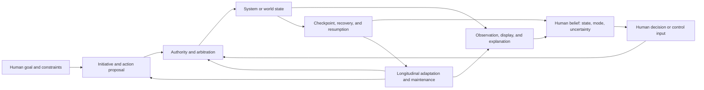

# Human–computer interaction and human factors: primary-source audit

**Audit date:** 2026-08-05

**Scope:** mixed initiative, interruption and resumption, mode awareness and
confusion, automation bias and complacency, calibrated trust, shared control,
direct manipulation, ecological interface design, progressive disclosure,
cognitive load, error recovery, accessibility, and adaptive interfaces.

**Purpose:** identify mechanisms that could make human–AI systems safer and
more effective without treating the presence, attention, trust, or effort of a
human as a free assurance layer.

**Status:** research audit; no registry promotion. Claims in this file are
temporary and do not alter the project evidence ledger.

**Deduplication targets:**
[P-002](../principle-registry.md#p-002--local-autonomy-with-exception-escalation),
[P-003](../principle-registry.md#p-003--temporary-trace-before-commitment),
[P-006](../principle-registry.md#p-006--homeostatic-negative-feedback),
[P-007](../principle-registry.md#p-007--prediction-error-allocation),
[P-009](../principle-registry.md#p-009--maintenance-plane),
[P-011](../principle-registry.md#p-011--transient-communication-coalitions),
[P-013](../principle-registry.md#p-013--externalized-shared-state),
[Candidate 009](../../experiments/candidates/009-graded-assurance-envelopes.md),
[Candidate 011](../../experiments/candidates/011-dual-loop-operational-assurance.md),
[Candidate 012](../../experiments/candidates/012-latency-qualified-authority.md),
[Candidate 015](../../experiments/candidates/015-versioned-repairable-conventions.md),
the [high-reliability-organization audit](2026-08-05-high-reliability-organizations-incident-learning.md),
and the [linguistics and communication audit](2026-08-05-linguistics-communication.md).

## Executive finding

HCI and human factors do not supply one missing biological principle. They
supply a set of experimentally testable constraints on a boundary the present
architecture already needs: **initiative, authority, observation, and recovery
must be designed together**.

The most important negative result is:

> A human being nominally “in the loop” does not establish effective oversight.
> Oversight additionally requires timely and intelligible state, a correct
> picture of present and next-mode authority, enough time and skill to act, an
> executable intervention path, and evidence that the intervention changed the
> intended state.

Primary studies show several reasons to reject easy slogans:

- interruption can preserve output speed while increasing stress, frustration,
  time pressure, and effort
  ([Mark, Gudith, and Klocke 2008](https://doi.org/10.1145/1357054.1357072));
- very reliable but imperfect automation can produce missed events and following
  of incorrect advice
  ([Parasuraman, Molloy, and Singh 1993](https://doi.org/10.1207/s15327108ijap0301_1);
  [Skitka, Mosier, and Burdick 1999](https://doi.org/10.1006/ijhc.1999.0252));
- explaining an aid can increase acceptance without improving discrimination
  between correct and incorrect advice
  ([Dzindolet et al. 2003](https://doi.org/10.1016/S1071-5819(03)00038-7);
  [Bansal et al. 2021](https://doi.org/10.1145/3411764.3445717));
- a simpler, clearer predictive model can be easier to simulate while making
  large errors harder to detect and correct in the tested task
  ([Poursabzi-Sangdeh et al. 2021](https://doi.org/10.1145/3411764.3445315));
- automatically adapting a menu can be slower than a stable static menu, while
  a user-adaptable alternative can be preferred
  ([Findlater and McGrenere 2004](https://doi.org/10.1145/985692.985704)); and
- a constraint-oriented ecological display can improve difficult fault
  diagnosis yet also induce control actions or takeovers when no fault exists
  ([Borst et al. 2017](https://doi.org/10.1007/s10111-017-0438-y)).

The residual contribution is therefore not a new architectural principle. It is
an audit-local **recoverable initiative contract**: every machine-initiated or
mixed-control intervention should expose the initiator, reason and uncertainty,
actual and pending mode, effective authority, changed state, checkpoint or undo
boundary, acknowledgement state, resumption cue, and expiry. That contract is a
composition of existing project principles and candidates. It should be
promoted only if it predicts failures that ordinary mode labels, previews,
confirmations, undo, logs, runtime assurance, and measured user testing do not.

No HCI mechanism is treated here as energy-free. A workflow that saves model
compute by consuming expert attention, repeated verification, interruption,
training, or recovery may be less efficient overall.

## Evidence and inference boundary

| Evidence type | What it can support | What it does not establish |
|---|---|---|
| Controlled human-subject experiment | Causal effect within the sampled users, interface, task, timing, training, incentives, and error distribution | General benefit for all populations, high-stakes deployment, long-term skill retention, or organizational safety |
| Field observation, incident corpus, interview | Recurring interaction breakdowns and plausible mechanisms in a real setting | Incidence without a sampling frame, a randomized counterfactual, or an independent causal effect |
| Cognitive or control model | Precise variables, assumptions, and predictions | That people implement the model exactly or that its fitted parameters transfer |
| Design principle or guideline validation | A useful design vocabulary and coverage check | An outcome guarantee or effect size |
| Accessibility standard | A conformance floor and testable requirements | Usability, safety, equity, or task success for every disabled person and context |
| Equal-budget fault-injection study | Comparative causal evidence in the declared system and fault model | Protection against faults, users, or incentives outside that model |

[Horvitz's mixed-initiative principles](https://doi.org/10.1145/302979.303030),
[Shneiderman's direct-manipulation paper](https://doi.org/10.1109/MC.1983.1654471),
and [Vicente and Rasmussen's ecological-interface framework](https://doi.org/10.1109/21.156574)
are foundational design theories, not universal causal effect estimates.
[Amershi et al.'s 18 human–AI interaction guidelines](https://doi.org/10.1145/3290605.3300233)
were iteratively developed and tested for design applicability; their validation
does not prove that implementing every guideline improves every outcome.

## Terms that must remain distinct

| Term | Operational meaning in this audit | Must not be collapsed into |
|---|---|---|
| mixed initiative | more than one actor may initiate, negotiate, defer, or complete actions | full automation, unsolicited notification, or conversational style |
| function allocation | assignment of functions to people or automation, possibly varying over time | authority over each consequential effect |
| shared control | human and automation jointly contribute to the control action or policy | a human approving an already completed decision |
| mode | a discrete or hybrid configuration that changes available transitions, mappings, or controller behavior | visual theme, task label, or displayed status alone |
| mode awareness | the operator's sufficiently accurate belief about current and prospective mode and consequences | remembering the mode name |
| trust | an attitude or expectation concerning the aid | reliance behavior, correctness, calibrated probability, compliance, or liking |
| reliance | allowing automation to act or using its output | agreement caused by authority, default, workload, or lack of alternatives |
| automation bias | omission or commission errors associated with treating automated cues as a heuristic replacement for information search or verification | every error made with automation |
| complacency | insufficient monitoring under automation, often shaped by expected reliability and workload | laziness or a fixed personality trait |
| transparency | information made available about a system, decision, or process | comprehension, verification, calibrated reliance, or accountability |
| explanation | information intended to answer why or how a result arose | proof, provenance, causal validity, or a guarantee of helpful reliance |
| cognitive load | demand on limited task-relevant cognitive resources under a specified theory and measure | one universal scalar, dislike, stress, or task time alone |
| progressive disclosure | staged access to information or controls | concealing known failure, withholding effective authority, or dark patterns |
| adaptive interface | the system changes presentation or interaction using an inferred context or user model | adaptable interface changed explicitly by the user |
| accessibility | ability of people with diverse perceptual, motor, cognitive, and situational constraints to perceive and operate the system | average usability or checklist conformance alone |
| recoverability | ability to detect, halt, reverse, compensate for, or safely resume after an unwanted action | a generic `Undo` label or an immutable audit log |

Self-reported trust, observed reliance, decision accuracy, and subjective
preference must be reported separately. A system may be trusted but unused,
used without trust, accurate but disliked, or preferred while producing worse
decisions.

## Interaction boundary model

The audited mechanisms act on different parts of a control loop:



The loop is not closed merely because a person appears between model output and
action. Effective control can fail at any edge: the display may be stale, the
person may infer the wrong mode, arbitration may silently override their input,
the world effect may be irreversible, or adaptation may change the mapping
between training and use.

| Design question | Necessary observation | Necessary authority | Relevant existing project owner |
|---|---|---|---|
| Who may initiate now? | initiator, reason, urgency, confidence | act, ask, defer, or abstain | P-002, P-007 |
| What can happen now? | actual mode, enabled effects, constraints | mode transition and effect capability | Candidate 009, Candidate 012 |
| What just happened? | command, interpreted action, state delta, provenance | halt, compensate, revert where possible | P-003, P-013, Candidate 009 |
| How does work resume? | checkpoint, pending goals, stale assumptions | resume, discard, or replan | P-003, P-013 |
| What may change over time? | version, user model, adaptation reason, rollback | accept, pin, configure, migrate, revert | P-009, Candidate 015 |
| Who learns from the event? | acknowledged record and outcome | update, quarantine, or escalate | Candidate 011, HRO audit |

## Shared quantitative boundary

### Initiative is a costed decision, not a personality

For context $x$, a proposed action class $a$ can be evaluated as

$$
a^*(x)=\arg\min_{a\in\{\mathrm{act},\mathrm{ask},\mathrm{defer},\mathrm{abstain}\}}
\left[\sum_s L(a,s)P(s\mid x)+C_a(x)\right].
$$

$s$ is a possible state of the world, $P(s\mid x)$ is a calibrated contextual
probability, $L(a,s)$ is outcome loss, and $C_a(x)$ is the interaction cost of
the action class. $L$ and $C_a$ must use the same declared unit—for example
seconds, euros, joules, or expected safety events—or remain a vector with an
explicit Pareto or constraint rule. Asking is not automatically conservative:
it can interrupt, delay, disclose information, transfer responsibility without
control, or consume the last available response window.

This equation is a normative scaffold, not evidence that users or models know
the probabilities or losses. A fixed manual workflow, explicit approval gate,
or deterministic exception rule is the conventional null.

### Completion time must include resumption and rework

For a task with interruptions $j=1,\ldots,n$,

$$
T_{\mathrm{complete}}=T_{\mathrm{active}}+
\sum_{j=1}^{n}\left(T_{\mathrm{interrupt},j}+
T_{\mathrm{resume},j}+T_{\mathrm{rework},j}\right).
$$

All terms are seconds. $T_{\mathrm{resume},j}$ begins at the end of the
interruption and ends at the first correct continuation action under a declared
coding rule; $T_{\mathrm{rework},j}$ counts repeated or repaired work attributable
to the interruption. The additive expression is accounting, not an independence
assumption. Error count or severity, secondary-task reaction time, stress,
frustration, and subjective effort remain separate outcomes.

For a notification delivered at time $\tau$,

$$
J(\tau)=C_{\mathrm{interrupt}}(x_\tau)+
C_{\mathrm{delay}}(\tau;u,d),
$$

where the two costs share a declared unit, $u$ is urgency, and $d$ is the latest
safe delivery time. A breakpoint scheduler should minimize measured $J$ only
subject to $\tau\le d$; it must not delay a safety-critical alert merely because
the current activity appears interruptible.

### Mode awareness needs an elicited belief

Let $m_t$ be the actual mode and $b_t(m)$ the operator's elicited probability
distribution over modes. A trial-level score is

$$
\ell_{\mathrm{mode},t}=-\log_2 b_t(m_t)\quad\text{bits}.
$$

A zero reported probability requires a prespecified floor or an infinite-loss
report; the choice must be disclosed. Querying $b_t$ is itself an interruption,
so probes must be randomized or separated from operational measures. Mode-name
recall is insufficient: experiments should additionally ask which actions are
enabled, who currently has authority, and what mode will follow a specified
event.

### Reliance and trust need separate measures

For advice trials, report at least:

$$
R_{\mathrm{wrong}}=
\frac{N(\text{wrong advice accepted})}{N(\text{wrong-advice opportunities})},
\qquad
R_{\mathrm{correct}}=
\frac{N(\text{correct advice accepted})}{N(\text{correct-advice opportunities})}.
$$

Both are dimensionless proportions with denominators and confidence intervals.
They must not be replaced by overall agreement, because overall agreement is
dominated by the aid's base-rate accuracy. If users state a probability $q_i$
that advice is correct and $y_i\in\{0,1\}$ records correctness, calibration can
be scored with the Brier score

$$
\mathrm{BS}=\frac{1}{N}\sum_{i=1}^{N}(q_i-y_i)^2,
$$

which is dimensionless and lower-is-better. A Likert trust score is ordinal and
is not a substitute for $q_i$, reliance, or decision quality.

For loss $L$ in one declared unit, human–AI complementarity is

$$
\Delta_{\mathrm{comp}}=min(L_{\mathrm{human}},L_{\mathrm{AI}})-L_{\mathrm{team}}.
$$

Positive $\Delta_{\mathrm{comp}}$ means the team beats the better solo actor on
that loss. It does not establish complementarity on time, energy, workload,
fairness, or rare catastrophic errors; those remain separate outcomes.

### Shared control must expose arbitration

A common illustrative blend is

$$
u_t=(1-\alpha_t)u_{h,t}+\alpha_t u_{a,t},\qquad 0\le\alpha_t\le1,
$$

where human command $u_{h,t}$, automation command $u_{a,t}$, and applied command
$u_t$ use the same physical unit, while $\alpha_t$ is dimensionless. This is not
a general safe-control law. Linear interpolation may leave the safe action set,
produce a command intended by neither actor, or be meaningless for discrete
actions. Experiments must disclose who chooses $\alpha_t$, what the person can
observe, which hard constraints post-process $u_t$, and how either actor can
veto or recover.

### Direct manipulation and recovery have physical times and boundaries

Visible feedback latency is

$$
T_{\mathrm{feedback}}=t_{\mathrm{visible}}-t_{\mathrm{command}}quad\text{seconds}.
$$

For injected failures classified as recoverable before testing, recovery-path
coverage at horizon $\tau$ is

$$
\rho_\tau=\frac{N(\text{restored within }\tau)}
{N(\text{injected recoverable failures})}.
$$

$\rho_\tau$ is dimensionless; $\tau$ is seconds. Restoration additionally needs
a declared state-distance $d(x_{\mathrm{restored}},x_{\mathrm{pre}})$ in units
appropriate to the state. A local visual reversal does not prove that external
messages, payments, model updates, or physical effects were undone.

### Ecological displays represent constraints, not safety proofs

For a modeled work-domain constraint $g_j(x)\le0$, a display may expose normalized
margin

$$
\mu_j(x)=-\frac{g_j(x)}{s_j},
$$

where $s_j>0$ has the same unit as $g_j$, making $\mu_j$ dimensionless and
positive inside the modeled boundary. The display must expose observation age,
uncertainty, and missingness. A large displayed margin is not assurance when the
constraint model, sensor, scale, or state estimate is wrong.

### Accessibility has an empirical motor baseline, not a universal constant

Fitts's original experiments support a fitted relation of the form

$$
MT=a+b\log_2\!\left(1+\frac{D}{W}\right),
$$

where movement time $MT$ and intercept $a$ are seconds, $b$ is seconds per bit,
and target distance $D$ and effective target width $W$ use the same length unit
([Fitts 1954](https://doi.org/10.1037/h0055392)). The logarithmic term is bits.
$a$ and $b$ must be fitted for the actual person, device, posture, input method,
and context; they are not biological constants or sufficient accessibility
metrics.

## Mechanism map and initial disposition

| ID | Mechanism | Exact problem addressed | Strong conventional null | Initial disposition |
|---|---|---|---|---|
| HCI-01 | costed mixed initiative | decide whether to act, ask, defer, or abstain under uncertainty | fixed manual workflow; explicit approval gate; deterministic exception rule | useful policy family; no new principle |
| HCI-02 | resumption cue and checkpoint | reconstruct suspended goal and state after interruption | persistent task list, draft, breadcrumb, ordinary checkpoint | concrete P-003/P-013 interface |
| HCI-03 | breakpoint-aware notification | trade interruption cost against delay and urgency | immediate alert, fixed batching, priority queue, do-not-disturb | task-dependent scheduling mechanism |
| HCI-04 | explicit mode and prospective authority | keep operator belief aligned with current and next action mapping | stable controls, mode label, interlock, checklist, runtime assurance | interface for Candidate 012 |
| HCI-05 | calibrated advice use | distinguish correct from incorrect automated advice | calibrated confidence plus abstention and independent checklist | evaluation requirement, not trust objective |
| HCI-06 | cognitive forcing | make independent human judgment or verification occur before advice capture | no-advice baseline, delayed reveal, mandatory evidence fields | plausible debiasing mechanism with workload cost |
| HCI-07 | explicit shared-control arbitration | reveal and constrain how human and automation inputs combine | manual, full autonomy, fixed blend, constrained MPC or safety filter | domain-specific controller design |
| HCI-08 | direct manipulation | shorten gulf between intent, action, feedback, and correction | form/command with preview, validation, history, undo | valuable interaction family, not always applicable |
| HCI-09 | ecological constraint display | make system constraints and margins perceptually available | conventional alarms, trends, fault tree, statistical dashboard | useful under valid work-domain model |
| HCI-10 | progressive disclosure | stage detail to match task and learning | flat complete view, search, saved views, role presets | useful only with discoverability and failure visibility |
| HCI-11 | reversible error path | detect and recover from slips and unwanted state changes | confirmation, transaction, versioning, checkpoint, compensation | already owned by P-003/Candidate 009 |
| HCI-12 | ability-based and standards-based access | preserve perceivable and operable alternatives across abilities and contexts | WCAG 2.2-conformant stable responsive UI with assistive-technology testing | non-negotiable evaluation stratum |
| HCI-13 | bounded adaptive interface | change interaction while limiting instability and preserving user control | stable static and user-adaptable interfaces | hypothesis; often loses to simpler nulls |

## 1. Mixed initiative and function allocation

### Biological or human observation

Human collaboration is not a fixed alternation between a commander and a tool.
Participants initiate, request, interrupt, yield, and renegotiate work based on
goals, uncertainty, social cost, and timing. This observation motivates mixed
initiative but does not imply that conversational fluidity is optimal for a
high-consequence controller.

### Proposed AI translation

Represent initiative as an explicit decision over `act`, `ask`, `defer`, and
`abstain`, conditioned on uncertainty, effect class, reversibility, user state,
deadline, and available authority. Log the proposal separately from the
authorized effect. [Horvitz 1999](https://doi.org/10.1145/302979.303030)
articulated cost–benefit principles for mixed-initiative interfaces, while
[St. Amant and Cohen 1998](https://doi.org/10.1016/S0950-7051(97)00038-5)
experimentally evaluated a mixed-initiative assistant in exploratory data
analysis. These establish a design and evaluation lineage, not general benefit.

### Efficiency mechanism

Initiative can save interaction turns when the system correctly anticipates a
low-risk, reversible action; asking or deferring can avoid high-loss errors when
uncertainty matters. The resource cost is expert attention, interruption,
latency, additional state estimation, interaction logging, and recovery.

### Evidence status and boundaries

**Plausible and task-dependent.** [Amershi et al. 2019](https://doi.org/10.1145/3290605.3300233)
offer empirically grounded guidelines across initial use, regular interaction,
error, and change over time, but a guideline set is not a randomized comparison
of mixed initiative against simpler workflows. Benefits depend on calibrated
uncertainty, aligned losses, accurate user/context inference, and reversible
effects.

### Failure modes and measurable predictions

- unsolicited “help” becomes interruption or covert authority transfer;
- repeated low-value questions cause habituation or indiscriminate approval;
- the system asks after consuming the response window, leaving nominal rather
  than effective authority;
- inferred preferences override explicit constraints;
- asking shifts accountability to a person who lacks state, time, or control;
- conversational politeness hides effect scope and uncertainty.

At equal task accuracy, a successful mixed-initiative policy must reduce total
completion time or high-severity loss without increasing interruption burden,
unacknowledged actions, or recovery cost relative to manual and deterministic
exception-rule baselines. Otherwise, keep the simpler null.

## 2. Interruption, notification, and resumption

### Human observation

Suspended goals compete with new activity. [Altmann and Trafton's activation
model](https://doi.org/10.1207/s15516709cog2601_2) predicts that interference,
goal strengthening, and retrieval cues affect resumption. In controlled work,
[Trafton et al. 2003](https://doi.org/10.1016/S1071-5819(03)00023-5) found that a
warning interval allowed prospective encoding or rehearsal and shortened
subsequent resumption, while [Monk, Trafton, and Boehm-Davis 2008](https://doi.org/10.1037/a0014402)
found longer and more demanding interruptions increased resumption time.

The effect is not captured by speed alone. In a controlled office-work study,
interrupted participants completed work faster without a detected quality loss
but reported more stress, frustration, time pressure, and effort
([Mark, Gudith, and Klocke 2008](https://doi.org/10.1145/1357054.1357072)).
[Rubinstein, Meyer, and Evans 2001](https://doi.org/10.1037/0096-1523.27.4.763)
found task-switch costs that varied with rule complexity and cueing.

### Proposed AI translation

Before a non-urgent interruption, persist a compact resumption record: active
goal, last verified state, pending decision, changed assumptions, next valid
actions, expiry, and provenance. A notification policy estimates candidate
breakpoints but is constrained by urgency and a latest-safe-delivery deadline.
The operator can inspect, postpone, batch, or pin classes of notifications.

### Efficiency mechanism

Good timing and cues may reduce reorientation, duplicated work, and errors.
[Iqbal and Bailey 2008](https://doi.org/10.1145/1357054.1357070) found benefits
from breakpoint-aware notification management in their tested tasks, while also
showing limits in identifying breakpoint type. The warning and checkpoint
themselves consume time and can become more expensive than the interruption.

### Evidence status and boundaries

**Established laboratory effects; plausible system translation.** Effects vary
with interruption duration, demand, urgency, task structure, practice, and cue
quality. The literature does not justify a universal “never interrupt” rule or a
fixed safe notification interval.

### Failure modes and measurable predictions

- a breakpoint detector is wrong and interrupts at a semantically fragile step;
- delaying an urgent alert causes preventable loss;
- a resumption cue is stale, leaks sensitive content, or resurrects an invalid
  plan;
- batching creates an alert wall and correlated decision fatigue;
- measurements ignore stress, recovery, and rework because throughput improved;
- the scheduler optimizes engagement rather than task loss.

The mechanism predicts lower preregistered resumption lag, rework, and severe
error rate than immediate alerts and fixed batching, at equal alert recall and
latest-safe-delivery compliance. If it merely moves work into cue maintenance or
increases missed urgent events, reject it.

## 3. Mode awareness, mode confusion, and automation surprise

### Human observation

Supervisory automation can create modes whose action mappings and transitions
are difficult to track. [Sarter and Woods 1995](https://doi.org/10.1518/001872095779049516)
analyzed mode error and awareness using empirical studies of pilots and
automation; [Sarter and Woods 1997](https://doi.org/10.1518/001872097778667997)
documented recurring automation surprises in Airbus A-320 operational
experience. These sources identify mechanisms and recurrent cases, not a
population incidence estimate.

Rapid reassignment is not automatically adaptive. In a multitask simulation,
[Scallen, Hancock, and Duley 1995](https://doi.org/10.1016/0003-6870(95)00054-2)
found that excessively short cycles of adaptive allocation could be disruptive.
[Harris et al. 1995](https://doi.org/10.1207/s15327108ijap0502_3) found optional
automation superior within their task while also separating workload and
fatigue effects. Neither result licenses one universal allocation schedule.

### Proposed AI translation

Expose actual mode, pending transition, trigger, enabled and disabled effects,
effective controller, observation age, and rollback or takeover path. Require a
transition acknowledgement for consequential changes, but use machine-enforced
interlocks for invariants that should not depend on acknowledgement. Measure the
operator's belief about consequences, not just whether the label was seen.

### Efficiency mechanism

Accurate mode beliefs reduce invalid commands, diagnosis time, surprise, and
recovery. Stable mappings reduce retraining and search. The costs are display
space, alerts, transition friction, probes, and the engineering of an
independent state source.

### Evidence status and boundaries

**Established human-factors problem; implementation-specific remedy.** A mode
display is useful only if it reflects the controller that actually governs the
effect. Correct labels cannot repair ambiguous automation logic, hidden coupled
transitions, stale telemetry, or insufficient intervention time.

### Failure modes and measurable predictions

- displayed and effective mode diverge;
- a reassuring label conceals a constrained or revoked human command path;
- the operator knows the current mode but not the next transition;
- modes proliferate faster than training and documentation;
- adaptive allocation oscillates, destroying predictability;
- takeover is technically possible but slower than the hazard dynamics.

An improved design must lower mode-belief log loss, invalid action attempts,
unexpected transitions, and time to correct intervention under injected
automation faults. It must beat stable explicit mode labels plus a conventional
interlock or runtime-assurance controller, not only a hidden-mode strawman.

## 4. Automation bias, complacency, and calibrated reliance

### Human observation

In laboratory monitoring, very reliable but imperfect automation can reduce
detection of automation failures
([Parasuraman, Molloy, and Singh 1993](https://doi.org/10.1207/s15327108ijap0301_1)).
In simulated flight-related decision tasks, researchers observed omission and
commission errors, including following incorrect automated advice despite other
valid indicators
([Mosier et al. 1998](https://doi.org/10.1207/s15327108ijap0801_3);
[Skitka, Mosier, and Burdick 1999](https://doi.org/10.1006/ijhc.1999.0252)).
These effects are conditional on workload, reliability, display, incentives,
training, and opportunity to verify; they are not evidence that people always
over-trust automation.

[Muir and Moray 1996](https://doi.org/10.1080/00140139608964474) experimentally
related perceived competence, failures, trust, intervention, use, and monitoring
in process control. [Pop, Shrewsbury, and Durso 2015](https://doi.org/10.1177/0018720814564422)
showed that individual differences and causal attribution affected calibration
to reliability in a baggage-screening task. Trust dynamics therefore cannot be
assumed to be uniform across users or components.

### Proposed AI translation

Optimize for appropriate decision performance and calibrated uncertainty, not
maximum trust or maximum acceptance. Show advice, confidence with reference
class, evidence provenance, abstention state, and known limits. Sample incorrect
advice deliberately in evaluation, including correlated and plausible errors.
Where independent judgment is essential, delay advice or require the person to
record an initial assessment before exposure.

### Efficiency mechanism

Reliable advice can reduce search and workload; selective prediction can avoid
low-confidence intervention. Verification and cognitive forcing consume time.
The relevant efficiency question is whether the team beats the best solo actor
and a calibrated, no-explanation baseline at equal human and compute budgets.

### Evidence status and boundaries

**Established risk; no universal calibration interface.** Explanations may alter
reliance without improving correctness. [Dzindolet et al. 2003](https://doi.org/10.1016/S1071-5819(03)00038-7)
found that explanations of why an aid errs could increase trust and reliance,
including unwarranted reliance. [Bansal et al. 2021](https://doi.org/10.1145/3411764.3445717)
found that AI assistance could yield complementary improvements in their tasks,
but explanations did not improve complementarity and increased acceptance of
recommendations regardless of correctness.

In a preregistered study with 3,800 participants,
[Poursabzi-Sangdeh et al. 2021](https://doi.org/10.1145/3411764.3445315) found
that simpler models were easier to simulate but did not increase following and,
in the tested setting, could make large mistakes harder to detect and correct.
[Buçinca, Malaya, and Gajos 2021](https://doi.org/10.1145/3449287) found
cognitive forcing functions reduced overreliance compared with a simple
explainable-AI interface, but the least-liked designs could reduce overreliance
most and effects differed with Need for Cognition.

### Failure modes and measurable predictions

- an explanation is persuasive, coherent, or fluent but not diagnostic;
- high average accuracy hides clustered failures and creates complacency;
- confidence is miscalibrated or lacks a relevant reference class;
- mandatory verification becomes a click-through ritual;
- users learn to agree because disagreement has no effect or is punished;
- under-reliance follows salient failures even after reliability recovers;
- one trust score hides correct use in one mode and dangerous use in another;
- complementarity on accuracy is purchased with unacceptable time or effort.

A successful intervention must reduce acceptance of wrong advice without a
larger loss in use of correct advice, and must improve team loss relative to
both solo actors. Trust ratings and preference are secondary diagnostic
variables, not the optimization target.

## 5. Shared control and shared autonomy

### Human observation and control problem

Shared control can preserve continuous human agency while automation assists
with stabilization, trajectory, or effort. It also creates a coupled controller:
conflicting inputs, hidden arbitration, prediction error, and transition timing
can generate behavior intended by neither partner.

### Proposed AI translation

Use an explicit arbitration function over compatible action representations,
condition it on intent uncertainty and constraint margins, and expose the
effective applied command. Keep safety constraints independent of inferred
preference. [Dragan and Srinivasa 2013](https://doi.org/10.1177/0278364913490324)
formalized policy blending for shared teleoperation and directly exposed the
consequences of incorrect robot policies. [Mulder, Abbink, and Boer 2012](https://doi.org/10.1177/0018720812443984)
experimentally studied haptic shared control for vehicle curve negotiation.
These are domain-specific demonstrations, not a general recipe for language or
discrete administrative actions.

### Efficiency mechanism

Automation can absorb high-frequency stabilization while a person supplies
goals, exceptions, and semantic judgment. Haptic or continuous feedback can
communicate constraints without consuming a visual channel. Costs include
intent inference, arbitration compute, conflict, extra actuators or displays,
training, and possible skill decay.

### Evidence status and boundaries

**Established control family; domain-specific benefit.** Blending is meaningful
only when commands share units and the resulting action is valid. For discrete,
irreversible, legal, or communicative acts, proposal/approval, constraint
filtering, or explicit turn-taking may be safer than numerical interpolation.

### Failure modes and measurable predictions

- arbitration chatters as uncertainty or estimated intent changes;
- a weighted average leaves the safe set;
- strong assistance masks degraded human skill until takeover;
- the user cannot distinguish resistance caused by safety, automation, or fault;
- the automation “helps” toward a misinferred goal;
- override authority exists but cannot be exercised fast enough;
- responsibility remains human while effective control is automated.

Shared control must beat manual control, full autonomy, fixed blending, and a
constrained-controller baseline on task loss, intervention time, conflict
energy, constraint violations, workload, and post-assistance manual skill.

## 6. Direct manipulation and visible state

### Human observation

[Shneiderman 1983](https://doi.org/10.1109/MC.1983.1654471) characterized direct
manipulation through continuous representation of objects, physical or labeled
actions, and rapid, incremental, reversible operations with visible effects.
[Hutchins, Hollan, and Norman 1985](https://doi.org/10.1207/s15327051hci0104_2)
analyzed directness as reduced semantic and articulatory distance between a
person's intention, expression, and system response. Both sources also imply a
boundary: “direct” is relative to a representation and can hide mechanisms or
make abstract, bulk, remote, or delayed actions awkward.

### Proposed AI translation

For consequential AI actions, show a manipulable representation of the target,
scope, constraints, and anticipated change; offer preview or dry run; apply an
authorized delta; then show the actual resulting state and any divergence from
the preview. Natural-language commands remain proposals until grounded to typed
objects and effect scopes. Prefer reversible increments and visible
intermediate state where the domain permits them.

### Efficiency mechanism

Recognition, stable spatial mapping, incremental feedback, and local reversal
can reduce command formulation, interpretation error, and recovery time. The
cost is maintaining a faithful representation, rendering state, recording
history, and supporting transactions or compensation.

### Evidence status and boundaries

**Established design family; benefits depend on representation and task.** A
graphical action is not intrinsically more direct than a concise command for an
expert. Direct manipulation can obscure global constraints, exact repeatability,
provenance, automation, or actions whose effects occur later or elsewhere.
Typed commands, forms, search, saved views, and batch scripts are strong nulls,
especially for precise, repeated, and accessible operation.

### Failure modes and measurable predictions

- the displayed object is a projection rather than the actual effect target;
- animation implies completion before the external transaction commits;
- drag, touch, or color-only feedback excludes users or assistive technology;
- local reversal cannot retract an external message or physical act;
- hidden defaults expand the effect scope;
- incremental interaction is slower and more error-prone than a validated batch
  operation;
- a generative preview is mistaken for a deterministic dry run.

The translation predicts shorter feedback and recovery latency, fewer scope
errors, and better state-delta comprehension than a preview/confirm/history/undo
form or typed-command baseline. If the gain disappears when the conventional
baseline is properly designed, no special AI principle remains.

## 7. Error recovery, checkpoints, and resumption state

### Human observation

Human errors are often better addressed by changing the action and recovery
structure than by attributing them to deficient users. [Norman 1983](https://doi.org/10.1145/2163.358092)
derived design rules from analyses of human error, including making system state
and action consequences intelligible. [Carroll and Carrithers 1984](https://doi.org/10.1145/358198.358218)
found that a “training wheels” interface blocking troublesome states improved
initial learning and achievement; the comparison group spent substantial time
recovering from states the restricted interface prevented. This is a learning
result, not proof that hiding capabilities is safe after training.

[Akers et al. 2009](https://doi.org/10.1145/1518701.1518804) showed that undo and
erase events could serve as telemetry for locating severe usability problems,
including problems users did not self-report. The result supports diagnostic
instrumentation; it does not establish that an undo command reverses every
consequence.

### Proposed AI translation

Separate proposed, previewed, committed, externally effected, compensated, and
verified states. Capture a minimal checkpoint before commitment: goal, typed
target and scope, input version, relevant world state, model/tool versions,
authorization, preview, and irreversible boundary. After an error, offer the
valid recovery class—cancel, undo, restore, compensate, reconcile, or escalate—
rather than relabeling every path “undo.”

### Efficiency mechanism

Prevention and recovery reduce rework, incident propagation, and reconstruction
cost. Logging every intermediate state, keeping snapshots, verifying external
effects, and maintaining compensating operations consume storage, compute,
latency, and engineering effort.

### Evidence status and boundaries

**Strong engineering practice; already owned by the architecture.** P-003 owns
temporary traces before commitment, P-013 owns externalized shared state,
Candidate 009 owns effect and rollback envelopes, and Candidate 015 owns
versioned repair of interaction conventions. HCI adds evaluation measures and
human-readable recovery affordances, not a distinct principle.

### Failure modes and measurable predictions

- an “undo” reverses the interface but not a message, payment, deployment, or
  learned update;
- recovery replays a stale or unsafe plan;
- checkpoints omit hidden tool or environment state;
- the recovery interface creates a second mode the operator misunderstands;
- confirmation fatigue moves users to automatic approval;
- history records actions but not interpreted targets, authority, or outcomes;
- recovery metrics count eventual restoration while ignoring time and external
  harm.

Under injected slips, wrong targets, stale inputs, partial commits, and external
side effects, the system must improve $\rho_\tau$, state-distance after recovery,
and severe residual loss relative to conventional transactions, versioning,
checkpoints, and compensating actions at equal storage and latency budgets.

## 8. Ecological interface design

### Human observation and design theory

Ecological interface design (EID) attempts to represent the constraints and
functional structure of a work domain so operators can act through familiar,
rule-based, and knowledge-based behavior, especially during unanticipated
events. [Vicente and Rasmussen 1992](https://doi.org/10.1109/21.156574) provide
the theoretical foundation with preliminary empirical support. EID is not
“show every metric” and not an appeal to visual naturalness; its displays should
derive from an explicit work-domain analysis.

### Proposed AI translation

Expose invariants, resource flows, capacity, coupling, uncertainty, and
constraint margins rather than only model confidence or a ranked action. Link a
recommended action to the constraint it is intended to protect and show how the
projected and actual state move relative to that constraint. Keep raw data,
conventional alarms, and independent safety channels available.

### Efficiency mechanism

A valid constraint representation may reduce search and allow diagnosis of
novel combinations without enumerating every fault. It requires domain
modeling, reliable state estimation, display engineering, training, and
maintenance when constraints or sensors change.

### Evidence status and boundaries

**Plausible with important moderators.** In a six-month DURESS II study,
[Christoffersen, Hunter, and Vicente 1998](https://doi.org/10.1006/ijhc.1998.0190)
found that the ecological interface could support functionally organized deep
knowledge and superior performance for participants who actively reflected,
whereas surface learners did not obtain the same benefit. In a supervisory air
traffic-control study with 16 participants, [Borst et al. 2017](https://doi.org/10.1007/s10111-017-0438-y)
found improved diagnosis of automated-advice faults in complex situations, but
explicit means–ends links also encouraged control responses and takeovers
irrespective of whether advice was actually faulty.

### Failure modes and measurable predictions

- the abstraction hierarchy is incomplete or wrong;
- common-mode sensor or estimator failure makes every derived margin reassuring;
- display density increases search, clutter, or fixation;
- salient constraint links trigger unnecessary intervention;
- users learn the picture rather than the work domain;
- a domain model that worked in training is stale after system change;
- an EID display is used as a safety case without an independent control path.

EID must beat a well-designed dashboard with trends, alarms, fault trees, and
constraint alerts on fault detection, diagnosis correctness, unnecessary
takeover, recovery loss, workload, and transfer to novel faults. Results must be
stratified by training and demonstrated domain knowledge.

## 9. Progressive disclosure and cognitive load

### Human observation

More visible information can either support diagnosis or impose search,
integration, and memory costs. [Sweller 1988](https://doi.org/10.1207/s15516709cog1202_4)
developed cognitive-load theory in instructional problem solving; it does not
provide a universal capacity number for interface design. Across six
instructional experiments, [Chandler and Sweller 1991](https://doi.org/10.1207/s1532690xci0804_2)
found benefits from integrating mutually necessary information and costs from
some redundant material. The boundary is critical: separating information is
harmful when mental integration is necessary, while adding or integrating
redundant information can itself be harmful.

In four studies of emotional-analytics transparency,
[Springer and Whittaker 2020](https://doi.org/10.1145/3374218) found context-
dependent effects: transparency could aid model formation while revealed errors
could reduce accuracy perceptions; the work motivates initially simplified and
progressively disclosed feedback. This does not license hiding failures relevant
to present action or safety.

### Proposed AI translation

Stage information by decision need while preserving explicit access, search,
stable landmarks, and failure visibility. Present the minimum facts needed to
understand current state, authority, uncertainty, consequence, and recovery;
make evidence, provenance, alternatives, and detailed diagnostics discoverable
without changing their meaning. Let expert users pin or configure views.

### Efficiency mechanism

Progressive disclosure may reduce initial visual search and unnecessary
integration while retaining deeper diagnosis on demand. It adds navigation,
state, design variants, instrumentation, and the risk that important information
is never discovered.

### Evidence status and boundaries

**Plausible design pattern; no universal layer count or information threshold.**
Cognitive load is inferred through a measurement model. Report task time in
seconds, errors as counts or rates, secondary-task response in seconds,
eye-movement measures with declared units, and subjective workload as ordinal
or instrument-scored data. Do not add them into one “cognitive load” score
without a preregistered scale and weights.

### Failure modes and measurable predictions

- disclosure hides known limitations until after commitment;
- novices never discover advanced recovery or accessibility controls;
- experts repeatedly navigate through introductory layers;
- layout shifts between layers destroy spatial memory;
- a concise explanation omits the one counterexample needed for verification;
- subjective ease improves while decisions become less accurate;
- system-generated summaries become another unverified automation channel.

A staged design must beat a flat complete view, search-first view, and stable
role preset on decision loss, time, information-seeking path, discovered failure
rate, recall of action consequences, workload measures, and expert/novice
subgroups. Hiding a consequential known failure is a failed design regardless of
average speed.

## 10. Accessibility and ability-based design

### Human observation and requirement

Human perceptual, motor, cognitive, linguistic, and attentional abilities vary
within and across people and contexts. Disability may be permanent, temporary,
or situational; a single average user is not an adequate design target.
[Wobbrock et al. 2011](https://doi.org/10.1145/1952383.1952384) articulate
ability-based design as designing around what people can do rather than requiring
them to conform to a presumed norm. This is a design concept supported by
examples, not a universal effect estimate.

### Proposed AI translation

Maintain equivalent keyboard, pointer, touch, speech, and assistive-technology
paths where the task permits; expose structured semantics rather than only
generated pixels; preserve focus and reading order; avoid color-only state; make
target size, timeouts, error identification, and authentication workable across
abilities. Treat [WCAG 2.2](https://www.w3.org/TR/WCAG22/) as a conformance floor
and test tasks with disabled participants and assistive technologies.

Personalization may use explicitly supplied ability preferences or measured
performance, but it must disclose adaptation, minimize sensitive inference,
allow pinning and reset, and preserve a stable accessible fallback.

### Efficiency mechanism

Larger effective targets, fewer precise movements, alternative input, semantic
structure, and ability-matched layouts can lower action time and error. Costs
include redundant modalities, testing matrices, assistive-technology
compatibility, personalization, privacy protection, and maintenance.

### Evidence status and boundaries

**Accessibility obligation established; adaptive benefit task-dependent.**
[Gajos, Wobbrock, and Weld 2008](https://doi.org/10.1145/1357054.1357250)
experimentally evaluated automatically generated ability-based interfaces with
motor-impaired and able-bodied participants and found performance improvements
in the studied tasks. The small, task-specific sample does not justify a fixed
effect size or automatic inference for all disabilities.

WCAG conformance is not a claim of usability or task safety. Conversely, a
novel adaptive interface is not accessible merely because average action time
falls. Report individual distributions and prespecified ability or access-mode
strata. When appropriate, report worst-stratum expected loss

$$
L_{\max}=\max_{g\in\mathcal{G}}\mathbb{E}[L\mid g],
$$

where $g$ is a prespecified ability or access-mode stratum and $L$ has a declared
task-loss unit. This does not reduce people to a fixed group or replace
intersectional and qualitative analysis.

### Failure modes and measurable predictions

- adaptation infers a disability or health condition without consent;
- screen-reader semantics diverge from visible state;
- controls move after a user learns them;
- speech is the only path in a noisy, private, accented, or non-speaking context;
- safety information depends on color, animation, sound, or timing alone;
- average success hides exclusion or catastrophic group-specific failures;
- a user cannot disable, pin, export, or reset a learned interface;
- accessibility is tested after architecture fixes the impossible interaction.

An ability-based design must beat a WCAG-conformant stable responsive baseline
and a user-adaptable baseline on task loss, time, error, assistive-technology
success, recovery, workload, preference, and worst-stratum outcomes. It must not
increase sensitive-data exposure or spatial instability.

## 11. Adaptive and adaptable interfaces

### Human observation

Interface adaptation trades predicted relevance against spatial stability,
predictability, agency, privacy, and learning. In a controlled study,
[Findlater and McGrenere 2004](https://doi.org/10.1145/985692.985704) found a
static menu significantly faster than an adaptive menu, while an adaptable menu
was sometimes faster and preferred by most participants. This is a direct
warning against treating personalization as an automatic benefit.

[Findlater et al. 2009](https://doi.org/10.1145/1518701.1518956) tested
“ephemeral adaptation,” using gradual visual onset while retaining stable item
positions. Across their two experiments it could improve selection time at high
prediction accuracy without the same low-accuracy penalty as spatially unstable
adaptation. The result supports testing stability-preserving adaptations, not a
universal recommendation for fading or prediction.

### Proposed AI translation

Separate three mechanisms:

1. **static:** one stable interface for the context;
2. **adaptable:** the user explicitly configures and pins the interface; and
3. **adaptive:** the system changes salience, ordering, detail, modality, or
   defaults based on an inferred state.

For adaptive behavior, log the input signal, inference, change, predicted
benefit, version, expiry, and rollback. Preserve stable semantic identifiers,
keyboard order, accessibility tree, and a no-adaptation fallback. Prefer
salience changes that do not move targets when comparable benefit is possible.

### Efficiency mechanism

Correct prediction may reduce search, movement, and repeated configuration.
Learning and serving a user model consume observations, storage, compute,
energy, privacy budget, explanation, and recovery. Layout drift imposes a human
relearning cost that cannot be inferred from click time alone.

One audit measure for spatial drift is

$$
D_{\mathrm{layout},t}=\sum_{k\in K_t}w_k\,
d\!\left(p_{k,t},p_{k,t-1}\right),
$$

where $p_{k,t}$ is the position of persistent control $k$ in pixels or visual
degrees, $d$ is a declared distance in the same unit, and dimensionless weight
$w_k$ reflects prespecified use or consequence. The sum does not measure
semantic, focus-order, or modality changes; report those separately.

### Evidence status and boundaries

**Plausible with strong negative and subgroup boundaries.** Prediction accuracy
is not enough. The cost of an incorrect change depends on task, expertise,
motor and cognitive access, frequency, timing, reversibility, and whether the
user notices why the interface changed.

### Failure modes and measurable predictions

- the interface adapts to errors, workarounds, coercive defaults, or temporary
  impairment and then reinforces them;
- moving targets erase spatial learning or increase motor error;
- different users see different controls and cannot support one another;
- feedback loops make frequently exposed items more frequent;
- the model infers sensitive attributes from interaction telemetry;
- rare but critical functions are demoted because frequency predicts salience;
- updates invalidate training material, screenshots, or assistive scripts;
- a rollback resets layout but not learned defaults or upstream user models.

Adaptive interfaces should survive an ablation ladder: stable static, stable
user-adaptable, prediction-only recommendation, stability-preserving salience,
and fully adaptive layout. Promotion requires a benefit across task loss, time,
error, stability, accessibility, privacy, and retention—not a click-through or
preference gain alone.

## 12. The recoverable initiative contract

The audit's residual synthesis is an interface and telemetry contract, not a new
learning algorithm. For every machine-initiated proposal, automated transition,
or mixed-control intervention with consequential effects, record and expose at
the appropriate level:

| Field | Question answered | Minimum machine-verifiable form |
|---|---|---|
| initiator | who or what started this? | authenticated actor/service/model ID and version |
| reason | why now? | trigger, rule, evidence reference, or goal ID |
| uncertainty | what is not known? | calibrated estimate with reference class, or explicit unavailable state |
| actual mode | what controller and mapping apply now? | controller-derived mode ID, not display-local state |
| pending mode | what transition is armed and why? | destination, trigger, earliest/latest time, cancel path |
| authority | what effects may each actor cause? | capability/effect scope plus expiry |
| interpreted action | what did the system understand? | typed operation, targets, constraints, and preview hash |
| state delta | what actually changed? | before/after references and external-effect acknowledgements |
| recovery boundary | what can still be reversed? | cancel, undo, restore, compensate, or irreversible marker |
| resumption state | how can interrupted work continue? | goal, last verified step, pending decision, stale assumptions |
| acknowledgement | did the affected party receive and understand enough to act? | receipt and, when required, verified response—not passive delivery |
| expiry and version | when does this interpretation or authority stop applying? | timestamp/condition and schema/policy version |

The human-facing display may progressively disclose these fields, but the
machine record must remain inspectable and linked. High urgency can reduce the
interaction steps; it does not erase provenance or post-event reconstruction.

This contract is worth retaining only as a cross-cutting test fixture. Its
components are already owned elsewhere:

- P-002 owns local action and exception escalation;
- P-003 owns pre-commit traces;
- P-013 owns externalized shared state;
- Candidate 009 owns typed authority, effect, empirical, runtime, provenance,
  and lifecycle envelopes;
- Candidate 012 owns observation-age- and mode-qualified authority;
- Candidate 015 owns acknowledgements, repair, convention versioning,
  migration, and rollback; and
- Candidate 011 and the HRO audit own live containment and longitudinal learning.

The residual falsifier is therefore strict: if the full contract does not
predict or prevent failures beyond a smaller conventional set—actual mode,
effect scope, preview, confirmation, history, checkpoint, and undo/compensation—
use the smaller set.

## Deduplication against the existing architecture

| Existing item | What it already owns | HCI contribution after deduplication | Not a new principle because |
|---|---|---|---|
| P-002 | local autonomy with escalation on uncertainty or exception | interruption burden, effective human response window, and initiative policy tests | HCI specifies the operator-facing boundary of the same authority pattern |
| P-003 | temporary traces before durable commitment | resumption cues, previews, recovery latency, and coverage measures | checkpoints and reversible interaction instantiate the existing trace rule |
| P-006 | negative feedback and bounded regulation | operator correction as one feedback channel; workload and alert-rate limits | human correction is neither free nor guaranteed negative feedback |
| P-007 | prediction error allocated to sensing, computation, or escalation | calibrated advice, abstention, and costed ask/act/defer choices | initiative is a decision policy over the existing error-allocation problem |
| P-009 | distinct maintenance plane | interface/user-model versioning, accessibility regression tests, adaptation rollback | longitudinal adaptation belongs to maintenance, not live UI novelty |
| P-011 | transient communication coalitions | notification timing, acknowledgement, and temporary coordination displays | communication timing does not create a separate coalition principle |
| P-013 | externalized shared state | actual mode, authority, delta, checkpoint, and resumption state | displays are human-facing projections of the same shared-state requirement |
| Candidate 009 | graded assurance across type, proof, effect, capability, empirical, runtime, provenance, update, and security envelopes | test whether people can perceive and correctly use the envelope | comprehension cannot strengthen the underlying assurance claim |
| Candidate 011 | live containment versus longitudinal repair and recurrence learning | measure interruption, takeover, recovery, training, and operator costs | HCI adds human-cost outcomes to the two-loop system |
| Candidate 012 | action sets qualified by observation age, integrity, mode, headroom, and coordination | expose actual/pending mode and validate effective intervention time | a mode display is an implementation of latency-qualified authority |
| Candidate 015 | literal meaning versus intent, acknowledgement, repair, versioning, migration, rollback | apply the protocol to adaptive interfaces and mixed-initiative actions | conversational fluency does not supersede typed meaning and repair |
| HRO audit | reporting, challenge, escalation, incident command, containment, learning | test whether nominal human roles have information, time, and executable authority | human-factors measures instrument the organizational mechanisms |
| communication audit | common ground, repair, turn timing, convention lifecycle | distinguish display exposure from comprehension and delivery from acknowledgement | HCI interaction records are instances of versioned, repairable coordination |

### Deduplication decision

No registry-ready principle emerges from this audit. Keep the recoverable
initiative contract as an **audit-local composite and experimental fixture**.
Do not create a “human in the loop,” “calibrated trust,” “progressive
disclosure,” or “adaptive interface” principle. Each is conditional, and each
has a strong conventional null.

## Applicability map

| System class | Highest-value mechanisms | Necessary boundary | Strongest null | Primary outcomes |
|---|---|---|---|---|
| coding or analysis assistant | mixed initiative, interruption control, preview/diff, checkpoint, provenance | sandboxed effects; repository and tool state externally verified | IDE diagnostics, typed command, diff, history, ordinary undo | accepted defect rate, rework, resumption time, human review time |
| high-consequence decision aid | calibrated reliance, cognitive forcing, evidence provenance, abstention | person has independent evidence, competence, time, and genuine decision authority | unaided decision; calibrated recommendation without explanation; checklist | team loss, wrong-advice acceptance, correct-advice use, delay, subgroup loss |
| autonomous agent using tools | actual/pending mode, effect scope, recovery boundary, acknowledgement | machine-enforced capabilities and runtime safety independent of display | fixed workflow, approval gate, runtime assurance, transaction log | unauthorized effects, mode belief, containment/recovery time, interruption cost |
| physical robot or vehicle | shared control, haptic/continuous feedback, ecological constraint display | compatible action space, safe set, bounded latency, fast override | manual, full autonomy, constrained MPC, barrier/safety filter | constraint violations, conflict energy, takeover time, workload, retained skill |
| multi-agent operations console | externalized shared state, role/authority display, challenge and escalation, incident resumption | authenticated state and acknowledgements; bounded command span | conventional incident console, runbook, pager and command hierarchy | detection, escalation, duplicate/conflicting action, containment, coordination cost |
| continual/personal AI | adaptable settings, bounded adaptation, convention versioning, reset and export | user-model provenance, consent, expiry, privacy, rollback | stable static interface and user-configurable profile | task loss, layout drift, retention, privacy exposure, long-run correction cost |
| education or training system | progressive disclosure, training wheels, reflection prompts, ability-based access | transfer to full system measured; blocked states remain discoverable later | worked examples, conventional curriculum, static accessible interface | learning, transfer, recovery, retention, workload by access mode |
| monitoring and alerting | breakpoint timing, priority, batching, resumption cue, prospective mode display | latest-safe-delivery deadline and independent high-urgency channel | immediate alerts, fixed batching, do-not-disturb with priority overrides | alert recall, delay, resumption, false/missed urgent alerts, stress |
| public or employee-facing administrative AI | direct manipulation of scope, explanation with evidence, error correction, accessibility | due process, appeal, human authority, immutable provenance, non-digital path | accessible form, rules/documentation, caseworker review, audit trail | decision loss, correction latency, appeal success, disparate access burden |
| consumer creative assistant | mixed initiative, reversible previews, stable adaptable UI | clear distinction between draft and published/external action | ordinary editor with version history and user presets | completion time, unwanted edits, recovery, preference, accessibility |

### Cases where human involvement is an invalid safety argument

Do not claim effective human oversight when any of the following holds:

- the system can commit before the person observes the proposal;
- observation plus comprehension plus motor/action latency exceeds the safe
  response window;
- the display is derived from the same failed component as the controller;
- the person cannot identify the actual target, mode, uncertainty, or effect;
- rejecting advice has no practical effect or imposes prohibitive organizational
  cost;
- the person lacks competence, independent evidence, or time to verify;
- alerts are too frequent for sustained monitoring;
- the only recovery path is to ask the failing automation to repair itself; or
- responsibility is assigned to the person while capability and information
  remain with the automation.

In these cases, reduce authority, add an independent interlock or runtime
assurance mechanism, slow the process, improve observation, or accept that the
action is not human-controlled.

## Equal-budget evaluation protocol

### Budget vector

Every comparison must publish the allocated and consumed budget vector

$$
\mathbf{B}=(T_h,E_c,N_{\mathrm{op}},M,S_o,N_i,T_i,T_{\mathrm{train}}),
$$

where:

- $T_h$ is human task and verification time in seconds;
- $E_c$ is measured compute and device energy in joules;
- $N_{\mathrm{op}}$ is declared computational operations or a hardware-specific
  proxy, never mislabeled as energy;
- $M$ is peak and retained memory in bytes;
- $S_o$ is observation, telemetry, and log storage in bytes;
- $N_i$ is interruption count;
- $T_i$ is total interruption plus resumption time in seconds; and
- $T_{\mathrm{train}}$ is participant training time in seconds.

If a resource cannot be equalized, constrain it or report a Pareto frontier.
Do not fold these quantities into one score without declared exchange rates.
Match hardware, display, input device, model/tool versions, network conditions,
task exposure, training, compensation, and error opportunities. Counterbalance
within-subject orders where carryover permits; otherwise randomize, report
attrition, and power the effect named in advance.

Outcome reporting must include task loss and tail severity, time, error and
recovery, human workload/stress measures, accessibility strata, subjective
preference, intervention count, and learning or retention when relevant.
Average task accuracy alone is insufficient.

### Experiment A: costed initiative policy

**Question.** Does learned or uncertainty-aware initiative improve joint
performance beyond ordinary workflow design?

**Conditions.** Human-only/manual workflow; fixed approval before every effect;
deterministic risk-tier exception rule; costed mixed-initiative policy; full
automation where ethically and operationally admissible.

**Faults and variation.** Vary uncertainty calibration, reversibility, urgency,
user workload, base rates, and costs of asking. Include adversarially plausible
high-confidence errors and out-of-distribution cases.

**Decisive support.** The policy improves team loss or a preregistered Pareto
frontier while respecting effect authority and reducing total interaction cost.

**Falsifier.** A fixed rule matches it, asking becomes approval habituation, or
savings disappear after human verification and recovery are counted.

### Experiment B: interruption and resumption

**Question.** Do breakpoint scheduling and structured resumption cues reduce
the full interruption cost?

**Conditions.** Immediate notification; fixed batching; priority queue with
do-not-disturb; breakpoint scheduler; breakpoint scheduler plus resumption
checkpoint.

**Faults and variation.** Manipulate interruption duration, demand, urgency,
task-rule complexity, warning time, cue correctness, and stale-state probability.
Keep urgent-event exposure identical.

**Outcomes.** $T_{\mathrm{resume}}$, $T_{\mathrm{rework}}$, correct continuation,
missed or delayed urgent alerts, task loss, secondary-task response, stress,
frustration, effort, and preference.

**Falsifier.** Scheduling delays urgent events, cues induce stale-plan errors,
or a persistent draft plus fixed batching performs as well.

### Experiment C: mode and effective authority

**Question.** Does the recoverable initiative display preserve correct beliefs
and interventions during automation transitions?

**Conditions.** Minimal mode label; conventional explicit mode and checklist;
actual plus pending-mode display; full recoverable initiative contract;
independent runtime-assurance controller with minimal UI.

**Faults and variation.** Hidden transition, delayed or dropped observation,
controller/display disagreement, changing capability, short takeover window,
automation failure, and coupled secondary task.

**Outcomes.** mode-belief log loss, next-transition prediction, authority
identification, invalid action attempts, time to effective intervention,
constraint violations, nuisance takeover, and workload.

**Falsifier.** The contract produces more mode confusion or a conventional mode
display plus machine interlock yields equal or lower system loss.

### Experiment D: advice, explanation, and cognitive forcing

**Question.** Does an interface improve discrimination rather than merely trust
or acceptance?

**Conditions.** Human alone; AI alone; calibrated advice without explanation;
advice plus explanation; advice after independent human judgment; advice plus
evidence checklist; selective advice with abstention.

**Faults and variation.** Cross reliability, error plausibility, correlation,
confidence calibration, explanation quality, workload, time pressure, domain
expertise, and user Need for Cognition. Ensure enough incorrect-advice trials for
stable denominators.

**Outcomes.** $R_{\mathrm{wrong}}$, $R_{\mathrm{correct}}$, Brier score,
$\Delta_{\mathrm{comp}}$, time, severe errors, evidence inspection, trust,
preference, and subgroup effects.

**Falsifier.** Explanations raise acceptance of both correct and wrong advice,
or forcing reduces error only by exceeding the allowed time/workload budget.

### Experiment E: shared control arbitration

**Question.** Does adaptive or intent-aware arbitration outperform conventional
controllers without eroding recoverability or skill?

**Conditions.** Manual; full autonomy; fixed $\alpha$ blend; adaptive blend;
constrained model-predictive control or barrier/safety filter; runtime-assurance
switching.

**Faults and variation.** Incorrect intent model, sensor delay, actuator
saturation, rapidly changing goals, constraint-estimator error, mode transition,
and sudden automation loss.

**Outcomes.** physical task loss, violations, applied-command surprise, human–AI
conflict integral in declared physical units, takeover time, workload, energy,
and unaided retention after assistance.

**Falsifier.** Blending leaves the safe set, produces chattering, degrades
manual skill, or loses to a safety filter with explicit high-level commands.

### Experiment F: direct manipulation, EID, and progressive disclosure

**Question.** Which representation best supports routine work and novel-fault
diagnosis?

**Conditions.** Typed command or form with preview/history/undo; direct
manipulation; conventional dashboard and alarms; EID constraint display; flat
complete detail; progressive disclosure with stable navigation.

**Faults and variation.** Novel versus trained faults, incorrect constraint
model, stale sensor, local versus nonlocal effect, reversible versus external
effect, novice versus expert, and active-reflection training.

**Outcomes.** command accuracy, diagnosis, unnecessary intervention,
$T_{\mathrm{feedback}}$, $\rho_\tau$, search path, information discovered,
workload, transfer, and accessibility.

**Falsifier.** Improved diagnosis is offset by unnecessary takeover, hidden
failure, nonlocal scope error, or performance equal to the conventional
preview/dashboard baseline.

### Experiment G: accessibility and adaptive interfaces

**Question.** Does personalization add value beyond a stable accessible and
user-adaptable design?

**Conditions.** stable WCAG 2.2-conformant responsive UI; user-adaptable UI;
ability-based generated UI; stable-position salience adaptation; spatially
adaptive layout.

**Sampling.** Recruit and report users across relevant motor, visual, auditory,
cognitive, linguistic, assistive-technology, device, posture, and situational
access modes. Do not use able-bodied simulation as a substitute for disabled
participants.

**Variation.** Prediction accuracy, cold start, preference change, temporary
impairment, rare critical control, shared workstation, assistive technology, and
privacy constraints.

**Outcomes.** task loss, Fitts-model parameters where applicable, error,
$D_{\mathrm{layout}}$, recovery, retention, assistive-technology completion,
worst-stratum loss, preference, inferred-sensitive-data exposure, and ability to
pin/reset/export.

**Falsifier.** The adaptable interface matches performance, adaptation harms a
prespecified stratum, or gains require sensitive inference or unstable control
placement.

### Experiment H: recovery and longitudinal learning

**Question.** Does interaction-level recovery integrate with operational and
maintenance loops without turning errors into silent model updates?

**Conditions.** conventional undo/checkpoint/version history; Candidate 009
graded envelopes; Candidates 009+011; full recoverable initiative contract with
Candidate 015 convention versioning.

**Faults and variation.** wrong target, partial commit, external side effect,
stale checkpoint, schema change, repaired convention, repeated near miss, and
common-mode failure in display and controller.

**Outcomes.** containment time, $\rho_\tau$, residual state distance, recurrence,
false rollback, human reconstruction time, storage, update energy, migration
error, and proportion of repairs with verified acknowledgement.

**Falsifier.** The richer contract adds records but not better containment,
recovery, or recurrence reduction than ordinary versioned transactions and
incident practice.

## Failure-mode checklist

Before claiming an HCI benefit, explicitly inject or audit:

- stale, missing, contradictory, and common-mode observations;
- actual/displayed mode mismatch and unannounced prospective transitions;
- alert storms, long quiet periods, urgency inversion, and breakpoint error;
- high-confidence, correlated, plausible, and adversarial advice errors;
- explanation that is fluent but non-diagnostic or unsupported by evidence;
- confirmation and acknowledgement habituation;
- nominal override with insufficient response time or ineffective capability;
- shared-control conflict, unsafe interpolation, chattering, and skill decay;
- irreversible, delayed, distributed, and partially completed effects;
- stale checkpoints, invalid resumption cues, and compensation failure;
- incorrect work-domain constraints, scaling, or sensor estimates;
- information overload, hidden rare states, and disclosure-navigation failure;
- keyboard, screen-reader, magnification, contrast, timing, target-size, speech,
  and cognitive-access failures;
- adaptive spatial drift, cold start, model feedback loops, sensitive inference,
  and cross-user inconsistency; and
- organizational incentives that make disagreement or escalation ineffective.

## Temporary claim ledger

These IDs are local to this audit. They must not be cited as project claim IDs
without promotion through the shared evidence process.

| Temporary ID | Claim | Status | Primary evidence | Effect boundary / open question |
|---|---|---|---|---|
| C-HCI-01 | Interruption duration and demand can increase resumption time in controlled tasks. | established, bounded | Altmann & Trafton 2002; Trafton et al. 2003; Monk et al. 2008 | How do effects transfer to long-horizon AI-assisted knowledge work? |
| C-HCI-02 | Preserving throughput or quality does not imply zero interruption cost; stress and effort may rise. | established, bounded | Mark et al. 2008 | Does the pattern hold under repeated deployment and consequential work? |
| C-HCI-03 | Breakpoint-aware notification can reduce some interruption costs in studied tasks. | plausible | Iqbal & Bailey 2008 | Urgent events and breakpoint-type misclassification can reverse the benefit. |
| C-HCI-04 | Complex supervisory automation can produce mode error and automation surprise. | established problem family | Sarter & Woods 1995, 1997 | Incidence and remedy depend on domain, automation logic, training, and telemetry. |
| C-HCI-05 | Very reliable but imperfect automation can reduce monitoring and induce omission or commission errors. | established, bounded | Parasuraman et al. 1993; Mosier et al. 1998; Skitka et al. 1999 | Reliability, workload, incentives, error visibility, and verification opportunities moderate the effect. |
| C-HCI-06 | Trust, reliance, agreement, correctness, and preference are empirically distinct. | established measurement distinction | Muir & Moray 1996; Dzindolet et al. 2003; Pop et al. 2015 | Which elicitation best predicts consequential intervention without perturbing it? |
| C-HCI-07 | Explanations can increase advice acceptance without improving correctness discrimination or complementarity. | established, bounded | Dzindolet et al. 2003; Bansal et al. 2021 | Identify explanation forms and tasks that enable verification rather than persuasion. |
| C-HCI-08 | Easier-to-simulate models need not make errors easier for users to detect and correct. | established, bounded | Poursabzi-Sangdeh et al. 2021 | What representation supports counterfactual verification under realistic time? |
| C-HCI-09 | Cognitive forcing can reduce overreliance but adds friction and can be disliked. | established, bounded | Buçinca et al. 2021 | Can forcing be targeted to error opportunities without imposing unequal burden? |
| C-HCI-10 | Shared control can assist continuous tasks but introduces arbitration and intent-model failure modes. | plausible, domain-specific | Dragan & Srinivasa 2013; Mulder et al. 2012 | When is constrained switching superior to blending? |
| C-HCI-11 | Rapid, incremental, reversible actions with visible effects can reduce representational distance in suitable tasks. | plausible design theory | Shneiderman 1983; Hutchins et al. 1985 | Does it beat typed or form-based operation for precise, bulk, abstract, or accessible work? |
| C-HCI-12 | Undo and erase telemetry can reveal severe usability problems not captured by self-report. | established, bounded | Akers et al. 2009 | Can recovery telemetry distinguish harmless exploration from consequential failure? |
| C-HCI-13 | EID can improve difficult fault diagnosis when the work-domain model and training support it. | plausible, moderated | Christoffersen et al. 1998; Borst et al. 2017 | Benefits can coexist with unnecessary intervention; model error remains unprotected. |
| C-HCI-14 | Progressive disclosure can aid model formation in some transparency tasks but may hide or reveal errors in ways that change perceptions. | plausible, context-dependent | Springer & Whittaker 2020 | Which information must remain immediately visible for consequential action? |
| C-HCI-15 | Cognitive-load effects depend on information integration, redundancy, prior knowledge, and task. | established in instructional tasks; translation plausible | Sweller 1988; Chandler & Sweller 1991 | No universal UI load threshold follows. |
| C-HCI-16 | Ability-based generated interfaces can improve performance for sampled motor-impaired users in studied tasks. | established, bounded | Gajos et al. 2008 | Replicate across disabilities, tasks, devices, and long-term use. |
| C-HCI-17 | An adaptive interface can be slower than a stable static interface; user-adaptable designs are strong nulls. | established, bounded | Findlater & McGrenere 2004 | Effects vary with prediction accuracy, layout stability, expertise, and task. |
| C-HCI-18 | Stability-preserving salience adaptation can avoid some costs of spatially changing menus. | established, bounded | Findlater et al. 2009 | Test rare critical actions, assistive technology, and retention. |
| C-HCI-19 | WCAG 2.2 is a useful conformance floor, not proof of usability or safety. | authoritative standard boundary | W3C 2024 | Requires task testing with relevant disabled users and technologies. |
| C-HCI-20 | Nominal human approval is not effective control without timely observation, comprehension, authority, and an executable recovery path. | plausible synthesis | combined mode, interruption, automation-bias, control, and HRO evidence | Directly compare nominal approval with effective-authority designs under bounded response windows. |
| C-HCI-21 | The recoverable initiative contract may predict cross-layer failures better than isolated UI metrics. | speculative | synthesis only | Must beat the smaller conventional contract in Experiments C and H. |

## Research gaps that block stronger claims

1. **Longitudinal exposure.** Many controlled studies use short tasks. We need
   weeks-long measurements of skill, calibration, adaptation, workarounds, and
   alert habituation across model versions.
2. **Effective rather than nominal authority.** Record whether human rejection
   changes state in time, not merely whether an approval button exists.
3. **Correlated failure.** Test when explanation, confidence, state display, and
   controller share the same wrong model or observation channel.
4. **Tail and sequence effects.** Measure rare severe failures, clusters,
   handoff, and recovery sequences rather than only independent mean accuracy.
5. **Accessibility from recruitment through analysis.** Include disabled users,
   assistive technology, and individual distributions early enough to change
   architecture.
6. **Human cost in energy claims.** Report expert-hours, training, interruption,
   rework, and device energy alongside accelerator joules.
7. **Organizational incentives.** Test whether users can disagree, escalate, and
   stop work without penalty; a technically good interface cannot repair absent
   authority.
8. **Adaptive-interface privacy and governance.** Measure what user state is
   inferred, retained, shared, and rolled back, not only selection speed.
9. **Recovery semantics.** Distinguish local undo, data restoration, external
   compensation, and verified world-state recovery.
10. **Conventional baselines.** Compare against polished stable interfaces,
    search, forms, previews, histories, checklists, and safety controllers—not
    deliberately impoverished manual conditions.

## Integration disposition

1. Keep all claims in this file temporary.
2. Use the recoverable initiative fields as an experiment schema, not a registry
   principle or mandatory universal interface.
3. Add HCI outcomes to Candidates 009, 011, 012, and 015 only when those files
   next undergo their ordinary review; do not silently duplicate them here.
4. Treat accessibility and effective human authority as release-gating test
   strata for any future interactive prototype.
5. Reject “trust,” “transparency,” “human oversight,” “adaptive,” and
   “intuitive” as unmeasured benefit claims.
6. Prefer the simplest stable interface or conventional controller that matches
   the richer design under equal budgets.
7. Promote C-HCI-21 only after preregistered Experiments C and H show predictive
   or causal value beyond that null, including at least one realistic
   consequential task and one accessibility stratum.

## Bibliography (audit-local BibTeX)

This bibliography is local to the audit. Primary empirical papers are preferred
for empirical claims; conceptual papers and standards are labeled by use in the
text rather than silently treated as effect estimates.

```bibtex
@inproceedings{horvitz1999mixed,
  author    = {Horvitz, Eric},
  title     = {Principles of Mixed-Initiative User Interfaces},
  booktitle = {Proceedings of the SIGCHI Conference on Human Factors in Computing Systems},
  year      = {1999},
  pages     = {159--166},
  doi       = {10.1145/302979.303030},
  url       = {https://doi.org/10.1145/302979.303030}
}

@inproceedings{amershi2019guidelines,
  author    = {Amershi, Saleema and Weld, Dan and Vorvoreanu, Mihaela and Fourney, Adam and Nushi, Besmira and Collisson, Penny and Suh, Jina and Iqbal, Shamsi and Bennett, Paul N. and Inkpen, Kori and Teevan, Jaime and Kikin-Gil, Ruth and Horvitz, Eric},
  title     = {Guidelines for Human-AI Interaction},
  booktitle = {Proceedings of the 2019 CHI Conference on Human Factors in Computing Systems},
  year      = {2019},
  articleno = {3},
  pages     = {1--13},
  doi       = {10.1145/3290605.3300233},
  url       = {https://doi.org/10.1145/3290605.3300233}
}

@article{stamant1998mixed,
  author  = {St. Amant, Robert and Cohen, Paul R.},
  title   = {Interaction with a Mixed-Initiative System for Exploratory Data Analysis},
  journal = {Knowledge-Based Systems},
  year    = {1998},
  volume  = {10},
  number  = {5},
  pages   = {265--273},
  doi     = {10.1016/S0950-7051(97)00038-5},
  url     = {https://doi.org/10.1016/S0950-7051(97)00038-5}
}

@article{altmann2002memory,
  author  = {Altmann, Erik M. and Trafton, J. Gregory},
  title   = {Memory for Goals: An Activation-Based Model},
  journal = {Cognitive Science},
  year    = {2002},
  volume  = {26},
  number  = {1},
  pages   = {39--83},
  doi     = {10.1207/s15516709cog2601_2},
  url     = {https://doi.org/10.1207/s15516709cog2601_2}
}

@article{trafton2003preparing,
  author  = {Trafton, J. Gregory and Altmann, Erik M. and Brock, Derek P. and Mintz, Farilee E.},
  title   = {Preparing to Resume an Interrupted Task: Effects of Prospective Goal Encoding and Retrospective Rehearsal},
  journal = {International Journal of Human-Computer Studies},
  year    = {2003},
  volume  = {58},
  number  = {5},
  pages   = {583--603},
  doi     = {10.1016/S1071-5819(03)00023-5},
  url     = {https://doi.org/10.1016/S1071-5819(03)00023-5}
}

@article{monk2008interruption,
  author  = {Monk, Christopher A. and Trafton, J. Gregory and Boehm-Davis, Deborah A.},
  title   = {The Effect of Interruption Duration and Demand on Resuming Suspended Goals},
  journal = {Journal of Experimental Psychology: Applied},
  year    = {2008},
  volume  = {14},
  number  = {4},
  pages   = {299--313},
  doi     = {10.1037/a0014402},
  url     = {https://doi.org/10.1037/a0014402}
}

@inproceedings{mark2008interrupted,
  author    = {Mark, Gloria and Gudith, Daniela and Klocke, Ulrich},
  title     = {The Cost of Interrupted Work: More Speed and Stress},
  booktitle = {Proceedings of the SIGCHI Conference on Human Factors in Computing Systems},
  year      = {2008},
  pages     = {107--110},
  doi       = {10.1145/1357054.1357072},
  url       = {https://doi.org/10.1145/1357054.1357072}
}

@inproceedings{iqbal2008notification,
  author    = {Iqbal, Shamsi T. and Bailey, Brian P.},
  title     = {Effects of Intelligent Notification Management on Users and Their Tasks},
  booktitle = {Proceedings of the SIGCHI Conference on Human Factors in Computing Systems},
  year      = {2008},
  pages     = {93--102},
  doi       = {10.1145/1357054.1357070},
  url       = {https://doi.org/10.1145/1357054.1357070}
}

@article{rubinstein2001task,
  author  = {Rubinstein, Joshua S. and Meyer, David E. and Evans, Jeffrey E.},
  title   = {Executive Control of Cognitive Processes in Task Switching},
  journal = {Journal of Experimental Psychology: Human Perception and Performance},
  year    = {2001},
  volume  = {27},
  number  = {4},
  pages   = {763--797},
  doi     = {10.1037/0096-1523.27.4.763},
  url     = {https://doi.org/10.1037/0096-1523.27.4.763}
}

@article{sarter1995mode,
  author  = {Sarter, Nadine B. and Woods, David D.},
  title   = {How in the World Did We Ever Get into That Mode? Mode Error and Awareness in Supervisory Control},
  journal = {Human Factors},
  year    = {1995},
  volume  = {37},
  number  = {1},
  pages   = {5--19},
  doi     = {10.1518/001872095779049516},
  url     = {https://doi.org/10.1518/001872095779049516}
}

@article{sarter1997teamplay,
  author  = {Sarter, Nadine B. and Woods, David D.},
  title   = {Team Play with a Powerful and Independent Agent: Operational Experiences and Automation Surprises on the Airbus A-320},
  journal = {Human Factors},
  year    = {1997},
  volume  = {39},
  number  = {4},
  pages   = {553--569},
  doi     = {10.1518/001872097778667997},
  url     = {https://doi.org/10.1518/001872097778667997}
}

@article{scallen1995adaptive,
  author  = {Scallen, Susan F. and Hancock, Peter A. and Duley, Jay A.},
  title   = {Pilot Performance and Preference for Short Cycles of Automation in Adaptive Function Allocation},
  journal = {Applied Ergonomics},
  year    = {1995},
  volume  = {26},
  number  = {6},
  pages   = {397--403},
  doi     = {10.1016/0003-6870(95)00054-2},
  url     = {https://doi.org/10.1016/0003-6870(95)00054-2}
}

@article{harris1995automation,
  author  = {Harris, William C. and Hancock, Peter A. and Arthur, Winfred and Caird, Jeffrey K.},
  title   = {Performance, Workload, and Fatigue Changes Associated with Automation},
  journal = {The International Journal of Aviation Psychology},
  year    = {1995},
  volume  = {5},
  number  = {2},
  pages   = {169--185},
  doi     = {10.1207/s15327108ijap0502_3},
  url     = {https://doi.org/10.1207/s15327108ijap0502_3}
}

@article{parasuraman1993complacency,
  author  = {Parasuraman, Raja and Molloy, Robert and Singh, Indramani L.},
  title   = {Performance Consequences of Automation-Induced ``Complacency''},
  journal = {The International Journal of Aviation Psychology},
  year    = {1993},
  volume  = {3},
  number  = {1},
  pages   = {1--23},
  doi     = {10.1207/s15327108ijap0301_1},
  url     = {https://doi.org/10.1207/s15327108ijap0301_1}
}

@article{mosier1998automationbias,
  author  = {Mosier, Kathleen L. and Skitka, Linda J. and Heers, Susan and Burdick, Mark},
  title   = {Automation Bias: Decision Making and Performance in High-Tech Cockpits},
  journal = {The International Journal of Aviation Psychology},
  year    = {1998},
  volume  = {8},
  number  = {1},
  pages   = {47--63},
  doi     = {10.1207/s15327108ijap0801_3},
  url     = {https://doi.org/10.1207/s15327108ijap0801_3}
}

@article{skitka1999automation,
  author  = {Skitka, Linda J. and Mosier, Kathleen and Burdick, Mark D.},
  title   = {Does Automation Bias Decision-Making?},
  journal = {International Journal of Human-Computer Studies},
  year    = {1999},
  volume  = {51},
  number  = {5},
  pages   = {991--1006},
  doi     = {10.1006/ijhc.1999.0252},
  url     = {https://doi.org/10.1006/ijhc.1999.0252}
}

@article{muir1996trust,
  author  = {Muir, Bonnie M. and Moray, Neville},
  title   = {Trust in Automation. Part II. Experimental Studies of Trust and Human Intervention in a Process Control Simulation},
  journal = {Ergonomics},
  year    = {1996},
  volume  = {39},
  number  = {3},
  pages   = {429--460},
  doi     = {10.1080/00140139608964474},
  url     = {https://doi.org/10.1080/00140139608964474}
}

@article{pop2015calibration,
  author  = {Pop, Vasile C. and Shrewsbury, Douglas and Durso, Francis T.},
  title   = {Individual Differences in the Calibration of Trust in Automation},
  journal = {Human Factors},
  year    = {2015},
  volume  = {57},
  number  = {4},
  pages   = {545--556},
  doi     = {10.1177/0018720814564422},
  url     = {https://doi.org/10.1177/0018720814564422}
}

@article{dzindolet2003trust,
  author  = {Dzindolet, Mary T. and Peterson, Scott A. and Pomranky, Regina A. and Pierce, Linda G. and Beck, Hall P.},
  title   = {The Role of Trust in Automation Reliance},
  journal = {International Journal of Human-Computer Studies},
  year    = {2003},
  volume  = {58},
  number  = {6},
  pages   = {697--718},
  doi     = {10.1016/S1071-5819(03)00038-7},
  url     = {https://doi.org/10.1016/S1071-5819(03)00038-7}
}

@inproceedings{bansal2021whole,
  author    = {Bansal, Gagan and Wu, Tongshuang and Zhou, Joyce and Fok, Raymond and Nushi, Besmira and Kamar, Ece and Ribeiro, Marco Tulio and Weld, Daniel S.},
  title     = {Does the Whole Exceed Its Parts? The Effect of AI Explanations on Complementary Team Performance},
  booktitle = {Proceedings of the 2021 CHI Conference on Human Factors in Computing Systems},
  year      = {2021},
  pages     = {1--16},
  doi       = {10.1145/3411764.3445717},
  url       = {https://doi.org/10.1145/3411764.3445717}
}

@inproceedings{poursabzi2021interpretability,
  author    = {Poursabzi-Sangdeh, Forough and Goldstein, Daniel G. and Hofman, Jake M. and Vaughan, Jennifer Wortman and Wallach, Hanna},
  title     = {Manipulating and Measuring Model Interpretability},
  booktitle = {Proceedings of the 2021 CHI Conference on Human Factors in Computing Systems},
  year      = {2021},
  articleno = {237},
  pages     = {1--52},
  doi       = {10.1145/3411764.3445315},
  url       = {https://doi.org/10.1145/3411764.3445315}
}

@article{bucinca2021trust,
  author  = {Bu{\c{c}}inca, Zana and Malaya, Maja Barbara and Gajos, Krzysztof Z.},
  title   = {To Trust or to Think: Cognitive Forcing Functions Can Reduce Overreliance on AI in AI-Assisted Decision-Making},
  journal = {Proceedings of the ACM on Human-Computer Interaction},
  year    = {2021},
  volume  = {5},
  number  = {CSCW1},
  articleno = {188},
  pages   = {1--21},
  doi     = {10.1145/3449287},
  url     = {https://doi.org/10.1145/3449287}
}

@article{dragan2013policy,
  author  = {Dragan, Anca D. and Srinivasa, Siddhartha S.},
  title   = {A Policy-Blending Formalism for Shared Control},
  journal = {The International Journal of Robotics Research},
  year    = {2013},
  volume  = {32},
  number  = {7},
  pages   = {790--805},
  doi     = {10.1177/0278364913490324},
  url     = {https://doi.org/10.1177/0278364913490324}
}

@article{mulder2012haptics,
  author  = {Mulder, Mark and Abbink, David A. and Boer, Erwin R.},
  title   = {Sharing Control with Haptics: Seamless Driver Support from Manual to Automatic Control},
  journal = {Human Factors},
  year    = {2012},
  volume  = {54},
  number  = {5},
  pages   = {786--798},
  doi     = {10.1177/0018720812443984},
  url     = {https://doi.org/10.1177/0018720812443984}
}

@article{shneiderman1983direct,
  author  = {Shneiderman, Ben},
  title   = {Direct Manipulation: A Step Beyond Programming Languages},
  journal = {Computer},
  year    = {1983},
  volume  = {16},
  number  = {8},
  pages   = {57--69},
  doi     = {10.1109/MC.1983.1654471},
  url     = {https://doi.org/10.1109/MC.1983.1654471}
}

@article{hutchins1985direct,
  author  = {Hutchins, Edwin L. and Hollan, James D. and Norman, Donald A.},
  title   = {Direct Manipulation Interfaces},
  journal = {Human-Computer Interaction},
  year    = {1985},
  volume  = {1},
  number  = {4},
  pages   = {311--338},
  doi     = {10.1207/s15327051hci0104_2},
  url     = {https://doi.org/10.1207/s15327051hci0104_2}
}

@article{norman1983error,
  author  = {Norman, Donald A.},
  title   = {Design Rules Based on Analyses of Human Error},
  journal = {Communications of the ACM},
  year    = {1983},
  volume  = {26},
  number  = {4},
  pages   = {254--258},
  doi     = {10.1145/2163.358092},
  url     = {https://doi.org/10.1145/2163.358092}
}

@article{carroll1984training,
  author  = {Carroll, John M. and Carrithers, Caroline},
  title   = {Training Wheels in a User Interface},
  journal = {Communications of the ACM},
  year    = {1984},
  volume  = {27},
  number  = {8},
  pages   = {800--806},
  doi     = {10.1145/358198.358218},
  url     = {https://doi.org/10.1145/358198.358218}
}

@inproceedings{akers2009undo,
  author    = {Akers, David and Simpson, Matthew and Jeffries, Robin and Winograd, Terry},
  title     = {Undo and Erase Events as Indicators of Usability Problems},
  booktitle = {Proceedings of the SIGCHI Conference on Human Factors in Computing Systems},
  year      = {2009},
  pages     = {659--668},
  doi       = {10.1145/1518701.1518804},
  url       = {https://doi.org/10.1145/1518701.1518804}
}

@article{vicente1992ecological,
  author  = {Vicente, Kim J. and Rasmussen, Jens},
  title   = {Ecological Interface Design: Theoretical Foundations},
  journal = {IEEE Transactions on Systems, Man, and Cybernetics},
  year    = {1992},
  volume  = {22},
  number  = {4},
  pages   = {589--606},
  doi     = {10.1109/21.156574},
  url     = {https://doi.org/10.1109/21.156574}
}

@article{christoffersen1998ecological,
  author  = {Christoffersen, Klaus and Hunter, Charles N. and Vicente, Kim J.},
  title   = {A Longitudinal Study of the Effects of Ecological Interface Design on Deep Knowledge},
  journal = {International Journal of Human-Computer Studies},
  year    = {1998},
  volume  = {48},
  number  = {6},
  pages   = {729--762},
  doi     = {10.1006/ijhc.1998.0190},
  url     = {https://doi.org/10.1006/ijhc.1998.0190}
}

@article{borst2017ecological,
  author  = {Borst, Clark and Bijsterbosch, Vincent A. and van Paassen, Marinus M. and Mulder, Max},
  title   = {Ecological Interface Design: Supporting Fault Diagnosis of Automated Advice in a Supervisory Air Traffic Control Task},
  journal = {Cognition, Technology \& Work},
  year    = {2017},
  volume  = {19},
  pages   = {545--560},
  doi     = {10.1007/s10111-017-0438-y},
  url     = {https://doi.org/10.1007/s10111-017-0438-y}
}

@article{sweller1988load,
  author  = {Sweller, John},
  title   = {Cognitive Load During Problem Solving: Effects on Learning},
  journal = {Cognitive Science},
  year    = {1988},
  volume  = {12},
  number  = {2},
  pages   = {257--285},
  doi     = {10.1207/s15516709cog1202_4},
  url     = {https://doi.org/10.1207/s15516709cog1202_4}
}

@article{chandler1991load,
  author  = {Chandler, Paul and Sweller, John},
  title   = {Cognitive Load Theory and the Format of Instruction},
  journal = {Cognition and Instruction},
  year    = {1991},
  volume  = {8},
  number  = {4},
  pages   = {293--332},
  doi     = {10.1207/s1532690xci0804_2},
  url     = {https://doi.org/10.1207/s1532690xci0804_2}
}

@article{springer2020progressive,
  author  = {Springer, Aaron and Whittaker, Steve},
  title   = {Progressive Disclosure: When, Why, and How Do Users Want Algorithmic Transparency Information?},
  journal = {ACM Transactions on Interactive Intelligent Systems},
  year    = {2020},
  volume  = {10},
  number  = {4},
  articleno = {29},
  pages   = {1--32},
  doi     = {10.1145/3374218},
  url     = {https://doi.org/10.1145/3374218}
}

@article{fitts1954motor,
  author  = {Fitts, Paul M.},
  title   = {The Information Capacity of the Human Motor System in Controlling the Amplitude of Movement},
  journal = {Journal of Experimental Psychology},
  year    = {1954},
  volume  = {47},
  number  = {6},
  pages   = {381--391},
  doi     = {10.1037/h0055392},
  url     = {https://doi.org/10.1037/h0055392}
}

@article{wobbrock2011ability,
  author  = {Wobbrock, Jacob O. and Kane, Shaun K. and Gajos, Krzysztof Z. and Harada, Susumu and Froehlich, Jon},
  title   = {Ability-Based Design: Concept, Principles and Examples},
  journal = {ACM Transactions on Accessible Computing},
  year    = {2011},
  volume  = {3},
  number  = {3},
  articleno = {9},
  pages   = {1--27},
  doi     = {10.1145/1952383.1952384},
  url     = {https://doi.org/10.1145/1952383.1952384}
}

@inproceedings{gajos2008ability,
  author    = {Gajos, Krzysztof Z. and Wobbrock, Jacob O. and Weld, Daniel S.},
  title     = {Improving the Performance of Motor-Impaired Users with Automatically-Generated, Ability-Based Interfaces},
  booktitle = {Proceedings of the SIGCHI Conference on Human Factors in Computing Systems},
  year      = {2008},
  pages     = {1257--1266},
  doi       = {10.1145/1357054.1357250},
  url       = {https://doi.org/10.1145/1357054.1357250}
}

@inproceedings{findlater2004menus,
  author    = {Findlater, Leah and McGrenere, Joanna},
  title     = {A Comparison of Static, Adaptive, and Adaptable Menus},
  booktitle = {Proceedings of the SIGCHI Conference on Human Factors in Computing Systems},
  year      = {2004},
  pages     = {89--96},
  doi       = {10.1145/985692.985704},
  url       = {https://doi.org/10.1145/985692.985704}
}

@inproceedings{findlater2009ephemeral,
  author    = {Findlater, Leah and Moffatt, Karyn and McGrenere, Joanna and Dawson, Jessica},
  title     = {Ephemeral Adaptation: The Use of Gradual Onset to Improve Menu Selection Performance},
  booktitle = {Proceedings of the SIGCHI Conference on Human Factors in Computing Systems},
  year      = {2009},
  pages     = {1655--1664},
  doi       = {10.1145/1518701.1518956},
  url       = {https://doi.org/10.1145/1518701.1518956}
}

@techreport{w3c2024wcag22,
  author      = {{World Wide Web Consortium}},
  title       = {Web Content Accessibility Guidelines (WCAG) 2.2},
  institution = {World Wide Web Consortium},
  type        = {W3C Recommendation},
  year        = {2024},
  url         = {https://www.w3.org/TR/WCAG22/},
  urldate     = {2026-08-05}
}
```
