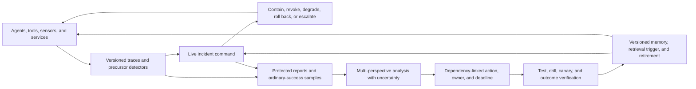

# High-reliability organizations and incident learning: operational audit

<!-- markdownlint-disable MD013 -->

**Date:** 2026-08-05

**Scope:** high-reliability organizations, normal accidents, resilience engineering,
crew resource management, incident command, near-miss reporting, Safety-II,
blameless postmortems, checklists, escalation, redundancy, organizational memory,
and closed-loop learning from incidents

**Purpose:** identify mechanisms that change information flow, temporary authority,
containment, recovery, and longitudinal learning; separate those mechanisms from
management slogans; and test whether any residual architecture remains after
comparison with ordinary site-reliability engineering and safety practice. The
audit constrains
[P-001](../principle-registry.md#p-001--selective-allocation),
[P-002](../principle-registry.md#p-002--local-autonomy-with-exception-escalation),
[P-003](../principle-registry.md#p-003--temporary-trace-before-commitment),
[P-004](../principle-registry.md#p-004--diversity-selection-and-protection),
[P-006](../principle-registry.md#p-006--homeostatic-negative-feedback),
[P-007](../principle-registry.md#p-007--prediction-error-allocation),
[P-008](../principle-registry.md#p-008--compartmentalized-interaction),
[P-009](../principle-registry.md#p-009--maintenance-plane),
[P-010](../principle-registry.md#p-010--structural-offloading-and-co-design),
[P-011](../principle-registry.md#p-011--transient-communication-coalitions),
[P-012](../principle-registry.md#p-012--memory-matched-to-information-lifetime),
and [P-013](../principle-registry.md#p-013--externalized-shared-state).

## Executive finding

The useful content is operational, not adjectival. High reliability is not a
property obtained by calling a culture mindful. The studied and prescribed
mechanisms alter who can report, what state is shared, who may interrupt work,
how command is transferred, how a failure is contained, and whether a lesson
changes a test, policy, runbook, capability, or training exercise.

The evidence does not justify a universal recipe.

- Foundational high-reliability-organization (HRO) work is intensive case study
  and field observation of hazardous organizations selected partly because they
  had unusually good records. It generates mechanisms but is exposed to outcome
  selection, survivorship, unobserved near misses, and domain-specific training
  and authority structures ([Rochlin, La Porte, and Roberts 1987](https://digital-commons.usnwc.edu/nwc-review/vol40/iss4/7/);
  [Roberts 1990](https://doi.org/10.1287/orsc.1.2.160);
  [La Porte and Consolini 1991](https://doi.org/10.1093/oxfordjournals.jpart.a037070)).
- Normal-accident theory is a topology warning: interactive complexity and tight
  coupling can make some failure sequences difficult to anticipate or interrupt.
  Better attention cannot substitute for decoupling, buffers, simplification,
  compartmentation, or abandoning an intolerable configuration
  ([Perrow 1984](https://press.princeton.edu/books/paperback/9780691004129/normal-accidents)).
  Sagan's archival and interview study of nuclear-weapons organizations found
  hidden close calls, common-mode weaknesses, and roles for luck, directly
  limiting optimistic inference from successful operation
  ([Sagan 1993](https://press.princeton.edu/books/paperback/9780691021010/the-limits-of-safety)).
- Crew resource management (CRM), incident command, near-miss systems,
  checklists, postmortems, and organizational memory are distinguishable
  pipelines. Their doctrine or adoption is not itself causal evidence of lower
  loss. The relevant endpoints are detected precursors, containment latency,
  unsafe actions, recurrence severity, and verified corrective changes at equal
  operational cost.
- Silence is ambiguous. Few incident reports can mean few precursors, weak
  detection, fear of reporting, excessive reporting friction, or discarded
  records. A high report count can mean a hazardous system, better observation,
  duplicate reports, or gaming. The denominator and observation process must be
  measured.
- Redundancy, oversight, checklists, reports, and drills consume attention,
  communication, compute, and authority bandwidth. Correlated replicas, stale
  checklists, alert floods, responsibility diffusion, and performative action
  closure can reduce rather than increase reliability.

Every named mechanism below already exists in organizational safety, aviation,
emergency management, medicine, or production operations. One integration
candidate remains:

> A dual-loop operational-assurance plane for adaptive multi-agent AI: a live
> loop creates explicit incident roles, bounded authority transfer, containment,
> escalation, and rollback; a learning loop retains multi-perspective precursor
> traces, samples successful adaptations, binds each accepted finding to a
> versioned action and test, verifies the result, and retires stale lessons.

This is not a new principle. It survives only if dependency-linked memory and
automatic cross-agent near-miss mining improve containment and recurrence at
equal compute, human time, false-stop budget, and capability restriction versus
the strongest null: telemetry and distributed tracing, on-call roles, ordinary
incident command, IAM and sandboxing, circuit breakers, canaries, chaos drills,
blameless postmortems, action trackers, and searchable runbooks.

## Evidence hierarchy and inference limits

| Evidence design | What it can support here | Main boundary |
| --- | --- | --- |
| Intensive field study, interviews, ethnography, archive | Candidate information and authority mechanisms in a real organization | Selection, hindsight, access, unobserved failures, no randomized counterfactual |
| Prospective before-after or multicenter implementation | Outcome association across a declared implementation period and exposure | Temporal confounding, co-interventions, incomplete fidelity, regression to the mean |
| Survey or attitude/behavior evaluation | Adoption, perceived norms, self-reported or observed process changes | Response bias and uncertain connection to rare catastrophic outcomes |
| Authoritative doctrine or advisory circular | The prescribed roles, procedures, scope, and legal/administrative boundary | Prescription is not effectiveness evidence |
| Practitioner case report or handbook | Implementable workflow and operational vocabulary | Selected experience, publication bias, weak causal identification |
| Conceptual theory | Failure model and testable distinctions | No effect estimate without an empirical design |
| Controlled AI fault-injection experiment | Causal comparison inside the declared task, topology, and fault distribution | External validity, simulator fidelity, adaptive adversaries, omitted human costs |

“Established” in this audit can mean that a practice or organizational form is
well documented. It does not mean its effect size transfers to AI, that every
implementation works, or that the mechanism defeats failures outside its model.

## Mechanism map

| Mechanism | Problem actually addressed | Principal path | Dominant cost | Strongest ordinary AI null | Disposition |
| --- | --- | --- | --- | --- | --- |
| High-reliability organizing | Sustaining hazardous operation despite local uncertainty | weak signal → local interpretation → cross-check/escalation → temporary authority response | training, staffing, slack, drills, communication | mature SRE and safety-management practice | Mechanism bundle, not new principle |
| Normal-accident diagnosis | Failure generated by opaque interaction and tight temporal coupling | dependency/topology model → decouple, buffer, simplify, compartmentalize | capacity, latency, reduced feature interaction | architecture review, fault tree, STPA/FMEA, circuit breakers | Hard boundary on cultural remedies |
| Resilience engineering | Performance beyond anticipated procedures and capacity | monitor strain → reallocate/slacken/escalate → adapt → recover | reserve capacity, broader observation, rehearsal | autoscaling, load shedding, graceful degradation, chaos testing | Testable only as capacities and actions |
| Crew resource management | Team errors hidden by authority gradient and poor coordination | observation → explicit callout/cross-check → acknowledged challenge → correction | recurrent training, communication time, false challenge | structured agent protocol plus assertions | Established team-control family |
| Incident command | Coordination during volatile multi-party response | size-up → command → objectives → delegated sections → briefed transfer | role overhead, planning cycle, command-channel bottleneck | ordinary incident commander and runbook | Useful live-loop template |
| Near-miss reporting | Learn from precursors more frequent than losses | detect → report → de-identify/retain → triage → analyze → action | reporting, review, privacy, storage, investigation | automatic telemetry, tracing, error budget | Valuable only with calibrated denominator |
| Safety-II | Learn from ordinary successful adaptations, not only adverse tail | sample normal work → compare expected/work-as-done → identify constraint-preserving adaptations | sampling and analysis of mostly uneventful work | drift dashboards, observability, process mining | Sampling correction, not safety proof |
| Blameless postmortem | Preserve candor and system learning after an event | protected account + evidence → causal reconstruction → owned action → verification | facilitator and participant time, emotional load, follow-through | conventional SRE postmortem | Established learning practice |
| Checklist | Prevent omission and coordinate critical handoffs | trigger/pause → items and confirmations → exception/escalation → completion record | pause time, maintenance, training, fixation risk | executable workflow and policy-as-code | Externalized control aid |
| Escalation/deference to expertise | Let a local detector interrupt a harmful trajectory | anomaly → challenge → acknowledgement → temporary authority shift/stop | expert availability, alerts, production interruption | pager, approval gate, kill switch | Concrete form of P-002 |
| Redundancy/diversity | Continue after a modeled component failure | replicate/diversify → compare/vote/fail over → repair | duplicate capacity, synchronization, adjudication, common-mode risk | N-version/replicated service and ensemble | No benefit without fault dependence model |
| Organizational memory | Make rare experience retrievable when conditions recur | trace → interpretation → indexed artifact → trigger/retrieval → application/retirement | curation, storage, search, validation, staleness | versioned runbook, tests, knowledge base, RAG | Storage alone is not memory-in-use |
| Closed-loop incident learning | Convert reports into verified prevention or mitigation | report → analyze → prioritize → action owner → deploy → evaluate → revise | investigation and change budget | action tracker plus CI/canary/metrics | Residual integration point |

## Shared quantitative boundary

### Reports are a biased observation channel

For a declared exposure interval, let

$$
N_{\mathrm{report}} =
N_{\mathrm{precursor}}
p_{\mathrm{detect}}
p_{\mathrm{report}}
p_{\mathrm{retain}}.
$$

$N_{\mathrm{precursor}}$ and $N_{\mathrm{report}}$ are event counts;
$p_{\mathrm{detect}}$, $p_{\mathrm{report}}$, and
$p_{\mathrm{retain}}$ are dimensionless conditional probabilities. The
factorization is a diagnostic simplification, not an independence claim. These
probabilities can depend on severity, reporter identity, workload, incentives,
instrumentation, and prior enforcement. A report count is not a safety rate
unless exposure and observation are calibrated.

### Learning is a lossy, dependent funnel

$$
N_{\mathrm{verified}} =
N_{\mathrm{report}}
p_{\mathrm{triage}}
p_{\mathrm{analyze}}
p_{\mathrm{action}}
p_{\mathrm{verify}}.
$$

Here every $N$ is a count over the same report cohort and each $p$ is a
dimensionless stage-conditional completion probability. The stages are dependent:
easy cases may be selected for action, teams can redefine completion, and a
weak analysis changes the probability that the action is effective. Report the
cohort flow and reasons for attrition rather than multiplying organization-wide
averages into a spurious causal estimate.

### Containment latency has an authority component

$$
T_{\mathrm{contain}} =
T_{\mathrm{detect}} + T_{\mathrm{classify}} +
T_{\mathrm{authorize}} + T_{\mathrm{act}}.
$$

All $T$ terms use one time unit, normally seconds or minutes from a defined
fault onset. Measure medians and upper tails. An escalation policy can reduce
$T_{\mathrm{authorize}}$ while increasing false stops and expert load; a
single mean hides the exact failures for which hierarchy is slowest.

### Redundancy requires a dependence model

For component failure probabilities $p_i$ over one declared demand and a
common-cause event $C$ with probability $p_C$, a simplified series of
backup channels has

$$
P_{\mathrm{system\ failure}} =
p_C + (1-p_C)\prod_{i=1}^{m} p_i,
$$

only if residual channel failures are independent conditional on no $C$, all
channels are required to fail for system failure, switching/adjudication works,
and $p_i$ refers to the same demand. Software replicas with the same model,
prompt, data, tool, or specification often violate those assumptions.

### Safety work is not free

For $N_{\mathrm{runs}}$ checklist uses and $U$ revisions,

$$
C_{\mathrm{check}} =
N_{\mathrm{runs}}(t_{\mathrm{pause}}+t_{\mathrm{complete}})
+ C_{\mathrm{train}} + U C_{\mathrm{update}} + C_{\mathrm{audit}}.
$$

The time terms are person-seconds or agent-seconds; training, update, and audit
costs must be converted to the same unit only with an explicit exchange rule.
Compare prevented omissions and reduced harm at equal workload, not checklist
completion alone.

## 1. High-reliability organizing

**Evidence design.** Rochlin, La Porte, and Roberts reported field research on
aircraft-carrier flight operations; Roberts compared organizational processes
in nearly failure-free hazardous operations; La Porte and Consolini developed
theoretical implications from those cases. These are intensive, selected case
studies and mechanism-generating analyses, not randomized interventions. Their
strongest contribution is observed organizing under hazard; their weakest is a
causal estimate of accident prevention.

**Exact problem.** Hazardous work generates ambiguous local signals and
interdependent actions while catastrophic outcomes are too rare to provide a
convenient training set.

**Information/authority path.** Front-line observations move through repeated
briefing, cross-checking, reporting, and supervisory channels; task authority
can move toward the person with the relevant operational knowledge while formal
command retains accountability and resource control.

**Timescale.** Seconds to minutes for correction; shifts and operational cycles
for coordination; years for training, selection, doctrine, and institutional
adaptation.

**Resource cost.** Dense training, duplicated observation, drills, procedural
discipline, staffing, maintenance, slack, and communication. The historical
cases do not show that comparable outcomes survive removal of those resources.

**Assumptions.** Members detect weak signals, can speak across rank, share enough
vocabulary to interpret them, and operate within a bounded mission whose hazards
and authority structure are repeatedly rehearsed.

**Failure boundary.** Successful cases can conceal near misses, luck, suppressed
reports, and hazards that never occurred in the observation window. Authority
may revert to rank under pressure; ritualized briefings can become noise; the
organization can optimize known operations while missing design-level risk.

**Strongest engineering/AI null.** Mature SRE with telemetry, on-call ownership,
change review, canaries, circuit breakers, game days, incident command, and
postmortems already implements most named mechanisms.

**P mapping and residual.** Maps to P-002, P-006, P-009, and P-011. No HRO label
survives as a new principle. The residual question is whether adaptive modules
need machine-enforced authority transfer and version-linked learning because
their membership and behavior change faster than human teams.

## 2. Normal accidents: interaction topology and coupling

**Evidence design.** Perrow's comparative sociological theory uses accident
histories to distinguish linear from complex interactions and loose from tight
coupling. Sagan used archival records and interviews concerning U.S. nuclear
weapons to compare normal-accident and HRO expectations. Neither supplies a
portable scalar “complexity” threshold, but both provide adversarial cases
against inferring safety from past success.

**Exact problem.** Multiple individually manageable components can interact in
unanticipated sequences faster than diagnosis, authorization, buffering, or
recovery can interrupt them.

**Information/authority path.** Dependency and incident evidence must reach
architects with authority to reduce coupling, remove interactions, add buffers,
isolate compartments, or reject the system—not merely operators asked to be
more vigilant.

**Timescale.** Milliseconds to hours for cascades; release cycles to years for
topology changes and safety-case revision.

**Resource cost.** Buffers and slack add capacity and latency; compartmentation
duplicates interfaces and state; simplification can remove functionality;
decoupling can reduce throughput.

**Assumptions.** Interaction graphs, temporal constraints, recovery windows,
and common-mode dependencies are observable enough to change. Some failure
paths may remain outside the model.

**Failure boundary.** Culture and response training cannot reliably rescue a
system whose harmful propagation outruns observation and intervention. Extra
protective components can add interactions and new common causes.

**Strongest engineering/AI null.** Architecture hazard analysis, dependency
graphs, FMEA/fault trees or STPA, timeouts, bulkheads, circuit breakers,
capability boundaries, and removal of unnecessary autonomy.

**P mapping and residual.** Maps to P-008 and P-009 and constrains every claim
that better coordination alone yields safety. No residual principle: topology
and recovery-time margin must be measured directly.

## 3. Resilience engineering and graceful extensibility

**Evidence design.** Resilience engineering began as a conceptual and case-based
program. Woods distinguishes rebound, robustness, graceful extensibility, and
sustained adaptability rather than treating resilience as one property
([Woods 2015](https://doi.org/10.1016/j.ress.2015.03.018)). The distinctions are
testable; the umbrella term is not itself a causal result.

**Exact problem.** A system that performs well inside its modeled envelope may
fail abruptly when demand, novelty, or component loss exceeds planned capacity.

**Information/authority path.** Observers estimate demand, capacity, margin, and
strain; local controllers shed load or degrade service; unresolved strain
escalates to actors who can allocate reserve capacity or change objectives;
recovery evidence returns to design.

**Timescale.** Milliseconds for automated shedding, minutes for reallocation,
hours to days for recovery, and releases to years for redesign.

**Resource cost.** Spare capacity, diverse observation, broader training,
fallback modes, rehearsals, and decision bandwidth. Reserve capacity consumed
by ordinary optimization is unavailable during surprise.

**Assumptions.** A useful margin signal exists; degradation modes preserve the
highest-priority constraints; controllers have authority before capacity is
exhausted; novelty does not invalidate all sensing and action.

**Failure boundary.** “Adapt” can hide improvisation that transfers harm,
exhausts staff, or normalizes operation outside design limits. Robustness to one
perturbation can increase brittleness elsewhere. Recovery after harm is not
prevention.

**Strongest engineering/AI null.** Autoscaling, load shedding, admission
control, graceful degradation, failover, rollback, chaos testing, and capacity
planning with explicit service-level objectives.

**P mapping and residual.** Maps to P-001, P-002, P-006, and P-009. A residual
exists only if an AI system estimates its own changing competence and reallocates
authority/capacity more effectively than ordinary resource and risk controllers.

## 4. Crew resource management

**Evidence design.** Helmreich, Merritt, and Wilhelm document the evolution of
CRM, evaluation practice, cultural limits, and the shift toward error management
([1999](https://doi.org/10.1207/s15327108ijap0901_2)). FAA AC 120-51E specifies
training topics and implementation guidance. Program, attitude, and behavior
evaluations support adoption and process change; rare crash-rate attribution is
confounded by concurrent technology, regulation, selection, and reporting.

**Exact problem.** A crew can possess the needed observation collectively yet
fail because workload, ambiguous speech, automation surprise, or authority
gradient prevents it from changing the shared plan.

**Information/authority path.** A member names an observation or threat;
another repeats or cross-checks it; the responsible actor acknowledges the
challenge; unresolved disagreement escalates or triggers a stop; leadership and
followership adapt to expertise and workload.

**Timescale.** Seconds for callout and correction; minutes to hours for workload
and threat management; recurrent training cycles for stable behavior.

**Resource cost.** Training, simulator time, standardized language, repeated
acknowledgements, and attentional interruption. Overcommunication can bury
urgent signals.

**Assumptions.** Communication channels work, roles and task state are legible,
members can challenge without retaliation, and assertions refer to observable
conditions rather than social confidence alone.

**Failure boundary.** Formulaic callouts without acknowledgement, rank override,
cultural mismatch, automation opacity, simultaneous overload, and shared
misdiagnosis. CRM does not correct a wrong sensor or common flawed model by
itself.

**Strongest engineering/AI null.** Structured agent messages, explicit
preconditions, acknowledgement, independent assertions, confidence and evidence
fields, deterministic interlocks, and a human or service-level kill switch.

**P mapping and residual.** Maps to P-002 and P-011. The possible residual is a
measured challenge protocol for heterogeneous agents whose authority changes by
incident expertise, not anthropomorphic “teamwork.”

## 5. Incident command

**Evidence design.** Bigley and Roberts studied the Incident Command System
(ICS) as high-reliability organizing in a volatile task environment
([2001](https://doi.org/10.2307/3069401)). FEMA's National Incident Management
System is authoritative doctrine specifying command, modular organization,
common terminology, management by objectives, planning, resource management,
and transfer briefing ([FEMA 2017](https://www.fema.gov/sites/default/files/2020-07/fema_nims_doctrine-2017.pdf)). Doctrine establishes the intended system,
not its causal effect against an unstructured response.

**Exact problem.** A volatile incident adds actors, jurisdictions, tasks, and
resources faster than an informal group can maintain one operating picture and
coherent priorities.

**Information/authority path.** Initial size-up establishes command; command
sets objectives; operations acts, planning maintains situation and future plans,
logistics supplies resources, and finance/administration records constraints;
unified command reconciles jurisdictions; command transfer requires a briefing
and notification.

**Timescale.** Seconds to minutes for initial command; operational periods of
hours; days or longer for demobilization and recovery.

**Resource cost.** Dedicated coordination roles, communications, planning
artifacts, resource tracking, briefings, and trained replacements. Small events
can be burdened by premature bureaucracy.

**Assumptions.** Roles are pre-authorized, terminology is shared, resource state
is visible, spans of control are manageable, and command can delegate without
losing accountability.

**Failure boundary.** Competing commanders, ambiguous transfer, stale operating
pictures, command bottlenecks, excessive span, incompatible communications, and
objectives that omit affected parties. Formal role assignment does not create
expertise.

**Strongest engineering/AI null.** A conventional incident commander, on-call
roles, shared dashboard, runbook, issue channel, action log, rollback owner, and
clear production authority.

**P mapping and residual.** Maps to P-001, P-002, P-011, and P-013. The live-loop
candidate should be called ICS-like only if it implements modular roles, explicit
objective/authority records, and briefed transfer—not because agents have titles.

## 6. Near-miss reporting

**Evidence design.** Phimister and colleagues derived a seven-stage framework
from more than 100 interviews across 20 chemical and pharmaceutical facilities
([2003](https://doi.org/10.1111/1539-6924.00326)). FAA AC 00-46F specifies the
NASA Aviation Safety Reporting Program's third-party receipt, de-identification,
and bounded enforcement policy
([FAA 2021](https://asrs.arc.nasa.gov/docs/AC_00-46F.pdf)). The former is a
cross-site qualitative process study; the latter is program doctrine, not a
randomized estimate of accidents prevented.

**Exact problem.** Catastrophic outcomes are rare and delayed, while precursor
events can expose weak barriers and confusing conditions earlier.

**Information/authority path.** A person or monitor detects a precursor;
submits a structured record to a trusted channel; identity is protected or
access-controlled under declared rules; reviewers retain, classify, and analyze
it; findings reach owners with authority and budget; feedback returns to
reporters and operators.

**Timescale.** Seconds to days for detection and reporting, days to months for
analysis/action, and months to years for recurrence evaluation.

**Resource cost.** Capture friction, de-identification and security, taxonomy,
triage, investigation, duplicate handling, feedback, storage, and corrective
work. Automatic capture can create an unreviewable flood.

**Assumptions.** Precursors resemble relevant failure paths; reporters notice
and can describe them; confidentiality and incentives are credible; the program
has authority and resources beyond collection.

**Failure boundary.** Under-reporting, selective detection, punishment fear,
privacy leakage, false or strategic reports, survivor accounts, taxonomy drift,
and no feedback. AC 00-46F is not blanket immunity: its enforcement and sanction
waiver boundaries exclude, among other cases, criminal conduct and accidents,
and the limited waiver has timeliness and eligibility conditions.

**Strongest engineering/AI null.** Complete telemetry and distributed traces,
error budgets, automatic anomaly clustering, issue tracking, and direct failure
reproduction with known denominators.

**P mapping and residual.** Maps to P-003, P-007, P-009, P-012, and P-013. The
residual candidate is cross-agent precursor mining plus a protected human report
channel, evaluated on denominator-known detection and verified fixes rather than
report volume.

## 7. Safety-II and ordinary successful work

**Evidence design.** The EUROCONTROL white paper is a conceptual and
authoritative exposition contrasting accident-centered Safety-I with attention
to how everyday performance succeeds under variable conditions
([Hollnagel et al. 2013](https://www.eurocontrol.int/sites/default/files/content/documents/nm/safety/safety_whitepaper_sept_2013-web.pdf)). It defines a research and management lens, not a controlled demonstration of a universal intervention.

**Exact problem.** Sampling only failures omits the denominator and hides the
ordinary adaptations that preserve constraints most of the time or gradually
move work toward danger.

**Information/authority path.** Sample routine operations and demanding but
successful cases; compare procedure, expected work, and work-as-done; identify
adaptations and constraints; route unsafe drift or useful flexibility to
designers and operators; verify any intervention against both success and loss.

**Timescale.** Continuous sampling or periodic audits; days to months for
analysis; releases to years for longitudinal drift.

**Resource cost.** Recording and examining large amounts of uneventful work,
privacy review, analyst attention, and the risk that observation disrupts work.

**Assumptions.** Successful adaptations are observable, comparable, and not
merely lucky; analysts can distinguish necessary flexibility from normalization
of deviance; sampling covers regimes relevant to future demand.

**Failure boundary.** Vague celebration of adaptability, no outcome denominator,
post hoc stories, surveillance burden, and reinforcement of shortcuts that
succeeded by chance. More successful episodes can simply reflect more exposure.

**Strongest engineering/AI null.** Representative production tracing, process
mining, drift analysis, sampled shadow evaluation, and comparing successful and
failed trajectories under known tasks.

**P mapping and residual.** Maps to P-006, P-007, and P-009. The useful residual
is a sampling design: retain enough ordinary multi-agent trajectories to learn
which adaptations preserve constraints, without storing all activity forever.

## 8. Blameless postmortems

**Evidence design.** Google's SRE chapter documents an operational postmortem
culture and workflow based on practitioner experience
([Lunney and Lueder 2016](https://sre.google/sre-book/postmortem-culture/)). It
is an implementable case and rationale, not randomized evidence that the label
“blameless” lowers incident rates.

**Exact problem.** Fear and individual scapegoating suppress evidence about the
local context and system conditions that made an action appear reasonable, while
an event still needs accountable correction.

**Information/authority path.** Participants preserve timelines and evidence;
a facilitator reconstructs conditions and decisions without presuming individual
culpability; contributing mechanisms become owned actions with priority and due
date; later review verifies effectiveness and disseminates the result.

**Timescale.** Hours to days after stabilization; weeks to releases for actions;
months for recurrence and effectiveness review.

**Resource cost.** Preparation, facilitation, participant time and psychological
safety, artifact maintenance, action engineering, and review. Excessive ceremony
can compete with prevention work.

**Assumptions.** Participants expect fair treatment, records are sufficiently
complete, misconduct/security boundaries are explicit, owners can change the
system, and senior actors are subject to the same inquiry.

**Failure boundary.** “Blameless” becomes no accountability; legal or employment
risk makes candor irrational; narratives are polished around missing evidence;
actions stop at “be more careful”; tickets close without outcome verification.

**Strongest engineering/AI null.** Standard SRE timeline, causal/contributing-
factor analysis, no individual blame absent misconduct, and an action tracker
connected to tests and deployment metrics.

**P mapping and residual.** Maps to P-009, P-012, and P-013. No independent
principle survives. The candidate needs a separate candor channel and enforcement
boundary, plus machine-verifiable action linkage, not a sentimental adjective.

## 9. Checklists

**Evidence design.** Haynes and colleagues prospectively compared 3,733
consecutive patients before and 3,955 after implementation of a 19-item surgical
safety checklist at eight hospitals
([2009](https://doi.org/10.1056/NEJMsa0810119)). Outcomes improved concurrently,
but the multicenter before-after design cannot isolate checklist items from team
communication, implementation attention, temporal change, or other co-interventions.
Its reported effect size must not be imported as a constant for AI operations.

**Exact problem.** Under time pressure, trained actors omit critical but routine
steps, fail to establish shared identity/state, or cross a hazardous transition
without confirmation.

**Information/authority path.** A defined trigger creates a pause; a responsible
actor reads or executes items; relevant parties provide independent confirmation;
exceptions escalate or record an authorized deviation; completion becomes an
auditable state transition.

**Timescale.** Seconds to minutes per use; weeks to months for training and
revision; immediate invalidation when procedures or interfaces change.

**Resource cost.** Pause/completion time, interruption, training, maintenance,
auditing, and automation. Longer lists increase fatigue and superficial compliance.

**Assumptions.** The list targets consequential omissions, appears at the right
trigger, is current, permits expert escalation, and completion evidence cannot
be trivially fabricated.

**Failure boundary.** Checklist fixation, box ticking, stale items, duplicates,
bypass during urgency, false reassurance, and suppression of context-sensitive
deviation. A list does not diagnose an unmodeled hazard.

**Strongest engineering/AI null.** Executable workflow, schema/precondition
validation, policy-as-code, CI gates, state machines, and deterministic interlocks.

**P mapping and residual.** Maps to P-006, P-010, and P-013. The residual is an
adaptive but versioned operational gate that records justified deviation and
escalates uncertainty; it must beat executable checks that require no language model.

## 10. Escalation and deference to expertise

**Evidence design.** HRO field accounts and CRM/ICS doctrine converge on local
challenge, temporary expertise-sensitive influence, and clear command channels.
That cross-domain recurrence supports a general coordination problem, but does
not establish one universal escalation rule or prove the popular HRO slogan.

**Exact problem.** The actor nearest a weak signal may lack formal authority,
while the formal authority may lack the specific information needed before harm.

**Information/authority path.** A detector sends a structured anomaly and
evidence; the current owner acknowledges it within a deadline; a threshold,
two-challenge rule, specialist assessment, or hard interlock temporarily shifts
decision authority or stops capability; the decision and restoration condition
are recorded.

**Timescale.** Milliseconds for interlocks, seconds to minutes for challenge and
acknowledgement, hours for incident authority, and days for review.

**Resource cost.** Alerting, expert on-call load, interrupted work, false stops,
capability revocation and restoration, and training against rank effects.

**Assumptions.** Escalation thresholds reflect risk; the expert is available and
actually better informed; acknowledgement is enforceable; stopping is possible
before irreversible action.

**Failure boundary.** Alert floods, strategic escalation, ignored challenge,
wrong expert, correlated belief, vague authority, expert overload, and a harmful
action whose physical or external effects cannot be revoked.

**Strongest engineering/AI null.** Pager escalation, approval workflow, rate
limit, scoped capability token, circuit breaker, two-person rule, and human kill
switch.

**P mapping and residual.** Directly instantiates P-002 and also maps to P-007
and P-011. The residual is only a calibrated authority protocol for agents,
including acknowledgement deadline, bounded scope, fallback, and restoration.

## 11. Redundancy and diversity

**Evidence design.** Landau's theoretical analysis explains why duplication and
overlap can protect public administration from error
([1969](https://doi.org/10.2307/973247)). Sagan's empirical historical analysis
shows that redundancy may add complexity, common-mode failure, and responsibility
diffusion. Together they support conditional design, not “more replicas are safer.”

**Exact problem.** A critical function should survive one or more component,
observer, communication, or decision failures in a declared fault model.

**Information/authority path.** Independent or diverse channels observe or act;
a comparator, voter, adjudicator, or failover controller detects disagreement or
loss; the system selects a result, isolates failed capacity, and initiates repair.

**Timescale.** Microseconds for hardware voting, seconds to minutes for service
failover, hours for expert adjudication, and releases for diversification and repair.

**Resource cost.** Replicated compute, sensors, teams, prompts/models/data,
synchronization, state reconciliation, voting, testing, and repair. Diversity is
usually more expensive than cloning.

**Assumptions.** Failure dependence is estimated; the comparator and switch are
reliable enough; replicas do not share the decisive flaw; disagreement can be
resolved before harm.

**Failure boundary.** Common specification, data, model, tool, infrastructure,
or incentive; correlated hallucination; latent state divergence; majority error;
adjudicator failure; responsibility diffusion; extra interaction complexity.

**Strongest engineering/AI null.** Replicated services, ensembles, N-version
programming, independent monitors, quorum, deterministic validators, and a
separate fallback implementation.

**P mapping and residual.** Maps to P-004 and P-008. No biological or
organizational novelty survives. Any AI claim must report conditional dependence,
diversity cost, adjudication errors, and common-mode tests.

## 12. Organizational memory

**Evidence design.** March, Sproull, and Tamuz conceptually analyze how
organizations learn from “samples of one or fewer” by expanding interpretation,
using near histories, and constructing hypothetical histories
([1991](https://doi.org/10.1287/orsc.2.1.1)). Vaughan's archival and ethnographic
analysis of the Challenger decision demonstrates how repeated interpretation can
normalize anomalous evidence rather than preserve warning
([1996](https://press.uchicago.edu/ucp/books/book/chicago/C/bo22781921.html)).
NASA's Lessons Learned Information System is an authoritative repository and
workflow, not proof that a stored lesson is retrieved or obeyed.

**Exact problem.** Rare events, turnover, version change, and long delays erase
experience before a superficially different recurrence requires it.

**Information/authority path.** Preserve raw evidence and competing
interpretations; index by affected dependency, condition, decision, and version;
connect accepted lessons to policy, test, training, runbook, or capability
change; trigger retrieval in an applicable context; record use, outcome, and
retirement.

**Timescale.** Event traces over seconds to days; retention and recurrence over
months to decades; retrieval during seconds-to-hours decisions.

**Resource cost.** Capture, curation, access control, provenance, indexing,
search, rehearsal, migration, validation, and removal of stale guidance.

**Assumptions.** Applicability can be encoded or retrieved, context survives
compression, later users trust and understand the record, and changes invalidate
dependent lessons.

**Failure boundary.** Archive without retrieval, search without adoption,
hindsight narratives, loss of dissenting evidence, stale rules, retrieval of a
seductive but inapplicable incident, and storage volume mistaken for learning.

**Strongest engineering/AI null.** Versioned runbooks and architecture decisions,
tests derived from incidents, searchable knowledge bases or RAG with provenance,
dependency graphs, and scheduled review.

**P mapping and residual.** Maps to P-009, P-012, and P-013. The residual is
dependency-triggered retrieval plus automatic invalidation/retirement. Measure
$P(\text{relevant lesson retrieved}\mid\text{applicable condition})$ and
$P(\text{effective action}\mid\text{retrieval})$, not document count.

## 13. Closed-loop learning from incidents

**Evidence design.** Drupsteen, Groeneweg, and Zwetsloot combined a survey with
three exploratory Dutch case studies and found declining formalization across
later learning stages, with evaluation a prominent bottleneck
([2013](https://doi.org/10.1080/10803548.2013.11076966)). Lukic, Littlejohn, and
Margaryan developed and empirically examined a learning framework at two sites
of multinational energy organizations
([2012](https://doi.org/10.1016/j.ssci.2011.12.032)). NASA and NTSB workflows
show institutional collection and recommendation tracking; repositories and
recommendations alone do not compel effective implementation.

**Exact problem.** Organizations can collect and explain incidents while failing
to prioritize, implement, verify, generalize, or retire corrective changes.

**Information/authority path.** A retained report receives a scoped analysis;
recommendations are prioritized against risk and opportunity cost; an owner with
authority and resources implements a versioned change; tests, canaries, drills,
or recurrence metrics verify it; results update the analysis and organizational
memory.

**Timescale.** Hours to weeks for analysis and action, release cycles for
deployment, and months to years for recurrence and unintended-effect evaluation.

**Resource cost.** Investigator and operator time, engineering opportunity cost,
test infrastructure, deployment risk, monitoring, audit, and lesson maintenance.

**Assumptions.** Causal uncertainty is recorded, owners control the relevant
system, outcome metrics have enough exposure, action closure cannot be gamed,
and later changes preserve or invalidate the lesson explicitly.

**Failure boundary.** Shallow root cause, recommendation overload, low-cost
training actions replacing design changes, ticket closure without effect,
metric gaming, transferred risk, recurrence hidden by low exposure, and stale
fixes retained after architecture change.

**Strongest engineering/AI null.** Incident issue templates, accountable action
owners, CI regression tests, canary/rollback, service-level and safety metrics,
scheduled review, and searchable versioned postmortems.

**P mapping and residual.** Maps to P-003, P-006, P-009, and P-013. The residual
candidate is the binding across raw multi-agent trace, claim, dependency,
corrective change, test, deployment, and later retrieval. It must improve verified
learning, not paperwork completion.

## Cross-domain deductions

1. **Live reliability and longitudinal learning are different loops.** Incident
   command can contain a fault without identifying its causes; a postmortem can
   identify a cause without improving the next live response. Both loops need
   an explicit interface.
2. **Authority inversion must be temporary and scoped.** “Deference to expertise”
   is operational only when the trigger, capability, acknowledgement, extent,
   expiry, and restoration conditions are recorded. Permanent informal authority
   creates another unaccountable hierarchy.
3. **Silence is not evidence of safety.** Reports require a known or estimable
   detection and reporting channel; metrics must include exposure, automatically
   detectable precursors, and non-event intervals.
4. **Success sampling corrects a selection bias but creates a resource problem.**
   Ordinary work vastly outnumbers incidents, so a Safety-II implementation
   needs principled sampling, retention, and deletion rather than indiscriminate logs.
5. **Safety mechanisms create load and topology.** A new monitor, reviewer,
   replica, command role, or checklist item adds dependencies and failure modes.
   Evaluate the assurance mechanism inside the same hazard model.
6. **Memory becomes organizational only through use.** A report that is stored
   but not retrieved, an action that is closed but not verified, or a lesson that
   is never invalidated is an archive, not a learning control loop.

## Residual candidate: dual-loop operational assurance for adaptive AI



### Live loop requirements

- Declare incident state, current objectives, affected capabilities, command
  owner, operations/planning/logistics roles, and the current operational period.
- Make escalation an acknowledged state transition with deadline, fallback,
  bounded capability, expiry, and restoration conditions.
- Preserve one shared, versioned operating picture while retaining conflicting
  observations rather than averaging them away.
- Permit containment actions—rate limit, isolate, revoke, degrade, fail over,
  stop, and rollback—before a complete explanation.
- Bound spans of control and record command transfer with a machine-checkable
  briefing artifact.

### Learning loop requirements

- Retain raw multi-perspective traces separately from the accepted narrative;
  state missing evidence and alternative explanations.
- Sample known precursors and ordinary successful adaptations with a declared
  exposure and deletion policy.
- Separate protected reporting from enforcement, while defining exclusions for
  deliberate abuse, security compromise, and legal reporting duties.
- Bind each accepted lesson to affected versions and dependencies, an owner,
  action, test or drill, verification metric, and review/retirement date.
- Track recurrence severity and applicability-triggered retrieval, not report,
  meeting, document, or ticket volume.

## Decisive experiments for multi-agent and modular AI operations

### A. Incident-command topology

Inject correlated tool faults, conflicting sensor observations, unavailable
agents, changing objectives, and communication overload. Compare ad hoc agent
chat, a fixed central supervisor, ICS-like modular roles, and a mature SRE
runbook with an incident commander. Hold models, tool permissions, compute,
human minutes, and response deadline constant. Measure $T_{\mathrm{contain}}$
at p50 and p99, contradictory commands, unsafe actions before containment,
handoff information loss, recovery quality, communication volume, and role cost.
The residual loses if ordinary incident command ties or wins.

### B. CRM-style challenge and escalation

Construct hazards where a low-authority specialist has decisive evidence that
conflicts with the current coordinator. Vary authority gradient, alert load,
expert availability, time to irreversible action, and shared-model correlation.
Compare free-form messaging, threshold escalation, an acknowledged two-challenge/
stop rule, and direct deterministic capability revocation. Measure hazard recall,
false stops, acknowledgement latency, harm before halt, expert load, and strategic
escalation. The AI protocol loses if a conventional interlock or pager rule is
safer at equal interruption cost.

### C. Near-miss observation and candor

Instrument a simulator with a known precursor denominator. Compare mandatory
logs, confidential human/agent reports, bounded non-punitive reporting,
punitive individual attribution, and automatic trajectory mining. Measure true
precursor detection, report probability, retention, duplicates, false reports,
privacy leakage, reviewer time, action quality, and verified fixes. Raw report
count is prohibited as the primary outcome.

### D. Checklist with adaptive deviation

Run routine and high-stress procedures with known omissions, changed interfaces,
and rare conditions that require deviation. Compare no checklist, a static
document, an executable checklist, and an executable checklist with expert
override plus recorded rationale/escalation. Measure consequential omissions,
fixation errors, latency, bypass, stale-item failures, override precision, and
maintenance cost. The adaptive candidate loses if executable deterministic
checks dominate.

### E. Learning and memory across versions

Reintroduce causally related faults months or releases later with changed names
and surface symptoms. Compare a postmortem archive, keyword/vector retrieval,
dependency-linked action/test updates, and the dual-loop candidate. Measure
retrieval precision/recall conditional on applicability, recurrence severity,
action closure and verified effectiveness, stale-lesson harm, invalidation
latency, and curation cost.

### F. Normal-accident topology versus response culture

Factorially vary coupling, interaction opacity, buffer/slack, compartmentation,
replication, and common-mode fault probability. Hold incident-response training
constant, then hold topology constant while varying response protocols. Determine
where decoupling/simplification dominates better escalation and where live
coordination adds benefit. A culture-only proposal fails if propagation outruns
its observation and authority path.

### G. Safety-II sampling

Give analysts a fixed budget and compare failure-only analysis with stratified
sampling of failures, near misses, ordinary success, and demanding successful
adaptations. Evaluate detection of drift, discovery of new hazards, unnecessary
interventions, retained bytes, privacy cost, and future incident severity. The
proposal fails if ordinary production observability produces the same signals
more cheaply.

## Falsifiers for the residual architecture

- A mature SRE stack matches containment latency, unsafe-action rate, recurrence,
  and retrieval while using no more human time, compute, storage, or false stops.
- Cross-agent near-miss mining adds reports but not denominator-adjusted precursor
  recall or verified corrective changes.
- Explicit incident roles increase coordination traffic, contradictory actions,
  or tail containment latency under small and large incidents.
- Protected reporting increases strategic or low-quality reports enough that
  net reviewer cost and safety outcome are worse than complete telemetry.
- Dependency-linked memory retrieves stale or irrelevant lessons more often than
  it prevents recurrence, after version invalidation is enabled.
- Adaptive checklist deviation creates more consequential bypasses than it
  prevents fixation errors.
- Topological simplification, capability restriction, or deterministic interlocks
  dominate every organizational intervention at equal task utility.

## Temporary claim ledger

These IDs are local to this audit. They must be reconciled with the repository
claim ledger only after review; inclusion here does not make them established.

| ID | Temporary claim | Status | Decisive boundary |
| --- | --- | --- | --- |
| HRO-01 | HRO field research identifies repeated weak-signal, cross-check, expertise, and maintenance mechanisms in selected hazardous organizations. | plausible | Does not identify a portable causal effect or rule out selection and luck. |
| HRO-02 | Interactive complexity and tight coupling can create propagation paths that response culture cannot interrupt in time. | plausible | Requires an operational topology/coupling measure and matched interventions. |
| HRO-03 | Resilience must be decomposed into reserve capacity, monitoring, graceful degradation, recovery, and sustained adaptation. | established as a conceptual distinction | No universal resilience scalar or guaranteed outcome follows. |
| HRO-04 | CRM-style challenge can expose distributed evidence hidden by authority gradients. | plausible | Must beat deterministic interlocks and structured assertions at equal false-stop cost. |
| HRO-05 | ICS provides a modular temporary authority and information structure for volatile incidents. | established as doctrine and observed practice | Effectiveness depends on training, communication, role fit, and scale. |
| HRO-06 | Near-miss counts are products of precursor exposure and detection, reporting, and retention processes. | established measurement identity | Factorization is diagnostic; conditional probabilities are not independent constants. |
| HRO-07 | Sampling ordinary successful work can reveal adaptations and drift omitted by failure-only analysis. | plausible | Must improve prospective hazard detection under a fixed analysis budget. |
| HRO-08 | Blameless postmortems can improve candor only with credible boundaries and verified actions. | plausible | Practitioner evidence does not isolate causal effects; no-accountability variants fail. |
| HRO-09 | Checklists can reduce omissions and coordinate handoffs, but effect depends on trigger, content, fidelity, and maintenance. | plausible | Before-after surgical effect sizes are not transferable constants. |
| HRO-10 | Escalation is an operational mechanism only when acknowledgement, authority, scope, fallback, expiry, and restoration are explicit. | proposed design criterion | Must beat pager, interlock, scoped token, and kill-switch nulls. |
| HRO-11 | Redundancy improves reliability only relative to a declared dependence, adjudication, and switching model. | established engineering boundary | Cloned models, data, prompts, and tools commonly violate conditional independence. |
| HRO-12 | Stored incident documents become organizational memory only when applicable lessons are retrieved, used, evaluated, and retired. | plausible | Requires prospective retrieval and outcome measurement, not archive size. |
| HRO-13 | Binding multi-agent traces to dependencies, actions, tests, deployments, and retrieval may close gaps between live response and learning. | speculative | Candidate must beat an integrated conventional SRE stack in experiments A–G. |

## Bibliography (BibTeX)

```bibtex
@article{rochlin1987selfdesigning,
  author = {Rochlin, Gene I. and La Porte, Todd R. and Roberts, Karlene H.},
  title = {The Self-Designing High-Reliability Organization: Aircraft Carrier Flight Operations at Sea},
  journal = {Naval War College Review},
  year = {1987},
  volume = {40},
  number = {4},
  pages = {76--90},
  url = {https://digital-commons.usnwc.edu/nwc-review/vol40/iss4/7/}
}

@article{roberts1990characteristics,
  author = {Roberts, Karlene H.},
  title = {Some Characteristics of One Type of High Reliability Organization},
  journal = {Organization Science},
  year = {1990},
  volume = {1},
  number = {2},
  pages = {160--176},
  doi = {10.1287/orsc.1.2.160},
  url = {https://doi.org/10.1287/orsc.1.2.160}
}

@article{laporte1991practice,
  author = {La Porte, Todd R. and Consolini, Paula M.},
  title = {Working in Practice but Not in Theory: Theoretical Challenges of High-Reliability Organizations},
  journal = {Journal of Public Administration Research and Theory},
  year = {1991},
  volume = {1},
  number = {1},
  pages = {19--47},
  doi = {10.1093/oxfordjournals.jpart.a037070},
  url = {https://doi.org/10.1093/oxfordjournals.jpart.a037070}
}

@book{perrow1984normal,
  author = {Perrow, Charles},
  title = {Normal Accidents: Living with High-Risk Technologies},
  publisher = {Basic Books},
  address = {New York},
  year = {1984},
  isbn = {9780465051427}
}

@book{sagan1993limits,
  author = {Sagan, Scott D.},
  title = {The Limits of Safety: Organizations, Accidents, and Nuclear Weapons},
  publisher = {Princeton University Press},
  address = {Princeton, NJ},
  year = {1993},
  isbn = {9780691021010},
  url = {https://press.princeton.edu/books/paperback/9780691021010/the-limits-of-safety}
}

@article{woods2015four,
  author = {Woods, David D.},
  title = {Four Concepts for Resilience and the Implications for the Future of Resilience Engineering},
  journal = {Reliability Engineering \& System Safety},
  year = {2015},
  volume = {141},
  pages = {5--9},
  doi = {10.1016/j.ress.2015.03.018},
  url = {https://doi.org/10.1016/j.ress.2015.03.018}
}

@techreport{hollnagel2013safety,
  author = {Hollnagel, Erik and Leonhardt, J{\"o}rg and Licu, Tony and Shorrock, Steven},
  title = {From Safety-I to Safety-II: A White Paper},
  institution = {EUROCONTROL},
  address = {Brussels},
  year = {2013},
  month = sep,
  url = {https://www.eurocontrol.int/sites/default/files/content/documents/nm/safety/safety_whitepaper_sept_2013-web.pdf}
}

@article{helmreich1999crm,
  author = {Helmreich, Robert L. and Merritt, Ashleigh C. and Wilhelm, John A.},
  title = {The Evolution of Crew Resource Management Training in Commercial Aviation},
  journal = {The International Journal of Aviation Psychology},
  year = {1999},
  volume = {9},
  number = {1},
  pages = {19--32},
  doi = {10.1207/s15327108ijap0901_2},
  url = {https://doi.org/10.1207/s15327108ijap0901_2}
}

@techreport{faa2004crm,
  author = {{Federal Aviation Administration}},
  title = {Crew Resource Management Training},
  institution = {Federal Aviation Administration},
  number = {Advisory Circular 120-51E},
  year = {2004},
  month = jan,
  url = {https://www.faa.gov/sites/faa.gov/files/2022-11/AC120-51e.pdf}
}

@article{bigley2001ics,
  author = {Bigley, Gregory A. and Roberts, Karlene H.},
  title = {The Incident Command System: High-Reliability Organizing for Complex and Volatile Task Environments},
  journal = {Academy of Management Journal},
  year = {2001},
  volume = {44},
  number = {6},
  pages = {1281--1299},
  doi = {10.2307/3069401},
  url = {https://doi.org/10.2307/3069401}
}

@techreport{fema2017nims,
  author = {{Federal Emergency Management Agency}},
  title = {National Incident Management System},
  institution = {U.S. Department of Homeland Security},
  edition = {3},
  year = {2017},
  month = oct,
  url = {https://www.fema.gov/sites/default/files/2020-07/fema_nims_doctrine-2017.pdf}
}

@article{phimister2003nearmiss,
  author = {Phimister, James R. and Oktem, Ulku and Kleindorfer, Paul R. and Kunreuther, Howard},
  title = {Near-Miss Incident Management in the Chemical Process Industry},
  journal = {Risk Analysis},
  year = {2003},
  volume = {23},
  number = {3},
  pages = {445--459},
  doi = {10.1111/1539-6924.00326},
  url = {https://doi.org/10.1111/1539-6924.00326}
}

@techreport{faa2021asrp,
  author = {{Federal Aviation Administration}},
  title = {Aviation Safety Reporting Program},
  institution = {Federal Aviation Administration},
  number = {Advisory Circular 00-46F},
  year = {2021},
  month = apr,
  url = {https://asrs.arc.nasa.gov/docs/AC_00-46F.pdf}
}

@incollection{lunney2016postmortem,
  author = {Lunney, John and Lueder, Sue},
  title = {Postmortem Culture: Learning from Failure},
  booktitle = {Site Reliability Engineering: How Google Runs Production Systems},
  editor = {Beyer, Betsy and Jones, Chris and Petoff, Jennifer and Murphy, Niall Richard},
  publisher = {O'Reilly Media},
  address = {Sebastopol, CA},
  year = {2016},
  chapter = {15},
  url = {https://sre.google/sre-book/postmortem-culture/}
}

@article{haynes2009checklist,
  author = {Haynes, Alex B. and Weiser, Thomas G. and Berry, William R. and Lipsitz, Stuart R. and Breizat, Abdel-Hadi S. and Dellinger, E. Patchen and Herbosa, Teodoro and Joseph, Sudhir and Kibatala, Pascience L. and Lapitan, Marie Carmela M. and Merry, Alan F. and Moorthy, Krishna and Reznick, Richard K. and Taylor, Bryce and Gawande, Atul A.},
  title = {A Surgical Safety Checklist to Reduce Morbidity and Mortality in a Global Population},
  journal = {The New England Journal of Medicine},
  year = {2009},
  volume = {360},
  number = {5},
  pages = {491--499},
  doi = {10.1056/NEJMsa0810119},
  url = {https://doi.org/10.1056/NEJMsa0810119}
}

@article{landau1969redundancy,
  author = {Landau, Martin},
  title = {Redundancy, Rationality, and the Problem of Duplication and Overlap},
  journal = {Public Administration Review},
  year = {1969},
  volume = {29},
  number = {4},
  pages = {346--358},
  doi = {10.2307/973247},
  url = {https://doi.org/10.2307/973247}
}

@article{march1991samples,
  author = {March, James G. and Sproull, Lee S. and Tamuz, Michal},
  title = {Learning from Samples of One or Fewer},
  journal = {Organization Science},
  year = {1991},
  volume = {2},
  number = {1},
  pages = {1--13},
  doi = {10.1287/orsc.2.1.1},
  url = {https://doi.org/10.1287/orsc.2.1.1}
}

@book{vaughan1996challenger,
  author = {Vaughan, Diane},
  title = {The Challenger Launch Decision: Risky Technology, Culture, and Deviance at NASA},
  publisher = {University of Chicago Press},
  address = {Chicago},
  year = {1996},
  isbn = {9780226851761},
  url = {https://press.uchicago.edu/ucp/books/book/chicago/C/bo22781921.html}
}

@article{drupsteen2013critical,
  author = {Drupsteen, Linda and Groeneweg, Jop and Zwetsloot, Gerard I. J. M.},
  title = {Critical Steps in Learning from Incidents: Using Learning Potential in the Process from Reporting an Incident to Accident Prevention},
  journal = {International Journal of Occupational Safety and Ergonomics},
  year = {2013},
  volume = {19},
  number = {1},
  pages = {63--77},
  doi = {10.1080/10803548.2013.11076966},
  url = {https://doi.org/10.1080/10803548.2013.11076966}
}

@article{lukic2012framework,
  author = {Lukic, Dane and Littlejohn, Allison and Margaryan, Anoush},
  title = {A Framework for Learning from Incidents in the Workplace},
  journal = {Safety Science},
  year = {2012},
  volume = {50},
  number = {4},
  pages = {950--957},
  doi = {10.1016/j.ssci.2011.12.032},
  url = {https://doi.org/10.1016/j.ssci.2011.12.032}
}

@misc{nasa2026lessons,
  author = {{National Aeronautics and Space Administration}},
  title = {NASA Lessons Learned},
  year = {2026},
  note = {Accessed 2026-08-05},
  url = {https://www.nasa.gov/nasa-lessons-learned/}
}

@misc{ntsb2026process,
  author = {{National Transportation Safety Board}},
  title = {The Investigative Process},
  year = {2026},
  note = {Accessed 2026-08-05},
  url = {https://www.ntsb.gov/investigations/process/Pages/default.aspx}
}
```

## Deduplication decision

Do not add “organizational mindfulness,” “resilient culture,” “just culture,” or
“learning organization” as free-standing architecture principles. Route future
evidence to the concrete paths audited here: precursor observation, protected
reporting, acknowledgement, temporary authority transfer, containment,
multi-perspective reconstruction, owned corrective action, verification,
dependency-linked retrieval, and retirement. A new principle is justified only
if its information path, authority relation, timescale, cost, and failure model
remain distinct after comparison with those mechanisms and the strongest
ordinary engineering null.
