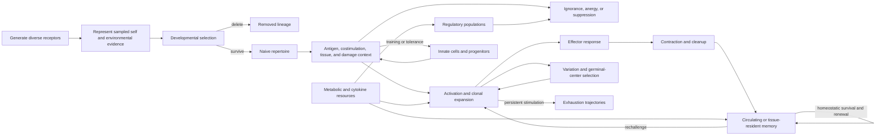

# Immune tolerance, adaptation, and memory analogue audit

<!-- markdownlint-disable MD013 -->

**Date:** 2026-08-05

**Scope:** central and peripheral tolerance; negative selection; regulatory
suppression; anergy and exhaustion; clonal expansion, contraction, and affinity
maturation; trained innate immunity; danger and context signals; memory-cell
maintenance; repertoire diversity; tissue residency; immunometabolism; and
autoimmunity

**Purpose:** preserve the experimentally supported immune state transitions,
make artificial immune systems and mature engineering methods the novelty null,
and reject any AI transfer that hides search, reserve, false suppression,
maintenance, recovery, or lifecycle energy.

**Ledger boundary:** all `IMM-T` identifiers in this document are audit-local.
They are not central `C-` claims and confer no adoption status.

## Method and evidence boundary

This audit prioritizes primary perturbation, lineage-tracking, imaging,
sequencing, transfer, knockout, infection, and rechallenge studies. A result is
`established` only for the cited preparation and intervention. Association,
expression, or a fitted model does not by itself identify a control mechanism.
No immune experiment establishes that an AI architecture will be safer, more
accurate, or more energy efficient.

Evidence status is used strictly:

| Status | Meaning in this audit |
| --- | --- |
| `established` | A scoped biological or engineering result directly supported by the cited primary study. |
| `plausible` | A synthesis consistent with several established results but not directly isolated by one decisive comparison. |
| `speculative` | An AI translation or cross-layer composition without matched evidence. |
| `disputed` | A broad interpretation contradicted by scoped evidence, dependent on unresolved definitions, or defeated by mature prior art. |

The comparison set is deliberately strong: calibrated anomaly detection,
cost-sensitive decisions and abstention, ensemble diversity, evolutionary
search, replay and rehearsal, access control and least privilege, constrained
and supervisory control, and artificial immune systems (AIS). A biological
name is not an algorithmic difference. A state transition, information path,
resource boundary, and result that defeats these nulls are required.

## Executive finding

No new registry principle is justified.

Immune biology strongly rejects the popular picture of one detector separating
“self” from “non-self.” The cited systems use incomplete antigen
representation, deletion, functional silencing, active suppression,
context-dependent activation, population expansion, programmed contraction,
spatial placement, resource-dependent maintenance, and recall. These are
distinct operations with distinct reversibility and failure costs.

That richer biology is valuable mainly as a **state-definition and evaluation
discipline**. At the system level, however, the operations deduplicate into
existing project bundles and mature engineering:

| Immune operation | Closest project bundle | Strongest mature null | Disposition |
| --- | --- | --- | --- |
| delete a developing self-reactive clone | [P-009](../principle-registry.md#p-009--maintenance-plane) | cost-sensitive rejection, pruning, admission control | established null; irreversible action needs a high evidence bar |
| silence without deleting | [P-003](../principle-registry.md#p-003--temporary-trace-before-commitment) | quarantine, abstention, leases, reversible disablement | established null |
| suppress another actor | [P-002](../principle-registry.md#p-002--local-autonomy-with-exception-escalation), [P-008](../principle-registry.md#p-008--compartmentalized-interaction) | access control, rate limiting, supervisory control | established null |
| expand and later contract responders | [P-001](../principle-registry.md#p-001--selective-allocation), [P-004](../principle-registry.md#p-004--diversity-selection-and-protection) | bandits, autoscaling, population-based/evolutionary search | established null at this abstraction |
| affinity-dependent variation and selection | [P-004](../principle-registry.md#p-004--diversity-selection-and-protection) | evolutionary search, boosting, metric learning, AIS clonal selection | already represented and heavily prefigured |
| maintain memory without continuous target exposure | [P-009](../principle-registry.md#p-009--maintenance-plane), [P-012](../principle-registry.md#p-012--memory-matched-to-information-lifetime) | replay, rehearsal, cache/replica maintenance | established null |
| keep responders at likely entry sites | [P-001](../principle-registry.md#p-001--selective-allocation), [P-010](../principle-registry.md#p-010--structural-offloading-and-co-design) | cache/expert placement and edge replication | established null |
| use context or tissue injury to alter response | [P-007](../principle-registry.md#p-007--prediction-error-allocation) | conditional risk, change detection, data provenance, runtime assurance | established null |
| persist a changed innate response after exposure | [P-003](../principle-registry.md#p-003--temporary-trace-before-commitment), [P-012](../principle-registry.md#p-012--memory-matched-to-information-lifetime) | online adaptation, stateful calibration, meta-learning, replay | established null at the abstract level |
| couple response fate to metabolic state | [P-006](../principle-registry.md#p-006--homeostatic-negative-feedback), [P-009](../principle-registry.md#p-009--maintenance-plane) | resource-aware scheduling and constrained control | established null |

The narrow residual is therefore **not an immune-inspired architecture**. It is
a mandatory experimental contract that keeps representation, recognition,
authorization, activation, suppression, deletion, exhaustion, contraction,
memory, and recovery separate. This contract is useful for evaluating
[Candidate 005](../../experiments/candidates/005-severity-ordered-containment.md),
[Candidate 009](../../experiments/candidates/009-graded-assurance-envelopes.md),
[Candidate 012](../../experiments/candidates/012-latency-qualified-authority.md),
and [Candidate 014](../../experiments/candidates/014-versioned-observation-contract.md),
but it is not distinct enough to become another candidate. If an ordinary
typed state machine, calibrated risk model, least-privilege policy, and
resource-aware controller reproduce its decisions, the immune framing adds no
systems novelty.

## States that must not be collapsed

| State or operation | Operational meaning | Not equivalent to |
| --- | --- | --- |
| receptor or detector generation | create a candidate recognition rule before deployment | evidence that the rule is useful or safe |
| representation | make a class of target evidence available to a selection process | complete coverage of all relevant states |
| recognition | bind or score a presented pattern | authentication, causation, harm, or authorization |
| negative selection | remove a developing clone after a scoped recognition event | proving that every surviving clone is safe |
| ignorance | target evidence was absent, inaccessible, too weak, or not sampled | active tolerance |
| anergy | a living clone persists in a functionally hyporesponsive state after a defined stimulation history | deletion, suppression by another actor, fatigue, or resource exhaustion |
| regulatory suppression | one population actively reduces another population's activation or effect | the suppressed target being intrinsically safe or defective |
| exhaustion | a differentiated dysfunction program under persistent stimulation, with altered inhibitory, transcriptional, signaling, and metabolic state | anergy, ordinary compute-budget exhaustion, contraction, or permanent deletion |
| activation | enter a response-capable state | correct response, beneficial outcome, or granted digital authority |
| clonal expansion | increase the physical number of lineage-related cells | increasing confidence in one unchanged prediction |
| contraction | reduce a previously expanded population after a response | loss of all memory, anergy, or exhaustion |
| affinity maturation | vary receptors and select lineages within a germinal-center process | unconstrained mutation of a deployed model |
| trained innate state | changed response of innate cells or progenitors after prior stimulation | antigen-specific adaptive memory or universally beneficial sensitization |
| danger/context signal | evidence that changes antigen-presenting or response conditions | proof of maliciousness, identity, or optimal action |
| memory maintenance | survival and homeostatic renewal of recall-capable populations | storing a frozen exact copy without ongoing cost |
| tissue residence | persistent local placement with limited equilibrium with circulation | a globally available cache entry or cost-free replica |
| autoimmunity | harmful response against host-associated targets after failures of representation, selection, regulation, context, or tissue control | one scalar false-positive event |

These distinctions are the main durable output of the audit. In particular,
“inactive” is underidentified: it can mean absent, ignorant, anergic,
suppressed, exhausted, contracted, quiescent memory, starved of resources, or
blocked by policy. A system that records only an activation bit cannot diagnose
or safely reverse these states.

## Biological lifecycle and information path



The graph is not a universal immune program. B- and T-cell mechanisms,
anatomical compartments, acute and chronic infections, vaccination, tumors,
and sterile injury differ. The diagram is an accounting scaffold: every
proposed AI analogue must identify which edge it implements, what information
causes the transition, whether it is reversible, and what it costs.

## Quantitative and lifecycle boundaries

### Population accounting

For clone or module lineage $i$ over time $t$,

$$
\frac{dN_i}{dt}=\left(r_i(t)-d_i(t)-q_i(t)\right)N_i(t)+b_i(t),
$$

where $N_i$ is cells or deployed instances; $r_i$, $d_i$, and $q_i$ are
expansion, death/retirement, and reversible-quiescence transition rates in
h$^{-1}$ or day$^{-1}$; and $b_i$ is new cells/h or instances/h. The terms are
not interchangeable. A decrease in active responders can reflect death,
contraction, migration, or reversible suppression.

An illustrative post-peak contraction is

$$
N_i(t)=N_{i,\mathrm{peak}}
\exp\!\left[-k_{c,i}(t-t_{\mathrm{peak}})\right],
$$

where $k_{c,i}$ is h$^{-1}$ or day$^{-1}$. This is a descriptive model, not a
universal immune constant. Badovinac, Porter, and Harty showed early-programmed
contraction features in specified mouse infections; they did not establish one
rate or one mechanism for every response [@badovinac2002].

### Selection and diversity

For a selection round with lineage share $p_i$ and nonnegative expected
survival/reproduction weight $w_i$,

$$
p_i' = \frac{p_iw_i}{\sum_j p_jw_j}.
$$

$p_i$, $p_i'$, and $w_i$ are dimensionless. The equation exposes selection but
omits mutation, antigen capture, T-cell help, spatial movement, carrying
capacity, and energy. It is also a standard replicator/resampling operation,
so it cannot establish algorithmic novelty.

Repertoire richness $K$ must be separated from balance:

$$
H=-\sum_{i=1}^{K}p_i\ln p_i,
\qquad
D_2=\frac{1}{\sum_i p_i^2}.
$$

$H$ is dimensionless entropy and $D_2$ is an effective number of equally
abundant lineages. Both depend on sampling depth, sequencing error, clone
definition, tissue, and time. Neither proves functional independence or
coverage of future threats [@robins2009; @murugan2012].

### Tolerance is a decision, not a detector score

Let latent state $s$ include benign/needed, harmful, compromised, and uncertain
conditions, and let action $a$ include permit, rate-limit, monitor, quarantine,
suppress, delete, or escalate. A calibrated decision policy minimizes

$$
a^*(x,c)=\arg\min_a
\sum_s L(a,s,c)\Pr(s\mid x,c),
$$

where $x$ is observed evidence, $c$ is context and provenance, and $L$ is in a
declared unit such as lost useful requests, safety-weighted currency, J, or h
of unavailable service. An anomaly score is at most one component of $x$.
Deleting a rare useful capability and permitting a harmful one must remain
separate loss terms.

For digital authority, recognition and permission are separate predicates:

$$
\operatorname{allow}(p,a,o,t)=
\operatorname{authn}(p,t)\land
\operatorname{authz}(p,a,o,t)\land
\operatorname{safe}(x_t,a)\land
\operatorname{fresh}(e_t).
$$

Here principal $p$, action $a$, object $o$, observed system state $x_t$, and
evidence $e_t$ are typed; time $t$ is s or an epoch. An immune-affinity score
cannot replace authentication, authorization, freshness, or a safety invariant
[@saltzer1975; @sandhu1996].

### Memory is maintained state

A minimal memory-population balance is

$$
\frac{dM}{dt}=\left(\rho_{\mathrm{home}}(t)-\delta_M(t)\right)M(t)
+\eta C(t),
$$

where $M$ is memory cells, $\rho_{\mathrm{home}}$ and $\delta_M$ are renewal and
loss rates in day$^{-1}$, $C$ is precursor cells/day entering the memory state,
and $\eta$ is a dimensionless conversion fraction. The cited mouse studies
separate generation from maintenance: specific antigen/MHC-I interactions were
not required for persistence in one transfer setting, whereas IL-7 and IL-15
contributed to survival, generation, or homeostatic renewal in distinct ways
[@muralikrishna1999; @schluns2000; @becker2002]. A memory store is therefore not
free merely because it is idle.

### Trained-state decay

For an engineered analogue, a persistent response modifier can be represented
as

$$
z_{t+1}=\alpha z_t+B u_t+\epsilon_t,
\qquad 0\leq\alpha\leq 1,
$$

where $z_t$ is a typed internal state, $u_t$ is an exposure or intervention,
$B$ maps exposure units into state units, and $\epsilon_t$ is drift. The decay
time is measured in steps, h, or days. This covers ordinary stateful
calibration and adaptive control; “trained immunity” is not a distinct
algorithm unless the implementation adds a measurable transformation beyond
this null.

### Tissue placement

For local memory or experts $m_l$ at locations $l$, a placement objective may
be written

$$
\min_{m_l\geq 0}
\sum_l\left[
c_l^{\mathrm{maint}}m_l
+\mathbb{E}\!\left(c_l^{\mathrm{miss}}U_l(m_l)\right)
+c_l^{\mathrm{move}}v_l
\right],
$$

where $m_l$ is cells or bytes, $U_l$ is unmet events, $v_l$ is cells or bytes
moved, and each coefficient converts its quantity to currency or J over the
same horizon. Tissue residence is a physical placement decision with local
maintenance and update cost, not a free latency reduction.

### Complete energy and service boundary

For an AI lifecycle over horizon $[0,T]$,

$$
E_{\mathrm{life}}=
E_{\mathrm{sense}}+E_{\mathrm{route}}+E_{\mathrm{generate}}
+E_{\mathrm{train}}+E_{\mathrm{select}}+E_{\mathrm{expand}}
+E_{\mathrm{serve}}+E_{\mathrm{monitor}}+E_{\mathrm{replay}}
+E_{\mathrm{reserve}}+E_{\mathrm{move}}+E_{\mathrm{retire}}
+E_{\mathrm{recover}},
$$

with every term measured in J at one declared boundary. When measured from
wall power,

$$
E_{\mathrm{life}}=\int_0^T
\left(P_{\mathrm{system}}(t)-P_{\mathrm{idle\ baseline}}(t)\right)dt
+E_{\mathrm{allocated\ idle}},
$$

where $P_{\mathrm{system}}$ is measured system power, $P_{\mathrm{idle\ baseline}}$
is the explicitly declared nonexperimental baseline, power is W = J/s, and
$T$ is s. $E_{\mathrm{allocated\ idle}}$ is the J assigned to reserved but
unused experimental capacity. Idle reserve dedicated to the experiment must be
allocated, not subtracted away. Device-only and wall-plug results must not be
mixed. Hardware manufacture, cooling infrastructure, human work, and emissions
should be reported as a parallel lifecycle vector unless a defensible
conversion is declared:

$$
\mathbf{C}_{\mathrm{life}}=
(E\,[\mathrm{J}],\;T\,[\mathrm{s}],\;D\,[\mathrm{byte}],\;
H\,[\mathrm{human\ h}],\;G\,[\mathrm{kg\ CO_2e}],\;M\,[\mathrm{currency}]).
$$

The primary service report must also remain a vector: useful task quality,
false permit, false suppress, false delete, missed harm, containment latency,
time to verified recovery, rare-capability retention, second-event readiness,
and $E_{\mathrm{life}}$. A scalar “immune fitness” can hide autoimmunity-like
collateral loss.

## Primary-source synthesis

### 1. Central tolerance is sampled representation plus destructive selection

Kappler, Roehm, and Marrack found V-beta-17a-bearing T cells at expected
frequency among immature thymocytes but selective loss from mature thymocytes
and the peripheral pool in mice expressing the relevant IE self-MHC context
[@kappler1987]. This is direct evidence for clonal elimination in that receptor
and mouse system. It is not evidence that thymic deletion is the only tolerance
mechanism or that every relevant self target is represented.

Anderson et al. tested the representation boundary. `Aire`-deficient mice had
reduced ectopic transcription of peripheral tissue-restricted antigens in
medullary thymic epithelial cells and a defined multiorgan autoimmune phenotype
[@anderson2002]. A selection mechanism cannot reject what its evidence channel
does not present. Conversely, presenting an antigen does not specify whether
deletion, regulatory differentiation, or another outcome follows.

**AI translation.** Predeployment negative tests can remove known-bad
behaviors only within their generator, sensor, and coverage. This is already
holdout testing, red teaming, static analysis, constraint testing, and negative
selection in AIS. The residual question is coverage and false deletion, not an
immune label.

**Strongest nulls.** Cost-sensitive validation, adversarial evaluation,
one-class support estimation [@scholkopf2001], isolation-based anomaly
detection [@liu2008], typed policy checks, and conventional deny/quarantine
gates.

**Failure boundary.** “Survived testing” must never be recorded as “safe.”
Novel benign behavior can resemble an excluded pattern, rare harmful behavior
can be absent from the test representation, and correlated evaluators can
share the same blind spot.

### 2. Peripheral tolerance includes intrinsic silencing and active regulation

Goodnow et al. used double-transgenic mice carrying a soluble self antigen and
a high-affinity self-reactive antibody receptor. Most self-reactive B cells
were not deleted; they persisted with altered surface immunoglobulin and failed
to secrete the antibody, establishing a scoped functional-silencing outcome
[@goodnow1988]. Jenkins and Schwartz separately induced antigen- and
MHC-specific T-cell unresponsiveness with nonmitogenic antigen presentation in
vitro and in vivo [@jenkins1987]. These preparations support anergy as a state,
not one universal molecular program.

Sakaguchi et al. depleted CD25-expressing cells from transferred CD4 T-cell
populations and observed multiple autoimmune diseases in recipient nude mice;
timely, dose-dependent reconstitution with the CD25-positive population
prevented disease more effectively than delayed reconstitution
[@sakaguchi1995]. Hori, Nomura, and Sakaguchi showed that Foxp3 was expressed in
naturally arising regulatory T cells and that retroviral Foxp3 expression could
shift naive T cells toward a regulatory phenotype [@hori2003]. These studies
support active regulatory control beyond central deletion.

**AI translation.** Reversible disabling and external suppression are not the
same. A component can be locally unable to act, or it can remain capable while
an independent policy blocks its effects. The latter provides separable
authority but creates regulator capture, liveness, and single-point-of-failure
risks.

**Strongest nulls.** Capability and role-based access control, rate limits,
circuit breakers, supervisor processes, sandboxing, leases, and reversible
feature flags [@saltzer1975; @sandhu1996].

**Failure boundary.** Regulatory suppression can block valuable novelty,
normalize a compromised regulator, or create gridlock. Anergy-like quarantine
can silently become permanent if no re-evaluation and release path exists.

### 3. Anergy, exhaustion, suppression, and contraction are not synonyms

Wherry et al. compared virus-specific CD8 T cells from chronic LCMV infection
with effector and memory cells after acute infection. Exhausted cells showed a
distinct transcriptional profile, multiple inhibitory receptors, altered
signaling, migration, transcriptional, metabolic, and bioenergetic programs;
the authors' profiling distinguished exhaustion from anergy
[@wherry2007]. Barber et al. then blocked PD-1/PD-L1 in chronically infected
mice and improved proliferation, cytokine secretion, killing, and viral
control in the studied setting [@barber2006]. This establishes modifiable
inhibition, not universal or complete erasure of exhaustion.

Utzschneider et al. identified a Tcf1-expressing memory-like subpopulation in
chronic infection that sustained responses and contributed to expansion after
inhibitory-receptor blockade [@utzschneider2016]. Thus a population summarized
as “exhausted” can contain distinct trajectories and renewal potential.

**AI translation.** A low-activity module requires state diagnosis. No recent
request, an explicit deny, confidence-based abstention, depleted budget,
persistent overload adaptation, and post-event contraction demand different
actions. Automatically “rejuvenating” all low-use components can reactivate
harmful or obsolete behavior.

**Strongest nulls.** Hidden/semi-Markov state models, change detection,
resource monitors, typed disable reasons, supervisory control, and
health-probe-gated restart. Candidate 005 already owns severity-ordered
containment and release testing.

**Failure boundary.** Surface markers, low throughput, or time since last use
cannot identify the causal state alone. Any AI result that labels inactivity
as “exhaustion” without an intervention-sensitive state model is rejected.

### 4. Expansion and contraction are resource-allocation phases

Murali-Krishna et al. directly counted antigen-specific CD8 T cells during
acute LCMV infection and showed large antigen-specific expansion, a subsequent
drop to a long-maintained memory population, and rapid expansion on homologous
rechallenge [@muralikrishna1998]. Badovinac, Porter, and Harty varied infection
dose and pathogen clearance in mouse infection models and found that important
features of contraction were programmed early and were not simply a function
of peak expansion or antigen duration in those experiments [@badovinac2002].

**AI translation.** Copying a responder can increase throughput or search
trials, but it consumes memory, communication, evaluation, and later cleanup.
Contraction is essential capacity reclamation, while retention of a smaller
recall-capable lineage is a separate decision.

**Strongest nulls.** Autoscaling with cooldown and health checks, bandit
allocation, population-based training, replica management, garbage collection,
and queue-aware admission control.

**Failure boundary.** Counting candidate copies as diversity is wrong when
they share parameters or correlated failure modes. Measuring peak performance
without cleanup, retained reserve, and the next event hides lifecycle cost.

### 5. Affinity maturation is localized variation, selection, and lineage allocation

Victora et al. combined photoactivation, multiphoton imaging, and flow
cytometry to track light- and dark-zone germinal-center B cells. In the studied
mouse system, division was concentrated in the dark zone, and T-cell help in
the light zone controlled return for further expansion based on captured and
presented antigen [@victora2010]. Tas et al. combined imaging and sequencing and
found that tens to hundreds of clones could seed individual germinal centers,
that diversity declined at widely varying rates, and that efficient affinity
maturation did not require rapid homogenization [@tas2016].

These results support the existing [P-004](../principle-registry.md#p-004--diversity-selection-and-protection)
bundle: generate variation, evaluate through a constrained interaction, expand
selected lineages, and retain parallel alternatives. They also falsify the
simple claim that the single current highest-affinity lineage should always
monopolize all capacity.

**Strongest nulls.** Evolutionary algorithms, novelty search, population-based
training, Bayesian and bandit allocation, boosting, ensemble selection, and
the AIS clonal-selection algorithm CLONALG [@decastro2002; @stanley2002;
@lehman2011].

**Failure boundary.** Affinity is not truth. A proxy can be gamed, narrow
selection can lose breadth, mutation can damage already deployed behavior, and
evaluation cost can dominate. A safe transfer must isolate experimental
lineages from production authority and retain rollback provenance.

### 6. Trained innate immunity is persistent reprogramming, not free universal memory

Quintin et al. showed monocyte-dependent protection on *Candida albicans*
rechallenge in mice lacking functional T and B cells, together with
beta-glucan-induced changes in monocyte cytokine responses and associated
histone marks [@quintin2012]. Kleinnijenhuis et al. reported that BCG
vaccination in healthy volunteers altered monocyte responses to unrelated
microbial stimuli for at least the studied three-month interval, with NOD2 and
histone-methylation evidence; complementary SCID-mouse experiments supported
lymphocyte-independent protection in the tested challenge [@kleinnijenhuis2012].

Saeed et al. mapped distinct epigenomic and transcriptomic programs in naive,
tolerized, and beta-glucan-trained human monocyte-derived macrophages
[@saeed2014]. Cheng et al. implicated mTOR/HIF-1alpha-dependent glycolytic
reprogramming in beta-glucan training [@cheng2014]. Mitroulis et al. extended
the persistence boundary in mice: beta-glucan changed hematopoietic progenitor
and myelopoietic programs, providing a mechanism by which effects can outlast
short-lived circulating monocytes [@mitroulis2018].

**AI translation.** A fast subsystem can retain a decaying state or change its
future response after exposure without updating a central long-term model.
This is already online adaptation, stateful preprocessing, meta-learning,
adaptive thresholds, and cache priming. “Nonspecific” does not mean
task-independent; response can improve for one challenge and worsen
inflammation or false activation elsewhere.

**Strongest nulls.** Exponential moving-state models, online calibration,
adaptive filters, replay, meta-learned initialization, and receding-horizon
control. The comparator must include both beneficial sensitization and
tolerance/desensitization.

**Failure boundary.** Reject a trained-immunity claim if it is merely a
persistent parameter update, if the effect vanishes against ordinary online
adaptation, or if gains on one challenge hide false responses, drift, or energy
cost on unrelated inputs.

### 7. Danger and context modulate response; they do not establish identity or harm

Medzhitov, Preston-Hurlburt, and Janeway expressed a constitutively active
human Toll homologue in cell lines and induced NF-kappa-B-controlled cytokines
and the B7.1 costimulatory molecule, linking an innate receptor pathway to
conditions for adaptive activation [@medzhitov1997]. Gallucci, Lolkema, and
Matzinger found dendritic-cell activation by endogenous material from stressed,
virally infected, or necrotically killed cells in their preparations, but not
healthy or apoptotic cells under the tested conditions [@gallucci1999]. Shi,
Evans, and Rock identified uric acid as one endogenous signal released from
injured cells that promoted dendritic-cell maturation and enhanced a CD8 T-cell
response in the tested mouse experiments [@shi2003].

The evidence rejects both a pure antigen-identity classifier and a universal
“danger-only” rule. Microbial pattern, tissue damage, antigen, costimulation,
location, history, and regulatory state can interact. Injury can be sterile;
pathogens can suppress or mimic context; useful repair also causes local
change.

**AI translation.** Context features may change the loss or action threshold,
but must retain provenance and causal limits. A high error rate near a module
can be a fault, a distribution shift, a sensor defect, or a legitimate hard
task.

**Strongest nulls.** Conditional anomaly detection, Bayesian decision risk,
change-point detection, taint/provenance tracking, runtime assurance, and
constrained control [@page1954; @mayne2000].

**Failure boundary.** Context is attacker-controlled in many digital systems.
No untrusted “danger signal” may directly grant destructive authority.

### 8. Memory persistence requires survival, renewal, and a recall path

Murali-Krishna et al. found that memory CD8 T cells could persist and divide in
MHC-I-deficient recipient mice while retaining rapid cytokine recall, separating
maintenance from continuous cognate antigen recognition in that setting
[@muralikrishna1999]. Schluns et al. showed distinct IL-7 dependencies for
naive-cell homeostasis, memory generation, survival, and part of memory
homeostatic proliferation [@schluns2000]. Becker et al. found that IL-15 was not
required to generate the initial virus-specific memory pool in their LCMV
model but was required for long-term proliferative renewal; cells slowly
declined without it [@becker2002].

**AI translation.** Durable competence needs retention, refresh, integrity
checks, and a tested retrieval/recall path. Replaying every old item is not
equivalent to maintaining a compact lineage, and retaining bytes is not proof
that a current system can use them.

**Strongest nulls.** Experience replay [@lin1992; @mnih2015], rehearsal and
coresets, regularization, immutable model/version archives, periodic restore
tests, and cache/replica maintenance.

**Failure boundary.** Measure rare-capability recall, interference, stale or
unsafe recall, refresh energy, storage, and restore latency. A memory mechanism
fails if it preserves aggregate accuracy while rare capabilities disappear.

### 9. Repertoire diversity is generated, sampled, selected, and maintained

Hozumi and Tonegawa compared embryonic and plasmacytoma DNA and provided direct
evidence that immunoglobulin variable and constant gene regions are somatically
rearranged during lymphocyte differentiation [@hozumi1976]. Robins et al.
developed high-throughput experimental and computational measurement of human
TCR-beta CDR3 repertoires and demonstrated that earlier low-depth estimates
missed substantial diversity [@robins2009]. Murugan et al. inferred the
probabilities of hidden V(D)J generation events from nonproductive human TCR
sequences, explicitly separating generation statistics from later selection
[@murugan2012].

**AI translation.** Diversity has at least four different meanings: generator
support, sampled candidates, deployed functional behavior, and independent
failure modes. Parameter distance, disagreement, lineage count, and task
coverage are not interchangeable.

**Strongest nulls.** Bagging and random subspaces, negative-correlation
ensembles [@liuyao1999], Bayesian ensembles, novelty search, randomized restarts,
and explicit fault-domain diversity.

**Failure boundary.** A larger nominal repertoire can lower useful coverage
when evaluation, maintenance, routing, and false activation consume the same
finite budget. Diversity must be measured after selection and at the service
interface, not only in genotype or weights.

### 10. Tissue-resident memory is placement with local amplification and update cost

Gebhardt et al. identified memory T cells retained in skin and sensory ganglia
after herpes simplex infection that were out of equilibrium with circulating
cells and contributed to control of local reinfection [@gebhardt2009]. Schenkel
et al. showed in mouse mucosa that reactivated tissue-resident memory CD8 T
cells could trigger local innate and adaptive responses and a broad antiviral
state [@schenkel2014]. These are evidence for local sentinels and amplification,
not for universal independence from circulating support.

**AI translation.** Place compact specialists or memory near recurrent local
inputs to reduce response latency and amplify an escalation. This is edge
caching, local experts, replica placement, and hierarchical routing unless a
distinct update or decision rule survives comparison.

**Strongest nulls.** Cache placement, edge inference, mixture-of-experts
routing, geographically replicated services, and local detector plus central
fallback.

**Failure boundary.** Local state can become stale, monopolize capacity, amplify
a false alarm, or fail when the threat geography shifts. Charge replication,
refresh, routing, migration, and idle reserve.

### 11. Immunometabolism couples functional state to substrate and organelle programs

Pearce et al. showed that T-cell-specific TRAF6 deletion preserved a strong
effector response but impaired memory formation in their mouse model, together
with altered fatty-acid-metabolism programs; metformin treatment restored
fatty-acid oxidation and memory generation in the studied conditions
[@pearce2009]. Michalek et al. found different glycolytic and lipid-oxidative
requirements across induced effector and regulatory CD4 T-cell subsets and
shifted their balance through metabolic interventions [@michalek2011]. Buck et
al. manipulated mitochondrial dynamics and found that Opa1-dependent fusion
was required for memory but not effector T cells after infection in their
model, while enforced fusion shifted effector cells toward memory-associated
features [@buck2016].

These interventions establish causal coupling in scoped preparations. They do
not justify “glycolysis = fast AI” or “fat oxidation = memory.” Metabolites,
redox state, biosynthesis, organelle morphology, cytokines, and cell fate are
entangled, and drug interventions can be pleiotropic.

**AI translation.** Route high-throughput response, durable maintenance, and
exploratory search to resources with different latency, bandwidth, and energy
properties. That is heterogeneous computing and resource-aware control.

**Strongest nulls.** Dynamic voltage/frequency scaling, admission control,
budgeted inference, memory hierarchy, accelerator placement, and constrained
model-predictive scheduling [@mayne2000].

**Failure boundary.** Report wall energy and service, not an operation-count
proxy. A low-power mode that delays detection or shifts work to another device
does not save lifecycle energy.

### 12. Autoimmunity is a family of layered-control failures

The tolerance studies above provide direct intervention evidence that failure
at different layers can produce self-directed harm: missing Aire-dependent
thymic representation, depletion of a regulatory population, or altered
functional silencing each changes a different state [@anderson2002;
@sakaguchi1995; @goodnow1988]. These results do not support one universal cause
or threshold for autoimmune disease.

For AI, the closest analogue is not simply a false-positive detector. Harm can
arise when test coverage is incomplete, a benign module is irreversibly
deleted, a regulator suppresses needed work, a context signal is spoofed, a
memory response is stale, or expanded responders consume shared capacity.

**Strongest nulls.** Safety constraints, separation of duties, least privilege,
independent monitors, canary release, reversible quarantine, rollback, and
hazard-aware control. Candidate 009 and Candidate 012 already own graded
assurance and qualified authority.

**Failure boundary.** An “immune” controller must be tested against legitimate
novelty, mimicry, common-cause monitor error, regulator compromise, chronic
benign change, and recovery. Reducing malicious success while increasing
collateral deletion or prolonged denial is not a win.

## Deduplication against mature fields

| Proposed immune-inspired claim | Existing method that already expresses it | Difference that would have to survive | Default verdict |
| --- | --- | --- | --- |
| learn normal, reject nonself | one-class SVM, density/support estimation, isolation forest, conformal or calibrated anomaly detection | action-specific losses and reversible state transitions beyond the score | anomaly detection null |
| maintain detector diversity | bagging, random subspaces, negative-correlation ensembles, Bayesian ensembles | independently useful coverage after routing and maintenance cost | ensemble null |
| mutate and expand good detectors | evolutionary algorithms, population-based training, CLONALG | a safer or more efficient lineage/selection schedule under equal evaluations | evolutionary/AIS null |
| remember prior threats | replay, rehearsal, retrieval, model/version archives | maintenance and recall policy that improves rare-event service per J | replay/storage null |
| permit known actors, suppress suspicious ones | IAM, capabilities, RBAC, leases, sandboxing, policy-as-code | evidence-conditioned reversible action state beyond mature access control | access-control null |
| use danger to escalate | conditional risk, CUSUM/change detection, taint/provenance, runtime assurance | robust context integration under adversarial or missing context | detection/control null |
| expand on demand and contract later | autoscaling, queueing control, garbage collection | lineage-dependent reserve/recall advantage after cleanup cost | control/resource null |
| keep local memory at entry sites | cache and replica placement, edge experts | better response under locality shift after refresh/migration cost | placement null |
| alter later response after exposure | adaptive filters, online learning, meta-learning, stateful calibration | benefit beyond ordinary persistent state across unrelated challenges | online-adaptation null |
| switch metabolism by response phase | heterogeneous scheduling, DVFS, budgeted inference, MPC | end-to-end energy/service frontier beyond tuned resource control | control null |

### Artificial immune systems are prior art, not a missing comparison

Forrest et al. implemented computational negative selection for self/nonself
discrimination in strings [@forrest1994]. De Castro and von Zuben's CLONALG
used cloning, affinity-proportional mutation, and selection for learning and
optimization [@decastro2002]. These do not reproduce vertebrate immunity, but
they establish that negative selection and clonal search have already been
explicitly imported into computing.

The consequence is methodological: a new system cannot compare only with a
dense neural network and call negative selection, cloning, affinity maturation,
or immune memory novel. It must compare with both the mature nonimmune method
and the relevant AIS implementation. If the nonimmune baseline wins, biological
fidelity is not a defense.

## Ten equal-budget falsification experiments

### E-IMM-01 — Layered tolerance versus calibrated rejection

- **Question:** does separating representation, recognition, anergy,
  suppression, deletion, and release reduce both harmful action and collateral
  loss?
- **System:** modular agent with rare useful skills, injected malicious modules,
  incomplete validation coverage, and versioned provenance.
- **Arms:** one-class SVM; isolation forest; calibrated cost-sensitive
  classifier with abstention; capability policy plus reversible quarantine;
  proposed immune-state controller.
- **Equal budgets:** identical validation data, sensor calls, evaluator
  compute, peak/persistent bytes, allowed interventions, rollback points,
  operator h, and wall-energy cap.
- **Outcomes:** false permit, false suppress, false delete, rare-skill recall,
  harm, containment s, release s, human h, and lifecycle J.
- **Kill rule:** reject if a calibrated classifier plus typed reversible
  quarantine matches the frontier or if surviving evaluation is reported as
  safety.

### E-IMM-02 — Anergy, exhaustion, and contraction diagnosis

- **Question:** does the richer state taxonomy change the correct recovery
  action?
- **Stressors:** missing input, deliberate policy block, transient resource
  starvation, persistent adversarial stimulation, post-burst contraction,
  silent corruption, and obsolete capability.
- **Arms:** activity threshold; timeout restart; health-probe state machine;
  hidden semi-Markov diagnosis; proposed immune-inspired diagnosis.
- **Equal budgets:** same telemetry fields/rate, probe count, restart authority,
  compute, time, and J.
- **Outcomes:** state confusion matrix, unsafe reactivation, false retirement,
  service lost, diagnosis delay, verified recovery, and second-event response.
- **Kill rule:** reject if typed reasons plus an ordinary state estimator match
  it or if low activity alone identifies “exhaustion.”

### E-IMM-03 — Clonal expansion and contraction versus autoscaling/search

- **Question:** does lineage-aware copying and contraction improve useful
  response or search under finite capacity?
- **Arms:** static replicas; queue-based autoscaling; bandit allocation;
  population-based training; clonal expansion/contraction controller.
- **Stressors:** bursty demand, false alerts, correlated replica faults,
  changing task popularity, and a second burst during cleanup.
- **Equal budgets:** same peak instances, accelerator-s, evaluation calls,
  memory, network bytes, cold-start allowance, and wall J.
- **Outcomes:** useful throughput, p95/p99 latency, search regret, correlated
  failure, cleanup s, retained recall capacity, and total J.
- **Kill rule:** reject if queue-aware autoscaling or bandit/PBT control matches
  performance after clone creation, synchronization, and retirement are
  charged.

### E-IMM-04 — Affinity maturation versus evolutionary and ensemble search

- **Question:** does localized variation with protected parallel lineages find
  robust solutions more efficiently than mature search?
- **Arms:** random search; Bayesian optimization; NEAT/evolutionary search;
  novelty search; CLONALG; germinal-center-inspired search.
- **Stressors:** deceptive proxy affinity, noisy evaluators, distribution shift,
  multiobjective breadth, and adversarial examples.
- **Equal budgets:** identical candidate evaluations, training FLOP or
  accelerator-s, population bytes, wall time, random seeds, and J.
- **Outcomes:** held-out utility, worst-group utility, diversity $D_2$, proxy
  exploitation, regret, rollback success, and J per accepted improvement.
- **Kill rule:** reject if the gain disappears against tuned evolutionary/AIS
  search or depends on mutating deployed production state without isolation.

### E-IMM-05 — Trained innate state versus ordinary online adaptation

- **Question:** does a local persistent response state improve reacquisition
  beyond calibrated online state?
- **Arms:** fixed model; exponential moving calibration; adaptive filter;
  replay; meta-learned initialization; trained-immunity-inspired local state.
- **Stressors:** homologous rechallenge, related and unrelated challenge,
  tolerance/desensitization, concept drift, poisoning, and long quiet intervals.
- **Equal budgets:** same observations, update writes, parameters, replay bytes,
  compute, latency, reset calls, and wall J.
- **Outcomes:** first- and second-event loss, false sensitization, calibration,
  decay time, poison persistence, reset success, writes, and J.
- **Kill rule:** reject if an EMA/adaptive filter or replay matches it, or if
  benefit on one rechallenge hides harm on unrelated inputs.

### E-IMM-06 — Danger/context gating under spoofing and missingness

- **Question:** does context-sensitive activation improve action decisions
  beyond conditional risk and provenance-aware control?
- **Arms:** anomaly-only threshold; CUSUM; calibrated conditional classifier;
  provenance/taint plus capability rule; constrained controller; danger-gated
  controller.
- **Stressors:** sterile damage, benign novelty, stealth attack, spoofed danger,
  delayed/missing context, compromised sensor, and common-cause telemetry error.
- **Equal budgets:** same sensors, sampling rate, messages, latency, authority,
  compute, and J.
- **Outcomes:** missed harm, false escalation, destructive actions, time to
  contain, provenance errors, availability, and lifecycle J.
- **Kill rule:** reject if context is merely another feature, if untrusted
  context directly grants authority, or if conditional risk/control matches it.

### E-IMM-07 — Memory maintenance versus replay and verified archives

- **Question:** does a lineage-like maintenance policy preserve recall at lower
  lifecycle cost?
- **Arms:** no replay; reservoir replay; class-balanced rehearsal; coreset;
  immutable version archive plus restore tests; immune-maintenance policy.
- **Stressors:** long retention intervals, skewed recurrence, rare critical
  skills, conflicting new tasks, corrupted memory, and version incompatibility.
- **Equal budgets:** same persistent bytes, update/read bandwidth, training
  accelerator-s, restore tests, wall time, and J.
- **Outcomes:** rare and common recall, forgetting, stale/unsafe recall,
  integrity, restore s, maintenance writes, and J per retained capability.
- **Kill rule:** reject if ordinary rehearsal or verified archives match the
  recall/energy frontier or if stored state cannot be executed after upgrade.

### E-IMM-08 — Repertoire diversity versus ensembles and novelty search

- **Question:** does immune-style generation maintain useful independent
  coverage rather than nominal variety?
- **Arms:** random ensemble; bagging; negative-correlation ensemble; Bayesian
  ensemble; novelty search; immune-repertoire generator plus selection.
- **Stressors:** correlated data bias, rare modes, shared dependency failure,
  adversarial transfer, evaluation censoring, and fixed routing capacity.
- **Equal budgets:** same total parameters, training examples, accelerator-s,
  inference routes, persistent bytes, and J.
- **Outcomes:** functional disagreement, failure correlation, coverage of
  preregistered modes, routing error, $H$, $D_2$, worst-group service, and J.
- **Kill rule:** reject if sequence/parameter diversity does not yield service
  diversity or if a conventional ensemble matches it.

### E-IMM-09 — Tissue residency and immunometabolic placement

- **Question:** do local sentinels plus phase-specific resource placement beat
  ordinary cache/expert placement and resource control?
- **Arms:** central model; LRU/TTL cache; optimized edge replicas; MoE routing;
  MPC/DVFS resource scheduler; tissue-resident, phase-budgeted specialists.
- **Stressors:** stable locality, sudden geography shift, stale local state,
  link outage, false local alarm, energy-price change, and capacity loss.
- **Equal budgets:** same model bytes, local memory, network byte, accelerator
  capacity, refresh/migration allowance, latency SLO, and wall J.
- **Outcomes:** local and global quality, p95 latency, stale decisions,
  migration/refresh bytes, missed events, availability, and J/request.
- **Kill rule:** reject if cache/replica placement plus tuned MPC matches it or
  if energy is shifted across devices or time rather than reduced.

### E-IMM-10 — Integrated autoimmunity and recovery stress test

- **Question:** does the complete immune lifecycle reduce catastrophic harm
  without creating self-directed denial or irreversible capability loss?
- **Arms:** anomaly detector; mature IAM plus independent monitor, canary,
  quarantine, rollback, and MPC; AIS negative/clonal stack; full proposed
  immune lifecycle.
- **Stressors:** legitimate novelty resembling an attack, malicious mimicry of
  trusted behavior, regulator compromise, monitor common cause, chronic benign
  shift, poisoned memory, simultaneous resource shortage, and second incident
  during recovery.
- **Equal budgets:** same evidence, identities, evaluator/monitor count,
  intervention authority, replicas, checkpoints, compute, network, operator h,
  wall time, and lifecycle J.
- **Outcomes:** protected-task harm, false permit/suppress/delete, time-weighted
  degraded service, rare-capability retention, rollback integrity, backlog and
  reserve recovery, second-event survival, human h, and J.
- **Kill rule:** reject the integrated residual if the mature IAM/control stack
  matches it, if one scalar reward hides collateral denial, or if recovery
  stops before service, reserve, and authority are verified.

## Audit-local claims

| ID | Status | Scoped claim | Primary evidence and limit | Deduplication |
| --- | --- | --- | --- | --- |
| IMM-T01 | established | Developing self-reactive T cells can be clonally eliminated in a defined mouse receptor/MHC system. | [@kappler1987]; not a complete theory of central tolerance. | destructive validation/admission null |
| IMM-T02 | established | Aire contributes to thymic representation of peripheral tissue antigens and to protection from multiorgan autoimmunity in mice. | [@anderson2002]; representation remains incomplete and outcome is not specified by coverage alone. | Candidate 014 observation coverage |
| IMM-T03 | established | Self-reactive B cells can persist while functionally silenced in a double-transgenic mouse system. | [@goodnow1988]; one anergy preparation, not a universal state marker. | reversible quarantine/P-003 |
| IMM-T04 | established | Peripheral regulatory T-cell populations and Foxp3-dependent development contribute to active self-tolerance in the cited mouse systems. | [@sakaguchi1995; @hori2003]; does not specify one universal suppression mechanism. | access and supervisory control |
| IMM-T05 | established | Exhausted virus-specific CD8 T cells in chronic LCMV had a molecular program distinct from acute effector, memory, and anergy profiles. | [@wherry2007]; one infection/model and profiling design. | typed state estimation |
| IMM-T06 | established | PD-1/PD-L1 blockade restored several functions and improved viral control in the studied chronic-LCMV setting. | [@barber2006]; not universal, complete, or cost-free rejuvenation. | health-gated intervention/control |
| IMM-T07 | established | Antigen-specific CD8 populations can expand, contract, persist as a smaller memory population, and rapidly re-expand on homologous rechallenge. | [@muralikrishna1998; @badovinac2002]; rates and programs are context-specific. | P-001/P-004, autoscaling |
| IMM-T08 | established | Germinal-center selection can couple antigen presentation, T-cell help, return to a proliferative zone, and clonal expansion. | [@victora2010]; scoped mouse imaging system. | evolutionary/AIS search |
| IMM-T09 | established | Efficient affinity maturation can coexist with multiple maturing lineages rather than immediate clonal homogenization. | [@tas2016]; does not imply maximal diversity is optimal. | ensemble diversity/P-004 |
| IMM-T10 | established | Prior fungal or BCG exposure can induce sustained, lymphocyte-independent changes in innate responses in the cited mouse, cell, and human-volunteer preparations. | [@quintin2012; @kleinnijenhuis2012]; challenge-, preparation-, and duration-specific. | online adaptation/P-003/P-012 |
| IMM-T11 | established | Trained innate responses can involve epigenetic, metabolic, and hematopoietic-progenitor changes. | [@saeed2014; @cheng2014; @mitroulis2018]; does not establish one marker or universally beneficial state. | stateful adaptation/resource control |
| IMM-T12 | established | Innate receptor signaling and endogenous injury-associated material can alter costimulation and adaptive-response conditions in defined systems. | [@medzhitov1997; @gallucci1999; @shi2003]; context is neither identity nor proof of harm. | conditional risk and change detection |
| IMM-T13 | established | Memory CD8 maintenance can be separated from continuous cognate antigen and depends on homeostatic cytokine support in context-specific ways. | [@muralikrishna1999; @schluns2000; @becker2002]. | replay/archive maintenance/P-012 |
| IMM-T14 | established | Adaptive-receptor diversity is produced by somatic gene rearrangement and shaped by generation and selection processes that require sampling-aware inference. | [@hozumi1976; @robins2009; @murugan2012]. | ensemble/generator diversity |
| IMM-T15 | established | Tissue-resident memory T cells can persist outside equilibrium with circulation and initiate rapid local protection in defined mouse tissues. | [@gebhardt2009; @schenkel2014]; local maintenance and generality remain bounded. | cache/replica placement |
| IMM-T16 | established | Metabolic and mitochondrial interventions can causally alter effector, regulatory, and memory T-cell outcomes in scoped mouse/cell systems. | [@pearce2009; @michalek2011; @buck2016]; no one-to-one AI substrate mapping follows. | heterogeneous compute/MPC |
| IMM-T17 | established | Failures at distinct tolerance layers can generate self-directed pathology in experimental systems. | [@anderson2002; @sakaguchi1995; @goodnow1988]. | layered safety and assurance |
| IMM-T18 | disputed | The immune system is adequately described as one self/nonself classifier. | Deletion, ignorance, anergy, regulation, context, exhaustion, memory, and tissue state provide counterexamples. | reject as model and metaphor |
| IMM-T19 | disputed | Danger signals alone identify malicious or harmful targets and authorize response. | [@medzhitov1997; @gallucci1999; @shi2003] establish context pathways, not a universal decision rule. | reject; use provenance/risk/authority |
| IMM-T20 | plausible | Keeping immune-like inactive and response states distinct may reduce unsafe reactivation and false deletion in modular AI. | Synthesis only; requires E-IMM-01/02/10. | evaluation contract, not principle |
| IMM-T21 | speculative | A full tolerance–training–memory–residency lifecycle could improve an AI service frontier beyond mature anomaly, IAM, search, replay, placement, and control stacks. | No direct evidence; must pass all equal-budget tests. | no candidate or registry promotion |

## Rejection and stopping rules

Reject or stop an immune-inspired transfer when any of the following holds:

1. recognition, authentication, authorization, harm, and response are collapsed;
2. inactivity is labeled anergy or exhaustion without distinguishing ignorance,
   policy suppression, resource shortage, contraction, corruption, and
   quiescent memory;
3. a test-set survivor is called safe, or missing representation is ignored;
4. deleted or suppressed useful capability is absent from the loss function;
5. affinity, anomaly, or danger is used as a truth score;
6. the comparator omits one-class/anomaly methods, cost-sensitive abstention,
   least privilege, constrained control, evolutionary/ensemble search, replay,
   or AIS where applicable;
7. candidate generation, cloning, evaluation, synchronization, contraction,
   memory refresh, local replication, idle reserve, and recovery are not
   charged;
8. nominal lineage or parameter diversity is substituted for independent
   behavior and failure domains;
9. trained-state gains are tested only on homologous rechallenge while
   unrelated false sensitization, tolerance, poisoning, and decay are hidden;
10. context signals are treated as trusted even when an adversary or faulty
    subsystem can create them;
11. only mean accuracy or throughput is reported while tail harm, rare
    capabilities, false deletion, service recovery, or second-event readiness
    worsens; or
12. energy is reported at a different device, time, or lifecycle boundary from
    the baseline.

Promotion would require a concrete state transformation absent from the null
stack, preregistered superiority in at least two materially different task
families, equal information/intervention/resource budgets, full lifecycle
energy, and survival of ablations that remove immune-specific state. Because no
such result exists, IMM-T20 remains an evaluation refinement and IMM-T21
remains speculative.

## Audit-local bibliography

```bibtex
@article{kappler1987,
  author = {Kappler, John W. and Roehm, N. and Marrack, Philippa},
  title = {T Cell Tolerance by Clonal Elimination in the Thymus},
  journal = {Cell},
  year = {1987},
  volume = {49},
  number = {2},
  pages = {273--280},
  doi = {10.1016/0092-8674(87)90568-X},
  url = {https://doi.org/10.1016/0092-8674(87)90568-X}
}

@article{goodnow1988,
  author = {Goodnow, Christopher C. and Crosbie, James and Adelstein, Serge and others},
  title = {Altered Immunoglobulin Expression and Functional Silencing of Self-Reactive B Lymphocytes in Transgenic Mice},
  journal = {Nature},
  year = {1988},
  volume = {334},
  pages = {676--682},
  doi = {10.1038/334676a0},
  url = {https://doi.org/10.1038/334676a0}
}

@article{anderson2002,
  author = {Anderson, Mark S. and Venanzi, Eric S. and Klein, Ludger and others},
  title = {Projection of an Immunological Self Shadow within the Thymus by the Aire Protein},
  journal = {Science},
  year = {2002},
  volume = {298},
  number = {5597},
  pages = {1395--1401},
  doi = {10.1126/science.1075958},
  url = {https://doi.org/10.1126/science.1075958}
}

@article{jenkins1987,
  author = {Jenkins, Marc K. and Schwartz, Ronald H.},
  title = {Antigen Presentation by Chemically Modified Splenocytes Induces Antigen-Specific T Cell Unresponsiveness in Vitro and in Vivo},
  journal = {Journal of Experimental Medicine},
  year = {1987},
  volume = {165},
  number = {2},
  pages = {302--319},
  doi = {10.1084/jem.165.2.302},
  url = {https://doi.org/10.1084/jem.165.2.302}
}

@article{sakaguchi1995,
  author = {Sakaguchi, Shimon and Sakaguchi, Noriko and Asano, Makoto and Itoh, Masanao and Toda, Masayuki},
  title = {Immunologic Self-Tolerance Maintained by Activated T Cells Expressing IL-2 Receptor Alpha-Chains (CD25)},
  journal = {Journal of Immunology},
  year = {1995},
  volume = {155},
  number = {3},
  pages = {1151--1164},
  pmid = {7636184},
  url = {https://pubmed.ncbi.nlm.nih.gov/7636184/}
}

@article{hori2003,
  author = {Hori, Shohei and Nomura, Takashi and Sakaguchi, Shimon},
  title = {Control of Regulatory T Cell Development by the Transcription Factor Foxp3},
  journal = {Science},
  year = {2003},
  volume = {299},
  number = {5609},
  pages = {1057--1061},
  doi = {10.1126/science.1079490},
  url = {https://doi.org/10.1126/science.1079490}
}

@article{barber2006,
  author = {Barber, Daniel L. and Wherry, E. John and Masopust, David and others},
  title = {Restoring Function in Exhausted CD8 T Cells during Chronic Viral Infection},
  journal = {Nature},
  year = {2006},
  volume = {439},
  pages = {682--687},
  doi = {10.1038/nature04444},
  url = {https://doi.org/10.1038/nature04444}
}

@article{wherry2007,
  author = {Wherry, E. John and Ha, Seung-Jin and Kaech, Susan M. and others},
  title = {Molecular Signature of CD8 T Cell Exhaustion during Chronic Viral Infection},
  journal = {Immunity},
  year = {2007},
  volume = {27},
  number = {4},
  pages = {670--684},
  doi = {10.1016/j.immuni.2007.09.006},
  url = {https://doi.org/10.1016/j.immuni.2007.09.006}
}

@article{utzschneider2016,
  author = {Utzschneider, Daniel T. and Charmoy, Melanie and Chennupati, Venkata and others},
  title = {T Cell Factor 1-Expressing Memory-like CD8 T Cells Sustain the Immune Response to Chronic Viral Infections},
  journal = {Immunity},
  year = {2016},
  volume = {45},
  number = {2},
  pages = {415--427},
  doi = {10.1016/j.immuni.2016.07.021},
  url = {https://doi.org/10.1016/j.immuni.2016.07.021}
}

@article{muralikrishna1998,
  author = {Murali-Krishna, Kaja and Altman, John D. and Suresh, M. and others},
  title = {Counting Antigen-Specific CD8 T Cells: A Reevaluation of Bystander Activation during Viral Infection},
  journal = {Immunity},
  year = {1998},
  volume = {8},
  number = {2},
  pages = {177--187},
  doi = {10.1016/S1074-7613(00)80470-7},
  url = {https://doi.org/10.1016/S1074-7613(00)80470-7}
}

@article{badovinac2002,
  author = {Badovinac, Vladimir P. and Porter, Bradley B. and Harty, John T.},
  title = {Programmed Contraction of CD8 T Cells after Infection},
  journal = {Nature Immunology},
  year = {2002},
  volume = {3},
  pages = {619--626},
  doi = {10.1038/ni804},
  url = {https://doi.org/10.1038/ni804}
}

@article{victora2010,
  author = {Victora, Gabriel D. and Schwickert, Tanja A. and Fooksman, David R. and others},
  title = {Germinal Center Dynamics Revealed by Multiphoton Microscopy with a Photoactivatable Fluorescent Reporter},
  journal = {Cell},
  year = {2010},
  volume = {143},
  number = {4},
  pages = {592--605},
  doi = {10.1016/j.cell.2010.10.032},
  url = {https://doi.org/10.1016/j.cell.2010.10.032}
}

@article{tas2016,
  author = {Tas, Jeroen M. J. and Mesin, Luka and Pasqual, Giulia and others},
  title = {Visualizing Antibody Affinity Maturation in Germinal Centers},
  journal = {Science},
  year = {2016},
  volume = {351},
  number = {6277},
  pages = {1048--1054},
  doi = {10.1126/science.aad3439},
  url = {https://doi.org/10.1126/science.aad3439}
}

@article{quintin2012,
  author = {Quintin, Jessica and Saeed, Saeed and Martens, Joost H. A. and others},
  title = {Candida albicans Infection Affords Protection against Reinfection via Functional Reprogramming of Monocytes},
  journal = {Cell Host \& Microbe},
  year = {2012},
  volume = {12},
  number = {2},
  pages = {223--232},
  doi = {10.1016/j.chom.2012.06.006},
  url = {https://doi.org/10.1016/j.chom.2012.06.006}
}

@article{kleinnijenhuis2012,
  author = {Kleinnijenhuis, Johanneke and Quintin, Jessica and Preijers, Frank and others},
  title = {Bacille Calmette--Guerin Induces NOD2-Dependent Nonspecific Protection from Reinfection via Epigenetic Reprogramming of Monocytes},
  journal = {Proceedings of the National Academy of Sciences},
  year = {2012},
  volume = {109},
  number = {43},
  pages = {17537--17542},
  doi = {10.1073/pnas.1202870109},
  url = {https://doi.org/10.1073/pnas.1202870109}
}

@article{saeed2014,
  author = {Saeed, Saeed and Quintin, Jessica and Kerstens, Hendrik H. D. and others},
  title = {Epigenetic Programming of Monocyte-to-Macrophage Differentiation and Trained Innate Immunity},
  journal = {Science},
  year = {2014},
  volume = {345},
  number = {6204},
  pages = {1251086},
  doi = {10.1126/science.1251086},
  url = {https://doi.org/10.1126/science.1251086}
}

@article{cheng2014,
  author = {Cheng, Shih-Chin and Quintin, Jessica and Cramer, Robyn A. and others},
  title = {mTOR- and HIF-1alpha-Mediated Aerobic Glycolysis as Metabolic Basis for Trained Immunity},
  journal = {Science},
  year = {2014},
  volume = {345},
  number = {6204},
  pages = {1250684},
  doi = {10.1126/science.1250684},
  url = {https://doi.org/10.1126/science.1250684}
}

@article{mitroulis2018,
  author = {Mitroulis, Ioannis and Ruppova, Kristyna and Wang, Bin and others},
  title = {Modulation of Myelopoiesis Progenitors Is an Integral Component of Trained Immunity},
  journal = {Cell},
  year = {2018},
  volume = {172},
  number = {1--2},
  pages = {147--161.e12},
  doi = {10.1016/j.cell.2017.11.034},
  url = {https://doi.org/10.1016/j.cell.2017.11.034}
}

@article{medzhitov1997,
  author = {Medzhitov, Ruslan and Preston-Hurlburt, Paula and Janeway, Charles A.},
  title = {A Human Homologue of the Drosophila Toll Protein Signals Activation of Adaptive Immunity},
  journal = {Nature},
  year = {1997},
  volume = {388},
  pages = {394--397},
  doi = {10.1038/41131},
  url = {https://doi.org/10.1038/41131}
}

@article{gallucci1999,
  author = {Gallucci, Stefania and Lolkema, Michael and Matzinger, Polly},
  title = {Natural Adjuvants: Endogenous Activators of Dendritic Cells},
  journal = {Nature Medicine},
  year = {1999},
  volume = {5},
  pages = {1249--1255},
  doi = {10.1038/15200},
  url = {https://doi.org/10.1038/15200}
}

@article{shi2003,
  author = {Shi, Yufang and Evans, James E. and Rock, Kenneth L.},
  title = {Molecular Identification of a Danger Signal That Alerts the Immune System to Dying Cells},
  journal = {Nature},
  year = {2003},
  volume = {425},
  pages = {516--521},
  doi = {10.1038/nature01991},
  url = {https://doi.org/10.1038/nature01991}
}

@article{muralikrishna1999,
  author = {Murali-Krishna, Kaja and Lau, Lucian L. and Sambhara, Suryaprakash and Lemonnier, Francois and Altman, John and Ahmed, Rafi},
  title = {Persistence of Memory CD8 T Cells in MHC Class I-Deficient Mice},
  journal = {Science},
  year = {1999},
  volume = {286},
  number = {5443},
  pages = {1377--1381},
  doi = {10.1126/science.286.5443.1377},
  url = {https://doi.org/10.1126/science.286.5443.1377}
}

@article{schluns2000,
  author = {Schluns, Kimberly S. and Kieper, Wendy C. and Jameson, Stephen C. and Lefrancois, Leo},
  title = {Interleukin-7 Mediates the Homeostasis of Naive and Memory CD8 T Cells in Vivo},
  journal = {Nature Immunology},
  year = {2000},
  volume = {1},
  pages = {426--432},
  doi = {10.1038/80868},
  url = {https://doi.org/10.1038/80868}
}

@article{becker2002,
  author = {Becker, Todd C. and Wherry, E. John and Boone, David and others},
  title = {Interleukin 15 Is Required for Proliferative Renewal of Virus-Specific Memory CD8 T Cells},
  journal = {Journal of Experimental Medicine},
  year = {2002},
  volume = {195},
  number = {12},
  pages = {1541--1548},
  doi = {10.1084/jem.20020369},
  url = {https://doi.org/10.1084/jem.20020369}
}

@article{hozumi1976,
  author = {Hozumi, Nobumichi and Tonegawa, Susumu},
  title = {Evidence for Somatic Rearrangement of Immunoglobulin Genes Coding for Variable and Constant Regions},
  journal = {Proceedings of the National Academy of Sciences},
  year = {1976},
  volume = {73},
  number = {10},
  pages = {3628--3632},
  doi = {10.1073/pnas.73.10.3628},
  url = {https://doi.org/10.1073/pnas.73.10.3628}
}

@article{robins2009,
  author = {Robins, Harlan S. and Campregher, Paulo V. and Srivastava, Santosh K. and others},
  title = {Comprehensive Assessment of T-Cell Receptor Beta-Chain Diversity in Alpha-Beta T Cells},
  journal = {Blood},
  year = {2009},
  volume = {114},
  number = {19},
  pages = {4099--4107},
  doi = {10.1182/blood-2009-04-217604},
  url = {https://doi.org/10.1182/blood-2009-04-217604}
}

@article{murugan2012,
  author = {Murugan, Anand and Mora, Thierry and Walczak, Aleksandra M. and Callan, Curtis G.},
  title = {Statistical Inference of the Generation Probability of T-Cell Receptors from Sequence Repertoires},
  journal = {Proceedings of the National Academy of Sciences},
  year = {2012},
  volume = {109},
  number = {40},
  pages = {16161--16166},
  doi = {10.1073/pnas.1212755109},
  url = {https://doi.org/10.1073/pnas.1212755109}
}

@article{gebhardt2009,
  author = {Gebhardt, Thomas and Wakim, Linda M. and Eidsmo, Lisa and Reading, Patrick C. and Heath, William R. and Carbone, Francis R.},
  title = {Memory T Cells in Nonlymphoid Tissue That Provide Enhanced Local Immunity during Infection with Herpes Simplex Virus},
  journal = {Nature Immunology},
  year = {2009},
  volume = {10},
  pages = {524--530},
  doi = {10.1038/ni.1718},
  url = {https://doi.org/10.1038/ni.1718}
}

@article{schenkel2014,
  author = {Schenkel, Jason M. and Fraser, Kathryn A. and Beura, Lalit K. and Pauken, Kristen E. and Vezys, Vaiva and Masopust, David},
  title = {Resident Memory CD8 T Cells Trigger Protective Innate and Adaptive Immune Responses},
  journal = {Science},
  year = {2014},
  volume = {346},
  number = {6205},
  pages = {98--101},
  doi = {10.1126/science.1254536},
  url = {https://doi.org/10.1126/science.1254536}
}

@article{pearce2009,
  author = {Pearce, Erika L. and Walsh, Matthew C. and Cejas, Paul J. and others},
  title = {Enhancing CD8 T-Cell Memory by Modulating Fatty Acid Metabolism},
  journal = {Nature},
  year = {2009},
  volume = {460},
  pages = {103--107},
  doi = {10.1038/nature08097},
  url = {https://doi.org/10.1038/nature08097}
}

@article{michalek2011,
  author = {Michalek, Ryan D. and Gerriets, Valerie A. and Jacobs, Sarah R. and others},
  title = {Distinct Glycolytic and Lipid Oxidative Metabolic Programs Are Essential for Effector and Regulatory CD4 T Cell Subsets},
  journal = {Journal of Immunology},
  year = {2011},
  volume = {186},
  number = {6},
  pages = {3299--3303},
  doi = {10.4049/jimmunol.1003613},
  url = {https://doi.org/10.4049/jimmunol.1003613}
}

@article{buck2016,
  author = {Buck, Michael D. and O'Sullivan, David and Klein Geltink, Ramon I. and others},
  title = {Mitochondrial Dynamics Controls T Cell Fate through Metabolic Programming},
  journal = {Cell},
  year = {2016},
  volume = {166},
  number = {1},
  pages = {63--76},
  doi = {10.1016/j.cell.2016.05.035},
  url = {https://doi.org/10.1016/j.cell.2016.05.035}
}

@article{scholkopf2001,
  author = {Schoelkopf, Bernhard and Platt, John C. and Shawe-Taylor, John and Smola, Alex J. and Williamson, Robert C.},
  title = {Estimating the Support of a High-Dimensional Distribution},
  journal = {Neural Computation},
  year = {2001},
  volume = {13},
  number = {7},
  pages = {1443--1471},
  doi = {10.1162/089976601750264965},
  url = {https://doi.org/10.1162/089976601750264965}
}

@inproceedings{liu2008,
  author = {Liu, Fei Tony and Ting, Kai Ming and Zhou, Zhi-Hua},
  title = {Isolation Forest},
  booktitle = {2008 Eighth IEEE International Conference on Data Mining},
  year = {2008},
  pages = {413--422},
  doi = {10.1109/ICDM.2008.17},
  url = {https://doi.org/10.1109/ICDM.2008.17}
}

@article{liuyao1999,
  author = {Liu, Yong and Yao, Xin},
  title = {Ensemble Learning via Negative Correlation},
  journal = {Neural Networks},
  year = {1999},
  volume = {12},
  number = {10},
  pages = {1399--1404},
  doi = {10.1016/S0893-6080(99)00073-8},
  url = {https://doi.org/10.1016/S0893-6080(99)00073-8}
}

@article{stanley2002,
  author = {Stanley, Kenneth O. and Miikkulainen, Risto},
  title = {Evolving Neural Networks through Augmenting Topologies},
  journal = {Evolutionary Computation},
  year = {2002},
  volume = {10},
  number = {2},
  pages = {99--127},
  doi = {10.1162/106365602320169811},
  url = {https://doi.org/10.1162/106365602320169811}
}

@article{lehman2011,
  author = {Lehman, Joel and Stanley, Kenneth O.},
  title = {Abandoning Objectives: Evolution through the Search for Novelty Alone},
  journal = {Evolutionary Computation},
  year = {2011},
  volume = {19},
  number = {2},
  pages = {189--223},
  doi = {10.1162/EVCO_a_00025},
  url = {https://doi.org/10.1162/EVCO_a_00025}
}

@article{lin1992,
  author = {Lin, Long-Ji},
  title = {Self-Improving Reactive Agents Based on Reinforcement Learning, Planning and Teaching},
  journal = {Machine Learning},
  year = {1992},
  volume = {8},
  pages = {293--321},
  doi = {10.1007/BF00992699},
  url = {https://doi.org/10.1007/BF00992699}
}

@article{mnih2015,
  author = {Mnih, Volodymyr and Kavukcuoglu, Koray and Silver, David and others},
  title = {Human-Level Control through Deep Reinforcement Learning},
  journal = {Nature},
  year = {2015},
  volume = {518},
  pages = {529--533},
  doi = {10.1038/nature14236},
  url = {https://doi.org/10.1038/nature14236}
}

@article{saltzer1975,
  author = {Saltzer, Jerome H. and Schroeder, Michael D.},
  title = {The Protection of Information in Computer Systems},
  journal = {Proceedings of the IEEE},
  year = {1975},
  volume = {63},
  number = {9},
  pages = {1278--1308},
  doi = {10.1109/PROC.1975.9939},
  url = {https://doi.org/10.1109/PROC.1975.9939}
}

@article{sandhu1996,
  author = {Sandhu, Ravi S. and Coyne, Edward J. and Feinstein, Hal L. and Youman, Charles E.},
  title = {Role-Based Access Control Models},
  journal = {Computer},
  year = {1996},
  volume = {29},
  number = {2},
  pages = {38--47},
  doi = {10.1109/2.485845},
  url = {https://doi.org/10.1109/2.485845}
}

@article{mayne2000,
  author = {Mayne, David Q. and Rawlings, James B. and Rao, Christopher V. and Scokaert, Pierre O. M.},
  title = {Constrained Model Predictive Control: Stability and Optimality},
  journal = {Automatica},
  year = {2000},
  volume = {36},
  number = {6},
  pages = {789--814},
  doi = {10.1016/S0005-1098(99)00214-9},
  url = {https://doi.org/10.1016/S0005-1098(99)00214-9}
}

@article{page1954,
  author = {Page, E. S.},
  title = {Continuous Inspection Schemes},
  journal = {Biometrika},
  year = {1954},
  volume = {41},
  number = {1--2},
  pages = {100--115},
  doi = {10.1093/biomet/41.1-2.100},
  url = {https://doi.org/10.1093/biomet/41.1-2.100}
}

@inproceedings{forrest1994,
  author = {Forrest, Stephanie and Perelson, Alan S. and Allen, Lawrence and Cherukuri, Rajesh},
  title = {Self-Nonself Discrimination in a Computer},
  booktitle = {Proceedings of the 1994 IEEE Symposium on Security and Privacy},
  year = {1994},
  pages = {202--212},
  doi = {10.1109/RISP.1994.296580},
  url = {https://doi.org/10.1109/RISP.1994.296580}
}

@article{decastro2002,
  author = {de Castro, Leandro N. and von Zuben, Fernando J.},
  title = {Learning and Optimization Using the Clonal Selection Principle},
  journal = {IEEE Transactions on Evolutionary Computation},
  year = {2002},
  volume = {6},
  number = {3},
  pages = {239--251},
  doi = {10.1109/TEVC.2002.1011539},
  url = {https://doi.org/10.1109/TEVC.2002.1011539}
}
```

## Verdict

The immune literature supplies a rigorous correction to the metaphor, not a
new AI primitive. Tolerance is layered and coverage-limited; low activity has
multiple causal states; population response includes expansion, contraction,
maintenance, and local placement; memory and trained state cost resources;
context changes decisions without proving identity or harm; and the same
machinery can produce collateral self-directed failure.

The project should retain the audit-local state contract and run the ten
falsification experiments only where they sharpen an existing candidate. It
should not create a new principle or candidate unless a concrete immune-derived
state transformation beats calibrated anomaly detection, mature access and
control, evolutionary and ensemble search, replay, placement, and AIS under
equal lifecycle budgets. At present there is no such residual.
