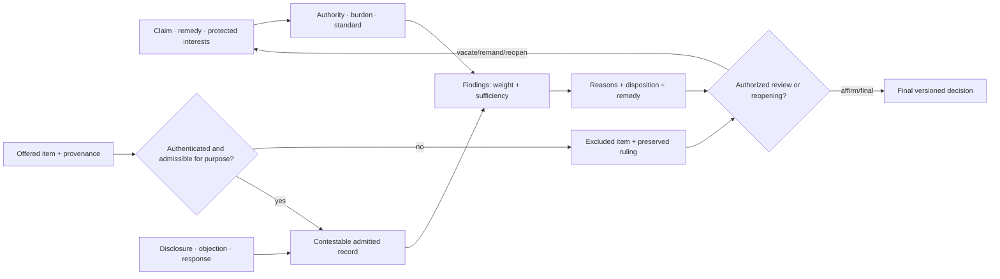

# Legal evidence, adjudication, and procedural safeguards: analogue audit

**Audit date:** 2026-08-05

**Primary jurisdiction:** United States federal law and federal adjudication

**Rule snapshot:** federal rules and statutes in force on the audit date;
Supreme Court cases identified by decision year

**Status:** primary-source/formal audit; not legal advice and not a statement of
state, tribal, territorial, foreign, or international law

**Project disposition:** no new principle and no new held candidate

## Scope and purpose

This audit asks what an engineered decision system can learn from legal
evidence and procedure without pretending that adjudication is merely a
classifier, that law is an optimization problem, or that a doctrinal rule is an
empirical claim. It covers:

- burdens and standards of proof;
- admissibility versus weight and sufficiency;
- authentication and chain of custody;
- disclosure, confrontation, and adversarial testing;
- precedent, authority, and distinguishing;
- appeal, standards of review, finality, and reopening;
- due process, notice, and opportunity to respond;
- conflicts and recusal;
- reason-giving, records, and auditability;
- institutional fact-finding; and
- asymmetric costs and distributions of error.

The main deduplication targets are [P-003](../principle-registry.md#p-003--temporary-trace-before-commitment),
[P-009](../principle-registry.md#p-009--maintenance-plane),
[P-012](../principle-registry.md#p-012--memory-matched-to-information-lifetime),
[P-013](../principle-registry.md#p-013--externalized-shared-state), and
Candidates [009](../../experiments/candidates/009-graded-assurance-envelopes.md),
[010](../../experiments/candidates/010-reset-coupled-staged-verification.md),
[011](../../experiments/candidates/011-dual-loop-operational-assurance.md),
[014](../../experiments/candidates/014-versioned-observation-contract.md),
[015](../../experiments/candidates/015-versioned-repairable-conventions.md),
and [020](../../experiments/candidates/020-constitutional-control-plane.md).

## Executive finding

Legal procedure contributes a useful **separation discipline**, not a new
computational primitive:

1. an item can be authentic but inadmissible;
2. an admitted item can receive little weight;
3. a weighted record can still be insufficient under the assigned burden;
4. a decision can be factually plausible but procedurally unauthorized;
5. an error can exist but be non-prejudicial under the applicable review rule;
6. a final decision can remain wrong while reopening is unavailable; and
7. a reasoned decision can remain biased or factually mistaken.

The narrowest residual is a **burden-qualified contestable decision record**:
a versioned record that binds the claim, authority, proponent, burden,
admissible record, provenance, objections, disclosures, reasons, disposition,
review state, and reopening conditions without collapsing any field into a
truth score. This is a refinement of Candidates 009, 010, 011, 014, 015, and
020, not a twenty-first candidate. Mature workflow, provenance, access-control,
verification, review, and governance systems already implement most parts.

No legal safeguard should be promoted from analogy alone. It must beat simpler
independent review, calibrated decision theory, provenance, access control,
workflow engines, versioned rules, red teams, and retry/reopen policies under
equal information, authority, human effort, delay, compute, and error budget.

## 1. Inference firewall

| Layer | Question | Valid evidence | Invalid substitution |
| --- | --- | --- | --- |
| normative authority | what must or may an institution do? | constitution, statute, rule, binding holding, valid order | measured accuracy or popularity |
| doctrinal rule | what legal test applies in this jurisdiction and posture? | authoritative text plus controlling interpretation | a general moral claim or a numerical threshold invented by the researcher |
| empirical effect | what does a safeguard actually change? | randomized or credible quasi-experimental study, measured operations, scoped error study | the rule's purpose, a judicial assertion, or reversal rate alone |
| formal model | what follows from declared hypotheses, priors, loss, and information? | theorem, simulation, identified statistical model | binding law, lived harm, legitimacy, or protected rights |
| institutional fact | what did the authorized factfinder find on this record? | finding and cited record under the governing procedure | ground truth outside the proceeding |
| project transfer | does an implementation improve an AI system? | equal-budget experiment with protected-outcome and lifecycle accounting | doctrinal prestige, legal vocabulary, or biological analogy |

These layers may inform each other but never prove one another. In particular,
the constitutional validity of a procedure is not established by a lower
average error rate, and a procedure required by law may serve dignity,
participation, authority, equality, or legitimacy rather than measurable
fact-finding accuracy.

### Terms that must remain distinct

| Term | Minimum meaning here | Does not imply |
| --- | --- | --- |
| burden of production | obligation to introduce enough material to put an issue in play | ultimate persuasion or truth |
| burden of persuasion | allocation of non-persuasion risk under a stated standard | a universal posterior-probability threshold |
| admissibility | permission for a factfinder to consider an item for a purpose | authenticity, truth, weight, or sufficiency |
| weight | influence assigned by the factfinder | legal admissibility or satisfaction of the burden |
| sufficiency | whether the legally relevant record can support the required finding | scientific certainty or absence of contrary evidence |
| authentication | sufficient support that an item is what its proponent claims | truth of its contents, complete custody, or authorization to use it |
| chain of custody | documented succession of possession, handling, or transformation | unbroken causal history or tamper-proof truth |
| disclosure | provision of material to another participant | comprehension, equality of resources, or effective challenge |
| confrontation | opportunity to test specified testimonial evidence under governing law | universal discovery or scientific validation |
| precedent | prior authoritative decision with jurisdiction- and hierarchy-dependent force | a nearest textual neighbor or immutable rule |
| distinguishing | reasoned account of why a prior holding does not control the present facts or issue | arbitrary exception or semantic distance alone |
| appeal | authorized review of a lower decision under a scope and standard | full retrial or automatic error correction |
| finality | legal closure against ordinary relitigation after specified transitions | factual correctness, immutability, or deletion of evidence |
| reason-giving | stated findings, law, and inferential basis at a required granularity | faithful causal introspection or debiasing |

## 2. Decision-state decomposition



The arrows are procedural and authority-bearing. They are not a claim that the
decision-maker executes a Bayesian pipeline, maximizes social welfare, or has
access to ground truth.

## 3. Formal and unit-bearing accounting boundary

### Evidence and decision states

For claim $H$ and case version $v$, define an audit record

$$
\mathcal D_v=(j_v,a_v,p_v,H,b_v,s_v,R_v,O_v,Q_v,d_v,r_v,\rho_v,f_v),
$$

where $j_v$ is jurisdiction and authority; $a_v$ the authorized actor; $p_v$
the parties or affected interests; $b_v$ the burden bearer; $s_v$ the standard;
$R_v$ the admitted record; $O_v$ objections and preserved issues; $Q_v$
disclosure and access state; $d_v$ disposition; $r_v$ reasons; $\rho_v$ review
state and standard; and $f_v$ finality/reopening state. These are typed fields,
not commensurable real numbers.

An evidence item should retain separate flags and scopes:

$$
e_i=(\text{artifact},\text{proponent},\text{purpose},\text{provenance},
\text{auth},\text{admit},\text{weight},\text{support},\text{objections}).
$$

The `auth` and `admit` fields are rulings with authority and version, `weight`
is a finding or distribution under a declared model, and `support` names the
claim and factual scope. No monotone implication is assumed between them.

### Statistical evidence is not the legal standard

For competing formal hypotheses $H_1$ and $H_0$, a likelihood ratio

$$
\Lambda(e)=\frac{p(e\mid H_1)}{p(e\mid H_0)}
$$

is dimensionless. It describes the modeled evidence under stated assumptions;
it is not $p(H_1\mid e)$, and neither value automatically equals
“preponderance,” “clear and convincing,” or “beyond a reasonable doubt.” A
legal burden may also encode who bears residual uncertainty, protected
interests, authority, and acceptable modes of proof.

For a deliberately simplified decision-theory null, let $N_{10}$ be false
positive decisions and $N_{01}$ false negatives, each measured in decisions;
let $c_{10}$ and $c_{01}$ be declared consequence units per error. Then

$$
L_{\mathrm{error}}=N_{10}c_{10}+N_{01}c_{01}.
$$

If consequences are monetized, use a declared currency and price year, such as
2026 USD per decision. If they are person-days of wrongful deprivation,
physical injuries, privacy disclosures, or denied benefits, keep them as a
vector:

$$
\mathbf L=(N_{10},N_{01},D_{\mathrm{wrongful}},
N_{\mathrm{procedure}},N_{\mathrm{protected}},C_{\mathrm{USD}},T_h,T_d,E_J),
$$

where $D_{\mathrm{wrongful}}$ is person-days; $N_{\mathrm{procedure}}$ counts
procedural violations; $N_{\mathrm{protected}}$ counts violations of declared
protected constraints; $C_{\mathrm{USD}}$ is 2026 USD; $T_h$ is human hours;
$T_d$ is
elapsed days; and $E_J$ is compute plus storage energy in joules. A scalar loss
is optional and its exchange rates are normative hypotheses, never measured
facts.

### Review and error correction

For $N_0$ initial decisions, $N_A$ appealed, $N_R$ reversed or remanded, and
$N_C$ ground-truth-corrected in a benchmark,

$$
r_A=\frac{N_A}{N_0},\qquad
r_R=\frac{N_R}{N_A},\qquad
r_C=\frac{N_C}{N_A},
$$

all in decisions per decision. A reversal is not a direct observation of lower
court error, and affirmance is not proof of correctness: selection into appeal,
preservation, standards of review, harmless-error rules, remedies, settlement,
and reviewer error intervene.

Review cost must expose

$$
C_{\mathrm{review}}=T_h c_h+T_d c_d+E_J c_J+C_{\mathrm{access}},
$$

where $c_h$ is 2026 USD per human hour if monetized, $c_d$ is declared delay
cost per day, $c_J$ is 2026 USD per joule or left as joules, and
$C_{\mathrm{access}}$ records filing, representation, translation, and access
costs in native units. Do not infer optimal review depth from reversal rate.

### Provenance and custody

A tamper-evident event chain may compute

$$
h_k=\operatorname{Hash}(h_{k-1}\parallel e_k\parallel a_k\parallel t_k),
$$

where $e_k$ is the event payload in bytes, $a_k$ an authenticated actor ID,
$t_k$ a timestamp in UTC seconds, and $h_k$ a fixed-length digest in bits. This
can detect some post-record alteration. It cannot establish that an observation
was true, complete, lawfully obtained, correctly interpreted, or admissible.

## 4. Burdens, standards of proof, and asymmetric error

In **United States federal constitutional law**, *In re Winship*, 397 U.S. 358
(1970), required proof beyond a reasonable doubt for every fact necessary to
constitute the charged offense in the juvenile delinquency proceeding before
it
([official U.S. Reports](https://tile.loc.gov/storage-services/service/ll/usrep/usrep397/usrep397358/usrep397358.pdf)).
In *Addington v. Texas*, 441 U.S. 418 (1979), the Court required clear and
convincing evidence for state civil commitment and expressly discussed how the
burden allocates risk when the individual's liberty interest and the state's
interests are asymmetric
([official U.S. Reports](https://tile.loc.gov/storage-services/service/ll/usrep/usrep441/usrep441418/usrep441418.pdf)).

Those holdings establish legal allocation of non-persuasion risk in their
jurisdictions and postures. They do not supply universal numerical posterior
thresholds. John Kaplan's formal decision-theory treatment and later formal
error-cost analysis show how a chosen loss model can relate thresholds to
error costs, while also depending on priors, evidence models, and valuations
([Kaplan 1968](https://doi.org/10.2307/1227491);
[Burtis, Gelbach, and Kobayashi 2017](https://doi.org/10.1086/694607)). The
formalism is a mature null, not an interpretation that converts constitutional
doctrine into expected-loss minimization.

**AI translation.** Bind every consequential claim to the burden bearer,
decision rule, abstention state, protected constraints, and separate false-
positive/false-negative outcomes. Do not use one confidence score for every
action.

**Failure modes.** Uncalibrated confidence; treating absence of evidence as
evidence of absence; hiding class-conditional errors; translating a verbal
legal standard into an arbitrary percentage; optimizing average error while
trading away an inviolable constraint; and shifting the burden when data are
missing.

**Deduplication.** This is graded assurance under Candidate 009, staged
commitment under Candidate 010, and constitutional authority under Candidate
020. The residual is metadata binding, not a new inference rule.

## 5. Admissibility, weight, sufficiency, and contamination

The [Federal Rules of Evidence](https://www.uscourts.gov/forms-rules/current-rules-practice-procedure/federal-rules-evidence),
last amended in 2024 as of this audit, distinguish preliminary admissibility
questions (Rule 104), relevance (Rules 401–402), exclusion for specified risks
(Rule 403), and expert-testimony requirements (Rule 702). In *Daubert v.
Merrell Dow Pharmaceuticals*, 509 U.S. 579 (1993), the Supreme Court interpreted
Rule 702 to assign federal trial judges a gatekeeping role for relevance and
reliability of scientific expert testimony
([official U.S. Reports](https://tile.loc.gov/storage-services/service/ll/usrep/usrep509/usrep509579/usrep509579.pdf)).
Admission does not make the evidence true, and exclusion can protect procedure,
privilege, fairness, or institutional competence rather than express a finding
that the item has zero probative value.

Experiments with U.S. judges found that some legally inadmissible information
still affected decisions even when judges knew it should be disregarded, with
effects varying by information type
([Wistrich, Guthrie, and Rachlinski 2005](https://scholarship.law.cornell.edu/lsrp_papers/20/)).
This supports a contamination threat model, not a universal incapacity theorem.

**AI translation.** Gate unqualified material before it enters a persistent
decision context; preserve excluded material and the ruling in a separately
authorized audit record; expose purpose limitations; and test whether later
outputs leak excluded content. “Ignore this” after ingestion is a weak null.

**Strongest nulls.** calibrated probabilistic evidence fusion; robust
statistics; source-quality features; retrieval filters; context isolation;
access control; differential privacy; and an independent factfinder that never
receives the excluded item.

**Deduplication.** Candidate 009 already separates assurance grades; Candidate
014 owns support and observation scope; the HCI audit owns cognitive
contamination and interface effects. The legal contribution is an authority-
and-purpose-qualified status transition.

## 6. Authentication, chain of custody, and forensic error

Federal Rule of Evidence 901 requires evidence sufficient to support a finding
that an item is what its proponent claims; Rule 902 enumerates categories that
are self-authenticating. These are **U.S. federal admissibility rules**, not a
universal demand for one custody format and not a conclusion that item contents
are accurate. Custody questions can affect authentication, admissibility, or
weight depending on the item, dispute, and controlling law.

In *Melendez-Diaz v. Massachusetts*, 557 U.S. 305 (2009), the Supreme Court held
that the forensic certificates at issue were testimonial and their admission
without the analysts violated the Sixth Amendment confrontation right
([official U.S. Reports](https://tile.loc.gov/storage-services/service/ll/usrep/usrep557/usrep557305/usrep557305.pdf)).
The holding is about testimonial evidence and confrontation; it does not make
cross-examination a scientific validation protocol.

Empirical forensic studies demonstrate why procedural status and scientific
validity must stay separate. In a large latent-fingerprint comparison study,
169 examiners each assessed about 100 pairs from a 744-pair pool; the measured
decisions had different false-positive and false-negative patterns, and the
authors warned that the test did not represent the full operational process
([Ulery et al. 2011](https://doi.org/10.1073/pnas.1018707108)). A much smaller
study found that task-irrelevant context could change some experts' repeated
fingerprint judgments
([Dror, Charlton, and Péron 2006](https://doi.org/10.1016/j.forsciint.2005.10.017)).
Neither error rate transfers without the study's selection, task, examiner,
decision-category, and verification boundary.

**AI translation.** Record acquisition, transformations, model and tool
versions, human handlers, hashes, missing intervals, authorization, and claimed
support. Blind or compartmentalize downstream analysts from outcome-irrelevant
context. Test both item integrity and task validity.

**Failure modes.** Signed false data; honest but miscalibrated sensors; hash
continuity over an incomplete record; post hoc provenance; shared contextual
bias; selective retesting; and treating a vendor certificate as validation.

**Deduplication.** Candidate 014 owns observation lineage and support;
Candidate 009 owns evidence grade and artifact binding; the security and
metrology audits own integrity, calibration, uncertainty, and measurement
traceability. No new principle remains.

## 7. Disclosure, confrontation, and adversarial testing

In *Brady v. Maryland*, 373 U.S. 83 (1963), the Supreme Court held that
suppression by the prosecution of favorable material evidence requested by the
accused violated due process, irrespective of prosecutorial good or bad faith,
within the federal constitutional issue decided there
([official U.S. Reports](https://tile.loc.gov/storage-services/service/ll/usrep/usrep373/usrep373083/usrep373083.pdf)).
Later doctrine defines materiality and scope; “Brady” is not a synonym for all
discovery. In federal civil litigation, Rule 26 of the
[Federal Rules of Civil Procedure](https://www.uscourts.gov/forms-rules/current-rules-practice-procedure/federal-rules-civil-procedure),
last amended in 2025, supplies a different disclosure and discovery framework.

In *Crawford v. Washington*, 541 U.S. 36 (2004), the Supreme Court held that the
Sixth Amendment generally bars testimonial hearsay against a criminal defendant
unless the declarant is unavailable and the defendant had a prior opportunity
for cross-examination, subject to the doctrine's defined scope
([official U.S. Reports](https://tile.loc.gov/storage-services/service/ll/usrep/usrep541/usrep541036/usrep541036.pdf)).
Disclosure and confrontation serve participation, equality, and legitimacy as
well as possible error correction; their legal force is not conditional on
showing aggregate accuracy improvement.

**AI translation.** Before a high-consequence commitment, disclose the evidence
packet, rule/model version, material counterevidence, known limitations, and
available challenges to an authorized counterparty or independent challenger.
Record whether the party had practical time and tools to respond. “Visible in a
log” is not meaningful access.

**Strongest nulls.** ordinary code review; independent replication; red-team
testing; debate; calibrated ensembles; counterfactual explanation; discovery
APIs; and a symmetric evidence search with no strategic party.

**Failure modes.** discovery dumping; unequal representation or compute;
strategic withholding; privileged or protected material leakage; cross-
examination that rewards rhetoric rather than validity; shared model failure;
and delay that makes a formal response opportunity useless.

**Deduplication.** Candidate 010 owns staged testing before commitment;
Candidate 020 owns authorized standing and contestation; Candidate 011 owns the
live-to-learning interface. The distinct refinement is to measure **effective
contestability**, not merely the existence of a verification stage.

## 8. Precedent, authority, and distinguishing

Precedent is indexed by jurisdiction, court hierarchy, issue, procedural
posture, facts material to the holding, disposition, date, and subsequent
treatment. In *Rodriguez de Quijas v. Shearson/American Express*, 490 U.S. 477
(1989), the Supreme Court instructed lower courts to follow directly controlling
Supreme Court precedent even when later decisions appear to undermine its
rationale, leaving overruling to the Supreme Court
([official U.S. Reports](https://tile.loc.gov/storage-services/service/ll/usrep/usrep490/usrep490477/usrep490477.pdf)).
In *Payne v. Tennessee*, 501 U.S. 808 (1991), the Court described stare decisis
as important but not inexorable while overruling prior cases in the context
before it
([official U.S. Reports](https://tile.loc.gov/storage-services/service/ll/usrep/usrep501/usrep501808/usrep501808.pdf)).

These decisions show both hierarchy and controlled change. They do not yield a
universal similarity metric. Distinguishing requires an authority-sensitive
argument that a difference changes whether the prior holding controls; lexical
distance, embedding proximity, or outcome agreement is insufficient.

An audit-ready precedent contract is

$$
P_k=(j_k,c_k,t_k,i_k,h_k,m_k,d_k,q_k),
$$

where $j_k$ is jurisdiction, $c_k$ court and authority rank, $t_k$ decision
date, $i_k$ issue, $h_k$ holding or rule, $m_k$ materially relevant facts and
posture, $d_k$ disposition, and $q_k$ subsequent status. These are typed
metadata; $c_k$ is not a scalar quality score.

**AI translation.** Retrieval must filter by authority and temporal validity
before semantic similarity. A model should cite the controlling proposition,
map material facts, surface adverse authority, state the distinguishing ground,
and propagate overruling or amendment to dependents.

**Strongest nulls.** a maintained rule engine; citator and knowledge graph;
temporal database; BM25 plus authority filter; expert-authored decision table;
and retrieval-augmented generation with explicit negative treatment.

**Failure modes.** citing dicta as a holding; mixing jurisdictions; silent
overruling; relying on a vacated opinion; result-only analogy; spurious factual
distinction; circular citation; and present-law leakage into historical tests.

**Deduplication.** Candidate 015 owns versioned, repairable conventions and
Candidate 014 owns versioned support. The cultural-inheritance audit owns
transmission, selection, and cumulative archives. Law adds authority rank and
applicability, not a new memory mechanism.

## 9. Appeal, review, harmless error, and institutional fact-finding

Under **U.S. federal statute**, 28 U.S.C. § 1291 grants courts of appeals
jurisdiction over final decisions of district courts, subject to its terms and
exceptions
([official U.S. Code, text current July 27, 2026](https://uscode.house.gov/view.xhtml?edition=prelim&hl=false&req=granuleid%3AUSC-prelim-title28-section1291)).
The [Federal Rules of Appellate Procedure](https://www.uscourts.gov/forms-rules/current-rules-practice-procedure/federal-rules-appellate-procedure),
last amended in 2025, govern federal appellate procedure. Review is not one
operation: questions can receive de novo, clear-error, abuse-of-discretion,
substantial-evidence, or other review depending on source and issue. Federal
Civil Rule 52(a)(6), for example, says factual findings must not be set aside
unless clearly erroneous.

Federal Criminal Rule 52 distinguishes harmless error from plain error in the
[Federal Rules of Criminal Procedure](https://www.uscourts.gov/forms-rules/current-rules-practice-procedure/federal-rules-criminal-procedure),
last amended in 2023. In federal administrative review, 5 U.S.C. § 706 directs
reviewing courts to use specified grounds, review the whole record or cited
parts, and take due account of prejudicial error
([official U.S. Code, text current July 20, 2026](https://uscode.house.gov/view.xhtml?edition=prelim&f=treesort&jumpTo=true&num=0&req=%28title%3A5+section%3A706+edition%3Aprelim%29+OR+%28granuleid%3AUSC-prelim-title5-section706%29)).

*Universal Camera Corp. v. NLRB*, 340 U.S. 474 (1951), interpreted substantial-
evidence review to require attention to the record as a whole while preserving
the agency's fact-finding role
([official U.S. Reports](https://tile.loc.gov/storage-services/service/ll/usrep/usrep340/usrep340474/usrep340474.pdf)).
It illustrates institutional allocation of fact-finding and review, not a
generic majority-vote ensemble.

**AI translation.** Separate first-instance findings from review; declare the
reviewer's authority, eligible issues, preserved record, deference, remedy, and
prejudicial-error rule. Measure both corrected and introduced error. Keep
procedure violations visible even when the benchmark labels an output correct.

**Strongest nulls.** duplicate independent evaluation; selective prediction;
confidence-triggered escalation; unit tests; formal verification; adjudication
by a stronger model; randomized audit; and full rerun from raw evidence.

**Failure modes.** correlated reviewer errors; appeal selection bias; rubber-
stamp affirmance; de novo review disguised as deference; an incomplete record;
issue forfeiture; reviewer hindsight; no effective remedy; and delay exceeding
the useful life of relief.

**Deduplication.** Candidate 011 owns operational review and learning, Candidate
009 owns assurance grade, and P-009 owns a distinct maintenance/review plane.
The refinement is a typed review contract, not another hierarchy principle.

## 10. Finality and reopening

Federal Civil Rules 59 and 60 provide bounded routes for new trial, amendment,
and relief from a final judgment or order, with grounds and timing that differ.
Rule 60(b), for example, enumerates mistake, newly discovered evidence, fraud,
void judgment, satisfaction, and a residual category; the detailed text and
case law control. This expresses a state transition with both closure and
limited reopening, not a claim that stale beliefs should never update.

For an engineered record, define

$$
f_v\in\{\text{open},\text{decided},\text{reviewable},\text{final},
\text{reopened},\text{superseded}\}.
$$

A transition must cite authority, deadline, grounds, new material, affected
scope, and successor version. “Final” forbids an ordinary transition; it does
not erase provenance or make the proposition true.

**AI translation.** Use bounded reopening triggers for newly available decisive
evidence, compromised provenance, invalidated authority, or demonstrated
process failure. Preserve the prior disposition and reliance state. Evaluate
always-open, fixed-final, and trigger-based policies.

**Failure modes.** endless churn; strategic late evidence; irreversible action
before review; retroactive corruption of audit history; reopening without
notice; stale dependents; and finality that hides a known severe error.

**Deduplication.** P-012 owns information lifetime, P-003 provisional state,
Candidate 015 version repair, Candidate 011 review/learning, and Candidate 009
invalidation. Law supplies a mature policy family, not a new memory primitive.

## 11. Due process, notice, participation, and remedy

In *Mathews v. Eldridge*, 424 U.S. 319 (1976), the Supreme Court evaluated the
procedural sufficiency of terminating federal disability benefits by
considering the private interest, risk of erroneous deprivation and probable
value of additional safeguards, and governmental interests and burdens
([official U.S. Reports](https://tile.loc.gov/storage-services/service/ll/usrep/usrep424/usrep424319/usrep424319.pdf)).
The test is U.S. constitutional doctrine for the context to which it applies;
it is not a generic scalar optimizer and does not exhaust due process.

In *Goldberg v. Kelly*, 397 U.S. 254 (1970), the Court required a pretermination
evidentiary hearing before termination of the welfare benefits at issue and
described notice, opportunity to confront adverse evidence, an impartial
decision-maker, and stated reasons within that setting
([official U.S. Reports](https://tile.loc.gov/storage-services/service/ll/usrep/usrep397/usrep397254/usrep397254.pdf)).

**AI translation.** Identify affected interests, give timely intelligible
notice, permit access to decision-relevant evidence, provide a practical route
to respond, assign an authorized impartial decision-maker, state the remedy,
and log whether participation could occur before irreversible harm.

**Strongest nulls.** ordinary user correction, customer support, human-in-the-
loop review, rollback, complaint workflow, counterfactual explanation, and
appeal to an independent model or operator.

**Failure modes.** notice after action; inaccessible language or interface;
nominal choice without time or resources; reviewer without authority;
explanation without evidence access; no stay or remedy; retaliatory challenge
cost; and aggregate accuracy used to waive individual protected process.

**Deduplication.** HCI owns intelligibility and practical usability; Candidate
020 owns authorized standing and protected interests; Candidate 011 owns remedy
and post-incident learning. No new general control loop survives.

## 12. Conflicts, recusal, and decisional independence

Under **U.S. federal statute**, 28 U.S.C. § 455 requires federal justices,
judges, and magistrate judges to disqualify themselves where impartiality might
reasonably be questioned and lists additional circumstances
([official U.S. Code, text current July 9, 2026](https://uscode.house.gov/view.xhtml?edition=prelim&f=treesort&jumpTo=true&num=0&req=%28title%3A28+section%3A455+edition%3Aprelim%29+OR+%28granuleid%3AUSC-prelim-title28-section455%29)).
In *Caperton v. A. T. Massey Coal Co.*, 556 U.S. 868 (2009), the Supreme Court
found a due-process violation on extreme campaign-spending and timing facts
creating a serious risk of actual bias
([official U.S. Reports](https://tile.loc.gov/storage-services/service/ll/usrep/usrep556/usrep556868/usrep556868.pdf)).
The constitutional floor in that case is not the complete recusal law.

**AI translation.** Declare financial, training-data, evaluator, developer,
deployment, and reward conflicts; prevent a module from being the sole judge of
its own compliance; route cases to an independent actor when triggers fire;
and preserve assignment and override records.

**Strongest nulls.** random assignment; separation of duties; independent audit;
blind evaluation; quorum review; conflict registry; and direct measurement of
strategic incentives.

**Failure modes.** self-reported incomplete conflicts; formally independent but
correlated models; forum shopping; strategic recusal; captured reviewers;
opaque sponsorship; and a conflict flag with no alternate decision path.

**Deduplication.** Candidate 020 owns conflict-bearing multi-level authority;
Candidate 009 owns independent assurance roots; the security audit owns trust
roots and separation of duties. Recusal is a scoped governance rule.

## 13. Reason-giving, auditability, and the whole record

For covered formal federal agency adjudication, 5 U.S.C. § 557(c) requires
decisions to include findings and conclusions and their reasons or basis on
material issues, plus the rule, order, sanction, relief, or denial
([official U.S. Code, text current July 26, 2026](https://uscode.house.gov/view.xhtml?edition=prelim&num=0&req=granuleid%3AUSC-prelim-title5-section557)).
In *Motor Vehicle Manufacturers Association v. State Farm*, 463 U.S. 29 (1983),
the Supreme Court applied arbitrary-and-capricious review to the agency action
and required reasoned analysis within the administrative-law setting
([official U.S. Reports](https://tile.loc.gov/storage-services/service/ll/usrep/usrep463/usrep463029/usrep463029.pdf)).

Reason-giving has multiple possible functions: expose the applied rule and
record, constrain authority, enable participation, support appeal, create
precedent, and permit audit. Its empirical effect on correctness is not fixed.
Experiments with Chinese judges found that writing reasons before deciding
reduced one experimentally induced bias, while delegating reason writing could
reinforce it
([Liu 2018](https://doi.org/10.1086/696879)). In a U.S. federal-judge experiment,
written reasons emphasized legal sources even though a legally irrelevant
defendant characteristic affected outcomes, showing that reasons need not
faithfully reveal causal influence
([Spamann and Klöhn 2016](https://doi.org/10.1086/688861)). Another vignette
study found that explication and falsification instructions changed use of
exonerating evidence but ordinary justification did not produce the same
effect
([Maegherman et al. 2022](https://doi.org/10.1080/13218719.2021.1904452)).

**AI translation.** Generate a structured decision record before or alongside
commitment: controlling rule/version, admitted evidence citations, contrary
evidence, findings, inferential steps, uncertainty, protected constraints,
disposition, and remedy. Verify the record against actual inputs and traces;
do not treat fluent chain-of-thought as faithful introspection.

**Strongest nulls.** answer plus citations; extractive evidence spans; proof or
program traces; event sourcing; reproducible execution; counterfactual tests;
independent replay; and output-only explanation.

**Failure modes.** post hoc rationalization; omitted adverse evidence; citation
without entailment; reasons written by a different agent; private information
leakage; strategic verbosity; and an auditable record that no authorized actor
can inspect or remedy.

**Deduplication.** Candidate 014 owns evidence-to-claim support and lineage;
Candidate 009 owns proof/evidence grade; Candidate 011 owns learning from the
record; P-013 owns externalized shared state. The refinement is a decision-
linked, authority-aware reason record.

## 14. Explicit registry and candidate deduplication

### Principle coverage

| Existing principle | Legal analogue | Residual after deduplication |
| --- | --- | --- |
| [P-003 — temporary trace before commitment](../principle-registry.md#p-003--temporary-trace-before-commitment) | offered evidence, preliminary rulings, provisional findings, and interlocutory state precede final disposition | procedural status and authority metadata only; no new temporary-memory loop |
| [P-009 — maintenance plane](../principle-registry.md#p-009--maintenance-plane) | appeal, audit, remand, reopening, rule maintenance, and recusal are separated from first-instance disposition | typed scope and remedy of review; ordinary review/control-plane pattern |
| [P-012 — memory matched to information lifetime](../principle-registry.md#p-012--memory-matched-to-information-lifetime) | retention, limitation periods, finality, reopening, precedent status, and supersession have distinct lifetimes | authority-qualified retention policy; no new memory medium |
| [P-013 — externalized shared state](../principle-registry.md#p-013--externalized-shared-state) | docket, record, exhibits, objections, findings, opinions, and mandate coordinate multiple actors | record is an established blackboard/event-log form; access and authority matter |

P-001, P-002, P-004–P-008, P-010, and P-011 may appear in particular legal
institutions, but this audit found no distinct support for changing their
registry definitions.

### Candidate coverage and exact refinements

| Candidate | Overlap | Exact refinement from this audit |
| --- | --- | --- |
| [009 — graded assurance envelopes](../../experiments/candidates/009-graded-assurance-envelopes.md) | admissibility, proof, authority, provenance, and review are different assurance dimensions | add separate `authenticity`, `admissibility-for-purpose`, `weight`, `sufficiency-under-burden`, `authority`, `review-standard`, and `finality` fields; forbid grade collapse; invalidate dependents when rule or authority version changes |
| [010 — reset-coupled staged verification](../../experiments/candidates/010-reset-coupled-staged-verification.md) | preliminary gate before costly commitment | require evidence access, adverse-item disclosure, authorized challenge, contamination isolation, and a remedy before calling a verifier “adversarial”; add asymmetric error outcomes and rejected-work cost |
| [011 — dual-loop operational assurance](../../experiments/candidates/011-dual-loop-operational-assurance.md) | first-instance action, review, remedy, and later learning | bind each review to preserved issue, record version, review standard, prejudicial-error rule, disposition, remedy, and successor version; do not infer learning from reversal alone |
| [014 — versioned observation contract](../../experiments/candidates/014-versioned-observation-contract.md) | provenance, support, uncertainty, lineage, and derived claims | add jurisdiction, authority, proponent, purpose, burden bearer, authentication/custody, disclosed-to state, admissibility ruling, objection, contrary evidence, weight, sufficiency, and completeness fields |
| [015 — repairable conventions](../../experiments/candidates/015-versioned-repairable-conventions.md) | precedent, interpretation, rule change, distinguishing, and supersession | add authority hierarchy, holding/rule identity, material-fact map, negative treatment, effective date, overruling/deprecation, and retroactivity/applicability; semantic similarity cannot override authority |
| [020 — constitutional control plane](../../experiments/candidates/020-constitutional-control-plane.md) | standing, protected interests, separation of roles, contestation, appeal, and recusal | add conflict registry, recusal trigger, independent assignment path, notice/access/response state, typed appeal, reason requirement, remedy, and protected procedural outcomes independent of task reward |

### Adjacent-audit boundaries

| Existing audit | What it already owns | Boundary retained here |
| --- | --- | --- |
| [Social choice and institutions](2026-08-05-social-choice-institutions.md) | aggregation, agenda power, strategic voting, delegation, legitimacy | adjudication concerns evidence and authority in an individual proceeding; it is not preference aggregation by default |
| [HCI and human factors](2026-08-05-hci-human-factors.md) | attention, cognitive load, explanation usability, warnings, human error | legal notice and reasons can be normatively required even when usability or debiasing effects are unproved |
| [Programming languages and verification](2026-08-05-programming-languages-verification.md) | proofs, types, contracts, effects, monitors, specification boundaries | a legal finding is not a theorem; a proof checker is a null for only formally specified obligations |
| [Security and cryptography](2026-08-05-security-cryptography.md) | identity, signatures, integrity, capabilities, threat models, trust roots | authentication in evidence law and cryptographic authenticity are overlapping but nonidentical predicates |
| [High-reliability organizations](2026-08-05-high-reliability-organizations-incident-learning.md) | incident command, containment, postmortem, corrective action, recurrence | appeal/reopening is not automatically incident learning; remedy and precedent can exist without operational improvement |
| [Metrology](2026-08-05-metrology-measurement-science.md) | calibration, traceability, uncertainty, measurement models, comparability | admissibility does not validate a measurement; metrological validity does not settle authorization or legal sufficiency |
| [Cultural evolution and archaeology](2026-08-05-cultural-evolution-archaeology.md) | cumulative transmission, selection, lineage, evidence from incomplete traces | precedent is a versioned authority system, not proof that transmitted rules are adaptive or true |

## 15. Strongest mature null suite

Before attributing an improvement to a legal analogue, compare against:

1. a calibrated binary or selective classifier with declared false-positive and
   false-negative costs;
2. a Bayesian or likelihood-ratio model with explicit priors, evidence model,
   and abstention;
3. a typed workflow engine with role-based access control and deadlines;
4. a provenance/event-sourcing system with signatures, hashes, and immutable
   versions;
5. a maintained rule engine plus temporal authority/citation graph;
6. independent duplicate review, blind replication, or a stronger evaluator;
7. red-team, debate, ensemble, and counterexample-search baselines;
8. formal verification or proof-carrying artifacts for fully specified
   obligations;
9. confidence- or risk-triggered human escalation with rollback; and
10. full recomputation from raw evidence after any material change.

Nulls must receive the same evidence access, protected-interest specification,
authority, human time, compute, latency, memory, model capacity, and opportunity
to abstain. A legal-branded system loses if a typed workflow plus provenance
and independent review ties it.

## 16. Equal-budget falsification program

### Common contract

Use preregistered cases with ground truth where empirical accuracy is tested,
and separately score doctrinal/procedural compliance where no ground truth can
resolve the normative issue. Every arm receives equal:

- source records and material counterevidence;
- training examples and retrieval corpus versions;
- human-review hours and challenger hours;
- compute joules and peak watts;
- storage bytes and retention duration;
- wall-clock decision and appeal opportunity;
- model capacity, tool access, and tuning budget; and
- authority to abstain, stay, reverse, remand, or reopen.

Report $N_{10}$ and $N_{01}$ in decisions; calibration error; abstentions;
procedural and protected-constraint violations in events; human work in hours;
delay in seconds or days; access cost in 2026 USD and operator hours; compute
and storage energy in joules; record size in bytes; reversals and corrected
errors separately; remedy completion; and outcome disparities by preregistered
group. Preserve the vector rather than hiding trade-offs in one score.

### Experiment A — burden and asymmetric error

Generate matched evidence streams with known $H_0/H_1$, base-rate shift,
missingness, and asymmetric consequences. Compare fixed threshold, calibrated
posterior, likelihood-ratio, cost-sensitive, conformal/selective, and burden-
qualified decision arms. The legal analogue survives only if explicit burden
state prevents harmful burden shifts and improves the protected outcome vector
beyond calibrated abstention. Reject any claim of a universal numerical legal
threshold.

### Experiment B — admissibility versus weight contamination

Randomly expose decision agents to a relevant-but-excluded item before or after
the admissibility ruling. Compare instruction-to-ignore, context-window removal,
separate factfinder, access-control gate, and purpose-tagged evidence. Measure
decision leakage and later generations. The status separation survives only if
it reduces contamination without hiding admissible contrary evidence or
destroying the audit record.

### Experiment C — authentication and custody

Factorially vary true/false content, signed/unsigned origin, complete/incomplete
custody, authorized/unauthorized acquisition, and transformation history.
Compare checksum only, signature chain, provenance graph, manual custody log,
and the full evidence contract. Success requires distinguishing integrity,
identity, truth, authorization, and support rather than treating any one as the
others.

### Experiment D — disclosure and effective challenge

Place material exculpatory or failure evidence in a large record under symmetric
and asymmetric search resources. Compare no disclosure, raw dump, ranked
disclosure, independent search, adversarial challenger, and calibrated ensemble.
Equalize total work. The analogue survives only if the counterparty can locate,
understand, and act on the material before commitment, with protected material
and strategic leakage separately measured.

### Experiment E — precedent and distinguishing

Build a temporally versioned corpus with controlling, persuasive, overruled,
vacated, and factually similar but jurisdictionally irrelevant decisions.
Compare embedding retrieval, BM25, temporal citator graph, rule engine, RAG,
and authority-plus-material-fact contract. Score controlling-rule selection,
adverse-authority recall, valid distinction, present-law leakage, and citation
entailment. The contract loses if ordinary authority-filtered retrieval ties it.

### Experiment F — first-instance review and appeal

Inject factual, rule-selection, procedural, and remedy errors into first-instance
decisions. Compare no review, duplicate review, stronger-model review,
confidence escalation, targeted issue review, and full rerun. Cross reviewer
correlation, record completeness, and review standard. Measure corrected and
introduced errors, delay, access disparity, and remedy. Reversal alone is not
the endpoint.

### Experiment G — finality and reopening

Stream late evidence, changed rules, compromised provenance, harmless changes,
and adversarial reopening requests. Compare always-open update, immutable final
state, time window, evidence-value threshold, and typed reopening grounds.
Survival requires fewer severe stale decisions than fixed finality and less
churn/strategic abuse than always-open updating, with all reliance and migration
costs charged.

### Experiment H — notice, participation, and remedy

Randomize timely versus late notice, evidence access, response time, language,
interface accessibility, representation, and stay availability. Compare output-
only explanation, correction form, human escalation, and full contestable
record. Score practical participation and completed remedy separately from
benchmark accuracy. A safeguard cannot be declared useless merely because the
initial label was correct.

### Experiment I — conflict and recusal

Introduce observable and hidden incentives, shared training data, sponsor
effects, self-evaluation, and correlated reviewers. Compare self-recusal,
random assignment, blind evaluation, independent trust root, and quorum review.
The legal analogue survives only if conflict-triggered reassignment reduces
protected-outcome violations beyond direct incentive modeling, without enabling
forum shopping or leaving cases undecided.

### Experiment J — reason-giving and auditability

Compare answer-only, post hoc free-text rationale, precommitment reasons,
structured evidence-to-finding record, executable trace, and independent replay.
Include irrelevant but outcome-predictive features. Measure correctness,
citation entailment, contrary-evidence coverage, causal faithfulness under
intervention, reviewer repair time, privacy leakage, and verbosity. A fluent
rationale fails if it rationalizes a decision driven by excluded information.

## 17. Temporary claim ledger

These IDs are local to this audit and are not additions to
`research/claims.md`.

| ID | Scoped claim | Evidence type and status | Jurisdiction/source boundary | Existing owner |
| --- | --- | --- | --- | --- |
| C-LGL-01 | Normative authority, doctrinal validity, empirical effect, and formal optimality are separate predicates. | analytic distinction; established audit rule | cross-source synthesis, not a legal holding | project evidence policy |
| C-LGL-02 | In the proceeding at issue, due process required proof beyond a reasonable doubt for facts necessary to constitute the charged offense. | binding doctrinal holding | U.S. Supreme Court, *Winship* (1970) | Candidate 009/020 |
| C-LGL-03 | Civil commitment in *Addington* required clear and convincing evidence because the Court allocated asymmetric risks and interests. | binding doctrinal holding | U.S. Supreme Court, 1979; state civil commitment context | Candidate 009/020 |
| C-LGL-04 | Verbal legal standards of proof do not, by themselves, specify universal posterior probabilities. | doctrinal/formal boundary; established | U.S. sources and decision-theory scholarship | Candidate 009 |
| C-LGL-05 | A formal error-cost model can derive a threshold only after hypotheses, priors or evidence distributions, consequences, and decision rule are declared. | formal result, model dependent | Kaplan 1968; Burtis et al. 2017 | mature statistical null |
| C-LGL-06 | Authentication, admissibility for purpose, weight, and sufficiency under a burden are distinct. | established doctrinal structure | U.S. federal evidence law as of 2026-08-05 | Candidates 009/014 |
| C-LGL-07 | Federal Rule 702 and *Daubert* assign federal trial judges a gatekeeping role for expert evidence, not a guarantee of scientific truth. | binding rule/holding, scoped | U.S. federal courts; rule current through 2024; case 1993 | Candidate 009; metrology |
| C-LGL-08 | Some inadmissible information affected decisions in experiments with judges despite instructions or rulings to disregard it. | established empirical result, study scoped | Wistrich et al. 2005; vignette/task limitations | HCI; contamination null |
| C-LGL-09 | Rule 901 authentication asks for sufficient support that an item is what the proponent claims; it does not establish truth of contents. | established doctrinal rule | U.S. federal evidence law as of 2026-08-05 | Candidate 014/security |
| C-LGL-10 | A cryptographic custody chain can provide integrity and actor evidence while leaving truth, completeness, legality, and admissibility unresolved. | established formal/engineering boundary | security analogue; not a holding | Candidate 009/014 |
| C-LGL-11 | The forensic certificates in *Melendez-Diaz* were testimonial and their admission without analysts violated the confrontation right. | binding doctrinal holding, scoped | U.S. Supreme Court, 2009; Massachusetts prosecution | Candidate 010/020 |
| C-LGL-12 | Latent-print examiner error rates and verification effects depend on the tested item pool, decision categories, participants, and operational boundary. | established empirical result, scoped | Ulery et al. 2011 | metrology/security |
| C-LGL-13 | Task-irrelevant context changed repeated fingerprint judgments for some experts in a small study. | established empirical result, narrow sample | Dror et al. 2006 | HCI/metrology |
| C-LGL-14 | Suppression of requested favorable material evidence violated due process in *Brady*. | binding doctrinal holding, later-doctrine caveat | U.S. Supreme Court, 1963 | Candidate 010/020 |
| C-LGL-15 | *Crawford* protects a scoped opportunity to cross-examine testimonial evidence; confrontation is not equivalent to scientific validation. | binding holding plus inference boundary | U.S. Supreme Court, 2004 | Candidate 010/020 |
| C-LGL-16 | Lower U.S. federal courts must follow directly controlling Supreme Court precedent rather than anticipate overruling. | binding hierarchical instruction | U.S. Supreme Court, *Rodriguez de Quijas* (1989) | Candidate 015 |
| C-LGL-17 | Stare decisis constrains but does not make precedent immutable. | binding Court statement and application, scoped | U.S. Supreme Court, *Payne* (1991) | Candidate 015/P-012 |
| C-LGL-18 | Appeal is authority- and issue-scoped review, not automatic retrial or direct observation of ground truth. | established doctrinal/inference boundary | U.S. federal statute/rules as of 2026-08-05 | Candidate 011/P-009 |
| C-LGL-19 | Whole-record substantial-evidence review preserves distinct institutional fact-finding and review roles. | binding doctrinal holding, scoped | U.S. Supreme Court, *Universal Camera* (1951) | Candidate 011/020 |
| C-LGL-20 | Federal civil procedure supplies limited, ground- and time-qualified routes to reopen final decisions. | established doctrinal rule | Fed. R. Civ. P. 59–60 as of 2026-08-05 | P-003/P-012; Candidate 015 |
| C-LGL-21 | The *Mathews* due-process analysis considers private interest, error risk and value of safeguards, and governmental interest/burden; it is not a universal scalar optimizer. | binding doctrinal test plus boundary | U.S. Supreme Court, 1976 | Candidate 020 |
| C-LGL-22 | Federal recusal law and *Caperton* constrain decision-makers with specified conflicts or extreme bias risks. | established statute/constitutional holding, different scopes | 28 U.S.C. §455 current 2026; U.S. Supreme Court 2009 | Candidate 009/020 |
| C-LGL-23 | Federal formal agency decisions covered by 5 U.S.C. §557(c) must state findings, conclusions, and reasons or basis on material issues. | established statutory rule | U.S. federal administrative law, text current 2026 | Candidate 011/014 |
| C-LGL-24 | Reason writing can alter decisions in some experiments but is not guaranteed to debias or reveal the actual causal basis. | established mixed empirical evidence | Liu 2018; Spamann and Klöhn 2016; Maegherman et al. 2022 | HCI; Candidate 014 |
| C-LGL-25 | Reversal and affirmance rates cannot identify first-instance accuracy without appeal selection, review standards, preservation, remedy, and reviewer-error models. | formal causal-identification boundary; established | audit inference from review structure | Candidate 011 |
| C-LGL-26 | A burden-qualified contestable decision record may improve safe reuse, review, and invalidation across changing evidence and authority. | speculative, testable | project transfer; Experiments A–J | refine Candidates 009/010/011/014/015/020 only |

## 18. Promotion disposition

### Promote

**None.** The audit found no distinct transferable state transition that beats
the existing principle/candidate bundles and mature engineering nulls.

### Hold only as candidate refinements

The only residual, C-LGL-26, is held as a cross-candidate contract:

$$
\mathcal D_v=\text{burden-qualified contestable decision record}.
$$

It may be promoted only if the complete contract—not selected legal labels—
beats typed workflow, provenance, calibrated abstention, rule/citation graphs,
independent review, red teams, and full recomputation on the protected outcome
vector at equal lifecycle budget. Its exact destinations are:

- Candidate 009: seven non-collapsible evidence/authority/review grades;
- Candidate 010: effective adversarial access, contamination isolation,
  asymmetric error, and remedy before irreversible commitment;
- Candidate 011: issue-, record-, standard-, prejudice-, remedy-, and successor-
  qualified review;
- Candidate 014: the full procedural evidence contract and contrary-evidence
  completeness state;
- Candidate 015: authority hierarchy, holding/material-fact mapping, negative
  treatment, effective date, and applicability propagation; and
- Candidate 020: conflict/recusal, independent assignment, practical notice and
  response, reason-giving, typed appeal, and protected procedural outcomes.

### Reject as unsupported generalizations

- law is an optimizer, Bayesian reasoner, or truth-finding algorithm by default;
- “beyond reasonable doubt” is one universal numeric probability;
- admissible evidence is reliable, true, or sufficient;
- authentication or an unbroken hash chain proves content truth;
- disclosure guarantees comprehension or equal adversarial capacity;
- cross-examination is scientific validation;
- precedent retrieval is semantic nearest-neighbor search;
- a cited prior case controls without jurisdiction, hierarchy, holding, and
  material-fact analysis;
- appeal guarantees correction, and affirmance proves correctness;
- reversal rate is an error rate;
- finality means truth or immutable data;
- reason-giving is faithful causal explanation or automatic debiasing;
- recusal can be delegated entirely to self-report; and
- aggregate accuracy can silently trade away protected process or individual
  remedy.

## 19. Integration note

Do not copy audit-local claims into the shared evidence ledger automatically.
A later cross-audit edit should add only the exact candidate refinements above,
after checking that the same fields are not already present. Legal sources must
retain jurisdiction, authority, date, posture, and later-treatment checks.
Proposed rules are not binding rules, and this audit intentionally excludes
pending post-audit changes.

## Audit-local bibliography

Cases and rules below are primary legal authorities for the identified U.S.
jurisdiction. Scholarship entries are formal or primary empirical studies.
Citation establishes identity; it does not erase later treatment, jurisdiction,
posture, or study-boundary requirements.

```bibtex
@misc{fre2024current,
  author = {{Administrative Office of the U.S. Courts}},
  title = {Federal Rules of Evidence},
  year = {2024},
  note = {Rules in force on 2026-08-05; last amended 2024},
  url = {https://www.uscourts.gov/forms-rules/current-rules-practice-procedure/federal-rules-evidence},
  urldate = {2026-08-05}
}

@misc{frcp2025current,
  author = {{Administrative Office of the U.S. Courts}},
  title = {Federal Rules of Civil Procedure},
  year = {2025},
  note = {Rules in force on 2026-08-05; last amended 2025},
  url = {https://www.uscourts.gov/forms-rules/current-rules-practice-procedure/federal-rules-civil-procedure},
  urldate = {2026-08-05}
}

@misc{frap2025current,
  author = {{Administrative Office of the U.S. Courts}},
  title = {Federal Rules of Appellate Procedure},
  year = {2025},
  note = {Rules in force on 2026-08-05; last amended 2025},
  url = {https://www.uscourts.gov/forms-rules/current-rules-practice-procedure/federal-rules-appellate-procedure},
  urldate = {2026-08-05}
}

@misc{frcrim2023current,
  author = {{Administrative Office of the U.S. Courts}},
  title = {Federal Rules of Criminal Procedure},
  year = {2023},
  note = {Rules in force on 2026-08-05; last amended 2023},
  url = {https://www.uscourts.gov/forms-rules/current-rules-practice-procedure/federal-rules-criminal-procedure},
  urldate = {2026-08-05}
}

@misc{usc28s1291,
  author = {{United States Congress}}, title = {28 U.S.C. Section 1291: Final Decisions of District Courts},
  year = {2026}, note = {Preliminary edition, laws in effect July 27, 2026},
  url = {https://uscode.house.gov/view.xhtml?edition=prelim&hl=false&req=granuleid%3AUSC-prelim-title28-section1291},
  urldate = {2026-08-05}
}

@misc{usc28s455,
  author = {{United States Congress}}, title = {28 U.S.C. Section 455: Disqualification of Justice, Judge, or Magistrate Judge},
  year = {2026}, note = {Preliminary edition, laws in effect July 9, 2026},
  url = {https://uscode.house.gov/view.xhtml?edition=prelim&f=treesort&jumpTo=true&num=0&req=%28title%3A28+section%3A455+edition%3Aprelim%29+OR+%28granuleid%3AUSC-prelim-title28-section455%29},
  urldate = {2026-08-05}
}

@misc{usc5s557,
  author = {{United States Congress}}, title = {5 U.S.C. Section 557: Initial Decisions; Conclusiveness; Review by Agency; Submissions by Parties; Contents of Decisions; Record},
  year = {2026}, note = {Preliminary edition, laws in effect July 26, 2026},
  url = {https://uscode.house.gov/view.xhtml?edition=prelim&num=0&req=granuleid%3AUSC-prelim-title5-section557},
  urldate = {2026-08-05}
}

@misc{usc5s706,
  author = {{United States Congress}}, title = {5 U.S.C. Section 706: Scope of Review},
  year = {2026}, note = {Preliminary edition, laws in effect July 20, 2026},
  url = {https://uscode.house.gov/view.xhtml?edition=prelim&f=treesort&jumpTo=true&num=0&req=%28title%3A5+section%3A706+edition%3Aprelim%29+OR+%28granuleid%3AUSC-prelim-title5-section706%29},
  urldate = {2026-08-05}
}

@misc{winship1970,
  author = {{Supreme Court of the United States}}, title = {In re Winship, 397 U.S. 358},
  year = {1970}, publisher = {U.S. Government Publishing Office},
  url = {https://tile.loc.gov/storage-services/service/ll/usrep/usrep397/usrep397358/usrep397358.pdf}
}

@misc{addington1979,
  author = {{Supreme Court of the United States}}, title = {Addington v. Texas, 441 U.S. 418},
  year = {1979}, publisher = {U.S. Government Publishing Office},
  url = {https://tile.loc.gov/storage-services/service/ll/usrep/usrep441/usrep441418/usrep441418.pdf}
}

@misc{daubert1993,
  author = {{Supreme Court of the United States}}, title = {Daubert v. Merrell Dow Pharmaceuticals, Inc., 509 U.S. 579},
  year = {1993}, publisher = {U.S. Government Publishing Office},
  url = {https://tile.loc.gov/storage-services/service/ll/usrep/usrep509/usrep509579/usrep509579.pdf}
}

@misc{melendezdiaz2009,
  author = {{Supreme Court of the United States}}, title = {Melendez-Diaz v. Massachusetts, 557 U.S. 305},
  year = {2009}, publisher = {U.S. Government Publishing Office},
  url = {https://tile.loc.gov/storage-services/service/ll/usrep/usrep557/usrep557305/usrep557305.pdf}
}

@misc{brady1963,
  author = {{Supreme Court of the United States}}, title = {Brady v. Maryland, 373 U.S. 83},
  year = {1963}, publisher = {U.S. Government Publishing Office},
  url = {https://tile.loc.gov/storage-services/service/ll/usrep/usrep373/usrep373083/usrep373083.pdf}
}

@misc{crawford2004,
  author = {{Supreme Court of the United States}}, title = {Crawford v. Washington, 541 U.S. 36},
  year = {2004}, publisher = {U.S. Government Publishing Office},
  url = {https://tile.loc.gov/storage-services/service/ll/usrep/usrep541/usrep541036/usrep541036.pdf}
}

@misc{rodriguez1989,
  author = {{Supreme Court of the United States}}, title = {Rodriguez de Quijas v. Shearson/American Express, Inc., 490 U.S. 477},
  year = {1989}, publisher = {U.S. Government Publishing Office},
  url = {https://tile.loc.gov/storage-services/service/ll/usrep/usrep490/usrep490477/usrep490477.pdf}
}

@misc{payne1991,
  author = {{Supreme Court of the United States}}, title = {Payne v. Tennessee, 501 U.S. 808},
  year = {1991}, publisher = {U.S. Government Publishing Office},
  url = {https://tile.loc.gov/storage-services/service/ll/usrep/usrep501/usrep501808/usrep501808.pdf}
}

@misc{universalcamera1951,
  author = {{Supreme Court of the United States}}, title = {Universal Camera Corp. v. National Labor Relations Board, 340 U.S. 474},
  year = {1951}, publisher = {U.S. Government Publishing Office},
  url = {https://tile.loc.gov/storage-services/service/ll/usrep/usrep340/usrep340474/usrep340474.pdf}
}

@misc{mathews1976,
  author = {{Supreme Court of the United States}}, title = {Mathews v. Eldridge, 424 U.S. 319},
  year = {1976}, publisher = {U.S. Government Publishing Office},
  url = {https://tile.loc.gov/storage-services/service/ll/usrep/usrep424/usrep424319/usrep424319.pdf}
}

@misc{goldberg1970,
  author = {{Supreme Court of the United States}}, title = {Goldberg v. Kelly, 397 U.S. 254},
  year = {1970}, publisher = {U.S. Government Publishing Office},
  url = {https://tile.loc.gov/storage-services/service/ll/usrep/usrep397/usrep397254/usrep397254.pdf}
}

@misc{caperton2009,
  author = {{Supreme Court of the United States}}, title = {Caperton v. A. T. Massey Coal Co., 556 U.S. 868},
  year = {2009}, publisher = {U.S. Government Publishing Office},
  url = {https://tile.loc.gov/storage-services/service/ll/usrep/usrep556/usrep556868/usrep556868.pdf}
}

@misc{statefarm1983,
  author = {{Supreme Court of the United States}}, title = {Motor Vehicle Manufacturers Association v. State Farm Mutual Automobile Insurance Co., 463 U.S. 29},
  year = {1983}, publisher = {U.S. Government Publishing Office},
  url = {https://tile.loc.gov/storage-services/service/ll/usrep/usrep463/usrep463029/usrep463029.pdf}
}

@article{kaplan1968decision,
  author = {Kaplan, John}, title = {Decision Theory and the Factfinding Process},
  journal = {Stanford Law Review}, year = {1968}, volume = {20}, number = {6},
  pages = {1065--1092}, doi = {10.2307/1227491}
}

@article{burtis2018error,
  author = {Burtis, Michelle M. and Gelbach, Jonah B. and Kobayashi, Bruce H.},
  title = {Error Costs, Legal Standards of Proof, and Statistical Significance},
  journal = {Supreme Court Economic Review}, year = {2017}, volume = {25},
  pages = {1--57}, doi = {10.1086/694607}
}

@article{wistrich2005inadmissible,
  author = {Wistrich, Andrew J. and Guthrie, Chris and Rachlinski, Jeffrey J.},
  title = {Can Judges Ignore Inadmissible Information? The Difficulty of Deliberately Disregarding},
  journal = {University of Pennsylvania Law Review}, year = {2005}, volume = {153},
  number = {4}, pages = {1251--1345},
  url = {https://scholarship.law.cornell.edu/lsrp_papers/20/}
}

@article{ulery2011accuracy,
  author = {Ulery, Bradford T. and Hicklin, R. Austin and Buscaglia, JoAnn and Roberts, Maria Antonia},
  title = {Accuracy and Reliability of Forensic Latent Fingerprint Decisions},
  journal = {Proceedings of the National Academy of Sciences}, year = {2011},
  volume = {108}, number = {19}, pages = {7733--7738},
  doi = {10.1073/pnas.1018707108}
}

@article{dror2006context,
  author = {Dror, Itiel E. and Charlton, David and P{\'e}ron, Ailsa E.},
  title = {Contextual Information Renders Experts Vulnerable to Making Erroneous Identifications},
  journal = {Forensic Science International}, year = {2006}, volume = {156},
  number = {1}, pages = {74--78}, doi = {10.1016/j.forsciint.2005.10.017}
}

@article{liu2018reasons,
  author = {Liu, Zhuang}, title = {Does Reason Writing Reduce Decision Bias? Experimental Evidence from Judges in China},
  journal = {The Journal of Legal Studies}, year = {2018}, volume = {47},
  number = {1}, pages = {83--118}, doi = {10.1086/696879}
}

@article{spamann2016judges,
  author = {Spamann, Holger and Kl{\"o}hn, Lars},
  title = {Justice Is Less Blind, and Less Legalistic, Than We Thought: Evidence from an Experiment with Real Judges},
  journal = {The Journal of Legal Studies}, year = {2016}, volume = {45},
  number = {2}, pages = {255--280}, doi = {10.1086/688861}
}

@article{maegherman2022accountability,
  author = {Maegherman, Enide and Ask, Karl and Horselenberg, Robert and van Koppen, Peter J.},
  title = {Accountability in Legal Decision-Making},
  journal = {Psychiatry, Psychology and Law}, year = {2022}, volume = {29},
  number = {3}, pages = {345--363}, doi = {10.1080/13218719.2021.1904452}
}
```
