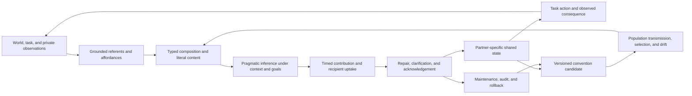

# Linguistics and communication science: primary-source audit

<!-- markdownlint-disable MD013 -->

**Date:** 2026-08-05  
**Scope:** compositionality, pragmatics, common ground, collaborative reference,
repair, turn-taking, signaling under uncertainty, compression and least effort,
language change, iterated learning, sensorimotor and referential grounding, and
multi-agent convention formation  
**Purpose:** identify which mechanisms from linguistics and communication
science could improve adaptive AI systems; separate human conversational facts
from formal or engineering analogues; and deduplicate every proposal against
[P-001](../principle-registry.md#p-001--selective-allocation),
[P-002](../principle-registry.md#p-002--local-autonomy-with-exception-escalation),
[P-003](../principle-registry.md#p-003--temporary-trace-before-commitment),
[P-004](../principle-registry.md#p-004--diversity-selection-and-protection),
[P-005](../principle-registry.md#p-005--use-dependent-topology),
[P-006](../principle-registry.md#p-006--homeostatic-negative-feedback),
[P-007](../principle-registry.md#p-007--prediction-error-allocation),
[P-008](../principle-registry.md#p-008--compartmentalized-interaction),
[P-009](../principle-registry.md#p-009--maintenance-plane),
[P-010](../principle-registry.md#p-010--structural-offloading-and-co-design),
[P-011](../principle-registry.md#p-011--transient-communication-coalitions),
[P-012](../principle-registry.md#p-012--memory-matched-to-information-lifetime),
and [P-013](../principle-registry.md#p-013--externalized-shared-state).

## Executive finding

There is no single scientific mechanism called “language” that can be lifted
into an AI architecture. Formal composition, pragmatic inference, common-ground
maintenance, repair, turn timing, channel coding, rate-distortion trade-offs,
social change, cultural transmission, perceptual grounding, and convention
formation solve different problems at different scales. Treating them as one
faculty hides their assumptions and produces anthropomorphic claims.

The strongest residual integration candidate is a **versioned, repairable
convention layer** for adaptive multi-agent systems:

> Agents may adapt local names or message forms inside a bounded task, but each
> contribution must preserve typed literal content, provenance, epistemic
> status, protocol version, intended referent or goal, acknowledgement state,
> and repair lineage. A convention becomes durable only after measured uptake,
> compatibility testing, explicit publication, and rollback preparation.

This candidate is not currently a fourteenth principle. Its parts reduce to
typed languages and schema registries, Bayesian or decision-theoretic
inference, acknowledgement/retry and error handling, version negotiation,
provenance, externalized shared state, runtime monitoring, cultural-evolution
models, and ordinary multi-agent learning. It remains worth testing because
the combination may let heterogeneous agents coordinate under vocabulary,
task, and population drift while retaining an auditable path back to explicit
meaning.

The candidate must lose by default to its strongest null: a fixed typed
protocol with schema registry, version negotiation, authenticated identities,
acknowledgement and retry, calibrated probabilistic inference, explicit
clarification requests, logging, and human-authored migration rules. Learned
conventions are useful only if, at equal bandwidth, latency, compute, storage,
interaction, and human-maintenance budget, they improve transfer or adaptation
without increasing silent semantic drift, false common ground, manipulation,
or rollback cost.

The primary literature also imposes several negative conclusions:

- compositionality supports systematic construction only relative to a grammar,
  lexicon, type system, and semantic interpretation; it does not supply truth,
  reference, context, or grounding;
- pragmatic inference is defeasible and prior-sensitive, not a typed guarantee,
  proof, or authority transfer;
- common ground can be asymmetric, mistaken, and partner-specific; a shared log
  supports coordination but does not prove mutual uptake;
- conversational repair is a general coordination resource, not an assurance
  case or safety authority by itself;
- turn-taking regularities are distributed timing practices, not evidence for a
  universal centralized scheduler;
- Shannon information measures uncertainty reduction under a channel model, not
  truth, reference, intention, or usefulness;
- a rate-distortion optimum is “semantic” only to the extent that its declared
  distortion or utility function captures the task and its harms;
- language change is path-dependent population behavior, not automatic
  optimization;
- iterated learning transmits outputs through learner and data bottlenecks; it
  is not endogenous curriculum or active exploration by the same learner;
- an emergent code can be task-effective while uninterpretable,
  non-compositional, brittle, exclusionary, or strategically deceptive.

## Evidence and inference boundary

| Evidence design | What it supports | What it cannot establish alone |
| --- | --- | --- |
| Formal grammar or semantic derivation | Consequences of declared syntax, types, interpretation rules, and model | Human universality, lexical grounding, empirical processing mechanism, or factual truth |
| Controlled reference or language game | Behavior and model fit in a bounded referential context | Open-domain conversation, adversarial robustness, or shared beliefs outside the task |
| Conversation corpus and sequential analysis | Recurrent organization of naturally occurring interaction in the sampled communities | A unique cognitive algorithm, universal timing constant, or optimal distributed protocol |
| Cross-linguistic corpus comparison | Shared and variable practices across sampled languages and settings | Exception-free biological universality across all languages, modalities, and institutions |
| Information-theoretic theorem | Capacity or compression limit under an explicit source, channel, and distortion model | Meaning, truth, incentive alignment, or adequacy of the chosen distortion function |
| Sociolinguistic field study | Association of variants with community, identity, interaction, and historical context | That change is efficient, globally coordinated, or causally explained by one social variable |
| Laboratory iterated-learning chain | Change under a specified learner, production rule, task, and transmission bottleneck | Natural-language evolution, fitness improvement, or stability in large heterogeneous populations |
| Agent-based naming game | Dynamics of a specified update rule and interaction graph | Human language, interpretability, fairness, truthfulness, or robustness outside the simulated regime |
| Human network experiment | Convention formation under the tested network, incentives, task, and population size | Safety, semantic adequacy, or durable consensus under turnover and strategic manipulation |
| Multi-agent machine-learning benchmark | Task reward, code properties, and transfer within the declared environment | Human-like semantics, compositionality from reward alone, or protocol safety after distribution shift |

“Established” below means that a formal result, empirical regularity, or native
mechanism is established within its evidence design. It does not mean an AI
analogue inherits an effect size, universality claim, or causal guarantee.

## Terms that must remain distinct

| Term | Operational meaning | Not equivalent to |
| --- | --- | --- |
| compositionality | Meaning of a complex expression is systematically related to the meanings of parts and their mode of combination | bag-of-features similarity, grammaticality, truth, or grounding |
| productivity | Ability to produce or understand expressions not encountered verbatim | correct systematic generalization or compositional representation |
| systematicity | Linked ability across structurally related expressions or tasks | surface recombination or memorized templates |
| literal content | Content licensed by a declared lexicon, grammar, schema, and context index | speaker intention, implicature, presupposition, or truth |
| pragmatic inference | Defeasible inference about an utterance in context, often using beliefs about alternatives and goals | proof, schema validation, permission, or authenticated authority |
| communicative intention | Intended effect or information transfer attributed to a sender | decoded bits, literal denotation, or actual downstream outcome |
| common ground | Information or commitments participants treat as mutually available for the current interaction | globally replicated database, identical private beliefs, or objectively true state |
| grounding in conversation | Evidence that a contribution was sufficiently understood for the participants' current purpose | sensorimotor grounding or permanent consensus |
| sensorimotor grounding | Relation of representations to perception, action, and environmental consequences | word co-occurrence or agreement between text-only agents |
| referential grounding | Coordination of a sign with a particular object, event, category, or action in context | full semantic understanding or causal knowledge |
| repair | Practices for locating and resolving trouble in speaking, hearing, reference, or understanding | generic retry alone, model retraining, punishment, or incident postmortem |
| turn-taking | Organization of who contributes when, including gaps, overlap, selection, and self-selection | fixed round-robin scheduling or a global clock |
| signal | Observable action or message whose distribution can affect an observer's belief or act | necessarily honest, linguistic, discrete, or meaningful to humans |
| Shannon information | Expected uncertainty reduction under a probability model | semantic content, value, novelty to a person, or truth |
| redundancy | Additional structure that can support prediction or error recovery | useless duplication in all contexts |
| compression | Fewer encoded bits or symbols relative to a source and code | better reasoning, lower total energy, or preserved task value |
| convention | Population regularity sustained by recurring coordination and expectations | standard mandated by authority, optimal code, or moral norm |
| language change | Change in variants and their social distribution over time | monotonic improvement or individual online learning |
| iterated learning | Repeated transmission through successive learners or generations | replay, self-distillation, curriculum selection, or active sensing |
| emergent communication | A signaling protocol learned through interaction or task reward | natural language, interpretability, compositionality, or alignment |

## Mechanisms operate at different scales



An AI design must say which edge it implements. A transformer generating a
string, a schema validator accepting a message, an agent inferring intent, a
database recording an acknowledgement, and a population converging on a label
are different mechanisms even when every artifact is called “language.”

## Shared mathematical boundary

### Composition is relative to an interpretation

A schematic function-application rule is

$$
\llbracket f(a) \rrbracket
=
\llbracket f \rrbracket\!\left(\llbracket a \rrbracket\right).
$$

$f$ is an expression interpreted as a function, $a$ is its argument,
$\llbracket \cdot \rrbracket$ maps expressions to semantic values, and the
outer application must be well typed. The equation has no physical units. It
does not define the lexicon, select a parse, resolve indexicals, determine the
world, or prove the resulting proposition true. Lambek's categorial calculus
formalized syntactic composition, while Montague gave model-theoretic tools for
compositional interpretation
([Lambek 1958](https://doi.org/10.1080/00029890.1958.11989160);
[Montague 1970](https://doi.org/10.1111/j.1755-2567.1970.tb00434.x)).

For AI, a typed abstract syntax tree or domain-specific language is the
strongest null. A learned composition mechanism must improve systematic
generalization or maintenance without hiding type errors inside embeddings.

### Pragmatic inference is a model, not a guarantee

A one-step Rational Speech Acts-style speaker can be written as

$$
S_1(u\mid m,c)
\propto
\exp\!\left\{
\alpha\left[\log L_0(m\mid u,c)-C(u)\right]
\right\},
$$

with listener

$$
L_1(m\mid u,c)
\propto
S_1(u\mid m,c)P(m\mid c).
$$

$m$ is a possible meaning or referent, $u$ an utterance, and $c$ context;
$L_0$ is a literal listener; $P(m\mid c)$ is a contextual prior; $C(u)$ is
utterance cost; and $\alpha\geq0$ controls sensitivity to utility. Probabilities
are dimensionless. If log probabilities are in nats, $C$ and the bracketed
utility must use the same dimensionless scale; $\alpha$ is then dimensionless.
The equations assume a candidate meaning space, lexicon, shared context model,
alternative utterances, and approximately cooperative or known sender utility.
Frank and Goodman tested a bounded referential game, not open-domain intention
recovery ([2012](https://doi.org/10.1126/science.1218633)). Gricean implicature
is likewise defeasible reasoning about cooperative use, not a protocol
guarantee ([Grice 1975](https://doi.org/10.1163/9789004368811_003)).

When sender and receiver preferences differ, more informative communication
need not be an equilibrium. Crawford and Sobel's strategic communication model
is a direct failure boundary for “assume cooperation”
([1982](https://doi.org/10.2307/1913390)).

### Common ground is local, uncertain, and evidenced by uptake

An idealized context-set update is

$$
G_{t+1}=G_t\cap\llbracket u_t\rrbracket
$$

only after the contribution $u_t$ has been accepted for the current purpose.
$G_t$ is a set of live worlds or hypotheses and has no physical units. Real
dialogue needs questions, commands, presuppositions, commitments, uncertainty,
speaker-specific beliefs, and revisions. A safer system stores local estimates
$q_i(G_t)$ for each participant $i$ plus the evidence for claimed uptake; it
does not pretend that all replicas or minds are identical.

Clark and Wilkes-Gibbs observed collaborative, iterative reference in a bounded
figure-arrangement task, and Brennan and Clark found partner-sensitive lexical
entrainment across three experiments
([1986](https://doi.org/10.1016/0010-0277(86)90010-7);
[1996](https://doi.org/10.1037/0278-7393.22.6.1482)). Clark and Brennan's
grounding framework explicitly ties grounding costs to communication media
([1991](https://doi.org/10.1037/10096-006)). These results motivate tracked
uptake and partner-specific state; they do not prove literal shared knowledge.

### Repair is a costed decision under uncertainty

A diagnostic policy, not a law of conversation, is

$$
P(e\mid h_t)L_e
>
C_{\mathrm{repair}}+C_{\mathrm{delay}},
$$

where $e$ is a consequential misunderstanding, $h_t$ is interaction history,
$L_e$ is loss if it remains uncorrected, $C_{\mathrm{repair}}$ is the cost of a
clarification or correction, and $C_{\mathrm{delay}}$ is delay cost. All three
cost terms must share a declared unit, such as expected euros, joules converted
by a stated exchange rate, or dimensionless task loss; $P(e\mid h_t)$ is
dimensionless. Different risk classes require different thresholds.

Conversation analysis describes organized opportunities for self- and
other-initiated repair, with an empirical preference for self-repair in the
studied English materials
([Schegloff, Jefferson, and Sacks 1977](https://doi.org/10.2307/413107)). A
cross-linguistic study found three broad types of other-initiated repair in a
sample of 12 languages from 8 families and reported an average occurrence of
about one repair initiation per 1.4 minutes
([Dingemanse et al. 2015](https://doi.org/10.1371/journal.pone.0136100)). That
sample supports a widespread interactional infrastructure; it does not license
an exception-free universal or a fixed AI repair frequency.

### Turn timing is measurable without becoming a universal scheduler

For adjacent turns, define

$$
g_t=t^{\mathrm{start}}_{t+1}-t^{\mathrm{end}}_t.
$$

$g_t$ is measured in milliseconds: positive values are gaps, negative values
are overlaps. A useful evaluation reports the distribution, tail latency,
collisions, abandoned contributions, interruptions, priority inversions, and
task outcome—not one mean gap. Sacks, Schegloff, and Jefferson described a
locally managed turn-allocation system
([1974](https://doi.org/10.2307/412243)). Stivers and colleagues compared
question responses in ten languages and found both shared pressure toward
prompt transition and substantial cultural variation
([2009](https://doi.org/10.1073/pnas.0903616106)). Neither result specifies a
single timing constant for text agents, asynchronous tools, or safety-critical
control.

### Shannon capacity does not contain semantics

For input $X$, output $Y$, and channel transition law $p(y\mid x)$, capacity is

$$
C=\max_{p(x)} I(X;Y)
$$

in bits per channel use when logarithms use base 2. At $r$ channel uses per
second, $rC$ is bits per second. Shannon's result concerns reliable coding under
a source/channel model; it does not decide whether decoded symbols are true,
properly grounded, useful, permitted, or interpreted as the sender intended
([Shannon 1948a](https://doi.org/10.1002/j.1538-7305.1948.tb01338.x);
[Shannon 1948b](https://doi.org/10.1002/j.1538-7305.1948.tb00917.x)).

A semantic proposal must therefore report both channel performance and task
loss. A learned language that sends fewer symbols but requires a giant decoder,
more repair, or costly shared pretraining may consume more total energy.

### Rate-distortion needs a declared distortion function

For source $X$, reconstruction $\widehat X$, and distortion $d$, the
rate-distortion function is

$$
R(D)=
\min_{p(\widehat{x}\mid x):\,
\mathbb{E}[d(X,\widehat X)]\leq D}
I(X;\widehat X).
$$

$R(D)$ is in bits per source symbol with base-2 logarithms. $D$ has the units
of the declared distortion function: squared kelvin, wrong-decision cost,
metres of localization error, or dimensionless task loss, for example.
Rate-distortion theory supplies a compression boundary only after this choice
([Berger 1971](https://openlibrary.org/works/OL11475393W/Rate_distortion_theory)).
If $d$ omits rare safety harms, provenance, calibration, or minority users, an
apparently efficient code optimizes the omission.

Surprisal of an observed token $w_t$ is

$$
I(w_t)=-\log_2 P(w_t\mid w_{<t})
$$

in bits. Levy related surprisal to incremental processing difficulty under
declared comprehension assumptions
([2008](https://doi.org/10.1016/j.cognition.2007.05.006)). This is evidence for
expectation-sensitive processing, not a proof that biological language or AI
should globally minimize surprisal.

### Iterated learning transmits priors and bottlenecks

A generic transition between language hypotheses is

$$
P(\ell_{t+1}\mid\ell_t)
=
\sum_d P(\ell_{t+1}\mid d)P(d\mid\ell_t),
$$

where $\ell_t$ is the convention or language used by generation $t$, $d$ is
the finite dataset it produces, and the next learner's inference and production
rules define the transition. Terms are dimensionless probabilities; $t$ counts
transmission generations, not necessarily biological generations. Under
posterior sampling assumptions, the stationary distribution can reflect the
learner prior rather than communicative fitness
([Griffiths and Kalish 2007](https://doi.org/10.1080/15326900701326576)).

Kirby, Cornish, and Smith showed increasing structure and learnability in
laboratory chains learning small artificial languages
([2008](https://doi.org/10.1073/pnas.0707835105)). Transmission can regularize
or collapse a code; it does not guarantee truth, expressivity, utility, or
retention of rare cases.

### Signaling equilibria depend on utilities and population process

For meaning $m$, signal $s$, receiver action $a$, sender policy $\sigma(s\mid
m)$, receiver policy $\rho(a\mid s)$, and channel $p(o\mid s)$, expected task
utility can be written

$$
U(\sigma,\rho)=
\sum_{m,s,o,a}
p(m)\sigma(s\mid m)p(o\mid s)\rho(a\mid o)u(m,a).
$$

All probability factors are dimensionless. $u(m,a)$ must have one declared
unit, such as task reward or expected monetary value; $U$ inherits it. High
$U$ does not imply that signals are human-interpretable, compositional, fair,
or truthful. Lewis analyzed convention as regularity in recurring coordination
problems ([1969](https://search.worldcat.org/title/47876)); naming-game models
and human network experiments show how shared labels can emerge, but only under
their update, network, payoff, and sampling assumptions
([Baronchelli et al. 2006](https://doi.org/10.1088/1742-5468/2006/06/P06014);
[Centola and Baronchelli 2015](https://doi.org/10.1073/pnas.1418838112)).

## Mechanism map and initial disposition

| Mechanism | Exact problem | Strongest statistical/engineering null | P mapping | Initial disposition |
| --- | --- | --- | --- | --- |
| Formal composition | Build meanings or commands systematically from reusable parts | typed AST, grammar, DSL, proof/type checker | P-008, P-010 | Established formal analogue |
| Pragmatic inference | Infer likely intent or referent from alternatives, priors, and goals | calibrated Bayesian/decision model plus explicit clarification | P-007, P-011 | Useful but defeasible |
| Common ground and conceptual pacts | Track what a dyad treats as mutually usable | session state, replicated log, acknowledgements, partner-scoped cache | P-011, P-012, P-013 | Shared-state analogue with epistemic warning |
| Conversational repair | Detect and resolve trouble before consequential commitment | validation error, NACK/retry, exception protocol, human escalation | P-002, P-003, P-006, P-009, P-011 | Strong engineering null |
| Turn-taking | Coordinate access to a limited interaction channel | queue, token passing, leases, scheduler, backpressure | P-002, P-011 | Timing discipline, not language core |
| Noisy and strategic signaling | Communicate under channel noise and possibly misaligned incentives | channel coding, authentication, mechanism design, robust inference | P-007, P-008, P-011 | Mostly established nulls |
| Least effort, prediction, and compression | Trade message cost against recoverability and task loss | source/channel coding, rate-distortion, caching, learned codec | P-001, P-007, P-010 | Ordinary information theory unless task semantics add value |
| Language change and social variation | Explain population-level spread, retention, and stratification of variants | diffusion/contagion, network dynamics, change management | P-004, P-012 | Path-dependent population process |
| Iterated learning | Analyze code change through repeated learner bottlenecks | Bayesian transmission chain, distillation, compression | P-004, P-012 | Not endogenous curriculum |
| Sensorimotor and referential grounding | Tie signs to perception, action, objects, and consequences | supervised alignment, external IDs, world models, active perception | P-007, P-010, P-013 | Already central to grounding chapter |
| Convention formation | Coordinate arbitrary mappings without central naming | schema negotiation, consensus, registry, leader election | P-004, P-011, P-013 | Existing multi-agent and distributed-systems analogue |
| Versioned repairable convention lifecycle | Adapt a protocol while preserving meaning, compatibility, and rollback | schema registry, semantic versioning, migrations, observability | P-003, P-009, P-012, P-013 | Residual integration candidate only |

## 1. Formal compositional syntax and semantics

**Evidence design.** Lambek supplied a formal calculus for sentence structure,
and Montague developed a model-theoretic treatment in which syntax and semantic
interpretation are systematically related
([Lambek 1958](https://doi.org/10.1080/00029890.1958.11989160);
[Montague 1970](https://doi.org/10.1111/j.1755-2567.1970.tb00434.x)). These are
formal constructions, not behavioral experiments or claims that one grammar is
the biological implementation of every human language. Modern emergent-
communication experiments sharpen the boundary: task generalization can occur
without measured compositionality, while compositional codes can be easier for
new learners to acquire
([Chaabouni et al. 2020](https://doi.org/10.18653/v1/2020.acl-main.407)).

**Exact problem.** Finite components must support an open set of well-formed
messages, queries, plans, or commands, including novel combinations. The system
must preserve which component contributes what, reject invalid combinations,
and expose ambiguity rather than relying only on whole-message resemblance.

**Information/authority path.** A tokenizer or parser maps an external form to
a structured expression; a grammar and type system license combinations; a
lexicon and context assign denotations; composition builds a candidate content;
validation checks domain constraints; only a separate authority layer permits
an action. Semantic interpretation must not silently confer execution rights.

**Timescale and units.** Parsing and type checking may take microseconds to
seconds per message; model interpretation may be more expensive. Grammar size
is measured in productions, types, or bytes; message size in tokens or bits;
latency in milliseconds; exact-denotation error in a dimensionless fraction.
No universal human-language timing transfers to these units.

**Resource cost.** Grammar engineering, lexical maintenance, parser states,
schema evolution, ambiguity resolution, test cases, proof search where used,
and bridges between symbolic structures and learned representations. A compact
surface syntax may shift cost into a large shared decoder or ontology.

**Assumptions.** Parts and modes of combination are identifiable; types capture
the task-relevant constraints; lexical meanings and context indices are
available; non-compositional idioms or exceptions have an explicit treatment;
the parser's grammar covers deployment inputs.

**Failure boundary.** Lexical ambiguity, idioms, ellipsis, context dependence,
presupposition, discourse update, ungrounded primitives, parser brittleness,
schema mismatch, adversarial strings, and a formally valid expression that is
false or unauthorized. Compositionality metrics based only on correlated
distances may disagree with functional systematicity.

**Strongest statistical/engineering null.** A typed domain-specific language or
abstract syntax tree with a standard parser, schema validator, proof/type
checker, explicit ontology, and property-based tests. A neural compositor must
beat this baseline on novel combinations, paraphrases, maintenance, and compute
while retaining inspectable failures.

**P mapping and disposition.** [P-008](../principle-registry.md#p-008--compartmentalized-interaction)
separates syntax, denotation, context, validation, and authority;
[P-010](../principle-registry.md#p-010--structural-offloading-and-co-design)
offloads constraints into types and schemas. No new principle. Composition is a
representation contract that can support the concept's
[system synthesis](../../concept/70-system-synthesis.md), not a substitute for
[sensorimotor grounding](../../concept/20-sensorimotor-grounding.md).

## 2. Pragmatic inference and communicative intention

**Evidence design.** Grice's analysis motivates defeasible inference from
cooperative use and alternatives, while Frank and Goodman's quantitative model
fit human judgments in a simple referential game
([Grice 1975](https://doi.org/10.1163/9789004368811_003);
[Frank and Goodman 2012](https://doi.org/10.1126/science.1218633)). The latter
is a deliberately narrow web-based behavioral task, not evidence that recursive
rational reasoning explains all pragmatic phenomena. Crawford and Sobel prove
that strategic information transmission changes with preference alignment
([1982](https://doi.org/10.2307/1913390)).

**Exact problem.** Literal messages are frequently underspecified. A receiver
must infer a relevant referent, goal, request, or implication from shared
context, plausible alternatives, source behavior, and downstream consequences,
while retaining the possibility that the inference is wrong or manipulated.

**Information/authority path.** Literal content, candidate interpretations,
context, sender identity, source incentives, prior probabilities, and costs feed
a probabilistic or decision model. It produces ranked hypotheses with
calibration and provenance. High-consequence ambiguity triggers a clarification
request or authority escalation; inferred intent never upgrades permission on
its own.

**Timescale and units.** Inference occurs per contribution over milliseconds to
seconds; beliefs and partner models may update over sessions. Probabilities and
entropy are dimensionless; utterance length is tokens or bits; response latency
is milliseconds; decision regret uses a declared task-cost unit.

**Resource cost.** Maintaining alternatives, context windows, partner models,
source-reliability estimates, recursive inference depth, calibration data, and
clarification interactions. Deeper recursion can add compute without improving
identifiability.

**Assumptions.** The interpretation space contains the relevant intent; priors
are approximately valid; source utilities are known or learnable; the sender is
sufficiently cooperative for the chosen model; context is not poisoned; and a
clarification channel exists when stakes require it.

**Failure boundary.** Deception, sarcasm, indirectness outside the model,
unknown incentives, base-rate shift, asymmetric context, collusion, ambiguous
authority, strategic ambiguity, and overconfident inference from a fluent
surface form. Recursive “theory of mind” can amplify a wrong shared prior.

**Strongest statistical/engineering null.** A literal typed protocol plus a
calibrated Bayesian classifier or decision rule over explicit alternatives and
a direct clarification action. Compare against ordinary retrieval of relevant
state, not only an unconditioned language model.

**P mapping and disposition.** [P-007](../principle-registry.md#p-007--prediction-error-allocation)
supports clarification where uncertainty changes a decision, and
[P-011](../principle-registry.md#p-011--transient-communication-coalitions)
scopes context and partner models to an interaction. This is a graded inference
layer, not assurance or authority. No new principle and no permission to claim
that pragmatic reasoning “understands” a user.

## 3. Common ground, collaborative reference, and conceptual pacts

**Evidence design.** Clark and Wilkes-Gibbs used a collaborative figure-
arrangement task to study iterative presentation, acceptance, and repair of
referring expressions
([1986](https://doi.org/10.1016/0010-0277(86)90010-7)). Brennan and Clark's
three experiments favored a historical, partner-sensitive account of lexical
entrainment over purely ahistorical salience or availability explanations
([1996](https://doi.org/10.1037/0278-7393.22.6.1482)). Clark and Brennan
analyzed how media properties change grounding costs
([1991](https://doi.org/10.1037/10096-006)). These results concern coordinated
use sufficient for a task, not direct access to mutually identical minds.

**Exact problem.** Repeatedly re-deriving every referent and assumption wastes
bandwidth, but presuming shared interpretation creates silent divergence. A
pair or team needs cheap evidence of what has been introduced, accepted,
rejected, superseded, or left unresolved for the current purpose.

**Information/authority path.** A contribution carries a session, sender,
referent, content, version, and evidence status. Recipients acknowledge,
question, or repair it. A partner-scoped state records the acknowledgement and
its evidence. Durable publication to team state requires an explicit threshold
and provenance. Read access to a log is not evidence that a participant read,
understood, or accepted its contents.

**Timescale and units.** Grounding can occur across adjacent turns in seconds,
conceptual pacts across minutes or a task session, and organizational terms
across months. Measure messages, acknowledgement latency in milliseconds,
repair count, referential success fraction, stale-version events, and bytes of
partner-specific state. No one lifetime should govern all entries.

**Resource cost.** Per-partner caches, acknowledgements, version vectors,
provenance, state reconciliation, invalidation, access control, and repair.
Compression through shared context saves bits only while the assumed context is
actually aligned.

**Assumptions.** Participants have stable identities; acknowledgements are
meaningful; the task supplies observable coordination success; scope and expiry
are recorded; partner-specific state is not generalized globally without
evidence.

**Failure boundary.** False acknowledgement, hidden disagreement, stale or
forked context, group churn, transitive assumptions (“A knows that B knows”),
privacy constraints, malicious poisoning, and compressed messages that become
unrecoverable after context drift. A database can be consistent while the
agents' interpretations differ.

**Strongest statistical/engineering null.** A session-scoped blackboard or
event log with explicit acknowledgements, version vectors, read receipts where
appropriate, schema validation, expiry, and reconciliation. This is a stronger
baseline than prompt-window sharing or assuming every agent has seen the same
text.

**P mapping and disposition.** [P-011](../principle-registry.md#p-011--transient-communication-coalitions)
scopes the interaction; [P-012](../principle-registry.md#p-012--memory-matched-to-information-lifetime)
sets retention and expiry; [P-013](../principle-registry.md#p-013--externalized-shared-state)
stores inspectable state. The novel warning is epistemic: externalized state is
support for common ground, never proof of it. No new principle.

## 4. Conversational repair and clarification

**Evidence design.** Schegloff, Jefferson, and Sacks analyzed repair practices
in naturally occurring conversation and described an organization favoring
self-correction over direct other-correction in their materials
([1977](https://doi.org/10.2307/413107)). Dingemanse and colleagues compared
other-initiated repair across a corpus sample spanning 12 languages and 8
families, finding broad functional similarities and language-specific forms
([2015](https://doi.org/10.1371/journal.pone.0136100)). Corpus regularities
identify practices and sequential positions; they do not reveal one neural
algorithm or prescribe their costs in an AI network.

**Exact problem.** Messages can be malformed, unheard, ambiguous, mistaken,
internally inconsistent, referentially unclear, or incompatible with receiver
state. Continuing can compound an error; repairing everything can create loops
and unacceptable latency. The mechanism must localize trouble and choose a
proportionate repair.

**Information/authority path.** Parsers, constraint checks, confidence and
consistency tests, task feedback, and recipient uncertainty create a trouble
signal. The receiver selects a repair type—open request, targeted question,
candidate understanding, rejection, or escalation. The original sender gets
the first opportunity to clarify where safe. Both original and repaired forms,
reason, confidence, and resolution are logged; irreversible action waits for
the required assurance.

**Timescale and units.** Inline repair takes milliseconds to seconds; deferred
correction may occur after a task or incident. Measure repair latency,
additional tokens or bits, compute joules, number of exchanges, wrong-
commitment rate, unresolved-loop rate, and tail task delay. A reported human
frequency is not an AI target.

**Resource cost.** Redundant checks, clarification turns, retained conversation
history, alternative parses, rollback, human review, and interruption of useful
work. Repair is valuable only against the expected loss it prevents.

**Assumptions.** Trouble is at least partially detectable; a usable repair
channel remains; sender identity and message lineage are preserved; agents can
admit uncertainty; and the sender is not rewarded for strategically creating
confusion.

**Failure boundary.** Confident shared error, repeated non-specific “what?”
loops, adversarial clarification flooding, late repair after irreversible
action, corrections that overwrite provenance, receiver deference to a wrong
sender, and social preferences that suppress necessary challenge. Repair may
make interaction smoother while leaving the underlying claim false.

**Strongest statistical/engineering null.** Parser/schema errors, negative
acknowledgements, checksums, retries, idempotency keys, exception handling,
confidence thresholds, explicit disambiguation UI, and human escalation. The
candidate must outperform these ordinary mechanisms, not a no-repair agent.

**P mapping and disposition.** [P-002](../principle-registry.md#p-002--local-autonomy-with-exception-escalation)
keeps routine fixes local and escalates exceptions;
[P-003](../principle-registry.md#p-003--temporary-trace-before-commitment)
prevents uncertain interpretations from becoming durable;
[P-006](../principle-registry.md#p-006--homeostatic-negative-feedback)
uses mismatch as corrective feedback; [P-009](../principle-registry.md#p-009--maintenance-plane)
and [P-011](../principle-registry.md#p-011--transient-communication-coalitions)
provide maintenance and interaction scope. This overlaps high-reliability
communication, but conversational repair alone supplies neither challenge
authority nor a safety case.

## 5. Turn-taking and temporal coordination

**Evidence design.** Sacks, Schegloff, and Jefferson proposed a descriptive
systematics for turn allocation in conversation from sequential analysis
([1974](https://doi.org/10.2307/412243)). Stivers and colleagues compared
question-response timing across ten languages, reporting shared organization
and cultural variation
([2009](https://doi.org/10.1073/pnas.0903616106)). The unit was human spoken
conversation. Text channels, tools, simultaneous sensors, and machine-speed
control have different propagation and processing constraints.

**Exact problem.** Multiple participants share limited channels and must avoid
destructive collision, excessive idle time, starvation, and missed urgent
interruptions without routing every contribution through one slow coordinator.

**Information/authority path.** Turn-completion cues, explicit selection,
self-selection, channel occupancy, task priority, deadlines, and interruption
policy feed a local access decision. The resulting contribution is still
subject to content validation and authority checks. A participant's ability to
take the floor is not permission to execute a task.

**Timescale and units.** Human turn transitions are measured in milliseconds;
API calls may span milliseconds to minutes; asynchronous work can span hours.
Report gap/overlap distributions, channel utilization, queue length, deadline
misses, collisions, cancellation latency, and priority inversion—not one target
gap.

**Resource cost.** Silence and waiting, collision recovery, scheduling state,
heartbeats, leases, token passing, interruption handling, and context switching.
Aggressive low-latency self-selection can increase collisions and wasted
compute.

**Assumptions.** Completion or preemption cues are observable; clocks and
identities are sufficiently reliable; participants respect the protocol; task
priorities are comparable; and recovery exists for lost holders or partitions.

**Failure boundary.** Overlap that corrupts state, starvation of low-status or
slow agents, dead agents holding a turn, network partitions, priority inversion,
interrupt storms, silent channels mistaken for consent, and synchronized agents
creating oscillation.

**Strongest statistical/engineering null.** A work queue, actor mailbox,
semaphore, lease, token ring, event loop, centralized scheduler, or backpressure
protocol selected to the workload. Learned turn-taking must beat these at equal
latency and reliability, especially in the tails.

**P mapping and disposition.** [P-002](../principle-registry.md#p-002--local-autonomy-with-exception-escalation)
supports local contributions with bounded interruption, and
[P-011](../principle-registry.md#p-011--transient-communication-coalitions)
defines temporary coordination. No new principle. Human conversational timing
is a source of test cases, not an argument against standard concurrency control.

## 6. Signaling under channel noise and incentive uncertainty

**Evidence design.** Shannon derived channel-coding limits under explicit
probabilistic assumptions
([1948a](https://doi.org/10.1002/j.1538-7305.1948.tb01338.x);
[1948b](https://doi.org/10.1002/j.1538-7305.1948.tb00917.x)). Lewis analyzed
conventions in recurring coordination problems
([1969](https://search.worldcat.org/title/47876)). Crawford and Sobel derived
strategic-information equilibria in a sender-receiver game with differing
preferences ([1982](https://doi.org/10.2307/1913390)). These bodies cannot be
collapsed: channel noise, equilibrium convention, and deception or selective
disclosure are different failure sources.

**Exact problem.** A receiver must recover useful task information despite
transmission noise, ambiguity, unknown source reliability, and potentially
misaligned sender incentives. More redundancy addresses corruption; it does
not make the sender truthful.

**Information/authority path.** Source content is encoded with identifiers,
error detection or correction, provenance, signature, and protocol version;
the channel produces observations; the receiver decodes, authenticates, and
estimates uncertainty; an incentive/source model informs belief; policy maps
belief to an action within existing authority.

**Timescale and units.** Channels are measured in bits per use or bits per
second, symbol/error rate, packet-loss fraction, latency in milliseconds, and
energy in joules per delivered useful bit. Strategic interaction additionally
uses task utility or monetary loss. These quantities must not be blended
without explicit exchange weights.

**Resource cost.** Redundant symbols, forward-error correction, retransmission,
authentication, key management, source reputation, adversarial testing,
alternative-channel checks, and delayed action while evidence accumulates.

**Assumptions.** A channel model is approximately valid; codes match it; source
identity is not trivially forged; utilities and adversary capabilities are
bounded enough to model; and the recipient can abstain or cross-check.

**Failure boundary.** Correlated burst errors, model mismatch, semantic
substitution after correct decoding, authenticated deception, collusion,
Goodharted reputation, steganographic side channels, and confident decoding of
a protocol version with changed meaning.

**Strongest statistical/engineering null.** Standard source/channel coding,
checksums or authenticated encryption, retransmission, Byzantine or robust
aggregation where appropriate, and mechanism design or adversarial Bayesian
inference. “Biological signaling” adds no value unless it beats these scoped
methods.

**P mapping and disposition.** [P-007](../principle-registry.md#p-007--prediction-error-allocation)
allocates verification when received evidence is surprising or decision-
relevant; [P-008](../principle-registry.md#p-008--compartmentalized-interaction)
separates channel, identity, semantics, and incentives; [P-011](../principle-registry.md#p-011--transient-communication-coalitions)
scopes coordination. No new principle. Correct bits, honest claims, valid
meanings, and authorized actions require separate tests.

## 7. Least effort, prediction, redundancy, and compression

**Evidence design.** Ferrer i Cancho and Solé showed that a stylized trade-off
between speaker and listener effort can generate scaling behavior in a formal
model ([2003](https://doi.org/10.1073/pnas.0335980100)). Piantadosi, Tily, and
Gibson found that information content in context predicts word length better
than frequency alone across their corpus analysis
([2011](https://doi.org/10.1073/pnas.1012551108)). Levy derived surprisal-based
predictions for incremental syntactic comprehension
([2008](https://doi.org/10.1016/j.cognition.2007.05.006)). These are models and
correlational/psycholinguistic evidence, not a universal engineering objective.

**Exact problem.** Communication should minimize costly transmission and
processing while preserving recoverability, uncertainty, provenance, and
task-relevant distinctions. Frequent or predictable content can be shortened,
but shared-context drift makes compressed forms brittle; redundancy can cost
bandwidth while protecting against noise and ambiguity.

**Information/authority path.** A source and context model estimate
predictability; a codec or message planner chooses length and redundancy under
a declared distortion or task loss; the receiver reconstructs and reports
uncertainty; high-risk or low-common-ground cases use more explicit forms;
authority remains in the typed payload, not inferred from brevity.

**Timescale and units.** Token prediction occurs per token; dictionary or code
adaptation may occur across sessions; convention compression can take many
interactions. Report source bits, transmitted bits, compression ratio,
reconstruction/task distortion in its native unit, decoder joules, latency,
repair bits, and storage for shared models.

**Resource cost.** Training and storing source models, codec negotiation,
encoding/decoding compute, redundancy, context synchronization, failure
recovery, and long-tail examples that resist compression. Token reduction is
not energy reduction unless total-system cost falls.

**Assumptions.** Source statistics are sufficiently stable; sender and receiver
share compatible models and code versions; distortion reflects consequential
task errors; rare harms are weighted; and recovery is available after model or
context divergence.

**Failure boundary.** Distribution shift, omitted tail loss, opaque learned
codes, decoder mismatch, common-ground overestimation, ambiguous short forms,
compression that removes provenance or uncertainty, and a smaller message that
requires more total compute or repair.

**Strongest statistical/engineering null.** Conventional entropy coding,
dictionary compression, delta encoding, caching, forward-error correction, and
rate-distortion or task-aware learned codecs with an explicit distortion
function. Natural-language brevity is evidence for trade-offs, not an
alternative to coding theory.

**P mapping and disposition.** [P-001](../principle-registry.md#p-001--selective-allocation)
spends bits and explicitness where consequences demand them;
[P-007](../principle-registry.md#p-007--prediction-error-allocation)
adds detail or repair under surprise; [P-010](../principle-registry.md#p-010--structural-offloading-and-co-design)
places stable structure in codecs, schemas, and caches. No new principle. Any
energy claim belongs in the concept's
[energy model](../../concept/80-energy-model.md) and must count both endpoints.

## 8. Language change and sociolinguistic variation

**Evidence design.** Labov's Martha's Vineyard field study related sound change
to local social meaning and community differentiation
([1963](https://doi.org/10.1080/00437956.1963.11659799)). Its importance is the
empirical coupling of linguistic variation with social history and identity,
not a claim that all changes have the same cause. Population and network studies
of conventions likewise show dependence on interaction structure
([Centola and Baronchelli 2015](https://doi.org/10.1073/pnas.1418838112)).

**Exact problem.** Meanings, forms, and usage distributions change as tasks,
populations, identities, incentives, technologies, and contact patterns change.
An adaptive system must distinguish useful innovation from drift, factional
splitting, manipulation, and incompatibility.

**Information/authority path.** Variant use is observed with speaker/agent,
task, community, time, outcome, and network context. Population analyses
estimate adoption and stratification. A candidate change is tested in a bounded
scope, published with version and migration path, and promoted only through an
authorized governance process. Prevalence does not itself confer correctness.

**Timescale and units.** Human change can span years or generations; machine
conventions can move in seconds to months. Measure adoption fraction, hazard or
transition rate per unit time, subgroup divergence, compatibility failures,
task utility, messages to convergence, and rollback time.

**Resource cost.** Longitudinal telemetry, subgroup analysis, duplicate
vocabularies during migration, compatibility shims, documentation, governance,
and preservation of low-frequency meanings. Uniformity can save translation
cost while suppressing useful local diversity.

**Assumptions.** Agents and interactions are sampled well enough to separate
change from measurement artifacts; identities and populations are defined;
outcome metrics are not controlled by the dominant group alone; the system can
retain multiple variants when one global form is unnecessary.

**Failure boundary.** Prestige or centrality masquerading as utility,
coordination on a harmful convention, minority exclusion, semantic drift hidden
by task reward, bot-driven cascades, irreversible collapse of expressive
distinctions, and change estimates confounded by population turnover.

**Strongest statistical/engineering null.** Standard schema and API change
management, canary releases, semantic versioning, compatibility tests,
diffusion/network models, and explicit governance. A learned population process
must beat controlled migrations on adaptability and maintenance without
creating silent forks.

**P mapping and disposition.** [P-004](../principle-registry.md#p-004--diversity-selection-and-protection)
supports parallel variants and evidence-based selection;
[P-012](../principle-registry.md#p-012--memory-matched-to-information-lifetime)
retains histories and deprecates obsolete forms on measured timescales. There
is no material [P-005](../principle-registry.md#p-005--use-dependent-topology)
mapping merely because a variant becomes frequent: P-005 requires the
interaction topology itself to strengthen and decay with use. No new principle.

## 9. Iterated learning and cultural transmission

**Evidence design.** Griffiths and Kalish derived properties of Bayesian
iterated-learning chains, including prior-dominated stationary behavior under
posterior sampling assumptions
([2007](https://doi.org/10.1080/15326900701326576)). Kirby, Cornish, and Smith
used diffusion chains of human learners and small artificial languages to show
that cultural transmission can increase structure and learnability
([2008](https://doi.org/10.1073/pnas.0707835105)). Small laboratory languages
and ideal Bayesian learners isolate mechanisms but do not reproduce the ecology
of natural languages.

**Exact problem.** A code, skill, or representation transmitted through finite
examples and changing learners can accumulate structure, lose distinctions, or
amplify inductive bias. The system needs to exploit useful regularization while
detecting cultural bottleneck loss and bias amplification.

**Information/authority path.** A producer samples demonstrations from its
current hypothesis and task experience; a successor learns from that finite
dataset plus its architecture/prior; standardized evaluation measures retained
meanings, transfer, bias, and utility; lineage records each generation. Only
validated artifacts enter production, and rare protected cases remain in an
external test/reference set.

**Timescale and units.** One generation is one train-produce-transfer cycle,
ranging from minutes to months in machines. Report examples per bottleneck,
bits per demonstration, compute joules or FLOPs, semantic coverage fraction,
chain length, intergenerational drift, task reward, and loss on protected tails.

**Resource cost.** Repeated training, evaluation across generations, lineage
storage, reference corpora, protected examples, population diversity, and
rollback. Transmission bottlenecks save data while risking irreversible loss.

**Assumptions.** The hypothesis space and learner bias are measurable enough to
interpret change; training datasets represent the production process; a task
utility separate from learnability exists; protected tests detect lost
distinctions; and multiple chains expose stochastic/path-dependent outcomes.

**Failure boundary.** Prior lock-in, recursive model collapse, loss of rare
meanings, bias amplification, convergence on a learnable but useless code,
teacher-student collusion, evaluation leakage, and treating successful
transmission as environmental grounding.

**Strongest statistical/engineering null.** Ordinary distillation or compression
with a fixed gold corpus, held-out regression suite, provenance, diversity
sampling, and explicit regularizers. An iterated chain must outperform direct
training at equal cumulative data and compute, not merely its final generation's
smaller local budget.

**P mapping and disposition.** [P-004](../principle-registry.md#p-004--diversity-selection-and-protection)
requires parallel chains and protected variants;
[P-012](../principle-registry.md#p-012--memory-matched-to-information-lifetime)
preserves generation lineage and rare reference cases. This is not endogenous
curriculum: the principal operation is transmission through successive
learners, not one learner actively generating experiences to close its own
uncertainty. No new principle.

## 10. Sensorimotor, referential, and social grounding

**Evidence design.** Harnad posed the symbol-grounding problem and sketched a
bottom-up relation from symbolic categories to non-symbolic representations
([1990](https://doi.org/10.1016/0167-2789(90)90087-6)); this is a conceptual
argument, not an empirical solution. Steels and Belpaeme used computational
models of agents coordinating perceptually grounded colour categories
([2005](https://doi.org/10.1017/S0140525X05000087)). Collaborative reference
experiments show partner coordination around particular objects
([Clark and Wilkes-Gibbs 1986](https://doi.org/10.1016/0010-0277(86)90010-7)).
These address complementary but non-identical kinds of grounding.

**Exact problem.** Internal symbols and messages must connect to externally
checkable objects, observations, affordances, actions, and consequences rather
than only to other symbols. Multiple agents must also determine when their
different sensors or category boundaries refer to “the same” task entity.

**Information/authority path.** Sensors and action outcomes update a world
model; referent candidates carry external IDs, spatial/temporal coordinates,
observation provenance, and uncertainty; interaction tests disambiguate them;
labels bind to these records within a task and version. Language proposes a
mapping; perception and action consequences test it. Action remains constrained
by policy and authority.

**Timescale and units.** Perceptual binding can take milliseconds to seconds;
category learning spans interactions; concept revision may span deployment.
Report sensor units, localization error in metres or pixels, temporal error in
seconds, interaction count, action-success fraction, transfer to novel
referents, compute joules, and label/referent calibration.

**Resource cost.** Sensors, simulation or embodiment, active experiments,
alignment across modalities, object persistence, spatial/temporal indexing,
uncertainty propagation, and recovery from sensor or actuator faults. External
IDs are cheap where an engineered registry already supplies them.

**Assumptions.** Sensors and actuators cover task-relevant distinctions;
environmental consequences are observable; object identity is sufficiently
stable; supervision or interaction is not systematically biased; and agents do
not share the same simulator artifact mistaken for reality.

**Failure boundary.** Text-only circular definition, spurious simulator cues,
sensor spoofing, label leakage, category boundaries that fail across agents,
action success due to shortcuts, common upstream calibration error, and
agreement on a label for the wrong entity.

**Strongest statistical/engineering null.** Supervised multimodal alignment,
entity registries, calibrated state estimation, object tracking, active
perception, causal intervention where available, and task-specific world
models. A language game must beat these or integrate with them, not claim that
agreement itself supplies grounding.

**P mapping and disposition.** [P-007](../principle-registry.md#p-007--prediction-error-allocation)
selects observations or actions that disambiguate a referent;
[P-010](../principle-registry.md#p-010--structural-offloading-and-co-design)
uses sensors, environment structure, and identifiers;
[P-013](../principle-registry.md#p-013--externalized-shared-state)
stores referent records. This is already addressed by the concept's
[sensorimotor grounding chapter](../../concept/20-sensorimotor-grounding.md).
No new principle.

## 11. Multi-agent convention formation and naming games

**Evidence design.** Baronchelli and colleagues analyzed an agent-based naming
game that reaches a shared vocabulary through local interactions and a sharp
population transition under its update rule
([2006](https://doi.org/10.1088/1742-5468/2006/06/P06014)). Centola and
Baronchelli experimentally studied human convention formation in web-based
networks and showed that population structure can change whether local or
global agreement develops
([2015](https://doi.org/10.1073/pnas.1418838112)). Kottur and colleagues found
that high-reward agent protocols in a bounded task were often neither
interpretable nor compositional without additional constraints
([2017](https://doi.org/10.18653/v1/D17-1321)). Chaabouni and colleagues later
separated compositionality, generalization, and transmissibility
([2020](https://doi.org/10.18653/v1/2020.acl-main.407)).

**Exact problem.** Agents without a shared name for recurring task states may
need to coordinate locally and adapt when population, task, or observations
change. Central registries can be slow or incomplete, but unconstrained
emergence can produce opaque, incompatible, or manipulable codes.

**Information/authority path.** Agents exchange candidate signals in a bounded
referential or coordination task; observable task outcomes update local
signal-meaning associations; population encounters spread or eliminate
variants; interpreters and compatibility tests evaluate candidates; an
authorized registry publishes only versions that meet semantic, safety, and
rollback criteria.

**Timescale and units.** Measure interactions or games to local and global
convergence, messages and bits per successful coordination, population size,
graph degree, task reward, referential error, cross-play success, newcomer
learning examples, compositional/systematicity metrics, and rollback time.

**Resource cost.** Exploration with failed coordination, parallel lexicons,
cross-play testing, interpreters, newcomer training, monitoring for drift,
registry publication, compatibility shims, and governance. Fast consensus can
lock in an arbitrary or harmful first mover.

**Assumptions.** Task feedback identifies useful coordination; populations mix
enough for the desired scope; incentives are sufficiently aligned; agents have
bounded identities and protocol access; and tests cover cross-play,
interpretability, minorities, and distribution shift.

**Failure boundary.** Private collusion, uninterpretable shorthand, reward
hacking, accidental homonyms, dialect fragmentation, newcomer exclusion,
prestige/centrality cascades, deceptive signals, catastrophic semantic drift,
and convergence that removes a needed distinction. Consensus is not truth.

**Strongest statistical/engineering null.** A schema registry with explicit
proposal, negotiation, leader or quorum decision, semantic versioning,
conformance tests, and migration. Emergence must show value when requirements
are unknown enough that central design cannot cheaply specify them.

**P mapping and disposition.** [P-004](../principle-registry.md#p-004--diversity-selection-and-protection)
keeps variants until cross-play evidence selects them;
[P-011](../principle-registry.md#p-011--transient-communication-coalitions)
supports local negotiation; [P-013](../principle-registry.md#p-013--externalized-shared-state)
publishes the durable mapping. A change in convention frequency is not P-005
unless use also rewires the interaction topology. No new principle.

## 12. Versioned, repairable convention lifecycle

**Evidence design.** This is a synthesis candidate rather than a mechanism
directly established by one study. It combines collaborative grounding and
repair evidence
([Clark and Wilkes-Gibbs 1986](https://doi.org/10.1016/0010-0277(86)90010-7);
[Dingemanse et al. 2015](https://doi.org/10.1371/journal.pone.0136100)), formal
composition, information/channel boundaries, cultural transmission, convention
dynamics, and the negative results from emergent communication. Each component
has support in its own domain; their joint AI advantage is untested.

**Exact problem.** A heterogeneous agent population must adapt vocabulary and
message structure under new tasks and local context without silently changing
meaning, losing compatibility, confusing acknowledgement with truth, or making
the learned code impossible for people and new agents to audit.

**Information/authority path.** Every message has an envelope containing
literal typed payload, sender and recipient scope, task/referent, protocol and
ontology versions, provenance, epistemic status, intended action class, and
expiry. A separate pragmatic layer proposes interpretations. Recipients
acknowledge or initiate repair. Candidate conventions remain session-local and
temporary. Cross-play, semantic, safety, and migration tests precede registry
publication; authorized maintainers promote, deprecate, or roll back versions.

**Timescale and units.** Message handling occurs in milliseconds to seconds;
local convention trials span interactions; promotion and deprecation span
release cycles. Report bits per envelope and payload, latency, compute joules,
repair count, false-common-ground rate, semantic regression rate, cross-version
success, newcomer sample complexity, human-audit minutes, and rollback time.

**Resource cost.** Envelope overhead, per-session and partner state, interpreters,
dual-version support, repair traffic, cross-play matrices, protected regression
sets, registry and provenance storage, human review, and rollback rehearsals.
The candidate is invalid as an efficiency mechanism if these costs exceed the
saved design or communication cost.

**Assumptions.** Typed literal content remains available; learned conventions
can be mapped to explicit testable semantics; identity and provenance are
reliable; tasks provide outcome feedback; a governance boundary can prevent
automatic global promotion; and old versions remain recoverable long enough for
rollback.

**Failure boundary.** Semantic change hidden behind the same version,
uninterpretable codes that cannot compile to a schema, acknowledgement spoofing,
repair loops, promotion by popularity alone, cross-version split brain,
collusive dialects, removal of protected meanings, registry compromise,
unbounded compatibility debt, and human reviewers unable to reconstruct why a
mapping was adopted.

**Strongest statistical/engineering null.** Fixed typed messages, OpenAPI or
Protocol Buffers-style schemas, a schema registry, semantic versioning,
capability negotiation, explicit acknowledgements, retries and error codes,
calibrated probabilistic interpretation, conformance tests, telemetry, and
human-written migrations. The adaptive layer must be compared to this complete
baseline.

**P mapping and disposition.** [P-003](../principle-registry.md#p-003--temporary-trace-before-commitment)
keeps candidate meanings provisional; [P-009](../principle-registry.md#p-009--maintenance-plane)
owns compatibility, testing, and rollback;
[P-012](../principle-registry.md#p-012--memory-matched-to-information-lifetime)
separates turn, session, release, and archive state; and
[P-013](../principle-registry.md#p-013--externalized-shared-state)
stores authoritative protocol records. This remains an integration candidate,
not a new principle, until it beats the complete engineering null.

## Applicability map for AI systems

| AI surface | Potential use | Required boundary | Immediate measurement |
| --- | --- | --- | --- |
| Tool-calling agent | Typed composition of plans and explicit repair of invalid calls | Parsed intent cannot grant tool authority; schema and policy remain decisive | exact-call validity, clarification rate, unauthorized-attempt rate, latency |
| Multi-agent research workflow | Partner-scoped common ground, turn coordination, and convention trials | Shared state must preserve provenance, version, and non-acknowledgement | false-common-ground rate, duplicate work, cross-agent retrieval, repair loops |
| Human-agent collaboration | Pragmatic interpretation plus targeted clarification | Inferred intent is displayed as uncertainty and never silently broadens scope | task success, regret, clarification burden, user correction rate |
| Embodied or sensor-rich agent | Referential labels tied to observations, actions, and consequences | External IDs and calibrated world state outrank verbal consensus | novel-referent success, counterfactual action, spoofing rate, transfer |
| Federated or heterogeneous agents | Local conventions compiled into explicit versioned schemas | No opaque global promotion; backward compatibility and rollback required | cross-play, newcomer samples, version splits, migration effort |
| Continual learner | Transmission chains as stress tests for bias and semantic loss | Protected rare cases and lineage survive each generation | intergenerational drift, tail retention, cumulative compute, rollback |
| Memory subsystem | Retain session pacts separately from durable ontology | A frequently reused name is not automatically factual memory | stale reference rate, expiry accuracy, provenance completeness |
| Sparse/routed architecture | Messages can recruit transient specialist coalitions | Routing score is not pragmatic understanding or common ground | route accuracy, communication bits, repair/escalation rate, energy |
| Safety and assurance layer | Explicit trouble signals, clarification, and graded evidence | Conversational smoothness cannot replace validation, challenge rights, or assurance case | wrong commitment, abstention calibration, escalation latency, audit reconstruction |
| Energy-constrained edge system | Context-sensitive compression and adaptive redundancy | Count encoder, decoder, synchronization, repair, and radio/compute cost | joules per successful task, tail distortion, repair bytes, model-storage energy |

The likely near-term value is architectural hygiene: keeping literal payload,
inferred intent, partner state, acknowledgement, evidence, and authority as
separate fields. The highest-risk misuse is to let fluent conversation collapse
those fields into one confidence score.

## Residual candidate: versioned, repairable conventions

### Minimal message and state contract

| Field | Meaning | Lifetime | Promotion rule |
| --- | --- | --- | --- |
| `message_id` and lineage | Immutable identity and links to quoted, repaired, or superseded messages | archive/audit | never reused |
| `sender`, `recipient_scope`, `session` | Identity and intended coalition | turn to session | authenticated, access-controlled |
| `literal_payload` and `schema_version` | Content licensed by the current typed protocol | release/version | conformance-tested |
| `referent_or_goal` | External entity, state, query, or task objective | task-defined | must include provenance or resolver |
| `epistemic_status` | observation, hypothesis, request, inference, decision, or correction | claim-defined | cannot be upgraded by syntax alone |
| `confidence` and calibration domain | Quantified uncertainty plus the population/regime where calibrated | claim/model version | calibration evidence required |
| `pragmatic_hypotheses` | Ranked intended meanings beyond literal content | turn/session | remain defeasible; clarify when consequential |
| `ack_state` | received, parsed, understood-enough, accepted-for-task, rejected, or unresolved | session/task | recipient-generated evidence only |
| `repair_lineage` | Trouble source, request type, proposed correction, resolver, outcome | session/archive | original preserved; no silent overwrite |
| `convention_candidate` | Local shorthand mapped to explicit semantics and scope | sandbox/session | cross-play, newcomer, regression, and safety gates |
| `protocol_status` | experimental, published, deprecated, withdrawn | release/archive | authorized maintenance-plane decision |
| `expiry_and_rollback` | When state expires and how to restore the last compatible version | field-specific | tested before promotion |

The contract deliberately repeats some information that a shared decoder could
infer. That redundancy is a safety and audit choice. Compression may omit it
only when the risk class permits reconstruction from an immutable referenced
record.

### Promotion gates

A local convention is eligible for publication only if all applicable gates
pass:

1. **Denotation:** independent interpreters recover the declared referent,
   query, action, or constraint on held-out examples.
2. **Systematic transfer:** novel combinations are tested separately from
   memorized messages; no compositionality proxy substitutes for task outcome.
3. **Cross-play:** agents not co-trained with the proposer, including an older
   release and a newcomer, communicate successfully.
4. **Ambiguity and repair:** corrupted, underspecified, and version-mismatched
   messages produce bounded clarification or safe rejection rather than silent
   commitment.
5. **Incentives:** adversarial and partially aligned senders cannot obtain
   authority merely by exploiting pragmatic expectations.
6. **Protected meanings:** low-frequency, safety-critical, and subgroup-specific
   distinctions remain expressible and correctly interpreted.
7. **Compatibility:** the candidate has explicit negotiation, migration, dual-
   read/write if required, and a tested rollback.
8. **Cost:** total message, compute, storage, repair, migration, and human-review
   cost improves the declared objective versus the complete fixed-protocol null.

### Cost reporting must remain a vector

Do not hide incomparable resources in one arbitrary “efficiency” score. Report

$$
\mathbf{c}=
\left(
B_{\mathrm{tx}},
T_{50},T_{99},
E_{\mathrm{enc}},E_{\mathrm{dec}},
N_{\mathrm{repair}},
S_{\mathrm{state}},
H_{\mathrm{review}}
\right),
$$

where $B_{\mathrm{tx}}$ is transmitted bits per completed task; $T_{50}$ and
$T_{99}$ are median and 99th-percentile latency in milliseconds;
$E_{\mathrm{enc}}$ and $E_{\mathrm{dec}}$ are encoder and decoder energy in
joules per completed task; $N_{\mathrm{repair}}$ is a count; $S_{\mathrm{state}}$
is retained bytes; and $H_{\mathrm{review}}$ is human review time in minutes.
A scalar objective may be added only with declared conversion weights and a
sensitivity analysis. Safety and semantic-regression constraints should remain
constraints, not cheap penalty terms.

## Equal-budget falsification tests

### Test A: compositional generalization

Create a domain with primitives, typed relations, nested composition, lexical
ambiguity, and held-out combinations. Compare:

1. sequence model trained end to end;
2. typed grammar or DSL;
3. neural-semantic parser into that DSL;
4. emergent multi-agent code;
5. the versioned repairable convention candidate.

Hold training examples, total optimizer FLOPs, parameter/storage budget, and
allowed clarification messages fixed. Report exact denotation, type errors,
novel-combination success, paraphrase robustness, adversarial ambiguity,
abstention calibration, message bits, total compute energy, and maintenance
effort for a schema change. **Falsification:** the candidate fails if the typed
DSL or semantic-parser null matches task transfer with less complexity, or if a
compositionality proxy improves without held-out task success.

### Test B: pragmatic reference under asymmetric context and incentives

Use referential scenes with controlled priors, distractors, hidden sender
observations, asymmetric histories, and cooperative, partially aligned, and
adversarial senders. Compare a literal listener, calibrated classifier,
explicit RSA-style model, prompted language model, direct clarification policy,
and the candidate. Hold messages, follow-up opportunities, and inference
compute fixed. Report referent accuracy, calibration, expected regret, deception
success, clarification count, and authority violations. **Falsification:** the
candidate fails if recursive pragmatics adds confidence without accuracy or if
explicit questions dominate at equal interaction cost.

### Test C: false common ground

Give agents asymmetric event histories, packet loss, delayed delivery, stale
schemas, private observations, misleading read receipts, and population churn.
Compare assumed shared prompt context, a replicated blackboard, an append-only
event log with acknowledgements and version vectors, and the candidate. Hold
storage, bandwidth, and synchronization frequency fixed. Report false-common-
ground commitments, duplicate or contradictory actions, convergence time,
state bytes, repair traffic, and recovery after partition. **Falsification:**
the candidate fails if conventional replicated state plus explicit
acknowledgements is equally accurate or if partner models amplify divergence.

### Test D: repair policy

Inject malformed, garbled, ambiguous, inconsistent, obsolete, and deceptively
phrased messages at controlled rates and severities. Compare no repair, retry,
schema error/NACK, confidence-threshold clarification, sender-first repair, and
the candidate. Match latency and message budgets, and separately test hard
real-time and deliberative regimes. Report task success, wrong commitments,
repair precision/recall, turns per resolution, loop rate, abandonment, tail
latency, and human escalations. **Falsification:** the candidate fails if it
creates loops, suppresses necessary other-correction, or cannot beat targeted
error codes and retries.

### Test E: turn-taking under variable latency and urgency

Run heterogeneous agents with variable compute and network delay, simultaneous
discoveries, deadline-sensitive messages, failures while holding a turn, and
urgent interrupts. Compare free-form chat, central priority queue, token or
lease, actor mailboxes, learned turn-taking, and the candidate. Hold worker
count, network capacity, and compute fixed. Report collisions, idle time,
throughput, deadline misses, starvation, priority inversion, cancellation
latency, task utility, and compute wasted on interrupted work. **Falsification:**
the candidate fails if standard scheduling dominates or if human-like timing
reduces system utility.

### Test F: compression and noisy-channel robustness

Vary channel error, bandwidth, source distribution, shared-prior drift, tail
event importance, and decoder mismatch. Compare raw typed messages, standard
compression plus forward-error correction, a learned task codec, emergent code,
and the candidate. Equalize transmitted bits or end-to-end energy in separate
runs. Report bit error, task distortion in native units, catastrophic-tail
error, calibration, encoder/decoder joules, repair bits, and state-sync cost.
**Falsification:** the candidate fails if standard coding dominates, if savings
vanish after decoder/repair cost, or if conclusions depend on a distortion
function that omits protected errors.

### Test G: iterated transmission and convention drift

Run many independent chains and interacting populations with controlled learner
bias, finite bottlenecks, agent turnover, task change, minority meanings, and
adversaries. Compare direct training from a fixed reference set, ordinary
distillation, Bayesian iterated learning, naming-game emergence, explicit
schema migration, and the candidate. Match cumulative examples and compute
across the entire chain. Report learnability, expressivity, rare-meaning
retention, intergenerational drift, cross-play, newcomer sample complexity,
subgroup compatibility, interpretability, rollback, and total cost.
**Falsification:** the candidate fails if it converges only by deleting hard
meanings, amplifies bias, or cannot outperform explicit migration.

### Test H: grounding versus external identifiers

Use novel objects and affordances across text-only reference, shared visual
scene, non-shared sensors, and embodied action. Compare text co-occurrence,
external entity IDs plus supervised alignment, calibrated world models, active
sensorimotor learning, emergent labels, and the candidate. Match labeled
examples, interactions, sensor access, and compute. Report novel-referent
success, category transfer, counterfactual action success, localization error,
sensor-spoofing robustness, shared-calibration failure, and human auditability.
**Falsification:** the candidate fails if verbal agreement is mistaken for
environmental grounding or if an entity registry and state estimator dominate.

### Test I: strategic adoption and language change

Vary network topology, status/centrality, incentives, coordinated manipulators,
population turnover, and task utility. Seed useful, neutral, ambiguous, and
harmful variants with identical surface frequency. Compare popularity-based
adoption, task-outcome selection, controlled standards governance, and the
candidate. Match observation and governance budgets. Report adoption curves,
utility, subgroup error, manipulation success, fragmentation, protected-
meaning survival, migration burden, and rollback time. **Falsification:** the
candidate fails if centrality or prestige dominates evidence, consensus locks
in a harmful form, or centralized change management is cheaper and safer.

## Failure conditions for the residual candidate

Reject or pause the versioned repairable convention layer if any of these occur:

- it cannot map a learned form to explicit, testable denotation or action
  constraints;
- task reward rises while cross-play, newcomer learning, interpretability, or
  protected meanings decline;
- acknowledgements are treated as truth, identical beliefs, or authorization;
- inferred intention can bypass literal schema, provenance, or access policy;
- channel correctness is reported as semantic or factual correctness;
- a rate-distortion claim lacks source distribution, distortion function,
  units, uncertainty, and tail analysis;
- repair loops or clarification flooding create unbounded latency or denial of
  service;
- a convention is promoted by frequency, centrality, or consensus without
  outcome and compatibility evidence;
- old agents cannot negotiate, interpret, or safely reject the new version;
- rollback cannot reconstruct the former mapping and the messages produced
  under it;
- total-system energy or human-maintenance cost is hidden while surface tokens
  decrease;
- the result is no better than a fixed schema registry, acknowledgement/retry,
  calibrated inference, and explicit migration at equal budget.

## Temporary claim ledger

| Claim ID | Status | Temporary claim | Principal support | What would change status | Affected chapters |
| --- | --- | --- | --- | --- | --- |
| LC-T01 | established | Formal composition can systematically relate structured expressions to interpretations under a declared grammar and semantics. | Lambek 1958; Montague 1970 | A proposed use still needs an empirical task and grounding evidence; “established” does not imply one universal grammar. | [system synthesis](../../concept/70-system-synthesis.md), [hardening](../../concept/60-hardening-and-factual-memory.md) |
| LC-T02 | plausible | Explicit compositional structure can improve transmission to new learners even when it is not necessary for within-population generalization. | Chaabouni et al. 2020 in bounded emergent-language experiments | Replication across tasks, architectures, heterogeneous agents, and equal-budget typed baselines. | [routing](../../concept/10-neurogenesis-and-routing.md), [system synthesis](../../concept/70-system-synthesis.md) |
| LC-T03 | established | Pragmatic interpretation depends on alternatives, priors, context, and assumptions about the sender. | Grice 1975; Frank and Goodman 2012; Crawford and Sobel 1982 | Generalization beyond bounded games and robustness to unknown/misaligned incentives remain empirical. | [grounding](../../concept/20-sensorimotor-grounding.md), [factual memory](../../concept/60-hardening-and-factual-memory.md) |
| LC-T04 | established | Collaborative reference and lexical entrainment can be partner- and history-sensitive. | Clark and Wilkes-Gibbs 1986; Brennan and Clark 1996 | Need workload-specific tests before implementing per-partner state in AI. | [memory](../../concept/40-memory-and-consolidation.md), [system synthesis](../../concept/70-system-synthesis.md) |
| LC-T05 | established | Conversation provides organized repair practices; other-initiated repair has broad cross-linguistic similarities in the audited sample. | Schegloff et al. 1977; Dingemanse et al. 2015 | Wider samples/modalities refine universality; AI value requires equal-budget comparison to ordinary error handling. | [hardening](../../concept/60-hardening-and-factual-memory.md), [system synthesis](../../concept/70-system-synthesis.md) |
| LC-T06 | plausible | Evidence-backed acknowledgement and partner-scoped state will reduce false-common-ground failures in multi-agent AI. | Collaborative-grounding literature plus distributed-state analogy | Prospective packet-loss/context-asymmetry experiments against replicated-log null. | [memory](../../concept/40-memory-and-consolidation.md), [system synthesis](../../concept/70-system-synthesis.md) |
| LC-T07 | established | Human turn transition is locally coordinated and exhibits both cross-linguistic commonalities and variation. | Sacks et al. 1974; Stivers et al. 2009 | No status transfer to machine scheduling without workload evidence. | [routing](../../concept/10-neurogenesis-and-routing.md), [sparse compute](../../concept/30-sparse-predictive-compute.md) |
| LC-T08 | established | Shannon capacity and rate-distortion limits are defined relative to source/channel/distortion models and do not supply truth or intention. | Shannon 1948; Berger 1971 | A semantic code must add and validate a task loss, grounding, and authority model. | [energy](../../concept/80-energy-model.md), [hardening](../../concept/60-hardening-and-factual-memory.md) |
| LC-T09 | plausible | Context-sensitive brevity reflects pressure to trade production cost against recoverability, not a fixed law of optimal message length. | Ferrer i Cancho and Solé 2003; Piantadosi et al. 2011; Levy 2008 | Causal and cross-domain tests with end-to-end energy, repair, and shift costs. | [energy](../../concept/80-energy-model.md), [sparse compute](../../concept/30-sparse-predictive-compute.md) |
| LC-T10 | established | Iterated learning can amplify learner bias and transmission bottlenecks; increased learnability need not mean increased task fitness. | Griffiths and Kalish 2007; Kirby et al. 2008 | Large heterogeneous populations and real tasks determine engineering value. | [memory](../../concept/40-memory-and-consolidation.md), [roadmap](../../concept/90-research-roadmap.md) |
| LC-T11 | established | Multi-agent task reward alone does not guarantee human-interpretable or compositional communication. | Kottur et al. 2017; Chaabouni et al. 2020 | New algorithms may improve results, but each needs direct interpretability/systematicity/cross-play evidence. | [system synthesis](../../concept/70-system-synthesis.md), [roadmap](../../concept/90-research-roadmap.md) |
| LC-T12 | plausible | Local convention adaptation can help under genuine requirement drift if candidates compile to explicit semantics and pass cross-play, compatibility, and rollback gates. | Convention and emergent-communication literature; synthesis in this audit | Equal-budget tests against complete schema-registry and migration baseline. | [system synthesis](../../concept/70-system-synthesis.md), [roadmap](../../concept/90-research-roadmap.md) |
| LC-T13 | speculative | A versioned repairable convention layer can improve heterogeneous-agent adaptation while reducing total design and communication cost. | No direct integrated demonstration | Prospective Tests A–I with preregistered thresholds, several tasks, adversaries, turnover, and total-system cost. | [system synthesis](../../concept/70-system-synthesis.md), [energy](../../concept/80-energy-model.md), [roadmap](../../concept/90-research-roadmap.md) |
| LC-T14 | disputed | Convergence, frequency, or communicative success is sufficient evidence that an emergent code is meaningful, truthful, or safe. | Rejected by conceptual distinctions and negative emergent-communication results | Would require independent grounding, semantic, incentive, safety, and cross-play evidence; success alone is insufficient by definition. | [thesis](../../concept/00-thesis-and-principles.md), [grounding](../../concept/20-sensorimotor-grounding.md), [hardening](../../concept/60-hardening-and-factual-memory.md) |

These IDs are audit-local temporary claims. Promotion into the shared evidence
ledger requires deduplication, primary-source verification, rationale, open
questions, and explicit owner review; this audit does not modify shared files.

## Bibliography (BibTeX)

The bibliography is audit-local so every cited primary or foundational source
is traceable without treating this audit as evidence by itself.

```bibtex
@article{lambek1958mathematics,
  author = {Lambek, Joachim},
  title = {The Mathematics of Sentence Structure},
  journal = {The American Mathematical Monthly},
  year = {1958},
  volume = {65},
  number = {3},
  pages = {154--170},
  doi = {10.1080/00029890.1958.11989160},
  url = {https://doi.org/10.1080/00029890.1958.11989160}
}

@article{montague1970universal,
  author = {Montague, Richard},
  title = {Universal Grammar},
  journal = {Theoria},
  year = {1970},
  volume = {36},
  number = {3},
  pages = {373--398},
  doi = {10.1111/j.1755-2567.1970.tb00434.x},
  url = {https://doi.org/10.1111/j.1755-2567.1970.tb00434.x}
}

@incollection{grice1975logic,
  author = {Grice, H. Paul},
  title = {Logic and Conversation},
  booktitle = {Syntax and Semantics, Volume 3: Speech Acts},
  editor = {Cole, Peter and Morgan, Jerry L.},
  publisher = {Academic Press},
  address = {New York},
  year = {1975},
  pages = {41--58},
  doi = {10.1163/9789004368811_003},
  note = {DOI resolves to the electronic edition},
  url = {https://doi.org/10.1163/9789004368811_003}
}

@article{frank2012predicting,
  author = {Frank, Michael C. and Goodman, Noah D.},
  title = {Predicting Pragmatic Reasoning in Language Games},
  journal = {Science},
  year = {2012},
  volume = {336},
  number = {6084},
  pages = {998},
  doi = {10.1126/science.1218633},
  url = {https://doi.org/10.1126/science.1218633}
}

@article{crawford1982strategic,
  author = {Crawford, Vincent P. and Sobel, Joel},
  title = {Strategic Information Transmission},
  journal = {Econometrica},
  year = {1982},
  volume = {50},
  number = {6},
  pages = {1431--1451},
  doi = {10.2307/1913390},
  url = {https://doi.org/10.2307/1913390}
}

@article{clark1986referring,
  author = {Clark, Herbert H. and Wilkes-Gibbs, Deanna},
  title = {Referring as a Collaborative Process},
  journal = {Cognition},
  year = {1986},
  volume = {22},
  number = {1},
  pages = {1--39},
  doi = {10.1016/0010-0277(86)90010-7},
  url = {https://doi.org/10.1016/0010-0277(86)90010-7}
}

@incollection{clark1991grounding,
  author = {Clark, Herbert H. and Brennan, Susan E.},
  title = {Grounding in Communication},
  booktitle = {Perspectives on Socially Shared Cognition},
  editor = {Resnick, Lauren B. and Levine, John M. and Teasley, Stephanie D.},
  publisher = {American Psychological Association},
  address = {Washington, DC},
  year = {1991},
  pages = {127--149},
  doi = {10.1037/10096-006},
  url = {https://doi.org/10.1037/10096-006}
}

@article{brennan1996conceptual,
  author = {Brennan, Susan E. and Clark, Herbert H.},
  title = {Conceptual Pacts and Lexical Choice in Conversation},
  journal = {Journal of Experimental Psychology: Learning, Memory, and Cognition},
  year = {1996},
  volume = {22},
  number = {6},
  pages = {1482--1493},
  doi = {10.1037/0278-7393.22.6.1482},
  url = {https://doi.org/10.1037/0278-7393.22.6.1482}
}

@article{schegloff1977preference,
  author = {Schegloff, Emanuel A. and Jefferson, Gail and Sacks, Harvey},
  title = {The Preference for Self-Correction in the Organization of Repair in Conversation},
  journal = {Language},
  year = {1977},
  volume = {53},
  number = {2},
  pages = {361--382},
  doi = {10.2307/413107},
  url = {https://doi.org/10.2307/413107}
}

@article{dingemanse2015universal,
  author = {Dingemanse, Mark and Roberts, Se{\'a}n G. and Baranova, Julija and Blythe, Joe and Drew, Paul and Floyd, Simeon and Gisladottir, Rosa S. and Kendrick, Kobin H. and Levinson, Stephen C. and Manrique, Elizabeth and Rossi, Giovanni and Enfield, N. J.},
  title = {Universal Principles in the Repair of Communication Problems},
  journal = {PLOS ONE},
  year = {2015},
  volume = {10},
  number = {9},
  pages = {e0136100},
  doi = {10.1371/journal.pone.0136100},
  url = {https://doi.org/10.1371/journal.pone.0136100}
}

@article{sacks1974simplest,
  author = {Sacks, Harvey and Schegloff, Emanuel A. and Jefferson, Gail},
  title = {A Simplest Systematics for the Organization of Turn-Taking for Conversation},
  journal = {Language},
  year = {1974},
  volume = {50},
  number = {4},
  pages = {696--735},
  doi = {10.2307/412243},
  url = {https://doi.org/10.2307/412243}
}

@article{stivers2009universals,
  author = {Stivers, Tanya and Enfield, N. J. and Brown, Penelope and Englert, Christina and Hayashi, Makoto and Heinemann, Trine and Hoymann, Gertie and Rossano, Federico and de Ruiter, Jan Peter and Yoon, Kyung-Eun and Levinson, Stephen C.},
  title = {Universals and Cultural Variation in Turn-Taking in Conversation},
  journal = {Proceedings of the National Academy of Sciences of the United States of America},
  year = {2009},
  volume = {106},
  number = {26},
  pages = {10587--10592},
  doi = {10.1073/pnas.0903616106},
  url = {https://doi.org/10.1073/pnas.0903616106}
}

@article{shannon1948mathematical1,
  author = {Shannon, Claude E.},
  title = {A Mathematical Theory of Communication},
  journal = {Bell System Technical Journal},
  year = {1948},
  volume = {27},
  number = {3},
  pages = {379--423},
  doi = {10.1002/j.1538-7305.1948.tb01338.x},
  url = {https://doi.org/10.1002/j.1538-7305.1948.tb01338.x}
}

@article{shannon1948mathematical2,
  author = {Shannon, Claude E.},
  title = {A Mathematical Theory of Communication},
  journal = {Bell System Technical Journal},
  year = {1948},
  volume = {27},
  number = {4},
  pages = {623--656},
  doi = {10.1002/j.1538-7305.1948.tb00917.x},
  url = {https://doi.org/10.1002/j.1538-7305.1948.tb00917.x}
}

@book{berger1971rate,
  author = {Berger, Toby},
  title = {Rate Distortion Theory: A Mathematical Basis for Data Compression},
  publisher = {Prentice-Hall},
  address = {Englewood Cliffs, NJ},
  year = {1971},
  isbn = {9780137531035},
  url = {https://openlibrary.org/works/OL11475393W/Rate_distortion_theory}
}

@article{ferrericancho2003least,
  author = {Ferrer i Cancho, Ramon and Sol{\'e}, Ricard V.},
  title = {Least Effort and the Origins of Scaling in Human Language},
  journal = {Proceedings of the National Academy of Sciences of the United States of America},
  year = {2003},
  volume = {100},
  number = {3},
  pages = {788--791},
  doi = {10.1073/pnas.0335980100},
  url = {https://doi.org/10.1073/pnas.0335980100}
}

@article{piantadosi2011word,
  author = {Piantadosi, Steven T. and Tily, Harry and Gibson, Edward},
  title = {Word Lengths Are Optimized for Efficient Communication},
  journal = {Proceedings of the National Academy of Sciences of the United States of America},
  year = {2011},
  volume = {108},
  number = {9},
  pages = {3526--3529},
  doi = {10.1073/pnas.1012551108},
  url = {https://doi.org/10.1073/pnas.1012551108}
}

@article{levy2008expectation,
  author = {Levy, Roger},
  title = {Expectation-Based Syntactic Comprehension},
  journal = {Cognition},
  year = {2008},
  volume = {106},
  number = {3},
  pages = {1126--1177},
  doi = {10.1016/j.cognition.2007.05.006},
  url = {https://doi.org/10.1016/j.cognition.2007.05.006}
}

@article{labov1963social,
  author = {Labov, William},
  title = {The Social Motivation of a Sound Change},
  journal = {Word},
  year = {1963},
  volume = {19},
  number = {3},
  pages = {273--309},
  doi = {10.1080/00437956.1963.11659799},
  url = {https://doi.org/10.1080/00437956.1963.11659799}
}

@article{griffiths2007language,
  author = {Griffiths, Thomas L. and Kalish, Michael L.},
  title = {Language Evolution by Iterated Learning With Bayesian Agents},
  journal = {Cognitive Science},
  year = {2007},
  volume = {31},
  number = {3},
  pages = {441--480},
  doi = {10.1080/15326900701326576},
  url = {https://doi.org/10.1080/15326900701326576}
}

@article{kirby2008cumulative,
  author = {Kirby, Simon and Cornish, Hannah and Smith, Kenny},
  title = {Cumulative Cultural Evolution in the Laboratory: An Experimental Approach to the Origins of Structure in Human Language},
  journal = {Proceedings of the National Academy of Sciences of the United States of America},
  year = {2008},
  volume = {105},
  number = {31},
  pages = {10681--10686},
  doi = {10.1073/pnas.0707835105},
  url = {https://doi.org/10.1073/pnas.0707835105}
}

@article{harnad1990symbol,
  author = {Harnad, Stevan},
  title = {The Symbol Grounding Problem},
  journal = {Physica D: Nonlinear Phenomena},
  year = {1990},
  volume = {42},
  number = {1--3},
  pages = {335--346},
  doi = {10.1016/0167-2789(90)90087-6},
  url = {https://doi.org/10.1016/0167-2789(90)90087-6}
}

@article{steels2005coordinating,
  author = {Steels, Luc and Belpaeme, Tony},
  title = {Coordinating Perceptually Grounded Categories through Language: A Case Study for Colour},
  journal = {Behavioral and Brain Sciences},
  year = {2005},
  volume = {28},
  number = {4},
  pages = {469--489},
  doi = {10.1017/S0140525X05000087},
  url = {https://doi.org/10.1017/S0140525X05000087}
}

@book{lewis1969convention,
  author = {Lewis, David K.},
  title = {Convention: A Philosophical Study},
  publisher = {Harvard University Press},
  address = {Cambridge, MA},
  year = {1969},
  pages = {213},
  lccn = {69012727},
  url = {https://search.worldcat.org/title/47876}
}

@article{baronchelli2006sharp,
  author = {Baronchelli, Andrea and Felici, Maddalena and Caglioti, Emanuele and Loreto, Vittorio and Steels, Luc},
  title = {Sharp Transition towards Shared Vocabularies in Multi-Agent Systems},
  journal = {Journal of Statistical Mechanics: Theory and Experiment},
  year = {2006},
  volume = {2006},
  number = {06},
  pages = {P06014},
  doi = {10.1088/1742-5468/2006/06/P06014},
  url = {https://doi.org/10.1088/1742-5468/2006/06/P06014}
}

@article{centola2015spontaneous,
  author = {Centola, Damon and Baronchelli, Andrea},
  title = {The Spontaneous Emergence of Conventions: An Experimental Study of Cultural Evolution},
  journal = {Proceedings of the National Academy of Sciences of the United States of America},
  year = {2015},
  volume = {112},
  number = {7},
  pages = {1989--1994},
  doi = {10.1073/pnas.1418838112},
  url = {https://doi.org/10.1073/pnas.1418838112}
}

@inproceedings{kottur2017natural,
  author = {Kottur, Satwik and Moura, Jos{\'e} M. F. and Lee, Stefan and Batra, Dhruv},
  title = {Natural Language Does Not Emerge `Naturally' in Multi-Agent Dialog},
  booktitle = {Proceedings of the 2017 Conference on Empirical Methods in Natural Language Processing},
  publisher = {Association for Computational Linguistics},
  address = {Copenhagen, Denmark},
  year = {2017},
  pages = {2962--2967},
  doi = {10.18653/v1/D17-1321},
  url = {https://aclanthology.org/D17-1321/}
}

@inproceedings{chaabouni2020compositionality,
  author = {Chaabouni, Rahma and Kharitonov, Eugene and Bouchacourt, Diane and Dupoux, Emmanuel and Baroni, Marco},
  title = {Compositionality and Generalization in Emergent Languages},
  booktitle = {Proceedings of the 58th Annual Meeting of the Association for Computational Linguistics},
  publisher = {Association for Computational Linguistics},
  address = {Online},
  year = {2020},
  pages = {4427--4442},
  doi = {10.18653/v1/2020.acl-main.407},
  url = {https://aclanthology.org/2020.acl-main.407/}
}
```

## Deduplication decision

Do not add “language,” “common ground,” “conversation,” “pragmatics,”
“compression,” “cultural evolution,” or “emergent communication” as principles.
Route the audited mechanisms as follows:

- typed composition and explicit representation boundaries to P-008 and P-010;
- clarification and exception handling to P-002, P-003, P-006, and P-009;
- partner-scoped interaction and timing to P-011;
- temporary and durable conversational state to P-012 and P-013;
- uncertainty-driven questions and disambiguating actions to P-007;
- bit, compute, and redundancy allocation to P-001, P-007, and ordinary
  information/rate-distortion theory;
- population variants and protected minority meanings to P-004;
- sensorimotor reference to the existing grounding concept and P-007/P-010;
- protocol lifecycle, compatibility, and rollback to the maintenance plane and
  established software/distributed-systems practice.

P-005 has no material mapping in this audit. Language use can correlate with
social network structure, and interaction structure can shape convention
dynamics, but frequency-dependent symbol association is not use-dependent
rewiring and decay of the system's interaction topology. A future design would
map to P-005 only if communication success directly strengthens particular
agent links, inactivity weakens them, and that topology change has independent
falsifiable value beyond routing, caching, and reputation.

Keep the versioned repairable convention layer as a temporary integration
candidate only. Its promotion requires a mechanism unavailable from the
complete fixed-protocol null, measured across asymmetric context, adversarial
incentives, agent turnover, distribution shift, protected meanings, and full
end-to-end cost. Nature's repeated solution here is not “use language”; it is
to coordinate under uncertainty with composable signals, predictive context,
redundancy, local uptake, repair, and socially transmitted conventions. In AI,
each of those must remain separable, typed, measured, and reversible.
