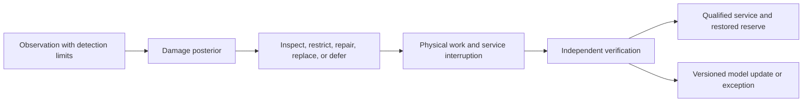

# Mechanical and civil engineering resilience: primary-source audit

**Audit date:** 2026-08-05

**Scope:** compliant mechanisms, passive stability and isolation, structural
health monitoring, graceful degradation, reserve capacity, fatigue and
fracture, redundancy and robustness, inspection and maintenance, and
transport-network vulnerability and recovery.

**Purpose:** determine whether these fields contribute architecture principles
not already represented in this project, while keeping passive physics distinct
from computation, monitoring distinct from repair, and structural or network
redundancy distinct from independent reserve.

**Status:** research audit. No claim or principle is promoted by this file.
Temporary claim IDs are local and must not be cited as project evidence without
separate ledger review.

**Primary deduplication targets:**
[P-001](../principle-registry.md#p-001--selective-allocation),
[P-002](../principle-registry.md#p-002--local-autonomy-with-exception-escalation),
[P-003](../principle-registry.md#p-003--temporary-trace-before-commitment),
[P-004](../principle-registry.md#p-004--diversity-selection-and-protection),
[P-005](../principle-registry.md#p-005--use-dependent-topology),
[P-006](../principle-registry.md#p-006--homeostatic-negative-feedback),
[P-007](../principle-registry.md#p-007--prediction-error-allocation),
[P-008](../principle-registry.md#p-008--compartmentalized-interaction),
[P-009](../principle-registry.md#p-009--maintenance-plane),
[P-010](../principle-registry.md#p-010--structural-offloading-and-co-design),
[P-011](../principle-registry.md#p-011--transient-communication-coalitions),
[P-012](../principle-registry.md#p-012--memory-matched-to-information-lifetime),
and [P-013](../principle-registry.md#p-013--externalized-shared-state).

This audit also deduplicates against Candidates 001–019 and the existing
[engineering](2026-08-05-engineering-analogues.md),
[adaptive-materials](2026-08-05-adaptive-materials-and-self-assembly.md),
[fault-tolerance](2026-08-05-fault-tolerance-and-reconstruction.md),
[power-grid](2026-08-05-power-grids-protection-and-recovery.md),
[aerospace and maritime](2026-08-05-aerospace-maritime-autonomy.md), and
[high-reliability-organization](2026-08-05-high-reliability-organizations-incident-learning.md)
audits.

## Executive finding

No new project principle survives deduplication. The audited fields supply
mature mechanisms, equations, standards, failure models, and baselines for
principles already present:

- compliant mechanisms and passive dynamics are direct P-010 structural
  offloading, with P-006 stability and P-012 path-dependent material state;
- structural health monitoring is a P-007/Candidate 014 observation problem
  whose output only becomes useful through P-009 inspection, maintenance, or
  repair;
- alternate load paths and structural redundancy instantiate P-004/P-008, but
  their benefit is conditional on load redistribution, residual capacity, and
  common-cause damage;
- graceful degradation and damage tolerance are service and intervention
  contracts already covered by Candidates 005, 009, 011, and 012;
- fatigue and fracture make cumulative physical history a long-lived state,
  reinforcing P-012 and the maintenance plane rather than creating a learning
  mechanism; and
- transport resilience is established network flow, traffic assignment,
  vulnerability, restoration, and maintenance planning, providing strong nulls
  for Candidates 001 and 013.

The strongest cross-domain lesson is not “build AI like a bridge.” It is:

> An asset may remain functional after damage only when the current damage
> state, residual load paths, redistributed demand, observation quality,
> remaining intervention window, degraded service, and repair or replacement
> action are jointly qualified.

This audit holds a **path-dependent residual-capacity contract** only as an
experimental schema. For each physical or logical asset it records the posterior
over damage, load history, observation method and detection limits, current and
post-contingency capacity, dependency/common-cause set, permitted degraded
service, inspection deadline, maintenance action, repair evidence, and reserve
restoration. That composition is not novel: it is already largely Candidate 009
plus Candidates 011, 012, and 014. It should be rejected if a conventional
structural-reliability and asset-management stack matches it.

Five claims are explicitly rejected:

1. **Passive physics is not free intelligence.** A spring, compliant linkage,
   isolator, or stable gait implements a physical input–state–output mapping;
   calling it computation adds nothing unless representation, task, accuracy,
   programmability, and lifecycle cost are defined.
2. **Monitoring is not healing.** Detecting, locating, classifying, or
   prognosing damage does not restore stiffness, strength, calibration, service,
   or reserve.
3. **Redundancy is not independence.** Multiple members or routes can share a
   hazard, foundation, sensor, maintenance process, bottleneck, or redistributed
   overload.
4. **Graceful degradation is not repair.** Remaining online with reduced or
   unsafe capability is not recovery; service must be reported as a vector.
5. **One resilience score is not a guarantee.** Any scalar depends on the
   selected service function, time horizon, users, hazards, and aggregation
   weights.

## Evidence and inference boundary

| Evidence type | Supports | Does not establish |
|---|---|---|
| mechanics theorem or constitutive model | behavior under declared geometry, material law, boundary conditions, load, and approximation | manufacturing fidelity, unmodeled failure modes, lifecycle reliability, or useful computation |
| coupon or component experiment | material or component response for the specimen, environment, loading protocol, and measurement system | structure-level performance, fleet reliability, or arbitrary spectra and defects |
| full-scale or field test | behavior of a particular structure and event sequence | all hazards, future deterioration, population rates, or independent causal effect of one feature |
| long-term monitoring record | variability, drift, anomalies, and damage signals in the observed asset | direct damage ground truth without inspection; automatic repair; transfer to another asset |
| probabilistic reliability model | conditional failure probability or decision under a stated prior, likelihood, load model, deterioration law, and consequence model | objective frequency when those inputs are wrong or nonstationary |
| optimization or simulation | best action within the encoded feasible set, demand, behavior, and objective | feasibility under omitted physics, human response, common-cause damage, or a universal resilience gain |
| regulation, code, or guidance | required or accepted engineering practice in its jurisdiction and applicability | proof that every compliant structure survives every event |
| post-event investigation | causal evidence about the investigated event and failure sequence | population incidence or the counterfactual effect of every proposed remedy |

Foundational papers in this audit include analytical, experimental, and
conceptual work. [Griffith 1921](https://doi.org/10.1098/rsta.1921.0006),
[Ford and Fulkerson 1956](https://doi.org/10.4153/CJM-1956-045-5), and
[Hasofer and Lind 1974](https://doi.org/10.1061/JMCEA3.0001848) provide formal
reference points. [Bruneau et al. 2003](https://doi.org/10.1193/1.1623497) and
[Baker, Schubert, and Faber 2008](https://doi.org/10.1016/j.strusafe.2006.11.004)
provide resilience and robustness frameworks, not portable effect sizes.

## Terms that must remain distinct

| Term | Operational meaning here | Must not be collapsed into |
|---|---|---|
| compliance | displacement or deformation under load; the inverse of stiffness in a declared direction for a linear system | standards conformance, softness in every direction, or robustness |
| compliant mechanism | mechanism obtaining some or all motion from elastic deformation | arbitrary morphing, passive stability, computation, or self-repair |
| passive element | responds using stored/dissipated energy and constitutive physics without a powered feedback controller | zero lifecycle energy, no design, no state, or universal stability |
| passive stability | return toward or bounded motion around a declared set under specified dynamics and disturbances without active feedback | performance outside that basin, task correctness, or graceful degradation |
| physical computation | deliberate use of physical dynamics to implement a declared input–output or state transformation for a task | every physical trajectory or energy dissipation event |
| structural health monitoring (SHM) | repeated or continuous sensing and inference about structural change or damage | nondestructive testing at one time, ground truth, prognosis, repair, or certification |
| damage detection | decide whether evidence is inconsistent with the reference state | localization, type, severity, remaining life, or root cause |
| prognosis | distribution over future damage or failure conditional on a model and observations | deterministic countdown or maintenance decision |
| reserve capacity | qualified capacity beyond current or postulated demand in a declared state and failure mode | unused nameplate capacity, redundancy, reliability, or resilience |
| redundancy | more than one component, load path, route, or means of performing a function | statistical independence or sufficient residual capacity after redistribution |
| robustness | limited disproportion between initiating damage and total consequence under a declared definition | reliability, resilience, or absence of damage |
| graceful degradation | retention of a declared lower service vector after damage or overload | restoration, repair, safety, or unchanged quality |
| damage tolerance | ability to sustain specified defects and loads until detection and corrective action under a validated inspection program | immunity to fracture or unlimited operation with damage |
| fatigue | damage or crack evolution under repeated/cyclic loading | generic aging, learning, or one-time overload |
| fracture toughness | resistance to crack extension under a stated mode, material state, geometry, rate, and environment | total component strength or fatigue life |
| maintenance | action intended to retain or restore required function | sensing alone, logging, model retraining, or incident description |
| network vulnerability | consequence conditional on a specified component or event loss and behavior model | event probability or resilience by itself |
| recovery | restoration of a declared service and, separately, readiness for the next event | reopening, local patching, or data collection alone |

## Mechanisms act at different stages


The diagram contains three boundaries that must remain explicit:

1. `P → S` is physics. It becomes an engineered computation claim only when a
   task-level input, output, accuracy, and comparison boundary are supplied.
2. `M → I` is observation and inference. It does not change the damaged state.
3. `A → V` is intervention and verification. Returning minimum service is
   distinct from restoring full capacity and next-event reserve.

## Shared mathematical boundary

### Compliance and strain energy have physical units

For a small-deformation linear elastic model,

$$
\mathbf{K}\mathbf{u}=\mathbf{f},
$$

where stiffness matrix $\mathbf{K}$ has entries in newtons per metre (N/m) when
$\mathbf{u}$ is displacement in metres (m) and $\mathbf{f}$ is force in newtons
(N). Directional compliance may be written

$$
C_f=\frac{\delta}{F}\quad\text{m/N},
$$

for displacement $\delta$ caused by scalar force $F$. The elastic strain energy
in this linear model is

$$
U=\frac{1}{2}\mathbf{f}^{\mathsf T}\mathbf{u}quad\text{J}.
$$

Large deformation, contact, plasticity, viscoelasticity, hysteresis, geometric
stiffening, and fracture invalidate or extend this simple model. Compliance in
the desired direction competes with stiffness against parasitic loads and with
stress/fatigue constraints. [Howell and Midha 1994](https://doi.org/10.1115/1.2919359)
made elastic energy storage and large-deflection nonlinearity explicit in a
pseudo-rigid-body design method; [Frecker et al. 1997](https://doi.org/10.1115/1.2826242)
formulated topology synthesis with simultaneous motion and load requirements.

For a cyclic mechanism, report mechanical efficiency only after defining ports:

$$
\eta_{\mathrm{mech}}=\frac{W_{\mathrm{useful,out}}}
{W_{\mathrm{drive,in}}},\qquad 0\le\eta_{\mathrm{mech}}\le1,
$$

where both works are joules over the same cycle and stored energy is accounted
consistently. Low joint friction does not imply zero input work, zero hysteresis,
or infinite fatigue life.

### Passive stability has an envelope and an energy source

A single-degree-of-freedom base-excited passive oscillator can be written

$$
m\ddot{x}+c\dot{x}+kx=-m\ddot{y},
$$

where $m$ is kilograms (kg), $x$ and base motion $y$ are metres (m), $c$ is
newton-seconds per metre (N·s/m), and $k$ is newtons per metre (N/m). Its
undamped natural angular frequency and damping ratio are

$$
\omega_n=\sqrt{\frac{k}{m}}\quad\text{rad/s},
\qquad
\zeta=\frac{c}{2\sqrt{km}}.
$$

The equations expose tuning: isolation or absorption over one frequency range
can amplify motion elsewhere, saturate displacement, or fail under changed mass,
stiffness, friction, temperature, or excitation. [Warburton 1982](https://doi.org/10.1002/eqe.4290100304)
derived optimum absorber parameters for specified excitation/response cases;
[Zayas, Low, and Mahin 1990](https://doi.org/10.1193/1.1585573) reported a
research and testing program for friction-pendulum isolation. Neither supports
“passive is always stable.”

For nonlinear dynamics $\dot{z}=f(z,d)$, a candidate Lyapunov function $V(z)$
has units chosen by the model—often joules for mechanical energy. A claim such as
$\dot V\le0$ is meaningful only on a declared state/disturbance set and does not
by itself prove convergence to the desired task state. Passive-dynamic walkers
demonstrate the boundary: [McGeer 1990](https://doi.org/10.1177/027836499000900206)
showed stable walking dynamics under restricted morphology, slope, and gait
conditions; [Collins et al. 2005](https://doi.org/10.1126/science.1107799)
combined passive-dynamic principles with actuation and simple control for
level-ground robots.

### Structural reliability needs a limit state and a probability model

For resistance $R(\mathbf X,t)$ and load effect $S(\mathbf X,t)$ in the same
unit—for example N, N·m, or Pa—define

$$
g(\mathbf X,t)=R(\mathbf X,t)-S(\mathbf X,t),
\qquad
P_f(t)=P\!\left[g(\mathbf X,t)\le0\right].
$$

$P_f$ is dimensionless and conditional on the joint distribution and model for
$\mathbf X$. When a normal-equivalent reliability index is used,

$$
\beta(t)=-\Phi^{-1}\!\left(P_f(t)\right),
$$

where $\Phi$ is the standard-normal cumulative distribution function and
$\beta$ is dimensionless. FORM approximations and fitted distributions must not
be reported as observed failure frequencies. [Hasofer and Lind 1974](https://doi.org/10.1061/JMCEA3.0001848)
provide a formal reliability-index lineage, not immunity to model error.

For an explicitly modeled damage state $d$ and demand case $q$, define the
audit-local residual-capacity ratio

$$
r_C(d,q)=\frac{C_{\mathrm{damaged}}(d,q)}
{C_{\mathrm{intact}}(q)},
$$

which is dimensionless. Capacity $C$ must name its unit and failure mode. A
structure may retain flexural capacity but lose stiffness, stability, fatigue
life, fire resistance, or serviceability. A positive ratio does not imply a safe
operating margin; compare damaged capacity to redistributed demand.

### Redundancy requires mechanics and dependence

For statistically independent parallel components with failure probabilities
$p_i$ under the same demand, idealized system failure is

$$
P_{f,\parallel}=\prod_{i=1}^{n}p_i.
$$

Physical structural and transport systems rarely satisfy this model after
damage. Loads and flows redistribute; elements share hazards, foundations,
materials, design assumptions, maintenance, and bottlenecks. For correlated or
state-dependent capacity, compute system failure from the joint model and actual
equilibrium/flow constraints.

[Frangopol and Curley 1987](https://doi.org/10.1061/(ASCE)0733-9445(1987)113:7(1533))
analytically connected damage and redundancy to structural system reliability
using truss and bridge examples. [Schafer and Bajpai 2005](https://doi.org/10.1016/j.engstruct.2005.05.012)
examined stability degradation and redundancy in damaged structures. These
support damage-scenario analysis, not a universal redundancy factor.

### SHM observes a confounded inverse problem

A useful observation model is

$$
\mathbf y_t=h(\mathbf d_t,\mathbf e_t,\mathbf o_t,\boldsymbol\theta_t)
+\boldsymbol\varepsilon_t,
$$

where $\mathbf y_t$ is sensor data with declared units, $\mathbf d_t$ is damage
state, $\mathbf e_t$ is environment, $\mathbf o_t$ is operational loading,
$\boldsymbol\theta_t$ is model/instrument state, and
$\boldsymbol\varepsilon_t$ is measurement error. The decomposition is often not
identifiable from $\mathbf y_t$ alone.

For a simple mode dominated by stiffness $k_i$ and mass $m_i$,

$$
f_i\approx\frac{1}{2\pi}\sqrt{\frac{k_i}{m_i}}\quad\text{Hz}.
$$

A frequency shift may therefore arise from damage, temperature-dependent
stiffness, boundary conditions, added mass, moisture, traffic, sensor drift, or
identification error. In a one-year Z24 bridge record,
[Peeters and De Roeck 2001](https://doi.org/10.1002/1096-9845(200102)30:2%3C149::AID-EQE1%3E3.0.CO;2-Z)
directly studied environmental effects versus staged damage events.
[Cawley and Adams 1979](https://doi.org/10.1243/03093247V142049) demonstrated
frequency-based defect inference on plate specimens; the asset, defect family,
finite-element model, and measurement assumptions bound that result.

An inspection or sensor updates rather than repairs the state:

$$
p(\mathbf d_t\mid\mathbf y_{1:t})
\propto p(\mathbf y_t\mid\mathbf d_t,\mathbf e_t,\mathbf o_t,
\boldsymbol\theta_t)\,p(\mathbf d_t\mid\mathbf y_{1:t-1}).
$$

Detection probability, false-alarm probability, localization error, severity
error, and prognostic calibration must be reported separately. The “fundamental
axioms” paper by [Worden et al. 2007](https://doi.org/10.1098/rspa.2007.1834)
is a field synthesis and conceptual reference, not one controlled experiment.

### Fatigue and fracture preserve path-dependent physical history

The Palmgren–Miner linear damage rule is

$$
D_M=\sum_{i=1}^{k}\frac{n_i}{N_i},
$$

where $n_i$ is applied cycles at stress-spectrum bin $i$, $N_i$ is constant-
amplitude cycles to failure for that bin, and $D_M$ is dimensionless. Failure
near $D_M=1$ is a model prediction, not a material invariant.
[Miner 1945](https://doi.org/10.1115/1.4009458) presented experimental analysis
for an aluminium alloy. Sequence, mean stress, overload retardation, spectrum,
environment, multiaxiality, manufacturing defects, and scatter limit transfer;
[Fatemi and Yang 1998](https://doi.org/10.1016/S0142-1123(97)00081-9) review the
large family of competing accumulation models.

For mode-I linear elastic fracture mechanics,

$$
K_I=Y\sigma\sqrt{\pi a},
$$

where $Y$ is dimensionless geometry factor, stress $\sigma$ is pascals (Pa),
crack size $a$ is metres (m), and $K_I$ is Pa$\sqrt{\text{m}}$. Fracture is
predicted when $K_I$ reaches an appropriately measured toughness $K_{IC}$ under
the model's geometry, thickness, loading-rate, temperature, and material-state
conditions. Griffith's energy argument used energy release per new crack area
([Griffith 1921](https://doi.org/10.1098/rsta.1921.0006)); it does not make one
toughness number universal.

In a mid-range fatigue-crack-growth regime, the Paris–Erdogan relation is

$$
\frac{da}{dN}=C(\Delta K)^m,
$$

where $da/dN$ is metres per cycle, $\Delta K$ is Pa$\sqrt{\text{m}}$, $m$ is
dimensionless, and $C$ has units
$\text{m/cycle}/(\text{Pa}\sqrt{\text{m}})^m$.
[Paris and Erdogan 1963](https://doi.org/10.1115/1.3656900) explicitly cautioned
against validating mutually contradictory propagation laws with small data
sets. Threshold behavior, near-instability growth, crack closure, overloads,
environment, and variable amplitude require other models or corrections.

For a detectable crack size $a_{\mathrm{det}}$ and critical modeled size
$a_{\mathrm{crit}}$, an idealized inspection window is

$$
N_{\mathrm{window}}=
\int_{a_{\mathrm{det}}}^{a_{\mathrm{crit}}}
\frac{da}{C[\Delta K(a)]^m}\quad\text{cycles}.
$$

Inspection intervals must additionally incorporate detection probability,
uncertain initial flaws and growth, multiple-site damage, missed inspections,
load spectra, residual-strength tests, and repair. Active FAA guidance
[AC 25.571-1D](https://www.faa.gov/regulations_policies/advisory_circulars/index.cfm/go/document.information/documentid/865446)
is a mature damage-tolerance null tying analysis/test evidence, detectability,
residual strength, inspection, and structural maintenance together.

### Resilience is a service trajectory, not one natural scalar

Let $\mathbf q(t)$ be a service vector whose components retain their own units,
for example load capacity in N, throughput in vehicles/hour, accessible demand
in passenger-trips/hour, maximum travel time in seconds, and safety loss in
expected casualties. Report the vector before scalarization.

If a study deliberately chooses one scalar service $Q(t)$ with unit $u_Q$, a
resilience-loss area can be reported as

$$
L_Q=\int_{t_0}^{t_1}[Q_0(t)-Q(t)]_+\,dt,
$$

with unit $u_Q\cdot\text{s}$. $Q_0(t)$ is a declared counterfactual baseline,
not necessarily pre-event service. A normalized area is dimensionless only when
the denominator and horizon are explicit. [Bruneau et al. 2003](https://doi.org/10.1193/1.1623497)
motivated performance-trajectory and recovery concepts for seismic community
resilience; its framework does not choose the morally or operationally correct
service aggregation for every system.

### Transport-network capacity and vulnerability depend on behavior

For a directed graph with fixed link capacities $c_e$ in vehicles/hour or
items/second, [Ford and Fulkerson 1956](https://doi.org/10.4153/CJM-1956-045-5)
established the max-flow/min-cut relation

$$
F^*=\min_{\mathcal C}\sum_{e\in\mathcal C}c_e,
$$

where $F^*$ has the same flow unit and $\mathcal C$ ranges over source–sink cuts.
This is not by itself a traffic-resilience model: travel time depends on flow,
demand is distributed, travelers reroute, queues evolve, modes interact, and a
damaged bridge may carry reduced rather than binary capacity.

For network $G$, link $e$, and a declared generalized travel-cost functional
$J$ in person-hours, euros, or another stated unit, conditional link impact is

$$
\Delta J_e=J(G\setminus e;\,D,B)-J(G;\,D,B),
$$

where $D$ is demand and $B$ is the behavioral/assignment model. [Jenelius,
Petersen, and Mattsson 2006](https://doi.org/10.1016/j.tra.2005.11.003) derived
importance and exposure measures from increased generalized cost under road
closures in a Swedish case study; those are conditional consequences, not event
probabilities. [Nicholson and Du 1997](https://doi.org/10.1016/S0191-2615(96)00022-7)
modeled a degradable multi-mode transportation system with equilibrium behavior.

More links need not improve selfish-routing performance. Braess's analytical
counterexample shows that adding a link can worsen user-equilibrium travel cost
([Braess, Nagurney, and Wakolbinger 2005](https://doi.org/10.1287/trsc.1050.0127)).
Thus topological degree, spare lane-kilometres, and edge-disjoint paths are not
sufficient resilience measures.

## Mechanism map and initial disposition

| ID | Mechanism | Information or energy path | Strongest mature null | Initial disposition |
|---|---|---|---|---|
| MCR-01 | compliant mechanism | load → elastic deformation → constrained motion/force → elastic return or dissipation | rigid linkage plus spring; flexure design; nonlinear finite elements; topology optimization | established P-010/P-012 physical implementation |
| MCR-02 | passive dynamic response | disturbance → inertia/stiffness/damping/contact → bounded or attractive motion | spring–damper, tuned mass absorber, base isolation, passive-dynamic mechanism | established P-006/P-010 null |
| MCR-03 | active or semiactive structural control | sensor → estimator/controller → powered or adjustable force/damping | robust control, LQG, $H_\infty$, MPC, active mass damper, semiactive damper | established feedback/control family |
| MCR-04 | structural health monitoring | structural response → sensor/instrument → feature/model → damage evidence | scheduled NDT, physics residual, environmental normalization, Bayesian diagnosis | P-007 + Candidate 014 observation stack |
| MCR-05 | damage-tolerant inspection window | assumed flaw + load spectrum → crack growth → detectable state → inspection/repair before critical size | fracture mechanics, probability-of-detection curve, full-scale fatigue test, scheduled inspection | established P-009/Candidate 009 assurance null |
| MCR-06 | structural redundancy and alternate load path | local damage → equilibrium redistribution → residual system capacity | system reliability, nonlinear alternate-path analysis, progressive-collapse test | P-004/P-008; no independence guarantee |
| MCR-07 | reserve capacity | current/damaged capacity distribution minus postulated redistributed demand | safety/reliability factors, residual strength and pushdown analyses, contingency set | Candidate 012 headroom variable |
| MCR-08 | graceful degradation | fault/damage → isolate/unload/reconfigure → lower service vector | fail-safe state, load shedding, capacity restriction, alternate routing | Candidate 005/009/012 evaluation contract |
| MCR-09 | fracture and fatigue memory | load spectrum + crack/material state → cumulative irreversible change | Miner/rainflow, fracture mechanics, Paris-type growth, probabilistic damage tolerance | P-012 physical history + P-009 maintenance |
| MCR-10 | inspection and maintenance | uncertain condition → test → posterior/decision → repair/replace → verification | scheduled preventive, condition-based, reliability-centered, POMDP/VOI and life-cycle optimization | P-001/P-009/Candidate 011 |
| MCR-11 | transport-network vulnerability | component loss/capacity reduction → rerouting/queues/assignment → user and service consequences | max-flow/min-cut, user equilibrium, system optimum, dynamic assignment, network interdiction | Candidate 001/013 null family |
| MCR-12 | transport restoration | damaged network + crews/materials/dependencies → prioritized repair and reopening → reserve restoration | project scheduling, network-level bridge management, stochastic restoration optimization | P-009/Candidate 011 |
| MCR-13 | path-dependent residual-capacity contract | load history + monitored damage + topology + demand + repair evidence → qualified service envelope | structural reliability plus asset-management digital record | hold as audit-local composite only |

## 1. Compliant mechanisms: motion through deformation

### Exact problem and physical mechanism

Rigid-link mechanisms concentrate relative motion in bearings, hinges, gears,
and sliding contacts. A compliant mechanism distributes some or all motion
through elastic deformation. This can reduce part count, assembly, lubrication,
backlash, and contact wear in a suitable design, while storing elastic energy.
It also introduces coupled stiffness, parasitic motion, geometric nonlinearity,
stress concentration, creep, hysteresis, limited stroke, and fatigue.

[Howell and Midha 1994](https://doi.org/10.1115/1.2919359) developed a
pseudo-rigid-body method for mechanisms with short flexural pivots, explicitly
accounting for energy storage and large deflection. [Howell and Midha 1996](https://doi.org/10.1115/1.2826842)
extended the representation to loop-closure analysis and synthesis.
[Frecker et al. 1997](https://doi.org/10.1115/1.2826242) used multicriteria
topology optimization because required motion and resistance to applied load
conflict. These are design and analytical demonstrations, not fleet-level
reliability estimates.

### Passive physics versus computation

A compliant structure always transforms force and displacement according to
its geometry, material law, boundary conditions, and state. That transformation
is **passive physics**. It is useful to call it physical computation only when
the system declares:

- an input encoding and its physical units;
- an output/readout and its units;
- a task and loss function;
- an operating envelope and reset/initialization procedure;
- accuracy, precision, bandwidth, and drift;
- fabrication, drive, conversion, readout, calibration, and maintenance costs;
  and
- a digital, analog, or mechanical baseline implementing the same mapping.

A flexure that guides a gripper jaw is not learning. Fatigue or plastic
deformation that changes its transfer function is damage unless a supervised
update mechanism, objective, validation, and rollback are demonstrated.

### AI translation and efficiency mechanism

The legitimate translation is P-010: co-design geometry and control so local
mechanics filter disturbance, guide motion, store/return energy, or cap force
before sensor conversion and central inference. This can save sensing,
communication, active-control bandwidth, and actuation energy when a stable
physical mapping is invoked frequently. It can be the substrate in
[Candidate 006](../../experiments/candidates/006-reversible-physical-skill.md)
only if the mapping is rewritable or replaceable, monitored, versioned, and
beats a fixed passive device plus digital supervisor over its lifecycle.

### Evidence status and assumptions

**Established mechanism; application-specific efficiency.** The transfer
function must remain accurate over load, temperature, rate, humidity,
manufacturing tolerance, material aging, damage, and cycle count. Low part count
does not remove validation or inspection. Stress-constrained flexure design is
an established engineering problem; for example, [Liu, Zhang, and Fatikow 2017](https://doi.org/10.1177/0954406216671346)
explicitly treats stress concentration because it limits motion and fatigue
life.

### Failure modes and predictions

- off-axis load produces parasitic motion or buckling;
- a topology-optimized hinge contains an unmanufacturable thin region or severe
  stress concentration;
- elastic range is exceeded, leaving plastic set and changed calibration;
- viscoelastic creep or temperature changes the mapping;
- cyclic strain consumes fatigue life while output initially appears normal;
- monolithic construction creates a single replacement or common-cause unit;
- a mechanical stop prevents one overload but transfers shock elsewhere;
- sensing/readout energy exceeds the saved digital computation;
- task drift makes the fabricated mapping obsolete.

At equal task envelope and lifetime, a compliant implementation must reduce
total energy, mass, parts, calibration, or response latency without worse tail
error, fatigue failure, repair time, or safety than a rigid linkage with spring,
a conventional flexure, a passive filter, an analog controller, and the smallest
digital supervisor. Otherwise it is an ordinary mechanism, not an AI principle.

## 2. Passive stability, vibration attenuation, and isolation

### Exact problem and physical mechanism

Passive stabilizers shape inertia, stiffness, damping, geometry, friction, and
contact so disturbances are rejected, dissipated, isolated, or redirected
without powered feedback. Examples include a spring–damper, tuned mass absorber,
base isolator, mechanical governor, passive-dynamic gait, fuse, buckling
restraint, and compliant force limiter. Each obtains its behavior from an energy
landscape and dissipation law chosen at design time.

The [friction-pendulum work of Zayas, Low, and Mahin 1990](https://doi.org/10.1193/1.1585573)
combined pendular restoring behavior with frictional dissipation and reported
testing. [Warburton 1982](https://doi.org/10.1002/eqe.4290100304) showed that
“optimum” vibration-absorber parameters change with excitation and response
criterion. [McGeer 1990](https://doi.org/10.1177/027836499000900206) and
[Collins et al. 2005](https://doi.org/10.1126/science.1107799) show that passive
dynamics can reduce active locomotion control while remaining morphology,
terrain, gait, disturbance, and energy-source dependent.

### AI translation and efficiency mechanism

Use passive physics for fast local constraints and frequent predictable
disturbances; use active sensing and control for envelope detection, mode change,
and exceptions. The hybrid can reduce sampling, communication, actuator duty,
and high-frequency control energy. The physical loop may be faster than digital
communication because force propagates locally, but its wave speed and damping
are finite and it cannot infer a semantic exception.

The correct project mapping is P-006 plus P-010, with Candidate 012 limiting
authority when passive headroom, displacement travel, thermal capacity, or
observability is exhausted.

### Evidence status and assumptions

**Established physics and devices; no universal advantage.** A passive design
requires an excitation spectrum, load envelope, stable basin, material model,
temperature range, available stroke, and failure criterion. It may reduce one
response while increasing another. Base isolation can reduce transmitted
acceleration while increasing displacement; a tuned absorber can mistune; a
compliant contact may lower peak force but reduce accuracy.

### Failure modes and predictions

- resonance, mistuning, or parameter drift amplifies response;
- displacement or force stops are reached and create impact loads;
- friction changes with velocity, pressure, temperature, contamination, or wear;
- a stable local mode conflicts with global task or another structural mode;
- passive return traps the system in the wrong equilibrium;
- damping heats or degrades material;
- the safe basin shrinks after damage while the controller assumes nominal
  behavior;
- “no controller power” omits actuation, excitation, fabrication, and reset.

The hybrid must beat passive-only, robust active, semiactive, and conventional
co-designed baselines across the full disturbance spectrum and damaged states.
Report response peak and RMS in physical units, constraint violations, settling
time in seconds, actuator joules, controller/device watts, mass in kg, stroke in
m, and lifecycle inspection/repair.

## 3. Structural health monitoring: evidence, not healing

### Exact problem and information path

SHM attempts to infer change or damage from a sequence of observations. A full
chain is:

1. loads and environment excite the asset;
2. damage, boundary conditions, material state, and operation shape response;
3. sensors and acquisition systems sample a projection with noise and drift;
4. signal processing identifies features or state estimates;
5. a reference and decision rule produce detection, localization, severity, or
   prognosis evidence;
6. a separate authority decides whether to inspect, restrict, unload, repair,
   replace, or continue; and
7. a post-action test verifies the new state.

The chain must not be shortened to “sensor detects and repairs.”

### Primary evidence and boundaries

[Cawley and Adams 1979](https://doi.org/10.1243/03093247V142049) reported
defect-location experiments using changes in natural frequencies and finite-
element comparisons on aluminium and composite plates. The work is important
primary evidence, but the candidate defect set and structural model were
constrained.

The Z24 bridge record supplies a more severe boundary.
[Peeters and De Roeck 2001](https://doi.org/10.1002/1096-9845(200102)30:2%3C149::AID-EQE1%3E3.0.CO;2-Z)
compared environmental variation with staged damage over a year. Environmental
and operational variability can be larger than or structured like damage
effects. A detector trained on one seasonal regime may therefore produce false
alarms or miss damage after regime change.

[Worden et al. 2007](https://doi.org/10.1098/rspa.2007.1834) synthesize field
axioms: damage assessment requires comparison, increasingly specific inference
requires increasingly informative/supervised data, and sensing cannot be
separated from feature and statistical decisions. Treat these as conceptual
constraints, not an experimental effect size.

### AI translation and efficiency mechanism

The proper translation is a versioned observation contract:

- sensor identity, location, orientation, calibration, sample rate, units, and
  clock;
- excitation and operational context;
- environmental covariates;
- feature-extraction/model version;
- reference-state version and known damage classes;
- detection threshold and probability-of-detection/false-alarm curves;
- posterior uncertainty and out-of-distribution test;
- affected structural modes and action authority; and
- inspection/repair outcome used for later calibration.

This is Candidate 014 with P-007 allocation of prediction error and P-009
maintenance. It may reduce manual inspection or focus expensive NDT, but adds
sensors, power, wiring/wireless links, storage, calibration, cybersecurity,
modeling, false alarms, and inaccessible-sensor replacement.

### Strong nulls

- scheduled visual and nondestructive inspection;
- strain, displacement, crack gauge, acoustic, thermal, and vibration thresholds;
- physics residual with environmental/operational regression;
- reference-based statistical process control;
- Bayesian state estimation and change detection;
- finite-element model updating with held-out damage cases;
- manual engineering assessment plus targeted NDT; and
- an independent safety limit that does not depend on the SHM model.

### Failure modes and predictions

- sensor debonding, saturation, drift, dropout, clock error, or changed placement;
- damage lies outside the training or finite-element candidate set;
- temperature, traffic, moisture, or boundary change mimics damage;
- global modal features miss local damage or admit nonunique explanations;
- a high-performing classifier uses event or maintenance leakage;
- the structure is insufficiently excited to identify the relevant mode;
- common software or power failure removes the entire sensor network;
- alarm threshold is tuned to one damage prevalence and cost ratio;
- inspection confirms damage but no repair capacity or authority exists;
- repaired material has a different baseline and is mislabeled as damage.

Success requires prospective detection and calibrated localization/severity under
held-out environmental regimes and damage mechanisms, followed by measurably
better maintenance decisions. If SHM does not reduce expected loss or inspection
cost relative to targeted NDT and scheduled inspection at equal false-negative
risk, it remains instrumentation rather than a resilience gain.

## 4. Structural redundancy, alternate load paths, and robustness

### Exact problem and mechanical path

After local damage, equilibrium changes. Loads may redistribute through beams,
columns, slabs, diaphragms, cables, connections, foundations, soil, or temporary
supports. Redundancy is useful only if surviving paths have compatible
stiffness, strength, ductility, stability, connection capacity, and deformation
capacity under the new dynamic and thermal state.

[Frangopol and Curley 1987](https://doi.org/10.1061/(ASCE)0733-9445(1987)113:7(1533))
made redundancy conditional on system reliability and damage state rather than
member count. [Schafer and Bajpai 2005](https://doi.org/10.1016/j.engstruct.2005.05.012)
examined how damage degrades stability and proposed structure-level views of
redundancy. [Ellingwood and Dusenberry 2005](https://doi.org/10.1111/j.1467-8667.2005.00387.x)
reviewed design for abnormal loads and progressive collapse. These are
analytical/design sources; they do not provide one portable redundancy benefit.

### Robustness and reserve are different

Reserve asks whether capacity exceeds demand in a declared state. Robustness
asks whether total consequence is disproportionate to initiating damage under a
chosen risk model. [Baker, Schubert, and Faber 2008](https://doi.org/10.1016/j.strusafe.2006.11.004)
separate direct risk from indirect risk due to subsequent system consequences.
The proposed ratio is a decision-analysis framework and is sensitive to hazard,
damage, consequence, and valuation models.

Graph connectivity is insufficient. Two geometrically distinct load paths may
share one connection, foundation, fire compartment, flood elevation, material
batch, design error, contractor, inspection blind spot, or overload after
redistribution. Conversely, a structure with no literal duplicate member can
redistribute through membrane, catenary, or frame action if deformation and
connections permit it.

### AI translation and efficiency mechanism

For modular AI, the safe analogy is not “add more agents.” It is to model:

- the function and capacity of each path;
- how demand redistributes after loss;
- shared failure causes and observation channels;
- deformation or quality required to activate an alternate path;
- overload, queueing, and degradation imposed on survivors;
- which service subset remains acceptable; and
- how reserve is rebuilt before another fault.

That maps to P-004, P-008, Candidate 005 containment, Candidate 009 assurance,
and Candidate 012 headroom-qualified authority. Standard replication,
load-balancing, fault trees, reliability block diagrams, finite-element
alternate-path analysis, and capacity-constrained flow are the nulls.

### Failure modes and predictions

- a nominal alternate path is too weak, flexible, brittle, or slow;
- redistribution overloads adjacent components and creates cascade;
- common-cause hazard removes all paths;
- a connection or foundation is the hidden single point;
- added redundancy increases mass, load, complexity, inspection burden, or
  correlated design error;
- local isolation destroys a load path needed for global stability;
- robustness metric omits indirect users or long recovery;
- service continues but reserve for the next event is exhausted.

The design must beat simple overcapacity, physically independent redundancy,
compartmentation, and conventional alternate-path analysis at equal material,
energy, inspection, and lifecycle cost. Report residual capacity and deformation
by failure mode, system $P_f$, common-cause scenarios, minimum service, cascade
size, and time/cost to restore reserve.

## 5. Graceful degradation and damage tolerance

### Exact problem

Graceful degradation asks which lower service remains after a fault or overload.
Damage tolerance asks whether a defect can be sustained under specified loads
long enough to detect and correct it. Neither means that the structure is
undamaged, repaired, or safe for unrestricted service.

The service vector might include:

- ultimate load capacity in N or N·m;
- allowable live load in N, kg, or vehicles;
- stiffness in N/m and deformation in m;
- vibration/acceleration in m/s²;
- throughput in vehicles/hour or users/second;
- maximum latency or travel time in seconds;
- spatial or population access; and
- safety and environmental constraints.

A bridge open to light vehicles but closed to heavy trucks, an aircraft
structure safe until a prescribed inspection, and a service that retains read-
only functionality are all degraded states with different contracts. “Online”
does not describe them adequately.

### Mature engineering null

Damage-tolerant aerospace practice integrates assumed defects, crack-growth and
residual-strength analysis, detectability, inspection thresholds/intervals,
full-scale evidence, repair, and limits of validity. FAA
[AC 25.571-1D](https://www.faa.gov/regulations_policies/advisory_circulars/index.cfm/go/document.information/documentid/865446)
remains active guidance for transport-airplane structure. It is not a direct
civil-structure code, but it is a strong system null for any claim that “the
system can keep operating while damaged.”

For buildings and bridges, conventional nulls include load rating, condition
assessment, nonlinear residual-capacity analysis, alternate-path/progressive-
collapse assessment, shoring, speed/weight restriction, closure, staged repair,
and reopening verification. [Ellingwood and Dusenberry 2005](https://doi.org/10.1111/j.1467-8667.2005.00387.x)
and [Baker, Schubert, and Faber 2008](https://doi.org/10.1016/j.strusafe.2006.11.004)
show that abnormal-load robustness is a risk and system-response problem, not a
binary material property.

### AI translation and efficiency mechanism

Define service modes with machine-checkable entry conditions, physical/logical
capabilities, limits, observation requirements, expiry, escalation, and recovery
criteria. Under detected damage, narrow the authorized service set before
attempting adaptation. This is Candidate 012's latency- and headroom-qualified
authority coupled to Candidate 005's severity-ordered containment and Candidate
009's graded assurance.

Degradation can preserve high-priority service and prevent cascading load, but
it consumes reserve, creates rerouting/queueing, increases exposure duration,
and may transfer loss to less visible users. A lower-quality model response is
not “graceful” when uncertainty, calibration, provenance, or safety constraints
silently fail.

### Evidence status, failure modes, and predictions

**Established design/operational family; service-specific outcomes.** No single
degradation sequence is universally graceful.

- a restriction is too slow relative to damage growth;
- remaining capacity is estimated from the same failed sensor/model;
- reduced service shifts overload to another structure, module, or population;
- operators treat a temporary restriction as permanent normal operation;
- the degraded mode loses monitoring, audit, accessibility, or recovery paths;
- minimum service persists while reserve and redundancy continue to decay;
- repair restores appearance but not stiffness, toughness, calibration, or
  fatigue life;
- reopening occurs before independent verification.

Support requires lower total consequence and cascade probability than immediate
shutdown, unrestricted continuation, and a fixed conservative restriction under
the same damage scenarios. Report each service dimension and exposure duration,
not only normalized area under one curve.

## 6. Fatigue and fracture: damage state is not learning

### Exact problem and physical memory

Repeated loads can nucleate or grow cracks, alter microstructure, loosen
connections, wear contact surfaces, and change residual stress. Fracture can then
occur at a load well below the undamaged static capacity. The material preserves
history in a physical state, but that state is only partially observable and is
not an adaptive memory by default.

[Miner 1945](https://doi.org/10.1115/1.4009458) provided a simple linear
cumulative-damage rule and experimental analysis for a specific aluminium
alloy. [Griffith 1921](https://doi.org/10.1098/rsta.1921.0006) supplied an energy
framework for brittle fracture, and [Paris and Erdogan 1963](https://doi.org/10.1115/1.3656900)
gave a broad empirical crack-growth comparison and a mid-regime power-law form.
These models are indispensable nulls precisely because their assumptions and
failure regions are well studied.

### What transfers to AI systems

Three bounded deductions transfer:

1. **Usage history can change future capacity even when current output remains
   nominal.** A component or policy can consume a hidden life budget.
2. **The observation threshold and critical threshold define an intervention
   window.** Faster inference is useful only if sensing, authority, and action
   fit inside that window.
3. **Spectrum and sequence matter.** Average load or error rate can miss bursts,
   overload interactions, and correlated damage.

This is P-012 memory matched to a long-lived, partly irreversible state, P-003
temporary evidence before a hard commitment, Candidate 003 fragility sensing,
Candidate 012 authority, and P-009 inspection/repair. “Wear strengthens frequently
used paths” is rejected unless physical reinforcement is demonstrated; ordinary
fatigue does the opposite.

### Strong nulls

- stress–life and strain–life curves with material/geometry factors;
- rainflow counting plus Palmgren–Miner accumulation;
- fracture-mechanics crack-growth and residual-strength analysis;
- safe-life replacement under conservative spectrum;
- fail-safe or damage-tolerant design with validated NDT;
- probabilistic deterioration and reliability updating;
- proof/load tests where appropriate; and
- fixed life limits, inspection thresholds, and mandatory retirement.

### Failure modes and predictions

- average-cycle models miss overload/underload sequence effects;
- sensor noise hides a crack near the detection threshold;
- the crack grows outside the calibrated Paris regime;
- multiple-site or corrosion-fatigue damage invalidates the single-crack model;
- repair introduces residual stress or a new stress concentration;
- a load model omits thermal, vibration, impact, or user-induced cycles;
- changing task/routing moves cyclic load to an unmonitored component;
- an adaptive predictor becomes confident from censored survivor data;
- remaining-life estimates are treated as deadlines rather than distributions.

Any learned prognosis must beat calibrated fracture/fatigue models and a
conservative inspection/replacement policy on missed critical damage, false
retirement, calibration, tail loss, inspection burden, downtime, and lifecycle
cost. It must be evaluated on held-out structures, load sequences, environments,
and damage mechanisms without future-maintenance leakage.

## 7. Inspection, maintenance, and restoration of reserve

### Exact problem and decision path

Inspection buys information; maintenance changes physical condition or failure
exposure; repair is one maintenance action; verification establishes what the
action achieved. They have different state transitions and costs.

A life-cycle policy chooses among do nothing, monitor, inspect, restrict,
service, repair, rehabilitate, replace, or retire under uncertain deterioration
and consequences. A simple expected present-cost model is

$$
\mathbb E[C_{\mathrm{life}}]
=C_0+\mathbb E\!\left[
\sum_{t=1}^{T}\frac{C_{I,t}+C_{M,t}+C_{D,t}}
{(1+r)^t}
+\frac{C_F}{(1+r)^{\tau_F}}\mathbf 1_{\{\tau_F\le T\}}
\right],
$$

where all $C$ terms use the same currency, $C_0$ is initial cost, $C_I$ is
inspection, $C_M$ maintenance/repair, $C_D$ disruption and user cost, $C_F$
failure consequence, $r$ is a dimensionless discount rate per time step,
$T$ is the planning horizon, and $\tau_F$ is failure time. Safety constraints
and distributional consequences must not be traded away by an arbitrary low
failure cost.

[Frangopol, Lin, and Estes 1997](https://doi.org/10.1061/(ASCE)0733-9445(1997)123:10(1390))
introduced life-cycle inspection/repair optimization for deteriorating
structures, incorporating inspection quality, repair options, reliability, and
time value of money in numerical examples. [Frangopol et al. 2000](https://doi.org/10.3141/1696-39)
extended minimum-expected-cost planning to a bridge network. These are mature
optimization nulls; their results depend on deterioration, detection, cost,
reliability, and independence assumptions.

### Monitoring does not close the loop by itself

An SHM alarm has value only if it changes an authorized decision and the action
can be completed before unacceptable loss. A repair closes neither the safety
nor learning loop until post-repair inspection tests the claimed property and
the observation/prognostic model is updated without erasing contrary evidence.

The minimum state transition is:



### AI translation and efficiency mechanism

P-001 owns allocation of scarce inspection and crew effort; P-009 owns the
maintenance plane; Candidate 007 handles intervention-induced observation;
Candidate 011 separates live containment from longitudinal learning; Candidate
014 owns observation provenance. AI may improve prioritization, scheduling,
image/signal review, prognostic updating, or crew/material routing. It must beat
reliability-centered, age-based, condition-based, and decision-theoretic nulls.

### Failure modes and predictions

- inspection access, weather, closure, or calibration cost is omitted;
- test sensitivity is assumed perfect or independent of crack orientation;
- optimizing expected cost underweights rare catastrophic or unequal loss;
- preventive work introduces damage or common-mode error;
- model-driven deferral creates survivor bias and fewer labels;
- scarce crews are scheduled on expected value but cannot meet correlated
  post-disaster demand;
- one repaired component shifts the critical path elsewhere;
- “recovered” service is declared before reserve and inspection readiness return;
- a model update normalizes the pre-failure anomaly.

A proposed maintenance policy must improve a preregistered reliability/cost or
Pareto objective while respecting hard safety constraints and equal budgets for
inspection, closure, crews, spares, data, compute, and energy. It loses if a
simple age/condition threshold or a standard POMDP/value-of-information policy
matches it.

## 8. Transport-network vulnerability, rerouting, and recovery

### Exact problem

Transport performance after damage depends on physical link capacity, origin–
destination demand, traveler and operator behavior, congestion, queues,
multimodal substitution, information, equity, emergency priority, and repair
dependencies. A topologically connected network can be practically unusable;
a disconnected low-demand link can still isolate a community or emergency
facility.

[Ford and Fulkerson 1956](https://doi.org/10.4153/CJM-1956-045-5) provide the
fixed-capacity flow theorem. [Nicholson and Du 1997](https://doi.org/10.1016/S0191-2615(96)00022-7)
explicitly integrated degradation with multimode equilibrium. [Jenelius,
Petersen, and Mattsson 2006](https://doi.org/10.1016/j.tra.2005.11.003) measured
conditional importance and exposure through generalized-cost increases under
road closures. [Murray-Tuite 2006](https://doi.org/10.1109/WSC.2006.323240)
compared simulated user-equilibrium and system-optimum conditions on selected
resilience dimensions. These are formal/simulation/case-study results, not
universal disruption effect sizes.

### Redundancy and behavior boundary

An alternate route helps only if it is reachable, has residual capacity, does
not share the hazard, accepts the vehicle/mode, remains within travel or emergency
constraints, and is actually used or controlled. User equilibrium need not
minimize total system cost, and more capacity can worsen equilibrium in the
Braess construction
([Braess, Nagurney, and Wakolbinger 2005](https://doi.org/10.1287/trsc.1050.0127)).

Therefore report at least:

- link and node capacities in vehicles/hour, passengers/hour, or tonnes/day;
- origin–destination demand in matching flow units;
- travel time and queue delay in seconds or person-hours;
- inaccessible population, critical facilities, or demand;
- hazard correlation and physical co-location;
- rerouting compliance and information latency;
- emergency/service priority and distribution of burden;
- repair crew, material, access, and dependency constraints; and
- service and reserve after reopening.

### AI translation and efficiency mechanism

Candidate 001 owns whether changing logical topology beats routing over a fixed
graph after migration and recovery costs. Candidate 013 owns deficit/capability
routing under moving demand and resources. Civil transport adds a decisive null:
routes have nonlinear congestion, physical capacity, geography, users with
their own objectives, common hazards, and slow repair. A graph neural network or
multi-agent router must beat dynamic assignment, robust/system-optimal control,
network interdiction/vulnerability analysis, and conventional repair scheduling.

Adaptive routing may reduce delay and preserve access, but consumes telemetry,
communication, computation, signage/control, compliance, and can move traffic
onto fragile or socially costly routes. Adding routes or agents is not free
reserve.

### Failure modes and predictions

- binary link-up/down abstraction misses degraded bridge or lane capacity;
- shortest-path routing ignores congestion and queue spillback;
- all users receive the same information and create oscillatory rerouting;
- recommended detours overload roads, bridges, neighborhoods, or emergency
  access;
- correlated flood, earthquake, fire, power, or communications loss removes
  supposedly diverse routes;
- route optimization hides unequal isolation and travel burden;
- repair order ignores crew access, utilities, materials, or inspection;
- reopened capacity is counted before traffic control and reserve are restored;
- simulation demand or compliance is fitted with post-event information.

Support requires lower user/system loss, inaccessible demand, severe delay,
unsafe overload, and recovery time across held-out disruptions than static
routing, user equilibrium, system optimum, and robust restoration baselines.
The benefit must persist when traveler adaptation and correlated hazards are
modeled.

## 9. Held residual: path-dependent residual-capacity contract

### Contract

For any asset or service unit whose capacity changes with load or damage, retain:

| Field | Meaning | Required unit or evidence |
|---|---|---|
| asset identity | exact physical/logical unit and configuration | authenticated ID, version, location/topology |
| load/use history | exposures that alter condition | force/stress spectra, cycles, throughput, temperature, time |
| damage posterior | state and uncertainty | distribution over named damage modes, not “health score” alone |
| observation contract | how condition was inferred | sensor/test, units, calibration, age, environment, detection curve, model version |
| intact capacity | reference capacity by failure/service mode | N, N·m, Pa, vehicles/hour, items/second, with uncertainty |
| residual capacity | capacity conditional on current damage | same unit and mode as intact capacity |
| redistributed demand | demand after loss/restriction/rerouting | same physical/service unit as capacity |
| reserve/headroom | residual capacity minus or divided by demand | named difference or dimensionless ratio with sign convention |
| dependency set | shared hazards, supports, utilities, sensors, maintenance, and bottlenecks | explicit graph/hypergraph and correlation assumptions |
| degraded service | permitted service vector and users | component units, hard constraints, entry/exit conditions |
| intervention window | time/cycles from detectability to unacceptable state | seconds, days, or cycles with uncertainty |
| maintenance action | restrict, inspect, unload, repair, replace, retire | authorized work order, resources, expected state transition |
| verification | evidence of achieved repair/capacity | independent test/inspection and acceptance criteria |
| restored reserve | readiness for next declared event | post-repair capacity, demand, redundancy, inspection readiness |
| expiry | when evidence or permission must be reassessed | timestamp, cycles, load, damage, or configuration trigger |

### Why it is held, not promoted

The contract is a useful antidote to vague “health,” “resilience,” and “graceful
degradation” labels. It forces monitoring, capacity, demand, intervention, and
repair evidence to meet at one versioned boundary. But every field has an
established owner:

- load and material history are P-012;
- selective inspection/maintenance is P-001/P-009;
- damage inference and observation provenance are P-007/Candidate 014;
- topology and dependency are P-005/P-008/Candidate 001;
- containment and service restriction are Candidate 005;
- assurance/verification are Candidate 009;
- live response and longitudinal update are Candidate 011; and
- headroom- and observation-qualified service authority are Candidate 012.

The residual is held only as a cross-layer test schema. It is rejected as a
candidate architecture if ordinary structural-reliability analysis, condition-
based asset management, and the existing candidate stack yield the same
decisions and failure predictions with less state or maintenance cost.

## Deduplication against P-001–P-013

| Project principle | Mechanical/civil mechanisms already covered | Residual contribution after deduplication | Disposition |
|---|---|---|---|
| [P-001 — selective allocation](../principle-registry.md#p-001--selective-allocation) | inspection, sensor placement, maintenance crews, spare parts, closure and repair priority | physical access, detection quality, correlated demand, and hard safety constraints must enter the allocation budget | established implementation; no new principle |
| [P-002 — local autonomy with exception escalation](../principle-registry.md#p-002--local-autonomy-with-exception-escalation) | passive local response, mechanical fuse, local alarm, immediate restriction | escalation must occur before the damage/intervention window closes and cannot exceed residual capacity | scoped timing/authority constraint only |
| [P-003 — temporary trace before commitment](../principle-registry.md#p-003--temporary-trace-before-commitment) | proof/load test, inspection indication, temporary shoring, staged reopening | preserve raw indication and test context until repair/return-to-service verification | established inspection/verification practice |
| [P-004 — diversity, selection, and protection](../principle-registry.md#p-004--diversity-selection-and-protection) | alternate load paths, multiple routes, redundant sensors, spare capacity | mechanical redistribution and common-cause sets determine whether diversity is real | strong structural/system-reliability null |
| [P-005 — use-dependent topology](../principle-registry.md#p-005--use-dependent-topology) | traffic rerouting, closures, temporary works, reconfigurable structures | topology changes can move congestion and fatigue to new paths; charge migration and damage | Candidate 001 already owns test |
| [P-006 — homeostatic negative feedback](../principle-registry.md#p-006--homeostatic-negative-feedback) | passive stability, damping, restoring force, structural control | physical energy, basin, saturation, and mistuning delimit regulation | established control/mechanics analogue |
| [P-007 — prediction-error allocation](../principle-registry.md#p-007--prediction-error-allocation) | residuals, change detection, targeted NDT, sensor fusion | distinguish environmental/operational variability from damage and abstain outside identifiability | Candidate 014 supplies observation lineage |
| [P-008 — compartmentalized interaction](../principle-registry.md#p-008--compartmentalized-interaction) | joints, fuses, fire/flood compartments, separations, controlled closures, alternate paths | compartments can remove beneficial load paths; containment needs whole-system equilibrium | Candidate 005 already owns containment choice |
| [P-009 — maintenance plane](../principle-registry.md#p-009--maintenance-plane) | inspection, proof testing, lubrication, calibration, crack repair, rehabilitation, replacement | monitoring must close through authorized work, verification, and restored reserve | central established owner |
| [P-010 — structural offloading and co-design](../principle-registry.md#p-010--structural-offloading-and-co-design) | compliant mechanisms, isolators, absorbers, passive gaits, mechanical stops | require port/task/lifecycle accounting before calling passive dynamics computation | Candidate 006 already tests physical compilation |
| [P-011 — transient communication coalitions](../principle-registry.md#p-011--transient-communication-coalitions) | post-event inspection teams, traffic control, mutual-aid repair crews | coordination does not create physical capacity; access and command must be explicit | HRO/Candidate 011 territory |
| [P-012 — memory matched to information lifetime](../principle-registry.md#p-012--memory-matched-to-information-lifetime) | fatigue, crack size, residual stress, creep, wear, load spectrum, inspection history | damage memory can outlive sensor/model versions and must invalidate nominal capacity | established path-dependent state |
| [P-013 — externalized shared state](../principle-registry.md#p-013--externalized-shared-state) | drawings, load ratings, inspection records, asset register, closure status, repair history | current condition must retain conflicting evidence, units, and version rather than one health score | conventional digital asset/bridge management null |

## Deduplication against Candidates 001–019

| Candidate | Overlap with this audit | Required mechanical/civil null or boundary | Decision |
|---|---|---|---|
| [001 — adaptive logical topology](../../experiments/candidates/001-adaptive-topology.md) | traffic rerouting, temporary bypasses, load-path or network reconfiguration | fixed topology with optimal routing; user/system equilibrium; physical reconfiguration cost; induced congestion/fatigue | owns any adaptive-topology experiment |
| [002 — multiscale context broadcast](../../experiments/candidates/002-multiscale-context-broadcast.md) | broadcast damage/closure mode causing local responses | ordinary alarms, supervisory control, variable-message signs, receiver-side policies; broadcast cannot add capacity | peripheral; no new claim |
| [003 — transition-class-aware fragility sensing](../../experiments/candidates/003-recovery-dynamics-fragility.md) | modal testing, perturbation response, slowing recovery, stiffness loss | passive change detection, operational modal analysis, NDT, model-based residuals; not all fracture/collapse has a safe precursor | owns active-probe fragility claim |
| [004 — closed endogenous curriculum](../../experiments/candidates/004-closed-endogenous-curriculum.md) | generating inspection or damage scenarios | design of experiments, reliability sampling, adversarial/fault injection, engineering judgment | no direct residual |
| [005 — severity-ordered containment](../../experiments/candidates/005-severity-ordered-containment.md) | isolate, unload, restrict, shore, repair, replace | conventional emergency action levels, protection, load shedding, closure and repair protocols | owns staged degradation/triage |
| [006 — reversible physical skill](../../experiments/candidates/006-reversible-physical-skill.md) | compliant/passive mapping as local substrate | fixed passive mechanics, analog control, FPGA/ASIC, digital controller, fatigue and reprogramming lifecycle | owns any compiled physical-computation claim |
| [007 — endogenous observation](../../experiments/candidates/007-endogenous-observation-surveillance.md) | proof load, inspection, closure, and repair alter response and future telemetry | controlled tests, causal intervention records, POMDP/dual control, inspection-selection models | owns intervention-aware SHM inference |
| [008 — contestable modular allocation](../../experiments/candidates/008-contestable-modular-allocation.md) | contractors/assets may hide condition or compete for maintenance funds | independent inspection, audit, incentive-compatible procurement and mature asset governance | only relevant under strategic private information |
| [009 — graded assurance envelopes](../../experiments/candidates/009-graded-assurance-envelopes.md) | design proof, tested effect, operating authority, monitoring, provenance, update, repair | complete conventional safety case, structural calculation/test records, inspection and configuration control | primary owner of capacity/assurance binding |
| [010 — reset-coupled staged verification](../../experiments/candidates/010-reset-coupled-staged-verification.md) | staged NDT/proof test before return to service | sequential tests, independent checks, conservative rejection, retry/reset, destructive qualification sampling | no separate civil principle |
| [011 — dual-loop operational assurance](../../experiments/candidates/011-dual-loop-operational-assurance.md) | emergency restriction/containment versus long-term repair, standards, and recurrence learning | mature incident command, maintenance management, post-event investigation, verification | owns live/longitudinal coupling |
| [012 — latency-qualified authority](../../experiments/candidates/012-latency-qualified-authority.md) | action/service set depends on observation age, integrity, mode, reserve, and intervention window | structural load rating, protection/interlock, damage-tolerance limit, conservative fallback | primary owner of residual-capacity authority |
| [013 — deficit–capability routing](../../experiments/candidates/013-deficit-capability-routing.md) | route demand to surviving capacity and repair resources | min-cost/max flow, backpressure, user/system traffic assignment, robust/stochastic scheduling | owns distributed routing claim |
| [014 — versioned observation contract](../../experiments/candidates/014-versioned-observation-contract.md) | sensor response, environment, operational excitation, detection limits, calibration, data vintage | complete SHM/NDT uncertainty and provenance stack | primary owner of monitoring evidence |
| [015 — versioned repairable conventions](../../experiments/candidates/015-versioned-repairable-conventions.md) | condition-rating scales, inspection codes, closure messages, asset-schema migration | fixed standards, typed records, schema registry, acknowledgements and migration | only protocol semantics, not physical repair |
| [016 — conflict-bounded unit transition](../../experiments/candidates/016-conflict-bounded-unit-transition.md) | components become one load-bearing system; local reinforcement can harm whole structure | system reliability, compatibility/equilibrium, connection design, lifecycle qualification | analogy supplies no evidence of AI unit transition |
| [017 — contract-preserving semantic compaction](../../experiments/candidates/017-contract-preserving-semantic-compaction.md) | compress long load, inspection, sensor, and repair histories | raw archive, event log, sufficient-statistic state estimator, retention/legal rules | compaction must preserve fatigue/provenance queries; candidate owns test |
| [018 — value/reconstructability-aware tiering](../../experiments/candidates/018-value-reconstructability-aware-tiering.md) | sensor archives, drawings, spares, inspection artifacts, and recomputation/reinspection cost | ordinary storage lifecycle, asset criticality, fault-domain-aware backups, spare-parts planning | peripheral; no new mechanism |
| [019 — audited cumulative inheritance](../../experiments/candidates/019-audited-cumulative-inheritance.md) | accumulated design details, inspection methods, repair lessons, and configuration lineage | centralized engineering knowledge base, codes, version control, qualification and governance | civil history is precedent, not proof of candidate benefit |

### Candidate deduplication verdict

Every audited mechanism has an existing project owner. The path-dependent
residual-capacity contract should not become Candidate 020. It is retained only
as a cross-candidate dataset/evaluation schema for Candidates 003, 005, 006,
009, 011, 012, and 014, with Candidates 001 and 013 covering transport topology
and routing.

## Mature engineering null suite

Any future mechanically or civil-inspired AI experiment must include the
relevant strongest nulls, not a generic dense-network baseline.

| Problem | Minimum null suite |
|---|---|
| transmit motion/force | rigid linkage; conventional spring/flexure; pseudo-rigid-body and nonlinear finite-element design; stress-constrained topology optimization |
| reject vibration/disturbance | passive spring–damper; tuned mass absorber; base isolation; robust/LQG/$H_\infty$/MPC active controller; semiactive device |
| detect damage | scheduled visual/NDT; calibrated thresholds; environmental/operational normalization; physics residual; Bayesian/change-detection model |
| assess remaining capacity | code/load rating; nonlinear finite-element analysis; limit-state reliability; proof or component/full-scale test where justified |
| tolerate local loss | material overcapacity; ductile detailing; independent alternate paths; compartmentation; progressive-collapse/alternate-path analysis |
| manage fatigue/fracture | safe-life limit; rainflow plus Miner; fracture-mechanics growth; damage-tolerance inspection with probability of detection |
| choose maintenance | age-based preventive; fixed condition threshold; reliability-centered maintenance; POMDP/value-of-information; life-cycle cost optimization |
| preserve degraded service | conservative shutdown; fixed restriction; manual reconfiguration; rule-based load shedding; verified fail-safe state |
| route around transport damage | shortest/min-cost path; max-flow/min-cut; user equilibrium; system optimum; dynamic traffic assignment; robust/stochastic routing |
| restore a network | critical-path/project scheduling; bridge/asset management; crew/material-constrained restoration; accessibility- and consequence-based priority |
| manage evidence | drawings/configuration control; inspection database; raw sensor archive; digital twin/state estimator with versioned model and calibration |

An AI method wins only if it adds value after these baselines receive the same
sensor data, topology, compute, human expertise, test opportunities, material,
reserve, and maintenance budget.

## Equal-budget falsification program

### Common accounting contract

Publish allocated and consumed resources as a vector:

$$
\mathbf B=(M_{\mathrm{mat}},E_{\mathrm{fab}},E_{\mathrm{op}},E_{\mathrm{sense}},
E_{\mathrm{compute}},S_{\mathrm{data}},T_{\mathrm{inspect}},T_{\mathrm{down}},
H_{\mathrm{crew}},C_{\mathrm{money}},C_{\mathrm{reserve}}),
$$

where:

- $M_{\mathrm{mat}}$ is material mass in kg, separated by relevant material and
  embodied-energy boundary;
- $E_{\mathrm{fab}}$, $E_{\mathrm{op}}$, $E_{\mathrm{sense}}$, and
  $E_{\mathrm{compute}}$ are joules for fabrication, physical operation,
  sensing/communication, and computation over the declared horizon;
- $S_{\mathrm{data}}$ is retained plus transmitted data in bytes;
- $T_{\mathrm{inspect}}$ and $T_{\mathrm{down}}$ are inspection and unavailable
  service time in seconds;
- $H_{\mathrm{crew}}$ is qualified person-hours;
- $C_{\mathrm{money}}$ is currency-year present cost with discount and price year
  stated; and
- $C_{\mathrm{reserve}}$ is a vector of withheld physical/service capacity in
  its native units, not a dimensionless universal reserve.

Do not add unlike units into one “efficiency” or “resilience” score without
declared weights and sensitivity analysis. Match task/service envelope, material
quality, manufacturing tolerance, sensing, calibration, training data, compute,
inspection opportunity, repair access, spare inventory, safety constraints,
and fault exposure. Report failures and tail consequences, not only surviving
specimens or mean service.

### Experiment A: compliant offload versus ordinary mechanism and control

**Question.** Does a compliant or physically compiled mapping reduce total
lifecycle cost at equal motion/force task and safety envelope?

**Conditions.** Rigid linkage with conventional joints; rigid linkage plus
spring/damper; established flexure/pseudo-rigid-body design; stress-constrained
topology-optimized compliant mechanism; analog feedback; small digital robust
controller; Candidate 006 rewritable physical substrate.

**Variation and faults.** Cross load magnitude/direction, cycle spectrum,
temperature, humidity, rate, manufacturing tolerance, sensor noise, impact,
creep, wear, fatigue crack, task drift, and reset/reprogramming frequency.

**Outcomes.** trajectory/force error, parasitic displacement in m, peak stress in
Pa, strain, fatigue cycles, bandwidth in Hz, drive/sensing/compute joules,
material and fabrication, calibration drift, unsafe failures, replacement and
reconfiguration time.

**Decisive support.** Candidate 006 lies on a better preregistered Pareto frontier
after fabrication, I/O, health probes, digital fallback, fatigue, and change are
charged.

**Falsifier.** A fixed flexure, passive spring, or digital/analog controller
matches it; the task changes before amortization; or saved computation is
smaller than sensing, actuation, inspection, and replacement cost.

### Experiment B: passive stability and isolation under envelope shift

**Question.** Does a passive or hybrid stabilizer preserve constraints more
efficiently than robust active or semiactive control?

**Conditions.** No stabilizer; conventional passive spring–damper or isolator;
tuned absorber; robust active controller; semiactive controller; passive device
plus Candidate 012 envelope supervisor.

**Variation and faults.** Excitation spectrum and nonstationarity, mass and
stiffness change, damping/friction drift, sensor delay/dropout, actuator
saturation, stroke limit, damage, coupled modes, power loss, and unmodeled shock.

**Outcomes.** peak/RMS displacement, velocity and acceleration; settling time;
constraint violations; transmitted force; control/device energy; thermal state;
stroke; false fallback; damage and post-event residual capacity.

**Falsifier.** Passive tuning amplifies off-design response, the supervisor acts
after the safe window, or robust/semiactive control matches performance at equal
mass, energy, and maintenance.

### Experiment C: SHM inference versus inspection nulls

**Question.** Does a learned SHM stack improve actionable condition inference
beyond environmental normalization, physics residuals, and scheduled NDT?

**Conditions.** Scheduled NDT; fixed sensor thresholds; statistical process
control with environmental covariates; physics/finite-element residual;
Bayesian state estimator; learned model; Candidate 014 full observation
contract around each model.

**Variation and faults.** Blindly assign held-out damage type/location/severity,
temperature and operational regimes, boundary change, sensor drift/debonding,
clock error, missing data, low excitation, repaired baseline, class imbalance,
and common-mode power/network loss. Keep post-damage ground truth inaccessible
until the simulated decision is recorded.

**Outcomes.** time-to-detection in seconds/cycles, event-level false alarms,
missed damage, localization distance, severity/prognostic calibration,
abstention, NDT and closure hours, resulting maintenance decision loss, sensor
energy, storage, and post-repair verification.

**Falsifier.** Accuracy comes from environment/maintenance leakage; performance
collapses on unseen damage; the Candidate 014 record does not change decisions;
or scheduled/targeted NDT meets the same safety loss at lower lifecycle cost.

### Experiment D: residual capacity, redundancy, and degradation

**Question.** Does the residual-capacity contract predict safe degraded service
better than conventional reliability and alternate-path analysis?

**Conditions.** Member-count/topological redundancy heuristic; deterministic
alternate-path analysis; nonlinear mechanics/flow analysis; probabilistic
system reliability with common cause; Candidates 005+009+012; same stack plus
the audit-local path-dependent contract.

**Variation and faults.** Remove or degrade components and connections under
static, dynamic, fire/thermal, environmental, and correlated hazards. Include
stiff but brittle paths, ductile flexible paths, hidden common supports, sensor
misclassification, delayed restriction, redistribution overload, and a second
event before reserve restoration.

**Outcomes.** capacity and deformation by failure mode, system $P_f$, cascade
size, unsafe continued service, unnecessary shutdown, retained service vector,
intervention latency, unequal user burden, and time/material/cost to restore
next-event reserve.

**Falsifier.** Conventional nonlinear/reliability analysis makes the same safe
decisions with fewer fields, or the richer contract creates false confidence
under model/common-cause error.

### Experiment E: fatigue prognosis and inspection window

**Question.** Does a learned/path-dependent prognosis improve decisions beyond
safe-life, Miner, and fracture-mechanics damage tolerance?

**Conditions.** Fixed conservative life; rainflow plus Miner; Paris-type crack
growth with probabilistic parameters and NDT detection curve; Bayesian damage-
tolerance policy; learned prognosis; learned prognosis constrained by Candidate
009/014 evidence envelopes.

**Variation and faults.** Use held-out materials, geometries, initial flaws,
load spectra and sequence, overload retardation/acceleration, mean stress,
corrosion, temperature, multiple-site cracking, missed inspections, repair, and
censored survivors.

**Outcomes.** critical cracks missed, premature removals, reliability/prognostic
calibration, interval margin in cycles/time, NDT count and false calls, downtime,
specimen/asset life, repair cost, and tail failure loss.

**Falsifier.** Learned gain disappears on held-out spectra/damage, uncertainty is
miscalibrated near critical size, or a conservative fracture-mechanics policy
matches loss at equal inspection and retirement cost.

### Experiment F: maintenance policy under correlated deterioration

**Question.** Does adaptive inspection/maintenance allocation improve network
service beyond mature asset-management policies?

**Conditions.** Corrective-only; fixed age-based preventive; fixed condition
threshold; reliability-centered maintenance; life-cycle optimization;
POMDP/value-of-information; Candidates 001/007/011/014 composition; full
residual-capacity contract.

**Variation and faults.** Deterioration-model error, inspection sensitivity,
shared design/material defect, correlated hazard, limited crew/spares/access,
maintenance-induced fault, false repair, budget shock, seasonal closure cost,
and a second event during repair.

**Outcomes.** safety constraint violations, service loss area with declared
units, failures, inspection/repair counts, crew hours, user/disruption cost,
energy, inequitable access loss, model-update error, and restored reserve.

**Falsifier.** A fixed condition/reliability-centered policy matches outcomes;
expected-cost gains conceal larger tail or subgroup loss; or data/compute burden
exceeds saved inspection and failure cost.

### Experiment G: transport-network degradation and rerouting

**Question.** Does adaptive topology/routing preserve transport service beyond
standard traffic and network-resilience models?

**Conditions.** Static shortest path; max-flow/min-cut capacity plan; user
equilibrium; system optimum; robust/stochastic assignment; Candidate 001
topology adaptation; Candidate 013 deficit/capability routing; proposed
composition with damage/repair state.

**Variation and faults.** Partial capacity loss, queue spillback, demand surge,
traveler noncompliance, delayed/heterogeneous information, correlated spatial
hazard, multimodal substitution, bridge weight restriction, emergency priority,
repair-access constraints, and Braess-type network instances.

**Outcomes.** person-hours and vehicle-hours, throughput, inaccessible demand
and critical facilities, unsafe structural overload, queue length, emissions or
energy with declared model, reroute oscillation, distribution by community,
repair time, and post-reopening reserve.

**Falsifier.** More links/agents worsen user equilibrium, recommendations shift
damage or burden, system-optimal/dynamic assignment matches performance, or
gains depend on future demand/hazard information.

### Experiment H: monitoring-to-repair closure

**Question.** Does explicitly linking observation, containment, physical repair,
verification, and learning reduce recurrence rather than merely improve alarms?

**Conditions.** SHM dashboard only; SHM plus fixed work-order threshold;
conventional computerized maintenance management and incident process;
Candidates 009+011+014; same stack plus residual-capacity contract.

**Fault sequence.** Damage signal under environment drift; incorrect initial
diagnosis; service restriction; targeted inspection; partial repair; verification
failure; reopening; repeated/correlated damage; model update across asset
version.

**Outcomes.** containment time, unsafe exposure, false closure, diagnosis and
repair correctness, verification catch rate, recurrence, model invalidation,
human/crew time, service loss, full reserve-restoration time, and provenance
completeness.

**Falsifier.** More records do not change repair or recurrence, or a mature
maintenance/incident stack performs equally with lower operator and data cost.

## Cross-domain failure checklist

Before claiming benefit, test or state why the following are out of scope:

- geometry/material/manufacturing tolerance and boundary-condition error;
- nonlinear deformation, buckling, contact, plasticity, creep, hysteresis,
  corrosion, wear, fatigue, and fracture;
- resonance, mistuning, damping/friction drift, stroke and actuator saturation;
- hidden joints, supports, foundations, utilities, and common-cause hazards;
- load/traffic redistribution that overloads surviving paths;
- sensor placement, calibration, drift, debonding, time sync, power, network,
  and inaccessible replacement;
- environmental and operational confounding and insufficient excitation;
- unseen damage modes, nonidentifiability, false alarms, missed detection, and
  prognostic overconfidence;
- inspection access and probability-of-detection limitations;
- intervention latency relative to crack/collapse/queue dynamics;
- repair that restores appearance or connectivity but not calibrated capacity;
- maintenance-induced faults, crew/spare scarcity, and correlated post-event
  demand;
- degraded service that transfers risk or access loss to other users;
- a second event before redundancy, reserve, and monitoring are restored;
- rerouting behavior, congestion, Braess effects, and unequal exposure;
- simulation/label leakage from post-event inspection or maintenance;
- lifecycle fabrication, sensing, actuation, compute, data, inspection,
  downtime, material, and disposal; and
- a conventional deterministic or probabilistic engineering model matching the
  proposed AI mechanism.

## Temporary claim ledger

These IDs are audit-local and have no standing in `research/claims.md`.

| Temporary ID | Scoped claim | Status | Primary evidence / authoritative null | Project consequence |
|---|---|---|---|---|
| C-MCR-01 | Compliant mechanisms obtain motion through elastic deformation, coupling desired compliance to load-bearing stiffness, stored energy, nonlinearity, and stress. | established mechanics/design family | Howell & Midha 1994, 1996; Frecker et al. 1997 | P-010 implementation, not intelligence |
| C-MCR-02 | Stress concentration and cyclic deformation bound flexure range and fatigue life. | established; geometry/material dependent | Liu et al. 2017; Miner 1945 | lifecycle gate for Candidate 006 |
| C-MCR-03 | Passive mechanics can produce stable/useful trajectories with little active control inside a morphology/excitation envelope. | established, bounded | McGeer 1990; Collins et al. 2005; Zayas et al. 1990 | P-006/P-010 null |
| C-MCR-04 | Optimum passive vibration parameters depend on excitation and response objective; off-design amplification and stroke remain possible. | established analytical boundary | Warburton 1982 | reject universal passive-stability claim |
| C-MCR-05 | Vibration/modal changes can support damage inference in constrained specimens. | established, bounded | Cawley & Adams 1979 | conventional SHM null |
| C-MCR-06 | Environmental and operational variation can confound vibration-based bridge damage indicators. | established in one long-term bridge campaign | Peeters & De Roeck 2001 | Candidate 014 must carry covariates/reference version |
| C-MCR-07 | SHM sensing and diagnosis do not themselves restore structural properties. | established state-transition distinction | Worden et al. 2007 plus maintenance literature | monitoring must close through P-009 |
| C-MCR-08 | Structural redundancy benefit depends on damage state, mechanics, redistribution, and system reliability rather than member count. | established analytical principle | Frangopol & Curley 1987; Schafer & Bajpai 2005 | P-004/P-008, not independence |
| C-MCR-09 | Robustness metrics depend on direct/indirect consequence and damage/hazard models. | established conceptual/risk framework | Baker et al. 2008 | reject universal robustness scalar |
| C-MCR-10 | Graceful degradation is a retained service vector and is distinct from repair or restored reserve. | established conceptual/system distinction | Bruneau et al. 2003; FAA AC 25.571-1D; fault-tolerance audit | Candidate 005/012 evaluation requirement |
| C-MCR-11 | Damage-tolerant operation requires a qualified relation among assumed flaw, growth, residual strength, detectability, inspection, and corrective action. | established authoritative practice | FAA AC 25.571-1D | strong null for Candidate 009/012 |
| C-MCR-12 | Palmgren–Miner accumulation is a simple dimensionless fatigue model, not a universal failure threshold. | established model with known boundaries | Miner 1945; Fatemi & Yang 1998 | P-012 physical history null |
| C-MCR-13 | Griffith/linear-elastic fracture and Paris-type crack growth provide unit-bearing, regime-limited fracture nulls. | established, bounded | Griffith 1921; Paris & Erdogan 1963 | learned prognosis must beat mechanics |
| C-MCR-14 | Life-cycle inspection and repair can be optimized under explicit deterioration, detection, reliability, cost, and repair assumptions. | established optimization family | Frangopol et al. 1997, 2000 | P-001/P-009 mature null |
| C-MCR-15 | Fixed-capacity max flow equals minimum cut under its graph model, but this does not model congestion, behavior, degradation, or recovery. | established theorem and boundary | Ford & Fulkerson 1956 | Candidate 001/013 baseline, not resilience metric |
| C-MCR-16 | Road-link loss can be valued conditionally through changes in generalized travel cost under a declared demand/assignment model. | established method/case study | Jenelius et al. 2006 | vulnerability is conditional consequence, not event probability |
| C-MCR-17 | Transport degradation and user equilibrium must be modeled jointly when route choice changes after component loss. | established modeling problem | Nicholson & Du 1997; Murray-Tuite 2006 | dynamic/behavioral null for adaptive routing |
| C-MCR-18 | Added network capacity can worsen selfish-routing equilibrium in specified networks. | established analytical counterexample | Braess et al. 2005 translation | reject “more links = more resilience” |
| C-MCR-19 | Nominal reserve is usable only if capacity survives the event, carries redistributed demand, is accessible in time, and remains within constraints. | plausible synthesis; unit-bearing | structural reliability, transport, power-grid audit | already Candidate 012 headroom |
| C-MCR-20 | The path-dependent residual-capacity contract may reduce cross-layer errors beyond isolated monitoring and maintenance records. | speculative | synthesis only | hold; Experiments D and H must beat mature stack |

## Promote, hold, and reject

### Promote

**Nothing.** The evidence strengthens existing principles and candidates but
does not establish a novel portable architecture mechanism.

### Hold

Hold C-MCR-20 and the path-dependent residual-capacity contract only as an
audit-local dataset and fault-injection schema. Promotion requires both:

1. Experiment D must show better safe service decisions or failure prediction
   than complete nonlinear/reliability/alternate-path analysis plus Candidates
   005, 009, 012, and 014 at equal information and compute; and
2. Experiment H must show shorter unsafe exposure or lower recurrence than a
   mature condition-based maintenance and incident-learning stack at equal
   inspection, crew, downtime, and data cost.

One result is insufficient, and improvement on a toy scalar health score does
not qualify.

### Reject

Reject as project principles or unsupported claims:

- “compliant intelligence,” “mechanical learning,” or “morphological
  computation” without declared ports, task, accuracy, state, reset, and
  lifecycle baseline;
- “passive means zero energy” or “passive means stable” without excitation,
  basin, stored/dissipated energy, parameter range, and off-design tests;
- “SHM heals the system,” “digital twin is ground truth,” or damage detection
  treated as localization, severity, prognosis, or repair;
- “redundancy guarantees resilience” without load/flow redistribution,
  residual capacity, dependence, and common-cause analysis;
- one generic “resilience,” “health,” “robustness,” or “reserve” score;
- fatigue, wear, creep, or plasticity described as beneficial memory or learning
  without validated functional improvement and reversal/maintenance cost;
- graceful degradation inferred from uptime alone;
- nominal spare capacity counted without survival, deliverability, activation,
  duration, constraints, and replenishment;
- more agents, links, routes, sensors, or records assumed to improve safety;
- monitoring accuracy claimed without maintenance decision and outcome; and
- any architecture claim that does not beat the mature engineering null suite.

## Integration disposition

1. Do not add a principle or Candidate 020 from this audit.
2. Use C-MCR-01–C-MCR-19 only as scoped evidence after normal ledger review;
   none is a portable AI effect size.
3. Use the residual-capacity schema to generate fault cases for Candidates 003,
   005, 006, 009, 011, 012, and 014, not as a mandatory production ontology.
4. Require future physical-AI energy claims to include fabrication, sensing,
   conversion, actuation, fatigue, inspection, repair, replacement, and fallback.
5. Require monitoring claims to state which maintenance decision changes and
   which post-action evidence verifies recovery.
6. Require redundancy claims to publish the load/flow redistribution and common-
   cause model.
7. Require graceful-degradation claims to publish a unit-bearing service vector,
   exposure duration, affected users, and time to restore next-event reserve.
8. Prefer the simplest conventional mechanical, control, reliability,
   maintenance, or transport model that matches the richer system.

## Audit-local bibliography

The entries below are local to this audit. They do not enter
`research/references.bib` unless a temporary claim is admitted through the
normal evidence-ledger review. DOI links identify the version checked on
2026-08-05; FAA guidance is linked to its authoritative publication record.

```bibtex
@article{Howell1994CompliantPivots,
  author = {Howell, Larry L. and Midha, Ashok},
  title = {A Method for the Design of Compliant Mechanisms With Small-Length Flexural Pivots},
  journal = {Journal of Mechanical Design},
  year = {1994},
  volume = {116},
  number = {1},
  pages = {280--290},
  doi = {10.1115/1.2919359}
}

@article{Howell1996LoopClosure,
  author = {Howell, Larry L. and Midha, Ashok},
  title = {A Loop-Closure Theory for the Analysis and Synthesis of Compliant Mechanisms},
  journal = {Journal of Mechanical Design},
  year = {1996},
  volume = {118},
  number = {1},
  pages = {121--125},
  doi = {10.1115/1.2826842}
}

@article{Frecker1997Topology,
  author = {Frecker, Mary I. and Ananthasuresh, G. K. and Nishiwaki, Shinji and Kikuchi, Noboru and Kota, Sridhar},
  title = {Topological Synthesis of Compliant Mechanisms Using Multi-Criteria Optimization},
  journal = {Journal of Mechanical Design},
  year = {1997},
  volume = {119},
  number = {2},
  pages = {238--245},
  doi = {10.1115/1.2826242}
}

@article{Liu2017FlexureStress,
  author = {Liu, Pu and Zhang, Xu and Fatikow, Sergej},
  title = {Design of Flexure Hinges Based on Stress-Constrained Topology Optimization},
  journal = {Proceedings of the Institution of Mechanical Engineers, Part C: Journal of Mechanical Engineering Science},
  year = {2017},
  doi = {10.1177/0954406216671346}
}

@article{McGeer1990PassiveWalking,
  author = {McGeer, Tad},
  title = {Passive Dynamic Walking},
  journal = {The International Journal of Robotics Research},
  year = {1990},
  volume = {9},
  number = {2},
  pages = {62--82},
  doi = {10.1177/027836499000900206}
}

@article{Collins2005PassiveRobots,
  author = {Collins, Steve and Ruina, Andy and Tedrake, Russ and Wisse, Martijn},
  title = {Efficient Bipedal Robots Based on Passive-Dynamic Walkers},
  journal = {Science},
  year = {2005},
  volume = {307},
  number = {5712},
  pages = {1082--1085},
  doi = {10.1126/science.1107799}
}

@article{Warburton1982Absorber,
  author = {Warburton, G. B.},
  title = {Optimum Absorber Parameters for Various Combinations of Response and Excitation Parameters},
  journal = {Earthquake Engineering \& Structural Dynamics},
  year = {1982},
  volume = {10},
  number = {3},
  pages = {381--401},
  doi = {10.1002/eqe.4290100304}
}

@article{Zayas1990Isolation,
  author = {Zayas, Victor A. and Low, Stanley S. and Mahin, Stephen A.},
  title = {A Simple Pendulum Technique for Achieving Seismic Isolation},
  journal = {Earthquake Spectra},
  year = {1990},
  volume = {6},
  number = {2},
  pages = {317--333},
  doi = {10.1193/1.1585573}
}

@article{Cawley1979DefectLocation,
  author = {Cawley, P. and Adams, R. D.},
  title = {The Location of Defects in Structures from Measurements of Natural Frequencies},
  journal = {The Journal of Strain Analysis for Engineering Design},
  year = {1979},
  volume = {14},
  number = {2},
  pages = {49--57},
  doi = {10.1243/03093247V142049}
}

@article{Worden2007SHMAxioms,
  author = {Worden, Keith and Farrar, Charles R. and Manson, Graeme and Park, Gyuhae},
  title = {The Fundamental Axioms of Structural Health Monitoring},
  journal = {Proceedings of the Royal Society A: Mathematical, Physical and Engineering Sciences},
  year = {2007},
  volume = {463},
  number = {2082},
  pages = {1639--1664},
  doi = {10.1098/rspa.2007.1834}
}

@article{Peeters2001Z24,
  author = {Peeters, Bart and De Roeck, Guido},
  title = {One-Year Monitoring of the {Z24}-Bridge: Environmental Effects versus Damage Events},
  journal = {Earthquake Engineering \& Structural Dynamics},
  year = {2001},
  volume = {30},
  number = {2},
  pages = {149--171},
  doi = {10.1002/1096-9845(200102)30:2<149::AID-EQE1>3.0.CO;2-Z}
}

@article{griffith1921rupture,
  author = {Griffith, A. A.},
  title = {The Phenomena of Rupture and Flow in Solids},
  journal = {Philosophical Transactions of the Royal Society of London. Series A},
  year = {1921},
  volume = {221},
  number = {582--593},
  pages = {163--198},
  doi = {10.1098/rsta.1921.0006}
}

@article{Miner1945CumulativeDamage,
  author = {Miner, Milton A.},
  title = {Cumulative Damage in Fatigue},
  journal = {Journal of Applied Mechanics},
  year = {1945},
  volume = {12},
  number = {3},
  pages = {A159--A164},
  doi = {10.1115/1.4009458}
}

@article{Paris1963CrackGrowth,
  author = {Paris, P. and Erdogan, F.},
  title = {A Critical Analysis of Crack Propagation Laws},
  journal = {Journal of Basic Engineering},
  year = {1963},
  volume = {85},
  number = {4},
  pages = {528--533},
  doi = {10.1115/1.3656900}
}

@article{Fatemi1998FatigueSurvey,
  author = {Fatemi, Ali and Yang, Liguang},
  title = {Cumulative Fatigue Damage and Life Prediction Theories: A Survey of the State of the Art for Homogeneous Materials},
  journal = {International Journal of Fatigue},
  year = {1998},
  volume = {20},
  number = {1},
  pages = {9--34},
  doi = {10.1016/S0142-1123(97)00081-9}
}

@article{Frangopol1987DamageRedundancy,
  author = {Frangopol, Dan M. and Curley, John P.},
  title = {Effects of Damage and Redundancy on Structural Reliability},
  journal = {Journal of Structural Engineering},
  year = {1987},
  volume = {113},
  number = {7},
  pages = {1533--1549},
  doi = {10.1061/(ASCE)0733-9445(1987)113:7(1533)}
}

@article{Schafer2005Stability,
  author = {Schafer, Benjamin W. and Bajpai, Preeti},
  title = {Stability Degradation and Redundancy in Damaged Structures},
  journal = {Engineering Structures},
  year = {2005},
  volume = {27},
  number = {11},
  pages = {1642--1651},
  doi = {10.1016/j.engstruct.2005.05.012}
}

@article{Ellingwood2005AbnormalLoads,
  author = {Ellingwood, Bruce R. and Dusenberry, Donald O.},
  title = {Building Design for Abnormal Loads and Progressive Collapse},
  journal = {Computer-Aided Civil and Infrastructure Engineering},
  year = {2005},
  volume = {20},
  number = {3},
  pages = {194--205},
  doi = {10.1111/j.1467-8667.2005.00387.x}
}

@article{Baker2008Robustness,
  author = {Baker, Jack W. and Schubert, Matthias and Faber, Michael H.},
  title = {On the Assessment of Robustness},
  journal = {Structural Safety},
  year = {2008},
  volume = {30},
  number = {3},
  pages = {253--267},
  doi = {10.1016/j.strusafe.2006.11.004}
}

@article{Hasofer1974SecondMoment,
  author = {Hasofer, Abraham M. and Lind, Niels C.},
  title = {Exact and Invariant Second-Moment Code Format},
  journal = {Journal of the Engineering Mechanics Division},
  year = {1974},
  volume = {100},
  number = {1},
  pages = {111--121},
  doi = {10.1061/JMCEA3.0001848}
}

@article{Bruneau2003SeismicResilience,
  author = {Bruneau, Michel and Chang, Stephanie E. and Eguchi, Ronald T. and Lee, George C. and O'Rourke, Thomas D. and Reinhorn, Andrei M. and Shinozuka, Masanobu and Tierney, Kathleen and Wallace, William A. and von Winterfeldt, Detlof},
  title = {A Framework to Quantitatively Assess and Enhance the Seismic Resilience of Communities},
  journal = {Earthquake Spectra},
  year = {2003},
  volume = {19},
  number = {4},
  pages = {733--752},
  doi = {10.1193/1.1623497}
}

@techreport{FAA2011DamageTolerance,
  author = {{Federal Aviation Administration}},
  title = {Damage Tolerance and Fatigue Evaluation of Structure},
  institution = {Federal Aviation Administration},
  type = {Advisory Circular},
  number = {AC 25.571-1D},
  year = {2011},
  month = jan,
  url = {https://www.faa.gov/regulations_policies/advisory_circulars/index.cfm/go/document.information/documentid/865446},
  urldate = {2026-08-05}
}

@article{Frangopol1997LifeCycle,
  author = {Frangopol, Dan M. and Lin, Kuan-Yu and Estes, Allen C.},
  title = {Life-Cycle Cost Design of Deteriorating Structures},
  journal = {Journal of Structural Engineering},
  year = {1997},
  volume = {123},
  number = {10},
  pages = {1390--1401},
  doi = {10.1061/(ASCE)0733-9445(1997)123:10(1390)}
}

@article{Frangopol2000BridgeMaintenance,
  author = {Frangopol, Dan M. and Gharaibeh, Emhaidy S. and Kong, Jin S. and Miyake, Masahiro},
  title = {Optimal Network-Level Bridge Maintenance Planning Based on Minimum Expected Cost},
  journal = {Transportation Research Record},
  year = {2000},
  volume = {1696},
  number = {1},
  pages = {26--33},
  doi = {10.3141/1696-39}
}

@article{Ford1956MaxFlow,
  author = {Ford, L. R. and Fulkerson, D. R.},
  title = {Maximal Flow Through a Network},
  journal = {Canadian Journal of Mathematics},
  year = {1956},
  volume = {8},
  pages = {399--404},
  doi = {10.4153/CJM-1956-045-5}
}

@article{Nicholson1997DegradableTransport,
  author = {Nicholson, Anthony and Du, Zhi-Ping},
  title = {Degradable Transportation Systems: An Integrated Equilibrium Model},
  journal = {Transportation Research Part B: Methodological},
  year = {1997},
  volume = {31},
  number = {3},
  pages = {209--223},
  doi = {10.1016/S0191-2615(96)00022-7}
}

@article{Jenelius2006RoadVulnerability,
  author = {Jenelius, Erik and Petersen, Tom and Mattsson, Lars-Goran},
  title = {Importance and Exposure in Road Network Vulnerability Analysis},
  journal = {Transportation Research Part A: Policy and Practice},
  year = {2006},
  volume = {40},
  number = {7},
  pages = {537--560},
  doi = {10.1016/j.tra.2005.11.003}
}

@inproceedings{MurrayTuite2006NetworkResilience,
  author = {Murray-Tuite, Pamela M.},
  title = {A Comparison of Transportation Network Resilience under Simulated System Optimum and User Equilibrium Conditions},
  booktitle = {Proceedings of the 2006 Winter Simulation Conference},
  year = {2006},
  pages = {1398--1405},
  doi = {10.1109/WSC.2006.323240}
}

@article{Braess2005Paradox,
  author = {Braess, Dietrich and Nagurney, Anna and Wakolbinger, Tina},
  title = {On a Paradox of Traffic Planning},
  journal = {Transportation Science},
  year = {2005},
  volume = {39},
  number = {4},
  pages = {446--450},
  doi = {10.1287/trsc.1050.0127}
}
```
