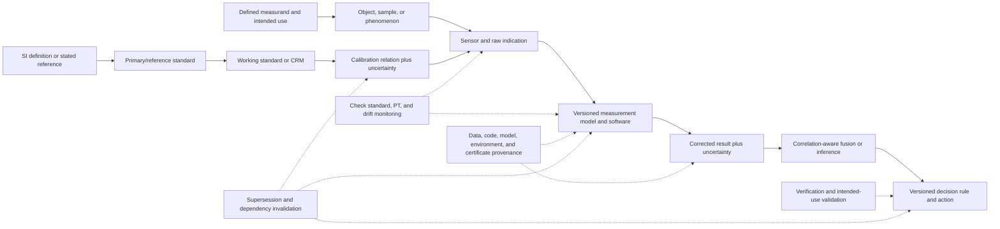

# Metrology and measurement-science analogue audit

<!-- markdownlint-disable MD013 -->

**Date:** 2026-08-05  
**Scope:** SI quantity and unit realization, measurand definition, calibration
hierarchies, metrological traceability, uncertainty evaluation, repeatability
and reproducibility, measurement-system analysis, reference materials,
interlaboratory comparison, conformity decisions, guard bands, drift,
recalibration, sensor fusion, measurement software, and data provenance  
**Purpose:** prevent the project from presenting established measurement
science as a new AI principle, while turning its observation and energy claims
into testable, unit-bearing contracts.  
**Evidence boundary:** current BIPM/JCGM, ISO, ILAC, OIML, NIST, and W3C
documents plus foundational estimation and stability papers. A standard defines
a competent procedure or vocabulary; it does not demonstrate that this project
has implemented it.

## Executive finding

Metrology supplies the strongest mature null for the project’s idea of a
versioned observation contract. Its core rule is more demanding than attaching
a confidence score: a measurement result is useful only relative to a defined
measurand, procedure, reference, calibration state, uncertainty model,
environment, software/data version, and intended decision.

No new registry principle is justified.

| Disposition | Result | Reason |
| --- | --- | --- |
| **Promote** | none | Traceability, uncertainty budgets, repeatability/reproducibility studies, reference materials, comparisons, decision rules, drift control, and correlated sensor fusion are mature measurement/statistical engineering. |
| **Hold** | a **metrologically complete, dependency-invalidating observation contract** as a refinement of [Candidate 014](../../experiments/candidates/014-versioned-observation-contract.md), composed with [Candidate 009](../../experiments/candidates/009-graded-assurance-envelopes.md) | The possible systems residual is carrying metrological, statistical-selection, software, and provenance dependencies through a changing AI pipeline and invalidating every affected downstream claim. The ingredients are established; only the cross-layer composition remains unvalidated. |
| **Reject as distinct principles** | SI traceability, calibration chains, GUM propagation, gauge R&R, interlaboratory comparison, guard bands, reference materials, Kalman fusion, recalibration schedules, and provenance graphs | Renaming these mechanisms as biological observation, confidence, memory, or trust does not change their information path. |

The audit also rejects four common shortcuts:

1. **Traceable does not mean accurate enough.** A result can have an unbroken
   calibration chain and still have uncertainty too large for the intended use;
   traceability also does not exclude mistakes [@jcgm200].
2. **Calibrated does not mean validated.** Calibration relates indication to
   standards under specified conditions. Validation asks whether verified
   requirements are adequate for an intended use [@jcgm200].
3. **Uncertainty is not error.** Error is a measured value minus a reference
   value; measurement uncertainty is a non-negative dispersion parameter based
   on available information. An unknown error is not made known by reporting a
   small uncertainty [@jcgm200].
4. **Provenance is not truth.** A lineage graph can faithfully show how an
   invalid value was produced. It supports audit and invalidation, not
   correctness by itself [@w3cprov].

## Terminology firewall

These distinctions are normative for this audit and should survive into every
chapter, equation, benchmark, and graphic.

- A **measurand** is the quantity intended to be measured. Its specification
  includes the relevant object, state, component, chemical entity, time,
  location, and conditions. “GPU energy,” “model quality,” or “intelligence” is
  not a complete measurand [@jcgm200].
- A **quantity value** is a number and a reference, commonly a measurement unit.
  A bare number is not a physical result. SI traceability is appropriate for
  physical quantities; ordinal labels and task scores need their own reference
  scales and construct definitions [@sibrochure; @jcgm200].
- **Indication** is an instrument output. **Measurement result** is the set of
  quantity values attributed to the measurand plus relevant information,
  generally including uncertainty. The displayed digits are not the result by
  themselves [@jcgm200].
- **Calibration** establishes and uses a relation between standards’ values and
  indications, with uncertainties. **Adjustment** changes the measuring system.
  **Verification** provides objective evidence that specified requirements are
  fulfilled. **Validation** is verification that those requirements are
  adequate for the intended use [@jcgm200].
- **Metrological traceability** relates a result to a stated reference through a
  documented unbroken calibration chain, each step contributing uncertainty.
  It is not sample custody, source-code history, artifact lineage, or a generic
  ability to trace records [@jcgm200; @ilacp10].
- **Measurement error** is signed and has the measurand’s unit. **Measurement
  uncertainty** is non-negative and characterizes dispersion of values being
  attributed to the measurand. **Correction** compensates an estimated
  systematic effect but leaves residual uncertainty [@jcgm200].
- **Accuracy** is closeness to a true quantity value and is not itself a
  numerical quantity. **Trueness** concerns systematic error/bias; **precision**
  concerns agreement among replicate indications or values. Precision alone
  does not establish trueness [@jcgm200; @iso5725].
- **Repeatability conditions** keep procedure, operator, system, location,
  operating conditions, and short time approximately fixed.
  **Reproducibility conditions** deliberately vary locations, operators, and
  measuring systems. Every reported precision must name which conditions
  changed [@jcgm200].
- **Resolution** is not uncertainty; **detection limit** is not quantification
  accuracy; **specification tolerance** is not measurement uncertainty; and a
  manufacturer’s maximum permissible error is not a probability distribution.
- A **reference material** is sufficiently homogeneous and stable for a stated
  use. A **certified reference material** additionally carries authoritative
  documentation, specified property values, uncertainties, and traceabilities.
  Matrix match and commutability can determine whether it behaves like real
  samples [@jcgm200; @iso17034; @iso33405].
- An **interlaboratory comparison** compares results across participants.
  **Proficiency testing** evaluates performance against specified criteria.
  Neither automatically repairs a method, supplies SI traceability, or proves
  future performance [@iso17043; @iso13528].
- A **decision rule** maps measurement information to conformity. A **guard
  band** shifts an acceptance limit away from a tolerance limit to change
  false-accept and false-reject risk. It does not remove measurement uncertainty
  [@jcgm106; @ilacg8].
- **Drift** is a change in indication over time due to changes in a measuring
  instrument’s metrological properties. A calendar interval is a maintenance
  policy, not evidence that drift is linear or absent between dates
  [@jcgm200; @oimld10].
- **Data provenance** describes entities, activities, agents, and derivation.
  **Software validation** checks fitness for a specified use. A checksum proves
  identity/integrity relative to bytes, not scientific adequacy.

## Minimum measurement-result contract

A project measurement that may support a claim should retain, at minimum:

1. measurand definition, object/population, state, interval, location, and
   exclusions;
2. quantity kind, unit or reference scale, sign convention, and aggregation;
3. raw indication/sample identity and acquisition timestamp;
4. instrument/sensor, range, configuration, firmware, clock, and environmental
   conditions;
5. measurement procedure, preprocessing, measurement model, software build,
   parameters, and numerical precision;
6. calibration certificate/curve, reference, chain, date, validity scope, and
   uncertainty contribution;
7. corrections and known uncorrected effects;
8. complete uncertainty budget, covariance/dependence assumptions, coverage
   factor or interval, and degrees of freedom where relevant;
9. repeatability, intermediate-precision, and reproducibility conditions;
10. sampling, missingness, detection, selection, and association conditions;
11. decision rule, guard band, tolerance/specification version, and false-decision
    cost owner;
12. quality-control checks, reference material or check standard, drift status,
    recalibration due/review rule, and out-of-tolerance impact assessment;
13. software/data provenance, artifact hashes, transformations, access or manual
    edits, supersession, and invalidation dependencies; and
14. intended use, target uncertainty, permitted downstream actions, expiry, and
    unresolved limitations.

This is a field schema, not a claim that every measurement requires the same
cost. Scope should be proportional to decision risk, irreversibility, and the
measurement’s contribution to the result.

## Core equations and units

### Quantity and measurement model

A physical quantity value is represented as

$$
Q=\{Q\}_{[Q]}[Q],
$$

where $\{Q\}_{[Q]}$ is the numerical value relative to unit $[Q]$. Changing the
unit changes the numerical value but not the quantity. A measurement model is

$$
Y=f(X_1,\ldots,X_n),
$$

where output $Y$ is the measurand and $X_i$ are input and influence quantities.
The function must be dimensionally valid; software implementing $f$ is part of
the measurement procedure [@jcgm100; @jcgm-gum6].

### First-order propagation with covariance

For estimate $y=f(x_1,\ldots,x_n)$, the GUM linearized combined standard
uncertainty is

$$
u_c^2(y)=
\sum_{i=1}^{n}\sum_{j=1}^{n}
c_i c_j u(x_i,x_j),
\qquad
c_i=\left.\frac{\partial f}{\partial X_i}\right|_{x}.
$$

$u_c(y)$ has the unit of $Y$; $c_i$ has unit $[Y]/[X_i]$; covariance
$u(x_i,x_j)$ has unit $[X_i][X_j]$; every summand has unit $[Y]^2$. Dropping
off-diagonal covariance silently assumes independence. For strong nonlinearity,
non-Gaussian inputs, discontinuities, or asymmetric output distributions,
distribution propagation such as the JCGM Monte Carlo supplement is a stronger
null than a root-sum-of-squares approximation [@jcgm100; @jcgm101].
The 2026 GUM amendment specifically updates treatment of nonlinearity in
measurement models [@jcgm100amd1].

Expanded uncertainty is

$$
U=k u_c(y),
$$

where $U$ and $u_c$ have the measurand’s unit and coverage factor $k$ is
dimensionless. $k=2$ is not automatically an exact 95% coverage statement; the
probabilistic interpretation depends on the output distribution, effective
degrees of freedom, and method [@jcgm100; @nisttn1297].

### Error, correction, and compatibility

Given measured value $y$ and reference value $y_{\mathrm{ref}}$,

$$
e=y-y_{\mathrm{ref}},
\qquad
c=-\hat e,
\qquad
y_{\mathrm{corr}}=y+c.
$$

$e$, correction $c$, and all values have the measurand’s unit. The estimate
$\hat e$ has uncertainty, so correction does not create exact truth. For two
results $x_1,x_2$ with covariance $u(x_1,x_2)$, a standardized compatibility
statistic can be written

$$
d=
\frac{x_1-x_2}
{\sqrt{u^2(x_1)+u^2(x_2)-2u(x_1,x_2)}}.
$$

$d$ is dimensionless. Its threshold and interpretation must be stated; positive
shared correlation reduces the uncertainty of a difference, while ignoring
dependence can either overstate or understate disagreement [@jcgm200].

### Measurement-system variance components

A crossed gauge study may use

$$
y_{ijk}=\mu+p_i+o_j+(po)_{ij}+\varepsilon_{ijk},
$$

where $p_i$ is part/object effect, $o_j$ operator/system effect, $(po)_{ij}$
interaction, and $\varepsilon_{ijk}$ repeatability error for replicate $k$.
Every term has the measurand’s unit; variance components have squared units.
One summary is

$$
\sigma_{\mathrm{GRR}}
=\sqrt{\sigma_o^2+\sigma_{po}^2+\sigma_\varepsilon^2}.
$$

This model is a designed-study null, not a universal decomposition. Object
heterogeneity, destructive testing, missing cells, order, day, instrument,
range, and nonlinearity require an appropriate design. Fixed percentage cutoffs
are rejected unless tied to the actual tolerance, process variation, and
decision loss [@nist-handbook; @iso22514].

### Interlaboratory performance

When a participant reports $x_i$ with expanded uncertainty $U_i$ and an
independent reference reports $x_{\mathrm{ref}}$ with $U_{\mathrm{ref}}$, a
common normalized difference is

$$
E_n=
\frac{x_i-x_{\mathrm{ref}}}
{\sqrt{U_i^2+U_{\mathrm{ref}}^2}}.
$$

$E_n$ is dimensionless. The denominator is valid only when the expanded
uncertainties use compatible coverage and correlation is negligible or
properly handled. A criterion such as $|E_n|\le1$ is scheme-specific evidence,
not a theorem that all future measurements are correct [@iso13528; @cipmmra].

### Decision rules and guard bands

For an upper tolerance limit $T_U$, measured value $y$, and a symmetric
coverage half-width $U$, a simple conservative acceptance rule is

$$
y+U\le T_U.
$$

$y$, $U$, and $T_U$ have the same unit. A general guard-band rule instead sets
acceptance limit $A_U=T_U-w$, with guard width $w$ in the same unit. The actual
consumer and producer risks are

$$
R_C=\Pr(\text{accept}\land Y>T_U),
\qquad
R_P=\Pr(\text{reject}\land Y\le T_U),
$$

and depend on the measurement distribution, item/process distribution, prior
information, and loss. Narrowing acceptance reduces one risk by increasing
another or increasing inconclusive/retest outcomes [@jcgm106; @ilacg8].

### Drift and averaging timescale

A simple local model is

$$
y(t)=x(t)+b_0+\beta(t-t_0)+\varepsilon(t),
$$

where $b_0$ has the measurand’s unit, drift rate $\beta$ has unit $[Y]/$s, and
$\varepsilon$ has unit $[Y]$. It is a testable approximation, not an assumption
that all drift is linear. For fractional-frequency averages $\bar y_k(\tau)$,
Allan’s two-sample variance is

$$
\sigma_y^2(\tau)=
\frac{1}{2}\mathbb E
\left[
(\bar y_{k+1}(\tau)-\bar y_k(\tau))^2
\right],
$$

dimensionless for fractional frequency and indexed by averaging time $\tau$ in
s [@allan1966]. It distinguishes noise regimes in time/frequency metrology but
is not a universal replacement for calibration, check standards, or physical
drift models.

### Correlation-aware sensor fusion

For unbiased scalar estimates collected in vector $z$ with full covariance
matrix $\Sigma$ and a common measurand, the generalized least-squares fusion is

$$
\hat x_f=
\frac{\mathbf 1^{\mathsf T}\Sigma^{-1}z}
{\mathbf 1^{\mathsf T}\Sigma^{-1}\mathbf 1},
\qquad
u_f^2=
(\mathbf 1^{\mathsf T}\Sigma^{-1}\mathbf 1)^{-1}.
$$

$\hat x_f$ and $u_f$ have the measurand’s unit. The familiar inverse-variance
weighted mean is only the diagonal-$\Sigma$ case. Shared calibration, clocks,
preprocessing, environments, priors, or training data create correlation;
double-counting them yields overconfident fusion. Kalman filtering is the
strong dynamic linear-Gaussian/second-moment null when its model is adequate;
covariance intersection is a conservative null when cross-correlations are
unknown [@kalman1960; @julier1997].

### Energy measurement

For a declared electrical boundary,

$$
E_{[t_0,t_1]}=\int_{t_0}^{t_1}P(t)\,dt,
$$

where energy $E$ is J, power $P$ is W, and time is s. For sampled data,
integration rule, sampling interval, bandwidth, anti-aliasing, clock
uncertainty, voltage/current/phase calibration, idle allocation, power-supply
loss, cooling, networking, and experiment-control energy must be declared. The
result must also state workload identity, warm-up, retries, useful outputs, and
uncertainty. This refines the project’s [energy model](../../concept/80-energy-model.md);
it does not supply any constant brain-to-AI ratio.

## Measurement and assurance flow



The upper path produces a decision. The lower paths qualify whether the result
is comparable, sufficiently uncertain, fit for use, and still valid. They cannot
be compressed into one “confidence” field without losing distinct failure
modes.

## Audit cards

### MET-01 — SI quantities, units, and measurands

**Evidence design.** International unit definitions and vocabulary maintained
by BIPM/JCGM [@sibrochure; @jcgm200].

**Exact problem.** Make results comparable by stating what quantity is intended,
its reference, conditions, and unit.

**Information/authority path.** A measurand specification selects the quantity;
a realization and dissemination chain establishes the unit used to express it.

**Timescale and units.** Physical units are explicit; measurement interval,
sampling period, latency, and validity time are in s.

**Resource cost.** Definition work, environmental control, reference access,
documentation, conversion, and training.

**Assumptions.** The intended quantity is operationally definable and the
measurement does not change it beyond modeled loading/disturbance.

**Failure boundary.** Ambiguous object/state/time, inconsistent units, hidden
aggregation, construct substitution, or measurement-induced change.

**Strongest statistical/engineering null.** A typed quantity schema with unit
checking and an explicit estimand/measurand protocol.

**P/candidate mapping and disposition.** P-007/P-013; Candidate 014 and the
energy model. **Established null; reject as a new principle.**

### MET-02 — Calibration hierarchy and metrological traceability

**Evidence design.** VIM definition, ILAC policy, SI realization, and CIPM MRA
comparison/capability infrastructure [@jcgm200; @ilacp10; @cipmmra].

**Exact problem.** Relate a measurement result to a stable stated reference
through documented calibrations, without hiding uncertainty added at each step.

**Information/authority path.** Definition/reference to primary/reference
standard to working standard/reference material to instrument indication to
result.

**Timescale and units.** Each calibration has date, interval, environmental
range, input/output units, and standard or expanded uncertainty in those units.

**Resource cost.** Calibration service, reference standards, transport,
environmental control, downtime, certificate review, intermediate checks, and
out-of-tolerance investigation.

**Assumptions.** Every relevant input’s traceability is established; certificates
match instrument range, configuration, firmware, and use conditions.

**Failure boundary.** Broken or irrelevant chain, expired/stale state,
uncertainty too large for use, undocumented adjustment, transcription error, or
mistake despite valid traceability.

**Strongest statistical/engineering null.** ISO/IEC-17025 laboratory process
with ILAC P10 traceability and uncertainty, not a vendor calibration sticker
[@iso17025].

**P/candidate mapping and disposition.** P-009/P-013; Candidates 009 and 014.
**Established null.**

### MET-03 — Measurement uncertainty

**Evidence design.** GUM model-based evaluation, Type A/Type B inputs,
covariance propagation, and Monte Carlo distribution propagation
[@jcgm100; @jcgm100amd1; @jcgm101; @jcgm-gum6].

**Exact problem.** Characterize dispersion of values reasonably attributable
to the measurand from available information.

**Information/authority path.** Input estimates, distributions, correlations,
and sensitivity coefficients feed an output distribution or combined standard
uncertainty.

**Timescale and units.** Standard and expanded uncertainty share the measurand’s
unit; relative uncertainty is dimensionless; input validity has a time range.

**Resource cost.** Replicates, reference data, model development, covariance
estimation, simulation, expert review, and update/invalidation work.

**Assumptions.** Measurement model is adequate; all material effects and
dependencies are included; distributions and linearization are justified.

**Failure boundary.** Missing systematic effects, double-counting, independence
assumptions, nonlinear tails, model discrepancy, numerical bugs, and use beyond
the calibrated domain.

**Strongest statistical/engineering null.** Complete GUM budget plus Monte
Carlo or validated numerical propagation when first-order approximation is
inadequate.

**P/candidate mapping and disposition.** P-003/P-007/P-013; Candidates 009 and
014. **Established null.**

### MET-04 — Calibration, verification, and validation

**Evidence design.** Controlled vocabulary and laboratory competence
requirements [@jcgm200; @iso17025].

**Exact problem.** Keep instrument response, conformance to specified
requirements, and fitness for intended use as separate claims.

**Information/authority path.** Calibration produces a response relation;
verification compares evidence to requirements; validation tests whether the
requirements cover the actual application.

**Timescale and units.** Calibration points and uncertainty retain physical
units; validation performance uses task-specific loss, range, population, and
time horizon.

**Resource cost.** Standards, test objects, edge cases, operator time, software
validation, revalidation after change, and opportunity cost.

**Assumptions.** Intended use and acceptance requirements are specified before
evaluation.

**Failure boundary.** “Passed calibration” used as fitness proof; test-set fit
called calibration; adjustment silently overwrites before/after evidence; or
validation omits deployment conditions.

**Strongest statistical/engineering null.** Calibration plus independent
method/software validation and ongoing verification under controlled versions.

**P/candidate mapping and disposition.** P-009; Candidate 009’s graded fields
and Candidate 014’s response version. **Established distinction.**

### MET-05 — Repeatability, reproducibility, and measurement-system analysis

**Evidence design.** Designed crossed/nested experiments, variance components,
ISO 5725 principles, NIST measurement-process characterization, and ISO 22514
capability methods [@iso5725; @nist-handbook; @iso22514].

**Exact problem.** Separate object variation from instrument, operator, day,
site, procedure, and interaction variation.

**Information/authority path.** Randomized replicate measurements under named
condition changes feed a variance-component or robust hierarchical model.

**Timescale and units.** Standard deviations share the measurand’s unit;
variances have squared units; day/site/operator factors and study duration are
explicit.

**Resource cost.** Replicates, representative objects, operators, instruments,
sites, destructive samples, randomization, and analysis.

**Assumptions.** Sampling covers the operating range; object-by-operator and
nonlinear effects are either modeled or bounded.

**Failure boundary.** Narrow part range, confounded operator/instrument/day,
memorized ordering, nonindependent replicates, heteroscedasticity, destructive
sample change, or universal percentage thresholds.

**Strongest statistical/engineering null.** Preregistered gauge R&R or
hierarchical variance-component study with the deployment factors crossed or
nested appropriately.

**P/candidate mapping and disposition.** P-004/P-007; Candidate 014.
**Established null.**

### MET-06 — Reference materials and commutability

**Evidence design.** VIM definitions, competent-producer standard, and current
ISO characterization guidance for homogeneity, stability, value assignment,
uncertainty, and traceability [@jcgm200; @iso17034; @iso33405].

**Exact problem.** Provide a stable, homogeneous-enough material or artifact for
calibration, trueness control, validation, or quality control in a declared
matrix and use.

**Information/authority path.** Producer characterizes lots/units and issues
documentation; users preserve, prepare, measure, and compare it within scope.

**Timescale and units.** Certified values and uncertainties use property units;
stability has storage time/temperature; homogeneity depends on sample mass or
volume.

**Resource cost.** Production, characterization, homogeneity/stability study,
packaging, storage, shipping, destructive consumption, and replacement.

**Assumptions.** Material behaves sufficiently like routine samples for the
measurement procedure; subsample and storage conditions match certification.

**Failure boundary.** Matrix mismatch, noncommutability, degradation,
inhomogeneity below sample size, contamination, expired certificate, or use of
an uncertified RM as if it carried a certified value.

**Strongest statistical/engineering null.** Appropriate CRM plus blank,
spike/recovery, independent control material, and matrix-matched validation.

**P/candidate mapping and disposition.** P-003/P-009/P-012; Candidates 009,
010, and 014. **Established null.**

### MET-07 — Interlaboratory and key comparisons

**Evidence design.** Competent proficiency-testing provider, ISO statistical
methods, and CIPM MRA key/supplementary comparisons with peer-reviewed
calibration and measurement capabilities [@iso17043; @iso13528; @cipmmra].

**Exact problem.** Test whether independent laboratories’ results are compatible
for a specified measurand and protocol.

**Information/authority path.** Common or linked items circulate; laboratories
report result and uncertainty; a provider/reference process assigns comparison
statistics and follows up deviations.

**Timescale and units.** Differences use measurand units; normalized scores are
dimensionless; transport, stability, and reporting delays are s/days/months.

**Resource cost.** Artifacts/samples, transport, stability controls, participant
labor, reference assignment, robust statistics, follow-up, and corrective
action.

**Assumptions.** Comparison item is stable and sufficiently homogeneous;
protocol and reference are fit; correlations and linking uncertainty are
handled.

**Failure boundary.** Consensus bias, unstable item, noncommutability,
underreported uncertainty, data exclusion after seeing results, or one passing
round treated as permanent competence.

**Strongest statistical/engineering null.** Blinded interlaboratory comparison
with a defensible reference value, uncertainty, robust analysis, and corrective
action.

**P/candidate mapping and disposition.** P-004/P-009/P-013; Candidates 009 and
014. **Established null.**

### MET-08 — Decision rules and guard bands

**Evidence design.** JCGM conformity-assessment guidance, ILAC decision-rule
guidance, and ISO/IEC 17025 reporting requirements [@jcgm106; @ilacg8;
@iso17025].

**Exact problem.** Convert an uncertain measured result into accept, reject,
retest, defer, or escalate while allocating false-decision risk explicitly.

**Information/authority path.** Measured-value distribution and specification
feed a declared rule; the authorized decision owner accepts producer/consumer
risk and consequence.

**Timescale and units.** Tolerances, guard bands, and uncertainty use measurand
units; risk is probability per decision or per declared horizon; loss uses
currency, harm units, or constrained counts.

**Resource cost.** False accepts, false rejects, retests, delayed release,
scrap/rework, review, and incident consequences.

**Assumptions.** Specification is valid; probability model and prior/process
distribution are stated; asymmetric consequences are represented.

**Failure boundary.** Binary threshold on point estimate, hidden shared risk,
confidence score substituted for posterior/conformance probability, or guard
band copied between unlike measurement capabilities.

**Strongest statistical/engineering null.** Bayes/minimum-risk or
coverage-interval decision rule with preregistered loss and an inconclusive or
retest option.

**P/candidate mapping and disposition.** P-001/P-007; Candidates 009, 010, 012,
and 014. **Established null.**

### MET-09 — Drift, checks, and recalibration intervals

**Evidence design.** VIM drift/stability concepts, check-standard control,
time-series statistics, and risk/history-based recalibration guidance
[@jcgm200; @nist-handbook; @oimld10; @allan1966].

**Exact problem.** Detect when measurement response changes enough to invalidate
results or require correction, restriction, recalibration, repair, or recall.

**Information/authority path.** Check standards, control charts, environmental
records, self-tests, and calibration history update instrument state and the
validity of affected results.

**Timescale and units.** Drift $[Y]/$s or per cycle; check interval s; alert rate
per operating hour; out-of-tolerance lookback duration s/days.

**Resource cost.** Check measurements, standards, downtime, recalibration,
false alarms, undetected drift, remeasurement, and recall/invalidation.

**Assumptions.** Check standard itself is stable or independently monitored;
drift model and change detector match plausible failure modes.

**Failure boundary.** Common drift of sensor and standard, step changes between
checks, environment-dependent bias, overfitted trend, calendar-only intervals,
or no downstream impact review.

**Strongest statistical/engineering null.** Risk-based interval plus control
chart/change detector, independent checks, and out-of-tolerance impact analysis.

**P/candidate mapping and disposition.** P-003/P-006/P-009/P-012; Candidates
003, 011, and 014. **Established null.**

### MET-10 — Sensor fusion and shared dependence

**Evidence design.** Kalman estimation, generalized least squares, full
cross-covariance modeling, and conservative covariance intersection for unknown
correlation [@kalman1960; @julier1997].

**Exact problem.** Combine multiple observations without counting common
information as independent evidence.

**Information/authority path.** Sensor observations, response models,
associations, timestamps, and covariance/dependency metadata update a state
estimate.

**Timescale and units.** State components retain physical units; covariance
entries are products of component units; latency and clock error are s.

**Resource cost.** Sensors, synchronization, calibration, communication,
association, covariance maintenance, filtering compute, and degraded-mode
reserve.

**Assumptions.** Bias, noise, cross-correlation, data association, and dynamic
model are adequate; sensors actually observe the same aligned measurand.

**Failure boundary.** Shared clock/calibrator/software, duplicate records,
unknown correlation, misassociation, time skew, common environment, and one bad
sensor dominating precision weighting.

**Strongest statistical/engineering null.** Centralized raw-data estimator with
known covariance; covariance intersection or conservative bounds when dependence
is unknown.

**P/candidate mapping and disposition.** P-002/P-007/P-013; Candidates 007 and
014. **Established null.**

### MET-11 — Measurement software and provenance

**Evidence design.** Measurement-model guidance, laboratory competence for
information management, and interoperable provenance representation
[@jcgm-gum6; @iso17025; @w3cprov].

**Exact problem.** Preserve which code, model, constants, calibration, data,
parameters, hardware, and manual actions produced each result.

**Information/authority path.** Immutable raw artifacts and versioned activities
produce derived entities; dependency edges drive audit, reproduction, and
invalidation.

**Timescale and units.** Software version/hash is nominal data; numerical
precision and tolerances retain units; execution time s, storage byte, and
validation age s.

**Resource cost.** Versioned storage, metadata capture, signing, workflow
instrumentation, test/reference datasets, reprocessing, and dependency queries.

**Assumptions.** Provenance capture covers manual steps and external services;
identifiers resolve to immutable artifacts; execution environment is
reconstructable enough for the claim.

**Failure boundary.** Authentic but scientifically invalid input, missing manual
edit, mutable URI, unrecorded calibration constant, nondeterministic dependency,
silent schema change, or lineage presented as truth.

**Strongest statistical/engineering null.** Content-addressed data/code plus
W3C PROV-style activity/entity/agent graph, reproducible build/environment,
tests, and dependency-aware invalidation.

**P/candidate mapping and disposition.** P-009/P-012/P-013; Candidates 009,
014, 017, 018, and 019. **Established components; hold only cross-layer
composition.**

### MET-12 — Energy and performance metrology

**Evidence design.** SI quantity definitions, calibrated electrical/thermal
measurements, GUM uncertainty, synchronized workload records, and repeatability/
reproducibility studies [@sibrochure; @jcgm100; @iso5725].

**Exact problem.** Compare useful AI work per energy and time without moving
unmeasured costs outside the boundary.

**Information/authority path.** Calibrated voltage/current/power or energy
meter, clock, thermal/infrastructure telemetry, and workload events produce an
integrated result linked to outputs.

**Timescale and units.** J/run, J/item, W, s, byte, operations, samples, and
task-specific utility; uncertainty in the same unit or relative dimensionless
form.

**Resource cost.** Metering equipment, calibration, sampling/storage, idle and
cooling allocation, synchronization, repeated runs, and operator time.

**Assumptions.** Electrical and infrastructure boundary, integration interval,
warm-up, idle baseline, retries, and useful-output denominator are declared.

**Failure boundary.** Software-estimated power treated as calibrated energy,
missed transients, aliasing, different hardware/utilization, omitted cooling or
network, cherry-picked runs, and no uncertainty.

**Strongest statistical/engineering null.** Calibrated wall/rail measurements
with synchronized event traces, repeated randomized workloads, idle and
infrastructure sensitivity bounds, and uncertainty budget.

**P/candidate mapping and disposition.** P-001/P-010; Candidates 006, 009, 014,
and the [energy model](../../concept/80-energy-model.md). **Established
measurement discipline; reject unsupported constants.**

## Deduplication map

### Existing project homes

| Metrology result | Existing project home | Consequence |
| --- | --- | --- |
| Separate evidence classes, scope, timestamps, and invalidation | [Candidate 009](../../experiments/candidates/009-graded-assurance-envelopes.md) | Calibration, validation, traceability, uncertainty, and conformity become separate envelope fields; never one “assured” flag. |
| Response/calibration versions, uncertainty classes, common dependencies, data vintage, and permitted action | [Candidate 014](../../experiments/candidates/014-versioned-observation-contract.md) | Metrology strengthens the required null. Candidate 014 survives only if dependency-preserving composition beats a complete typed metrology/statistics/provenance stack. |
| Policy changes that affect observation | [Candidate 007](../../experiments/candidates/007-endogenous-observation-surveillance.md) | Calibration and drift controls do not solve endogenous selection; joint process/observation modeling remains required. |
| Temporary trace and evidence before commitment | P-003 and Candidate 010 | Intermediate checks, replicate evidence, retest, and guard-banded decisions are mature nulls. |
| Prediction error and selective acquisition | P-007 | Residuals must be normalized by a calibrated uncertainty/covariance model and connected to decision value. |
| Maintenance and validity intervals | P-009/P-012 | Calibration state, drift checks, certificate expiry, and result invalidation are established lifecycle machinery. |
| Externalized shared state | P-013 | Calibration certificates, CRMs, KCDB capabilities, reference data, and provenance graphs are mature shared evidence structures. |
| Energy accounting | [Energy model](../../concept/80-energy-model.md) | Every energy number needs a measurand, boundary, calibrated measurement chain, uncertainty, run design, and provenance. |
| Observation/population contracts | [Population observation math](../../math/population-observation.md) | Metrology covers instrument/result quality; sampling, selection, cohort, censoring, and causal identification remain distinct. |

### Strongest ordinary null stack

A biological or AI-inspired observation mechanism must beat the composed stack,
not one weak baseline:

1. operational measurand/estimand and intended-use specification;
2. typed units/reference scales and dimensional checks;
3. calibrated instruments with traceability and uncertainty within scope;
4. validated method and measurement software;
5. representative repeatability, intermediate-precision, reproducibility, and
   range/linearity studies;
6. appropriate CRM/check standards and ongoing statistical control;
7. interlaboratory or independent-system comparison where transfer is claimed;
8. full covariance-aware estimation/fusion and calibrated predictive checks;
9. explicit selection, missingness, association, and intervention models;
10. preregistered decision rule, guard band, abstention/retest path, and loss;
11. risk/history-based drift monitoring and recalibration with out-of-tolerance
    impact analysis; and
12. immutable raw data plus versioned code/model/calibration provenance and
    dependency-aware invalidation.

Candidate 014 is not distinct if a typed implementation of this stack achieves
the same error, calibration, invalidation, action, latency, storage, and energy
frontier.

## Equal-budget falsification experiments

### E-MET-01 — Energy-measurement closure

- **Question:** do project energy-efficiency rankings survive a metrologically
  complete boundary?
- **Arms:** software power estimate; calibrated rail meter; calibrated wall
  meter; wall plus cooling/network allocation; full synchronized contract.
- **Equalization:** identical hardware, firmware, workload order, warm-up,
  throughput target, useful outputs, retry policy, and run count.
- **Injected failures:** missed short power spikes, clock skew, idle baseline
  drift, power-supply efficiency change, thermal throttling, and failed/retried
  batches.
- **Measures:** J/run and J/accepted item with standard/expanded uncertainty,
  W, s, throughput, rank reversals, missing-energy fraction, metadata byte, and
  operator h.
- **Falsification:** reject any architecture-efficiency claim whose ranking
  reverses within uncertainty or after omitted infrastructure/retries are added.

### E-MET-02 — Calibration-chain break and downstream invalidation

- **Question:** does Candidate 014 locate and retract every affected result when
  a calibration changes?
- **Arms:** certificate PDFs only; asset database; typed calibration graph;
  Candidate 014 complete dependency graph.
- **Equalization:** same instruments, calibrations, result corpus, storage,
  compute, and analyst time.
- **Injected failures:** wrong range, superseded coefficient, expired CRM,
  undocumented adjustment, shared standard correction, unit conversion error,
  and certificate discovered out of tolerance.
- **Measures:** affected-result recall/precision, false retractions, stale claim
  exposure s, reprocessing J, byte, analyst h, and wrong decisions.
- **Falsification:** reject the candidate residual if ordinary typed asset/data
  lineage matches invalidation quality and cost.

### E-MET-03 — Measurement-system decomposition

- **Question:** can a learned monitor identify operator, instrument, object,
  day, and interaction effects beyond designed MSA?
- **Arms:** pooled standard deviation; classical crossed/nested gauge R&R;
  hierarchical robust model; learned monitor; Candidate 014 metadata plus the
  hierarchical null.
- **Equalization:** identical randomized measurement matrix, objects, operators,
  instruments, sites/days, replicates, and analysis budget.
- **Measures:** variance-component error in squared measurement units,
  interval coverage, bias detection, false alarms, transfer prediction,
  compute J, and study labor h.
- **Falsification:** reject if the learned mechanism merely rediscovers ANOVA
  factors, relies on confounding, or fails at a new operator/site.

### E-MET-04 — Interlaboratory reproducibility

- **Question:** does the full observation contract improve cross-site
  compatibility rather than only within-system repeatability?
- **Arms:** shared instructions; shared calibration; ISO-style comparison;
  complete contract with independent raw-data reprocessing.
- **Equalization:** blinded stable items, balanced site order, common measurand,
  declared transport/stability budget, and identical follow-up opportunities.
- **Measures:** reproducibility standard deviation, normalized differences,
  coverage, site bias, unresolved results, turnaround h, cost, and invalidation
  accuracy.
- **Falsification:** reject broad reproducibility claims if gains disappear when
  location, operator, instrument, software, and item stability all vary.

### E-MET-05 — Reference-material commutability

- **Question:** does a calibration/control material transfer to routine objects
  and deployment matrices?
- **Arms:** synthetic/reference item only; CRM; matrix-matched CRM; CRM plus
  independent patient/field/production samples and alternate method.
- **Equalization:** same concentration/property range, sample count, analyst
  time, and measurement runs.
- **Measures:** calibration residual in measurand units, matrix-specific bias,
  coverage, drift sensitivity, consumed material g or mL, cost, and false
  conformity decisions.
- **Falsification:** reject transfer if the reference is precise but
  noncommutable or if routine-sample bias lies outside the declared uncertainty.

### E-MET-06 — Guard-band decision risk

- **Question:** does an adaptive confidence gate beat explicit decision rules?
- **Arms:** point-estimate threshold; simple acceptance; fixed guard band;
  risk-optimal rule with retest; learned gate; Candidate 009/014 envelope.
- **Equalization:** identical measurements, calibration data, total retest and
  review budget, latency cap, and declared producer/consumer loss.
- **Measures:** false accepts/rejects per 1,000 decisions, expected loss,
  abstention/retest rate, latency s, measurement count, J, and calibration by
  distance to tolerance.
- **Falsification:** reject novelty if an explicit risk/guard-band rule occupies
  the same loss–latency–measurement frontier or if the learned rule hides who
  bears transferred risk.

### E-MET-07 — Drift, checks, and recalibration

- **Question:** does adaptive measurement maintenance beat a mature risk-based
  schedule?
- **Arms:** fixed calendar interval; OIML/ILAC history-based interval;
  check-standard control chart/change detector; adaptive policy; full
  Candidate 014 invalidation loop.
- **Equalization:** same checks/year, calibration downtime, reference-standard
  access, compute, and false-alarm budget.
- **Injected drift:** linear, random walk, step, temperature-dependent,
  hysteretic, and common drift of instrument/check standard.
- **Measures:** undetected out-of-tolerance result-hours, maximum bias in units,
  checks/calibrations, false removals, recall scope, downtime h, and cost.
- **Falsification:** reject if the adaptive policy wins only against a fixed
  interval, misses step/common drift, or omits retrospective impact review.

### E-MET-08 — Correlated sensor fusion

- **Question:** does a biological/learned fusion mechanism remain calibrated
  under shared dependencies?
- **Arms:** naive average; inverse-variance fusion; full-covariance generalized
  least squares/Kalman; covariance intersection; learned fusion; Candidate 014
  dependency-aware fusion.
- **Equalization:** same observations, clocks, bandwidth, compute, calibration
  data, and communication budget.
- **Injected dependence:** common calibrator, shared preprocessing, duplicate
  record, correlated environment, clock offset, shared prior/training data,
  and sensor bias.
- **Measures:** error and uncertainty in state units, interval coverage,
  NLL, association error, latency s, byte, J, and catastrophic overconfidence.
- **Falsification:** reject if the proposal only beats independence-naive fusion
  or if reported uncertainty shrinks while empirical coverage worsens.

### E-MET-09 — Software/provenance reproducibility

- **Question:** does the held composition preserve and invalidate scientific
  meaning beyond ordinary reproducible workflows?
- **Arms:** notebook/report; version-controlled code and data; container plus
  content-addressed artifacts; W3C PROV graph; complete Candidate 014 contract.
- **Equalization:** same storage, compute, documentation/engineer hours, and
  rerun opportunities.
- **Injected changes:** dependency update, floating-point/library change,
  calibration constant, unit metadata, schema, raw correction, manual edit,
  model checkpoint, and decision-rule version.
- **Measures:** bitwise and tolerance-based reproduction, affected-result recall
  and precision, stale decision exposure, byte, rerun J, and analyst h.
- **Falsification:** reject the residual if ordinary content-addressed workflow
  lineage matches it, or if provenance is complete but invalid results remain
  confidently accepted.

## Scoped temporary claims

| ID | Status | Claim | Evidence and qualification | Affected work |
| --- | --- | --- | --- | --- |
| MET-T01 | established | A measurand must specify the quantity intended, including relevant object, state, component, time, and conditions. | JCGM VIM [@jcgm200]; the required detail is use-dependent. | Candidate 014; energy model |
| MET-T02 | established | A measurement result generally includes a measured value and associated uncertainty, not an indication alone. | JCGM VIM/GUM [@jcgm200; @jcgm100]. | Candidate 009/014 |
| MET-T03 | established | Metrological traceability is an unbroken documented calibration chain to a stated reference, with each calibration contributing uncertainty. | JCGM VIM and ILAC P10 [@jcgm200; @ilacp10]. | Candidate 009/014 |
| MET-T04 | established | Traceability does not guarantee uncertainty adequate for purpose or absence of mistakes. | Explicit VIM qualification [@jcgm200]. | Candidate 009 |
| MET-T05 | established | Calibration, adjustment, verification, and validation are distinct operations. | JCGM VIM [@jcgm200]. | Candidate 009/014 |
| MET-T06 | established | Measurement uncertainty and measurement error are different concepts; correction leaves residual uncertainty. | JCGM VIM/GUM [@jcgm200; @jcgm100]. | All quantitative claims |
| MET-T07 | established | First-order uncertainty propagation requires covariance terms when inputs are dependent. | GUM [@jcgm100]. | Candidate 014; fusion; energy |
| MET-T08 | established | Expanded uncertainty requires a stated coverage factor and justified coverage interpretation. | GUM and NIST TN 1297 [@jcgm100; @nisttn1297]. | Quantitative claims |
| MET-T09 | established | Repeatability and reproducibility refer to different declared measurement conditions. | JCGM VIM and ISO 5725 [@jcgm200; @iso5725]. | Candidate 014 |
| MET-T10 | established | Gauge R&R/variance-component designs are mature nulls for separating measurement-system variation. | NIST and ISO 22514 [@nist-handbook; @iso22514]. | Candidate 014 |
| MET-T11 | established | CRM usefulness depends on intended use, homogeneity, stability, assigned value, uncertainty, traceability, and sometimes commutability. | JCGM/ISO [@jcgm200; @iso17034; @iso33405]. | Candidate 009/014 |
| MET-T12 | established | Interlaboratory comparison supplies scoped compatibility/performance evidence, not automatic traceability or permanent competence. | ISO 17043/13528 and CIPM MRA [@iso17043; @iso13528; @cipmmra]. | Candidate 009/014 |
| MET-T13 | established | Conformity decisions near tolerance limits require an explicit decision rule and allocation of false-accept/false-reject risk. | JCGM 106 and ILAC G8 [@jcgm106; @ilacg8]. | Candidates 009, 010, 012, 014 |
| MET-T14 | established | Fixed recalibration intervals are not evidence of stability; history, risk, checks, and equipment behavior should inform review. | OIML D 10/ILAC G24 [@oimld10]. | P-009; Candidate 014 |
| MET-T15 | established | Fusion that ignores shared correlation can become overconfident. | GLS/Kalman foundations and covariance-intersection null [@kalman1960; @julier1997]. | Candidate 014 |
| MET-T16 | established | Provenance can represent derivation and version relations but does not establish truth or fitness. | W3C PROV [@w3cprov]. | Candidates 009, 014, 017, 019 |
| MET-T17 | plausible | Binding metrological, selection, software, and provenance dependencies to each downstream claim may reduce stale or overconfident decisions. | Constituent methods are established; the complete composition lacks direct comparative evidence. | Candidate 014 held refinement |
| MET-T18 | plausible | Calibrated end-to-end energy metrology can reverse rankings produced by software estimates or narrow hardware boundaries. | Mechanistically possible; direction and frequency are empirical and hardware/workload-specific. | Energy model |
| MET-T19 | speculative | Treating learned representations as measurement systems may improve discipline if measurands, references, influence quantities, uncertainty, and intended use can be operationalized. | Analogy only; latent features and task constructs often lack SI-style references. | Mathematical foundations; roadmap |
| MET-T20 | audit conclusion | Metrology warrants no new registry principle; it strengthens the null and schema for Candidates 009 and 014. | Mature standards and methods cover every abstract component; only cross-layer implementation remains held. | Principle registry; experiments |

## Stopping, rejection, and promotion rules

Reject or narrow a measurement-inspired claim when any of the following holds:

1. the measurand, object/population, state, interval, aggregation, unit/reference
   scale, or intended use is undefined;
2. calibration, validation, verification, adjustment, accuracy, precision,
   error, and uncertainty are used interchangeably;
3. a result is called traceable because its data lineage is known, or accurate
   merely because the instrument was calibrated;
4. uncertainty omits model discrepancy, calibration, drift, sampling,
   selection, software, or covariance material to the result;
5. repeated digits, resolution, model confidence, or standard deviation is
   presented as a complete uncertainty budget;
6. repeatability under one operator/system is generalized to cross-site
   reproducibility;
7. a reference item is noncommutable, unstable, inhomogeneous at the used
   sample size, or outside the matrix/range;
8. sensor fusion assumes independence despite shared clocks, calibration,
   preprocessing, priors, or training data;
9. a conformity threshold omits decision risk, guard band, abstention/retest,
   or who bears the false decision;
10. recalibration is calendar-only, with no intermediate check or
    out-of-tolerance downstream impact assessment;
11. provenance captures files but not code, environment, parameters, manual
    actions, calibration, schema, and decision-rule versions; or
12. an energy comparison omits boundary, synchronized time integration,
    calibration, uncertainty, idle/infrastructure sensitivity, failed work, or
    useful-output denominator.

Promote the held Candidate 014 refinement only if it beats the complete ordinary
null stack on at least two different measurement modalities and one adaptive
policy-induced observation setting, at equal sensing, calibration, metadata,
storage, compute, review, and remeasurement budgets. It must improve downstream
false-decision loss and dependency invalidation—not merely metadata completeness—
while maintaining empirical coverage and bounded latency. Until then it remains
a **held systems composition, not a principle**.

## Audit-local bibliography

```bibtex
@book{sibrochure,
  author = {{Bureau International des Poids et Mesures}},
  title = {The International System of Units ({SI}), 9th Edition},
  year = {2026},
  doi = {10.59161/AUEZ1291},
  url = {https://www.bipm.org/en/publications/si-brochure}
}

@standard{jcgm200,
  author = {{Joint Committee for Guides in Metrology}},
  title = {International Vocabulary of Metrology---Basic and General Concepts and Associated Terms ({VIM}), 3rd Edition},
  year = {2012},
  doi = {10.59161/JCGM200-2012},
  url = {https://jcgm.bipm.org/vim/en/}
}

@standard{jcgm100,
  author = {{Joint Committee for Guides in Metrology}},
  title = {Evaluation of Measurement Data---Guide to the Expression of Uncertainty in Measurement},
  year = {2008},
  doi = {10.59161/JCGM100-2008E},
  url = {https://www.bipm.org/en/doi/10.59161/jcgm100-2008e}
}

@standard{jcgm100amd1,
  author = {{Joint Committee for Guides in Metrology}},
  title = {Evaluation of Measurement Data---Guide to the Expression of Uncertainty in Measurement---Amendment 1: Nonlinearity in Measurement Models},
  year = {2026},
  doi = {10.59161/PPDI3267},
  url = {https://www.bipm.org/en/committees/jc/jcgm/publications}
}

@standard{jcgm101,
  author = {{Joint Committee for Guides in Metrology}},
  title = {Evaluation of Measurement Data---Supplement 1 to the {GUM}: Propagation of Distributions Using a Monte Carlo Method},
  year = {2008},
  doi = {10.59161/JCGM101-2008},
  url = {https://www.bipm.org/en/committees/jc/jcgm/publications}
}

@standard{jcgm-gum6,
  author = {{Joint Committee for Guides in Metrology}},
  title = {Guide to the Expression of Uncertainty in Measurement---Part 6: Developing and Using Measurement Models},
  year = {2020},
  doi = {10.59161/JCGMGUM-6-2020},
  url = {https://www.bipm.org/en/doi/10.59161/jcgmgum-6-2020}
}

@standard{jcgm106,
  author = {{Joint Committee for Guides in Metrology}},
  title = {Evaluation of Measurement Data---The Role of Measurement Uncertainty in Conformity Assessment},
  year = {2012},
  doi = {10.59161/JCGM106-2012},
  url = {https://www.bipm.org/en/doi/10.59161/jcgm106-2012}
}

@standard{iso17025,
  author = {{International Organization for Standardization and International Electrotechnical Commission}},
  title = {{ISO/IEC 17025:2017---General Requirements for the Competence of Testing and Calibration Laboratories}},
  year = {2017},
  url = {https://www.iso.org/standard/66912.html}
}

@standard{ilacp10,
  author = {{International Laboratory Accreditation Cooperation}},
  title = {{ILAC-P10:07/2020---ILAC Policy on Metrological Traceability of Measurement Results}},
  year = {2020},
  url = {https://ilac.org/?ddownload=123220}
}

@standard{ilacg8,
  author = {{International Laboratory Accreditation Cooperation}},
  title = {{ILAC-G8:09/2019---Guidelines on Decision Rules and Statements of Conformity}},
  year = {2019},
  url = {https://ilac.org/publications-and-resources/ilac-guidance-series/}
}

@standard{oimld10,
  author = {{International Organization of Legal Metrology and International Laboratory Accreditation Cooperation}},
  title = {{OIML D 10:2022 / ILAC-G24:2022---Guidelines for the Determination of Recalibration Intervals of Measuring Equipment}},
  year = {2022},
  url = {https://www.oiml.org/en/files/pdf_d/d010-e22.pdf}
}

@standard{iso5725,
  author = {{International Organization for Standardization}},
  title = {{ISO 5725-1:2023---Accuracy (Trueness and Precision) of Measurement Methods and Results---Part 1}},
  year = {2023},
  url = {https://www.iso.org/standard/69418.html}
}

@standard{iso22514,
  author = {{International Organization for Standardization}},
  title = {{ISO 22514-7:2021---Statistical Methods in Process Management---Capability and Performance---Part 7: Capability of Measurement Processes}},
  year = {2021},
  url = {https://www.iso.org/standard/80624.html}
}

@standard{iso17034,
  author = {{International Organization for Standardization}},
  title = {{ISO 17034:2016---General Requirements for the Competence of Reference Material Producers}},
  year = {2016},
  url = {https://www.iso.org/standard/29357.html}
}

@standard{iso33405,
  author = {{International Organization for Standardization}},
  title = {{ISO 33405:2024---Reference Materials---Approaches for Characterization and Assessment of Homogeneity and Stability}},
  year = {2024},
  url = {https://www.iso.org/standard/84226.html}
}

@standard{iso17043,
  author = {{International Organization for Standardization and International Electrotechnical Commission}},
  title = {{ISO/IEC 17043:2023---Conformity Assessment---General Requirements for the Competence of Proficiency Testing Providers}},
  year = {2023},
  url = {https://www.iso.org/standard/80864.html}
}

@standard{iso13528,
  author = {{International Organization for Standardization}},
  title = {{ISO 13528:2022---Statistical Methods for Use in Proficiency Testing by Interlaboratory Comparison}},
  year = {2022},
  url = {https://www.iso.org/standard/78879.html}
}

@online{cipmmra,
  author = {{Bureau International des Poids et Mesures}},
  title = {{CIPM Mutual Recognition Arrangement and Key Comparison Database}},
  year = {2026},
  url = {https://www.bipm.org/en/cipm-mra},
  urldate = {2026-08-05}
}

@techreport{nisttn1297,
  author = {Taylor, Barry N. and Kuyatt, Chris E.},
  title = {Guidelines for Evaluating and Expressing the Uncertainty of {NIST} Measurement Results},
  institution = {National Institute of Standards and Technology},
  number = {Technical Note 1297},
  year = {1994},
  doi = {10.6028/NIST.TN.1297},
  url = {https://www.nist.gov/pml/nist-technical-note-1297}
}

@online{nist-handbook,
  author = {Heckert, N. Alan and Filliben, James J. and Croarkin, C. M. and Hembree, Barry and Guthrie, William F. and Tobias, Paul and Prinz, Jack},
  title = {{NIST/SEMATECH} e-Handbook of Statistical Methods: Measurement Process Characterization},
  year = {2012},
  doi = {10.18434/M32189},
  url = {https://www.itl.nist.gov/div898/handbook/mpc/mpc_d.htm},
  urldate = {2026-08-05}
}

@article{allan1966,
  author = {Allan, David W.},
  title = {Statistics of Atomic Frequency Standards},
  journal = {Proceedings of the IEEE},
  year = {1966},
  volume = {54},
  number = {2},
  pages = {221--230},
  doi = {10.1109/PROC.1966.4634}
}

@article{kalman1960,
  author = {Kalman, Rudolf E.},
  title = {A New Approach to Linear Filtering and Prediction Problems},
  journal = {Journal of Basic Engineering},
  year = {1960},
  volume = {82},
  number = {1},
  pages = {35--45},
  doi = {10.1115/1.3662552}
}

@inproceedings{julier1997,
  author = {Julier, Simon J. and Uhlmann, Jeffrey K.},
  title = {A Non-Divergent Estimation Algorithm in the Presence of Unknown Correlations},
  booktitle = {Proceedings of the 1997 American Control Conference},
  year = {1997},
  volume = {4},
  pages = {2369--2373},
  doi = {10.1109/ACC.1997.609105}
}

@standard{w3cprov,
  author = {Lebo, Timothy and Sahoo, Satya and McGuinness, Deborah},
  title = {{PROV-O}: The {PROV} Ontology},
  organization = {World Wide Web Consortium},
  year = {2013},
  url = {https://www.w3.org/TR/2013/REC-prov-o-20130430/}
}
```

## Verdict

Metrology does not add another natural metaphor. It provides the discipline
that determines whether any claimed efficiency, adaptation, uncertainty, or
comparison is meaningful. The project should treat calibration, traceability,
validation, uncertainty, reproducibility, conformity risk, drift, and provenance
as separate versioned claims with separate evidence and invalidation triggers.

The only held residual is Candidate 014’s cross-layer composition: whether an
adaptive AI system can preserve those metrological dependencies together with
selection, association, intervention, and software lineage—and retract every
affected downstream decision—better than a complete conventional metrology,
statistics, quality-engineering, and provenance stack at equal lifecycle cost.
That remains an experiment contract, not an accepted principle.
