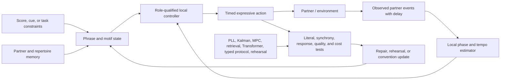

# Music cognition, performance, and improvisation: primary-source audit

- **Audit date:** 2026-08-05
- **Scope:** music perception and memory, statistical expectation, chunking and
  hierarchy, predictive timing, beat and meter, entrainment, motif
  transformation, expressive timing, auditory–motor coupling, ensemble
  coordination, improvisation, expertise, practice, and cultural learning
- **Evidence rule:** primary experiments support scoped observations; reviews,
  theory papers, corpora, and neuroimaging organize hypotheses but do not by
  themselves identify a transferable algorithm
- **Promotion state:** audit-local `MUSIC-` claims only; no stable claim,
  principle, or experiment candidate is promoted by this file

## Executive finding

Music is a demanding integration test for prediction, memory, transformation,
motor control, and social coordination. It is not evidence for a single
“musical intelligence” primitive. The primary literature supports a narrower
decomposition:

- listeners learn adjacent and some nonadjacent event statistics, and learned
  probabilities predict aspects of expectation;
- grouping cues and long-distance context matter, but a neural or behavioral
  response to a hierarchical stimulus does not identify a unique tree parser;
- people estimate pulse and phase, predict future events, and correct timing
  errors, while ordinary state estimation and feedback control already explain
  much of the measurable behavior;
- melodic contour, intervals, absolute pitch, harmonic context, and learned
  style contribute differently to recognition, so “motif memory” is not one
  store;
- expressive timing can be produced from an internal plan without immediate
  sound, while auditory feedback still fine-tunes timing, pitch selection, and
  pedaling;
- ensemble synchrony is well described in part by pairwise phase correction,
  partner-specific prediction, and role-dependent adjustment;
- improvisation requires novelty under constraints, but neuroimaging contrasts
  do not distinguish retrieval, stochastic variation, sequence generation,
  search, evaluation, and motor execution;
- practice changes domain-specific behavior and measured brain structure, but
  hours, expertise, and far transfer remain causally non-equivalent; and
- musical expectations and preferences are culturally learned to an important
  degree, with both cross-cultural commonalities and substantial variation.

The narrowest residual is **partner- and phrase-specific predictive temporal
co-adaptation under expressive nonstationarity**: agents maintain joint timing
and phrase intent while tempo, microtiming, roles, motifs, partners, and delays
change, without a privileged shared clock. That residual is not distinct enough
for a new principle or candidate. It composes the held **entrainable local phase
state**, [Candidate 002](../../experiments/candidates/002-multiscale-context-broadcast.md),
[Candidate 015](../../experiments/candidates/015-versioned-repairable-conventions.md),
and [Candidate 019](../../experiments/candidates/019-audited-cumulative-inheritance.md).
It must first beat phase-locked loops, Kalman/state-space estimators, adaptive
feedback, model-predictive control, retrieval, explicit protocol state, and
ordinary rehearsal at equal total cost.

## Outcome firewall

Musical labels often collapse distinct outcomes. Every transfer claim must
declare which row it predicts.

| Outcome | Operational question | Minimum measurement | Invalid substitution |
| --- | --- | --- | --- |
| event prediction | which pitch, onset, duration, or dynamic follows? | held-out log loss in bits/event plus calibration | listener surprise rating alone |
| segmentation | where are boundaries or chunks? | boundary precision/recall against declared annotations or perturbations | calling every repeated pattern a chunk |
| hierarchy | does nonlocal structure improve prediction beyond local history? | held-out gain over tuned local, long-context, and retrieval models | ERP or activation contrast alone |
| pulse/phase tracking | where is the latent periodic reference now and next? | phase error in radians and onset error in milliseconds under perturbation | spectral peak at stimulus frequency alone |
| synchronization | do multiple actors control relative timing? | pairwise onset-error distribution, recovery time, and stability | similar average tempo |
| motif recognition | is a relation preserved under a declared transformation? | transformation-stratified AUC/accuracy and false matches | same-key memorization |
| expressive control | are timing, dynamics, articulation, and pedaling shaped intentionally? | feature vector plus blinded human judgments | low onset error alone |
| improvisation | is output novel, constrained, coherent, responsive, and useful? | separate novelty, validity, responsiveness, value, and cost axes | one “creativity” score |
| expertise | what durable capability differs and why? | task-specific performance, learning history, selection controls, retention | accumulated hours or musician label |
| cultural learning | what changes with exposure, interaction, or transmission? | cross-play, held-out culture/style, turnover, and exposure accounting | one Western corpus treated as universal |

Pleasure, familiarity, physiological response, prediction accuracy, motor
synchrony, and cultural recognizability remain separate dependent variables.

## Transfer rule and conventional null stack

A music-derived AI claim is eligible for architectural consideration only if:

1. the proposed state and update rule are explicit, rather than named
   “entrainment,” “groove,” “hierarchy,” “embodiment,” or “creativity”;
2. input acoustics, notation, event tokenization, annotations, and cultural
   exposure are held constant or independently manipulated;
3. evaluation includes unseen pieces, transformations, partners, tempi, and
   perturbations relevant to the claim;
4. the method beats tuned sequence, retrieval, compression, control, search,
   stochastic-variation, and curriculum nulls that can solve the same task;
5. parameters, training examples, rehearsal, feedback, evaluator queries,
   context length, latency, memory, and compute are equal-budget or charged;
6. immediate fit is separated from delayed retention, cross-style transfer,
   partner turnover, and recovery after disturbance; and
7. quality, risk, human effort, and lifecycle energy are reported separately.

The ordinary null stack is:

- unigram through variable-order Markov prediction and n-gram retrieval;
- recurrent and Transformer sequence models with matched context and tokens;
- nearest-neighbor, case-based, and transformation-canonicalized retrieval;
- minimum-description-length or held-out compression model selection;
- phase-locked loops, adaptive oscillators, Kalman filters, phase correction,
  model-predictive control, and shared-clock scheduling;
- beam search, constrained sampling, Monte Carlo tree search, evolutionary
  variation, rejection sampling, and reranking by an independent evaluator;
- fixed rehearsal, imitation, augmentation, curriculum learning, and ordinary
  active learning; and
- typed messages, acknowledgements, schema/version state, and explicit role
  protocols for ensembles.

“Biological,” “musical,” and “creative” supply no baseline credit.

## Quantitative contract

### Acoustic and symbolic event units

For event $n$, record onset $t_n$ in seconds, duration $d_n$ in seconds,
fundamental or spectral frequency $f_n$ in hertz, and sound pressure level in
dB SPL when calibrated. The inter-onset interval is

$$
\Delta t_n=t_n-t_{n-1}\quad [\mathrm{s}],
$$

and a constant period $T$ corresponds to

$$
f_{\mathrm{beat}}=\frac{1}{T}\quad [\mathrm{Hz}],
\qquad
b=\frac{60}{T}\quad [\mathrm{beats\,min^{-1}}].
$$

Pitch interval in cents is

$$
c(f_2,f_1)=1200\log_2\!\left(\frac{f_2}{f_1}\right)
\quad [\mathrm{cent}].
$$

MIDI pitch and velocity are device-level integers, not physical units. Report
the synthesizer, tuning, velocity curve, sample rate in hertz, bit depth, onset
detector, and uncertainty whenever results depend on rendered audio.

### Prediction and compression

For event $x_n$ and history $h_n$, surprisal is

$$
I_n=-\log_2 p(x_n\mid h_n)\quad [\mathrm{bit/event}].
$$

Held-out cross-entropy over $N$ events is

$$
H=\frac{1}{N}\sum_{n=1}^{N}I_n
\quad [\mathrm{bit/event}],
$$

with pitch, onset, duration, and expressive attributes also scored separately.
A hierarchical representation earns credit only through preregistered held-out
gain

$$
G_{\mathrm{hier}}=H_{\mathrm{best\ local/long/retrieval}}
                  -H_{\mathrm{hier}}
\quad [\mathrm{bit/event}],
$$

after model description length, training compute, and annotation cost are
charged. Positive $G_{\mathrm{hier}}$ on one corpus does not establish human
parsing or universal musical grammar.

### Phase, tempo, and feedback correction

Let predicted and observed phases be $\hat\phi_n$ and $\phi_n$ in radians.
Circular phase error is

$$
e_n=\operatorname{wrap}_{[-\pi,\pi)}(\phi_n-\hat\phi_n)
\quad [\mathrm{rad}].
$$

A minimal phase-correction model is

$$
\hat t_{n+1}=\hat t_n+\hat T_n+\alpha a_n,
$$

where $a_n=t_n-\hat t_n$ is onset asynchrony in seconds, $\hat T_n$ is the
estimated period in seconds, and $\alpha$ is dimensionless correction gain.
Tempo adaptation needs a separate update, for example

$$
\hat T_{n+1}=\hat T_n+\beta(a_n-a_{n-1}),
$$

with dimensionless $\beta$. Report nonlinearities, saturation, skipped beats,
uncertainty, and recovery time in seconds; a fitted linear gain is not proof of
optimality or oscillatory biology.

For actor $i$ and $j$, pairwise onset error is

$$
e_{ij,n}=t_{i,n}-t_{j,n}\quad [\mathrm{s}].
$$

In a linearized multi-actor controller

$$
\mathbf e_{n+1}=A_n\mathbf e_n+\boldsymbol\epsilon_n,
$$

$A_n$ is dimensionless and $\boldsymbol\epsilon_n$ is timing noise in
seconds. Stability of a stationary approximation requires spectral radius
$\rho(A)<1$. Because expressive music is nonstationary, also report
time-varying gains, role switches, and violations of the local linear model.

### Neural “entrainment” measurement boundary

For trial phases $\theta_k(f,t)$, phase-locking value is

$$
\operatorname{PLV}(f,t)=
\left|\frac{1}{K}\sum_{k=1}^{K}e^{\mathrm{i}\theta_k(f,t)}\right|,
$$

a dimensionless statistic in $[0,1]$. Spectral amplitude or PLV at a beat
frequency can arise from periodic evoked responses, nonlinear transforms,
movement artifact, or an endogenous oscillator. Evidence for persistent local
phase requires omission periods, phase shifts, irregular input, model
comparison, and behavioral consequences. Never convert EEG power, BOLD signal,
or a frequency tag into joules saved by an AI system.

### Motifs and transformations

Represent a motif as event sequence $m=(x_1,\ldots,x_L)$ and a declared
transformation $g$ such as transposition, uniform time scaling, inversion, or
rhythmic displacement. An invariant encoder $z$ claims

$$
D(z(m),z(gm))\leq\varepsilon_g,
$$

where $D$ is a declared dimensionless distance and $\varepsilon_g$ is fixed
before test. Evaluate exact retrieval, near retrieval, novel transformed
recognition, and false-positive rate separately. Canonicalizing pitch or tempo
in preprocessing is a baseline operation whose cost and leaked invariance must
be reported.

### Expressive timing and dynamics

After fitting only a preregistered global tempo map $q_n$, define timing
deviation

$$
\delta_n=10^3(t_n-q_n)\quad [\mathrm{ms}].
$$

Do not remove phrase-level rubato with a flexible smoother and then claim that
microtiming disappeared. Report onset, offset, articulation ratio, calibrated
loudness, pedaling, and note errors as a vector. Listener judgments require
blinding, randomized rendering, repeated raters, and agreement; a waveform
distance is not expressive quality.

### Improvisation is a vector

For generated episode $y$, report

$$
\mathbf C(y)=
\bigl(N(y),V(y),R(y),Q(y),S(y),K(y)\bigr),
$$

where $N$ is novelty relative to training and retrieval indexes, $V$ is
constraint validity, $R$ is responsiveness to partner/context, $Q$ is
blinded task value or quality, $S$ is style membership or cross-style
generalization, and $K$ is total cost. These have different units and must
not be silently averaged. Independent evaluators must not receive condition
labels, and evaluator calls are charged.

### Complete effort, latency, and energy boundary

For method $m$, report the cost vector

$$
\mathbf K_m=
\left(
T_{\mathrm{learner}},T_{\mathrm{teacher}},T_{\mathrm{rehearsal}},
T_{\mathrm{evaluation}},N_{\mathrm{examples}},N_{\mathrm{queries}},
L_{50},L_{95},M_{\mathrm{peak}},B_{\mathrm{moved}},E_{\mathrm{life}}
\right),
$$

where times are person-hours or device-hours with actor declared; latency
quantiles are seconds; peak memory is bytes; data movement is bytes; and
lifecycle energy is joules. Compute energy is

$$
E=\int_0^\tau P(t)\,dt\quad [\mathrm{J}],
$$

and the lifecycle total is

$$
E_{\mathrm{life}}=
E_{\mathrm{data}}+E_{\mathrm{train}}+E_{\mathrm{search}}+
E_{\mathrm{eval}}+E_{\mathrm{store}}+E_{\mathrm{network}}+
E_{\mathrm{infer}}+E_{\mathrm{idle}}+E_{\mathrm{retry}}
\quad [\mathrm{J}].
$$

State hardware model, quantity, numerical precision, utilization, PDU or board
measurement point, duration, software stack, region, and number of runs.
Human metabolic energy, instrument/audio energy, and compute electricity are
reported in separate rows; they are not added without a declared system
boundary and conversion rationale. Brain power is not inferred from task BOLD,
EEG, or the project title.

For an equal-budget comparison, either enforce

$$
\mathbf K_m\preceq\mathbf K_{m_0}
$$

on preregistered hard caps or estimate a Pareto frontier. A scalar utility is
secondary and must publish every coefficient and unit conversion.

## Evidence cards

## 1. Statistical sequence learning and musical expectation

### Biological observation

Saffran et al. exposed adults and 8-month-old infants to continuous tone
streams whose only segmentation cue was transition structure; both groups
discriminated the trained “tone words” from alternatives
([DOI](https://doi.org/10.1016/S0010-0277%2898%2900075-4)). Loui, Wessel, and
Hudson Kam used a novel Bohlen–Pierce scale and finite-state grammar. After
25–30 minutes of passive exposure, participants showed recognition,
generalization, frequency sensitivity, and changed preference
([DOI](https://doi.org/10.1525/mp.2010.27.5.377)). Pearce et al. found that
probabilities from an unsupervised variable-order sequence model covaried with
expectedness ratings and electrophysiological responses to melodies
([DOI](https://doi.org/10.1016/j.neuroimage.2009.12.019)).

### Proposed AI translation

Learn calibrated distributions over pitch, timing, duration, dynamics, and
context rather than hard-coding Western theory. Maintain multiple context
lengths only if they improve held-out prediction or downstream control.

### Efficiency mechanism

Accurate conditional probability can allocate compute toward surprising
events, compress frequent continuations, and retrieve recurring patterns.
Those are ordinary sequence-model, compression, and caching mechanisms.

### Evidence status and speculative extension

Scoped auditory statistical learning is **established**. A unique musical
predictive process is **disputed** by the domain-general tone-stream results.
The claim that human musical expectation requires predictive coding as a
specific neural implementation is **speculative** unless it beats descriptive
sequence probability and causal-control alternatives.

### Failure modes and measurable prediction

Recognition can reflect memorized fragments; ratings can reflect familiarity;
EEG correlates do not choose among algorithms; and corpus probabilities can
leak test style. A new architecture must beat variable-order Markov, recurrent,
Transformer, and retrieval models on held-out cross-style bits/event at matched
tokens, parameters, context, and joules.

## 2. Chunking, grouping, nonadjacent dependency, and hierarchy

### Biological observation

Creel, Newport, and Aslin found that nonadjacent tone dependencies were learned
when pitch or timbre grouping made the relevant elements coherent; moderate
grouping allowed adjacent and nonadjacent regularities to coexist
([DOI](https://doi.org/10.1037/0278-7393.30.5.1119)). Koelsch et al. modified
Bach chorales to disrupt proposed nonlocal hierarchical structure while
preserving selected local structure and observed behavioral and ERP
differences in musicians and nonmusicians
([DOI](https://doi.org/10.1073/pnas.1300272110)). Repp showed that tapping
corrections can use beat and subdivision references within a metrical
hierarchy, not only the most recent tap–tone asynchrony
([DOI](https://doi.org/10.1007/s00426-006-0067-1)).

### Proposed AI translation

Represent event groups at several timescales, route prediction through
candidate segment states, and preserve nonlocal dependencies when local
compression would destroy them.

### Efficiency mechanism

Reusable chunks can reduce description length and search depth. Hierarchical
state can extend effective context without attending to every event, but only
if boundary discovery and state maintenance cost less than a strong long-context
model.

### Evidence status and speculative extension

Grouping-sensitive nonadjacent learning is **established** in scoped tasks.
Sensitivity to the chorale manipulation is **established**; identification of
a specific context-free or tree parser is **plausible but not established**.
“The brain uses musical syntax, therefore AI needs symbolic trees” is
**speculative**.

### Failure modes and measurable prediction

Local statistics may not truly be matched; acoustics and style can reveal the
condition; annotations can import the intended hierarchy; and a long-context
model can mimic hierarchical behavior. Require gain over high-order n-grams,
Transformers, retrieval, and MDL segmentation on held-out structural
interventions, not only natural-corpus likelihood.

## 3. Tonal organization and learned expectation

### Biological observation

Krumhansl and Kessler's probe-tone experiments produced stable rating profiles
for Western major and minor tonal contexts and a geometry of key relations
([DOI](https://doi.org/10.1037/0033-295X.89.4.334)). Krumhansl and Keil found
developmental differences in tonal-function hierarchy
([DOI](https://doi.org/10.3758/BF03197636)). These observations concern learned
listeners and Western tonal materials; they do not establish an innate or
universal tonal coordinate system.

### Proposed AI translation

Learn low-dimensional relational state from exposure, keep culture/style
identity explicit, and condition expectations on that state rather than baking
one tonal geometry into the model.

### Efficiency mechanism

A compact relational state can support transposition, key tracking, retrieval,
and conditional prediction. The null is ordinary representation learning plus
data augmentation.

### Evidence status and speculative extension

Context-sensitive Western tonal profiles are **established**. Their universal
status is **disputed**. A dynamically learned relational latent is
**plausible** but does not yet distinguish a new architecture.

### Failure modes and measurable prediction

Probe ratings mix perception, convention, familiarity, and task demand. A
useful latent must improve prediction and transformation transfer across
unseen keys and culturally distinct corpora relative to transposition
augmentation, contrastive learning, and canonical retrieval.

## 4. Beat prediction, phase correction, and entrainment

### Biological observation

Repp found tempo-dependent, nonlinear phase-correction responses to perturbed
metronomes, including correction to small shifts that became imperceptible at
longer intervals
([DOI](https://doi.org/10.1080/00222895.2011.561377)). Nozaradan et al. reported
EEG frequency components at perceived beat and imagined meter frequencies
([DOI](https://doi.org/10.1523/JNEUROSCI.0411-11.2011)) and sensory–motor
frequency coupling during tapping
([DOI](https://doi.org/10.1093/cercor/bht261)). Doelling et al. found an
oscillator model predicted cortical responses to music better than an evoked
response model in their comparison
([DOI](https://doi.org/10.1073/pnas.1816414116)). Hoddinott et al. later found
that an experience-driven predictability manipulation did not change their EEG
beat-entrainment measure
([DOI](https://doi.org/10.1162/JOCN.a.95)).

### Proposed AI translation

Maintain local phase and period estimates that persist through omissions and
are corrected by uncertain observations. Allow several candidate pulses only
when ambiguity requires them.

### Efficiency mechanism

Phase state can schedule sparse computation before expected events instead of
polling continuously. Yet timers, PLLs, adaptive oscillators, and state-space
filters already implement this mechanism.

### Evidence status and speculative extension

Predictive phase correction is **established** behaviorally. Frequency-tagged
neural responses are **established measurements**. Autonomous oscillatory
causation is **plausible and model-dependent**, not implied by a spectral peak.
AI energy savings from neural entrainment are **speculative**.

### Failure modes and measurable prediction

Periodic evoked responses, nonlinearities, filtering, movement, and spectral
leakage can mimic entrainment. A transferable phase state must maintain useful
phase through omissions, follow ramps and phase jumps, represent uncertainty,
and beat PLL/Kalman/adaptive-oscillator baselines at matched latency, memory,
and joules.

## 5. Motif transformation and melodic memory

### Biological observation

Dowling and Fujitani separated contributions of contour, interval, and pitch to
melody recognition
([DOI](https://doi.org/10.1121/1.1912382)). Cuddy, Cohen, and Mewhort found that
harmonic progression, contour, repetition/excursion pattern, and tones shared
between original and transposed sequences affected perceived structure and
recognition after transposition
([DOI](https://doi.org/10.1037/0096-1523.7.4.869)). Tervaniemi et al. reported
expertise-related differences in learning contour changes across frequency
levels, with especially strong performance in musicians accustomed to playing
without scores
([DOI](https://doi.org/10.1101/lm.39501)).

### Proposed AI translation

Factor representations into absolute event content and transformation-stable
relations; index both exact episodes and relational motifs.

### Efficiency mechanism

Transformation-aware indexing may avoid storing every transposition and tempo
variant. Canonicalization, interval encoding, equivariance, and data
augmentation are conventional nulls.

### Evidence status and speculative extension

Multiple relational levels in melody recognition are **established** in scoped
tasks. A single invariant “motif code” is **disputed** by the dependence on
context and shared tones. Automatic group-equivariant motif memory is a
**plausible engineering hypothesis**.

### Failure modes and measurable prediction

Contour is weakly identifying; exact fragments can leak across train and test;
transposition can preserve many low-level cues; and expert groups are selected.
Require transformation-stratified false-match curves on unseen motifs and
styles, with exact and canonical retrieval baselines.

## 6. Auditory–motor coupling and feedback

### Biological observation

Chen, Penhune, and Zatorre observed motor-region recruitment while participants
listened to rhythms with anticipation, even without overt tapping
([DOI](https://doi.org/10.1093/cercor/bhn042)). Bangert et al. found overlapping
auditory and motor activation in small pianist and nonmusician groups
([DOI](https://doi.org/10.1016/j.neuroimage.2005.10.044)). Pfordresher's altered
feedback experiments dissociated timing disruption from phase shifts and note
accuracy disruption from pitch-period shifts
([DOI](https://doi.org/10.1037/0096-1523.29.5.949)); later work found that
feedback-plan matching, melodic structure, and skill altered disruption
([DOI](https://doi.org/10.1037/0096-1523.31.6.1331)). Delayed feedback effects
also depended on the relation between delay and produced IOI
([DOI](https://doi.org/10.1007/s004260100075)).

### Proposed AI translation

Couple forward sensory predictions to action plans while keeping event
selection and timing-control errors separately observable and repairable.

### Efficiency mechanism

Forward prediction can detect action errors without a full external evaluator
and support low-latency correction. This is ordinary model-based control and
sequence monitoring unless a new residual survives.

### Evidence status and speculative extension

Feedback-specific disruption of sequence and timing is **established** in
keyboard tasks. Motor-region activation during listening is **correlational**.
A shared latent cause for perception and action is **plausible**, while a
special music-only coupling mechanism is **unsupported**.

### Failure modes and measurable prediction

Brain activation does not show causal necessity; altered audio changes
attention and salience; delayed feedback can introduce a new rhythmic cue.
Compare separate versus shared forward models under pitch-only, phase-only,
latency, dropout, and cross-instrument perturbations at equal compute.

## 7. Expressive timing and internal performance plans

### Biological observation

Repp had six skilled pianists perform or respond to the same passage across
expressive and metronomic tasks. Expressive temporal patterns persisted during
silent performance and imagery-related tasks
([DOI](https://doi.org/10.1080/00222899909600985)). In a related study, removal
of auditory feedback produced statistically detectable but generally small
changes across expressive parameters, with larger pedaling changes for some
players; pianist listeners identified no-feedback performances at 63.5%
([DOI](https://doi.org/10.2307/40285802)).

### Proposed AI translation

Generate a phrase-level reference trajectory before execution, then use local
feedback to fine-tune timing, dynamics, articulation, and actuator-dependent
details.

### Efficiency mechanism

A reference trajectory avoids recomputing intent at every event; a cheap local
controller corrects execution. This is feedforward plus feedback control, not a
new principle.

### Evidence status and speculative extension

Internally available expressive timing plans are **plausible and supported** in
the studied expert performances. Complete independence from sensory feedback is
**disputed**. Compiling expressive intent into reusable trajectories is a
**plausible engineering translation** already adjacent to [Candidate 006](../../experiments/candidates/006-reversible-physical-skill.md).

### Failure modes and measurable prediction

Small samples, repeated passages, motivation without sound, and memorization
limit generality. Test novel passages, actuator changes, delayed feedback, and
unseen phrase structures against score-conditioned sequence generation plus
standard trajectory control.

## 8. Ensemble synchronization and partner models

### Biological observation

Wing et al. fitted a first-order phase-correction model to two professional
string quartets performing a short Haydn excerpt with unrehearsed expressive
variation. Average gains were near the model's predicted optimum, while
pairwise gains revealed different leader/follower patterns
([DOI](https://doi.org/10.1098/rsif.2013.1125)). The evidence is two case
studies, not a universal law of ensembles. Keller, Knoblich, and Repp found
pianists synchronized more accurately with recordings of their own earlier
performance than with others, and self-recognition correlated with that
advantage
([DOI](https://doi.org/10.1016/j.concog.2005.12.004)).

### Proposed AI translation

Each actor maintains uncertain partner- and role-specific timing models,
adapts correction gains, and distinguishes shared phrase drift from local
error.

### Efficiency mechanism

Local pairwise correction can coordinate without a central clock. Partner
models may reduce correction delay when expressive departures are predictable.
Distributed clock discipline and adaptive multi-agent control are the nulls.

### Evidence status and speculative extension

Pairwise phase correction and asymmetric adjustment are **plausible and
quantitatively supported** in the quartets studied. Partner-specific prediction
is **plausible** from the self-performance advantage. A general inter-agent
simulation mechanism is **speculative**.

### Failure modes and measurable prediction

Familiarity, motor similarity, memorized microtiming, common score structure,
and recording quality can explain self advantage. The residual must survive
partner turnover, role switches, novel motifs, asymmetric delays, no shared
clock, and comparison to online system identification plus retrieval.

## 9. Improvisation, constrained generation, and recombination

### Biological observation

Bengtsson, Csíkszentmihályi, and Ullén contrasted improvising with reproducing
previous improvisations in eleven professional pianists and found activity
differences in prefrontal, premotor, and temporal regions
([DOI](https://doi.org/10.1162/jocn.2007.19.5.830)). Limb and Braun contrasted
jazz improvisation with overlearned performance and reported a distributed
pattern including prefrontal activation and deactivation
([DOI](https://doi.org/10.1371/journal.pone.0001679)). Berkowitz and Ansari used
constrained rhythmic and melodic generation and identified a network associated
with generation, selection, and execution
([DOI](https://doi.org/10.1016/j.neuroimage.2008.02.028)). Donnay et al.
contrasted interactive “trading fours” with memorized exchanges and found
perisylvian activation differences
([DOI](https://doi.org/10.1371/journal.pone.0088665)).

### Proposed AI translation

Separate memory retrieval, proposal generation, constraint enforcement,
partner response, evaluation, revision, and execution. Preserve provenance of
motifs and evaluator decisions.

### Efficiency mechanism

Retrieval and transformation can cheaply seed candidates; stochastic sampling
can diversify them; constrained search can reject invalid continuations early;
an evaluator can allocate more compute only to promising branches.

### Evidence status and speculative extension

Improvisation engages more than rote execution in the studied contrasts. The
neuroimaging evidence is **correlational and contrast-dependent**. Claims that
reduced executive monitoring causes creativity, that language circuits are a
music-dialogue mechanism, or that randomness explains improvisation are
**speculative**. The engineering decomposition is already owned by the
[endogenous-generation audit](2026-08-05-endogenous-generation-creativity.md)
and [Candidate 004](../../experiments/candidates/004-closed-endogenous-curriculum.md).

### Failure modes and measurable prediction

Improvised and control outputs differ in novelty, entropy, memory demand,
errors, motor transitions, and subjective engagement. A new system must beat
retrieval-plus-transformation, constrained Transformer sampling, beam search,
stochastic reranking, and evolutionary search under identical prompts,
training data, evaluator calls, latency, and energy.

## 10. Expertise, practice, and training-induced change

### Biological observation

Ericsson, Krampe, and Tesch-Römer reported associations between retrospective
deliberate-practice histories and expertise strata, including violinists
([DOI](https://doi.org/10.1037/0033-295X.100.3.363)). Macnamara and Maitra's
violin replication found a substantially smaller relation and no deliberate-
practice-hour difference between the best and good groups
([DOI](https://doi.org/10.1098/rsos.190327)). Hyde et al. reported structural
brain changes after 15 months of childhood instrumental training correlated
with motor and auditory change
([DOI](https://doi.org/10.1523/JNEUROSCI.5118-08.2009)). Habibi et al. followed
children in music, sports, and no-training groups and found auditory-processing
differences, but assignment to the programs was not randomized
([DOI](https://doi.org/10.1016/j.dcn.2016.04.003)).

### Proposed AI translation

Train component skills with targeted error information, retrieval, variation,
feedback, and staged integration; track retained capability rather than raw
update count.

### Efficiency mechanism

Targeted practice may spend examples on current error modes. This is ordinary
curriculum, active learning, rehearsal, and fine-tuning unless a music-specific
operation survives.

### Evidence status and speculative extension

Training-related domain changes are **established**; exact causal attribution
varies by design. Practice hours as sufficient explanation are **disputed**.
General cognitive transfer from music is **plausible only when the intervention,
active control, outcome, and retention horizon are explicit**.

### Failure modes and measurable prediction

Selection, family resources, instructor effects, attrition, retrospective
hours, and bundled activities confound expertise. Music-inspired curriculum
must beat ordinary skill-local sequencing at matched examples, retries,
feedback, teacher/evaluator time, and delayed transfer.

## 11. Music lessons and far-transfer boundary

### Biological observation

Schellenberg randomly assigned 144 children to keyboard, voice, drama, or no
lessons and reported a small IQ increase for music groups; the drama group
instead showed an adaptive-social-behavior change
([DOI](https://doi.org/10.1111/j.0956-7976.2004.00711.x)). The result concerns
the assigned lesson packages, not rhythm, pitch, ensemble practice, or one
neural mechanism in isolation.

### Proposed AI translation

None follows from the broad treatment label. Decompose shared factors such as
attention, instructor contact, incremental difficulty, repetition, feedback,
social expectation, and motivation before transferring the result.

### Efficiency mechanism

Any benefit may come from conventional structured practice rather than music.
The ordinary curriculum null therefore owns the initial explanation.

### Evidence status and speculative extension

A small package-level effect in this randomized study is **established**.
“Music generally improves intelligence” is **disputed and overbroad**. A
music-specific route to general AI learning efficiency is **unsupported**.

### Failure modes and measurable prediction

Multiple outcomes, teacher differences, expectancy, and limited follow-up can
inflate interpretations. A mechanistic study must factorially vary the claimed
music component and compare an equally engaging active curriculum on delayed,
untrained tasks.

## 12. Enculturation, cultural priors, and transmission

### Biological observation

Hannon and Trehub found that 6-month-olds detected meter-disrupting changes in
both familiar simple and unfamiliar complex rhythms, while 12-month-olds and
adults showed more culture-specific response; brief exposure restored some
adult discrimination
([DOI](https://doi.org/10.1073/pnas.0504254102)). Hannon, Soley, and Levine
separated interval-ratio complexity from enculturation in infants
([DOI](https://doi.org/10.1111/j.1467-7687.2011.01036.x)). Jacoby and McDermott
used iterated rhythm reproduction and found distributions attracted toward
simple integer-ratio categories, with cross-cultural differences in the
specific priors
([DOI](https://doi.org/10.1016/j.cub.2016.12.031)); a later 15-country study
found both commonality and variation
([DOI](https://doi.org/10.1038/s41562-023-01800-9)). McDermott et al. found
Tsimane' listeners could discriminate relevant sounds without the Western
preference for consonance
([DOI](https://doi.org/10.1038/nature18635)). Mehr et al. documented widespread
song and both cross-cultural regularity and diversity, but their corpus and
listener analyses are observational rather than a learning intervention
([DOI](https://doi.org/10.1126/science.aax0868)).

### Proposed AI translation

Learn population- and partner-qualified priors, expose version and provenance,
and preserve cross-play tests when local conventions adapt. Use iterated
transmission to measure drift, not to assume desirable convergence.

### Efficiency mechanism

Shared conventions compress communication and prediction within a population.
They can also create lock-in, exclusion, and catastrophic cross-population
failure. Explicit protocol/version state is the strong engineering null.

### Evidence status and speculative extension

Enculturation and cross-cultural variation are **established**. Simple-ratio
attractors are **established for the tested reproduction tasks**, not universal
musical atoms. Self-organizing AI musical conventions are **plausible** but
already fall under Candidate 015 and Candidate 019.

### Failure modes and measurable prediction

Iterated reproduction mixes perception, motor noise, memory, and prior;
sampling and recording choices shape cross-cultural corpora; Western
researchers' categories may not transfer. Require population holdout, literal
task success, protected meanings, bidirectional cross-play, partner turnover,
and comparison to explicit schemas plus training artifacts.

## Deduplication against the project

### Exact principle mapping

| Music-domain description | Normalized problem and causal loop | Existing principle | Disposition |
| --- | --- | --- | --- |
| musical expectation / surprise | allocate processing to unresolved conditional error | [P-007](../principle-registry.md#p-007--prediction-error-allocation) | exact bundle; no music principle |
| temporary phrase or motif trace | cheap state before durable commitment | [P-003](../principle-registry.md#p-003--temporary-trace-before-commitment) | exact bundle |
| episodic, semantic, and skill memory | match representation/update to information lifetime | [P-012](../principle-registry.md#p-012--memory-matched-to-information-lifetime) | exact bundle |
| beat correction and adaptive gain | stabilize timing by negative feedback | [P-006](../principle-registry.md#p-006--homeostatic-negative-feedback) | exact bundle; control null mandatory |
| local player autonomy / conductor escalation | resolve locally and escalate exceptions | [P-002](../principle-registry.md#p-002--local-autonomy-with-exception-escalation) | exact bundle |
| transient ensemble or neural coupling | time-dependent communication coalition | [P-011](../principle-registry.md#p-011--transient-communication-coalitions) | adjacent; synchrony alone insufficient |
| sections, voices, phrases, and roles | contain interaction in modules before integration | [P-008](../principle-registry.md#p-008--compartmentalized-interaction) | exact bundle if causal containment exists |
| motif variation, selection, consolidation | generate diversity, select, protect/compress winners | [P-004](../principle-registry.md#p-004--diversity-selection-and-protection) | exact bundle |
| compiled performance trajectory | move recurring computation into structure | [P-010](../principle-registry.md#p-010--structural-offloading-and-co-design) | exact bundle |
| score, recording, notation, shared repertoire | coordinate through external shared state | [P-013](../principle-registry.md#p-013--externalized-shared-state) | exact bundle |

### Exact candidate and audit mapping

| Proposed music residual | Existing owner | Why not new |
| --- | --- | --- |
| persistent beat/phase state | held **Entrainable local phase state** plus [Candidate 002](../../experiments/candidates/002-multiscale-context-broadcast.md) | must beat timers, PLLs, cyclic scheduling, receiver filters, and clock discipline |
| hierarchical phrase context | [Candidate 002](../../experiments/candidates/002-multiscale-context-broadcast.md) and [Candidate 017](../../experiments/candidates/017-contract-preserving-semantic-compaction.md) | multiscale conditioning and compact summaries already own it; hierarchy must preserve testable contracts |
| improvisational proposal/evaluation | [Candidate 004](../../experiments/candidates/004-closed-endogenous-curriculum.md) and [endogenous-generation audit](2026-08-05-endogenous-generation-creativity.md) | retrieval, structured generation, variation, evaluation, and lineage are already decomposed |
| audio–motor skill and compiled expression | [Candidate 006](../../experiments/candidates/006-reversible-physical-skill.md) and [biomechanics audit](2026-08-05-biomechanics-motor-control.md) | forward models, feedback, trajectory control, and physical compilation already own it |
| latency-qualified ensemble authority | [Candidate 012](../../experiments/candidates/012-latency-qualified-authority.md) | stale evidence and delay already bound who may safely control action |
| emergent ensemble conventions and repair | [Candidate 015](../../experiments/candidates/015-versioned-repairable-conventions.md) and [linguistics audit](2026-08-05-linguistics-communication.md) | composition, uptake, partner state, repair, versioning, and cross-play already own it |
| music-derived skill curriculum | [Candidate 004](../../experiments/candidates/004-closed-endogenous-curriculum.md) and [learning-science audit](2026-08-05-learning-science-skill-acquisition.md) | targeted practice, feedback, retention, transfer, and effort are ordinary curriculum questions |
| repertoire inheritance across musicians/models | [Candidate 019](../../experiments/candidates/019-audited-cumulative-inheritance.md) and [cultural-evolution audit](2026-08-05-cultural-evolution-archaeology.md) | typed teaching channels, artifacts, transmission fidelity, turnover, and repair already own it |
| motif memory and replay | [memory audit](2026-08-05-memory-replay-forgetting.md) | retrieval, interference, replay, and forgetting are not music-specific |

### Narrowest residual after deduplication

The only useful residual phrasing is:

> **Shared-clock-free, partner- and phrase-specific predictive co-adaptation:**
> maintain bounded relative timing and communicative phrase response under
> expressive tempo drift, asymmetric delay, role switching, motif innovation,
> and partner turnover, while preserving literal task constraints.

This is a benchmark fixture, not a principle. It is the intersection of local
phase estimation, multiscale context, conventions, and inheritance:



The residual is retired if an online state-space controller plus retrieval and
explicit role/protocol state matches it. No claim about “interbrain synchrony”
can rescue it without an intervention that improves behavior beyond common
input and motor alignment.

## Ten equal-budget falsification experiments

Each experiment uses identical data splits, tokenization, sensors, actuator or
renderer, base parameter budget, training examples, hyperparameter-search
trials, evaluator queries, wall-clock cap, and energy measurement boundary.
Report quality–cost Pareto fronts, all failures, and uncertainty across seeds,
pieces, performers/models, and populations where applicable.

### E-MUSIC-01 — Sequence expectation beyond local statistics

Train variable-order Markov/IDyOM-like, RNN, Transformer, retrieval-augmented,
and proposed hierarchical models on identical symbolic and audio-derived event
streams. Hold out composers, pieces, keys, tempi, and one cultural/style family.
Primary outcomes are bits/event and calibration for pitch and onset; secondary
outcomes are human expectedness correlation. Reject the hierarchy transfer if
long context or retrieval matches it, if annotations leak form, or if gains
vanish out of style.

### E-MUSIC-02 — Grouping and nonadjacent-dependency intervention

Generate factorial streams varying adjacent probability, nonadjacent
dependency, pitch grouping, timbre grouping, and boundary cues independently.
Compare flat sequence, explicit chunk, latent segmentation, and hierarchical
models. Test on new token identities and reversed grouping cues. Reject a
hierarchical mechanism if high-order sequence prediction or preprocessing
groups the stream equally well, or if only trained surface tokens transfer.

### E-MUSIC-03 — Persistent phase under omissions and perturbations

Compare fixed timer, PLL, adaptive oscillator, Kalman/state-space estimator,
Transformer predictor, and proposed entrainable phase state across steady beat,
tempo ramps, phase jumps, syncopation, missing pulses, polyrhythm, and
nonperiodic controls. Match update rate and compute. Primary outcomes are
circular phase error, onset error in milliseconds, recovery seconds, false-beat
rate, latency, and joules. Reject the residual if persistence is a filter
transient, if uncertainty is uncalibrated, or if a conventional estimator ties.

### E-MUSIC-04 — Motif transformation versus canonical retrieval

Create leakage-audited motif families with exact, transposed, time-scaled,
inverted, ornamented, reharmonized, and unrelated probes. Compare exact
retrieval, interval/rhythm canonicalization, dynamic time warping, contrastive
augmentation, equivariant encoding, and the proposed motif memory. Measure
transformation-stratified ROC, false matches per million indexed motifs,
retrieval latency, bytes, and joules. Reject the transfer if canonical retrieval
matches it or novelty is only train/test fragment overlap.

### E-MUSIC-05 — Expressive reference trajectory and feedback

On held-out pieces and actuators, compare metronomic rendering, score-conditioned
sequence generation, open-loop learned reference trajectory, standard
feedforward-plus-feedback control, and the proposed compiled expressive plan.
Perturb audio latency, pitch feedback, actuator dynamics, and pedal response
separately. Measure timing/dynamics/articulation/pedaling vectors, note errors,
blinded listener judgments, recovery, and energy. Reject the residual if a
standard trajectory controller matches quality or if smoothing choices create
the claimed expression.

### E-MUSIC-06 — Separate timing and sequencing error loops

Factor phase shifts, pitch-period shifts, feedback dropout, and actuator noise
while models perform novel keyboard-like sequences. Compare a shared latent
controller, separate timing/selection controllers, and sequence prediction
without forward sensory state. Measure onset error, wrong-event rate,
correction latency, error attribution, and compute. Reject shared audio–motor
coupling if separate conventional controllers dominate or if benefits vanish
when salience and delay cues are matched.

### E-MUSIC-07 — Shared-clock-free ensemble co-adaptation

Pair agents in duets/quartets with no privileged clock. Cross tempo drift,
expressive microtiming, asymmetric network delay, packet loss, role switching,
leader failure, novel motifs, partner identity, and partner turnover. Compare
fixed gain, Wing-style pairwise phase correction, Kalman/MPC, centralized
conductor, retrieval-augmented partner model, typed role protocol, and the full
residual. Measure pairwise onset errors, phrase-response accuracy, recovery,
role violations, messages, latency, and joules. Reject if conventional online
identification plus explicit protocol ties or if familiar-partner advantage is
mere replay.

### E-MUSIC-08 — Improvisation decomposition

Use prompts with hard tonal/rhythmic/task constraints and interactive partner
cues. Compare nearest-neighbor continuation, motif transformation, constrained
Transformer sampling, beam search, stochastic reranking, evolutionary search,
and the proposed retrieve–generate–evaluate loop. Freeze an independent blind
evaluator and audit training overlap. Report novelty, validity, responsiveness,
quality, style transfer, evaluator calls, latency, and energy separately.
Reject a “creative” mechanism if a retrieval/search null reaches the same
frontier or if evaluator access supplies the advantage.

### E-MUSIC-09 — Expertise and curriculum mechanism

Randomize novice learners or identical model replicas to fixed rehearsal,
blocked practice, interleaving, error-targeted practice, ordinary curriculum
learning, and the proposed music-derived schedule. Equalize instruction,
examples, retries, feedback information, teacher/evaluator minutes, and sleep or
offline intervals. Test immediate acquisition, delayed retention, new pieces,
new instruments/representations, and untrained nonmusical tasks. Reject if
gains are practice quantity, selection, or ordinary adaptive sequencing, or if
far transfer is absent.

### E-MUSIC-10 — Cultural learning, convention, and turnover

Initialize populations with distinct rhythm/pitch priors and literal
communication tasks. Compare imitation alone, sequence training, iterated
reproduction, explicit schema/version protocols, artifact-plus-tests teaching,
Candidate 015-style repair, and Candidate 019-style audited inheritance. Rotate
partners and replace agents across generations; introduce novel meanings and
protected messages. Measure task success, compression, drift, cross-play,
repair time, exclusion, teaching effort, storage, messages, and joules. Reject
the music residual if explicit conventions or ordinary curriculum match it, or
if convergence improves within-group fit while cross-group task success falls.

## Audit-local claim ledger

These IDs are local to this file and must not be cited as repository `C-`
claims.

| ID | Status | Scoped claim | Boundary or rejection condition |
| --- | --- | --- | --- |
| MUSIC-001 | established | adults and infants can segment scoped tone streams using transition structure | not a music-specific mechanism |
| MUSIC-002 | established | adults can rapidly learn and generalize aspects of a finite-state grammar in an unfamiliar scale | recognition, grammar, frequency, and preference remain distinct |
| MUSIC-003 | plausible | learned variable-order probabilities explain part of melodic expectation | correlation does not establish predictive-coding implementation |
| MUSIC-004 | established | grouping cues affect learning of nonadjacent tone dependencies | grouping is not automatically hierarchical parsing |
| MUSIC-005 | plausible | listeners process some nonlocal structure in tonal chorales | high-order sequence and stimulus controls remain mandatory |
| MUSIC-006 | established | Western tonal context produces reproducible probe-tone hierarchies in studied listeners | not a universal tonal geometry |
| MUSIC-007 | established | phase correction adapts to timing perturbations and tempo in tapping | ordinary feedback control is the default explanation |
| MUSIC-008 | established | EEG responses can contain enhanced beat- and meter-related frequency components | spectral alignment is not sufficient for endogenous oscillation |
| MUSIC-009 | plausible | autonomous oscillatory models explain some neural music tracking beyond tested evoked models | model set and behavioral consequence bound the claim |
| MUSIC-010 | disputed | experience-driven predictability always strengthens EEG beat entrainment | a 2026 primary study reported a null |
| MUSIC-011 | established | contour, interval, absolute pitch, and context contribute differently to melody recognition | no single invariant motif code follows |
| MUSIC-012 | plausible | transformation-aware motif storage can reduce redundant memory | canonical retrieval and augmentation must be beaten |
| MUSIC-013 | established | altered pitch and phase feedback can differentially disrupt event selection and timing | task-specific, not proof of separate neural modules |
| MUSIC-014 | plausible | perception and action use coupled forward sensory state in skilled performance | standard model-based control remains the null |
| MUSIC-015 | plausible | expert expressive timing can be generated largely from an internal plan | feedback still fine-tunes performance |
| MUSIC-016 | established | auditory-feedback removal can produce small measurable expressive changes | effect size and pedaling heterogeneity matter |
| MUSIC-017 | plausible | pairwise phase correction explains part of professional quartet synchrony | evidence came from two quartet case studies |
| MUSIC-018 | plausible | partner-specific performance memory can improve synchrony | self-recording advantage may be retrieval or motor similarity |
| MUSIC-019 | established | improvisation differs from memorized performance in behavioral demand and measured brain activity | contrast does not identify a creativity algorithm |
| MUSIC-020 | disputed | improvisation is only random recombination | structured retrieval, constraint, selection, and evaluation are unresolved alternatives |
| MUSIC-021 | disputed | prefrontal deactivation is a general causal mechanism of creativity | correlational contrasts vary by task and control |
| MUSIC-022 | established | practice history is associated with expertise in some musician samples | retrospective association is not sufficient causation |
| MUSIC-023 | disputed | a fixed quantity of deliberate practice is sufficient for elite expertise | violin replication and selection undermine the absolute |
| MUSIC-024 | established | longitudinal music training can accompany domain-relevant behavioral and structural change | randomization and bundled training vary by study |
| MUSIC-025 | plausible | music lessons can cause small changes on some nonmusical tests | package-level effects do not identify a music mechanism |
| MUSIC-026 | disputed | music lessons generally increase intelligence | outcome, active control, retention, and mechanism are not general |
| MUSIC-027 | established | rhythm perception becomes culture-qualified during infancy | sensitive-period interpretation is broader than the data |
| MUSIC-028 | established | iterated rhythm reproduction reveals simple-ratio attraction and cross-cultural variation | reproduction mixes memory, motor noise, and prior |
| MUSIC-029 | established | Western consonance preference is not universal | absence of preference is not absence of acoustic discrimination |
| MUSIC-030 | established | song is widespread and exhibits both cross-cultural regularity and diversity | corpus observation is not a causal learning mechanism |
| MUSIC-031 | plausible | learned conventions can compress coordination within an ensemble or population | cross-play, protected meanings, and lock-in must be measured |
| MUSIC-032 | speculative | local phase state can reduce polling compute under sparse predictable events | must beat timer/filter/control baselines in joules |
| MUSIC-033 | speculative | partner- and phrase-specific co-adaptation can beat conventional multi-agent control | E-MUSIC-07 is the decisive test |
| MUSIC-034 | speculative | a hierarchical musical state improves transfer beyond long-context prediction and retrieval | E-MUSIC-01/02 must establish positive costed gain |
| MUSIC-035 | speculative | transformation-aware motif memory improves storage–latency–quality frontier | E-MUSIC-04 must beat canonical retrieval |
| MUSIC-036 | disputed | neural synchrony between performers proves shared cognition | common input, common motor output, and analysis leakage are sufficient nulls |

## Analysis and reporting requirements

- Randomize and analyze at the unit receiving the intervention: event, phrase,
  piece, performer/model, dyad, ensemble, classroom, culture, or lineage.
- Treat pieces, motifs, partners, performers, and cultural populations as
  crossed or nested sampling levels rather than inflating $N$ with events.
- Freeze tokenization, onset extraction, tempo-map fitting, motif families,
  transformations, train/test splits, and evaluator prompts before confirmatory
  runs.
- Audit audio and symbolic corpora for duplicate performances, transpositions,
  arrangements, quoted motifs, and shared source recordings.
- Pair computational runs on identical seeds, base models, data order,
  hyperparameter trials, context windows, caches, and hardware reservations.
- Report raw timing distributions in milliseconds, circular errors in radians,
  cross-entropy in bits/event, memory/data in bytes, latency in seconds, human
  effort in person-hours, and energy in joules.
- Separate prediction, recognition, preference, pleasure, expression,
  synchronization, novelty, validity, quality, and cultural recognizability.
- For EEG/MEG/fMRI, publish preprocessing alternatives, artifact controls,
  acoustic regressors, multiple-comparison control, and behavioral mediation;
  never equate a correlate with an algorithm.
- For human training, report assignment, active controls, baseline aptitude,
  socioeconomic and instructor variables where collected, attrition,
  compliance, retrospective-measure error, and delayed tests.
- For ensembles, report whether actors share a score, metronome, conductor,
  audio clock, rehearsal history, network timestamp, or hidden centralized
  state.
- Publish losing runs, invalid outputs, retries, evaluator disagreements,
  safety or protected-message failures, and unconsumed budget.
- Replicate a winning residual on a new model family, repertoire/style, partner
  population, and hardware class before changing status.

## Promotion and retirement gates

Promote no music-derived principle from analogy alone. The shared-clock-free
co-adaptation residual becomes a candidate only if it beats the composed
PLL/state-space/MPC, retrieval, typed-protocol, and rehearsal stack in at least
two task families and two partner populations on a literal-task,
synchrony/response, recovery, cross-play, and lifecycle-cost frontier. The gain
must survive partner turnover, role switches, unseen motifs, asymmetric delay,
common-input controls, and removal of extra memory or evaluator access.

Retire it if one conventional online estimator matches it; a centralized clock
or conductor explains the gain; partner identity adds no value after recent
timing history; retrieval explains self/partner advantage; phrase state adds no
held-out bits/event or control benefit; local conventions harm cross-play; or
the measurement and update energy consumes the saved computation.

Likewise, retire hierarchical, motif-memory, improvisation, expertise, or
cultural-learning transfers when their tuned ordinary null reaches the same
frontier. A neuroscience label never reverses a null result.

## Audit-local bibliography

These BibTeX records preserve the primary-source trail for this audit. They do
not update `research/references.bib` or the stable evidence ledger.

```bibtex
@article{SaffranEtAl1999ToneStatistics,
  author = {Saffran, Jenny R. and Johnson, Elizabeth K. and Aslin, Richard N. and Newport, Elissa L.},
  title = {Statistical Learning of Tone Sequences by Human Infants and Adults},
  journal = {Cognition}, year = {1999}, volume = {70}, pages = {27--52},
  doi = {10.1016/S0010-0277(98)00075-4}
}

@article{CreelEtAl2004DistantMelodies,
  author = {Creel, Sarah C. and Newport, Elissa L. and Aslin, Richard N.},
  title = {Distant Melodies: Statistical Learning of Nonadjacent Dependencies in Tone Sequences},
  journal = {Journal of Experimental Psychology: Learning, Memory, and Cognition},
  year = {2004}, volume = {30}, pages = {1119--1130},
  doi = {10.1037/0278-7393.30.5.1119}
}

@article{LouiEtAl2010Grammar,
  author = {Loui, Psyche and Wessel, David L. and Hudson Kam, Carla L.},
  title = {Humans Rapidly Learn Grammatical Structure in a New Musical Scale},
  journal = {Music Perception}, year = {2010}, volume = {27}, pages = {377--388},
  doi = {10.1525/mp.2010.27.5.377}
}

@article{PearceEtAl2010Expectation,
  author = {Pearce, Marcus T. and Herrojo Ruiz, Maria and Kapasi, Selina and Wiggins, Geraint A. and Bhattacharya, Joydeep},
  title = {Unsupervised Statistical Learning Underpins Computational, Behavioural, and Neural Manifestations of Musical Expectation},
  journal = {NeuroImage}, year = {2010}, volume = {50}, pages = {302--313},
  doi = {10.1016/j.neuroimage.2009.12.019}
}

@article{KoelschEtAl2013Hierarchy,
  author = {Koelsch, Stefan and Rohrmeier, Martin and Torrecuso, Renzo and Jentschke, Sebastian},
  title = {Processing of Hierarchical Syntactic Structure in Music},
  journal = {Proceedings of the National Academy of Sciences},
  year = {2013}, volume = {110}, pages = {15443--15448},
  doi = {10.1073/pnas.1300272110}
}

@article{KrumhanslKessler1982Tonal,
  author = {Krumhansl, Carol L. and Kessler, Edward J.},
  title = {Tracing the Dynamic Changes in Perceived Tonal Organization in a Spatial Representation of Musical Keys},
  journal = {Psychological Review}, year = {1982}, volume = {89}, pages = {334--368},
  doi = {10.1037/0033-295X.89.4.334}
}

@article{KrumhanslKeil1982Acquisition,
  author = {Krumhansl, Carol L. and Keil, Frank C.},
  title = {Acquisition of the Hierarchy of Tonal Functions in Music},
  journal = {Memory and Cognition}, year = {1982}, volume = {10}, pages = {243--251},
  doi = {10.3758/BF03197636}
}

@article{Repp2006MultipleReferences,
  author = {Repp, Bruno H.},
  title = {Multiple Temporal References in Sensorimotor Synchronization with Metrical Auditory Sequences},
  journal = {Psychological Research}, year = {2006},
  doi = {10.1007/s00426-006-0067-1}
}

@article{Repp2011PerturbedMetronome,
  author = {Repp, Bruno H.},
  title = {Tapping in Synchrony with a Perturbed Metronome: The Phase Correction Response to Small and Large Phase Shifts as a Function of Tempo},
  journal = {Journal of Motor Behavior}, year = {2011}, volume = {43}, pages = {213--227},
  doi = {10.1080/00222895.2011.561377}
}

@article{NozaradanEtAl2011BeatMeter,
  author = {Nozaradan, Sylvie and Peretz, Isabelle and Missal, Marcus and Mouraux, Andre},
  title = {Tagging the Neuronal Entrainment to Beat and Meter},
  journal = {Journal of Neuroscience}, year = {2011}, volume = {31}, pages = {10234--10240},
  doi = {10.1523/JNEUROSCI.0411-11.2011}
}

@article{NozaradanEtAl2015Sensorimotor,
  author = {Nozaradan, Sylvie and Zerouali, Younes and Peretz, Isabelle and Mouraux, Andre},
  title = {Capturing with EEG the Neural Entrainment and Coupling Underlying Sensorimotor Synchronization to the Beat},
  journal = {Cerebral Cortex}, year = {2015}, volume = {25}, pages = {736--747},
  doi = {10.1093/cercor/bht261}
}

@article{DoellingEtAl2019Oscillator,
  author = {Doelling, Keith B. and Assaneo, M. Florencia and Bevilacqua, Dana and Pesaran, Bijan and Poeppel, David},
  title = {An Oscillator Model Better Predicts Cortical Entrainment to Music},
  journal = {Proceedings of the National Academy of Sciences},
  year = {2019}, volume = {116}, pages = {10113--10121},
  doi = {10.1073/pnas.1816414116}
}

@article{HoddinottEtAl2026PredictabilityNull,
  author = {Hoddinott, Joshua D. and Henry, Molly J. and Grahn, Jessica A.},
  title = {Experience-Driven Predictability Does Not Influence Neural Entrainment to the Beat},
  journal = {Journal of Cognitive Neuroscience}, year = {2026}, volume = {38}, pages = {406--421},
  doi = {10.1162/JOCN.a.95}
}

@article{DowlingFujitani1971MelodyMemory,
  author = {Dowling, W. Jay and Fujitani, Diane S.},
  title = {Contour, Interval, and Pitch Recognition in Memory for Melodies},
  journal = {Journal of the Acoustical Society of America}, year = {1971}, volume = {49},
  doi = {10.1121/1.1912382}
}

@article{CuddyEtAl1981MelodicStructure,
  author = {Cuddy, Lola L. and Cohen, Annabel J. and Mewhort, D. J. K.},
  title = {Perception of Structure in Short Melodic Sequences},
  journal = {Journal of Experimental Psychology: Human Perception and Performance},
  year = {1981}, volume = {7}, pages = {869--883},
  doi = {10.1037/0096-1523.7.4.869}
}

@article{TervaniemiEtAl2001MelodicMemory,
  author = {Tervaniemi, Mari and Rytkonen, Minna and Schroger, Erich and Ilmoniemi, Risto J. and Naatanen, Risto},
  title = {Superior Formation of Cortical Memory Traces for Melodic Patterns in Musicians},
  journal = {Learning and Memory}, year = {2001},
  doi = {10.1101/lm.39501}
}

@article{ChenEtAl2008MotorRhythm,
  author = {Chen, Joyce L. and Penhune, Virginia B. and Zatorre, Robert J.},
  title = {Listening to Musical Rhythms Recruits Motor Regions of the Brain},
  journal = {Cerebral Cortex}, year = {2008}, volume = {18}, pages = {2844--2854},
  doi = {10.1093/cercor/bhn042}
}

@article{BangertEtAl2006SharedNetworks,
  author = {Bangert, Marc and Peschel, Thomas and Schlaug, Gottfried and Rotte, Michael and Drescher, Dieter and Hinrichs, Hermann and Heinze, Hans-Jochen and Altenmuller, Eckart},
  title = {Shared Networks for Auditory and Motor Processing in Professional Pianists},
  journal = {NeuroImage}, year = {2006}, volume = {30}, pages = {917--926},
  doi = {10.1016/j.neuroimage.2005.10.044}
}

@article{Pfordresher2003Feedback,
  author = {Pfordresher, Peter Q.},
  title = {Auditory Feedback in Music Performance: Evidence for a Dissociation of Sequencing and Timing},
  journal = {Journal of Experimental Psychology: Human Perception and Performance},
  year = {2003}, volume = {29}, pages = {949--964},
  doi = {10.1037/0096-1523.29.5.949}
}

@article{Pfordresher2005FeedbackStructure,
  author = {Pfordresher, Peter Q.},
  title = {Auditory Feedback in Music Performance: The Role of Melodic Structure and Musical Skill},
  journal = {Journal of Experimental Psychology: Human Perception and Performance},
  year = {2005}, volume = {31}, pages = {1331--1345},
  doi = {10.1037/0096-1523.31.6.1331}
}

@article{PfordresherPalmer2002Delay,
  author = {Pfordresher, Peter Q. and Palmer, Caroline},
  title = {Effects of Delayed Auditory Feedback on Timing of Music Performance},
  journal = {Psychological Research}, year = {2002}, volume = {66}, pages = {71--79},
  doi = {10.1007/s004260100075}
}

@article{Repp1999Control,
  author = {Repp, Bruno H.},
  title = {Control of Expressive and Metronomic Timing in Pianists},
  journal = {Journal of Motor Behavior}, year = {1999}, volume = {31}, pages = {145--164},
  doi = {10.1080/00222899909600985}
}

@article{Repp1999FeedbackDeprivation,
  author = {Repp, Bruno H.},
  title = {Effects of Auditory Feedback Deprivation on Expressive Piano Performance},
  journal = {Music Perception}, year = {1999}, volume = {16}, pages = {409--438},
  doi = {10.2307/40285802}
}

@article{WingEtAl2014Quartet,
  author = {Wing, Alan M. and Endo, Satoshi and Bradbury, Adrian and Vorberg, Dirk},
  title = {Optimal Feedback Correction in String Quartet Synchronization},
  journal = {Journal of the Royal Society Interface}, year = {2014}, volume = {11},
  doi = {10.1098/rsif.2013.1125}
}

@article{KellerEtAl2007Duet,
  author = {Keller, Peter E. and Knoblich, Gunther and Repp, Bruno H.},
  title = {Pianists Duet Better When They Play with Themselves: On the Possible Role of Action Simulation in Synchronization},
  journal = {Consciousness and Cognition}, year = {2007}, volume = {16}, pages = {102--111},
  doi = {10.1016/j.concog.2005.12.004}
}

@article{BengtssonEtAl2007Improvisation,
  author = {Bengtsson, Sara L. and Csikszentmihalyi, Mihaly and Ullen, Fredrik},
  title = {Cortical Regions Involved in the Generation of Musical Structures during Improvisation in Pianists},
  journal = {Journal of Cognitive Neuroscience}, year = {2007}, volume = {19}, pages = {830--842},
  doi = {10.1162/jocn.2007.19.5.830}
}

@article{LimbBraun2008Jazz,
  author = {Limb, Charles J. and Braun, Allen R.},
  title = {Neural Substrates of Spontaneous Musical Performance: An fMRI Study of Jazz Improvisation},
  journal = {PLOS ONE}, year = {2008}, volume = {3}, pages = {e1679},
  doi = {10.1371/journal.pone.0001679}
}

@article{BerkowitzAnsari2008Improvisation,
  author = {Berkowitz, Aaron L. and Ansari, Daniel},
  title = {Generation of Novel Motor Sequences: The Neural Correlates of Musical Improvisation},
  journal = {NeuroImage}, year = {2008}, volume = {41}, pages = {535--543},
  doi = {10.1016/j.neuroimage.2008.02.028}
}

@article{DonnayEtAl2014TradingFours,
  author = {Donnay, Gabriel F. and Rankin, Summer K. and Lopez-Gonzalez, Monica and Jiradejvong, Patpong and Limb, Charles J.},
  title = {Neural Substrates of Interactive Musical Improvisation: An fMRI Study of Trading Fours in Jazz},
  journal = {PLOS ONE}, year = {2014}, volume = {9}, pages = {e88665},
  doi = {10.1371/journal.pone.0088665}
}

@article{EricssonEtAl1993Practice,
  author = {Ericsson, K. Anders and Krampe, Ralf T. and Tesch-Romer, Clemens},
  title = {The Role of Deliberate Practice in the Acquisition of Expert Performance},
  journal = {Psychological Review}, year = {1993}, volume = {100}, pages = {363--406},
  doi = {10.1037/0033-295X.100.3.363}
}

@article{MacnamaraMaitra2019Practice,
  author = {Macnamara, Brooke N. and Maitra, Megha},
  title = {The Role of Deliberate Practice in Expert Performance: Revisiting Ericsson, Krampe and Tesch-Romer (1993)},
  journal = {Royal Society Open Science}, year = {2019}, volume = {6}, pages = {190327},
  doi = {10.1098/rsos.190327}
}

@article{HydeEtAl2009Training,
  author = {Hyde, Krista L. and Lerch, Jason and Norton, Andrea and Forgeard, Marie and Winner, Ellen and Evans, Alan C. and Schlaug, Gottfried},
  title = {Musical Training Shapes Structural Brain Development},
  journal = {Journal of Neuroscience}, year = {2009}, volume = {29}, pages = {3019--3025},
  doi = {10.1523/JNEUROSCI.5118-08.2009}
}

@article{HabibiEtAl2016AuditoryTraining,
  author = {Habibi, Assal and Cahn, B. Rael and Damasio, Antonio and Damasio, Hanna},
  title = {Neural Correlates of Accelerated Auditory Processing in Children Engaged in Music Training},
  journal = {Developmental Cognitive Neuroscience}, year = {2016}, volume = {21}, pages = {1--14},
  doi = {10.1016/j.dcn.2016.04.003}
}

@article{Schellenberg2004IQ,
  author = {Schellenberg, E. Glenn},
  title = {Music Lessons Enhance IQ},
  journal = {Psychological Science}, year = {2004}, volume = {15}, pages = {511--514},
  doi = {10.1111/j.0956-7976.2004.00711.x}
}

@article{HannonTrehub2005Rhythm,
  author = {Hannon, Erin E. and Trehub, Sandra E.},
  title = {Tuning in to Musical Rhythms: Infants Learn More Readily than Adults},
  journal = {Proceedings of the National Academy of Sciences},
  year = {2005}, volume = {102}, pages = {12639--12643},
  doi = {10.1073/pnas.0504254102}
}

@article{HannonEtAl2011Constraints,
  author = {Hannon, Erin E. and Soley, Gaye and Levine, Rachel S.},
  title = {Constraints on Infants' Musical Rhythm Perception: Effects of Interval Ratio Complexity and Enculturation},
  journal = {Developmental Science}, year = {2011},
  doi = {10.1111/j.1467-7687.2011.01036.x}
}

@article{JacobyMcDermott2017RhythmPriors,
  author = {Jacoby, Nori and McDermott, Josh H.},
  title = {Integer Ratio Priors on Musical Rhythm Revealed Cross-Culturally by Iterated Reproduction},
  journal = {Current Biology}, year = {2017}, volume = {27}, pages = {359--370},
  doi = {10.1016/j.cub.2016.12.031}
}

@article{JacobyEtAl2024RhythmPriors,
  author = {Jacoby, Nori and others},
  title = {Commonality and Variation in Mental Representations of Music Revealed by a Cross-Cultural Comparison of Rhythm Priors in 15 Countries},
  journal = {Nature Human Behaviour}, year = {2024}, volume = {8}, pages = {846--877},
  doi = {10.1038/s41562-023-01800-9}
}

@article{McDermottEtAl2016Dissonance,
  author = {McDermott, Josh H. and Schultz, Alan F. and Undurraga, Eduardo A. and Godoy, Ricardo A.},
  title = {Indifference to Dissonance in Native Amazonians Reveals Cultural Variation in Music Perception},
  journal = {Nature}, year = {2016}, volume = {535}, pages = {547--550},
  doi = {10.1038/nature18635}
}

@article{MehrEtAl2019HumanSong,
  author = {Mehr, Samuel A. and others},
  title = {Universality and Diversity in Human Song},
  journal = {Science}, year = {2019}, volume = {366}, pages = {eaax0868},
  doi = {10.1126/science.aax0868}
}

@inproceedings{BengioEtAl2009Curriculum,
  author = {Bengio, Yoshua and Louradour, Jerome and Collobert, Ronan and Weston, Jason},
  title = {Curriculum Learning}, booktitle = {Proceedings of ICML}, year = {2009},
  doi = {10.1145/1553374.1553380}
}

@article{VaswaniEtAl2017Attention,
  author = {Vaswani, Ashish and others},
  title = {Attention Is All You Need}, year = {2017},
  eprint = {1706.03762}, archiveprefix = {arXiv}
}

@article{HuangEtAl2018MusicTransformer,
  author = {Huang, Cheng-Zhi Anna and others},
  title = {Music Transformer: Generating Music with Long-Term Structure},
  year = {2018}, eprint = {1809.04281}, archiveprefix = {arXiv}
}

@article{RobertsEtAl2018MusicVAE,
  author = {Roberts, Adam and Engel, Jesse and Raffel, Colin and Hawthorne, Curtis and Eck, Douglas},
  title = {A Hierarchical Latent Vector Model for Learning Long-Term Structure in Music},
  year = {2018}, eprint = {1803.05428}, archiveprefix = {arXiv}
}

@article{Kalman1960Filtering,
  author = {Kalman, Rudolf E.},
  title = {A New Approach to Linear Filtering and Prediction Problems},
  journal = {Journal of Basic Engineering}, year = {1960}, volume = {82}, pages = {35--45},
  doi = {10.1115/1.3662552}
}
```

## Verdict

This audit promotes no new principle and no new experiment candidate. Music
provides unusually strong combined benchmarks for multiscale sequence
prediction, timing control, transformation-aware memory, structured
generation, and adaptive multi-agent coordination. The evidence does not show
that any one of those is music-specific or absent from ordinary AI and control.

The exact follow-up is to use E-MUSIC-07 as a cross-candidate benchmark for the
held entrainable phase state and Candidates 002, 015, and 019; use E-MUSIC-01/02
to challenge multiscale context against long-context and retrieval nulls; use
E-MUSIC-04 only as a memory benchmark; and route improvisation and training to
Candidates 004 and 019. If the composed conventional stack wins, the music
residual is retired rather than renamed.
