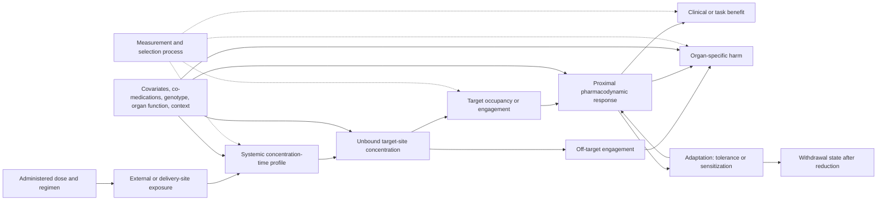

# Pharmacology and toxicology analogue audit

<!-- markdownlint-disable MD013 -->

**Date:** 2026-08-05  
**Scope:** dose-response, receptor occupancy, target engagement,
pharmacokinetics/pharmacodynamics (PK/PD), therapeutic windows, tolerance,
sensitization, physical dependence, withdrawal, hormesis, drug interactions,
adaptive dosing, toxicity, off-target effects, and population heterogeneity  
**Purpose:** separate the states between an administered intervention and its
benefits or harms; establish pharmacology, toxicology, and model-informed
precision dosing as mandatory nulls for any AI transfer; and reject universal
"small dose," hormesis, or scalar therapeutic-window rules.  
**Evidence boundary:** primary experiments and trials, foundational quantitative
papers, and authoritative regulatory or consensus methods. Reviews and
guidelines establish mature nulls or terminology; they do not make an AI
transfer true.

## Executive finding

Pharmacology is an unusually strong warning against treating an intervention as
a scalar knob. Administered amount, systemic exposure, unbound target-site
concentration, target engagement, proximal response, clinical benefit, and harm
are different variables. They can have different delays, nonlinearities,
covariates, observation errors, and recovery dynamics. A regimen that produces
the same cumulative administered amount can produce different peaks, troughs,
area under the curve, occupancy, benefit, toxicity, tolerance, and withdrawal.

No new principle is ready for the registry.

| Disposition | Result | Reason |
| --- | --- | --- |
| **Promote** | none | Receptor models, PK/PD, therapeutic drug monitoring, population mixed-effects models, Bayesian individualization, interaction nulls, benchmark-dose methods, and constrained adaptive control are established. |
| **Hold** | a **state- and withdrawal-qualified adaptive intervention contract**, only as a pharmacology-domain track under [Candidate 012](../../experiments/candidates/012-latency-qualified-authority.md) and [Candidate 014](../../experiments/candidates/014-versioned-observation-contract.md), composed with [Candidate 007](../../experiments/candidates/007-endogenous-observation-surveillance.md) and [Candidate 005](../../experiments/candidates/005-severity-ordered-containment.md) | The possible residual is an evaluation and authority contract that keeps exposure, engagement, benefit, organ-specific harm, tolerance, dependence, withdrawal, reserve, and observation provenance separate while the intervention itself changes later observations. It is not a new control law and must beat Bayesian PK/PD, TDM/MIPD, MPC/POMDP, and ordinary safety monitoring at equal lifecycle cost. |
| **Reject as distinct principles** | dose-response curves, occupancy gating, compartment models, effect compartments, indirect-response models, therapeutic windows, titration, adaptive dosing, tolerance/desensitization, synergy, off-target screening, and benchmark doses | Each is an established scoped method or phenomenon. Renaming it with biological language does not create a new invariant. |
| **Reject as a universal claim** | "low doses help," "stress improves systems," or hormesis as a default AI training rule | Biphasic responses can occur for particular agent-endpoint-model-time combinations, but the literature does not justify a general low-dose benefit law, a safe universal learning-rate schedule, or a regulatory default [@calabrese2003; @thayer2005; @mushak2007]. |

The held contract is intentionally conservative. If a conventional Bayesian
state estimator plus constrained receding-horizon controller, calibrated harm
monitors, and a taper/rollback policy matches it under the same observation,
compute, intervention, and reserve budgets, the candidate collapses into
established control and pharmacometrics.

## Terminology firewall: the intervention chain



These distinctions are normative for this audit.

- **Dose** is an administered amount, such as mg or mg/kg. **Dosage regimen**
  adds route, formulation, interval, infusion rate, duration, loading doses,
  missed doses, and taper. Cumulative dose alone does not determine exposure.
- **Exposure** is a concentration-time quantity such as peak concentration
  $C_{\max}$ in mg/L or area under a concentration-time curve (AUC) in
  mg h/L. AUC, peak, trough, and time above a threshold are not interchangeable.
- **Internal concentration** can mean total plasma, unbound plasma, total tissue,
  unbound tissue, or intracellular unbound concentration. The measurement
  matrix and fraction must be named. Mateus and colleagues experimentally
  showed why intracellular unbound concentration is a separate measurement
  problem [@mateus2013].
- **Target occupancy** is the fraction of available target bound under a stated
  model. **Target engagement** is evidence that the intervention interacts with
  its intended target in the relevant system. Neither is automatically a
  downstream response, benefit, or safety result [@black1983].
- **Pharmacodynamic response** is an endpoint-specific biological change.
  Biomarker movement is not automatically clinical benefit, and absence of a
  measured biomarker change is not proof of no relevant effect.
- **Benefit** and **harm** are separate endpoint vectors over time. A drug may
  improve one endpoint while worsening another; "net benefit" requires stated
  weights, horizon, population, and uncertainty.
- A **therapeutic window** is a regimen-, endpoint-, population-, and time-
  qualified region where benefit and harm are considered acceptable. It is not
  a universal fixed interval. The **therapeutic index** $TD_{50}/ED_{50}$ is a
  coarse population ratio, not an individual dosing law.
- **Tolerance** is reduced response after repeated exposure. **Sensitization**
  is increased response. **Physical dependence** is adaptation expressed as
  withdrawal after reduction or cessation. **Withdrawal** is the response to
  that reduction. **Addiction** includes behavioral and motivational phenomena
  and is not synonymous with tolerance or physical dependence [@fdaabuse2017;
  @williams2013; @robinson1993].
- **Interaction** requires a declared reference model and response scale.
  Pharmacokinetic interaction changes exposure; pharmacodynamic interaction
  changes response at given exposure. "More than additive" is undefined until
  additivity is defined [@bliss1939; @chou1984; @ichm12].
- **Off-target activity** is engagement outside the intended mechanism. It can
  produce harm, benefit, or no detectable phenotype. Predicted or in-vitro
  binding is not clinical causality [@keiser2009; @lounkine2012].
- **Hormesis** is a proposed biphasic dose-response pattern for a specified
  endpoint. Nonmonotonicity does not by itself establish benefit, adaptation,
  generality, or an optimal low dose [@calabrese2003; @thayer2005;
  @mushak2007].
- A **benchmark dose** (BMD) is a model-derived dose associated with a specified
  benchmark response (BMR). Its lower confidence bound (BMDL) is a statistical
  point of departure, not proof of a biological threshold [@crump1984;
  @epa2012].

## Quantitative boundary and units

### Binding is not response

For a one-site equilibrium occupancy model,

$$
\theta(C_f)=\frac{C_f}{K_D+C_f},
$$

where occupancy $\theta$ is dimensionless, free concentration $C_f$ is mol/L,
and dissociation constant $K_D$ is mol/L. The equation is dimensionally valid
because numerator and denominator have the same unit. It assumes equilibrium,
one homogeneous noncooperative target class, and a usable free concentration.
It does not establish receptor activation, transduction, spare-receptor
effects, benefit, or toxicity. Black and Leff's operational model is a
foundational formal reason not to collapse occupancy and response
[@black1983].

An empirical concentration-effect curve is often written

$$
E(C)=E_0+\frac{E_{\max}C^h}{EC_{50}^{h}+C^h},
$$

where $E$, $E_0$, and $E_{\max}$ use the endpoint's declared unit, $C$ and
$EC_{50}$ use the same concentration unit such as mg/L, and Hill coefficient
$h$ is dimensionless. This local model does not imply that $EC_{50}=K_D$, that
one molecular mechanism generated the curve, or that the curve extrapolates to
different tissues, times, populations, or endpoints.

### Administered amount is not internal exposure

For an intravenously supplied one-compartment model,

$$
\frac{dA(t)}{dt}=R_{\mathrm{in}}(t)-CL\,C(t),
\qquad
C(t)=\frac{A(t)}{V},
$$

where amount $A$ is mg, input rate $R_{\mathrm{in}}$ is mg/h, clearance $CL$
is L/h, concentration $C$ is mg/L, and apparent volume $V$ is L. Every term in
the first equation is mg/h. For a linear system with complete intravenous
observation and integration to infinity,

$$
\mathrm{AUC}_{0\rightarrow\infty}=\int_0^\infty C(t)\,dt
=\frac{\mathrm{Dose}}{CL},
$$

with AUC in mg h/L. The equality fails as a universal rule when bioavailability,
nonlinearity, time-varying clearance, incomplete integration, target-mediated
disposition, or other relevant processes violate its assumptions. Target
binding can itself alter disposition [@mager2001].

For first-order oral absorption,

$$
\frac{dA_g}{dt}=-k_aA_g,
\qquad
\frac{dA}{dt}=F k_a A_g-CL\,C,
$$

where gut amount $A_g$ is mg, absorption rate $k_a$ is h$^{-1}$, and
bioavailability $F$ is dimensionless. Equal swallowed dose does not guarantee
equal systemic input.

### Plasma exposure is not effect-site state

An effect compartment can represent a delay between plasma concentration and
effect:

$$
\frac{dC_e(t)}{dt}=k_{e0}\left(C_p(t)-C_e(t)\right),
$$

where $C_p$ and $C_e$ are mg/L and equilibration constant $k_{e0}$ is h$^{-1}$.
Both sides have units mg/(L h). Sheiner and colleagues used this construction
to jointly model plasma concentration and neuromuscular effect; it is a mature
PK/PD null, not a new slow-memory principle [@sheiner1979].

An indirect-response model can instead represent turnover of a response
variable:

$$
\frac{dR(t)}{dt}=k_{\mathrm{in}}\left[1-I(C(t))\right]-k_{\mathrm{out}}R(t),
$$

where $R$ has the endpoint unit, $k_{\mathrm{in}}$ has endpoint-unit/h,
$k_{\mathrm{out}}$ is h$^{-1}$, and inhibition $I$ is dimensionless. Delayed
response can therefore arise from target-site equilibration, turnover,
feedback, irreversible action, disease progression, or observation delay;
curve lag alone does not identify which mechanism generated it
[@mager2003].

### Tolerance and withdrawal require state

A minimal sensitivity-state model is

$$
\frac{dS(t)}{dt}
=\frac{S_0-S(t)}{\tau_S}-\alpha C(t)S(t),
\qquad
E(t)=E_0+S(t)g(C(t)),
$$

where sensitivity $S$ and baseline $S_0$ are dimensionless, recovery time
$\tau_S$ is h, concentration $C$ is mg/L, adaptation coefficient $\alpha$ is
L/(mg h), and $g(C)$ has the response unit. This is an audit model, not a claim
that all tolerance has one mechanism. Receptor regulation, cellular and network
counteradaptation, learning, disease change, and measurement drift can yield
different trajectories [@siegel1975; @williams2013].

A withdrawal-qualified controller must also retain a slow adapted state $z$
whose safe region may depend on the rate of dose reduction:

$$
\frac{dz(t)}{dt}=f_z\!\left(z(t),C(t),x(t)\right),
\qquad
H_{\mathrm{wd}}(t)=h_{\mathrm{wd}}\!\left(z(t),C(t),\dot C(t),x(t)\right),
$$

where $x$ is contextual state, $z$ has declared mechanism-specific units or is
explicitly normalized, and withdrawal harm $H_{\mathrm{wd}}$ uses a declared
clinical or task scale. The equation only states a necessary state distinction;
its functions and time constants must be identified per domain.

### Population variation and individual updating

A common positive-parameter mixed-effects model is

$$
\vartheta_i=\vartheta_{\mathrm{pop}}
\exp\!\left(\beta^\top x_i+\eta_i\right),
\qquad
\eta_i\sim\mathcal N(0,\omega^2),
$$

where individual parameter $\vartheta_i$ and population value
$\vartheta_{\mathrm{pop}}$ share a physical unit such as L/h, covariates $x_i$
and coefficients $\beta$ are scaled so their inner product is dimensionless,
and random effect $\eta_i$ is dimensionless. This form does not guarantee a
normal population, a causal covariate, transportability, or adequate tail
coverage [@sheiner1980; @fdapoppk2022].

Bayesian individualization updates rather than replaces the population model:

$$
p(\vartheta_i\mid y_{1:k},d_{1:k})
\propto
p(y_{1:k}\mid \vartheta_i,d_{1:k})p(\vartheta_i),
$$

where $y_{1:k}$ are timestamped concentration, engagement, response, benefit,
and harm observations and $d_{1:k}$ is the administered regimen. Sheiner,
Rosenberg, and Melmon described computer-aided individual dosage using clinical
observations and subsequent blood levels in 1972 [@sheiner1972]. Modern MIPD
and TDM are therefore mandatory nulls [@darwich2017; @rybak2020].

### Benefit and harm remain a vector

Until value weights are declared, retain

$$
\mathbf Y(T)=
\left[
B_1(T),\ldots,B_m(T),
H_1(T),\ldots,H_n(T),
\mathrm{AUC}(T),C_{\max}(T),C_{\min}(T),
T_{\mathrm{support}},E_{\mathrm{control}}
\right],
$$

where benefit and harm endpoints retain their native units or declared scales,
AUC is mg h/L, concentrations are mg/L, support time is h, and control energy
is J. There is no dimensionally meaningful unweighted sum of these entries.

The historical therapeutic-index summary

$$
TI=\frac{TD_{50}}{ED_{50}}
$$

is dimensionless when toxic and effective doses use the same unit. It compares
two population medians for specified endpoints; it does not describe joint
individual benefit-harm distributions, irreversible harm, time course,
withdrawal, or susceptible subgroups. ICH E4 explicitly warns that no single
dose need be optimal for all patients [@iche4].

### Interaction nulls are model-dependent

For two agents, Loewe dose additivity at a fixed effect level $E$ is

$$
\frac{d_1}{D_1(E)}+\frac{d_2}{D_2(E)}=1,
$$

where $d_j$ and equivalent single-agent dose $D_j(E)$ use the same unit for
agent $j$. For independent fractional inhibitions on a $[0,1]$ scale, the
Bliss null is

$$
E_{12}^{\mathrm{Bliss}}=E_1+E_2-E_1E_2.
$$

The two nulls answer different questions. A combination can be synergistic
under one reference model and not another. PK interactions, schedule order,
toxicity, and uncertainty must be modeled separately [@bliss1939; @chou1984;
@ichm12].

### Toxicity points of departure are statistical objects

For adverse-response function $R(d)$ and chosen benchmark response $BMR$,

$$
BMD=\inf\left\{d\ge 0:R(d)-R(0)\ge BMR\right\},
$$

where dose $d$ might be mg/(kg day) and $R$ and $BMR$ are dimensionless
probabilities or consistently scaled endpoint changes. BMDL is a lower
confidence bound for a specified model and confidence level. It is not a
no-effect threshold, and model choice, endpoint selection, exposure route,
duration, species, and uncertainty remain visible [@crump1984; @epa2012].

## Evidence audit cards

### PHARM-01 — Occupancy and response are separable

**Evidence design.** Black and Leff derived an operational model from receptor
occupancy and a separate transducer relation, explaining why concentration-
effect curves depend on both affinity and efficacy/system properties
[@black1983].

**Exact problem.** A bound fraction is often reported as if it were the effect.
Receptor reserve, coupling, amplification, desensitization, competing ligands,
and tissue-specific transduction break that identification.

**Information and authority path.** Free concentration informs binding state;
binding state enters a tissue-specific transduction system; no occupancy
measurement by itself authorizes a claim of benefit or safety.

**Timescale and units.** Binding and equilibration range from experimental to
system-specific timescales; $C_f$, $K_D$, and $EC_{50}$ must share a declared
concentration unit. Occupancy is dimensionless; response retains endpoint units.

**Resource cost.** Binding assays, engagement measurements, functional assays,
and clinical endpoints consume different samples, time, instrumentation, and
statistical power.

**Assumptions.** Equilibrium, target homogeneity, free concentration, and model
form must be tested rather than imported.

**Failure boundary.** High occupancy can coexist with weak benefit, partial
agonism, receptor reserve, adverse off-target response, or ceiling effects.

**Strongest statistical or engineering null.** A calibrated operational
receptor model or ordinary nonlinear state-space PK/PD model with the same
observations.

**P/candidate mapping and disposition.** At most [P-001](../principle-registry.md#p-001--selective-allocation) routing/gating language; reject as a distinct AI principle. Temporary claim [PHARM-T01](#temporary-claims).

### PHARM-02 — Internal exposure is a dynamic latent state

**Evidence design.** Foundational PK/PD work modeled concentration and response
jointly [@sheiner1979]; target-mediated drug disposition formalized cases where
binding itself makes disposition nonlinear [@mager2001]; direct cell work
measured intracellular unbound concentrations rather than assuming plasma and
cell equivalence [@mateus2013].

**Exact problem.** An administered amount is confused with the concentration
that can reach and engage a target.

**Information and authority path.** Regimen enters absorption/distribution/
metabolism/elimination; samples partially observe those states; target-site
concentration remains inferred unless directly measured.

**Timescale and units.** Amount mg, rate mg/h, clearance L/h, volume L,
concentration mg/L, AUC mg h/L, and rate constants h$^{-1}$.

**Resource cost.** Sampling frequency, bioanalysis, tissue access, model
calibration, and uncertainty estimation are charged; sparse sampling is not
free observability.

**Assumptions.** Compartment count, linearity, stationarity, bioavailability,
sampling error, and target-site surrogacy.

**Failure boundary.** Nonlinear clearance, organ dysfunction, transporters,
active metabolites, changing protein binding, and target-mediated disposition
can invalidate dose-only inference.

**Strongest statistical or engineering null.** Identifiable compartmental,
physiologically based, or nonlinear state-space models selected and checked on
held-out concentration-time data.

**P/candidate mapping and disposition.** [P-012](../principle-registry.md#p-012--memory-matched-to-information-lifetime) describes timescale matching but does not add PK; [Candidate 014](../../experiments/candidates/014-versioned-observation-contract.md) must carry specimen and model support. Reject as distinct; hold the observation-contract refinement. Temporary claims [PHARM-T02](#temporary-claims) and [PHARM-T03](#temporary-claims).

### PHARM-03 — Delayed effect has multiple mechanistic nulls

**Evidence design.** The d-tubocurarine study fit an effect compartment to
non-equilibrium plasma and paralysis measurements [@sheiner1979]. Mechanism-
based PD literature enumerates direct, effect-compartment, turnover, precursor,
irreversible, and tolerance models [@mager2003].

**Exact problem.** Lag, hysteresis, persistence, or slow recovery is treated as
evidence of a special memory mechanism.

**Information and authority path.** Plasma concentration, effect-site state,
turnover state, disease state, and measurement process are competing mediators.
Intervention authority should depend on their identified support.

**Timescale and units.** Delay constants are h$^{-1}$ or time units; response
turnover has endpoint-unit/h. Sampling interval must resolve the claimed state.

**Resource cost.** Distinguishing mechanisms needs transient perturbations,
multiple timepoints, and sometimes more than one endpoint.

**Assumptions.** Structural identifiability, informative input, reliable
timestamps, and no unmodeled disease drift.

**Failure boundary.** Several models can fit the same sparse hysteresis loop yet
predict different washout, re-dosing, or taper behavior.

**Strongest statistical or engineering null.** Standard delay, low-pass filter,
state-space, indirect-response, and system-identification models at matched
state dimension and data budget.

**P/candidate mapping and disposition.** Deduplicates to [P-006](../principle-registry.md#p-006--homeostatic-negative-feedback), [P-012](../principle-registry.md#p-012--memory-matched-to-information-lifetime), and the receiver dynamics already audited in [endocrine and circadian control](2026-08-05-endocrine-circadian-control.md). Reject as distinct. Temporary claim [PHARM-T04](#temporary-claims).

### PHARM-04 — The therapeutic window is a qualified region, not a constant

**Evidence design.** ICH E4 separates dose, blood concentration, desirable
response, and undesirable response, and states that individual variation can
make different doses appropriate [@iche4]. FDA exposure-response guidance
likewise uses exposure-response to understand efficacy, toxicity, subgroups,
and altered regimens [@fdaer2003].

**Exact problem.** A single lower and upper dose bound, or a single therapeutic
index, is assumed to guarantee benefit and safety.

**Information and authority path.** Separate benefit and harm models plus
patient state and uncertainty define an admissible regimen; neither a target
concentration nor a population median self-authorizes dosing.

**Timescale and units.** Dose mg or mg/kg; concentration mg/L; AUC mg h/L;
benefit/harm in endpoint units; time-to-event and persistence need a horizon.

**Resource cost.** Multiple endpoints, long follow-up, rare-harm detection,
adherence assessment, and quality-of-life measurement are part of the budget.

**Assumptions.** Endpoint validity, acceptable risk weights, transportable
population, reversible harm where assumed, and adequate tail sampling.

**Failure boundary.** Irreversible or delayed toxicity, narrow susceptible
subgroups, interactions, tolerance, withdrawal, and changing disease state can
move or erase the useful region.

**Strongest statistical or engineering null.** Multi-objective constrained
optimization with calibrated benefit/harm models and robust or chance
constraints.

**P/candidate mapping and disposition.** Maps to [Candidate 012](../../experiments/candidates/012-latency-qualified-authority.md), not a new principle. It reinforces the vector accounting in [pathology and rehabilitation](2026-08-05-pathology-rehabilitation.md). Temporary claims [PHARM-T05](#temporary-claims) and [PHARM-T06](#temporary-claims).

### PHARM-05 — Population averages do not define individual safety

**Evidence design.** Population PK uses mixed-effects models to estimate
variation and covariates [@sheiner1980; @fdapoppk2022]. In PREDICT-1,
prospective HLA-B*5701 screening reduced clinically diagnosed abacavir
hypersensitivity from 7.8% to 3.4% and eliminated immunologically confirmed
hypersensitivity in the screened group, demonstrating a specific predictive
subgroup rather than a universal precision rule [@mallal2008].

**Exact problem.** Mean exposure-response is treated as applicable to every
individual, while genetic, organ-function, age, co-medication, adherence,
context, and latent mixture differences are hidden.

**Information and authority path.** Population prior plus covariates and
individual observations update a posterior; subgroup markers authorize only
the decision for which analytic and clinical validity were established.

**Timescale and units.** Individual PK parameters retain units such as L/h;
random effects are dimensionless; adverse-event risk is a probability over a
declared period.

**Resource cost.** Representative recruitment, subgroup sample size, assay
accuracy, external validation, and follow-up are charged.

**Assumptions.** Correct mixture/covariate form, positivity, transportability,
measurement validity, and stable clinical practice.

**Failure boundary.** Rare tails, unmeasured covariates, ancestry-confounded
markers, dataset shift, and interacting organ dysfunction can defeat a mean or
single-genotype rule.

**Strongest statistical or engineering null.** Hierarchical/mixed-effects or
mixture models with clinical covariates, calibrated uncertainty, subgroup
validation, and conservative fallback.

**P/candidate mapping and disposition.** Deduplicates to [P-001](../principle-registry.md#p-001--selective-allocation) and [Candidate 014](../../experiments/candidates/014-versioned-observation-contract.md). Reject generic "personalization" as a principle; retain heterogeneity as a mandatory benchmark regime. Temporary claim [PHARM-T07](#temporary-claims).

### PHARM-06 — A useful covariate can still fail to improve a dosing system

**Evidence design.** Two contemporaneous randomized warfarin trials produced
different system-level results. COAG found no improvement over a clinical
algorithm and worse anticoagulation control in its Black subgroup
[@kimmel2013]. EU-PACT found improved time in therapeutic range over its
standard-dosing control [@pirmohamed2013]. The algorithms, comparators,
populations, genotypes, dosing procedures, and follow-up context differed.

**Exact problem.** Predictive association or mechanistic relevance is assumed
to guarantee clinical utility of an adaptive intervention policy.

**Information and authority path.** Marker and clinical variables enter an
algorithm; the algorithm changes dose; subsequent INR observations trigger
further changes; utility belongs to the complete closed loop and comparator.

**Timescale and units.** Warfarin dose mg/day; INR dimensionless; time in target
range is a proportion over a declared follow-up interval.

**Resource cost.** Genotyping latency/cost, clinical data, algorithm operation,
monitoring, dose adjustment, and adverse events all count.

**Assumptions.** Population-relevant variants, accurate genotype, comparable
standard care, adherence, and adequate feedback.

**Failure boundary.** An incomplete variant set, strong clinical feedback,
different control algorithm, or subgroup representation can remove or reverse
the added value.

**Strongest statistical or engineering null.** The best clinical-only feedback
algorithm with identical measurements after genotyping cost is reallocated to
monitoring or follow-up.

**P/candidate mapping and disposition.** Supports [Candidate 007](../../experiments/candidates/007-endogenous-observation-surveillance.md) and [Candidate 014](../../experiments/candidates/014-versioned-observation-contract.md): intervention and observation form a loop. Reject "more features means better personalization." Temporary claim [PHARM-T08](#temporary-claims).

### PHARM-07 — Adaptive dosage is an established Bayesian feedback problem

**Evidence design.** Computer-aided individual PK dosage was formulated using
clinical observations and blood levels in 1972 [@sheiner1972]. Population PK,
TDM, Bayesian forecasting, and MIPD are mature methods [@fdapoppk2022;
@darwich2017]. Vancomycin guidance makes AUC-guided monitoring and Bayesian
estimation an authoritative clinical null for a scoped drug/indication
[@rybak2020].

**Exact problem.** Repeated measurement and dose adjustment is presented as a
novel adaptive-compute principle.

**Information and authority path.** Population model and patient data update
latent PK/PD parameters; a decision rule selects a dose under efficacy and
toxicity constraints; new observations close the loop.

**Timescale and units.** Sampling and dose intervals range by therapy; dose,
concentration, AUC, clearance, response, and harm keep their units.

**Resource cost.** Sampling, assays, software validation, clinician attention,
missed-dose handling, uncertainty, and fallback are part of the controller.

**Assumptions.** Fit-for-population structural model, timely correct samples,
known dose history, stable assay, achievable target, and action adherence.

**Failure boundary.** Model misspecification, stale or contaminated samples,
rapid organ change, endogenous observation, target mismatch, or slow actuation
can make adaptive dosing worse than a robust fixed policy.

**Strongest statistical or engineering null.** Bayesian MIPD/TDM and constrained
MPC/POMDP with identical observations, action frequency, compute, human review,
and safety fallback.

**P/candidate mapping and disposition.** Deduplicates to [P-007](../principle-registry.md#p-007--prediction-error-allocation), [P-012](../principle-registry.md#p-012--memory-matched-to-information-lifetime), [Candidate 007](../../experiments/candidates/007-endogenous-observation-surveillance.md), [Candidate 012](../../experiments/candidates/012-latency-qualified-authority.md), and [Candidate 014](../../experiments/candidates/014-versioned-observation-contract.md). Reject as distinct. Temporary claims [PHARM-T09](#temporary-claims) and [PHARM-T10](#temporary-claims).

### PHARM-08 — Tolerance is mechanism-, endpoint-, and context-specific

**Evidence design.** Siegel's rat experiments showed context-dependent morphine
analgesic tolerance and conditioned compensatory responses [@siegel1975].
Opioid-receptor work distinguishes receptor desensitization, phosphorylation,
internalization, cellular/network counteradaptation, and behavioral context
[@williams2013].

**Exact problem.** Declining effect at a repeated dose is attributed to one
universal homeostatic mechanism, or assumed to justify unbounded dose
escalation.

**Information and authority path.** Exposure history and contextual cues alter
latent sensitivity; the same dose then produces a different endpoint. Dose
escalation also changes toxicity and dependence states.

**Timescale and units.** Exposure history mg h/L; response endpoint-specific;
adaptation and recovery time constants h to longer system-specific intervals.

**Resource cost.** Longitudinal controls, context transfer, washout, multiple
endpoints, and harm monitoring are required.

**Assumptions.** Stable disease, reliable exposure, separated pharmacokinetic
and pharmacodynamic change, and endpoint-specific measurement.

**Failure boundary.** Disease progression, nonadherence, enzyme induction,
assay drift, receptor changes, conditioned response, or sensitization can mimic
or oppose simple tolerance.

**Strongest statistical or engineering null.** Time-varying parameter PK/PD,
state-space adaptation, contextual conditioning, and change-point models with
the same state and data budget.

**P/candidate mapping and disposition.** Maps to [P-006](../principle-registry.md#p-006--homeostatic-negative-feedback) and [P-012](../principle-registry.md#p-012--memory-matched-to-information-lifetime); overlaps the adverse-adaptation boundary in [pathology and rehabilitation](2026-08-05-pathology-rehabilitation.md). Reject a universal tolerance principle. Temporary claim [PHARM-T11](#temporary-claims).

### PHARM-09 — Dependence, withdrawal, and addiction must remain separate

**Evidence design.** Naloxone-paired cues elicited conditioned withdrawal signs
in methadone-dependent volunteers [@obrien1977]. FDA terminology separates
tolerance, physical dependence, withdrawal, abuse, and addiction
[@fdaabuse2017]. Incentive-sensitization and opponent/allostatic accounts also
show why increased wanting, reduced effect, and withdrawal are not one scalar
adaptation [@robinson1993; @koob1997].

**Exact problem.** A system is judged only while support is present, or support
removal is treated as the inverse of support addition.

**Information and authority path.** Repeated intervention changes slow state;
abrupt reduction interacts with that state and context; withdrawal observations
can feed back into reinstatement, creating endogenous data and authority.

**Timescale and units.** Dose-reduction rate mg/day$^2$ or equivalent schedule;
withdrawal signs have endpoint-specific scales and durations; no universal
biological time constant transfers to AI.

**Resource cost.** Taper duration, monitoring, rescue intervention, recurrence,
support burden, and harm during and after withdrawal are charged.

**Assumptions.** Identified dependence state, controllable taper, observable
withdrawal, and safe fallback.

**Failure boundary.** Delayed/protracted withdrawal, cue-triggered response,
relapse, irreversible adaptation, and multiple co-interventions can make a
simple rollback unsafe.

**Strongest statistical or engineering null.** A constrained ramp-down/
decommissioning controller with hysteresis, dwell times, state estimation,
rollback tests, and post-removal surveillance.

**P/candidate mapping and disposition.** Refines [Candidate 005](../../experiments/candidates/005-severity-ordered-containment.md), [Candidate 007](../../experiments/candidates/007-endogenous-observation-surveillance.md), [Candidate 010](../../experiments/candidates/010-reset-coupled-staged-verification.md), [Candidate 012](../../experiments/candidates/012-latency-qualified-authority.md), and compensation-aware recovery in [pathology and rehabilitation](2026-08-05-pathology-rehabilitation.md). Hold only the explicit withdrawal axis; do not promote. Temporary claims [PHARM-T12](#temporary-claims) and [PHARM-T13](#temporary-claims).

### PHARM-10 — Interaction and "synergy" depend on the null

**Evidence design.** Bliss distinguished joint-action reference cases
[@bliss1939]; Chou and Talalay developed a mass-action combination-index method
[@chou1984]; ICH M12 separates clinical and mechanistic study of
enzyme/transporter-mediated and pharmacodynamic interactions [@ichm12].

**Exact problem.** A combination is called synergistic because its observed
effect exceeds an informal arithmetic sum.

**Information and authority path.** Each agent changes exposure and/or response;
the comparison model maps single-agent curves and schedules to an expected
combination response; only residual deviation from a prespecified null is an
interaction statistic.

**Timescale and units.** Doses retain agent-specific units; fractional effect is
dimensionless only after a defined normalization; schedule order and interval
have time units.

**Resource cost.** Full single-agent curves, combination grid, replicate count,
PK measurements, toxicity endpoints, and multiplicity correction are charged.

**Assumptions.** Valid single-agent curves, chosen null, comparable effect
scale, no hidden solvent/formulation effect, and adequate grid coverage.

**Failure boundary.** A result can reverse across Loewe, Bliss, highest-single-
agent, response-surface, or time-varying nulls; benefit synergy can coexist with
toxicity synergy.

**Strongest statistical or engineering null.** Prespecified Loewe, Bliss,
highest-single-agent, and mechanistic PK/PD surfaces with uncertainty and
held-out schedule validation.

**P/candidate mapping and disposition.** Composition does not create a new
principle. It may instantiate [P-001](../principle-registry.md#p-001--selective-allocation) or [P-006](../principle-registry.md#p-006--homeostatic-negative-feedback), but should be rejected unless it beats explicit interaction nulls. Temporary claim [PHARM-T14](#temporary-claims).

### PHARM-11 — Off-target prediction is a hypothesis generator, not a safety proof

**Evidence design.** Keiser and colleagues predicted and experimentally tested
unexpected targets for known drugs [@keiser2009]. Lounkine and colleagues
predicted activity of 656 marketed drugs against 73 side-effect-associated
targets; about half of tested predictions were confirmed in proprietary data or
new assays, with one link followed into a functional human-blood assay
[@lounkine2012].

**Exact problem.** Intended-target selectivity, a clean prediction score, or a
finite assay panel is treated as absence of side effects.

**Information and authority path.** Chemical similarity or assay data generates
target hypotheses; binding/function assays test engagement; exposure and tissue
state mediate phenotype; clinical data test adverse outcomes.

**Timescale and units.** Affinity/concentration mol/L; exposure mg h/L; adverse
event probability over a declared interval. Assay concentrations must be
compared with plausible unbound target-site exposure.

**Resource cost.** Target panels, functional assays, tissue models, exposure
measurement, rare-event surveillance, and follow-up are charged.

**Assumptions.** Panel coverage, assay relevance, free concentration,
translation to tissue, and sufficient clinical power.

**Failure boundary.** Unknown targets, metabolites, immune effects, interactions,
developmental windows, rare susceptibilities, or functional bias can escape a
finite screen.

**Strongest statistical or engineering null.** Conventional adversarial testing,
hazard analysis, out-of-distribution evaluation, fault injection, and
post-deployment surveillance at matched assay/compute budget.

**P/candidate mapping and disposition.** Maps to [P-007](../principle-registry.md#p-007--prediction-error-allocation), [P-009](../principle-registry.md#p-009--maintenance-plane), [Candidate 005](../../experiments/candidates/005-severity-ordered-containment.md), and [Candidate 014](../../experiments/candidates/014-versioned-observation-contract.md). Reject "no observed off-targets" as a proof of safety. Temporary claim [PHARM-T15](#temporary-claims).

### PHARM-12 — Hormesis is not a transferable default

**Evidence design.** Calabrese and Baldwin argue that low-dose stimulation and
high-dose inhibition are broadly observed and consequential [@calabrese2003].
Thayer and colleagues contest its use as a public-health default
[@thayer2005]. Mushak identifies unstable definitions, weak generalization to
humans, endpoint multiplicity, mechanism uncertainty, and study-design limits
[@mushak2007]. These are competing interpretations, not a settled universal
law.

**Exact problem.** A U-shaped or inverted-U plot for one measured endpoint is
converted into "small stress is beneficial" for the organism or an AI system.

**Information and authority path.** Dose influences multiple mechanisms and
endpoints with different thresholds and times; selection, survival, and
measurement determine what appears in the plotted sample.

**Timescale and units.** Dose and concentration retain physical units; endpoint,
baseline, and observation time must be declared. A low-dose region cannot be
defined only as a fraction of the highest tested dose.

**Resource cost.** Dense dose grid around control, independent replication,
multiple prespecified endpoints, longitudinal follow-up, mechanistic assays,
and multiplicity control are required.

**Assumptions.** Stable control, adequate low-dose resolution, no selective
attrition, prespecified model family, clinically meaningful endpoint, and no
unmeasured harm endpoint.

**Failure boundary.** Superposed monotonic mechanisms, floor/ceiling effects,
regression to the mean, batch drift, survivor selection, multiple comparisons,
baseline imbalance, and benefit on one endpoint with harm on another can mimic
or invalidate a hormetic interpretation.

**Strongest statistical or engineering null.** Prespecified monotone models,
flexible splines, multi-mechanism mixtures, and no-effect models compared by
out-of-sample prediction, with multiplicity-corrected endpoint families and
independent replication.

**P/candidate mapping and disposition.** Apparent adaptive response can reduce
to [P-006](../principle-registry.md#p-006--homeostatic-negative-feedback),
[P-007](../principle-registry.md#p-007--prediction-error-allocation), or
[P-009](../principle-registry.md#p-009--maintenance-plane). Reject universal
hormesis and any direct AI learning-rate analogy. Hold only agent-endpoint-time
specific empirical hypotheses. Temporary claims [PHARM-T16](#temporary-claims)
and [PHARM-T17](#temporary-claims).

### PHARM-13 — Toxicity is pathway-, organ-, time-, and population-specific

**Evidence design.** Crump proposed benchmark-dose modeling to use more of the
dose-response information than a no-observed-effect level [@crump1984]. EPA's
guidance formalizes BMD/BMDL model checking and reporting [@epa2012]. The
National Research Council's toxicity-testing strategy emphasizes perturbation
of toxicity pathways while recognizing the work needed to relate assays to
human risk [@nrc2007].

**Exact problem.** A single threshold, one acute assay, or absence of observed
harm is treated as universal safety.

**Information and authority path.** Exposure perturbs molecular/cellular
pathways; tissue and organism state mediate adverse outcomes; toxicokinetics,
selection, and measurement mediate observation; risk assessment adds
cross-species and low-dose inference.

**Timescale and units.** Dose mg/(kg day) or route-specific units; concentration
mg/L; response probability dimensionless; latency and follow-up in days to
years. Acute and chronic schedules are different interventions.

**Resource cost.** Multi-organ endpoints, repeated exposure, recovery, life-
stage coverage, pathology, mixture testing, and uncertainty analysis are
charged.

**Assumptions.** Endpoint relevance, dose metric, model form, species/system
translation, background response, and follow-up sufficiency.

**Failure boundary.** Rare, delayed, developmental, immune, cumulative,
irreversible, mixture, and susceptible-subpopulation harms can evade a small
short study.

**Strongest statistical or engineering null.** Hazard analysis plus
multi-endpoint stress testing, survival/reliability models, benchmark-response
curves, fault injection, and post-deployment surveillance with declared
coverage.

**P/candidate mapping and disposition.** Maps to [P-009](../principle-registry.md#p-009--maintenance-plane), [Candidate 005](../../experiments/candidates/005-severity-ordered-containment.md), [Candidate 007](../../experiments/candidates/007-endogenous-observation-surveillance.md), and [Candidate 014](../../experiments/candidates/014-versioned-observation-contract.md). Reject scalar safety. Temporary claims [PHARM-T18](#temporary-claims) and [PHARM-T19](#temporary-claims).

### PHARM-14 — Adaptive intervention changes the observation process

**Evidence design.** FDA exposure-response and population-PK guidance require
prospective analysis, covariate evaluation, diagnostics, uncertainty, and
reporting [@fdaer2003; @fdapoppk2022]. The contrasting warfarin trials show that
the complete intervention-observation-comparator system determines utility
[@kimmel2013; @pirmohamed2013].

**Exact problem.** After treatment begins, observed responders, tolerated doses,
lab values, discontinuations, and follow-up are treated as passive samples from
an unchanged population.

**Information and authority path.** Estimated state selects a dose; dose changes
exposure, outcome, dropout, sampling, rescue, and subsequent authority. The
telemetry channel is endogenous.

**Timescale and units.** Every observation carries event time, availability
time, support interval, specimen/assay unit, dose history, and intervention
latency.

**Resource cost.** Sampling decisions, clinician review, missingness recovery,
rescue actions, discontinuation, and follow-up are explicit.

**Assumptions.** Identifiable action effects, recorded dose/adherence, modeled
sampling/attrition, stable assay version, and adequate exploration.

**Failure boundary.** Confounding by indication, informative monitoring,
immortal-time/selection effects, treatment discontinuation, rescue therapy, and
measurement drift can make adaptive policy data self-confirming.

**Strongest statistical or engineering null.** Delay-aware POMDP/dual control,
causal longitudinal models, target-trial emulation where appropriate,
sequential detection, and value-of-information sampling under the same action
and observation budget.

**P/candidate mapping and disposition.** This is already the core boundary of
[Candidate 007](../../experiments/candidates/007-endogenous-observation-surveillance.md) and [Candidate 014](../../experiments/candidates/014-versioned-observation-contract.md), with authority limited by [Candidate 012](../../experiments/candidates/012-latency-qualified-authority.md). Reject a separate pharmacology candidate. Temporary claim [PHARM-T20](#temporary-claims).

## Hormesis adjudication

The audit does not claim that all dose-response curves are monotonic. It rejects
the stronger inference that any low-dose departure from control is beneficial,
adaptive, general, or transferable.

A hormesis claim is admissible only in this scoped form:

> For agent $a$, route and regimen $r$, model or population $p$, endpoint $e$,
> observation window $T$, and prespecified dose metric $d$, a replicated
> nonmonotonic response predicts a meaningful improvement relative to control
> while declared harm endpoints do not worsen beyond their margins.

It must survive all of the following:

1. a control and dose grid dense enough to locate both arms of the curve;
2. prespecified endpoint, direction, window, model family, and multiplicity
   procedure;
3. comparison against monotone, null, flexible, and multi-mechanism models;
4. blinded or otherwise bias-resistant measurement and batch balancing;
5. attrition, survival, floor/ceiling, and baseline-sensitivity analyses;
6. independent replication with the same units and protocol;
7. simultaneous benefit and harm accounting, including delayed endpoints;
8. failure to generalize being reported as a boundary, not averaged away.

Even a successful result would support only an agent-endpoint-time hypothesis.
It would not license "small gradient noise improves learning," "minor damage
strengthens the model," or a universal optimal stress schedule.

## Deduplication matrix

### Existing principles

| Existing ID | Apparent pharmacology analogue | Deduplication result |
| --- | --- | --- |
| [P-001](../principle-registry.md#p-001--selective-allocation) | receptor selectivity, tissue targeting, dose allocation | Established targeting/routing; occupancy does not add a new allocation invariant. |
| [P-006](../principle-registry.md#p-006--homeostatic-negative-feedback) | tolerance, receptor down-regulation, counteradaptation, recovery | Homeostasis is one possible mechanism, not a universal explanation of tolerance, dependence, sensitization, or hormesis. |
| [P-007](../principle-registry.md#p-007--prediction-error-allocation) | TDM sampling, Bayesian updating, toxicity surveillance | Established adaptive estimation/value-of-information nulls remain stronger. |
| [P-009](../principle-registry.md#p-009--maintenance-plane) | detoxification, repair, monitoring, taper, adverse-event surveillance | Maintenance and recovery already exist; pharmacology adds endpoint- and exposure-specific accounting. |
| [P-012](../principle-registry.md#p-012--memory-matched-to-information-lifetime) | effect compartments, tolerance and withdrawal states, population prior plus individual posterior | These are established multiscale state-estimation models, not evidence for a new memory principle. |

### Existing candidates

| Candidate | Pharmacology overlap | Disposition here |
| --- | --- | --- |
| [002: multiscale context broadcast](../../experiments/candidates/002-multiscale-context-broadcast.md) | circulating exposure and receiver-specific response | Dose/concentration waveform effects belong to the [endocrine/circadian audit](2026-08-05-endocrine-circadian-control.md); standard PK/PD filters and receiver models are mandatory nulls. No separate candidate. |
| [003: recovery dynamics and fragility](../../experiments/candidates/003-recovery-dynamics-fragility.md) | washout, rebound, tolerance recovery, organ reserve | Recovery rate is mechanism-specific and can be confounded by PK, disease, feedback, and measurement. It is not a universal early warning. |
| [005: severity-ordered containment](../../experiments/candidates/005-severity-ordered-containment.md) | dose reduction, antidote, rescue, discontinuation, taper, support | Withdrawal makes abrupt removal a distinct hazard and strengthens compensation-aware recovery accounting; no new containment principle. |
| [007: endogenous observation surveillance](../../experiments/candidates/007-endogenous-observation-surveillance.md) | titration changes biomarkers, sampling, dropout, adherence, and later dose | Direct overlap. Pharmacology supplies a benchmark domain, not a new candidate. |
| [010: reset-coupled staged verification](../../experiments/candidates/010-reset-coupled-staged-verification.md) | washout, dechallenge/rechallenge, staged dose escalation | Rechallenge is not a generic safe verifier; irreversible harm, sensitization, long half-life, and withdrawal can prevent clean reset. |
| [012: latency-qualified authority](../../experiments/candidates/012-latency-qualified-authority.md) | admissible dose depends on sample age, assay integrity, exposure estimate, benefit/harm state, and reserve | Hold the state- and withdrawal-qualified domain track only if it beats constrained PK/PD control with the same safety stack. |
| [014: observation contract](../../experiments/candidates/014-versioned-observation-contract.md) | specimen, assay, free/total fraction, timing, dose history, model version, support population | Direct refinement: no concentration, occupancy, response, or harm estimate is valid without these fields and dependency invalidation. |

### Adjacent audits

- [Endocrine and circadian control](2026-08-05-endocrine-circadian-control.md)
  already owns the claim that matched mean input can produce different outcomes
  under waveform decoding and receiver recovery. This audit adds PK, exposure,
  target engagement, benefit/harm, and interaction boundaries; it does not
  reopen Candidate 002.
- [Pathology and rehabilitation](2026-08-05-pathology-rehabilitation.md)
  already establishes that more adaptation, earlier intervention, or greater
  dose is not monotonically better; compensation is not restoration; and dose
  is a schedule. This audit supplies quantitative PK/PD and withdrawal nulls.
- [Epidemiology and surveillance control](2026-08-05-epidemiology-and-surveillance-control.md)
  already owns endogenous observation, partial observability, delayed
  reporting, and intervention-aware surveillance. Adaptive dosing is a scoped
  instance.
- [Process engineering](2026-08-05-process-engineering.md) already establishes
  state estimation, MPC, real-time optimization, safety layers, lifecycle
  accounting, and transition hazards as mature engineering nulls.
- [Metrology and measurement science](2026-08-05-metrology-measurement-science.md)
  already establishes measurand, uncertainty, calibration, decision, drift,
  and provenance contracts. Drug concentration and response measurements do
  not bypass those requirements.

## AI transfer boundary

| Pharmacology result | Admissible AI transfer | Forbidden shortcut | Mature null |
| --- | --- | --- | --- |
| Dose is not exposure | Separate commanded intervention from realized internal state | Treat learning rate, token budget, or tool-call count as delivered effect | logged state-space/system-identification model |
| Occupancy is not response | Measure gate use, downstream computation, task effect, and harm separately | Claim active experts or high attention weights caused benefit | causal ablation plus calibrated response model |
| Same AUC can hide different peaks | Test schedule, peak, trough, duration, and recovery | Match only total FLOPs or cumulative updates | matched-resource waveform/schedule sweep |
| Therapeutic window is qualified | Define admissible action sets by task, state, uncertainty, and protected outcomes | Use one universal safe update or pruning interval | robust/chance-constrained MPC or runtime assurance |
| Population heterogeneity matters | Evaluate tail groups, mixtures, shift, and external datasets | Personalize from an unvalidated marker or mean curve | hierarchical model plus conservative fallback |
| Tolerance is stateful and mechanism-specific | Track degradation, adaptation, context, and recovery separately | Escalate intervention whenever effect declines | time-varying model, drift detector, root-cause analysis |
| Withdrawal is not inverse addition | Test support removal, taper, rebound, and post-removal performance | Delete a module, memory, tool, or scaffold and call rollback complete | staged decommissioning with rollback and surveillance |
| Synergy depends on null | Prespecify additive/compositional baseline and response scale | Call any combined improvement emergent synergy | factorial ablation and interaction model |
| Off-target panel is incomplete | Treat adversarial and protected-outcome tests as finite coverage | Claim no observed side effects means safe | hazard analysis, red-team/fault injection, monitoring |
| Hormesis is scoped | Test explicit nonmonotonic hypothesis with independent replication | Infer universal value of noise, damage, or stress | monotone/flexible models plus multi-endpoint controls |
| BMDL is not a threshold | Report decision model, confidence, endpoint, and extrapolation | Declare a universal harmless level from no observed failures | reliability/survival model and guard-banded decision rule |

## Equal-budget falsification experiments

Every experiment reports random seeds, data version, model/assay version,
action history, event and availability times, exclusions, uncertainty, and the
full benefit-harm-cost vector. Candidate arms do not receive more observations,
action opportunities, state variables, compute, human review, reserve, or
fallback authority than null arms.

### EXP-PHARM-01 — Dose-only versus exposure-state control

**Question.** Does a controller that distinguishes commanded dose from realized
internal exposure improve task and harm outcomes?

**Arms.** Fixed schedule; dose-history controller; identified state-space PK
controller; candidate contract with the same state dimension and constraints.

**Factorial regimes.** Clearance/capacity drift, delayed absorption, missed
actions, saturable elimination, active metabolites, and observation noise.

**Equalization.** Same action count, telemetry bytes, estimator parameters,
optimization iterations, and safety fallback.

**Falsification.** Reject the transfer if the candidate cannot beat the best
identified state-space/MPC null on protected performance, calibration, and
energy at equal budget, or if gains vanish when dose/exposure units are audited.

### EXP-PHARM-02 — Occupancy, engagement, response, and benefit separation

**Question.** Is the proposed routing/activation proxy causally informative
beyond ordinary downstream measurements?

**Arms.** Proxy-only; operational-model response fit; causal ablation;
candidate multistage contract.

**Factorial regimes.** Spare capacity, partial activation, saturation,
context-dependent transduction, and off-target activation.

**Equalization.** Same interventions, model size, samples, and confidence
calibration budget.

**Falsification.** Reject if occupancy/gate-use does not predict held-out causal
benefit after response and context are known, or if it misses protected harm.

### EXP-PHARM-03 — Matched cumulative input, different schedule

**Question.** Do peak, trough, interval, and duration add predictive information
beyond total input?

**Arms.** Equal cumulative intervention delivered as bolus, continuous,
pulsed, and irregular schedules; matched AUC subsets where feasible.

**Measurements.** Realized internal state, peak, trough, AUC, benefit, harm,
adaptation, recovery, and control energy.

**Equalization.** Same cumulative input, horizon, data, model, and intervention
cost; schedule-generation overhead counted.

**Falsification.** If outcomes are fully explained by total input or a standard
linear filter, reject a special waveform mechanism. Persistent local phase
belongs to the endocrine/circadian candidate boundary, not this audit.

### EXP-PHARM-04 — Bayesian adaptive dosing versus fixed and robust control

**Question.** Does state- and withdrawal-qualified adaptation add value beyond
MIPD/TDM/MPC?

**Arms.** Robust fixed policy; rule-based titration; Bayesian PK/PD/TDM;
constrained MPC/POMDP; candidate contract.

**Regimes.** Population shift, rapid state change, stale sample, mislabeled
sample, missing dose history, unmodeled interaction, and actuator delay.

**Equalization.** Same samples, action opportunities, compute, latency, human
review, fallback, and reserve.

**Falsification.** Reject if the candidate gains disappear against the complete
Bayesian/constrained null, if it self-certifies from stale observations, or if
benefit improves only by spending more monitoring or accepting more tail harm.

### EXP-PHARM-05 — Heterogeneity and transportability

**Question.** Does an individualization signal improve decisions outside its
development population?

**Arms.** Population mean; clinical covariates; hierarchical model; mixture
model; candidate personalization.

**Regimes.** Rare tail, latent mixture, covariate shift, assay shift, missing
subgroup, and interacting covariates.

**Equalization.** Same development observations and test-time measurements;
marker acquisition cost is charged and can be reallocated by nulls.

**Falsification.** Reject if external calibration, protected tail harm, or net
utility is worse than a clinical-only or conservative fallback. A predictive
association alone cannot pass.

### EXP-PHARM-06 — Tolerance, sensitization, dependence, and withdrawal

**Question.** Can the system distinguish reduced response, increased response,
support dependence, and removal harm?

**Arms.** Memoryless dose-response; single adaptation state; time-varying
PK/PD; context-conditioned model; candidate multi-axis contract.

**Protocol.** Repeated intervention, context transfer, washout, graded taper,
abrupt removal only in safe simulation, reintroduction, and post-removal
follow-up.

**Equalization.** Same state dimension or penalized complexity, interventions,
telemetry, and recovery budget.

**Falsification.** Reject if a standard state-space/context model matches it,
if the claimed tolerance is exposure drift, or if support removal reveals
unreported dependence or persistent harm.

### EXP-PHARM-07 — Combination interaction nulls

**Question.** Does a proposed component combination outperform explicit
additivity and composition baselines?

**Arms.** Every single component, full factorial combinations, independently
tuned composition, Loewe-like equivalent-resource null, Bliss-like independent-
failure null, and candidate.

**Equalization.** Same parameters, compute, data, communication, tuning trials,
and failure/recovery budget.

**Falsification.** Reject "synergy" if its sign depends on an undisclosed scale,
if it vanishes against a tuned compositional null, or if task gains coincide
with protected-outcome or lifecycle-cost interaction.

### EXP-PHARM-08 — Preregistered hormesis test

**Question.** Is there a reproducible nonmonotonic benefit for a named AI
intervention and endpoint without hidden harm?

**Protocol.** Control plus dense log-spaced and locally dense dose grid;
preregistered endpoint family and time windows; randomized batches; independent
replication; delayed follow-up.

**Nulls.** No effect, monotone increasing/decreasing, flexible spline,
piecewise/multi-mechanism, and selection/attrition models.

**Equalization.** Same replicate count, tuning, data, compute, and measurement
precision at every dose; all endpoints measured at all doses.

**Falsification.** Reject if the shape fails replication, depends on endpoint or
window shopping, disappears after multiplicity/attrition correction, or trades
one declared benefit for unbounded delayed harm. Passing supports only the
preregistered scope.

### EXP-PHARM-09 — Off-target and toxicity coverage

**Question.** Does a finite predeployment screen predict protected failures
better than conventional hazard and surveillance methods?

**Arms.** Intended-task tests; random stress; structured hazard analysis;
adversarial/fault injection; candidate off-target screen; complete combination.

**Regimes.** Unknown target, rare mixture, delayed cumulative harm, recovery
failure, subgroup susceptibility, and distribution shift.

**Equalization.** Same test executions, compute, engineering hours, and allowed
false-positive investigation cost.

**Falsification.** Reject if predicted safe cases fail at a rate not bounded by
the declared coverage, if confidence is not calibrated, or if the complete
ordinary safety stack dominates at equal budget.

### EXP-PHARM-10 — Benchmark-response decision under model uncertainty

**Question.** Does a claimed safe intervention threshold remain valid across
plausible response models and shifts?

**Arms.** NOAEL-like largest-tested-no-failure rule; BMD/BMDL analogue;
conformal/guard-banded decision; robust worst-case threshold; candidate.

**Equalization.** Same samples and confidence level; model-selection and guard-
band costs counted.

**Falsification.** Reject any universal threshold that fails held-out coverage,
changes materially across defensible model families without disclosure, or
protects the mean while violating subgroup margins.

## Temporary claims

These IDs are audit-local. They are not stable `C-` claims and must not be cited
outside this audit as accepted evidence.

| ID | Scoped temporary claim | Status | Promotion condition |
| --- | --- | --- | --- |
| PHARM-T01 | Receptor occupancy or module activation is not sufficient evidence of downstream benefit or safety. | established in scoped pharmacology; AI transfer plausible | Causal ablation and multistage measurement must add predictive value beyond an operational response model. |
| PHARM-T02 | Administered amount, total systemic concentration, unbound target-site concentration, and target engagement are distinct quantities. | established | An AI analogue must name and measure each proposed state with units/support. |
| PHARM-T03 | Target binding can alter disposition, so intervention and internal-state dynamics may be bidirectionally coupled. | established for scoped drugs | A transfer must beat an ordinary nonlinear state-space model. |
| PHARM-T04 | Observed effect delay does not identify effect-site equilibration, turnover, feedback, disease, or observation lag without discriminating interventions. | established modeling boundary | Competing mechanisms must be identifiable on held-out transients. |
| PHARM-T05 | A therapeutic window is endpoint-, population-, regimen-, and time-qualified rather than a universal dose interval. | established regulatory boundary | Any AI window must publish all qualifiers, uncertainty, and protected endpoints. |
| PHARM-T06 | Therapeutic index is a population summary, not an individual control law. | established | Do not promote; use only with explicit endpoint and population. |
| PHARM-T07 | Population-average response cannot guarantee individual or subgroup safety. | established | External tail/subgroup validation and fallback are required. |
| PHARM-T08 | A predictive or mechanistic covariate need not improve the complete closed-loop dosing system. | established by contrasting scoped trials | Utility must beat the actual comparator at equal total cost. |
| PHARM-T09 | Bayesian adaptive dosage and therapeutic monitoring are mature nulls. | established | Any adaptive AI intervention must beat MIPD/MPC/POMDP analogues. |
| PHARM-T10 | Stale, selected, or intervention-dependent observations can make adaptive dosing self-confirming or unsafe. | plausible/established across methods | Test with known action-observation feedback and true vintages. |
| PHARM-T11 | Tolerance is endpoint-, mechanism-, exposure-, and context-specific; dose escalation is not a generally safe response. | established in scoped systems | Separate PK drift, PD adaptation, disease, context, and measurement. |
| PHARM-T12 | Physical dependence and withdrawal are not synonyms for tolerance or addiction. | established terminology and scoped evidence | Keep separate state and outcome axes. |
| PHARM-T13 | Removing support can be a different dynamical intervention from adding it and may require taper, reserve, and post-removal surveillance. | plausible transfer; held | Must outperform staged decommissioning/control nulls and expose hidden dependence. |
| PHARM-T14 | Synergy has no meaning without a reference model, response scale, schedule, and uncertainty. | established | Pass several prespecified nulls and include harm interactions. |
| PHARM-T15 | A finite off-target screen bounds tested coverage only; absence of detected activity is not proof of no harm. | established boundary | Prospective calibration against held-out failures and coverage accounting. |
| PHARM-T16 | Biphasic responses may occur for scoped agent-endpoint-model-time combinations. | plausible/disputed in generality | Preregistered dense-dose replication with competing models. |
| PHARM-T17 | Hormesis is not justified as a universal low-dose benefit, safety, or AI-training principle. | disputed phenomenon; rejected universal inference | No foreseeable single-domain experiment can promote universality. |
| PHARM-T18 | BMD/BMDL is a model- and endpoint-qualified point of departure, not a biological no-effect threshold. | established | Report BMR, model family, fit, uncertainty, route, duration, and population. |
| PHARM-T19 | Toxicity is a multi-organ, multi-timescale, population-qualified vector; one clean acute assay cannot establish universal safety. | established boundary | Coverage and follow-up must match the claim. |
| PHARM-T20 | Adaptive intervention changes both hidden state and the process by which later outcomes are observed. | established/plausible across scoped systems | Identify action and observation effects beyond Candidate 007/014 nulls. |

## Stopping and promotion rules

Stop a pharmacology-inspired transfer when any of the following holds:

- the proposed mechanism is reproduced by a standard PK/PD, mixed-effects,
  Bayesian TDM/MIPD, MPC/POMDP, interaction, or reliability model at equal cost;
- a claimed internal state is inferred only from commanded dose or cumulative
  resource without measured/identified realization;
- occupancy, biomarker, response, benefit, and harm are collapsed into one
  score without causal and dimensional justification;
- gains occur only in the population average while a prespecified subgroup or
  tail safety margin worsens;
- adaptive sampling, attrition, rescue, or discontinuation is ignored;
- removal/rollback omits dependence, withdrawal, recurrence, reserve, or
  post-removal surveillance;
- "synergy" changes sign under reasonable prespecified interaction nulls;
- a hormesis result depends on selected endpoint, window, model, control, or
  surviving sample;
- an absence of observed harm is reported without detection power, coverage,
  duration, and uncertainty;
- biological drug doses, concentrations, or time constants are copied into AI
  systems without a dimensionally justified mapping.

Promotion of the held domain track would require all of the following:

1. a versioned observation packet separates delivered action, realized internal
   state, engagement, response, benefit, every protected harm endpoint,
   tolerance/dependence state, and withdrawal risk;
2. authority contracts when evidence is stale, unsupported, shifted, or
   physiologically/operationally implausible;
3. matched-budget experiments beat Bayesian PK/PD/TDM, constrained MPC/POMDP,
   ordinary safety monitoring, and staged taper/decommissioning;
4. gains replicate across population and mechanism shifts without hidden
   subgroup harm or extra observation/compute/reserve;
5. support-removal tests demonstrate lower dependence, safer withdrawal, and
   preserved native capability, not merely better supported performance;
6. all measurements satisfy the [metrology audit](2026-08-05-metrology-measurement-science.md), and all action-observation feedback satisfies [Candidate 007](../../experiments/candidates/007-endogenous-observation-surveillance.md).

## Audit-local bibliography

The entries below are local provenance for this audit. They are not imported
into the shared bibliography until a stable claim or experiment uses them.

```bibtex
@article{black1983,
  author = {Black, J. W. and Leff, P.},
  title = {Operational Models of Pharmacological Agonism},
  journal = {Proceedings of the Royal Society of London. Series B, Biological Sciences},
  year = {1983},
  volume = {220},
  number = {1219},
  pages = {141--162},
  doi = {10.1098/rspb.1983.0093}
}

@article{sheiner1979,
  author = {Sheiner, Lewis B. and Stanski, Donald R. and Vozeh, Samuel and Miller, Ronald D. and Ham, Jay},
  title = {Simultaneous Modeling of Pharmacokinetics and Pharmacodynamics: Application to d-Tubocurarine},
  journal = {Clinical Pharmacology \& Therapeutics},
  year = {1979},
  volume = {25},
  number = {3},
  pages = {358--371},
  doi = {10.1002/cpt1979253358}
}

@article{mager2001,
  author = {Mager, Donald E. and Jusko, William J.},
  title = {General Pharmacokinetic Model for Drugs Exhibiting Target-Mediated Drug Disposition},
  journal = {Journal of Pharmacokinetics and Pharmacodynamics},
  year = {2001},
  volume = {28},
  number = {6},
  pages = {507--532},
  doi = {10.1023/A:1014414520282}
}

@article{mager2003,
  author = {Mager, Donald E. and Wyska, Elzbieta and Jusko, William J.},
  title = {Diversity of Mechanism-Based Pharmacodynamic Models},
  journal = {Drug Metabolism and Disposition},
  year = {2003},
  volume = {31},
  number = {5},
  pages = {510--518},
  doi = {10.1124/dmd.31.5.510}
}

@article{mateus2013,
  author = {Mateus, Andr\'{e} and Matsson, P\r{a}r and Artursson, Per},
  title = {Rapid Measurement of Intracellular Unbound Drug Concentrations},
  journal = {Molecular Pharmaceutics},
  year = {2013},
  volume = {10},
  number = {6},
  pages = {2467--2478},
  doi = {10.1021/mp4000822}
}

@article{sheiner1972,
  author = {Sheiner, Lewis B. and Rosenberg, Barr and Melmon, Kenneth L.},
  title = {Modelling of Individual Pharmacokinetics for Computer-Aided Drug Dosage},
  journal = {Computers and Biomedical Research},
  year = {1972},
  volume = {5},
  number = {5},
  pages = {441--459},
  doi = {10.1016/0010-4809(72)90051-1}
}

@article{sheiner1980,
  author = {Sheiner, Lewis B. and Beal, Stuart L.},
  title = {Evaluation of Methods for Estimating Population Pharmacokinetic Parameters. I. Michaelis-Menten Model: Routine Clinical Pharmacokinetic Data},
  journal = {Journal of Pharmacokinetics and Biopharmaceutics},
  year = {1980},
  volume = {8},
  number = {6},
  pages = {553--571},
  doi = {10.1007/BF01060053}
}

@article{darwich2017,
  author = {Darwich, Adam S. and Ogungbenro, Kayode and Vinks, Alexander A. and others},
  title = {Why Has Model-Informed Precision Dosing Not Yet Become Common Clinical Reality? Lessons from the Past and a Roadmap for the Future},
  journal = {Clinical Pharmacology \& Therapeutics},
  year = {2017},
  volume = {101},
  number = {5},
  pages = {646--656},
  doi = {10.1002/cpt.659}
}

@article{rybak2020,
  author = {Rybak, Michael J. and Le, Jennifer and Lodise, Thomas P. and others},
  title = {Therapeutic Monitoring of Vancomycin for Serious Methicillin-Resistant Staphylococcus aureus Infections: A Revised Consensus Guideline and Review},
  journal = {Clinical Infectious Diseases},
  year = {2020},
  volume = {71},
  number = {6},
  pages = {1361--1364},
  doi = {10.1093/cid/ciaa303}
}

@techreport{fdaer2003,
  author = {{U.S. Food and Drug Administration}},
  title = {Exposure-Response Relationships: Study Design, Data Analysis, and Regulatory Applications},
  institution = {U.S. Food and Drug Administration},
  year = {2003},
  url = {https://www.fda.gov/media/71277/download}
}

@techreport{fdapoppk2022,
  author = {{U.S. Food and Drug Administration}},
  title = {Population Pharmacokinetics: Guidance for Industry},
  institution = {U.S. Food and Drug Administration},
  year = {2022},
  url = {https://www.fda.gov/media/128793/download}
}

@techreport{iche4,
  author = {{International Council for Harmonisation}},
  title = {E4: Dose-Response Information to Support Drug Registration},
  institution = {International Council for Harmonisation},
  year = {1994},
  url = {https://database.ich.org/sites/default/files/E4_Guideline.pdf}
}

@techreport{ichm12,
  author = {{International Council for Harmonisation}},
  title = {M12: Drug Interaction Studies},
  institution = {International Council for Harmonisation},
  year = {2024},
  url = {https://database.ich.org/sites/default/files/ICH_M12_Step4_Guideline_2024_0521.pdf}
}

@techreport{fdaabuse2017,
  author = {{U.S. Food and Drug Administration}},
  title = {Assessment of Abuse Potential of Drugs: Guidance for Industry},
  institution = {U.S. Food and Drug Administration},
  year = {2017},
  url = {https://www.fda.gov/regulatory-information/search-fda-guidance-documents/assessment-abuse-potential-drugs}
}

@article{mallal2008,
  author = {Mallal, Simon and Phillips, Elizabeth and Carosi, Giampiero and others},
  title = {HLA-B*5701 Screening for Hypersensitivity to Abacavir},
  journal = {New England Journal of Medicine},
  year = {2008},
  volume = {358},
  number = {6},
  pages = {568--579},
  doi = {10.1056/NEJMoa0706135}
}

@article{kimmel2013,
  author = {Kimmel, Stephen E. and French, Benjamin and Kasner, Scott E. and others},
  title = {A Pharmacogenetic versus a Clinical Algorithm for Warfarin Dosing},
  journal = {New England Journal of Medicine},
  year = {2013},
  volume = {369},
  number = {24},
  pages = {2283--2293},
  doi = {10.1056/NEJMoa1310669}
}

@article{pirmohamed2013,
  author = {Pirmohamed, Munir and Burnside, Girvan and Eriksson, Niclas and others},
  title = {A Randomized Trial of Genotype-Guided Dosing of Warfarin},
  journal = {New England Journal of Medicine},
  year = {2013},
  volume = {369},
  number = {24},
  pages = {2294--2303},
  doi = {10.1056/NEJMoa1311386}
}

@article{bliss1939,
  author = {Bliss, Chester I.},
  title = {The Toxicity of Poisons Applied Jointly},
  journal = {Annals of Applied Biology},
  year = {1939},
  volume = {26},
  number = {3},
  pages = {585--615},
  doi = {10.1111/j.1744-7348.1939.tb06990.x}
}

@article{chou1984,
  author = {Chou, Ting-Chao and Talalay, Paul},
  title = {Quantitative Analysis of Dose-Effect Relationships: The Combined Effects of Multiple Drugs or Enzyme Inhibitors},
  journal = {Advances in Enzyme Regulation},
  year = {1984},
  volume = {22},
  pages = {27--55},
  doi = {10.1016/0065-2571(84)90007-4}
}

@article{keiser2009,
  author = {Keiser, Michael J. and Setola, Vincent and Irwin, John J. and others},
  title = {Predicting New Molecular Targets for Known Drugs},
  journal = {Nature},
  year = {2009},
  volume = {462},
  number = {7270},
  pages = {175--181},
  doi = {10.1038/nature08506}
}

@article{lounkine2012,
  author = {Lounkine, Eugen and Keiser, Michael J. and Whitebread, Steven and others},
  title = {Large-Scale Prediction and Testing of Drug Activity on Side-Effect Targets},
  journal = {Nature},
  year = {2012},
  volume = {486},
  number = {7403},
  pages = {361--367},
  doi = {10.1038/nature11159}
}

@article{siegel1975,
  author = {Siegel, Shepard},
  title = {Evidence from Rats That Morphine Tolerance Is a Learned Response},
  journal = {Journal of Comparative and Physiological Psychology},
  year = {1975},
  volume = {89},
  number = {5},
  pages = {498--506},
  doi = {10.1037/h0077058}
}

@article{williams2013,
  author = {Williams, John T. and Ingram, Susan L. and Henderson, Graeme and others},
  title = {Regulation of Mu-Opioid Receptors: Desensitization, Phosphorylation, Internalization, and Tolerance},
  journal = {Pharmacological Reviews},
  year = {2013},
  volume = {65},
  number = {1},
  pages = {223--254},
  doi = {10.1124/pr.112.005942}
}

@article{obrien1977,
  author = {O'Brien, Charles P. and Testa, T. and O'Brien, Thomas J. and Brady, J. P. and Wells, B.},
  title = {Conditioned Narcotic Withdrawal in Humans},
  journal = {Science},
  year = {1977},
  volume = {195},
  number = {4282},
  pages = {1000--1002},
  doi = {10.1126/science.841320}
}

@article{robinson1993,
  author = {Robinson, Terry E. and Berridge, Kent C.},
  title = {The Neural Basis of Drug Craving: An Incentive-Sensitization Theory of Addiction},
  journal = {Brain Research Reviews},
  year = {1993},
  volume = {18},
  number = {3},
  pages = {247--291},
  doi = {10.1016/0165-0173(93)90013-P}
}

@article{koob1997,
  author = {Koob, George F. and Le Moal, Michel},
  title = {Drug Abuse: Hedonic Homeostatic Dysregulation},
  journal = {Science},
  year = {1997},
  volume = {278},
  number = {5335},
  pages = {52--58},
  doi = {10.1126/science.278.5335.52}
}

@article{calabrese2003,
  author = {Calabrese, Edward J. and Baldwin, Linda A.},
  title = {Hormesis: The Dose-Response Revolution},
  journal = {Annual Review of Pharmacology and Toxicology},
  year = {2003},
  volume = {43},
  pages = {175--197},
  doi = {10.1146/annurev.pharmtox.43.100901.140223}
}

@article{thayer2005,
  author = {Thayer, Kristina A. and Melnick, Ronald and Burns, Kathy and Davis, Devra and Huff, James},
  title = {Fundamental Flaws of Hormesis for Public Health Decisions},
  journal = {Environmental Health Perspectives},
  year = {2005},
  volume = {113},
  number = {10},
  pages = {1271--1276},
  doi = {10.1289/ehp.7811}
}

@article{mushak2007,
  author = {Mushak, Paul},
  title = {Hormesis and Its Place in Nonmonotonic Dose-Response Relationships: Some Scientific Reality Checks},
  journal = {Environmental Health Perspectives},
  year = {2007},
  volume = {115},
  number = {4},
  pages = {500--506},
  doi = {10.1289/ehp.9619}
}

@article{crump1984,
  author = {Crump, Kenny S.},
  title = {A New Method for Determining Allowable Daily Intakes},
  journal = {Fundamental and Applied Toxicology},
  year = {1984},
  volume = {4},
  number = {5},
  pages = {854--871},
  doi = {10.1016/0272-0590(84)90107-6}
}

@techreport{epa2012,
  author = {{U.S. Environmental Protection Agency}},
  title = {Benchmark Dose Technical Guidance},
  institution = {U.S. Environmental Protection Agency, Risk Assessment Forum},
  year = {2012},
  number = {EPA/100/R-12/001},
  url = {https://www.epa.gov/risk/benchmark-dose-technical-guidance}
}

@book{nrc2007,
  author = {{National Research Council}},
  title = {Toxicity Testing in the 21st Century: A Vision and a Strategy},
  publisher = {National Academies Press},
  address = {Washington, DC},
  year = {2007},
  doi = {10.17226/11970}
}
```

## Verdict

Pharmacology and toxicology do not supply a missing universal AI mechanism.
They supply a more rigorous intervention grammar and a demanding family of
nulls. The reusable lesson is to preserve the complete chain from commanded
intervention to realized exposure, engagement, response, benefit, harm,
adaptation, and withdrawal, under population variation and endogenous
observation. The project should hold that chain as a Candidate 012/014 domain
track, reject universal hormesis and scalar therapeutic windows, and require
every future "dose," "stress," "synergy," or "safe threshold" claim to survive
the equal-budget experiments above.
