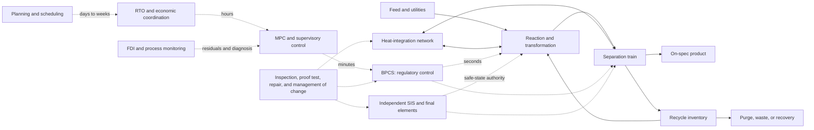

# Chemical and process engineering analogue audit

<!-- markdownlint-disable MD013 -->

**Date:** 2026-08-05  
**Scope:** conservation-law process models, reactors, separation trains,
recycle and purge systems, heat integration, regulatory and predictive control,
fault detection and diagnosis, safety-instrumented functions, operability,
plantwide control, real-time optimization, and structural reconfiguration  
**Purpose:** determine which proposed AI principles are already ordinary
process-systems engineering, and isolate only differences that survive an
equal-budget engineering null.  
**Evidence boundary:** primary or foundational papers, an active international
standard, and official accident-investigation material. Reviews organize the
field but do not turn an analogy into biological or AI evidence.

## Executive finding

Chemical and process engineering is a strong **null field**, not a new source
of architecture names. It has long treated systems whose state is constrained
by material and energy balances; whose useful operation needs interacting fast
and slow control layers; whose faults must be detected before the process exits
a recoverable region; and whose safety depends on independent protection,
proof testing, maintenance, and disciplined transitions.

No new principle is ready for the registry.

| Disposition | Result | Reason |
| --- | --- | --- |
| **Promote** | none | Every abstract mechanism audited here has a mature process-control, optimization, diagnosis, safety, or design analogue. |
| **Hold** | **conservation-qualified flowsheet reconfiguration**, only as a process-domain track under [Candidate 001](../../experiments/candidates/001-adaptive-topology.md) | The possible residual is not changing setpoints or controller parameters. It is changing the active unit/stream/control graph while carrying real inventory, energy, contamination, authority, and maintenance state through a safe transition. |
| **Reject as distinct principles** | feedback, MPC, economic MPC, RTO, self-optimizing control, plantwide control, recycle control, pinch integration, FDI, HAZOP, SIS, and steady-state flexibility | These are established engineering bodies. Renaming them with biological language would not change their state transition, information path, or accounting boundary. |

The held residual is deliberately narrow. A multi-mode MPC, supervisory
selector, planned bypass, startup procedure, or ordinary fault-tolerant
reconfiguration that matches it at the same lifecycle budget collapses the
claim back into established engineering. “Self-optimizing control” is an
especially important false friend: Skogestad defines it as achieving acceptable
economic loss with constant controlled-variable setpoints under specified
disturbances, without reoptimizing. It is not online self-rewriting
architecture [@skogestad2000].

## Terms that must not be collapsed

- **Process design** chooses equipment, stream connections, capacities, heat
  integration, and nominal operating regions. **Process operation** moves
  manipulated variables within an installed design. An offline redesign is not
  online structural adaptation.
- **Flowsheet topology** is the graph of active units and streams. **Control
  structure** chooses measurements, controlled variables, manipulated
  variables, and pairings. **Controller tuning** changes gains or horizons.
  These are different interventions even when all are called “configuration.”
- **Self-regulation** tolerates disturbance with fixed manipulated inputs.
  **Self-optimizing control** tolerates disturbance economically with fixed
  controlled-variable setpoints. **Adaptive control** updates a controller or
  model. None necessarily creates, removes, or reconnects a process path.
- **Conversion**, **yield**, **selectivity**, **purity**, and **recovery** are
  not synonyms. A policy can improve one while degrading another or increasing
  utility use and waste.
- **Recycle** returns a stream to an earlier operation. **Purge** deliberately
  removes part of a loop to prevent inert or contaminant accumulation. High
  recycle is not free reuse: it carries compression, pumping, separation,
  inventory, delay, and snowball risk [@luyben1993; @luyben1994].
- **Heat recovery** reduces external heating or cooling at a declared
  temperature approach. **Energy efficiency** needs the full utility boundary;
  **exergy efficiency** additionally counts energy quality and an environment
  state. A heat-integrated plant may be harder to start, control, isolate, and
  maintain.
- **Fault detection** decides whether behavior is abnormal; **isolation**
  distinguishes candidate origins; **identification** estimates fault type or
  magnitude; **accommodation** changes operation. A residual alarm is not a
  causal diagnosis [@venkatasubramanian2003a].
- A **BPCS** performs ordinary process control. A **SIS** implements specified
  safety instrumented functions to achieve or maintain a safe process state.
  Sharing sensors, logic, software, utilities, or final elements creates common
  cause and must not be hidden by drawing two boxes [@iec61511; @hsefunctional].
- **HAZOP** is structured hazard and operability discovery. It is neither a
  probability model nor proof that all hazards have been found [@lawley1974].
- **Steady-state flexibility** asks whether feasible operation exists across a
  disturbance set. It does not establish dynamic reachability, safe switching,
  or acceptable transient inventory [@swaney1985].

## Conservation and lifecycle boundary

### Component balance

For component $i$ in a well-mixed control volume,

$$
\frac{dn_i}{dt}
= \sum_{j\in\mathcal I} F_j z_{ij}
- \sum_{j\in\mathcal O} F_j z_{ij}
+ V\sum_r \nu_{ir} r_r .
$$

$n_i$ is component amount in mol; $F_j$ is molar flow in mol/s; $z_{ij}$ is a
dimensionless mole fraction; $V$ is volume in m$^3$; $\nu_{ir}$ is the signed
stoichiometric coefficient; and $r_r$ is reaction rate in mol/(m$^3$ s).
Every term is mol/s. A topology transition cannot instantaneously delete the
inventory already inside a disconnected vessel, pipe, buffer, cache, or model
state.

### Energy and exergy

Neglecting kinetic and potential energy only when justified, a control-volume
energy balance is

$$
\frac{dU}{dt}
= \sum_{j\in\mathcal I} F_j h_j
- \sum_{j\in\mathcal O} F_j h_j
+ \dot Q - \dot W_s .
$$

$U$ is stored energy in J; molar enthalpy $h_j$ is J/mol; heat-transfer rate
$\dot Q$ and shaft-work rate $\dot W_s$ are W. If environmental quality is in
scope, exergy destruction is

$$
\dot B_{\mathrm{dest}} = T_0\dot S_{\mathrm{gen}},
$$

where $T_0$ is the declared environment temperature in K and entropy-generation
rate $\dot S_{\mathrm{gen}}$ is W/K. A “20 W” comparison that omits cooling,
separation, pumps, standby capacity, maintenance, or embodied hardware is not a
system comparison.

### Holdup and transition time

For incompressible volume $V$ and volumetric throughput $q$,

$$
\tau = \frac{V}{q},
$$

where $\tau$ is s, $V$ is m$^3$, and $q$ is m$^3$/s. In recycle systems this
single-pass residence time does not by itself describe loop memory. A switch
must be evaluated over the longest material, thermal, analyzer, actuator, and
maintenance delays that can change the outcome.

### Lifecycle objective

A defensible audit retains a cost vector until value weights are declared:

$$
\mathbf C_{\mathrm{life}} =
\left[
E,\ M_{\mathrm{feed}},\ M_{\mathrm{offspec}},\ M_{\mathrm{waste}},
\ T_{\mathrm{down}},\ H_{\mathrm{labor}},\ C_{\mathrm{parts}},
\ R_{\mathrm{harm}}
\right].
$$

$E$ is J; mass entries are kg; downtime $T_{\mathrm{down}}$ and labor
$H_{\mathrm{labor}}$ are h; parts cost is declared currency; and risk
$R_{\mathrm{harm}}$ must state its probability, consequence, and time boundary.
Collapsing these to one scalar is allowed only with explicit weights and
uncertainty analysis.

## Layered process-system map



Arrows in this diagram do not prove independence. An experiment must enumerate
shared sensors, estimators, code, compute, networks, power, valves, and human
procedures.

## Audit cards

### PROC-01 — Balance-law dynamics and regulatory control

**Evidence design.** Control-volume balances and feedback control are
first-principles engineering models; the novelty test concerns implementation,
not whether feedback exists.

**Exact problem.** Keep temperatures, pressures, levels, flows, and
compositions inside operating constraints despite disturbances and model
error.

**Information/authority path.** Sensors feed an estimator or controller;
manipulated flows, heat duties, pressures, and valves alter the process.

**Timescale and units.** Milliseconds to hours depending on actuator and
holdup; measurements retain physical units; normalized innovations and
constraint margins may be dimensionless.

**Resource cost.** Sensor calibration, analyzer delay, actuator motion,
control-compute energy, valve wear, utilities, and off-spec material during
settling.

**Assumptions.** Defined control volume, identifiable inputs, adequate
actuation, calibrated sensors, and a declared disturbance class.

**Failure boundary.** Saturation, dead time, unobserved state, model mismatch,
integrator windup, equipment limits, and transitions outside the controllable
region.

**Strongest statistical/engineering null.** Tuned PID or state-feedback with
anti-windup, constraint handling, and a calibrated observer—not an open-loop
plant.

**P/candidate mapping and disposition.** P-006 and P-007; Candidates 003, 007,
012, 013, and 014. **Reject as a new principle.**

### PROC-02 — Nonlinear reactors

For a constant-volume CSTR with one representative reaction,

$$
\frac{dc_i}{dt}
= \frac{q}{V}(c_{i,\mathrm{in}}-c_i) + \sum_r \nu_{ir}r_r(c,T),
$$

$$
\rho C_p V\frac{dT}{dt}
= \rho C_p q(T_{\mathrm{in}}-T)
+ \sum_r(-\Delta H_r)V r_r
- UA(T-T_c).
$$

$c_i$ is mol/m$^3$; $q/V$ is 1/s; density $\rho$ is kg/m$^3$; heat capacity
$C_p$ is J/(kg K); temperature is K; $\Delta H_r$ is J/mol; $U$ is
W/(m$^2$ K); $A$ is m$^2$. Every energy term is W. Multiplicity, ignition,
extinction, and thermal runaway arise from ordinary nonlinear dynamics and
were already analyzed in early reactor-control literature [@aris1958].

**Evidence design.** Mechanistic dynamic models plus stability and bifurcation
analysis.

**Exact problem.** Maintain safe, selective production when reaction rate and
heat release depend nonlinearly on temperature and composition.

**Information/authority path.** Temperature, pressure, flow, and composition
measurements affect coolant, feed, quench, and shutdown actions.

**Timescale and units.** Reaction and thermal time constants in s to h;
conversion and selectivity dimensionless; production mol/s; heat removal W.

**Resource cost.** Cooling, agitation, catalyst, purge, quench material,
off-spec product, startup time, and emergency disposal.

**Assumptions.** Kinetics and mixing regime are declared; uncertain heat
transfer and delayed composition measurements are included.

**Failure boundary.** Loss of cooling, multiplicity, runaway, poisoning,
fouling, gas generation, and actuator saturation.

**Strongest statistical/engineering null.** Nonlinear MPC or gain-scheduled
control with constraint and safe-shutdown logic.

**P/candidate mapping and disposition.** P-006/P-007/P-008; Candidates 003,
005, 009, 010, and 012. **Reject as distinct.**

### PROC-03 — Separation trains

At total reflux, Fenske’s relation supplies a minimum equilibrium-stage limit
for a specified key-component separation; Gilliland relates stages and reflux
for a shortcut design [@fenske1932; @gilliland1940]. These are design and
screening relations, not free guarantees under dynamics.

**Evidence design.** Equilibrium-stage theory, shortcut bounds, rigorous
mass/energy balances, and dynamic column studies [@skogestad1997].

**Exact problem.** Deliver purity and recovery across feed changes while
limiting heating, cooling, pressure drop, inventory, and product loss.

**Information/authority path.** Temperature, pressure, composition, and level
measurements alter reflux, boilup, pressure, feed condition, and product draws.

**Timescale and units.** Hydraulic and composition dynamics range from s to h;
purity mol/mol or kg/kg; recovery dimensionless; reboiler and condenser duty W;
inventory mol or kg.

**Resource cost.** Reboiler steam, refrigeration, cooling water, compression,
solvent, membrane area, tray/packing area, pressure drop, analyzer lag, and
off-spec storage.

**Assumptions.** Phase equilibrium, relative volatility, mass-transfer model,
hydraulics, and feed envelope are stated.

**Failure boundary.** Flooding, weeping, entrainment, fouling, solvent loss,
membrane degradation, product contamination, and slow composition recovery.

**Strongest statistical/engineering null.** Optimized fixed separation
sequence plus plantwide MPC/RTO; include dynamic startup and turndown.

**P/candidate mapping and disposition.** P-001/P-006/P-008/P-010; Candidates
001, 005, 012, 013, and 018. **Reject as distinct; use as a demanding testbed.**

### PROC-04 — Recycle, purge, and inventory

For a steady nonreacting impurity entering at $F_0z_0$ and leaving only in
purge $Pz_p$, conservation requires

$$
F_0z_0=Pz_p.
$$

Reducing $P$ therefore raises the loop impurity concentration unless another
removal path exists. Reactor/separator recycles can produce severe steady-state
recycle-flow/capacity amplification—“snowball” behavior—under plausible control
choices, separately from their long dynamic memory
[@luyben1993; @luyben1994; @wu1996].

**Evidence design.** Steady-state sensitivity, dynamic simulation, and
control-structure analysis of recycle processes. “Snowball” denotes severe
steady-state load sensitivity; it is not itself a dynamic instability.

**Exact problem.** Recover valuable material without accumulating inert,
poison, impurity, heat, pressure, or delay.

**Information/authority path.** Loop inventories and compositions inform purge,
fresh feed, recycle, production-rate, and separator actions.

**Timescale and units.** Multiple loop turnovers, s to days; flow mol/s or
kg/s; recycle ratio dimensionless; inventory mol/kg; compressor power W.

**Resource cost.** Reprocessing energy, compressor/pump duty, larger equipment,
purged product, analyzer delay, contamination, and restart time.

**Assumptions.** All accumulation and loss routes, including leaks and
degradation, are modeled.

**Failure boundary.** Snowball amplification, composition drift, capacity
bottlenecks, slow recovery, and propagation of upstream disturbances.

**Strongest statistical/engineering null.** Published recycle control
structures with explicit inventory control and conventional supervisory
optimization [@larsson2003].

**P/candidate mapping and disposition.** P-006/P-008/P-009/P-013; Candidates
003, 005, 012, 014, 017, and 018. **Reject as distinct.**

### PROC-05 — Pinch analysis and heat integration

For a sensible-heat stream with approximately constant heat capacity,

$$
\dot Q = \dot m C_p(T_{\mathrm{out}}-T_{\mathrm{in}}),
$$

where $\dot Q$ is W, mass flow $\dot m$ is kg/s, $C_p$ is J/(kg K), and
temperature difference is K. Pinch targets depend on stream duties and the
chosen minimum temperature approach $\Delta T_{\min}$; there is no universal
fraction of recoverable heat [@linnhoff1983].

**Evidence design.** Thermodynamic targeting followed by network synthesis and
dynamic/operability analysis.

**Exact problem.** Reduce external utilities by exchanging heat among process
streams while preserving feasible approaches and controllability.

**Information/authority path.** Mostly design-time stream data; bypasses,
utility valves, and supervisory logic act during operation.

**Timescale and units.** Thermal dynamics s to h; duty W; annual energy J or
kWh; exchanger area m$^2$; approach K; pressure drop Pa.

**Resource cost.** Area, pipework, pressure drop, pumping, fouling, cleaning,
control interaction, startup energy, bypass capacity, and lost production.

**Assumptions.** Stream availability and temperature intervals are simultaneous
and correctly bounded; phase changes and fouling are represented.

**Failure boundary.** Utility or stream loss propagates through the network;
tight integration can reduce flexibility and complicate isolation.

**Strongest statistical/engineering null.** A minimum-utility heat-exchanger
network at the same $\Delta T_{\min}$, capital, pressure-drop, controllability,
and maintenance budget.

**P/candidate mapping and disposition.** P-001/P-006/P-008/P-010; Candidates
001, 005, 006, 012, 013, and 018. **Reject as distinct.**

### PROC-06 — Multivariable and model-predictive control

A standard finite-horizon MPC null is

$$
\min_{u_{0:N-1}}
\sum_{k=0}^{N-1}
\left(
\lVert y_k-r_k\rVert_Q^2+
\lVert \Delta u_k\rVert_R^2
\right)
$$

subject to a declared dynamic model and state/input/output constraints. If the
objective is dimensionless, $Q$ and $R$ carry inverse squared units for their
respective signals; if it is economic, every term must be converted to the
declared currency or physical objective. Industrial MPC and constraint
management are established technologies [@qin2003].

For a square nonsingular steady-state gain matrix $G(0)$, the relative gain
array is

$$
\Lambda = G(0)\circ G(0)^{-T},
$$

where $\circ$ is elementwise multiplication and $\Lambda$ is dimensionless
[@bristol1966]. It is a pairing diagnostic, not a stability or safety proof.

**Evidence design.** Industrial survey, closed-loop experiments, and model-based
constraint optimization.

**Exact problem.** Coordinate interacting manipulated variables while
respecting hard and soft process constraints.

**Information/authority path.** Estimated state and forecasts feed an optimizer;
the first control move is implemented and the horizon repeats.

**Timescale and units.** Sampling ms to minutes; prediction horizon s to h;
solver time ms/s; constraint violations in original signal units.

**Resource cost.** Model maintenance, sensing, computation, network traffic,
operator support, excitation, and fallback controls.

**Assumptions.** Model validity, bounded disturbances, solver completion, and a
well-defined fallback policy.

**Failure boundary.** Plant-model mismatch, estimator bias, infeasibility,
unmodeled modes, communication loss, and common-mode automation failure.

**Strongest statistical/engineering null.** Robust or stochastic MPC with
equal sensing, model updates, compute, and constraints.

**P/candidate mapping and disposition.** P-001/P-002/P-006/P-007; Candidates
002, 003, 007, 012, and 013. **Reject as distinct.**

### PROC-07 — Fault detection, isolation, and diagnosis

For observation $y_k$, predicted observation $\hat y_k$, and residual
covariance $S_k$,

$$
r_k=y_k-\hat y_k,
\qquad
T_k=r_k^\mathsf T S_k^{-1}r_k.
$$

$r_k$ has sensor units and $T_k$ is dimensionless when $S_k$ has the matching
squared units. A threshold $T_k>\gamma$ needs a reference distribution or
empirical calibration, dependence handling, and a stated false-alarm horizon.
PCA monitoring similarly separates model-space and residual-space statistics,
but contribution plots do not by themselves identify a physical cause
[@macgregor1995].

**Evidence design.** Quantitative-model, qualitative-model, and process-history
methods are a mature taxonomy [@venkatasubramanian2003a;
@venkatasubramanian2003b; @venkatasubramanian2003c].

**Exact problem.** Detect and diagnose sensor, actuator, equipment, and process
faults early enough for a useful response.

**Information/authority path.** Residuals or learned statistics raise alarms;
separate logic or people isolate causes and select accommodation.

**Timescale and units.** Sampling ms to hours; detection delay s; false alarms
per operating hour; missed-event probability; diagnostic top-$k$ accuracy;
remaining intervention time s.

**Resource cost.** Redundant sensing, historian storage, model upkeep, alarm
load, testing, false trips, and missed production.

**Assumptions.** Training/reference data cover normal modes; labels and
maintenance records are reliable; policy changes are not mistaken for faults.

**Failure boundary.** Incipient faults below noise, multiple simultaneous
faults, sensor common cause, distribution shift, and alarm floods.

**Strongest statistical/engineering null.** Calibrated observer residuals,
sequential change detection, PCA/PLS monitoring, and a causal process model at
the same alarm budget.

**P/candidate mapping and disposition.** P-002/P-003/P-006/P-007/P-009;
Candidates 003, 005, 007, 010, 011, and 014. **Reject as distinct; use as a
baseline suite.**

### PROC-08 — SIS, HAZOP, and independent protection

IEC 61511 covers specification, design, installation, operation, and
maintenance of SIS throughout a lifecycle [@iec61511]. For a simplified
single-channel, low-demand, dangerous-undetected failure model,

$$
\operatorname{PFD}_{\mathrm{avg}}
\approx \frac{\lambda_{DU}T_I}{2},
\qquad
\operatorname{RRF}\approx
\frac{1}{\operatorname{PFD}_{\mathrm{avg}}}.
$$

$\lambda_{DU}$ is dangerous-undetected failures/h and proof-test interval
$T_I$ is h; PFD and risk-reduction factor are dimensionless. This approximation
assumes constant rate, perfect proof testing, negligible repair time, and no
common cause. It must not be reused for redundant architectures, high-demand
operation, partial tests, repair downtime, systematic failures, or dependent
channels without the corresponding model.

**Evidence design.** Active functional-safety standard, structured hazard
review, proof tests, lifecycle records, and accident investigations.

**Exact problem.** Detect a specified dangerous state and execute an
independently credible action that achieves or maintains a defined safe state.

**Information/authority path.** SIF sensor to logic solver to final element;
hazard review and safety-requirements specification define the function.

**Timescale and units.** Process safety time s; response s; demand/h; failure/h;
proof-test interval h; PFD dimensionless.

**Resource cost.** Independent sensors and power, shutdown hardware, testing,
spurious trips, bypass control, proof-test labor, repair, and lost production.

**Assumptions.** Independence and common-cause claims are physically audited;
the safe state remains safe for the required duration.

**Failure boundary.** Shared sensing or logic, disabled bypasses, latent final
element faults, inadequate proof tests, bad startup procedure, and organizational
failure.

**Strongest statistical/engineering null.** A complete IEC 61511 lifecycle and
layer-of-protection design, not an extra classifier or duplicate software check.

**P/candidate mapping and disposition.** P-008/P-009; Candidates 005, 009, 010,
011, 012, 014, and 020. **Reject as distinct.**

### PROC-09 — Operability and flexibility

One steady-state flexibility formulation is

$$
F_I=\max_{\delta\ge0}\ \delta
\quad\text{such that}\quad
\forall\theta\in\mathcal T(\delta),\
\exists z:\ f_j(d,z,\theta)\le0\ \forall j.
$$

$\theta$ denotes uncertain parameters, $z$ recourse/control variables, and
$\delta$ a dimensionless scale only after the uncertainty set is normalized.
The index establishes feasible steady states within the modeled set; it does
not prove a safe dynamic path between them [@swaney1985].

**Evidence design.** Feasibility geometry, input/output operability, and dynamic
simulation [@subramanian2005].

**Exact problem.** Determine whether installed inputs can reach acceptable
outputs across uncertainty and disturbance.

**Information/authority path.** Design models map available inputs and
disturbances into achievable output sets; operators/controllers choose recourse.

**Timescale and units.** Steady-state feasibility plus separate transient time;
each input/output retains physical units; normalized set size may be
dimensionless.

**Resource cost.** Oversized equipment, bypasses, spare capacity, utilities,
turndown losses, instrumentation, and validation simulations.

**Assumptions.** Uncertainty set is credible; simultaneous disturbances and
active constraints are represented.

**Failure boundary.** A feasible endpoint may require an unsafe path, excessive
inventory, unavailable actuator speed, or forbidden intermediate product.

**Strongest statistical/engineering null.** Robust design/control with matched
uncertainty set, recourse, reserve, and transition constraints.

**P/candidate mapping and disposition.** P-001/P-006/P-008; Candidates 003,
009, 012, and 013. **Reject as distinct; retain as a required test.**

### PROC-10 — Plantwide control

Plantwide control explicitly asks which variables to measure and control, which
inputs to manipulate, and which links to construct among them
[@morari1980; @skogestad2000]. The Tennessee Eastman process was published as a
plantwide industrial control problem with interacting units, disturbances, and
faults, and remains a useful benchmark [@downs1993].

**Evidence design.** Hierarchical decomposition, degree-of-freedom analysis,
control-structure selection, and industrial benchmark simulation.

**Exact problem.** Coordinate inventories, production rate, quality,
constraints, recycle, utilities, and economics across a complete plant.

**Information/authority path.** Regulatory loops report to supervisory/MPC,
optimization, and scheduling layers through selected controlled variables and
setpoints.

**Timescale and units.** Seconds for stabilization; minutes for MPC; hours for
local/RTO optimization; days to weeks for scheduling. Cost may be currency/h;
material kg/h; energy W or J/batch.

**Resource cost.** Instrumentation, communication, model maintenance, operator
attention, layer coordination, reserve, and transition losses.

**Assumptions.** Timescale separation is measured, not presumed; lower loops
remain stable under upper-layer updates.

**Failure boundary.** Conflicting objectives, hidden bottlenecks, slow recycle,
constraint migration, optimizer-controller mismatch, and oscillating layers.

**Strongest statistical/engineering null.** A systematic plantwide control
design with equal telemetry, authority, and model budget.

**P/candidate mapping and disposition.** P-001/P-002/P-006/P-008/P-013;
Candidates 002, 008, 012, 013, 014, and 020. **Reject as distinct.**

### PROC-11 — Self-optimizing control, RTO, and economic MPC

Let $J(u,d)$ be operating cost in currency/h (or another declared physical
unit), $u^*(d)$ the true optimum under disturbance $d$, and $u_c(d)$ the input
generated while selected controlled variables remain at fixed setpoints. The
self-optimizing loss is

$$
L(d)=J(u_c(d),d)-J(u^*(d),d)\ge0.
$$

$L$ has the same unit as $J$. Near-optimal operation over one disturbance set
does not imply adaptation outside it [@skogestad2000; @halvorsen2003]. RTO,
modifier adaptation, and economic MPC already update models, gradients,
constraints, or dynamic inputs online [@engell2007; @marchetti2009;
@ellis2014].

**Evidence design.** Economic loss analysis, closed-loop optimization,
plant-model mismatch experiments, and stability/feasibility arguments.

**Exact problem.** Keep a process economically near-optimal despite disturbances
and imperfect models.

**Information/authority path.** Measurements update selected variables,
estimated models or modifiers; an optimizer or feedback law changes inputs.

**Timescale and units.** Seconds to hours; cost currency/h, energy J/kg,
emissions kg/h, or yield kg/kg; gradient units must match cost per input unit.

**Resource cost.** Experiments/excitation, gradient estimation, optimization,
model maintenance, convergence time, constraint backoff, and off-spec output.

**Assumptions.** Objective, disturbances, active constraints, and plant-model
mismatch are explicit; the optimum is estimable.

**Failure boundary.** Biased gradients, changing active constraints,
infeasibility, transient operation, noisy measurements, and unsafe exploration.

**Strongest statistical/engineering null.** Self-optimizing CV selection,
modifier-adaptation RTO, and economic MPC at equal experiments, computation,
and constraint risk.

**P/candidate mapping and disposition.** P-001/P-006/P-007; Candidates 007,
008, 012, 013, and 014. **Reject as distinct.**

### PROC-12 — Structural reconfiguration and managed transition

Let operating mode $m$ select a directed flowsheet graph
$\mathcal G_m=(\mathcal V_m,\mathcal E_m)$. A claimed structural adaptation is
a transition $m_a\rightarrow m_b$ that changes active units, streams, or
measurement-actuation links. Conservation still requires

$$
n_i(t_1)-n_i(t_0)
=\int_{t_0}^{t_1}
\left(
\dot n_{i,\mathrm{in}}-
\dot n_{i,\mathrm{out}}+
\dot n_{i,\mathrm{gen}}
\right)dt.
$$

Both sides are mol. The transition contract must also bound stored energy,
pressure, temperature, contaminants, off-spec material, actuator authority,
and independent protection throughout the path—not only at endpoints.

**Evidence design.** Hybrid dynamic simulation, transition procedures,
hardware-in-loop tests, proof of constraint satisfaction where possible, and
post-transition mass/energy reconciliation.

**Exact problem.** Reconfigure an installed process under changing feed,
equipment health, product slate, or utility availability without violating
conservation or safety.

**Information/authority path.** State/health estimates propose a mode;
supervisory authorization, interlocks, local controllers, and people execute a
versioned transition with rollback or safe shutdown.

**Timescale and units.** Valve action s, displacement and cleaning min/h,
campaign and maintenance days; transition material kg, energy J, downtime h,
residual contamination ppm or kg.

**Resource cost.** Duplicate equipment and pipework, idle standby power,
flushing, cleaning, heat-up/cool-down, state migration, validation, staffing,
spares, and lost production.

**Assumptions.** The proposed graph is physically installed or its construction
cost is charged; safety functions retain independence across modes.

**Failure boundary.** Trapped inventory, pressure equalization, cross-product
contamination, stale state, valve misalignment, common-cause utilities,
unavailable rollback, and maintenance-induced hazards.

**Strongest statistical/engineering null.** Pre-engineered multi-mode operation
with mode-specific MPC, interlocks, startup/shutdown procedures, and ordinary
supervisory selection at the same installed reserve and lifecycle budget.

**P/candidate mapping and disposition.** P-005/P-008/P-009/P-010; Candidate 001
with Candidates 005, 009, 011, 012, 014, and 016 as assurance constraints.
**Hold only as a Candidate 001 domain track.**

## Accident evidence: why boundaries dominate slogans

### BP Texas City, 2005

The U.S. Chemical Safety Board found that the explosion occurred during startup
after a raffinate splitter and blowdown system were overfilled; the final report
connects process instrumentation, procedures, supervision, training, siting,
maintenance, and organizational decisions [@csbtexascity]. This is evidence
against treating startup as a brief interpolation between steady states. It is
not evidence for a particular AI architecture.

### Buncefield and shared protection

The UK HSE investigation and subsequent alerts emphasize overfill protection,
installation, testing, and independence. A later HSE alert describes a vapour
recovery overfill system that was not independent of the BPCS, so the same
failure defeated both [@hsebuncefield; @hsevru]. “Two layers” therefore means
little without a dependency audit.

These cases also deduplicate against the
[high-reliability-organizations audit](2026-08-05-high-reliability-organizations-incident-learning.md):
technical layers, procedures, maintenance, reporting, management of change,
and organizational incentives are coupled. Process engineering does not license
reducing them to a neuron metaphor.

## Deduplication against P-bundles and adjacent audits

| Principle | Closest process-engineering body | Disposition |
| --- | --- | --- |
| [P-001](../principle-registry.md#p-001--selective-allocation) | constrained production, utility, feed, and control allocation | Established analogue; compare against plantwide optimization and MPC. |
| [P-002](../principle-registry.md#p-002--local-autonomy-with-exception-escalation) | local regulatory loops with supervisory escalation | Established hierarchy; a residual-triggered exception is not new. |
| [P-003](../principle-registry.md#p-003--temporary-trace-before-commitment) | residual accumulation, permissives, staged startup, and batch hold/release | Partial analogue; delayed causal credit is not supplied by an alarm trace. |
| [P-004](../principle-registry.md#p-004--diversity-selection-and-protection) | parallel trains, redundant protection, catalyst/formulation screening | Partial analogue; installed redundancy is not evolutionary lineage. |
| [P-005](../principle-registry.md#p-005--use-dependent-topology) | flowsheet/control-structure reconfiguration | Hold only if the graph itself changes and transition inventory is charged. |
| [P-006](../principle-registry.md#p-006--homeostatic-negative-feedback) | regulatory, multivariable, robust, and inventory control | Established analogue. |
| [P-007](../principle-registry.md#p-007--prediction-error-allocation) | observer residuals, FDI, active diagnosis, and RTO excitation | Established residual/experiment-selection null; surprise alone is insufficient. |
| [P-008](../principle-registry.md#p-008--compartmentalized-interaction) | unit operations, trains, containment, isolation valves, and process areas | Established physical and functional partitioning; boundary adaptation remains Candidate 001 territory. |
| [P-009](../principle-registry.md#p-009--maintenance-plane) | inspection, proof test, cleaning, catalyst regeneration, repair, and management of change | Established lifecycle function; learned scheduling must beat condition/risk-based maintenance. |
| [P-010](../principle-registry.md#p-010--structural-offloading-and-co-design) | dedicated unit operations, catalysts, heat integration, and intensified equipment | Established co-design pattern; compare full installed and transition cost. |
| [P-011](../principle-registry.md#p-011--transient-communication-coalitions) | batch campaigns, temporary stream alignments, valve matrices, and scheduled utility sharing | Established scheduling/mode analogue; endogenous coalition learning is not shown. |
| [P-012](../principle-registry.md#p-012--memory-matched-to-information-lifetime) | holdup, sample retention, historians, batch records, and maintenance evidence | Established tiering/retention functions; semantic promotion is not supplied by process inventory. |
| [P-013](../principle-registry.md#p-013--externalized-shared-state) | shared process state, historians, alarm/event logs, and plantwide controlled variables | Established shared-state pattern; physical process state has safety and latency constraints. |

| Process-engineering mechanism | Existing home | What remains, if anything |
| --- | --- | --- |
| Inventory, flow, and constraint feedback | [P-006](../principle-registry.md#p-006--homeostatic-negative-feedback); [engineering analogues](2026-08-05-engineering-analogues.md) | Domain equations and physical units, not a new principle. |
| Residual monitoring and diagnosis | P-002, P-003, P-007, P-009; [engineering analogues](2026-08-05-engineering-analogues.md) | Intervention-aware telemetry is already Candidate 007; causal isolation remains a benchmark. |
| Recycle, purge, containment, and maintenance | P-008, P-009, P-013; [cellular quality control](2026-08-05-cellular-quality-control.md) | Process inventory and contamination make the lifecycle boundary concrete. |
| Reaction networks and catalytic dynamics | [chemistry and reaction networks](2026-08-05-chemistry-reaction-networks-proofreading.md) | Reactor-scale transport, heat release, and plant operation; no new abstract mechanism. |
| Heat recovery and utility allocation | P-001, P-010; [engineering analogues](2026-08-05-engineering-analogues.md) | A controllability/flexibility penalty must accompany utility savings. |
| Protection, staged response, and restoration | P-008, P-009; [power-grid protection](2026-08-05-power-grids-protection-and-recovery.md); HRO audit | SIS independence and proof-test lifecycle are stronger nulls. |
| Plantwide hierarchy and distributed authority | P-001, P-002, P-006, P-013 | Established control-structure design; Candidate 020 only applies where actors have real private incentives/standing. |
| Structural reconfiguration | P-005/P-009/P-010 and Candidate 001 | Hold only the conservation-qualified transition test; reject if ordinary multi-mode control ties it. |

## Deduplication against experiment candidates

The current candidate index also contains Candidate 020, added after the
original 001–019 scope; it is included so this audit does not become stale on
arrival.

| Candidate | Process-engineering overlap | Audit consequence |
| --- | --- | --- |
| [001](../../experiments/candidates/001-adaptive-topology.md) | Flowsheet, bypass, train, recycle, heat-network, and control-pairing changes | **Hold** conservation-qualified reconfiguration as a domain track; ordinary scheduled/multi-mode operation is the null. |
| [002](../../experiments/candidates/002-multiscale-context-broadcast.md) | Hierarchical setpoints, measurements, constraints, and scheduling timescales | Plantwide control is a strong null; no new process claim. |
| [003](../../experiments/candidates/003-recovery-dynamics-fragility.md) | Stability margin, operability boundary, incipient faults, and bounded process tests | Use nonlinear reactor/recycle benchmarks; retain abstention where no precursor exists. |
| [004](../../experiments/candidates/004-closed-endogenous-curriculum.md) | Designed experiments and RTO excitation only weakly overlap | No independent process principle; experiments must charge unsafe/off-spec excitation. |
| [005](../../experiments/candidates/005-severity-ordered-containment.md) | Alarm, isolate, trip, depressure, purge, repair, replace | SIS/abnormal-event management is the baseline; sequence alone is not novel. |
| [006](../../experiments/candidates/006-reversible-physical-skill.md) | Dedicated process equipment, catalysts, heat integration, and bypassable units | Include fouling, cleaning, idle reserve, switching, and embodied capital. |
| [007](../../experiments/candidates/007-endogenous-observation-surveillance.md) | Controller actions alter residuals, operating modes, and data support | FDI plus joint process/measurement modeling is the null. |
| [008](../../experiments/candidates/008-contestable-modular-allocation.md) | Units can game local KPIs; RTO decompositions can misalign incentives | Only applies if modules have persistent private information or strategic behavior; otherwise ordinary optimization. |
| [009](../../experiments/candidates/009-graded-assurance-envelopes.md) | Safety-requirements, SIL claims, proof tests, mode/version control | IEC 61511 lifecycle is a strong null; one scalar “confidence” is inadequate. |
| [010](../../experiments/candidates/010-reset-coupled-staged-verification.md) | Permissives, interlocks, proof tests, staged startup, and rollback | Compare to complete startup/SIS procedures; chemistry audit already holds this candidate. |
| [011](../../experiments/candidates/011-dual-loop-operational-assurance.md) | Live abnormal-event response plus incident/maintenance learning | Deduplicates with HRO and process-safety management; demand versioned recurrence evidence. |
| [012](../../experiments/candidates/012-latency-qualified-authority.md) | Process safety time, analyzer delay, stale state, and shrinking safe control region | Strong process testbed; authority must be tied to remaining intervention time and independent trip. |
| [013](../../experiments/candidates/013-deficit-capability-routing.md) | Utility allocation, bottleneck control, inventory demand, and distributed optimization | Plantwide control and constrained MPC/primal-dual methods are nulls. |
| [014](../../experiments/candidates/014-versioned-observation-contract.md) | Calibration, analyzer response, selection, maintenance, process mode, and model vintage | FDI/quality systems supply fields; process data never become valid merely by entering a historian. |
| [015](../../experiments/candidates/015-versioned-repairable-conventions.md) | Instrument tags, units, alarm meaning, procedures, and management of change | Conventional configuration/version control is the null unless meaning changes locally under real heterogeneity. |
| [016](../../experiments/candidates/016-conflict-bounded-unit-transition.md) | Campaign transitions, train coordination, handover, and shared utilities | Physical conflicts are constraints; collective heritability is not supplied by a flowsheet switch. |
| [017](../../experiments/candidates/017-contract-preserving-semantic-compaction.md) | Historian aggregation, reconciliation, event summaries, and batch records | Preserve mass/energy reconciliation, alarm chronology, calibration, and audit queries. |
| [018](../../experiments/candidates/018-value-reconstructability-aware-tiering.md) | Raw traces, reconciled data, lab samples, maintenance records, and irreplaceable incident evidence | Value and reconstructability apply; storage cost must include retention regulation and forensic loss. |
| [019](../../experiments/candidates/019-audited-cumulative-inheritance.md) | Standard operating procedures, recipes, alarm rationalization, and incident lessons | Mature management-of-change/versioning is the null; copying documents is not inherited capability. |
| [020](../../experiments/candidates/020-constitutional-control-plane.md) | Operator, engineering, safety, maintenance, and management authority | Use only where parties have real standing or private incentives; a deterministic control hierarchy is not constitutional governance. |

## Equal-budget falsification experiments

All experiments report the full lifecycle vector, not accuracy or steady-state
utility alone. Seeds, model-identification data, operator interventions, and
failed runs count against the same budget.

### E-PROC-01 — Nonlinear reactor recovery

- **Question:** does a proposed adaptive mechanism improve recovery near an
  ignition/extinction or constraint boundary?
- **Baselines:** tuned PID/gain schedule, nonlinear MPC, robust MPC, and the
  proposed mechanism.
- **Matched budget:** sensors, coolant/quench authority, model-identification
  experiments, control updates/s, and total compute J.
- **Disturbances:** feed composition, coolant degradation, kinetics mismatch,
  and sensor bias, separately and jointly.
- **Measures:** constraint-violation integral K·s or Pa·s, off-spec kg,
  recovery s, utilities J, false trips/run, and unrecovered runs.
- **Falsification:** reject the special mechanism if robust/nonlinear MPC
  matches its risk–quality–energy frontier or if its advantage disappears when
  excitation and failed batches are charged.

### E-PROC-02 — Separation purity–energy–inventory frontier

- **Question:** does adaptive staging/routing beat a fixed optimized train?
- **Baselines:** optimized fixed sequence, train with bypass, plantwide MPC/RTO,
  and proposed reconfiguration.
- **Matched budget:** installed area, valves, analyzers, storage, heat-transfer
  area, and reserve capacity.
- **Measures:** product purity and recovery, reboiler/condenser J/kg, pressure
  drop Pa, off-spec kg, transition h, contamination kg, and cleaning labor h.
- **Falsification:** reject if gains are explained by extra area, storage,
  bypasses, or off-spec disposal.

### E-PROC-03 — Recycle snowball and loop memory

- **Question:** does the proposal manage loop inventory better than established
  control structures?
- **Baselines:** published fixed-throughput/inventory structures, MPC, and the
  proposal.
- **Matched budget:** purge loss, separator/compressor capacity, sensing, and
  actuation.
- **Measures:** peak and integrated inventory kg·s, impurity kg/kg, recovery s,
  energy J/kg product, purge loss kg, and constraint violations.
- **Falsification:** reject if apparent efficiency comes from hidden inventory
  growth or a longer evaluation horizon reverses the gain.

### E-PROC-04 — Heat recovery versus dynamic flexibility

- **Question:** does adaptive thermal coupling improve lifecycle energy after
  dynamic and maintenance penalties?
- **Baselines:** utility-only plant, pinch-designed fixed HEN, HEN with ordinary
  bypass control, and proposed adaptive network.
- **Matched budget:** exchanger area, pressure drop, valves, standby utilities,
  fouling/cleaning, and instrumentation.
- **Measures:** external heat/cooling J, exergy destroyed J, pump J, startup h,
  disturbance recovery s, unavailable production kg, and maintenance h.
- **Falsification:** reject if a fixed HEN with conventional bypasses occupies
  the same frontier or if savings vanish under fouling and startup cycles.

### E-PROC-05 — FDI under policy-induced observation shift

- **Question:** can the proposal avoid mistaking control action or mode change
  for a fault?
- **Baselines:** observer residuals, CUSUM, PCA/PLS, mode-conditioned FDI,
  joint process/observation model, and Candidate 007 mechanism.
- **Matched budget:** sensors, normal/fault labels, interventions, compute, and
  alarms per operating hour.
- **Measures:** time-to-detect s, false alarms/h, missed faults, isolation
  accuracy, recoverable-margin remaining s, and unnecessary trips.
- **Falsification:** reject if mode-conditioned or intervention-aware classical
  FDI ties it after calibration.

### E-PROC-06 — Protection independence and proof testing

- **Question:** does a proposed assurance stack reduce risk beyond a complete
  conventional SIS lifecycle?
- **Baselines:** BPCS-only, nominally duplicated but shared-dependency system,
  independent IEC-61511-style SIF, and proposal.
- **Matched budget:** sensors, final elements, power, network, proof-test labor,
  spares, and spurious-trip cost.
- **Faults:** sensor bias, shared power loss, stuck final element, software
  defect, bypass left active, and missed proof test.
- **Measures:** dangerous failures per simulated operating year, PFD estimate
  with interval, spurious trips/year, downtime h, and common-cause fraction.
- **Falsification:** reject if advantage is only uncharged redundancy or if one
  shared failure defeats claimed independent layers.

### E-PROC-07 — Self-optimizing CVs versus online optimization

- **Question:** when is fixed-setpoint self-optimization enough, and when does
  adaptation add value?
- **Baselines:** constant manipulated inputs, self-optimizing controlled
  variables, two-layer RTO+MPC, modifier adaptation, economic MPC, and proposal.
- **Matched budget:** disturbance/model information, plant experiments,
  optimization calls, compute J, and constraint backoff.
- **Measures:** economic loss currency/h, cumulative loss, violations,
  convergence h, off-spec kg, and experiment cost.
- **Falsification:** reject structural novelty if modifier adaptation or EMPC
  matches performance without changing the graph.

### E-PROC-08 — Operability before and during transition

- **Question:** does the held mechanism preserve feasibility along a transition,
  not only at endpoints?
- **Baselines:** steady-state flexibility design, robust MPC, pre-engineered mode
  schedule, and proposal.
- **Matched budget:** installed recourse, storage, actuator rates, bypasses,
  reserve, and planning compute.
- **Measures:** feasible disturbance-set volume, minimum constraint margin in
  physical units, transition time s, unsafe intermediate states, and rollback
  success.
- **Falsification:** reject if steady-state feasibility is presented as dynamic
  safety or conventional hybrid control ties it.

### E-PROC-09 — Conservation-qualified topology change

- **Question:** does changing the active graph itself beat routing/control over
  a fixed installed graph after all transition costs?
- **Baselines:** fixed graph with adaptive flows, fixed graph with MPC/RTO,
  offline reoptimized schedule, ordinary multi-mode supervisory control, and
  held Candidate 001 mechanism.
- **Matched budget:** installed units/edges, idle reserve, sensors, state
  estimation, migration/flush material, energy, maintenance labor, and recovery
  authority.
- **Measures:** cumulative useful product kg, utility J/kg, waste kg, downtime
  h, violations, contamination, transition failures, and post-failure recovery
  s over identical demand/health traces.
- **Falsification:** reject the held residual if mode selection explains the
  result, if graph construction is uncharged, if conservation does not close,
  or if advantage disappears after one maintenance and one rollback cycle.

## AI translation boundary

Process engineering is useful to AI only when the mapped quantities remain
operational:

| Process quantity | Possible AI quantity | Required caution |
| --- | --- | --- |
| Material inventory | queued work, cached state, optimizer state, uncommitted updates | Digital state is copied and deleted differently from matter; define byte, provenance, and deletion cost rather than claiming literal conservation. |
| Energy/utility | rail energy, cooling, network and storage energy | Measure at a named boundary and interval; FLOPs are not joules. |
| Recycle | iterative refinement, replay, recurrent routing | Count repeated compute, amplification, stale information, and exit/purge policy. |
| Separation | routing or representation disentanglement | Purity/recovery analogies need measurable error classes; thermodynamic separation bounds do not transfer automatically. |
| Catalyst | reusable parameter/module that changes rate but is retained | The catalyst analogy fails if the module is consumed, copied freely, or updated irreversibly without accounting. |
| Heat integration | reuse of intermediate computation or waste heat | Shared dependencies and flexibility penalties must be measured. |
| FDI residual | prediction error or monitor statistic | Surprise is not cause, uncertainty, value, or evidence of damage. |
| SIS | independent runtime assurance and safe fallback | A second model on the same stack is not independent merely because it has a different prompt or checkpoint. |
| Flowsheet switch | module/edge creation, removal, or reconnection | Changing attention weights or traffic over fixed edges is routing, not topology change. |

The most transferable lesson is therefore an **accounting discipline**: specify
state, flux, accumulation, actuators, constraints, timescales, dependencies,
transition paths, and lifecycle costs before claiming that a natural mechanism
beats ordinary engineering.

## Scoped temporary claims

| ID | Status | Claim | Evidence and qualification | Affected work |
| --- | --- | --- | --- | --- |
| PROC-T01 | established | Component and energy balances constrain every process trajectory, including starts, stops, and reconfiguration. | First-principles conservation; closure depends on the chosen boundary and measurement uncertainty. | Candidate 001; energy model |
| PROC-T02 | established | Nonlinear reactors can exhibit multiplicity and loss of stable operation under ordinary kinetics and heat transfer. | Aris and Amundson [@aris1958]; does not imply every reactor has these regimes. | Candidates 003, 005, 012 |
| PROC-T03 | established | Recycle can create long dynamic memory and, separately, control-structure-dependent steady-state flow/capacity amplification called a snowball effect. | Luyben and reactor/separator control literature [@luyben1993; @luyben1994]. | Candidates 003, 012, 014 |
| PROC-T04 | established | Separation performance trades stages/area, reflux or another driving force, energy, purity, recovery, and dynamics. | Fenske, Gilliland, and distillation dynamics [@fenske1932; @gilliland1940; @skogestad1997]. | Candidates 001, 013, 018 |
| PROC-T05 | established | Pinch methods target heat recovery only under declared stream and $\Delta T_{\min}$ assumptions. | Linnhoff and Hindmarsh [@linnhoff1983]. | P-010; energy model |
| PROC-T06 | plausible | Tighter heat integration can worsen controllability, flexibility, startup, and maintenance even while lowering steady utility demand. | Engineering mechanism and design literature; direction and magnitude are plant-specific. | Candidate 001; roadmap |
| PROC-T07 | established | MPC already performs repeated constrained prediction and optimization over multivariable processes. | Industrial survey [@qin2003]. | Candidates 002, 012, 013 |
| PROC-T08 | established | FDI separates detection, isolation, identification, and accommodation; a large residual alone is not causal diagnosis. | Three-part review [@venkatasubramanian2003a; @venkatasubramanian2003b; @venkatasubramanian2003c]. | Candidates 003, 005, 007, 014 |
| PROC-T09 | established | Statistical process monitors require calibrated reference behavior and can fail under mode or policy shift. | MacGregor and Kourti [@macgregor1995] plus FDI reviews. | Candidates 007, 014 |
| PROC-T10 | established | SIS credibility is lifecycle- and dependency-based, not a property of a classifier score. | IEC 61511 and HSE [@iec61511; @hsefunctional]. | Candidates 005, 009, 010, 012 |
| PROC-T11 | established | HAZOP is systematic hazard discovery, not proof of completeness or a quantitative risk estimate. | Lawley [@lawley1974]. | Candidates 009, 011, 020 |
| PROC-T12 | established | A steady-state flexibility index does not prove dynamic reachability or transition safety. | Swaney and Grossmann [@swaney1985]. | Candidates 003, 012 |
| PROC-T13 | established | Plantwide control already decomposes regulation, supervision, optimization, and scheduling across timescales. | Morari et al. and Skogestad [@morari1980; @skogestad2000]. | Candidates 002, 013, 020 |
| PROC-T14 | established | Self-optimizing control means acceptable economic loss with constant selected CV setpoints over a disturbance set. | Exact field definition [@skogestad2000]. | Avoid terminology error throughout concept |
| PROC-T15 | established | RTO modifier adaptation and economic MPC already update economic operation online under model mismatch. | Marchetti et al. and Ellis et al. [@marchetti2009; @ellis2014]. | Candidates 007, 008, 013 |
| PROC-T16 | plausible | Conservation-qualified reconfiguration may be a harder structural-adaptation test than digital routing because transition inventory and energy cannot be hidden. | Mechanistic inference; not yet comparative evidence. | Candidate 001 domain track |
| PROC-T17 | speculative | A general AI architecture may benefit from treating queued, cached, and provisional state as inventory with explicit accumulation and purge laws. | Useful formal analogy only; digital state is not materially conserved. | P-003/P-009/P-012; Candidates 017/018 |
| PROC-T18 | audit conclusion | No process-engineering finding reviewed here warrants a new registry principle. | All abstract patterns have stronger mature nulls; only a Candidate 001 test track is held. | Principle registry |

## Stopping and promotion rules

Stop or reject a process-inspired claim when any of the following holds:

1. A tuned PID, observer, MPC, RTO, FDI, SIS, operability, or multi-mode
   baseline matches it at the same information, authority, and lifecycle cost.
2. The result depends on calling setpoint, parameter, routing-weight, or model
   updates “structural.”
3. Material/energy/state balance fails to close within measurement uncertainty.
4. Savings omit recycle work, utilities, cooling, standby capacity, startup,
   shutdown, off-spec material, cleaning, proof tests, labor, or replacement.
5. A safety layer shares an unmodeled common cause with the system it monitors.
6. Endpoint feasibility is substituted for safe transition reachability.
7. A residual, alarm, attention score, or attribution plot is treated as a
   diagnosis without intervention or identifiable causal structure.
8. The claimed gain vanishes over a full campaign containing disturbance,
   maintenance, mode switch, rollback, and recovery.

Promote the held Candidate 001 track only after preregistered experiments show
a repeatable Pareto improvement over fixed-graph adaptive control and ordinary
multi-mode supervisory control; conserve all declared state through transitions;
and retain the gain after reserve, migration, contamination, verification,
maintenance, and failed-transition costs. Until then its status is **held,
plausible, and unvalidated**.

## Audit-local bibliography

The keys below are local to this audit. DOI and official-standard or
investigation URLs are supplied so entries can later be moved into the shared
bibliography without losing provenance.

```bibtex
@article{aris1958,
  author = {Aris, Rutherford and Amundson, Neal R.},
  title = {An Analysis of Chemical Reactor Stability and Control---I},
  journal = {Chemical Engineering Science},
  year = {1958},
  volume = {7},
  number = {3},
  pages = {121--131},
  doi = {10.1016/0009-2509(58)80019-6}
}

@article{bristol1966,
  author = {Bristol, Edgar H.},
  title = {On a New Measure of Interaction for Multivariable Process Control},
  journal = {IEEE Transactions on Automatic Control},
  year = {1966},
  volume = {11},
  number = {1},
  pages = {133--134},
  doi = {10.1109/TAC.1966.1098266}
}

@article{fenske1932,
  author = {Fenske, Merrell R.},
  title = {Fractionation of Straight-Run Pennsylvania Gasoline},
  journal = {Industrial \& Engineering Chemistry},
  year = {1932},
  volume = {24},
  number = {5},
  pages = {482--485},
  doi = {10.1021/ie50269a003}
}

@article{gilliland1940,
  author = {Gilliland, E. R.},
  title = {Multicomponent Rectification: Estimation of the Number of Theoretical Plates as a Function of the Reflux Ratio},
  journal = {Industrial \& Engineering Chemistry},
  year = {1940},
  volume = {32},
  number = {9},
  pages = {1220--1223},
  doi = {10.1021/ie50369a035}
}

@article{linnhoff1983,
  author = {Linnhoff, Bodo and Hindmarsh, E.},
  title = {The Pinch Design Method for Heat Exchanger Networks},
  journal = {Chemical Engineering Science},
  year = {1983},
  volume = {38},
  number = {5},
  pages = {745--763},
  doi = {10.1016/0009-2509(83)80185-7}
}

@article{luyben1993,
  author = {Luyben, William L.},
  title = {Dynamics and Control of Recycle Systems. 1. Simple Open-Loop and Closed-Loop Systems},
  journal = {Industrial \& Engineering Chemistry Research},
  year = {1993},
  volume = {32},
  number = {3},
  pages = {466--475},
  doi = {10.1021/ie00015a010}
}

@article{luyben1994,
  author = {Luyben, William L.},
  title = {Snowball Effects in Reactor/Separator Processes with Recycle},
  journal = {Industrial \& Engineering Chemistry Research},
  year = {1994},
  volume = {33},
  number = {2},
  pages = {299--305},
  doi = {10.1021/ie00026a019}
}

@article{wu1996,
  author = {Wu, Kuang-Ling and Yu, Cheng-Ching},
  title = {Reactor/Separator Processes with Recycle---1. Candidate Control Structure for Operability},
  journal = {Computers \& Chemical Engineering},
  year = {1996},
  volume = {20},
  number = {11},
  pages = {1291--1316},
  doi = {10.1016/0098-1354(95)00248-0}
}

@article{larsson2003,
  author = {Larsson, Truls and Govatsmark, Marius S. and Skogestad, Sigurd and Yu, Cheng-Ching},
  title = {Control Structure Selection for Reactor, Separator, and Recycle Processes},
  journal = {Industrial \& Engineering Chemistry Research},
  year = {2003},
  volume = {42},
  number = {6},
  pages = {1225--1234},
  doi = {10.1021/ie0200860}
}

@article{skogestad1997,
  author = {Skogestad, Sigurd},
  title = {Dynamics and Control of Distillation Columns---A Critical Survey},
  journal = {Modeling, Identification and Control},
  year = {1997},
  volume = {18},
  number = {3},
  pages = {177--217},
  doi = {10.4173/mic.1997.3.1}
}

@article{qin2003,
  author = {Qin, S. Joe and Badgwell, Thomas A.},
  title = {A Survey of Industrial Model Predictive Control Technology},
  journal = {Control Engineering Practice},
  year = {2003},
  volume = {11},
  number = {7},
  pages = {733--764},
  doi = {10.1016/S0967-0661(02)00186-7}
}

@article{macgregor1995,
  author = {MacGregor, John F. and Kourti, Theodora},
  title = {Statistical Process Control of Multivariate Processes},
  journal = {Control Engineering Practice},
  year = {1995},
  volume = {3},
  number = {3},
  pages = {403--414},
  doi = {10.1016/0967-0661(95)00014-L}
}

@article{venkatasubramanian2003a,
  author = {Venkatasubramanian, Venkat and Rengaswamy, Raghunathan and Yin, Kewen and Kavuri, Surya N.},
  title = {A Review of Process Fault Detection and Diagnosis: Part I: Quantitative Model-Based Methods},
  journal = {Computers \& Chemical Engineering},
  year = {2003},
  volume = {27},
  number = {3},
  pages = {293--311},
  doi = {10.1016/S0098-1354(02)00160-6}
}

@article{venkatasubramanian2003b,
  author = {Venkatasubramanian, Venkat and Rengaswamy, Raghunathan and Kavuri, Surya N.},
  title = {A Review of Process Fault Detection and Diagnosis: Part II: Qualitative Models and Search Strategies},
  journal = {Computers \& Chemical Engineering},
  year = {2003},
  volume = {27},
  number = {3},
  pages = {313--326},
  doi = {10.1016/S0098-1354(02)00161-8}
}

@article{venkatasubramanian2003c,
  author = {Venkatasubramanian, Venkat and Rengaswamy, Raghunathan and Kavuri, Surya N.},
  title = {A Review of Process Fault Detection and Diagnosis: Part III: Process History Based Methods},
  journal = {Computers \& Chemical Engineering},
  year = {2003},
  volume = {27},
  number = {3},
  pages = {327--346},
  doi = {10.1016/S0098-1354(02)00162-X}
}

@article{swaney1985,
  author = {Swaney, R. E. and Grossmann, Ignacio E.},
  title = {An Index for Operational Flexibility in Chemical Process Design. Part I: Formulation and Theory},
  journal = {AIChE Journal},
  year = {1985},
  volume = {31},
  number = {4},
  pages = {621--630},
  doi = {10.1002/aic.690310412}
}

@article{subramanian2005,
  author = {Subramanian, Shankar and Georgakis, Christos},
  title = {Methodology for the Steady-State Operability Analysis of Plantwide Systems},
  journal = {Industrial \& Engineering Chemistry Research},
  year = {2005},
  volume = {44},
  number = {20},
  pages = {7770--7786},
  doi = {10.1021/ie0490076}
}

@article{morari1980,
  author = {Morari, Manfred and Arkun, Yaman and Stephanopoulos, George},
  title = {Studies in the Synthesis of Control Structures for Chemical Processes: Part I},
  journal = {AIChE Journal},
  year = {1980},
  volume = {26},
  number = {2},
  pages = {220--232},
  doi = {10.1002/aic.690260205}
}

@article{downs1993,
  author = {Downs, James J. and Vogel, Ernest F.},
  title = {A Plant-Wide Industrial Process Control Problem},
  journal = {Computers \& Chemical Engineering},
  year = {1993},
  volume = {17},
  number = {3},
  pages = {245--255},
  doi = {10.1016/0098-1354(93)80018-I}
}

@article{skogestad2000,
  author = {Skogestad, Sigurd},
  title = {Plantwide Control: The Search for the Self-Optimizing Control Structure},
  journal = {Journal of Process Control},
  year = {2000},
  volume = {10},
  number = {5},
  pages = {487--507},
  doi = {10.1016/S0959-1524(00)00023-8}
}

@article{halvorsen2003,
  author = {Halvorsen, Ivar J. and Skogestad, Sigurd and Morud, Jens C. and Alstad, Vidar},
  title = {Optimal Selection of Controlled Variables},
  journal = {Industrial \& Engineering Chemistry Research},
  year = {2003},
  volume = {42},
  number = {14},
  pages = {3273--3284},
  doi = {10.1021/ie020833t}
}

@article{engell2007,
  author = {Engell, Sebastian},
  title = {Feedback Control for Optimal Process Operation},
  journal = {Journal of Process Control},
  year = {2007},
  volume = {17},
  number = {3},
  pages = {203--219},
  doi = {10.1016/j.jprocont.2006.10.011}
}

@article{marchetti2009,
  author = {Marchetti, Alejandro and Chachuat, Benoit and Bonvin, Dominique},
  title = {Modifier-Adaptation Methodology for Real-Time Optimization},
  journal = {Industrial \& Engineering Chemistry Research},
  year = {2009},
  volume = {48},
  number = {13},
  pages = {6022--6033},
  doi = {10.1021/ie801352x}
}

@article{ellis2014,
  author = {Ellis, Matthew and Durand, Helen and Christofides, Panagiotis D.},
  title = {A Tutorial Review of Economic Model Predictive Control Methods},
  journal = {Journal of Process Control},
  year = {2014},
  volume = {24},
  number = {8},
  pages = {1156--1178},
  doi = {10.1016/j.jprocont.2014.03.010}
}

@article{lawley1974,
  author = {Lawley, H. G.},
  title = {Operability Studies and Hazard Analysis},
  journal = {Chemical Engineering Progress},
  year = {1974},
  volume = {70},
  number = {4},
  pages = {45--56},
  url = {https://www.icheme.org/media/10778/ici071.pdf}
}

@standard{iec61511,
  author = {{International Electrotechnical Commission}},
  title = {{IEC 61511-1:2016+AMD1:2017, Functional Safety---Safety Instrumented Systems for the Process Industry Sector---Part 1}},
  year = {2017},
  url = {https://webstore.iec.ch/en/publication/24241}
}

@online{hsefunctional,
  author = {{UK Health and Safety Executive}},
  title = {Functional Safety},
  year = {2026},
  url = {https://www.hse.gov.uk/eci/functional.htm},
  urldate = {2026-08-05}
}

@report{csbtexascity,
  author = {{U.S. Chemical Safety and Hazard Investigation Board}},
  title = {Investigation Report: Refinery Explosion and Fire, BP Texas City, Report 2005-04-I-TX},
  year = {2007},
  url = {https://www.csb.gov/assets/1/20/csbfinalreportbp.pdf}
}

@report{hsebuncefield,
  author = {{Buncefield Major Incident Investigation Board}},
  title = {The Buncefield Incident 11 December 2005: The Final Report of the Major Incident Investigation Board},
  year = {2008},
  url = {https://www.hse.gov.uk/comah/buncefield/}
}

@online{hsevru,
  author = {{UK Health and Safety Executive}},
  title = {Overfill of Vapour Recovery Units},
  year = {2025},
  url = {https://www.hse.gov.uk/safetybulletins/vapour-recovery-overfill.htm},
  urldate = {2026-08-05}
}
```

## Verdict

Process engineering validates the project’s demand for multiscale control,
selective intervention, maintenance, explicit safety boundaries, and full
energy accounting—but those abstractions are already engineering. Its real
contribution is harsher: no mechanism earns credit unless inventories close,
heat and work are measured, delays and common causes are exposed, transitions
remain safe, and maintenance appears inside the objective.

The only held research residual is whether an AI system can change its active
computational graph in a way analogous to a conservation-qualified flowsheet
transition and still beat fixed-graph routing, optimization, and ordinary
multi-mode control after every state-migration, reserve, verification,
maintenance, and rollback cost. That is a Candidate 001 experiment, not a new
principle and not yet a claim of advantage.
