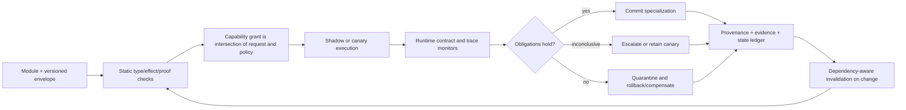

# Programming languages and verification: assurance-boundary audit

<!-- markdownlint-disable MD013 -->

**Date:** 2026-08-05

**Scope:** type systems, refinement and dependent types, contracts and blame,
effect and capability systems, proof-carrying code, separation logic, abstract
interpretation, runtime verification, gradual typing, transactions and
compensation, dynamic software update, provenance, and assurance cost

**Purpose:** determine which established programming-language and systems
mechanisms already support safe module composition, local authority,
reversible specialization, factual/provenance boundaries, and maintenance;
state their exact guarantees and trusted bases; and prevent architectural
principles—especially
[P-002](../principle-registry.md#p-002--local-autonomy-with-exception-escalation),
[P-003](../principle-registry.md#p-003--temporary-trace-before-commitment),
[P-004](../principle-registry.md#p-004--diversity-selection-and-protection),
[P-006](../principle-registry.md#p-006--homeostatic-negative-feedback),
[P-008](../principle-registry.md#p-008--compartmentalized-interaction),
[P-009](../principle-registry.md#p-009--maintenance-plane),
[P-010](../principle-registry.md#p-010--structural-offloading-and-co-design),
[P-012](../principle-registry.md#p-012--memory-matched-to-information-lifetime),
and
[P-013](../principle-registry.md#p-013--externalized-shared-state)—from
relabelling formal-methods results.

## Executive finding

The strongest result is a separation of assurances, not a universal mechanism.

- A **type proof** establishes only the theorem defined by a particular type
  system and operational semantics. Ordinary progress and preservation do not
  establish termination, functional correctness, resource bounds, security,
  factual truth, or usefulness.
- A **refinement, dependent type, or proof certificate** can establish a richer
  proposition, but only if the proposition, program model, proof rules, solver
  or kernel, compiler, and deployment correspondence are trustworthy.
- A **contract or runtime monitor** checks observed boundary values or event
  prefixes. It may assign blame or detect a bad prefix; it cannot certify an
  unexpressed property, unobserved event, or arbitrary future liveness claim.
- An **effect system** describes possible effects, while a **capability** grants
  authority to perform an operation. Description is not authorization, and
  authorization is not proof of good intent or correct outcome.
- A **transaction** can make declared state updates atomic and recoverable
  within its resource boundary. It cannot retract an email, physical act, model
  disclosure, or third-party side effect. A saga's compensation is a new action,
  not generally an inverse.
- **Hot update** preserves service only through an explicit relation between old
  code, live state, new code, and an update point. Type-safe replacement does not
  prove application invariants across versions.
- **Provenance** records derivation or custody. It does not make the source
  correct and does not make the derived statement true.

Every individual mechanism below deduplicates into established programming
languages, formal verification, operating-system security, database recovery,
or deployment practice. One residual systems candidate survives:

> Require every adaptive AI module to carry a versioned assurance envelope that
> separates proved interface/effect properties, delegated capabilities,
> empirically tested behavioral claims, monitored runtime obligations, evidence
> provenance, state-migration rules, and compensating or rollback actions. A
> maintenance plane admits, observes, quarantines, or reverses the module.

This is not a claim of a new formal principle. It is a testable integration
hypothesis. It survives only if the envelope reduces unsafe compositions,
authority violations, provenance confusion, and collateral regressions at equal
engineering and runtime budget versus typed APIs, ordinary IAM/sandboxing,
schema validation, static analysis, canaries, and transactional deployment.

## Assurance classes must not be collapsed

| Assurance class | Canonical evidence | What it can establish | What remains outside |
| --- | --- | --- | --- |
| Static syntactic | Type derivation, effect derivation, abstract interpretation result | A theorem relative to the language rules and program model | Wrong specification, foreign code, compiler/runtime mismatch, environment, truth |
| Static semantic | Refinement/dependent proof, separation-logic proof, proof certificate | The encoded proposition for modeled executions | Unmodeled behavior, faulty trusted base, specification error, deployment drift |
| Dynamic boundary | Contract, cast, schema validator | Observed values/interactions meet the encoded boundary predicate, or a party is blamed | Unobserved paths, latent future behavior, semantic intent |
| Dynamic trace | Runtime monitor | The observed prefix satisfies, violates, or leaves inconclusive a monitorable temporal property | Future events, missing instrumentation, non-monitorable properties |
| Authority | Capability or reference monitor decision | The principal possessed a token/right accepted by the enforcement point | Whether using the right was correct, safe, or truthful |
| Recovery | Transaction log, state checkpoint, compensation, version rollback | Declared state can commit/abort/recover under the stated failure model | Irreversible external effects, semantic equivalence, stale dependencies |
| Epistemic | Signed artifact, lineage graph, citation, measurement record | Origin, identity, custody, or derivation under the capture model | Truth of the originating assertion or adequacy of the evidence |
| Empirical | Tests, benchmarks, calibration and uncertainty | Behavior on sampled conditions with declared statistics | Universal behavior outside the sampled distribution |

The candidate architecture must preserve these labels. Calling all of them
“proof,” “confidence,” or “trust” would destroy the information needed for safe
composition.

## Mechanism map

| Mechanism | Exact guarantee, in one line | Main information path | Dominant cost | Update/invalidation boundary | Strongest ordinary null | P mapping | Residual |
| --- | --- | --- | --- | --- | --- | --- | --- |
| Conventional static types | Well-typed closed terms satisfy the type-soundness theorem of the modeled language | Source annotations/inference → checker → typed artifact | Checking/inference; annotations; restrictions | Language semantics, FFI, unsafe escape, compiler or API change | Typed service/API and schema compiler | P-008, P-010 | None alone |
| Refinement/dependent types | Encoded predicates indexed by values are proven for accepted terms | Specification → VC/proof term → solver/kernel → checked artifact | Specification, proof search, annotations, checking | Predicate, library theorem, solver, compiler, data model | Existing refinement/proof language | P-008, P-009 | Envelope proof layer |
| Contracts and blame | Observed boundary interactions satisfy predicates or designated parties are blamed | Boundary value/call → wrapper → predicate → result/blame | Per-crossing checks, wrappers, retained metadata | Contract or component version; bypassed boundary | API gateway/schema/runtime assertion | P-002, P-008, P-009 | Envelope monitor layer |
| Effect systems | Inferred/declared effect is a conservative description under the effect semantics | Expression → type/effect inference → effect row/set | Compile-time inference; annotations; conservatism | Hidden effect, handler semantics, FFI, effect taxonomy | Typed tool manifest/static call graph | P-002, P-008 | Envelope declaration |
| Capabilities | Only holders of an unforgeable delegated token can request covered operations at the enforcement point | Grant → token/reference → call → reference monitor | Indirection, compartment boundaries, policy engineering | Delegation/revocation, confused deputy, covert channel | OS sandbox, object capability, scoped IAM | P-002, P-008 | Envelope authority layer |
| Proof-carrying code | Consumer accepts code only when a supplied proof checks against its safety policy | Code + proof → small checker → loader | Producer proof construction, proof size, checking | Policy, ISA/semantics, checker, code transformation | Signed build + sandbox + verifier | P-008, P-009, P-010 | Envelope admission layer |
| Separation logic | Hoare triples compose locally for disjoint owned resources under the logic's rules | Resource invariant → proof → verified component | Invariants, proof search, annotations | Ownership/shared-invariant change, concurrency/FFI model | Ownership-safe language and verified library | P-008, P-009 | Useful for state ownership |
| Abstract interpretation | Analysis result soundly over-approximates modeled reachable behavior | Program semantics → abstraction/fixpoint → alarms/invariants | Analysis time/memory; false alarms; precision tuning | Semantics, abstraction, reflection/native code, assumptions | Mature static analyzer/taint analysis | P-008, P-009 | Envelope evidence input |
| Runtime verification | Monitor classifies an observed finite prefix as true, false, or inconclusive under its trace semantics | Instrumented events → monitor state → verdict/action | Instrumentation, event transport, monitor time/state | Missing/reordered events, formula/version change | Production policy monitor and telemetry | P-003, P-006, P-009 | Envelope runtime layer |
| Gradual typing | Typed/untyped interoperation preserves the chosen gradual soundness/blame theorem | Cross-boundary value → cast/proxy → typed or blamed use | Casts, proxies, space/time overhead | Boundary coverage, escape, mutation/identity semantics | Typed façade with validation | P-002, P-008 | Migration aid, not assurance tier |
| Transactions and sagas | Declared state transitions commit/abort under an isolation/recovery model; sagas run compensations | Intent → log/lock/version → commit or undo/compensate | Logging, coordination, contention, compensation | Transactional resource boundary and external effects | DB transaction, outbox, idempotency, saga | P-003, P-006, P-009, P-013 | Envelope recovery action |
| Hot code update | Accepted patch is type/update compatible and transforms live state at allowed points | Old code/state + patch/migration → validator → new version | Updateability hooks, migration, validation, mixed-version tests | State schema, update point, dependency/protocol version | Blue-green/canary plus schema migration | P-003, P-004, P-009 | Reversible specialization substrate |
| Provenance tracking | Captured derivations/custody compose according to the provenance model | Source identity + operation events → lineage record → query | Capture, storage, signing, graph traversal | Missing source/event, identity/key change, lossy transform | Signed artifacts, SBOM/data lineage/citations | P-009, P-012, P-013 | Envelope epistemic layer |

## Shared formal and cost boundary

### Type soundness is scoped

For a standard small-step presentation, preservation and progress have the
shape

$$
\Gamma \vdash e : \tau \land e \rightarrow e'
\Longrightarrow \Gamma \vdash e' : \tau,
$$

$$
\Gamma \vdash e : \tau
\Longrightarrow
\operatorname{value}(e) \lor \exists e'.\; e \rightarrow e'.
$$

Here $\Gamma$ is the typing environment, $e$ and $e'$ are expressions,
$\tau$ is a type, and $\rightarrow$ is one evaluation step. The unit of the
claim is a derivable term under a defined semantics, not an arbitrary deployed
program. “Does not get stuck for a type error” is not “does the right thing.”
Wright and Felleisen made this syntactic proof method precise
([Wright and Felleisen 1994](https://doi.org/10.1006/inco.1994.1093)).

### Assurance has a lifecycle cost

For $N$ executions and $U$ updates, use at least

$$
C_{\mathrm{assure}} =
C_{\mathrm{spec}} +
C_{\mathrm{prove}} +
C_{\mathrm{static-check}} +
C_{\mathrm{instrument}} +
N C_{\mathrm{runtime-check}} +
U(C_{\mathrm{reprove}}+C_{\mathrm{migration}}+C_{\mathrm{revalidation}}) +
C_{\mathrm{incident}}.
$$

Each $C$ must be reported in an explicit unit: engineer-hours, checker CPU
seconds, proof bytes, added instructions, joules, latency, memory, downtime, or
incident loss. They cannot be summed into one scalar without declared exchange
weights. Proof checking may be cheap relative to proof construction, while a
monitor that is cheap per event may dominate at high event rate.

The corresponding benefit is not “number of proofs.” It is reduction in
unsafe admissions, escaped authority violations, mean time to localization,
irrecoverable side effects, and collateral regressions at equal functional
quality and resource budget.

## 1. Conventional type systems

**Exact guarantee.** The guarantee is the proven metatheorem for a specified
language. In the common progress/preservation form, accepted closed programs do
not reach a state classified as a type error. Some type systems additionally
encode termination, linearity, information flow, resource bounds, or other
properties, but those are separate theorems and must be named.

**Trusted base.** Grammar, typing rules, operational semantics, metatheory,
type checker, compiler/runtime correspondence, and any unsafe or foreign-function
boundary. A paper proof does not cover an implementation bug unless the checker
and compiler are connected to it.

**Information path.** Programmer annotations and inferred constraints flow into
the checker; the checker emits acceptance/rejection and typed interface metadata;
the compiler erases or preserves that metadata according to the implementation.

**Cost.** Static inference/checking, annotations, more explicit interfaces, and
rejected programs. Runtime cost can be zero for erased checks, but dynamic
features, representation conversions, or safety checks may remain.

**Compositional assumptions.** Components agree on type identity, calling
convention, module abstraction, mutation and exception semantics, and the status
of foreign code. Composition preserves only the properties captured by those
interfaces.

**Invalidation/update boundary.** A change to type definitions, module
interfaces, language semantics, compiler, unsafe code, serialization schema, or
FFI assumptions requires rechecking or revalidation.

**Failure mode.** A well-typed program can diverge, exhaust memory, leak permitted
data, call the wrong tool with a correctly typed argument, or return a fluent
falsehood of type `String`.

**Strongest AI/systems null.** Generated code behind a conventional typed API,
schema compiler, memory-safe language, and sandbox already provides the available
type guarantee. Renaming tensor shapes or tool schemas “neural types” adds no
principle.

**P mapping and disposition.** P-008 benefits from typed compartment boundaries;
P-010 can compile validated interfaces into efficient representations. No
residual principle survives.

## 2. Refinement and dependent types

A refinement type has the form

$$
\{x:\tau \mid \varphi(x)\},
$$

where $\varphi$ is a logical predicate. Dependent types let types mention
values more generally. Xi and Pfenning demonstrated restricted dependent types
for practical programming
([Xi and Pfenning 1999](https://doi.org/10.1145/292540.292560)); Liquid Types
combine predicate abstraction with inference for a decidable refinement domain
([Rondon, Kawaguchi, and Jhala 2008](https://doi.org/10.1145/1379022.1375602)).

**Exact guarantee.** If checking succeeds, the encoded predicate follows for the
accepted term under the logic, typing rules, and program semantics. In an
SMT-backed system, generated verification conditions must be valid in the
supported theory; in a proof-assistant setting, a proof term must check in the
kernel.

**Trusted base.** Specification $\varphi$, logical encoding, VC generator or
elaborator, axioms, solver and proof reconstruction path, kernel, compiler, and
runtime/FFI model. An inconsistent axiom or wrong specification can prove the
wrong thing perfectly.

**Information path.** Domain invariants are written as types or lemmas; the
elaborator generates constraints/proof obligations; automation or a human
constructs evidence; a solver/kernel accepts or rejects it; the checked artifact
and proof metadata are versioned.

**Cost.** Specification and annotation labor, proof discovery, SMT or theorem
proving, proof checking, and maintenance. Decidable fragments buy automation by
restricting expressiveness; richer types can shift work to interactive proofs.

**Compositional assumptions.** Imported lemmas and module specifications are
sound, abstraction boundaries expose sufficient invariants, and callers satisfy
preconditions. Global neural behavior rarely decomposes automatically into
local functional specifications.

**Invalidation/update boundary.** Changes to predicates, axioms, data
representations, imported libraries, model semantics, compiler, solver policy,
or implementation require dependency-aware rechecking. Learned weights changing
behind the same nominal type can invalidate behavioral assumptions without a
type error.

**Failure mode.** Specification gaming, omitted side effects, axiomatized false
assumptions, solver unsoundness, proof/implementation mismatch, or an invariant
that is correct but irrelevant to user harm.

**Strongest AI/systems null.** Use an existing refinement/dependent or verified
language for safety-critical deterministic glue, shape/index constraints,
resource protocols, and tool adapters. Do not claim that a proof about an
inference wrapper verifies the learned model's open-world semantics.

**P mapping and disposition.** P-008 and P-009 gain strong local invariants and
checked repair preconditions. The surviving contribution is only their placement
inside a graded envelope that does not mislabel empirical model behavior as a
proof.

## 3. Contracts, higher-order boundaries, and blame

For a function contract $C_d \rightarrow C_r$, a wrapper checks the argument
against domain contract $C_d$ and the result against range contract $C_r$.
Higher-order contracts wrap functions so obligations follow later calls;
negative positions reverse responsibility. Findler and Felleisen formalized
this monitoring and blame discipline
([Findler and Felleisen 2002](https://doi.org/10.1145/583852.581484)).

**Exact guarantee.** For interactions passing through an instrumented boundary,
contract violations are detected according to the contract semantics and blame
is assigned to the party responsible for the failed obligation. Success says
only that observed checks passed.

**Trusted base.** Contract predicates, wrapper insertion, evaluator/runtime,
blame labels, complete mediation of the boundary, and purity/termination
assumptions for predicates where required.

**Information path.** Provider and client labels plus a contract attach to an
export; calls and returned values cross a wrapper; checks emit pass, failure,
blame, and optionally a trace to the maintenance plane.

**Cost.** If boundary event $i$ executes check $k_i$, runtime work is roughly

$$
T_{\mathrm{contract}} = \sum_{i=1}^{M} c(k_i),
$$

where $M$ is the number of mediated crossings and $c(k_i)$ includes proxies,
deep traversal, allocation, and logging. Higher-order and mutable values can
retain wrappers and amplify cost.

**Compositional assumptions.** All relevant interactions cross the labelled
boundary, predicates are meaningful and side-effect-safe, identity and mutation
semantics survive wrapping, and blame labels correspond to deployable modules.

**Invalidation/update boundary.** Contract changes, wrapper bypasses, module
rebinding, representation changes, and new interaction channels require
reinstrumentation and compatibility tests.

**Failure mode.** A weak contract passes bad semantics; an expensive contract
causes denial of service; an incomplete boundary misses the violation; blame
identifies the contract party but not the organizational root cause.

**Strongest AI/systems null.** JSON/schema validation, API gateways, assertions,
and tool-call policy checks already monitor AI module boundaries. The fair null
includes higher-order callbacks, streams, mutable sessions, and costs—not only a
single JSON object.

**P mapping and disposition.** Contracts implement P-002 exception escalation,
P-008 mediated interaction, and P-009 diagnostic localization. Their role in the
residual envelope is dynamic obligation and blame, not proof of model quality.

## 4. Effect systems

An effect judgment may be written

$$
\Gamma \vdash e : \tau\;!\;\epsilon,
$$

where $\epsilon$ conservatively describes effects such as reads, writes,
exceptions, I/O, nondeterminism, or region access. Lucassen and Gifford's
polymorphic effect system statically approximated side effects and regions
([Lucassen and Gifford 1988](https://doi.org/10.1145/73560.73564)).

**Exact guarantee.** Under effect soundness, the actual modeled effects of an
accepted expression are contained in its inferred/declared effect description.
The direction matters: a conservative effect set can contain effects that never
occur.

**Trusted base.** Effect taxonomy, typing/effect rules, handler semantics,
inference, compiler/runtime, and complete modeling of primitives and FFI.

**Information path.** Primitive effects are annotated; inference propagates and
combines them through the call graph; handlers discharge or transform effects;
the module interface exposes the residual effect row/set.

**Cost.** Mostly static inference, annotations, larger interfaces, and lost
precision. Runtime cost depends on the handler implementation, not on the
abstract effect judgment alone.

**Compositional assumptions.** Effect composition operators match sequencing,
concurrency, handlers, and regions; hidden reflection/native code is excluded or
given a conservative top effect.

**Invalidation/update boundary.** New primitives, handlers, FFI calls, effect
policies, or call edges require reinference. A learned router choosing a new tool
changes the actual effect path even if tensor/value types do not change.

**Failure mode.** The effect set is too broad to guide least privilege, or an
unmodeled primitive performs an effect outside the set. “May send email” does not
say whether sending a particular email is authorized.

**Strongest AI/systems null.** A typed tool manifest and conservative call-graph
or policy analysis already expose possible actions. Compare against that before
claiming biologically inspired action gating.

**P mapping and disposition.** P-002 and P-008 benefit from explicit possible
effects. In the envelope, effects are declarations used to request capabilities;
they are not the capabilities themselves.

## 5. Capability systems and local authority

Let $\operatorname{Auth}(m)$ be the rights represented by capabilities held by
module $m$. A requested operation $o$ is admitted only when a presented
unforgeable capability covers $o$ and the reference monitor accepts it.
Capsicum demonstrates capability mode and fine-grained rights on UNIX file
descriptors while denying ambient global namespaces
([Watson et al. 2010](https://www.usenix.org/conference/usenixsecurity10/legacy-presentation/capsicum-practical-capabilities-unix)).

**Exact guarantee.** Within the reference monitor's object and operation model,
code cannot invoke a covered operation without possessing a suitable capability.
Capabilities express delegated authority and support least privilege; they do
not establish semantic correctness.

**Trusted base.** Capability unforgeability, kernel/reference monitor, object
identity, delegation and revocation mechanisms, confinement boundary, and any
ambient channels left available.

**Information path.** A supervisor grants a narrow token/reference; the module
presents it at an operation; the monitor checks object and rights; audit events
record use, denial, delegation, and revocation.

**Cost.** Compartment design, explicit dependency passing, system-call or IPC
boundaries, revocation bookkeeping, and operational policy. Capsicum's measured
results are implementation-specific, not a constant for an AI architecture.

**Compositional assumptions.** No hidden ambient authority, no forged handles,
delegation is controlled, and collaborating modules cannot combine individually
harmless rights into an undeclared authority path.

**Invalidation/update boundary.** Capability grant, delegation, object lifetime,
revocation, process replacement, and policy version. A new module version must
not silently inherit obsolete authority.

**Failure mode.** Confused deputy, excess initial grant, capability leakage,
revocation race, covert channel, or an authorized but harmful action.

**Strongest AI/systems null.** OS process sandboxing, scoped cloud IAM, object
capabilities, containers, and per-tool credentials already implement local
authority. Prompt instructions are not an authority boundary.

**P mapping and disposition.** This is the direct established null for P-002 and
P-008. The envelope may bind declared effects to explicit capabilities and
expiry, but the principle is not new.

## 6. Proof-carrying code

Proof-carrying code (PCC) sends code $b$ with proof $\pi$. The consumer
accepts only if

$$
\operatorname{Check}(P,b,\pi)=\mathsf{true},
$$

where $P$ is the consumer's safety policy. Necula's formulation moves proof
construction to the producer and lets the host validate evidence before loading
untrusted native code
([Necula 1997](https://doi.org/10.1145/263699.263712)).

**Exact guarantee.** Accepted code satisfies policy $P$ with respect to the
formal machine semantics and proof rules, assuming the checker and trusted base
are sound. It proves exactly $P$, not general safety.

**Trusted base.** Policy, formal instruction semantics, proof logic, checker,
loader, memory/hardware model, and binding between checked bits and executed bits.

**Information path.** Consumer publishes policy; producer compiles code and
constructs certificate; artifact transport preserves their binding; consumer
checks certificate; loader admits or rejects; version and proof hash enter the
audit log.

**Cost.** Producer-side proving/certifying compilation, certificate bytes,
consumer checking, cache/storage, and re-certification after transformation.
Small checker cost does not erase specification or proof-construction cost.

**Compositional assumptions.** Policies compose, imported proofs are valid,
linking preserves certified assumptions, and the loader mediates every execution
path. Dynamic linking or self-modification needs a new proof boundary.

**Invalidation/update boundary.** Any code bit, compiler pass after certification,
policy, ISA, linker, checker, imported lemma, or hardware assumption change can
invalidate the certificate.

**Failure mode.** Weak policy, checker bug, mismatched executable, unsound axiom,
proof-size denial of service, or certified memory safety combined with harmful
authorized behavior.

**Strongest AI/systems null.** Signed reproducible builds plus a sandbox, static
verifier, and admission controller are the deployment baseline. PCC improves
this only when a machine-checkable property travels with the exact artifact and
reduces consumer trust or reanalysis.

**P mapping and disposition.** PCC supports P-008 admission, P-009 maintenance,
and P-010 producer/consumer work placement. It is the established null for a
proof-carrying AI module; the residual is graded because neural behavior rarely
admits the same universal proof.

## 7. Separation logic and owned state

The frame rule captures local reasoning:

$$
\frac{\{P\}\;C\;\{Q\}}
{\{P * R\}\;C\;\{Q * R\}}
\quad
\text{when } C \text{ does not modify the resources described by } R.
$$

The separating conjunction $P * R$ asserts disjoint owned resources. Reynolds
developed separation logic for shared mutable data structures and local
reasoning
([Reynolds 2002](https://doi.org/10.1109/LICS.2002.1029817)).

**Exact guarantee.** A proved Hoare triple establishes its pre/postcondition for
the modeled command and heap/resource semantics. The frame rule preserves an
unmodified disjoint frame. Concurrent variants require their own interference
and invariant rules.

**Trusted base.** Assertion semantics, proof rules, verifier/kernel, program and
memory model, allocator/concurrency model, and compiler/runtime correspondence.

**Information path.** Module specifications declare ownership and invariants;
proof obligations follow reads, writes, allocation, transfer, and sharing;
verified interfaces expose what state is consumed, produced, or framed.

**Cost.** Resource invariants, annotations, proof automation, solver/kernel time,
and proof maintenance. Local reasoning can reduce proof scope, but discovering a
stable ownership decomposition is engineering work.

**Compositional assumptions.** Framed state is truly disjoint or governed by a
shared invariant, callbacks respect ownership transfer, and hidden aliases/FFI
do not violate the heap model.

**Invalidation/update boundary.** Ownership protocol, representation invariant,
aliasing, concurrency discipline, allocator, and foreign interface changes.

**Failure mode.** Incorrect ownership model, unsound shared invariant, data race
outside the logic, proof of memory safety without domain correctness, or a global
property that does not decompose locally.

**Strongest AI/systems null.** Memory-safe ownership languages, isolated stateful
services, and verified concurrent libraries already provide strong state
compartmentalization. A “specialist memory cell” must beat those nulls.

**P mapping and disposition.** Separation logic is an established formal basis
for P-008 compartments and P-009 local repair without collateral mutation. It
could verify envelope state ownership; no new principle survives.

## 8. Abstract interpretation

Abstract interpretation computes a fixpoint over an abstract domain. A sound
analysis aims for

$$
\operatorname{Reach}(P)
\subseteq
\gamma\!\left(\operatorname{lfp}(F^{\#})\right),
$$

where $\operatorname{Reach}(P)$ is the concrete reachable-state set,
$F^{\#}$ is an abstract transformer, $\operatorname{lfp}$ its computed
least fixpoint or sound post-fixpoint, and $\gamma$ concretization. Cousot and
Cousot established the lattice/fixpoint foundation
([Cousot and Cousot 1977](https://doi.org/10.1145/512950.512973)).

**Exact guarantee.** Under sound abstraction and transfer functions, no modeled
concrete behavior lies outside the computed abstract over-approximation. An
alarm may be infeasible; absence of an alarm supports only the properties and
code paths modeled by the analysis.

**Trusted base.** Concrete semantics, abstraction/concretization relation,
transfer functions, fixpoint/widening implementation, front end, and assumptions
about libraries, reflection, native code, and concurrency.

**Information path.** Source/IR enters semantic transfer functions; abstract
states propagate through the control-flow graph; joins/widening force
convergence; alarms and invariants flow to developers and admission gates.

**Cost.** Static CPU/memory, domain engineering, summaries, path sensitivity,
and false-positive triage. Widening and coarse domains improve convergence but
lose precision; richer relational domains cost more.

**Compositional assumptions.** Library summaries and interfaces safely
over-approximate hidden behavior, call/context abstractions are adequate, and
analysis assumptions compose across threads and modules.

**Invalidation/update boundary.** Source/IR, compiler lowering, library summary,
analysis configuration, abstract domain, environment assumption, or reflective
call change.

**Failure mode.** Alarm fatigue, unsound modeling gap, state explosion, widening
that obscures the useful invariant, or a precise analysis of the wrong property.

**Strongest AI/systems null.** Mature static analyzers, taint analyses, model
checkers, and policy compilers are the baseline for deterministic AI glue and
generated code. Neural activation inspection is not abstract interpretation
unless it supplies a sound abstraction theorem.

**P mapping and disposition.** It supplies P-008/P-009 pre-admission evidence
and can target checks to uncertain regions. It is an input to the envelope, not
an independent biological principle.

## 9. Runtime verification

For an observed prefix $\sigma_{0:t}$, a three-valued monitor can report

$$
M_{\varphi}(\sigma_{0:t})
\in \{\mathsf{true},\mathsf{false},\mathsf{inconclusive}\}.
$$

Bauer, Leucker, and Schallhart define finite-prefix semantics and monitor
generation for LTL/TLTL
([Bauer, Leucker, and Schallhart 2011](https://doi.org/10.1145/2000799.2000800)).

**Exact guarantee.** The verdict characterizes the observed prefix under the
formula's finite-trace semantics. Safety violations have finite bad prefixes;
many liveness statements cannot be conclusively established from a finite
prefix. A monitor does not observe what instrumentation omits.

**Trusted base.** Formula, event semantics, instrumentation, clocks/order,
transport, monitor generator/runtime, identity correlation, and response action.

**Information path.** Program/tool/environment events are captured, timestamped,
ordered and correlated; the monitor updates state; verdict and witness prefix
reach a maintenance action such as alert, throttle, quarantine, or rollback.

**Cost.** Instrumentation, event serialization, bandwidth, monitor state and CPU,
storage, response latency, and possible application perturbation. Sampling saves
cost by weakening coverage and must be explicit.

**Compositional assumptions.** Component event alphabets agree; clocks and
causal identities are meaningful; hidden channels are excluded; local formulae
compose into the intended global property.

**Invalidation/update boundary.** Formula, instrumentation map, event schema,
sampling policy, clock/order model, module version, or response policy.

**Failure mode.** Missing or reordered event, monitor overload, late detection
after irreversible harm, false assurance from an inconclusive prefix, or a
property outside the monitorable fragment.

**Strongest AI/systems null.** Production telemetry, policy engines, egress DLP,
rate limits, and trace monitors already implement runtime observation. Compare
against complete mediation plus conventional circuit breakers.

**P mapping and disposition.** Runtime verification realizes P-003 temporary
trace, P-006 feedback, and P-009 maintenance. It is the residual envelope's
runtime evidence layer, not a universal correctness proof.

## 10. Gradual typing and mixed-trust boundaries

Gradual typing permits precise types and an imprecise dynamic type in one
program
([Siek and Taha 2006](https://web.stanford.edu/class/cs242/materials/old/siek06__gradual.pdf)).
Sound systems insert casts or wrappers at typed/untyped boundaries. The blame
calculus proves when the typed side cannot be blamed for certain mismatches
([Wadler and Findler 2009](https://doi.org/10.1007/978-3-642-00590-9_1)).

**Exact guarantee.** The exact theorem depends on the gradual language: type
soundness across inserted casts, blame safety, and/or a gradual guarantee about
loss of precision. It does not mean untyped code becomes statically verified.

**Trusted base.** Static checker, cast insertion, runtime proxies, blame labels,
mutation and identity semantics, optimizer, and complete interoperation
boundary.

**Information path.** Static/dynamic annotations guide elaboration; casts wrap
crossing values; successful uses continue; mismatches raise labelled blame and
traces.

**Cost.** Static checking plus runtime casts, proxies, allocation, retained
wrappers, and debugging. Takikawa et al. found unacceptable overhead for many
mixed Typed Racket configurations, showing why evaluation must cover the full
configuration lattice rather than only all-typed/all-untyped endpoints
([Takikawa et al. 2016](https://doi.org/10.1145/2837614.2837630)). That result is
system-specific, not a universal constant.

**Compositional assumptions.** Every typed/untyped channel is mediated; casts
preserve identity/mutation expectations; blame labels survive callbacks and
higher-order values.

**Invalidation/update boundary.** Migration of a module between typed and
dynamic, boundary shape, proxy semantics, compiler optimization, or library
version. Each mixed configuration may have different cost and failure behavior.

**Failure mode.** Boundary slowdown, proxy/identity surprises, blame far from the
root cause, unsafe escape, or confidence that partially typed means partially
functionally verified.

**Strongest AI/systems null.** A typed service façade with explicit validators
around generated, plugin, or scripting code. Gradual typing is useful when many
configurations must coexist, not merely as a label for “some schemas.”

**P mapping and disposition.** It supports incremental P-008 compartment
migration and P-002 blame/escalation. It is a transition strategy for the
envelope, not its evidence hierarchy.

## 11. Transactions, compensation, and rollback semantics

Härder and Reuter characterize transaction recovery using atomicity,
consistency, isolation, and durability
([Härder and Reuter 1983](https://doi.org/10.1145/289.291)). Each property is
parameterized by a database invariant, isolation level, durability model, and
failure assumptions; “transactional” alone is incomplete.

For a long-lived saga $T_1;\ldots;T_n$, failure after $T_k$ can trigger
compensations $C_k;\ldots;C_1$
([Garcia-Molina and Salem 1987](https://doi.org/10.1145/38713.38742)). In general,

$$
C_i(T_i(s)) \neq s.
$$

The compensation may refund money or issue a correction, but history,
observation, time, and external effects remain.

**Exact guarantee.** A transaction manager provides its declared atomicity,
isolation, and recovery behavior for participating resources. A saga guarantees
only execution of declared subtransactions/compensations under its orchestration
and retry model, not restoration of an identical world state.

**Trusted base.** Transaction manager, log, storage, concurrency control,
commit protocol, recovery code, durability/failure model, resource adapters,
idempotency keys, and compensation logic.

**Information path.** Intent and before/after/log records enter the transaction
manager; commit/abort establishes visible state; failures trigger undo, retry, or
compensation; outcome and unresolved side effects enter the maintenance ledger.

**Cost.** Logging, locks or version checks, coordination, contention, replicated
durability, retry, retained checkpoints, compensation engineering, and delayed
external effects.

**Compositional assumptions.** All resources participate in a compatible
protocol or expose valid idempotent/compensating operations; invariants compose
under the selected isolation level; message delivery semantics are declared.

**Invalidation/update boundary.** State schema, invariant, isolation level,
resource adapter, compensation, retention window, and side-effect API version.

**Failure mode.** Partial external effect, duplicate or reordered compensation,
semantic non-invertibility, stale checkpoint, cascading retry, or a committed
state that satisfies storage invariants but violates user intent.

**Strongest AI/systems null.** Database transactions, transactional outbox,
idempotent commands, workflow sagas, checkpoints, and canary deployment. “Undo a
thought” is not a meaningful guarantee unless the exact persisted and external
state boundary is named.

**P mapping and disposition.** Transactions implement P-003 commit boundaries,
P-006 recovery feedback, P-009 maintenance, and P-013 authoritative shared state.
They are the rollback substrate for reversible specialization, with external
effects explicitly marked non-reversible.

## 12. Dynamic software update and reversible specialization

Hicks and Nettles describe dynamic patches containing new code and state
transformation code applied at programmer-selected update points, with type-safe
verification and low overhead for their measured web-server case
([Hicks and Nettles 2005](https://www.cs.umd.edu/~mwh/papers/dynupd-toplas.pdf)).
The result demonstrates feasible in-place update, not semantic equivalence of
arbitrary versions.

**Exact guarantee.** A particular dynamic-update system may guarantee type-safe
patch loading, allowed update timing, and well-formed state transformation. It
does not automatically prove that the new version refines the old behavior,
preserves a domain invariant, or can be reversed after new-format state is
observed externally.

**Trusted base.** Patch generator, compatibility relation, state transformer,
update-point mechanism, runtime/linker, checker, compiler instrumentation,
dependency protocol, and recovery path.

**Information path.** Old/new program differences produce code and state
migrations; a validator checks compatibility; a coordinator reaches an allowed
point; migration transforms live state; probes compare invariants; the system
commits, quarantines, or rolls back.

**Cost.** Updateability instrumentation, quiescence/coordination, migration,
mixed-version compatibility, shadow/canary resources, retained old state/code,
validation, and rollback rehearsal.

**Compositional assumptions.** Dependencies tolerate the version skew, state
migration covers all reachable values, callbacks/stacks/resources are at a safe
point, and protocols have compatible evolution rules.

**Invalidation/update boundary.** Every code, type, state schema, protocol,
dependency, weight, prompt/policy, retrieval index, and migration change that
affects behavior. “Same API” is insufficient when behavioral or epistemic
contracts change.

**Failure mode.** Corrupt migration, unavailable safe point, mixed-version
protocol break, irreversible post-update effect, latent regression that crosses
the rollback window, or state that no older version can read.

**Strongest AI/systems null.** Blue-green or canary deployment with shadow
traffic, versioned schemas, feature flags, checkpoint/restore, and conventional
rollback. In-place update must beat this at equal availability and failure risk.

**P mapping and disposition.** This is a direct systems null for P-003, P-004,
and P-009. It supplies the substrate for reversible AI specialization but leaves
the behavioral equivalence test open.

## 13. Factual and provenance boundaries

Green, Karvounarakis, and Tannen show how semiring annotations compose database
provenance through relational operations
([Green, Karvounarakis, and Tannen 2007](https://doi.org/10.1145/1265530.1265535)).
This is derivation algebra, not a truth oracle.

**Exact guarantee.** Under the capture and query model, a provenance record can
identify source tokens, operations, multiplicity, or custody that contributed to
an output. Digital signatures can bind an identity/key to exact bytes. Neither
guarantees that the source assertion is true.

**Trusted base.** Source identity, key management, capture completeness,
operation semantics, lineage store, clocks/ordering where used, canonicalization,
and verifier/query implementation.

**Information path.** Source/artifact identifiers and transformation events are
captured; derivations compose into a lineage graph or annotation; output claims
carry links/hashes/signatures; reviewers or validators inspect the chain and the
underlying evidence.

**Cost.** Event capture, storage, cryptography, retention, graph queries,
redaction, source licensing, and human/scientific validation. Fine-grained token
provenance can dominate output size.

**Compositional assumptions.** Transformations expose their inputs, identifiers
are stable, copied/aggregated evidence preserves lineage, and trust domains agree
on signature and source semantics.

**Invalidation/update boundary.** Source revision/retraction, key revocation,
transform version, index snapshot, citation target, lossy summarization, or
uncaptured manual step.

**Failure mode.** Authentic false source, laundering through many citations,
missing lineage edge, stale/retracted evidence, hash without semantic identity,
or a model inventing a reference that passes only syntactic validation.

**Strongest AI/systems null.** Signed datasets/artifacts, SBOM and data lineage,
content-addressed storage, retrieval restricted to approved corpora, claim-level
citations, and independent factual validation. Types can ensure a `Claim` has a
`SourceId`; they cannot ensure the claim follows from the source.

**P mapping and disposition.** Provenance directly supports P-009, P-012, and
P-013. Its role in the envelope is explicitly epistemic, below neither proofs nor
tests but incomparable to them.

## 14. Proof, monitor, and maintenance cost

Assurance mechanisms alter where work is paid:

| Mechanism | Producer/developer work | Consumer/admission work | Per-execution work | Update work | Characteristic hidden cost |
| --- | --- | --- | --- | --- | --- |
| Static type/effect | Annotation, interface design | Type/effect check | Often none after erasure | Recheck dependants | Weak theorem mistaken for correctness |
| Refinement/dependent proof | Specification, lemmas, automation | Kernel/SMT proof check | Often none for proven predicate | Reprove dependency cone | Specification and axiom risk |
| Contract/gradual cast | Contract and boundary design | Wrapper generation | Every mediated crossing | Rewrap and retest mixed configurations | Higher-order proxy and identity cost |
| PCC | Certificate construction | Proof checking and binding | None for certified policy unless monitored too | Re-certify exact artifact | Proof size and policy/version coupling |
| Abstract interpretation | Domain/model engineering | Fixpoint analysis | None | Reanalyze affected graph | False-positive triage and modeling gaps |
| Runtime verification | Formula/instrumentation design | Monitor deployment | Event capture and state transition | Update formula/schema/state | Missing-event and response latency |
| Transaction/update | Invariant, migration, compensation | Compatibility and preflight | Logging/coordination/probes | Migration, canary, rollback rehearsal | Irreversible external effects |
| Provenance | Capture and identity design | Signature/lineage validation | Capture, storage, query | Re-link/retract/recompute | Authenticity confused with truth |

No comparison may report only checker time. The equal-budget study must include
the specification labor, rejected valid changes, runtime tail latency, proof and
trace storage, incident localization, rollback rehearsal, and dependency
invalidation.

## Residual architecture: graded assurance envelopes

### Envelope contents

A module envelope should be a versioned manifest with distinct fields:

1. **Artifact identity:** content hash, build/toolchain identity, code/model/data
   version, dependency lock, and signature.
2. **Proved interface:** types, shapes, protocols, refinements, state ownership,
   and proof/certificate references, each naming the theorem and trusted base.
3. **Possible effects:** conservative effect set and requested resources.
4. **Granted authority:** explicit capabilities, scope, delegation rules,
   expiry, and revocation path.
5. **Empirical behavioral envelope:** datasets/environments, uncertainty,
   calibration, failure rates, distribution boundaries, and known counterexamples.
6. **Runtime obligations:** event schema, monitor formula/version, response
   latency budget, and true/false/inconclusive handling.
7. **Epistemic record:** training/source lineage, retrieval snapshot, claim-level
   citations where relevant, source status, and retraction path.
8. **Update contract:** compatible predecessor/successor versions, state
   migration, invalidation cone, canary probes, rollback window, compensations,
   and explicitly irreversible effects.

### Admission and maintenance flow



For module $m$, grant only

$$
\operatorname{Grant}(m)=
\operatorname{RequestEffects}(m)
\cap
\operatorname{PolicyAuthority}(m),
$$

and reject any undeclared effect observed by complete mediation. This rule is a
systems policy; capability enforcement, not the equation, supplies security.

### Why the candidate may still be useful

Existing stacks often scatter types, IAM, tests, monitors, provenance, and
rollback across tools with no common module identity or invalidation graph. The
candidate's testable contribution is making their assurance levels explicit and
version-linked for adaptive components whose behavior, authority, and evidence
change at different rates.

The candidate is not distinct if a conventional platform with typed APIs,
scoped credentials, CI checks, policy admission, observability, data lineage,
canaries, and schema migrations achieves the same outcomes and cost.

## Decisive equal-budget experiments

### Experiment A — unsafe module composition

Build an adaptive tool-using service from replaceable modules. Seed interface
shape errors, protocol-order errors, hidden effects, stale capability grants,
shared-state aliasing, and behavioral regressions. Compare:

1. schemas + unit/integration tests;
2. typed APIs + conventional IAM/sandbox + canary deployment;
3. condition 2 plus static analysis and runtime policy monitoring; and
4. the complete graded envelope and dependency-aware maintenance plane.

Hold engineer-hours, CI CPU, runtime CPU/memory, and p99 latency budget equal.
Measure unsafe admissions, false rejections, escaped authority violations,
time-to-blame, incident repair time, and collateral regressions. The envelope
survives only if it improves outcomes beyond condition 3.

### Experiment B — proof versus monitor placement

Choose invariants expressible both statically and dynamically: tensor bounds,
tool argument ranges, permitted resource paths, state-machine order, and budget
limits. Allocate the same total assurance budget among:

- static refinement/effect proof;
- runtime contracts/trace monitoring;
- mixed proof plus targeted monitoring; and
- ordinary tests plus sandboxing.

Vary event frequency, update rate, proof complexity, and fault rarity. Report
specification hours, proof/check time, runtime overhead, p50/p99 latency, memory,
false alarms, missed violations, detection delay, and revalidation cost. The
expected crossover—not universal superiority—is the result.

### Experiment C — reversible specialization

Allow a generic module to specialize its cache, routing, tool policy, prompt,
retrieval index, or learned adapter. Inject state-schema change, dependency
version skew, late behavioral regression, corrupted migration, and an external
side effect. Compare in-place hot update, blue-green/canary, checkpoint restore,
and envelope-governed specialization.

Measure downtime, extra resources, state loss, rollback success, time to detect,
irreversible effects, compensation completeness, and old-version readability.
Reject “reversible” if the external world or new-format state cannot be restored
within the declared contract.

### Experiment D — factual/provenance boundary

Give systems a corpus containing authentic false statements, retracted papers,
copied citations, stale versions, source conflicts, and adversarially invented
references. Compare free-form citations, schema-required citations, signed
retrieval artifacts, lineage graphs, and envelope-level claim/evidence records.

Measure citation existence, source/version identity, entailment judged blind,
retraction propagation time, provenance completeness, storage/latency, and user
calibration. A provenance mechanism fails if it improves traceability while
users become more confident in false but authentic sources.

### Experiment E — maintenance invalidation

Change one dependency at a time: type, refinement axiom, effect handler,
capability policy, abstract summary, event schema, monitor formula, data source,
state migration, and learned weights. Compare full rebuild/retest, hand-authored
dependency rules, and envelope-derived invalidation.

Measure affected-artifact recall and precision, recheck cost, stale assurance
escaping to production, and mean time to a valid redeployment. The candidate
must identify cross-layer invalidation, such as a retrieval snapshot changing a
factual claim without changing its nominal output type.

## Predeclared falsifiers

Reject or narrow the residual candidate if:

- typed APIs, sandbox/IAM, ordinary CI, policy monitoring, and canaries match it;
- the envelope becomes a stale manifest rather than a checked artifact binding;
- proof fields cover only trivial shape properties but are presented as model
  safety;
- capability enforcement is replaced by prompt-level instruction;
- monitoring omits channels or detects harm only after irreversible effects;
- provenance increases confidence without factual entailment or source-quality
  validation;
- rollback cannot read new state or compensate declared external effects;
- the invalidation graph misses more stale assurances than it saves in rechecks;
- lifecycle engineer-hours or p99 cost exceed the avoided incidents under the
  predeclared exchange weights; or
- improvement disappears when false rejection and delayed deployment are
  included.

## Proposed claims for ledger integration

Identifiers are provisional audit-local labels. Root integration should assign
the next stable claim IDs.

### C-PL-01 — Type soundness is theorem- and semantics-scoped

- **Statement:** Conventional progress/preservation establishes absence of the
  modeled type error for well-typed programs, not termination, functional
  correctness, security, or factual truth.
- **Proposed status:** established.
- **Primary source:** wright1994syntactic.
- **Boundary:** Exact coverage depends on the language, compiler/runtime, unsafe
  operations, and foreign interfaces.
- **Affected principles:** P-008, P-010.

### C-PL-02 — Refinement and dependent types strengthen only encoded properties

- **Statement:** Refinement/dependent types can statically establish value-indexed
  predicates, with automation/expressiveness and specification/proof cost traded
  across systems.
- **Proposed status:** established.
- **Primary sources:** xi1999dependent; rondon2008liquid.
- **Boundary:** Wrong specifications, axioms, models, or implementations remain
  outside the theorem.
- **Affected principles:** P-008, P-009.

### C-PL-03 — Contracts provide monitored obligations and blame

- **Statement:** Higher-order contracts can mediate delayed function interactions,
  detect encoded boundary violations, and assign blame according to polarity.
- **Proposed status:** established.
- **Primary source:** findler2002contracts.
- **Boundary:** Only mediated, observed, expressible interactions are covered;
  runtime cost is configuration- and crossing-dependent.
- **Affected principles:** P-002, P-008, P-009.

### C-PL-04 — Effect description and capability authority are distinct

- **Statement:** Effect systems conservatively describe possible effects, while
  capability systems restrict operations to holders of delegated authority.
- **Proposed status:** established.
- **Primary sources:** lucassen1988effects; watson2010capsicum.
- **Boundary:** Neither establishes intent, outcome correctness, or truth; hidden
  primitives and ambient authority break the guarantee.
- **Affected principles:** P-002, P-008.

### C-PL-05 — Proof-carrying code shifts proof construction across a trust boundary

- **Statement:** A consumer can admit untrusted code by checking a producer-
  supplied proof against a consumer-defined safety policy and formal machine
  model.
- **Proposed status:** established.
- **Primary source:** necula1997pcc.
- **Boundary:** Policy, checker, semantics, loader, proof-artifact binding, and
  updates remain trusted or invalidating.
- **Affected principles:** P-008, P-009, P-010.

### C-PL-06 — Separation logic supports local reasoning under ownership assumptions

- **Statement:** Separation logic's frame rule supports compositional reasoning
  about disjoint owned state, with shared/concurrent state requiring additional
  invariants.
- **Proposed status:** established.
- **Primary source:** reynolds2002separation.
- **Boundary:** Hidden aliases, FFI, interference, or wrong invariants invalidate
  local reasoning.
- **Affected principles:** P-008, P-009.

### C-PL-07 — Abstract interpretation exchanges precision for sound coverage

- **Statement:** A sound abstract interpretation over-approximates modeled
  reachable behavior; widening and finite abstractions enable analysis while
  potentially producing false alarms and weak invariants.
- **Proposed status:** established.
- **Primary source:** cousot1977abstract.
- **Boundary:** Semantics, transfer functions, libraries, reflection, and native
  behavior must be modeled soundly.
- **Affected principles:** P-008, P-009.

### C-PL-08 — Runtime monitors classify observed prefixes, not arbitrary futures

- **Statement:** Runtime verification can give true, false, or inconclusive
  verdicts for finite observed traces under a specified temporal semantics.
- **Proposed status:** established.
- **Primary source:** bauer2011runtime.
- **Boundary:** Instrumentation completeness, event order, monitorability, and
  response delay constrain the result.
- **Affected principles:** P-003, P-006, P-009.

### C-PL-09 — Sound gradual boundaries can impose configuration-dependent cost

- **Statement:** Gradual systems can preserve type/blame guarantees across typed
  and untyped modules using runtime casts or wrappers, whose cost can vary sharply
  across mixed configurations.
- **Proposed status:** established; performance magnitude is system-specific.
- **Primary sources:** siek2006gradual; wadler2009blame; takikawa2016dead.
- **Boundary:** Complete mediation and language-specific mutation, identity, and
  proxy semantics are required.
- **Affected principles:** P-002, P-008.

### C-PL-10 — Rollback is bounded by transactional resources and reversibility

- **Statement:** Transactions can recover participating state under declared
  atomicity/isolation/durability assumptions; sagas use compensations that are
  not generally semantic inverses.
- **Proposed status:** established.
- **Primary sources:** haerder1983transactions; garciamolina1987sagas.
- **Boundary:** Observation, time, messages, physical acts, disclosure, and
  third-party effects may be irreversible.
- **Affected principles:** P-003, P-006, P-009, P-013.

### C-PL-11 — Type-safe hot update does not imply behavioral continuity

- **Statement:** Dynamic software update can replace code and transform live
  state at controlled update points while preserving a system-specific safety
  relation, but semantic equivalence across versions requires additional
  specification and validation.
- **Proposed status:** established for the mechanism; general equivalence is not.
- **Primary source:** hicks2005dynamic.
- **Boundary:** State migration, update timing, dependencies, protocols, external
  effects, and rollback readability remain explicit obligations.
- **Affected principles:** P-003, P-004, P-009.

### C-PL-12 — Provenance establishes derivation, not truth

- **Statement:** Provenance models can compose source/derivation annotations, and
  cryptographic identity can bind records to artifacts, without proving that an
  originating assertion is true or supports a derived claim.
- **Proposed status:** established.
- **Primary source:** green2007provenance.
- **Boundary:** Capture completeness, source quality, version/retraction status,
  and claim-to-source entailment remain separate.
- **Affected principles:** P-009, P-012, P-013.

### C-PL-13 — Graded assurance envelopes are an unvalidated systems candidate

- **Statement:** Binding proofs, effects, capabilities, tests, runtime monitors,
  provenance, migration, and compensation to one versioned adaptive module may
  reduce unsafe composition and collateral maintenance failures relative to the
  strongest conventional stack at equal lifecycle budget.
- **Proposed status:** speculative.
- **Primary source:** none sufficient; this is a synthesis hypothesis after
  deduplication.
- **Boundary:** Assurance classes must remain distinct, enforcement must be
  complete, and benefits must survive comparison to typed APIs, sandbox/IAM,
  CI/static analysis, production monitoring, lineage, canaries, and transactions.
- **Affected principles:** P-002, P-003, P-004, P-006, P-008, P-009, P-012,
  P-013.

## BibTeX

```bibtex
@article{wright1994syntactic,
  author  = {Wright, Andrew K. and Felleisen, Matthias},
  title   = {A Syntactic Approach to Type Soundness},
  journal = {Information and Computation},
  year    = {1994},
  volume  = {115},
  number  = {1},
  pages   = {38--94},
  doi     = {10.1006/inco.1994.1093},
  url     = {https://doi.org/10.1006/inco.1994.1093}
}

@inproceedings{xi1999dependent,
  author    = {Xi, Hongwei and Pfenning, Frank},
  title     = {Dependent Types in Practical Programming},
  booktitle = {Proceedings of the 26th ACM SIGPLAN-SIGACT Symposium on
               Principles of Programming Languages},
  year      = {1999},
  pages     = {214--227},
  publisher = {Association for Computing Machinery},
  doi       = {10.1145/292540.292560},
  url       = {https://doi.org/10.1145/292540.292560}
}

@inproceedings{rondon2008liquid,
  author    = {Rondon, Patrick M. and Kawaguchi, Ming and Jhala, Ranjit},
  title     = {Liquid Types},
  booktitle = {Proceedings of the 29th ACM SIGPLAN Conference on Programming
               Language Design and Implementation},
  year      = {2008},
  pages     = {159--169},
  publisher = {Association for Computing Machinery},
  doi       = {10.1145/1379022.1375602},
  url       = {https://doi.org/10.1145/1379022.1375602}
}

@inproceedings{findler2002contracts,
  author    = {Findler, Robert Bruce and Felleisen, Matthias},
  title     = {Contracts for Higher-Order Functions},
  booktitle = {Proceedings of the Seventh ACM SIGPLAN International Conference
               on Functional Programming},
  year      = {2002},
  pages     = {48--59},
  publisher = {Association for Computing Machinery},
  doi       = {10.1145/583852.581484},
  url       = {https://doi.org/10.1145/583852.581484}
}

@inproceedings{lucassen1988effects,
  author    = {Lucassen, John M. and Gifford, David K.},
  title     = {Polymorphic Effect Systems},
  booktitle = {Proceedings of the 15th ACM SIGPLAN-SIGACT Symposium on
               Principles of Programming Languages},
  year      = {1988},
  pages     = {47--57},
  publisher = {Association for Computing Machinery},
  doi       = {10.1145/73560.73564},
  url       = {https://doi.org/10.1145/73560.73564}
}

@inproceedings{watson2010capsicum,
  author    = {Watson, Robert N. M. and Anderson, Jonathan and Laurie, Ben and
               Kennaway, Kris},
  title     = {Capsicum: Practical Capabilities for UNIX},
  booktitle = {Proceedings of the 19th USENIX Security Symposium},
  year      = {2010},
  pages     = {29--46},
  publisher = {USENIX Association},
  url       = {https://www.usenix.org/conference/usenixsecurity10/legacy-presentation/capsicum-practical-capabilities-unix}
}

@inproceedings{necula1997pcc,
  author    = {Necula, George C.},
  title     = {Proof-Carrying Code},
  booktitle = {Proceedings of the 24th ACM SIGPLAN-SIGACT Symposium on
               Principles of Programming Languages},
  year      = {1997},
  pages     = {106--119},
  publisher = {Association for Computing Machinery},
  doi       = {10.1145/263699.263712},
  url       = {https://doi.org/10.1145/263699.263712}
}

@inproceedings{reynolds2002separation,
  author    = {Reynolds, John C.},
  title     = {Separation Logic: A Logic for Shared Mutable Data Structures},
  booktitle = {Proceedings of the 17th Annual IEEE Symposium on Logic in
               Computer Science},
  year      = {2002},
  pages     = {55--74},
  publisher = {IEEE},
  doi       = {10.1109/LICS.2002.1029817},
  url       = {https://doi.org/10.1109/LICS.2002.1029817}
}

@inproceedings{cousot1977abstract,
  author    = {Cousot, Patrick and Cousot, Radhia},
  title     = {Abstract Interpretation: A Unified Lattice Model for Static
               Analysis of Programs by Construction or Approximation of
               Fixpoints},
  booktitle = {Conference Record of the Fourth ACM Symposium on Principles of
               Programming Languages},
  year      = {1977},
  pages     = {238--252},
  publisher = {Association for Computing Machinery},
  doi       = {10.1145/512950.512973},
  url       = {https://doi.org/10.1145/512950.512973}
}

@article{bauer2011runtime,
  author  = {Bauer, Andreas and Leucker, Martin and Schallhart, Christian},
  title   = {Runtime Verification for LTL and TLTL},
  journal = {ACM Transactions on Software Engineering and Methodology},
  year    = {2011},
  volume  = {20},
  number  = {4},
  pages   = {14:1--14:64},
  doi     = {10.1145/2000799.2000800},
  url     = {https://doi.org/10.1145/2000799.2000800}
}

@inproceedings{siek2006gradual,
  author    = {Siek, Jeremy G. and Taha, Walid},
  title     = {Gradual Typing for Functional Languages},
  booktitle = {Proceedings of the Scheme and Functional Programming Workshop},
  year      = {2006},
  pages     = {81--92},
  url       = {https://web.stanford.edu/class/cs242/materials/old/siek06__gradual.pdf}
}

@inproceedings{wadler2009blame,
  author    = {Wadler, Philip and Findler, Robert Bruce},
  title     = {Well-Typed Programs Can't Be Blamed},
  booktitle = {Programming Languages and Systems: 18th European Symposium on
               Programming},
  series    = {Lecture Notes in Computer Science},
  volume    = {5502},
  year      = {2009},
  pages     = {1--16},
  publisher = {Springer},
  doi       = {10.1007/978-3-642-00590-9_1},
  url       = {https://doi.org/10.1007/978-3-642-00590-9_1}
}

@inproceedings{takikawa2016dead,
  author    = {Takikawa, Asumu and Feltey, Daniel and Greenman, Ben and
               New, Max S. and Vitek, Jan and Felleisen, Matthias},
  title     = {Is Sound Gradual Typing Dead?},
  booktitle = {Proceedings of the 43rd Annual ACM SIGPLAN-SIGACT Symposium on
               Principles of Programming Languages},
  year      = {2016},
  pages     = {456--468},
  publisher = {Association for Computing Machinery},
  doi       = {10.1145/2837614.2837630},
  url       = {https://doi.org/10.1145/2837614.2837630}
}

@article{haerder1983transactions,
  author  = {H{"a}rder, Theo and Reuter, Andreas},
  title   = {Principles of Transaction-Oriented Database Recovery},
  journal = {ACM Computing Surveys},
  year    = {1983},
  volume  = {15},
  number  = {4},
  pages   = {287--317},
  doi     = {10.1145/289.291},
  url     = {https://doi.org/10.1145/289.291}
}

@inproceedings{garciamolina1987sagas,
  author    = {Garcia-Molina, Hector and Salem, Kenneth},
  title     = {Sagas},
  booktitle = {Proceedings of the 1987 ACM SIGMOD International Conference on
               Management of Data},
  year      = {1987},
  pages     = {249--259},
  publisher = {Association for Computing Machinery},
  doi       = {10.1145/38713.38742},
  url       = {https://doi.org/10.1145/38713.38742}
}

@article{hicks2005dynamic,
  author  = {Hicks, Michael and Nettles, Scott M.},
  title   = {Dynamic Software Updating},
  journal = {ACM Transactions on Programming Languages and Systems},
  year    = {2005},
  volume  = {27},
  number  = {6},
  pages   = {1049--1096},
  month   = nov,
  url     = {https://www.cs.umd.edu/~mwh/papers/dynupd-toplas.pdf}
}

@inproceedings{green2007provenance,
  author    = {Green, Todd J. and Karvounarakis, Grigoris and Tannen, Val},
  title     = {Provenance Semirings},
  booktitle = {Proceedings of the Twenty-Sixth ACM SIGMOD-SIGACT-SIGART
               Symposium on Principles of Database Systems},
  year      = {2007},
  pages     = {31--40},
  publisher = {Association for Computing Machinery},
  doi       = {10.1145/1265530.1265535},
  url       = {https://doi.org/10.1145/1265530.1265535}
}
```
