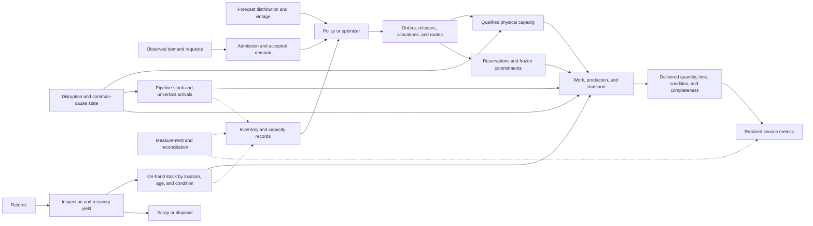

# Supply-chain logistics and operations-research analogue audit

<!-- markdownlint-disable MD013 -->

**Date:** 2026-08-05

**Scope:** queueing and inventory control, bullwhip and information delay,
multi-echelon allocation, postponement, pooling, transshipment, routing,
stochastic and robust optimization, receding-horizon dispatch, disruption
recovery, spare capacity, supplier diversification, perishability, service
levels, and closed-loop or reverse logistics

**Purpose:** make mature operations research the null for resource allocation,
routing, buffering, and recovery claims; keep informational, policy, material,
capacity, and service states separate; and identify only residual state
transitions not already present in the project.

**Evidence boundary:** foundational models, primary experiments, primary
empirical studies, and authoritative optimization or control methods. A model
proves a result only under its declared assumptions. A metaphor, simulation,
or imported source is not evidence that an AI transfer works.

## Executive finding

Operations research already supplies strong theories for uncertain demand,
finite capacity, congestion, lead times, inventory, staged commitment,
recourse, disruption, and recovery. The attractive transfers are therefore
mostly nulls, not new principles. Queueing is not merely sparse activation;
inventory is not memory; suppliers are not automatically modules; and a
shipment, computation, or routed message is not realized service.

No new principle is ready for the registry.

| Disposition | Result | Reason |
| --- | --- | --- |
| **Promote** | none | Queueing networks, base-stock and newsvendor policies, multi-echelon inventory, pooling, postponement, transshipment, routing, stochastic programming, robust optimization, model-predictive control, disruption mitigation, dual sourcing, perishable inventory, and repairable-item control are mature nulls. |
| **Hold** | a **material-commitment-qualified service-state contract** as an evaluation refinement across [Candidate 013](../../experiments/candidates/013-deficit-capability-routing.md), [Candidate 012](../../experiments/candidates/012-latency-qualified-authority.md), [Candidate 014](../../experiments/candidates/014-versioned-observation-contract.md), [Candidate 005](../../experiments/candidates/005-severity-ordered-containment.md), [Candidate 001](../../experiments/candidates/001-adaptive-topology.md), and [Candidate 018](../../experiments/candidates/018-value-reconstructability-aware-tiering.md) | The possible residual is a cross-layer contract that prevents a forecast, order, allocation, policy update, or routing decision from being counted as physical availability or delivered service. It must carry lead time, frozen commitments, in-transit state, age or condition, correlated capacity, reverse flows, and service definitions. Every ingredient is established; only the project-wide composition remains untested. |
| **Reject as distinct principles** | queues, buffers, base stocks, safety stock, bullwhip suppression, pooled reserves, delayed differentiation, lateral transshipment, vehicle routing, scenario optimization, robust reserves, receding-horizon replanning, dual sourcing, spare capacity, first-expire-first-out, and remanufacturing loops | These are established methods or scoped phenomena. Renaming them as biological circulation, homeostasis, immune logistics, or metabolism adds no transferable invariant. |
| **Reject as universal claims** | “pooling always helps,” “more suppliers are safer,” “information sharing removes shortages,” “just-in-time is efficient,” “redundancy creates resilience,” or “closed loops eliminate waste” | Correlation, geometry, service promises, setup and qualification time, common causes, yield, perishability, measurement error, and lifecycle cost determine the result. |

The narrow residual is not a new allocation algorithm. It is an experimental
firewall between *what is believed*, *what policy authorizes*, *what is
physically committed*, *what capacity can still execute*, and *what service was
actually realized*. If ordinary typed event sourcing plus a complete
inventory/queueing model and a conventional stochastic or robust controller
matches it under equal budgets, the residual collapses.

## State firewall

The following states must not be substituted for one another.

| State | Meaning | Typical units | Not equivalent to |
| --- | --- | --- | --- |
| Forecast | timestamped predictive distribution for future demand | items/h, jobs/h, probability | accepted order, realized demand, or service |
| Demand request | observed request before admission or censorship | items, jobs | accepted commitment or shipped amount |
| Accepted demand | contractual or policy commitment to serve | items, jobs | forecast or capacity |
| Backlog | accepted but unserved demand retained for later service | items, jobs | lost sales or latent demand |
| Lost demand | demand not retained after nonservice | items, jobs | zero demand; it may be partly unobserved |
| Policy | rule mapping observations to orders, routes, allocations, or releases | typed rule/version | action already executed |
| Order or release | authorized request for production, movement, or work | items, jobs | receipt, completion, or service |
| On-hand inventory | physically present count or mass at a location and time | items, kg | inventory record, available-to-promise stock, or capacity |
| Reserved inventory | on-hand or pipeline stock bound to a named commitment | items, kg | freely reallocatable stock |
| Pipeline inventory | ordered or shipped material not yet received | items, kg | on-hand stock; ETA is uncertain |
| Inventory record | information system's estimate of physical stock | items, kg | physical inventory [@dehoratius2008] |
| Capacity | feasible processing or transport rate under stated conditions | items/h, jobs/s, kg km/h | inventory or nominal supplier count |
| Spare capacity | qualified, reachable capacity above current use | same rate units | idle label, unqualified supplier, or instant recovery |
| Allocation | policy assignment of stock or capacity | items, server h | shipment or completion |
| Shipment | material dispatched from an origin | items, kg | correct, complete, timely delivery |
| Realized service | endpoint-qualified fulfillment under a declared clock and denominator | probability, fraction, h | plan, shipment, mean throughput, or utilization |
| Return | material sent into inspection, repair, reuse, or disposal | items, kg | ready-for-issue inventory |

Additional distinctions are mandatory:

- **event time**, **recording time**, **availability time**, and **decision time**;
- **nominal**, **qualified**, **available**, **reserved**, and **realized** capacity;
- **on-hand**, **on-order**, **in-transit**, **quarantined**, **allocated**, and
  **available-to-promise** stock;
- **backorders** versus **lost sales**, including demand censored by stockouts;
- **cycle service**, **unit fill rate**, **order fill**, **on-time-in-full
  (OTIF)**, mean delay, and delay-tail probability;
- **supplier count** versus independent failure domains and correlated
  deliverable capacity;
- **recovery start**, **nominal throughput restoration**, **backlog clearance**,
  **reserve replenishment**, and **readiness for a second disruption**;
- **returned**, **inspected**, **repairable**, **repaired**, **ready**, and
  **scrapped** material.

## Material, information, policy, and service path



The dashed edges are observation processes. Updating `IR` does not move a
physical item. Updating `P` does not create capacity. Dispatching `O` does not
guarantee `DL`, and `DL` is not service until its endpoint, clock, denominator,
and completeness rule are declared.

## Quantitative boundary and units

### Queue and flow conservation

For a counted population of jobs,

$$
N(t)=N(0)+A(t)-D(t),
$$

where $N$, $A$, and $D$ are jobs. This identity does not infer why a job waits,
whether it is useful, or whether completion satisfies a user.

For a stable system under Little's stated long-run conditions,

$$
L=\lambda W,
$$

where $L$ is jobs, $\lambda$ is jobs/h, and $W$ is h [@little1961]. Little's
law relates averages; it does not determine waiting-time tails or imply an
optimal policy.

For $m$ identical servers with mean service time $\mathbb{E}[S]$ h/job,

$$
\rho=\frac{\lambda\mathbb{E}[S]}{m}
$$

is dimensionless utilization. In a single-server GI/G/1 queue, Kingman's
heavy-traffic approximation is

$$
\mathbb{E}[W_q]\approx
\frac{c_a^2+c_s^2}{2}\frac{\rho}{1-\rho}\mathbb{E}[S],
$$

where $c_a$ and $c_s$ are dimensionless coefficients of variation and $W_q$ is
h [@kingman1961]. It is an approximation under a queueing model, not a universal
congestion law. Jackson networks provide a particularly strong steady-state
null under Markovian assumptions [@jackson1957].

### Inventory, backlog, records, and policy

For location $i$ and period $t$,

$$
I_{i,t+1}=I_{i,t}+R_{i,t}+T^{\mathrm{in}}_{i,t}
-S_{i,t}-T^{\mathrm{out}}_{i,t}-X_{i,t},
$$

where every term is items: physical on-hand inventory $I$, receipts $R$,
transshipments $T$, shipments to demand $S$, and expiry or damage $X$.
Reservations, quarantine, inspection, and record corrections should be separate
substates rather than unexplained balance terms.

With backlogging,

$$
B_{i,t+1}=\left[B_{i,t}+D_{i,t}^{\mathrm{acc}}-S_{i,t}\right]^+,
$$

where $B$ and accepted demand $D^{\mathrm{acc}}$ are items. For lost-sales
systems, unmet demand leaves instead of entering $B$; the missing demand may
then censor later forecasting and service estimates.

A conventional inventory position is

$$
IP_{i,t}=I^{\mathrm{on\ hand}}_{i,t}
+I^{\mathrm{on\ order}}_{i,t}-B_{i,t},
$$

in items. Available-to-promise stock is a different quantity because it also
accounts for allocations, reservations, condition, and release restrictions.
A base-stock policy orders

$$
q_{i,t}=\left[S_i-IP_{i,t}\right]^+,
$$

where $q$ and the order-up-to level $S_i$ are items. These policies are mature
nulls, including their multi-echelon forms [@arrow1951; @clark1960].

### Single-period uncertainty and service trade-offs

The newsvendor objective

$$
\min_{q\ge 0}\;
c_o\mathbb{E}\!\left[(q-D)^+\right]
+c_u\mathbb{E}\!\left[(D-q)^+\right]
$$

has currency units when $c_o$ and $c_u$ are currency/item and $D,q$ are items.
Under a continuous demand distribution and the classical assumptions,

$$
F_D(q^*)=\frac{c_u}{c_o+c_u}.
$$

This is not a general rule for sequential, censored, capacity-constrained,
strategic, perishable, or multi-item demand.

### Bullwhip and delayed information

A common diagnostic is

$$
BW=\frac{\operatorname{Var}(q_t)}{\operatorname{Var}(d_t)},
$$

where both variances are items$^2$/period$^2$ and $BW$ is dimensionless.
Forecast updating, lead time, order batching, price variation, and rationing
games are established causes [@sterman1989; @lee1997; @chen2000]. Information
sharing can reduce some amplification but does not remove physical lead time,
capacity limits, order batching, strategic incentives, or disruption.

### Pooling, correlation, postponement, and transshipment

For demands $D_i$ with standard deviations $\sigma_i$ items and correlations
$r_{ij}$,

$$
\operatorname{Var}\!\left(\sum_i D_i\right)
=\sum_i\sigma_i^2+2\sum_{i<j}r_{ij}\sigma_i\sigma_j.
$$

The result has items$^2$. Risk pooling depends on correlation; it is not free
centralization. Transport distance, response time, local service, disruption
correlation, and handling capacity remain in the cost boundary [@eppen1979].

Postponement delays a differentiation or placement commitment, but requires a
decoupling point, compatible product/process design, setup capability, and
remaining time to serve [@bucklin1965; @leetang1997]. Lateral transshipment is
recourse after demand realization only when a movable item, route, authorization,
and enough time exist; holding and shortage savings must exceed movement and
service costs [@robinson1990].

### Routing and physical feasibility

A basic vehicle-routing objective is

$$
\min_x\sum_{(i,j)\in E} c_{ij}x_{ij},
$$

where $c_{ij}$ is currency/trip, km/trip, or h/trip and $x_{ij}$ is trips.
Capacity, time windows, driver or robot hours, load compatibility, route
connectivity, and pickup-delivery precedence must remain explicit. If
$c_{ij}$ mixes currencies, energy, and delay, every conversion weight must be
declared [@dantzig1959].

### Stochastic, robust, and receding-horizon decisions

A two-stage stochastic program is

$$
\min_{x\in X}\;c^\top x+\mathbb{E}_{\xi}[Q(x,\xi)],
$$

in currency when $c^\top x$ and recourse $Q$ are currency. $x$ is chosen before
uncertainty $\xi$ is observed; recourse is chosen afterward [@dantzig1955]. The
scenario distribution, out-of-sample evaluation, and nonanticipativity boundary
must be declared.

A robust counterpart is

$$
\min_{x\in X}\max_{\xi\in\mathcal U} C(x,\xi),
$$

where $C$ is currency and $\mathcal U$ is a declared uncertainty set. A robust
solution is only as relevant as that set; conservatism has a price
[@bertsimas2004]. For loss $L$ in currency,

$$
\operatorname{CVaR}_{\alpha}(L)=
\min_{\eta\in\mathbb R}\left[
\eta+\frac{1}{1-\alpha}\mathbb{E}(L-\eta)^+
\right]
$$

also has currency units [@rockafellar2000]. Tail-risk objectives do not create
capacity or guarantee distributional validity.

At decision time $t$, a receding-horizon controller solves a finite-horizon
problem, executes only its first admissible action, observes again, and
replans. This is a mature null [@mayne2000]. Replanning must respect frozen
orders, already dispatched work, setup, travel, qualification, and compute
latency. Dynamic dispatch can use distributions over future requests without
pretending those requests are already known [@ichoua2006].

### Perishability and reverse flows

For deterministic lifetime $m$ periods, age-bucket inventory can evolve as

$$
I_{a+1,t+1}=I_{a,t}-s_{a,t},
\qquad
X_t=I_{m-1,t}-s_{m-1,t},
$$

where $I$, issued amount $s$, and expiry $X$ are items [@nahmias1975]. Fixed
lifetime is only one model; temperature, condition, quality, and uncertain
remaining life may require continuous state.

A repairable system needs at least two stocks:

$$
I^{\mathrm{ready}}_{t+1}=I^{\mathrm{ready}}_t
+P_t+Y_t-S_t,
$$

$$
I^{\mathrm{return}}_{t+1}=I^{\mathrm{return}}_t
+R_t-Y_t-Z_t,
$$

with every term in items: procurement $P$, recovered yield $Y$, service issues
$S$, returns $R$, and scrap $Z$. Returned material is not ready inventory, and
recovery yield is not one by definition [@schrady1967].

### Service and lifecycle cost vector

Service metrics answer different questions:

$$
\text{unit fill rate}=
\frac{\sum_t S_t^{\mathrm{immediate}}}{\sum_t D_t^{\mathrm{eligible}}},
$$

$$
\text{cycle service}=\Pr(\text{no stockout in a replenishment cycle}),
$$

$$
\text{OTIF}=\Pr(\text{order complete and delivered by its due time}).
$$

All are dimensionless, but have different denominators and event definitions.
Mean waiting time in h cannot replace a tail probability or an order-level
completeness metric. Time-based service agreements are an established
multi-echelon optimization target [@caggiano2007].

Do not collapse the lifecycle boundary prematurely. At minimum report

$$
\mathbf C=
(C_{\mathrm{proc}},C_{\mathrm{hold}},C_{\mathrm{short}},C_{\mathrm{lost}},
C_{\mathrm{move}},C_{\mathrm{expedite}},C_{\mathrm{switch}},C_{\mathrm{qual}},
C_{\mathrm{return}},E,G,W,T,H),
$$

where monetary components are currency, $E$ is J, $G$ is kg CO$_2$e, $W$ is
items or kg wasted, $T$ is h of delay, and $H$ is human h. Any scalar objective
requires declared exchange weights, horizon, and uncertainty.

## Audit cards

### ORSC-01 — Queueing, congestion, and admission

**Evidence design.** Little's conservation result, Kingman's heavy-traffic
analysis, and Jackson's open queueing-network result are foundational analytic
work [@little1961; @kingman1961; @jackson1957].

**Exact problem.** Relate arrivals, service variability, capacity, queue length,
and delay; decide admission, scheduling, and capacity when utilization and
variability create congestion.

**Information and authority path.** Arrival and completion observations feed an
admission or scheduling policy. That policy can reserve or release capacity but
cannot retroactively reduce already incurred work or make an unqualified server
available.

**Timescale and units.** Interarrival and service times in s, min, or h; arrival
rates in jobs/h; queue length in jobs; capacity in jobs/h; latency distributions
in h.

**Resource cost.** Server time, queue memory, switching/setup, abandonment,
deadline misses, monitoring, idle reserve, energy, and human intervention.

**Assumptions.** Stability, arrival and service processes, discipline, routing,
stationarity, independence, server failures, preemption, and abandonment must be
declared.

**Failure boundary.** Equal mean load does not imply equal tail delay. High
utilization with variability can make delay explode. A completed job can still
be incorrect or useless.

**Strongest statistical or engineering null.** A calibrated queueing network,
max-weight/backpressure or deadline scheduler, admission control, and capacity
reservation with the same information and execution budget.

**P/candidate mapping and disposition.** P-001/P-005/P-006/P-011; Candidates
001, 012, and 013. **Established null; no distinct principle.**

### ORSC-02 — Inventory control and uncertain demand

**Evidence design.** Foundational dynamic inventory theory and classical
single-period optimization [@arrow1951].

**Exact problem.** Choose replenishment amounts and times under ordering,
holding, shortage, and lost-sales costs while physical arrivals have lead time.

**Information and authority path.** A dated forecast and inventory record feed a
policy. The resulting order becomes pipeline stock only after acceptance and
physical commitment, and on-hand stock only after receipt and reconciliation.

**Timescale and units.** Demand in items/period, lead time in periods or h,
inventory in items, costs in currency/item or currency/item-period.

**Resource cost.** Procurement, setup, holding, deterioration, shortage, lost
demand, expediting, cancellation, reconciliation, and capital tied up.

**Assumptions.** Backorder versus lost sale, lead-time law, demand observation,
substitution, stationarity, capacity, minimum lots, and review cadence.

**Failure boundary.** Inventory position is not on-hand inventory. Forecast
improvement need not improve service if capacity, lead time, policy, or records
dominate.

**Strongest statistical or engineering null.** Newsvendor, base-stock,
$(s,S)$, lost-sales dynamic programming, and model-predictive inventory control.

**P/candidate mapping and disposition.** P-001/P-006/P-012/P-013; Candidates
012, 013, 014, and 018. **Established null; use as benchmark.**

### ORSC-03 — Multi-echelon allocation

**Evidence design.** Clark and Scarf's serial multi-echelon model is a
foundational analytic result [@clark1960].

**Exact problem.** Place and replenish inventory across coupled stages when an
upstream shortage changes downstream lead time and service.

**Information and authority path.** Echelon records and demand observations feed
orders and allocations. Upstream allocation reserves scarce stock; it does not
complete downstream transport or fulfillment.

**Timescale and units.** Stage lead times in h or periods; echelon and local
inventory in items; flow capacity in items/h; service probability or delay.

**Resource cost.** Stock at each echelon, transport, handling, shortage,
allocation computation, information delay, and rebalancing.

**Assumptions.** Network shape, installation versus echelon stock, demand
dependence, lead-time dependence, capacity, substitution, and service target.

**Failure boundary.** Locally optimal stock or routing can worsen total service.
A central record does not remove material coupling or upstream shortages.

**Strongest statistical or engineering null.** Echelon base-stock optimization,
min-cost flow, stochastic network control, and centralized stochastic programs.

**P/candidate mapping and disposition.** P-001/P-005/P-006/P-013; Candidate
013. **Established null and required baseline.**

### ORSC-04 — Bullwhip, forecasts, and delayed information

**Evidence design.** Sterman's controlled inventory-distribution experiment and
the analytic supply-chain studies of Lee and colleagues and Chen and colleagues
are primary evidence [@sterman1989; @lee1997; @chen2000].

**Exact problem.** Explain and control amplification of orders and inventories
relative to customer demand under forecasting, batching, lead time, prices, and
strategic rationing.

**Information and authority path.** Demand observations are filtered into
forecasts and orders, which affect later inventory and observations. Sharing
point-of-sale data changes information, not transport time or production.

**Timescale and units.** Orders and demand in items/period; delays in periods;
variance in items$^2$/period$^2$; stockouts and service by period.

**Resource cost.** Information systems, excess inventory, expedite cost,
capacity oscillation, shortages, price distortion, and coordination overhead.

**Assumptions.** Stationarity of the variance diagnostic, forecast model,
lead-time knowledge, batching, incentives, allocation rule, and observation of
lost demand.

**Failure boundary.** $BW\le1$ does not prove adequate service; a policy can
suppress orders by accepting shortages. Centralized information need not
eliminate amplification [@chen2000].

**Strongest statistical or engineering null.** Order-up-to control with shared
demand data, lead-time-aware forecasting, smoothing, batching controls, and
incentive-compatible allocation.

**P/candidate mapping and disposition.** P-006/P-012/P-013; Candidates 011,
013, and 014. **Established null; retain causal diagnostics, not metaphor.**

### ORSC-05 — Pooling and postponement

**Evidence design.** Eppen's multilocation newsvendor analysis and foundational
postponement models [@eppen1979; @bucklin1965; @leetang1997].

**Exact problem.** Decide when to aggregate uncertain demand or delay product,
location, or capacity commitment while preserving service.

**Information and authority path.** Pooling changes the physical or contractual
resource boundary; postponement keeps options open until later information.
Neither is merely a shared forecast.

**Timescale and units.** Demand covariance in items$^2$, differentiation and
transport time in h, stock in items, setup in currency/changeover.

**Resource cost.** Central handling, extra transport, late differentiation,
setup capability, modular product/process design, local service delay, common-
cause exposure, and option-maintenance cost.

**Assumptions.** Demand correlation, substitutability, transport geometry,
remaining response time, process compatibility, and local service promises.

**Failure boundary.** Positive correlation erodes pooling benefit. A distant
pool may reduce stock but worsen response time or correlated disruption.
Postponement fails when differentiation or delivery cannot fit the remaining
deadline.

**Strongest statistical or engineering null.** Correlation-aware safety-stock
placement, delayed differentiation, option value, and two-stage stochastic
placement.

**P/candidate mapping and disposition.** P-001/P-005/P-012; Candidates 001,
013, and 018. **Established null; no universal pooling principle.**

### ORSC-06 — Lateral transshipment and recourse

**Evidence design.** Robinson's multiperiod, multilocation inventory model with
post-demand transshipment recourse [@robinson1990].

**Exact problem.** Move available stock between locations after local demand is
known to trade holding and shortage costs against transfer cost and delay.

**Information and authority path.** A stock record and demand realization feed
a recourse decision. The item then becomes reserved and in transit; it is not
available at the destination until receipt.

**Timescale and units.** Stock and transfer quantities in items, transit in h,
route capacity in items/h, costs in currency/item or currency/trip.

**Resource cost.** Packing, transport, handling, authorization, opportunity cost
at the source, expiry, damage, and destination delay.

**Assumptions.** Trusted stock records, movable items, known recourse timing,
route feasibility, shortage costs, and no hidden source commitments.

**Failure boundary.** Instantaneous reallocation in a simulator can invent
service. Source stock can be stranded, reserved, incompatible, expired, or too
far away.

**Strongest statistical or engineering null.** Min-cost flow, stochastic
transshipment, inventory rebalancing, and dynamic dispatch with physical lead
times.

**P/candidate mapping and disposition.** P-001/P-005/P-011/P-013; Candidate
013. **Established null; sharpens the material-commitment contract.**

### ORSC-07 — Routing and dynamic dispatch

**Evidence design.** The foundational truck-dispatching formulation and primary
dynamic-routing experiments using probabilistic future requests
[@dantzig1959; @ichoua2006].

**Exact problem.** Assign finite mobile resources to pickups, deliveries, or
service requests while satisfying capacity, timing, and connectivity
constraints under new arrivals.

**Information and authority path.** Observed and forecast requests feed route
plans. Dispatch commits a vehicle or agent to travel; route revision is limited
by current position, load, customer promises, and communication.

**Timescale and units.** Distance in km, time in h, loads in kg or items,
vehicle/agent capacity in kg or jobs, energy in J, and lateness in h.

**Resource cost.** Fleet or agent hours, travel, energy, replanning, missed
windows, handoffs, preemption, communication, and stranded commitments.

**Assumptions.** Travel-time law, request arrival law, preemption, route
compatibility, load transfer, service duration, and forecast availability.

**Failure boundary.** A shortest or cheapest route can violate service. A new
route plan cannot teleport an already traveling resource or erase a picked-up
load.

**Strongest statistical or engineering null.** Capacitated VRP, dynamic VRP,
online matching, rolling-horizon dispatch, min-cost flow, and backpressure.

**P/candidate mapping and disposition.** P-001/P-005/P-011; Candidates 001,
012, and 013. **Established null; Candidate 013 must beat it.**

### ORSC-08 — Stochastic optimization and recourse

**Evidence design.** Dantzig's foundational staged decision formulation under
uncertainty [@dantzig1955].

**Exact problem.** Choose irreversible or costly first-stage commitments before
uncertainty and contingent actions after observations.

**Information and authority path.** A scenario distribution conditions the
first-stage decision. Only information available at each stage may influence
that stage's action; recourse remains physically feasible and budgeted.

**Timescale and units.** Scenario horizon in h or periods; quantities in native
flow units; objective in currency or a declared vector; solve time in s.

**Resource cost.** Scenario generation, optimization compute, commitment,
recourse, infeasibility penalties, model maintenance, and distribution shift.

**Assumptions.** Scenario law, nonanticipativity, recourse feasibility,
objective weights, horizon, and sampling error.

**Failure boundary.** A scenario can omit the decisive disruption. In-sample
optimality does not establish out-of-sample service or calibration.

**Strongest statistical or engineering null.** Sample-average approximation,
two-stage and multistage stochastic programming, chance constraints, and
distributionally robust optimization.

**P/candidate mapping and disposition.** P-001/P-006/P-009/P-012; Candidates
001, 005, 012, 013, and 018. **Established null.**

### ORSC-09 — Robust optimization and tail risk

**Evidence design.** Bertsimas and Sim's adjustable robust counterpart and
Rockafellar and Uryasev's CVaR optimization [@bertsimas2004; @rockafellar2000].

**Exact problem.** Protect decisions against a declared uncertainty set or tail
loss while controlling the cost of conservatism.

**Information and authority path.** Historical and engineering evidence define
uncertainty sets or loss distributions. The optimizer reserves resources or
changes commitments; robustness is not a runtime observation.

**Timescale and units.** Loss in currency or service shortfall; confidence level
dimensionless; reserve capacity in items/h; solve time in s.

**Resource cost.** Extra stock/capacity, opportunity cost, compute, uncertainty-
set validation, and overprotection against irrelevant cases.

**Assumptions.** Relevant uncertainty set, loss model, dependence, horizon,
stationarity or adaptation, and adversary semantics.

**Failure boundary.** A wrong uncertainty set yields confidently irrelevant
protection. Worst-case objectives can sacrifice common-case service and still
miss out-of-set common causes.

**Strongest statistical or engineering null.** Budgeted uncertainty, chance
constraints, CVaR, distributionally robust control, and stress testing.

**P/candidate mapping and disposition.** P-002/P-006/P-009; Candidates 003,
005, 009, 012, and 013. **Established null; no “antifragility” inference.**

### ORSC-10 — Receding-horizon dispatch and frozen commitments

**Evidence design.** Mature constrained model-predictive control theory and
primary real-time dispatch studies [@mayne2000; @ichoua2006].

**Exact problem.** Replan repeatedly as forecasts and state estimates change,
while executing only feasible first actions.

**Information and authority path.** A dated state estimate and forecast feed
the finite-horizon solve. The first action enters a committed execution layer;
the next solve cannot silently rewrite completed or frozen action.

**Timescale and units.** Sampling and solve time in s, execution and travel in
s or h, forecast horizon in periods, state/action in native physical units.

**Resource cost.** Reoptimization compute, communication, plan churn, switching,
frozen-horizon opportunity cost, monitoring, and missed deadlines.

**Assumptions.** State observability, model validity, terminal conditions,
recursive feasibility, solve deadline, actuator availability, and commitment
horizon.

**Failure boundary.** Fast replanning cannot compensate for stale inventory,
long physical lead time, irreversible dispatch, or insufficient reserve.

**Strongest statistical or engineering null.** MPC, rolling-horizon
optimization, event-triggered replanning, and online algorithms with switching
cost and competitive/regret bounds.

**P/candidate mapping and disposition.** P-005/P-006/P-009/P-012; Candidates
001, 005, 012, and 013. **Established null; frozen-state accounting is required.**

### ORSC-11 — Disruption mitigation, recovery, and spare capacity

**Evidence design.** Tomlin's analytic comparison of inventory, reliable
sourcing, acceptance, and contingent rerouting under disruption
[@tomlin2006].

**Exact problem.** Decide what to preposition and what to activate after a
capacity disruption with uncertain frequency, duration, and flexibility.

**Information and authority path.** Risk estimates authorize mitigation before
an event. Detection initiates contingency actions after it. Qualified ramp
capacity, inventory, and routes determine realized recovery.

**Timescale and units.** Uptime dimensionless; disruption and qualification in
h or days; capacity in items/h; backlog in items; time to service recovery in h.

**Resource cost.** Idle qualified reserve, inventory, alternate supplier or
route contracts, exercises, switching, expedite, degradation, backlog, and
reserve restoration.

**Assumptions.** Disruption frequency and duration, common causes, finite
capacity, ramp time, risk attitude, demand during disruption, and second-event
arrival.

**Failure boundary.** Throughput restoration can coexist with persistent
backlog, depleted reserves, expired stock, and poor readiness for the next
event. Nominal spare capacity may be unreachable or unqualified.

**Strongest statistical or engineering null.** Reliability/availability models,
stochastic disruption inventory, robust capacity planning, contingency routing,
and recovery scheduling.

**P/candidate mapping and disposition.** P-002/P-005/P-006/P-009; Candidates
001, 003, 005, 011, and 012. **Established null; adds recovery endpoints.**

### ORSC-12 — Supplier diversification and correlated capacity

**Evidence design.** Anupindi and Akella's primary dual-sourcing models under
supply uncertainty [@anupindi1993], with Tomlin's disruption model
[@tomlin2006].

**Exact problem.** Allocate orders across suppliers with different cost,
reliability, yield, timing, and flexibility.

**Information and authority path.** Supplier evidence and contract state inform
allocation. A purchase order is not delivered capacity; qualification,
production, transport, and acceptance remain physical stages.

**Timescale and units.** Quantities in items, yield and reliability
dimensionless, lead time in h or periods, capacity in items/h, cost in
currency/item.

**Resource cost.** Qualification, duplicate tooling, contract and order cost,
minimum volume, monitoring, switching, quality inspection, transport, and
coordination.

**Assumptions.** Dependence among suppliers, delivery contract, yield law,
capacity, quality, geopolitical or infrastructure common causes, and switching
time.

**Failure boundary.** Two suppliers on one power grid, cloud region, port,
codebase, owner, or raw-material source may be one failure domain. Diversifying
names can increase complexity without independent capacity.

**Strongest statistical or engineering null.** Correlation-aware dual/multiple
sourcing, portfolio and reliability optimization, robust procurement, and
common-cause fault models.

**P/candidate mapping and disposition.** P-002/P-005/P-009; Candidates 001,
005, 012, and 020. **Established null; governance is separate from logistics.**

### ORSC-13 — Perishability, age, and condition

**Evidence design.** Nahmias's finite-lifetime dynamic inventory model and
Pierskalla and Roach's age-dependent issuing policies [@nahmias1975;
@pierskalla1972].

**Exact problem.** Order, place, and issue stock whose usability or value
changes with age and whose expiry creates waste and shortage interactions.

**Information and authority path.** Age/condition observations feed ordering
and issuing policy. A database timestamp is not remaining useful life; storage
history and measurement quality matter.

**Timescale and units.** Age and shelf life in h or periods; quantity in items
or kg; temperature/condition in domain units; expiry in items/period.

**Resource cost.** Holding, monitoring, cold chain, testing, spoilage, disposal,
shortage, replenishment, and emergency substitution.

**Assumptions.** Deterministic or stochastic lifetime, issue compatibility,
first-expire feasibility, demand, lead time, deterioration law, and inspection
accuracy.

**Failure boundary.** Aggregate stock can hide unusable or soon-expiring stock.
First-in-first-out is not universally optimal when compatibility or measured
condition differs.

**Strongest statistical or engineering null.** Age-structured dynamic
programming, FEFO policies, quality-state estimation, and perishable routing.

**P/candidate mapping and disposition.** P-009/P-012/P-013; Candidates 012,
014, 017, and 018. **Established null; condition belongs in the state contract.**

### ORSC-14 — Service definitions and inventory truth

**Evidence design.** Primary empirical evidence on inventory record inaccuracy
and primary optimization of time-based service agreements
[@dehoratius2008; @caggiano2007].

**Exact problem.** Define and measure fulfillment while distinguishing physical
stock from records and stockout-censored demand.

**Information and authority path.** Reconciliation updates records; order and
delivery events produce service observations. Metric definitions and versions
determine denominators and deadlines.

**Timescale and units.** Counts in items or orders, delays in h, fill/OTIF as
fractions, record error in items, observation lag in h.

**Resource cost.** Counting and sensing, reconciliation, provenance, audit,
customer measurement, censored-demand estimation, and metric maintenance.

**Assumptions.** Eligibility denominator, requested versus promised date,
partial shipment rule, substitutions, cancellations, returns, stockout
censoring, and clock/version semantics.

**Failure boundary.** A high cycle service can coexist with poor unit fill or
long delays. A record can report stock that is absent, misplaced, quarantined,
reserved, or expired. Metric changes can manufacture apparent improvement.

**Strongest statistical or engineering null.** Event-sourced physical ledgers,
inventory reconciliation, service-level models, survival/censoring models, and
metric-version governance.

**P/candidate mapping and disposition.** P-007/P-009/P-012/P-013; Candidates
011, 014, 017, and 018. **Established distinction; central held refinement.**

### ORSC-15 — Closed-loop and reverse logistics

**Evidence design.** Schrady's foundational repairable-item model explicitly
separates ready-for-issue and repairable-return stocks [@schrady1967].

**Exact problem.** Coordinate procurement, collection, inspection, repair or
remanufacture, reuse, and disposal when recovery yield and timing are finite.

**Information and authority path.** A return enters inspection, not ready
inventory. Classification authorizes repair, harvest, reuse, or disposal;
recovered output becomes ready only after verification.

**Timescale and units.** Returns and ready stock in items, recovery rate in
items/h, yield dimensionless, turnaround in h, waste in items or kg.

**Resource cost.** Collection, sorting, test, cleaning, repair, parts, energy,
quality assurance, storage, disposal, and delayed availability.

**Assumptions.** Return rate, condition distribution, recovery yield, repair
capacity, new-versus-recovered substitution, warranty, and quality threshold.

**Failure boundary.** A returned artifact may be unsafe, obsolete,
irrecoverable, or more costly to recover than replace. Recycling can downcycle,
consume energy, or displace rather than eliminate waste.

**Strongest statistical or engineering null.** Repairable-item inventory,
remanufacturing control, reverse-network flow, inspection policies, and
lifecycle assessment.

**P/candidate mapping and disposition.** P-006/P-009/P-012/P-013; Candidates
005, 011, 017, and 018. **Established null; no automatic circularity claim.**

## Deduplication map

### Existing project homes

| Audited idea | Existing home | Decision |
| --- | --- | --- |
| Select scarce work, stock, capacity, or routes | [P-001](../principle-registry.md#registry-summary); [Candidate 013](../../experiments/candidates/013-deficit-capability-routing.md) | Queueing, inventory, min-cost flow, backpressure, VRP, and stochastic allocation are mandatory nulls. No new principle. |
| Reconfigure network topology under load or disruption | [P-005](../principle-registry.md#registry-summary); [Candidate 001](../../experiments/candidates/001-adaptive-topology.md) | Routing, postponement, transshipment, supplier switch, and receding-horizon topology changes already exist. Add physical switching state and cost. |
| Correct deficits with feedback | [P-006](../principle-registry.md#registry-summary); [Candidate 013](../../experiments/candidates/013-deficit-capability-routing.md) | Base-stock, backlog, queue, and service-deficit controllers are strong established nulls. |
| Maintain, inspect, and restore readiness | [P-009](../principle-registry.md#registry-summary); [Candidates 005 and 011](../../experiments/candidates/005-severity-ordered-containment.md) | Qualification, reserve testing, reconciliation, recovery, and repair are maintenance-plane work. |
| Form transient communication or service coalitions | [P-011](../principle-registry.md#registry-summary); [Candidate 013](../../experiments/candidates/013-deficit-capability-routing.md) | Dispatch, transshipment, and temporary supplier/vehicle assignments are ordinary routing unless a distinct state transition survives. |
| Match memory to information lifetime | [P-012](../principle-registry.md#registry-summary); [Candidates 017 and 018](../../experiments/candidates/017-contract-preserving-semantic-compaction.md) | Forecast vintages, orders, inventory events, service evidence, expiry, and returns have different retention needs. Storage analogy creates no new principle. |
| Externalize shared operational truth | [P-013](../principle-registry.md#registry-summary); [Candidate 014](../../experiments/candidates/014-versioned-observation-contract.md) | Inventory and service ledgers strengthen the observation contract; the record remains an observation, not the object. |

### Adjacent audit boundaries

| Adjacent audit | What is already covered there | Supply-chain residual |
| --- | --- | --- |
| [Process engineering](2026-08-05-process-engineering.md) | flowsheets, mass/energy balances, bottlenecks, buffers, recycle, process control, hazards | accepted demand, inventory position, pipeline and reserved stock, service metrics, sourcing, distribution, and reverse network state |
| [Databases and storage](2026-08-05-databases-storage.md) | truth versus replica, logs, transactions, compaction, placement, repair, recovery objectives | a database commit is not a material receipt; physical lead time, age, condition, capacity, and delivered service remain outside storage semantics |
| [Economics and market design](2026-08-05-economics-market-design-incentives.md) | prices, incentives, congestion, allocation under private information, contracts | centralized logistics does not require a market; use Candidate 020 only when independent organizations and strategic private information matter |
| [Mechanical and civil resilience](2026-08-05-mechanical-civil-resilience.md) | load paths, margins, redundancy, graceful degradation, repair | qualified transport/production capacity, inventory, backlog, routing, supplier dependence, and service recovery |
| [Metrology](2026-08-05-metrology-measurement-science.md) | measurands, uncertainty, calibration, traceability, dependency invalidation | forecast vintage, stockout censorship, physical ledger reconciliation, reservation, pipeline ETA, service-definition version, and return yield are domain fields for Candidate 014 |
| [High-reliability organizations](2026-08-05-high-reliability-organizations-incident-learning.md) | live containment, escalation, incident learning, near misses, organizational memory | recovery must include backlog clearance, reserve replenishment, operational policy update, and second-disruption service rather than a narrative closeout |

### Strongest ordinary null stack

Before any supply-chain-derived AI claim can survive, compare it with the
composition of:

1. event-time demand, inventory, capacity, order, route, and service ledgers;
2. inventory reconciliation and condition/age tracking;
3. queueing and flow-conservation models with tail-delay reporting;
4. base-stock, multi-echelon, lost-sales, and transshipment control;
5. min-cost flow, backpressure, VRP, and dynamic dispatch;
6. two-stage or multistage stochastic optimization with physical recourse;
7. robust or distributionally robust optimization and explicit tail risk;
8. receding-horizon replanning with frozen commitments and switching cost;
9. reliability/common-cause models for suppliers, routes, and spare capacity;
10. perishable and repairable-item state models;
11. typed, versioned service metrics with censored-demand handling; and
12. lifecycle accounting for money, energy, emissions, waste, latency, and
    human work.

If this stack matches the proposed mechanism at equal observation, compute,
physical-resource, intervention, and maintenance budgets, reject novelty.

## Exact candidate refinements

These are refinements to existing candidates, not promotions or permission to
edit their files in this audit.

| Candidate | Required refinement from this audit |
| --- | --- |
| [001 — adaptive topology](../../experiments/candidates/001-adaptive-topology.md) | Every topology transition must carry qualification/setup/contract delay, in-transit work and inventory, reservations, stranded stock, switching cost, correlated supplier or route failures, reserve state, and recovery to service. An adjacency edit is not executable topology. |
| [005 — severity-ordered containment](../../experiments/candidates/005-severity-ordered-containment.md) | Add backlog clearance, unit fill/OTIF recovery, aged or expired stock, expedite/transshipment cost, reserve depletion and replenishment, return/repair backlog, and service under a second disruption. “Contained” and nominal throughput are not recovery. |
| [011 — dual-loop operational assurance](../../experiments/candidates/011-dual-loop-operational-assurance.md) | A disruption trace must bind forecast, accepted demand, inventory/capacity evidence, allocation, route, delivered service, and service-definition version to a verified operational policy change. Retrieval must be relevance-triggered; a postmortem without an implemented and tested change is not loop closure. |
| [012 — latency-qualified authority](../../experiments/candidates/012-latency-qualified-authority.md) | Authority envelopes must depend on forecast vintage, inventory/capacity evidence age, physical lead time, pipeline and frozen commitments, reserve, perishability/condition, route availability, qualification, and revocation time. Fast messages do not create fast physical authority. |
| [013 — deficit–capability routing](../../experiments/candidates/013-deficit-capability-routing.md) | Separate forecast, request, accepted demand, backlog, lost sale, on-hand, reserved, pipeline, inventory position, local serviceability, qualified capacity, allocation, dispatch, and realized service. Add base-stock/multi-echelon, Jackson/queueing, min-cost-flow/transshipment, backpressure, stochastic/robust optimization, and dynamic-VRP/receding-horizon nulls. |
| [014 — versioned observation contract](../../experiments/candidates/014-versioned-observation-contract.md) | Add event versus availability time, forecast vintage, demand censored by stockout, physical reconciliation, allocation/reservation state, uncertain pipeline ETA, age/condition, supplier common-cause groups, returns/recovery yield, and service-definition version. A record's integrity does not establish physical truth. |
| [017 — contract-preserving semantic compaction](../../experiments/candidates/017-contract-preserving-semantic-compaction.md) | Compaction cannot discard order/inventory histories needed for provenance, lead-time and delay distributions, lost-sales censoring, expiry/condition, returns/yield, disruption/recovery, or service-definition reconstruction. Declare those queries before compression. |
| [018 — value/reconstructability-aware tiering](../../experiments/candidates/018-value-reconstructability-aware-tiering.md) | Treat inventory placement only as a mature analogy. Nulls must include holding, movement, restore, expiry, stockout, reconciliation, and switching costs; access/lead-time uncertainty and correlated failure domains must remain explicit. |
| [020 — constitutional control plane](../../experiments/candidates/020-constitutional-control-plane.md) | Invoke governance only when separate organizations or agents possess strategic private information, distinct rights, or contracts. Otherwise centralized optimization, admission, and control are the stronger nulls. |

## Equal-budget falsification experiments

All experiments use paired scenario seeds and identical exogenous demand,
capacity, disruption, travel, expiry, return, and measurement trajectories.
Equalize forecast access, observations, model parameters, training data, online
compute, solve deadline, message bytes, physical inventory, qualified capacity,
routes, reserve, intervention authority, and human maintenance. Report the full
lifecycle vector and service distribution, not only a scalar reward.

### E-ORSC-01 — State-firewall ablation

- **Question:** does preserving forecast, policy, record, physical stock,
  capacity, commitment, and realized service as separate typed states prevent
  false allocation and false recovery claims?
- **Arms:** aggregate “resource availability” state; event-sourced typed ledger;
  Candidate 014 plus the full material-commitment contract.
- **Stressors:** stale records, hidden reservations, uncertain arrivals,
  quarantined/expired stock, delayed completion, and metric-version change.
- **Primary outcomes:** infeasible commitments/event, phantom-availability
  items, service-estimation error, unit fill, OTIF, delay $p_{95}$, money, J,
  human h.
- **Kill rule:** reject the residual if the ordinary typed ledger matches it
  within preregistered equivalence margins at lower or equal lifecycle cost.

### E-ORSC-02 — Queueing and congestion

- **Question:** does Candidate 013 improve tail service beyond mature queueing
  and scheduling controls rather than merely lowering mean load?
- **Arms:** FCFS; priority/deadline; calibrated queueing admission; max-weight or
  backpressure; min-cost flow; Candidate 013.
- **Stressors:** burstiness, heavy-tailed service, nonstationarity, server
  failures, abandonment, deadlines, and correlated arrivals.
- **Primary outcomes:** throughput jobs/h, mean and $p_{95}/p_{99}$ delay h,
  deadline service, queue area job h, energy J/job, switching, dropped work.
- **Kill rule:** reject routing novelty if benefits vanish after matching
  admission, capacity, information, and switching budgets.

### E-ORSC-03 — Bullwhip and information delay

- **Question:** does a candidate reduce order/inventory amplification without
  concealing shortage or relying on future information?
- **Arms:** decentralized order-up-to; shared-demand order-up-to; forecast-
  smoothing control; centralized stochastic MPC; candidate communication/routing.
- **Stressors:** lead time, batching, promotion/price variation, rationing,
  demand shifts, stockout censorship, and observation delay.
- **Primary outcomes:** $BW$, inventory variance, shortage items, fill/OTIF,
  forecast calibration by vintage, capacity variation, total currency cost.
- **Kill rule:** reject if lower $BW$ is explained by suppressed orders, higher
  shortage, future leakage, or more inventory/capacity.

### E-ORSC-04 — Multi-echelon allocation and transshipment

- **Question:** does deficit–capability routing beat echelon inventory and
  physical recourse models?
- **Arms:** local base stock; Clark–Scarf/echelon policy where applicable;
  centralized stochastic allocation; min-cost transshipment; rolling-horizon
  min-cost flow; Candidate 013.
- **Stressors:** upstream shortage, correlated regional demand, route closure,
  hidden source reservations, uncertain transfer time, and stranded inventory.
- **Primary outcomes:** unit/order fill, OTIF, backlog item h, transfer km/items,
  source service loss, infeasible dispatches, money, energy, waste.
- **Kill rule:** reject if the candidate matches only an instantaneous-transfer
  simulator or loses under physical lead time and source opportunity cost.

### E-ORSC-05 — Pooling, postponement, and delayed commitment

- **Question:** when does delayed commitment retain real option value after
  geometry, setup, correlation, and service are charged?
- **Arms:** decentralized stock; centralized pooling; correlation-aware
  placement; postponement; postponement plus transshipment; candidate topology.
- **Stressors:** demand correlation from $-0.5$ to $0.95$, long delivery
  geometry, setup time, incompatible variants, common-cause outage, and tight
  deadlines.
- **Primary outcomes:** stock items, total and tail service, differentiation
  lateness, transport, option-maintenance cost, stranded and expired stock.
- **Kill rule:** reject a universal pooling/postponement claim if sign or size
  depends on correlation, geometry, or deadline as ordinary theory predicts.

### E-ORSC-06 — Stochastic, robust, and receding-horizon control

- **Question:** does the candidate outperform mature uncertainty-aware control,
  or only a deterministic static plan?
- **Arms:** deterministic expected-value; two-stage stochastic; rolling-horizon
  stochastic; budgeted robust; CVaR; distributionally robust; candidate.
- **Stressors:** calibrated and misspecified distributions, rare tails,
  out-of-set common causes, forecast shifts, solve deadlines, and frozen
  commitments.
- **Primary outcomes:** expected/tail monetary loss, service shortfall,
  infeasibility, solve time, plan churn, reserve, regret to an offline oracle.
- **Kill rule:** reject if advantage disappears against the best calibrated null
  or depends on violating nonanticipativity/frozen commitments.

### E-ORSC-07 — Disruption, reserve, and supplier diversity

- **Question:** does adaptive topology produce independent recoverable capacity
  rather than nominal redundancy?
- **Arms:** passive acceptance; safety stock; single reliable source; dual
  sourcing; idle qualified reserve; contingent rerouting; Candidate 001/005/012
  composition.
- **Stressors:** frequent-short and rare-long outages, correlated suppliers,
  qualification delay, port/network common cause, second disruption during
  recovery, and false-positive switching.
- **Primary outcomes:** degraded service area, backlog-clearance h, reserve
  depletion/replenishment, second-event service, currency, switching, expired
  stock, human h.
- **Kill rule:** reject if supplier labels are diversified but deliverable
  capacity remains correlated, or if nominal throughput recovers while backlog
  and reserve do not.

### E-ORSC-08 — Perishability and service measurement

- **Question:** do age/condition and metric-version fields change decisions or
  merely add metadata?
- **Arms:** aggregate stock; age buckets with FIFO; FEFO/condition-aware policy;
  stochastic-life MPC; Candidate 014 refinement.
- **Stressors:** uncertain shelf life, cold-chain excursion, incompatible lots,
  stockout-censored demand, partial orders, substitutions, cancellations, and
  service-definition changes.
- **Primary outcomes:** expiry items/kg, unsafe or invalid issues, true versus
  reported fill/OTIF, calibration, latency, money, energy, audit time.
- **Kill rule:** reject the refinement if ordinary age-structured inventory plus
  a versioned metric ledger matches all decisions and evidence quality.

### E-ORSC-09 — Closed-loop recovery

- **Question:** does a closed-loop architecture improve lifecycle service after
  inspection, yield, quality, and delay are explicit?
- **Arms:** discard/replace; return without separation; Schrady-style ready and
  repair stocks; stochastic repair/remanufacturing control; candidate memory or
  recovery loop.
- **Stressors:** variable return quality, correlated failures, finite repair
  capacity, positive scrap, obsolete versions, delayed returns, and second
  failure wave.
- **Primary outcomes:** ready service, return backlog, verified recovery yield,
  turnaround h, procurement, energy J, waste kg, quality escapes, total cost.
- **Kill rule:** reject circularity claims if returns are counted as ready stock,
  quality verification is omitted, or lifecycle cost/waste is displaced.

### E-ORSC-10 — Policy learning and operational closure

- **Question:** does incident learning change a verified policy and improve the
  next matched disruption?
- **Arms:** no postmortem; narrative postmortem; retrieval-only memory; verified
  policy update; Candidate 011 with material/service trace.
- **Stressors:** repeated and near-neighbor incidents, version drift, misleading
  forecasts, stale inventory evidence, partial remediation, and ownership
  handoff.
- **Primary outcomes:** action closure, policy-test pass, next-event service,
  recurrence, backlog recovery, reserve readiness, retrieval precision, human h.
- **Kill rule:** reject dual-loop novelty if ordinary corrective-action tracking
  plus verified policy deployment and event-sourced evidence matches it.

## Scoped temporary claims

These claim IDs are audit-local. They are not entries in the project evidence
ledger and convey no promotion.

| ID | Status | Claim | Evidence and limit | Affected work |
| --- | --- | --- | --- | --- |
| ORSC-T01 | established | Long-run average queue population, arrival rate, and time in system obey Little's law under its stated conditions. | [@little1961]; says nothing by itself about tails, correctness, or optimality. | P-001; Candidates 003/013 |
| ORSC-T02 | established | Utilization and arrival/service variability can sharply increase queue delay in classical single-server settings. | Kingman's heavy-traffic approximation [@kingman1961]; model-specific. | Candidates 003/013 |
| ORSC-T03 | established | Product-form queueing networks are a mature null under restrictive Markovian assumptions. | [@jackson1957]. | Candidate 013 |
| ORSC-T04 | established | Base-stock and staged inventory-control policies formalize replenishment under demand, lead time, and shortage/holding trade-offs. | [@arrow1951; @clark1960]; assumptions must match. | P-001/P-006; Candidate 013 |
| ORSC-T05 | established | Multi-echelon inventory couples upstream availability to downstream lead time and service. | [@clark1960]. | Candidate 013 |
| ORSC-T06 | established | Forecasting, lead time, batching, prices, rationing incentives, and feedback misperception can amplify orders relative to demand. | [@sterman1989; @lee1997; @chen2000]. | P-006/P-013; Candidates 011/013/014 |
| ORSC-T07 | established | Centralized demand information can reduce but need not eliminate bullwhip. | [@chen2000]; model-specific. | Candidate 014 |
| ORSC-T08 | established | Pooling benefit depends on demand correlation and cost assumptions. | [@eppen1979]. | Candidates 001/013/018 |
| ORSC-T09 | established | Postponement trades delayed commitment against product/process design, setup, and remaining service time. | [@bucklin1965; @leetang1997]. | Candidates 001/018 |
| ORSC-T10 | established | Lateral transshipment can be modeled as costly post-demand recourse rather than instantaneous reassignment. | [@robinson1990]. | Candidate 013 |
| ORSC-T11 | established | Capacitated routing and dynamic dispatch are mature physical-allocation nulls. | [@dantzig1959; @ichoua2006]. | Candidates 001/012/013 |
| ORSC-T12 | established | Stochastic programming separates commitments before uncertainty from feasible recourse after observation. | [@dantzig1955]. | Candidates 001/012/013 |
| ORSC-T13 | established | Robustness is defined relative to an uncertainty set and has an opportunity cost. | [@bertsimas2004]. | Candidates 005/009/012 |
| ORSC-T14 | established | Receding-horizon control repeatedly replans but does not erase already executed or physically frozen actions. | [@mayne2000]; application must declare commitment state. | Candidates 001/012/013 |
| ORSC-T15 | established | Inventory, reliable sourcing, passive acceptance, and contingent rerouting can be competing or combined disruption strategies depending on disruption and capacity assumptions. | [@tomlin2006]. | Candidates 001/005/012 |
| ORSC-T16 | established | Multiple suppliers are not automatically optimal; cost, yield/reliability, delivery contracts, and capacity determine allocation. | [@anupindi1993]. | Candidates 001/020 |
| ORSC-T17 | established | Perishable inventory requires age/lifetime state and explicit outdating cost. | [@nahmias1975; @pierskalla1972]. | Candidates 014/017/018 |
| ORSC-T18 | established | Inventory records can differ materially from physical inventory and therefore must remain an observation channel. | [@dehoratius2008]; one retail empirical setting, not a universal error rate. | P-013; Candidate 014 |
| ORSC-T19 | established | Ready-for-issue inventory and returned/repairable inventory are distinct states with nonunit recovery yield. | [@schrady1967]. | P-009/P-013; Candidates 005/011/017 |
| ORSC-T20 | plausible | A project-wide material-commitment-qualified service-state contract may prevent false claims of availability, allocation, recovery, and service across adaptive AI components. | Composition of established operations, database, metrology, and assurance states; no direct comparative evidence yet. | Held refinement across Candidates 001/005/011/012/013/014/017/018 |
| ORSC-T21 | speculative | The held contract may improve multi-agent AI under delayed, irreversible, and capacity-limited actions beyond ordinary event sourcing plus stochastic control. | Requires E-ORSC-01 through E-ORSC-10 and strongest-null defeat. | No promotion |

## Stopping, rejection, and promotion rules

Stop or reject a supply-chain transfer when any of the following holds:

1. an inventory record, forecast, order, allocation, shipment, or route plan is
   counted as physical stock, capacity, delivery, or service;
2. instantaneous movement, free switching, zero setup, perfect qualification,
   or unlimited recourse creates the advantage;
3. the comparator omits base-stock/multi-echelon control, queueing/backpressure,
   min-cost flow/VRP, stochastic or robust optimization, or receding-horizon
   replanning where applicable;
4. demand, capacity, information, compute, inventory, reserve, routes, or
   intervention authority are not equalized;
5. only mean throughput, utilization, reward, bullwhip, or nominal availability
   improves while tail service, backlog, lost demand, or safety worsens;
6. correlation and common-cause failures are ignored in pooling, supplier,
   route, or reserve claims;
7. service denominators, clocks, partial-order rules, substitutions,
   cancellations, and metric versions are undeclared;
8. stockout-censored demand or inventory-record error is treated as ground
   truth;
9. recovery ends at detection, rerouting, nominal throughput, or postmortem
   completion rather than backlog clearance, reserve restoration, verified
   policy change, and second-event readiness;
10. returns are counted as ready inventory before inspection, recovery, and
    verification; or
11. lifecycle money, energy, emissions, waste, latency, and human work are
    hidden by a scalar objective.

The held refinement may advance only if all of the following hold:

1. it specifies a distinct executable state transition from information and
   policy through physical commitment to service;
2. it beats the complete ordinary null stack across preregistered regimes at
   equal budgets, including misspecification and common-cause stress;
3. it reduces infeasible commitments, false service/recovery reports, or tail
   service loss by a practically meaningful margin without shifting costs out
   of view;
4. its essential fields survive ablation and cannot be replaced by a smaller
   event-sourced inventory/queueing contract; and
5. the result replicates across at least two materially different task families
   with uncertainty intervals and all failed regimes reported.

Until then, ORSC-T20 and ORSC-T21 remain audit-local.

## Audit-local bibliography

```bibtex
@article{little1961,
  author = {Little, John D. C.},
  title = {A Proof for the Queuing Formula: L = lambda W},
  journal = {Operations Research},
  year = {1961},
  volume = {9},
  number = {3},
  pages = {383--387},
  doi = {10.1287/opre.9.3.383},
  url = {https://doi.org/10.1287/opre.9.3.383}
}

@article{kingman1961,
  author = {Kingman, J. F. C.},
  title = {The Single Server Queue in Heavy Traffic},
  journal = {Mathematical Proceedings of the Cambridge Philosophical Society},
  year = {1961},
  volume = {57},
  number = {4},
  pages = {902--904},
  doi = {10.1017/S0305004100036094},
  url = {https://doi.org/10.1017/S0305004100036094}
}

@article{jackson1957,
  author = {Jackson, James R.},
  title = {Networks of Waiting Lines},
  journal = {Operations Research},
  year = {1957},
  volume = {5},
  number = {4},
  pages = {518--521},
  doi = {10.1287/opre.5.4.518},
  url = {https://doi.org/10.1287/opre.5.4.518}
}

@article{arrow1951,
  author = {Arrow, Kenneth J. and Harris, Theodore and Marschak, Jacob},
  title = {Optimal Inventory Policy},
  journal = {Econometrica},
  year = {1951},
  volume = {19},
  number = {3},
  pages = {250--272},
  doi = {10.2307/1906813},
  url = {https://doi.org/10.2307/1906813}
}

@article{clark1960,
  author = {Clark, Andrew J. and Scarf, Herbert},
  title = {Optimal Policies for a Multi-Echelon Inventory Problem},
  journal = {Management Science},
  year = {1960},
  volume = {6},
  number = {4},
  pages = {475--490},
  doi = {10.1287/mnsc.6.4.475},
  url = {https://doi.org/10.1287/mnsc.6.4.475}
}

@article{sterman1989,
  author = {Sterman, John D.},
  title = {Modeling Managerial Behavior: Misperceptions of Feedback in a Dynamic Decision Making Experiment},
  journal = {Management Science},
  year = {1989},
  volume = {35},
  number = {3},
  pages = {321--339},
  doi = {10.1287/mnsc.35.3.321},
  url = {https://doi.org/10.1287/mnsc.35.3.321}
}

@article{lee1997,
  author = {Lee, Hau L. and Padmanabhan, V. and Whang, Seungjin},
  title = {Information Distortion in a Supply Chain: The Bullwhip Effect},
  journal = {Management Science},
  year = {1997},
  volume = {43},
  number = {4},
  pages = {546--558},
  doi = {10.1287/mnsc.43.4.546},
  url = {https://doi.org/10.1287/mnsc.43.4.546}
}

@article{chen2000,
  author = {Chen, Frank and Drezner, Zvi and Ryan, Jennifer K. and Simchi-Levi, David},
  title = {Quantifying the Bullwhip Effect in a Simple Supply Chain: The Impact of Forecasting, Lead Times, and Information},
  journal = {Management Science},
  year = {2000},
  volume = {46},
  number = {3},
  pages = {436--443},
  doi = {10.1287/mnsc.46.3.436.12069},
  url = {https://doi.org/10.1287/mnsc.46.3.436.12069}
}

@article{eppen1979,
  author = {Eppen, Gary D.},
  title = {Effects of Centralization on Expected Costs in a Multi-Location Newsboy Problem},
  journal = {Management Science},
  year = {1979},
  volume = {25},
  number = {5},
  pages = {498--501},
  doi = {10.1287/mnsc.25.5.498},
  url = {https://doi.org/10.1287/mnsc.25.5.498}
}

@article{bucklin1965,
  author = {Bucklin, Louis P.},
  title = {Postponement, Speculation and the Structure of Distribution Channels},
  journal = {Journal of Marketing Research},
  year = {1965},
  volume = {2},
  number = {1},
  pages = {26--31},
  doi = {10.1177/002224376500200103},
  url = {https://doi.org/10.1177/002224376500200103}
}

@article{leetang1997,
  author = {Lee, Hau L. and Tang, Christopher S.},
  title = {Modelling the Costs and Benefits of Delayed Product Differentiation},
  journal = {Management Science},
  year = {1997},
  volume = {43},
  number = {1},
  pages = {40--53},
  doi = {10.1287/mnsc.43.1.40},
  url = {https://doi.org/10.1287/mnsc.43.1.40}
}

@article{robinson1990,
  author = {Robinson, Lawrence W.},
  title = {Optimal and Approximate Policies in Multiperiod, Multilocation Inventory Models with Transshipments},
  journal = {Operations Research},
  year = {1990},
  volume = {38},
  number = {2},
  pages = {278--295},
  doi = {10.1287/opre.38.2.278},
  url = {https://doi.org/10.1287/opre.38.2.278}
}

@article{dantzig1959,
  author = {Dantzig, George B. and Ramser, John H.},
  title = {The Truck Dispatching Problem},
  journal = {Management Science},
  year = {1959},
  volume = {6},
  number = {1},
  pages = {80--91},
  doi = {10.1287/mnsc.6.1.80},
  url = {https://doi.org/10.1287/mnsc.6.1.80}
}

@article{dantzig1955,
  author = {Dantzig, George B.},
  title = {Linear Programming under Uncertainty},
  journal = {Management Science},
  year = {1955},
  volume = {1},
  number = {3--4},
  pages = {197--206},
  doi = {10.1287/mnsc.1.3-4.197},
  url = {https://doi.org/10.1287/mnsc.1.3-4.197}
}

@article{bertsimas2004,
  author = {Bertsimas, Dimitris and Sim, Melvyn},
  title = {The Price of Robustness},
  journal = {Operations Research},
  year = {2004},
  volume = {52},
  number = {1},
  pages = {35--53},
  doi = {10.1287/opre.1030.0065},
  url = {https://doi.org/10.1287/opre.1030.0065}
}

@article{rockafellar2000,
  author = {Rockafellar, R. Tyrrell and Uryasev, Stanislav},
  title = {Optimization of Conditional Value-at-Risk},
  journal = {The Journal of Risk},
  year = {2000},
  volume = {2},
  number = {3},
  pages = {21--41},
  doi = {10.21314/JOR.2000.038},
  url = {https://doi.org/10.21314/JOR.2000.038}
}

@article{mayne2000,
  author = {Mayne, David Q. and Rawlings, James B. and Rao, Christopher V. and Scokaert, Pierre O. M.},
  title = {Constrained Model Predictive Control: Stability and Optimality},
  journal = {Automatica},
  year = {2000},
  volume = {36},
  number = {6},
  pages = {789--814},
  doi = {10.1016/S0005-1098(99)00214-9},
  url = {https://doi.org/10.1016/S0005-1098(99)00214-9}
}

@article{ichoua2006,
  author = {Ichoua, Soumia and Gendreau, Michel and Potvin, Jean-Yves},
  title = {Exploiting Knowledge About Future Demands for Real-Time Vehicle Dispatching},
  journal = {Transportation Science},
  year = {2006},
  volume = {40},
  number = {2},
  pages = {211--225},
  doi = {10.1287/trsc.1050.0114},
  url = {https://doi.org/10.1287/trsc.1050.0114}
}

@article{anupindi1993,
  author = {Anupindi, Ravi and Akella, Ram},
  title = {Diversification under Supply Uncertainty},
  journal = {Management Science},
  year = {1993},
  volume = {39},
  number = {8},
  pages = {944--963},
  doi = {10.1287/mnsc.39.8.944},
  url = {https://doi.org/10.1287/mnsc.39.8.944}
}

@article{tomlin2006,
  author = {Tomlin, Brian},
  title = {On the Value of Mitigation and Contingency Strategies for Managing Supply Chain Disruption Risks},
  journal = {Management Science},
  year = {2006},
  volume = {52},
  number = {5},
  pages = {639--657},
  doi = {10.1287/mnsc.1060.0515},
  url = {https://doi.org/10.1287/mnsc.1060.0515}
}

@article{nahmias1975,
  author = {Nahmias, Steven},
  title = {Optimal Ordering Policies for Perishable Inventory---II},
  journal = {Operations Research},
  year = {1975},
  volume = {23},
  number = {4},
  pages = {735--749},
  doi = {10.1287/opre.23.4.735},
  url = {https://doi.org/10.1287/opre.23.4.735}
}

@article{pierskalla1972,
  author = {Pierskalla, William P. and Roach, Chris D.},
  title = {Optimal Issuing Policies for Perishable Inventory},
  journal = {Management Science},
  year = {1972},
  volume = {18},
  number = {11},
  pages = {603--614},
  doi = {10.1287/mnsc.18.11.603},
  url = {https://doi.org/10.1287/mnsc.18.11.603}
}

@article{schrady1967,
  author = {Schrady, David A.},
  title = {A Deterministic Inventory Model for Reparable Items},
  journal = {Naval Research Logistics Quarterly},
  year = {1967},
  volume = {14},
  number = {3},
  pages = {391--398},
  doi = {10.1002/nav.3800140310},
  url = {https://doi.org/10.1002/nav.3800140310}
}

@article{dehoratius2008,
  author = {DeHoratius, Nicole and Raman, Ananth},
  title = {Inventory Record Inaccuracy: An Empirical Analysis},
  journal = {Management Science},
  year = {2008},
  volume = {54},
  number = {4},
  pages = {627--641},
  doi = {10.1287/mnsc.1070.0789},
  url = {https://doi.org/10.1287/mnsc.1070.0789}
}

@article{caggiano2007,
  author = {Caggiano, Kathryn E. and Jackson, Peter L. and Muckstadt, John A. and Rappold, James A.},
  title = {Optimizing Service Parts Inventory in a Multiechelon, Multi-Item Supply Chain with Time-Based Customer Service-Level Agreements},
  journal = {Operations Research},
  year = {2007},
  volume = {55},
  number = {2},
  pages = {303--318},
  doi = {10.1287/opre.1060.0345},
  url = {https://doi.org/10.1287/opre.1060.0345}
}
```

## Verdict

Operations research does not yield a new registry principle here. It supplies a
harder null and a sharper experimental contract. The project should reject any
claim that confuses prediction, authorization, information, physical material,
capacity, or service, and any apparent gain created by instantaneous movement,
free switching, independent-by-name suppliers, or an underspecified metric.

The narrowest held residual is ORSC-T20: a project-wide,
material-commitment-qualified service-state contract. Its value would be in
composing mature state distinctions across adaptive topology, containment,
assurance, authority, routing, observation, compaction, and tiering. It is not a
new control law, and it dies if ordinary event sourcing plus calibrated
inventory/queueing models and stochastic or robust receding-horizon control
matches it under equal lifecycle budgets.
