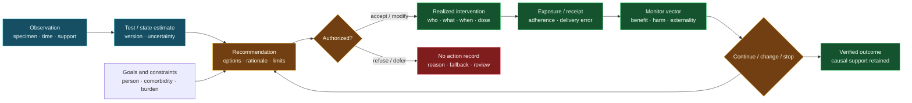
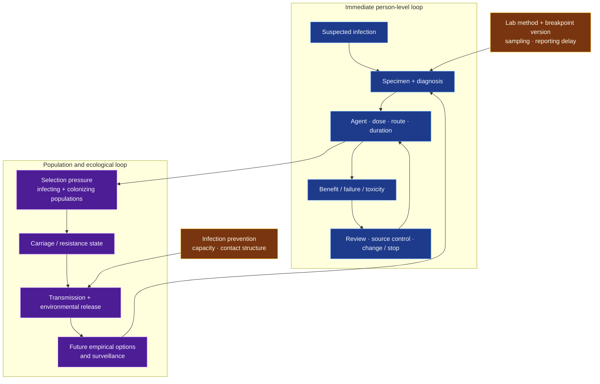

# Clinical intervention pathways, stewardship, and authorization

<!-- markdownlint-disable MD013 -->

- **Audit date:** 2026-08-24
- **Scope:** antimicrobial stewardship and resistance, multimorbidity and
  polypharmacy, diagnostic-test/therapy coupling, adaptive treatment pathways,
  intervention authorization, execution verification, monitoring, and stopping
- **Evidence rule:** a recommendation, test result, prescription, administered
  intervention, observed response, and causal benefit are different records;
  diagnostic discrimination is not clinical utility, implementation is not
  exposure, and an average treatment-policy value is not an individual guarantee
- **Promotion state:** no new principle and no new candidate; nine scoped claims
  are reserved for central-ledger integration, plus six synthetic falsification
  contracts routed to existing candidates
- **Repository effect:** close one clinical-medicine entry gap while refining
  P-002, P-003, P-004, P-006, P-007, P-008, P-009, P-012, and P-013; route
  intervention selection to Candidates 007/012/014, operational closure to
  Candidate 011, protocol/version changes to Candidate 015, and legitimate
  authority, refusal, and remedy to Candidate 020

## Normative-source header

- **Normative context:** EU law is the project default, with German
  implementation to be resolved for an actual product, clinical investigation,
  care setting, or data-processing operation. This audit authorizes no clinical
  use and uses no patient data.
- **Jurisdiction and authority:** the European Parliament and Council for
  Regulations (EU) 2016/679, 2017/745, 2017/746, 2024/1689 as amended by
  2026/1744, and 536/2014; the Council of the European Union for Recommendation
  2023/C 220/01; EMA for scientific and companion-diagnostic procedural
  guidance; ECDC for EU/EEA surveillance; and EUCAST for European technical
  antimicrobial-susceptibility practice. No non-European rule is treated as the
  project baseline.
- **Source role:** the cited EU regulations are binding only when their own
  product, actor, study, processing, or market hooks apply. The Council AMR
  recommendation is non-binding policy direction. EMA adaptive-design and
  companion-diagnostic documents are scientific or conformity-route guidance,
  not proof of clinical benefit. EUCAST breakpoint tables are versioned
  technical practice, not a statute or an automatic prescription rule. ECDC
  surveillance is an authoritative population description, not a patient-level
  causal estimate.
- **Snapshot date and version:** official status checked 2026-08-24. The AI Act
  text checked was the consolidated 2026-07-27 version after Regulation (EU)
  2026/1744; its Chapter III Sections 1--3 high-risk duties are staged to
  2027-12-02 for Article 6(2)/Annex III systems and 2028-08-02 for Article
  6(1)/Annex I product systems. EUCAST bacterial clinical breakpoints v16.1 are
  valid 2026-06-24 through 2026-12-31, with dosage tables v16.0. The ECDC report
  checked was the 2025 report on 2024 EARS-Net data. The current EMA
  companion-diagnostic procedural guidance is revision 1, effective 2024-12-17.
- **Applicability hook:** unresolved. Intended medical purpose, whether software
  is a device or safety component, risk class, third-party conformity route,
  companion-diagnostic status, placing on the EU market, clinical-trial role,
  controller/processor role, use of personal health data, and the German
  professional authorized to order or deliver an intervention must all be fixed
  before a binding deployment conclusion is possible.

## Executive finding

Clinical intervention science contributes a constraint that is easy to erase in
a generic control diagram: **information does not act by itself**. A clinically
meaningful pathway has at least the following separately evidenced transitions:

1. a person, population, and decision horizon are declared;
2. observations are acquired with specimen, timing, support, and uncertainty;
3. a diagnosis or decision-relevant state is proposed;
4. available actions and contraindications are reconciled across the whole
   situation, not one condition at a time;
5. an actor with the relevant authority recommends, accepts, modifies, refuses,
   or authorizes an action;
6. the action is dispensed, administered, received, or otherwise realized;
7. intended exposure and actual exposure are distinguished;
8. benefit, harm, workload, interaction, and population spillovers are monitored;
9. continuation, escalation, de-escalation, substitution, or stopping is decided;
   and
10. downstream outcomes are attributed no more strongly than the design permits.



No new architecture principle survives deduplication. Typed state machines,
clinical decision support, workflow engines, causal inference, dynamic treatment
regimes, SMART designs, Bayesian monitoring, PK/PD, constrained control,
antimicrobial stewardship, laboratory quality systems, pharmacovigilance, and
medical-device post-market surveillance are mature nulls. The reusable residue
is a **test--authority--execution--monitoring contract**: every proposed action
must retain the evidence, role, realization, and follow-up that make its claimed
effect interpretable.

## Terms that must remain distinct

| Term | Operational meaning | Must not be inferred from |
| --- | --- | --- |
| observation | timestamped measurement or report with source, support, acquisition path, and uncertainty | the condition being present, or the measurement being decision-relevant |
| diagnostic performance | relationship between a test output and a declared reference condition in a declared population | clinical benefit, treatment-effect modification, or workflow uptake |
| prognostic marker | information about outcome under a stated treatment distribution | differential benefit from one treatment versus another |
| predictive marker | treatment-effect modification supported by a treatment comparison, preferably randomized | association with outcome in one treated cohort |
| clinical utility | change in person-relevant outcomes, harm, burden, or decisions from using a test in a specified pathway | sensitivity, specificity, AUROC, calibration, or faster turnaround alone |
| recommendation | proposed action with rationale, confidence, alternatives, and scope | authorization, order, execution, adherence, or benefit |
| authorization | a named actor's permitted decision under applicable role, law, policy, and current evidence | product conformity, a model score, or another actor's recommendation |
| order or prescription | a recorded authorized instruction under a care workflow | dispensing, administration, receipt, exposure, or adherence |
| realized intervention | action actually delivered, including time, route, amount, and deviations | a plan, order, button click, or stock movement |
| monitoring | prespecified observation of intended response, protected harms, implementation, and stopping conditions | dashboard availability or passive logging alone |
| guideline | population- and scope-qualified recommendation process | an executable rule that composes safely with every other guideline |
| multimorbidity | coexistence of multiple long-term conditions in one person | a count that captures severity, interaction, goals, function, or treatment burden |
| polypharmacy | concurrent use of multiple medicines under a declared definition and interval | inappropriate prescribing; multiple medicines can be justified or harmful depending on the complete case |
| adaptive treatment regime | sequence of decision rules mapping observed history to actions | trial adaptation, online learning, clinician discretion, or an individually proven optimum |
| SMART | sequential multiple-assignment randomized trial used to compare stage options or embedded adaptive interventions | proof for every possible policy or every individual outside trial support |
| antimicrobial susceptibility category | versioned organism--agent--method--breakpoint interpretation linked to dosing/exposure assumptions | a context-free property of a person, an unconditional clinical success prediction, or a prescription |
| antimicrobial stewardship | coordinated selection, dosing, route, duration, review, de-escalation, monitoring, and population responsibility | minimizing antibiotic count or rotating agents according to one fixed heuristic |

## Reserved central claims

The following IDs were reserved for later sequential integration into the
central ledger. Until that integration occurs, this table is the authoritative
audit-local record; it does not silently promote a principle.

| ID | Status | Scoped statement | Evidence boundary |
| --- | --- | --- | --- |
| `CLIN-L01` | established limitation | Independently defensible single-condition recommendations can conflict, interact, or impose infeasible aggregate burden when composed for a person with multimorbidity. | Boyd et al. is a structured guideline-composition analysis, not a trial of every guideline or person. |
| `CLIN-L02` | established scoped trial result | Generating more medication-optimization recommendations or improving prescribing-process measures does not by itself improve adverse events or admissions; uptake, implementation, comparator care, follow-up, and person-level endpoints remain part of the intervention. | SENATOR and OPERAM are European trials in selected older multimorbid populations and do not prove that all medication review is ineffective. |
| `CLIN-L03` | established method | Diagnostic accuracy, identification speed, or biomarker association does not establish clinical utility; the result must be coupled to an available treatment contrast, an executable decision path, and person-relevant outcomes. | A test can still have utility in a particular pathway; the claim rejects automatic inference, not diagnostics. |
| `CLIN-L04` | established method | A prognostic association is not a predictive treatment marker; treatment-effect modification requires a treatment comparison and prespecified interaction/support analysis. | Statistical interaction remains population-, model-, scale-, endpoint-, and multiplicity-qualified and does not guarantee individual response. |
| `CLIN-L05` | established method | A dynamic treatment regime is a sequence of decision rules over evolving observed history, and its value is population-, horizon-, outcome-, action-set-, and support-qualified. | It is not a generally optimal controller and does not remove sequential-confounding, positivity, consistency, measurement, adherence, or interference assumptions. |
| `CLIN-L06` | established design boundary | A SMART randomizes among specified stage options and identifies contrasts among stage decisions or embedded regimes; it does not validate arbitrary policies outside those options or histories. | Small or selective SMARTs can have wide regime-value uncertainty and limited transportability. |
| `CLIN-L07` | established technical boundary | EUCAST S, I, and R categories are organism--agent interpretations linked to a current breakpoint version and exposure assumptions; I denotes susceptibility with increased exposure, not resistance. | Categories do not replace diagnosis, source control, allergy/interaction review, patient factors, or outcome monitoring. |
| `CLIN-L08` | established scoped clinical and population boundary | Antimicrobial policy must retain immediate patient outcomes and population/ecological outcomes separately; a simple cycling heuristic did not reduce resistant Gram-negative carriage versus mixing in a European ICU trial. | One null comparison does not establish the best stewardship policy or erase setting-, pathogen-, transmission-, infection-control-, and timescale-specific effects. |
| `CLIN-L09` | established operational and legal boundary | Recommendation, authorization, order, dispensing, administration, receipt/adherence, response, adverse event, and stopping are distinct states; product or study authorization does not self-authorize an individual treatment action. | The exact authorized actor and procedure depend on intended purpose, product class, care setting, Member-State law, and emergency conditions. |

## Evidence synthesis

### 1. Multimorbidity breaks naive guideline composition

Boyd and colleagues applied multiple single-disease clinical practice guidelines
to a hypothetical older person with several common chronic conditions. The
combined regimen generated interactions, monitoring requirements, lifestyle
demands, and a substantial treatment workload. The study's force is conceptual
and operational: recommendations that are locally justified against separate
evidence bases need not form a coherent joint plan. It does not estimate one
universal prevalence of conflict or justify ignoring disease-specific evidence
([doi:10.1001/jama.294.6.716](https://doi.org/10.1001/jama.294.6.716)).

Represent the plan as a typed constraint system rather than a list. For person
$i$, let candidate action $a$ have:

$$
Q_i(a)=\left(B_i(a),H_i(a),L_i(a),W_i(a),D_i(a),U_i(a)\right),
$$

where $B_i$ is a vector of expected benefits, $H_i$ protected harms, $L_i$
latency to benefit or harm, $W_i$ implementation and treatment burden, $D_i$
dependencies and interactions, and $U_i$ uncertainty. Components retain their
native units: days, probabilities, minutes of work, medicine administrations,
laboratory visits, or endpoint-specific scales. They are not summed without a
declared decision model and the person's goals. Feasibility requires all
hard constraints, contraindications, action availability, and refusal states to
remain visible.

Two large European trials show why a recommendation engine is not an outcome
engine:

- The SENATOR pragmatic randomized trial enrolled 1,537 hospitalized older
  people with multimorbidity and polypharmacy at six European centres.
  Software-generated medication advice was implemented at roughly 15%; probable
  or certain adverse drug reactions did not differ between intervention and
  standard care. Low uptake is not proof that the recommendations were wrong,
  but it prevents treating their generation as delivered care or causal benefit
  ([doi:10.1093/ageing/afaa072](https://doi.org/10.1093/ageing/afaa072)).
- OPERAM cluster-randomized 2,008 adults aged at least 70 years with at least
  three chronic conditions and five long-term medicines across four European
  countries. The structured physician/pharmacist review reduced inappropriate
  prescribing, and 62.2% of participants with recommendations had at least one
  implemented by two months, but the primary drug-related-admission result was
  not improved (hazard ratio 0.95, 95% CI 0.77--1.17). This is a scoped null on
  the complete intervention and outcome, not a universal rejection of review
  ([doi:10.1136/bmj.n1585](https://doi.org/10.1136/bmj.n1585)).

The transfer is therefore not "use more rules" or "deprescribe." It is to make
the joint action set, conflicts, protected goals, burden, uptake, realized
changes, and later outcomes explicit. [C-611](../claims.md#c-611)--[C-616](../claims.md#c-616)
already separate dose, population variation, adaptive monitoring, and realized
utility; [the nursing/care audit](2026-08-21-nursing-care-health-services.md)
already separates required work from completed work. CLIN-L01 and CLIN-L02 add the
clinical composition and recommendation-to-implementation boundaries without a
new principle.

### 2. A test matters through the decision it changes

A diagnostic can be analytically accurate and clinically inert. Conversely, a
moderately informative test can be useful when it changes a high-value decision
quickly and safely. The relevant estimand is the outcome of a **test-and-act
strategy**, not the test statistic alone.

For latent clinical state $S$, test result $R$, decision rule $\delta$, action
$A=\delta(R,H)$, observed history $H$, and endpoint $k$, report

$$
\Delta_k(\delta,\delta_0)
=\mathbb E\!\left[Y_k^{\delta}-Y_k^{\delta_0}\right],
$$

where $Y_k^\delta$ is the potential endpoint under the complete test-and-action
strategy and $\delta_0$ is a declared comparator. Each $\Delta_k$ retains the
endpoint unit, such as deaths per 1,000 people, hours to appropriate therapy,
days of treatment, adverse events per person, clinician minutes, or euros. The
equation does not identify the effect without an appropriate design; it states
what accuracy metrics fail to measure.

The randomized Banerjee trial makes the coupling visible. Among 617 people with
positive blood-culture bottles, rapid multiplex PCR shortened organism
identification from a median 22.3 hours to 1.3 hours. The three arms were
standard processing, rapid PCR with templated comments, and rapid PCR plus
real-time antimicrobial-stewardship audit and feedback. Appropriate
de-escalation was fastest with the stewardship-coupled pathway; mortality,
length of stay, and cost did not differ. The experiment therefore separates
result latency, interpretive comments, stewardship action, antimicrobial use,
and clinical endpoints
([doi:10.1093/cid/civ447](https://doi.org/10.1093/cid/civ447)).

Predictive and prognostic markers also remain separate. Ballman states the
design requirement directly: demonstrating a predictive marker requires
treatment comparison across marker status and a treatment-by-marker interaction,
preferably in randomized data. Association between a marker and outcome
regardless of treatment is prognostic, not evidence that the marker selects a
beneficial therapy
([doi:10.1200/JCO.2015.63.3651](https://doi.org/10.1200/JCO.2015.63.3651)).
Freidlin, McShane, and Korn likewise distinguish biomarker validation from
clinical utility of biomarker-guided treatment
([doi:10.1093/jnci/djp477](https://doi.org/10.1093/jnci/djp477)).

Under the IVDR, a companion diagnostic has a narrow legal definition tied to
safe and effective use of a corresponding medicinal product. That classification
and its notified-body/medicinal-authority consultation route do not make every
test that predicts treatment response a companion diagnostic, nor do they make
conformity evidence a patient-specific treatment order. The test's intended
purpose, population, specimen, user, associated medicinal product, performance,
and limitations remain part of the product record
([Regulation (EU) 2017/746](https://eur-lex.europa.eu/eli/reg/2017/746),
[EMA companion-diagnostic procedure](https://www.ema.europa.eu/en/human-regulatory-overview/medical-devices/companion-diagnostics-vitro-diagnostics)).

### 3. Adaptive pathways are policies with bounded support

An adaptive treatment regime does not mean that a model may improvise treatment
after every observation. Murphy defines a dynamic treatment regime as a list of
decision rules, one per decision interval, mapping evolving information to
treatment. Its value is a counterfactual population quantity under explicit
assumptions, not an intrinsic property of a policy
([doi:10.1111/1467-9868.00389](https://doi.org/10.1111/1467-9868.00389)).

For decision time $t$, define history

$$
H_t=(X_0,A_1,O_1,\ldots,A_{t-1},O_{t-1}),
\qquad A_t=\pi_t(H_t),
$$

where $X_0$ is baseline state, $A_j$ is the realized action, $O_j$ is the
subsequent observation packet, and $\pi_t$ is the stage rule. A regime's value
for endpoint $Y$ and population $\mathcal P$ is

$$
V_{\mathcal P,T}(\pi)=\mathbb E_{\mathcal P}\!\left[Y_T^{\pi}\right].
$$

Every symbol is indexed by a decision horizon $T$, population $\mathcal P$,
action set, observation process, and endpoint. Identification from observational
histories requires sequential exchangeability, consistency, and positivity or
another justified causal design. A basic support condition is

$$
\Pr\!\left(A_t=\pi_t(H_t)\mid H_t=h\right)>0
$$

for histories $h$ on which the regime is evaluated. Where the data never or
almost never take a proposed action, a high-confidence recommendation is
extrapolation, not learned evidence.

SMARTs supply repeated randomization for specified stage options. Nahum-Shani
et al. formalize comparisons of stage-specific options and adaptive
interventions embedded in the design
([doi:10.1037/a0029372](https://doi.org/10.1037/a0029372)). A 61-child SMART by
Kasari et al. compared specified two-stage communication interventions and
response-based augmentation. It supports those scoped contrasts in that
population; it does not authorize arbitrary histories, untested treatments, or
individual certainty
([doi:10.1016/j.jaac.2014.01.019](https://doi.org/10.1016/j.jaac.2014.01.019)).

Adaptive **trial design** is another object. EMA's reflection paper concerns
preplanned changes to confirmatory trials and warns that flexibility affects
type-I error, bias, estimation, interpretation, and trial integrity. It does not
turn a treatment regime into an adaptive trial or establish a learning clinical
system
([EMA/CHMP/EWP/2459/02](https://www.ema.europa.eu/en/methodological-issues-confirmatory-clinical-trials-planned-adaptive-design-scientific-guideline)).

### 4. Antimicrobial stewardship spans patient and population timescales

Antimicrobial treatment exposes at least three coupled systems:

1. the person and infection under treatment;
2. colonizing and infecting microbial populations under selection; and
3. other people connected through transmission, shared environments, and future
   treatment options.



EUCAST's current definitions demonstrate why even a familiar laboratory label
is a pathway object. `S` means high likelihood of therapeutic success with a
standard dosing regimen; `I` means susceptible with increased exposure achieved
through regimen adjustment or concentration at the infection site; `R` means a
high likelihood of failure even with increased exposure. Exposure depends on
administration mode, dose, interval, infusion time, distribution, and excretion.
EUCAST explicitly warns not to combine I and R as "non-susceptible." Current
breakpoints are versioned and can change with evidence
([EUCAST definitions](https://www.eucast.org/bacteria/clinical-breakpoints-and-interpretation/definition-of-s-i-and-r/),
[v16.1 tables](https://www.eucast.org/bacteria/clinical-breakpoints-and-interpretation/clinical-breakpoint-tables/)).

The result therefore needs at least

$$
S_{\mathrm{AST}}=(o,a,m,b,v,d,e,q,t),
$$

where $o$ is organism identification and scope, $a$ the antimicrobial, $m$ the
test method, $b$ the breakpoint rule, $v$ the table version, $d$ the assumed
dosing regimen, $e$ the exposure condition, $q$ quality/uncertainty flags, and
$t$ acquisition and availability times. The tuple does not contain an automatic
prescription because infection source, allergies, organ function, interactions,
pregnancy, goals, source control, availability, and local epidemiology remain
outside it.

Clinical trials reject a universal "more is safer" or "rotate to prevent
resistance" rule:

- The BALANCE non-inferiority trial randomized 3,608 hospitalized people with
  eligible bloodstream infections to 7 or 14 days of antibiotics. Seven days
  was non-inferior for 90-day mortality under the registered margin and produced
  more antibiotic-free days. Severe immunosuppression, pathogens or foci
  requiring prolonged treatment, *Staphylococcus aureus*, and other cases were
  excluded. The result supports a scoped shorter-duration strategy, not a
  universal duration constant
  ([doi:10.1056/NEJMoa2404991](https://doi.org/10.1056/NEJMoa2404991)).
- A Dutch 15-hospital ICU trial used non-binding procalcitonin stopping advice.
  It reduced median antibiotic consumption and duration in its setting. The
  biomarker threshold, clinician override, low-use health system, open-label
  design, eligibility, adherence, reinstitution, inflammation, and mortality
  follow-up are all parts of the tested system
  ([doi:10.1016/S1473-3099(16)00053-0](https://doi.org/10.1016/S1473-3099(16)00053-0)).
- In eight European ICUs, cluster-randomized crossover between six-week
  antibiotic cycling and patient-by-patient mixing found resistant Gram-negative
  carriage prevalence of 23% and 22%, respectively, with no significant
  adjusted difference. Cycling did not reduce the primary outcome. This is a
  strong null for one intuitive diversity schedule, not proof that selection or
  stewardship is irrelevant
  ([doi:10.1016/S1473-3099(18)30056-2](https://doi.org/10.1016/S1473-3099(18)30056-2)).

The 2025 ECDC report on 2024 EARS-Net data documents divergent EU trajectories:
MRSA bloodstream-infection incidence fell relative to 2019 while third-generation
cephalosporin-resistant *E. coli* and carbapenem-resistant *K. pneumoniae* did
not meet their reduction trajectories. Country, organism, antimicrobial group,
specimen, surveillance, and time remain visible. These population data cannot
choose treatment for an individual
([ECDC 2024 AER](https://www.ecdc.europa.eu/en/publications-data/antimicrobial-resistance-eueea-ears-net-annual-epidemiological-report-2024)).

For an evaluated stewardship policy, retain the vector

$$
\mathbf Y_{\mathrm{AMS}}=
\left(
Y_{\mathrm{clinical}},Y_{\mathrm{toxicity}},
T_{\mathrm{appropriate}},D_{\mathrm{therapy}},
E_{\mathrm{spectrum}},R_{\mathrm{acquired}},
R_{\mathrm{transmitted}},W_{\mathrm{human}},C_{\mathrm{life}}
\right),
$$

where $T_{\mathrm{appropriate}}$ is hours to appropriate realized treatment,
$D_{\mathrm{therapy}}$ is antibiotic days, $E_{\mathrm{spectrum}}$ is a
declared spectrum/exposure measure rather than a hidden score,
$R_{\mathrm{acquired}}$ and $R_{\mathrm{transmitted}}$ are prespecified
resistance/carriage/infection endpoints over named denominators and intervals,
$W_{\mathrm{human}}$ is stewardship/laboratory/clinical work in person-hours,
and $C_{\mathrm{life}}$ is the lifecycle resource vector. Clinical failure cannot
be traded silently for lower use; lower use cannot hide delayed failure; and a
patient-level win cannot prove a population effect.

### 5. Authorization, execution, and monitoring form separate ledgers

Clinical authorization exists at several levels that must not be merged:

| Level | Question | Example authority/evidence | Does not imply |
| --- | --- | --- | --- |
| research | may this clinical investigation recruit and intervene under this protocol? | sponsor, competent authority, ethics review, Regulation (EU) 536/2014 where applicable | marketing authorization or routine-care order |
| product | may this medicinal product/device/IVD be placed on the relevant market for an intended purpose? | competent authority, notified body/conformity route, manufacturer evidence | suitability for every person or permission to prescribe |
| institutional | may this pathway be used here, by these roles, with this fallback and monitoring? | accountable healthcare organization, pharmacy/lab governance, local policy | informed individual agreement or actual delivery |
| professional | may this actor order, dispense, administer, modify, or stop this action? | profession- and Member-State-specific law, scope, delegation, credential | another actor's authority or patient acceptance |
| person | does the person or lawful representative accept, restrict, or refuse the intervention or data use? | informed clinical decision process; trial consent where applicable | technical correctness or unlimited secondary data use |
| execution | what actually happened? | administration, device actuation, specimen, receipt/adherence, timestamp, exception | benefit, causal effect, or continued authorization |

Regulation (EU) 536/2014 requires prior scientific and ethical review and
authorization for covered clinical trials; participant rights, safety, dignity,
and well-being prevail over other interests, and consent/refusal are separately
specified. It does not govern every routine-care intervention or make a research
authorization a treatment recommendation
([official text](https://eur-lex.europa.eu/legal-content/EN/TXT/?uri=CELEX:32014R0536)).

The MDR and IVDR are organized around intended purpose, evidence, risk,
conformity, surveillance, and vigilance. MDR post-market surveillance requires
active systematic collection and analysis across a device's lifetime and
updates to risk management and clinical evaluation. It is not passive telemetry
and cannot be replaced by a model's internal confidence
([Regulation (EU) 2017/745](https://eur-lex.europa.eu/eli/reg/2017/745/oj/)).

The AI Act classification and duties, where applicable, layer onto rather than
erase sectoral product law. The 2026 amendment changed application dates; it did
not grant a clinical-use exemption or turn future high-risk duties into current
evidence of safety. Classification requires the actual intended use and
conformity route. This audit records the current dates but makes no deployment
classification
([consolidated Regulation (EU) 2024/1689](https://eur-lex.europa.eu/eli/reg/2024/1689/2026-07-27/eng),
[Regulation (EU) 2026/1744](https://eur-lex.europa.eu/eli/reg/2026/1744/oj)).

For every proposed intervention, preserve the state record

$$
I=(i,v,p,r,o,a,x,e,m,z),
$$

where $i$ and $v$ identify intervention and version, $p$ is proposed plan, $r$
is rationale/support, $o$ is recommending actor, $a$ is current authorization
state and actor, $x$ is realized execution, $e$ is exposure/receipt evidence,
$m$ is monitoring plan and observations, and $z$ is stopping, refusal,
exception, or unresolved state. An `authorized` record with $x=\varnothing$ is
not executed. An administration record without $m$ is not monitored. A favorable
measurement without comparator support is not causal benefit.

## Proposed AI translation

### Typed intervention episode

Use a versioned episode packet rather than one free-text plan:

```text
episode
  subject/population support and decision horizon
  goals, protected outcomes, refusal and access constraints
  observation packets and unresolved differential state
  candidate actions, interactions, contraindications and availability
  recommendation with evidence grade and alternatives
  authority state: proposed | reviewed | accepted | modified | refused | expired
  execution state: not ordered | ordered | dispensed | administered | received | unknown
  exposure/adherence evidence and deviations
  monitoring schedule, action thresholds and responsible actor
  continuation/escalation/de-escalation/stopping decision
  outcomes with event time, availability time and causal support
  labor, delay, compute, energy, material, and follow-up cost
```

Unknown and inapplicable are distinct. A stale observation cannot be rewritten
as current. The recommending component cannot attest its own authorization,
execution, or outcome. Every derivation carries the upstream version and the
invalidations that would reopen the decision.

### Interaction-aware planning

Model condition/action relations as a typed hypergraph only if the graph's edges
are evidence-bearing:

- actions may share mechanisms, monitoring, administration, or burden;
- one action may improve one endpoint while worsening another;
- absence of an interaction edge means `unknown`, not compatible;
- person goals and refusal constrain admissible actions rather than enter a
  hidden reward weight;
- timing, tapering, and removal are actions in their own right; and
- the plan exposes unresolved conflicts for authorized review.

The null model is a conventional rule/constraint engine with curated drug--drug,
drug--condition, dose, organ-function, allergy, and monitoring rules. A learned
graph must beat that complete system under held-out combinations and cannot earn
credit for suggesting unavailable or unauthorized actions.

### Support-qualified sequential policy

Every policy output returns

$$
P_t=(a_t,s_t,u_t,g_t,f_t),
$$

where $a_t$ is the proposed action, $s_t$ the data/policy support region,
$u_t$ calibrated uncertainty, $g_t$ required authorization grade and responsible
role, and $f_t$ fallback or follow-up. Outside support, the correct output may be
abstention, additional observation, ordinary protocol, or urgent escalation.
Online updates do not modify the admissible action set or evidence grade without
the versioned change-control path owned by Candidates 009/011/015/020.

### Two-level stewardship record

The antimicrobial track adds organism/specimen, infection source, test method,
breakpoint version, regimen/exposure assumptions, source-control state, local
epidemiology version, infection-prevention state, contact/ward stratum,
colonization/resistance observation process, and population horizon. Patient
benefit, antimicrobial exposure, resistance, transmission, and labor remain a
vector. A scalar "stewardship score" may be displayed only after all raw axes
and weights are recoverable.

## Deduplication and routing

| Clinical residue | Existing route and mature null | Required refinement; no new principle |
| --- | --- | --- |
| reconcile interacting actions under multimorbidity | [P-001](../principle-registry.md#p-001--selective-allocation), [P-008](../principle-registry.md#p-008--compartmentalized-interaction), [Candidate 012](../../experiments/candidates/012-latency-qualified-authority.md); rule/constraint engines, medication reconciliation, pharmacist review | expose goal, hard constraint, interaction, burden, implementation, and unresolved state; compare with a complete conventional decision-support stack |
| recommendation versus delivered intervention | [P-002](../principle-registry.md#p-002--local-autonomy-with-exception-escalation), [P-009](../principle-registry.md#p-009--maintenance-plane), [Candidate 011](../../experiments/candidates/011-dual-loop-operational-assurance.md); workflow/event ledgers and acknowledgement protocols | typed authority and execution attestations; no self-attestation by recommender |
| diagnostic result coupled to decision and therapy | [P-007](../principle-registry.md#p-007--prediction-error-allocation), [Candidate 007](../../experiments/candidates/007-endogenous-observation-surveillance.md), [Candidate 014](../../experiments/candidates/014-versioned-observation-contract.md); decision curves, test-treatment trials, value of information | score the complete test--interpret--authorize--act--monitor pathway, not accuracy alone |
| adaptive treatment sequence | [P-003](../principle-registry.md#p-003--temporary-trace-before-commitment), [P-006](../principle-registry.md#p-006--homeostatic-negative-feedback), [P-012](../principle-registry.md#p-012--memory-matched-to-information-lifetime); DTR, SMART, g-method, POMDP and MPC nulls | history/support packet, policy version, positivity/transport diagnostics, fallback and authority per stage |
| treatment changes later observation | [Candidate 007](../../experiments/candidates/007-endogenous-observation-surveillance.md), [Candidate 014](../../experiments/candidates/014-versioned-observation-contract.md); causal longitudinal models and informative-observation nulls | retain action, realized exposure, specimen timing, monitoring decision, rescue, adherence, attrition, and availability time |
| antimicrobial selection and population spillover | [P-004](../principle-registry.md#p-004--diversity-selection-and-protection), [P-008](../principle-registry.md#p-008--compartmentalized-interaction), [Candidate 019](../../experiments/candidates/019-audited-cumulative-inheritance.md); epidemiology, evolutionary models, stewardship and infection control | separate immediate patient endpoint, carriage/acquisition, transmission, surveillance, and future action-set effects; cycling/mixing is a mandatory null, not a principle |
| susceptibility as exposure-qualified category | [pharmacology audit](2026-08-05-pharmacology-toxicology.md), [Candidate 014](../../experiments/candidates/014-versioned-observation-contract.md); PK/PD and versioned lab standards | bind organism, method, breakpoint, version, dose/exposure assumption, site, quality flag, and result availability |
| authorization, refusal, and product/study boundaries | [Candidate 009](../../experiments/candidates/009-graded-assurance-envelopes.md), [Candidate 012](../../experiments/candidates/012-latency-qualified-authority.md), [Candidate 020](../../experiments/candidates/020-constitutional-control-plane.md); IAM, professional workflow, conformity and trial governance | separate research, product, institutional, professional, person, and execution authority; never infer one from another |
| post-intervention monitoring and stopping | [P-009](../principle-registry.md#p-009--maintenance-plane), [Candidate 005](../../experiments/candidates/005-severity-ordered-containment.md), [Candidate 011](../../experiments/candidates/011-dual-loop-operational-assurance.md); pharmacovigilance, PMS, control charts, staged withdrawal | declare benefit/harm endpoints, sampling plan, accountable actor, threshold, fallback, late follow-up, and verified closure |

## Synthetic falsification contracts

These are documentation-level experiment contracts. They require no patient
data and add no model implementation.

### CLIN-EXP-01 — Multimorbidity composition trap

**Question.** Can the candidate assemble a feasible joint plan when every
single-condition recommendation is locally reasonable but combinations produce
contraindications, duplicated mechanisms, incompatible timing, excessive
monitoring, or person-declared refusal?

**Generator.** Create synthetic episodes with 2--8 conditions, 3--20 candidate
actions, directed and higher-order interactions, renal/hepatic-like latent
capacity, allergies, changing function, action availability, goals, deadlines,
and burden caps. Hold out condition combinations and interaction motifs rather
than random rows.

**Arms.** Independent condition guidelines; rule-based interaction checker;
constraint optimizer with complete curated graph; pharmacist-like staged review;
learned proposer plus the same checker; full candidate composition.

**Equalization.** Same action catalogue, observations, interaction knowledge,
review minutes, compute, and ability to abstain. Charge all alerts, unresolved
reviews, tests, monitoring, and follow-up.

**Measures.** Hard-constraint violations; protected-goal regret by component;
unresolved-conflict recall and precision; feasible-plan rate; actions and
monitoring events per episode; person-time and reviewer-time burden; delayed
harm; and calibration on held-out combinations.

**Falsification.** Fail if the candidate wins only by omitting a condition,
turning unknown interactions into zero, suggesting unavailable actions,
scalarizing protected goals, or moving review work outside the budget. Retire
the clinical residue if the conventional rule/constraint stack matches it.

### CLIN-EXP-02 — Diagnostic performance versus pathway utility

**Question.** Does a better or faster test improve the complete decision pathway?

**Generator.** Vary prevalence, disease severity, test discrimination,
calibration, specimen failure, turnaround, action threshold, treatment-effect
heterogeneity, treatment availability, authorization latency, uptake, adverse
effects, and loss to follow-up. Include tests with higher AUROC but harmful
threshold behavior and tests whose result arrives after the useful window.

**Arms.** No test/fixed protocol; old test; faster test only; better-calibrated
test only; test plus fixed decision rule; test plus authorized stewardship;
candidate.

**Measures.** Calibration and discrimination remain secondary. Primary outputs
are endpoint-specific test-and-treatment effects, time to appropriate realized
action, inappropriate action, untreated eligible cases, adverse outcomes,
abstention, clinician minutes, and total lifecycle cost.

**Falsification.** Fail any claim based only on AUROC, sensitivity, specificity,
identification time, or recommendation rate. Fail if benefit disappears after
execution and follow-up are modeled or if the decision rule extrapolates beyond
observed treatment support.

### CLIN-EXP-03 — Antimicrobial two-level policy

**Question.** Does a stewardship policy improve patient outcomes without
exporting harm to resistance, transmission, workload, or future options?

**Generator.** Synthetic wards contain infection and colonization states,
organism/agent-specific susceptibility, EUCAST-like breakpoint versions,
exposure-dependent success, specimen and reporting delays, source-control state,
contacts, admissions/discharges, infection-prevention capacity, mutation and
horizontal-transfer analogues, and external importation. Include abrupt
breakpoint updates and missing isolates.

**Arms.** Fixed broad empirical policy; local guideline; patient-by-patient
mixing; six-week cycling; test-guided de-escalation; ordinary model-predictive or
POMDP policy; candidate.

**Measures.** Clinical failure and severe-harm tails; hours to appropriate
therapy; therapy days; exposure/spectrum vector; resistant carriage acquisition;
resistant infection and transmission by start cohort; secondary infections;
laboratory and stewardship minutes; abstention; calibration; and complete cost.

**Falsification.** Fail if lower use masks delayed failure, if an S/I/R label is
used without version/exposure assumptions, if a patient-level win is called a
population win, if exiting/dead patients disappear from denominators, or if
cycling receives biological credit without beating mixing and conventional
control under matched conditions.

### CLIN-EXP-04 — Sequential regime support and transport

**Question.** Can the policy select and evaluate multistage actions without
unsupported extrapolation or post-treatment bias?

**Generator.** Produce two- and three-stage SMART-like data with known regime
values, response-based rerandomization, nonresponse definitions, adherence,
rescue, informative missingness, treatment availability, observation timing,
and a shifted target population. Add histories with zero or near-zero support.

**Arms.** Stagewise greedy rule; naive regression conditioning on intermediate
response; correctly analyzed embedded SMART regimes; g-computation/IPW/Q-learning
nulls with diagnostics; POMDP/MPC null; candidate.

**Measures.** Regime-value bias and interval coverage; support/positivity
violations detected; held-out population regret; subgroup and tail outcomes;
stage-specific authorization errors; action and observation cost; correct
abstention outside support.

**Falsification.** Fail if the candidate claims arbitrary policies from embedded
regimes, conditions naively on a treatment-affected response, hides positivity
failure, learns from assigned rather than realized treatment, or labels mean
value an individual guarantee.

### CLIN-EXP-05 — Authority and execution fault injection

**Question.** Does the intervention record prevent an information object from
silently becoming an unauthorized or unverified action?

**Faults.** Inject stale test versions, wrong-person packets, revoked roles,
conflicting recommendations, patient refusal, unavailable medicine/device,
order-to-administration mismatch, dose/route/timing deviation, duplicate action,
no follow-up capacity, delayed adverse event, emergency override, and missing
acknowledgement.

**Arms.** Free-text recommendation; recommendation plus static role check;
workflow state machine; signed capability/IAM plus event ledger; candidate 009/
012/020 composition; proposed clinical packet.

**Measures.** Unauthorized proposed and realized actions separately; blocked
appropriate actions; time to authorized fallback; unacknowledged orders;
execution mismatch; refusal preservation; monitoring completion; adverse-event
latency; reviewer minutes; audit reconstruction accuracy.

**Falsification.** Fail if the recommending component can self-attest authority,
if a block is counted as safety without measuring delayed no-treatment harm, if
emergency paths erase later review, or if product/study authorization is accepted
as person-level authority.

### CLIN-EXP-06 — Stop, taper, recurrence, and delayed harm

**Question.** Can the pathway stop or change support while distinguishing cure,
suppression, dependence, recurrence, withdrawal-like failure, and observation
loss?

**Generator.** Synthetic interventions have fast benefit, delayed harm,
suppressed latent state, rebound, taper sensitivity, monitoring burden, and
competing causes of recurrence. Observation probability depends on prior action
and apparent response.

**Arms.** Fixed duration; stop-on-threshold; Bayesian monitoring/TDM; constrained
MPC/POMDP; staged taper and surveillance; Candidate 005/007/012 composition.

**Measures.** Native capability after removal; recurrence incidence and time;
withdrawal/rebound; cumulative exposure; delayed harm; rescue; monitoring and
human cost; false reassurance from lost follow-up.

**Falsification.** Fail if a clean value at stopping is called durable success,
if missing follow-up becomes no recurrence, if taper/rescue resources are
uncharged, or if [the pharmacology audit's](2026-08-05-pharmacology-toxicology.md)
ordinary state/withdrawal null matches the proposed mechanism.

## Cross-contract success and kill rules

No scalar "clinical intelligence" result is admissible. A transfer survives
only if all applicable rules hold:

1. every test, rule, action, and monitoring packet is versioned and its support
   population and horizon are declared;
2. recommended, authorized, ordered, administered, received, and verified
   states are counted separately;
3. protected benefit, harm, burden, refusal, and population spillover axes remain
   visible before aggregation;
4. analyses use the correct randomization, cohort, cluster, stage, and
   interference unit rather than treating repeated observations as independent;
5. support and positivity failures cause explicit abstention or fallback;
6. all arms receive equal observations, action options, authority, reviewer time,
   compute, follow-up, infection-control capacity, and lifecycle budget;
7. execution, adherence, monitoring, rescue, de-escalation, taper, and stopping
   are charged; and
8. uncertainty covers the registered endpoint under held-out combinations,
   institutions, breakpoint versions, action availability, and population shift.

Retire the proposed clinical composition as a distinct research contribution if:

- a complete typed workflow, conventional rule/constraint engine, stewardship
  pathway, DTR/SMART estimator, and POMDP/MPC stack matches it at equal cost;
- improvement exists only in recommendation count, test accuracy, turnaround,
  or a prescribing-process surrogate;
- the model is evaluated on assigned action while real execution/adherence is
  missing;
- treatment-affected observations are treated as ordinary independent features;
- single-condition benefit hides another condition's harm or infeasible burden;
- a biomarker is called predictive without a treatment contrast and interaction;
- arbitrary policies are inferred outside the SMART action/history support;
- a resistance claim omits specimen, population, denominator, acquisition,
  breakpoint version, exposure, transmission, or infection-prevention state;
- lower antimicrobial use worsens clinical failure or delayed harm;
- an `I` susceptibility category is collapsed into resistant, or any category is
  treated as an unconditional prescription;
- recommendation, authorization, execution, response, and causal effect are
  collapsed into one status;
- refusal, unavailable action, no responder, or no monitoring capacity is hidden
  as model error rather than part of the system;
- conformity assessment, marketing authorization, trial authorization, policy
  approval, or model confidence is substituted for the actual professional and
  person-level decision path; or
- personal health data, clinical labor, laboratory resources, monitoring,
  adverse-event response, material use, or energy are obtained outside the
  declared budget and lawful governance.

## Central-ledger integration appendix

These records are formatted for later insertion after parallel audits finish.
The local source keys are exact and unique against the repository as checked on
2026-08-24.

### CLIN-L01 — reserved central slot 1352

- **Statement:** Independently defensible single-condition recommendations can
  conflict, interact, or impose infeasible aggregate burden when composed for a
  person with multimorbidity.
- **Status:** established.
- **Primary sources:** `BoydEtAl2005MultimorbidityGuidelines`.
- **Rationale:** disease-specific evidence and performance measures do not solve
  joint contraindication, timing, monitoring, burden, function, goal, and
  preference constraints.
- **Open issue:** compare guideline union, curated rule/constraint systems,
  multidisciplinary review, and learned proposal systems on held-out condition
  combinations without treating unknown interactions as absent.
- **Used by:** this audit; Candidates 012, 014, and 020.

### CLIN-L02 — reserved central slot 1353

- **Statement:** Generating or implementing more medication-optimization
  recommendations does not by itself improve adverse events or hospital
  admissions; uptake, realized changes, comparator care, follow-up, and
  person-level outcomes remain part of the intervention.
- **Status:** established.
- **Primary sources:** `OMahonyEtAl2020SENATOR`, `BlumEtAl2021OPERAM`.
- **Rationale:** SENATOR had low implementation and no adverse-reaction benefit;
  OPERAM improved prescribing-process measures without improving its primary
  drug-related-admission endpoint.
- **Open issue:** identify which recommendations, people, delivery structures,
  and monitoring paths change protected outcomes rather than process surrogates.
- **Used by:** this audit; Candidate 011 and the care-continuity contract.

### CLIN-L03 — reserved central slot 1354

- **Statement:** Diagnostic accuracy, faster identification, or biomarker
  association does not establish clinical utility; utility belongs to the
  complete test--interpret--authorize--act--monitor pathway against a declared
  comparator.
- **Status:** established.
- **Primary sources:** `BanerjeeEtAl2015RapidPCR`,
  `FreidlinMcShaneKorn2010BiomarkerUtility`, `EU2017IVDR`.
- **Rationale:** a randomized rapid-PCR trial separated result latency, comments,
  stewardship, antimicrobial decisions, and clinical outcomes; IVDR intended
  purpose and companion-diagnostic rules preserve the test/product scope.
- **Open issue:** evaluate test-and-treatment strategies under prevalence,
  turnaround, action-effect, uptake, availability, and workflow shifts.
- **Used by:** this audit; Candidates 007 and 014.

### CLIN-L04 — reserved central slot 1355

- **Statement:** A prognostic association is not a predictive treatment marker;
  treatment-effect modification requires a treatment comparison and a scoped
  interaction analysis.
- **Status:** established.
- **Primary sources:** `Ballman2015PredictivePrognostic`.
- **Rationale:** outcome association under one treatment distribution cannot
  identify differential benefit from another treatment.
- **Open issue:** interaction scale, multiplicity, calibration, external support,
  and clinically relevant decision thresholds remain population-specific.
- **Used by:** this audit; Candidate 014.

### CLIN-L05 — reserved central slot 1356

- **Statement:** A dynamic treatment regime is a sequence of decision rules over
  evolving observed history whose value is qualified by population, horizon,
  outcome, action set, observation process, and support.
- **Status:** established.
- **Primary sources:** `Murphy2003DynamicRegimes`.
- **Rationale:** sequential treatment selection is a policy-evaluation problem,
  not a static prediction or universally optimal individual action.
- **Open issue:** sequential exchangeability, consistency, positivity,
  interference, adherence, and transport must be diagnosed or designed away.
- **Used by:** this audit; Candidates 007, 012, and 014.

### CLIN-L06 — reserved central slot 1357

- **Statement:** A SMART identifies stage contrasts or adaptive interventions
  embedded in its specified sequential randomizations; it does not validate
  arbitrary policies outside those actions and histories.
- **Status:** established.
- **Primary sources:** `NahumShaniEtAl2012SMART`, `KasariEtAl2014SMART`.
- **Rationale:** repeated randomization protects specified contrasts, while
  action menu, tailoring variables, rerandomization eligibility, sample size,
  and population still bound the inference.
- **Open issue:** require raw regime uncertainty, support diagnostics, external
  validation, and abstention before transferring a learned sequential policy.
- **Used by:** this audit; Candidates 007 and 014.

### CLIN-L07 — reserved central slot 1358

- **Statement:** EUCAST antimicrobial S, I, and R categories are versioned
  organism--agent interpretations linked to exposure assumptions; I denotes
  susceptibility with increased exposure rather than resistance.
- **Status:** established.
- **Primary sources:** `EUCAST2026BreakpointsV16_1`,
  `EUCAST2019DefinitionsCurrent2026`.
- **Rationale:** clinical breakpoints and categories bind method, organism,
  agent, dosing/exposure, site, evidence, and current table version; EUCAST
  explicitly rejects grouping I with R.
- **Open issue:** preserve method, quality flags, breakpoint updates, dosing
  assumptions, and decision consequences through laboratory and clinical APIs.
- **Used by:** this audit; Candidate 014 and the pharmacology contract.

### CLIN-L08 — reserved central slot 1359

- **Statement:** Antimicrobial policies require separate patient and population/
  ecological outcomes; a simple cycling schedule did not reduce resistant
  Gram-negative carriage versus mixing in a European ICU cluster-crossover
  trial.
- **Status:** established, strategy- and setting-qualified.
- **Primary sources:** `VanDuijnEtAl2018CyclingMixing`,
  `ECDC2025EARSNet2024`, `EUCouncil2023AMR`.
- **Rationale:** immediate clinical adequacy, antimicrobial exposure, carriage,
  acquisition, transmission, infection control, and future resistance are
  different outcomes and timescales; intuitive diversity scheduling failed one
  rigorous direct comparison.
- **Open issue:** test stewardship policies across pathogens, institutions,
  contact structures, external importation, monitoring, breakpoint versions,
  and infection-prevention capacity at matched total cost.
- **Used by:** this audit; Candidates 007, 014, and 019.

### CLIN-L09 — reserved central slot 1360

- **Statement:** Recommendation, authorization, order, dispensing,
  administration, receipt/adherence, response, adverse event, and stopping are
  distinct states; product or research authorization does not self-authorize an
  individual treatment action.
- **Status:** established operational and legal boundary.
- **Primary sources:** `EU2014ClinicalTrials`, `EU2017MDR`, `EU2017IVDR`,
  `EU2024AIActConsolidated2026`, `EU2026AIActAmendment`,
  `EMA2024CompanionDiagnostics`.
- **Rationale:** EU clinical-trial, product, conformity, surveillance, and
  sectoral-AI routes attach to different actors and applicability hooks, while
  IVDR expressly leaves national organization and professional-use conditions
  intact.
- **Open issue:** resolve actual intended purpose, product class, deployment,
  professional role, German implementation, emergency path, consent/refusal,
  and monitoring responsibility before any clinical use.
- **Used by:** this audit; Candidates 009, 011, 012, 014, and 020.

## Audit-local source inventory

| Exact key | Source | Identifier / official version | Role in audit |
| --- | --- | --- | --- |
| `BoydEtAl2005MultimorbidityGuidelines` | C. M. Boyd et al., “Clinical practice guidelines and quality of care for older patients with multiple comorbid diseases,” *JAMA* 294, 716--724 (2005) | [10.1001/jama.294.6.716](https://doi.org/10.1001/jama.294.6.716) | structured guideline-composition analysis |
| `OMahonyEtAl2020SENATOR` | D. O'Mahony et al., “Prevention of adverse drug reactions in hospitalized older patients with multi-morbidity and polypharmacy: the SENATOR randomized controlled clinical trial,” *Age and Ageing* 49, 605--614 (2020) | [10.1093/ageing/afaa072](https://doi.org/10.1093/ageing/afaa072); corrigendum [10.1093/ageing/afab120](https://doi.org/10.1093/ageing/afab120) | recommendation uptake and clinical endpoint trial |
| `BlumEtAl2021OPERAM` | M. R. Blum et al., “Optimizing Therapy to Prevent Avoidable Hospital Admissions in Multimorbid Older Adults (OPERAM),” *BMJ* 374, n1585 (2021) | [10.1136/bmj.n1585](https://doi.org/10.1136/bmj.n1585) | multidisciplinary medication-review cluster trial |
| `BanerjeeEtAl2015RapidPCR` | R. Banerjee et al., “Randomized Trial of Rapid Multiplex Polymerase Chain Reaction-Based Blood Culture Identification and Susceptibility Testing,” *Clinical Infectious Diseases* 61, 1071--1080 (2015) | [10.1093/cid/civ447](https://doi.org/10.1093/cid/civ447) | randomized diagnostic plus stewardship pathway |
| `FreidlinMcShaneKorn2010BiomarkerUtility` | B. Freidlin, L. M. McShane, and E. L. Korn, “Randomized Clinical Trials With Biomarkers: Design Issues,” *Journal of the National Cancer Institute* 102, 152--160 (2010) | [10.1093/jnci/djp477](https://doi.org/10.1093/jnci/djp477) | biomarker-guided-treatment utility designs |
| `Ballman2015PredictivePrognostic` | K. V. Ballman, “Biomarker: Predictive or Prognostic?” *Journal of Clinical Oncology* 33, 3968--3971 (2015) | [10.1200/JCO.2015.63.3651](https://doi.org/10.1200/JCO.2015.63.3651) | treatment-interaction distinction |
| `Murphy2003DynamicRegimes` | S. A. Murphy, “Optimal Dynamic Treatment Regimes,” *Journal of the Royal Statistical Society: Series B* 65, 331--355 (2003) | [10.1111/1467-9868.00389](https://doi.org/10.1111/1467-9868.00389) | formal dynamic-regime foundation |
| `NahumShaniEtAl2012SMART` | I. Nahum-Shani et al., “Experimental Design and Primary Data Analysis Methods for Comparing Adaptive Interventions,” *Psychological Methods* 17, 457--477 (2012) | [10.1037/a0029372](https://doi.org/10.1037/a0029372) | SMART design and embedded-regime analysis |
| `KasariEtAl2014SMART` | C. Kasari et al., “Communication Interventions for Minimally Verbal Children With Autism: A Sequential Multiple Assignment Randomized Trial,” *Journal of the American Academy of Child & Adolescent Psychiatry* 53, 635--646 (2014) | [10.1016/j.jaac.2014.01.019](https://doi.org/10.1016/j.jaac.2014.01.019) | scoped clinical SMART example |
| `BalanceInvestigators2024` | The BALANCE Investigators, “Antibiotic Treatment for 7 versus 14 Days in Patients with Bloodstream Infections,” *New England Journal of Medicine* 392, 1065--1078 (online 2024; issue 2025) | [10.1056/NEJMoa2404991](https://doi.org/10.1056/NEJMoa2404991); NCT03005145 | duration non-inferiority trial with explicit exclusions |
| `DeJongEtAl2016Procalcitonin` | E. de Jong et al., “Efficacy and safety of procalcitonin guidance in reducing the duration of antibiotic treatment in critically ill patients,” *Lancet Infectious Diseases* 16, 819--827 (2016) | [10.1016/S1473-3099(16)00053-0](https://doi.org/10.1016/S1473-3099(16)00053-0); NCT01139489 | biomarker-guided stopping pathway |
| `VanDuijnEtAl2018CyclingMixing` | P. J. van Duijn et al., “The effects of antibiotic cycling and mixing on antibiotic resistance in intensive care units,” *Lancet Infectious Diseases* 18, 401--409 (2018) | [10.1016/S1473-3099(18)30056-2](https://doi.org/10.1016/S1473-3099(18)30056-2); NCT01293071 | European cluster-randomized ecological strategy null |
| `ECDC2025EARSNet2024` | European Centre for Disease Prevention and Control, *Antimicrobial resistance in the EU/EEA (EARS-Net): Annual Epidemiological Report for 2024* (2025) | [official report](https://www.ecdc.europa.eu/en/publications-data/antimicrobial-resistance-eueea-ears-net-annual-epidemiological-report-2024) | authoritative population surveillance; not patient inference |
| `EUCAST2026BreakpointsV16_1` | European Committee on Antimicrobial Susceptibility Testing, *Clinical breakpoint tables for bacteria*, v16.1 (2026) | [official current table page](https://www.eucast.org/bacteria/clinical-breakpoints-and-interpretation/clinical-breakpoint-tables/), valid 2026-06-24--2026-12-31 | versioned European technical practice |
| `EUCAST2019DefinitionsCurrent2026` | EUCAST, *Definitions of S, I and R* (definitions introduced 2019; page checked 2026-08-24) | [official definition page](https://www.eucast.org/bacteria/clinical-breakpoints-and-interpretation/definition-of-s-i-and-r/) | exposure-qualified category semantics |
| `EUCouncil2023AMR` | Council Recommendation on stepping up EU actions to combat antimicrobial resistance in a One Health approach (2023/C 220/01) | [CELEX 32023H0622(01)](https://eur-lex.europa.eu/legal-content/en/TXT/?uri=CELEX:32023H0622%2801%29) | non-binding EU policy direction and targets |
| `EU2014ClinicalTrials` | Regulation (EU) No 536/2014 on clinical trials on medicinal products for human use | [CELEX 32014R0536](https://eur-lex.europa.eu/legal-content/EN/TXT/?uri=CELEX:32014R0536) | binding where a covered clinical trial is conducted |
| `EU2017MDR` | Regulation (EU) 2017/745 on medical devices | [ELI official text](https://eur-lex.europa.eu/eli/reg/2017/745/oj/) | conditional product, evidence, PMS, and vigilance duties |
| `EU2017IVDR` | Regulation (EU) 2017/746 on in vitro diagnostic medical devices, consolidated text checked 2026-08-24 | [ELI consolidated text](https://eur-lex.europa.eu/eli/reg/2017/746) | conditional IVD and companion-diagnostic duties |
| `EMA2024CompanionDiagnostics` | EMA, *Guidance on the procedural aspects for the consultation ... on companion diagnostics*, rev. 1 | [EMA companion-diagnostic page](https://www.ema.europa.eu/en/human-regulatory-overview/medical-devices/companion-diagnostics-vitro-diagnostics), effective 2024-12-17 | conformity-route procedural guidance |
| `EMA2007AdaptiveDesign` | EMA, *Reflection paper on methodological issues in confirmatory clinical trials planned with an adaptive design*, CHMP/EWP/2459/02 | [official current version](https://www.ema.europa.eu/en/methodological-issues-confirmatory-clinical-trials-planned-adaptive-design-scientific-guideline), effective 2007-10-01 | scientific trial-design guidance |
| `EU2024AIActConsolidated2026` | Regulation (EU) 2024/1689 laying down harmonised rules on artificial intelligence, consolidated 2026-07-27 | [ELI consolidated text](https://eur-lex.europa.eu/eli/reg/2024/1689/2026-07-27/eng) | binding with staged applicability; classification unresolved |
| `EU2026AIActAmendment` | Regulation (EU) 2026/1744 amending Regulation (EU) 2024/1689 and related legislation | [ELI official text](https://eur-lex.europa.eu/eli/reg/2026/1744/oj) | binding amendment, including high-risk application dates |

## Conservative verdict

Clinical medicine does not add a missing optimizer. It adds a hard accounting
discipline for what an optimizer's output is **not**. A model output is not a
diagnosis, a diagnostic is not utility, a recommendation is not authority, an
order is not delivery, delivery is not exposure, response is not benefit,
short-term benefit is not durable safety, and a person-level result is not a
population resistance result.

Retain CLIN-L01--CLIN-L09 and the six synthetic contracts as a cross-candidate
evaluation layer. Do not create a clinical candidate unless the existing
Candidate 007/009/011/012/014/015/020 composition first beats complete guideline,
constraint, DTR/SMART, stewardship, workflow, and regulatory nulls under matched
observation, authority, labor, follow-up, and lifecycle cost. On the present
evidence, a typed test--authority--execution--monitoring contract is the strongest
result that does not overclaim.
