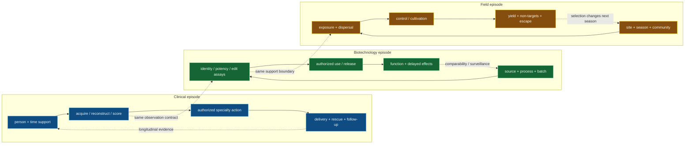

# Clinical specialties and medical/agricultural biotechnology

<!-- markdownlint-disable MD013 -->

- **Audit date:** 2026-08-24
- **Scope:** surgery and perioperative systems, medical imaging, paediatrics,
  psychiatry, obstetrics, dentistry, longitudinal specialty care, gene and cell
  therapies, medical biotechnology, agricultural biotechnology, genome editing,
  diagnostics, biological control, field heterogeneity, evolutionary escape,
  biosafety, and authorization
- **Evidence rule:** a specialty label, image, score, molecular assay, edit call,
  product release result, laboratory phenotype, field observation, and authorized
  use are different records; scientific evidence and normative constraints are
  kept in separate sections
- **Promotion state:** no new principle and no new candidate; nine scoped claims
  are reserved as `C-1386`--`C-1394`, with nine CPU-only synthetic falsification
  contracts
- **Repository effect:** deepen fields that remained adjacent after the clinical
  pathway and biotechnology/process audits; route the surviving refinements to
  existing principles and Candidates 005/007/009/011/012/014/019/020
- **Data boundary:** every experiment below uses generated data. No patient,
  genomic, farm, clinical, or regulatory submission data are required.

## Executive finding

The specialty and biotechnology fields do not supply one new universal
architecture. They expose a recurring error in systems that compress a changing
process into a single label:

1. a perioperative risk estimate does not detect or rescue a complication;
2. a medical image is an acquisition-and-reconstruction product, not a transparent
   view of disease;
3. age, body mass, postmenstrual age, gestational week, symptom composition, and
   lesion activity are not interchangeable severity scalars;
4. a nominal gene or cell therapy is inseparable from manufacturing history,
   composition, potency, administration, and long-term follow-up;
5. a small intended edit does not bound the structural variants that an assay can
   miss; and
6. laboratory efficacy does not determine field efficacy when space, weather,
   species interactions, dispersal, and selection alter the operating regime.

The reusable residue is a **versioned state--operator--action--follow-up packet**.
It stores the state actually observed, how an instrument or process produced it,
the population and time support, the authorized action, and the later evidence
that could falsify the original interpretation. This refines existing work on
observation contracts, endogenous surveillance, operational assurance,
maintenance, authority, and cumulative inheritance. It is not promoted as a
fourteenth principle.



## Normative-source header

- **Normative context:** European Union law and German implementation are the
  project baseline. A cited rule is not an empirical mechanism and does not prove
  safety, efficacy, novelty, or scientific validity.
- **Snapshot:** official sources were checked on 2026-08-24. The stable ELI or
  official consolidated entry is linked so later work can recheck amendments.
- **Applicability:** unresolved until intended purpose, product composition,
  medical-device or medicinal-product classification, actor role, data flow,
  study design, containment/release, crop or animal use, territory, and market
  route are fixed.
- **Separation rule:** the evidence synthesis below describes what the cited
  studies support. The matrix in this section describes candidate legal or
  regulatory hooks. Neither inherits authority from the other.

### EU and German applicability matrix

| Instrument or guidance | Role and current snapshot | Concrete hook; what it does **not** establish |
| --- | --- | --- |
| [Regulation (EU) 2017/745 (MDR)](https://eur-lex.europa.eu/eli/reg/2017/745) | binding EU product law; current consolidated entry checked 2026-08-24 | may apply to imaging, surgical, dental, monitoring, or other software/devices according to intended medical purpose, classification, market role, and use; conformity does not itself prove pathway utility or authorize a clinician's act |
| [Regulation (EU) 2017/746 (IVDR)](https://eur-lex.europa.eu/eli/reg/2017/746) | binding EU product law for in-vitro examination of human specimens and performance studies | may apply to molecular or companion diagnostics; it is not the default route for ordinary radiological images and does not turn analytical performance into treatment benefit |
| [Regulation (EU) 536/2014](https://eur-lex.europa.eu/eli/reg/2014/536) | binding EU clinical-trial law for medicinal products; Articles 32 and 33 add conditions for minors and pregnant or breastfeeding participants | applies through a qualifying interventional medicinal-product trial; trial authorization, consent, assent, and person-level treatment remain distinct |
| [Regulation (EC) 1394/2007](https://eur-lex.europa.eu/eli/reg/2007/1394) and [Directive 2009/120/EC](https://eur-lex.europa.eu/eli/dir/2009/120) | binding ATMP framework and medicinal-product technical definitions | may classify gene therapy, somatic-cell therapy, tissue-engineered, or combined ATMPs; classification is not marketing authorization, batch release, clinical benefit, or permission for an individual administration |
| [EMA investigational-ATMP guideline EMA/CAT/22473/2025](https://www.ema.europa.eu/en/documents/scientific-guideline/guideline-quality-non-clinical-clinical-requirements-investigational-advanced-therapy-medicinal-products-clinical-trials_en.pdf) | current scientific guideline checked 2026-08-24; non-legislative but authoritative for the stated development route | specifies risk-based quality, characterization, potency, comparability, non-clinical, and clinical expectations; it does not make one assay universally sufficient |
| [EMA gene-therapy guideline EMA/CAT/80183/2014](https://www.ema.europa.eu/en/quality-preclinical-clinical-aspects-gene-therapy-medicinal-products-scientific-guideline), [cell-product guideline EMEA/CHMP/410869/2006](https://www.ema.europa.eu/en/documents/scientific-guideline/guideline-human-cell-based-medicinal-products_en.pdf), and [gene-therapy follow-up guideline EMEA/CHMP/GTWP/60436/2007](https://www.ema.europa.eu/en/follow-patients-administered-gene-therapy-medicinal-products-scientific-guideline) | current EMA scientific guidance entries as checked 2026-08-24 | require product- and risk-qualified characterization, comparability, and follow-up; they do not establish that every vector, cell, edit, manufacturing change, or follow-up duration has the same risk |
| [Directive 2001/18/EC](https://eur-lex.europa.eu/eli/dir/2001/18) | binding EU framework for deliberate GMO release and placing qualifying GMOs on the market, subject to scope, amendments, and sectoral law | applies only when its GMO/release/market hooks remain operative; a contained assay, medicinal product, or NGT plant may follow a different or additional route |
| [Directive 2009/41/EC](https://eur-lex.europa.eu/eli/dir/2009/41) | binding EU framework for contained use of genetically modified micro-organisms | activates through qualifying GMM contained use and transposition; containment is not evidence of zero hazard or permission for deliberate release |
| [Regulation (EC) 1829/2003](https://eur-lex.europa.eu/eli/reg/2003/1829) | binding EU authorization framework for GM food and feed | applies to qualifying food/feed products; it does not authorize cultivation, a plant-protection product, a medicinal use, or a field experiment by itself |
| [Regulation (EC) 1107/2009](https://eur-lex.europa.eu/eli/reg/2009/1107) | binding EU framework for approval of active substances and authorization/placing on the market of plant-protection products, including qualifying micro-organisms | a biological-control organism or preparation is not automatically a plant-protection product; intended use, active substance, product, authorization zone, and Member-State decision must be fixed |
| [Regulation (EU) 2026/1388](https://eur-lex.europa.eu/eli/reg/2026/1388/oj) | binding EU lex specialis for certain NGT plants; entered into force in 2026, Articles 29--31 apply from 2026-07-16, most provisions from 2028-07-17 | transition must be recorded: category, organism, technique, product, verification/authorization stage, and application date decide the route; “gene edited” alone does not |
| [Regulation (EU) 2016/2031](https://eur-lex.europa.eu/eli/reg/2016/2031) | binding EU plant-health framework | may govern protective measures, movement, surveillance, and official action for plant pests; it is not a general authorization for biotechnology or biocontrol products |
| [Regulation (EU) 2016/429](https://eur-lex.europa.eu/eli/reg/2016/429) | binding EU animal-health framework | may apply when an animal disease, listed species/pathogen, establishment, movement, surveillance, or control measure is in scope; it does not govern every agricultural-biotechnology experiment |
| [Regulation (EU) 2016/679 (GDPR)](https://eur-lex.europa.eu/eli/reg/2016/679) | binding EU data-protection law | applies to qualifying personal-data processing, with health and genetic data receiving special-category treatment; scientific validity, medical authorization, and product conformity are separate |
| [Regulation (EU) 2024/1689 (AI Act)](https://eur-lex.europa.eu/eli/reg/2024/1689) | binding EU AI framework, consolidated status and staged application to be rechecked for a deployment | a medical-device safety component or other system may be high risk through the exact Article 6/Annex route; an “AI” label alone establishes neither classification nor compliance |
| [MPDG](https://www.gesetze-im-internet.de/mpdg/) | German implementation/enforcement framework for EU medical-device law; official text checked 2026-08-24 | applies according to its EU-device and German actor/activity hooks; it does not replace MDR/IVDR intended-purpose analysis |
| [AMG § 4b](https://www.gesetze-im-internet.de/amg_1976/__4b.html) | German special route for narrowly defined non-routine, individually prescribed ATMP preparation/use in a specialized facility under physician responsibility | the conditions and federal authorization route must all be met; “hospital exemption” is not an exemption from every quality, risk-management, GMO, traceability, or oversight duty |
| [GenTG](https://www.gesetze-im-internet.de/gentg/) | German genetic-engineering implementation framework, including facilities/work, release, placing on the market, care, records, and safety organization according to scope | applies only through its definitions and activity hooks, together with directly applicable/superseding EU law; a research edit call is not a GenTG authorization conclusion |
| [StrlSchG](https://www.gesetze-im-internet.de/strlschg/) and [StrlSchV](https://www.gesetze-im-internet.de/strlschv_2018/) | binding German radiation-protection law and ordinance | apply to qualifying ionizing-radiation activities and medical exposures, including justified indication and actor competence; they do not apply merely because an image exists and do not cover MRI or ultrasound as ionizing modalities |

For an actual product or study, the normative record must additionally identify
the competent authority, German Land implementation where relevant, harmonised
standard/OJ citation, professional law, ethics route, institutional role, and
effective transition date. Those facts cannot be inferred at concept stage.

## Terms that must remain distinct

| Term | Operational meaning | Must not be inferred from |
| --- | --- | --- |
| perioperative risk | predicted probability of a declared event over a declared surgical episode | that a complication will be detected, escalated, staffed, treated, or survived |
| complication | prespecified adverse postoperative state under an observation process | death, preventability, negligence, or failure to rescue |
| failure to rescue | case fatality after a defined complication in a defined population and horizon | complication incidence alone or a universal hospital trait |
| image acquisition | modality, device, protocol, positioning, dose/exposure where relevant, operator, and raw signal path | anatomical truth or a stable input distribution |
| reconstruction | versioned transformation from measured signal to displayed/analyzed image | lossless recovery, pathology, or cross-scanner equivalence |
| image interpretation | observer/model output with target, support, uncertainty, and reference process | clinical utility or an authorized action |
| paediatric support | age/development, size, organ function, disease, formulation, dose, exposure, and response range represented by evidence | a weight-scaled adult or another paediatric subgroup |
| symptom total | declared aggregation of versioned items over a recall interval | a unique symptom configuration, mechanism, diagnosis, impairment, trajectory, or treatment response |
| pregnancy time origin | conception/gestational-age definition, enrollment, treatment start, or another declared zero | exchangeability between pregnancies observed at different stages |
| competing pregnancy event | event such as fetal loss or live birth that changes or ends risk for another endpoint | ordinary independent censoring |
| caries lesion severity | extent/depth/cavitation under a declared method | current activity, future progression, or need for invasive treatment |
| lesion activity | fallible, time-indexed estimate of progression/arrest state | permanent disease identity or perfect gold-standard truth |
| ATMP identity | source-, construct-, process-, composition-, presentation-, and version-qualified product description | potency, purity, viability, comparability, safety, efficacy, or authorization |
| potency | quantitative biological activity related to the claimed mechanism under a qualified assay | clinical effect in every recipient or interchangeability after a process change |
| intended edit | desired sequence outcome at the target locus | absence of mosaicism, large deletion, rearrangement, copy-number change, off-target event, or functional harm |
| analytical non-detection | no event observed above the assay's support and limit | event absence |
| laboratory efficacy | effect in a declared controlled biological system | field effect under new site, season, community, dispersal, management, or evolutionary history |
| biological control | use or support of organisms/biological products to suppress a target under a declared intervention | one regulatory category, guaranteed non-target safety, durable control, or zero evolutionary response |
| authorization | permission under one identified product/activity/actor route | scientific truth, another route's permission, professional authority, consent, execution, or beneficial outcome |

## Mathematical and dimensional contract

### Surgical rescue

For complication indicator $C_i$, death indicator $D_i$, and declared follow-up
horizon $h$, the observed failure-to-rescue proportion is

$$
\widehat{FTR}_h=\frac{\sum_i D_i C_i}{\sum_i C_i}.
$$

It is dimensionless and undefined when no qualifying complication is observed.
Complication incidence $\sum_i C_i/n$ and $\widehat{FTR}_h$ have different
denominators and mechanisms. A model that lowers predicted risk without changing
detection, escalation, capacity, treatment, or case fatality has not improved
rescue.

### Imaging operator

Represent an image as

$$
X=R_{\theta}\!\left(A_{\phi}(S)+\varepsilon\right),
$$

where $S$ is the physical/anatomical state, $A_{\phi}$ the modality/acquisition
operator with device and protocol parameters $\phi$, $R_{\theta}$ the
reconstruction/processing operator and version $\theta$, and $\varepsilon$ noise
and artifact. Pixel intensity is not automatically a comparable physical unit.
Where ionizing radiation is used, exposure/dose quantities retain the appropriate
quantity and unit (for example mGy or mSv); they are not converted into “image
quality points” without a declared model.

### Developmental pharmacokinetics

A falsifiable paediatric clearance generator can use

$$
CL_i=CL_{70}
\left(\frac{W_i}{70\ \mathrm{kg}}\right)^{0.75}
\frac{PMA_i^{\gamma}}{TM_{50}^{\gamma}+PMA_i^{\gamma}}
O_i,
\qquad
AUC_i=\frac{Dose_i}{CL_i},
$$

where $CL_i$ is L/h, $W_i$ kg, postmenstrual age $PMA_i$ and $TM_{50}$ use the
same time unit (weeks), $\gamma$ and organ-function multiplier $O_i$ are
dimensionless, dose is mg, and $AUC$ is mg·h/L. The equation is a synthetic null,
not a universal dosing rule.

### Symptom aggregation

For item vector $\mathbf{x}_t=(x_{1t},\ldots,x_{pt})$, a total
$S_t=\sum_j w_jx_{jt}$ is many-to-one. In general,

$$
S_t(\mathbf{x})=S_t(\mathbf{x}')
\not\Rightarrow
P(Y_{t+1}\mid\mathbf{x})=P(Y_{t+1}\mid\mathbf{x}').
$$

Items, weights, recall interval, missing-item rule, and version are required.

### Competing gestational events

For event time $T$ and event type $J$, report cumulative incidence

$$
F_k(t)=P(T\le t,J=k),
$$

in risks per 100 conceptions or per 100 pregnancies under a declared inception
rule. Treating a healthy live birth or fetal loss as ordinary censoring requires
an assumption that can fail; it cannot be hidden in preprocessing.

### Longitudinal lesion state

Let $Z_t=(A_t,S_t)$ contain latent activity $A_t$ and severity $S_t$ for a tooth
surface, while $O_t$ is the fallible examination or image. A transition model is

$$
P(Z_{t+1}\mid Z_t,U_t,H_t),
\qquad
P(O_t\mid Z_t,M_t),
$$

where $U_t$ is management, $H_t$ exposure/history, and $M_t$ the measurement
method and examiner. Presence at $t$ is not progression per year.

### Living-product quality vector

For batch $b$, retain

$$
Q_b=(I_b,P_b,V_b,B_b,C_b,S_b,H_b),
$$

where identity $I$, purity $P$, viability $V$, biological potency $B$,
composition $C$, sterility/safety attributes $S$, and process/history $H$ keep
their native units and methods. Viable cells/kg, vector copies/cell, percentage
viability, potency-assay units, and dose volume cannot be averaged into one
unitless “quality” score without preserving the components.

### Edit-detection support

For variant class $z$, allele fraction $f$, and assays $j=1,\ldots,m$ with
class-conditional sensitivities $s_j(f,z)$, a conditional independence model
would give

$$
P(\text{all miss}\mid f,z)=\prod_{j=1}^{m}[1-s_j(f,z)].
$$

Shared extraction, alignment, reference, amplification, and sampling roots make
this optimistic unless independence is demonstrated. Variant size is measured in
bp/kb, allele fraction as a proportion, depth in reads, and limit of detection
under a declared specimen and pipeline.

### Field effect and selection

For positive outcome means under intervention and comparator, field effect can be
reported as

$$
\ln RR=\ln\!\left(\frac{\bar Y_I}{\bar Y_C}\right),
$$

with the original unit retained alongside it (for example pests/m², kg/ha, or
non-target individuals/trap-day). For resistance frequency $p(x,t)$,

$$
\frac{\partial p}{\partial t}
=s(x,t)p(1-p)+D\nabla^2p-m(x,t)[p-p_{\mathrm{in}}(x,t)],
$$

where $s$ and $m$ are time$^{-1}$, $D$ is distance²/time, and space/time units
must be declared. This is a test generator, not a forecast for an unmeasured
species or landscape.

## Reserved central claims

| ID | Status | Scoped statement | Evidence boundary |
| --- | --- | --- | --- |
| `C-1386` | established observational/operational boundary | perioperative outcome depends separately on complication occurrence and rescue after complication; a risk score or technically successful procedure does not establish detection, escalation, treatment, or survival | cited surgical studies are observational and do not identify one universal rescue mechanism |
| `C-1387` | established in cited imaging studies | medical-image model performance can depend on acquisition site, device/protocol, reconstruction, and shortcuts; internal discrimination does not establish transport or pathway utility | pneumonia/COVID radiograph results do not quantify every modality or model |
| `C-1388` | established developmental-method boundary | paediatric extrapolation must distinguish size, maturation, organ function, formulation, exposure, disease, and response; linear weight scaling is not generally sufficient | exact maturation/PK functions remain drug-, age-, route-, and population-specific |
| `C-1389` | established measurement boundary | equal psychiatric symptom totals can encode different item configurations, risk factors, impairment, trajectories, and treatment-relevant states | cited depression cohorts do not prove one item-level ontology for all psychiatry |
| `C-1390` | established causal-analysis boundary | obstetric evidence is gestational-time-, inception-, maternal/fetal/infant-endpoint-, and competing-event-qualified; live-birth restriction or censoring can bias effects | simulation magnitudes are scenario-specific; exact clinical effects require suitable data/design |
| `C-1391` | established longitudinal dental boundary | lesion detection/severity and lesion activity/progression are different; one image or exam does not establish current activity, future progression, or treatment need | activity assessments are fallible and examiner/method/population-qualified |
| `C-1392` | established product/development boundary | gene/cell therapy identity, purity, viability, composition, potency, comparability, administration, and long-term outcome are separate evidence axes | regulatory guidance is normative/scientific guidance; CAR-T associations are therapy/population-specific |
| `C-1393` | established in cited editing systems | intended small edits and local amplicon success do not bound on-target structural damage, mosaicism, or off-target events; assay support and shared blind spots must be reported | event frequencies depend on editor, locus, cells, delivery, selection, and assay |
| `C-1394` | established field/evolution boundary | agricultural-biotechnology and biocontrol efficacy is site-, season-, community-, dispersal-, management-, and horizon-qualified, while selection can erode function | cited Bt, gene-drive, and biocontrol evidence does not predict every organism or field |

## Evidence synthesis and transfer cards

### 1. Surgery and perioperative rescue

Ghaferi, Birkmeyer, and Dimick separated postoperative complication rates from
death after a complication across hospitals. In their studied surgical
populations, hospital mortality variation was associated more strongly with
failure to rescue than with large differences in overall complication incidence
([doi:10.1056/NEJMsa0903048](https://doi.org/10.1056/NEJMsa0903048);
[doi:10.1097/SLA.0b013e3181bef697](https://doi.org/10.1097/SLA.0b013e3181bef697)).
These are risk-adjusted observational results, not randomized proof that one
staffing, alert, checklist, or escalation design causes the difference.

- **AI translation:** represent procedure, complication surveillance, detection,
  acknowledgement, escalation, responder capacity, intervention, and verified
  outcome as separate events with clocks.
- **Efficiency mechanism:** allocate monitoring and senior review to state changes
  whose rescue window is closing, while keeping a low-cost ordinary surveillance
  path for all episodes.
- **Mature nulls:** calibrated risk scores, early-warning scores, queueing and
  staffing models, process mining, checklists, explicit escalation protocols,
  survival analysis, and constrained model-predictive control.
- **Measurable prediction:** at equal staffing and alert burden, a typed
  rescue-aware policy should reduce missed rescue windows and death-after-
  complication without increasing unnecessary interventions beyond a frozen
  margin.
- **Failure modes:** label leakage from future interventions; lower apparent
  complication incidence through under-observation; alert flooding; no available
  responder; procedure-mix confounding; and counting transfer as rescue.

### 2. Medical imaging is operator-qualified

Zech and colleagues trained pneumonia classifiers on 158,323 chest radiographs
from three hospital systems and found variable external performance; models could
also identify hospital system and department, exposing acquisition/context signal
([doi:10.1371/journal.pmed.1002683](https://doi.org/10.1371/journal.pmed.1002683)).
DeGrave, Janizek, and Lee showed that studied COVID-19 radiograph models could use
acquisition-related shortcuts rather than pathology signal
([doi:10.1038/s42256-021-00338-7](https://doi.org/10.1038/s42256-021-00338-7)).
These results establish concrete failure modes, not that all imaging AI fails or
that attribution maps certify mechanism.

- **AI translation:** bind every image to modality, device, site, protocol,
  positioning, dose/exposure where applicable, reconstruction and preprocessing
  versions, acquisition time, operator, and reference process.
- **Efficiency mechanism:** detect unsupported operator/domain changes before
  expensive inference or downstream work; use targeted reacquisition or human
  review instead of universal maximum-compute processing.
- **Mature nulls:** scanner/site-stratified validation, ComBat/domain adjustment,
  calibration, invariant-risk minimization, explicit artifact detectors, causal
  feature tests, ordinary quality assurance, radiologist review, and test-and-act
  clinical trials.
- **Measurable prediction:** a support-gated system should preserve calibration
  and decision utility under held-out acquisition/reconstruction combinations and
  abstain on planted shortcut-only cases.
- **Failure modes:** random image-level split of the same person/site; duplicated
  images; label source encoded in borders or metadata; reference-standard drift;
  post-treatment images; dose omitted; and accuracy credited without workflow
  action or patient-relevant outcome.

### 3. Paediatric development is not linear weight scaling

Back and colleagues fitted population-PK models for cyclosporine, phenobarbital,
and vancomycin and found size plus maturation functions useful particularly for
neonates and infants, while the exact models and data were drug-specific
([doi:10.3390/pharmaceutics11060259](https://doi.org/10.3390/pharmaceutics11060259)).
Chang and colleagues incorporated age-related physiological changes into a
paediatric antibody PBPK model evaluated with infliximab cohorts
([doi:10.1111/bcp.14963](https://doi.org/10.1111/bcp.14963)). The EMA-adopted ICH
E11A guideline, effective 2025-01-25, treats paediatric extrapolation as an
iterative evidence/gap process rather than automatic borrowing
([EMA/CHMP/ICH/205218/2022](https://www.ema.europa.eu/en/ich-guideline-e11a-pediatric-extrapolation-scientific-guideline)).

- **AI translation:** gate borrowing by mechanistic similarity and explicit age,
  maturation, organ-function, formulation, exposure, endpoint, and disease-state
  support; retain assent/consent and changing authority separately.
- **Efficiency mechanism:** borrow only parameters supported by similarity, while
  directing new observation to gaps that dominate decision uncertainty.
- **Mature nulls:** allometric/maturation population PK, PBPK, hierarchical
  Bayesian borrowing, model-based meta-analysis, Gaussian processes, conformal
  prediction, and no-borrowing subgroup models.
- **Measurable prediction:** selective borrowing should lower exposure-target
  error versus linear mg/kg and no-borrowing nulls while maintaining nominal
  interval coverage in every developmental stratum.
- **Failure modes:** chronological age substituted for postmenstrual age; weight
  and maturation confounded; adult formulation assumed equivalent; sparse organ
  function; puberty/disease shifts; and mean exposure hiding tail toxicity.

### 4. Psychiatric totals erase configuration and time

Fried and colleagues found that individual depression symptoms had different
risk-factor associations in a longitudinal cohort
([doi:10.1017/S0033291713002900](https://doi.org/10.1017/S0033291713002900)). In
STAR*D data, Fried and Nesse reported many distinct symptom profiles among people
meeting a common depressive-disorder threshold
([doi:10.1016/j.jad.2014.10.010](https://doi.org/10.1016/j.jad.2014.10.010)).
This supports the information-loss boundary of a sum score; it does not prove
that a symptom network, one biological mechanism, or item-level personalization
is automatically valid.

- **AI translation:** retain item vector, missingness, recall interval, rater,
  context, functional impairment, safety-critical items, trajectory, treatment,
  and observation opportunity instead of storing only a total.
- **Efficiency mechanism:** update only components whose evidence changed and
  route high-risk configurations directly, avoiding repeated full assessment
  when stable components remain supported.
- **Mature nulls:** validated total/subscale scores, item-response theory, latent
  class/state-space models, symptom networks, hidden Markov models, survival and
  mixed-effects trajectories, and clinician review.
- **Measurable prediction:** a configuration-aware model should improve held-out
  transition calibration and protected-event recall among equal-total profiles,
  not merely reconstruct the total.
- **Failure modes:** diagnosis treated as ground-truth mechanism; item drift;
  rater/setting leakage; treatment changes observation; crisis events diluted in
  a mean; missing item coded absent; and subgroup discovery without replication.

### 5. Obstetric evidence has a gestational clock and competing endpoints

Latour and colleagues used 2,000 Monte Carlo cohorts of 7,500 conceptions across
12 treatment profiles and showed that censoring healthy live births instead of
treating them as competing events could severely bias absolute risks and some
treatment contrasts in the simulated scenarios
([doi:10.1111/ppe.70043](https://doi.org/10.1111/ppe.70043)). Raz and colleagues
simulated live-birth selection and showed scenario-dependent bias in prenatal
exposure associations
([doi:10.1289/EHP7961](https://doi.org/10.1289/EHP7961)). These are causal-method
demonstrations, not estimates for every real pregnancy or intervention.

- **AI translation:** represent maternal, fetal, placental, delivery, neonatal,
  and later infant endpoints separately on a gestational clock, including entry,
  loss, live birth, competing risks, treatment changes, and observation support.
- **Efficiency mechanism:** schedule observation and analysis around decision
  windows and endpoint risk sets rather than repeatedly scoring completed or no-
  longer-at-risk episodes.
- **Mature nulls:** cause-specific hazards, Aalen--Johansen cumulative incidence,
  multi-state models, target-trial emulation, g-formula/IPW, joint longitudinal-
  survival models, and explicit composite endpoints.
- **Measurable prediction:** a competing-event-aware estimator should recover
  planted absolute risks and treatment effects across altered gestational entry
  and loss mechanisms while naive censoring fails calibrated coverage.
- **Failure modes:** conditioning on live birth; immortal time; gestational-age
  misclassification; maternal benefit hiding fetal harm or vice versa; composite
  dominated by a common low-severity component; and loss to follow-up treated as
  healthy outcome.

### 6. Dentistry requires lesion activity and progression, not presence alone

Nyvad, Machiulskiene, and Baelum reported reliability of criteria separating
active and inactive cavitated and non-cavitated caries lesions
([doi:10.1159/000016526](https://doi.org/10.1159/000016526)) and evaluated their
construct/predictive validity longitudinally
([doi:10.1177/154405910308200208](https://doi.org/10.1177/154405910308200208)).
The work supports the activity/severity distinction but also leaves examiner,
population, follow-up, and imperfect-reference uncertainty visible.

- **AI translation:** track each surface/lesion through detection, severity,
  activity, management, exposure, restoration, and subsequent progression;
  preserve examiner and imaging operator.
- **Efficiency mechanism:** allocate imaging, preventive support, and invasive
  review according to estimated progression risk and uncertainty rather than
  repeatedly treating every detected lesion as active.
- **Mature nulls:** visual-tactile activity criteria, ICDAS/ICCMS-like staging,
  interval-censored multi-state models, survival analysis, calibrated image
  classifiers, and risk-based recall protocols.
- **Measurable prediction:** a longitudinal activity model should reduce
  unnecessary simulated irreversible interventions at non-inferior progression
  and pain/infection risk under equal examinations.
- **Failure modes:** restoration used as disease ground truth; active/inactive
  state assumed permanent; tooth-surface dependence ignored; examiner drift;
  radiographic severity mistaken for activity; and access-related missing visits
  treated as no progression.

### 7. Gene and cell therapies are process-qualified living products

Fraietta and colleagues associated pre-infusion CAR-T-cell product phenotypes
and functional signatures with response in a small chronic-lymphocytic-leukaemia
cohort
([doi:10.1038/s41591-018-0010-1](https://doi.org/10.1038/s41591-018-0010-1)).
This is scoped association, not a universal causal release criterion. EMA
guidance separately requires characterization, potency related to the proposed
mechanism, comparability after process/site changes, safety, and longitudinal
follow-up. Regulation (EC) 1394/2007 and German AMG § 4b provide different legal
routes with distinct hooks; neither makes a nominal construct or cell count a
complete product description.

- **AI translation:** make the learned artifact inseparable from source,
  manufacturing/data lineage, composition, functional potency, release version,
  delivery, recipient/context, and delayed surveillance.
- **Efficiency mechanism:** use multi-stage gates so cheap identity/viability
  checks precede expensive potency and deep characterization, while change-risk
  directs comparability work.
- **Mature nulls:** statistical process control, design of experiments, multivariate
  release specifications, QbD, mechanistic potency assays, mixed-effects outcome
  models, Bayesian hierarchical comparability, and ordinary change control.
- **Measurable prediction:** a process-aware multivariate gate should detect
  planted potency failures and non-comparable process shifts missed by nominal
  identity/cell-count release without excessive false batch rejection.
- **Failure modes:** post-selection leakage; surrogate potency unlinked to
  mechanism; donor/process confounding; viability measured at the wrong time;
  batch pooling; administration deviations; loss of traceability; and delayed
  events outside the follow-up budget.

### 8. Intended gene edits do not bound realized genome outcomes

GUIDE-seq demonstrated variable, previously unrecognized off-target cleavage
across 13 RNA-guided nucleases in two human cell lines
([doi:10.1038/nbt.3117](https://doi.org/10.1038/nbt.3117)). Kosicki, Tomberg, and
Bradley observed large on-target deletions and complex rearrangements after
CRISPR--Cas9 breaks in the studied mouse and human cells
([doi:10.1038/nbt.4192](https://doi.org/10.1038/nbt.4192)). Leibowitz and
colleagues observed micronuclei/chromosome-bridge processes and chromothripsis in
model and clinically relevant edited cells
([doi:10.1038/s41588-021-00838-7](https://doi.org/10.1038/s41588-021-00838-7)).
Frequencies are editor-, target-, cell-, delivery-, selection-, time-, and assay-
specific.

- **AI translation:** a local patch/test pass cannot certify a large artifact;
  verification must combine orthogonal operators whose support covers local,
  structural, copy-number, lineage/mosaic, and functional failure classes.
- **Efficiency mechanism:** adaptive assay allocation starts with broad low-cost
  screens and spends deep verification on uncertainty, high-risk loci/classes,
  discordance, and process changes.
- **Mature nulls:** amplicon and long-range sequencing, long reads, optical or
  cytogenetic structural assays, copy-number methods, unbiased DSB assays,
  single-cell/clone analysis, functional tests, and ensemble defect detection.
- **Measurable prediction:** an operator-aware assay portfolio should attain
  calibrated class-conditional detection at lower total read/work cost than
  uniform maximum-depth sequencing, while never treating correlated assays as
  independent evidence.
- **Failure modes:** primer dropout; reference/alignment blindness; clonal
  selection removes damaged cells; bulk allele fraction hides mosaicism; assay
  design uses the intended edit as the only hypothesis; shared extraction roots;
  and functional rescue hiding structural damage.

### 9. Agricultural biotechnology and biological control operate in fields that evolve

Karp and a large international collaboration found inconsistent pest and natural-
enemy responses to surrounding landscape composition across a global database,
making simple landscape generalization unreliable
([doi:10.1073/pnas.1800042115](https://doi.org/10.1073/pnas.1800042115)). A
meta-analysis of 99 sub-Saharan African studies reported average benefits of
several biological-control interventions but substantial heterogeneity across
outcomes and moderators
([doi:10.1098/rspb.2022.1695](https://doi.org/10.1098/rspb.2022.1695)). Field and
laboratory evidence reviewed by Tabashnik, Brévault, and Carrière documents both
delayed and evolved resistance to Bt crops under system-dependent conditions
([doi:10.1038/nbt.2597](https://doi.org/10.1038/nbt.2597)). Unckless, Clark, and
Messer modelled how resistant alleles can prevent or reverse CRISPR gene-drive
spread under declared assumptions
([doi:10.1534/genetics.116.197285](https://doi.org/10.1534/genetics.116.197285)).

- **AI translation:** evaluate adaptive modules in spatially heterogeneous,
  interacting populations where intervention changes the future opponent and
  monitoring support; retain non-target and neighboring-system effects.
- **Efficiency mechanism:** target sensing and action to informative patches and
  emerging escape fronts rather than uniformly sampling or applying maximal
  control everywhere.
- **Mature nulls:** hierarchical field trials, spatial GLMMs, reaction--diffusion
  and metapopulation models, integrated pest management, refuges/rotation/mixtures,
  robust MPC, Bayesian experimental design, and resistance surveillance.
- **Measurable prediction:** a heterogeneity- and evolution-aware policy should
  improve worst-site yield/control and delay resistance under equal treatment,
  monitoring, labor, and ecological budgets versus mature IPM and robust-control
  nulls.
- **Failure modes:** pseudoreplication by plot; one season; average yield hiding
  site failures; immigration/source populations omitted; natural enemies counted
  without function; non-target effects missing; refuge non-compliance; and a lab
  response called durable field control.

## Deduplication and routing

| Residue from this audit | Existing claim/principle/candidate and mature null | Result after deduplication |
| --- | --- | --- |
| risk versus complication rescue | [C-1359](../claims.md#c-1359), [C-1364](../claims.md#c-1364), [P-002](../principle-registry.md#p-002--local-autonomy-with-exception-escalation), Candidates [005](../../experiments/candidates/005-severity-ordered-containment.md), [011](../../experiments/candidates/011-dual-loop-operational-assurance.md), and [012](../../experiments/candidates/012-latency-qualified-authority.md); early-warning, staffing, queueing, workflow nulls | `C-1386` adds only complication-versus-rescue denominators and rescue-window capacity |
| image operator and shortcuts | [C-1354](../claims.md#c-1354), [Candidate 007](../../experiments/candidates/007-endogenous-observation-surveillance.md), [Candidate 014](../../experiments/candidates/014-versioned-observation-contract.md); ordinary external validation and imaging QA | `C-1387` narrows the observation contract to acquisition/reconstruction/site support; no imaging principle |
| paediatric maturation and borrowing | [pharmacology/toxicology audit](2026-08-05-pharmacology-toxicology.md), [C-1356](../claims.md#c-1356), [P-012](../principle-registry.md#p-012--memory-matched-to-information-lifetime), Candidate 014; population PK/PBPK/hierarchical borrowing | `C-1388` adds developmental support and gap-directed borrowing, not a dosing architecture |
| psychiatric item configurations | [Candidate 014](../../experiments/candidates/014-versioned-observation-contract.md), [P-003](../principle-registry.md#p-003--temporary-trace-before-commitment), [P-013](../principle-registry.md#p-013--externalized-shared-state); IRT, latent state, network, trajectory nulls | `C-1389` preserves item configuration, timing, impairment, and protected items; no claim that one representation is biologically true |
| gestational competing risks | [C-1355](../claims.md#c-1355), [C-1356](../claims.md#c-1356), Candidate 007/014; standard competing-risk, multi-state, and g-method nulls | `C-1390` adds conception/entry clock and maternal--fetal--infant endpoint support |
| dental lesion activity | [C-1354](../claims.md#c-1354), [P-006](../principle-registry.md#p-006--homeostatic-negative-feedback), Candidate 007/014; longitudinal caries criteria and multi-state models | `C-1391` adds severity/activity/progression separation; no diagnostic novelty claim |
| living-product/process identity | [C-1282](../claims.md#c-1282), [C-1369](../claims.md#c-1369), [P-009](../principle-registry.md#p-009--maintenance-plane), Candidates 009/011/014/019; QbD, SPC, potency and comparability nulls | `C-1392` specializes lineage/qualification to identity--potency--administration--follow-up |
| structural edit verification | [Candidate 009](../../experiments/candidates/009-graded-assurance-envelopes.md), [Candidate 010](../../experiments/candidates/010-reset-coupled-staged-verification.md), [Candidate 014](../../experiments/candidates/014-versioned-observation-contract.md); orthogonal sequencing/cytogenetic/functional nulls | `C-1393` adds class-conditional assay support and shared-blind-spot accounting |
| field heterogeneity and escape | [C-1284](../claims.md#c-1284), [C-1286](../claims.md#c-1286), [P-004](../principle-registry.md#p-004--diversity-selection-and-protection), Candidates 007/019; IPM, hierarchical field trials, spatial/evolutionary nulls | `C-1394` unifies site/season/community transport with selection and non-target endpoints, without a new principle |

### Diagnostic and authorization coverage that does not create another claim

- Molecular/companion diagnostics remain governed by the complete
  test--interpret--authorize--act--monitor boundary in [C-1354](../claims.md#c-1354)
  and the IVDR intended-purpose route. Imaging software generally enters MDR,
  not IVDR, when its medical-device hook is met.
- Product conformity, clinical-trial authorization, marketing authorization,
  hospital-exemption permission, GMO containment/release, plant-product
  authorization, professional authority, consent/assent, and executed use remain
  separate states under [C-1360](../claims.md#c-1360).
- Plant-health and animal-health rules are included as activity-specific candidate
  hooks, not as generic biotechnology approvals.
- Regulation (EU) 2026/1388 receives a version/application-state field so an NGT
  plant cannot be routed according to rules that are in force but not yet
  applicable to that provision.

## CPU-only synthetic falsification package

These contracts are copy-ready experiment specifications, not executable results.
They deliberately compare the proposed transfer with mature statistical,
clinical, engineering, and biological nulls. A candidate is rejected, not merely
“inconclusive,” when the best complete null is equivalent at equal or lower cost.

### Frozen common contract

#### Runtime and data

- **Hardware:** CPU only; no GPU, accelerator, network, external API, patient
  record, genomic read, image, or farm dataset. Maximum 8 logical CPU threads and
  16 GiB peak resident memory per run.
- **Software record:** operating system, CPU model, logical-thread limit, runtime,
  package lock digest, source commit, generator version, arm version, and command
  are written before a run.
- **Development seeds:** `101, 211, 307, 401, 503, 601, 701, 809`. They may be
  inspected and are never included in confirmatory statistics.
- **Confirmatory seeds:** `104729, 130363, 155921, 196613, 262147, 327673,
  393241, 458807, 524309, 589853, 655373, 720917, 786433, 851969, 917503,
  983063, 1048583, 1114129, 1179649, 1245191, 1310719, 1376257, 1441793,
  1507321` (24 paired worlds).
- **Randomness:** a world seed fixes latent states, exogenous events, observation
  opportunities, and splits for every arm. Arm randomness is derived as
  `SHA-256(protocol_id || arm_id || world_seed)[0:8]`; arms cannot perturb the
  shared world stream.
- **Freeze:** generator source/digest, distribution table, target estimands,
  splits, arms, tuning grid, metrics, margins, and artifact schema are frozen
  before any confirmatory seed is opened.

#### Resource and lifecycle parity

Every arm receives the same training observations, event-time availability,
action catalogue, abstention option, authorization constraints, and follow-up.
Charge generator-independent training and inference CPU-s, wall-s, peak MiB,
serialized model bytes, input bytes, human/reviewer-equivalent minutes, number and
cost of assays/examinations/actions, rescue/fallback work, and synthetic delayed
harm. An arm may use less than the cap but not borrow hidden labels, future data,
unpriced review, or a richer action set.

Resource ratios are computed against the best eligible mature null on the same
seed. A claimed efficiency gain fails if median CPU-s, peak MiB, or domain-specific
work exceeds `1.05×` without a preregistered Pareto improvement, or if any arm
times out on more than one of 24 seeds. The default timeout is 30 CPU-min per arm
per seed; a protocol may set a smaller cap.

#### Confirmatory analysis

1. Compute paired seed differences against the best eligible mature null selected
   using development seeds only.
2. Report mean, median, all 24 seed values, a paired 95% percentile-bootstrap CI
   with 100,000 deterministic resamples, and the worst stress-family result.
3. Control the nine protocol-level primary superiority tests by Holm at familywise
   $\alpha=0.05$. Non-inferiority/safety margins must pass independently and are
   not rescued by multiplicity adjustment.
4. Promotion requires the protocol-specific effect, at least 18/24 seeds in the
   favorable direction, benefit in at least 4/5 declared stress families, all
   safety margins, calibration/support gates, and lifecycle parity.
5. Rejection occurs if a mature null lies within the protocol's equivalence margin
   at equal/lower cost, any protected threshold fails, a result depends on leakage
   or an uncharged resource, or benefit is absent in two or more stress families.
6. No synthetic result is promoted as clinical, biological, field, safety, or
   regulatory evidence. It can only support implementation/testing of the
   computational transfer.

#### Required artifact tree

Each protocol writes the following under
`artifacts/wave5-clinical-biotech/<protocol-id>/`:

```text
manifest.json
preregistration.json
generator-spec.json
environment.json
arm-registry.json
seed-<seed>/world.sha256
seed-<seed>/split.json
seed-<seed>/<arm>/predictions.parquet
seed-<seed>/<arm>/events.parquet
seed-<seed>/<arm>/resources.json
seed-<seed>/<arm>/metrics.json
paired-seed-metrics.csv
confidence-intervals.json
stress-family-summary.csv
failures.jsonl
report.md
plots/*.svg
```

`manifest.json` contains SHA-256, byte size, media type, producer command, seed,
and parent files for every artifact. Raw per-unit generated states needed to
recompute metrics are retained; plots alone are not evidence.

### W5-CSB-01 — Perioperative risk-to-rescue closure

- **Claim tested:** `C-1386`.
- **Question/unit:** can a policy reduce death after a rescuable synthetic
  complication by closing detection--acknowledgement--capacity--action gaps, not
  by relabelling complications? Unit of assignment/analysis is one operation;
  capacity and interference are hospital-shift clustered.
- **Generator:** 30,000 operations per seed across 24 hospitals, five procedure
  families, and a 72 h postoperative horizon in 15 min steps. Generate baseline
  risk, procedure duration, 8--35% complication incidence, 2--24 h rescue windows,
  noisy/varying observations, staffing queues, competing urgent work,
  contraindications, false alarms, transfer delay, and unrescuable events. The
  simulator stores potential outcome under each feasible time of rescue.
- **Split/shift:** train on 14 hospitals and three procedure families; tune on
  four hospitals; test on six hospitals plus two unseen procedure families.
  Stress families are low staffing, high false-alarm noise, delayed observations,
  altered case mix, and correlated complications.
- **Arms:** (A) calibrated preoperative risk plus fixed monitoring; (B) NEWS-like
  threshold/explicit escalation; (C) discrete-time survival model plus first-
  come queue; (D) risk-priority queue with capacity reservation; (E) constrained
  POMDP/MPC using the same state; (F) Candidate 005/007/011/012 composition; (G)
  proposed typed rescue packet. A risk-only arm is not accepted as the strongest
  null.
- **Primary metrics:** missed rescuable deaths per 10,000 operations and
  death-after-complication per 1,000 complications. Secondary: complication
  sensitivity, median detection and acknowledgement minutes, fraction rescued
  before deadline, unnecessary actions/operation, alerts/clinician-hour,
  blocked appropriate actions, queue delay minutes, calibration, and total cost.
- **Promotion gate:** versus the best null, at least 20% relative reduction in
  missed rescuable deaths with CI below `-10%`; at least 1.0 fewer deaths per
  1,000 complications with CI below `0`; unnecessary interventions no more than
  `+0.20/100` operations, alerts no more than `+0.10` per clinician-hour, and no
  procedure/hospital stress family worsens death by more than `0.5/1,000`.
- **Rejection/kill:** reject if gains arise from fewer recorded complications,
  future-treatment leakage, extra responder capacity, or risk-score improvement
  without rescue improvement; retire the transfer if arm D, E, or F is equivalent
  within `1 death/10,000` and `5 min` at equal/lower cost.
- **Additional artifacts:** `rescue-windows.parquet`, `queue-traces.parquet`,
  `counterfactual-rescuability.parquet`, and plots of cumulative detection,
  queue occupancy, and FTR by hospital/procedure.

### W5-CSB-02 — Imaging operator, shortcut, and transport challenge

- **Claim tested:** `C-1387`.
- **Question/unit:** can a system identify pathology signal and unsupported
  acquisition/reconstruction combinations rather than exploit site artifacts?
  Unit is one person episode; repeated images stay in one split.
- **Generator:** 80,000 synthetic 64×64 scalar images per seed from latent
  geometric lesions and anatomy-like backgrounds. Cross eight acquisition
  operators (gain, blur, crop, rotation, noise, positioning), six reconstruction
  operators, four prevalence regimes, and site-specific border/text/metadata
  shortcuts. Plant shortcut-positive/pathology-negative and shortcut-negative/
  pathology-positive counterfactual pairs. Include a decision with benefit/harm,
  authorization delay (minutes), and optional reacquisition cost.
- **Split/shift:** five sites train, one tunes, two test; the external test also
  contains unseen acquisition×reconstruction recombinations. Stress families are
  shortcut reversal, prevalence shift, lower signal-to-noise ratio, reconstruction
  change, and delayed reference labels.
- **Arms:** (A) logistic model on image summary features; (B) random forest; (C)
  small CPU convolutional ERM model; (D) site-stratified calibration plus artifact
  detector; (E) augmentation/domain-generalization model; (F) causal-feature
  counterfactual filter; (G) Candidate 007/014 support gate; (H) proposed operator-
  qualified packet. All image arms receive identical pixels and metadata fields.
- **Primary metrics:** worst-domain Brier score and decision net benefit per 1,000
  episodes at frozen thresholds. Secondary: AUROC, ECE, sensitivity at fixed 90%
  specificity, counterfactual consistency, OOD detection AUROC, abstention,
  reacquisition, minutes to authorized action, and CPU/J-like measured work proxy.
- **Promotion gate:** at least 10% lower worst-domain Brier score (CI below `-5%`)
  and at least 5 net beneficial decisions/1,000 (CI above `0`) versus the best
  null; ECE `≤0.03`; unseen-domain sensitivity no more than 2 percentage points
  below internal sensitivity; shortcut-only balanced accuracy `≤0.55`; detect at
  least 90% of unsupported operator combinations at no more than 10% false OOD.
- **Rejection/kill:** reject any person/site leakage, hidden metadata advantage,
  pathology reference derived from the same shortcut, or utility claim from AUROC
  alone; retire if D--G match within Brier `0.005` and 2 decisions/1,000 at lower
  cost.
- **Additional artifacts:** `operator-registry.json`,
  `counterfactual-pairs.parquet`, `support-decisions.parquet`, calibration plots,
  and per-operator confusion matrices.

### W5-CSB-03 — Development-qualified paediatric extrapolation

- **Claim tested:** `C-1388`.
- **Question/unit:** does selective developmental borrowing recover exposure and
  response without treating a child as a linearly scaled adult? Unit is a
  synthetic treatment episode; drug and developmental stratum are prespecified.
- **Generator:** 60,000 profiles per seed across three synthetic drugs, oral and
  intravenous routes, gestational age 24--42 weeks, postnatal age 0--18 years,
  weight 0.5--100 kg, organ-function multiplier 0.25--1.5, two formulations,
  disease effects, adherence, one- and two-compartment PK, saturable maturation,
  exposure--efficacy and exposure--toxicity curves, sparse/irregular samples, and
  assay noise. The true equations vary by drug; only one exactly matches the
  displayed common equation.
- **Split/shift:** adult and older-child evidence is abundant; neonates, infants,
  renal impairment, formulation change, and one drug×age combination are held
  out. Stress families are preterm neonates, organ impairment, formulation
  bioavailability shift, disease-dependent clearance, and sparse sampling.
- **Arms:** (A) adult dose; (B) linear mg/kg; (C) fixed 0.75 allometry; (D)
  allometry plus estimated maturation; (E) population PK nonlinear mixed effects;
  (F) PBPK; (G) hierarchical Bayesian borrowing with similarity diagnostics; (H)
  Candidate 014 support gate; (I) proposed gap-directed borrowing. Misspecified
  and correctly specified conventional models are both retained.
- **Primary metrics:** absolute AUC error (mg·h/L, normalized per drug) and target-
  exposure attainment. Secondary: 95% predictive-interval coverage, toxic-
  exposure probability, efficacy, dose mg/kg, samples/episode, abstention,
  subgroup calibration, and compute/assay cost.
- **Promotion gate:** at least 15% lower median normalized absolute AUC error (CI
  below `-7.5%`) and at least 5 percentage points more target attainment versus
  the best transportable null; 95% interval coverage 92--98% in every declared
  developmental stratum; toxic-exposure risk no more than `+0.5/100`; and at
  least 80% abstention/escalation on planted no-support profiles.
- **Rejection/kill:** reject if postmenstrual age is reconstructed from leaked
  clearance, if sampling differs by arm, if average attainment hides a stratum
  safety failure, or if exact generator form is hard-coded; retire if population
  PK/PBPK/hierarchical nulls are within 2% attainment and 5% AUC error at lower
  cost.
- **Additional artifacts:** `pk-trajectories.parquet`, `dose-decisions.parquet`,
  `support-map.parquet`, and exposure/coverage plots by drug, route, and stratum.

### W5-CSB-04 — Equal-total psychiatric state challenge

- **Claim tested:** `C-1389`.
- **Question/unit:** does retaining item configuration and observation history
  improve state-transition and protected-event prediction among equal-total
  profiles? Unit is one person trajectory; the experiment makes no diagnostic or
  treatment recommendation for a real person.
- **Generator:** 50,000 trajectories per seed, 12 ordinal items scored 0--3, 20
  weekly observations, four latent processes, context/rater effects, item-specific
  impairment, a rare protected event, treatment changes, informative visits, and
  missing items. Force matched sets with identical totals but different latent
  states and next-week risks. Include worlds where totals truly are sufficient.
- **Split/shift:** split by person and site. Hold out rater style, treatment-policy
  change, one item-version change, and a new context distribution. Stress families
  are rater shift, item drift, informative observation, treatment feedback, and
  genuinely total-sufficient worlds.
- **Arms:** (A) total-score threshold; (B) total-score logistic/mixed model; (C)
  item-response model; (D) latent class analysis; (E) HMM/state-space model; (F)
  symptom-network predictor; (G) Candidate 014 versioned item record; (H) proposed
  item/configuration packet. All models get the same item data except the declared
  total-only ablations.
- **Primary metrics:** one-week transition log loss within equal-total matched
  sets and protected-event recall at a frozen 5% false-alert rate. Secondary:
  multiclass Brier score, ECE, time-to-event error, impairment MAE, missing-state
  calibration, abstention, alerts/person-year, and update cost.
- **Promotion gate:** at least 10% lower matched-set log loss (CI below `-5%`) and
  protected-event recall at least `+0.08` (CI above `+0.03`) at false-alert rate
  within `±0.005`; ECE `≤0.03`; no site/context recall drop greater than 0.05; and
  correctly collapse to equivalence with the total in total-sufficient worlds.
- **Rejection/kill:** reject if rare-event labels leak through future care,
  missing means absent, a post-hoc cluster is treated as truth, or configuration
  wins only by more parameters/data; retire if IRT/HMM nulls are within log loss
  `0.01` and recall `0.02` at lower cost.
- **Additional artifacts:** `matched-equal-total.parquet`, `item-versions.json`,
  `observation-opportunities.parquet`, and calibration/transition plots.

### W5-CSB-05 — Gestational competing-event and dyadic-endpoint recovery

- **Claim tested:** `C-1390`.
- **Question/unit:** can an analysis recover maternal, fetal, delivery, and infant
  absolute risks when entry, treatment, loss, and live birth change risk sets?
  Unit is a conception under a declared inception rule.
- **Generator:** 100,000 conceptions per seed in gestational weeks 4--42, with
  staggered recognition/enrollment, time-varying treatment, adherence,
  preeclampsia-like maternal event, fetal loss, healthy live birth, preterm birth,
  small-for-gestational-age outcome, maternal adverse event, and infant follow-up.
  Treatment affects at least two competing events; observation/loss depends on
  history. Store exact potential outcomes for 12 frozen treatment profiles.
- **Split/shift:** fit on weeks 8--20 enrollment and one observation system; test
  early/late entry, altered pregnancy recognition, loss to follow-up, baseline
  risk, and treatment timing. Those five form the stress families.
- **Arms:** (A) live-birth complete cases; (B) Kaplan--Meier censoring competing
  events; (C) cause-specific hazards; (D) Aalen--Johansen; (E) Fine--Gray for its
  appropriate estimand; (F) multi-state g-formula/IPW; (G) joint longitudinal-
  event model; (H) Candidate 007/014 support record; (I) proposed gestational
  packet. Each must state its estimand rather than compare unlike quantities.
- **Primary metrics:** maximum absolute bias in 42-week cumulative incidence and
  treatment risk difference, both per 100 conceptions. Secondary: 95% coverage,
  integrated Brier score, maternal/fetal component risks, competing-event mass
  closure, support-violation detection, abstention, and compute cost.
- **Promotion gate:** absolute bias `≤0.5/100` and at least 50% lower than the best
  misspecified null; 95% coverage 93--97% for every registered estimand; event-
  probability mass error `≤0.002`; and at least 95% detection of planted estimand/
  risk-set mismatches. Superiority over a correctly specified Aalen--Johansen or
  g-formula null is required for architectural promotion.
- **Rejection/kill:** reject if the denominator silently changes, live birth/loss
  becomes ordinary censoring without justification, a composite hides component
  harm, or gestational time is replaced by record time; retire if D or F matches
  within `0.25/100` bias and 2% cost-adjusted score.
- **Additional artifacts:** `risk-sets.parquet`, `competing-events.parquet`,
  `estimand-registry.json`, and cumulative-incidence/component-effect plots.

### W5-CSB-06 — Longitudinal caries activity and irreversible-action test

- **Claim tested:** `C-1391`.
- **Question/unit:** can a system distinguish detection, severity, activity, and
  progression while reducing unnecessary irreversible actions? Unit is a tooth
  surface nested within person; intervention is evaluated at person level with
  surface dependence retained.
- **Generator:** 12,000 people per seed, 28 permanent teeth with five surfaces
  where applicable, 10 visits over four years, latent active/inactive transitions,
  lesion depth/cavitation, fluoride/hygiene-like exposure, preventive management,
  restoration, pain/infection, surface adjacency, examiner error, radiographic
  acquisition shift, access-related missing visits, and restoration-as-censoring.
- **Split/shift:** hold out people and clinics, not surfaces. Stress families are
  examiner drift, low access, acquisition change, altered baseline activity, and
  treatment-policy change.
- **Arms:** (A) detected-lesion immediate treatment; (B) severity threshold; (C)
  calibrated visual/activity rule; (D) Cox/interval-censored progression model;
  (E) multi-state Markov; (F) hidden Markov model with examiner error; (G)
  Candidate 007/014 record; (H) proposed lesion-state packet.
- **Primary metrics:** irreversible treatments per 100 initially non-cavitated
  surfaces, with four-year cavitation/progression as protected endpoint. Secondary:
  pain/infection per 100 people, active-state Brier score, progression calibration,
  time to preventive action, examinations and images/person-year, overtreatment,
  undertreatment, abstention, and total work.
- **Promotion gate:** at least 20% fewer irreversible actions (CI below `-10%`)
  while progression is non-inferior within `+0.5/100` surfaces and pain/infection
  within `+0.2/100` people; active-state ECE `≤0.04`; benefit in all access and
  examiner strata; no extra imaging beyond `+0.05/person-year`.
- **Rejection/kill:** reject restoration as lesion truth, surface-level leakage,
  missing visit as arrest, or radiographic severity as activity; retire if the
  calibrated activity rule or multi-state/HMM null is within 5% treatment and
  `0.25/100` progression at lower cost.
- **Additional artifacts:** `surface-lineage.parquet`, `examiner-operators.json`,
  `management-events.parquet`, and state-transition/overtreatment plots.

### W5-CSB-07 — ATMP process, potency, and comparability gate

- **Claim tested:** `C-1392`.
- **Question/unit:** can a multivariate process-aware gate detect non-potent or
  non-comparable synthetic batches without converting product identity into
  clinical outcome? Unit is one manufactured batch; downstream recipients are a
  nested synthetic follow-up process.
- **Generator:** 15,000 batches per seed across 10 sites, 30 donors/source lots,
  three constructs, 14 process steps, hold times, temperature excursions,
  reagent lots, vector-copy distribution, cell composition, viability at release
  and administration, sterility-like rare defects, three partially informative
  potency assays, administration delay, and 20 synthetic recipients/batch. Plant
  nonlinear interactions, drift, site transfer, process changes, assay drift,
  rare catastrophic contamination, and potency/outcome discordance.
- **Split/shift:** six sites train, two tune, two test; all major process changes
  and one reagent-lot mechanism are held out. Stress families are donor mix,
  site transfer, assay drift, hold-time excursion, and mechanism-changing process
  modification.
- **Arms:** (A) nominal identity plus viable-cell count; (B) univariate release
  specifications/SPC; (C) PCA/Hotelling multivariate control; (D) random forest or
  gradient boosting; (E) QbD response-surface/DoE model; (F) hierarchical Bayesian
  site/donor model; (G) conventional formal comparability protocol; (H) Candidate
  009/011/014/019 composition; (I) proposed process-qualified packet.
- **Primary metrics:** false release of truly non-potent/high-risk batches and
  false batch rejection. Secondary: potency MAE, change detection delay in
  batches, site/donor calibration, synthetic severe events/1,000 recipients,
  assay count/cost, turnaround hours, abstention, investigation minutes, and CPU.
- **Promotion gate:** false release `≤1.0%` with one-sided 95% upper bound `≤1.5%`
  and at least 30% lower than best null; false rejection `≤5%`; detect at least
  90% of held-out non-comparable changes within five batches; severe-event rate
  non-inferior within `+0.5/1,000`; median assays and turnaround no more than
  `1.05×` best null.
- **Rejection/kill:** reject if outcome labels from recipients leak into release,
  if a surrogate potency assay is declared causal, if site/donor identity is the
  only signal, or if delayed events are uncharged; retire if conventional
  comparability plus hierarchical/QbD nulls meet all gates within 1 percentage
  point and lower work.
- **Additional artifacts:** `batch-genealogy.parquet`, `process-events.parquet`,
  `assay-operators.json`, `comparability-decisions.parquet`, and release/shift
  control charts.

### W5-CSB-08 — Orthogonal edit-outcome detection portfolio

- **Claim tested:** `C-1393`.
- **Question/unit:** can an adaptive assay portfolio detect local, structural,
  copy-number, mosaic, and off-target failures at lower work without assuming
  assay independence? Unit is a synthetic edited molecule/clone nested in an
  edit batch.
- **Generator:** 200,000 molecules and 20,000 clones per seed across 40 loci, six
  cell contexts, and four editor/delivery profiles. Plant intended alleles,
  1--50 bp indels, 51 bp--100 kb deletions, inversions, translocations,
  duplications, copy-neutral LOH, chromothripsis-like clusters, 0.05--50% mosaic
  fractions, and 200 off-target candidates. Simulate extraction, primer dropout,
  read length/depth, mapping ambiguity, GC bias, clone selection, shared sample
  loss, and functional assay sensitivity.
- **Split/shift:** hold out eight loci, one cell context, one repair distribution,
  low mosaic fractions, and a correlated extraction failure. These are the five
  stress families.
- **Arms:** (A) local amplicon; (B) amplicon plus in-silico off-target panel; (C)
  uniform short-read depth; (D) fixed orthogonal portfolio (long-range/long-read,
  copy-number/cytogenetic, unbiased DSB, functional); (E) uniform maximum-work
  portfolio; (F) Bayesian/adaptive assay allocation; (G) Candidate 009/010/014
  composition; (H) proposed support- and lineage-qualified portfolio.
- **Primary metrics:** residual harmful variant classes per 10,000 released clones
  and total normalized assay work. Secondary: sensitivity by class, size and
  allele fraction; false positives; calibration; time to resolution; assays and
  reads/clone; shared-root detection; abstention; and functional false reassurance.
- **Promotion gate:** for allele fraction `≥1%`, sensitivity `≥0.95` in every
  registered harmful class; for `0.1--1%`, sensitivity `≥0.80`; no class with
  prevalence `≥1%` may have sensitivity below 0.90; at least 25% lower assay work
  than uniform maximum-work with residual harmful releases non-inferior within
  `+0.5/10,000`; 90% of planted shared-root failures flagged.
- **Rejection/kill:** reject if variant classes outside the local amplicon are
  removed from the denominator, if clone selection hides damage, if independent-
  miss probabilities are claimed under shared roots, or if functional rescue
  erases structural harm; retire if fixed portfolio D or Candidate composition G
  is equivalent within `0.5/10,000` and 5% work.
- **Additional artifacts:** `variant-truth.parquet`, `assay-detection.parquet`,
  `sample-lineage.json`, `shared-root-events.parquet`, class-specific detection
  curves, and residual-risk/work Pareto plots.

### W5-CSB-09 — Spatial biocontrol and evolutionary-escape field

- **Claim tested:** `C-1394`.
- **Question/unit:** can a policy improve robust field function while retaining
  site/season heterogeneity, natural enemies, non-targets, dispersal, and evolving
  resistance? Unit of intervention is a plot; randomization and inference use
  landscape blocks and seasons.
- **Generator:** 12 landscape families per seed, each a 64×64 grid over 20 seasons,
  with crop growth (kg/ha), pest and enemy abundance (individuals/m²), weather,
  soil/resource fields, crop rotation, edge habitat, immigration, dispersal,
  biological-control establishment, chemical/biological action, refuge compliance,
  resistance alleles, fitness costs, secondary pests, non-target guilds, sampling
  traps, and imperfect farmer execution. Parameters include regimes where
  biological control helps, is neutral, or harms a protected endpoint.
- **Split/shift:** train/tune on seven landscape families, confirm on five unseen
  families. Stress families are climate sequence, fragmented habitat, high
  immigration, low compliance, and changed resistance cost/dominance.
- **Arms:** (A) no control; (B) fixed calendar chemical-like control; (C) fixed
  biological control; (D) threshold integrated pest management; (E) rotation/
  mixture/refuge strategy; (F) robust MPC; (G) Bayesian adaptive monitoring and
  control; (H) Candidate 007/012/019 composition; (I) proposed spatial/evolution
  packet. Every arm has the same action and monitoring budget.
- **Primary metrics:** worst-decile yield loss (kg/ha and %) across landscape-
  seasons and seasons until resistance frequency first exceeds 0.25. Secondary:
  pest and enemy abundance, crop damage, non-target loss, resistance allele
  frequency, rebound, treatment units/ha, monitoring samples/ha, labor h/ha,
  variance across sites, and full compute/work.
- **Promotion gate:** at least 10% lower worst-decile yield loss (CI below `-5%`)
  and median resistance threshold at least three seasons later (CI above one)
  than the best eligible null; non-target abundance no worse than `-2%`, secondary-
  pest damage no worse than `+2%`, total application and labor `≤1.05×`, and
  benefit in at least four of five unseen landscape stress families.
- **Rejection/kill:** reject plot pseudoreplication, a one-season endpoint,
  omitted immigrants/non-targets, uncharged refuge/compliance work, or average
  yield that hides catastrophic sites; retire if threshold IPM plus rotation/
  refuge or robust/Bayesian nulls are within 5% yield, one season, and 5% work.
- **Additional artifacts:** `landscape-fields.zarr` or an equivalent chunked
  CPU-readable format, `plot-blocks.parquet`, `population-trajectories.parquet`,
  `actions.parquet`, `sampling-operator.json`, and spatial/season/Pareto SVGs.

## Cross-protocol measurable predictions and kill rules

The nine transfers are promoted separately. No average across protocols can hide
a failed safety or support gate.

1. Operator/state records should improve error localization under held-out
   acquisition, developmental, process, assay, and field regimes.
2. Conditional observation/verification should reduce work only when skipped work
   remains auditable and protected errors remain within their frozen margins.
3. Longitudinal packets should outperform snapshot labels specifically when state,
   risk set, process, or opponent changes; they should collapse to the simpler null
   when the generator is genuinely static or total-sufficient.
4. Shared-root accounting should prevent false multiplication of confidence from
   multiple images, assays, raters, or sensors built on the same sample/operator.
5. Authority/version fields should detect stale, inapplicable, or not-yet-
   applicable routes without claiming to decide law from a synthetic feature.

Kill the cross-domain transfer if any of the following is required for success:

- a mature null is weakened, deprived of the same observations/actions, or denied
  abstention, follow-up, calibration, or change control;
- future treatment, rescue, restoration, batch outcome, field yield, or hidden
  generator truth enters a decision before its event time;
- adult, hospital, scanner, clinic, site, donor, locus, field, or season identity
  substitutes for a mechanism and fails on held-out combinations;
- a mean or scalar score hides protected subgroup, maternal/fetal, non-target,
  rare-variant, or worst-site harm;
- missingness, non-detection, no visit, no isolate, no image, no follow-up, or no
  field sample is coded as absence;
- a product/activity authorization is inferred from scientific performance or one
  authorization route is silently reused for another;
- work moves outside the measured CPU, memory, human, assay, imaging, intervention,
  monitoring, containment, rescue, and follow-up boundary; or
- the result fails the common confirmatory, multiplicity, stress-family, artifact,
  and reproducibility contract.

## Central-ledger integration appendix

The following nine records are formatted for sequential insertion into
`research/claims.md` after parallel Wave-5 audits finish. New source keys use a
`W5CSB_` namespace and were checked as absent from `research/references.bib` on
2026-08-24; five already-present EU records are reused under their existing keys.
This audit does not itself modify the central ledger.

### C-1386

- **Statement:** Perioperative outcome depends separately on complication
  occurrence and rescue after a complication; a risk score or technically
  successful procedure does not establish timely detection, acknowledgement,
  responder capacity, authorized treatment, or survival.
- **Status:** established observational and operational boundary.
- **Primary sources:** `W5CSB_GhaferiEtAl2009HospitalMortality`,
  `W5CSB_GhaferiEtAl2009ComplicationsRescue`.
- **Rationale:** the cited risk-adjusted surgical studies found that differences
  in death after complications explained important hospital mortality variation
  despite smaller complication-rate differences, while not identifying one
  universally causal rescue mechanism.
- **Open issue:** compare calibrated risk, early-warning, queue/capacity,
  survival, constrained-control, and typed rescue policies under equal staffing,
  observation, alert, intervention, transfer, and follow-up budgets with
  complication incidence and case fatality reported separately.
- **Used by:** [this specialty/biotechnology audit](2026-08-24-clinical-specialties-medical-agricultural-biotechnology.md#1-surgery-and-perioperative-rescue),
  [Candidate 005](../../experiments/candidates/005-severity-ordered-containment.md),
  [Candidate 007](../../experiments/candidates/007-endogenous-observation-surveillance.md),
  [Candidate 011](../../experiments/candidates/011-dual-loop-operational-assurance.md),
  [Candidate 012](../../experiments/candidates/012-latency-qualified-authority.md).

### C-1387

- **Statement:** Medical-image model performance is conditional on the physical
  state, modality, acquisition site/device/protocol, positioning, dose or exposure
  where relevant, reconstruction/preprocessing version, target/reference process,
  and population; internal discrimination does not establish transport or
  test-and-action utility.
- **Status:** established for the cited multi-site and shortcut studies; broader
  modality effect sizes remain unresolved.
- **Primary sources:** `W5CSB_ZechEtAl2018RadiographGeneralization`,
  `W5CSB_DeGraveEtAl2021RadiographShortcuts`.
- **Rationale:** models in the cited radiograph studies learned site/acquisition
  information and exhibited external or counterfactual failure, demonstrating
  that an image input distribution can encode operator context rather than only
  pathology.
- **Open issue:** test person/site-safe splits, unseen operator combinations,
  counterfactual shortcut reversals, reference drift, calibration, abstention,
  reacquisition, authorized action, and complete imaging/work/dose cost across
  mature external-validation and QA nulls.
- **Used by:** [this specialty/biotechnology audit](2026-08-24-clinical-specialties-medical-agricultural-biotechnology.md#2-medical-imaging-is-operator-qualified),
  [Candidate 007](../../experiments/candidates/007-endogenous-observation-surveillance.md),
  [Candidate 014](../../experiments/candidates/014-versioned-observation-contract.md).

### C-1388

- **Statement:** Paediatric extrapolation must distinguish size, maturation,
  organ function, formulation, route, exposure, disease, response, and
  developmental support; linear body-weight scaling alone is not a generally
  valid bridge from adults or another paediatric stratum.
- **Status:** established developmental and model-support boundary; exact
  functions remain drug-, route-, age-, disease-, and population-specific.
- **Primary sources:** `W5CSB_BackEtAl2019PediatricPK`,
  `W5CSB_ChangEtAl2022PediatricPBPK`, `W5CSB_EMA_ICH_E11A_2024`.
- **Rationale:** the empirical PK models required size and maturation or
  time-varying physiology in their stated settings, while ICH E11A makes
  extrapolation an iterative evidence-gap programme rather than automatic
  borrowing.
- **Open issue:** compare mg/kg, allometric, maturation, population-PK, PBPK,
  hierarchical borrowing, and support-gated models under preterm age, organ
  impairment, formulation/disease shift, sparse sampling, exposure tails, and
  explicit no-support abstention.
- **Used by:** [this specialty/biotechnology audit](2026-08-24-clinical-specialties-medical-agricultural-biotechnology.md#3-paediatric-development-is-not-linear-weight-scaling),
  [Candidate 007](../../experiments/candidates/007-endogenous-observation-surveillance.md),
  [Candidate 014](../../experiments/candidates/014-versioned-observation-contract.md).

### C-1389

- **Statement:** Equal psychiatric symptom totals can encode different item
  configurations, risk factors, impairment, trajectories, safety-critical states,
  and treatment-relevant histories; a total score is a versioned aggregation, not
  a unique mechanism or person state.
- **Status:** established measurement/information boundary for the cited
  depression cohorts; general psychiatric ontology remains unresolved.
- **Primary sources:** `W5CSB_FriedEtAl2014SymptomRiskFactors`,
  `W5CSB_FriedNesse2015STARDProfiles`.
- **Rationale:** individual symptoms showed different risk-factor associations,
  and many profiles shared diagnostic/total-score support in STAR*D, proving the
  aggregation is many-to-one without proving that one item/network model is true.
- **Open issue:** compare totals, IRT, latent classes, HMM/state-space, networks,
  mixed trajectories, and versioned item packets under equal-total cases, rater
  shift, item drift, informative visits, treatment feedback, protected-event
  dilution, and genuinely total-sufficient worlds.
- **Used by:** [this specialty/biotechnology audit](2026-08-24-clinical-specialties-medical-agricultural-biotechnology.md#4-psychiatric-totals-erase-configuration-and-time),
  [Candidate 007](../../experiments/candidates/007-endogenous-observation-surveillance.md),
  [Candidate 014](../../experiments/candidates/014-versioned-observation-contract.md).

### C-1390

- **Statement:** Obstetric evidence is qualified by gestational time origin,
  pregnancy ascertainment/entry, treatment timing, maternal--fetal--delivery--
  infant endpoint definition, and competing events; restricting to or ordinarily
  censoring live births can bias absolute risks and effects when its assumptions
  fail.
- **Status:** established causal-analysis boundary with scenario-specific
  simulation magnitudes.
- **Primary sources:** `W5CSB_LatourEtAl2026HealthyLiveBirthCompeting`,
  `W5CSB_LeungEtAl2021LiveBirthSelection`.
- **Rationale:** both simulation studies demonstrate data-generating conditions
  under which selection/censoring on live birth distorts the target quantity;
  neither supplies an effect estimate for an unstudied real intervention.
- **Open issue:** require declared inception, risk set, event type, estimand,
  component outcomes, loss mechanism, gestational clock, and treatment support;
  compare Aalen--Johansen, cause-specific, subdistribution, multi-state, g-method,
  and joint-model nulls under planted assumption failures.
- **Used by:** [this specialty/biotechnology audit](2026-08-24-clinical-specialties-medical-agricultural-biotechnology.md#5-obstetric-evidence-has-a-gestational-clock-and-competing-endpoints),
  [Candidate 007](../../experiments/candidates/007-endogenous-observation-surveillance.md),
  [Candidate 014](../../experiments/candidates/014-versioned-observation-contract.md).

### C-1391

- **Statement:** Dental-caries lesion detection/severity and lesion
  activity/progression are different observations; one image or examination does
  not establish current activity, future progression, or the need for an
  irreversible intervention.
- **Status:** established longitudinal clinical-measurement boundary; activity
  assessment remains examiner-, method-, population-, and follow-up-qualified.
- **Primary sources:** `W5CSB_NyvadEtAl1999CariesReliability`,
  `W5CSB_NyvadEtAl2003CariesValidity`.
- **Rationale:** the cited criteria and longitudinal validation explicitly
  distinguish active/inactive and cavitated/non-cavitated states, while their
  imperfect reliability prevents treating an activity label as infallible truth.
- **Open issue:** compare detection/severity thresholds, calibrated activity
  rules, interval-censored survival, Markov/HMM, and observation-contract models
  under examiner/acquisition drift, surface dependence, access missingness,
  restoration censoring, and progression/pain versus overtreatment endpoints.
- **Used by:** [this specialty/biotechnology audit](2026-08-24-clinical-specialties-medical-agricultural-biotechnology.md#6-dentistry-requires-lesion-activity-and-progression-not-presence-alone),
  [Candidate 007](../../experiments/candidates/007-endogenous-observation-surveillance.md),
  [Candidate 014](../../experiments/candidates/014-versioned-observation-contract.md).

### C-1392

- **Statement:** For gene and cell therapies, identity, purity, viability,
  composition, quantitative biological potency, process/site comparability,
  administration, recipient exposure, and long-term safety/efficacy are separate
  evidence axes; a nominal construct or cell count cannot inherit the others.
- **Status:** established product/development boundary; clinical associations and
  assay adequacy remain product-, process-, mechanism-, and population-specific.
- **Primary sources:** `W5CSB_FraiettaEtAl2018CARTDeterminants`,
  `W5CSB_EMA_ATMP_ClinicalTrials_2025`,
  `W5CSB_EMA_CellBasedProducts_2008`,
  `W5CSB_EMA_GeneTherapy_2018`, `W5CSB_EMA_GeneFollowup_2010`.
- **Rationale:** the CAR-T study found scoped product-feature associations, while
  current EMA guidance separately treats characterization, potency,
  comparability, administration and delayed follow-up rather than accepting
  nominal identity as a complete release or outcome claim.
- **Open issue:** compare univariate release, SPC, multivariate/QbD, hierarchical,
  formal comparability, and lineage-aware gates under donor/site/reagent/process
  shifts, assay drift, rare contamination, administration delay, potency/outcome
  discordance, and complete follow-up cost.
- **Used by:** [this specialty/biotechnology audit](2026-08-24-clinical-specialties-medical-agricultural-biotechnology.md#7-gene-and-cell-therapies-are-process-qualified-living-products),
  [Candidate 009](../../experiments/candidates/009-graded-assurance-envelopes.md),
  [Candidate 011](../../experiments/candidates/011-dual-loop-operational-assurance.md),
  [Candidate 014](../../experiments/candidates/014-versioned-observation-contract.md),
  [Candidate 019](../../experiments/candidates/019-audited-cumulative-inheritance.md).

### C-1393

- **Statement:** An intended small genome edit and successful local amplicon do
  not bound on-target structural damage, mosaic/lineage variation, or off-target
  events; every non-detection is conditional on specimen, variant class, allele
  fraction, assay operator/support, and shared failure roots.
- **Status:** established for the cited CRISPR--Cas systems; frequencies and
  clinical significance remain editor-, locus-, cell-, delivery-, selection-,
  assay-, and application-specific.
- **Primary sources:** `W5CSB_TsaiEtAl2015GUIDESeq`,
  `W5CSB_KosickiEtAl2018LargeDeletions`,
  `W5CSB_LeibowitzEtAl2021Chromothripsis`.
- **Rationale:** the studies directly demonstrate off-target sites, large
  on-target deletions/rearrangements, and chromothripsis-like on-target
  consequences that local intended-edit assays can miss.
- **Open issue:** compare local, genome-wide, long-read/range, copy-number,
  cytogenetic, single-cell/clone, and functional assays under planted variant
  classes, primer/mapping dropout, low mosaic fractions, clone selection, shared
  extraction failures, and adaptive versus uniform verification work.
- **Used by:** [this specialty/biotechnology audit](2026-08-24-clinical-specialties-medical-agricultural-biotechnology.md#8-intended-gene-edits-do-not-bound-realized-genome-outcomes),
  [Candidate 009](../../experiments/candidates/009-graded-assurance-envelopes.md),
  [Candidate 010](../../experiments/candidates/010-reset-coupled-staged-verification.md),
  [Candidate 014](../../experiments/candidates/014-versioned-observation-contract.md).

### C-1394

- **Statement:** Agricultural-biotechnology and biological-control efficacy is
  conditional on site, season, crop/target/non-target community, landscape,
  dispersal, exposure, implementation and monitoring, while selection can erode
  function; laboratory efficacy or one average field effect does not establish
  durable field control.
- **Status:** established field-transport and evolutionary boundary with
  organism-, intervention-, region-, and horizon-specific effects.
- **Primary sources:** `W5CSB_KarpEtAl2018LandscapePests`,
  `W5CSB_RattoEtAl2022Biocontrol`,
  `W5CSB_TabashnikEtAl2013BtResistance`,
  `W5CSB_UncklessEtAl2017GeneDriveResistance`.
- **Rationale:** the cited field syntheses show context/heterogeneity, while Bt
  field evidence and gene-drive models establish that resistance dynamics depend
  on selection, inheritance, refuge/migration and population assumptions.
- **Open issue:** compare hierarchical field trials, spatial GLMMs,
  reaction--diffusion/metapopulation, IPM, refuge/rotation/mixture, robust MPC and
  Bayesian adaptive policies under unseen landscapes, immigration, compliance,
  non-target/secondary-pest effects, resistance costs, rebound, labor and full
  monitoring/application budgets.
- **Used by:** [this specialty/biotechnology audit](2026-08-24-clinical-specialties-medical-agricultural-biotechnology.md#9-agricultural-biotechnology-and-biological-control-operate-in-fields-that-evolve),
  [Candidate 004](../../experiments/candidates/004-closed-endogenous-curriculum.md),
  [Candidate 007](../../experiments/candidates/007-endogenous-observation-surveillance.md),
  [Candidate 019](../../experiments/candidates/019-audited-cumulative-inheritance.md).

## Source inventory

### Scientific evidence sources (20)

| Audit key | Evidence type | Scope retained |
| --- | --- | --- |
| `W5CSB_GhaferiEtAl2009HospitalMortality` | multi-hospital observational surgical study | complication versus failure-to-rescue decomposition |
| `W5CSB_GhaferiEtAl2009ComplicationsRescue` | Medicare observational surgical study | complications, rescue and mortality |
| `W5CSB_ZechEtAl2018RadiographGeneralization` | multi-site radiograph cross-sectional study | site/acquisition and external performance |
| `W5CSB_DeGraveEtAl2021RadiographShortcuts` | radiograph counterfactual/model audit | acquisition shortcuts in studied COVID-19 models |
| `W5CSB_BackEtAl2019PediatricPK` | three-study population-PK analysis | size/maturation functions in cited drugs |
| `W5CSB_ChangEtAl2022PediatricPBPK` | paediatric PBPK evaluation | time-varying physiology and infliximab cohorts |
| `W5CSB_FriedEtAl2014SymptomRiskFactors` | longitudinal cohort analysis | item-specific depression risk-factor associations |
| `W5CSB_FriedNesse2015STARDProfiles` | STAR*D profile analysis | many symptom configurations within common threshold support |
| `W5CSB_LatourEtAl2026HealthyLiveBirthCompeting` | Monte Carlo causal-method study | healthy live birth as competing event |
| `W5CSB_LeungEtAl2021LiveBirthSelection` | Monte Carlo causal-method study | live-birth selection bias scenarios |
| `W5CSB_NyvadEtAl1999CariesReliability` | clinical measurement study | active/inactive lesion-criteria reliability |
| `W5CSB_NyvadEtAl2003CariesValidity` | longitudinal validation/trial analysis | construct and predictive lesion-activity validity |
| `W5CSB_FraiettaEtAl2018CARTDeterminants` | small clinical/product correlational study | pre-infusion CAR-T features and response association |
| `W5CSB_TsaiEtAl2015GUIDESeq` | cell-line method/experiment | unbiased off-target cleavage detection |
| `W5CSB_KosickiEtAl2018LargeDeletions` | mouse/human cell experiments | large on-target deletions and rearrangements |
| `W5CSB_LeibowitzEtAl2021Chromothripsis` | model/clinically relevant cell experiments | chromosome structural consequences after editing |
| `W5CSB_KarpEtAl2018LandscapePests` | global field-data synthesis | heterogeneous pest/enemy landscape responses |
| `W5CSB_RattoEtAl2022Biocontrol` | hierarchical meta-analysis | biocontrol average effects and heterogeneity in stated region |
| `W5CSB_TabashnikEtAl2013BtResistance` | laboratory/field evidence synthesis | evolved Bt resistance and management assumptions |
| `W5CSB_UncklessEtAl2017GeneDriveResistance` | population-genetic model | gene-drive resistance under declared assumptions |

### Official EU/German law and authoritative guidance sources (24)

The 24 official records below are normative or scientific-guidance sources. They
do not count toward the empirical-evidence total and do not validate an AI
translation. Every record was checked at its official entry on 2026-08-24.

| Audit key | Role | Snapshot/applicability note |
| --- | --- | --- |
| `EU2017MDR` (existing repository key) | binding EU law | current ELI; medical-device intended-purpose hook unresolved |
| `EU2017IVDR` (existing repository key) | binding EU law | current ELI; in-vitro specimen/intended-purpose hook unresolved |
| `EU2014ClinicalTrials` (existing repository key) | binding EU law | medicinal-product clinical-trial hook unresolved; Articles 32/33 relevant to minors/pregnancy |
| `W5CSB_EU_ATMP_1394_2007` | binding EU law | ATMP classification/central route or exemption relationship unresolved |
| `W5CSB_EU_Directive_2009_120` | binding EU directive | medicinal-product technical definitions/development requirements |
| `W5CSB_EMA_ATMP_ClinicalTrials_2025` | current EMA scientific guidance | investigational ATMP quality/non-clinical/clinical requirements |
| `W5CSB_EMA_GeneTherapy_2018` | current EMA scientific guidance | gene-therapy quality/non-clinical/clinical route |
| `W5CSB_EMA_CellBasedProducts_2008` | current EMA scientific guidance | cell-product source/process/characterization/potency/comparability |
| `W5CSB_EMA_GeneFollowup_2010` | current EMA scientific guidance | risk-qualified long-term follow-up |
| `W5CSB_EMA_ICH_E11A_2024` | EMA-adopted ICH guideline, effective 2025-01-25 | paediatric extrapolation evidence/gap framework |
| `W5CSB_EU_GMORelease_2001_18` | binding EU directive | deliberate release/placing-on-market hook unresolved |
| `W5CSB_EU_GMMContained_2009_41` | binding EU directive | qualifying contained GMM-use hook unresolved |
| `W5CSB_EU_GMFoodFeed_1829_2003` | binding EU law | qualifying GM food/feed authorization hook unresolved |
| `W5CSB_EU_PPP_1107_2009` | binding EU law | qualifying active substance/plant-protection-product route unresolved |
| `W5CSB_EU_NGT_2026_1388` | binding EU law in transition | Articles 29--31 apply from 2026-07-16; most provisions from 2028-07-17 |
| `W5CSB_EU_PlantHealth_2016_2031` | binding EU law | plant-pest protective measure/movement hook unresolved |
| `W5CSB_EU_AnimalHealth_2016_429` | binding EU law | listed disease/species/activity hook unresolved |
| `EU2016GDPR` (existing repository key) | binding EU law | personal/genetic/health-data processing hook unresolved |
| `EU2024AIActConsolidated2026` (existing repository key) | binding EU law with staged application | provider/deployer/product/high-risk route unresolved; consolidated status must be rechecked |
| `W5CSB_DE_MPDG_2024` | binding German law | EU-device implementation/enforcement hook unresolved |
| `W5CSB_DE_AMG_4b_2026` | binding German law | narrow non-routine individual ATMP route; conditions unresolved |
| `W5CSB_DE_GenTG_2021` | binding German law | facility/work/release/market activity hook unresolved |
| `W5CSB_DE_StrlSchG` | binding German law | ionizing medical-exposure/actor hook unresolved |
| `W5CSB_DE_StrlSchV` | binding German ordinance | ionizing-radiation implementation/QA/event hook unresolved |

## Copy-ready BibTeX

The block contains **39 new records**. Reuse the five existing repository entries
`EU2017MDR`, `EU2017IVDR`, `EU2014ClinicalTrials`, `EU2016GDPR`, and
`EU2024AIActConsolidated2026`; do not insert duplicate legal records for them.

```bibtex
@article{W5CSB_GhaferiEtAl2009HospitalMortality,
  author  = {Ghaferi, Amir A. and Birkmeyer, John D. and Dimick, Justin B.},
  title   = {Variation in Hospital Mortality Associated with Inpatient Surgery},
  journal = {New England Journal of Medicine},
  year    = {2009},
  volume  = {361},
  number  = {14},
  pages   = {1368--1375},
  doi     = {10.1056/NEJMsa0903048}
}

@article{W5CSB_GhaferiEtAl2009ComplicationsRescue,
  author  = {Ghaferi, Amir A. and Birkmeyer, John D. and Dimick, Justin B.},
  title   = {Complications, Failure to Rescue, and Mortality with Major Inpatient Surgery in {Medicare} Patients},
  journal = {Annals of Surgery},
  year    = {2009},
  volume  = {250},
  number  = {6},
  pages   = {1029--1034},
  doi     = {10.1097/SLA.0b013e3181bef697}
}

@article{W5CSB_ZechEtAl2018RadiographGeneralization,
  author  = {Zech, John R. and Badgeley, Marcus A. and Liu, Manway and Costa, Anthony B. and Titano, Joseph J. and Oermann, Eric Karl},
  title   = {Variable Generalization Performance of a Deep Learning Model to Detect Pneumonia in Chest Radiographs: A Cross-Sectional Study},
  journal = {PLOS Medicine},
  year    = {2018},
  volume  = {15},
  number  = {11},
  pages   = {e1002683},
  doi     = {10.1371/journal.pmed.1002683}
}

@article{W5CSB_DeGraveEtAl2021RadiographShortcuts,
  author  = {DeGrave, Alex J. and Janizek, Joseph D. and Lee, Su-In},
  title   = {{AI} for Radiographic {COVID-19} Detection Selects Shortcuts over Signal},
  journal = {Nature Machine Intelligence},
  year    = {2021},
  volume  = {3},
  pages   = {610--619},
  doi     = {10.1038/s42256-021-00338-7}
}

@article{W5CSB_BackEtAl2019PediatricPK,
  author  = {Back, Hyun-Moon and Lee, Jong Bong and Han, Nayoung and Goo, Sungwoo and Jung, Eben and Kim, Junyeong and Song, Byungjeong and An, Sook Hee and Kim, Jung Tae and Rhie, Sandy Jeong and Ree, Yoon Sun and Chae, Jung-Woo and Kim, JaeWoo and Yun, Hwi-Yeol},
  title   = {Application of Size and Maturation Functions to Population Pharmacokinetic Modeling of Pediatric Patients},
  journal = {Pharmaceutics},
  year    = {2019},
  volume  = {11},
  number  = {6},
  pages   = {259},
  doi     = {10.3390/pharmaceutics11060259}
}

@article{W5CSB_ChangEtAl2022PediatricPBPK,
  author  = {Chang, Hsuan Ping and Shakhnovich, Valentina and Frymoyer, Adam and Funk, Ryan S. and Becker, Mara L. and Park, K. T. and Shah, Dhaval K.},
  title   = {A Population Physiologically-Based Pharmacokinetic Model to Characterize Antibody Disposition in Pediatrics and Evaluation of the Model Using Infliximab},
  journal = {British Journal of Clinical Pharmacology},
  year    = {2022},
  volume  = {88},
  number  = {1},
  pages   = {290--302},
  doi     = {10.1111/bcp.14963}
}

@article{W5CSB_FriedEtAl2014SymptomRiskFactors,
  author  = {Fried, Eiko I. and Nesse, Randolph M. and Zivin, Kara and Guille, Constance and Sen, Srijan},
  title   = {Depression Is More than the Sum Score of Its Parts: Individual {DSM} Symptoms Have Different Risk Factors},
  journal = {Psychological Medicine},
  year    = {2014},
  volume  = {44},
  number  = {10},
  pages   = {2067--2076},
  doi     = {10.1017/S0033291713002900}
}

@article{W5CSB_FriedNesse2015STARDProfiles,
  author  = {Fried, Eiko I. and Nesse, Randolph M.},
  title   = {Depression Is Not a Consistent Syndrome: An Investigation of Unique Symptom Patterns in the {STAR*D} Study},
  journal = {Journal of Affective Disorders},
  year    = {2015},
  volume  = {172},
  pages   = {96--102},
  doi     = {10.1016/j.jad.2014.10.010}
}

@article{W5CSB_LatourEtAl2026HealthyLiveBirthCompeting,
  author  = {Latour, Chase D. and Klose, Mark and Edwards, Jessie K. and Song, Zoey and Jonsson Funk, Michele and Wood, Mollie E.},
  title   = {Healthy Live Births as Censoring Versus Competing Events in Studies of Prenatal Medication Use},
  journal = {Paediatric and Perinatal Epidemiology},
  year    = {2026},
  volume  = {40},
  number  = {2},
  pages   = {162--172},
  doi     = {10.1111/ppe.70043}
}

@article{W5CSB_LeungEtAl2021LiveBirthSelection,
  author  = {Leung, Michael and Kioumourtzoglou, Marianthi-Anna and Raz, Raanan and Weisskopf, Marc G.},
  title   = {Bias Due to Selection on Live Births in Studies of Environmental Exposures during Pregnancy: A Simulation Study},
  journal = {Environmental Health Perspectives},
  year    = {2021},
  volume  = {129},
  number  = {4},
  pages   = {047001},
  doi     = {10.1289/EHP7961}
}

@article{W5CSB_NyvadEtAl1999CariesReliability,
  author  = {Nyvad, Bente and Machiulskiene, Vita and Baelum, Vibeke},
  title   = {Reliability of a New Caries Diagnostic System Differentiating between Active and Inactive Caries Lesions},
  journal = {Caries Research},
  year    = {1999},
  volume  = {33},
  number  = {4},
  pages   = {252--260},
  doi     = {10.1159/000016526}
}

@article{W5CSB_NyvadEtAl2003CariesValidity,
  author  = {Nyvad, Bente and Machiulskiene, Vita and Baelum, Vibeke},
  title   = {Construct and Predictive Validity of Clinical Caries Diagnostic Criteria Assessing Lesion Activity},
  journal = {Journal of Dental Research},
  year    = {2003},
  volume  = {82},
  number  = {2},
  pages   = {117--122},
  doi     = {10.1177/154405910308200208}
}

@article{W5CSB_FraiettaEtAl2018CARTDeterminants,
  author  = {Fraietta, Joseph A. and others},
  title   = {Determinants of Response and Resistance to {CD19} Chimeric Antigen Receptor ({CAR}) {T} Cell Therapy of Chronic Lymphocytic Leukemia},
  journal = {Nature Medicine},
  year    = {2018},
  volume  = {24},
  pages   = {563--571},
  doi     = {10.1038/s41591-018-0010-1}
}

@article{W5CSB_TsaiEtAl2015GUIDESeq,
  author  = {Tsai, Shengdar Q. and Zheng, Zongli and Nguyen, Nhu T. and Liebers, Matthew and Topkar, Ved V. and Thapar, Vishal and Wyvekens, Nicolas and Khayter, Cyd and Iafrate, A. John and Le, Long P. and Aryee, Martin J. and Joung, J. Keith},
  title   = {{GUIDE-seq} Enables Genome-Wide Profiling of Off-Target Cleavage by {CRISPR-Cas} Nucleases},
  journal = {Nature Biotechnology},
  year    = {2015},
  volume  = {33},
  number  = {2},
  pages   = {187--197},
  doi     = {10.1038/nbt.3117}
}

@article{W5CSB_KosickiEtAl2018LargeDeletions,
  author  = {Kosicki, Michael and Tomberg, K{\"a}rt and Bradley, Allan},
  title   = {Repair of Double-Strand Breaks Induced by {CRISPR-Cas9} Leads to Large Deletions and Complex Rearrangements},
  journal = {Nature Biotechnology},
  year    = {2018},
  volume  = {36},
  number  = {8},
  pages   = {765--771},
  doi     = {10.1038/nbt.4192}
}

@article{W5CSB_LeibowitzEtAl2021Chromothripsis,
  author  = {Leibowitz, Mitchell L. and Papathanasiou, Stavros and Doerfler, Patrick A. and others},
  title   = {Chromothripsis as an On-Target Consequence of {CRISPR-Cas9} Genome Editing},
  journal = {Nature Genetics},
  year    = {2021},
  volume  = {53},
  pages   = {895--905},
  doi     = {10.1038/s41588-021-00838-7}
}

@article{W5CSB_KarpEtAl2018LandscapePests,
  author  = {Karp, Daniel S. and Chaplin-Kramer, Rebecca and Meehan, Timothy D. and others},
  title   = {Crop Pests and Predators Exhibit Inconsistent Responses to Surrounding Landscape Composition},
  journal = {Proceedings of the National Academy of Sciences},
  year    = {2018},
  volume  = {115},
  number  = {33},
  pages   = {E7863--E7870},
  doi     = {10.1073/pnas.1800042115}
}

@article{W5CSB_RattoEtAl2022Biocontrol,
  author  = {Ratto, Fabrizia and Bruce, Toby and Chipabika, Gilson and others},
  title   = {Biological Control Interventions Reduce Pest Abundance and Crop Damage while Maintaining Natural Enemies in Sub-Saharan Africa: A Meta-Analysis},
  journal = {Proceedings of the Royal Society B: Biological Sciences},
  year    = {2022},
  volume  = {289},
  pages   = {20221695},
  doi     = {10.1098/rspb.2022.1695}
}

@article{W5CSB_TabashnikEtAl2013BtResistance,
  author  = {Tabashnik, Bruce E. and Br{\'e}vault, Thierry and Carri{\`e}re, Yves},
  title   = {Insect Resistance to {Bt} Crops: Lessons from the First Billion Acres},
  journal = {Nature Biotechnology},
  year    = {2013},
  volume  = {31},
  number  = {6},
  pages   = {510--521},
  doi     = {10.1038/nbt.2597}
}

@article{W5CSB_UncklessEtAl2017GeneDriveResistance,
  author  = {Unckless, Robert L. and Clark, Andrew G. and Messer, Philipp W.},
  title   = {Evolution of Resistance Against {CRISPR/Cas9} Gene Drive},
  journal = {Genetics},
  year    = {2017},
  volume  = {205},
  number  = {2},
  pages   = {827--841},
  doi     = {10.1534/genetics.116.197285}
}

@misc{W5CSB_EU_ATMP_1394_2007,
  author  = {{European Parliament and Council of the European Union}},
  title   = {Regulation ({EC}) No 1394/2007 on Advanced Therapy Medicinal Products},
  year    = {2007},
  url     = {https://eur-lex.europa.eu/eli/reg/2007/1394},
  note    = {Official consolidated ELI entry; checked 2026-08-24}
}

@misc{W5CSB_EU_Directive_2009_120,
  author  = {{European Commission}},
  title   = {Commission Directive 2009/120/{EC} Amending Directive 2001/83/{EC} as Regards Advanced Therapy Medicinal Products},
  year    = {2009},
  url     = {https://eur-lex.europa.eu/eli/dir/2009/120},
  note    = {Official ELI entry; checked 2026-08-24}
}

@misc{W5CSB_EMA_ATMP_ClinicalTrials_2025,
  author  = {{European Medicines Agency}},
  title   = {Guideline on Quality, Non-Clinical and Clinical Requirements for Investigational Advanced Therapy Medicinal Products in Clinical Trials},
  year    = {2025},
  url     = {https://www.ema.europa.eu/en/documents/scientific-guideline/guideline-quality-non-clinical-clinical-requirements-investigational-advanced-therapy-medicinal-products-clinical-trials_en.pdf},
  note    = {EMA/CAT/22473/2025; checked 2026-08-24}
}

@misc{W5CSB_EMA_GeneTherapy_2018,
  author  = {{European Medicines Agency}},
  title   = {Guideline on the Quality, Non-Clinical and Clinical Aspects of Gene Therapy Medicinal Products},
  year    = {2018},
  url     = {https://www.ema.europa.eu/en/quality-preclinical-clinical-aspects-gene-therapy-medicinal-products-scientific-guideline},
  note    = {EMA/CAT/80183/2014; current effective entry checked 2026-08-24}
}

@misc{W5CSB_EMA_CellBasedProducts_2008,
  author  = {{European Medicines Agency}},
  title   = {Guideline on Human Cell-Based Medicinal Products},
  year    = {2008},
  url     = {https://www.ema.europa.eu/en/documents/scientific-guideline/guideline-human-cell-based-medicinal-products_en.pdf},
  note    = {EMEA/CHMP/410869/2006; current entry checked 2026-08-24}
}

@misc{W5CSB_EMA_GeneFollowup_2010,
  author  = {{European Medicines Agency}},
  title   = {Guideline on Follow-Up of Patients Administered with Gene Therapy Medicinal Products},
  year    = {2010},
  url     = {https://www.ema.europa.eu/en/follow-patients-administered-gene-therapy-medicinal-products-scientific-guideline},
  note    = {EMEA/CHMP/GTWP/60436/2007; effective 2010-05-01; checked 2026-08-24}
}

@misc{W5CSB_EMA_ICH_E11A_2024,
  author  = {{European Medicines Agency and International Council for Harmonisation}},
  title   = {{ICH E11A}: Pediatric Extrapolation},
  year    = {2024},
  url     = {https://www.ema.europa.eu/en/ich-guideline-e11a-pediatric-extrapolation-scientific-guideline},
  note    = {EMA/CHMP/ICH/205218/2022; effective 2025-01-25; checked 2026-08-24}
}

@misc{W5CSB_EU_GMORelease_2001_18,
  author  = {{European Parliament and Council of the European Union}},
  title   = {Directive 2001/18/{EC} on the Deliberate Release into the Environment of Genetically Modified Organisms},
  year    = {2001},
  url     = {https://eur-lex.europa.eu/eli/dir/2001/18},
  note    = {Official consolidated ELI entry; checked 2026-08-24}
}

@misc{W5CSB_EU_GMMContained_2009_41,
  author  = {{European Parliament and Council of the European Union}},
  title   = {Directive 2009/41/{EC} on the Contained Use of Genetically Modified Micro-Organisms},
  year    = {2009},
  url     = {https://eur-lex.europa.eu/eli/dir/2009/41},
  note    = {Official ELI entry; checked 2026-08-24}
}

@misc{W5CSB_EU_GMFoodFeed_1829_2003,
  author  = {{European Parliament and Council of the European Union}},
  title   = {Regulation ({EC}) No 1829/2003 on Genetically Modified Food and Feed},
  year    = {2003},
  url     = {https://eur-lex.europa.eu/eli/reg/2003/1829},
  note    = {Official consolidated ELI entry; checked 2026-08-24}
}

@misc{W5CSB_EU_PPP_1107_2009,
  author  = {{European Parliament and Council of the European Union}},
  title   = {Regulation ({EC}) No 1107/2009 Concerning the Placing of Plant Protection Products on the Market},
  year    = {2009},
  url     = {https://eur-lex.europa.eu/eli/reg/2009/1107},
  note    = {Official consolidated ELI entry; checked 2026-08-24}
}

@misc{W5CSB_EU_NGT_2026_1388,
  author  = {{European Parliament and Council of the European Union}},
  title   = {Regulation ({EU}) 2026/1388 on Plants Obtained by Certain New Genomic Techniques and Their Products},
  year    = {2026},
  url     = {https://eur-lex.europa.eu/eli/reg/2026/1388/oj},
  note    = {OJ L 2026/1388; Articles 29--31 apply from 2026-07-16 and most provisions from 2028-07-17; checked 2026-08-24}
}

@misc{W5CSB_EU_PlantHealth_2016_2031,
  author  = {{European Parliament and Council of the European Union}},
  title   = {Regulation ({EU}) 2016/2031 on Protective Measures against Pests of Plants},
  year    = {2016},
  url     = {https://eur-lex.europa.eu/eli/reg/2016/2031},
  note    = {Official consolidated ELI entry; checked 2026-08-24}
}

@misc{W5CSB_EU_AnimalHealth_2016_429,
  author  = {{European Parliament and Council of the European Union}},
  title   = {Regulation ({EU}) 2016/429 on Transmissible Animal Diseases},
  year    = {2016},
  url     = {https://eur-lex.europa.eu/eli/reg/2016/429},
  note    = {Animal Health Law; official consolidated ELI entry checked 2026-08-24}
}

@misc{W5CSB_DE_MPDG_2024,
  author  = {{Federal Republic of Germany}},
  title   = {Medizinprodukterecht-Durchfuehrungsgesetz ({MPDG})},
  year    = {2024},
  url     = {https://www.gesetze-im-internet.de/mpdg/},
  note    = {Official federal text; version shown as last amended 2024-10-23; checked 2026-08-24}
}

@misc{W5CSB_DE_AMG_4b_2026,
  author  = {{Federal Republic of Germany}},
  title   = {Arzneimittelgesetz, Section 4b: Sondervorschriften fuer Arzneimittel fuer Neuartige Therapien},
  year    = {2026},
  url     = {https://www.gesetze-im-internet.de/amg_1976/__4b.html},
  note    = {Official federal text; current entry checked 2026-08-24}
}

@misc{W5CSB_DE_GenTG_2021,
  author  = {{Federal Republic of Germany}},
  title   = {Gentechnikgesetz ({GenTG})},
  year    = {2021},
  url     = {https://www.gesetze-im-internet.de/gentg/},
  note    = {Official federal text; version shown as last amended 2021-09-27; checked 2026-08-24}
}

@misc{W5CSB_DE_StrlSchG,
  author  = {{Federal Republic of Germany}},
  title   = {Strahlenschutzgesetz ({StrlSchG})},
  year    = {2017},
  url     = {https://www.gesetze-im-internet.de/strlschg/},
  note    = {Official current federal entry checked 2026-08-24}
}

@misc{W5CSB_DE_StrlSchV,
  author  = {{Federal Republic of Germany}},
  title   = {Strahlenschutzverordnung ({StrlSchV})},
  year    = {2018},
  url     = {https://www.gesetze-im-internet.de/strlschv_2018/},
  note    = {Official current federal entry checked 2026-08-24}
}
```

## Conservative verdict

- **Nine** ledger claims survive deduplication: `C-1386`--`C-1394`.
- **Nine** fully specified CPU-only synthetic protocols are provided:
  `W5-CSB-01`--`W5-CSB-09`.
- **Twenty** academic evidence records and **24** official EU/German law or
  authoritative-guidance records are included: **44** copy-ready source records
  in total.
- **Zero** new principles, **zero** new architecture candidates, **zero** patient
  or field datasets, and **zero** empirical performance results are created.
- The most promising reusable transfer is not a specialty-specific model. It is
  the requirement that state, acquisition/process operator, action authority,
  execution, and longitudinal falsification evidence travel together across
  clinical and biological timescales.
