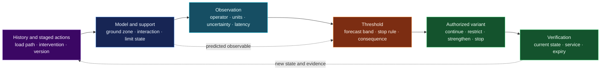
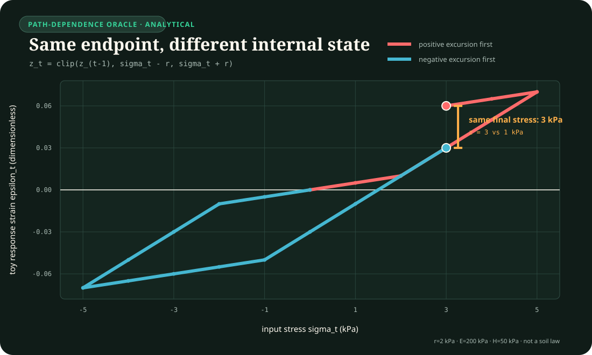

# Geotechnical engineering, long-life assets, and infrastructure monitoring

<!-- markdownlint-disable MD013 -->

- **Audit date:** 2026-08-24
- **Scope:** geotechnical observational design; staged loading and stress-path
  evidence; ground models, spatial support, limit states, and partial factors;
  proof loading; inspection and condition records; existing-structure
  assessment, intervention history, and consequence-qualified reliability.
- **Question:** which civil-engineering constraints sharpen the project's AI
  evaluation contracts after structural resilience, SHM, maintenance,
  metrology, causal experimentation, lifecycle accounting, and provenance are
  treated as mandatory mature nulls?
- **Evidence rule:** a standard, guideline, inspection record, field test,
  probabilistic model, and proposed AI translation retain different authority.
  Standards define scoped technical practice; they do not supply empirical AI
  effect sizes.
- **Promotion state:** no new principle and no new candidate. Eight narrowly
  scoped claims are proposed as `C-1450`--`C-1457`; the remaining two reserved
  slots stay unused.
- **Execution state:** eight CPU-only synthetic falsification contracts are
  specified. They are designs, not implemented runners, workstation results,
  or claim-eligible evidence.
- **Repository constraint:** this audit does not modify the shared claim
  ledger, bibliography, principle registry, candidate files, indexes, or field
  coverage.
- **Non-coverage statement:** this pass does not complete civil engineering.
  Water engineering, construction production, contracts/procurement,
  architecture practice, transport operations, and most material-specific
  durability mechanisms remain outside scope.

## Executive finding

The missing depth was not another generic resilience score. It was a set of
eight boundaries about when evidence is allowed to change a design or an
operating claim:

1. The observational method is a predesigned verification method, not
   monitoring followed by improvised reaction.
2. A test path must represent the relevant field path; matching only the final
   load or state can erase durable internal state.
3. A ground-property value is tied to a limit state and its spatial zone of
   influence. A point minimum, global mean, and support average answer different
   questions.
4. Partial factors act on typed actions, properties, resistances, and model
   uncertainties within a declared verification format. They are not a generic
   confidence knob.
5. Passing a proof load supplies censored evidence about the tested member,
   configuration, load effect, and time. It does not reveal exact resistance or
   certify every failure mode and future year.
6. German bridge inspection records separate structural safety, traffic
   safety, and durability. An overall condition record cannot be reverse-read
   as one physical latent state or as completed repair.
7. The original design is prior information for a long-lived asset, not a
   current-state oracle after construction deviations, repairs, deterioration,
   misuse, load change, or altered boundary conditions.
8. Reliability acceptance is indexed by failure mode, consequences, reference
   period, and authority. Economic optimization does not erase a declared
   minimum human-safety boundary.

The project-level translation is an **observation-to-authority chain**:



Every arrow is falsifiable. A precise sensor can be useless when the relevant
failure mode is unobserved, results arrive after the intervention window, or
the contingency cannot be executed. A conservative factor can be unsafe when
applied to the wrong variable or counted twice. A proof test can be hazardous
while still answering only a narrow question. A complete asset register can
faithfully preserve a stale or unsupported state.

## Normative-source header

- **Normative context:** European Union/European standards and German
  implementation are the default. The audit snapshot is 2026-08-24.
- **Eurocodes:** EN 1990:2023 and EN 1997-1:2024 are second-generation European
  standards. National implementation, National Annexes, transition periods,
  amendments, contracts, approval rules, and the applicable project date must
  be resolved before use in Germany. JRC Eurocode guides explain the technical
  framework but are not themselves EN standards.
- **German bridge inspection:** DIN 1076:2026-01 is the current DIN edition
  checked here and replaced DIN 1076:1999-11. Its public DIN record states that
  it covers inspection and monitoring with respect to structural safety,
  traffic safety, and durability; condition capture supports maintenance
  planning but does not regulate damage removal. The 2017 RI-EBW-PRUEF remains
  an official federal-road source checked for record/evaluation lineage, but
  its exact interaction with the 2026 DIN edition and later administrative
  updates must be established for a real asset.
- **Existing structures:** EN 1990-2:2026 is the published second-generation
  European standard for assessment of existing structures, including
  geotechnical structures, and general principles for interventions.
  CEN/TS 17440:2020 is retained here only as its predecessor and transition
  source. German adoption, National Annex, amendments, transition/coexistence
  dates, approvals, contracts, and project applicability must still be
  established before use.
- **Legal status:** DIN, EN, CEN/TS, JRC guidance, and ministry circulars do not
  become universally binding merely because they are cited. Applicability can
  arise through legislation, administrative rules, approvals, contracts,
  recognized engineering practice, ownership, or a named project baseline.
- **Refusal boundary:** no synthetic score produced under this audit may issue
  a real design approval, construction continuation, load rating, bridge
  opening/closure, inspection deferral, proof-load instruction, maintenance
  priority, or legal-compliance conclusion.

## Construct firewall

| Construct | Meaning in this audit | Must not be substituted by |
| --- | --- | --- |
| ground model | site-specific account of ground, groundwater, units, geometry, and uncertainty over a named zone | one borehole, one parameter table, or a deterministic truth field |
| derived value | property value obtained from measurement through stated theory, correlation, or empiricism | raw instrument reading or design value |
| representative value | nominal or characteristic value selected for a named limit state and spatial support | sample mean independent of failure mechanism |
| design value | value entering a declared verification format after applicable factors/conversions | measured mean or generic confidence score |
| stress/load path | ordered sequence of actions and state changes | final load alone |
| observational method | design verification with possible behaviours, thresholds, monitoring, and preplanned executable variants | post-hoc dashboarding or unconstrained online learning |
| trigger threshold | predeclared boundary tied to prediction, uncertainty, latency, and action | proof of failure or arbitrary anomaly score |
| proof load | controlled applied load used to obtain bounded evidence under stop criteria | destructive capacity test, exact resistance, or lifetime certificate |
| condition record | versioned inspection observations and evaluations for named criteria | direct probability of failure, remaining life, or completed repair |
| asset genealogy | construction, configuration, intervention, loading, inspection, and model lineage | latest snapshot or original drawing alone |
| limit state | declared boundary between satisfactory and unsatisfactory performance for one mode | universal scalar health or safety |
| partial factor | calibrated factor attached to a declared variable/model and verification format | arbitrary multiplier, posterior probability, or safety guarantee |
| reliability target | authority- and reference-period-qualified acceptance input | observed failure frequency or scientific constant |

## Evidence and source-domain boundaries

| Source family | Supports | Does not establish |
| --- | --- | --- |
| Peck and Lambe papers | foundational observational and stress-path methods in soil mechanics | randomized benefit, universal cost saving, or a modern code-compliant workflow by themselves |
| EN 1997 and JRC guides | European geotechnical definitions, verification routes, and implementation guidance | German project applicability without the current national baseline |
| EN 1990/JRC reliability guidance | reliability, uncertainty, partial-factor, assessment, and consequence framework | objective priors, complete failure modes, or universal target values |
| DIN 1076 and RI-EBW-PRUEF | German road-structure inspection/monitoring and record semantics in their scope | direct capacity, remaining-life calibration, or proof that every implementation is complete |
| EN 1990-2 and predecessor CEN/TS 17440 | scoped existing-structure assessment and updating framework | project-specific initiation/intervention rules, national applicability, or permission to act |
| proof-load studies | test planning, instrumentation, stop criteria, and bounded test inference for studied bridge classes | arbitrary bridge type, unmonitored brittle mode, or future deterioration |
| field monitoring | behaviour of the observed asset under its environment and operations | unobserved damage truth, population transport, or repair |

## Exact deduplication against existing project material

| Topic requested in this pass | Existing owner | Residual retained here |
| --- | --- | --- |
| SHM environmental/operational confounding | `C-485`, `C-486`, Candidate 014 | hard null only; no new claim |
| monitoring versus repair | `C-487`, P-009, Candidates 005/011 | fully deduplicated |
| redundancy, interaction, and common cause | `C-488`, P-008, Candidates 009/012 | soil-structure coupling is another application, not a new principle |
| service vector and limit-state plurality | `C-490`, Candidate 009 | geotechnical ULS/SLS examples sharpen test fixtures only |
| fatigue, path-dependent damage, and history | `C-492`, `C-493`, P-012 | `C-1451` concerns evidence-path matching, not a new memory mechanism |
| inspection and maintenance optimization | `C-494`, P-001/P-009 | no new maintenance policy claim |
| residual-capacity contract | `C-500`, Candidates 009/012/014 | proof-load and asset-history fields narrow evidence permissions |
| measurement uncertainty and decision rules | metrology audit, Candidate 009/014 | ground spatial support and typed factor placement remain civil-specific |
| adaptive experiment/dual control | causal audit, Candidate 007 | observational method supplies a strict precommitment and latency null |
| lineage and cumulative inheritance | `C-1369`, Candidate 019 | existing-asset genealogy is a domain-specific assurance boundary |
| rare consequences and robustness scores | `C-489`, insurance/risk audits | `C-1457` retains the Eurocode target/reference-period/authority boundary only |

No civil-engineering mechanism becomes a new project principle. The strongest
ordinary nulls are an explicit finite-horizon staged policy, a path-dependent
constitutive/state estimator, support-aware geostatistics, reliability analysis,
Bayesian proof-test updating, a versioned bridge-management record, and staged
existing-asset assessment.

## Shared mathematical boundary

### Observational design needs an action window

At construction stage $t$, let observed quantity $y_t$ have its native unit,
for example displacement in millimetres (mm) or pore pressure in kilopascals
(kPa):

$$
y_t=h(x_t,u_{1:t},\theta)+\varepsilon_t,
$$

where $x_t$ is hidden ground/structure state, $u_{1:t}$ is ordered construction
and intervention history, $\theta$ is the ground/design model, and
$\varepsilon_t$ is measurement error. Threshold $b_t$ has the same physical
unit as $y_t$. A precommitted trigger is not just $y_t>b_t$. It binds a forecast
band, persistence rule, analysis latency $\tau_{a,t}$, mobilization latency
$\tau_{m,t}$, and remaining safe window $\tau_{w,t}$, all expressed in one
declared time unit:

$$
\tau_{a,t}+\tau_{m,t}<\tau_{w,t}.
$$

If the inequality fails, the proposed contingency is not timely even when the
sensor and threshold are statistically accurate.

### Endpoint equality does not imply path equality

A bounded play operator gives a small synthetic path-dependent null. For input
stress $\sigma_t$ in kPa, threshold $r>0$ kPa, stiffness-like quantities
$E>0$ and $H>0$ in kPa, and initial state
$z_0\in[\sigma_0-r,\sigma_0+r]$, internal state $z_t$ in kPa is

$$
z_t=\min\!\left(\max(z_{t-1},\sigma_t-r),\sigma_t+r\right),
\qquad
\epsilon_t=\frac{\sigma_t-z_t}{E}+\frac{z_t}{H},
$$

where strain $\epsilon_t$ is dimensionless. Two histories can end at the same
$\sigma_T$ but different $z_T$, so their response to the same next increment
can differ. This toy model is a protocol oracle, not a validated soil law.



The colored trajectories are analytic outputs of the stated recurrence under
the editable illustrative parameters in
[`assets/plots/core-models.json`](../../assets/plots/core-models.json). They are
not measurements or calibrated material behaviour.

### Spatial support belongs to the estimand

Let $X(\mathbf s)$ be a ground property in kPa over position $\mathbf s$ in
metres. For a limit-state influence region $V_q$, define

$$
X_{V_q}=\int_{V_q}w_q(\mathbf s)X(\mathbf s)\,dV,
\qquad
\int_{V_q}w_q(\mathbf s)\,dV=1.
$$

Here $dV$ has unit m$^3$ and normalized weight $w_q$ has unit m$^{-3}$,
so $X_{V_q}$ retains the physical unit of $X$.

A local punching mode may depend on a lower-tail functional over a small
$V_q$; broad settlement may depend on a weighted average over a larger region.
The relevant representative value therefore cannot be selected before the
limit state, spatial variability, and zone of influence are declared.

### Factors attach to a verification format

For limit state $q$,

$$
g_q(\mathbf X,t)=R_q(\mathbf X,t)-E_q(\mathbf X,t),
\qquad
P_{f,q}(t)=P[g_q(\mathbf X,t)\le0].
$$

This is a single-state probability. For declared reference horizon $T$, use

$$
P_{f,q}(T)
=P\!\left[\exists\,t\in[0,T]:g_q(\mathbf X(t),t)\le0\right].
$$

Here $\mathbf X(t)$ is the time-indexed uncertain state vector, $t$ and $T$
share one declared time unit, and both probability quantities are
dimensionless.

One action-effect construction may define

$$
F_{Ed,i}=\gamma_{f,i}\psi_iF_{k,i},
\qquad
E_{d,q}
=
\gamma_{Sd,q}\,
E_q\!\left(\{F_{Ed,i}\}_i,a_d\right).
$$

A Material Factor Approach may then construct resistance as

$$
R_{d,q}^{\mathrm{MFA}}
=
R_q\!\left(
  \{X_{\mathrm{rep},j}/\gamma_{M,j}\}_j,
  a_d,
  \{F_{Ed,i}\}_i
\right),
$$

whereas a Resistance Factor Approach may construct

$$
R_{d,q}^{\mathrm{RFA}}
=
\frac{1}{\gamma_{R,q}}
R_q\!\left(
  \{X_{\mathrm{rep},j}\}_j,
  a_d,
  \{F_{Ed,i}\}_i
\right).
$$

Here $E_{d,q}$ and the applicable $R_{d,q}$ have the same response unit;
$F_{k,i}$ are characteristic actions; $\gamma_{f,i}$ are action partial
factors, $\psi_i$ are combination factors, and $\gamma_{Sd,q}$ are
action-effect model factors, all dimensionless; $X_{\mathrm{rep},j}$ are
applicable characteristic or nominal
representative properties; $a_d$ is design geometry; and $\gamma_{M,j}$ and
$\gamma_{R,q}$ are dimensionless. The applicable verification format chooses
the placement: $\gamma_M$ and $\gamma_R$ are not generically applied together.
Every symbol and placement remains Design-Approach-, National-Annex-,
limit-state-, and format-specific. These equations are schematic and do not
replace the applicable Eurocode or National Annex.

### A proof-load pass is censored evidence

Let resistance $R$ and applied load effect $e_p$ have the same unit, for
example kN. Ignoring measurement/model uncertainty for the simplest boundary,
a pass supplies event $R>e_p$ and updates a prior density by truncation:

$$
p(R\mid\text{pass at }e_p)
=\frac{p(R)\mathbf 1(R>e_p)}{P(R>e_p)}.
$$

It does not reveal the realized $R$. With load-to-effect uncertainty, detection
limits, multiple modes, or deterioration, the indicator becomes a likelihood
and must be indexed by member, configuration, mode, time, and observation
operator.

### Long-life state is intervention-segmented

For asset version $v_t$, a minimal state transition is

$$
x_{t+1}=f_{v_t}(x_t,L_t,E_t,I_t)+\eta_t,
$$

where $L_t$ is load/use, $E_t$ environment, $I_t$ inspection/repair/restriction,
and $\eta_t$ process uncertainty. A repair can change both $x_t$ and model
version $v_t$; comparing pre- and post-intervention observations under one
unchanged deterioration curve is then a testable assumption, not bookkeeping.

## Evidence synthesis and proposed claim blocks

### C-1450 — Precommitted observational design

Peck's observational method requires more than collecting measurements. The
modern EN 1997/JRC treatment requires a range of foreseeable ground and
ground-structure responses, thresholds, design variants, and contingency
measures that permit a safe transition when observations cross a boundary.
Progressive failure, missing observables, delayed reporting, and non-executable
changes are explicit reasons the method can fail.

- **Evidence status:** established geotechnical design-method boundary.
- **Primary/authoritative sources:** `Peck1969ObservationalMethod`,
  `CEN2024EN1997Part1`, `JRC2024GeotechnicalReliability`,
  `JRC2024DesignDuringExecution`.
- **Source-domain boundary:** the sources establish method requirements and
  engineering rationale, not a universal cost or safety effect.
- **Proposed AI translation:** an adaptive deployed system may rely on
  observation-driven change only when plausible regimes, protected limits,
  trigger statistics, raw observables, decision latency, authorized variants,
  rollback/containment paths, and responsible actors are committed before the
  evidence used to choose the variant is revealed.
- **Efficiency mechanism:** begin with a cheaper admissible variant and spend
  monitoring/analysis/intervention resources only where observations resolve
  consequential epistemic uncertainty.
- **Failure modes:** dashboard without contingency; model family omits the
  true response; progressive failure outruns the trigger; threshold tuned after
  seeing damage; sensor observes a proxy that lags the protected state; action
  needs unavailable staff/material/authority; safe transition path absent.
- **Measurable prediction:** under synthetic staged systems with the same
  sensors and action set, a precommitted observation-to-action contract reduces
  protected-limit violations versus post-hoc threshold reaction; any project
  composition must then beat the complete finite-horizon mature null in compute
  or evidence cost at equal safety.
- **Speculative extension:** the AI composition is unvalidated and is killed if
  ordinary constrained staged control reaches the same frontier.

### C-1451 — Stress-path-matched evidence

Lambe's stress-path method selects laboratory tests and analyses consistent
with conditions followed by the field structure. EN 1997 guidance likewise
separates measured and derived values and requires attention to stress/strain
level and path. Same endpoint, peak, or cumulative total therefore does not
make histories exchangeable when constitutive state evolves.

- **Evidence status:** established soil-mechanics method and path-dependence
  boundary; effect size is material-, state-, and path-specific.
- **Primary/authoritative sources:** `Lambe1967StressPath`,
  `JRC2024GroundModel`, `CEN2024EN1997Part1`.
- **Source-domain boundary:** a stress path does not guarantee a correct
  constitutive model, representative sampling, or field transfer.
- **Proposed AI translation:** evaluation sets with equal final load, token
  count, loss, or aggregate exposure should include order-reversed,
  load-unload, cyclic, dwell, and staged paths; internal-state models must be
  compared with endpoint-only and full-history mature nulls.
- **Efficiency mechanism:** retain a tested sufficient internal state rather
  than replaying all history when that state reconstructs protected path
  queries within error bounds.
- **Failure modes:** endpoint leakage; sampler accidentally changes path and
  magnitude; sequence effect confused with time drift; path feature tuned on
  confirmation; recurrent model memorizes IDs; full history withheld from the
  mature null.
- **Measurable prediction:** path-aware state estimation reduces next-probe
  error for endpoint-matched histories in path-dependent worlds and ties the
  endpoint model in memoryless worlds.
- **Speculative extension:** no particular neural memory or constitutive form
  is promoted.

### C-1452 — Limit-state- and support-matched ground values

Second-generation Eurocode 7 guidance distinguishes measured, derived,
representative, characteristic/nominal, and design values. The representative
value is selected for the relevant limit state and its sensitivity to spatial
variability over the affected ground volume. More samples do not license one
global statistic for a local weak zone and a broad averaging mode.

- **Evidence status:** established European geotechnical definition and
  design-guidance boundary.
- **Primary/authoritative sources:** `JRC2024GroundModel`,
  `JRC2025RepresentativeGroundValues`, `CEN2024EN1997Part1`.
- **Source-domain boundary:** the guidance does not select a universal random-
  field family, correlation length, sample plan, or characteristic value.
- **Proposed AI translation:** every aggregate evidence value carries an
  observation support, decision support, aggregation operator, spatial or
  graph dependence model, target limit state, and uncertainty. Local
  bottleneck and distributed-average queries must not share an unqualified
  pooled mean.
- **Efficiency mechanism:** allocate new measurements where support-weighted
  posterior decision uncertainty is largest instead of sampling uniformly.
- **Failure modes:** point sample treated field average; global mean hides local
  weak cell; global minimum makes broad response needlessly conservative;
  spatial correlation ignored; zone changes after redesign; interpolation
  represented as observation; multiple data sources share calibration bias.
- **Measurable prediction:** support-aware conditional simulation improves
  interval coverage and reduces false-safe decisions for both local and broad
  limit states versus global-mean, point-minimum, and IID-sample baselines.
- **Speculative extension:** Candidate 014 gains no novelty unless its support
  record beats ordinary geostatistics at equal information and compute.

### C-1453 — Typed partial-factor provenance

Eurocode reliability guidance separates representative values, actions,
resistances, geometrical quantities, model uncertainties, design situations,
and verification formats. Partial factors are calibrated placements within
that framework. Moving one factor to another quantity, multiplying all margins
again, or interpreting a factor as posterior confidence changes the problem.

- **Evidence status:** established reliability and code-format boundary.
- **Primary/authoritative sources:** `JRC2024EurocodeReliability`,
  `JRC2024GeotechnicalReliability`, `JRC2025RepresentativeGroundValues`,
  `CEN2023EN1990`, `CEN2024EN1997Part1`.
- **Source-domain boundary:** the cited values and formats remain standard-,
  design-approach-, National-Annex-, limit-state-, and applicability-specific;
  no numerical factor is imported as a project constant.
- **Proposed AI translation:** safety margins carry the uncertainty type,
  variable, direction of unfavourability, unit, correlation scope, reference
  period, limit state, calibration basis, version, and authority that owns the
  target.
- **Efficiency mechanism:** typed margins permit local recomputation when one
  uncertainty or authority changes and expose double-counting before expensive
  simulation.
- **Failure modes:** universal confidence multiplier; resistance factor applied
  as action factor; mean already conservatively shifted then factored twice;
  model bias omitted; correlated variables factored independently; ULS factor
  reused for serviceability; National Annex/version dropped.
- **Measurable prediction:** typed verification records reduce false-safe and
  false-reject decisions under factor-placement and correlation changes versus
  one scalar safety score, while an exact reliability calculation remains the
  strongest null.
- **Speculative extension:** typed provenance is an assurance record, not a new
  learning rule.

### C-1454 — Bounded proof-load inference

JRC reliability guidance states that withstanding an applied load does not
directly reveal actual resistance or directly measure reliability. At its
simplest it establishes that resistance at the test time exceeded the applied
load effect, subject to load-to-effect and measurement uncertainty. Bridge
proof-load research additionally makes preparation, instrumentation, staged
loading, and mode-specific stop criteria central to safe execution.

- **Evidence status:** established assessment-inference boundary; detailed
  stop-criterion evidence is bridge-class and failure-mode bounded.
- **Primary/authoritative sources:** `JRC2024EurocodeReliability`,
  `LantsoghtEtAl2017ProofLoad`.
- **Source-domain boundary:** the Lantsoght study focuses on reinforced-concrete
  slab bridges and explicitly leaves further shear validation; it does not
  generalize to every asset or brittle mode.
- **Proposed AI translation:** a passed stress, red-team, or load test updates
  only the tested version, route, mode, load/effect conversion, observation
  operator, and test time. Untested modes, higher loads, future drift, and
  sibling assets remain separate claims.
- **Efficiency mechanism:** bounded censoring updates can retire unnecessary
  conservatism without running destructive capacity searches.
- **Failure modes:** survivorship treated exact capacity; stop rule unable to
  observe brittle mode; test damages asset; load path differs from service;
  sensor latency; proof result transported to siblings; deterioration ignored;
  failed/aborted test silently removed.
- **Measurable prediction:** censored Bayesian updating improves calibrated
  capacity bounds over ignoring the test while producing fewer unsupported
  mode/lifetime certifications than pass-equals-safe extrapolation.
- **Speculative extension:** no automated real proof-load policy is authorized.

### C-1455 — Multi-criterion bridge-condition records

The German ministry describes DIN 1076 inspections as a systematic procedure
in which detected damage is evaluated against structural safety, traffic
safety, and durability. DIN 1076:2026-01's public record preserves those
criteria, adds monitoring and digital inventory provisions, and states that
condition capture supports maintenance planning but does not regulate damage
removal. One aggregate condition grade is a planning-oriented record summary,
not direct physical capacity, remaining life, or evidence of completed repair.

- **Evidence status:** established German inspection-record boundary.
- **Authoritative sources:** `DIN2026DIN1076`, `BMV2020BridgeInspection`,
  `BMV2017RIEBWPRUEF`.
- **Source-domain boundary:** the public records do not validate a universal
  mapping from condition labels to failure probability or remaining life; the
  2017 RI-EBW-PRUEF interaction with the 2026 DIN must be version-checked.
- **Proposed AI translation:** retain component, defect, location, extent,
  inspection access/operator, three criterion evaluations, evidence age,
  standard/rule version, restriction, work order, completed intervention, and
  independent verification separately from an aggregate state label.
- **Efficiency mechanism:** coarse grades screen a portfolio; component-level
  records are loaded only for decisions that cross a safety, access, or
  intervention boundary.
- **Failure modes:** ordinal grade treated continuous RUL; average hides one
  critical criterion; rule-version shift appears deterioration; inaccessible
  component treated sound; recommended repair treated completed; condition
  grade transported across asset types; inspector dependence omitted.
- **Measurable prediction:** component- and criterion-preserving records reduce
  false capacity/RUL assertions and version-induced ranking reversals versus
  overall-grade-only models at equal inspection observations.
- **Speculative extension:** the AI record adds no novelty if a conventional
  bridge-management database supplies the same decisions.

### C-1456 — Intervention-segmented existing-asset assessment

EN 1990-2:2026 and JRC guidance distinguish assessment of an existing structure
from design of a new one. CEN/TS 17440:2020 is the predecessor source. Current
measurements can update prior variables and models; construction,
modification, repair, deterioration, accidental damage, misuse, changed
actions, changed boundary conditions, and remaining service life can all make
the original design state incomplete. Assessment proceeds in stages because
each acquisition has cost and uncertainty.

- **Evidence status:** established European existing-structure assessment
  boundary.
- **Authoritative sources:** `CEN2026EN1990Part2`,
  `JRC2024EurocodeReliability`; `CEN2020TS17440` is historical/transition
  context.
- **Source-domain boundary:** EN 1990-2 does not provide project-specific rules
  for initiating an assessment or undertaking a resulting intervention.
  National adoption, National Annex, transition, competent authority, and
  project applicability remain unresolved. Current evidence never removes all
  uncertainty.
- **Proposed AI translation:** treat the initial specification/training state as
  prior evidence. Bind every later capability claim to configuration genealogy,
  interventions, use/load history, observation/model versions, changed
  boundaries, current measurements, remaining horizon, and expiry.
- **Efficiency mechanism:** staged value-of-information assessment escalates
  from documents and cheap screening to targeted inspection, testing, or model
  refinement only when the decision can change.
- **Failure modes:** design values treated as measured current values; repair
  resets age but not model; post-repair observations pooled with pre-repair
  deterioration; undocumented alteration; survivor bias from successful
  service; more data acquired despite no actionable decision; genealogy fields
  present but unauthenticated.
- **Measurable prediction:** intervention-segmented staged assessment improves
  current-state coverage and decision cost versus original-design-only,
  latest-snapshot-only, and unsegmented-history baselines.
- **Speculative extension:** Candidate 019 remains unvalidated unless it beats
  an ordinary versioned asset register and Bayesian staged assessment.

### C-1457 — Consequence- and period-qualified reliability boundaries

The Eurocode reliability framework indexes target reliability by failure mode,
direct and indirect consequences, reference period, remaining service life,
and the cost/feasibility of safety measures. JRC guidance also preserves a
minimum human-safety constraint rather than allowing economic optimization to
trade it away. The numerical target and legitimate authority remain governance
inputs, not values inferred from model fit.

- **Evidence status:** established structural-reliability framework and
  normative boundary; no universal numerical target is asserted.
- **Authoritative sources:** `JRC2024EurocodeReliability`,
  `JRC2024GeotechnicalReliability`, `CEN2023EN1990`.
- **Source-domain boundary:** target values depend on the applicable standard,
  National Annex, asset, consequences, reference period, and competent
  authority. A reliability model remains conditional on its failure modes and
  probability assumptions.
- **Proposed AI translation:** report mean utility only after enforcing
  authority-owned prohibited outcomes, tail/reliability constraints, affected
  populations, failure-mode coverage, and reference period; keep economic,
  environmental, social, heritage, and human-safety consequences disaggregated.
- **Efficiency mechanism:** cheap analytic bounds screen ordinary cases while
  importance sampling or exact rare-event analysis is reserved for decisions
  near a protected boundary.
- **Failure modes:** annual and lifetime probability swapped; one consequence
  class used everywhere; zero sampled failures treated zero risk; mean loss
  hides catastrophic mode; double counts correlated consequences; brittle and
  ductile modes pooled; optimization allowed to buy out a prohibited outcome;
  target silently changed after results.
- **Measurable prediction:** consequence- and period-qualified gates reduce
  false acceptance of low-frequency/high-consequence policies versus mean-only
  selection, without forcing the same target on low-consequence cases.
- **Speculative extension:** no universal AI safety factor or automated
  authority is proposed.

The remaining two reserved slots are deliberately unused. SHM confounding,
monitoring value, ordinary maintenance, soil-structure coupling, hysteresis as
memory, resilience scoring, and generic rare-event estimation did not survive
as new claims after deduplication.

## Common CPU-only protocol contract

The following rules are part of every protocol.

1. **Runtime and generator:** deterministic TypeScript/JavaScript, Node.js LTS,
   PCG64-DXSM, canonical little-endian serialization, SHA-256 manifests, and no
   network access at run time. Parallel reductions sort by canonical world ID.
2. **Seed packs:** track $k\in\{1,\ldots,8\}$ uses public development seeds
   `1450000 + 10000*k + 1` through `+64`. A registrar creates 256 independent
   random 64-bit confirmation seeds per track. The smallest prefix of
   128/192/256 whose development-only simulation estimates at least 0.90 power
   for the registered minimum effect is committed before confirmation reveal.
3. **Independence unit:** one confirmation seed, containing every case or world
   generated from that seed, is the inferential cluster. All cases, stages,
   sensors, grid cells, members, assets, inspections, load blocks, and queries
   inside it are repeated measures and may not inflate $n$.
4. **Arms:** A is the tempting collapsed baseline; B is the complete mature
   civil/statistical null with the same raw information; C is the relevant
   project candidate composition. No arm receives oracle fields unavailable to
   another arm. Oracle values are evaluator-only.
5. **Tuning:** A/B/C receive the same development worlds, wall-clock tuning
   budget, CPU-thread cap, and exposed fields. Confirmation performs no
   hyperparameter search, threshold repair, model selection, or stopping-rule
   change.
6. **Primary inference:** before confirmation reveal, every track defines a
   scalar seed-level primary loss $L_{s,a}$, including its exact eligible-query
   denominator, weights, nonzero abstention loss, interval-score term where
   applicable, and treatment of aborted, failed, or invalid cases. The paired
   contrast is $\Delta_s=L_{s,B}-L_{s,A}$. A one-sided paired randomization test
   uses all sign flips when $n\le20$ and exactly 1,000,000 PCG64-DXSM sign
   vectors otherwise. Holm controls familywise $\alpha=0.01$ across the eight
   A-versus-B boundary tests. Each track registers a loss-scale margin
   $\delta_k>0$. Boundary confirmation requires Holm-adjusted rejection and a
   one-sided 99% seed-cluster upper bound for
   $E[L_{s,B}-L_{s,A}]\le-\delta_k$. A two-sided 99% seed-cluster bootstrap
   interval with 100,000 replicates also reports effect size. Absolute
   protected gates remain separate and cannot be averaged away.
7. **Protected gates:** every track separates two event classes before reveal.
   A zero-tolerance structural or operational violation—an unauthorized
   real-world decision, an arm inventing or overriding an authority-owned
   prohibition, execution of a simulated outcome explicitly tagged forbidden,
   unit mismatch, oracle leakage, confirmation tuning, omitted failed run, or
   hidden factor/threshold/version—fails the track regardless of mean loss. A
   false-safe or false-acceptance classification caused by finite synthetic
   statistical estimation is instead an estimator decision error governed by
   the track's explicit rate and confidence bound, unless that track labels it
   zero-tolerance. A numerical error allowance never authorizes real action.
8. **Novelty rule:** B is the strongest null. C survives only if a
   preregistered Pareto point either (i) clears the track's minimum
   primary/protected-outcome improvement without worsening any matched
   resource, or (ii) passes every protected non-inferiority gate and clears a
   registered reduction in at least one matched resource without exceeding the
   registered margins on the others. A C-versus-B novelty decision requires
   the registered one-sided 99% seed-cluster interval to clear the minimum
   improvement or resource-reduction margin and all non-inferiority margins.
   Holm controls the eight C-versus-B novelty tests at familywise
   $\alpha=0.01$, separately from the A-versus-B family. If C is within the
   equivalence margins of B, project novelty is killed even when the civil
   boundary itself is confirmed.
9. **Resource profile:** one CPU workstation, at most 16 logical threads,
   32 GiB peak RAM, 40 GiB artifacts, and 8 wall-clock hours per track. Report
   CPU-seconds, wall-seconds, peak bytes, read/write bytes, and artifact bytes.
   Physical energy is `not measured` in this CPU-only phase and no joule or
   carbon claim is permitted.
10. **Uncertainty artifacts:** persist per-seed outcomes, randomization vectors,
    bootstrap indices, intervals, multiplicity decisions, refusals, failures,
    and exact software/hardware manifests. Passing remains
    `protocol_complete`, never an empirical project result.
11. **Threshold status:** every numeric effect, equivalence, coverage, and
    resource threshold below is a preregistered falsification tolerance or
    minimum detectable engineering effect for this synthetic protocol. None is
    a measured effect, code value, recommended safety target, or imported
    physical constant.
12. **Anti-triviality:** abstention is a registered decision with nonzero loss.
    Each track fixes an eligible-query answer/decision-rate floor from
    development; B/C may not fall more than one percentage point below the
    mature null. Coverage is paired with a proper interval score or registered
    mean-width/sharpness ceiling; unbounded intervals fail. Active-test tracks
    also require a registered information-gain or eligible-test-execution
    floor, so a zero-load or no-test policy cannot pass.

## Eight falsification protocol specifications

### GT-T01 — Observation-to-action window

- **Claim:** `C-1450`.
- **Primary unit and units:** one 12-stage excavation/embankment world;
  displacement (mm), pore pressure (kPa), stability reserve (kPa), time (h),
  cost (constant 2026 euros).
- **Generator:** 64 independent worlds per seed, each with a hidden finite-state
  ground model, one of 5 response families, 12 construction stages, 3 sensor
  types, Student-$t$ measurement noise,
  correlated bias, dropout, reporting delays of 0--48 h, progressive and
  non-progressive failure, 6 design variants, mobilization delays of 2--96 h,
  and actions that change later observability. The seed therefore contains
  exactly $64\times12=768$ scheduled stage-world decision points. A terminal
  protected failure marks every remaining scheduled point in that world as a
  violation rather than deleting it. At least 25% of worlds make a
  statistically detectable trigger operationally too late.
- **Arms:** A reacts to a rolling z-score after threshold crossing and chooses
  the cheapest apparent action; B solves the registered finite-horizon
  belief-state/chance-constrained staged policy with explicit variants,
  forecast thresholds, transition feasibility, and latency; C uses Candidates
  011/012/014 with the same model/action library.
- **Mature null:** exact dynamic programming for small worlds plus a registered
  particle-filter constrained policy for larger worlds.
- **Hostile families:** omitted progressive mode; sensor proxy lags reserve;
  false stable plateau; shared sensor bias; action unavailable; mobilization
  exceeds safe window; action changes the sensor baseline; two triggers demand
  incompatible actions; stopping itself carries cost; and a benign family with
  zero reporting/mobilization latency and all actions feasible.
- **Primary metric and threshold:** protected-limit violations per 1,000 stage-
  worlds. For arm $a$,

  $$
  L_{s,a}=\frac{1000}{768}\sum_{w=1}^{64}\sum_{t=1}^{12}V_{s,w,t,a},
  $$

  where $V=1$ for a protected violation, an uncontained abstention, a
  missing/invalid decision, or an unwarranted stop when the evaluator marks at
  least one authorized continuation safe; $V=0$ otherwise. The evaluator
  freezes that continuation label before arm output. B passes only
  when the one-sided 99% seed-cluster upper bound for the paired difference
  $L_{s,B}-L_{s,A}$ is at most $-5$ per 1,000 after Holm rejection, so
  $\delta_1=5$ loss points per 1,000. Any catastrophic transition is separately
  counted and never averaged into cost. B's unwarranted-stop rate may not
  exceed A by more than 1 per 1,000 evaluator-safe continuation points; an
  all-stop policy fails. In the registered benign
  family, the corresponding upper bound must be at most $+1$ per 1,000, so
  planning machinery cannot win by harming the easy case.
- **Secondary metrics:** false stops, missed/late triggers, action feasibility,
  euros, analysis latency, CPU-seconds, calibration, and abstention.
- **Novelty/kill:** C must reduce median CPU-seconds by at least 20% at no worse
  protected outcome, action count, or false-stop rate; B parity kills the
  composition.
- **Artifacts:** `worlds.jsonl`, `response-bands.jsonl`, `trigger-plan.json`,
  `action-latency.csv`, `protected-events.csv`.

### GT-T02 — Endpoint-matched stress-path challenge

- **Claim:** `C-1451`.
- **Primary unit and units:** one paired load path; stress (kPa), strain
  (dimensionless and microstrain), dwell time (h), dissipated work density
  (kJ/m$^3$).
- **Generator:** 4,096 paired histories per seed from memoryless elasticity,
  bounded play operators, multi-surface superpositions, rate-dependent
  viscoplasticity, and drift-only controls. Paths have identical endpoint and
  peak stress but differ by order, unload/reload, cycling, dwell, and direction.
  Each history receives a sealed 16-step next-probe sequence, yielding exactly
  $4{,}096\times2\times16=131{,}072$ predictions per seed.
- **Arms:** A predicts from endpoint, peak, cumulative absolute increment, and
  elapsed time; B fits registered constitutive/state-space alternatives and a
  full-history sequence model with model checks; C uses Candidate 017/019-style
  compacted/versioned state with reconstructability tests.
- **Mature null:** full history plus a frozen candidate family containing the
  correct finite-dimensional filter in identified generator families. B must
  select among candidates using observable development/fit diagnostics only;
  evaluator family labels and hidden-state truth are never exposed.
- **Hostile families:** memoryless tie; slow drift masquerading as hysteresis;
  endpoint leakage; reversed paths; unseen amplitudes; two different hidden
  states with same summary; rate/path interaction; model-family misspecification.
- **Primary metric and threshold:** next-probe strain RMSE in microstrain. B
  must improve A by at least 10% in path-dependent worlds and satisfy the
  directional non-inferiority gate
  $\operatorname{RMSE}_B\le1.01\operatorname{RMSE}_A$ in memoryless worlds;
  both conditions are protected.
  The scalar $L_{s,a}$ is the equal-family macro-average of squared prediction
  error divided by the frozen development variance for that family, over all
  131,072 probe predictions. A missing/invalid prediction receives the frozen
  worst finite development loss; evaluator-only state reconstruction is not
  part of model selection. Boundary confirmation additionally requires
  Holm-adjusted rejection and the one-sided 99% upper bound for
  $E[L_{s,B}-L_{s,A}]$ to be at most $-\delta_2$, with $\delta_2=0.05$
  standardized macro-loss units.
- **Secondary metrics:** 99% predictive coverage, work-density error, hidden-
  state reconstruction, total retained footprint, reconstruction CPU-seconds,
  inference CPU-seconds, and transfer. Total retained footprint includes raw
  history, compact state, indices, checkpoints, and model parameters required
  to answer the registered queries.
- **Novelty/kill:** C must use at most 25% of B's total retained footprint while
  staying within 2% RMSE, within the registered reconstruction-compute margin,
  and passing every registered path query; otherwise the compact state is
  rejected.
- **Artifacts:** `paths.jsonl`, `endpoint-pairs.jsonl`, `probe-oracle.jsonl`,
  `state-summaries.jsonl`, `path-errors.csv`.

### GT-T03 — Spatial-support representative values

- **Claim:** `C-1452`.
- **Primary unit and units:** one 128 m by 128 m ground field with 1 m cells;
  strength/stiffness (kPa), distance (m), settlement (mm), safe/unsafe (binary).
- **Generator:** 32 independent Gaussian, transformed-lognormal, and
  channelized random fields per seed
  with correlation lengths 2/10/40 m, anisotropy, trends, abrupt lenses,
  12--64 biased or space-filling investigations, transformation error, and
  shared calibration bias. Queries include a 2--4 m local weak-zone limit and
  20--40 m weighted settlement support. Each field has 48 local and 48 broad
  support queries, for exactly 3,072 eligible queries per seed.
- **Arms:** A uses one global mean; A2 uses the observed point minimum; B uses
  registered trend/variogram checks, a conventional versioned geostatistical
  record, block kriging and conditional simulation over the exact influence
  support with model-family sensitivity; C adds Candidate 014's lineage and
  typed-refusal implementation. A, A2, B, and C all receive the same version,
  observation-support, query-support, and dependency fields. Development selects the
  lower-loss A/A2 baseline under the full protected gate; that identity is
  frozen as the collapsed comparator before confirmation.
- **Mature null:** support-aware conditional random-field inference with
  explicit non-identification outside sampled/model support.
- **Hostile families:** local lens missed between samples; broad average with
  one extreme point; wrong correlation length; preferential sampling; shared
  lab bias; anisotropy reversed; support changes after footprint redesign;
  channelized field outside Gaussian family; and a homogeneous IID,
  support-invariant family where the global summary is sufficient.
- **Primary metric and threshold:** false-safe limit-state decisions per 1,000
  queries at a registered synthetic failure-probability threshold of 0.01.
  "Safe" requires the one-sided 99% upper bound on $P(g_q\le0)$ to be at most
  0.01; "unsafe" requires the lower bound to exceed 0.01; the remainder is an
  abstention with the common nonzero loss. B's false-safe rate must be at most
  10 per 1,000 with 99% interval coverage at least 0.98 in-family and mandatory
  sensitivity/refusal outside observable model support. Refusal may use only
  preregistered residual, variogram-envelope, support-overlap, calibration, and
  predictive-check diagnostics—not evaluator family labels. A
  dependency/version false assertion is a claim that evidence is independent
  or current when its recorded ancestry contains a shared calibration/source
  dependency or its evidence/query-support version does not match the frozen
  query version.
- **Seed-level loss:** $L_{s,a}$ is the mean over all 3,072 eligible queries of
  false-safe loss 20, false-reject loss 1, abstention loss 0.25, or zero for a
  correct decision, plus the mean normalized interval score for the declared
  probability interval. Invalid or missing queries receive loss 20. The
  answer-rate and interval-sharpness gates remain separate. Boundary
  confirmation additionally requires Holm-adjusted rejection and the
  one-sided 99% upper bound for $E[L_{s,B}-L_{s,A}]$ to be at most
  $-\delta_3$, with $\delta_3=0.10$ mean loss points per eligible query.
- **Secondary metrics:** false rejects, settlement RMSE (mm), interval width,
  value of each new sample, CPU-seconds, and sample count.
- **Novelty/kill:** C must reduce dependency/version false assertions by at
  least 2 per 1,000 or CPU-seconds by at least 15%, with no worsening of
  coverage, false-safe decisions, samples, or the other resource axes. Within
  0.5 assertion per 1,000 and 5% on every resource is mature-null equivalence
  and kills project novelty. In the homogeneous/IID/support-invariant family,
  C must be non-inferior to B on loss and every matched resource.
- **Artifacts:** `fields.zst`, `samples.jsonl`, `supports.geojson`,
  `conditional-draws.parquet`, `support-decisions.csv`.

### GT-T04 — Typed factor placement and limit states

- **Claim:** `C-1453`.
- **Primary unit and units:** one design situation/limit-state case; action and
  resistance (kN), settlement (mm), factors (dimensionless), failure
  probability (dimensionless over a declared reference horizon).
- **Generator:** 64 cases per seed: 32 analytically solvable lognormal/normal
  action-resistance cases and 32 nonlinear cases with permanent/variable
  actions, ground and model uncertainty, correlation,
  favourable/unfavourable direction changes, ULS and SLS, and four
  factor-format versions. Of the nonlinear cases, 24 use synthetic target
  `1e-2`, four use `1e-3`, and four use `1e-4`; they are not recommended real
  values. Eight cases form a linear,
  independent-variable family in which the scalar-factor baseline is
  sufficient by construction.
- **Arms:** A applies one learned multiplier to a scalar margin; B uses typed
  variables, exact format/version, FORM diagnostics and direct integration or
  importance sampling; C uses Candidate 009/014 assurance records with the same
  solver library.
- **Mature null and estimator:** use direct probability calculation where
  analytic. For each nonlinear case, map the frozen joint distribution to
  standard-normal latent density $p(\mathbf u)=\phi(\mathbf u)$. A three-start
  FORM solver must converge to gradient norm at most $10^{-6}$ and design-point
  separation at most 0.05; otherwise B abstains. With frozen design point
  $\mathbf u^*$, draw exactly $N=2^{18}$ independent samples from defensive
  mixture $q(\mathbf u)=0.8\phi(\mathbf u-\mathbf u^*)+0.2\phi(\mathbf u)$ and
  estimate

  $$
  \widehat P_f=\frac{1}{N}\sum_{i=1}^{N}
  \mathbf 1[g(\mathbf u_i)\le0]\frac{p(\mathbf u_i)}{q(\mathbf u_i)}.
  $$

  Write each independent summand as $Z_i$ and its sample variance as
  $\widehat v=(N-1)^{-1}\sum_i(Z_i-\bar Z)^2$. The defensive component gives
  $0\le Z_i\le b=5$. With $\alpha=0.001$, the exact registered radius is

  $$
  r_N=
  \sqrt{\frac{2\widehat v\ln(4/\alpha)}{N}}
  +\frac{7b\ln(4/\alpha)}{3(N-1)},
  \qquad
  [L,U]=[\max(0,\bar Z-r_N),\min(1,\bar Z+r_N)].
  $$

  Certification requires importance-weight
  $\mathrm{ESS}=(\sum_iw_i)^2/\sum_iw_i^2\ge4{,}096$, where
  $w_i=p(\mathbf u_i)/q(\mathbf u_i)$, a
  bound wholly on one side of the target, normalized interval width
  $(U-L)/\max(P_{f,\mathrm{target}},10^{-12})\le0.5$, and at least 75% decision
  coverage across all 32 eligible nonlinear cases. The 24 `1e-2` cases make
  that coverage floor arithmetically reachable without requiring a claim on
  the lower-target cases; coverage is also reported separately for every
  target stratum. Otherwise the result is an abstention. Proposal, sample
  count, interval formula, and gates are frozen before confirmation.
- **Hostile families:** factor moved action-to-resistance; double conservatism;
  missing model bias; correlated action/property; ULS/SLS swap; reference-
  period change; favourable sign reversal; version/National-parameter change;
  and the linear independent-variable sufficiency family.
- **Primary metric and threshold:** false-safe certifications per 10,000 cases
  against the oracle target. B must have zero false-safe decisions in analytic
  cases and at most the preregistered Monte Carlo uncertainty bound elsewhere.
  The scalar $L_{s,a}$ is the mean over all 64 cases of loss 100 for a
  false-safe certification, 1 for a false rejection, 0.25 for abstention, and
  zero for a correct certification, plus normalized interval score. Invalid or
  non-converged cases are abstentions, never deletions; the absolute
  false-safe, decision-rate, ESS, and sharpness gates remain separate.
  Boundary confirmation additionally requires Holm-adjusted rejection and the
  one-sided 99% upper bound for $E[L_{s,B}-L_{s,A}]$ to be at most
  $-\delta_4$, with $\delta_4=0.10$ mean loss points per case.
- **Secondary metrics:** false rejects, log-probability calibration error,
  factor-placement errors, compute, and typed-record bytes.
- **Novelty/kill:** any C advantage caused by receiving format/version fields
  withheld from B fails. C must reduce factor-lineage false decisions by at
  least 2 per 10,000 or median CPU-seconds by at least 15% without worsening
  certification, false rejection, or any matched resource. Within 0.5 decision
  per 10,000 and 5% on resources is parity and kills project novelty. C must
  also be non-inferior to B in the scalar-factor-sufficient family.
- **Artifacts:** `limit-states.jsonl`, `factor-formats.json`,
  `oracle-probabilities.csv`, `factor-lineage.jsonl`, `certifications.csv`.

### GT-T05 — Proof-load censoring and stop rules

- **Claim:** `C-1454`.
- **Primary unit and units:** one synthetic member/test; applied load and effect
  (kN), deflection (mm), strain (microstrain), crack width (mm), cycles (count),
  remaining horizon (years).
- **Generator:** 2,048 assets per seed with correlated flexural/shear/brittle
  capacities, prior document uncertainty, load-to-effect model error,
  instrumentation noise/delay, staged proof loads, reversible/nonlinear damage,
  mode-specific stop criteria, aborted tests, and post-test deterioration.
  Each asset exposes four mode-by-three-horizon queries, for 24,576 eligible
  queries per seed. A registered deterministic tested-mode family has exact
  load-to-effect conversion, reversible response below the stop threshold, and
  a closed-form censored posterior; it checks that bounded proof inference is
  recovered without needless refusal.
- **Arms:** A treats target-load passage as exact capacity and lifetime safety;
  B performs censored Bayesian updating for the tested member/mode/time and
  refuses unsupported extrapolation, while a separate registered controller
  enforces stop rules; C uses Candidates 009/012/014.
- **Mature null:** exact truncated-distribution update in conjugate cases and
  convergence-checked Bayesian reliability update in mixed-mode cases.
- **Hostile families:** unobserved brittle mode; noisy near-threshold response;
  load-effect bias; test damages member; service load path differs; sibling
  transport; rapid later deterioration; missing failed test; stop criterion
  detects nonlinear response only after irreversible damage; and the
  deterministic tested-mode family.
- **Primary metric and threshold:** unsupported safe certifications per 1,000
  member-mode-horizon queries. B/C must emit zero for untested modes/siblings
  and achieve 99% posterior coverage at least 0.98 for eligible tested-mode
  quantities. Before any arm output, the evaluator computes and freezes one
  eligibility set from the common observable pre-test fields; the identical
  set and denominator apply to A, B, and C. At least 80% of that frozen set must
  execute one nonzero load stage, and median information gain across those
  executed tests must be at least 0.10 bit; zero-load/no-test policies fail.
  Irreversible test-induced damage is a separate zero-tolerance protected gate.
  The scalar $L_{s,a}$ is the mean over all 24,576 queries of loss 100 for an
  unsupported safe certification, 1 for a false rejection, 0.25 for
  abstention, and zero otherwise, plus normalized interval score and a
  registered damage penalty. Aborted, controller-stopped, invalid, and failed
  tests remain in the denominator. Boundary confirmation additionally requires
  Holm-adjusted rejection and the one-sided 99% upper bound for
  $E[L_{s,B}-L_{s,A}]$ to be at most $-\delta_5$, with $\delta_5=0.10$ mean
  loss points per eligible query.
- **Secondary metrics:** information gain in bits, interval width (kN), false
  rejection, stop-rule damage, test cost, CPU-seconds, and abstention precision.
- **Novelty/kill:** C must reduce median update CPU-seconds or retained evidence
  bytes by at least 15%, while the other resource increases by no more than 1%
  and coverage, test execution, information gain, interval sharpness, and stop
  safety do not worsen. Within 5% on both resources and 0.5 unsupported
  assertion per 1,000 is parity and kills the composition.
- **Artifacts:** `asset-priors.jsonl`, `load-stages.jsonl`,
  `sensor-traces.jsonl`, `test-dispositions.csv`, `posterior-coverage.csv`.

### GT-T06 — German condition-record semantics

- **Claim:** `C-1455`.
- **Primary unit and units:** one component inspection; defect dimensions (mm),
  criterion ratings (ordinal), aggregate condition label (ordinal), capacity
  (kN), remaining life (years), intervention status (categorical).
- **Generator:** 20,000 synthetic components per seed, 12 asset types, hidden
  defect modes, partial access, inspector sensitivity/specificity, independent
  structural-safety/traffic-safety/durability effects, four rating-rule
  versions, recommended and completed repairs, and load changes. The generator
  does not reproduce proprietary standard text or a real asset. Capacity and
  remaining-life queries for every component yield exactly 40,000 eligible
  queries per seed. A registered family makes the aggregate grade sufficient
  by construction and holds the rating rule fixed.
- **Arms:** A regresses capacity/RUL directly on one aggregate grade; B retains
  defects, component/location, access/operator, three criteria, rule version,
  load, work-order/completion, and calibrated survival/reliability alternatives;
  C adds Candidate 014/019 lineage and typed refusal.
- **Mature null:** versioned bridge-management database plus ordinal/survival
  modelling with measurement error and component evidence.
- **Hostile families:** same grade/different critical criterion; rule update;
  inaccessible member; durability defect with slow/fast environment; repair
  recommended but not done; repair changes baseline; asset-type transport;
  aggregate improves while structural-safety criterion worsens; and the
  aggregate-grade-sufficient family.
- **Primary metric and threshold:** unsupported capacity/RUL assertions per
  1,000 queries. B/C must issue none outside calibrated asset/rule support and
  must achieve 99% interval coverage at least 0.98 in support. Their eligible
  answer rate may not fall more than one percentage point below the mature null,
  and the registered proper interval score and mean-width ceiling must pass.
  The scalar $L_{s,a}$ is the mean over all 40,000 queries of loss 100 for an
  unsupported capacity/RUL assertion, 1 for a wrong supported decision, 0.25
  for abstention, and zero otherwise, plus the normalized interval score.
  Missing, inaccessible, and invalid cases remain in the denominator with the
  registered abstention or failure loss. Boundary confirmation additionally
  requires Holm-adjusted rejection and the one-sided 99% upper bound for
  $E[L_{s,B}-L_{s,A}]$ to be at most $-\delta_6$, with $\delta_6=0.10$ mean
  loss points per eligible query.
- **Secondary metrics:** grade-version ranking reversals, RUL MAE (years),
  critical-criterion recall, false restrictions, evidence bytes, and latency.
- **Novelty/kill:** C is killed if the conventional versioned component
  database differs by at most 0.5 decisions per 1,000 and every C-to-B resource
  ratio for evidence bytes, CPU-seconds, and latency lies in $[0.99,1.01]$. A
  resource-saving claim requires a ratio at most 0.99 on at least one named
  resource, no ratio above 1.01, and satisfaction of the common
  non-inferiority and multiplicity contract. C must be non-inferior in the
  aggregate-grade-sufficient family.
- **Artifacts:** `components.jsonl`, `inspection-records.jsonl`,
  `rating-rules.json`, `work-orders.jsonl`, `condition-coverage.csv`.

### GT-T07 — Staged current-state assessment and genealogy

- **Claim:** `C-1456`.
- **Primary unit and units:** one asset-year over 60 years; load (kN), section
  dimension (mm), material property (MPa), defect size (mm), cost (2026 euros),
  and reliability probability (dimensionless over a declared horizon).
- **Generator:** 5,000 assets per seed with original design records,
  construction deviations, 0--8 modifications/repairs, deterioration,
  overloads, changed use, boundary settlements, inspections with uncertainty,
  model revisions, missing/contradictory documents, and remaining horizons of
  1--30 years. Every asset has one scheduled decision at each of 60 years, for
  exactly 300,000 asset-year decisions per seed; terminal outcomes remain in
  later scheduled denominators as resolved states. A registered no-change,
  no-intervention, no-deterioration family makes authenticated original/current
  design information sufficient.
- **Arms:** A uses original design values; A2 uses only the latest snapshot; B
  performs staged document review, current measurement, intervention-segmented
  state-space/Bayesian updating, contradiction handling, and value-of-
  information acquisition; C uses Candidates 014/018/019. Development selects
  the lower-loss A/A2 baseline under the full protected gate and freezes it as
  the collapsed comparator before confirmation.
- **Mature null:** a conventional authenticated asset register plus staged
  probabilistic assessment and explicit acquisition cost.
- **Hostile families:** undocumented strengthening; harmful repair; boundary
  change; successful past service with hidden deterioration; post-repair sensor
  baseline shift; original conservative design; missing load history; no
  available measurement can change the decision; and the no-change,
  no-intervention, no-deterioration sufficiency family.
- **Primary metric and threshold:** false current-service certifications per
  1,000 asset-years at the declared synthetic target. B/C must reduce the best
  A baseline by at least 5 per 1,000 while maintaining 99% coverage at least
  0.98 for eligible state quantities. Current-service certification/decision
  coverage may not fall more than one percentage point below the mature null,
  and the proper interval score and registered mean-width ceiling must pass.
  The scalar $L_{s,a}$ is the mean over all 300,000 scheduled decisions of loss
  100 for false current-service certification, 1 for a false restriction, 0.25
  for abstention, and zero otherwise, plus normalized interval score and
  expired-evidence penalty. Missing documents, failed acquisition, invalid
  updates, and resolved terminal states receive their preregistered loss rather
  than being removed. Boundary confirmation additionally requires
  Holm-adjusted rejection and the one-sided 99% upper bound for
  $E[L_{s,B}-L_{s,A}]$ to be at most $-\delta_7$, with $\delta_7=0.10$ mean
  loss points per scheduled decision.
- **Secondary metrics:** acquisition euros, false restrictions, posterior
  width, genealogy conflict detection, update latency, bytes, and expired-
  evidence use.
- **Novelty/kill:** if C's gain disappears when B receives the same
  authenticated genealogy, project novelty is zero. Equivalence is within 0.5
  false certification per 1,000, 1 percentage point of coverage, and 5% on
  acquisition cost, CPU, and bytes. C must also be non-inferior to B in the
  no-change/no-intervention/no-deterioration family.
- **Artifacts:** `asset-genealogy.jsonl`, `documents.jsonl`,
  `interventions.jsonl`, `assessment-stages.jsonl`, `current-state.csv`.

### GT-T08 — Rare-consequence reliability boundary

- **Claim:** `C-1457`.
- **Primary unit and units:** one policy/failure-mode/reference-period case;
  $P_f(1\,\mathrm{yr})$ and $P_f(T)$ are dimensionless probabilities, hazard
  rate has unit yr$^{-1}$, economic consequence uses constant 2026 euros,
  people consequence uses expected fatalities (persons), environmental
  consequence uses habitat-equivalent area-years (m$^2\!\cdot$yr), service
  consequence uses unavailable user-hours, and compute uses CPU-seconds.
- **Generator:** 16 cases per seed—8 analytic mixtures and 8 finite Markov
  reliability systems—with
  ordinary modes at `1e-2--1e-1` and rare modes at `1e-7--1e-3` per year,
  correlated common causes, brittle/ductile labels, horizons 1--100 years,
  heterogeneous consequence vectors, intervention cost, and authority-owned
  prohibited outcomes. One registered family aligns monetary utility with all
  consequence dimensions and has no prohibited constraint, so mean-utility
  optimization is sufficient by construction. Numerical ranges are synthetic
  stress cases, not recommended real targets. Of the eight simulated cases,
  six use a synthetic acceptance target of `1e-2`, one uses `1e-3`, and one
  uses `1e-4`.
- **Arms:** A minimizes mean monetary loss from ordinary Monte Carlo samples;
  B uses exact analytic probabilities where available and registered
  importance splitting/bounds elsewhere, with separate consequence dimensions,
  reference-period conversion, hard minimum constraints, and sensitivity; C
  uses Candidate 009/012/020 envelopes with the same authority inputs.
- **Mature null and rare-event estimator:** use the exact oracle for analytic
  cases. Each simulated case has a frozen monotone score and at most 12 levels
  $\ell_0<\ell_1<\cdots<\ell_K$, chosen on development seeds and stored in the
  manifest. Confirmation runs $R=32{,}768$ independent splitting replicates
  with $N=32$ initial particles each—exactly $2^{20}$ initial particles per
  case. At level $k$, replicate $r$ records $m_{r,k}$ first-hitting survivors,
  applies equal-weight stratified resampling in canonical particle order, and
  propagates each continuation under the original frozen Markov transition
  kernel with independently keyed RNG streams. No confirmation-adaptive level,
  proposal, or particle count is allowed. The replicate and overall estimators
  are

  $$
  \widehat P_{f,r}=\prod_{k=1}^{K}\frac{m_{r,k}}{N},
  \qquad
  \widehat P_f=\frac{1}{R}\sum_{r=1}^{R}\widehat P_{f,r}.
  $$

  Write the independent replicate estimate as $Y_r\in[0,1]$, its mean as
  $\bar Y$, and its sample variance as
  $\widehat v_R=(R-1)^{-1}\sum_r(Y_r-\bar Y)^2$. With $\alpha=0.001$, the exact
  registered radius and interval are

  $$
  r_R=
  \sqrt{\frac{2\widehat v_R\ln(4/\alpha)}{R}}
  +\frac{7\ln(4/\alpha)}{3(R-1)},
  \qquad
  [L,U]=[\max(0,\bar Y-r_R),\min(1,\bar Y+r_R)].
  $$

  Within-replicate particles are never counted as independent inference units.
  Certification additionally requires at least 4,096 nonzero replicate
  estimates, overlap between the independently computed first-16,384 and
  second-16,384 intervals. Both half-estimates must be strictly positive;
  otherwise the case is non-converged and abstains. The absolute
  log-probability difference must be at most 0.25, and normalized interval width
  $(U-L)/\max(P_{f,\mathrm{target}},10^{-12})\le0.75$, and at least 75%
  decision coverage across all eight eligible simulated cases. The six `1e-2`
  cases make the coverage floor arithmetically reachable without requiring a
  claim on the two lower-target cases; coverage is also reported for every
  target stratum. Otherwise B abstains. All aborted, non-converged, and
  zero-survivor runs remain recorded.
- **Hostile families:** no rare event sampled; annual/lifetime swap; common
  cause omitted; high economic/low human consequence and reverse; brittle mode
  hidden by average; target authority changes; intervention reduces frequent
  loss but increases catastrophe probability; monetary aggregation masks a
  prohibited outcome; and the fully aligned monetary-utility/no-prohibited-
  constraint family.
- **Primary metric and threshold:** false acceptance of policies violating any
  registered reliability/prohibited-outcome boundary per 10,000 cases. B/C must
  emit zero in analytic cases and no more than the registered numerical upper
  error bound in simulated cases. The scalar $L_{s,a}$ is the mean over all 16
  cases of loss 100 for false acceptance, 1 for false rejection, 0.25 for
  abstention, and zero for a correct disposition, plus normalized expected-loss
  regret and interval score. Invalid, aborted, zero-survivor, and non-converged
  runs receive their registered abstention/failure loss and remain in the
  denominator. The answer-rate, interval-sharpness, prohibited-outcome, and
  estimator-convergence gates remain separate. Boundary confirmation
  additionally requires Holm-adjusted rejection and the one-sided 99% upper
  bound for $E[L_{s,B}-L_{s,A}]$ to be at most $-\delta_8$, with
  $\delta_8=0.10$ mean loss points per case.
- **Secondary metrics:** expected-loss regret (euros), log-probability error,
  annual/lifetime conversion error, constraint-specific refusal, CPU-seconds,
  nonzero-replicate fraction, level-wise survival, and interval width.
- **Novelty/kill:** C must not infer or alter authority targets. It must reduce
  simulated-case false acceptance by at least 2 per 10,000 or CPU-seconds by at
  least 15%, without worsening analytic cases, abstention calibration, or any
  consequence constraint. Within 0.5 decision per 10,000 and 5% compute is
  parity and kills novelty; any mean-utility trade of a prohibited outcome
  fails. C must be non-inferior to B in the fully aligned monetary-utility
  family.
- **Artifacts:** `failure-modes.jsonl`, `authority-bounds.json`,
  `analytic-oracles.csv`, `rare-event-runs.jsonl`, `policy-dispositions.csv`.

## Mandatory mature-null stack

1. Finite-horizon belief-state or chance-constrained staged control with
   preplanned actions and latency.
2. Full-history/path-dependent constitutive or state-space inference plus a
   memoryless alternative.
3. Trend, variogram, block-support, conditional-simulation, sampling-bias, and
   model-family sensitivity.
4. Direct reliability calculation, FORM diagnostics, importance sampling, and
   exact factor-format/version handling.
5. Mode- and time-bounded Bayesian proof-test updating with independent stop
   control.
6. Versioned component-level inspection/asset-management records with ordinal,
   measurement-error, and survival alternatives.
7. Authenticated asset genealogy, intervention segmentation, staged assessment,
   and value-of-information acquisition.
8. Analytic or convergence-qualified rare-event reliability/risk optimization
   with non-compensable authority constraints.

These are not weak baselines. If they match the project arm, the field lesson
is retained and the project-specific composition is rejected.

## Cross-track failure modes

1. Treating a standard as empirical validation or universal law.
2. Treating a JRC guideline as an EN or a CEN/TS as an EN.
3. Omitting the German National Annex, transition, project, owner, or approval
   hook from a real applicability claim.
4. Replacing ordered path with endpoint, cumulative total, or latest snapshot.
5. Treating interpolation, prediction, or a condition grade as observation.
6. Choosing an observation that cannot reveal the protected failure mode.
7. Triggering after the remaining intervention window has closed.
8. Treating a proof pass as exact resistance, future life, sibling evidence, or
   permission to exceed the tested envelope.
9. Applying one factor to differently typed uncertainties or counting the same
   uncertainty twice.
10. Pooling ULS, SLS, durability, traffic safety, economic loss, and human
    safety into one score before their constraints are checked.
11. Counting stages, cells, sensors, or components as independent confirmation
    worlds.
12. Giving the project arm richer ground truth, history, authority, or
    factor-version data than the mature null.
13. Reporting only survivors or omitting stopped, damaged, aborted, or
    non-converged tests.
14. Making an actual construction, bridge, inspection, maintenance, or legal
    decision from a synthetic protocol.

## Source roles and evidence limits

| Source keys | Role | Principal limit |
| --- | --- | --- |
| `Peck1969ObservationalMethod`; `Lambe1967StressPath` | primary foundational geotechnical methods | historical field-method scholarship, not comparative AI evidence |
| `CEN2024EN1997Part1`; `JRC2024GroundModel`; `JRC2025RepresentativeGroundValues`; `JRC2024GeotechnicalReliability`; `JRC2024DesignDuringExecution` | current European geotechnical framework and explanatory guidance | national/project applicability and numeric choices remain unresolved |
| `CEN2023EN1990`; `CEN2026EN1990Part2`; `JRC2024EurocodeReliability` | reliability, assessment, factor, target, consequence, and existing-structure framework | model completeness, national transition, and authority inputs remain external |
| `LantsoghtEtAl2017ProofLoad` | primary proof-load recommendations for RC slab bridges | bridge class and proposed shear stop criteria are bounded |
| `DIN2026DIN1076`; `BMV2020BridgeInspection`; `BMV2017RIEBWPRUEF` | German inspection, monitoring, and record context | not capacity/RUL calibration; administrative update interaction must be checked |
| `CEN2020TS17440` | predecessor existing-structure assessment/update framework | historical/transition context; superseded by EN 1990-2:2026 |
| `Peeters2001Z24` | already-ledgered SHM confounding null | reused only; no new claim |

## Proposed bibliography entries

These entries are audit-local proposals for the shared bibliography. Existing
key `Peeters2001Z24` is reused and therefore omitted.

Browsable source records: [EN 1990-2:2026](https://tienda.aenor.com/p/norma-cen-en-1990-2-2026-78352),
[JRC reliability background](https://publications.jrc.ec.europa.eu/repository/handle/JRC139110),
[JRC Eurocode 7](https://eurocodes.jrc.ec.europa.eu/EN-Eurocodes/eurocode-7-geotechnical-design),
[DIN 1076:2026-01](https://www.dinmedia.de/de/norm/din-1076/394559449),
and [federal bridge-inspection guidance](https://www.bmv.de/SharedDocs/DE/Artikel/StB/bauwerk-pruefung-ueberwachung.html).

```bibtex
@article{Peck1969ObservationalMethod,
  author = {Peck, Ralph B.},
  title = {Advantages and Limitations of the Observational Method in Applied Soil Mechanics},
  journal = {G{\'e}otechnique},
  year = {1969},
  volume = {19},
  number = {2},
  pages = {171--187},
  doi = {10.1680/geot.1969.19.2.171},
  url = {https://doi.org/10.1680/geot.1969.19.2.171}
}

@article{Lambe1967StressPath,
  author = {Lambe, T. William},
  title = {Stress Path Method},
  journal = {Journal of the Soil Mechanics and Foundations Division},
  year = {1967},
  volume = {93},
  number = {6},
  pages = {309--331},
  doi = {10.1061/JSFEAQ.0001058},
  url = {https://doi.org/10.1061/JSFEAQ.0001058}
}

@standard{CEN2023EN1990,
  author = {{European Committee for Standardization}},
  title = {{EN 1990:2023 Eurocode---Basis of Structural and Geotechnical Design}},
  year = {2023},
  organization = {CEN},
  address = {Brussels},
  url = {https://eurocodes.jrc.ec.europa.eu/EN-Eurocodes/eurocode-basis-structural-design},
  note = {European Standard; national implementation and applicable National Annex must be checked}
}

@standard{CEN2024EN1997Part1,
  author = {{European Committee for Standardization}},
  title = {{EN 1997-1:2024 Eurocode 7---Geotechnical Design---Part 1: General Rules}},
  year = {2024},
  organization = {CEN},
  address = {Brussels},
  url = {https://eurocodes.jrc.ec.europa.eu/EN-Eurocodes/eurocode-7-geotechnical-design},
  note = {European Standard; German implementation, transition and National Annex must be checked}
}

@techreport{JRC2024GroundModel,
  author = {Garin, H{\aa}kan and Baldwin, Matthew and Reiffsteck, Philippe and van der Made, Kees-Jan and Wudtke, Robert and Lamas, Luis and Virely, Didier and Polo Lopez, Cristina Silvia},
  editor = {Garin, H{\aa}kan},
  title = {Assembling the Ground Model and the Derived Values: Guidelines for the Application of the 2nd Generation of Eurocode 7: Geotechnical Design},
  institution = {European Commission, Joint Research Centre},
  publisher = {Publications Office of the European Union},
  address = {Luxembourg},
  year = {2024},
  number = {JRC140556},
  isbn = {978-92-68-22802-9},
  doi = {10.2760/6390378},
  url = {https://publications.jrc.ec.europa.eu/repository/handle/JRC140556}
}

@techreport{JRC2025RepresentativeGroundValues,
  author = {Orr, Trevor and Sorgatz, Julia and Estaire, Jose and Pr{\"a}stings, Anders and D'Ignazio, Marco and Andries, Joren and Ene, Alexandra and Polo Lopez, Cristina Silvia},
  editor = {Estaire, Jose},
  title = {Determination of Representative Values from Derived Values for Verification with Limit States with {EN 1997}},
  institution = {European Commission, Joint Research Centre},
  publisher = {Publications Office of the European Union},
  address = {Luxembourg},
  year = {2025},
  number = {JRC141453},
  isbn = {978-92-68-25620-6},
  doi = {10.2760/0980105},
  url = {https://publications.jrc.ec.europa.eu/repository/handle/JRC141453}
}

@techreport{JRC2024GeotechnicalReliability,
  author = {van den Eijnden, Bram and Knuuti, Mika and Lesny, Kerstin and L{\"o}fman, Monica and Mavritsakis, Antonis and Roubos, Alfred and Schweckendiek, Timo and Sciarretta, Francesca and Ebener, Andra and Escher, Karl and Spross, Johan and Commend, Stephane and Hehenkamp, Maximilian and Arnold, Patrick and Wilhelm, Sigrid and Ene, Alexandra and Rimoldi, Pietro and Pereira, Renato},
  editor = {Schweckendiek, Timo},
  title = {Reliability-Based Verification of Limit States for Geotechnical Structures: Guidelines for the Application of the Second Generation of Eurocode 7},
  institution = {European Commission, Joint Research Centre},
  publisher = {Publications Office of the European Union},
  address = {Luxembourg},
  year = {2024},
  number = {JRC139408},
  isbn = {978-92-68-21384-1},
  doi = {10.2760/1342542},
  url = {https://publications.jrc.ec.europa.eu/repository/handle/JRC139408}
}

@techreport{JRC2024DesignDuringExecution,
  author = {Bogusz, Witold and Caplane, Christopher and Hard, David and Idda, Klaus and Ingram, Peter and Kanty, Piotr and Kushwaha, Anurag and Nayrand, Nicolas and Sand, Oliver and Sciarretta, Francesca and Tsitsas, George and Vogt, Hansjoerg},
  editor = {Hard, David},
  title = {Implementation of Design during Execution and Service Life: Guidelines for the Application of the 2nd Generation of Eurocode 7: Geotechnical Design},
  institution = {European Commission, Joint Research Centre},
  publisher = {Publications Office of the European Union},
  address = {Luxembourg},
  year = {2024},
  number = {JRC139606},
  isbn = {978-92-68-22436-6},
  doi = {10.2760/8383117},
  url = {https://publications.jrc.ec.europa.eu/repository/handle/JRC139606}
}

@techreport{JRC2024EurocodeReliability,
  author = {Vrouwenvelder, Ton and Dimova, Silvia and Sousa, Maria Luisa and Markov{\'a}, Jana and Mancini, Giuseppe and Kuhlmann, Ulrike and Taras, Andreas and Jockwer, Robert and J{\"a}ger, Wolfram and Schweckendiek, Timo and Franchin, Paolo and Skeji{\'c}, Davor and S{\o}rensen, John Dalsgaard and Spehl, Pierre and Stacy, Mungo and Feldmann, Markus and Croce, Pietro and Zhao, Bin and Tanner, Peter and Knippers, Jan and Mollaert, Marijke and Andr{\'e}, Jo{\~a}o and Steenbergen, Raphael and Kohler, Jochen and Bakeer, Tammam and Maljaars, Johan and Allaix, Diego and Spross, Johan},
  title = {Reliability Background of the Eurocodes},
  institution = {European Commission, Joint Research Centre},
  publisher = {Publications Office of the European Union},
  address = {Luxembourg},
  year = {2024},
  number = {JRC139110},
  isbn = {978-92-68-20980-6},
  doi = {10.2760/9482837},
  url = {https://publications.jrc.ec.europa.eu/repository/handle/JRC139110}
}

@standard{CEN2026EN1990Part2,
  author = {{European Committee for Standardization}},
  title = {{EN 1990-2:2026 Eurocode---Basis of Structural and Geotechnical Design---Part 2: Assessment of Existing Structures}},
  year = {2026},
  month = mar,
  organization = {CEN},
  address = {Brussels},
  url = {https://tienda.aenor.com/p/norma-cen-en-1990-2-2026-78352},
  note = {European Standard; German adoption, National Annex, transition, amendments, and project applicability must be checked; supersedes CEN/TS 17440:2020}
}

@standard{CEN2020TS17440,
  author = {{European Committee for Standardization}},
  title = {{CEN/TS 17440:2020 Assessment and Retrofitting of Existing Structures}},
  year = {2020},
  organization = {CEN},
  address = {Brussels},
  url = {https://eurocodes.jrc.ec.europa.eu/news/cents-174402020-assessment-and-retrofitting-existing-structures},
  note = {CEN Technical Specification; not a European Standard (EN)}
}

@article{LantsoghtEtAl2017ProofLoad,
  author = {Lantsoght, Eva O. L. and van der Veen, Cor and Hordijk, Dick A. and de Boer, Ane},
  title = {Development of Recommendations for Proof Load Testing of Reinforced Concrete Slab Bridges},
  journal = {Engineering Structures},
  year = {2017},
  volume = {152},
  pages = {202--210},
  doi = {10.1016/j.engstruct.2017.09.018},
  url = {https://doi.org/10.1016/j.engstruct.2017.09.018}
}

@standard{DIN2026DIN1076,
  author = {{DIN Deutsches Institut f{\"u}r Normung e.V.}},
  title = {{DIN 1076:2026-01 Ingenieurbauwerke im Zuge von Stra{\ss}en und Wegen---Pr{\"u}fung und {\"U}berwachung}},
  year = {2026},
  organization = {DIN},
  address = {Berlin},
  doi = {10.31030/3640051},
  url = {https://www.dinmedia.de/de/norm/din-1076/394559449}
}

@misc{BMV2020BridgeInspection,
  author = {{Bundesministerium f{\"u}r Verkehr}},
  title = {Bauwerkspr{\"u}fung und Bauwerks{\"u}berwachung},
  year = {2020},
  howpublished = {Official federal ministry web guidance, updated site checked 2026-08-24},
  url = {https://www.bmv.de/SharedDocs/DE/Artikel/StB/bauwerk-pruefung-ueberwachung.html},
  urldate = {2026-08-24}
}

@misc{BMV2017RIEBWPRUEF,
  author = {{Bundesministerium f{\"u}r Verkehr und digitale Infrastruktur}},
  title = {{ARS Nr. 06/2017: Fortschreibung der Richtlinie zur einheitlichen Erfassung, Bewertung, Aufzeichnung und Auswertung von Ergebnissen der Bauwerkspr{\"u}fungen nach DIN 1076 (RI-EBW-PR{\"U}F)}},
  year = {2017},
  month = mar,
  url = {https://www.bmv.de/SharedDocs/DE/Anlage/StB/ars-aktuell/allgemeines-rundschreiben-strassenbau-2017-06.html},
  urldate = {2026-08-24},
  note = {Administrative source; current interaction with DIN 1076:2026-01 must be checked for a real application}
}
```

## Disposition

This audit closes one explicit civil-engineering depth gap without claiming
field completion. It contributes eight proposed ledger claims and eight
protocols, but no new architecture primitive. The next defensible step is
shared-ledger integration followed by implementation of one protocol family at
a time, beginning with GT-T01/GT-T03 because they most directly test whether
the existing observation and authority candidates preserve action latency and
decision support rather than merely adding provenance fields.
