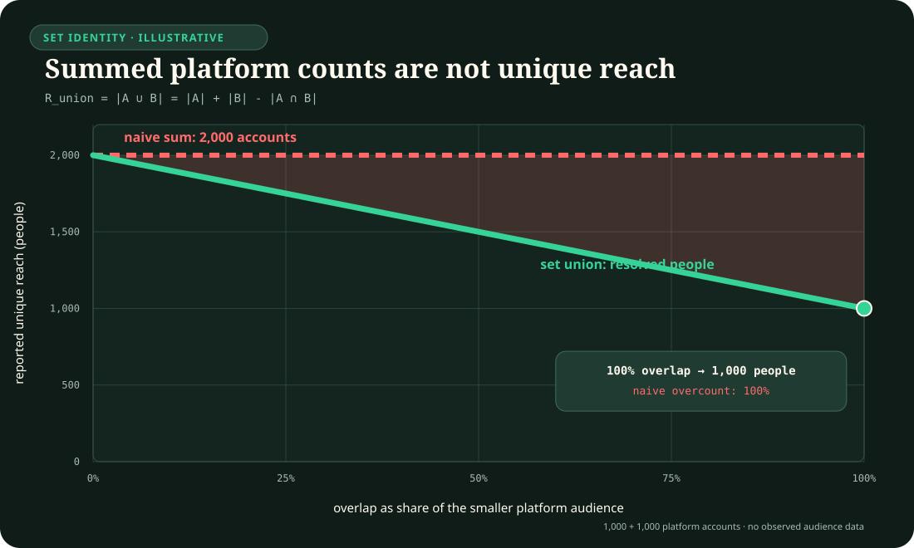

# Political, administrative, stratification, and media-system depth

- **Audit date:** 2026-08-24
- **Scope:** electoral conversion and legislative observation; public-service
  performance targets and administrative capacity; wealth tails,
  correspondence audits, and cumulative inequality; cross-platform audience
  measurement and platform-moderation statistics.
- **Question:** which remaining political-science, public-administration,
  stratification, and communication/media boundaries survive after the
  project's existing social-choice, direct-social-research, institutional,
  inequality, platform-method, causal, metrology, and media-system audits are
  treated as mandatory nulls?
- **Evidence rule:** legal rules, administrative records, academic estimands,
  normative objectives, and proposed AI translations retain distinct roles.
  A formal rule or reporting duty is never empirical validation.
- **Promotion state:** no new principle and no new candidate. Exactly nine
  scoped claims are integrated as `C-1431`--`C-1439`; each routes to existing
  candidates and loses any engineering novelty when a complete field-standard
  null reaches the same quality--resource frontier.
- **Execution state:** exactly nine complete CPU-only synthetic falsification
  protocols are specified. They use no personal, electoral-register,
  employment, wealth, platform-account, or moderation-case data.
- **Non-coverage statement:** this is a narrow depth pass, not completion of
  political science, public administration, sociology, stratification, media
  studies, journalism, platform governance, or EU/German public law.

## Executive finding

The additional value is nine anti-collapse boundaries rather than a generic
"social intelligence" mechanism.

1. Votes, seats, representatives, parliamentary majorities, coalitions, and
   governments are different objects. The vote-to-seat map is a versioned
   legal and mathematical operator.
2. Recorded roll calls are selected institutional events. Ideal points and
   cohesion scores inherit agenda, request, whipping, dimensionality, and
   missing-vote assumptions.
3. Reaching an administrative target can coexist with real improvement,
   distortion, queue displacement, classification change, or harm on an
   unmeasured dimension.
4. Administrative capacity is a task- and level-indexed vector. A national
   latent score does not certify a named agency, workflow, or service.
5. Top-wealth shares depend unusually strongly on frame coverage,
   oversampling, nonresponse, valuation, imputation, external-tail additions,
   and the fitted tail model.
6. A correspondence experiment identifies treatment at its sampled decision
   stage under its signal construction; it does not directly identify later
   stages, motive, or the total structure of inequality.
7. A cross-sectional gap does not distinguish accumulated stock from current
   flow. Historical exposures and state-dependent returns can preserve or
   amplify inequality even when current inputs are equal.
8. Accounts, devices, panelists, impressions, reach, time, attention, and
   exposure diversity are not interchangeable audience units. Cross-platform
   reach requires explicit identity resolution and deduplication.
9. Moderation counts describe recorded decisions, not the prevalence,
   exposure, harm, accuracy, fairness, or effectiveness of moderation without
   denominators and a decision--appeal observation model.

These boundaries mostly reinforce
[Candidate 007](../../experiments/candidates/007-endogenous-observation-surveillance.md),
[Candidate 009](../../experiments/candidates/009-graded-assurance-envelopes.md),
[Candidate 011](../../experiments/candidates/011-dual-loop-operational-assurance.md),
[Candidate 014](../../experiments/candidates/014-versioned-observation-contract.md),
[Candidate 018](../../experiments/candidates/018-value-reconstructability-aware-tiering.md),
[Candidate 019](../../experiments/candidates/019-audited-cumulative-inheritance.md),
and
[Candidate 020](../../experiments/candidates/020-constitutional-control-plane.md).
They do not establish a new architecture merely by crossing disciplinary
labels.

## Normative-source header

- **Normative context:** European Union and Germany.
- **Status snapshot:** official texts checked 2026-08-24.
- **German elections:** the official consolidated `Bundeswahlgesetz`, the
  Federal Constitutional Court judgment of 30 July 2024, and the Federal
  Returning Officer's 2025-election method page define legal and operational
  parts of the current Bundestag seat-allocation context. They are binding or
  authoritative for their stated roles, not comparative political-science
  evidence and not a universal electoral design.
- **Equality:** Directive 2000/78/EC and the German `AGG` constrain covered
  employment decisions. A synthetic correspondence test does not decide legal
  liability, protected-ground scope, justification, burden of proof, or
  remedy. Those determinations remain with competent humans and institutions.
- **Media and platforms:** the Digital Services Act is binding EU law; its
  transparency duties distinguish orders, notices, own-initiative decisions,
  automated means, complaints, reversals, and restriction types. Implementing
  Regulation (EU) 2024/2835 supplies reporting templates and version duties.
  The European Media Freedom Act is binding EU law and requires transparent,
  impartial, inclusive, proportionate, non-discriminatory, comparable, and
  verifiable audience-measurement methodology within its scope.
- **Data and AI:** GDPR, the German BDSG, and the EU AI Act remain typed
  applicability and governance constraints. They are reused through `C-1350`
  and are not scientific evidence for `C-1431`--`C-1439`.
- **Applicability hooks:** a real election, public authority, employment
  decision, audience-measurement service, intermediary service, research
  dataset, automated decision, affected person, market, purpose, and Member
  State can activate different provisions. None is activated by the synthetic
  protocols alone.
- **Refusal boundary:** no protocol may produce a real vote recommendation,
  legislator score, entitlement or public-service decision, applicant ranking,
  wealth estimate about a person, platform enforcement action, or legal
  compliance conclusion.

## Taxonomy routing and remaining gaps

| Taxonomy route | Narrow depth added here | Still explicitly outside this pass |
| --- | --- | --- |
| OECD 5.4 Sociology | wealth-tail observation, stage-bounded discrimination, cumulative inequality | urban/rural and health sociology, social work, historical sociology, population breadth, substantive theory |
| OECD 5.6 Political science | electoral conversion, roll-call selection, performance targets, task-indexed state capacity | parties beyond roll calls, executives, courts, comparative regimes, international relations, conflict, public policy breadth |
| OECD 5.8 Media and communications | audience identity/deduplication and moderation-record denominators | journalism practice/history, media industries, interpersonal/intercultural/organizational communication, health/environmental communication |
| DFG 1.23 Sozialwissenschaften | the same nine bounded operators | the board's remaining political, sociological, administrative, and communication breadth |
| ANZSRC 44 Human society | electoral/public-administration and stratification depth | human geography, social work, anthropology, international relations, most substantive sociology |
| ANZSRC 47 Language, communication and culture | audience and platform-moderation measurement depth | journalism, cultural studies, interpreting, rhetoric, organizational communication, most language traditions |

No taxonomy state changes. Every routed field was already `dedicated`; this
audit only narrows named gaps.

## Construct firewall

| Construct | Defined object | Invalid substitution |
| --- | --- | --- |
| eligible electorate | people legally entitled under a versioned election rule | resident population or observed voters |
| valid vote | ballot contribution accepted for a stated contest and denominator | eligible person, turnout, or political preference |
| seat | mandate allocated through a declared district/tier/formula/threshold operator | vote share or government control |
| roll call | recorded vote on a selected motion under chamber procedure | random sample of all legislative choices |
| ideal point | model-dependent latent coordinate identified up to orientation/scale constraints | directly observed ideology or motive |
| target attainment | recorded metric crossing a declared threshold and clock | service quality or public value |
| administrative capacity | resources and capabilities for a named actor, task, level, and period | one timeless national rank |
| net wealth | declared assets minus liabilities at declared values and unit | income, consumption, liquidity, or individual access within a household |
| callback effect | randomized signal effect on a recorded response in a sampled vacancy frame | total discrimination, motive, offer, pay, retention, or structural inequality |
| cumulative advantage | a process in which prior state changes later gain opportunities or returns | every persistent group difference |
| impression | logged delivery or render event under a platform's definition | unique person, attention, belief, or effect |
| reach | deduplicated eligible audience members meeting a declared exposure rule | sum of platform-reported unique accounts |
| moderation decision | provider-reported restriction/reason/action event | prevalence of violative content, accuracy, fairness, or harm reduction |
| appeal reversal | changed recorded decision after a declared complaint/review route | complete false-positive rate without an appeal-selection model |

## Exact deduplication against existing project material

| Candidate residue | Existing owner | Disposition |
| --- | --- | --- |
| preference aggregation and voting rules | social-choice audit; `C-173`--`C-185`; Candidate 020 | **Algorithmically deduplicated.** `C-1431` retains only election-specific unit, denominator, district, tier, formula, threshold, and legal-version provenance. No voting principle. |
| formal rule versus enacted process | `C-1346`, `C-1370`; direct-social and prior social-depth audits | **Reused.** `C-1433` is narrower: measured target, target clock, gaming, substitution, and protected outcome. `C-1434` separates task/level capacity from delivery. |
| latent-variable and measurement invariance | `C-795`, `C-1340`, metrology and direct-social audits | **Reused.** Roll-call ideal points and state-capacity indices remain domain-specific cases; no generic latent-state claim is repeated. |
| inequality operator | `C-1371`; measurement and quantitative-history audits | **Reused.** `C-1435` adds tail-frame/nonresponse/valuation/model composition. `C-1436` adds experimental-stage scope. `C-1437` adds stock--flow--history separation. |
| missingness, selection, and category versions | `C-1339`, `C-1341`, Candidate 014 | **Reused.** No universal missingness mechanism is promoted from wealth or hiring examples. |
| path dependence, inheritance, and feedback | cultural-evolution, learning, memory, causal, and organizational audits; Candidate 019 | **Mechanistically deduplicated.** `C-1437` is a stratification evaluation boundary, not a new memory module or inevitability claim. |
| media production-to-action funnel | `C-1347` | **Fully deduplicated.** Agenda setting, misinformation classification, belief, sharing, behaviour, and harm receive no new claim here. |
| platform/API-conditioned traces | `C-1375`; Candidate 014 | **Reused.** `C-1438` concerns audience-unit identity/deduplication; `C-1439` concerns decision-process denominators and appeals. Neither repeats general API provenance. |
| media-system transport | `C-1376`; Candidate 020 | **Reused.** Ownership, financing, regulation, and national typologies remain the earlier claim's owner. Audience and moderation metrics are not new media-system types. |
| administrative observation feedback | `C-1374`, `C-1204`, Candidate 007 | **Mechanistically deduplicated.** Target gaming and moderation reporting are scoped observation cases; no general Goodhart or surveillance principle is added. |
| EU/German authority and consent | `C-1350`; legal-evidence and normative-baseline documents | **Fully deduplicated.** New official sources only establish current applicability fields and reporting/election operators. |

## Shared mathematical boundary

### Election results are versioned operator outputs

For election rule version (r), write

\[
\mathbf{s}=A_r(\mathbf{v};\mathbf{d},\mathbf{m},\boldsymbol{\tau},
\mathbf{t},\mathbf{e}),
\]

where \(\mathbf{v}\) is the vector of valid vote counts (votes),
\(\mathbf{d}\) assigns votes to districts, \(\mathbf{m}\) gives district
magnitudes (seats), \(\boldsymbol{\tau}\) contains legal/effective thresholds
(fractions), \(\mathbf{t}\) defines allocation tiers and compensation, and
\(\mathbf{e}\) contains eligibility and exception rules. The output
\(\mathbf{s}\) is a seat-count vector. A coalition or government map
\(G(\mathbf{s},\mathcal C)\) additionally needs coalition set \(\mathcal C\);
it is not part of \(A_r\).

### Recorded roll calls are selected observations

For legislator \(i\) and potential motion \(j\), a spatial vote model may use

\[
P(Y_{ij}=1)=\sigma\!\left(\alpha_j+
\boldsymbol{\beta}_j^{\mathsf T}\boldsymbol{\theta}_i+w_{ij}\right),
\qquad
P(R_j=1)=\sigma(\gamma_0+\gamma_1 q_j+\gamma_2 c_j+\gamma_3 a_j),
\]

where \(Y_{ij}\) is a yes/no vote, \(\boldsymbol{\theta}_i\) is a latent ideal
point, \(w_{ij}\) is whip or strategic pressure, \(R_j\) marks a recorded roll
call, \(q_j\) is expected position-taking value, \(c_j\) party-cohesion
contrast, and \(a_j\) agenda state. Estimating the first equation only where
\(R_j=1\) requires assumptions about the second.

### Target metrics are observation and incentive operators

For service unit \(u\) and period \(t\), let

\[
M_{ut}=h_r(\mathbf{Q}_{ut},\mathbf{X}_{ut},\mathbf{G}_{ut})+\epsilon_{ut},
\]

where \(M_{ut}\) is the reported target metric, \(\mathbf{Q}_{ut}\) is the
service-quality vector, \(\mathbf{X}_{ut}\) case mix and demand, and
\(\mathbf{G}_{ut}\) classification, timing, diversion, or gaming actions.
The residual \(\epsilon_{ut}\) is zero-mean reporting and measurement error in
the same registered unit as \(M_{ut}\).
Rule version \(r\) specifies the clock, denominator, censoring, and threshold.
Observed \(M_{ut}\) cannot identify \(\mathbf{Q}_{ut}\) without constraints or
independent outcomes.

### Capacity is indexed by actor, task, level, and time

Let \(\mathbf{k}_{a\ell qt}\) contain fiscal, personnel, informational,
organizational, and implementation capacities for actor \(a\), government
level \(\ell\), task \(q\), and time \(t\). A latent index

\[
z_n=\boldsymbol{\lambda}^{\mathsf T}\mathbf{x}_n+\eta_n
\]

is a model of indicators \(\mathbf{x}_n\), loading vector
\(\boldsymbol{\lambda}\), and residual \(\eta_n\). It does not imply
\(\mathbf{k}_{a\ell qt}=z_n\mathbf{1}\), particularly for an agency or task
outside the index's support.

### Wealth tails combine observation and model choices

For household wealth \(W_h\) in euros and threshold quantile \(p\), the top
share is

\[
S_p=\frac{\sum_h W_h\,\mathbb{1}[W_h\ge q_p]}
           {\sum_h W_h}.
\]

In a sample, inclusion probability \(\pi_h\), response probability \(\rho_h\),
weights, stochastic imputations, asset valuation, and any fitted tail above
\(w_{\min}\) alter the estimator. For a Pareto tail,
\(P(W>w\mid W>w_{\min})=(w_{\min}/w)^\alpha\); \(\alpha\) and
\(w_{\min}\) are assumptions with uncertainty, not observed constants.

### A correspondence effect is stage- and signal-specific

For randomized application signal \(Z\) and callback \(Y^{(1)}\),

\[
\tau_{1}=E[Y^{(1)}(1)-Y^{(1)}(0)\mid V\in\mathcal F],
\]

where \(\mathcal F\) is the sampled vacancy frame. This does not identify the
interview, offer, wage, retention, or motive estimands \(\tau_2,\ldots,\tau_k\)
without new interventions and support.

### Cumulative inequality is a trajectory, not a snapshot

For person \(i\), state \(x_{it}\) in declared units evolves as

\[
x_{i,t+1}=x_{it}+g_t(x_{it},e_{it},o_{it},\mathbf{c}_{it})+\epsilon_{it},
\]

where \(e_{it}\) is current input, \(o_{it}\) opportunity or exposure, and
\(\mathbf{c}_{it}\) institutional context; \(\epsilon_{it}\) is a zero-mean
innovation and measurement residual in the same declared unit as \(x_{it}\).
Equal \(e_{it}\) at one time does
not erase unequal \(x_{it}\), opportunity histories, or state-dependent
returns. The function \(g_t\) may amplify, compensate, reverse, or ignore
prior advantage; cumulative advantage is not assumed universally.

### Cross-platform reach is a set union over resolved people

Let \(E_{pdkt}\in\{0,1\}\) record whether person \(p\), through device/account
\(d\), platform \(k\), and time \(t\), meets an exposure rule. Then

\[
R=\left|\left\{p:\max_{d,k,t}E_{pdkt}=1\right\}\right|,
\qquad
F_p=\sum_{d,k,t}E_{pdkt}.
\]

Reach \(R\) is in people and frequency \(F_p\) in qualifying exposures per
person. Summing platform "unique" accounts double-counts unresolved people;
deduplication is an inference with error, not a formatting operation.

The editable plot specification is
[`core-models.json`](../../assets/plots/core-models.json); the generated SVG is
an illustration of the set identity, not an estimate of real audience overlap.

### Moderation records are selected process outputs

For content item \(j\), moderation record \(D_j\) can be written

\[
D_j=O_r(C_j,L_j,N_j,A_j,H_j,U_j),
\]

where \(C_j\) is underlying content/context, \(L_j\) applicable law or terms,
\(N_j\) notices/orders, \(A_j\) automated detection, \(H_j\) human review,
\(U_j\) user complaint/appeal, and \(O_r\) the versioned reporting operator.
Counts of \(D_j\) lack the unmoderated denominator and do not alone identify
prevalence, false positives/negatives, exposure, or harm.

## Evidence synthesis and integrated claims

### C-1431 — Electoral conversion provenance

Gallagher shows that proportionality indices embody different comparison
operators and that allocation formulae and district magnitude matter.
Germany's current Bundestag method supplies a concrete, current example:
second votes drive upper and lower seat allocation through
Sainte-Laguë/Schepers, constituency seats require second-vote coverage, and
the operative threshold includes the Federal Constitutional Court's 2024
condition. The example is not universal; it demonstrates that even a familiar
label such as proportional representation is insufficient provenance.

- **Evidence status:** established mathematical and legal-method boundary.
- **Primary/authoritative sources:** `Gallagher1991Proportionality`,
  `DE2026Bundeswahlgesetz`, `DE2026FederalReturningOfficerElectoralSystem`,
  `BVerfG2024FederalElectionsAct`.
- **AI translation:** bind any electoral aggregate to electorate, contest,
  ballot-validity, district/tier, allocation, threshold/exception, result
  version, and downstream coalition/government phase.
- **Efficiency mechanism:** recompute only descendants of a changed rule or
  result component; refuse unsupported downstream control claims rather than
  simulating every institutional phase.
- **Failure modes:** vote/seat unit swap; national vote applied to district
  seats; invalid-vote denominator drift; threshold exception omitted; old rule
  applied to new election; tie rule hidden; seats equated with policy control.
- **Measurable prediction:** rule-versioned inference reduces false seat and
  majority claims under formula, threshold, district, and version changes at
  equal input and compute budget.
- **Speculative extension:** none; ordinary electoral software is the hard
  null.

### C-1432 — Roll-call selection and latent legislative position

Clinton, Jackman, and Rivers formalize roll-call ideal-point estimation while
explicitly allowing dimensionality, party whipping, and agenda information.
Carrubba, Gabel, and Hug show that roll-call requests can be endogenous to
party cohesion and therefore make the recorded votes a selected sample for
exactly the quantities analysts seek.

- **Evidence status:** established model and selection boundary.
- **Primary sources:** `ClintonJackmanRivers2004RollCall`,
  `CarrubbaGabelHug2008RollCallSelection`.
- **AI translation:** retain the potential-motion frame, agenda/request rule,
  party-pressure alternative, missing-vote process, identification anchors,
  dimensionality, and posterior uncertainty with every legislator score.
- **Efficiency mechanism:** use cheap selection diagnostics before fitting or
  transporting expensive latent-position models.
- **Failure modes:** selected votes treated IID; polarity swapped; party whip
  mistaken for preference; abstention/missingness discarded; one-dimensional
  fit forced; score transported across chambers or agendas.
- **Measurable prediction:** selection-aware or abstaining models reduce false
  rank/cohesion claims under position-taking and whipping generators.
- **Speculative extension:** a generic preference-reading module is rejected.

### C-1433 — Administrative target attainment and service quality

Bevan and Hood document mechanisms by which target systems can create ratchet,
threshold, and output-distortion incentives. Hood supplies a cross-service
account of target gaming. Kelman and Friedman are an essential hostile source:
their analysis of the English emergency wait-time target found large
improvement and no evidence for the tested dysfunctions. The correct claim is
therefore conditional, not "targets always corrupt."

- **Evidence status:** established possibility and scoped empirical
  heterogeneity; universal dysfunction is disputed and rejected.
- **Primary sources:** `BevanHood2006Targets`, `Hood2006Targetworld`,
  `KelmanFriedman2009PerformanceDysfunction`.
- **AI translation:** separate target definition/clock from demand, case mix,
  recorded attainment, operational response, independent quality vector,
  queue displacement, and downstream outcome.
- **Efficiency mechanism:** trigger independent audits where metric--outcome
  residuals, threshold bunching, or denominator changes concentrate risk.
- **Failure modes:** automatic gaming accusation; improvement dismissed;
  target clock changed; queue shifted outside window; easy cases selected;
  unmeasured outcome worsens; target crossing treated causal.
- **Measurable prediction:** multi-outcome target records lower false quality
  claims and false gaming accusations versus target-only detection.
- **Speculative extension:** no universal Goodhart detector is claimed.

### C-1434 — Task-indexed administrative capacity

Hanson and Sigman model state capacity through extractive, coercive, and
administrative dimensions and make their latent construction explicit.
Fukuyama distinguishes capacity, autonomy, procedure, and output and warns
against treating outputs as direct measures of executive quality. Both support
measurement programmes; neither makes a national latent score a certificate
for every agency or task.

- **Evidence status:** established construct/model boundary; the proposed
  actor--task record is plausible and unvalidated.
- **Primary sources:** `HansonSigman2021StateCapacity`,
  `Fukuyama2013Governance`.
- **AI translation:** route a claim through actor, government level, task,
  time, resources, professionalization, information access, autonomy,
  workload, output operator, and transfer support.
- **Efficiency mechanism:** reuse broad indices for screening, then acquire
  task-specific evidence only near a decision boundary.
- **Failure modes:** national-to-local ecological fallacy; capacity conflated
  with democracy, legality, or outcome; one dimension compensates another;
  task support absent; indicator leakage; changing indicator set.
- **Measurable prediction:** task-indexed vectors reduce false service-capacity
  certification under cross-level and cross-task shifts.
- **Speculative extension:** no scalar state-capacity controller.

### C-1435 — Wealth-tail observation and model dependence

The ECB's HFCS methodology documents wealthy-household oversampling, item
nonresponse, multiple imputation, and cross-country differences in affluent
coverage. Vermeulen demonstrates through Monte Carlo and combined survey/rich-
list analyses that differential nonresponse can bias top-tail shares downward
and that a small number of extreme observations can materially change them.
Eurostat's 2026 income-consumption-wealth series is explicitly experimental
and warns that the accuracy of the matched joint distribution cannot be
assessed directly.

- **Evidence status:** established observation and tail-model boundary.
- **Primary/authoritative sources:** `Vermeulen2018TopWealthTail`,
  `ECB2023HFCSMethodology`, `Eurostat2026ICWExperimental`.
- **AI translation:** retain asset/liability definitions, price date,
  household/person unit, frame, inclusion/response, oversampling, weights,
  imputation replicates, external-tail source, threshold, tail family, and
  uncertainty.
- **Efficiency mechanism:** allocate collection/model review to tail regions
  that dominate decision uncertainty rather than uniformly increasing sample
  size.
- **Failure modes:** income substituted for wealth; household share attributed
  to members; rich list treated census; design weights ignored; Pareto threshold
  tuned post hoc; liabilities/valuation version drift; imputation uncertainty
  dropped.
- **Measurable prediction:** design- and tail-aware estimators improve top-share
  interval coverage under wealth-dependent nonresponse at equal observed
  household count.
- **Speculative extension:** no universal Pareto law or fixed tail threshold.

### C-1436 — Stage-bounded correspondence discrimination evidence

Bertrand and Mullainathan randomized name signals on otherwise matched resumes
and measured employer callbacks, establishing a causal effect for that
signal, frame, place, period, and stage. Lippens, Vermeiren, and Baert synthesize
hundreds of correspondence experiments and document substantial heterogeneity
by ground, outcome coding, region, and period. The method is strong for its
estimand precisely because the estimand is bounded.

- **Evidence status:** established randomized-stage boundary.
- **Primary sources:** `BertrandMullainathan2004Callbacks`,
  `LippensVermeirenBaert2023HiringDiscrimination`,
  `EU2000EmploymentEquality`, `DE2006AGG`.
- **AI translation:** bind an audit result to manipulated signal construction,
  vacancy frame, job/region/time, response definition, application pairing,
  interference/detection risk, decision stage, legal scope, and uncertainty.
- **Efficiency mechanism:** request later-stage evidence only when the intended
  claim crosses beyond the randomized callback stage.
- **Failure modes:** signal equated with identity; callback equated with offer
  or wage; sampled vacancies treated labour market; employer motive inferred;
  protected-ground scope automated; repeated applications create interference.
- **Measurable prediction:** stage-qualified audit records are hypothesized to
  reduce the registered unsupported callback-to-offer/pay assertion rate to
  zero without weakening callback-effect detection.
- **Speculative extension:** no automated liability or applicant-ranking use.

### C-1437 — Historical stock, current flow, and cumulative inequality

Merton's Matthew-effect case and DiPrete and Eirich's review show that
"cumulative advantage" names multiple processes rather than one universal
law. A favourable state may become a resource for later gains, but empirical
forms and mechanisms differ across education, careers, health, and generations.
The durable boundary is to distinguish starting stock, exposure/opportunity,
state-dependent return, current input, selection, and attrition.

- **Evidence status:** established family of scoped mechanisms; universal
  amplification is rejected.
- **Primary sources:** `merton1968matthew`,
  `DiPreteEirich2006CumulativeAdvantage`.
- **AI translation:** preserve event histories and inherited state for
  longitudinal inequality claims; compare amplifying, compensatory, constant-
  return, reversal, and selection-only alternatives.
- **Efficiency mechanism:** store sufficient state-change summaries and
  targeted anchors instead of every raw event when reconstructability tests
  pass.
- **Failure modes:** current equality treated historical equality; survivor
  sample; regression to mean omitted; group mean applied to person; structural
  change ignored; every persistence labelled cumulative advantage.
- **Measurable prediction:** history-aware models reduce future-gap and
  intervention-effect error under state-dependent returns while tying snapshot
  models in memoryless worlds.
- **Speculative extension:** the storage translation remains unproven against
  conventional longitudinal models and Candidate 019's complete null.

### C-1438 — Audience identity, reach, and exposure measurement

Ksiazek shows that cross-platform audience duplication is itself an analytic
object with multiple operators. Moe, Hovden, and Karppinen distinguish exposure
diversity from structural/content diversity and operationalize it through
media repertoires. EMFA Article 24 makes methodology, comparability,
verifiability, inclusiveness, and independent audit explicit legal concerns;
it does not make proprietary counts scientific truth.

- **Evidence status:** established measurement boundary; metric choice remains
  purpose-specific.
- **Primary/authoritative sources:** `Ksiazek2011CrossPlatformAudience`,
  `MoeHovdenKarppinen2021ExposureDiversity`, `EU2024MediaFreedomAct`.
- **AI translation:** bind each audience figure to the dependencies its
  estimand and data path actually require. Person-level cross-platform reach
  inferred from account/device logs requires identity linkage and
  deduplication; survey-repertoire exposure diversity instead requires its
  respondent frame, content mapping, weighting, exposure qualification,
  uncertainty, and version without inventing device/account identities.
- **Efficiency mechanism:** acquire identity anchors where overlap uncertainty
  dominates net-reach or diversity decisions; reuse aggregate counts elsewhere.
- **Failure modes:** sum of platform uniques; device equals person; logged-in
  only; household member ambiguity; content IDs fail to reconcile; bots mixed;
  viewability equals attention; proprietary methodology changes silently.
- **Measurable prediction:** identity-aware inference improves net-reach
  coverage under device/account fragmentation, while operator- and
  content-aware inference improves exposure-diversity coverage on its declared
  survey or event path.
- **Speculative extension:** no universal attention metric.

### C-1439 — Moderation records, denominators, and appeals

DSA Articles 15, 17, 20, 24, and 42 distinguish decision sources, reasons,
restriction types, automated means, complaints, and reversals; Implementing
Regulation 2024/2835 adds harmonized report fields and version retention.
Dergacheva and colleagues show large platform differences even in a one-day
slice. Groesch and colleagues' analysis of 3.52 billion statements of reasons
finds database-design and reliability limits for prevalence and scrutiny
questions. The database is valuable evidence about reported decisions, not an
unmoderated content census.

- **Evidence status:** established reporting/observation boundary; empirical
  database findings remain version- and period-scoped.
- **Primary/authoritative sources:** `EU2022DigitalServicesAct`,
  `EU2024DSATransparencyTemplates`, `DergachevaEtAl2023OneDayModeration`,
  `GroeschEtAl2026DSATransparency`.
- **AI translation:** retain service, content/action unit, denominator,
  detection/notice/order path, law/terms basis, policy/version, language,
  automation/human stages, visibility restriction, complaint, appeal,
  reversal, reinstatement, exposure, and independent audit roots.
- **Efficiency mechanism:** target independent sampling and adjudication at
  provider/language/action cells with high denominator or reversal uncertainty.
- **Failure modes:** decisions divided by users as prevalence; repeated actions
  counted unique content; removals and demotions pooled; law and terms pooled;
  appeals treated random; reversals treated all errors; reporting change
  treated behavioural change; provider self-report treated independent.
- **Measurable prediction:** denominator- and process-aware analysis reduces
  false prevalence, accuracy, and effectiveness claims under platform/report
  changes at equal record count.
- **Speculative extension:** no automated moderation policy or compliance
  judgment.

## Common CPU-only protocol contract

The following rules are part of all nine protocols and are not optional prose.

- **Generator:** deterministic TypeScript or JavaScript using PCG32 with a
  recorded generator version and SHA-256 hash. No network access at run time.
- **Seed packs:** 48 public development seeds and 96 sealed confirmation seeds
  per track. Track `k` uses only development seeds
  `1431000 + 1000k + 1` through `+48`. Confirmation seeds and hostile-environment
  assignments are independent random 64-bit values with no published formula;
  before development, an offline custodian publishes only
  `SHA-256(UTF8("SS7-confirm-v1") || 0x00 || salt_32 || canonical(bundle))`.
  The salt and
  bundle remain inaccessible until code, models, thresholds, and analysis are
  frozen. Reveal validation rejects any duplicate or overlap within or across
  development, confirmation, track, and environment namespaces.
- **Arm A:** deliberately collapsed field baseline.
- **Arm B:** complete mature domain null named in each track.
- **Arm C:** existing project candidates composed only through their published
  interfaces; no hidden variables or extra labels.
- **Equal information:** every arm receives the same eligible raw records,
  train/development/confirmation split, labels, schema bytes, and update
  schedule. If B or C derives an operator/history/identity field, derivation
  cost is charged and the same primitive inputs are available to all arms.
- **Feasibility and equal compute:** a smoke profile uses at most 5% of each
  track's units on one CPU thread, 2 GiB RAM, 120 CPU-seconds, and 2 GiB output
  to validate lineage only. Before freezing the full profile, B runs on 12
  development seeds on the declared machine; the common per-arm ceiling is
  twice B's observed p99 CPU time, rounded upward, with hard maxima of one
  pinned CPU thread, 8 GiB RAM, 7,200 CPU-seconds, and 8 GiB persisted output.
  If B cannot fit, the generator/profile is reduced before registration; this
  preflight is not a scientific failure. After freezing, every arm receives
  the same ceiling and an overrun is a retained resource failure.
- **Runtime identity:** `config.json` freezes CPU model and microcode, RAM, OS
  and kernel, runtime and dependency locks, power mode, thread affinity,
  filesystem, clock source/resolution, and thermal acceptance window.
- **Energy boundary:** this CPU-only protocol records energy as `not measured`.
  No energy comparison or efficiency claim is permitted until a separately
  frozen, calibrated, interval-owned external-meter profile exists.
- **Equal review:** no manual labels or legal decisions. Synthetic oracle
  access is allowed only for scoring after all arm outputs are sealed.
- **Primary analysis:** paired differences across independent seeds; never
  treat people, households, motions, impressions, or decisions within a seed
  as independent confirmation replicates. Report a two-sided 99% bootstrap
  interval over seed differences and apply Holm correction across the nine
  registered primary comparisons at familywise \(\alpha=0.05\).
- **Joint resource gate:** C must use no more than B plus 5% CPU-seconds,
  peak RAM, stored bytes, and inference latency; any dimension above the bound
  fails noninferiority even if the scientific metric improves.
- **Protected gate:** no rights-rule violation, real-person inference, target
  action, or forbidden output. One violation kills the run and the proposed
  composition.
- **Required artifacts:** `config.json`, `generator.json`, `seeds.json`,
  `events.jsonl`, `arm-a.jsonl`, `arm-b.jsonl`, `arm-c.jsonl`, `metrics.json`,
  `claims.json`, `resource.json`, `summary.md`, `sha256sums.txt`, and an
  append-only `ledger.jsonl`. Each claim record includes unit, denominator,
  operator/version, support, uncertainty, status, and refusal reason.
- **Global engineering-success threshold:** C must reduce the track's primary
  false-claim rate by at least 25% relative and at least 2 percentage points
  absolute versus B, with the corrected 99% interval excluding zero, while
  meeting coverage, calibration, protected, and resource gates.
- **Answer-coverage gate:** the oracle freezes every eligible in-support and
  out-of-support claim opportunity before arm execution. An unsupported refusal
  on an in-support opportunity counts as one primary loss, and C's in-support
  answer/decision coverage must be at least 95% and no more than 1 percentage
  point below B with a one-sided 99% paired bound. Out-of-support answers count
  as false claims where refusal is mandatory. Abstention therefore cannot win
  by shrinking the denominator.
- **Global kill gate:** if B is within 0.5 percentage points of C on false
  claims, within 0.01 on calibration error, and passes every protected/resource
  gate, the proposed project composition is killed for that track. The field
  boundary may remain established even when project novelty is zero.
- **No promotion:** passing is `protocol_complete`, never `claim_eligible` or
  candidate promotion. Fresh implementation review and the repository's
  workstation gates remain controlling.

## Nine complete falsification protocols

### SS7-T01 — Vote-to-seat and downstream-phase provenance

- **Claim:** `C-1431`.
- **Primary unit and units:** one party-by-district contest; votes (count),
  valid-vote share (fraction), seats (count), turnout (fraction).
- **Generator:** 64 parties/district systems per seed, 6--14 parties,
  1--40 seats per district, one/two allocation tiers, plurality, d'Hondt,
  Sainte-Laguë/Schepers, largest remainder, compensatory/non-compensatory
  variants, thresholds `0--0.08`, minority/constituency exceptions, invalid
  ballots, ties, coalition sets, and four rule versions. At least 25% of worlds
  hold national vote totals fixed while seats change.
- **Arms:** A uses national vote shares and one fixed proportional formula; B
  is exact versioned electoral software with independent property tests and a
  separate coalition phase; C is Candidate 014 plus Candidate 020 carrying the
  same operator and authority fields.
- **Mature null:** open, exact integer/rational electoral computation with
  district/tier, threshold, exception, tie, and coalition separation.
- **Hostile families:** same votes/different districts; same shares/different
  valid denominator; formula change; threshold crossing; exception activation;
  direct-seat coverage change; tie; coalition majority without single-party
  majority; rule version applied one election late.
- **Primary metric and threshold:** false seat/majority/government assertions
  per 100 worlds; B must achieve exact seat parity in all non-tie worlds and
  explicit finite outcome sets in ties. C uses the global success threshold.
- **Secondary metrics:** seat-count L1 error, false refusal, Brier score for
  probabilistic coalition claims, CPU-seconds, bytes, and explicit energy status
  `not measured` in the CPU-only profile.
- **Track kill:** any C gain caused by receiving coalition candidates, rule
  versions, or exceptions withheld from B; any seat-to-government collapse;
  or mature-null parity under the global kill tolerance.
- **Extra artifacts:** `rules.json`, `seat-oracle.jsonl`,
  `coalitions.jsonl`, `phase-errors.csv`.

### SS7-T02 — Selected roll calls and legislative latent positions

- **Claim:** `C-1432`.
- **Primary unit and units:** legislator-by-potential-motion vote; binary vote,
  ideal-point coordinate (standardized latent unit), rank correlation
  (dimensionless), cohesion (fraction).
- **Generator:** 240 legislators, 800 potential motions, 1--3 true dimensions,
  agenda windows, party labels, whip shifts, abstention, absences, strategic
  voting, and roll-call request mechanisms ranging from random to strong
  position-taking/cohesion selection. Generate full latent votes but expose
  only selected recorded votes.
- **Arms:** A fits a one-dimensional ideal-point model to recorded votes as IID;
  B fits selection-sensitive Bayesian/spatial alternatives, party-pressure and
  missingness models, dimensionality checks, orientation anchors, and
  abstention; C adds Candidate 009/014 envelopes and typed refusal.
- **Mature null:** registered roll-call ideal-point workflow with request-
  mechanism sensitivity and posterior predictive checks.
- **Hostile families:** moderate motions never recorded; whip only on roll
  calls; position-taking without vote change; multidimensional agenda; anchor
  swap; party switch; selective absence; sparse legislator; chamber transport.
- **Primary metric and threshold:** false pairwise rank/cohesion claims per 100
  eligible claims; B/C 99% interval coverage must be `0.98--1.00` under correct
  specification and refusal must exceed `0.95` outside declared support.
- **Secondary metrics:** Kendall's tau to oracle, cohesion absolute error,
  dimensionality error, expected calibration error, refusal precision/recall.
- **Track kill:** C infers private motive, labels a real legislator, or beats B
  only through oracle access; mature-null parity kills the composition.
- **Extra artifacts:** `potential-motions.jsonl`, `recorded-rollcalls.jsonl`,
  `selection-models.json`, `rank-claims.csv`.

### SS7-T03 — Public-service targets, improvement, and gaming

- **Claim:** `C-1433`.
- **Primary unit and units:** service-unit week; waiting time (minutes), demand
  and completed cases (counts/week), adverse outcomes (count/10,000 cases),
  quality components (fractions).
- **Generator:** 400 service units over 104 weeks with demand/case-mix shocks,
  staffing/capacity, genuine process improvement, threshold targets, clock
  start/stop versions, queue diversion, reclassification, easy-case selection,
  unmeasured quality substitution, and no-gaming worlds. Target attainment and
  protected outcomes may agree, diverge, or reverse.
- **Arms:** A uses target attainment as quality; B uses interrupted/panel
  designs, demand/case-mix adjustment, full quality vector, bunching and
  denominator diagnostics, independent outcomes, and no-gaming alternative;
  C adds Candidate 007/011/014 dependency and assurance records.
- **Mature null:** complete public-performance evaluation that can conclude
  improvement, dysfunction, mixture, or non-identification.
- **Hostile families:** true improvement at threshold; gaming without harm;
  harm without visible gaming; queue moved; clock changed; case mix improves;
  demand collapse; metric worsens while protected outcome improves; target
  introduced with pretrend.
- **Primary metric and threshold:** false quality or false gaming assertion
  fraction (`1`) over eligible service-unit claims; both error fractions must
  remain at or below `0.02` (2 per 100) for B/C in registered in-support
  families and corrected interval coverage must be at least `0.98`.
- **Secondary metrics:** threshold bunching detection, quality-vector RMSE,
  subgroup harm, change-point localization, false refusal, latency/resources.
- **Track kill:** any fixed "gaming" label from target crossing, any weighted
  score hiding an adverse-outcome increase, or B/C equivalence under the global
  kill tolerance.
- **Extra artifacts:** `service-weeks.jsonl`, `target-versions.json`,
  `quality-oracle.jsonl`, `gaming-confusion.csv`.

### SS7-T04 — Actor/task/level administrative capacity

- **Claim:** `C-1434`.
- **Primary unit and units:** agency-task-quarter; staff full-time equivalents
  (FTE), budget (2025 euros/quarter), workload (cases/quarter), latency (days),
  error/service outcomes (fractions).
- **Generator:** 80 polities, 4 levels, 60 agencies, 12 task families, 20
  quarters, correlated fiscal/personnel/information/organizational capacities,
  autonomy, shocks, measurement indicators, outcome feedback, missing agencies,
  and tasks outside national-index support.
- **Arms:** A transports one national capacity score to every agency/task; B
  uses a multilevel vector measurement model with construct, indicator,
  support, posterior predictive, and task-outcome checks; C adds Candidate
  009/014/020 claim typing and abstention.
- **Mature null:** hierarchical latent-variable plus task-specific operational
  capacity model, not a single leaderboard.
- **Hostile families:** high fiscal/low information capacity; national high/
  local low; capable agency/new task; good outcome from low demand; bad outcome
  despite high capacity after shock; changed indicator loadings; task absent
  from training; legality/value intentionally independent of capacity.
- **Primary metric and threshold:** false task-capacity certification per 100
  agency-task-quarters; support-excluded certification must be zero and B/C
  coverage `>=0.98` for eligible component claims.
- **Secondary metrics:** vector RMSE by dimension, ecological-transfer error,
  refusal precision/recall, indicator-drift detection, resource use.
- **Track kill:** any scalar value compensates a missing critical task
  component; capacity is used as legality, desirability, or rights authority;
  or B matches C.
- **Extra artifacts:** `capacity-vectors.jsonl`, `indicator-versions.json`,
  `task-support.json`, `certification-errors.csv`.

### SS7-T05 — Wealth top-tail reconstruction

- **Claim:** `C-1435`.
- **Primary unit and units:** household; assets, liabilities, net wealth and
  income in constant 2025 euros; survey weights (households); shares/Gini
  (fractions).
- **Generator:** population of 50,000 households per seed with mixture body
  and Pareto/lognormal/generalized-Pareto tails, negative net wealth, asset-
  specific valuation error, wealthy oversampling, wealth-dependent unit/item
  nonresponse, five stochastic imputations, design weights, rich-list-like
  external observations with coverage/valuation error, and country/time
  versions. Expose exactly 5,000 responding households per arm.
- **Arms:** A uses unweighted complete cases and empirical top observations; B
  uses survey design, multiple imputation, nonresponse sensitivity, registered
  tail-family/threshold comparison, external-list uncertainty, bootstrap, and
  partial identification; C adds Candidate 014/018 dependency and
  reconstructability records.
- **Mature null:** complete survey-statistical tail workflow with model
  averaging/sensitivity and abstention.
- **Hostile families:** missing richest households; oversampling ignored;
  liabilities omitted; valuation base changes; external list duplicates or
  misses private wealth; Pareto false; threshold selected after fit; negative
  wealth; household-to-person attribution; statistical matching misspecified.
- **Primary metric and threshold:** top-1% share absolute error (percentage
  points) and 99% interval noncoverage. B/C median absolute error must be
  `<=2.0` percentage points in support and coverage `>=0.98`; unsupported
  external-tail worlds require abstention/bounds.
- **Secondary metrics:** top-0.1% and top-10% error, Gini error, tail-index bias,
  imputation variance, false precision, compute/storage.
- **Track kill:** one fixed tail law or threshold wins only on its generating
  family; rich-list values treated truth; individual access inferred; or B
  matches C.
- **Extra artifacts:** `population-oracle.parquet.json`, `survey.jsonl`,
  `imputations.jsonl`, `tail-fits.json`, `wealth-coverage.csv`.

### SS7-T06 — Correspondence-audit stage transport

- **Claim:** `C-1436`.
- **Primary unit and units:** vacancy-application pair; callback/interview/
  offer/acceptance (binary), wage (2025 euros/hour), days to response (days).
- **Generator:** 10,000 vacancies, paired randomized name/age/disability/
  religion signals, signal ambiguity, occupation/region/firm strata,
  vacancy-frame selection, application-order interference, experiment
  detection, callbacks, interviews, offers, wages, retention, and structural
  background gaps. Callback and later-stage effects vary independently.
- **Arms:** A extrapolates callback difference to every stage and motive; B
  estimates paired/randomized callback effects with cluster/stratum inference,
  multiple testing, signal interpretation checks, frame limits, interference
  sensitivity, and explicit non-identification of later stages/motive; C adds
  Candidate 009/014/020 typed claim/authority/refusal.
- **Mature null:** best-practice correspondence analysis restricted to its
  randomized signal, sample, and recorded response stage.
- **Hostile families:** callback effect only; later-stage effect only; opposite
  signs by stage; signal weak/ambiguous; occupation composition shift; repeated
  applications detected; frame excludes small firms; outcome coding change;
  law scope intentionally unresolved.
- **Primary metric and threshold:** false transport assertions per 100 stage/
  population/motive claims; B/C callback-effect coverage `>=0.98`, later-stage
  unsupported assertion rate zero, and callback detection power `>=0.80` for
  registered effects of 3 percentage points or more.
- **Secondary metrics:** callback ATE error, heterogeneity calibration,
  interference diagnostics, false/excess refusal, resources.
- **Track kill:** protected trait used to rank an applicant, legal liability
  inferred, later outcomes exposed only to C, callback power sacrificed to
  blanket refusal, or B matches C.
- **Extra artifacts:** `vacancies.jsonl`, `applications.jsonl`,
  `stage-oracle.jsonl`, `transport-errors.csv`.

### SS7-T07 — Cumulative inequality versus snapshot parity

- **Claim:** `C-1437`.
- **Primary unit and units:** person-year; resource/capability stock (declared
  points), current input (points/year), opportunity events (count/year),
  outcome (points), attrition (binary).
- **Generator:** 20,000 people over 30 periods with unequal/equal initial
  states, amplifying, compensatory, constant, reversing, and memoryless return
  functions; opportunity selection, institutional regime change, measurement
  error, migration between contexts, attrition/survivorship, and interventions
  that equalize flows but not stocks or histories.
- **Arms:** A predicts from current cross-section/input; B uses longitudinal
  multilevel/state-space, fixed-effects/event-history, attrition/IPW and
  sensitivity models with explicit competing dynamics; C adds Candidate
  014/018/019 dependency-preserving summaries and reconstructability checks.
- **Mature null:** full longitudinal causal/predictive analysis with history,
  state dependence, selection, regime, and memoryless alternatives.
- **Hostile families:** equal flow/unequal stock; equal stock/different history;
  regression to mean; compensatory returns; survivor-only convergence;
  institutional reset; group composition change; memoryless world; unmeasured
  confounding marked unidentifiable.
- **Primary metric and threshold:** false amplification/compensation or
  intervention-effect assertions per 100 trajectories; B/C dynamic-class
  accuracy `>=0.95` in support, 99% interval coverage `>=0.98`, and tie within
  1 percentage point of A in memoryless worlds.
- **Secondary metrics:** 5/10-period gap forecast RMSE, attrition bias, history-
  ablation error, reconstructability loss, false refusal, resources.
- **Track kill:** all persistence labelled cumulative advantage, individual
  path inferred from group mean, compression loses a decision-relevant history,
  or B matches C.
- **Extra artifacts:** `trajectories.jsonl`, `regimes.json`,
  `history-summaries.jsonl`, `dynamic-confusion.csv`.

### SS7-T08 — Cross-platform audience reach and diversity

- **Claim:** `C-1438`.
- **Primary unit and units:** person-device/account-platform-content exposure;
  people/accounts/devices/impressions (counts), reach (people and fraction),
  frequency (exposures/person), exposure diversity (declared index).
- **Generator:** 20,000 latent people, households, 1--6 devices/person, 0--4
  accounts/platform, shared devices, logged-out use, bots, five platforms,
  platform-specific "unique" definitions, panel undercoverage, content-ID
  mappings, eligibility/viewability/attention stages, identity-match scores,
  cross-platform duplication, and measurement-version changes.
- **Arms:** A sums platform uniques/impressions; B uses calibrated panel plus
  census integration, person/device/account graph, probabilistic linkage,
  deduplicated reach/frequency, content mapping, survey weighting, uncertainty,
  and sensitivity; C adds Candidate 009/014 dependency and assurance records.
- **Mature null:** audited cross-media measurement with explicit identity,
  coverage, qualification, deduplication, comparable metrics, and uncertainty.
- **Hostile families:** same person/many accounts; shared household device;
  logged-out viewer; unmatched mobile/TV; bot account; content alias;
  cross-platform campaign; viewability/attention divergence; panel misses young
  users; proprietary version changes without count-format change.
- **Primary metric and threshold:** net-reach absolute error (percentage points)
  and 99% noncoverage; B/C error `<=1.5` percentage points, coverage `>=0.98`,
  and no unsupported person-level identity claim.
- **Secondary metrics:** frequency MAE, exposure-diversity rank error,
  duplication-rate error, linkage calibration, subgroup coverage, resources.
- **Track kill:** deterministic identity asserted below registered match
  support, attention inferred from impressions, bots/people pooled, B denied
  linkage primitives, or B matches C.
- **Extra artifacts:** `identity-oracle.jsonl`, `platform-events.jsonl`,
  `content-map.json`, `audience-coverage.csv`.

### SS7-T09 — Moderation decisions, prevalence, and appeal selection

- **Claim:** `C-1439`.
- **Primary unit and units:** content/action-decision record; content items,
  accounts, decisions, notices, orders, complaints, reversals (counts), rates
  per 10,000 eligible items or exposures, latency (hours).
- **Generator:** 200,000 content items across eight services, 12 languages,
  legal/terms categories, contextual ground truth with irreducible ambiguity,
  user and trusted-flagger notices, authority orders, automated/human detection,
  action types (remove, demote, suspend, monetize, label), repeated actions,
  exposure, appeals selected by user resources, reversals/reinstatement,
  policy/report versions, missing/inconsistent self-report fields, and
  independent stratified audit samples.
- **Arms:** A treats statement-of-reasons counts per user as prevalence and
  falling counts as effectiveness; B uses item/action deduplication, eligible
  denominators, detection and appeal-selection models, action/law/terms/
  language/version strata, audit sample, uncertainty, and non-identification;
  C adds Candidate 007/009/014/020 typed observation and authority records.
- **Mature null:** full DSA-schema-aware administrative-data analysis plus
  independent probability audit and complaint/appeal selection sensitivity.
- **Hostile families:** stable prevalence/detection rise; prevalence rise/
  decisions fall; repeated restrictions; removal-to-demotion shift; language
  under-detection; law/terms mapping drift; reporting-template change; appeal
  access inequality; correct reversal after policy change; provider and audit
  sharing a classifier root.
- **Primary metric and threshold:** false prevalence/effectiveness/accuracy
  assertions per 100 cells; B/C coverage `>=0.98` where the audit denominator
  identifies a rate and mandatory refusal elsewhere; false compliance claims
  must be zero.
- **Secondary metrics:** prevalence error per 10,000 items/exposures,
  false-positive/negative bounds, appeal-selection sensitivity, reversal-rate
  error, language/subgroup harm, resources.
- **Track kill:** self-reported decisions treated independent validation,
  appealers treated random, a reversal equated automatically with error,
  normative legality automated, real moderation action emitted, or B matches C.
- **Extra artifacts:** `content-oracle.jsonl`, `moderation-records.jsonl`,
  `appeals.jsonl`, `audit-sample.jsonl`, `moderation-coverage.csv`.

## Mandatory mature-null stack

1. Exact, versioned election arithmetic plus a separate coalition/government
   phase.
2. Roll-call ideal-point inference with selection, agenda, whipping,
   dimensionality, missingness, orientation, uncertainty, and transport checks.
3. Public-performance evaluation with independent outcome vector, demand/case
   mix, timing/denominator versions, no-gaming alternative, and distributional
   effects.
4. Multilevel, multidimensional, task-specific capacity measurement with
   indicator/support and posterior-predictive checks.
5. Survey-design, nonresponse, imputation, valuation, tail-family/threshold,
   external-list, and partial-identification sensitivity for wealth.
6. Randomized, paired/clustered correspondence inference restricted to signal,
   frame, stage, and support with interference and multiple-testing controls.
7. Longitudinal/state-space and causal alternatives with attrition,
   composition, state dependence, regime change, and memoryless nulls.
8. Audited cross-media panel/census integration with person/account/device,
   content mapping, qualification, weighting, linkage, deduplication, and
   uncertainty.
9. Versioned moderation-schema analysis with item/action denominators,
   detection, language, restriction, law/terms, audit, complaint/appeal, and
   correlated-root sensitivity.

These are hard nulls, not optional baselines. A project record that merely
renames their fields has no surviving gain.

## Cross-track failure modes

1. Turning a formal or reporting rule into empirical truth.
2. Comparing quantities with different units, denominators, stages, or
   operator versions.
3. Giving the proposed arm information unavailable to the mature null.
4. Counting within-world rows as independent confirmation samples.
5. Reporting only mean accuracy while hiding tail, subgroup, refusal, rights,
   compute, storage, latency, or energy failures.
6. Treating an index as the multidimensional state it summarizes.
7. Treating a selected administrative record as a population census.
8. Treating an experiment's internal causal effect as transport to another
   stage, population, place, or time.
9. Treating history dependence as destiny or every persistence as cumulative
   advantage.
10. Treating provider transparency as independent audit.
11. Inferring legal compliance, liability, eligibility, or authority from a
   synthetic score.
12. Promoting a claim because prose or a schema became more detailed.

## Source roles and evidence limits

| Sources | Role | What they do not establish |
| --- | --- | --- |
| `Gallagher1991Proportionality`; `ClintonJackmanRivers2004RollCall`; `CarrubbaGabelHug2008RollCallSelection` | primary/formal political-method evidence | best electoral system, true private ideology, or universal party mechanism |
| German election sources | current binding/authoritative operator and judgment | empirical superiority, universal design, or future unchanged law |
| `BevanHood2006Targets`; `Hood2006Targetworld`; `KelmanFriedman2009PerformanceDysfunction` | theory plus scoped empirical public-service evidence | that every target is gamed or that absence of tested dysfunction proves total quality |
| `HansonSigman2021StateCapacity`; `Fukuyama2013Governance` | political-administration construct and measurement evidence | one score valid for every agency/task or normative quality of government |
| `Vermeulen2018TopWealthTail`; ECB/Eurostat methodology | primary tail analysis and authoritative statistical limits | known wealth of a person, one correct tail law, or directly observed joint distribution |
| `BertrandMullainathan2004Callbacks`; `LippensVermeirenBaert2023HiringDiscrimination` | randomized callback evidence and systematic synthesis | employer motive, later-stage effects, or complete structural inequality |
| `merton1968matthew`; `DiPreteEirich2006CumulativeAdvantage` | historical primary case and cross-domain review | universal amplification or inevitability |
| `Ksiazek2011CrossPlatformAudience`; `MoeHovdenKarppinen2021ExposureDiversity` | audience duplication/diversity methods | one universally correct reach, attention, or pluralism metric |
| DSA/EMFA and implementing template | binding EU requirements within scope | scientific validity, compliance conclusion, or causal effect |
| `DergachevaEtAl2023OneDayModeration`; `GroeschEtAl2026DSATransparency` | scoped empirical analyses of reported moderation data | unobserved content prevalence, complete accuracy, fairness, or policy effectiveness |

## Audit disposition

- **Nine integrated claims:** `C-1431`--`C-1439`.
- **Nine complete protocols:** `SS7-T01`--`SS7-T09`.
- **New principles:** zero.
- **New candidates:** zero.
- **Taxonomy state changes:** zero.
- **Deduplicated without new claim:** misinformation belief/sharing/action,
  general platform/API provenance, generic selection/missingness, generic
  latent-variable measurement, media-system transport, formal/enacted-rule
  distinction, and typed legal/ethics authority.
- **Next executable step:** implement one protocol only after a workstation
  fixture earns an exact manifest, frozen seed packs, raw-output schema,
  deterministic replay, negative control, and claim-ineligible smoke mode.
