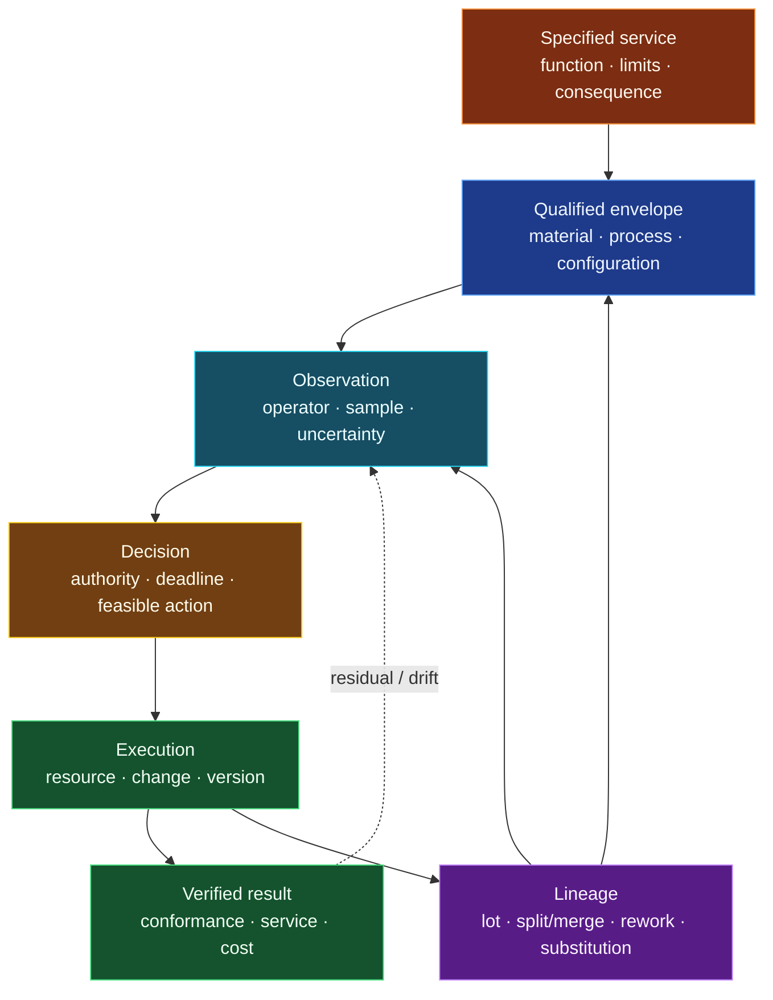

# Production, maintenance, nanomanufacturing, communications, and material qualification

<!-- markdownlint-disable MD013 -->

- **Audit date:** 2026-08-24
- **Scope:** production and manufacturing engineering; statistical process
  state and qualified process windows; reliability-centred maintenance (RCM),
  prognostics, maintainability, and restoration; nanomanufacturing measurement
  and defect populations; adaptive radio links and interacting network-control
  loops; material qualification, inspection documents, and physical lineage
- **Evidence rule:** a controlled process, a capable process, a conforming unit,
  a qualified process, an informative condition estimate, an authorized and
  feasible maintenance action, a restored service, a high physical-layer rate,
  accepted end-to-end service, a traceable history, and qualified material are
  different records
- **Promotion state:** no new principle and no new candidate; nine scoped
  engineering claims are reserved as [C-1361](#c-1361)--[C-1369](#c-1369),
  each with an audit-local falsification contract
- **Execution state:** the nine contracts are CPU-oriented workstation
  specifications, not implemented runners or claim-eligible results
- **Repository constraint:** this file is self-contained for sequential ledger
  integration; it does not modify shared claims, references, registries,
  crosswalks, or coverage files

## Normative-source header

- **Normative context:** EU law and German adoption of European/international
  standards are the default. A standard is used here as authoritative technical
  practice unless a law, contract, product specification, certification basis,
  or project tailoring makes it obligatory. This audit is not a conformity
  assessment or legal opinion.
- **Jurisdiction and authority:** the European Parliament and Council for
  Directive 2014/53/EU (RED) and Regulation (EU) 2024/2847 (Cyber Resilience
  Act, CRA); the European Commission for Recommendation 2022/C 229/01 on the
  definition of nanomaterial; ISO, IEC, CEN/DIN/DKE, ETSI, IAEA, and ECSS for
  the cited standards, specifications, guidance, and sector-bounded practice.
- **Source role:** RED is binding through Member-State implementation when
  covered radio equipment is made available on the Union market or put into
  service. CRA duties apply only through its product, actor, and staged-date
  hooks. Commission Recommendation 2022/C 229/01 is non-binding definition
  guidance. DIN EN and IEC/ISO standards are technical practice unless invoked.
  ETSI EN 302 307-2 is a European technical standard; ETSI GS/GR documents
  specify or study ZSM mechanisms but do not prove deployment benefit. IAEA
  TECDOC-1910 is nuclear-sector good-practice guidance, not a general law. ECSS
  Q-ST-70C Rev.2 is a space-project obligation only when the applicable ECSS
  baseline and tailoring invoke it.
- **Snapshot date and versions:** official status checked 2026-08-24. The RED
  text checked is the consolidated version current from 2026-05-30. CRA Chapter
  IV applied from 2026-06-11; Article 14 reporting applies from 2026-09-11 and
  most remaining provisions from 2027-12-11, so those later provisions were not
  treated as already applicable. ISO 22514-2:2026 edition 3 was published in
  2026-02. ISO 13381-1:2025 edition 3, IEC 60300-3-10:2025 edition 2, ETSI TS
  138 214 V18.10.0 (2026-07), ETSI EN 302 307-2 V1.4.1 (2024-08), ETSI GR ZSM
  009-3 V1.1.1 (2023-08), ETSI GS ZSM 016 V1.1.1 (2024-10), and ECSS-Q-ST-70C
  Rev.2 (2019-10-15) were the evaluated editions. ISO 21363:2020 was published
  but marked for revision; no unpublished revision was treated as current.
- **Applicability hook:** unresolved. A real conclusion requires the intended
  product and function, manufacturing site and actor, material and supplier,
  market and deployment, radio-equipment status, safety consequence, service
  contract, project standard baseline, conformity route, and German
  implementation to be fixed first.

## Executive finding

This pass found no missing general architecture primitive. It found nine
engineering boundaries that the existing concept needs in order to avoid
claiming efficiency from the wrong denominator or layer:

1. process state and control limits are not product specifications;
2. a nominal recipe is not a qualified, versioned process window;
3. maintenance policy follows function, failure mode, consequence, and task
   applicability rather than one universal schedule;
4. a prognosis earns value through a feasible decision before a deadline, not
   prediction accuracy alone;
5. detection and diagnosis do not determine restoration time or availability;
6. a nanoscale image or nominal dimension is not population conformance;
7. adaptive modulation and coding is a mature conditional-computation null whose
   gain depends on delayed and uncertain channel information and a full service
   denominator;
8. individually sensible network-control loops can conflict through shared
   resources, actuators, and goals; and
9. material qualification and material lineage answer different questions.

The reusable contribution is therefore an **engineering evidence chain**, not a
new biological analogy:



Every arrow can fail independently. More monitoring may waste energy when no
action is possible. More automation may amplify oscillation when loops contend.
More traceability may precisely reconstruct an unqualified or falsely recorded
history. More restrictive process settings may reduce escapes while destroying
throughput. These trade-offs belong in the tests rather than being hidden in a
single accuracy, yield, or energy number.

## Construct firewall

The following terms remain separate throughout this audit.

### Production and qualification

- **Specification limit:** externally declared acceptable value boundary for a
  product or service characteristic. It is not estimated from the process.
- **Control limit:** boundary derived from a declared process-state model and
  sampling plan to detect special-cause or state change. It is not permission
  to ship a unit.
- **Statistical control:** evidence that the chosen process model is sufficiently
  stable for its stated use. It is not capability against a specification.
- **Capability or performance statistic:** comparison between an observed/modelled
  process distribution and specification limits, valid only under the statistic's
  assumptions and sampling support.
- **Unit conformance:** decision about one unit under a measurement result,
  decision rule, and uncertainty. It is not proof that the process is stable.
- **Process window:** combinations of inputs and context shown to produce an
  accepted output at declared risk. It is not a list of independent one-factor
  ranges.
- **Qualification:** evidence for a declared material, process, equipment,
  supplier/site, configuration, sampling plan, stress/use envelope, and version.
  It is not an unrestricted lifetime guarantee.

### Maintenance and restoration

- **Reliability:** probability of performing the required function under stated
  conditions for a stated interval.
- **Maintainability:** ability of an item, under stated support conditions, to
  be retained in or restored to a required state.
- **Maintenance:** technical, administrative, and managerial actions intended to
  retain or restore function.
- **Condition indication:** observation associated with degradation. It is not
  diagnosis, remaining useful life, task recommendation, authorization, or
  completed work.
- **Prognosis:** scoped estimate of a future state or time-to-event conditional on
  data and assumptions. It is not a maintenance outcome.
- **Restoration:** return to a verified required function. A repair command,
  replacement, restart, or closed ticket is not sufficient evidence.

### Nano, communications, and materials

- **Nanomaterial classification:** a definition-based population decision, such
  as Commission Recommendation 2022/C 229/01. It is not a performance, safety,
  toxicity, manufacturability, or quality grade.
- **Image:** output of a measurement operator over a field of view and preparation
  path. It is not the complete three-dimensional product population.
- **Physical-layer rate:** coded or uncoded bit rate at one interface. It is not
  accepted application payload, goodput, latency, availability, or end-to-end
  quality of service.
- **Loop status:** self-reported automation state. It is not independent evidence
  that the intended service changed safely.
- **Inspection document:** a document type and declared inspection record. It is
  not automatically authentic, complete, representative, or sufficient for the
  actual use.
- **Lineage:** recorded history and relationships among material/product entities.
  It is not conformity, qualification, identity truth, or substitution authority.

## Deduplication against existing project work

No new `P-` entry survives. The findings sharpen the following established
homes:

- [P-001 selective allocation](../principle-registry.md#p-001--selective-allocation)
  already owns resource-conditional routing; adaptive link control is a hard
  communications null, not a new sparse-routing idea.
- [P-002 local autonomy with exception escalation](../principle-registry.md#p-002--local-autonomy-with-exception-escalation)
  and [P-011 transient communication coalitions](../principle-registry.md#p-011--transient-communication-coalitions)
  already own local/global control composition; loop conflict adds an explicit
  actuator/resource/goal dependency test.
- [P-009 maintenance plane](../principle-registry.md#p-009--maintenance-plane)
  already owns monitoring and repair. RCM, decision-oriented prognosis, designed
  maintainability, logistics, and verified restoration are its mature null stack.
- [P-010 structural offloading and co-design](../principle-registry.md#p-010--structural-offloading-and-co-design)
  already owns substrate/process co-design. Qualified process windows and
  material/configuration change control bound that co-design.
- [P-012 memory matched to information lifetime](../principle-registry.md#p-012--memory-matched-to-information-lifetime)
  and [P-013 externalized shared state](../principle-registry.md#p-013--externalized-shared-state)
  own inspection age and shared lineage state; neither makes the record true.

The closest prior audits also remain the owners of their broader constructs:

- the [metrology audit](2026-08-05-metrology-measurement-science.md) owns
  measurand, operator, calibration, traceability, uncertainty, and decision rule;
- the [process-engineering audit](2026-08-05-process-engineering.md) owns
  balances, control, operability, diagnosis, protection, and nonlinear process
  envelopes;
- the [semiconductor-reliability audit](2026-08-05-semiconductor-device-reliability.md)
  already separates manufacturing yield, qualification, field reliability, and
  lot/wafer/die/time variation;
- the [mechanical/civil audit](2026-08-05-mechanical-civil-resilience.md) already
  separates structural monitoring, residual capacity, maintenance, and recovery;
- the [high-reliability-operations audit](2026-08-05-high-reliability-organizations-incident-learning.md)
  owns live response versus verified organizational learning;
- the [supply-chain/OR audit](2026-08-05-supply-chain-operations-research.md)
  owns queues, inventory, spares, transport, disruption recovery, and records;
  and
- the [power-grid audit](2026-08-05-power-grids-protection-and-recovery.md) owns
  latency-qualified control authority and restoration under physical constraints.

The nine claims below survive because they close field-specific construct gaps,
not because they introduce a new architecture.

## Shared mathematical boundary

### Process state, specification, and capability

For a continuous characteristic $Y$ with mean $\mu$ and standard deviation
$\sigma$, the familiar two-sided index is

$$
C_{pk}=\min\!\left(
\frac{USL-\mu}{3\sigma},
\frac{\mu-LSL}{3\sigma}
\right).
$$

$USL$ and $LSL$ are specification limits in the unit of $Y$; $\mu$ and
$\sigma$ have the same unit; $C_{pk}$ is dimensionless. This expression is not
a licence to pool regimes. Sampling dependence, drift, mixtures, measurement
error, non-normal tails, and small series can invalidate its interpretation.
ISO 22514-2:2026 explicitly addresses time-dependent process models when the
process does not remain in statistical control. Control limits are estimated
from a process model; specification limits come from requirements.

Let $c$ denote context and $v$ the material/equipment/procedure/configuration
version. A project-level stochastic formalization of a qualified process window
is

$$
\mathcal W_v(c)=\left\{x:
\Pr\!\left(Y\in\mathcal A\mid x,c,v\right)\ge 1-\alpha,
\quad g_j(x,c,v)\le0\;\forall j
\right\}.
$$

$x$ is the vector of controllable process inputs with declared native units;
$\mathcal A$ is the accepted output set; $\alpha$ is a dimensionless tolerated
nonconformance probability; and $g_j$ are safety, equipment, environmental, or
resource constraints normalized only when their units differ. The equation is a
testable project representation, not text imported from IAEA or ISO. A change in
$v$ does not inherit $\mathcal W_v$ without a declared bridging or
requalification argument.

### Maintenance information and feasible intervention time

For maintenance policy $\pi$, define a declared lifecycle loss
$J(\pi)$ in one reported unit, such as EUR per asset-hour. The net value of an
information path $I$ is

$$
V_I=J(\pi_0)-J(\pi_I)-C_I,
$$

where $\pi_0$ is the no-new-information policy, $\pi_I$ may use $I$, and $C_I$
is monitoring, communication, compute, review, false-action, and lifecycle cost
in the same unit. Protected safety and rights outcomes remain separate
constraints; they are not monetized by default.

An alert is operationally timely only if, for the relevant quantile and event,

$$
T_{notice} >
T_{diagnose}+T_{authorize}+T_{logistics}+T_{access}+T_{repair}+T_{verify}
+T_{margin}.
$$

All $T$ terms are times in seconds or hours under a declared support scenario.
Mean lead time alone is insufficient when the lower tail crosses the required
intervention time.

For one restoration event,

$$
T_{restore}=T_{detect}+T_{isolate}+T_{authorize}+T_{wait}+T_{access}
+T_{repair}+T_{test}+T_{return}.
$$

The decomposition prevents a better detector from silently receiving credit
for spare availability, access, work instructions, or verification. If uptime
and downtime are stationary enough for the approximation, achieved availability
may be reported as $A\approx T_{up}/(T_{up}+T_{down})$; otherwise report the
service trajectory and event distribution instead of one scalar.

### Nano populations, accepted communications service, and loop dependence

For an illustrative independent-defect model only,

$$
Y_N=(1-p_d)^N,
$$

where $p_d$ is per-opportunity defect probability, $N$ is the number of
independent opportunities, and $Y_N$ is nominal yield. Spatial correlation,
clusters, hidden volume defects, sampling selection, and inspection sensitivity
break this formula. It is a hostile baseline, not a general nanomanufacturing
law.

For link mode $m$,

$$
G_m=R_m\,[1-PER_m(\gamma,\hat\gamma,a,e)]
$$

is link goodput in payload bit/s only after $R_m$ and packet error rate $PER_m$
refer to the same payload/interface. $\gamma$ is actual signal-to-noise-plus-
interference ratio, $\hat\gamma$ its estimate, $a$ estimate/feedback age in
seconds, and $e$ environment/configuration. End-to-end accepted energy is

$$
\varepsilon_{acc}=
\frac{E_{tx}+E_{rx}+E_{estimate}+E_{feedback}+E_{baseband}
+E_{idle}+E_{retransmit}}
{B_{accepted}},
$$

in joule per accepted application payload bit. Report also latency quantiles,
loss, outage, and spectral efficiency; lower $\varepsilon_{acc}$ does not excuse
a protected service violation.

Represent automation loop $i$ as

$$
L_i=(O_i,G_i,A_i,R_i,\tau_i,H_i,F_i,V_i),
$$

where $O_i$ is observation scope, $G_i$ goal/constraints, $A_i$ action and
actuator set, $R_i$ shared resources, $\tau_i$ latency/timescale, $H_i$ authority,
$F_i$ fallback, and $V_i$ outcome verifier. A dependency edge $i\leftrightarrow j$
exists when shared actuators/resources, nested goals, observation effects, or
incompatible actions can change either loop's outcome. Local stability of each
isolated $L_i$ does not establish stability of the composed graph.

## Audit cards

### ENGD-01 — Statistical process state is not product permission

- **Reserved claim:** [C-1361](#c-1361).
- **Evidence status:** established statistical process-management boundary in
  ISO 7870-2:2023 and ISO 22514-1/-2; no claim that one chart or index fits every
  process.
- **Engineering observation:** control charts test a chosen process-state model;
  capability/performance compares a supported process distribution with
  specifications. A stable but off-target process can be non-capable, and a
  pooled capability value can look acceptable while a drifting, mixed, or
  autocorrelated process generates unacceptable runs.
- **AI/system translation:** every training, inference, hardware, and operations
  metric should retain requirement limits, process-state model, subgrouping,
  observation time, version, and uncertainty. A moving average of accepted runs
  cannot serve simultaneously as an alarm boundary and acceptance specification.
- **Efficiency mechanism:** *hypothesis*—state-aware intervention can reduce
  unnecessary inspection/retraining and escapes relative to fixed conservative
  margins, but only when false-alarm work, missed drift, and measurement cost are
  included.
- **Mature null and deduplication:** SPC/change detection, time-series models,
  conformance decision rules, and the existing metrology/process audits. This
  refines P-006/P-009 and Candidates 009/011/014; it is not a new feedback
  principle.
- **Failure modes:** requirement-derived limits replaced by empirical limits;
  post-change samples pooled with pre-change samples; rational subgroups absent;
  autocorrelation treated as independent noise; guard bands omitted;
  non-normal/tail behavior hidden by mean and standard deviation; multiple
  monitoring rules used without false-alarm accounting.
- **Measurable prediction:** under matched inspection and compute, a versioned
  state-aware arm should lower both false release per 10,000 units and needless
  stop/review minutes without increasing protected nonconformance.
- **Protocol:** [WS-ENG-01](#ws-eng-01--state-aware-process-evidence).
- **Stopping rule:** reject the added contract if a complete conventional
  time-series/SPC plus conformance-decision stack matches its release risk,
  detection delay, and lifecycle work, or if any gain disappears under held-out
  drift and mixture families.

### ENGD-02 — A qualified process window is versioned and multidimensional

- **Reserved claim:** [C-1362](#c-1362).
- **Evidence status:** established, sector-bounded qualification practice. IAEA
  TECDOC-1910 describes process parameters, trial batches, a qualified window,
  locked settings, and requalification; ECSS-Q-ST-70C Rev.2 binds material,
  process, configuration, and change in its space-project scope. The stochastic
  set $\mathcal W_v$ above is the project's testable formalization.
- **Engineering observation:** one nominal recipe, a successful demonstration,
  or independent high/low limits cannot show that interactions, gradients,
  equipment state, scale, raw-material lot, or configuration changes remain
  acceptable.
- **AI/system translation:** treat a model/hardware/data pipeline as a versioned
  process whose accepted envelope includes data mix, temperature, batch size,
  precision, compiler/runtime, calibration, routing load, and measurement
  operator. Changes require a declared bridge, partial requalification, or full
  requalification rather than silent inheritance.
- **Efficiency mechanism:** *hypothesis*—an empirically mapped window can allow
  operation closer to useful limits than worst-case static margins while reducing
  rediscovery after every change. Mapping and requalification cost count against
  the gain.
- **Mature null and deduplication:** design of experiments, response surfaces,
  robust design, process validation/qualification, change control, and the
  process/semiconductor/metrology audits. This refines P-009/P-010 and Candidates
  009/014/015.
- **Failure modes:** one-factor-at-a-time ranges combined as a rectangle;
  interpolating across unsupported interaction regions; equipment/site/supplier
  change ignored; trial-batch selection bias; measurement-system change hidden;
  output average accepted while tails or protected characteristics fail;
  extrapolation beyond scale or time support.
- **Measurable prediction:** a versioned interaction-aware window should reduce
  held-out off-specification rate and false inheritance after configuration
  change at a matched qualification sample budget.
- **Protocol:** [WS-ENG-02](#ws-eng-02--qualified-process-window).
- **Stopping rule:** reject the added representation if ordinary factorial/
  response-surface plus change-control practice matches all outcomes at equal
  sample, review, compute, and storage cost, or if the learned window has worse
  protected-tail coverage.

### ENGD-03 — RCM selects failure management by function and consequence

- **Reserved claim:** [C-1363](#c-1363).
- **Evidence status:** established within RCM method sources: Nowlan and Heap,
  IEC 60300-3-11:2009 / DIN EN 60300-3-11:2010-05, with maintenance terminology
  bounded by DIN EN 13306:2018-02.
- **Engineering observation:** RCM begins with required functions and functional
  failures, then identifies failure modes/effects/consequences and asks whether a
  scheduled, condition-based, failure-finding, redesign, or other policy is
  applicable and effective. Failure modes do not all become more likely solely
  because calendar age increases.
- **AI/system translation:** do not apply universal periodic retraining,
  checkpoint refresh, predictive maintenance, or run-to-failure to all modules.
  Declare required service, hidden protective functions, failure modes,
  observability, consequence, feasible task, and evidence for task interval.
- **Efficiency mechanism:** *hypothesis*—mode-specific policies can avoid
  ineffective scheduled work and reduce catastrophic/hidden failures relative to
  one universal interval. Analysis, monitoring, task, and redesign costs remain
  inside the denominator.
- **Mature null and deduplication:** classical RCM, FMEA/FMECA, inspection,
  proof-testing, renewal/repair models, and the maintenance/mechanical/
  semiconductor audits. This is a null for P-009 and Candidates 005/011/012.
- **Failure modes:** asset decomposition mistaken for functional analysis; one
  symptom mapped to one cause; hidden protection never proof-tested; safety and
  economic consequences collapsed; technically possible task assumed
  cost-effective; correlated/common-cause failures ignored; post-maintenance
  induced failures excluded.
- **Measurable prediction:** on heterogeneous synthetic failure modes, RCM logic
  should dominate universal age, universal prediction, and run-to-failure arms on
  protected failures and total work without receiving privileged failure labels.
- **Protocol:** [WS-ENG-03](#ws-eng-03--failure-mode-specific-maintenance).
- **Stopping rule:** reject the translation if one conventional policy matches
  the claimed frontier across held-out hazard shapes and hidden-function
  prevalence, or if mode classification work costs more than avoided loss.

### ENGD-04 — Prognosis has value only through a feasible decision

- **Reserved claim:** [C-1364](#c-1364).
- **Evidence status:** established decision boundary. ISO 17359:2018 and ISO
  13381-1:2025 scope condition-monitoring/prognosis processes; Kamariotis et al.
  evaluate prognostic algorithms through the maintenance policy and long-run
  cost rather than prediction score alone.
- **Engineering observation:** two remaining-useful-life predictors with similar
  RMSE can cause different orders, replacements, stockouts, unsafe late actions,
  and waste because calibration, lower-tail error, information age, logistics,
  action set, and policy threshold differ.
- **AI/system translation:** an uncertainty or degradation estimate must name the
  downstream decision, actor, available action, preparation time, protected
  outcomes, fallback, and comparator. If no safe action can finish before the
  deadline, more accurate late information is not operational authority.
- **Efficiency mechanism:** *hypothesis*—jointly choosing sensing/prognosis and
  maintenance policy can remove measurements that never change action and spend
  sensing/compute only where expected decision value is positive.
- **Mature null and deduplication:** value of information, POMDP/decision theory,
  prognostics and health management, inventory/maintenance optimization, and
  Candidates 007/011/012/014. It does not promote a new principle.
- **Failure modes:** accuracy optimized on run-to-failure data but decision
  policy fixed after evaluation; censoring and intervention feedback ignored;
  point RUL used without calibration; lead-time quantiles omitted; impossible
  action counted as benefit; spare/logistics emissions and human review excluded;
  false-positive maintenance harms ignored.
- **Measurable prediction:** a decision-oriented arm may choose a nominally less
  accurate predictor yet achieve lower lifecycle loss and fewer deadline misses;
  rank reversal between RMSE and decision value is expected under asymmetric
  consequences and constrained logistics.
- **Protocol:** [WS-ENG-04](#ws-eng-04--decision-oriented-prognosis).
- **Stopping rule:** reject the extra coupling if RMSE/calibration plus a
  conventional optimized maintenance policy reproduces the result at equal
  tuning and information, or if savings rely on an unreported consequence
  weight.

### ENGD-05 — Maintainability and supportability are designed, not detected

- **Reserved claim:** [C-1365](#c-1365).
- **Evidence status:** established dependability-engineering boundary in IEC
  60300-3-10:2025 and DIN EN 13306:2018-02. IEC 60300-3-10 explicitly treats
  maintainability and maintenance across the lifecycle and their interfaces with
  reliability, availability, and supportability.
- **Engineering observation:** restoration depends on isolation, authorization,
  access, modularity, interfaces, tools, spares, skills, procedures, repair,
  test, and return-to-service evidence. A detector can shorten $T_{detect}$ while
  total $T_{restore}$ and service loss remain unchanged or worsen.
- **AI/system translation:** design adaptive systems with replaceable fault
  containment units, stable diagnostic interfaces, accessible state, compatible
  spares/checkpoints, rollback paths, repair instructions, authorization, and an
  independent verification step. A self-reported recovery flag is not restored
  service.
- **Efficiency mechanism:** *hypothesis*—designing isolation and replacement
  boundaries can reduce human investigation, data movement, recomputation, and
  outage energy. Added interfaces, redundancy, inventory, tests, and attack
  surface count against the gain.
- **Mature null and deduplication:** design for maintainability, integrated
  logistic support, modular replacement, serviceability engineering, verified
  rollback, and the supply-chain/mechanical/HRO audits. This refines P-008/P-009
  and Candidates 005/011/012.
- **Failure modes:** diagnostic accuracy credited with all downtime reduction;
  inaccessible or non-isolatable component; spare incompatible with the active
  version; unbounded state-transfer time; instructions or skills absent;
  authorization queue ignored; repair creates a new fault; functional test
  checks process completion rather than required service.
- **Measurable prediction:** at identical detection traces, maintainability-
  designed arms should reduce restoration-time tail and failed-return rate; if
  detection metrics alone predict the same result, the claimed design effect is
  unsupported.
- **Protocol:** [WS-ENG-05](#ws-eng-05--maintainability-and-restoration-chain).
- **Stopping rule:** reject the system-specific addition if ordinary modularity,
  runbook, spare, and verification practice matches restoration outcomes at the
  same lifecycle cost, or if faster median repair increases protected tail risk.

### ENGD-06 — Nanomanufacturing evidence is population- and operator-qualified

- **Reserved claim:** [C-1366](#c-1366).
- **Evidence status:** established measurement and classification boundary.
  Commission Recommendation 2022/C 229/01 defines nanomaterial using a
  number-based particle-size distribution and specified shape/dimension cases;
  JRC guidance explains implementation; ISO 21363:2020 specifies TEM image
  capture, measurement, and analysis for size/shape distributions; Orji et al.
  demonstrate traceability/measurement assurance in a nanomanufacturing
  environment; Doise et al. show process/material effects on rare DSA defects on
  300 mm wafers.
- **Engineering observation:** a selected image, a nominal feature size, or an
  average cannot establish the population distribution, rare-defect rate,
  within-wafer/lot hierarchy, volume state, functional performance, or
  measurement uncertainty. Classification as a nanomaterial is not quality or
  safety evidence.
- **AI/system translation:** for dense physical AI substrates and sensors,
  preserve unit/field-of-view/wafer/lot/site/time hierarchy; sampling frame;
  preparation; instrument and algorithm version; detection probability;
  traceability; spatial correlation; process history; and function-level
  acceptance. Learned inspection does not escape metrology.
- **Efficiency mechanism:** *hypothesis*—hierarchical risk-based sampling and
  operator-aware fusion can direct expensive microscopy/inspection toward
  uncertain regions while retaining escape bounds. Scanning, preparation,
  calibration, review, compute, and destructive sampling must be charged.
- **Mature null and deduplication:** sampling inspection, spatial statistics,
  rare-event estimation, reference measurement systems, measurement assurance,
  process control, and the metrology/semiconductor/materials audits. This refines
  P-007/P-009/P-010 and Candidates 007/009/014.
- **Failure modes:** attractive field-of-view selection; surface result treated as
  bulk state; segmentation threshold tuned on evaluation images; clustered
  defects treated as independent; detection below instrument/algorithm support;
  calibration transferred across feature/material without evidence; zero
  observed defects reported as zero risk; image augmentation leaks unit/wafer
  identity across folds.
- **Measurable prediction:** under clustered defects and operator drift, a
  hierarchical measurement contract should improve calibrated lot-release risk
  and containment precision over random-image and independent-defect baselines at
  the same inspection time.
- **Protocol:** [WS-ENG-06](#ws-eng-06--nano-population-and-measurement-operator).
- **Stopping rule:** reject the extra hierarchy/operator representation if a
  standard stratified-sampling and metrology stack matches held-out lot decisions
  at equal inspection cost, or if improved image metrics fail to improve release
  calibration.

### ENGD-07 — Adaptive link control is a hard conditional-computation null

- **Reserved claim:** [C-1367](#c-1367).
- **Evidence status:** established communications mechanism with scoped
  assumptions. Goldsmith and Chua analyze adaptive coded modulation under
  channel-estimation and feedback assumptions. ETSI EN 302 307-2 V1.4.1 defines
  DVB-S2X modulation/coding and ACM mechanisms. ETSI TS 138 214 V18.10.0 defines
  Release-18 NR physical-layer data procedures; it is the latest Release-18
  branch at the snapshot, not the newest 3GPP release family.
- **Engineering observation:** selecting modulation, coding, power, scheduling,
  repetition, or silence from channel/quality state is already conditional
  computation. Its advantage collapses when channel information is stale,
  biased, delayed, unavailable, or costs more feedback/estimation than the saved
  transmission.
- **AI/system translation:** any proposal for sparse/conditional routing over
  communication links must beat static robust modes and mature link adaptation
  on accepted payload, reliability, latency, spectrum, and full energy—not just
  selected compute or raw rate. State age and fallback are inputs, not metadata.
- **Efficiency mechanism:** *established in the communications domain and a
  hypothesis after AI transfer*—matching protection/work to channel state can
  avoid excess energy or increase service, provided estimation, feedback,
  switching, retransmission, and outage costs stay within the boundary.
- **Mature null and deduplication:** adaptive modulation/coding, link adaptation,
  power control, scheduling, HARQ/retransmission, robust static modes, and
  constrained/POMDP control. This is a direct null for P-001/P-007 and Candidates
  001/007/012.
- **Failure modes:** oracle channel state used only by the proposed arm; zero
  feedback latency; feedback outage omitted; physical-layer bits counted as
  useful payload; receiver/baseband/idle energy excluded; retransmission and
  tail latency hidden; spectral occupancy unreported; switching hysteresis
  absent; estimator trained/tested on the same trace.
- **Measurable prediction:** adaptation should outperform the best static robust
  mode on the preregistered service frontier only below identifiable
  estimate-age/error and feedback-cost thresholds; outside them it should safely
  fall back rather than oscillate.
- **Protocol:** [WS-ENG-07](#ws-eng-07--adaptive-link-under-stale-state).
- **Stopping rule:** reject the AI-specific routing claim if conventional link
  adaptation matches it at equal state, latency, spectrum, and energy, or if its
  benefit exists only against a deliberately weak static mode.

### ENGD-08 — Interacting network loops need explicit coordination and verification

- **Reserved claim:** [C-1368](#c-1368).
- **Evidence status:** established design hazard and bounded ETSI ZSM
  specification/study result. ETSI GR ZSM 009-3 V1.1.1 studies closed-loop
  coordination, oversight, latency, locality, and resource constraints. ETSI GS
  ZSM 016 V1.1.1 specifies intent-driven governance/coordination capabilities and
  states that shared-resource actions are not assured independent and may
  conflict. These documents do not establish universal deployed-network benefit.
- **Engineering observation:** autoscaling, power control, routing, healing,
  security, and service-assurance loops can each be stable in isolation yet issue
  opposing actions, move one another's observation distribution, contend for a
  resource, or violate a higher-level service constraint.
- **AI/system translation:** register each loop's observation/action scope,
  authority, objectives/constraints, resources, timescale, lifecycle state,
  dependencies, conflict rule, fallback, and independent outcome verifier.
  Coordination may be hierarchical, peer, merged, or priority-bounded; no one
  form is presumed optimal.
- **Efficiency mechanism:** *hypothesis*—dependency-aware coordination can reduce
  actuator reversals, oscillation, duplicate observation, and resource
  overprovisioning. Coordination messages, state synchronization, conflict
  checks, delay, and central failure modes count against the gain.
- **Mature null and deduplication:** multi-loop/plantwide control, supervisory
  control, intent-based network management, policy conflict analysis, distributed
  optimization, runtime assurance, and the process/grid/HRO audits. This refines
  P-002/P-011/P-013 and Candidates 011/012/020.
- **Failure modes:** self-reported fulfilment accepted as verified outcome; shared
  actuator absent from dependency graph; priorities create starvation; loops
  coordinate on inconsistent state versions; coordinator becomes a single point
  of failure; added latency destabilizes fast loop; rollback/fallback untested;
  resource objective improves while end-to-end service degrades.
- **Measurable prediction:** coordination should reduce conflicting command pairs,
  actuator reversals, service violations, and recovery time on unseen dependency
  graphs without exceeding the declared overhead/latency budget.
- **Protocol:** [WS-ENG-08](#ws-eng-08--interacting-loop-conflict).
- **Stopping rule:** reject the additional graph/governance layer if ordinary
  supervisory or plantwide control matches all protected outcomes at equal
  telemetry and communication, or if coordination delay worsens the service
  tail.

### ENGD-09 — Qualification and traceable lineage are distinct

- **Reserved claim:** [C-1369](#c-1369).
- **Evidence status:** established within cited scopes. ECSS-Q-ST-70C Rev.2
  requires material/process selection, evaluation/validation/qualification,
  procurement/inspection, change handling, and identification adequate to
  reconstruct history for space projects. DIN EN 10204:2005-01 classifies types
  of inspection documents for metallic products. Neither source supports a
  universal claim that a record proves truth or fitness for every use.
- **Engineering observation:** qualification asks whether declared evidence
  supports a material/process/product in a bounded service and configuration.
  Lineage asks which lot, split, merge, rework, test, storage, substitution, and
  version histories produced an entity. Either may exist without the other.
- **AI/system translation:** bind models, datasets, hardware, calibration,
  supplier/site, transformation, and deployment versions in a typed genealogy;
  separately record the qualification envelope, acceptance decision, authority,
  evidence, and expiry. A copied certificate or hash authenticates at most a
  specific record path, not physical identity or fitness.
- **Efficiency mechanism:** *hypothesis*—precise genealogy can narrow quarantine,
  re-test, rollback, and requalification instead of replacing or recomputing an
  entire population. Record capture, identity controls, storage, review, and
  false precision count against the gain.
- **Mature null and deduplication:** manufacturing genealogy, configuration
  management, quality records, inspection documents, serialization, change
  control, supply-chain traceability, and metrological traceability. This refines
  P-009/P-012/P-013 and Candidates 009/014/019.
- **Failure modes:** lot identifier copied after split/merge; rework edge omitted;
  certificate associated with wrong physical entity; supplier/site or process
  change treated as equivalent; qualification scope/expiry absent; record
  immutability confused with input truth; substitution performed without
  authority; lineage graph exists but cannot identify affected descendants.
- **Measurable prediction:** typed genealogy plus separate qualification should
  improve affected-population containment precision and false-release rate after
  synthetic substitutions/rework at lower total quarantine cost than flat
  certificates or lineage alone.
- **Protocol:** [WS-ENG-09](#ws-eng-09--qualification-and-genealogy).
- **Stopping rule:** reject the added representation if conventional ERP/MES/
  QMS genealogy and configuration management match containment and release
  outcomes at equal human/data cost, or if precise records increase confidence
  without reducing false release.

## Workstation falsification contracts

These contracts are descriptions, not results and not executable artifacts.
They are deliberately synthetic so they can later run on a home workstation
without plant, radio, or microscopy hardware. Synthetic confirmation cannot
establish external performance; it can only reject incoherent transfers and
select designs worth preregistered physical or field validation.

### Common contract

- **Compute boundary:** one CPU workstation; no accelerator required. Record CPU
  model, logical/physical cores, RAM, operating system, runtime/library lock,
  thread count, wall time, peak resident memory, and measured energy when a
  supported whole-system meter is available. Modelled energy is diagnostic only.
- **Randomization:** publish generator code and a committed development-seed
  list. Confirmation seeds and generator families remain sealed until methods,
  metrics, exclusions, and thresholds are frozen.
- **Independent unit:** never split observations from one simulated unit, asset,
  wafer/lot, channel episode, dependency graph, or genealogy across fitting and
  confirmation partitions.
- **Parity:** every arm receives the same observation support and total tuning
  budget unless the extra information is itself priced. Charge compute, storage,
  monitoring, communication, inspection, human-review proxy minutes, downtime,
  spares, scrap, retransmission, and false-action consequences.
- **Statistics:** report per-seed paired differences, median and tail outcomes,
  bootstrap confidence intervals over independent units/seeds, multiplicity-
  controlled confirmatory contrasts, calibration, and complete failure counts.
  Do not replace protected constraints with one weighted average.
- **Promotion gate:** require success across preregistered in-support and hostile
  held-out families, no protected-outcome regression, and a lifecycle advantage
  over the strongest complete conventional null. One tuned synthetic world never
  promotes a claim.
- **Artifacts:** retain immutable configuration, seeds, generator version, raw
  per-event logs, fit state, result tables, plots, environment lock, checksums,
  and failed runs. Separate smoke, development, and confirmation outputs.

### WS-ENG-01 — State-aware process evidence

- **Claim and hypothesis:** C-1361; separating process state, time, and
  specification reduces false release and needless intervention versus pooled
  capability and unversioned thresholding.
- **Independent unit:** simulated production run of 2,000--20,000 sequential
  units with its own latent regime and measurement operator.
- **Generator:** continuous and bounded characteristics with factorial families
  of stable/off-target, linear drift, steps, variance shifts, autocorrelation,
  batch mixtures, heavy tails, and measurement bias/drift. Specifications are
  generated independently of the process. Confirmation adds unannounced regime
  sequences and non-normal mixtures.
- **Arms:** (A) pooled $C_{pk}$ and unit threshold; (B) Shewhart/EWMA/change-
  detection plus conformance rule; (C) time-dependent/versioned process model
  plus conformance rule; (D) oracle latent state for diagnostic ceiling only.
- **Perturbations:** subgroup size, autocorrelation, drift slope, rare-tail mass,
  measurement uncertainty, guard band, sampling interval, and change frequency.
- **Outcomes and units:** false releases and false rejects per 10,000 units;
  detection delay in units and seconds; stop/review minutes; inspection count;
  scrap units; compute joules/run when measured; coverage of declared risk;
  throughput accepted units/hour.
- **Analysis:** paired seed-level contrasts B/C versus the strongest tuned A/B;
  stratify by generator family and state transition; estimate calibration of
  reported release risk; forbid oracle arm from promotion comparisons.
- **Promotion/falsification:** promote only if C improves false-release risk and
  work jointly without a protected tail regression on every preregistered hostile
  family. Falsify if pooled/conventional stack matches it, if gains depend on
  seeing future changepoints, or if control limits silently become specs.

### WS-ENG-02 — Qualified process window

- **Claim and hypothesis:** C-1362; a versioned multivariate window handles
  interactions and configuration change better than a nominal recipe or combined
  one-factor ranges at equal qualification budget.
- **Independent unit:** simulated qualification campaign plus one held-out
  production campaign for a product/configuration version.
- **Generator:** 3--8 controllable factors with nonlinear interactions,
  heteroscedastic output, hard equipment constraints, lot/site random effects,
  rare protected-tail response, and configuration changes ranging from benign to
  mechanism-changing. Native factor units are preserved.
- **Arms:** (A) nominal setpoint with tolerance; (B) one-factor-at-a-time ranges;
  (C) factorial/response-surface design with versioned feasible set; (D) robust
  design/change-control null; (E) oracle response surface for diagnostic ceiling.
- **Perturbations:** sample budget, interaction order, boundary curvature, tail
  rarity, site shift, sensor change, scale-up, and incomplete overlap between
  versions.
- **Outcomes and units:** off-spec units per 10,000; protected constraint
  violations; accepted-window volume in normalized design coordinates;
  qualification samples and hours; false inheritance/requalification decisions;
  throughput units/hour; compute/storage/inspection cost.
- **Analysis:** assess simultaneous output/constraint coverage on held-out points,
  then transfer to the new version with a preregistered equivalence/bridge rule;
  report boundary-local performance separately from centre performance.
- **Promotion/falsification:** promote only if C beats B and is non-inferior to D
  on risk while saving total qualification/lifecycle cost. Falsify on unsupported
  interpolation, undercovered tails, or equivalence with mature DoE/change
  control.

### WS-ENG-03 — Failure-mode-specific maintenance

- **Claim and hypothesis:** C-1363; RCM-style mode/consequence-specific task
  selection beats universal schedules without privileged latent-mode access.
- **Independent unit:** simulated asset life with components, required functions,
  hidden protective functions, and an event history.
- **Generator:** mixtures of age-related Weibull, memoryless, infant-mortality,
  usage/load-dependent, condition-observable, hidden dormant, and common-cause
  modes. Maintenance can restore, partially renew, induce a fault, or consume a
  limited spare. Consequences remain separate safety/service/cost outcomes.
- **Arms:** (A) universal calendar replacement; (B) universal condition-based/
  predictive task; (C) run-to-failure; (D) RCM decision logic using only
  observable analysis inputs; (E) optimized conventional renewal/inspection
  policy.
- **Perturbations:** hazard shape, hidden-function share, sensor sensitivity,
  task effectiveness, induced-failure rate, spare lead time, common cause, and
  consequence asymmetry.
- **Outcomes and units:** protected failures per million asset-hours; service
  downtime hours; maintenance tasks/1,000 hours; false tasks; spare units;
  technician proxy hours; lifecycle EUR/asset-hour; energy kWh/asset-hour.
- **Analysis:** compare Pareto fronts rather than one weighted score; estimate
  policy effects by held-out asset episodes and audit every task-to-mode mapping.
- **Promotion/falsification:** promote only if D remains on the safe/cost frontier
  across unseen hazard mixes and matches or beats E. Falsify if universal policy
  wins, classification cost erases gain, or hidden protection is left untested.

### WS-ENG-04 — Decision-oriented prognosis

- **Claim and hypothesis:** C-1364; predictor ranking changes when the complete
  maintenance decision and logistics chain replaces RMSE as the endpoint.
- **Independent unit:** simulated degrading asset with one decision history;
  training assets never contribute events to confirmation assets.
- **Generator:** stochastic degradation, censored observations, intervention-
  altered trajectories, calibrated/miscalibrated RUL distributions, asymmetric
  early/late errors, spare order/replacement lead times, capacity limits, and
  action deadlines.
- **Arms:** (A) no condition information optimized policy; (B) lowest-RMSE point
  predictor with heuristic threshold; (C) calibrated probabilistic predictor
  with conventional optimized policy; (D) jointly decision-oriented
  predictor/policy; (E) oracle RUL for diagnostic ceiling.
- **Perturbations:** sensor age, forecast horizon, calibration drift, censoring,
  order lead-time distribution, crew/spare scarcity, false-maintenance harm, and
  consequence ratio.
- **Outcomes and units:** RUL RMSE/MAE in hours; interval coverage; safe deadline
  misses per 1,000 events; stockout and premature replacement counts; downtime
  hours; orders; lifecycle EUR/asset-hour; monitoring/compute energy.
- **Analysis:** prespecify a primary lifecycle loss and protected deadline limit;
  calculate predictor-rank correlation under RMSE versus decision value; report
  policy and predictor ablations separately.
- **Promotion/falsification:** support C-1364 if rankings reverse in designed
  asymmetric worlds and D lowers decision loss without safety regression.
  Falsify if C matches D after fair policy optimization or if D's gain is a
  hidden consequence-weight/tuning advantage.

### WS-ENG-05 — Maintainability and restoration chain

- **Claim and hypothesis:** C-1365; restoration outcomes depend on designed
  isolation/support/verification even when all arms receive identical detection
  and diagnosis traces.
- **Independent unit:** fault-and-restoration episode in a versioned modular
  service graph.
- **Generator:** identical alert streams paired with factorial authorization
  queues, ambiguity of isolation, access constraints, state-transfer size,
  spare/version compatibility, tool/skill availability, instruction quality,
  repair success, induced fault, and functional-test sensitivity.
- **Arms:** (A) detection-only ticket/automatic restart; (B) ordinary runbook and
  manual repair; (C) designed isolation/module replacement plus compatible spare
  registry and verification; (D) C without each component in turn; (E) oracle
  repair path for diagnostic ceiling.
- **Perturbations:** multiple simultaneous faults, stale topology, unavailable
  maintainer, rollback incompatibility, corrupted spare, verification blind
  spot, and authorization outage.
- **Outcomes and units:** $T_{restore}$ and each component in minutes; p95/p99
  restoration; service-minutes lost; first-time-fix proportion; failed return to
  service; technician proxy minutes; spare/storage GB; compute/network joules.
- **Analysis:** common alert traces create paired comparisons; decompose mediated
  time savings but retain total restoration as primary; test whether detection
  score predicts outcome after support factors vary.
- **Promotion/falsification:** promote only if C improves restoration tail and
  verification without hidden spare/replica privilege. Falsify if ordinary
  runbook/modularity matches it or faster returns increase latent failures.

### WS-ENG-06 — Nano population and measurement operator

- **Claim and hypothesis:** C-1366; hierarchical/operator-aware inference
  improves population release risk over selected-image or independent-defect
  inference at equal inspection time.
- **Independent unit:** manufactured lot; wafer/part, field of view, and detected
  feature remain nested and cannot cross validation partitions.
- **Generator:** spatial point/cluster processes over surfaces and hidden volume;
  lot/wafer/field random effects; process-history-dependent defect creation and
  annihilation; feature-size/shape distributions; preparation loss;
  instrument-resolution, tip/threshold, and segmentation operators; rare defects
  with known truth.
- **Arms:** (A) best/central image plus mean dimension; (B) random fields with
  independent Bernoulli defect model; (C) stratified hierarchical sampling plus
  operator calibration/uncertainty; (D) mature spatial-statistical/metrology null;
  (E) full latent population for diagnostic ceiling.
- **Perturbations:** clustering length, defect rarity, surface-volume mismatch,
  operator drift, resolution limit, false positives, sampling selection,
  process-history shift, and cross-lot correlation.
- **Outcomes and units:** lot false release/reject per 1,000 lots; defect-rate
  interval coverage; containment precision/recall; fields and particles measured;
  preparation/inspection minutes; image bytes; review proxy minutes; compute
  joules; downstream functional escapes.
- **Analysis:** held-out lots and operator versions; calibration by predicted risk
  decile; rare-event intervals; sensitivity to zero detections and cluster model;
  never count oracle as a deployable comparator.
- **Promotion/falsification:** promote only if C beats B and D on at least one
  lifecycle dimension without worse release risk. Falsify if image AUROC improves
  while lot decisions do not, or if standard sampling/metrology matches it.

### WS-ENG-07 — Adaptive link under stale state

- **Claim and hypothesis:** C-1367; mature adaptive coding/modulation gains are
  conditional on state quality, feedback cost, and accepted-service accounting.
- **Independent unit:** channel/service episode with an independent fading,
  interference, traffic, and feedback trace.
- **Generator:** block/fast fading, burst interference, shadowing, non-stationary
  transitions, delayed/noisy channel estimates, feedback loss, queue arrivals,
  receiver/baseband power states, retransmission, and application deadlines.
- **Arms:** (A) best static robust mode tuned on development families; (B)
  conventional threshold/hysteretic adaptive modulation/coding; (C) proposed
  learned conditional controller; (D) robust constrained/POMDP null; (E) perfect
  instantaneous channel state for diagnostic ceiling only.
- **Perturbations:** Doppler/coherence time, estimate age/error, feedback delay and
  outage, mode-switch cost, traffic burstiness, receiver power, spectral budget,
  and distribution shift.
- **Outcomes and units:** accepted payload bit/s; packet loss; outage seconds;
  p50/p95/p99 latency ms; spectral efficiency bit/s/Hz; joule/accepted bit with
  the full boundary; retransmissions; feedback bytes; switching rate; constraint
  violations.
- **Analysis:** estimate the surface of paired benefit versus normalized estimate
  age/coherence time and feedback cost; compare service frontiers under identical
  traces; test fallback separately during feedback outage.
- **Promotion/falsification:** no AI-specific promotion unless C beats B and D on
  held-out families at equal information and lifecycle energy. Falsify if gains
  vanish after receiver/feedback/retransmission cost, require oracle state, or
  violate protected latency/loss.

### WS-ENG-08 — Interacting-loop conflict

- **Claim and hypothesis:** C-1368; explicit dependency/authority coordination
  reduces harmful loop interaction relative to independently tuned controllers.
- **Independent unit:** service episode on one generated resource-and-control
  dependency graph.
- **Generator:** two to twelve locally stable loops for autoscaling, routing,
  power, admission, healing, and security; shared actuators/resources; nested or
  inconsistent goals; observation delays; partial topology; coordinator failure;
  exogenous demand/fault shocks.
- **Arms:** (A) isolated uncoordinated loops; (B) fixed priority/hierarchy; (C)
  explicit dependency graph with pre-execution conflict selection and verified
  outcomes; (D) mature supervisory/plantwide or distributed-optimization null;
  (E) globally informed planner for diagnostic ceiling.
- **Perturbations:** graph density, timescale ratio, telemetry/version skew,
  conflicting action probability, objective shift, coordinator delay/outage,
  actuator saturation, and adversarial loop report.
- **Outcomes and units:** conflicting command pairs/1,000 actions; actuator
  reversals/minute; oscillation amplitude in native service units; protected
  violations; accepted requests/s; energy joule/request; coordination bytes and
  CPU-seconds; recovery seconds; starvation by service/class.
- **Analysis:** first verify isolated-loop stability, then use paired graph/episode
  seeds; report graph-stratified effects and coordinator-outage fallback; compare
  self-reported fulfilment with independent service outcomes.
- **Promotion/falsification:** promote only if C beats A/B and is not matched by D
  at equal telemetry/compute/latency. Falsify if coordination merely centralizes
  oracle knowledge, produces starvation, or worsens service tails.

### WS-ENG-09 — Qualification and genealogy

- **Claim and hypothesis:** C-1369; a typed genealogy plus a separate
  qualification envelope contains affected entities and prevents false release
  better than flat documents or lineage alone.
- **Independent unit:** product genealogy rooted in material lots and process/
  configuration versions; all descendants of a root remain in one partition.
- **Generator:** directed acyclic multigraphs with lots, serials, split, merge,
  consume, rework, test, storage, supplier/site, process-version, calibration,
  substitution, and deployment edges. Inject missing, duplicated, stale,
  misassociated, and forged records plus qualification-scope changes.
- **Arms:** (A) flat inspection certificate/lot list; (B) immutable untyped event
  log; (C) typed genealogy without separate qualification semantics; (D) typed
  genealogy plus scope/evidence/authority/expiry qualification; (E) mature
  MES/QMS/configuration-management null.
- **Perturbations:** split/merge depth, rework cycles, cross-lot mixing, record
  loss, wrong physical-to-digital association, supplier/site change, expired
  evidence, unauthorized substitution, and shared calibration defect.
- **Outcomes and units:** affected-descendant containment precision/recall; false
  releases per 10,000 units; quarantined good units; audit query seconds;
  requalification decisions; missing-edge detection; reviewer proxy minutes;
  storage bytes/event; lifecycle EUR and energy.
- **Analysis:** preregister incident queries and release rules; score lineage truth
  and qualification sufficiency separately; use held-out graph generators and
  record-corruption patterns; report overcontainment and undercontainment.
- **Promotion/falsification:** promote only if D beats C and E on a joint false-
  release/containment/cost frontier. Falsify if record precision raises confidence
  without better physical decisions, or if standard MES/QMS/configuration
  practice matches the result.

## Coverage result and residual gaps

This audit supplies direct, field-centred entry points for five areas that were
previously present mainly through adjacent audits:

1. **Production/manufacturing engineering:** statistical process state,
   specifications, capability, manufacturing-operations interfaces, process
   windows, qualification, and configuration change. IEC 62264-1:2013 provides
   the manufacturing-operations-management and enterprise/control interface
   vocabulary; it is not process-qualification evidence.
2. **Maintenance and support engineering:** RCM policy selection,
   condition/prognostic information value, maintainability, logistics, repair,
   verification, and restoration.
3. **Nanomanufacturing:** population distributions, hierarchical rare defects,
   measurement operators, metrological timelines, sampling, and process history.
4. **Communications engineering and network operations:** adaptive physical-link
   control, state age, accepted-service accounting, interacting automation loops,
   governance, conflict, and fallback.
5. **Material qualification and traceability:** scoped evidence, inspection
   documents, physical genealogy, rework/substitution/change, containment, and
   requalification.

It does **not** claim exhaustive coverage of production technology, industrial
engineering, machining, forming, joining, additive manufacture, factory layout,
ergonomics, industrial safety, RF device/antenna design, electromagnetic
compatibility, network security, nano-toxicology, materials discovery,
certification, or German sector law. Those require their own audits or a real
product applicability dossier. Field coverage should therefore be updated from
`adjacent` to `dedicated` only at the taxonomy resolution that these exact
questions satisfy; it should not mark every descendant subfield as covered.

## Claim-integration appendix

The following blocks are copy-ready field structures for sequential integration
into `research/claims.md`. Source keys absent from the shared bibliography are
defined in the [reference-integration appendix](#reference-integration-appendix).
The `Used by` links below resolve from this audit; the self-link must be rewritten
to `audits/2026-08-24-production-maintenance-nanomanufacturing-communications-material-qualification.md`
when copied into the central ledger.

### C-1361

- **Statement:** Statistical process state, control limits, product
  specifications, capability/performance statistics, and unit-conformance
  decisions are distinct; pooling drift, mixtures, dependence, or measurement
  change can make a capability value unsupported.
- **Status:** established statistical process-management boundary.
- **Primary sources:** `ISO7870_2_2023`, `ISO22514_1_2014`,
  `ISO22514_2_2026`.
- **Rationale:** control limits arise from a declared process-state/sampling
  model, specifications arise from requirements, and ISO 22514-2:2026 expressly
  treats time-dependent processes that do not remain in statistical control.
- **Open issue:** compare pooled capability, conventional SPC/change detection,
  time-dependent models, and uncertainty-aware conformance under autocorrelation,
  drift, mixtures, rare tails, subgroup changes, and measurement-system change.
- **Used by:** [this engineering-depth audit](#engd-01--statistical-process-state-is-not-product-permission),
  [Candidate 009](../../experiments/candidates/009-graded-assurance-envelopes.md),
  [Candidate 011](../../experiments/candidates/011-dual-loop-operational-assurance.md),
  [Candidate 014](../../experiments/candidates/014-versioned-observation-contract.md).

### C-1362

- **Statement:** A qualified process window is a versioned multidimensional
  region tied to declared outputs, material, equipment, site, measurement,
  procedure, configuration, and risk; a nominal recipe or combined one-factor
  ranges does not establish interaction coverage or authorize change.
- **Status:** established, sector-bounded qualification practice; the stochastic
  set representation is a plausible project formalization.
- **Primary sources:** `IAEA_TECDOC_1910_2020`, `ECSS_Q_ST_70C_Rev2`.
- **Rationale:** IAEA nuclear-manufacturing guidance describes trial-batch
  qualification of a process window and controlled changes, while ECSS binds
  material/process/configuration evidence and re-evaluation in its space-project
  scope.
- **Open issue:** test factorial, response-surface, robust-design, Bayesian, and
  version-bridging methods under nonlinear interactions, protected tails,
  site/supplier/equipment change, scale-up, measurement change, and finite
  qualification budgets.
- **Used by:** [this engineering-depth audit](#engd-02--a-qualified-process-window-is-versioned-and-multidimensional),
  [Candidate 009](../../experiments/candidates/009-graded-assurance-envelopes.md),
  [Candidate 014](../../experiments/candidates/014-versioned-observation-contract.md),
  [Candidate 015](../../experiments/candidates/015-versioned-repairable-conventions.md).

### C-1363

- **Statement:** Reliability-centred maintenance selects failure-management
  policies from required function, functional failure, failure mode/effect,
  consequence, and task applicability/effectiveness; neither universal age-based
  work nor universal predictive maintenance is justified across heterogeneous
  modes.
- **Status:** established within the cited RCM method scope.
- **Primary sources:** `nowlan1978rcm`, `IEC60300_3_11_2009`,
  `DIN_EN_13306_2018`.
- **Rationale:** RCM distinguishes functions, modes, consequences, hidden
  functions, and applicable/effective failure-management tasks instead of
  inferring one policy from asset age or monitoring availability.
- **Open issue:** compare RCM logic with optimized renewal, inspection,
  condition-based, predictive, failure-finding, redesign, and run-to-failure
  policies under mode uncertainty, common cause, induced maintenance faults,
  hidden protection, and full task/support cost.
- **Used by:** [this engineering-depth audit](#engd-03--rcm-selects-failure-management-by-function-and-consequence),
  [Candidate 005](../../experiments/candidates/005-severity-ordered-containment.md),
  [Candidate 011](../../experiments/candidates/011-dual-loop-operational-assurance.md),
  [Candidate 012](../../experiments/candidates/012-latency-qualified-authority.md).

### C-1364

- **Statement:** Condition or prognostic information earns operational value only
  through a feasible maintenance decision before its deadline after uncertainty,
  information age, authorization, logistics, access, action, verification, and
  total monitoring/false-action cost; prediction accuracy alone is not the
  outcome.
- **Status:** established decision and prognostics boundary.
- **Primary sources:** `ISO17359_2018`, `ISO13381_1_2025`,
  `KamariotisEtAl2024`.
- **Rationale:** condition monitoring and prognosis define information processes,
  while decision-oriented prognostics research shows that downstream maintenance
  policy and long-run cost can rank algorithms differently from prediction-only
  metrics.
- **Open issue:** test joint sensing/prognosis/policy selection under censoring,
  calibration shift, intervention feedback, lower-tail deadline risk, constrained
  crews/spares, false maintenance, and safety constraints that cannot be traded
  for average cost.
- **Used by:** [this engineering-depth audit](#engd-04--prognosis-has-value-only-through-a-feasible-decision),
  [Candidate 007](../../experiments/candidates/007-endogenous-observation-surveillance.md),
  [Candidate 011](../../experiments/candidates/011-dual-loop-operational-assurance.md),
  [Candidate 012](../../experiments/candidates/012-latency-qualified-authority.md),
  [Candidate 014](../../experiments/candidates/014-versioned-observation-contract.md).

### C-1365

- **Statement:** Maintainability and supportability are designed properties:
  detection and diagnosis do not determine restoration because isolation,
  authorization, access, interfaces, spares, tools, skills, instructions, repair,
  testing, and verified return to service remain separate stages.
- **Status:** established dependability-engineering boundary.
- **Primary sources:** `IEC60300_3_10_2025`, `DIN_EN_13306_2018`.
- **Rationale:** IEC 60300-3-10 treats maintainability/maintenance programmes and
  their lifecycle interfaces with reliability, availability, and supportability;
  shortening detection cannot silently receive credit for the rest of the
  restoration chain.
- **Open issue:** compare detection-only, runbook, modular replacement,
  compatibility registry, rollback, and verification stacks under authorization
  queues, stale topology, state-transfer cost, spare/tool/skill scarcity, induced
  faults, and verifier blind spots.
- **Used by:** [this engineering-depth audit](#engd-05--maintainability-and-supportability-are-designed-not-detected),
  [Candidate 005](../../experiments/candidates/005-severity-ordered-containment.md),
  [Candidate 011](../../experiments/candidates/011-dual-loop-operational-assurance.md),
  [Candidate 012](../../experiments/candidates/012-latency-qualified-authority.md).

### C-1366

- **Statement:** A nanoscale image or nominal dimension does not establish
  population conformance: sampling frame, size/shape or defect distribution,
  spatial and lot hierarchy, preparation, measurement operator and uncertainty,
  process history, and function-level acceptance remain necessary and scoped.
- **Status:** established measurement/classification boundary with process-
  specific primary evidence.
- **Primary sources:** `EU_Recommendation_2022_C229_01`,
  `RauscherEtAl2023Nanomaterial`, `ISO21363_2020`,
  `OrjiEtAl2011Nanomanufacturing`, `DoiseEtAl2019`.
- **Rationale:** the EU recommendation is population/distribution-based rather
  than a performance grade; ISO 21363 conditions TEM distributions on capture,
  analysis, uncertainty, and instrument performance; nanomanufacturing studies
  expose metrological timelines and process/history-dependent rare defects.
- **Open issue:** compare random, stratified, hierarchical, spatial, adaptive,
  and risk-based inspection under clustered rare defects, zero detections,
  surface/volume mismatch, operator drift, resolution limits, lot shift, and
  downstream functional escapes.
- **Used by:** [this engineering-depth audit](#engd-06--nanomanufacturing-evidence-is-population--and-operator-qualified),
  [Candidate 007](../../experiments/candidates/007-endogenous-observation-surveillance.md),
  [Candidate 009](../../experiments/candidates/009-graded-assurance-envelopes.md),
  [Candidate 014](../../experiments/candidates/014-versioned-observation-contract.md).

### C-1367

- **Statement:** Adaptive modulation/coding and related link control are mature
  conditional-computation nulls whose benefit is qualified by channel-estimate
  error and age, feedback delay/outage and cost, switching, retransmission,
  receiver/baseband work, spectrum, and accepted end-to-end service rather than
  raw physical-layer rate.
- **Status:** established communications mechanism; AI-system benefit remains
  transfer- and workload-qualified.
- **Primary sources:** `GoldsmithChua1998`,
  `ETSI_EN_302307_2_V1_4_1`, `ETSI_TS_138214_V18_10_0`.
- **Rationale:** adaptive coded modulation already changes computation and
  protection conditional on link state, while standards expose real mode,
  coding, feedback, CSI, and procedure boundaries; idealized gains do not include
  every implementation and end-to-end cost.
- **Open issue:** require fair comparisons with static robust and mature adaptive
  nulls across coherence time, stale/noisy/missing feedback, traffic and receiver
  power, retransmission, spectrum, service tails, fallback, and measured full-
  boundary joule per accepted payload bit.
- **Used by:** [this engineering-depth audit](#engd-07--adaptive-link-control-is-a-hard-conditional-computation-null),
  [Candidate 001](../../experiments/candidates/001-adaptive-topology.md),
  [Candidate 007](../../experiments/candidates/007-endogenous-observation-surveillance.md),
  [Candidate 012](../../experiments/candidates/012-latency-qualified-authority.md).

### C-1368

- **Statement:** Multiple automation loops acting on shared or related network
  entities require declared scope, authority, lifecycle, timescale, dependencies,
  conflict coordination, fallback, and independently verified effect; isolated
  loop stability or self-reported fulfilment does not establish safe composition.
- **Status:** established design hazard and bounded ETSI ZSM
  specification/study result.
- **Primary sources:** `ETSI_GR_ZSM009_3_V1_1_1`,
  `ETSI_GS_ZSM016_V1_1_1`.
- **Rationale:** ETSI ZSM sources explicitly treat interdependent loops, shared-
  resource action conflict, grouping/coordination, locality/latency, oversight,
  intent lifecycle, status/outcome reporting, and fallback; they do not prove one
  universal deployed solution.
- **Open issue:** compare hierarchy, priority, peer coordination, merged control,
  conflict graphs, supervisory control, and distributed optimization under
  timescale separation, partial dependencies, state-version skew, coordinator
  delay/failure, starvation, misleading reports, and end-to-end service shift.
- **Used by:** [this engineering-depth audit](#engd-08--interacting-network-loops-need-explicit-coordination-and-verification),
  [Candidate 011](../../experiments/candidates/011-dual-loop-operational-assurance.md),
  [Candidate 012](../../experiments/candidates/012-latency-qualified-authority.md),
  [Candidate 020](../../experiments/candidates/020-constitutional-control-plane.md).

### C-1369

- **Statement:** Material qualification and traceable lineage are distinct:
  qualification is bounded to declared material/process/supplier/site/
  configuration/service evidence, while lineage reconstructs lot, split, merge,
  rework, test, storage, substitution, and version history but does not itself
  prove conformity, record truth, or substitution authority.
- **Status:** established within the cited space-project and metallic-inspection-
  document scopes; the general system translation remains to be tested.
- **Primary sources:** `ECSS_Q_ST_70C_Rev2`, `DIN_EN_10204_2005`.
- **Rationale:** ECSS separates qualification/change evidence from unique
  identification and history reconstruction; DIN EN 10204 classifies inspection
  documents, which cannot by type alone prove correct association, completeness,
  or fitness for an unstated use.
- **Open issue:** compare flat certificates, immutable event logs, typed genealogy,
  qualification envelopes, and mature MES/QMS/configuration management under
  split/merge/rework, record corruption, physical-digital misassociation,
  supplier/site/process change, expiry, and unauthorized substitution.
- **Used by:** [this engineering-depth audit](#engd-09--qualification-and-traceable-lineage-are-distinct),
  [Candidate 009](../../experiments/candidates/009-graded-assurance-envelopes.md),
  [Candidate 014](../../experiments/candidates/014-versioned-observation-contract.md),
  [Candidate 019](../../experiments/candidates/019-audited-cumulative-inheritance.md).

## Reference-integration appendix

### Reuse existing shared keys

- `nowlan1978rcm` — F. Stanley Nowlan and Howard F. Heap,
  *Reliability-Centered Maintenance* (1978), report AD-A066579.
- `DoiseEtAl2019` — Doise et al., *Strategies for Increasing the Rate of
  Defect Annihilation in the Directed Self-Assembly of High-$\chi$ Block
  Copolymers* (2019), DOI 10.1021/acsami.9b17858.

### Proposed missing bibliography records

The following records are intended for deduplicated insertion into
`research/references.bib`; they are not silently treated as already integrated.

```bibtex
@standard{ISO7870_2_2023,
  organization = {International Organization for Standardization},
  title = {Control charts -- Part 2: Shewhart control charts},
  number = {ISO 7870-2:2023},
  edition = {2},
  year = {2023},
  url = {https://www.iso.org/standard/78859.html}
}

@standard{ISO22514_1_2014,
  organization = {International Organization for Standardization},
  title = {Statistical methods in process management -- Capability and performance -- Part 1: General principles and concepts},
  number = {ISO 22514-1:2014},
  edition = {2},
  year = {2014},
  url = {https://www.iso.org/standard/64135.html},
  note = {Confirmed 2024; status checked 2026-08-24}
}

@standard{ISO22514_2_2026,
  organization = {International Organization for Standardization},
  title = {Statistical methods in process management -- Capability and performance -- Part 2: Process capability and performance of time-dependent process models},
  number = {ISO 22514-2:2026},
  edition = {3},
  year = {2026},
  month = feb,
  url = {https://www.iso.org/standard/88883.html}
}

@standard{IEC62264_1_2013,
  organization = {International Electrotechnical Commission},
  title = {Enterprise-control system integration -- Part 1: Models and terminology},
  number = {IEC 62264-1:2013},
  edition = {2.0},
  year = {2013},
  url = {https://webstore.iec.ch/en/publication/6675},
  note = {IEC stability date 2028; status checked 2026-08-24}
}

@techreport{IAEA_TECDOC_1910_2020,
  author = {{International Atomic Energy Agency}},
  title = {Quality Assurance and Quality Control in Nuclear Facilities and Activities: Good Practices and Lessons Learned},
  institution = {International Atomic Energy Agency},
  number = {IAEA-TECDOC-1910},
  address = {Vienna},
  year = {2020},
  month = may,
  isbn = {978-92-0-107120-0},
  issn = {1011-4289},
  url = {https://www-pub.iaea.org/MTCD/Publications/PDF/TE-1910_web.pdf},
  note = {Good-practice TECDOC, not an IAEA Safety Standard}
}

@standard{DIN_EN_13306_2018,
  organization = {DIN Deutsches Institut f{\"u}r Normung},
  title = {Maintenance -- Maintenance terminology; Trilingual version EN 13306:2017},
  number = {DIN EN 13306:2018-02},
  year = {2018},
  doi = {10.31030/2641990},
  url = {https://www.dinmedia.de/en/standard/din-en-13306/270274780},
  note = {Current status checked 2026-08-24}
}

@standard{IEC60300_3_11_2009,
  organization = {International Electrotechnical Commission},
  title = {Dependability management -- Part 3-11: Application guide -- Reliability centred maintenance},
  number = {IEC 60300-3-11:2009},
  edition = {2.0},
  year = {2009},
  url = {https://webstore.iec.ch/en/publication/1296},
  note = {Adopted as EN 60300-3-11:2009 and DIN EN 60300-3-11:2010-05; IEC stability date 2027}
}

@standard{IEC60300_3_10_2025,
  organization = {International Electrotechnical Commission},
  title = {Dependability management -- Part 3-10: Application guide -- Maintainability and maintenance},
  number = {IEC 60300-3-10:2025},
  edition = {2.0},
  year = {2025},
  url = {https://webstore.iec.ch/en/publication/65334},
  note = {Published 2025-07-16; IEC stability date 2028}
}

@standard{ISO17359_2018,
  organization = {International Organization for Standardization},
  title = {Condition monitoring and diagnostics of machines -- General guidelines},
  number = {ISO 17359:2018},
  edition = {3},
  year = {2018},
  url = {https://www.iso.org/standard/71194.html},
  note = {Confirmed 2023; status checked 2026-08-24}
}

@standard{ISO13381_1_2025,
  organization = {International Organization for Standardization},
  title = {Condition monitoring and diagnostics of machine systems -- Prognostics -- Part 1: General guidelines and requirements},
  number = {ISO 13381-1:2025},
  edition = {3},
  year = {2025},
  month = sep,
  url = {https://www.iso.org/standard/88029.html}
}

@article{KamariotisEtAl2024,
  author = {Kamariotis, Antonios and Tatsis, Konstantinos and Chatzi, Eleni and Goebel, Kai and Straub, Daniel},
  title = {A metric for assessing and optimizing data-driven prognostic algorithms for predictive maintenance},
  journal = {Reliability Engineering \& System Safety},
  year = {2024},
  volume = {242},
  pages = {109723},
  doi = {10.1016/j.ress.2023.109723}
}

@misc{EU_Recommendation_2022_C229_01,
  author = {{European Commission}},
  title = {Commission Recommendation of 10 June 2022 on the definition of nanomaterial},
  howpublished = {Official Journal of the European Union C 229, 14 June 2022, pp. 1--5},
  year = {2022},
  number = {2022/C 229/01; CELEX 32022H0614(01)},
  url = {https://eur-lex.europa.eu/legal-content/EN/TXT/?uri=CELEX:32022H0614(01)},
  note = {Non-binding recommendation}
}

@techreport{RauscherEtAl2023Nanomaterial,
  author = {Rauscher, Hubert and Kestens, Vikram and Rasmussen, Kirsten and Linsinger, Thomas and Stefaniak, Elzbieta},
  title = {Guidance on the implementation of the Commission Recommendation 2022/C 229/01 on the definition of nanomaterial},
  institution = {European Commission, Joint Research Centre},
  number = {EUR 31452 EN; JRC132102},
  year = {2023},
  isbn = {978-92-68-01244-4},
  doi = {10.2760/143118},
  url = {https://publications.jrc.ec.europa.eu/repository/handle/JRC132102}
}

@standard{ISO21363_2020,
  organization = {International Organization for Standardization},
  title = {Nanotechnologies -- Measurements of particle size and shape distributions by transmission electron microscopy},
  number = {ISO 21363:2020},
  edition = {1},
  year = {2020},
  url = {https://www.iso.org/standard/70762.html},
  note = {Published edition; ISO stage 90.92, to be revised, at 2026-08-24}
}

@article{OrjiEtAl2011Nanomanufacturing,
  author = {Orji, Ndubuisi G. and Dixson, Ronald G. and Cordes, Aaron M. and Bunday, Benjamin D. and Allgair, John A.},
  title = {Measurement Traceability and Quality Assurance in a Nanomanufacturing Environment},
  journal = {Journal of Micro/Nanolithography, MEMS, and MOEMS},
  year = {2011},
  volume = {10},
  number = {1},
  pages = {013006},
  doi = {10.1117/1.3549736},
  url = {https://www.nist.gov/publications/measurement-traceability-and-quality-assurance-nanomanufacturing-environment-0}
}

@article{GoldsmithChua1998,
  author = {Goldsmith, Andrea J. and Chua, Soon-Ghee},
  title = {Adaptive coded modulation for fading channels},
  journal = {IEEE Transactions on Communications},
  year = {1998},
  volume = {46},
  number = {5},
  pages = {595--602},
  doi = {10.1109/26.668727}
}

@standard{ETSI_TS_138214_V18_10_0,
  organization = {European Telecommunications Standards Institute},
  title = {5G; NR; Physical layer procedures for data (3GPP TS 38.214 version 18.10.0 Release 18)},
  number = {ETSI TS 138 214 V18.10.0},
  year = {2026},
  month = jul,
  url = {https://www.etsi.org/deliver/etsi_ts/138200_138299/138214/18.10.00_60/ts_138214v181000p.pdf},
  note = {Latest Release-18 branch at 2026-08-24, not the latest release family}
}

@standard{ETSI_EN_302307_2_V1_4_1,
  organization = {European Telecommunications Standards Institute},
  title = {Digital Video Broadcasting (DVB); Second generation framing structure, channel coding and modulation systems for Broadcasting, Interactive Services, News Gathering and other broadband satellite applications; Part 2: DVB-S2 Extensions (DVB-S2X)},
  number = {ETSI EN 302 307-2 V1.4.1},
  year = {2024},
  month = aug,
  url = {https://www.etsi.org/deliver/etsi_en/302300_302399/30230702/01.04.01_60/en_30230702v010401p.pdf}
}

@techreport{ETSI_GR_ZSM009_3_V1_1_1,
  author = {{European Telecommunications Standards Institute}},
  title = {Zero-touch network and Service Management (ZSM); Closed-Loop Automation; Part 3: Advanced topics},
  institution = {European Telecommunications Standards Institute},
  number = {ETSI GR ZSM 009-3 V1.1.1},
  year = {2023},
  month = aug,
  url = {https://www.etsi.org/deliver/etsi_gr/ZSM/001_099/00903/01.01.01_60/gr_zsm00903v010101p.pdf},
  note = {Informative Group Report; not a normative deployment specification}
}

@standard{ETSI_GS_ZSM016_V1_1_1,
  organization = {European Telecommunications Standards Institute},
  title = {Zero-touch network and Service Management (ZSM); Intent-driven Closed Loops},
  number = {ETSI GS ZSM 016 V1.1.1},
  year = {2024},
  month = oct,
  url = {https://www.etsi.org/deliver/etsi_gs/ZSM/001_099/016/01.01.01_60/gs_zsm016v010101p.pdf},
  note = {ETSI Industry Specification Group specification}
}

@standard{ECSS_Q_ST_70C_Rev2,
  organization = {European Cooperation for Space Standardization},
  title = {Space product assurance -- Materials, mechanical parts and processes},
  number = {ECSS-Q-ST-70C Rev.2},
  year = {2019},
  month = oct,
  url = {https://ecss.nl/standard/ecss-q-st-70c-rev-2-materials-mechanical-parts-and-processes-15-october-2019/},
  note = {Third issue, Revision 2, 15 October 2019; active; project applicability is subject to ECSS baseline and tailoring}
}

@standard{DIN_EN_10204_2005,
  organization = {DIN Deutsches Institut f{\"u}r Normung},
  title = {Metallic products -- Types of inspection documents; German version EN 10204:2004},
  number = {DIN EN 10204:2005-01},
  year = {2005},
  doi = {10.31030/9427568},
  url = {https://www.dinmedia.de/en/standard/din-en-10204/59682782},
  note = {Current status checked 2026-08-24}
}

@misc{EU_RED_2014_53,
  author = {{European Parliament and Council of the European Union}},
  title = {Directive 2014/53/EU on the harmonisation of the laws of the Member States relating to the making available on the market of radio equipment},
  year = {2014},
  url = {https://eur-lex.europa.eu/eli/dir/2014/53},
  note = {Consolidated text current from 2026-05-30 checked on 2026-08-24}
}

@misc{EU_CRA_2024_2847,
  author = {{European Parliament and Council of the European Union}},
  title = {Regulation (EU) 2024/2847 on horizontal cybersecurity requirements for products with digital elements},
  year = {2024},
  url = {https://eur-lex.europa.eu/eli/reg/2024/2847/2024-11-20/eng},
  note = {Chapter IV applies 2026-06-11; Article 14 from 2026-09-11; general application from 2027-12-11}
}
```

## Sequential integration checklist

The coordinating pass can integrate this audit without interpreting prose by:

1. copying C-1361--C-1369 to `research/claims.md`, rewriting each audit self-link
   from the local anchor to the path under `audits/`;
2. inserting only missing bibliography records after checking exact keys and
   retaining the two existing keys listed above;
3. adding one dated row to `research/audits/README.md` with the no-new-principle,
   nine-contract outcome;
4. adding source-crosswalk rows for manufacturing/process capability, RCM/
   maintainability, nano population measurement, adaptive link control, ZSM loop
   coordination, and material qualification/lineage;
5. linking C-1361--C-1369 to the relevant existing principles and candidates
   without creating a principle; and
6. updating field coverage only at the five bounded entry points described
   above, preserving the residual gaps.

## Verdict

- **New stable claims:** nine, C-1361--C-1369.
- **New test descriptions:** nine, WS-ENG-01--WS-ENG-09.
- **Runnable tests or measured results:** none.
- **New principle:** none.
- **New candidate:** none.
- **Strongest mature nulls:** SPC and time-dependent capability; DoE/process
  qualification/change control; RCM/maintainability/support engineering;
  decision-oriented prognostics; population sampling and metrology; adaptive
  modulation/coding/link control; supervisory/plantwide/ZSM loop coordination;
  MES/QMS/configuration management and material genealogy.
- **Durable residue:** a scoped chain from specification and qualification through
  measurement, decision authority, feasible action, restoration/service
  verification, and lineage. Any efficiency claim must beat the complete relevant
  null with all observation, feedback, support, recovery, communication,
  inspection, material, and lifecycle costs inside the same boundary.
