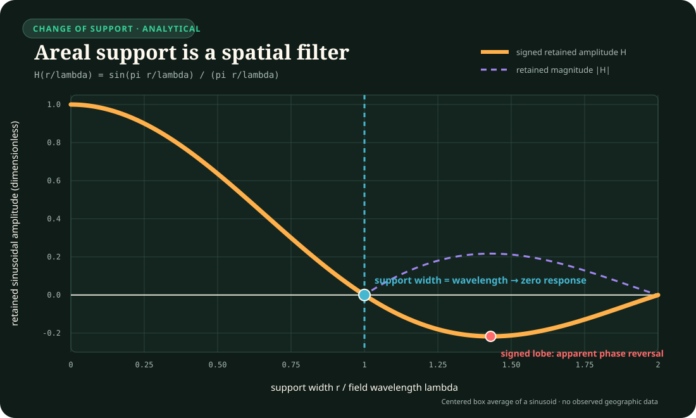

# Spatial geography: support, scale, mobility, and place

- **Audit date:** 2026-08-24
- **Scope:** spatial support and aggregation; ecological inference; spatial
  dependence and validation geometry; time-geographic accessibility and
  exposure; changing administrative boundaries; mass-preserving change of
  support; preferential sampling; multiscale segregation and allocation.
- **Question:** which geographic operators survive after the project's
  existing built-environment, demography, causal-inference, Earth-observation,
  network, accessibility, privacy, and versioned-observation work is treated as
  the mandatory null?
- **Evidence rule:** a map is a measurement and transformation product, not a
  transparent copy of a territory. Every result retains its spatial support,
  population unit, time window, boundary version, observation process,
  transformation, uncertainty, and intended prediction domain.
- **Promotion state:** no new universal principle and no new candidate. Ten
  scoped claims are proposed as `C-1460`--`C-1469`; each routes to existing
  candidates and is retired if a complete spatial-statistical or
  time-geographic null reaches the same quality--resource frontier.
- **Execution state:** ten CPU-only synthetic falsification protocols are
  specified. They use generated fields, generated agents, generated boundaries,
  and generated sensor locations; no real movement trace, address, household,
  protected attribute, or service decision is required.
- **Non-coverage statement:** this is a field-centered entry audit, not
  completion of physical or human geography, GIScience, transport geography,
  health geography, regional science, cartography, demography, planning, or
  spatial statistics.

## Executive finding

The distinct residue is not a generic claim that “location matters.” It is a
set of typed operators that determine what the observed location means.

1. A spatial statistic can change when the same fine-scale observations are
   grouped into different zones or scales. The zone system is part of the
   estimator.
2. An association among area summaries does not identify the corresponding
   association among people, events, devices, or decisions.
3. Nearby records are often dependent. A random train/test split can therefore
   test interpolation beside training data while being reported as transfer to
   a new region.
4. Residence polygons are not complete exposure histories. Activity, timing,
   network constraints, opportunity schedules, and individual capability alter
   reachable and experienced context.
5. Extensive quantities and intensive quantities require different change-of-
   support operators. Population, energy, events, and material cannot be
   resampled like temperature or probability.
6. Administrative and statistical geographies are versioned. A stable region
   label does not guarantee a stable boundary, membership, denominator, or
   policy operator.
7. Preferential sensing couples where observations occur to the field being
   estimated. Ignoring that coupling can bias inference even when the sensor
   values themselves are accurate.
8. The magnitude and spatial scale of separation are distinct. One scalar
   inequality or segregation value can hide whether separation occurs within
   streets, between neighbourhoods, or between regions.
9. Spatial detail can increase disclosure risk. More precise traces are not a
   free scientific upgrade, and aggregation is not a proof of anonymity.
10. A support-ensemble record and prediction-domain-matched validation may
    improve decision stability, but this is an engineering hypothesis rather
    than a fact borrowed from geography.

The audit therefore strengthens
[Candidate 007](../../experiments/candidates/007-endogenous-observation-surveillance.md),
[Candidate 009](../../experiments/candidates/009-graded-assurance-envelopes.md),
[Candidate 013](../../experiments/candidates/013-deficit-capability-routing.md),
[Candidate 014](../../experiments/candidates/014-versioned-observation-contract.md),
[Candidate 018](../../experiments/candidates/018-value-reconstructability-aware-tiering.md),
and
[Candidate 020](../../experiments/candidates/020-constitutional-control-plane.md).
It does not justify a “geographic module” by analogy alone.

## Normative and statistical-source header

- **Normative context:** European Union and Germany.
- **Status snapshot:** official material checked 2026-08-24.
- **Statistical geography:** Eurostat identifies the NUTS classification and
  version as the operator used for harmonised regional statistics. NUTS 2024 is
  valid from 1 January 2024; correspondence tables exist because classifications
  and memberships change. Eurostat also states that Local Administrative Units
  change frequently and publishes updated lists.
- **Confidentiality:** Regulation (EC) No 223/2009 and Eurostat's official
  guidance protect statistical units that are directly or indirectly
  identifiable. Geographic aggregation, suppression, recoding, and controlled
  research access are disclosure-control operations, not evidence that a
  dataset has become anonymous for every attacker and linkage environment.
- **Personal data:** GDPR, the German BDSG, and the EU AI Act are reused through
  the project's existing normative baseline and `C-1350`. This audit adds no
  automated compliance verdict.
- **Purpose boundary:** a scientific exposure estimate, a statistical region,
  an administrative service area, an electoral district, and a legal
  jurisdiction are different objects even when their polygons overlap.
- **Refusal boundary:** no protocol may reconstruct or publish a real person's
  path, infer a protected attribute about a person, rank a neighbourhood for
  coercive intervention, or turn a synthetic uncertainty score into a legal
  eligibility or resource-allocation decision.

## Taxonomy routing and state changes

| Taxonomy route | Narrow direct depth added here | Still explicitly outside this pass |
| --- | --- | --- |
| OECD 5.7 Social and economic geography | spatial support, scale, mobility, accessibility, exposure, segregation scale, changing statistical geographies | economic geography, political geography, rural/urban systems, migration, housing, regional development, geopolitics, place theory |
| DFG 3.45 Geographie | field-centered human/GIScience operators with links to physical-field observation | physical-geography process breadth, climatology, biogeography, soil geography, geomorphology beyond existing audits, full human-geography breadth |
| ANZSRC 44 Human society | geographic context, mobility, segregation, accessibility, and spatial observation depth | the division was already dedicated; most substantive human geography remains incomplete |
| ANZSRC 37 Earth sciences | support and observation operators shared with gridded physical fields | no new Earth-process evidence; existing Earth audits remain the owners |

This audit promotes OECD 5.7 and DFG 3.45 from `adjacent` to `dedicated`. The
promotion means “a durable field-centered audit exists,” not “the field is
complete.”

## Construct firewall

| Construct | Defined object | Invalid substitution |
| --- | --- | --- |
| point observation | value attributed to a coordinate and time with location/error model | property of an unmeasured surrounding area |
| support | spatial and temporal domain over which a value is defined or aggregated | display pixel, file row, or region name |
| extensive quantity | quantity additive over disjoint supports, such as people, joules, mass, or event count | density, rate, mean, probability, or temperature |
| intensive quantity | value not additive without an explicit weight and denominator | total resource or population |
| zone system | versioned partition and membership operator | natural or causally correct neighbourhood |
| activity space | declared approximation to places/times reachable or encountered by an agent | complete causal context or consent to track |
| impedance | generalized time, cost, reliability, capability, or friction between origin and opportunity | Euclidean distance alone |
| spatial dependence | covariance or conditional dependence associated with a declared relation/weight matrix | proof of a particular causal spillover |
| interpolation | prediction inside the sampled spatial domain and support | extrapolation to a new region or process regime |
| exposure | integral or summary of a declared field along a declared path, duration, and uptake operator | residence-zone mean |
| segregation profile | separation statistic as a function of geographic scale and population definition | one context-free inequality score |
| confidential statistical unit | unit protected under the applicable statistical framework | a harmless row merely because names were removed |

## Exact deduplication against existing project material

| Candidate residue | Existing owner | Disposition |
| --- | --- | --- |
| generic selection and missingness | causal, surveillance, and versioned-observation audits; Candidates 007/014 | **Reused.** `C-1467` retains only spatial preferential-sampling coupling and its location process. |
| accessibility and route objectives | `C-705`, `C-706`; built-environment audit; Candidate 013 | **Reused.** `C-1463` adds feasible space--time support, not a second accessibility principle. |
| network distance and congestion | computing/networking and built-environment audits | **Reused.** Geography contributes population, opportunity, schedule, and activity support; it does not duplicate routing algorithms. |
| aggregation and denominator provenance | metrology, demography, social-depth, and versioned-observation audits | **Reused with spatial specialisations.** `C-1460` owns partition sensitivity, `C-1461` owns cross-level refusal, `C-1464` owns conservative change of support, and `C-1465` owns boundary-version crosswalks. |
| multiscale representation | morphology, vision, Earth observation, and hierarchical-compute work | **Mechanistically deduplicated.** `C-1466` is an estimand profile over geographic scale, not a new multiscale architecture. |
| privacy and legal authority | legal audit, normative baseline, and `C-1350` | **Fully deduplicated.** The new audit only records that fine spatial traces and small cells can alter identifiability risk. |
| adaptive sensor placement | active sensing, surveillance, and plant/chemical-sensing audits | **Reused.** `C-1467` requires a location-intensity model and probability/reference checks; no generic active-sensing claim is added. |
| versioned classifications | `C-1341`, Candidate 014 | **Reused.** `C-1465` is the boundary/crosswalk specialisation for statistical and administrative geographies; `C-1468` instead proposes selective invalidation over typed support lineage. |
| allocation fairness | social choice, economics, and Candidate 020 | **Not claimed here.** A spatial allocation objective remains normative and jurisdiction-specific even when the geography is measured correctly. |

## Mathematical boundary

### A value is a support-qualified observation

Let latent field $x(\mathbf{s},t)$ have unit $U$ at position $\mathbf{s}$ [m]
and time $t$ [s]. Observation $i$ is

$$
y_i=\mathcal H_{i,r}\!\left[x;A_i,[t_i^0,t_i^1],w_i\right]+b_i+\epsilon_i,
$$

where $A_i$ is spatial support [m$^2$ or a declared network/administrative
set], $[t_i^0,t_i^1]$ is temporal support [s], $w_i$ is a normalized weighting
operator [dimensionless], $\mathcal H_{i,r}$ is observation/version operator
$r$, $b_i$ is bias [$U$], and $\epsilon_i$ is zero-mean measurement error
[$U$] under the registered model. Coordinate reference system, vertical datum,
geolocation uncertainty, and boundary version are part of $\mathcal H_{i,r}$.

For an intensive areal mean,

$$
\bar x_{A,r}=\frac{\int_A w_r(\mathbf{s})x(\mathbf{s})\,\mathrm d\mathbf{s}}
{\int_A w_r(\mathbf{s})\,\mathrm d\mathbf{s}}
\quad [U].
$$

For an extensive amount with density $q(\mathbf{s})$ [$U$/m$^2$],

$$
Q_A=\int_A q(\mathbf{s})\,\mathrm d\mathbf{s}\quad[U],
\qquad
Q_{A\cup B}=Q_A+Q_B
$$

only when $A$ and $B$ are disjoint under the same support version. An
interpolation that changes $\sum_A Q_A$ changes the stated extensive quantity.

### Zoning is an estimator input

Let partition version $r$ contain zones $A^{(r)}_1,\ldots,A^{(r)}_{J_r}$ and
membership operator $Z_r$. A zonal estimator is

$$
\widehat\theta_r=
g\!\left(Z_r\mathbf{x},Z_r\mathbf{y},\mathbf{n}_r,
\mathbf{W}_r,\boldsymbol\omega_r\right),
$$

where $\mathbf{n}_r$ contains denominators [units or people], $\mathbf{W}_r$
is a declared spatial-relation matrix [dimensionless], and
$\boldsymbol\omega_r$ contains survey or design weights [dimensionless]. The
modifiable-areal-unit question is therefore whether
$\widehat\theta_r$ remains decision-equivalent across admissible $r$, not
whether one preferred map looks plausible.

### Area-level and unit-level relations are different estimands

For person or event $k$ in zone $j$, a unit-level model can be

$$
Y_{jk}=\alpha+\beta X_{jk}+u_j+\varepsilon_{jk},
$$

while a regression on zonal means is

$$
\bar Y_j=a+b\bar X_j+e_j.
$$

The coefficient $b$ generally mixes within-zone and between-zone structure;
it does not identify $\beta$ without additional assumptions or unit-level
information. Both coefficients have the declared outcome unit per predictor
unit, but they answer different questions.

### Spatial dependence needs a relation operator

For centered zonal values $z_i=x_i-\bar x$ and nonnegative declared weights
$w_{ij}$, Moran's statistic is

$$
I=\frac{n}{S_0}
\frac{\sum_i\sum_j w_{ij}z_i z_j}{\sum_i z_i^2},
\qquad
S_0=\sum_i\sum_j w_{ij}.
$$

$I$ is dimensionless. Its interpretation depends on the weight construction,
diagonal convention, row standardisation, boundary, null model, and reference
distribution. A positive value is not a causal-spillover certificate.

### Reachability is a space--time constraint

For origin $o_i$ at time $t_0$, required destination $d_i$ at time $t_1$, and
network travel-time operator $\tau_G(a,b;t)$ [s], the feasible prism at time
$t$ is

$$
\mathcal P_i(t)=\left\{\mathbf{s}:
\tau_G(o_i,\mathbf{s};t_0)\leq t-t_0,
\ \tau_G(\mathbf{s},d_i;t)\leq t_1-t\right\}.
$$

Opening hours, transfers, cost, reliability, mobility capability, care duties,
and safety can shrink $\mathcal P_i$ even when distance is unchanged. A
path-qualified exposure to field $c(\mathbf{s},t)$ [$U$] is

$$
E_i=\int_{t_0}^{t_1} a_i(t)c(\mathbf{s}_i(t),t)\,\mathrm dt
\quad [U\,\mathrm s],
$$

where $a_i(t)$ is a dimensionless uptake/activity weight. A residence-zone
mean is one proxy for $E_i$, not its definition.

### Prediction geometry defines the validation target

Let training locations be $S_{\mathrm{tr}}$ and test locations
$S_{\mathrm{te}}$. A validation design declares a target domain $D^*$ and the
distance/dependence relation between $S_{\mathrm{tr}}$, $S_{\mathrm{te}}$, and
$D^*$. Report

$$
R(D^*)=\mathbb E_{(\mathbf{s},y)\sim D^*}
\left[L\!\left(y,\widehat f_{S_{\mathrm{tr}}}(\mathbf{s})\right)\right],
$$

with loss unit inherited from $L$. Random folds, spatial blocks, leave-region-
out, future-boundary, and graph-cut folds estimate different risks. None is a
universal default.

### Preferential observation is a coupled point process

One diagnostic model for sensor intensity is

$$
\lambda(\mathbf{s})=
\lambda_0\exp\!\left(\alpha+\gamma x(\mathbf{s})+
\boldsymbol\delta^{\mathsf T}\mathbf{c}(\mathbf{s})\right)
\quad [\mathrm{observations}/\mathrm{m}^2],
$$

where reference intensity $\lambda_0$ has unit
$\mathrm{observations}/\mathrm{m}^2$, $\alpha$ is dimensionless, $\gamma$ has
unit $U^{-1}$, and each coefficient--covariate product in
$\boldsymbol\delta^{\mathsf T}\mathbf{c}$ is dimensionless. When
$\gamma\neq0$, observation locations
contain information about the field and conventional non-preferential analysis
can be biased. The sign and magnitude are empirical, not assumed.

## Visual model

The editable diagram source is
[`assets/diagrams/support-qualified-spatial-inference.mmd`](../../assets/diagrams/support-qualified-spatial-inference.mmd).
The support-transfer plot is generated from
[`assets/plots/core-models.json`](../../assets/plots/core-models.json) and is an
analytic illustration, not a measured performance result.

## Claim set proposed for the evidence ledger

### C-1460 — Partition and scale sensitivity

- **Biological observation:** none required; this is a geographic-statistical
  observation boundary.
- **Statement:** estimates computed from spatially aggregated data can change
  with zone scale and zone configuration even when the underlying fine-scale
  observations are unchanged.
- **Status:** established.
- **Primary sources:** `Openshaw1978ZoneDesign`,
  `Moran1950SpatialPhenomena`.
- **Rationale:** Openshaw's empirical zone-design study changes a regression
  result by changing the aggregation system; Moran formalises dependence among
  spatially related observations. Neither establishes one universally correct
  partition.
- **Proposed AI translation:** make partition version, support, spatial weights,
  and a registered ensemble of admissible alternative partitions inputs to any
  spatial state or allocation claim.
- **Efficiency mechanism:** run partition sensitivity only near decisions whose
  sign, rank, or threshold is not stable, rather than recomputing every map at
  maximum resolution.
- **Failure modes:** cherry-picked zones; only one scale; boundary data leakage;
  denominators change with zones; spatial weights tuned after outcomes;
  uncertainty ignores between-partition variation.
- **Measurable prediction:** a support-ensemble record will reduce sign and
  threshold reversals on unseen admissible partitions at equal fine-cell data.
- **Open question:** does it beat a complete multilevel spatial model with
  change-of-support uncertainty and registered decision sensitivity?
- **Used by:** `SG-T01`, Candidates 009, 013, 014, and 020.
- **Disposition:** established observation boundary; proposed engineering gain
  remains unvalidated.

### C-1461 — Ecological inference boundary

- **Biological observation:** none required.
- **Statement:** an association between aggregates does not in general identify
  the corresponding association between individuals or events inside those
  aggregates.
- **Status:** established.
- **Primary source:** `Robinson1950EcologicalCorrelations`.
- **Rationale:** Robinson demonstrates that ecological and individual
  correlations are distinct and can differ substantially; modern multilevel
  models can add assumptions but do not erase the estimand distinction.
- **Proposed AI translation:** type every relational claim by unit level and
  prohibit automatic descent from region, cohort, cluster, or batch summaries
  to a member-level prediction.
- **Efficiency mechanism:** acquire or retain unit-level sufficient information
  only when a decision is actually individual; otherwise keep the aggregate
  claim explicitly aggregate.
- **Failure modes:** group mean attributed to member; within/between effects
  pooled; denominator mismatch; unequal zone sizes; latent composition change;
  protected-group inference from place.
- **Measurable prediction:** unit-typed abstention will eliminate unsupported
  member-level assertions while preserving aggregate decisions at equal data.
- **Open question:** can typing improve utility after a complete hierarchical
  model, partial identification, and no-individual-decision baseline?
- **Used by:** `SG-T02`, Candidates 009, 014, and 020.
- **Disposition:** hard estimand boundary.

### C-1462 — Prediction-domain-matched spatial validation

- **Biological observation:** none required.
- **Statement:** under spatial dependence, random record-level folds can
  estimate a different and often easier prediction task than transfer to a
  separated location, region, boundary version, or future spatial regime.
- **Status:** plausible as an empirical calibration claim; the dependence and
  prediction-task distinction is established, while split performance remains
  task-dependent.
- **Primary foundation:** `Moran1950SpatialPhenomena`.
- **Synthesis source:** `RobertsEtAl2017StructuredCrossValidation`; the ledger
  does not yet contain a direct primary controlled comparison for the claimed
  calibration gain.
- **Rationale:** dependence violates the independent-record interpretation of
  random folds, while structured cross-validation methods explicitly target
  different transfer distances and domains.
- **Proposed AI translation:** bind every validation split to a declared spatial
  prediction contract: interpolation, new site, new region, changed boundary,
  or moving population.
- **Efficiency mechanism:** choose the cheapest split that is conservative for
  the real deployment geometry and escalate only when residual dependence or
  decision instability remains.
- **Failure modes:** random split reported as regional transfer; arbitrary block
  size; covariate shift hidden; tiny training sets confounded with separation;
  test locations influence preprocessing; one fold family selected post hoc.
- **Measurable prediction:** geometry-matched validation will improve risk-
  estimate coverage for its declared deployment domain versus random folds.
- **Open question:** can a learned split policy beat registered variogram,
  graph, cluster, and leave-region-out baselines without using test outcomes?
- **Used by:** `SG-T03`, Candidates 009 and 014.
- **Disposition:** established evaluation boundary; no universal “spatial CV.”

### C-1463 — Space--time feasible context

- **Biological observation:** animals and humans encounter environments through
  constrained paths and schedules, but no neural analogy is needed.
- **Statement:** residence-based or static administrative context can differ
  from an individual's feasible and experienced space--time context; results
  can change across defensible activity-space delineations.
- **Status:** established in scoped formal and empirical studies; transport to
  a new population or outcome remains open.
- **Primary sources:** `Miller1991SpaceTimePrism`,
  `Kwan2012UncertainContext`, `ZhaoKwanZhou2018ActivitySpace`.
- **Rationale:** space--time prisms formalise feasibility constraints, while the
  Guangzhou study compares several activity-space definitions and demonstrates
  sensitivity of contextual variables and associations.
- **Proposed AI translation:** treat context as a time-indexed reachable and
  observed support with purpose, network, schedule, capability, and uncertainty
  rather than a static nearest-zone embedding.
- **Efficiency mechanism:** compute detailed path context only for decisions
  whose uncertainty is dominated by mobility; otherwise retain a coarse proxy
  and its declared error envelope.
- **Failure modes:** tracking treated as consent; GPS gaps; mode/capability
  ignored; route choice endogenous to exposure; workplace and care duties
  omitted; one activity-space geometry declared true; privacy cost excluded.
- **Measurable prediction:** prism-qualified context will improve exposure and
  reachable-opportunity interval coverage under schedule and network changes.
- **Open question:** does the gain survive a mature network-accessibility model,
  trajectory uncertainty, selection correction, and strict privacy budget?
- **Used by:** `SG-T04`, Candidates 007, 013, 014, and 018.
- **Disposition:** scoped context boundary; no authority to collect real traces.

### C-1464 — Conservative change of spatial support

- **Biological observation:** none required.
- **Statement:** a redistribution of an extensive areal quantity can preserve
  zone totals and nonnegativity while remaining non-unique; smoothness is an
  additional modelling assumption, not recovered ground truth.
- **Status:** established.
- **Primary source:** `Tobler1979Pycnophylactic`.
- **Rationale:** pycnophylactic interpolation explicitly imposes conservation
  and nonnegativity while choosing a smooth surface among possibilities.
- **Proposed AI translation:** type tensors and records as extensive or
  intensive, require conservation residuals for extensive remapping, and keep
  the reconstruction prior in provenance.
- **Efficiency mechanism:** preserve exact totals through sparse overlap
  matrices and refine only cells whose reconstruction uncertainty changes a
  decision.
- **Failure modes:** totals drift; density and count confused; negative values;
  coast/water area mishandled; false high-resolution precision; ancillary data
  leaks target; smoothness suppresses real discontinuity.
- **Measurable prediction:** typed conservative remapping will eliminate mass-
  balance error and reduce decision reversals after boundary changes.
- **Open question:** does a learned conservative operator beat sparse areal
  weighting, dasymetric, and model-averaged geostatistical baselines at equal
  data and compute?
- **Used by:** `SG-T05`, Candidates 014 and 018.
- **Disposition:** conservation boundary plus speculative learned operator.

### C-1465 — Versioned statistical geography

- **Biological observation:** none required.
- **Statement:** statistical and administrative regions, memberships, and
  typologies change over time, so regional comparison requires an explicit
  classification version and a documented crosswalk or reconstruction.
- **Status:** established.
- **Primary sources:** `EurostatNUTS2024`, `EurostatLAU2026`,
  `EurostatNUTSCorrespondence2026`.
- **Rationale:** Eurostat publishes effective versions and correspondence
  material for NUTS and frequently changing LAUs.
- **Proposed AI translation:** store immutable geometry hashes, effective dates,
  parent/child relations, split/merge weights, denominator versions, and
  non-bijective crosswalk uncertainty.
- **Efficiency mechanism:** cache sparse crosswalk operators and recompute only
  descendants of changed boundaries.
- **Failure modes:** same code assumed same geometry; split weights sum
  incorrectly; historical values silently restated; policies transported
  across non-equivalent units; land/water/support definition changes ignored.
- **Measurable prediction:** versioned crosswalk lineage will reduce false trend
  alarms and stale-policy reuse after splits and mergers.
- **Open question:** does dependency-targeted recomputation outperform complete
  restatement after realistic chains of boundary changes?
- **Used by:** `SG-T06`, Candidates 014, 018, and 020.
- **Disposition:** authoritative statistical-version boundary, not empirical
  superiority evidence.

### C-1466 — Multiscale separation profile

- **Biological observation:** none required.
- **Statement:** the magnitude and geographic scale of spatial segregation are
  distinct dimensions; systems with similar scalar segregation can have
  different local-to-regional profiles.
- **Status:** established in the studied metropolitan setting.
- **Primary source:** `ReardonEtAl2008SegregationScale`.
- **Rationale:** the primary study develops scale-sensitive profiles and finds
  that level and scale are only modestly correlated in its metropolitan sample.
- **Proposed AI translation:** evaluate distribution, access, error, and service
  separation as a registered function of scale rather than at one convenient
  aggregation.
- **Efficiency mechanism:** use a coarse-to-fine scale sweep and stop where the
  decision and uncertainty envelope stabilise.
- **Failure modes:** protected groups inferred from location; one kernel family;
  edge effects; population denominator drift; scale selected after outcome;
  descriptive profile treated causal or normative.
- **Measurable prediction:** scale profiles will distinguish micro-separation
  from regional separation that one scalar ranks as equivalent.
- **Open question:** can a scale-adaptive audit improve detection without
  increasing disclosure or turning description into automated allocation?
- **Used by:** `SG-T07`, Candidates 009, 013, and 020.
- **Disposition:** descriptive estimand boundary with strict rights limits.

### C-1467 — Preferential spatial observation

- **Biological observation:** active sensors and organisms often sample where
  signals or expected value are high; the relevant residue is selection
  coupling, not biological imitation.
- **Statement:** when observation locations depend on the latent field or a
  correlated process, analysis that assumes non-preferential sampling can be
  biased; locations are then part of the likelihood or design record.
- **Status:** established in the stated geostatistical model and biomonitoring
  application; magnitude is application-specific.
- **Primary source:** `DiggleMenezesSu2010PreferentialSampling`.
- **Rationale:** the joint point-process/geostatistical model and application
  show material inference changes when preferential placement is modelled.
- **Proposed AI translation:** record proposal, eligibility, placement,
  activation, failure, and observation probabilities for adaptive sensors or
  agents and retain a probability/reference sample.
- **Efficiency mechanism:** concentrate sensing while using sparse reference
  observations and importance/joint-model correction to keep field estimates
  calibrated.
- **Failure modes:** “smart” sensors chase anomalies and inflate prevalence;
  failed sensors missing in hard areas; unlogged human placement; probability
  model misspecified; reference sample too small; correction variance explodes.
- **Measurable prediction:** reference-anchored adaptive placement will improve
  hotspot detection at equal samples without losing field-mean interval
  coverage.
- **Open question:** can it beat registered stratified and balanced spatial
  designs across smooth, discontinuous, adversarial, and drifting fields?
- **Used by:** `SG-T08`, Candidates 007, 014, and 018.
- **Disposition:** spatial specialization of endogenous observation.

### C-1468 — Support-ensemble decision record

- **Biological observation:** none required.
- **Statement:** a versioned record containing support, partition ensemble,
  extensive/intensive type, crosswalk, prediction geometry, and decision
  sensitivity may reduce unsupported spatial claims and stale reuse.
- **Status:** speculative.
- **Primary sources:** no direct systems validation; constituent boundaries are
  `C-1460`--`C-1467`.
- **Rationale:** the value is composition and selective recomputation, not a new
  statistical theorem.
- **Proposed AI translation:** add a spatial-support contract to Candidate 014
  and propagate invalidation through Candidate 018's value/reconstructability
  tiers.
- **Efficiency mechanism:** invalidate only outputs whose support lineage or
  decision envelope intersects a changed field, boundary, or crosswalk.
- **Failure modes:** schema without enforcement; arbitrary partition ensemble;
  hashes without semantics; recomputation misses derived denominators; record
  cost exceeds saved work; false stability across all sampled partitions.
- **Measurable prediction:** dependency-targeted invalidation will match full
  recomputation decisions with fewer recomputed cells and records.
- **Open question:** does it beat a spatial database with temporal tables,
  lineage, materialized-view invalidation, and complete statistical metadata?
- **Used by:** `SG-T09`, Candidates 014 and 018.
- **Disposition:** proposed composition; no new candidate.

### C-1469 — Privacy-qualified spatial value of information

- **Biological observation:** none required.
- **Statement:** finer spatial or temporal resolution can improve some
  estimands while also increasing acquisition, computation, and disclosure
  burden; an optimal resolution is decision-, population-, threat-, and
  jurisdiction-dependent.
- **Status:** plausible for the trade-off; no universal optimum is established.
- **Primary sources:** `Kwan2012UncertainContext`,
  `EurostatStatisticalConfidentiality2026`, `EurostatMicrodataProtection2026`.
- **Rationale:** mobility/context work shows potential inferential gain from
  finer activity data, while EU statistical guidance treats direct and
  indirect identifiability and disclosure controls as binding constraints.
- **Proposed AI translation:** choose acquisition and retention resolution by
  marginal decision value subject to a hard rights, purpose, retention, and
  disclosure-risk envelope.
- **Efficiency mechanism:** retain coarse summaries by default and escalate to
  finer support only when expected decision value exceeds measurement,
  compute, energy, governance, and disclosure costs.
- **Failure modes:** privacy monetised away; risk score treated compliance;
  reidentification threat stale; small groups exposed; utility measured only on
  average; irreversible raw traces retained “for later”; synthetic test used to
  authorize real collection.
- **Measurable prediction:** staged resolution will match full-resolution
  synthetic decisions while retaining fewer fine cells and lower calculated
  disclosure exposure.
- **Open question:** can any automated policy remain useful after strict
  purpose limitation, minimisation, access, deletion, and human authority are
  treated as hard constraints rather than soft penalties?
- **Used by:** `SG-T10`, Candidates 007, 009, 014, 018, and 020.
- **Disposition:** bounded value-of-information hypothesis; no legal verdict.

## Synthetic falsification protocol specifications

These are executable specifications, not completed experiments. Each protocol
uses sealed generator and analysis manifests, deterministic seed packs, exact
software versions, raw outputs, uncertainty intervals, and a negative control.
The replication unit is a complete generated world, never a cell, person, zone,
fold, or time point inside one world. Thresholds below are design gates, not
prior evidence of effect.

### Common execution, analysis, and resource contract

- **Split:** each protocol's stated world count is partitioned before any arm is
  fitted: 16% public development, 64% sealed confirmation, and 20% disjoint
  transfer. Thus totals of 300/400/500/1,000 yield
  48/192/60, 64/256/80, 80/320/100, and 160/640/200 worlds respectively.
  Transfer changes at least one named generator family and is opened only after
  confirmation decisions are sealed.
- **Smoke:** eight additional public seeds use one-tenth of the stated cells,
  agents, records, or events. Smoke is claim-ineligible and tests only schema,
  deterministic replay, negative controls, and resource capture.
- **Pairing and missing worlds:** all arms in a world share immutable exogenous
  fields, populations, boundaries, observation opportunities, and decision
  queries but never mutable fitted state. Missing, corrupt, or non-reproducible
  confirmation worlds are failures, not deletions or replacements. An
  interrupted run may resume the same seed only if every attempt remains in the
  manifest.
- **Frozen learning boundary:** model classes, preprocessing, feature access,
  spatial split registry, stopping rules, comparator choice, and at most 64
  hyperparameter configurations per learned arm are selected on development
  worlds. Nested tuning uses development data only. Their hashes are committed
  before confirmation; confirmation and transfer outcomes cannot select a
  model, fold geometry, baseline, resolution, or threshold.
- **Registered scalar losses:** each protocol maps its first named scientific
  error to a dimensionless per-world loss by dividing by the exact eligible
  query count or by a positive generator-declared physical scale. Abstentions
  enter that denominator and receive the frozen task-specific abstention loss;
  hard rights, conservation, provenance, and unsupported-assertion gates remain
  separate zero-tolerance invariants. Numerators, denominators, and scales are
  written to `analysis-plan.json` before confirmation.
- **Multiplicity and uncertainty:** `C-1460`--`C-1469` contribute exactly ten
  two-sided claim-level paired contrasts. Holm controls family-wise
  $\alpha=0.01$; planning uses the first threshold $0.001$. Each base test uses
  a studentized paired world-cluster bootstrap over complete world rows, with
  1,000,000 PCG64-DXSM null-recentred draws and a plus-one Monte Carlo p-value.
  Separately seeded 100,000-draw percentile-$t$ bootstraps produce 99%
  intervals. This requires IID generated worlds and finite variance of the
  registered scalar loss; failed diagnostics make the contrast ineligible.
  Holm is never used to repair an invalid base test.
- **Power:** the smallest confirmation set is 192 worlds. The normal planning
  approximation at the conservative two-sided threshold has about 0.94 power
  for a standardized paired effect $d=0.35$
  ($\Phi(\sqrt{192}\,0.35-z_{0.9995})$). This is sensitivity planning, not an
  expected effect. Hard-gate claims are reported as exact counts with a
  one-sided 99% Clopper--Pearson world-probability bound, never as a per-person,
  per-cell, or deployment-risk bound.
- **Resource envelope:** smoke is capped at 15 CPU-minutes, 2 GiB peak RAM, and
  2 GiB retained artifacts per protocol. Full confirmation plus transfer is
  capped at 24 CPU-hours, 16 GiB peak RAM, and 50 GiB retained artifacts on the
  declared workstation. Exceeding a cap is an infeasible result, not permission
  to delete worlds or reduce a mature-null arm.
- **Resource boundary:** every arm reports process CPU and wall time [s], peak
  resident memory and retained artifacts [bytes], records/cells/edges evaluated
  [count], acquisition actions and trace points [count], and storage/network
  traffic [bytes]. Physical energy is not measured; CPU time, record counts, or
  acquisition actions are never converted to or labelled as joules.
- **Common artifacts:** `design.json`, `generator.json`, `arms.json`,
  `analysis-plan.json`, `seed-commitments.json`, `seed-reveal.json`,
  `runtime.json`, `hardware-os.json`, `raw-worlds/`, `resource-ledger.jsonl`,
  `analysis-output.json`, `scientific-hashes.json`, and `run-receipt.json` are
  mandatory in addition to each track's listed artifacts.

The transfer mutation is fixed by track rather than chosen after confirmation:

| Track | Held-out transfer mutation |
| --- | --- |
| SG-T01 | islands plus a shifted discontinuity crossing a noncompact hostile partition |
| SG-T02 | a composition shift with opposite within/between slopes and missing unit data |
| SG-T03 | an unseen disconnected region outside the training covariate hull after a boundary revision |
| SG-T04 | simultaneous bridge closure, schedule shift, sparse fixes, and a fine-trace prohibition |
| SG-T05 | coastline/sliver remapping with zero latent total and signed noisy observations |
| SG-T06 | code reuse after a partial annexation plus a late denominator correction |
| SG-T07 | equal tract scalar but unseen rural density and boundary-edge geometry |
| SG-T08 | abrupt adversarial decoy with field-dependent failure and an undersized reference stratum |
| SG-T09 | simultaneous missing parent, crosswalk replacement, and irrelevant metadata edit |
| SG-T10 | rare-cell linkage threat with useful but purpose-prohibited fine signal and a deletion deadline |

### SG-T01 — Zoning and scale stress matrix

- **Claim:** `C-1460`.
- **Primary unit and units:** generated world; fine cells [count], positions
  [m], predictors/outcomes [registered units], zones [count].
- **Generator:** 400 independent $64\times64$ latent fields containing smooth,
  clustered, discontinuous, anisotropic, and checkerboard families; 48
  partitions/world spanning four cell sizes, four offsets, compact/noncompact
  zones, and outcome-blind versus deliberately hostile boundaries.
- **Arms:** A one convenient partition; B complete hierarchical spatial model
  with fine-cell data and registered partition sensitivity; C Candidate 014
  support-ensemble record with selective escalation.
- **Mature null:** change-of-support-aware multilevel spatial model with all
  fine cells, partition ensemble, spatial weights, and bootstrap/world-level
  uncertainty.
- **Hostile families:** Simpson reversal; narrow boundary discontinuity; uneven
  zone population; islands; edge truncation; partition aligned to outcome;
  null field with apparent clusters; unchanged labels with changed geometry.
- **Primary endpoint and gate:** wrong sign or wrong threshold decision on
  unseen admissible partitions per 100 worlds; B/C `<=2`, 99% interval coverage
  `>=0.98`, and C must not be worse than B by more than 1 percentage point.
- **Registered scalar loss:** fraction of frozen decision queries whose sign or
  threshold state is wrong; C minus B is the claim-level paired contrast and
  abstention counts as wrong.
- **Secondary endpoints:** rank correlation, calibration, abstention, number of
  partitions evaluated, cells recomputed, retained bytes, wall time, and CPU-s.
- **Negative controls:** iid cells; exact partition-invariant sufficient
  statistic; shuffled spatial coordinates.
- **Track kill:** zones chosen after outcomes, within-world zones counted as
  independent replicates, B denied the same partition set, or C matches B while
  using at least as much compute/storage.
- **Artifacts:** `worlds.jsonl`, `partitions.geojson`, `support-ledger.jsonl`,
  `decisions.csv`, `resource-ledger.jsonl`.

### SG-T02 — Aggregate-to-unit refusal test

- **Claim:** `C-1461`.
- **Primary unit and units:** generated population-world; people/events [count],
  zone means [declared units], unit and aggregate coefficients [outcome unit per
  predictor unit].
- **Generator:** 500 worlds with controlled within-zone slope, between-zone
  slope, zone-size imbalance, composition, measurement error, missingness, and
  boundary changes; include equal, opposite, null, and nonidentified
  within/between relations.
- **Arms:** A descends the ecological coefficient to units; B complete
  hierarchical/partial-identification model with unit-level data when
  available; C typed-unit record that refuses unsupported descent.
- **Mature null:** multilevel regression with correct sampling weights,
  within/between decomposition, measurement model, sensitivity bounds, and
  aggregate-only abstention.
- **Hostile families:** ecological reversal; tiny zones; unbalanced groups;
  missing unit data; protected attribute correlated with location; temporal
  composition shift; cross-level interaction.
- **Primary endpoint and gate:** unsupported unit-level assertions must be zero;
  identified unit-slope 99% interval coverage `>=0.98`; aggregate-task loss no
  worse than B by more than 1%.
- **Registered scalar loss:** unsupported unit assertions plus noncovered
  identified unit slopes, divided by all frozen assertion queries; C minus A is
  the claim-level contrast, while the zero-assertion gate is evaluated
  separately.
- **Secondary endpoints:** interval width, refusal calibration, subgroup error,
  storage, compute, disclosure-risk proxy.
- **Negative controls:** identical within/between slopes; no within-zone
  variation; unit-level census with correct model.
- **Track kill:** aggregate coefficient treated individual truth, refusal
  rewarded on an individual-decision task without cost, real protected data
  introduced, or C adds no value beyond B.
- **Artifacts:** `populations.parquet`, `zones.geojson`, `estimands.json`,
  `unit-claims.jsonl`, `coverage.csv`.

### SG-T03 — Prediction-geometry validation selector

- **Claim:** `C-1462`.
- **Primary unit and units:** generated field-world; prediction loss [registered
  loss unit], separation [m or graph hops], locations [count].
- **Generator:** 500 worlds with Matérn-like smooth fields, discontinuities,
  anisotropy, covariate shift, clusters, spatially varying noise, and four
  deployment contracts: interpolation, new nearby site, new region, and changed
  boundary/future regime.
- **Arms:** A random record folds; B registry of random, buffered block,
  cluster, graph-cut, leave-region-out, and temporal-spatial folds selected by
  the declared contract without test outcomes; C learned selector using only
  training geometry and preregistered diagnostics.
- **Mature null:** prediction-domain-matched structured validation with block
  scale sensitivity, training-size controls, residual-dependence audit, and
  nested tuning.
- **Hostile families:** duplicate coordinates; near-neighbour leakage; block
  size too large; disconnected graph; domain outside covariate hull; rare
  region; preprocessing fit globally; hyperparameters tuned on outer folds.
- **Primary endpoint and gate:** absolute error between estimated and true
  deployment risk; B/C median error `<=5%` of the loss scale and 99% coverage
  `>=0.98` for the named contract; C must tie B within 1% on null families.
- **Registered scalar loss:** absolute risk-estimation error divided by the
  positive generator-declared loss scale, averaged over frozen deployment
  queries; B minus A is the `C-1462` claim-level contrast because it tests
  contract-matched geometry against random record folds. C minus B is a
  separately multiplicity-labelled secondary contrast for the learned-selector
  open question. The learned selector's model class and 64-configuration
  maximum tuning grid follow the common frozen learning boundary.
- **Secondary endpoints:** training-size-adjusted error, rank of models,
  abstention, fold variance, CPU-s, peak RAM, and retained bytes.
- **Negative controls:** iid records; deployment sampled from the random-fold
  distribution; constant predictor.
- **Track kill:** one fold family called universally best, test outcomes select
  geometry, smaller training set confounded with distance, or C matches B at
  greater total cost.
- **Artifacts:** `fields.npz`, `deployment-contracts.json`, `folds.jsonl`,
  `risk-estimates.csv`, `resource-ledger.jsonl`.

### SG-T04 — Residence proxy versus feasible space--time context

- **Claim:** `C-1463`.
- **Primary unit and units:** generated agent-day; time [s], network length [m],
  travel time [s], opportunity [count], exposure [$U\,$s].
- **Generator:** 2,000 agent-days/world across 300 worlds; homes, work/care
  anchors, schedules, multimodal networks, opening hours, reliability,
  mobility/cost constraints, time-varying fields, endogenous route choices,
  sparse/noisy location fixes, and consent/retention flags.
- **Arms:** A residence-zone mean and radial distance; B full network time-prism
  and uncertain trajectory/exposure baseline; C staged context estimator that
  escalates from residence to network to trace only under a hard rights and
  value gate.
- **Mature null:** time-geographic network accessibility plus trajectory error,
  selection, schedule, capability, and privacy-aware data minimisation.
- **Hostile families:** same home/different shifts; bridge closure; inaccessible
  “nearby” service; shared device; missing commute; route avoids field; exposure
  causes route; trace reidentification risk; no consent for fine acquisition.
- **Primary endpoint and gate:** reachable-opportunity and exposure 99% interval
  coverage `>=0.98`; prohibited fine-trace acquisitions zero; C loss within 2%
  of B while retaining at most 35% of fine trace points.
- **Registered scalar loss:** the mean of opportunity absolute error divided by
  the positive generated opportunity scale and exposure absolute error divided
  by the positive generated exposure scale, over every frozen agent-day query;
  C minus B is the claim-level contrast and abstention remains in the
  denominator.
- **Secondary endpoints:** bias by mobility capability, false accessibility,
  trajectory bytes, compute, latency, deletion compliance in synthetic ledger.
- **Negative controls:** immobile agents; constant field; complete residence-
  bounded activity; identical Euclidean and network times.
- **Track kill:** trace precision treated truth, privacy becomes a tunable soft
  reward, A denied correct residence data, or C cannot save data/cost versus B.
- **Artifacts:** `networks.geojson`, `agent-days.jsonl`, `trace-ledger.jsonl`,
  `exposure-oracle.csv`, `rights-events.jsonl`.

### SG-T05 — Extensive/intensive change-of-support test

- **Claim:** `C-1464`.
- **Primary unit and units:** generated field-world; extensive total [$U$],
  density [$U$/m$^2$], intensive value [$V$], overlap area [m$^2$].
- **Generator:** 400 worlds with known nonnegative latent fine-grid
  population/material/event density, separately generated signed noisy
  observations, temperature/probability fields, coastlines, holes, sharp
  discontinuities, ancillary rasters of varying validity, and old/new boundary
  systems with split/merge/partial overlap. Every world declares a positive
  extensive reference scale $Q_{\mathrm{scale}}$ [$U$].
- **Arms:** A generic bilinear resampling for all variables; B sparse overlap
  areal weighting, pycnophylactic and dasymetric alternatives with uncertainty;
  C typed learned conservative operator with decision-triggered refinement.
- **Mature null:** variable-type-aware conservative remapping with nonnegative
  constraints, exact extensive totals, alternative priors, and resolution
  sensitivity.
- **Hostile families:** zero population; coastline; sliver overlap; negative
  noisy input; ancillary variable anticorrelated with truth; discontinuity;
  density mislabeled count; moving boundary and moving population.
- **Primary endpoint and gate:** for extensive variables, residual
  $r=Q_{\mathrm{mapped}}-Q_{\mathrm{ref}}$ must satisfy
  $|r|\leq a_{\mathrm{tol}}+r_{\mathrm{tol}}|Q_{\mathrm{ref}}|$, with
  $a_{\mathrm{tol}}=10^{-12}Q_{\mathrm{scale}}$ [$U$] and
  $r_{\mathrm{tol}}=10^{-10}$ [dimensionless]. This remains defined when
  $Q_{\mathrm{ref}}=0$ or an observed noisy total is negative. Negative latent
  mass is zero-tolerance; signed noisy observations retain their measurement
  model and are not clipped into latent mass. Decision-interval 99% coverage is
  `>=0.98`; C ties B within 1% at lower recomputation cost.
- **Registered scalar loss:** absolute decision error divided by the positive
  generator-declared decision scale, averaged over all remapping queries; C
  minus B is the claim-level contrast. The learned conservative operator and
  its maximum 64-configuration grid are frozen under the common learning
  boundary; conservation remains a separate hard gate.
- **Secondary endpoints:** cell RMSE, boundary error, uncertainty calibration,
  sparse-matrix bytes, wall time, cells refined.
- **Negative controls:** uniform field; identical boundaries; exact nested
  split; intensive constant.
- **Track kill:** high-resolution reconstruction called truth, variable type
  omitted, ancillary target leakage, or learned arm violates conservation.
- **Artifacts:** `old-new-boundaries.geojson`, `field-oracles.npz`,
  `crosswalks.npz`, `conservation.csv`, `uncertainty.csv`.

### SG-T06 — Boundary-version lineage and targeted recomputation

- **Claim:** `C-1465`.
- **Primary unit and units:** generated classification history; regions [count],
  dates [ISO-8601], weights [dimensionless], extensive totals [$U$].
- **Generator:** 1,000 histories of 20 versions with renames, splits, mergers,
  code reuse, enclave changes, geometry correction, land/water-definition
  change, missing crosswalk, non-bijective membership, and policy thresholds.
- **Arms:** A joins on current code; B full historical restatement for every
  version; C immutable geometry hash and dependency graph with conservative
  crosswalk and targeted descendant invalidation.
- **Mature null:** temporal spatial database with bitemporal classification,
  exact geometry/version lineage, complete crosswalk uncertainty, and full
  recomputation.
- **Hostile families:** same code/new boundary; new code/same geometry; three-
  way split; partial annexation; late correction; inconsistent weights;
  historical denominator revised; policy tied to obsolete unit.
- **Primary endpoint and gate:** false trend or stale-policy decisions must be
  zero in identifiable histories; C decision parity with B 100%; median
  recomputed records at least 50% lower than B.
- **Registered scalar loss:** false-trend, stale-policy, or unsupported-history
  decisions divided by every frozen historical decision query; C minus A is the
  claim-level contrast, with decision parity against B as a hard gate.
- **Secondary endpoints:** invalidation precision/recall, unresolved-history
  refusal, storage, wall time, provenance-path length.
- **Negative controls:** no changes; renames only; complete bijective crosswalk.
- **Track kill:** code treated identity, missing crosswalk silently imputed,
  legal/policy equivalence inferred, or C fails decision parity.
- **Artifacts:** `classifications.jsonl`, `geometries/`, `crosswalks.jsonl`,
  `dependency-graph.json`, `recomputation.csv`.

### SG-T07 — Multiscale separation profile

- **Claim:** `C-1466`.
- **Primary unit and units:** generated population-world; people [count], radius
  [m], composition [fraction], separation index [dimensionless].
- **Generator:** 500 paired worlds constructed to share one conventional
  tract-level scalar while differing in micro-clustering, street barriers,
  neighbourhood separation, regional separation, density, edge shape, and
  population imbalance.
- **Arms:** A one tract-based scalar; B preregistered kernel/radius profile with
  edge correction and uncertainty; C coarse-to-fine stopping rule that returns
  the full relevant scale interval and abstains from causal or normative claims.
- **Mature null:** multiscale spatial segregation profile with denominator,
  population, kernel, boundary, uncertainty, and disclosure controls.
- **Hostile families:** equal scalar/different scale; sparse minority; boundary
  edge; rural/urban density contrast; kernel mismatch; location jitter;
  classification error; scale chosen for maximum disparity.
- **Primary endpoint and gate:** paired-world scale-family classification
  `>=0.95`, 99% interval coverage `>=0.98`, and false causal/normative claims
  zero; C profile error within 2% of B with at most 50% of evaluated radii.
- **Registered scalar loss:** scale-family misclassification plus normalized
  profile absolute error, averaged over the frozen scale queries; C minus A is
  the claim-level contrast and causal/normative assertions are a separate hard
  gate.
- **Secondary endpoints:** disclosure-risk proxy, small-group suppression,
  compute, profile stability, false refusal.
- **Negative controls:** random mixing; homogeneous population; identical
  profiles under translated coordinates.
- **Track kill:** protected attributes inferred, descriptive index drives real
  allocation, scale selected post hoc, or C does not save cost versus B.
- **Artifacts:** `populations.parquet`, `scale-grid.json`, `profiles.csv`,
  `privacy-ledger.jsonl`.

### SG-T08 — Preferential sensor placement with reference anchor

- **Claim:** `C-1467`.
- **Primary unit and units:** generated field-world; sensor locations [count],
  intensity [observations/m$^2$], field mean [$U$], hotspot recall [fraction].
- **Generator:** 500 smooth, discontinuous, moving-hotspot, rare-spike, null,
  and adversarial fields; placement depends positively, negatively, or not at
  all on latent value, access cost, previous observations, sensor failure, and
  operator choice.
- **Arms:** A adaptive placement analysed as non-preferential; B joint
  location/field model plus stratified probability reference sample; C
  reference-anchored value-of-information placement with logged proposal,
  eligibility, activation, and failure probabilities; D equal-sample
  nonadaptive probability placement chosen from a frozen stratified,
  spatially-balanced design registry on development worlds.
- **Mature null:** balanced/stratified spatial design and correctly specified
  preferential-sampling geostatistical model with sensitivity alternatives.
- **Hostile families:** anomaly chasing; inaccessible low-value area; sensor
  failure correlated with field; unlogged manual relocation; abrupt field;
  intensity-model misspecification; tiny reference sample; adversarial decoy.
- **Primary endpoint and gate:** field-mean 99% interval coverage `>=0.98` and
  hotspot recall improvement `>=0.10` for C over frozen arm D in at least four
  of the five named non-null families; no gain claim in the null family.
- **Registered scalar loss:** field-mean absolute error divided by the positive
  generated field scale plus one minus hotspot recall, averaged over eligible
  frozen queries; C minus D is the claim-level contrast. Null-family calibration
  is reported separately and cannot be exchanged for non-null improvement.
- **Secondary endpoints:** mean bias, hotspot precision, effective sample size,
  reference share, travel/communication counts and bytes, CPU-s, peak RAM, and
  retained bytes.
- **Negative controls:** random placement; constant field; placement independent
  of field conditional on observed access cost.
- **Track kill:** locations excluded from likelihood/design record, failed
  sensors omitted, within-field points treated replicates, or balanced design
  dominates C at equal total cost.
- **Artifacts:** `fields.npz`, `placement-events.jsonl`, `reference-sample.csv`,
  `field-estimates.csv`, `resource-ledger.jsonl`.

### SG-T09 — Support-lineage selective invalidation

- **Claim:** `C-1468`.
- **Primary unit and units:** generated dependency-world; observations,
  geometries, crosswalks, derived products, and decisions [count]; work [record
  evaluations].
- **Generator:** 400 dependency DAGs containing sensor recalibration, geometry
  correction, boundary split, denominator revision, crosswalk replacement,
  prediction-domain change, late observation, and irrelevant edits; exact full
  recomputation oracle.
- **Arms:** A no invalidation; B full recomputation; C typed support-lineage
  invalidation with decision-sensitivity envelope and conservative fallback.
- **Mature null:** spatial database lineage, materialized-view invalidation,
  temporal tables, reproducible workflow, and full recomputation.
- **Hostile families:** hidden derived denominator; cyclic dependency; stale
  cache; geometry hash collision simulated as detected fault; change outside
  decision support; multiple simultaneous versions; missing parent.
- **Primary endpoint and gate:** C decisions bit-identical to B where inputs are
  complete; false reuse zero; median recomputed nodes at least 40% lower;
  mandatory full fallback on incomplete lineage.
- **Registered scalar loss:** wrong, stale, or unjustifiably reused decisions
  divided by all frozen downstream decision queries; C minus A is the
  claim-level contrast and bit identity against B remains a hard gate.
- **Secondary endpoints:** invalidation precision/recall, latency, storage,
  provenance bytes, record evaluations, CPU-s, and refusal rate.
- **Negative controls:** irrelevant prose metadata; no dependency change;
  complete change touching every output.
- **Track kill:** C misses any changed decision, B is denied caching, hashes
  replace semantic versions, or bookkeeping record evaluations/CPU-s exceed
  saved recomputation.
- **Artifacts:** `dependency-worlds.jsonl`, `change-events.jsonl`,
  `oracle-decisions.jsonl`, `invalidation.csv`, `resource-ledger.jsonl`.

### SG-T10 — Rights-bounded spatial resolution escalation

- **Claim:** `C-1469`.
- **Primary unit and units:** generated decision-world; spatial cell width [m],
  time bin [s], retained records [count/bytes], utility [registered unit],
  disclosure-risk proxy [dimensionless and never a compliance score].
- **Generator:** 500 worlds with decisions whose sufficient resolution ranges
  from region to building scale, rare groups, linkage adversaries, location
  jitter, deletion deadlines, purpose flags, access roles, and fine-detail
  acquisition that is sometimes useful, useless, or prohibited.
- **Arms:** A collect and retain maximum resolution even when a purpose/rights
  gate forbids it, retained only as an ineligible negative control; B fixed
  coarse resolution; C staged value-of-information escalation under hard
  acquisition, purpose, access, retention, deletion, and disclosure ceilings;
  D maximum *permitted* resolution under the same hard gates, with its
  resolution selected on development worlds and frozen before confirmation.
- **Mature null:** human-authorised data-minimisation workflow with statistical
  disclosure control, purpose-specific resolution, controlled access, audit,
  deletion, and complete utility evaluation.
- **Hostile families:** rare-cell singling; auxiliary-data linkage; useful fine
  signal below legal/purpose gate; stale threat model; group-average utility
  hides minority loss; deletion failure; model requests detail after decision.
- **Primary endpoint and gate:** prohibited acquisitions and retention events
  zero; C task loss within 2% of arm D; median retained fine records at least
  60% lower than D where D may acquire fine detail.
- **Registered scalar loss:** task loss divided by its positive
  generator-declared scale, with abstentions retained, for C versus the
  frozen permitted full-resolution comparator D. Rights and retention events
  remain zero-tolerance
  gates rather than loss terms.
- **Secondary endpoints:** subgroup loss, abstention, deletion latency, access
  violations, CPU-s, peak RAM, storage bytes, acquired trace points, acquisition
  actions, and human-review actions.
- **Negative controls:** coarse-sufficient task; fine detail independent of
  outcome; all fine acquisition prohibited.
- **Track kill:** rights expressed as a soft price, synthetic risk labelled
  legal compliance, forbidden arm used as the performance baseline without
  qualification, or C cannot reduce retained detail.
- **Artifacts:** `decision-worlds.jsonl`, `resolution-events.jsonl`,
  `rights-ledger.jsonl`, `deletion-events.jsonl`, `utility.csv`.

## Mandatory mature-null stack

1. Change-of-support-aware multilevel spatial statistics with registered
   partitions, weights, denominators, and partition sensitivity.
2. Unit-level or partially identified ecological inference that keeps within-
   and between-area estimands separate.
3. Prediction-domain-matched spatial validation with dependence diagnostics,
   nested tuning, training-size controls, and multiple split geometries.
4. Network and time-geographic accessibility/exposure with schedule,
   capability, trajectory uncertainty, selection, and privacy constraints.
5. Extensive/intensive typing, exact conservative remapping, alternative
   reconstruction priors, and uncertainty.
6. Bitemporal, versioned statistical geography with geometry hashes,
   split/merge lineage, non-bijective crosswalks, and full recomputation.
7. Multiscale spatial profiles with edge, density, denominator, kernel,
   uncertainty, and disclosure controls.
8. Balanced/probability spatial designs and preferential-sampling models with
   reference anchors and logged placement/failure processes.
9. Spatial database lineage, temporal tables, materialized-view invalidation,
   reproducible workflows, and exact full-recompute oracle.
10. Human-authorised EU/German data-minimisation, statistical confidentiality,
    controlled access, purpose, retention, deletion, and independent review.

These are hard nulls. Renaming them “context,” “world model,” “place memory,”
or “spatial intelligence” creates no surviving contribution.

## Cross-track failure modes

1. Reporting a display geometry instead of the analytical support.
2. Mixing counts, densities, rates, probabilities, and means in one remapping.
3. Treating one administrative partition as the true causal neighbourhood.
4. Descending from area summaries to a person, device, event, or decision.
5. Letting nearby train/test records certify a distant deployment.
6. Selecting block size, boundary, kernel, or scale after seeing outcomes.
7. Treating spatial association as causal spillover.
8. Ignoring route, time, opening, capability, reliability, and uptake in an
   exposure or accessibility claim.
9. Treating a smooth reconstructed surface as observed fine-scale truth.
10. Joining historical regions by code without boundary and membership version.
11. Ignoring where sensors failed, were refused, or were never eligible.
12. Counting cells or points from one field as independent worlds.
13. Using maximum location precision by default and calling aggregation
    anonymous without a threat/linkage analysis.
14. Converting a descriptive spatial disparity into an automated legal,
    policing, eligibility, or allocation decision.
15. Giving the proposed arm more precise traces, boundaries, or reference data
    than the mature null.

## Source roles and evidence limits

| Sources | Role | What they do not establish |
| --- | --- | --- |
| `Openshaw1978ZoneDesign`; `Robinson1950EcologicalCorrelations`; `Moran1950SpatialPhenomena` | primary aggregation, cross-level, and spatial-dependence boundaries | one correct zoning, causal spillover, or an individual relation from aggregates |
| `Miller1991SpaceTimePrism`; `Kwan2012UncertainContext`; `ZhaoKwanZhou2018ActivitySpace` | formal and empirical space--time context evidence | consent to track, complete causal context, or universal superiority of one activity-space geometry |
| `Tobler1979Pycnophylactic` | conservative nonnegative areal redistribution method | observed fine-scale truth or one universally correct smoothness prior |
| `RobertsEtAl2017StructuredCrossValidation` | structured validation synthesis and task-matching guidance | one block size or fold geometry valid for every deployment |
| `ReardonEtAl2008SegregationScale` | primary multiscale segregation measurement and empirical comparison | causal mechanism, normative allocation, or universal population/kernel choice |
| `DiggleMenezesSu2010PreferentialSampling` | primary joint location/field model and biomonitoring application | preferential bias magnitude in every sensor network or immunity to model misspecification |
| Eurostat NUTS/LAU/correspondence sources | authoritative current statistical-classification versions and change records | natural neighbourhoods, causal equivalence, empirical model validity, or future unchanged classifications |
| Eurostat confidentiality/microdata sources | authoritative EU statistical-confidentiality framework and disclosure-control context | automatic anonymity, GDPR compliance, or a numeric privacy threshold for this project |

## Audit disposition

- **Ten proposed claims:** `C-1460`--`C-1469`.
- **Ten protocol specifications:** `SG-T01`--`SG-T10`; none has an executed
  confirmation or transfer result.
- **New principles:** zero.
- **New candidates:** zero.
- **Taxonomy state changes:** OECD 5.7 and DFG 3.45 become `dedicated` after
  integration.
- **Deduplicated without new claim:** generic missingness, generic active
  sensing, generic multiscale representation, route optimisation, generic
  privacy, generic versioned categories, generic allocation fairness, and legal
  authority.
- **Next executable step:** keep these protocols documentation-only until a
  workstation fixture receives an exact manifest, sealed seed packs, raw-output
  schema, deterministic replay, negative controls, resource ledger, and
  claim-ineligible smoke mode.
