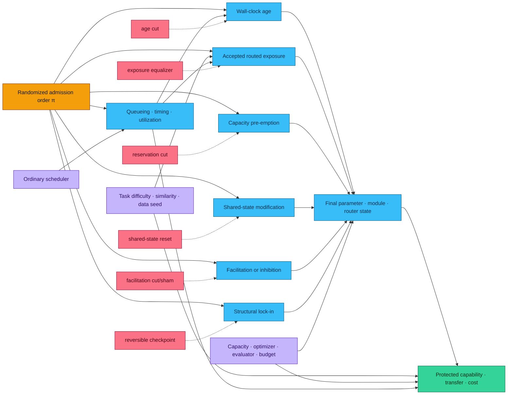

# History-conditioned modular succession and priority effects

<!-- markdownlint-disable MD013 -->

- **Audit date:** 2026-08-26
- **Fields:** microbial community ecology, continual learning, curriculum
  learning, modular machine learning, and experimental design
- **Scope:** whether the order of otherwise identical task or module admissions
  can alter a final artificial system through separately testable
  age, exposure, capacity, shared-state, facilitation, or lock-in paths
- **Evidence rule:** ecological observation, ecological intervention,
  machine-learning result, cross-domain analogy, and repository hypothesis are
  separate records
- **Promotion state:** frontier audit only; no principle ID, candidate ID,
  claim ID, protocol ID, or fixture number is created or reserved here
- **Execution state:** design only; no implementation, run, result, performance
  comparison, or energy measurement exists
- **Companion mathematics:** [history-conditioned modular succession](../../math/history-conditioned-modular-succession.md)

## Executive finding

Arrival history can matter in microbial communities, and task order can matter
in sequential machine learning. Those two findings do **not** establish that
an artificial system should imitate ecological succession or that a new
architecture has been found.

The bounded residue worth testing is narrower:

> With the presented task multiset, eligible module identity set, exogenous
> exposure, total capacity, optimization allowance, evaluator access, and
> complete resource budget held fixed, does admission order change protected
> final capability or realized module state through a
> measurable interaction among module age, routed exposure, capacity
> pre-emption, shared-state modification, facilitation, and reversible or
> irreversible commitment?

The word *succession* in this audit denotes time-ordered replacement or change.
It does not imply improvement, progress, evolution, inheritance, or a preferred
endpoint. In this artificial design, *priority effect* is reserved for a
randomized order intervention whose outcome differs despite the same eligible
components and environment. A mere correlation between age and success is
insufficient.

The literature supports constructing this experiment, not its answer. The
strongest outcome may be that optimized curriculum, replay, a conventional
mixture of experts, population search, or ordinary scheduling explains every
apparent gain. That outcome would deduplicate the transfer rather than weaken
the audit.

## Construct firewall

### Microbial succession

Microbial succession is a time-ordered change in community composition, traits,
or function. Datta and colleagues observed rapid, reproducible succession on
model marine particles and implicated dispersal limitation and facilitation
[`datta2016succession`]. This supports existing
[C-574](../claims.md#c-574). It does not by itself identify a priority effect:
an observed sequence can be reproducible without a randomized reversal of
arrival order, and it need not end in alternative states.

### Ecological priority effect

An ecological priority effect exists when arrival order or timing changes the
outcome of later interactions. The source literature separates at least two
broad paths:

1. **niche pre-emption:** early residents occupy finite space, resources, or
   opportunity before a newcomer arrives; and
2. **niche modification:** early residents alter a shared environment in a way
   that inhibits or facilitates later residents.

Fukami's synthesis is used as an authoritative vocabulary source
[`Fukami2015HistoricalContingency`], while the empirical support below comes
from primary interventions. Neither category is presumed to map one-to-one to
parameters, experts, gradients, or routers.

The artificial contract below estimates order effects only. Its inter-arrival
schedule and total horizon are frozen across permutations. Ecological
dispersal-timing results remain motivating evidence, not an identified
artificial estimand. A future timing test would need a separately randomized
interval vector with the same total horizon, task presentations, update
ceilings, and resource boundary.

### Continual-learning task-order effect

A continual-learning task-order effect occurs when a learner receives the same
task blocks in different orders and finishes with different retained or
transferred performance. The state carrying history can include parameters,
optimizer moments, replay contents, normalization statistics, router state, or
frozen structure. This is already an artificial-learning phenomenon, but it is
not automatically modular succession. A monolithic model can have a task-order
effect without admitting, displacing, specializing, or routing modules.

### Curriculum optimization

Curriculum optimization deliberately chooses the order, timing, or difficulty
of examples or tasks to improve an objective. Bengio and colleagues introduced
the modern machine-learning curriculum framing [`BengioEtAl2009Curriculum`].
Pentina, Sharmanska, and Lampert optimized the order of multiple related tasks
[`PentinaEtAl2015MultiTaskCurriculum`]. Bell and Lawrence directly studied task
ordering in continual learning, but their record remains a preprint
[`BellLawrence2022TaskOrdering`]. Li and Hiratani subsequently supplied a
peer-reviewed analytical and empirical task-order study in a bounded
task-incremental setting [`LiHiratani2025OptimalTaskOrder`].

A curriculum is therefore a strong existing method and null, not a new name
for ecological priority. If a curriculum optimizer predicts the best sequence
and matches the proposed system at equal search cost, the transfer is
deduplicated.

### Ordinary scheduling

Ordinary scheduling orders or allocates already defined jobs on finite
resources. It can change waiting time, completion time, utilization, and even
which jobs meet deadlines. In this audit it is not called succession when:

1. jobs do not update a persistent learned state;
2. job completion does not change later job semantics or admissible capacity;
3. no learned module is created, displaced, specialized, or frozen; and
4. replaying the same completed updates in a common canonical order makes final
   capability identical.

The scheduler remains a mandatory negative control because compute contention,
queue position, and wall-clock age can mimic a priority effect. A scheduling
effect is still operationally important; it is simply a different construct.

### History-conditioned modular succession

This audit uses *history-conditioned modular succession* only as a provisional
experiment label. It requires all of the following to be observable:

1. typed modules or experts with stable identities and birth/admission events;
2. a versioned sequence of task and module exposures;
3. finite capacity, routing, or shared state through which an earlier module
   can affect a later one;
4. final evaluation after the same task multiset has been presented and the
   same eligible module identity set has been offered, while realized active or
   retired state remains an outcome;
5. counterfactual order reversals and causal cuts of the proposed paths; and
6. complete quality, retention, latency, work, memory, and energy boundaries.

Until those conditions are implemented and executed, this phrase carries no
claim of novelty or benefit.

## Primary evidence inventory

### Microbial evidence

| Source | Directly supported observation | Boundary retained here |
| --- | --- | --- |
| [Datta et al. 2016](https://doi.org/10.1038/ncomms11965) [`datta2016succession`] | Model marine-particle communities showed rapid reproducible taxonomic and trait succession, with evidence for dispersal limitation and facilitation. | Reproducible succession is not itself an arrival-order intervention, learning, progress, or cumulative inheritance. |
| [Vannette and Fukami 2014](https://doi.org/10.1111/ele.12204) [`VannetteFukami2014NichePriority`] | Sequential nectar-microbe experiments related priority-effect strength to resource-use overlap, environmental impact, and late-arriver requirements. | The component regressions are system- and environment-qualified; they do not establish a universal priority formula. |
| [Wright and Vetsigian 2016](https://doi.org/10.1038/ncomms11274) [`WrightVetsigian2016Bistability`] | Invasion experiments among competing bacteria found frequent abundance-dependent exclusion and pairwise bistability associated with inhibitory interactions. | Initial abundance, arrival order, and direct inhibition must remain distinct; pairwise bistability does not imply higher-order community predictability. |
| [Svoboda et al. 2018](https://doi.org/10.1038/ismej.2017.180) [`SvobodaEtAl2018DispersalTiming`] | Delaying dispersal of a home bacterioplankton community increased the persistence of the initially inoculated alien community. | The experiment mixes whole communities and timing with resident growth; it motivates, but does not identify, an artificial age or capacity mechanism. |
| [Carlström et al. 2019](https://doi.org/10.1038/s41559-019-0994-z) [`CarlstromEtAl2019PhyllospherePriority`] | Drop-out and late-introduction experiments in a 62-strain *Arabidopsis* phyllosphere community showed historical contingency, variable late invasion, and resistance of the established community. | Relative abundance and establishment are not task accuracy; host, spatial, and community context limit transfer. |

The recent microbiome synthesis by Debray and colleagues
[`DebrayEtAl2022MicrobiomePriority`] is used to check vocabulary, scales, and
known measurement traps. It is a review and is not counted as an independent
experimental result.

### Artificial-learning evidence

| Source | Directly supported observation | Boundary retained here |
| --- | --- | --- |
| [McClelland, McNaughton, and O'Reilly 1995](https://doi.org/10.1037/0033-295X.102.3.419) [`mcclelland1995complementary`] | Complementary fast and slow learning systems can reduce destructive interference in the source computational account. | This motivates [C-008](../claims.md#c-008), not a module-arrival rule. |
| [Pentina, Sharmanska, and Lampert 2015](https://doi.org/10.1109/CVPR.2015.7299188) [`PentinaEtAl2015MultiTaskCurriculum`] | The order of related tasks affected average performance, and an order-selection criterion improved the evaluated multi-task setting. | Sequential transfer with chosen order is curriculum learning, not ecological succession. |
| [Lee, Goldt, and Saxe 2021](https://proceedings.mlr.press/v139/lee21e.html) [`LeeEtAl2021TaskSimilarity`] | In a teacher--student model, feature and readout similarity affected transfer and forgetting in different ways and at different horizons. | A two-task analytical setup does not supply a general ordering rule or modular architecture. |
| [Bell and Lawrence 2022](https://arxiv.org/abs/2205.13323) [`BellLawrence2022TaskOrdering`] | The preprint reports substantial continual-learning differences across task orders and proposes curvature-based ordering. | Preprint status, evaluated datasets, estimator access, and search cost remain explicit. |
| [Li and Hiratani 2025](https://proceedings.mlr.press/v267/li25z.html) [`LiHiratani2025OptimalTaskOrder`] | A latent-factor teacher--student analysis and bounded image experiments linked task similarity, typicality, and order to final task-incremental performance. | The derived rules are model- and setting-qualified; they are not universal ecological laws. |

The combined evidence establishes that history can be outcome-relevant in both
domains. It does not establish a shared mechanism. Similar words such as
*niche*, *competition*, *facilitation*, *specialization*, and *succession* are
hypothesis generators until an intervention cuts the corresponding artificial
path.

## Exact overlap and deduplication map

| Existing record | Genuine overlap | What remains outside it | Deduplication decision |
| --- | --- | --- | --- |
| [C-056](../claims.md#c-056) | Capability-gap selection repaired one defined mouse microbial community by adding selected strains. | It does not test the order of adding an identical final strain/module set. | Reuse capability-gap admission as a comparator; do not create a second “gap repair” claim. |
| [C-057](../claims.md#c-057) | Functional redundancy was negatively associated with donor engraftment in two small reanalysed human datasets. | Genomic potential was not randomized expressed capacity, and the record does not identify arrival order. | Use overlap/redundancy as a preregistered stratum and capacity-pre-emption hypothesis, not as causal proof. |
| [C-574](../claims.md#c-574) | Marine-particle communities showed reproducible succession shaped by dispersal limitation and facilitation. | No general artificial priority rule, improvement, or inheritance follows. | Keep the ecological observation unchanged; the proposed experiment is a transfer test only. |
| [C-008](../claims.md#c-008) | Fast acquisition separated from slow integration can reduce interference in the source framework. | It does not specify module birth order, finite-capacity admission, or ecological priority mechanisms. | Reuse the consolidation boundary; do not rename complementary learning systems as succession. |
| [Fixture F-014](../../experiments/fixtures/014-continual-memory-lifecycle.md) | Already freezes continual-learning interference, replay, consolidation, retention, and complete lifecycle accounting. | It does not factorially isolate age, module exposure, capacity pre-emption, shared-state modification, facilitation, and lock-in under identical task multisets and module-eligibility sets. | Treat F-014 as the closest protocol and null surface. Any later large experiment must reuse rather than fork its measurement and artifact contracts. |
| [Candidate 004](../../experiments/candidates/004-closed-endogenous-curriculum.md) | Chooses proposals/interventions and retains validated changes under equal budgets. | A task-order effect can exist without a closed proposal--intervention--evaluation loop. | Candidate 004 and optimized curriculum are mandatory strongest nulls; order selection alone is not a new candidate. |
| [Candidate 019](../../experiments/candidates/019-audited-cumulative-inheritance.md) | Tracks validated capability, lineage, transmission, and turnover. | Order-conditioned final state within one learner generation is not cumulative inheritance. | Preserve lineage fields for auditability, but require turnover and independently retained capability before invoking Candidate 019. |

No novelty claim is made from this map. Within the repository records compared
here, the remaining work item is a bounded causal factorial that asks whether
these already-known mechanisms interact in a modular continual learner after
stronger conventional methods are included.

## Causal model

This graph is a hypothesis graph, not a fitted causal model. In particular,
capacity can alter exposure, shared state can alter routing, and facilitation
can alter capacity demand. The arrows therefore warn against interpreting
one-factor ablations as an additive decomposition.

## Hypothetical factorial-design illustration

This is a constructed illustration of what one position-by-mechanism result
could look like; it contains no measurements. The left panel compares the same
task's centered protected-score contrast at admission positions one through
four under shared first-come capacity and a position-blind reservation cut.
The right panel subtracts the shared-capacity contrast from the reserved-
capacity contrast at each position. Smaller contrasts after the cut would be
consistent with capacity pre-emption, but would not identify it without the
full factorial, null stack, parity checks, uncertainty analysis, and a second
task family.

No model was trained to produce these values, and they are not estimates,
predictions, target effect sizes, or evidence. The editable source is the
[`history-conditioned-position-contrast` entry](../../assets/plots/core-models.json),
and the notation is defined in the companion
[position-effect mathematics](../../math/history-conditioned-modular-succession.md#position-effect).

## Bounded fixed-task-and-eligibility experiment design

### Experimental object

Use a frozen four-task family
$\mathcal{T}=\{T_1,T_2,T_3,T_4\}$ and a frozen four-module eligibility set
$\mathcal{M}=\{M_1,M_2,M_3,M_4\}$. Before randomization, freeze a one-to-one
admission map $g(T_k)=M_k$ and paired units $A_k=(T_k,M_k)$; the permutation
orders those pairs rather than independently re-pairing tasks and modules.
Every order arm receives the same
checksummed examples, labels, augmentations, response opportunities, and task
block sizes. Every arm is offered the same task blocks and eligible module
identities. Realized active, consolidated, merged, or retired module state may
differ and is recorded as an outcome. Only the permutation and explicitly
randomized mechanism cuts may differ.

The paired admission map does not force permanent task ownership. After
admission, task $k$ and executing module $\ell$ remain separate indices in the
specialization and routing matrix, so transfer, reuse, merge, and retirement
remain observable.

All module initialization images are generated before order assignment from
random streams keyed by `(module_identity, seed)`, never by sequence position
or time of creation. Just-in-time birth loads the same stored image that the
pre-instantiated arm froze at run start. Task data, augmentation, dropout,
router, evaluator, and fault streams are likewise keyed by typed identity so a
permutation cannot shift unrelated random draws.

The first synthetic family must independently control feature overlap, readout
conflict, rarity, and task difficulty. A second family must use a materially
different data generator or real dataset. Results confined to one synthetic
generator cannot justify an architecture proposal.

### Two-stage order design

1. **Order screen:** evaluate all $4!=24$ task permutations using sealed screen
   seeds for each method. This estimates the order distribution rather than
   comparing one convenient forward/reverse pair.
2. **Mechanism factorial:** before screen results are opened, preregister four
   reverse-paired orders with balanced task positions and predecessor
   relations. Cross those orders with the binary interventions below on fresh
   seeds. The confirmatory set cannot be selected because it looked extreme in
   the order screen.

The screen and factorial have disjoint random seeds, tuning data, and result
directories. Confirmation data cannot revise the order set, endpoint family,
or kill thresholds.

### Mandatory parity ledger

For every paired comparison, equality is checked before outcomes are opened:

1. **Task and eligibility identity:** identical task identities, module
   eligibility sets, initialization images, dataset versions, and numbers of
   presentations of each block; realized module lifecycle state is an outcome.
2. **Exogenous exposure:** identical examples, labels, augmentations,
   environment interactions, response opportunities, and task-local update
   ceilings. Endogenous router acceptance is an outcome and is additionally
   handled by the exposure intervention.
3. **Capacity:** identical total parameter/storage ceilings, maximum active
   parameters, expert count, replay bytes, checkpoint bytes, and peak worker
   allowance. Reserved capacity is unavailable to other modules rather than
   free extra capacity.
4. **Optimizer:** identical optimizer implementation, precision, base
   hyperparameter search allowance, initialization distribution, stopping
   checks, and number of permitted updates within each method. Method-specific
   optimizer changes are typed and their complete tuning/search cost is
   charged.
5. **Evaluator:** identical held-out examples, evaluator versions, evaluator
   calls, feedback fields, checkpoint-selection opportunities, and latency.
   The sequence optimizer does not receive confirmation labels.
6. **Budget:** identical or Pareto-compared counts of examples, updates,
   forward/backward evaluations, routed tokens, bytes read/written, peak live
   bytes, worker-seconds, wall time, and measured joules through the longest
   retention horizon.

An arm that reaches a ceiling early waits or abstains; it does not spend the
remainder on undisclosed tuning. Parallelism is not free. Joint training may
access all task blocks simultaneously and is therefore labelled an
information-rich upper null, but it still receives the same total examples,
updates, capacity, evaluator calls, and resource accounting.

### Mechanism factorial

The confirmatory diagnostic crosses the four frozen orders with the following
binary factors. The companion [math note](../../math/history-conditioned-modular-succession.md)
defines their estimands.

| Factor | Natural-history level | Causal-cut level | What the contrast can test |
| --- | --- | --- | --- |
| module age | instantiate a module only when admitted | instantiate all modules at the common start, freeze inactive parameters and private state, and activate them only at their scheduled admission | whether mere wall-clock age or initialization timing contributes after updates are matched |
| routed exposure | permit the frozen router/admission rule to determine accepted module-local examples | use a preregistered quota/reweighting rule so every module receives the same accepted examples and private updates across positions, with rejected work still charged | whether early modules win because they receive more effective training opportunity |
| capacity pre-emption | first admissible modules can occupy the shared fixed capacity | reserve position-blind per-module quotas before order is drawn; unused quota cannot be borrowed | whether incumbency operates through finite capacity rather than information transfer |
| shared-state modification | carry optimizer moments, normalization state, router state, replay metadata, and shared caches across blocks | restore a sequence-invariant shared-state checkpoint at each boundary while retaining private learned parameters | whether early work changes the medium seen by later modules |
| facilitation/inhibition | permit typed earlier-module outputs or artifacts to enter later training/routing | cut those edges and substitute checksummed sham payloads with matched size, timing, and processing work | whether informational cross-module influence, rather than capacity or scheduling, carries the order effect |
| irreversible lock-in | permit the frozen consolidation rule to commit routing or structure irreversibly | checkpoint before commitment and permit a costed unlock/reassignment at the same decision time | whether hysteretic commitment preserves useful specialization or merely traps an early accident |

The full diagnostic is an order-by-$2^6$ factorial for each implemented modular
method. If compute requires a fractional screen, it may eliminate inactive
high-order interactions on discovery seeds only; every interaction used for a
mechanistic statement must be restored in the fresh-seed full factorial.

The facilitation cut changes information content even though bytes and work are
matched. It identifies dependence on that channel, not a free-information
efficiency gain. The shared-state reset may also remove useful generic
adaptation. These consequences remain endpoints rather than being normalized
away.

## Strongest null stack

Every later implementation must include the following, or record why a null is
mathematically inapplicable before running:

1. **Joint training:** all tasks interleaved from the start at the same total
   exposure and capacity. This is the information-rich order-free reference.
2. **Monolithic sequential training:** no modular growth, identical task
   permutations, optimizer, and total capacity.
3. **Static mixture of experts:** fixed experts and a fixed, position-blind
   router, capacity-matched to the proposed modular system. This is an
   engineered negative control, not a result attributed to a source paper.
4. **Learned mixture of experts:** fixed expert inventory with a learned router
   and explicit load/capacity accounting [`shazeer2017outrageously`,
   `fedus2021switch`].
5. **Replay:** reservoir or preregistered balanced replay with storage and
   replay updates charged [`RolnickEtAl2019ExperienceReplay`].
6. **Parameter protection:** Elastic Weight Consolidation
   [`kirkpatrick2017overcoming`] with its importance-estimation work and
   Orthogonal Gradient Descent [`FarajtabarEtAl2020OGD`] with its retained
   gradient subspace charged.
7. **Random curriculum:** uniform random permutation from the same admissible
   set, including the same number of sequence trials.
8. **Optimized curriculum:** the strongest preregistered task-order optimizer,
   including pilot data, pairwise similarity/curvature measurements, search
   runs, and failed orders [`PentinaEtAl2015MultiTaskCurriculum`,
   `LiHiratani2025OptimalTaskOrder`]. Candidate 004 is the complete closed-loop
   repository comparator.
9. **Population-based training:** a population with exploitation, variation,
   and hyperparameter schedules under the same aggregate work and evaluator
   calls [`JaderbergEtAl2017PBT`].
10. **Quality-diversity search:** MAP-Elites or a frozen equivalent with archive
    storage, descriptor choices, evaluations, and discarded candidates charged
    [`MouretClune2015MAPElites`].
11. **Ordinary scheduler control:** execute the same task jobs and resource
    contention without parameter, router, replay, normalization, or structure
    updates, then replay completed updates in one canonical order. This
    separates queueing/timing from learned history.

A proposed history-conditioned method contributes nothing architectural if one
of these complete nulls matches its protected quality--cost frontier. A
different internal narrative does not count as a gain.

## Interventions and diagnostic logic

### Age versus exposure

Early arrival normally confounds elapsed time, number of accepted examples,
number of updates, and opportunity to influence the router. The design first
equalizes exogenous task presentation in every arm. It then independently
pre-instantiates modules and equalizes accepted module-local exposure. Four
combinations distinguish:

1. different age and different routed exposure;
2. equal age but different routed exposure;
3. different age but equal routed exposure; and
4. equal age and equal routed exposure.

An order effect remaining only in case 1 is not a structural priority effect.
An age contrast without any state-changing process is expected to be null; a
non-null result triggers checks for decay, clocks, nondeterministic services,
or hidden background work.

### Capacity pre-emption

The shared-capacity arm lets earlier modules claim capacity under the frozen
admission rule. The reservation cut allocates equal quotas before the
permutation is sampled and forbids borrowing. Total and active capacity remain
identical. A reduction in order sensitivity under reservation supports a
capacity path only if task exposure, shared-state carry, and service deadlines
remain matched.

### Shared-state modification

Record and hash all shared state that survives a task boundary: optimizer
moments, normalization statistics, router state, replay sampling metadata,
global caches, random-number streams, and consolidation counters. The reset
cut restores a common boundary checkpoint but retains private module
parameters. Unrecorded shared state invalidates this contrast.

### Facilitation and inhibition

Every cross-module message has a typed producer, consumer, sequence, payload
hash, byte count, availability time, processing cost, and gradient permission.
The cut replaces its payload with a sham of identical size and timing and
executes the same parser/transport work. A positive order effect that vanishes
under the cut is channel-dependent, but it is called facilitation only if the
later module's protected outcome improves without hidden answer exposure.
Harm is reported as inhibition; neither sign is presumed.

### Irreversible lock-in

Every structural freeze, expert retirement, hard router assignment, capacity
commitment, or consolidation event receives a pre-event checkpoint. The
reversible arm can reopen the decision at the same registered time and pays all
checkpoint, validation, migration, and retraining costs. Persistence after
removing the original inducing task is evidence of hysteresis, not evidence of
usefulness. Usefulness requires better retained and transfer capability at an
acceptable complete cost.

## Endpoints

### Protected learning outcomes

Report raw task-local outcomes at immediate, delayed, and transfer horizons:

1. final held-out score and error for every task;
2. worst-task and protected rare-task score;
3. backward transfer and forgetting relative to each task's post-acquisition
   checkpoint;
4. forward transfer and newcomer sample complexity;
5. near and structurally novel transfer;
6. calibration and abstention quality where predictions carry confidence;
7. recovery after removal of the task or module that supplied facilitation;
8. sensitivity across all evaluated permutations, not only the best order; and
9. replication on the second task family and held-out order seeds.

No scalar average may hide failure of a protected task or transfer stratum.

### Structural and routing outcomes

Record module birth/admission time, accepted examples, private updates,
allocated and active parameters, routed load, dropped load, expert overlap,
router entropy, hard commitments, unlocks, retirements, and lineage. Report
both final state and the trajectory. Specialization is a measured difference
in preregistered task-conditional function, not a module name or low router
entropy alone.

### Service and lifecycle outcomes

Record accuracy-qualified throughput, deadline success, p50/p95/p99 latency,
queue and retry counts, examples, optimizer steps, forward/backward
evaluations, evaluator calls, transferred and retained bytes, peak live bytes,
worker-seconds, wall time, and calibrated external energy in joules. Tuning,
sequence search, failed runs, checkpoints, resets, shams, population members,
archives, retention evaluation, and recovery remain in the ledger.

Without calibrated external measurement there is no energy result. Operation
counts, GPU utilization, TDP, FLOPs, runtime, or a biological analogy cannot
replace joules.

## Statistical contract

1. Randomize permutation, method arm, mechanism factors, device slot, and run
   order within declared blocking strata.
2. Pair seeds, datasets, initial parameter draws, evaluator draws, and
   perturbations wherever the factor permits a literal counterfactual.
3. Freeze one primary endpoint family before opening confirmation runs:
   protected final score, worst-task score, backward transfer, newcomer sample
   complexity, and the complete cost vector.
4. Estimate the complete order distribution and simultaneous pairwise
   contrasts; do not infer an order law from the selected maximum.
5. Use a randomization-based maximum-statistic or Holm correction over the
   preregistered primary contrast family. Report simultaneous intervals and raw
   effects, not only adjusted decisions.
6. Treat order-by-mechanism interactions as primary only when preregistered.
   Exploratory higher-order interactions require a fresh confirmation set.
7. Keep task family, task identity, order, seed, and workstation as explicit
   levels; task runs are not independent replicates of a general task
   population.
8. Report all invalid, failed, timed-out, and resource-exceeded runs. A method
   cannot delete orders on which it performs poorly.

## Preregistered kill rules

The frontier is killed or narrowed when any of the following occurs:

1. **Parity failure:** task multiset, eligible module identity set, exogenous
   exposure, capacity, optimizer allowance, evaluator access, or complete
   budget differs across the paired arms beyond the frozen tolerance.
2. **No order effect:** every simultaneous interval on both protected task
   families lies wholly inside
   $(-\delta_q^{\min},+\delta_q^{\min})$.
3. **Scheduling explanation:** canonical replay removes the final capability
   difference, or the non-learning scheduler control reproduces it.
4. **Age/exposure explanation:** pre-instantiation and accepted-exposure
   equalization jointly remove the effect.
5. **No mechanistic cut:** no preregistered mediator intervention changes the
   order contrast on fresh confirmation seeds.
6. **Ordinary-null sufficiency:** joint training, static/learned MoE, replay,
   EWC, OGD, random/optimized curriculum, PBT, or quality-diversity search
   matches or dominates the protected quality--cost frontier.
7. **Search leakage:** the chosen order, similarity metric, mechanism factor,
   or stopping rule uses confirmation labels or uncharged pilot runs.
8. **Protected harm:** mean quality rises while a protected rare task,
   worst-task score, calibration, transfer stratum, or recovery endpoint crosses
   its harm boundary.
9. **Unpriced lock-in:** apparent persistence depends on irreversible
   commitment whose reversal, migration, or recovery cost is absent.
10. **Single-family dependence:** the effect fails the second generator or
    materially different task family.
11. **Non-replication:** the held-out seed block or second machine family does
    not reproduce the preregistered direction and relevance margin.
12. **Energy substitution:** any energy statement relies on operations,
    utilization, runtime, rated power, or modeled estimates instead of
    calibrated external joules at the declared boundary.

Killing the architecture transfer does not dispute the microbial or
continual-learning source results. It shows only that their composition adds no
residual value under this artificial contract.

## Testable predictions, not results

1. If capacity pre-emption is causal, position-blind reservation will reduce
   between-order variance most strongly in high-overlap/high-redundancy strata.
2. If shared-state modification is causal, restoring common boundary state
   will attenuate order effects while preserving private-module competence.
3. If facilitation is causal, cutting typed cross-module information will
   selectively remove positive forward-transfer paths; sham work alone will
   not reproduce them.
4. If irreversible commitment creates useful hysteresis, the committed arm
   will retain a protected advantage after the inducing task is removed and
   after checkpoint, recovery, and retraining costs are charged.
5. If the phenomenon is ordinary continual-learning interference, replay,
   EWC, or OGD will explain it without modular birth or ecological language.
6. If it is curriculum optimization, a charged order optimizer will match the
   best sequence without the proposed modular mechanism.
7. No universal “early is better” or “similar tasks should be adjacent” rule is
   predicted; source results make the sign conditional on task relation,
   horizon, mechanism, and architecture.
8. A final average can improve while protected rare capability worsens;
   reporting the task vector will expose that trade-off.

## Evidence limitations and next gate

The microbial studies use organisms, population growth, environmental
modification, and ecological abundance. Artificial modules do not reproduce
those substrates merely because they share finite resources. The AI studies
show order sensitivity and order optimization in bounded models and datasets;
they do not establish the proposed six-path factorial or an energy advantage.
The original PBT and MAP-Elites records cited to define two nulls are preprints;
they specify comparator families but add no evidence for the proposed transfer.

The next gate is not a numbered fixture. It is an independent design review of
this audit and its [math note](../../math/history-conditioned-modular-succession.md),
followed by a cost estimate for implementing the complete null stack. A large
later numbered fixture should be considered only after:

1. the fixed-task-and-eligibility generator and all 24 permutations are executable;
2. every state variable needed for the six causal cuts is serializable;
3. the parity ledger can fail closed before outcomes are read;
4. joint, MoE, replay, EWC, OGD, curriculum, PBT, and quality-diversity nulls
   have credible matched-budget implementations; and
5. workstation energy measurement and second-machine replication paths exist.

Until then this document is a durable frontier specification, not scientific
evidence for a new AI mechanism.
