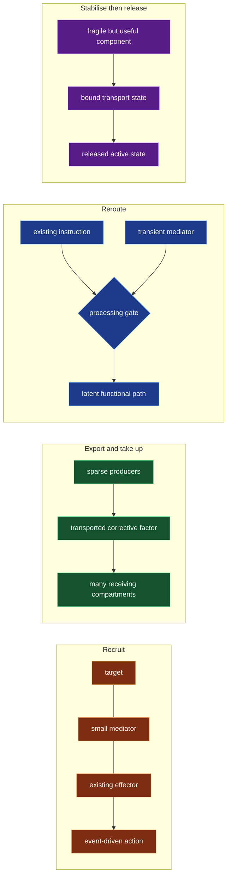
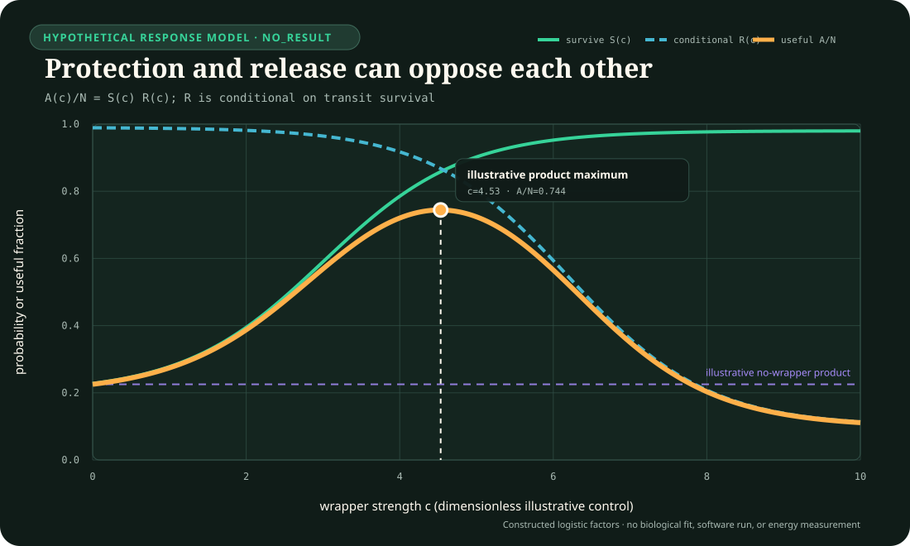

# Clinical biotechnology: recruited machinery, sparse cross-correction, splice rerouting, and phase-selective chaperoning

<!-- markdownlint-disable MD013 -->

- **Audit date:** 2026-08-27
- **Scope:** underrepresented mechanisms at the boundary of clinical medicine,
  medicinal biotechnology, cell biology, and molecular therapeutics
- **Exclusions:** diagnostic classification, memory, continual learning, fault
  tolerance, and generic closed-loop control as proposed novelties
- **Evidence rule:** primary experiments or trials support empirical statements;
  EMA and EUR-Lex sources establish the European product or legal record, not a
  universal biological mechanism
- **Data boundary:** the proposed fixture is entirely synthetic and uses no
  patient, genomic, trial, or product-development data
- **Promotion state:** four biological observations and four speculative
  transfers are now recorded as [C-1573--C-1580](../claims.md#c-1573); only the
  transfer claims route to [Fixture F-029](../../experiments/fixtures/029-clinical-biotechnology-endogenous-machinery.md), whose CMB-X04 public-development harness remains construction-only and `NO_RESULT`,
  and no project principle or architecture candidate is added

## Executive finding

The previous clinical and biotechnology audits already cover living-product
identity, potency, manufacturing history, adaptive treatment, diagnostic-pathway
utility, dose scheduling, immune selection, repair, and generic feedback. Four
more specific operations were still missing from the repository search:

1. **Recruit an existing effector instead of continuously occupying the
   target.** Induced-proximity systems make the productive relation among
   target, mediator, and effector the action-bearing object.
2. **Correct neighbours from a sparse producer population.** Lysosomal
   cross-correction separates the fraction of modified producer cells from the
   larger fraction of cells that can receive a secreted corrective enzyme.
3. **Redirect a latent processing path instead of rewriting the source.** A
   splice-switching oligonucleotide can change which existing transcript is
   produced without changing the genome.
4. **Stabilise during one phase and release during another.** A pharmacological
   chaperone can help a compatible protein survive trafficking, yet must
   dissociate before that protein can perform its normal catalytic role.

These operations are distinct at the mechanism level: **recruit**, **export and
take up**, **reroute**, and **stabilise then release**. Their abstract AI
translations nevertheless have strong conventional nulls. Recruitment can
collapse to a tagged maintenance queue, cross-correction to multicast or
content distribution, splice rerouting to an adapter or routing rule, and
chaperoning to packaging plus a lifecycle state machine. The fixture therefore
tests a residual efficiency claim; it does not assume that biological naming
creates algorithmic novelty.

## Operation map



## Hard deduplication against durable project work

| Audited operation | Nearest existing owner | Why it is not admitted as a new principle | Residual worth testing |
| --- | --- | --- | --- |
| induced-proximity degradation | [P-008 compartmentalized interaction](../principle-registry.md#p-008--compartmentalized-interaction), [P-009 maintenance plane](../principle-registry.md#p-009--maintenance-plane), [P-011 transient communication coalitions](../principle-registry.md#p-011--transient-communication-coalitions) | target tagging, garbage collection, deletion, and transient interaction already exist; pairwise binding is not automatically productive action | whether a reusable mediator that recruits an already provisioned effector beats occupancy suppression and an explicit tagged work queue at equal complete cost |
| lysosomal cross-correction | [P-001 selective allocation](../principle-registry.md#p-001--selective-allocation), [P-008](../principle-registry.md#p-008--compartmentalized-interaction), [P-013 externalized shared state](../principle-registry.md#p-013--externalized-shared-state) | producers, transported factors, receiver uptake, and shared state reduce to established placement and distribution problems at this abstraction | whether sparse local producers plus receiver uptake beat central distribution, multicast, gossip, and per-node repair under spatial barriers and complete lifecycle accounting |
| splice redirection | [P-002 local autonomy](../principle-registry.md#p-002--local-autonomy-with-exception-escalation), [P-003 temporary trace](../principle-registry.md#p-003--temporary-trace-before-commitment), [P-010 structural offloading](../principle-registry.md#p-010--structural-offloading-and-co-design) | temporary routing masks, adapters, prompts, and compiled dispatch rules are mature nulls | whether a small reversible mediator can expose a pre-existing functional path with lower bytes, joules, and interference than those nulls |
| phase-selective pharmacological chaperoning | [P-003](../principle-registry.md#p-003--temporary-trace-before-commitment), [P-009](../principle-registry.md#p-009--maintenance-plane) | packaging, checkpointing, compatibility gates, and staged lifecycle controllers already stabilise artifacts | whether stabilisation that is useful during transfer but inhibitory during service creates a reproducible intermediate-affinity advantage beyond ordinary wrapping and validation |

The audit also rejects three tempting rebrands:

- radiotherapy fractionation is another state- and schedule-dependent
  intervention and is already owned by the pharmacology and rehabilitation
  schedule claims;
- anti-vector immunity after gene delivery is an important clinical boundary,
  but its abstract transfer is already path dependence, option consumption, and
  maintained immune state; and
- synthetic lethality is a valuable paired-perturbation assay, but its proposed
  AI use is already interaction testing and redundancy/fault-structure analysis.

## Terms that must remain distinct

| Term | Operational meaning | Not equivalent to |
| --- | --- | --- |
| target engagement | mediator or ligand physically associates with the declared target under a declared assay | productive ternary complex, target modification, degradation, functional response, or clinical benefit |
| productive induced proximity | a geometry and state in which a recruited effector can act on the target | any three molecules being present, high pairwise affinity, or permanent occupancy |
| event-driven degradation | target removal follows a productive recruitment event and downstream cellular processing | zero-cost deletion, universal catalytic turnover, or proof that lower concentration is safer |
| producer fraction | fraction of compartments able to synthesize and release the corrective factor | receiver coverage, tissue exposure, uptake, correction, engraftment, or clinical benefit |
| cross-correction | a factor released by one cell is taken up and functionally used by another cell | diffusion alone, transplantation alone, complete organism correction, or a universal producer threshold |
| latent processing path | an already encoded path whose use probability can be changed by a mediator | a newly learned capability, a correct path in every context, or a cost-free fallback |
| splice redirection | a changed distribution of processed transcripts after a declared intervention | genome editing, guaranteed protein restoration, durable cure, or unrestricted tissue delivery |
| pharmacological chaperone | a molecule that binds and stabilises a compatible protein state and changes its trafficking or maturation | an enzyme replacement, a universal treatment for all variants, or a permanently bound activator |
| amenable variant | a variant meeting the product's declared response criterion under the applicable assay and product information | diagnosis alone, guaranteed individual response, or permission to extrapolate to another protein or assay version |

## 1. Induced proximity: relation-triggered action

### Biological observation and primary evidence

Sakamoto and colleagues constructed chimeric molecules that linked a selected
target to an SCF ubiquitin-ligase complex and demonstrated target ubiquitination
and degradation in their experimental systems
([DOI 10.1073/pnas.141230798](https://doi.org/10.1073/pnas.141230798)).
Bondeson and colleagues later reported heterobifunctional small molecules that
recruited a target to the VHL E3 ligase, demonstrated super-stoichiometric
ubiquitination in a reconstituted assay, cellular target reduction, and scoped
in-vivo activity
([DOI 10.1038/nchembio.1858](https://doi.org/10.1038/nchembio.1858)). Winter
and colleagues used phthalimide conjugation to recruit cereblon and degrade
BRD4 in cellular and mouse leukaemia models
([DOI 10.1126/science.aab1433](https://doi.org/10.1126/science.aab1433)).

The same broad operation need not use a synthetic bifunctional linker. Krönke
and colleagues showed that lenalidomide changes cereblon-substrate handling and
causes selective degradation of IKZF1 and IKZF3 in multiple-myeloma cells
([DOI 10.1126/science.1244851](https://doi.org/10.1126/science.1244851)). This
supports induced substrate recruitment as a real drug mechanism; it does not
make every molecular glue or PROTAC clinically effective.

### Quantitative boundary

Let target, effector, mediator, and productive ternary complex concentrations be
$T$, $E$, $M$, and $C$ in mol/L. A deliberately incomplete turnover model is

$$
\frac{dT}{dt}=s_T-k_0T-k_{\mathrm{act}}C,
$$

where $s_T$ is mol L$^{-1}$ s$^{-1}$, $k_0$ is s$^{-1}$, and
$k_{\mathrm{act}}$ is s$^{-1}$. $C$ is not recoverable from one pairwise
affinity alone: it depends on both binary binding reactions, ternary geometry,
cooperativity, compartmental availability, and the conservation of $T$, $E$,
and $M$. Excess mediator can in some parameter regimes trap material in binary
complexes rather than increase $C$; the fixture must therefore sweep mediator
level rather than assume monotonic benefit.

For a digital translation, replace mol/L with counts per compartment and report
productive recruitment events, completed removals, and mediator operations per
second separately. Calling the mediator "catalytic" is allowed only when one
mediator instance is observed to support more than one completed target action
under the frozen accounting boundary.

### Proposed AI translation and efficiency mechanism

A compact, versioned mediator binds one declared component state and one
existing maintenance actor. It does not carry the removal implementation. Its
potential efficiency comes from reusing the maintenance actor and releasing the
mediator after a completed action instead of continuously suppressing the
target. The comparison must charge:

- target search and mediator placement;
- maintenance-engine capacity and queueing;
- false recruitment and collateral removal;
- verification, replacement, and target resynthesis;
- mediator bytes, operations, and lifetime; and
- service loss while the target is suppressed or absent.

### Evidence status, prediction, and failure modes

- **Biological status:** established in the cited biochemical, cell, and animal
  systems; clinical benefit of the PROTAC modality is not claimed here.
- **Transfer status:** speculative.
- **Measurable prediction:** with identical harmful-target arrivals and an
  already provisioned but capacity-limited maintenance engine, productive
  recruitment should reduce target-time integral and persistent mediator
  occupancy per completed removal relative to continuous suppression. It must
  also beat an explicit tagged queue on total joules and useful service.
- **Failure modes:** nonproductive geometry, effector scarcity, binary-complex
  saturation, off-target recruitment, target resynthesis, queue starvation,
  mediator leakage across compartments, and deletion of useful targets.
- **Kill rule:** if a tagged work queue with the same target evidence and
  maintenance engine matches target persistence, service, and energy, retain
  induced proximity only as a biological implementation example.

## 2. Sparse producers and lysosomal cross-correction

### Biological observation and primary/clinical evidence

Fratantoni, Hall, and Neufeld demonstrated mutual correction when fibroblasts
from two different lysosomal-storage disorders were co-cultured
([DOI 10.1126/science.162.3853.570](https://doi.org/10.1126/science.162.3853.570)).
The result established that a missing intracellular function could, in those
systems, be supplied through material released by other cells rather than by
correcting every cell independently.

In metachromatic leukodystrophy, ex-vivo lentiviral modification of autologous
haematopoietic stem and progenitor cells has been investigated in a small,
non-randomised phase 1/2 programme. The early report, ad-hoc follow-up, and
longer integrated analysis documented engraftment, ARSA activity, and scoped
clinical outcomes, with the strongest benefit in children treated before or
very early in disease
([DOI 10.1126/science.1233158](https://doi.org/10.1126/science.1233158),
[DOI 10.1016/S0140-6736(16)30374-9](https://doi.org/10.1016/S0140-6736(16)30374-9),
[DOI 10.1016/S0140-6736(21)02017-1](https://doi.org/10.1016/S0140-6736(21)02017-1)).
The non-randomised design, historical controls, disease stage, conditioning,
engraftment, and complete product chain remain part of the evidence boundary.

The current EMA product information for Libmeldy describes genetically modified
cells producing and secreting functional ARSA, uptake by surrounding cells as
cross-correction, and the restricted authorised population
([EMA product information](https://www.ema.europa.eu/en/documents/product-information/libmeldy-epar-product-information_en.pdf)).
That official mechanism and authorisation record does not establish a universal
producer fraction or transport range.

### Quantitative boundary

For compartments $i=1,\ldots,n$, let $x_i$ be corrective-factor concentration
in arbitrary validated factor units/L, $p_i\in\{0,1\}$ producer state,
$q_i$ factor units L$^{-1}$ s$^{-1}$ per producer, $u_i$ s$^{-1}$ receiver
uptake, $k_d$ s$^{-1}$ decay, $D_{ij}$ the directed equal-volume transport rate
from $i$ to $j$ in s$^{-1}$, $\tau$ continuous simulated time in s, and $b_i$
the local unmet-function burden in task-native burden units:

$$
\frac{dx_i}{d\tau}=q_ip_i-(u_i+k_d)x_i
+\sum_j\left(D_{ji}x_j-D_{ij}x_i\right),
$$

$$
\frac{db_i}{d\tau}=r_i-k_{c,i}u_ix_i,
$$

where $r_i$ is burden units/s and $k_{c,i}$ has unit burden-unit L per factor
unit, converting factor uptake to corrected-burden rate.
The equations are a synthetic fixture, not a clinical model. They make four
separate quantities unavoidable: producer placement, transport, receiver
uptake, and functional correction. An average $\bar{x}$ cannot prove that a
protected receiver received enough factor before its deadline.

### Proposed AI translation and efficiency mechanism

A small subset of modules produces compact correction artifacts that nearby or
compatible modules can consume. The proposed gain is not "distributed repair"
in general. It is the possibility that one validated correction artifact can be
reused across several receivers, so the system need not independently retrain or
reconstruct every receiver. Every artifact remains typed by producer version,
receiver interface, validity interval, and transport path.

### Evidence status, prediction, and failure modes

- **Biological status:** cross-correction is established in scoped cell systems;
  the cited clinical programme and EU product establish a specific therapy and
  mechanism record, not a universal scaling law.
- **Transfer status:** speculative.
- **Measurable prediction:** on a spatial graph with repeated compatible deficits,
  a bounded sparse-producer arm should reach the same receiver-level service with
  fewer generated correction bytes and joules than per-node reconstruction. It
  must also beat central multicast and ordinary content-addressed distribution.
- **Failure modes:** producer loss, insufficient secretion, inaccessible
  compartments, uptake mismatch, transport delay, competing sinks, overload,
  correction of the wrong version, irreversible damage before arrival, and a
  single producer becoming a correlated failure or trust root.
- **Kill rule:** if content-addressed multicast or gossip with the same
  compatibility metadata matches receiver coverage, tails, and lifecycle cost,
  cross-correction adds no systems primitive.

## 3. Splice redirection: exposing a latent functional path

### Biological observation and primary/clinical evidence

Hua and colleagues identified intronic splicing silencers around SMN2 exon 7
and showed that antisense oligonucleotides masking the relevant motifs increased
exon inclusion in transgenic mice
([DOI 10.1016/j.ajhg.2008.01.014](https://doi.org/10.1016/j.ajhg.2008.01.014)).
Passini and colleagues then reported improved phenotype in a severe SMA mouse
model after CNS delivery of splice-switching antisense oligonucleotides
([DOI 10.1126/scitranslmed.3001777](https://doi.org/10.1126/scitranslmed.3001777)).

The ENDEAR randomised, double-blind, sham-controlled trial found better motor
milestone response and survival outcomes with nusinersen in the studied
infantile-onset SMA population
([DOI 10.1056/NEJMoa1702752](https://doi.org/10.1056/NEJMoa1702752)). The trial
supports clinical efficacy in its population; it does not prove that splice
redirection is preferable to every other SMA treatment or that later treatment
can reverse established injury.

EMA product information states that nusinersen binds the ISS-N1 intronic splice
silencing site in SMN2 pre-mRNA, increases exon 7 inclusion, and thereby
increases full-length SMN protein
([EMA product information](https://www.ema.europa.eu/en/documents/product-information/spinraza-epar-product-information_en.pdf)).

### Quantitative boundary

Let $N$ be processed instruction opportunities per second, $\pi(m,c)$ the
dimensionless probability of selecting the functional path under mediator level
$m$ and context $c$, and $\eta$ useful outputs per selected path. Then

$$
Y(m,c)=N\,\pi(m,c)\,\eta
$$

has useful outputs/s. A transient mediator state can be represented by

$$
\frac{dm}{d\tau}=u(\tau)-\lambda m,
$$

where $\tau$ is continuous simulated time in s, $m$ is in mediator units, $u$
is mediator units/s, and $\lambda$ is s$^{-1}$. This representation
forces the recurring delivery and expiry cost into the comparison. It also
makes the prerequisite explicit: when the latent path is absent or nonfunctional,
changing $\pi$ cannot create it.

### Proposed AI translation and efficiency mechanism

A small, reversible processing mask changes how an existing instruction,
module, or route is assembled at dispatch time. It may expose a dormant valid
path without modifying base weights or duplicating the whole capability. The
candidate is worthwhile only where:

- the functional path already exists and is independently verified;
- the mask is smaller and cheaper than an adapter or route-table change;
- unintended paths are measurable; and
- expiry, repeated delivery, and version compatibility remain cheaper than a
  durable update.

### Evidence status, prediction, and failure modes

- **Biological status:** established molecular mechanism with randomised clinical
  efficacy evidence for nusinersen in declared SMA populations.
- **Transfer status:** speculative.
- **Measurable prediction:** where a functional but rarely selected path is
  planted, a mediator mask should improve useful outputs per added byte and per
  joule without changing base parameters. It must beat an explicit router,
  prefix/prompt, adapter, and low-rank update under the same persistence horizon.
- **Failure modes:** no latent functional path, sequence or version drift,
  off-target rerouting, context-specific path invalidity, mediator delivery
  failure, repeated-dose cost, and late intervention after irreversible loss.
- **Kill rule:** if a versioned routing-table edit or conventional adapter matches
  quality, interference, reversibility, and lifecycle cost, classify splice
  redirection as another temporary routing implementation.

## 4. Phase-selective pharmacological chaperoning

### Biological observation and primary/clinical evidence

Fan and colleagues showed that an active-site-binding inhibitor accelerated
transport and maturation of compatible mutant alpha-galactosidase A in Fabry
lymphoblasts
([DOI 10.1038/4801](https://doi.org/10.1038/4801)). The useful operation is
not permanent inhibition: binding stabilises a subset of otherwise unstable
protein states during trafficking, followed by release in the lysosome.

The FACETS phase 3 trial compared migalastat with placebo in Fabry disease. Its
primary six-month responder analysis across all randomised participants did not
show a statistically significant difference; the publication reported
additional analyses in participants whose variants were classed as suitable for
migalastat
([DOI 10.1056/NEJMoa1510198](https://doi.org/10.1056/NEJMoa1510198)). This is
important negative structure: an attractive mechanism did not erase the need
for a validated compatibility boundary and a prespecified clinical endpoint.

Current EMA product information restricts Galafold to declared amenable
mutations and describes reversible active-site binding, stabilisation in the
endoplasmic reticulum, trafficking to lysosomes, and dissociation that restores
enzyme activity
([EMA product information](https://www.ema.europa.eu/en/documents/product-information/galafold-epar-product-information_en.pdf)).

### Quantitative boundary

Let $c$ be chaperone concentration in mol/L, $S(c)$ the probability that a
fragile component survives transit, and
$R(c)=P(\text{released and active}\mid\text{survived transit},c)$ the
conditional probability that a surviving component is released and active at
the destination. Useful delivered activity is

$$
A(c)=N\,S(c)\,R(c),
$$

in active components/s for $N$ attempted components/s. Stabilisation can make
$S(c)$ increase while persistent binding makes $R(c)$ decrease. An intermediate
optimum is therefore a testable possibility, not a guaranteed law. A mechanistic
fixture should retain at least two compartments with separate association,
dissociation, degradation, and service rates rather than optimise one scalar
"stability" score.



The editable [plot specification](../../assets/plots/core-models.json) makes the
constructed parameter choices and `NO_RESULT` status explicit. It is a reading
aid for the two-factor boundary, not a fitted pharmacological curve or an F-029
result.

### Proposed AI translation and efficiency mechanism

A small compatibility-qualified wrapper stabilises a fragile but useful artifact
during conversion, transfer, loading, or low-precision compilation, then
disengages before normal service. The potential saving is preservation of an
existing capability without full replacement or retraining. The wrapper is
useful only if it is temporary and phase-qualified; a wrapper that remains bound
and suppresses service has merely exchanged one failure for another.

### Evidence status, prediction, and failure modes

- **Biological status:** established mechanism for compatible variants and an
  EU-authorised product; clinical effects remain endpoint-, population-, and
  variant-qualified, including the cited primary-endpoint limitation.
- **Transfer status:** speculative.
- **Measurable prediction:** under planted transit fragility, useful activated
  artifacts should show a reproducible binding/release region in which the
  phase-selective arm beats no wrapper and a permanently bound wrapper. It must
  also beat checksum/retry, replication, checkpoint reload, and recompilation on
  total service and joules.
- **Failure modes:** incompatible artifact, binding too weak to stabilise,
  binding too strong to release, wrong compartment cue, throughput inhibition,
  hidden off-target stabilisation, and recurring wrapper cost exceeding
  replacement cost.
- **Kill rule:** if an ordinary package-plus-validation state machine provides
  the same survival and release performance at lower lifecycle cost, retain the
  biological example but reject the analogue.

## Stable audit-local claims

The identifiers below preserve the audit's local review order. Ledger
integration maps them in order to [C-1573--C-1580](../claims.md#c-1573): odd
central IDs are source-domain evidence inputs and even central IDs are the four
speculative transfers routed to F-029.

| ID | Status | Claim | Evidence boundary and test |
| --- | --- | --- | --- |
| `C-CMB-01` | established | Heterobifunctional degraders and molecular glues can induce target degradation by recruiting targets to cellular ubiquitin-ligase machinery; productive action is a relation among target, mediator, effector, and downstream processing rather than target occupancy alone. | Sakamoto, Bondeson, Winter, and Krönke systems; does not establish universal catalyticity, selectivity, safety, or clinical benefit. |
| `C-CMB-02` | speculative | Reusable recruitment of an already provisioned maintenance actor can outperform continuous suppression and explicit deletion queues for transient harmful components. | F-CMB-01A; must beat occupancy, tagged-queue, periodic-GC, and direct-delete nulls at equal complete cost. |
| `C-CMB-03` | established | In scoped lysosomal-disease systems, enzyme released by producer cells can be taken up and used by other cells, so producer fraction, receiver exposure, uptake, biochemical correction, and clinical benefit are separate quantities. | Fratantoni cell experiment; MLD gene-therapy trials and Libmeldy product record remain disease-, product-, conditioning-, stage-, and follow-up-qualified. |
| `C-CMB-04` | speculative | A sparse producer population exporting typed correction artifacts can repair a larger compatible module population more efficiently than independent repair. | F-CMB-01B; must beat central multicast, content-addressed distribution, gossip, and per-node reconstruction across transport barriers. |
| `C-CMB-05` | established | A sequence-specific transient mediator can redirect processing of an existing SMN2 transcript toward exon-7-containing full-length product without editing the genome. | Hua and Passini mechanism studies, ENDEAR trial, and Spinraza product record; tissue delivery, repeated treatment, disease stage, and adverse outcomes remain separate. |
| `C-CMB-06` | speculative | A small reversible processing mask can expose an existing functional execution path more efficiently than a durable model update. | F-CMB-01C; requires a planted latent path and comparison with routers, prompts, adapters, and low-rank updates. |
| `C-CMB-07` | established | For declared amenable Fabry variants, reversible ligand binding can stabilise mutant alpha-galactosidase A during trafficking and release it for lysosomal activity; compatibility and release are part of the mechanism. | Fan experiment, FACETS trial with its nonsignificant all-randomised primary analysis, and current Galafold product information. |
| `C-CMB-08` | speculative | A phase-qualified wrapper can preserve a fragile useful artifact during transfer and then release it for service at lower cost than replacement. | F-CMB-01D; must show a transfer/release region and beat packaging, retry, replication, reload, and recompilation nulls. |

## F-CMB-01 — Endogenous-machinery transfer fixture

**Fixture state:** protocol-complete and `NO_RESULT`; a bounded public-development
CMB-X04 construction runner and smoke manifest exist, but no comparison,
workstation-readiness, confirmation, performance, or energy authority follows.

The protocol-complete standalone specification is
[Fixture F-029](../../experiments/fixtures/029-clinical-biotechnology-endogenous-machinery.md).
It routes only the four speculative AI-transfer hypotheses `C-CMB-02`,
`C-CMB-04`, `C-CMB-06`, and `C-CMB-08`. The four established biological
observations are evidence inputs and cannot be validated by the synthetic
fixture.

### Shared contract

Generate a versioned modular service graph with synthetic components, typed
interfaces, spatial or logical compartments, and planted ground truth. Freeze:

- generator version and content hash;
- development, confirmation, and transfer seed commitments;
- component births, deficits, routes, compatibility classes, and deadlines;
- every arm's observation, action, state, and compute budget;
- cost coefficients only after reporting the native resource vector; and
- primary endpoints, multiplicity treatment, exclusions, and kill rules before
  confirmation seeds are revealed.

Use paired seeds across arms. Determine replicate count from a preregistered
power or precision target; do not choose a convenient fixed count. Report every
result by regime and protected receiver class before any aggregate. The oracle
may diagnose headroom but is ineligible to win.

Every track reports:

$$
\mathbf C=(E\,[\mathrm J],\;T\,[\mathrm s],\;B\,[\mathrm{byte}],\;
O\,[\mathrm{operations}],\;M\,[\mathrm{messages}],\;H\,[\mathrm{human\ min}]),
$$

plus useful service, wrong actions, missed actions, p95/p99 latency, recovery or
activation time, and protected-class minimum service. Do not hide a harmed tail
behind a scalar score. Energy includes generator, mediator production,
transport, maintenance, verification, cleanup, replacement, and idle reserve at
one declared system boundary.

### Track A — recruit an existing effector

**Generator.** Harmful and useful target states appear in compartments with
correlated evidence, variable target resynthesis, finite maintenance-engine
capacity, and tunable pairwise versus productive-ternary compatibility.

**Arms.** No action; continuous occupancy suppression; direct delete after a
calibrated threshold; periodic garbage collection; explicit tagged work queue;
induced-proximity mediator; oracle target labels.

**Primary outcomes.** Harmful target-time integral, useful-target deletions,
useful service, completed removals per mediator operation, maintenance queue
tail, and joules per verified completed removal.

**Ablations.** Remove mediator recycling; eliminate effector scarcity; break
productive geometry while preserving pairwise affinity; increase mediator until
binary saturation; disable replacement; inject cross-compartment leakage.

### Track B — sparse producer cross-correction

**Generator.** A graph contains compatible and incompatible receivers, movable
transport barriers, competing sinks, finite producer output, expiring
correction artifacts, and deadlines before some deficits become irreversible.

**Arms.** Independent reconstruction at every receiver; central full-state
repair; content-addressed multicast; budget-matched gossip; fixed producer
placement; adaptive sparse producers; oracle transport and compatibility.

**Primary outcomes.** Corrected receiver-time, protected receiver minimum,
uncorrected burden-time integral, generated and transported bytes, tail arrival
time, producer concentration, wrong-version uptake, and joules per verified
receiver-hour.

**Ablations.** Delete the highest-output producer; close one compartment;
remove uptake compatibility; add a high-affinity nonbenefiting sink; change the
receiver version after artifact release; reveal transport only after placement
freezes.

### Track C — redirect a latent path

**Generator.** Each component contains a declared latent functional path, a
dominant truncated or invalid path, context-specific path validity, processing
sites, and planted off-target sites. Some transfer instances deliberately lack a
functional latent path.

**Arms.** Full retraining; versioned routing-table edit; prefix/prompt; adapter;
low-rank update; transient processing mask; oracle route selector.

**Primary outcomes.** Functional outputs per added byte-year and per joule,
wrong-path and off-target rates, base-task interference, mediator renewal work,
expiry recovery, and transfer performance when the latent path is absent.

**Ablations.** Delete the latent path; mutate the processing site; retain the
mask after its validity interval; introduce two equal-looking off-target sites;
change context so the formerly functional path becomes harmful.

### Track D — stabilise during transit and release for service

**Generator.** Useful artifacts pass through a transport/compile/load phase and
then a service phase. Transit loss, binding strength, release cue, artifact
compatibility, service inhibition while bound, and replacement cost are varied
independently.

**Arms.** No wrapper; checksum and retry; replication; checkpoint reload;
recompile/retrain; permanent stabilising wrapper; phase-selective wrapper;
oracle compatibility and release cue.

**Primary outcomes.** Intact active artifacts per attempt, time to active
service, bound-but-inactive residue, useful service, replacement count, wrapper
operations, and joules per active artifact-hour.

**Ablations.** Use an incompatible artifact; weaken binding; prevent release;
invert the compartment cue; add off-target stabilization; shorten artifact
lifetime until wrapper maintenance dominates replacement.

### Promotion and stopping rules

Each speculative claim stands or falls on its own track; a win in one track
cannot compensate for a failure in another.

Promote a transfer claim only if the candidate arm:

1. beats the strongest conventional null on its preregistered task-native
   primary outcome without violating protected-service or wrong-action gates;
2. retains the advantage after complete lifecycle cost and mediator machinery
   are charged;
3. survives the mechanism-removing ablation but loses its advantage when the
   claimed necessary mechanism is removed in the predicted direction;
4. reproduces on hidden confirmation seeds and a held-out topology or component
   family; and
5. emits enough intermediate state to distinguish missing support, failed
   transport, incompatible receiver, nonproductive recruitment, absent latent
   path, and failed release.

Stop a track when a mature null matches it, its gain depends on hidden oracle
state, a protected class is harmed, the claimed mediator is not reused, or its
advantage disappears after recurring delivery, monitoring, cleanup, and
replacement are counted.

## European normative boundary

This audit is research architecture, not a product classification or clinical
recommendation. If any mechanism becomes a medicinal product or clinical study,
the exact product, intended use, actor, territory, trial, manufacturing process,
and effective date decide the route.

- [Directive 2001/83/EC](https://eur-lex.europa.eu/eli/dir/2001/83) supplies the
  EU human-medicinal-product code and is not evidence that a proposed mechanism
  is safe or effective.
- [Regulation (EU) 536/2014](https://eur-lex.europa.eu/eli/reg/2014/536) governs
  qualifying clinical trials in the Union; an experimental result is not trial
  authorisation.
- [Regulation (EC) 1394/2007](https://eur-lex.europa.eu/eli/reg/2007/1394)
  supplies the ATMP-specific framework relevant to qualifying gene and cell
  therapies. It does not turn a small molecule or oligonucleotide into an ATMP.
- The effective [EMA investigational-ATMP guideline
  EMA/CAT/22473/2025](https://www.ema.europa.eu/en/guideline-quality-non-clinical-clinical-requirements-investigational-advanced-therapy-medicinal-products-clinical-trials-scientific-guideline)
  is authoritative guidance for its stated development route, not an empirical
  source for the four transfer hypotheses.
- The Libmeldy, Spinraza, and Galafold EPAR/product records establish current EU
  product-specific information and restrictions. They must not be generalized
  to another construct, variant, route, population, or product.

## Source inventory

### Primary experiments and trials

| Key | Design role | DOI |
| --- | --- | --- |
| `CMB_SakamotoEtAl2001PROTAC` | first PROTAC recruitment/degradation demonstration | [10.1073/pnas.141230798](https://doi.org/10.1073/pnas.141230798) |
| `CMB_BondesonEtAl2015Catalytic` | heterobifunctional VHL recruitment, cellular and scoped in-vivo degradation | [10.1038/nchembio.1858](https://doi.org/10.1038/nchembio.1858) |
| `CMB_WinterEtAl2015Phthalimide` | cereblon recruitment and BRD4 degradation in cell/mouse models | [10.1126/science.aab1433](https://doi.org/10.1126/science.aab1433) |
| `CMB_KroenkeEtAl2014Lenalidomide` | drug-induced cereblon substrate degradation | [10.1126/science.1244851](https://doi.org/10.1126/science.1244851) |
| `CMB_FratantoniEtAl1968CrossCorrection` | mutual correction in cultured fibroblasts | [10.1126/science.162.3853.570](https://doi.org/10.1126/science.162.3853.570) |
| `CMB_BiffiEtAl2013MLD` | initial HSC gene-therapy clinical report | [10.1126/science.1233158](https://doi.org/10.1126/science.1233158) |
| `CMB_SessaEtAl2016MLD` | non-randomised phase 1/2 ad-hoc clinical analysis | [10.1016/S0140-6736(16)30374-9](https://doi.org/10.1016/S0140-6736(16)30374-9) |
| `CMB_FumagalliEtAl2022MLD` | longer integrated non-randomised clinical analysis | [10.1016/S0140-6736(21)02017-1](https://doi.org/10.1016/S0140-6736(21)02017-1) |
| `CMB_HuaEtAl2008SMN2` | intronic-silencer mapping and ASO splice correction | [10.1016/j.ajhg.2008.01.014](https://doi.org/10.1016/j.ajhg.2008.01.014) |
| `CMB_PassiniEtAl2011SMA` | CNS ASO delivery in severe SMA mice | [10.1126/scitranslmed.3001777](https://doi.org/10.1126/scitranslmed.3001777) |
| `CMB_FinkelEtAl2017ENDEAR` | randomised, sham-controlled nusinersen phase 3 trial | [10.1056/NEJMoa1702752](https://doi.org/10.1056/NEJMoa1702752) |
| `CMB_FanEtAl1999Chaperone` | active-site ligand accelerates mutant enzyme transport/maturation | [10.1038/4801](https://doi.org/10.1038/4801) |
| `CMB_GermainEtAl2016FACETS` | randomised migalastat/placebo trial and compatibility-boundary evidence | [10.1056/NEJMoa1510198](https://doi.org/10.1056/NEJMoa1510198) |

### Authoritative European records

| Key | Role | Link |
| --- | --- | --- |
| `CMB_EMA_Libmeldy` | current EU product and cross-correction record | [EMA](https://www.ema.europa.eu/en/medicines/human/EPAR/libmeldy) |
| `CMB_EMA_Spinraza` | current EU product and splice-mechanism record | [EMA](https://www.ema.europa.eu/en/medicines/human/EPAR/spinraza) |
| `CMB_EMA_Galafold` | current EU product, amenability, and chaperone record | [EMA](https://www.ema.europa.eu/en/medicines/human/EPAR/galafold) |
| `CMB_EU_2001_83` | human medicinal-product code | [EUR-Lex](https://eur-lex.europa.eu/eli/dir/2001/83) |
| `CMB_EU_536_2014` | clinical-trials regulation | [EUR-Lex](https://eur-lex.europa.eu/eli/reg/2014/536) |
| `CMB_EU_1394_2007` | ATMP regulation | [EUR-Lex](https://eur-lex.europa.eu/eli/reg/2007/1394) |
| `CMB_EMA_ATMP_2025` | current investigational-ATMP scientific guideline | [EMA](https://www.ema.europa.eu/en/guideline-quality-non-clinical-clinical-requirements-investigational-advanced-therapy-medicinal-products-clinical-trials-scientific-guideline) |

## Audit-local BibTeX

```bibtex
@article{CMB_SakamotoEtAl2001PROTAC,
  author  = {Sakamoto, Kathleen M. and Kim, Kyung B. and Kumagai, Akiko and Mercurio, Frank and Crews, Craig M. and Deshaies, Raymond J.},
  title   = {{PROTACs}: Chimeric Molecules That Target Proteins to the {Skp1--Cullin--F-box} Complex for Ubiquitination and Degradation},
  journal = {Proceedings of the National Academy of Sciences},
  year    = {2001},
  volume  = {98},
  number  = {15},
  pages   = {8554--8559},
  doi     = {10.1073/pnas.141230798}
}

@article{CMB_BondesonEtAl2015Catalytic,
  author  = {Bondeson, Daniel P. and Mares, Alina and Smith, Ian E. D. and others},
  title   = {Catalytic in Vivo Protein Knockdown by Small-Molecule {PROTACs}},
  journal = {Nature Chemical Biology},
  year    = {2015},
  volume  = {11},
  pages   = {611--617},
  doi     = {10.1038/nchembio.1858}
}

@article{CMB_WinterEtAl2015Phthalimide,
  author  = {Winter, Georg E. and Buckley, Dennis L. and Paulk, Joshiawa and Roberts, Justin M. and Souza, Amanda and Dhe-Paganon, Sirano and Bradner, James E.},
  title   = {Phthalimide Conjugation as a Strategy for in Vivo Target Protein Degradation},
  journal = {Science},
  year    = {2015},
  volume  = {348},
  number  = {6241},
  pages   = {1376--1381},
  doi     = {10.1126/science.aab1433}
}

@article{CMB_KroenkeEtAl2014Lenalidomide,
  author  = {Krönke, Jan and Udeshi, Namrata D. and Narla, Anupama and others},
  title   = {Lenalidomide Causes Selective Degradation of {IKZF1} and {IKZF3} in Multiple Myeloma Cells},
  journal = {Science},
  year    = {2014},
  volume  = {343},
  number  = {6168},
  pages   = {301--305},
  doi     = {10.1126/science.1244851}
}

@article{CMB_FratantoniEtAl1968CrossCorrection,
  author  = {Fratantoni, Joseph C. and Hall, Clara W. and Neufeld, Elizabeth F.},
  title   = {Hurler and Hunter Syndromes: Mutual Correction of the Defect in Cultured Fibroblasts},
  journal = {Science},
  year    = {1968},
  volume  = {162},
  number  = {3853},
  pages   = {570--572},
  doi     = {10.1126/science.162.3853.570}
}

@article{CMB_BiffiEtAl2013MLD,
  author  = {Biffi, Alessandra and Montini, Eugenio and Lorioli, Laura and others},
  title   = {Lentiviral Hematopoietic Stem Cell Gene Therapy Benefits Metachromatic Leukodystrophy},
  journal = {Science},
  year    = {2013},
  volume  = {341},
  number  = {6148},
  pages   = {1233158},
  doi     = {10.1126/science.1233158}
}

@article{CMB_SessaEtAl2016MLD,
  author  = {Sessa, Maria and Lorioli, Laura and Fumagalli, Francesca and others},
  title   = {Lentiviral Haemopoietic Stem-Cell Gene Therapy in Early-Onset Metachromatic Leukodystrophy: An Ad-Hoc Analysis of a Non-Randomised, Open-Label, Phase 1/2 Trial},
  journal = {The Lancet},
  year    = {2016},
  volume  = {388},
  number  = {10043},
  pages   = {476--487},
  doi     = {10.1016/S0140-6736(16)30374-9}
}

@article{CMB_FumagalliEtAl2022MLD,
  author  = {Fumagalli, Francesca and Calbi, Valeria and Natali Sora, Maria Grazia and others},
  title   = {Lentiviral Haematopoietic Stem-Cell Gene Therapy for Early-Onset Metachromatic Leukodystrophy: Long-Term Results from a Non-Randomised, Open-Label, Phase 1/2 Trial and Expanded Access},
  journal = {The Lancet},
  year    = {2022},
  volume  = {399},
  number  = {10322},
  pages   = {372--383},
  doi     = {10.1016/S0140-6736(21)02017-1}
}

@article{CMB_HuaEtAl2008SMN2,
  author  = {Hua, Yimin and Vickers, Timothy A. and Okunola, Hazeem L. and Bennett, C. Frank and Krainer, Adrian R.},
  title   = {Antisense Masking of an {hnRNP A1/A2} Intronic Splicing Silencer Corrects {SMN2} Splicing in Transgenic Mice},
  journal = {American Journal of Human Genetics},
  year    = {2008},
  volume  = {82},
  number  = {4},
  pages   = {834--848},
  doi     = {10.1016/j.ajhg.2008.01.014}
}

@article{CMB_PassiniEtAl2011SMA,
  author  = {Passini, Marco A. and Bu, Jie and Richards, Amy M. and others},
  title   = {Antisense Oligonucleotides Delivered to the Mouse {CNS} Ameliorate Symptoms of Severe Spinal Muscular Atrophy},
  journal = {Science Translational Medicine},
  year    = {2011},
  volume  = {3},
  number  = {72},
  pages   = {72ra18},
  doi     = {10.1126/scitranslmed.3001777}
}

@article{CMB_FinkelEtAl2017ENDEAR,
  author  = {Finkel, Richard S. and Mercuri, Eugenio and Darras, Basil T. and others},
  title   = {Nusinersen versus Sham Control in Infantile-Onset Spinal Muscular Atrophy},
  journal = {New England Journal of Medicine},
  year    = {2017},
  volume  = {377},
  number  = {18},
  pages   = {1723--1732},
  doi     = {10.1056/NEJMoa1702752}
}

@article{CMB_FanEtAl1999Chaperone,
  author  = {Fan, Jian-Qiang and Ishii, Satoshi and Asano, Naoki and Suzuki, Yoshiyuki},
  title   = {Accelerated Transport and Maturation of Lysosomal Alpha-Galactosidase A in Fabry Lymphoblasts by an Enzyme Inhibitor},
  journal = {Nature Medicine},
  year    = {1999},
  volume  = {5},
  number  = {1},
  pages   = {112--115},
  doi     = {10.1038/4801}
}

@article{CMB_GermainEtAl2016FACETS,
  author  = {Germain, Dominique P. and Hughes, Derralynn A. and Nicholls, Kathleen and others},
  title   = {Treatment of Fabry's Disease with the Pharmacologic Chaperone Migalastat},
  journal = {New England Journal of Medicine},
  year    = {2016},
  volume  = {375},
  number  = {6},
  pages   = {545--555},
  doi     = {10.1056/NEJMoa1510198}
}
```

## Conservative verdict

The four mechanisms warrant central-claim consideration and one compact
synthetic fixture because they add operations that were missing at the
mechanistic level. They do **not** yet warrant a new architectural principle.
The most promising residual is induced proximity's event-driven recruitment of
existing machinery; the strongest real-world translational anchor is
cross-correction; splice redirection provides the cleanest latent-path test; and
pharmacological chaperoning provides the sharpest failure surface because
stabilisation and release can pull in opposite directions.

Decision [0026](../../decisions/0026-route-endogenous-machinery-transfers-through-one-factorial-fixture.md)
keeps the four transfers in one protocol-complete
[F-029](../../experiments/fixtures/029-clinical-biotechnology-endogenous-machinery.md)
contract. The biological observations remain evidence inputs outside synthetic
test authority. F-029 is split only if later executable runners require
materially different environments or statistical designs; every transfer
statement remains `NO_RESULT`.

As of 2026-08-28, the public-development CMB-X04 construction harness exercises
all eight registered paths and the observation, accounting, integrity, resume,
analysis, and authority boundaries. It neither selects a strongest null nor
tests the registered superiority hypothesis; CMB-X01--CMB-X03 remain prose-only.
