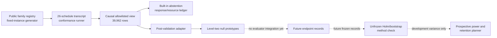

# RSD-T02 workstation execution foundations

<!-- markdownlint-disable MD013 -->

- **Audit date:** 2026-08-27
- **Question:** which parts of the fixed-instance RSD-T02 workstation path are
  now executable, and which scientific and operational boundaries remain open?
- **Scope:** public-development transcript construction, causal policy views,
  response/resource ledgers, level-two generic-null prototypes, a
  post-validation adapter, four-hypothesis analysis, and prospective power and
  retention planning
- **Evidence role:** implementation audit only; no new scientific claim or
  experimental result
- **Related research boundary:** [RSD-T02 population, identifiability,
  calibration, and null maturity](2026-08-27-rsd-t02-population-identifiability-calibration.md)
- **Result authority:** `NO_RESULT`; comparison inference and claim eligibility
  remain false throughout

> **Later same-day execution layer:** the
> [population execution, isolation, and calibration diagnostic](2026-08-27-rsd-t02-population-execution-isolation-calibration.md)
> adds the complete receipt-only public panel, a content-addressed restricted
> child with durable fixed-instance recovery, and exact-analyzer synthetic
> calibration. This document remains the traceable snapshot of the preceding
> one-instance/object-resume foundation; its open-boundary statements should
> be read at that checkpoint.

## Executive finding

Four public-development foundations now execute, but they deliberately stop at
different boundaries.

| Foundation | What now executes | Boundary that remains open |
| --- | --- | --- |
| fixed-instance conformance runner | one generated system instance, one exact parameter vector, 26 schedules, 39,962 transcript rows, one causal view, and a hash-chained response/resource ledger shared across nine registered arm slots | the only successful executor is an in-process built-in digest abstention; there is no content-addressed 26-projection policy bundle, fresh child process, semantic policy replay, or durable disk checkpoint |
| generic-null prototypes | deterministic bounded fitting and inference for a learned three-state latent state-space core and a compact three-state GRU-style core, both on the same three property domains | both are uncalibrated level-two public prototypes; they are not mature nulls, are not runner-integrated, and have no comparison authority |
| paired four-hypothesis analyzer | validation of paired system-instance records, equal fixed-family weighting, deterministic stratified bootstrap-$t$, a data-dependent attainable-$p$ floor, and one experiment-wide Holm step-down family | inputs and analysis release are not frozen; the implementation is an unfrozen public method check, not confirmation analysis |
| prospective power/retention planner | a transparent variance-only normal-approximation count diagnostic, conservative first Holm threshold, and exact binomial retention bound | bootstrap power is uncalibrated; pilot-transcript simulation through the exact analyzer and the remaining design freeze are absent |

The modules compose as follows:



The dotted edges are not implemented experimental authority. They identify
the next required hand-offs.

## Fixed-instance transcript and resource conformance

[`rsd-t02-fixed-instance-runner.mjs`](../../experiments/workstation/fixture-026/rsd-t02-fixed-instance-runner.mjs)
accepts one artifact from the public deterministic family generator and first
revalidates its registry, scientific identity, exact parameter vector,
nuisance vector, property certificate, equation-template digest, and complete
episode-protocol binding. It then constructs all 26 registered schedules at
the instance's single sampled rational time constant. The resulting packet has
39,962 ordered sample rows.

The full transcript receipts bind the instance and family identities, exact
parameters, nuisance and certificate hashes, episode protocol, model-source
hash, schedule, realization, internal output, and final state. The policy view
is a separate projection. Its root contains only schema, contract version,
units, order, and projections. Each projection exposes its ordinal, schedule,
and samples; each sample exposes only:

1. ordinal and time;
2. the two input values and active channel;
3. reported output; and
4. clamp, reset, and freeze flags.

Recursive key checks and serialized-value checks reject evaluator truth,
equation or family identity, structural lineage, system-instance or packet
identity, parameter, nuisance or certificate hashes, registry or model hashes,
and other provenance. This is a software leakage boundary, not evidence that
the future scientific interface is sufficient for identification.

All nine registered arm slots receive the same fixed packet ID and policy-view
digest. Each invocation appends a response and resource record to an ordered
SHA-256 chain. Shared acquisition is charged once; each arm separately records
algorithmic counters, runtime-failure and malformed-response counts, caps, and
its terminal disposition. Wall time and energy remain `null`. Runtime and
malformed failures become explicit charged abstentions and are not retried.

The public runner intentionally rejects custom successful executors. Its only
successful path is the in-process built-in deterministic digest-abstention
policy. This makes successful rows semantically replayable by the validator,
but it does **not** execute any of the real nine policies. The exported failure
test hook can inject only terminal runtime or malformed-response states; it
cannot create a custom success.

Partial runs can resume from a previously validated serialized artifact. The
existing prefix is retained byte-for-byte and the next registered arm is
appended. The module does not write, flush, atomically publish, reopen, or lock
a checkpoint on disk. “Resume” here therefore means deterministic object-level
continuation, not durable crash recovery.

Machine-readable files:

- [`configs/rsd-t02-fixed-instance-runner.json`](../../experiments/workstation/fixture-026/configs/rsd-t02-fixed-instance-runner.json)
- [`rsd-t02-fixed-instance-runner.schema.json`](../../experiments/workstation/fixture-026/rsd-t02-fixed-instance-runner.schema.json)
- [`rsd-t02-fixed-instance-runner.mjs`](../../experiments/workstation/fixture-026/rsd-t02-fixed-instance-runner.mjs)
- [`rsd-t02-fixed-instance-runner.test.mjs`](../../experiments/workstation/fixture-026/rsd-t02-fixed-instance-runner.test.mjs)

The configuration states the boundary in machine-readable form:
`content_addressed_policy_bundle=false`,
`fresh_isolated_child_per_packet=false`,
`custom_success_executor_permitted=false`, and
`design_gate_satisfied=false`. The remaining runner blocker is a
content-addressed 26-projection policy bundle, a fresh isolated child, and
semantic replay of actual policy output.

## Level-two generic-null prototypes

[`rsd-t02-null-prototypes.mjs`](../../experiments/workstation/fixture-026/rsd-t02-null-prototypes.mjs)
adds two architecture-distinct, deterministic learned cores:

| Arm | Prototype core | Frozen fit settings |
| --- | --- | --- |
| `B-STATE-SPACE` | learned causal latent state-space core with hidden dimension 3 | seed `26002001`, 48 finite-difference epochs |
| `B-RECURRENT` | compact causal GRU-style recurrence with hidden dimension 3 | seed `26002002`, 48 finite-difference epochs |

Both consume the same eight causal sample features and emit probabilities for
the same three primary properties:

1. `drive_transform` in `{affine-fold, log-fold}`;
2. `reported_output_feedback_edge` in `{false, true}`; and
3. `channel_local_state` in `{false, true}`.

The training interface is bounded to at most 32 examples, 26 episodes per
transcript, 2,048 samples per episode, 8,192 training rows, 8 MiB per
serialized transcript, 192 parameters, and five million prospective
finite-difference causal-state updates. Model artifacts bind the dataset,
normalization, support envelope, parameter layout, learned parameters, seed,
hyperparameters, tie rules, and algorithmic work ledger. The ledger does not
measure wall time, peak memory, or energy.

Inference produces normalized joint and marginal property probabilities, an
identifiability probability per property, a fit-support check, and a
deterministic action. Exact thresholds, equal actions, insufficient
identifiability, and observations outside the fit envelope abstain. The
probabilities are explicitly uncalibrated. A level-two action is therefore a
prototype response, not a scientific decision.

### Post-validation adapter

[`rsd-t02-null-prototype-adapter.mjs`](../../experiments/workstation/fixture-026/rsd-t02-null-prototype-adapter.mjs)
accepts only a fixed-instance run artifact that the source runner has already
validated. It converts that artifact's causal view into the prototype
transcript schema, copies every causal sample field, drops schedule metadata,
rescans keys and identity values, runs one frozen prototype, and binds the
source run, policy view, model, and converted transcript by digest.

This adapter executes **after** runner validation. It is not installed as a
runner executor, does not run in a fresh child, and does not replace the source
runner's built-in abstention ledger. A validated partial source artifact is
sufficient because the causal view is constructed before arm iteration. The
adapter output remains
`public-development-post-run-adapter-conformance-only`, level two,
uncalibrated, and `NO_RESULT`.

Machine-readable files:

- [`rsd-t02-null-prototypes.mjs`](../../experiments/workstation/fixture-026/rsd-t02-null-prototypes.mjs)
- [`rsd-t02-null-prototypes.test.mjs`](../../experiments/workstation/fixture-026/rsd-t02-null-prototypes.test.mjs)
- [`rsd-t02-null-prototype-adapter.mjs`](../../experiments/workstation/fixture-026/rsd-t02-null-prototype-adapter.mjs)
- [`rsd-t02-null-prototype-adapter.test.mjs`](../../experiments/workstation/fixture-026/rsd-t02-null-prototype-adapter.test.mjs)

The active policies in the older isolated 35-projection construction bundle
remain level-one fixed conformance references. These new models are separate
level-two prototypes. Neither state satisfies the level-five
`confirmation-frozen-mature-null` gate.

## Four-hypothesis public method check

[`rsd-t02-holm4.mjs`](../../experiments/workstation/fixture-026/rsd-t02-holm4.mjs)
registers exactly one four-hypothesis family:

| Endpoint | Candidate | Comparators |
| --- | --- | --- |
| mean property log loss in nats | `C-MECHANISM-BANK` | `B-STATE-SPACE`, `B-RECURRENT` |
| mean dimensionless decision loss | `C-MECHANISM-BANK` | `B-STATE-SPACE`, `B-RECURRENT` |

Input records are keyed by scientific system-instance identity. Each effective
identity must have all three arms, stay in one registered fixed family, be
pre-response valid, and carry finite non-negative endpoints. Runtime failures
remain in the denominator at caller-supplied registered penalties.
Hash-identical replays collapse to one effective instance; conflicting replay
rows fail closed. Every registered family must contribute at least two
effective system instances.

For each hypothesis, the analyzer forms the paired candidate-minus-comparator
difference, computes an equal-weighted mean over registered fixed families,
and obtains a one-sided $p$ value from a centered SHA-256-indexed stratified
bootstrap-$t$. Resampling occurs within family. The plus-one correction is
used. If $I_h$ of the $B$ bootstrap resamples for hypothesis $h$ have zero or
non-finite standard error, those resamples count as extreme and expose the
attainable floor

$$
p_{\min,h}=\frac{I_h+1}{B+1}.
$$

The report's resolution gate passes only when $p_{\min,h}\le\alpha/4$ for
every hypothesis. An observed statistic with zero standard error returns
$p=1$ and fails the gate. The final four values enter one sequentially
rejective Holm family. Ties are resolved by hypothesis ID and rejection never
restarts after the first failure.

This code exercises method mechanics only. Family IDs, familywise alpha,
resample count, resampling key, and failure penalties arrive from the caller;
the report labels them as unregistered public-method-check inputs.
`family_superpopulation_inference_permitted`, comparison authority,
`design_gate_satisfied`, and claim eligibility all remain false.

Machine-readable files:

- [`rsd-t02-holm4.mjs`](../../experiments/workstation/fixture-026/rsd-t02-holm4.mjs)
- [`rsd-t02-holm4.test.mjs`](../../experiments/workstation/fixture-026/rsd-t02-holm4.test.mjs)

## Prospective power and retention planning

[`rsd-t02-power-plan.mjs`](../../experiments/workstation/fixture-026/rsd-t02-power-plan.mjs)
turns a public development-evaluation variance input into a transparent
prospective count. For $F$ fixed families, variance $s_f^2$, minimum relevant
improvement $\delta$, familywise level $\alpha$, and target power $1-\beta$,
the retained count per family is approximated by

$$
n_{\mathrm{eff}}
=
\max\!\left\{
2,
\left\lceil
\frac{\sum_{f=1}^{F}s_f^2}{F^2}
\left(
\frac{z_{1-\alpha/4}+z_{1-\beta}}{\delta}
\right)^2
\right\rceil
\right\}.
$$

The first Holm threshold $\alpha/4$ is used conservatively for each of the
four hypotheses. Pre-response attrition is handled separately. The planned
count is the smallest integer $m$ satisfying

$$
\Pr\!\left[
\operatorname{Binomial}(m,1-r)<n_{\mathrm{eff}}
\right]
\le
\frac{1-a}{F},
$$

where $r$ is registered pre-response attrition and $a$ is experiment-level
retention assurance. The exact binomial lower tail, rather than an expected
retained count, is used. Runtime failures are not attrition: they stay in the
analysis denominator at registered penalties. Support coverage remains a
separate mandatory gate and is not multiplied into the sample size.


The plot uses three illustrative dimensionless variance profiles, 90% target
power, 10% pre-response attrition, and 95% retention assurance to show the
inverse-square cost of smaller target effects. None of those illustrative
values is a pilot estimate, biological constant, or frozen experimental
choice. The dashed cyan curve is the baseline-variance diagnostic with no
pre-response attrition.

The planner rejects row-level pseudo-replication, private-response
recalculation, post-response dropout, malformed or mismatched units, incomplete
hypothesis families, invalid family variances, and a nominal Monte Carlo
plus-one floor $1/(B+1)$ that already exceeds $\alpha/4$. That last check cannot
detect the exact analyzer's higher, data-dependent floor caused by zero-
standard-error resamples. The planner therefore returns
`prospective_power_plan_passes=false` and `plan_freeze_permitted=false` because:

1. a hash-shaped pilot-variance identifier does not verify the artifact bytes,
   data role, or review;
2. the analysis-source hash is caller supplied rather than bound to a frozen
   release; and
3. effect margins, target power, resampling key, bootstrap count, and failure
   penalties have not been frozen together; and
4. a variance-only normal approximation does not calibrate the exact
   bootstrap's data-dependent degeneracy and must be followed by
   pilot-transcript simulation through the exact analyzer.

The value stored for each hypothesis is consequently named
`normal_approximation_power_diagnostic`; `bootstrap_power_calibrated` remains
false. The planner does not reject a data-dependent resolution failure because
variance-only input cannot reveal one. It blocks plan freezing pending the
required simulation.

Machine-readable and editable graphic sources:

- [`rsd-t02-power-plan.mjs`](../../experiments/workstation/fixture-026/rsd-t02-power-plan.mjs)
- [`rsd-t02-power-plan.test.mjs`](../../experiments/workstation/fixture-026/rsd-t02-power-plan.test.mjs)
- [`core-models.json`](../../assets/plots/core-models.json)
- [`generate-plots.mjs`](../../scripts/generate-plots.mjs)
- [`rsd-t02-power-effect-curve.svg`](../../public/plots/rsd-t02-power-effect-curve.svg)

## What the focused tests establish

| Suite | Executable checks | What the checks do not establish |
| --- | --- | --- |
| fixed-instance runner, 10 tests | config/schema/hash closure; all 26 schedules and 39,962 rows at one parameter vector; causal-view leakage checks; same packet across arms; chained ledgers; object-level resume equivalence; tamper and reorder refusal; terminal failure accounting; malformed-input closure; bounded single-thread CPU execution | actual policy semantics, fresh-process isolation, a content-addressed policy bundle, durable crash recovery, measured resources, comparison validity, or scientific correctness of the family models |
| null prototypes, 8 tests | level-two/maturation-contract alignment; deterministic fit and replay; objective decrease; normalized coherent probabilities; recursive causal allowlist; bounded work and artifact integrity; support and threshold abstention | held-out generalization, probability calibration, robustness across families or lineages, mature-null status, comparative performance, or scientific identification |
| null adapter, 6 tests | exact causal-field conversion of 39,962 rows; schedule and identity removal; exact source/model/transcript bindings; deterministic replay; rejection of tampered sources; explicit post-validation limitation | isolated runner integration, atomic persistence, actual arm-ledger replacement, calibration, maturity, or comparison authority |
| Holm/bootstrap analyzer, 9 tests | complete four-hypothesis Holm mechanics; deterministic tie order; paired system-instance and equal-family calculations; duplicate collapse; hostile input refusal; deterministic stratified bootstrap; in-denominator failure penalties; and a two-family-by-two-instance hostile panel whose zero-standard-error resamples make the first Holm threshold unattainable | validity of future endpoint estimators, independence in a collected population, a frozen analysis release, family-superpopulation inference, powered error control under the final data-generating process, or confirmation evidence |
| power/retention planner, 7 tests | exposed assumptions and units; deterministic counts; approximate inverse-square scaling; separate attrition and coverage handling; maximum-count refusal; pseudo-replication and private-adaptation refusal; normal-quantile checks; exact binomial retention bound; and explicit uncalibrated-bootstrap status | correctness of unfrozen pilot variances or effect margins, bootstrap power, adequacy of the normal diagnostic for final analysis, a feasible compute budget, a frozen population size, or achieved power |

The tiny prototype learning fixture contains eight constructed combinations of
three binary labels and six rows per transcript. The test requires at least
two-thirds training-label recovery and a lower objective on those same
constructed examples. It demonstrates a nontrivial executable learning path;
it is not a train/test split and cannot be cited as generalization or model
quality.

## Commands

From the repository root:

```powershell
npm run test:workstation:fixture-026:foundations
node experiments/workstation/fixture-026/rsd-t02-fixed-instance-runner.test.mjs
node experiments/workstation/fixture-026/rsd-t02-null-prototypes.test.mjs
node experiments/workstation/fixture-026/rsd-t02-null-prototype-adapter.test.mjs
node experiments/workstation/fixture-026/rsd-t02-holm4.test.mjs
node experiments/workstation/fixture-026/rsd-t02-power-plan.test.mjs
```

## Open blockers

The following boundaries must close before RSD-T02 has comparison authority:

1. add independent structural lineages for the thin `log-fold`,
   feedback-present, and channel-local-present values and a valid
   memory-negative lineage;
2. create lineage-disjoint sealed outer-confirmation and outer-transfer family
   templates, role assignment, commitments, custody, and release procedures;
3. build and freeze a content-addressed 26-projection policy bundle, execute
   each packet in a fresh restricted child, and semantically replay the actual
   policy that produced each successful response;
4. add an ownership-safe append-only on-disk run directory with atomic
   publication, durable checkpoint recovery, and hostile restart tests for the
   fixed-instance path;
5. separate fit, calibration, public evaluation, and private confirmation
   instances; fit and calibrate both generic nulls on prospectively assigned
   data; and satisfy every level-five null-maturity gate;
6. freeze the endpoint/loss implementation, analyzer release hash, registered
   family panel, resampling key, bootstrap count, runtime-failure penalties,
   support gates, and one-pass information cut before private responses exist;
7. produce and review the exact public development-evaluation variance
   artifact, freeze minimum relevant effects and target power, derive a feasible
   retained and planned count, simulate pilot transcripts through the exact
   bootstrap/Holm analyzer, and bind the final power plan to the population
   design and analysis release;
8. implement evaluator-side conversion from isolated arm outputs to complete
   paired per-instance endpoints without exposing truth to policies;
9. execute the powered one-pass private confirmation and the registered Holm
   analysis under custody; and
10. separately calibrate workstation time, memory, and energy measurement if an
    energy claim is later requested.

Until all applicable blockers are closed and independently reviewed, every
artifact described here remains `NO_RESULT`, comparison inference remains
forbidden, and no claim can be promoted.
