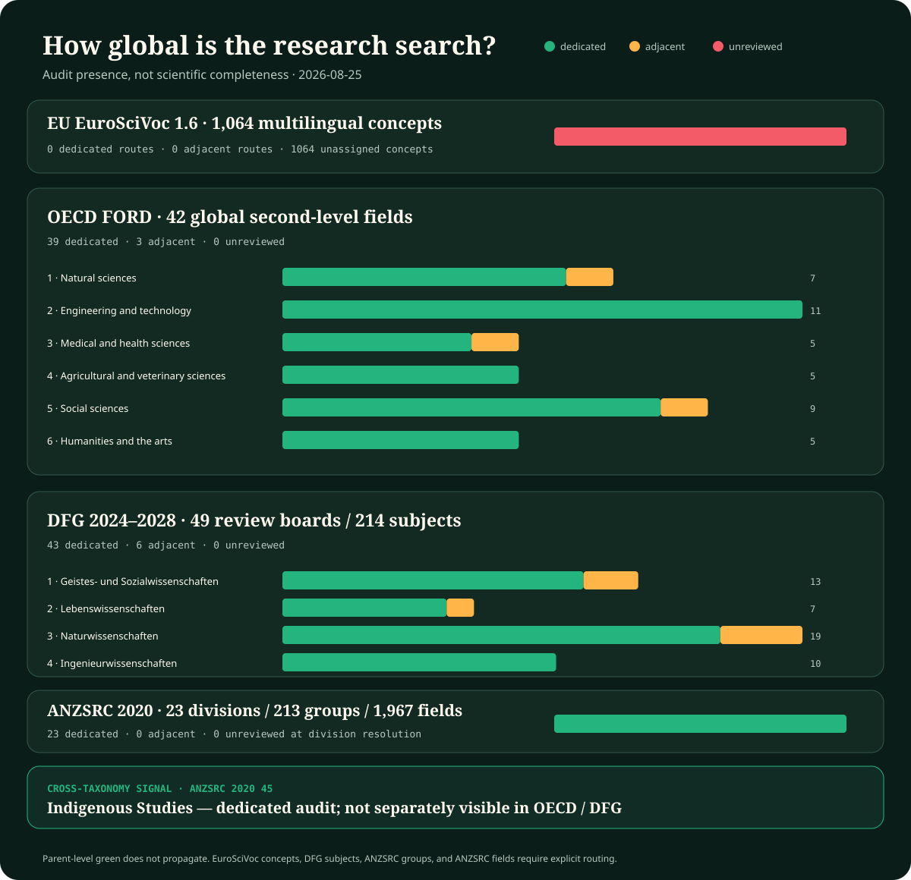

# Global field coverage

**Census date:** 2026-08-24

This is the repository's breadth control, not a claim that any discipline has been exhausted. It answers a narrower and mechanically checkable question: **does a durable field-centered audit exist, is the field present only through neighboring work, or has it not been reviewed at all?**

Editable data: [`field-coverage.json`](field-coverage.json). The plot and this page are generated by [`generate-field-coverage.mjs`](../scripts/generate-field-coverage.mjs).

## Result

The OECD baseline contains **42 second-level fields**. The repository has a dedicated audit for **37 (88.1%)**, adjacent evidence without a field-centered audit for **5 (11.9%)**, and no durable review for **0 (0.0%)**.

The finer DFG probe contains **49 review boards and 214 subjects**. At review-board resolution, the repository has 42 dedicated, 7 adjacent, and 0 unreviewed areas. That higher apparent coverage is not greater depth: one audit can touch a large review board while leaving most of its constituent subjects untouched.

The independent ANZSRC census contains **23 divisions, 213 groups, and 1,967 fields**. At the deliberately coarse division level, 23 have a dedicated entry audit, 0 have adjacent evidence only, and 0 are wholly unreviewed. This is a disagreement detector, not evidence that the 213 groups or 1,967 fields have been audited.

No OECD second-level cell is wholly unreviewed at entry-audit resolution. That is an entry-census result, not near-complete science coverage: a dedicated label means one field-centered audit exists, while catch-all categories and most constituent subfields remain open. Large depth gaps remain in political science, public administration, stratification and broader communication studies; clinical medicine and medical biotechnology; agricultural biotechnology; analytical and food chemistry; inorganic and total-synthesis chemistry; water and ocean research; nanotechnology; production engineering; finance and management; comparative theology; and many named subfields inside every broad cell.

## What the states mean

- **dedicated audit:** At least one durable audit is centered on evidence from this field. This does not mean the field is complete.
- **adjacent evidence only:** The field contributes evidence to another audit, but has no field-centered audit of its own.
- **unreviewed:** No durable field-centered evidence audit is present. Mentions and source leads do not count.

A dedicated audit is an entry ticket, not completion. Audit depth, evidence quality, principle deduplication, and executable-test readiness are separate axes.

## Taxonomy contract

- The global backbone is [OECD Fields of Research and Development (FORD)](https://doi.org/10.1787/9789264239012-en), Frascati Manual 2015, Table 2.2. OECD notes that the classification evolves and does not map perfectly to education or department structures.
- The granularity check is the [DFG subject classification](https://www.dfg.de/resource/blob/331944/33422f091e941592cdc355038a865e03/fachsystematik-2024-2028-de-data.pdf) for 2024-2028: 49 review boards, 214 subjects, and 4 research areas.
- The independent census and disagreement check is [Australian and New Zealand Standard Research Classification (ANZSRC)](https://www.abs.gov.au/statistics/classifications/australian-and-new-zealand-standard-research-classification-anzsrc/latest-release), 2020, official FoR workbook corrected 2025-10-24: 23 divisions, 213 groups, and 1,967 fields. All divisions are recorded; group- and field-level depth remains open. It is not a normative source for this EU/German project.
- The ERC whole-science panel structure is a routing sanity check only. The ERC explicitly says its panels are not a complete scientific classification and do not express research priorities.
- Catch-all categories remain open. Their presence cannot prove that unnamed or emerging disciplines have been sampled.

## OECD FORD field-by-field record

### 1. Natural sciences

**6 dedicated · 1 adjacent · 0 unreviewed**

- **1.1 Mathematics — dedicated audit.**
  - Current route: [mathematical practice proof discovery](audits/2026-08-05-mathematical-practice-proof-discovery.md).
  - Missing depth: Mathematical practice and formal discovery are audited; most mathematical subfields remain unsampled.
  - Next discriminating question: Which structures from topology, category theory, geometry, and constructive mathematics change representation or verification rather than merely renaming it?
- **1.2 Computer and information sciences — dedicated audit.**
  - Current route: [databases storage](audits/2026-08-05-databases-storage.md), [programming languages verification](audits/2026-08-05-programming-languages-verification.md), [security cryptography](audits/2026-08-05-security-cryptography.md), [computing compilers networking visualization](audits/2026-08-24-computing-compilers-networking-visualization.md).
  - Missing depth: Storage, programming languages and verification, security, HCI, and bounded direct depth in compiler semantics/testing, profile-guided and runtime specialization, randomized performance inference, endpoint placement, IP measurement/congestion/tails, graphical perception, and vector software-quality/lifecycle constraints are represented; operating systems, distributed consistency and failure recovery, programming-language breadth, empirical software engineering, accessible human visualization studies, and many applied information systems remain incomplete.
  - Next discriminating question: Which compiler, runtime, distributed-system, network, display, and software-lifecycle conclusions survive explicit semantic preconditions, workload and layout shift, observation/intervention boundaries, dependence and added-load accounting, accessible human testing, and versioned quality/security obligations at equal total cost?
- **1.3 Physical sciences — dedicated audit.**
  - Current route: [information thermodynamics physical computation](audits/2026-08-05-information-thermodynamics-physical-computation.md), [optics photonics inverse sensing](audits/2026-08-05-optics-photonics-inverse-sensing.md), [soft active matter](audits/2026-08-05-soft-active-matter.md), [particle nuclear high energy experimentation](audits/2026-08-21-particle-nuclear-high-energy-experimentation.md), [atomic molecular plasma condensed matter](audits/2026-08-24-atomic-molecular-plasma-condensed-matter.md).
  - Missing depth: Statistical physics, optics, acoustics, soft matter, particle/nuclear experimental methodology, and bounded direct depth in atomic/molecular precision spectroscopy, ultracold observable-family measurement, condensed-matter phase/disorder/topology/transport inference, plasma diagnostics and reconstruction-qualified control, and accelerator beam instrumentation are represented. Quantum information, nuclear structure/reactions, theoretical-field breadth, materials synthesis, and much AMO, plasma-facility, and accelerator-physics breadth remain partial.
  - Next discriminating question: Which results survive explicit selection, detector response, nuisance, search-family, simulation, preservation, symmetry, and regime-breakdown tests?
- **1.4 Chemical sciences — dedicated audit.**
  - Current route: [chemistry reaction networks proofreading](audits/2026-08-05-chemistry-reaction-networks-proofreading.md), [molecular chemistry synthesis systems](audits/2026-08-21-molecular-chemistry-synthesis-systems.md), [polymer research adaptive materials](audits/2026-08-21-polymer-research-adaptive-materials.md), [measurement heavy analytical water earth observation](audits/2026-08-24-measurement-heavy-analytical-water-earth-observation.md).
  - Missing depth: Reaction networks, molecular synthesis/control, polymers, and a direct analytical-chemistry audit of measurand/speciation, sample preparation, matrix effects, calibration, detection/quantification, conformity, and interlaboratory evidence are represented; surface, electrochemical, and theoretical chemistry plus inorganic, organometallic, total-synthesis, separation/spectroscopy, and scale-up breadth remain uneven.
  - Next discriminating question: Which chemical results survive explicit measurand/species, sampling, preparation, matrix, calibration, detection/quantification, apparatus, pathway, operator, uncertainty, and lifecycle qualification?
- **1.5 Earth and related environmental sciences — dedicated audit.**
  - Current route: [earth system transition signals](audits/2026-08-05-earth-system-transition-signals.md), [geology geomorphology](audits/2026-08-05-geology-geomorphology.md), [astronomy remote inference](audits/2026-08-05-astronomy-remote-inference.md), [mineralogy petrology geochemistry](audits/2026-08-21-mineralogy-petrology-geochemistry.md), [measurement heavy analytical water earth observation](audits/2026-08-24-measurement-heavy-analytical-water-earth-observation.md).
  - Missing depth: Geology, geomorphology, mineralogy/petrology/geochemistry, transition signals, remote inference, and direct measurement/operator depth for hydrology, groundwater, limnology, ocean/atmospheric analyses, geophysics, geodesy, and Earth observation are represented; process and dynamics breadth in meteorology, oceanography, climate, solid-Earth geophysics, hydrogeology, ecology, and experimental mineral physics remains uneven.
  - Next discriminating question: Which field-state inferences survive perturbing sampling support, transport, forward operator, reference frame and epoch, inverse resolution, assimilation prior, algorithm version, uncertainty, and independent checks?
- **1.6 Biological sciences — dedicated audit.**
  - Current route: [cellular quality control](audits/2026-08-05-cellular-quality-control.md), [collective ecological resilience](audits/2026-08-05-collective-ecological-resilience.md), [developmental morphogenesis](audits/2026-08-05-developmental-morphogenesis.md), [microbial ecology biofilms](audits/2026-08-05-microbial-ecology-biofilms.md), [plant distributed control](audits/2026-08-05-plant-distributed-control.md).
  - Missing depth: This is the most heavily sampled broad field, but genomics, marine biology, anatomy, physiology, parasitology, and many taxa remain incomplete.
  - Next discriminating question: Which mechanisms survive normalization across unrelated lineages and which are artifacts of shared ancestry or laboratory choice?
- **1.7 Other natural sciences — adjacent evidence only.**
  - Current route: [soft active matter](audits/2026-08-05-soft-active-matter.md).
  - Missing depth: Hybrid natural-science material exists, but the residual category has never been explicitly searched for fields omitted by the named FORD classes.
  - Next discriminating question: Which emerging or hybrid natural sciences fall outside the named classes and expose a missing problem family?

### 2. Engineering and technology

**10 dedicated · 1 adjacent · 0 unreviewed**

- **2.1 Civil engineering — dedicated audit.**
  - Current route: [mechanical civil resilience](audits/2026-08-05-mechanical-civil-resilience.md), [built environment urban systems](audits/2026-08-05-built-environment-urban-systems.md).
  - Missing depth: Resilience and occupied systems are represented; construction production, geotechnics, water engineering, and long-life asset governance remain partial.
  - Next discriminating question: Which inspection, reserve, staged repair, and graceful-service mechanisms transfer to long-lived adaptive systems?
- **2.2 Electrical engineering, electronic engineering, information engineering — dedicated audit.**
  - Current route: [power grids protection and recovery](audits/2026-08-05-power-grids-protection-and-recovery.md), [semiconductor device reliability](audits/2026-08-05-semiconductor-device-reliability.md), [production maintenance nanomanufacturing communications material qualification](audits/2026-08-24-production-maintenance-nanomanufacturing-communications-material-qualification.md), [computing compilers networking visualization](audits/2026-08-24-computing-compilers-networking-visualization.md).
  - Missing depth: Power, device reliability, adaptive link control, interacting network-loop operations, and bounded end-to-end IP metric, probe, congestion-control, AQM, fairness, and accepted-service boundaries are represented; RF/antenna and optical hardware, channel measurement and coding breadth, signal processing, sensors, electromagnetic compatibility, control hardware, and communications-system deployment remain uneven.
  - Next discriminating question: Which protection, coding, congestion, queue, state-age, and loop-coordination mechanisms preserve accepted service and fairness under path asymmetry, active-probe load, competing controllers, feedback loss, and equal sensing, communication, compute, and energy budgets?
- **2.3 Mechanical engineering — dedicated audit.**
  - Current route: [mechanical civil resilience](audits/2026-08-05-mechanical-civil-resilience.md), [biomechanics motor control](audits/2026-08-05-biomechanics-motor-control.md), [production maintenance nanomanufacturing communications material qualification](audits/2026-08-24-production-maintenance-nanomanufacturing-communications-material-qualification.md).
  - Missing depth: Mechanics and resilience plus bounded production-process, RCM, maintainability, support and restoration evidence are represented; tribology, machine design, thermal machines, factory systems and process-specific manufacturing remain shallow.
  - Next discriminating question: When can geometry, compliance, hysteresis, passive dynamics, maintainability, or mode-specific maintenance replace sensing, active control, and universal service schedules?
- **2.4 Chemical engineering — dedicated audit.**
  - Current route: [process engineering](audits/2026-08-05-process-engineering.md).
  - Missing depth: Plantwide control and balances are represented; scale-up, separations, catalysis, fouling, and batch operation remain partial.
  - Next discriminating question: Which conservation-qualified decomposition and fault isolation methods constrain learned process modules?
- **2.5 Materials engineering — dedicated audit.**
  - Current route: [adaptive materials and self assembly](audits/2026-08-05-adaptive-materials-and-self-assembly.md), [semiconductor device reliability](audits/2026-08-05-semiconductor-device-reliability.md), [polymer research adaptive materials](audits/2026-08-21-polymer-research-adaptive-materials.md), [production maintenance nanomanufacturing communications material qualification](audits/2026-08-24-production-maintenance-nanomanufacturing-communications-material-qualification.md).
  - Missing depth: Adaptive materials, polymer distributions/topology/rheology/healing, device degradation, and bounded material qualification/lineage are represented; metallurgy, ceramics, composites, joining, coatings, and most production physics remain shallow.
  - Next discriminating question: Which functions can be compiled into material response without losing distribution support, inspectability, repairability, remaining-life knowledge, or lifecycle advantage?
- **2.6 Medical engineering — dedicated audit.**
  - Current route: [biomechanics motor control](audits/2026-08-05-biomechanics-motor-control.md), [clinical specialties medical agricultural biotechnology](audits/2026-08-24-clinical-specialties-medical-agricultural-biotechnology.md), [medical devices biomedical engineering](audits/2026-08-24-medical-devices-biomedical-engineering.md).
  - Missing depth: Biomechanical control and clinical imaging are joined by a direct medical-engineering audit of diagnostic and therapeutic device chains, biomedical signal and image operators, prosthetic and assistive control, critical-task usability, calibration and drift, alarms, semantic interoperability, safety-coupled cybersecurity, clinical performance, and exposure-qualified post-market surveillance. Biomaterials, biofabrication and tissue engineering, implant longevity and biocompatibility, electrical safety and electromagnetic compatibility, sterilization, radiation-system physics, manufacturing and service qualification, and long-horizon home adoption remain incomplete.
  - Next discriminating question: Which diagnostic, therapeutic, imaging, prosthetic, and networked-device conclusions survive end-to-end sensor--processor--user--actuator--pathway tests under body/interface and site shift, calibration drift, alarm queues, semantic and version faults, cyberattack, recovery, exposure-qualified surveillance, and equal resource budgets?
- **2.7 Environmental engineering — adjacent evidence only.**
  - Current route: [earth system transition signals](audits/2026-08-05-earth-system-transition-signals.md), [process engineering](audits/2026-08-05-process-engineering.md), [measurement heavy analytical water earth observation](audits/2026-08-24-measurement-heavy-analytical-water-earth-observation.md).
  - Missing depth: Environmental phenomena, process engineering, and bounded measurement depth for water-treatment performance, loads, groundwater/lake sampling, and environmental monitoring are present; treatment-process design, wastewater, waste/remediation systems, hydraulics, and engineering control still lack a field-centered audit.
  - Next discriminating question: Which distributed treatment and monitoring strategies preserve sample-to-field support, mass balance, uncertainty, and delayed feedback while allocating intervention?
- **2.8 Environmental biotechnology — dedicated audit.**
  - Current route: [biotechnology chemistry process systems](audits/2026-08-21-biotechnology-chemistry-process-systems.md).
  - Missing depth: Engineered groundwater remediation, intervention, transport, product/mass endpoints, rebound, and open-system evolutionary failure are audited; wastewater, gaseous emissions, mining, marine systems, containment, and environmental-release breadth remain unsampled.
  - Next discriminating question: Which intervention effects survive alternative transport paths, daughter products, oxygen ingress, invasion, succession, off-site export, monitoring designs, and post-treatment rebound?
- **2.9 Industrial biotechnology — dedicated audit.**
  - Current route: [biotechnology chemistry process systems](audits/2026-08-21-biotechnology-chemistry-process-systems.md).
  - Missing depth: Strain burden/escape, fermentation, continuous culture, cybergenetic control, scale-up, separation, and lifecycle boundaries are audited; cell therapy, food fermentation, enzyme manufacture, product validation, contamination control, and manufacturing authorization remain unsampled.
  - Next discriminating question: Which production-control results survive lineage drift, escape mutation, scale gradients, sensor distortion, transport limits, fouling, off-spec propagation, cleaning, and full seed-to-retirement cost?
- **2.10 Nano-technology — dedicated audit.**
  - Current route: [adaptive materials and self assembly](audits/2026-08-05-adaptive-materials-and-self-assembly.md), [soft active matter](audits/2026-08-05-soft-active-matter.md), [production maintenance nanomanufacturing communications material qualification](audits/2026-08-24-production-maintenance-nanomanufacturing-communications-material-qualification.md).
  - Missing depth: Nanoscale assembly mechanisms plus a bounded direct audit of population distributions, measurement operators, process history, and rare manufacturing defects are represented; nanodevice transport and sensing, toxicology, safety, fabrication breadth, and scale-up remain incomplete.
  - Next discriminating question: Which nanoscale assembly, sensing, transport, inspection, and defect-control mechanisms retain calibrated population evidence and lifecycle advantage after fabrication costs are included?
- **2.11 Other engineering and technologies — dedicated audit.**
  - Current route: [aerospace maritime autonomy](audits/2026-08-05-aerospace-maritime-autonomy.md).
  - Missing depth: Safety-critical autonomy is represented; the residual engineering class is open-ended and cannot be considered exhausted.
  - Next discriminating question: Which engineering professions use mature operating constraints absent from the current null-model library?

### 3. Medical and health sciences

**4 dedicated · 1 adjacent · 0 unreviewed**

- **3.1 Basic medicine — dedicated audit.**
  - Current route: [immune tolerance trained immunity](audits/2026-08-05-immune-tolerance-trained-immunity.md), [neurodevelopment global control](audits/2026-08-05-neurodevelopment-global-control.md), [endocrine circadian control](audits/2026-08-05-endocrine-circadian-control.md).
  - Missing depth: Several regulatory systems are represented; anatomy, general physiology, genetics, metabolism, and disease mechanisms remain uneven.
  - Next discriminating question: Which multi-organ control and maintenance mechanisms expose cross-module dependencies missing from neural analogies?
- **3.2 Clinical medicine — dedicated audit.**
  - Current route: [pathology rehabilitation](audits/2026-08-05-pathology-rehabilitation.md), [pharmacology toxicology](audits/2026-08-05-pharmacology-toxicology.md), [clinical intervention pathways](audits/2026-08-24-clinical-intervention-pathways.md), [clinical specialties medical agricultural biotechnology](audits/2026-08-24-clinical-specialties-medical-agricultural-biotechnology.md).
  - Missing depth: Pathology, rehabilitation, pharmacology, multimorbidity, intervention pathways, perioperative rescue, medical-imaging operators, paediatric extrapolation, psychiatric score configuration, obstetric competing events, and dental lesion activity now have bounded direct entries; cardiology, oncology, neurology, dermatology, ophthalmology, emergency/critical care, many surgical specialties, and broader longitudinal disease management remain unsampled.
  - Next discriminating question: Which specialty decisions survive acquisition and score shifts, developmental support limits, competing events, treatment execution, rescue capacity, delayed follow-up, and externally validated uncertainty?
- **3.3 Health sciences — dedicated audit.**
  - Current route: [epidemiology and surveillance control](audits/2026-08-05-epidemiology-and-surveillance-control.md), [nursing care health services](audits/2026-08-21-nursing-care-health-services.md).
  - Missing depth: Surveillance plus a first nursing, care-continuity, and health-services audit are represented; occupational health, nutrition, implementation science, long-term care, community care, and most clinical service designs remain unsampled.
  - Next discriminating question: Which mechanisms preserve necessary service and legitimate person-level authority across community, long-term, acute, and digital care without hiding unfinished work or unpaid human burden?
- **3.4 Medical biotechnology — dedicated audit.**
  - Current route: [cellular quality control](audits/2026-08-05-cellular-quality-control.md), [clinical specialties medical agricultural biotechnology](audits/2026-08-24-clinical-specialties-medical-agricultural-biotechnology.md).
  - Missing depth: Gene/cell-therapy identity, potency, manufacturing/comparability, genome-edit assay support, structural and off-target outcomes, authorization, and long-term follow-up now have a bounded direct audit; tissue engineering, regenerative devices, molecular diagnostics, vaccines, delivery platforms, biobanking, and production-scale breadth remain incomplete.
  - Next discriminating question: Which engineered-cell, gene, and molecular-product controls remain potent, comparable, containable, measurable, and support-qualified after process, site, assay, delivery, recipient, and follow-up shifts?
- **3.5 Other medical science — adjacent evidence only.**
  - Current route: [sports expertise team coordination](audits/2026-08-05-sports-expertise-team-coordination.md).
  - Missing depth: Exercise and performance science provide adjacent material, but the residual medical category has not been searched systematically.
  - Next discriminating question: Which clinical or care disciplines fall outside the named classes and contribute distinct coordination or evidence mechanisms?

### 4. Agricultural and veterinary sciences

**5 dedicated · 0 adjacent · 0 unreviewed**

- **4.1 Agriculture, forestry, and fisheries — dedicated audit.**
  - Current route: [plant distributed control](audits/2026-08-05-plant-distributed-control.md), [soil crop multiresource colimitation](audits/2026-08-21-soil-crop-multiresource-colimitation.md), [forestry fisheries aquatic food systems](audits/2026-08-21-forestry-fisheries-aquatic-food-systems.md).
  - Missing depth: Soil/crop co-limitation, forestry, capture fisheries, aquaculture, and aquatic resource management have direct audits; silvicultural breadth, inland fisheries, pest management, livestock integration, farm economics, and many production systems remain unsampled.
  - Next discriminating question: Which policies remain effective across alternative population, spatial, climate, observation, implementation, rights, and market models without exporting harm or changing the denominator?
- **4.2 Animal and dairy science — dedicated audit.**
  - Current route: [animal veterinary population health](audits/2026-08-21-animal-veterinary-population-health.md).
  - Missing depth: Resource partitioning, cattle feed restriction, welfare measurement, breeding diversity, rumen consortia, and population-event accounting are audited; species breadth, husbandry systems, reproduction, farm economics, and fisheries remain unsampled.
  - Next discriminating question: Which findings survive across species, production systems, lifetimes, protected welfare components, reproductive constraints, and start-cohort denominators?
- **4.3 Veterinary science — dedicated audit.**
  - Current route: [animal veterinary population health](audits/2026-08-21-animal-veterinary-population-health.md).
  - Missing depth: Risk-based and One-Health surveillance, infection interference, evolving opponents, welfare, and dynamical identifiability are audited; comparative clinical care, surgery, companion and wildlife medicine, pharmacovigilance, and antimicrobial stewardship remain unsampled.
  - Next discriminating question: How do diagnosis, treatment, movement, surveillance, welfare, transmission, and resistance interact across species and changing target populations?
- **4.4 Agricultural biotechnology — dedicated audit.**
  - Current route: [animal veterinary population health](audits/2026-08-21-animal-veterinary-population-health.md), [clinical specialties medical agricultural biotechnology](audits/2026-08-24-clinical-specialties-medical-agricultural-biotechnology.md).
  - Missing depth: Genomic selection, microbial intervention, vaccination, and evolutionary response plus direct gene-edit/biological-control evidence on field heterogeneity, non-targets, dispersal, resistance, and EU/German authorization are represented; reproductive and animal biotechnology, diagnostics, trait development, biofertilizer/biopesticide breadth, containment, and multi-season product platforms remain incomplete.
  - Next discriminating question: Which agricultural-biotechnology effects remain after assay support, lineage concentration, off-target change, non-target exposure, dispersal, evolutionary escape, containment, multi-season field transport, and authorization are tested prospectively?
- **4.5 Other agricultural sciences — dedicated audit.**
  - Current route: [forestry fisheries aquatic food systems](audits/2026-08-21-forestry-fisheries-aquatic-food-systems.md).
  - Missing depth: Aquatic food systems and cross-resource governance provide a direct residual-field audit; rural studies, extension science, food logistics, agricultural education, and other residual specialties remain open.
  - Next discriminating question: Which residual agricultural disciplines change observation, authority, adoption, service, distribution, and long-horizon resilience beyond production output?

### 5. Social sciences

**7 dedicated · 2 adjacent · 0 unreviewed**

- **5.1 Psychology and cognitive sciences — dedicated audit.**
  - Current route: [comparative cognition tool use](audits/2026-08-05-comparative-cognition-tool-use.md), [endogenous generation creativity](audits/2026-08-05-endogenous-generation-creativity.md), [learning science skill acquisition](audits/2026-08-05-learning-science-skill-acquisition.md).
  - Missing depth: Cognition, learning, and generation are represented; social, organizational, clinical, developmental, and differential psychology remain uneven.
  - Next discriminating question: Which cognitive effects survive representative tasks, prospective testing, and selection-bias controls?
- **5.2 Economics and business — dedicated audit.**
  - Current route: [economics market design incentives](audits/2026-08-05-economics-market-design-incentives.md), [supply chain operations research](audits/2026-08-05-supply-chain-operations-research.md), [accounting audit actuarial insurance](audits/2026-08-21-accounting-audit-actuarial-insurance.md), [economy education institutions](audits/2026-08-24-economy-education-institutions.md).
  - Missing depth: Markets, operations, accounting/audit/actuarial boundaries, tax incidence and public accounts, organizational bundles and persistence, labour flows and tasks, development exposure, and dynamic fiscal identification are represented; banking and finance, marketing, strategy/entrepreneurship, industrial organization, trade, monetary, environmental and health economics, and economic history remain shallow.
  - Next discriminating question: Which economic and organizational findings survive alternative incidence, accounting, labour-flow, implementation, anticipation, regime, horizon, support, distribution, and independently challengeable evidence assumptions?
- **5.3 Education — dedicated audit.**
  - Current route: [learning science skill acquisition](audits/2026-08-05-learning-science-skill-acquisition.md), [economy education institutions](audits/2026-08-24-economy-education-institutions.md).
  - Missing depth: Learning and skill acquisition plus education-system layers, curriculum, assessment interpretation/comparability/use, inclusion, vocational education, qualifications, and comparative transport are represented; early-childhood, higher, adult and teacher education, subject didactics, educational technology, language education, school leadership/finance, and most special-education practice remain incomplete.
  - Next discriminating question: Which learner and system interventions survive curriculum-layer, opportunity, access, assessment-use, delayed-transfer, institutional-support, qualification, and source-to-target comparability tests?
- **5.4 Sociology — dedicated audit.**
  - Current route: [direct social research ethnography media](audits/2026-08-21-direct-social-research-ethnography-media.md), [cultural evolution archaeology](audits/2026-08-05-cultural-evolution-archaeology.md), [high reliability organizations incident learning](audits/2026-08-05-high-reliability-organizations-incident-learning.md), [social science depth institutions inequality digital media](audits/2026-08-24-social-science-depth-institutions-inequality-digital-media.md).
  - Missing depth: Direct social-research methods plus bounded stratification, household allocation, paid/unpaid work, migration measurement, collective-action, criminology, and digital-field entries are represented; education, urban/rural and health sociology, science and technology studies, social work, historical sociology, population breadth, and most substantive theory remain incomplete.
  - Next discriminating question: Which substantive sociological results survive explicit construct, inequality operator, household allocation, migration denominator, participation cost, crime-observation, platform, positionality, and shared-error-root tests?
- **5.5 Law — dedicated audit.**
  - Current route: [legal evidence procedure](audits/2026-08-05-legal-evidence-procedure.md).
  - Missing depth: Evidence and procedure are represented; substantive EU/German fields, remedies, administration, competition, labour, and criminal law remain partial.
  - Next discriminating question: Which contestability and burden-of-proof mechanisms should govern automated decisions and scientific promotion?
- **5.6 Political science — dedicated audit.**
  - Current route: [social choice institutions](audits/2026-08-05-social-choice-institutions.md), [social science depth institutions inequality digital media](audits/2026-08-24-social-science-depth-institutions-inequality-digital-media.md).
  - Missing depth: Formal governance plus bounded policy-implementation, administrative-burden, participation, collective-action, and repression mechanisms are represented; parties, elections, legislatures, executives, courts, comparative regimes, international relations, conflict, public finance, and policy breadth remain incomplete.
  - Next discriminating question: How do authority, veto, capture, administrative burden, participation cost, legitimacy, and implementation gaps change governance designs without treating visible action as private support?
- **5.7 Social and economic geography — adjacent evidence only.**
  - Current route: [built environment urban systems](audits/2026-08-05-built-environment-urban-systems.md), [quantitative history demography](audits/2026-08-05-quantitative-history-demography.md).
  - Missing depth: Urban and demographic systems touch the field, but spatial inequality, mobility, place, scale, and regional change are not field-centered.
  - Next discriminating question: Which spatial aggregation and mobility mechanisms create misleading global state from locally unequal access and exposure?
- **5.8 Media and communications — dedicated audit.**
  - Current route: [linguistics communication](audits/2026-08-05-linguistics-communication.md), [social science depth institutions inequality digital media](audits/2026-08-24-social-science-depth-institutions-inequality-digital-media.md).
  - Missing depth: Communication mechanisms plus bounded platform-conditioned methods and comparative media-system operators are represented; journalism practice and history, media industries, interpersonal, intercultural, organizational, health and environmental communication, and audience breadth remain incomplete.
  - Next discriminating question: How do channels, provider-controlled interfaces, media institutions, platforms, gatekeepers, ownership, financing, incentives, and repeated exposure alter observation, shared state, and error propagation?
- **5.9 Other social sciences — adjacent evidence only.**
  - Current route: [hci human factors](audits/2026-08-05-hci-human-factors.md), [high reliability organizations incident learning](audits/2026-08-05-high-reliability-organizations-incident-learning.md).
  - Missing depth: Human factors and organizational work provide adjacent material, but the residual social-science category has not been searched systematically.
  - Next discriminating question: Which professions and hybrid social sciences contribute distinct observation, coordination, or accountability mechanisms?

### 6. Humanities and the arts

**5 dedicated · 0 adjacent · 0 unreviewed**

- **6.1 History and archaeology — dedicated audit.**
  - Current route: [cultural evolution archaeology](audits/2026-08-05-cultural-evolution-archaeology.md), [quantitative history demography](audits/2026-08-05-quantitative-history-demography.md).
  - Missing depth: Material inference and quantitative history are represented; archival criticism, period-specific methods, oral history, and history of science remain partial.
  - Next discriminating question: How should path dependence, missing archives, provenance, survivorship, and changing categories constrain learned historical memory?
- **6.2 Languages and literature — dedicated audit.**
  - Current route: [linguistics communication](audits/2026-08-05-linguistics-communication.md), [textual criticism variant traditions](audits/2026-08-21-textual-criticism-variant-traditions.md).
  - Missing depth: Linguistics, textual criticism, variant traditions, scholarly editing, and translation qualification are represented; narrative theory, poetics, comparative literature, reception, performance, and most language traditions remain unsampled.
  - Next discriminating question: Which narrative and interpretive structures change counterfactual evaluation, perspective, compression, long-range coherence, or disagreement handling beyond the new witness-variant contract?
- **6.3 Philosophy, ethics and religion — dedicated audit.**
  - Current route: [philosophy of science theory choice](audits/2026-08-21-philosophy-of-science-theory-choice.md), [theology religious practice ritual](audits/2026-08-21-theology-religious-practice-ritual.md).
  - Missing depth: Philosophy of science, theory choice, theology, religious practice, and ritual now have field-centered audits; ethics, philosophy of mind and technology, comparative theology, and most religious traditions remain unsampled.
  - Next discriminating question: Which accounts of agency, moral status, value conflict, testimony, interpretation, conscience, and authority change system governance or evaluation contracts?
- **6.4 Arts (arts, history of arts, performing arts, music) — dedicated audit.**
  - Current route: [visual art design cognition](audits/2026-08-05-visual-art-design-cognition.md), [music cognition improvisation](audits/2026-08-05-music-cognition-improvisation.md).
  - Missing depth: Visual art and music are represented; theatre, dance, film, architecture as art, conservation, and art history remain uneven.
  - Next discriminating question: Which embodied, temporal, collaborative, and material practices produce useful variants and evaluations unavailable to static generation?
- **6.5 Other humanities — dedicated audit.**
  - Current route: [residual humanities living heritage practice](audits/2026-08-21-residual-humanities-living-heritage-practice.md).
  - Missing depth: A deliberate residual-category audit now samples living heritage, rehearsal, conservation, archival absence, and digital preservation; the catch-all remains open and most direct humanities practices are still unsampled.
  - Next discriminating question: Which methods from oral history, museum and curatorial practice, film, theatre and dance traditions, folklore, interpreting, conservation science, and heritage conflict change a test rather than duplicate provenance, governance, or protocol versioning?

## DFG granularity probe

The DFG layer catches gaps hidden by the broader OECD cells. It is shown at review-board level; its 214 individual subjects remain the next resolution step.

### 1. Geistes- und Sozialwissenschaften

**11 dedicated · 2 adjacent · 0 unreviewed**

- **1.11 Alte Kulturen — adjacent evidence only.**
  - Current route: [cultural evolution archaeology](audits/2026-08-05-cultural-evolution-archaeology.md).
  - Missing depth: Archaeological inference is present, but ancient-culture detail remains sparse.
- **1.12 Geschichtswissenschaften — dedicated audit.**
  - Current route: [quantitative history demography](audits/2026-08-05-quantitative-history-demography.md).
  - Missing depth: Historical method breadth remains partial.
- **1.13 Kunst-, Musik-, Theater- und Medienwissenschaften — dedicated audit.**
  - Current route: [visual art design cognition](audits/2026-08-05-visual-art-design-cognition.md), [music cognition improvisation](audits/2026-08-05-music-cognition-improvisation.md).
  - Missing depth: Theatre and media studies are not directly audited.
- **1.14 Sprachwissenschaften — dedicated audit.**
  - Current route: [linguistics communication](audits/2026-08-05-linguistics-communication.md).
  - Missing depth: Historical and typological breadth remains partial.
- **1.15 Literaturwissenschaft — dedicated audit.**
  - Current route: [textual criticism variant traditions](audits/2026-08-21-textual-criticism-variant-traditions.md).
  - Missing depth: Textual criticism, scholarly editing, variant traditions, and translation qualification are audited; literary theory and most genres and traditions remain unsampled.
- **1.16 Sozial- und Kulturanthropologie, außereuropäische Kulturen, Judaistik und Religionswissenschaft — adjacent evidence only.**
  - Current route: [direct social research ethnography media](audits/2026-08-21-direct-social-research-ethnography-media.md), [theology religious practice ritual](audits/2026-08-21-theology-religious-practice-ritual.md).
  - Missing depth: Religious practice and ritual have a field-centered audit, but ethnography, anthropology, Judaic studies, non-European cultures, and comparative religious studies remain unsampled.
- **1.17 Theologie — dedicated audit.**
  - Current route: [theology religious practice ritual](audits/2026-08-21-theology-religious-practice-ritual.md).
  - Missing depth: Practice, ritual, interpretation, canon, authority, conscience, and evidence boundaries are audited; doctrinal, historical, pastoral, comparative, and tradition-specific theology remain unsampled.
- **1.18 Philosophie — dedicated audit.**
  - Current route: [philosophy of science theory choice](audits/2026-08-21-philosophy-of-science-theory-choice.md).
  - Missing depth: Philosophy of science and theory choice are audited; most other philosophical subfields remain unsampled.
- **1.21 Erziehungswissenschaft und Bildungsforschung — dedicated audit.**
  - Current route: [learning science skill acquisition](audits/2026-08-05-learning-science-skill-acquisition.md), [economy education institutions](audits/2026-08-24-economy-education-institutions.md).
  - Missing depth: Learning science plus bounded system-layer, curriculum, assessment-validity/use, inclusion, vocational-education, qualification, and comparative-transport evidence are represented; early-childhood, higher, adult and teacher education, subject didactics, educational technology, language education, leadership/finance, and most special-education practice remain incomplete.
- **1.22 Psychologie — dedicated audit.**
  - Current route: [comparative cognition tool use](audits/2026-08-05-comparative-cognition-tool-use.md), [endogenous generation creativity](audits/2026-08-05-endogenous-generation-creativity.md), [learning science skill acquisition](audits/2026-08-05-learning-science-skill-acquisition.md).
  - Missing depth: Clinical, organizational, and personality work remain uneven.
- **1.23 Sozialwissenschaften — dedicated audit.**
  - Current route: [direct social research ethnography media](audits/2026-08-21-direct-social-research-ethnography-media.md), [social choice institutions](audits/2026-08-05-social-choice-institutions.md), [social science depth institutions inequality digital media](audits/2026-08-24-social-science-depth-institutions-inequality-digital-media.md), [economy education institutions](audits/2026-08-24-economy-education-institutions.md).
  - Missing depth: Empirical social research plus bounded policy implementation, inequality, household/work/care allocation, labour-state and task flows, migration, qualification and comparative-institution transport, collective action, criminology, platform methods, and media-system operators are represented; parties, elections, comparative politics, international relations, journalism practice/history, media industries, urban/rural and health sociology, social work, and most substantive breadth remain incomplete.
- **1.24 Wirtschaftswissenschaften — dedicated audit.**
  - Current route: [economics market design incentives](audits/2026-08-05-economics-market-design-incentives.md), [supply chain operations research](audits/2026-08-05-supply-chain-operations-research.md), [accounting audit actuarial insurance](audits/2026-08-21-accounting-audit-actuarial-insurance.md), [economy education institutions](audits/2026-08-24-economy-education-institutions.md).
  - Missing depth: Market design, operations, accounting/audit/actuarial/insurance boundaries, tax incidence and public accounts, organizational bundles and persistence, labour flows/tasks, development exposure, and dynamic fiscal identification are represented; banking/finance, marketing, strategy/entrepreneurship, industrial organization, trade, monetary, environmental and health economics, and economic-history breadth remain incomplete.
- **1.25 Rechtswissenschaften — dedicated audit.**
  - Current route: [legal evidence procedure](audits/2026-08-05-legal-evidence-procedure.md).
  - Missing depth: Evidence and procedure dominate; substantive fields remain partial.

### 2. Lebenswissenschaften

**6 dedicated · 1 adjacent · 0 unreviewed**

- **2.11 Grundlagen der Biologie und Medizin — dedicated audit.**
  - Current route: [cellular quality control](audits/2026-08-05-cellular-quality-control.md), [developmental morphogenesis](audits/2026-08-05-developmental-morphogenesis.md), [clinical specialties medical agricultural biotechnology](audits/2026-08-24-clinical-specialties-medical-agricultural-biotechnology.md).
  - Missing depth: Cellular/developmental control plus bounded gene/cell-product and genome-edit assay/structural-outcome evidence are represented; genomics, structural biology, molecular medicine, general physiology, bioinformatics, and tissue-biology breadth remain uneven.
- **2.12 Pflanzenwissenschaften — dedicated audit.**
  - Current route: [plant distributed control](audits/2026-08-05-plant-distributed-control.md), [soil crop multiresource colimitation](audits/2026-08-21-soil-crop-multiresource-colimitation.md).
  - Missing depth: Field and crop contexts remain partial.
- **2.13 Zoologie — adjacent evidence only.**
  - Current route: [animal navigation sensory ecology](audits/2026-08-05-animal-navigation-sensory-ecology.md), [comparative cognition tool use](audits/2026-08-05-comparative-cognition-tool-use.md).
  - Missing depth: Behavior and navigation are present, but morphology, systematics, physiology, and evo-devo are not field-centered.
- **2.21 Mikrobiologie, Virologie und Immunologie — dedicated audit.**
  - Current route: [microbial ecology biofilms](audits/2026-08-05-microbial-ecology-biofilms.md), [immune tolerance trained immunity](audits/2026-08-05-immune-tolerance-trained-immunity.md).
  - Missing depth: Virology and parasitology are major gaps.
- **2.22 Medizin — dedicated audit.**
  - Current route: [pathology rehabilitation](audits/2026-08-05-pathology-rehabilitation.md), [pharmacology toxicology](audits/2026-08-05-pharmacology-toxicology.md), [epidemiology and surveillance control](audits/2026-08-05-epidemiology-and-surveillance-control.md), [nursing care health services](audits/2026-08-21-nursing-care-health-services.md), [clinical intervention pathways](audits/2026-08-24-clinical-intervention-pathways.md), [clinical specialties medical agricultural biotechnology](audits/2026-08-24-clinical-specialties-medical-agricultural-biotechnology.md), [medical devices biomedical engineering](audits/2026-08-24-medical-devices-biomedical-engineering.md).
  - Missing depth: Pathology, rehabilitation, pharmacology, intervention pathways, perioperative rescue, imaging, paediatric extrapolation, psychiatric measurement, obstetric competing events, and dental lesion activity have bounded entries; a direct medical-engineering audit now covers device chains, signal and image operators, prosthetic control, critical-task usability, drift, alarms, interoperability, cybersecurity, clinical performance, and post-market surveillance within the DFG Medizin subjects for medical informatics and biomedical engineering. Cardiology, oncology, neurology, dermatology, ophthalmology, emergency/critical care, many surgical specialties, and device-specific biomaterials, implant longevity, biocompatibility, electrical safety, sterilization, radiation physics, manufacturing, servicing, and clinical-investigation breadth remain unsampled or incomplete.
- **2.23 Neurowissenschaften — dedicated audit.**
  - Current route: [neurodevelopment global control](audits/2026-08-05-neurodevelopment-global-control.md), [memory replay forgetting](audits/2026-08-05-memory-replay-forgetting.md).
  - Missing depth: Strongest life-science concentration; still not exhaustive.
- **2.31 Agrar-, Forstwissenschaften und Tiermedizin — dedicated audit.**
  - Current route: [soil crop multiresource colimitation](audits/2026-08-21-soil-crop-multiresource-colimitation.md), [animal veterinary population health](audits/2026-08-21-animal-veterinary-population-health.md), [forestry fisheries aquatic food systems](audits/2026-08-21-forestry-fisheries-aquatic-food-systems.md), [clinical specialties medical agricultural biotechnology](audits/2026-08-24-clinical-specialties-medical-agricultural-biotechnology.md).
  - Missing depth: Soil/crop co-limitation, animal production/welfare/breeding, veterinary population health, forestry/fisheries/aquaculture, and bounded agricultural-biotechnology/biological-control field transport and resistance are represented; reproductive biotechnology, diagnostics, many species and production systems, food science, farm economics, and clinical veterinary breadth remain unsampled.

### 3. Naturwissenschaften

**15 dedicated · 4 adjacent · 0 unreviewed**

- **3.11 Molekülchemie — dedicated audit.**
  - Current route: [molecular chemistry synthesis systems](audits/2026-08-21-molecular-chemistry-synthesis-systems.md).
  - Missing depth: Dynamic covalent assembly, self-sorting, context-qualified recognition, photochemical/electrochemical pathway control, structure elucidation and automated discovery nulls now have a bounded audit; inorganic/organometallic breadth, total synthesis, radical/pericyclic/C–H activation, flow/scale-up, impurity fate and reproducibility remain incomplete.
- **3.12 Chemische Festkörper- und Oberflächenforschung — adjacent evidence only.**
  - Current route: [adaptive materials and self assembly](audits/2026-08-05-adaptive-materials-and-self-assembly.md), [semiconductor device reliability](audits/2026-08-05-semiconductor-device-reliability.md).
  - Missing depth: No surface-chemistry audit.
- **3.13 Physikalische Chemie — adjacent evidence only.**
  - Current route: [chemistry reaction networks proofreading](audits/2026-08-05-chemistry-reaction-networks-proofreading.md), [information thermodynamics physical computation](audits/2026-08-05-information-thermodynamics-physical-computation.md).
  - Missing depth: Only neighboring reaction and thermodynamic material is present.
- **3.14 Analytische Chemie — dedicated audit.**
  - Current route: [metrology measurement science](audits/2026-08-05-metrology-measurement-science.md), [olfaction chemical sensing plume tracking](audits/2026-08-05-olfaction-chemical-sensing-plume-tracking.md), [biotechnology chemistry process systems](audits/2026-08-21-biotechnology-chemistry-process-systems.md), [mineralogy petrology geochemistry](audits/2026-08-21-mineralogy-petrology-geochemistry.md), [measurement heavy analytical water earth observation](audits/2026-08-24-measurement-heavy-analytical-water-earth-observation.md).
  - Missing depth: A direct audit now covers measurand/speciation, preparation, matrix effects, calibration hierarchy, detection/quantification, conformity, sampling, interlaboratory evidence, and shared bias; electroanalysis, separations, spectroscopy/imaging, surface analysis, high-throughput automation, reference-material breadth, and many complex matrices remain incomplete.
- **3.15 Biologische Chemie und Lebensmittelchemie — dedicated audit.**
  - Current route: [biotechnology chemistry process systems](audits/2026-08-21-biotechnology-chemistry-process-systems.md), [animal veterinary population health](audits/2026-08-21-animal-veterinary-population-health.md), [forestry fisheries aquatic food systems](audits/2026-08-21-forestry-fisheries-aquatic-food-systems.md), [measurement heavy analytical water earth observation](audits/2026-08-24-measurement-heavy-analytical-water-earth-observation.md).
  - Missing depth: Food-control sampling, matrix-qualified analysis, species/fraction boundaries, uncertainty, and conformity now have a bounded direct audit; molecular biochemistry, food composition and reactions, processing, preservation, toxicology, sensory chemistry, authenticity, and nutritional breadth remain incomplete.
- **3.16 Polymerforschung — dedicated audit.**
  - Current route: [polymer research adaptive materials](audits/2026-08-21-polymer-research-adaptive-materials.md).
  - Missing depth: Polymerization mechanisms and populations, entanglement, viscoelastic spectra, conditional time–temperature superposition, phase/self-assembly paths, gel criteria, dynamic covalent networks, healing, response, ageing/fatigue, sequence storage, circularity and measurement operators now have a bounded audit; processing/manufacturing, biopolymers, membranes, conducting polymers, adhesion, composite interfaces, toxicology, fire and application qualification remain incomplete.
- **3.17 Theoretische Chemie — adjacent evidence only.**
  - Current route: [chemistry reaction networks proofreading](audits/2026-08-05-chemistry-reaction-networks-proofreading.md), [biotechnology chemistry process systems](audits/2026-08-21-biotechnology-chemistry-process-systems.md).
  - Missing depth: Stoichiometric networks, microkinetics, scaling relations, and transport models provide adjacent formalisms; electronic structure, quantum chemistry, molecular dynamics, statistical mechanics, and method validation lack a field-centered audit.
- **3.21 Physik der kondensierten Materie — dedicated audit.**
  - Current route: [soft active matter](audits/2026-08-05-soft-active-matter.md), [semiconductor device reliability](audits/2026-08-05-semiconductor-device-reliability.md), [atomic molecular plasma condensed matter](audits/2026-08-24-atomic-molecular-plasma-condensed-matter.md).
  - Missing depth: Soft matter, device reliability, and bounded direct depth in finite-size phases, quenched disorder, topology, mobility gaps, and contacted transport inference are represented. Electronic and quantum materials, synthesis and characterization, superconductivity, magnetism, semiconductor breadth, and nonequilibrium condensed-matter dynamics remain incomplete.
- **3.22 Statistische Physik, nichtlineare Dynamik, komplexe Systeme, weiche und fluide Materie, biologische Physik — dedicated audit.**
  - Current route: [soft active matter](audits/2026-08-05-soft-active-matter.md), [fluid dynamics turbulence](audits/2026-08-05-fluid-dynamics-turbulence.md).
  - Missing depth: Several components are represented; nonlinear dynamics remains broad.
- **3.23 Optik, Quantenoptik und Physik der Atome, Moleküle und Plasmen — dedicated audit.**
  - Current route: [optics photonics inverse sensing](audits/2026-08-05-optics-photonics-inverse-sensing.md), [atomic molecular plasma condensed matter](audits/2026-08-24-atomic-molecular-plasma-condensed-matter.md).
  - Missing depth: Optics plus bounded direct depth in atomic-frequency uncertainty, molecular transition networks, ultracold observable-family measurement, non-equilibrium plasma diagnostics, and reconstruction-qualified plasma control are represented. AMO theory, collision breadth, ultrafast dynamics, quantum-information breadth, and plasma facility, kinetics, waves, turbulence, and materials practice remain partial.
- **3.24 Teilchen, Kerne und Felder — dedicated audit.**
  - Current route: [particle nuclear high energy experimentation](audits/2026-08-21-particle-nuclear-high-energy-experimentation.md), [atomic molecular plasma condensed matter](audits/2026-08-24-atomic-molecular-plasma-condensed-matter.md).
  - Missing depth: Triggering, detector response, calibration, unfolding, nuisance uncertainty, rare-event search, blinding, simulation, preservation, evaluated nuclear data, symmetry, effective-model breakdown, and bounded accelerator beam phase-space instrumentation are represented. Accelerator sources, RF and magnets, collective effects, detector technology, nuclear structure/reactions, neutrino, astroparticle, phenomenology, and theory breadth remain unsampled or incomplete.
- **3.25 Astrophysik und Astronomie — dedicated audit.**
  - Current route: [astronomy remote inference](audits/2026-08-05-astronomy-remote-inference.md).
  - Missing depth: Remote inference is represented; field breadth remains partial.
- **3.31 Mathematik — dedicated audit.**
  - Current route: [mathematical practice proof discovery](audits/2026-08-05-mathematical-practice-proof-discovery.md).
  - Missing depth: Practice and proof are represented; subfield breadth is not.
- **3.41 Atmosphären-, Meeres- und Klimaforschung — dedicated audit.**
  - Current route: [earth system transition signals](audits/2026-08-05-earth-system-transition-signals.md), [forestry fisheries aquatic food systems](audits/2026-08-21-forestry-fisheries-aquatic-food-systems.md), [mineralogy petrology geochemistry](audits/2026-08-21-mineralogy-petrology-geochemistry.md), [measurement heavy analytical water earth observation](audits/2026-08-24-measurement-heavy-analytical-water-earth-observation.md).
  - Missing depth: Earth-system transitions plus direct observation/reanalysis depth for ocean and atmosphere now cover heterogeneous operators, sampling, quality control, priors, dynamics, covariance, selection, and product versions; ocean-process physics, marine biogeochemistry, atmospheric chemistry/clouds, weather prediction, paleoclimate, and climate-dynamics breadth remain shallow.
- **3.42 Geologie und Paläontologie — dedicated audit.**
  - Current route: [geology geomorphology](audits/2026-08-05-geology-geomorphology.md), [paleobiology major transitions](audits/2026-08-05-paleobiology-major-transitions.md).
  - Missing depth: Both have initial audits.
- **3.43 Geophysik und Geodäsie — dedicated audit.**
  - Current route: [geology geomorphology](audits/2026-08-05-geology-geomorphology.md), [mineralogy petrology geochemistry](audits/2026-08-21-mineralogy-petrology-geochemistry.md), [measurement heavy analytical water earth observation](audits/2026-08-24-measurement-heavy-analytical-water-earth-observation.md).
  - Missing depth: A direct measurement audit now covers reference frame/epoch, coordinate and velocity covariance, gravity/seismic forward kernels, inverse resolution, deformation fields, and Earth-observation support; seismology, geomagnetism, geodynamics, exploration geophysics, physical geodesy, GNSS/InSAR processing breadth, and field instrumentation remain incomplete.
- **3.44 Mineralogie, Petrologie und Geochemie — dedicated audit.**
  - Current route: [mineralogy petrology geochemistry](audits/2026-08-21-mineralogy-petrology-geochemistry.md).
  - Missing depth: Phase equilibria, kinetic trapping and replacement, P–T–t records, isotope and reservoir inverses, weathering/redox, reactive upscaling, detrital provenance, geochronology, preservation and metrology now have a bounded field audit; experimental mineral physics/crystallography, igneous and mantle processes, ore/economic geology, cosmochemistry, and analytical breadth remain incomplete.
- **3.45 Geographie — adjacent evidence only.**
  - Current route: [built environment urban systems](audits/2026-08-05-built-environment-urban-systems.md), [geology geomorphology](audits/2026-08-05-geology-geomorphology.md).
  - Missing depth: Physical and human geography are not audited directly.
- **3.46 Wasserforschung — dedicated audit.**
  - Current route: [forestry fisheries aquatic food systems](audits/2026-08-21-forestry-fisheries-aquatic-food-systems.md), [mineralogy petrology geochemistry](audits/2026-08-21-mineralogy-petrology-geochemistry.md), [biotechnology chemistry process systems](audits/2026-08-21-biotechnology-chemistry-process-systems.md), [measurement heavy analytical water earth observation](audits/2026-08-24-measurement-heavy-analytical-water-earth-observation.md).
  - Missing depth: A direct audit now covers concentration/load/storage and treatment-performance separation, catchment integration, groundwater support, lake stratification/profiles, sampling networks, chemistry quality, and EU/German monitoring definitions; hydraulics, ecohydrology, flood/drought processes, treatment-process design, urban water, groundwater remediation, and governance breadth remain incomplete.

### 4. Ingenieurwissenschaften

**10 dedicated · 0 adjacent · 0 unreviewed**

- **4.11 Produktionstechnik — dedicated audit.**
  - Current route: [supply chain operations research](audits/2026-08-05-supply-chain-operations-research.md), [process engineering](audits/2026-08-05-process-engineering.md), [production maintenance nanomanufacturing communications material qualification](audits/2026-08-24-production-maintenance-nanomanufacturing-communications-material-qualification.md).
  - Missing depth: Statistical process state, qualified process windows, maintenance policy/support, manufacturing genealogy and bounded nanomanufacturing evidence have a direct audit; factory planning/layout, production logistics, machining, forming, joining, additive manufacture, human work and most process-specific production technologies remain incomplete.
- **4.12 Mechanik und konstruktiver Maschinenbau — dedicated audit.**
  - Current route: [mechanical civil resilience](audits/2026-08-05-mechanical-civil-resilience.md), [biomechanics motor control](audits/2026-08-05-biomechanics-motor-control.md).
  - Missing depth: Design and product development remain shallow.
- **4.21 Verfahrenstechnik und Technische Chemie — dedicated audit.**
  - Current route: [process engineering](audits/2026-08-05-process-engineering.md), [biotechnology chemistry process systems](audits/2026-08-21-biotechnology-chemistry-process-systems.md).
  - Missing depth: Process engineering now includes a direct bioprocess/biotechnology audit; product-specific manufacturing, validation, downstream breadth, contamination control, and industrial authorization remain partial.
- **4.22 Strömungsmechanik, Technische Thermodynamik und Thermische Energietechnik — dedicated audit.**
  - Current route: [fluid dynamics turbulence](audits/2026-08-05-fluid-dynamics-turbulence.md).
  - Missing depth: Energy machinery and applied thermal systems remain partial.
- **4.31 Werkstofftechnik — dedicated audit.**
  - Current route: [adaptive materials and self assembly](audits/2026-08-05-adaptive-materials-and-self-assembly.md), [polymer research adaptive materials](audits/2026-08-21-polymer-research-adaptive-materials.md), [production maintenance nanomanufacturing communications material qualification](audits/2026-08-24-production-maintenance-nanomanufacturing-communications-material-qualification.md).
  - Missing depth: Adaptive-material/polymer mechanisms plus bounded material qualification, inspection-document, lineage, substitution and requalification evidence are represented; metallurgy, ceramics, composites, joining, surface engineering, degradation and most production variation remain incomplete.
- **4.32 Materialwissenschaft — dedicated audit.**
  - Current route: [adaptive materials and self assembly](audits/2026-08-05-adaptive-materials-and-self-assembly.md), [polymer research adaptive materials](audits/2026-08-21-polymer-research-adaptive-materials.md), [semiconductor device reliability](audits/2026-08-05-semiconductor-device-reliability.md).
  - Missing depth: Adaptive-material, polymer and device-reliability mechanisms are represented; biomaterials, electronic/quantum materials, composite interfaces and multiscale design remain partial.
- **4.41 Systemtechnik — dedicated audit.**
  - Current route: [engineering analogues](audits/2026-08-05-engineering-analogues.md), [aerospace maritime autonomy](audits/2026-08-05-aerospace-maritime-autonomy.md), [medical devices biomedical engineering](audits/2026-08-24-medical-devices-biomedical-engineering.md).
  - Missing depth: Biomedical system chains, assistive control, critical-task human--machine use, alarms, calibration drift, semantic interoperability, and safety-coupled cybersecurity now have bounded direct coverage aligned with biomedical systems and ergonomics within this board; transport systems, general robotics and autonomy, microsystems, sensor and actuator hardware, real-time control verification, networked control, and hardware-in-the-loop validation remain uneven.
- **4.42 Elektrotechnik und Informationstechnik — dedicated audit.**
  - Current route: [power grids protection and recovery](audits/2026-08-05-power-grids-protection-and-recovery.md), [semiconductor device reliability](audits/2026-08-05-semiconductor-device-reliability.md), [production maintenance nanomanufacturing communications material qualification](audits/2026-08-24-production-maintenance-nanomanufacturing-communications-material-qualification.md), [computing compilers networking visualization](audits/2026-08-24-computing-compilers-networking-visualization.md).
  - Missing depth: Power, device reliability, adaptive link control, interacting network loops, and bounded end-to-end IP measurement, probe, congestion, AQM, fairness, and accepted-service boundaries are represented; antenna/RF and optical hardware, channel/coding breadth, electromagnetic compatibility, signal processing, sensors, control hardware, and communications-system deployment remain incomplete.
- **4.43 Informatik — dedicated audit.**
  - Current route: [databases storage](audits/2026-08-05-databases-storage.md), [programming languages verification](audits/2026-08-05-programming-languages-verification.md), [security cryptography](audits/2026-08-05-security-cryptography.md), [hci human factors](audits/2026-08-05-hci-human-factors.md), [computing compilers networking visualization](audits/2026-08-24-computing-compilers-networking-visualization.md).
  - Missing depth: Storage, programming languages/verification, security, HCI, and bounded compiler correctness/testing, PGO/JIT, randomized performance measurement, endpoint placement, IP networking/tails, graphical perception, and vector software-quality/lifecycle depth are represented; operating systems, distributed consistency/recovery, language/runtime breadth, empirical software engineering, accessible human visualization studies, and applied information systems remain incomplete.
- **4.51 Bauwesen und Architektur — dedicated audit.**
  - Current route: [built environment urban systems](audits/2026-08-05-built-environment-urban-systems.md), [mechanical civil resilience](audits/2026-08-05-mechanical-civil-resilience.md).
  - Missing depth: Construction production and water engineering remain partial.

## ANZSRC independent division census

This third lens records all 23 official divisions. Its much finer 213 groups and 1,967 fields remain an explicit resolution debt; a green division means one entry audit, not comprehensive coverage.

- **30 Agricultural, veterinary and food sciences — dedicated audit.**
  - Current route: [soil crop multiresource colimitation](audits/2026-08-21-soil-crop-multiresource-colimitation.md), [animal veterinary population health](audits/2026-08-21-animal-veterinary-population-health.md), [forestry fisheries aquatic food systems](audits/2026-08-21-forestry-fisheries-aquatic-food-systems.md), [measurement heavy analytical water earth observation](audits/2026-08-24-measurement-heavy-analytical-water-earth-observation.md), [clinical specialties medical agricultural biotechnology](audits/2026-08-24-clinical-specialties-medical-agricultural-biotechnology.md).
  - Missing depth: Soil/crop, livestock, veterinary population health, forestry/fisheries/aquaculture, food-control analytical measurement, and bounded agricultural-biotechnology/biological-control field transport and resistance have direct entries; broader food processing/preservation/nutrition, farm systems/economics, horticulture, reproductive biotechnology, diagnostics, and many species remain unsampled.
- **31 Biological sciences — dedicated audit.**
  - Current route: [cellular quality control](audits/2026-08-05-cellular-quality-control.md), [collective ecological resilience](audits/2026-08-05-collective-ecological-resilience.md), [developmental morphogenesis](audits/2026-08-05-developmental-morphogenesis.md), [microbial ecology biofilms](audits/2026-08-05-microbial-ecology-biofilms.md), [plant distributed control](audits/2026-08-05-plant-distributed-control.md).
  - Missing depth: Cellular control, development, ecology, microbes and plants are represented; taxonomy, anatomy, marine biology, genomics, parasitology and most organismal breadth remain incomplete.
- **32 Biomedical and clinical sciences — dedicated audit.**
  - Current route: [pathology rehabilitation](audits/2026-08-05-pathology-rehabilitation.md), [pharmacology toxicology](audits/2026-08-05-pharmacology-toxicology.md), [epidemiology and surveillance control](audits/2026-08-05-epidemiology-and-surveillance-control.md), [nursing care health services](audits/2026-08-21-nursing-care-health-services.md), [clinical intervention pathways](audits/2026-08-24-clinical-intervention-pathways.md), [clinical specialties medical agricultural biotechnology](audits/2026-08-24-clinical-specialties-medical-agricultural-biotechnology.md).
  - Missing depth: Pathology, rehabilitation, pharmacology/toxicology, epidemiology, nursing/care, intervention pathways, perioperative rescue, imaging, paediatric extrapolation, psychiatric/obstetric/dental measurement, gene/cell products, and genome-edit outcomes have bounded direct entries; cardiology, oncology, neurology, dermatology, ophthalmology, emergency/critical care, many surgical specialties, tissue engineering, and broader longitudinal disease management remain unsampled.
- **33 Built environment and design — dedicated audit.**
  - Current route: [built environment urban systems](audits/2026-08-05-built-environment-urban-systems.md), [mechanical civil resilience](audits/2026-08-05-mechanical-civil-resilience.md), [visual art design cognition](audits/2026-08-05-visual-art-design-cognition.md).
  - Missing depth: Urban systems, structural resilience and design cognition are represented; architecture practice, construction production, landscape architecture, planning law and building operation remain partial.
- **34 Chemical sciences — dedicated audit.**
  - Current route: [chemistry reaction networks proofreading](audits/2026-08-05-chemistry-reaction-networks-proofreading.md), [biotechnology chemistry process systems](audits/2026-08-21-biotechnology-chemistry-process-systems.md), [molecular chemistry synthesis systems](audits/2026-08-21-molecular-chemistry-synthesis-systems.md), [polymer research adaptive materials](audits/2026-08-21-polymer-research-adaptive-materials.md), [measurement heavy analytical water earth observation](audits/2026-08-24-measurement-heavy-analytical-water-earth-observation.md).
  - Missing depth: Reaction networks, molecular assembly/control, catalysis, process chemistry, polymers, and direct analytical depth in measurand/speciation, preparation, matrix effects, calibration, detection/quantification, sampling, conformity, and interlaboratory evidence are represented; surface/electrochemical/theoretical chemistry, separations/spectroscopy breadth, and much inorganic, organometallic, total-synthesis, and scale-up chemistry remain uneven.
- **35 Commerce, management, tourism and services — dedicated audit.**
  - Current route: [supply chain operations research](audits/2026-08-05-supply-chain-operations-research.md), [accounting audit actuarial insurance](audits/2026-08-21-accounting-audit-actuarial-insurance.md), [economy education institutions](audits/2026-08-24-economy-education-institutions.md).
  - Missing depth: Operations, accounting/audit/actuarial/insurance, and bounded organizational adoption, enacted practice, complementarity, persistence, capacity, roles, and turnover are represented; strategy, entrepreneurship, marketing, corporate finance, tourism, hospitality, retail, human-resource breadth, and most service professions remain unsampled.
- **36 Creative arts and writing — dedicated audit.**
  - Current route: [visual art design cognition](audits/2026-08-05-visual-art-design-cognition.md), [music cognition improvisation](audits/2026-08-05-music-cognition-improvisation.md), [residual humanities living heritage practice](audits/2026-08-21-residual-humanities-living-heritage-practice.md).
  - Missing depth: Visual art and music are direct entries, and rehearsal/conservation now have a narrow cross-field probe; writing practice, film, theatre and dance traditions, curating, and most performance research remain unsampled.
- **37 Earth sciences — dedicated audit.**
  - Current route: [earth system transition signals](audits/2026-08-05-earth-system-transition-signals.md), [geology geomorphology](audits/2026-08-05-geology-geomorphology.md), [astronomy remote inference](audits/2026-08-05-astronomy-remote-inference.md), [mineralogy petrology geochemistry](audits/2026-08-21-mineralogy-petrology-geochemistry.md), [measurement heavy analytical water earth observation](audits/2026-08-24-measurement-heavy-analytical-water-earth-observation.md).
  - Missing depth: Geology, geomorphology, mineralogy/petrology/geochemistry, Earth-system transitions, remote inference, and direct observation depth for hydrology, ocean/atmosphere, geophysics, geodesy, inverse resolution, and Earth-observation pixels/retrievals are represented; process breadth in seismology, geomagnetism, geodynamics, meteorology, oceanography, climate, experimental mineral physics, ore geology, and cosmochemistry remains uneven.
- **38 Economics — dedicated audit.**
  - Current route: [economics market design incentives](audits/2026-08-05-economics-market-design-incentives.md), [social choice institutions](audits/2026-08-05-social-choice-institutions.md), [economy education institutions](audits/2026-08-24-economy-education-institutions.md).
  - Missing depth: Market design, incentives, social choice, tax incidence/public accounts, labour stocks/flows/tasks, development exposure, and dynamic fiscal identification are represented; monetary, trade, industrial-organization, banking/finance, environmental/health, household, and economic-history breadth remain incomplete.
- **39 Education — dedicated audit.**
  - Current route: [learning science skill acquisition](audits/2026-08-05-learning-science-skill-acquisition.md), [economy education institutions](audits/2026-08-24-economy-education-institutions.md).
  - Missing depth: Learning/skill acquisition plus education-system layers, curriculum, assessment interpretation/comparability/use, inclusion, vocational education, qualifications, and comparative transport are direct entries; early-childhood, higher, adult and teacher education, subject didactics, educational technology, language education, leadership/finance, and most special-education practice remain incomplete.
- **40 Engineering — dedicated audit.**
  - Current route: [engineering analogues](audits/2026-08-05-engineering-analogues.md), [mechanical civil resilience](audits/2026-08-05-mechanical-civil-resilience.md), [process engineering](audits/2026-08-05-process-engineering.md), [power grids protection and recovery](audits/2026-08-05-power-grids-protection-and-recovery.md), [polymer research adaptive materials](audits/2026-08-21-polymer-research-adaptive-materials.md), [production maintenance nanomanufacturing communications material qualification](audits/2026-08-24-production-maintenance-nanomanufacturing-communications-material-qualification.md), [computing compilers networking visualization](audits/2026-08-24-computing-compilers-networking-visualization.md), [medical devices biomedical engineering](audits/2026-08-24-medical-devices-biomedical-engineering.md).
  - Missing depth: Several engineering families plus bounded production/process capability, maintenance/support, nanomanufacturing evidence, adaptive communications/network operations, end-to-end IP measurement/congestion/queue and accepted-service boundaries, material qualification/lineage, and direct ANZSRC 4003 biomedical-engineering depth in devices, instrumentation, imaging and signal operators, prosthetic control, human factors, drift, alarms, interoperability, cybersecurity, and field surveillance are represented. Mining, transport, factory/layout and production-technology breadth, RF/optical and robotics hardware, channel/coding systems, and many material systems remain uneven; within biomedical engineering, biomaterials, biofabrication, tissue engineering, mechanobiology, implant durability, biocompatibility, sterilization, electrical safety, manufacturing and service qualification, and longitudinal human validation remain incomplete.
- **41 Environmental sciences — dedicated audit.**
  - Current route: [earth system transition signals](audits/2026-08-05-earth-system-transition-signals.md), [collective ecological resilience](audits/2026-08-05-collective-ecological-resilience.md), [biotechnology chemistry process systems](audits/2026-08-21-biotechnology-chemistry-process-systems.md), [measurement heavy analytical water earth observation](audits/2026-08-24-measurement-heavy-analytical-water-earth-observation.md).
  - Missing depth: Earth systems, ecological resilience, remediation/environmental biotechnology, and direct measurement depth for water chemistry/status, groundwater/lakes, ocean/atmospheric analyses, sampling support, inverse resolution, and Earth observation are represented; contamination fate/effects, conservation management, environmental policy/economics, treatment engineering, climate-process, and ecosystem breadth remain partial.
- **42 Health sciences — dedicated audit.**
  - Current route: [epidemiology and surveillance control](audits/2026-08-05-epidemiology-and-surveillance-control.md), [pathology rehabilitation](audits/2026-08-05-pathology-rehabilitation.md), [nursing care health services](audits/2026-08-21-nursing-care-health-services.md).
  - Missing depth: Population surveillance, rehabilitation, nursing and health services are represented; public-health interventions, allied health, nutrition, health economics and implementation science remain uneven.
- **43 History, heritage and archaeology — dedicated audit.**
  - Current route: [cultural evolution archaeology](audits/2026-08-05-cultural-evolution-archaeology.md), [quantitative history demography](audits/2026-08-05-quantitative-history-demography.md), [textual criticism variant traditions](audits/2026-08-21-textual-criticism-variant-traditions.md), [residual humanities living heritage practice](audits/2026-08-21-residual-humanities-living-heritage-practice.md).
  - Missing depth: Archaeological inference, quantitative history, textual traditions, living heritage, archival absence and conservation boundaries are represented; oral history, museum and curatorial practice, heritage conflict, and most periods and regions remain unsampled.
- **44 Human society — dedicated audit.**
  - Current route: [direct social research ethnography media](audits/2026-08-21-direct-social-research-ethnography-media.md), [social choice institutions](audits/2026-08-05-social-choice-institutions.md), [indigenous data knowledge governance](audits/2026-08-21-indigenous-data-knowledge-governance.md), [theology religious practice ritual](audits/2026-08-21-theology-religious-practice-ritual.md), [social science depth institutions inequality digital media](audits/2026-08-24-social-science-depth-institutions-inequality-digital-media.md), [economy education institutions](audits/2026-08-24-economy-education-institutions.md).
  - Missing depth: Direct social-research methods plus bounded policy/administration, inequality, household/work/care allocation, labour-state/task flows, migration, qualification and comparative-institution transport, collective action, criminology, and digital-field depth are represented; human geography, social work, urban/rural and health sociology, historical sociology, comparative politics/international relations, and most substantive anthropology and sociology remain incomplete.
- **45 Indigenous studies — dedicated audit.**
  - Current route: [indigenous data knowledge governance](audits/2026-08-21-indigenous-data-knowledge-governance.md).
  - Missing depth: Indigenous data and knowledge governance has an Indigenous-led-source entry audit; languages, law, land, health, education, histories and community-specific knowledge require their own authorities and cannot be inferred from that entry.
- **46 Information and computing sciences — dedicated audit.**
  - Current route: [databases storage](audits/2026-08-05-databases-storage.md), [programming languages verification](audits/2026-08-05-programming-languages-verification.md), [security cryptography](audits/2026-08-05-security-cryptography.md), [hci human factors](audits/2026-08-05-hci-human-factors.md), [computing compilers networking visualization](audits/2026-08-24-computing-compilers-networking-visualization.md).
  - Missing depth: Storage, programming languages/verification, security, HCI, and bounded compiler semantics/testing, workload-qualified PGO/JIT, randomized performance inference, endpoint placement, IP observation/congestion/tails, graphical perception, and vector software-quality/lifecycle constraints are represented; operating systems, distributed systems, language/runtime breadth, empirical software engineering, accessible human visualization studies, and many applied information systems remain incomplete.
- **47 Language, communication and culture — dedicated audit.**
  - Current route: [linguistics communication](audits/2026-08-05-linguistics-communication.md), [textual criticism variant traditions](audits/2026-08-21-textual-criticism-variant-traditions.md), [direct social research ethnography media](audits/2026-08-21-direct-social-research-ethnography-media.md), [social science depth institutions inequality digital media](audits/2026-08-24-social-science-depth-institutions-inequality-digital-media.md).
  - Missing depth: Linguistics, textual criticism, translation qualification, bounded communication/media gatekeeping and effects, platform-conditioned methods, and comparative media-system operators are represented; journalism practice/history, media industries, interpersonal/intercultural/organizational communication, interpreting, cultural studies, rhetoric and most language traditions remain incomplete.
- **48 Law and legal studies — dedicated audit.**
  - Current route: [legal evidence procedure](audits/2026-08-05-legal-evidence-procedure.md).
  - Missing depth: Evidence and procedure are direct entries; substantive private, public, criminal, labor, environmental and international law remain partial and jurisdiction-specific.
- **49 Mathematical sciences — dedicated audit.**
  - Current route: [mathematical practice proof discovery](audits/2026-08-05-mathematical-practice-proof-discovery.md).
  - Missing depth: Formal discovery and proof practice are represented; most pure, applied, statistical and computational subfields remain unsampled.
- **50 Philosophy and religious studies — dedicated audit.**
  - Current route: [philosophy of science theory choice](audits/2026-08-21-philosophy-of-science-theory-choice.md), [theology religious practice ritual](audits/2026-08-21-theology-religious-practice-ritual.md).
  - Missing depth: Theory choice, theology, religious practice and ritual are direct entries; ethics, philosophy of mind and technology, comparative religion and most traditions remain unsampled.
- **51 Physical sciences — dedicated audit.**
  - Current route: [information thermodynamics physical computation](audits/2026-08-05-information-thermodynamics-physical-computation.md), [optics photonics inverse sensing](audits/2026-08-05-optics-photonics-inverse-sensing.md), [soft active matter](audits/2026-08-05-soft-active-matter.md), [particle nuclear high energy experimentation](audits/2026-08-21-particle-nuclear-high-energy-experimentation.md), [atomic molecular plasma condensed matter](audits/2026-08-24-atomic-molecular-plasma-condensed-matter.md).
  - Missing depth: Thermodynamics, optics, soft matter, particle/nuclear experimental methods, and bounded atomic/molecular, ultracold-measurement, condensed-matter inference, plasma diagnostic/control, and accelerator beam-instrumentation depth are represented. Quantum information, nuclear structure/reactions, theoretical-field breadth, materials synthesis, and much AMO, plasma-facility, and accelerator-physics breadth remain partial.
- **52 Psychology — dedicated audit.**
  - Current route: [comparative cognition tool use](audits/2026-08-05-comparative-cognition-tool-use.md), [endogenous generation creativity](audits/2026-08-05-endogenous-generation-creativity.md), [learning science skill acquisition](audits/2026-08-05-learning-science-skill-acquisition.md).
  - Missing depth: Cognition, creativity and learning are represented; clinical, personality, developmental, organizational, social and cross-cultural psychology remain uneven.

## Taxonomy disagreement is a discovery signal

A field missing from one classification must not disappear from the research program. The first recorded disagreement is:

- **ANZSRC 2020 45 Indigenous Studies — dedicated audit.**
  - Current route: [indigenous data knowledge governance](audits/2026-08-21-indigenous-data-knowledge-governance.md).
  - Gap: Indigenous data and knowledge governance now has an Indigenous-led-source audit. Indigenous Studies is far broader: language, law, health, education, land, history, methods, and community-specific knowledge remain outside this narrow entry audit and require community-specific authority.
  - Next discriminating question: How can the breadth process include community-defined research questions and authorities without turning Indigenous Studies into extractable motifs or a universal policy template?
  - Handling rule: Treat this as a governance and knowledge-sovereignty audit led by Indigenous-authored sources; taxonomy coverage never authorizes extraction of biological or cultural motifs.

## Breadth scheduler

Each breadth wave must contain four different selections:

1. one field from the least-covered OECD broad field;
2. one DFG subject hidden inside an OECD field already marked dedicated;
3. one field chosen for methodological distance from the current corpus, without requiring an obvious AI analogy; and
4. one depth item that can alter an existing claim, experiment, equation, or system boundary.

The first three selections collect leads. Only the fourth slot is allowed to consume substantial depth work before deduplication. This prevents familiar fields from monopolizing the research budget while still requiring useful residue to change a testable object.

## Completed breadth waves

### Wave 1 — taxonomy and method boundaries

1. **Soil, crop, and multi-resource co-limitation:** changed resource state from scalar availability to typed, transport- and service-window-qualified vectors; no new principle.
2. **Philosophy of science and theory choice:** changed discovery admission from model fit to an alternative-, auxiliary-, observation-, access-, and failure-root-qualified contract; no new principle.
3. **Indigenous data and knowledge governance:** added collective authority, purpose, benefit, refusal, and derivative-remedy obligations while prohibiting extraction of community knowledge; no new principle.
4. **Textual criticism and variant traditions:** separated attestation, transcription, collation, lineage, conjecture, edition, translation, and interpretation and made apparatus compaction query-qualified; no new principle.

### Wave 2 — deliberate disciplinary distance

1. **Nursing, care science, and health services:** made unfinished necessary work, continuity type, receiver acceptance, response capacity, and verified service explicit; five synthetic protocols, no new principle.
2. **Animal production and veterinary population health:** protected multidimensional welfare from productivity proxies and added cohort, lineage, interference, consortium-flux, breeding-diversity, and changing-opponent tests; no new principle.
3. **Environmental and industrial biotechnology:** added dilution/selection, evolutionary escape, scale-gradient, transport, remediation-rebound, measurement, and lifecycle falsifiers while leaving chemistry boards conservatively open; no new principle.
4. **Accounting, audit, actuarial science, and insurance:** separated balance from truth, materiality from detection, reserves from headroom, dependence from pooling, and governance from model validity; nine protocols, no new principle.
5. **Theology, religious practice, and ritual:** separated instrumental effect, conventional form, protected commitment, authority, interpretation, and belief data; five synthetic protocols, no new principle.
6. **Forestry, fisheries, aquaculture, and aquatic food systems:** added stock–flow–cohort–space–rights, carbon-pool, management-loop, externality, nutrient-recovery, and edible-endpoint tests; six protocols, no new principle.
7. **Particle, nuclear, and high-energy experimentation:** added trigger support, detector response, unfolding, nuisance, blinding, search-family, simulation, preservation, covariance, and effective-model breakdown tests; eight protocols, no new principle.

### Wave 3 — independent taxonomy and remaining empty cells

1. **Residual humanities and living heritage:** separated archival selection from event absence, contextual authenticity from a universal score, living practice from frozen tokens, rehearsal history from free compression, re-treatability from byte rollback, and representation from identity; six protocols, no new principle.
2. **Molecular chemistry and synthesis systems:** bounded dynamic covalent assembly, self-sorting, context-qualified recognition, temporal pathway control, structure elucidation, and automated discovery against mature chemical nulls; eight protocols, no new principle.
3. **Polymer research:** made distributions, mechanism, topology, relaxation spectra, phase path, gel criteria, healing, ageing, sequence storage, circularity, and measurement operators explicit; twelve protocols, no new principle.
4. **Mineralogy, petrology, and geochemistry:** separated equilibrium, kinetic trapping, material replacement, P–T–t records, tracer inverses, weathering, redox, upscaling, provenance, dates, and preservation-filtered deep time; eight protocols, no new principle.
5. **Direct social research, ethnography, and media:** separated instrumented response, nonresponse, category construction, measurement invariance, situated observation, reflexivity, talk/action, network interference, formal routine, media selection/exposure, mixed-method failure roots, and distinct authority bases; eight protocols, no new principle.
6. **Taxonomy control itself:** added all 23 ANZSRC divisions, 213 groups, and 1,967 fields as an independent disagreement probe beside OECD and DFG; division coverage never substitutes for group- or field-level review.

### Wave 4 — intervention, production, and institutional depth

1. **Clinical intervention pathways:** separated multimorbidity composition, diagnostic performance from pathway utility, prognostic from predictive markers, sequential-policy support, antimicrobial patient/population outcomes, and recommendation from execution authority; nine claims and six synthetic protocols, no new principle.
2. **Production, maintenance, nano, communications, and material qualification:** separated statistical control from specification and qualification, prognosis from decision value, images from nano-population evidence, physical-layer rate from accepted service, interacting automation loops, and lineage from qualification; nine claims and nine CPU-only protocols, no new principle.
3. **Institutions, inequality, crime, and digital media:** separated formal policy from delivered service, inequality operators, household totals from allocation, visible action from private support, recorded crime from incidence, platform traces from populations, and media-system transport; seven claims and eight CPU-only protocols, no new principle.

## Next gap wave

1. **Measurement-heavy adjacent fields:** audit analytical and food chemistry, water research, ocean/atmospheric science, geophysics/geodesy, and chemical speciation with explicit operator, calibration, transport, and interlaboratory boundaries.
2. **Remaining clinical specialties and biotechnology:** sample surgery, imaging, paediatrics, psychiatry, obstetrics, dentistry, gene and cell therapies, medical and agricultural biotechnology, gene editing, biological control, field heterogeneity, and biosafety without treating the new pathway audit as specialty completion.
3. **Computing and engineering remainder:** deepen networking, compilers, visualization, software engineering, nano-process yield, hardware ageing, lifecycle qualification, and interacting operational control beyond the new production audit.
4. **Institutions, economy, and education:** deepen public finance, management and organization, labour and employment, education systems, migration, comparative law, and community-specific methods beyond the new social-system audit.
5. **Subfield resolution plus execution:** sample the 214 DFG subjects and 213 ANZSRC groups explicitly, then convert the most discriminating protocols into versioned workstation artifacts instead of accumulating prose-only readiness.

No item is promoted because it sounds novel. Every retained mechanism still passes the open-world extraction record, mature-null comparison, deduplication, and equal-budget rejection gate in the [discovery policy](discovery-policy.md).

## Maintenance rule

After each audit, update the machine record first, regenerate this page and plot, and record whether the new material produced: a duplicate, a sharper boundary, a new claim, a changed experiment, or no durable residue. A field remains incomplete even after its first dedicated audit.

