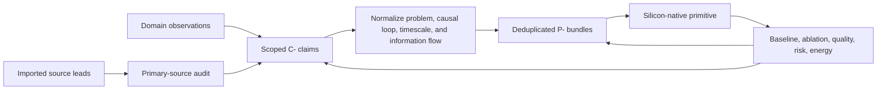

# Deduplicated principle registry

This is the canonical layer between domain research and architecture. Papers
enter through a discipline—neuroscience, botany, immunology, robotics, network
science—but the project should not accumulate six names for the same
problem–solution pattern.

The domain maps preserve biological detail. This registry bundles recurring
invariants and gives each one a stable `P-` identifier. Concept chapters and
experiments should link to a principle ID, then to the individual evidence
claims supporting it.

## Deduplication rule

Two observations belong to the same principle when they share:

1. the constrained **problem** being solved;
2. the causal **state transformation or control loop** used to solve it; and
3. the relevant **timescale and information flow**.

Shared vocabulary is not enough. Conversely, different molecules, organs, or
academic terminology do not justify separate principles if the same abstract
control loop remains after substrate details are removed.

Deduplication never deletes the source observations. It creates a bundle:

```text
domain observation -> evidence claim -> recurring principle -> AI primitive -> experiment
```



Editable source:
[`../assets/diagrams/evidence-to-principles.mmd`](../assets/diagrams/evidence-to-principles.mmd).

A recurrence across domains raises the priority of a principle because nature
may have encountered the same constraint repeatedly. It does not prove that the
domains evolved independently, that their mechanisms are identical, or that
the abstraction will improve AI. That is tested, not assumed.

Discovery is deliberately broader than biology. The
[open-world discovery policy](discovery-policy.md) admits every empirical,
formal, and engineering science, then applies the same normalization and
evidence gates to each.

## Registry summary

| ID | Recurring problem–solution invariant | Supporting domains in current corpus | Disposition |
| --- | --- | --- | --- |
| P-001 | Allocate scarce activity to a small relevant subset | cortex, insect olfaction, immune selection, sparse AI | use/experiment |
| P-002 | Resolve events locally and escalate exceptions | dendrites, cephalopod arms, reflex paths, distributed systems | explore |
| P-003 | Leave a cheap temporary trace before slow commitment | synaptic eligibility, plant priming, fast memory, caches | experiment |
| P-004 | Generate diversity, select, then protect or compress winners | development, pruning, immune affinity maturation, evolutionary search | experiment |
| P-005 | Reinforce useful paths and decay unused topology | synapses/glia, slime-mold transport, routing graphs | experiment |
| P-006 | Stabilize a dynamic system with slower negative feedback | synaptic scaling, insect feedback inhibition, load control | explore |
| P-007 | Spend sensing or compute on unresolved prediction error | predictive coding, active sensing, surprise routing | experiment |
| P-008 | Contain interactions in modules before global integration | dendritic branches, cephalopod segments, cell types, expert modules | explore |
| P-009 | Separate task execution from maintenance and consolidation | astrocytes, sleep/replay, repair, system control planes | explore |
| P-010 | Move recurring computation into structure or placement | morphology, myelination/timing, compilation, memory hierarchy | experiment |
| P-011 | Form transient coalitions through time-dependent communication | cortical phase coupling, scheduled fabrics, future quorum audit | watch |
| P-012 | Match memory medium and update rate to information lifetime | fast/slow memory, immune memory, plant priming, external factual stores | use/experiment |
| P-013 | Coordinate through shared state left in the environment | ant trails, blackboards, logs, external workspaces | experiment |

## Candidates held outside the registry

These mechanisms survived one audit but do not yet have enough cross-domain or
experimental discrimination to receive a stable `P-` ID.

| Candidate | Nearest bundles | Why held | Discriminating work |
| --- | --- | --- | --- |
| Multiscale context broadcast | P-001, P-006, P-008, P-011 | few-to-many temporal decoding appears distinct, but may reduce to FiLM, recurrent gating, or supervisory control | [Candidate 002](../experiments/candidates/002-multiscale-context-broadcast.md) |
| Thresholded collective commitment | P-006, P-011 | nonlinear support/opposition/abstention may reduce to robust aggregation or calibrated confidence | quorum comparison defined in the [collective audit](audits/2026-08-05-collective-ecological-resilience.md) |
| Recovery-based fragility sensing | adjacent to P-006 and P-009 | diagnostic rather than stabilizing loop; may reduce to conventional active system identification | [Candidate 003](../experiments/candidates/003-recovery-dynamics-fragility.md) |
| Closed endogenous curriculum | P-003, P-004, P-007, P-009, P-012 | currently a composition of existing bundles, not a new invariant | generation–intervention test in the [creativity audit](audits/2026-08-05-endogenous-generation-creativity.md) |

## P-001 — Selective allocation

**Problem.** Total possible capacity is larger than the activity or resources
available for one event.

**Invariant.** Generate or store many candidates, then activate, amplify, or
expand only the subset relevant to the current evidence. Suppression is as
important as excitation.

**Manifestations.** Sparse cortical activity ([C-001](claims.md#c-001)); sparse
and decorrelated Kenyon-cell codes ([C-025](claims.md#c-025)); affinity-based
clonal selection ([C-028](claims.md#c-028)); mixture-of-experts routing
([C-003](claims.md#c-003)); congestion-triggered reserve routes
([C-035](claims.md#c-035)).

**Candidate AI primitive.** Budgeted top-$k$ routing with explicit inhibition,
capacity reserves, and measured communication cost.

**Do not collapse.** Immune clonal expansion creates more physical candidates;
inference routing merely selects stored capacity. Their lifecycle costs differ.

## P-002 — Local autonomy with exception escalation

**Problem.** A central controller cannot economically specify every local
interaction at the required latency.

**Invariant.** Co-locate state and fast control; communicate goals downward and
novelty, conflict, uncertainty, or failure upward.

**Manifestations.** Branch-local dendritic integration
([C-017](claims.md#c-017)); segmented cephalopod arm nervous systems
([C-024](claims.md#c-024)); proposed reflex-like compiled paths in the imported
concept; hierarchical edge/cloud and distributed-control systems.

**Candidate AI primitive.** Sensor- or module-local predictor with a sparse
escalation channel and auditable global override.

**Do not collapse.** A dendritic branch integrates inputs inside one cell; an
arm segment controls an embodied subsystem. They share locality, not mechanism
or scale.

## P-003 — Temporary trace before commitment

**Problem.** A system needs to react to a recent event before it knows whether
the event deserves a durable structural change.

**Invariant.** Store a cheap, decaying, reversible state that changes the next
response; promote it only after a later signal or recurrence.

**Manifestations.** Synaptic eligibility traces gated by later modulation
([C-019](claims.md#c-019)); transcriptional stress memory in plants
([C-026](claims.md#c-026)); episodic capture before consolidation
([C-008](claims.md#c-008)); retrieval-sensitive memory windows
([C-039](claims.md#c-039)); internally generated learned sequences
([C-061](claims.md#c-061)); caches and write-ahead logs in computing.

**Candidate AI primitive.** Versioned local context marks with explicit decay,
promotion, rollback, and provenance.

**Do not collapse.** Eligibility assigns delayed credit to earlier activity;
plant priming changes later response readiness; episodic memory preserves event
content. One implementation may need all three roles.

## P-004 — Diversity, selection, and protection

**Problem.** Novel regimes require exploration, but continued variation damages
solutions that already work.

**Invariant.** Produce diverse candidates, test them under a resource limit,
expand useful variants, then reduce mutation or compress only after stability.

**Manifestations.** Developmental overproduction and later pruning as a source
hypothesis; lottery-ticket pruning ([C-012](claims.md#c-012)); immune affinity
maturation with reduced mutation in high-affinity lineages
([C-028](claims.md#c-028)); developmental/evolutionary search in embodied agents
([C-029](claims.md#c-029)); evolved bacterial bet hedging
([C-032](claims.md#c-032)); complement-dependent developmental refinement
([C-043](claims.md#c-043)); capability-guided assembly and its redundancy
boundary ([C-056](claims.md#c-056), [C-057](claims.md#c-057)); regulated
behavioral variability ([C-065](claims.md#c-065)).

**Candidate AI primitive.** Sandboxed adapter or expert populations with
validation gates, lineage tracking, contraction, and rollback.

**Do not collapse.** Grokking is not a universal selection gate
([C-011](claims.md#c-011)), and magnitude pruning is not equivalent to biological
development or immune selection.

## P-005 — Use-dependent topology

**Problem.** Fixed all-to-all connectivity is expensive, while a prematurely
fixed sparse graph cannot adapt to changing flow.

**Invariant.** Reinforce paths carrying useful traffic, decay unused paths, and
preserve enough exploration or redundancy to recover from change.

**Manifestations.** Activity-dependent astrocytic synapse elimination
([C-021](claims.md#c-021)); flow-adaptive *Physarum* transport
([C-027](claims.md#c-027)); self-regulating fungal growth networks
([C-034](claims.md#c-034)); developmental and memory-related microglial
elimination ([C-042](claims.md#c-042), [C-043](claims.md#c-043)); synaptic
plasticity; dynamic expert and network routing.

**Candidate AI primitive.** Reversible capacity updates on an expert graph,
driven by useful flow rather than magnitude alone.

**Do not collapse.** Removal of a biological synapse, change in tube diameter,
and reassignment of a digital route have different reversibility and safety
costs.

## P-006 — Homeostatic negative feedback

**Problem.** Positive learning and selection loops can saturate, collapse, or
let a few components monopolize activity.

**Invariant.** A slower feedback loop senses aggregate state and adjusts gain,
threshold, or capacity toward a viable range without specifying the task
solution itself.

**Manifestations.** Synaptic scaling ([C-018](claims.md#c-018)); feedback
inhibition that maintains sparse insect odor codes
([C-025](claims.md#c-025)); congestion-triggered ant route splitting
([C-035](claims.md#c-035)); polarity-dependent planarian regeneration
([C-033](claims.md#c-033)); load balancing and rate control in engineered systems.

**Candidate AI primitive.** Per-module activity and update-rate controllers
that operate separately from the task loss.

**Do not collapse.** Sparsification and homeostasis may use the same feedback
loop but optimize different controlled variables.

## P-007 — Prediction-error allocation

**Problem.** Reprocessing expected input wastes sensing, communication, and
compute; uncertainty cannot be resolved by confidence-free repetition.

**Invariant.** Predict what should happen, represent the residual, and spend
additional action or computation where residual uncertainty remains.

**Manifestations.** Cortical predictive-coding models
([C-005](claims.md#c-005)); joint-embedding prediction
([C-006](claims.md#c-006)); active sensing ([C-022](claims.md#c-022)); early exit
([C-004](claims.md#c-004)); exploratory fungal growth beyond depleted regions
([C-034](claims.md#c-034)); uncertainty-targeted exploratory play
([C-062](claims.md#c-062)).

**Candidate AI primitive.** Calibrated residual router that can buy another
layer, modality, sensor action, memory lookup, or human query.

**Do not collapse.** Prediction error, epistemic uncertainty, novelty, and task
loss are not interchangeable routing signals.

## P-008 — Compartmentalized interaction

**Problem.** Unrestricted interaction causes interference and high
communication cost.

**Invariant.** Compute and adapt inside bounded compartments, then expose a
small interface for global integration.

**Manifestations.** Nonlinear dendritic branches ([C-017](claims.md#c-017));
cephalopod arm segments ([C-024](claims.md#c-024)); specialized inhibitory cell
roles ([C-020](claims.md#c-020)); modular experts ([C-003](claims.md#c-003));
receiver-specific decoding of a shared signal ([C-048](claims.md#c-048)); and
capability-complementary community repair ([C-056](claims.md#c-056)).

**Candidate AI primitive.** Hierarchical modules with local state, typed
interfaces, and explicit cross-compartment budgets.

**Do not collapse.** Modularity can protect specialization but can also block
transfer; the correct boundary is an empirical question.

## P-009 — Maintenance plane

**Problem.** The machinery that performs a task cannot simultaneously optimize
all long-timescale repair, resource, and memory decisions from the same local
objective.

**Invariant.** A slower process observes aggregate health and coordinates
repair, pruning, replay, allocation, or consolidation without occupying the
fast task path.

**Manifestations.** Astrocytic regulation of connectivity and remote memory
([C-021](claims.md#c-021)); offline replay ([C-010](claims.md#c-010)); sleep as
the imported metaphor; polarity-dependent reconstruction in planaria
([C-033](claims.md#c-033)); selective replay and active forgetting
([C-036](claims.md#c-036), [C-041](claims.md#c-041),
[C-042](claims.md#c-042)); adjacent resource allocation
([C-051](claims.md#c-051)); control planes and garbage collectors in computing.

**Candidate AI primitive.** Auditable lifecycle controller with limited
actions, shadow evaluation, and rollback.

**Do not collapse.** “Glia” is not one function, and a maintenance process is
not free background work.

## P-010 — Structural offloading and co-design

**Problem.** A generic controller repeatedly pays to solve constraints that
could be encoded in stable structure, placement, or material.

**Invariant.** Move mature, recurring computation into topology, data layout,
sensor/body structure, lower precision, or compiled execution paths.

**Manifestations.** Body–controller co-development
([C-029](claims.md#c-029)); dendritic structure
([C-017](claims.md#c-017)); myelination as a biological timing/efficiency lead;
pruning and quantization ([C-012](claims.md#c-012),
[C-013](claims.md#c-013)); schema-sensitive consolidation
([C-038](claims.md#c-038)); reversible mature structural constraints and
resource placement ([C-044](claims.md#c-044), [C-050](claims.md#c-050)).

**Candidate AI primitive.** Reversible structural search followed by compiled
or physically colocated stable paths.

**Do not collapse.** Quantization is not myelination, and compilation does not
make a behavior a zero-energy reflex.

## P-011 — Transient communication coalitions

**Problem.** A fixed communication graph must support changing coalitions of
components without all components broadcasting continuously.

**Invariant.** Select effective connectivity through time-dependent alignment,
slots, or shared environmental state.

**Manifestations.** Transient frequency-specific phase coupling
([C-030](claims.md#c-030)); sparse directed influence in pigeon flocks
([C-054](claims.md#c-054)); scheduled digital fabrics. The nonlinear commitment
rule in fish remains a held candidate rather than being collapsed here.

**Candidate AI primitive.** Learned temporal communication windows with
bandwidth reservations and asynchronous fallback.

**Do not collapse.** Biological oscillations, time-division multiplexing, and
environment-mediated coordination may solve different synchronization
problems.

## P-012 — Memory matched to information lifetime

**Problem.** One storage medium and update rule cannot simultaneously optimize
fleeting context, episodes, stable skills, and mutable facts.

**Invariant.** Route information by expected lifetime, update frequency,
provenance, and cost; promote or expire it explicitly.

**Manifestations.** Complementary learning systems
([C-008](claims.md#c-008)); replay ([C-010](claims.md#c-010)); plant priming
([C-026](claims.md#c-026)); immune lineage memory; retrieval-backed factual
stores ([C-014](claims.md#c-014)); selective replay, schema-sensitive
consolidation, reconsolidation, and regulated forgetting
([C-036](claims.md#c-036)–[C-042](claims.md#c-042)); memory-supported imagined
scene construction ([C-066](claims.md#c-066)).

**Candidate AI primitive.** A versioned memory hierarchy spanning transient
state, episodic records, slow skills, and externally attributable facts.

**Do not collapse.** Similar timescale separation does not imply identical
content, access, or trust semantics.

## P-013 — Externalized shared state

**Problem.** Direct pairwise communication and complete internal maps are too
expensive for many agents or modules coordinating across time.

**Invariant.** An agent changes a shared environment; later agents read that
state and act on it. The state can decay, accumulate, encode topology, or carry
direction without identifying its author.

**Manifestations.** Pheromone and geometric information in ant trail networks
([C-031](claims.md#c-031)); shared blackboards, append-only logs, caches, and
external workspaces in engineered systems; factual retrieval
([C-014](claims.md#c-014)) when the store also mediates coordination; shared
chemistry that changes ecological admission pressure ([C-055](claims.md#c-055)).

**Candidate AI primitive.** A versioned shared workspace where modules publish
compact observations, partial results, route pressure, and unresolved questions
instead of broadcasting pairwise state.

**Do not collapse.** An ant trail is low-bandwidth, lossy, and often anonymous;
a digital store can be exact, attributable, access-controlled, and rolled back.
Those silicon advantages should be retained.

## How to add a finding

1. Capture the domain observation and primary source without interpretation.
2. Add or update a `C-` claim that states exactly what the source supports.
3. Compare its problem, causal loop, timescale, and information flow with every
   existing `P-` principle.
4. Attach it to an existing principle when those fields match; create a new
   principle only when at least one field is materially different.
5. Record the biological difference under **Do not collapse**.
6. Update one shared AI primitive or experiment rather than adding a duplicate
   organism-themed architecture.

The registry should become smaller and sharper as research grows: more evidence
bundles per principle, not one new principle per paper.
