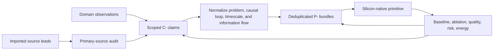

# Deduplicated principle registry

This is the canonical layer between domain research and architecture. Papers
enter through a discipline—neuroscience, botany, immunology, robotics, network
science—but the project should not accumulate six names for the same
problem–solution pattern.

The readable architectural synthesis is maintained in
[Cross-domain convergence](../concept/07-cross-domain-convergence.md).

The domain maps preserve biological detail. This registry bundles recurring
invariants and gives each one a stable `P-` identifier. Concept chapters and
experiments should link to a principle ID, then to the individual evidence
claims supporting it.

## Deduplication rule

Two observations belong to the same principle when they share:

1. the constrained **problem** being solved;
2. the causal **state transformation or control loop** used to solve it; and
3. the relevant **timescale and information flow**.

Shared vocabulary is not enough. Conversely, different molecules, organs, or
academic terminology do not justify separate principles if the same abstract
control loop remains after substrate details are removed.

Deduplication never deletes the source observations. It creates a bundle:

```text
domain observation -> evidence claim -> recurring principle -> AI primitive -> experiment
```



Editable source:
[`../assets/diagrams/evidence-to-principles.mmd`](../assets/diagrams/evidence-to-principles.mmd).

A recurrence across domains raises the priority of a principle because nature
may have encountered the same constraint repeatedly. It does not prove that the
domains evolved independently, that their mechanisms are identical, or that
the abstraction will improve AI. That is tested, not assumed.

Discovery is deliberately broader than biology. The
[open-world discovery policy](discovery-policy.md) admits every empirical,
formal, and engineering science, then applies the same normalization and
evidence gates to each.

## Registry summary

| ID | Recurring problem–solution invariant | Supporting domains in current corpus | Disposition |
| --- | --- | --- | --- |
| P-001 | Allocate scarce activity to a small relevant subset | cortex, insect olfaction, immune selection, sparse AI | use/experiment |
| P-002 | Resolve events locally and escalate exceptions | dendrites, cephalopod arms, reflex paths, distributed systems | explore |
| P-003 | Leave a cheap temporary trace before slow commitment | synaptic eligibility, plant priming, fast memory, caches | experiment |
| P-004 | Generate diversity, select, then protect or compress winners | development, pruning, immune affinity maturation, evolutionary search | experiment |
| P-005 | Reinforce useful paths and decay unused topology | synapses/glia, slime-mold transport, routing graphs | experiment |
| P-006 | Stabilize a dynamic system with slower negative feedback | synaptic scaling, insect feedback inhibition, load control, performance timing | explore |
| P-007 | Spend sensing or compute on unresolved prediction error | predictive coding, active sensing, musical expectation, surprise routing | experiment |
| P-008 | Contain interactions in modules before global integration | dendritic branches, cephalopod segments, cell types, expert modules | explore |
| P-009 | Separate task execution from maintenance and consolidation | astrocytes, sleep/replay, repair, system control planes | explore |
| P-010 | Move recurring computation into structure or placement | morphology, myelination/timing, compilation, memory hierarchy | experiment |
| P-011 | Form transient coalitions through time-dependent communication | cortical phase coupling, ensemble timing, scheduled fabrics, future quorum audit | watch |
| P-012 | Match memory medium and update rate to information lifetime | fast/slow memory, immune and motif memory, cultural priors, external factual stores | use/experiment |
| P-013 | Coordinate through shared state left in the environment | ant trails, scores and repertoire, blackboards, logs, external workspaces | experiment |

## Candidates held outside the registry

These mechanisms survived one audit but do not yet have enough cross-domain or
experimental discrimination to receive a stable `P-` ID.

| Candidate | Nearest bundles | Why held | Discriminating work |
| --- | --- | --- | --- |
| Occupancy- and life-safety-qualified spatial reconfiguration | P-001, P-008, P-009, P-010, P-013 | passive design, modular/open building, BIM/IFC, controls, commissioning, LCA/LCC, and asset management are established; the residual is only whether a joint contract exposes invalid intermediate physical/service states while people and irreversible commitments remain in the system | [Candidate 001](../experiments/candidates/001-adaptive-topology.md#occupied-spatial-topology-track) must beat the complete building-design, change-control, commissioning, and lifecycle null stack across at least two asset classes |
| Multiscale context broadcast | P-001, P-006, P-008, P-011 | few-to-many temporal decoding appears distinct, but may reduce to FiLM, recurrent gating, or supervisory control | [Candidate 002](../experiments/candidates/002-multiscale-context-broadcast.md) |
| Thresholded collective commitment | P-006, P-011 | nonlinear support/opposition/abstention may reduce to robust aggregation or calibrated confidence | quorum comparison defined in the [collective audit](audits/2026-08-05-collective-ecological-resilience.md) |
| Transition-class-aware fragility sensing | adjacent to P-006, P-007, and P-009 | recovery rate is diagnostic only for gradual, observable, safely excitable stability loss and may reduce to conventional active system identification or a mechanism-specific indicator | [Candidate 003](../experiments/candidates/003-recovery-dynamics-fragility.md) must abstain on noise, rate, boundary, hidden-mode, and abrupt-jump classes |
| Closed endogenous curriculum | P-003, P-004, P-007, P-009, P-012 | currently a composition of existing bundles, not a new invariant | [Candidate 004](../experiments/candidates/004-closed-endogenous-curriculum.md) separates generation, intervention, evaluation, and lineage memory |
| Entrainable local phase state | P-002, P-006, P-011 and multiscale context broadcast | persistent autonomous phase between sparse corrections is distinct from a transient receiver filter, but may reduce to timers, PLLs, cyclic scheduling, or distributed clock discipline | independent phase-shift test from the [endocrine/circadian audit](audits/2026-08-05-endocrine-circadian-control.md) |
| Severity-ordered containment and triage | P-003, P-006, P-008, P-009 | ordered sense–contain–repair/reconstruct–replace actions may reduce to circuit breaking, static isolation, microreboot, checkpoint/replica recovery, scrubbing, or a cost-sensitive repair/replace policy | [Candidate 005](../experiments/candidates/005-severity-ordered-containment.md) must improve collateral-loss and availability frontiers after sensing, reserve, replacement, and verification costs |
| Reversible physical skill compilation | P-006, P-009, P-010 | physical transfer functions, material memory, healing, and self-assembly are established substrate techniques; the residual is reversible deployment with health probes and a digital shadow, not a new computation principle | [Candidate 006](../experiments/candidates/006-reversible-physical-skill.md) must beat passive mechanics, analog control, FPGA/ASIC, and matched reservoirs after fabrication, transduction, calibration, drift, reset, and fallback |
| Intervention-aware surveillance under endogenous observation | P-001, P-007, P-009, P-013 | action changes both hidden state and the telemetry channel, but the composition may reduce to delay-aware state estimation, POMDP/dual control, sequential detection, and value-of-information sampling | [Candidate 007](../experiments/candidates/007-endogenous-observation-surveillance.md) must identify action effects and observation drift beyond those nulls using true data vintages and matched investigation cost |
| Audit-backed contestable modular allocation | P-001, P-004, P-007, P-009, P-013 | price, auction, matching, scoring, bandit, sanction, and ledger components are established; the composition applies only when persistent modules hold private decision-relevant information, can profit from gaming, and face real opportunity consequences | [Candidate 008](../experiments/candidates/008-contestable-modular-allocation.md) must tie or lose under cooperative direct observability and beat routers, primal–dual control, bandits, and randomized audits under strategic pressure |
| Versioned graded assurance envelope | P-002, P-003, P-004, P-006, P-008, P-009, P-012, P-013 | types, proofs, contracts, effects, capabilities, monitors, provenance, transactions, deployment metadata, identity, epochs, and revocation are established; the residual is explicit grade/version binding plus cross-layer invalidation and clean-root evidence | [Candidate 009](../experiments/candidates/009-graded-assurance-envelopes.md) must beat a composed typed API, sandbox/IAM, CI/static-analysis, runtime-monitor, lineage, canary, transaction, build-invalidation, short-lived identity, and tested rebuild/rotation stack |
| Reset-coupled staged verification | P-003, P-007, P-009 | kinetic proofreading establishes driven delay, discriminatory escape, and reset in scoped chemistry; the systems residual exists only when temporary execution or a distinct verifier adds conditional information before an expensive commitment | [Candidate 010](../experiments/candidates/010-reset-coupled-staged-verification.md) must beat conditioned sequential tests, calibrated cascades, abstention, retries, redundant verification, and codes after rejected work and rollback leakage are charged |
| Dual-loop operational assurance | P-002, P-003, P-009, P-012, P-013 | incident command can contain without learning and postmortems can analyze without improving live response; the residual is a versioned interface from trace and precursor to scoped response, verified change, applicability-triggered retrieval, and retirement | [Candidate 011](../experiments/candidates/011-dual-loop-operational-assurance.md) must beat mature telemetry, SRE roles, IAM, interlocks, canaries, chaos drills, postmortems, action tracking, and searchable runbooks at equal cost |
| Latency-qualified authority envelope | P-002, P-006, P-008, P-009 | adaptive protection, supervisory control, constrained control, barrier functions, runtime assurance, IAM, and compromise recovery already vary or filter action; the residual is a certified admissible set driven jointly by evidence age, integrity, mode, headroom, coordination, epoch, revocation, and compromise state | [Candidate 012](../experiments/candidates/012-latency-qualified-authority.md) must beat static and adaptive control plus mature IAM/rebuild nulls without self-certification, unsafe transitions, correlated roots, or uncharged reserve |
| Bidirectional deficit–capability routing | P-001, P-005, P-006, P-011 | plant nitrogen signaling separates deficit-up, context-down, and local opportunity gating, but backpressure and primal–dual allocators already express closely related loops | [Candidate 013](../experiments/candidates/013-deficit-capability-routing.md) must beat centralized, backpressure, primal–dual, and learned routing under matched messages, state, capacity, delay, topology change, and strategic demand |
| Versioned, support-qualified observation contract | P-001, P-003, P-007, P-008, P-009, P-012, P-013 | forward models, selection functions, association probabilities, spatial/temporal support, preservation operators, uncertainty classes, lineage, alerts, and active follow-up are established; the residual is propagating their versioned dependencies with each derived claim | [Candidate 014](../experiments/candidates/014-versioned-observation-contract.md) must beat typed and event-time schemas, state-space and Gaussian-process models, calibrated likelihood, explicit selection, lineage, detection statistics, predictive checks, simulation calibration, graded assurance, surveillance modeling, and value-of-information scheduling |
| Versioned, repairable convention layer | P-002, P-003, P-004, P-007, P-008, P-009, P-011, P-012, P-013 | composition, pragmatic inference, repair, coding, partner state, convention formation, schema versioning, migration, and rollback are established scoped mechanisms; the residual binds adaptive local forms to literal semantics, uptake evidence, protected meanings, cross-play, and lifecycle gates | [Candidate 015](../experiments/candidates/015-versioned-repairable-conventions.md) must beat a fixed typed protocol, schema registry, acknowledgement/retry, calibrated inference, replicated state, coding, migration, and rollback stack under genuine task and population drift |
| Conflict-bounded unit transition | P-004, P-008, P-009, P-012 | population selection, modular boundaries, versioned reproduction, permissions, testing, auditing, and conflict control are established; the residual asks when reproducible collective heredity and cost-adjusted between-collective selection justify treating the collection as a unit | [Candidate 016](../experiments/candidates/016-conflict-bounded-unit-transition.md) must beat ordinary modules, permissions/tests, checkpoint hygiene, external evaluation, routed experts, and ensemble/population selection under member shortcuts, turnover, and founder risk |
| Compensation-aware recovery accounting | P-003, P-006, P-009, P-012 | restoration, failover, reconstruction, robustness testing, resource accounting, reserve, and recurrence monitoring are established; the residual is an evaluation vector separating native capability from compensating dependence and adverse adaptation | [Candidate 005](../experiments/candidates/005-severity-ordered-containment.md) must show that support removal, transfer, recurrence, and reserve axes expose consequential false recovery beyond ordinary multi-objective evaluation and fault injection |
| Contract-preserving semantic compaction | P-003, P-009, P-012, P-013 | snapshots, materialized views, log compaction, compression, archives, provenance, OAIS/PREMIS packages, versioned identity and vocabulary, migration tests, rollback, and invalidation are established; the residual is finite registered semantic preservation for a declared interpreter community under hidden future queries | [Candidate 017](../experiments/candidates/017-contract-preserving-semantic-compaction.md) must beat the complete storage-and-preservation null after representation dependencies, metadata, retained fragments, migration, maintenance interference, corruption, deletion, access, audit, capability turnover, and rollback cost |
| Value- and reconstructability-aware artifact tiering | P-001, P-009, P-012, P-013 | adaptive caching, miss-cost policies, economic tiering, fault-domain placement, coding, and reconstructability are established; the residual asks whether task/evidence value adds leakage-free generalizable placement information | [Candidate 018](../experiments/candidates/018-value-reconstructability-aware-tiering.md) must beat ARC/TinyLFU, size/miss-cost, static, economic, and coded-placement nulls under shift and correlated failure |
| Audited cumulative inheritance | P-003, P-004, P-005, P-009, P-012, P-013 | generation, social transmission, repositories, versioning, search, evaluation, governance, and network effects are established scoped mechanisms; the residual is preservation and recombination of validated capability across real learner turnover | [Candidate 019](../experiments/candidates/019-audited-cumulative-inheritance.md) must beat the complete centralized continual-learning, retrieval, versioning, workflow, and governance stack at equal cumulative effort |
| Constitutionalized multi-level control plane | P-002, P-004, P-008, P-009, P-011, P-013 | aggregation limits, IAM, constrained control, delegation models, veto theory, polycentricity, policy-as-code, review, lineage, incident response, and change management are established scoped mechanisms; the residual composition applies only with real asymmetric information, conflicting incentives, spillovers, or authorized standing | [Candidate 020](../experiments/candidates/020-constitutional-control-plane.md) must beat the full ordinary governance stack on task-native and protected outcomes after capture, gridlock, concentration, human attention, and lifecycle cost |

### Immune-state lifecycle evaluation contract

The [immune audit](audits/2026-08-05-immune-tolerance-trained-immunity.md)
does not leave a distinct principle or candidate. Its durable result is an
evaluation contract: keep representation, recognition, authorization,
activation, ignorance, anergy, active suppression, exhaustion, deletion,
expansion, contraction, memory, residency, recovery, and resource state
separate because they imply different actions, reversibility, and failure
costs ([C-727](claims.md#c-727)–[C-746](claims.md#c-746)). Compare that record
with typed state machines, calibrated risk and abstention, least privilege,
supervisory and constrained control, evolutionary and AIS search, replay,
placement, and lifecycle accounting. If those nulls reproduce its decisions,
the immune terminology adds no systems mechanism ([C-747](claims.md#c-747)).
The two-track falsification contract is
[Fixture F-013](../experiments/fixtures/013-immune-state-lifecycle-evaluation.md):
its source modules reproduce bounded immunology claims, while its separately
budgeted systems track tests C-746 and C-747 without treating one track as
evidence for the other.

### Shared-clock-free predictive co-adaptation benchmark

The [music audit](audits/2026-08-05-music-cognition-improvisation.md) promotes
no principle or candidate. Its narrow residual is a benchmark fixture: maintain
literal task constraints, bounded relative timing, and responsive phrase state
while tempo and microtiming drift, delay is asymmetric, roles and motifs
change, and partners turn over, without a privileged shared clock
([C-780](claims.md#c-780)). The fixture composes the held entrainable local
phase state with [Candidate 002](../experiments/candidates/002-multiscale-context-broadcast.md),
[Candidate 015](../experiments/candidates/015-versioned-repairable-conventions.md),
and [Candidate 019](../experiments/candidates/019-audited-cumulative-inheritance.md).
The executable contract is [Fixture F-001](../experiments/fixtures/001-shared-clock-free-coadaptation.md).

Its required null is the complete stack of pairwise phase correction, PLL and
Kalman/state-space estimation, adaptive feedback, MPC, centralized scheduling,
retrieval, explicit role/version protocol, and ordinary rehearsal. Measure
literal success, pairwise onset error, phrase response, recovery, role
violations, messages, latency, memory, human effort, and lifecycle energy
separately. Retire the residual when conventional online identification plus
retrieval and explicit protocol state reaches the same frontier; neural
synchrony cannot override that result ([C-783](claims.md#c-783)). See
[OQ-056](open-questions.md#oq-056).

### Opportunity- and history-qualified adaptive-action benchmark

The [comparative-cognition audit](audits/2026-08-05-comparative-cognition-tool-use.md)
promotes no principle or candidate. Its durable result is an evaluation
contract: retain the task and apparatus, actual sensory evidence, feasible
motor actions, morphology, acquisition and social history, reward schedule,
intervention and controls, timescale, and sampling unit before naming a
capability ([C-804](claims.md#c-804)–[C-840](claims.md#c-840)). Species or
task rankings are explicitly rejected; terminal success cannot erase unequal
opportunity, reinforcement history, or failed transfer.

[Fixture F-003](../experiments/fixtures/003-opportunity-history-qualified-action.md)
applies that contract to Candidates 004, 006, 007, 014, 018, and 019. Its
required null stack includes affordance learning plus search, model-based
RL/POMDP/MPC, retrieval, selective prediction and value of information,
behavior cloning, task graphs, hierarchical control, domain randomization,
system identification, and stratified evaluation. Retain the fixture only if
it changes an architecture decision, catches a reproducible opportunity or
history confound, and improves hidden-plant prediction without materially
increasing false rejection ([C-841](claims.md#c-841)). See
[OQ-057](open-questions.md#oq-057).

### Versioned reconstructive-design benchmark

The [visual-art/design audit](audits/2026-08-05-visual-art-design-cognition.md)
promotes no principle or candidate. Its durable result composes existing
operations into an evaluation loop: reconstruct proposals from learned
categories, examples, analogies, and constraints; externalize attributable
variants; inspect newly available relations or material evidence; transform
without erasing source and branch history; and evaluate against a qualified
outcome vector ([C-842](claims.md#c-842)–[C-860](claims.md#c-860)).

The contract keeps proposal generation separate from selection, treats example
exposure as both a possible aid and a fixation or negative-transfer channel,
binds evaluator identity, context, and uncertainty to each judgment, and
records which physical variables a sketch, simulation, or material probe
actually exposed. Provenance establishes derivation, not truth, authenticity,
intent, or complete recoverability. [Fixture F-002](../experiments/fixtures/002-versioned-reconstructive-design.md)
applies these boundaries across Candidates 004, 014, 017, 018, and 019.

Its required null is the complete composition of retrieval, structured
scratchpads and CAD, beam/population/quality-diversity search, simulation,
contextual preference models, content-addressed version control, W3C PROV, and
ordinary design workflow. Retain the fixture only if it improves held-out
validity, diversity, recovery, transfer, and lifecycle cost while exposing
fixation, evaluator disagreement, material-model omissions, and lineage loss
beyond that stack. See [OQ-058](open-questions.md#oq-058).

### Versioned proof-discovery and verification benchmark

The [mathematical-practice audit](audits/2026-08-05-mathematical-practice-proof-discovery.md)
promotes no principle or candidate. Its durable result is an evaluation
contract that keeps candidate production separate from acceptance. Examples,
analogy, abstraction, retrieval, search, and stochastic variation may propose a
statement; none makes it true. Counterexamples can reject and localize but do
not choose a unique repair. A decomposed proof is accepted only when its child
artifacts reconstruct the parent through the declared checker, definitions,
axioms, dependencies, and version ([C-861](claims.md#c-861)–[C-870](claims.md#c-870)).

[Fixture F-004](../experiments/fixtures/004-versioned-proof-discovery.md)
applies this contract across Candidates 004, 009, 010, 011, 014, 017, and 019.
It requires immutable problem and library identity, proposal ancestry,
abstraction obligations, counterexample search, a reconstructible proof DAG, a
small trusted checker or independently checkable certificate, and typed
`proved`, `refuted`, `tested`, `unknown`, `disputed`, and `retracted` state.
Changing a premise, definition, checker, or library version invalidates every
reachable dependent until it is rebuilt and rechecked ([C-871](claims.md#c-871)–[C-880](claims.md#c-880)).

Its required null is the complete relevant stack: theorem provers, proof
assistants and kernels, SAT/SMT and constraint solvers, CEGAR/CEGIS, formal
libraries, proof certificates, version control, CI, dependency analysis, and
ordinary mathematical review. Evaluation splits group exact duplicates,
restatements, specializations, isomorphic variants, generated siblings, source
texts, and dependency-closing lemmas before partitioning. Report all candidate,
search, counterexample, proof, certificate, checker, storage, migration, repair,
review, human-hour, wall-time, memory, and joule costs. Retire the composition
when that mature stack reaches the same checked-result and fault-localization
frontier. See [OQ-059](open-questions.md#oq-059).

### Scale–closure–observation–control evaluation contract

The [fluid-dynamics audit](audits/2026-08-05-fluid-dynamics-turbulence.md)
promotes no principle or candidate. Its durable result is an outcome firewall
for systems whose apparent efficiency can be created by changing the measured
quantity, support, regime, or resource boundary. A multiscale result must name
the transported invariant and signed flux; low-order fit does not establish
intermittent-tail or extreme fidelity; and a coherent structure remains bound
to its observable, filter, detector, threshold, and frame
([C-881](claims.md#c-881)–[C-889](claims.md#c-889)).

Every coarse state carries a closure and model-form support claim. Reduced
coordinates are qualified by forecast, control, stability, or tail objective,
not retained variance alone. Adaptive resolution is credited only through
total work at a target error, including substeps, transfers, regridding,
communication, imbalance, and rejected work. Assimilation and reconstruction
remain conditional on the actual observation operator, error model, prior,
boundaries, observability, and posterior calibration
([C-890](claims.md#c-890)–[C-907](claims.md#c-907)).

Control must remain stable within latency, bandwidth, authority, saturation,
and failure limits, and must deliver net benefit after sensing, actuation,
compute, facility, and auxiliary power. Mixing is a declared outcome vector,
not visual filamentation. Transition records include perturbation and ramp
history; extreme claims require prospective tail calibration; measurements
carry response operators and propagated uncertainty; and efficiency uses the
full lifecycle energy boundary ([C-908](claims.md#c-908)–[C-925](claims.md#c-925)).

[Fixture F-005](../experiments/fixtures/005-regime-qualified-flow-inference-control.md)
applies this contract across Candidates 002, 003, 006, 007, 012, and 014. Its
null is the complete relevant stack of verified CFD, established closures and
uncertainty perturbations, goal-oriented AMR, objective-matched ROMs,
assimilation and observability analysis, constrained sensor placement, robust
and model-predictive control, rare-event estimation, response-aware metrology,
and lifecycle accounting. Retire the composition when that stack reaches the
same quality–risk–latency–resource frontier. See
[OQ-060](open-questions.md#oq-060).

### Representative adaptive-performance evaluation contract

The [sports audit](audits/2026-08-05-sports-expertise-team-coordination.md)
promotes no principle or candidate. Its durable result is an outcome firewall:
anticipation is not physical interception; gaze is not causal cue use; practice
performance is not delayed retention or target transfer; raw movement variance
is not useful exploration; and speed, accuracy, risk, and energetic cost form a
frontier rather than one interchangeable score ([C-926](claims.md#c-926)–[C-941](claims.md#c-941)).

Each comparison binds the actual observation stream and feasible action set to
acquisition and selection history, opponent and teammate distribution,
feedback, current fatigue/resource/damage state, intervention, and sampling
unit. Fatigue, readiness, injury, return to participation, return to sport, and
return to performance remain distinct; promotion through return stages is
reversible. Synchrony does not establish shared information or functional
coordination, and intentional cue conflict requires calibration as well as
accuracy ([C-942](claims.md#c-942)–[C-962](claims.md#c-962)).

Selection systems are part of the causal process because relative age,
maturation, opportunity, investment, attrition, and missing counterfactual
careers shape the later population. Efficiency uses a vector retaining human
time, metabolic and facility energy, equipment, sensing, recovery, medical
burden, failed trials, opportunity cost, wall time, and joules rather than one
collapsed score ([C-963](claims.md#c-963)–[C-969](claims.md#c-969)).

[Fixture F-006](../experiments/fixtures/006-representative-adaptive-performance.md)
applies the contract across Candidates 002, 004, 006, 007, 009, 012, 014, and
019. Its null is the complete relevant stack of calibrated sequence/retrieval
models, POMDP/RL/MPC and opponent models, matched curricula, augmentation and
robust optimization, state estimation and constrained control, staged
assurance, distributed control and explicit protocols, causal selection
analysis, and lifecycle accounting. Retire the composition when that stack
reaches the same representative transfer, risk, and total-cost frontier. See
[OQ-061](open-questions.md#oq-061).

### Operator-qualified optical-inference evaluation contract

The [optics audit](audits/2026-08-05-optics-photonics-inverse-sensing.md)
promotes no principle or candidate. Its 32 scoped claims contain 24 established,
6 plausible, and 2 disputed statements. Their durable result is an outcome
firewall: a decoded image is conditional on a physical forward operator;
aperture and photon budget limit information; null-space content remains
unmeasured; precision bounds are model-qualified; and active or coded sensing
buys evidence by spending photons, dose, time, actuation, and computation
([C-970](claims.md#c-970)–[C-982](claims.md#c-982)).

Adaptive correction remains a delayed, bandwidth-limited control loop.
Calibration state, scene state, saturation, dead time, frame alignment, and
cross-sensor error dependence stay separate. Passive optical transforms execute
real linear maps, but task benefit remains conditional on source, modulation,
loss, detection, conversion, effective precision, utilization, operator reuse,
and an independently measured accepted output ([C-983](claims.md#c-983)–[C-993](claims.md#c-993)).

Fabrication variation, thermal tuning, in-situ adaptation, hardware routing,
future-query recoverability, typed uncertainty, and operational plus embodied
energy complete the boundary. A nominal optical core, best die, carrier rate,
or photon-per-operation result cannot stand in for acquisition-to-decision wall
energy or lifecycle service ([C-994](claims.md#c-994)–[C-1001](claims.md#c-1001)).

The cross-domain routing is explicit and non-promotional: measurement and
hardware allocation refine P-001/P-002; provisional phase and calibration state
refine P-003; coded diversity and device ensembles refine P-004; in-situ tuning
refines P-005; adaptive correction and thermal stabilization refine P-006;
active measurement and typed ambiguity refine P-007; wavelength/mode crosstalk
refines P-008/P-011; calibration, fallback, and lifecycle work refine P-009;
physical transforms and acquisition co-design refine P-010; configuration,
calibration, and raw-data lifetimes refine P-012; and operator versions plus
uncertainty records refine P-013.

[Fixture F-007](../experiments/fixtures/007-operator-qualified-optical-inference.md)
applies the contract across Candidates 001, 006, 007, 010, 014, 017, and 018.
Its null is the full Bayesian/regularized inverse, experiment-design,
compressed-sensing, phase-retrieval, computational-imaging, adaptive-control,
fusion, calibrated digital/analog hardware, monitoring, and lifecycle-accounting
stack. Retire the composition when those methods reach the same ambiguity,
transfer, risk, query-recovery, and total-energy frontier. See
[OQ-062](open-questions.md#oq-062).

### Mission-profile-qualified device-reliability evaluation contract

The [semiconductor audit](audits/2026-08-05-semiconductor-device-reliability.md)
promotes no principle or candidate. Its 52 scoped claims contain 47 established
and 5 plausible statements, with none speculative or disputed. The durable
firewall separates qualification from lifetime, manufacturing yield from field
reliability, time-zero variation from time-dependent change, reversible drift
from cumulative degradation, and abrupt physical failure from transient upset,
latent fault, measurement uncertainty, and model-support failure
([C-1002](claims.md#c-1002)–[C-1022](claims.md#c-1022)).

Fault geometry controls what coding, scrubbing, sparing, replay, replication,
and injection tests establish. Voltage, body bias, timing recovery, thermal
management, and adaptive margin spend safety, monitor independence, reserve,
replay, and wear rather than removing those costs. Approximate state must remain
outside protected exact control; analog or in-memory weights remain physical,
stochastic, drifting, finite-endurance state with converter and wire limits
([C-1023](claims.md#c-1023)–[C-1046](claims.md#c-1046)).

Accepted service, not a raw component-error rate or core operation, is the
functional unit. Fabrication material and energy, utilization, equipment modes,
cooling, calibration, maintenance, repair, lifetime extension, repurposing,
replacement, and end of life can reverse a component-level efficiency ranking
([C-1047](claims.md#c-1047)–[C-1053](claims.md#c-1053)). Cross-domain mapping
refines P-001/P-002 allocation and containment, P-003 provisional traces, P-005
use-dependent topology, P-006/P-007 feedback and evidence allocation, P-008
fault compartments, P-009 maintenance, P-010 structural compilation, P-012
lifetime-matched state, and P-013 external calibration/wear records without
creating another invariant.

[Fixture F-008](../experiments/fixtures/008-mission-profile-qualified-device-reliability.md)
applies the contract across Candidates 001, 005, 006, 009, 010, 012, 014, 017,
and 018. Its null is the full qualification, yield, physics-of-failure,
survival, guardband, fault-tolerance, adaptive-margin, thermal, hardware-aware,
mixed-precision, wear-management, and lifecycle-accounting stack. Retire the
composition when those methods reach the same accepted-service frontier. See
[OQ-063](open-questions.md#oq-063).

### Operator- and action-qualified acoustic-inference evaluation contract

The [acoustics audit](audits/2026-08-05-acoustics-auditory-scene-analysis.md)
promotes no principle or candidate. Its 46 scoped claims contain 39 established,
4 plausible, 2 disputed, and 1 speculative statement. The durable firewall
separates calibrated pressure and exposure from perception; filtering from
compression; timing from rate; direction from range; masking from grouping,
separation, intelligibility, and identity; room compensation from waveform
recovery; and sparse activity from physical energy
([C-1054](claims.md#c-1054)–[C-1073](claims.md#c-1073)).

Biological filtering, gain control, temporal coherence, context adaptation,
sparse coding, echolocation, emission level/aim/timing, and receiver motion are
real scoped observations, but each is operator-, task-, history-, species-, and
action-qualified. Active sensing changes obtainable evidence while spending
acoustic exposure, motion, latency, energy, detectability, interference, and
calibration. A disputed general efferent benefit and context-dependent jamming
response remain typed as such ([C-1074](claims.md#c-1074)–[C-1085](claims.md#c-1085)).

GCC, matched filtering, adaptive beamforming, MUSIC, ICA, DUET, deep clustering,
permutation-invariant training, Conv-TasNet, SI-SDR, and cochlear-like front ends
are mature nulls rather than biological novelty. Calibration identity, operator
support, literal outcome, uncertainty, independent unit, and complete lifecycle
cost remain attached to every result ([C-1086](claims.md#c-1086)–[C-1099](claims.md#c-1099)).
This refines all existing P-001–P-013 bundles: allocation and multiscale local
processing; provisional temporal/source traces; hypothesis diversity; learned
routes; gain feedback; active evidence; typed channels; calibration maintenance;
physical transfer functions; transient grouping; lifetime-matched evidence; and
shared propagating state. It creates no additional invariant.

[Fixture F-009](../experiments/fixtures/009-operator-qualified-active-acoustic-inference.md)
applies the contract across Candidates 002, 006, 007, 009, 012, and 014. Its
null is the complete calibrated measurement, front-end, localization,
separation, dereverberation, scene-inference, active-control, spectrum,
uncertainty, and lifecycle-accounting stack. Retire the composition when that
stack reaches the same held-out operator/action/outcome/resource frontier. See
[OQ-064](open-questions.md#oq-064).

### Boundary-qualified physical-computation evaluation contract

The [information-thermodynamics audit](audits/2026-08-05-information-thermodynamics-physical-computation.md)
promotes no principle or candidate. Its 52 scoped claims contain 46 established,
5 plausible, and 1 disputed statement. The durable firewall keeps six levels
separate: logical transformation, physical device, circuit, complete
computer/workload, facility, and lifecycle. Landauer's lower bound, reversible
logic, fluctuation relations, finite-time dissipation, thermal noise,
measurement and feedback, and thermodynamic uncertainty relations constrain
specific physical models; none licenses a direct task- or facility-energy claim
without the intervening ledger ([C-1100](claims.md#c-1100)–[C-1141](claims.md#c-1141)).

The audit maps selective energy allocation to P-001, reversible provisional
history to P-003, operating-point and recovery control to P-006,
uncertainty/prediction-error spending to P-007, physical modularity to P-008,
reset/calibration/correction/cooling to P-009, locality and substrate co-design
to P-010, retention–write–error choices to P-012, and controller records to
P-013. Distribution mismatch, topology, data movement, circuit charging, PUE,
and embodied burden sharpen those bundles but create no additional invariant
([C-1142](claims.md#c-1142)–[C-1151](claims.md#c-1151)).

[Fixture F-010](../experiments/fixtures/010-boundary-qualified-physical-computation.md)
applies the contract across Candidates 001, 005, 006, 009, 010, 012, 014, 017,
and 018. Its null is the complete compression, reversible-algorithm,
finite-time/error-aware thermodynamics, adiabatic and conventional circuit,
voltage/precision, memory-hierarchy, workload-metering, PUE, and lifecycle-
assessment stack. Retire the composition when that stack reaches the same
accepted quality–error–latency–energy–lifecycle frontier without hidden
boundary crossings. See [OQ-065](open-questions.md#oq-065).

### Operator-qualified active chemical-sensing evaluation contract

The [olfaction audit](audits/2026-08-05-olfaction-chemical-sensing-plume-tracking.md)
promotes no principle or candidate. Its 52 scoped claims contain 50 established,
1 plausible, and 1 disputed statement. The durable firewall keeps receptor or
sensor coverage, chemical identity, concentration, mixture, odor identity,
intensity, valence, source, exposure, hazard, and safety distinct; every result
remains attached to release and transport, realized acquisition, receiver path,
dynamic cross-sensitive operator, calibration and exposure history, support,
uncertainty, independent unit, feasible action, and complete cost
([C-1152](claims.md#c-1152)–[C-1203](claims.md#c-1203)).

Receptor coverage, sparse activity, event-triggered search, and tiered analysis
qualify P-001; local ON/OFF reflex and confirmation escalation qualify P-002;
transients and provisional classifications qualify P-003; diversity, flexible
association, and staged anatomy do not independently promote P-004/P-005/P-008;
adaptation, normalization, inhibition, and drift control qualify P-006; active
sniffing, search, and confirmation qualify P-007; calibration and replacement
qualify P-009; sensing chemistry and inlet geometry qualify P-010; sniff-phase
and encounter timing remain task-specific evidence adjacent to P-011; distinct
adaptation, habituation, drift, and library timescales qualify P-012; and a plume
supports P-013 only when agents intentionally maintain it as shared state.

[Fixture F-011](../experiments/fixtures/011-operator-qualified-active-chemical-sensing.md)
applies this evaluation composition across Candidates 002, 006, 007, 009, 010,
012, 014, 017, and 018. Its null is the complete dynamic calibration,
chemometrics, system-identification, analytical-instrument, plume-metrology,
CFD/estimation, reactive-search, particle-filter, infotaxis, POMDP/MPC/VOI,
safety-control, standards, human-work, consumable, and lifecycle stack. Retire
the composition when that stack reaches the same literal held-out outcome,
risk, latency, exposure, and resource frontier. See
[OQ-066](open-questions.md#oq-066).

## P-001 — Selective allocation

**Problem.** Total possible capacity is larger than the activity or resources
available for one event.

**Invariant.** Generate or store many candidates, then activate, amplify, or
expand only the subset relevant to the current evidence. Suppression is as
important as excitation.

**Manifestations.** Sparse cortical activity ([C-001](claims.md#c-001)); sparse
and decorrelated Kenyon-cell codes ([C-025](claims.md#c-025)); affinity-based
clonal selection ([C-028](claims.md#c-028)); mixture-of-experts routing
([C-003](claims.md#c-003)); congestion-triggered reserve routes
([C-035](claims.md#c-035)); geographic and network-biased sentinels plus
probability-sample calibration ([C-122](claims.md#c-122),
[C-123](claims.md#c-123), [C-129](claims.md#c-129),
[C-130](claims.md#c-130)); shadow-price allocation, mechanism-design
constraints, and matching ([C-133](claims.md#c-133),
[C-135](claims.md#c-135)–[C-138](claims.md#c-138)); and
opportunity- and impedance-qualified spatial accessibility
([C-705](claims.md#c-705), [C-706](claims.md#c-706)).

**Candidate AI primitive.** Budgeted top-$k$ routing with explicit inhibition,
capacity reserves, and measured communication cost.

**Do not collapse.** Immune clonal expansion creates more physical candidates;
inference routing merely selects stored capacity. Their lifecycle costs differ.

## P-002 — Local autonomy with exception escalation

**Problem.** A central controller cannot economically specify every local
interaction at the required latency.

**Invariant.** Co-locate state and fast control; communicate goals downward and
novelty, conflict, uncertainty, or failure upward.

**Manifestations.** Branch-local dendritic integration
([C-017](claims.md#c-017)); segmented cephalopod arm nervous systems
([C-024](claims.md#c-024)); proposed reflex-like compiled paths in the imported
concept; hierarchical edge/cloud and distributed-control systems; monitored
contracts, scoped capabilities, and mixed-trust boundaries
([C-147](claims.md#c-147), [C-148](claims.md#c-148),
[C-153](claims.md#c-153)); and stage- and receiver-specific competence that
changes the response to a shared developmental signal
([C-548](claims.md#c-548), [C-549](claims.md#c-549),
[C-556](claims.md#c-556)).

**Candidate AI primitive.** Sensor- or module-local predictor with a sparse
escalation channel and auditable global override.

**Do not collapse.** A dendritic branch integrates inputs inside one cell; an
arm segment controls an embodied subsystem. They share locality, not mechanism
or scale.

## P-003 — Temporary trace before commitment

**Problem.** A system needs to react to a recent event before it knows whether
the event deserves a durable structural change.

**Invariant.** Store a cheap, decaying, reversible state that changes the next
response; promote it only after a later signal or recurrence.

**Manifestations.** Synaptic eligibility traces gated by later modulation
([C-019](claims.md#c-019)); transcriptional stress memory in plants
([C-026](claims.md#c-026)); episodic capture before consolidation
([C-008](claims.md#c-008)); retrieval-sensitive memory windows
([C-039](claims.md#c-039)); internally generated learned sequences
([C-061](claims.md#c-061)); damage-triggered tags that precede a scoped triage
decision ([C-090](claims.md#c-090), [C-093](claims.md#c-093)); caches and
write-ahead logs in computing; finite-trace monitor verdicts, transactions,
compensation, and controlled live update ([C-152](claims.md#c-152),
[C-154](claims.md#c-154), [C-155](claims.md#c-155)); and driven kinetic
proofreading with discriminatory rejection before product commitment
([C-159](claims.md#c-159), [C-160](claims.md#c-160)).
Legal procedure adds offered items, preliminary rulings, objections, and
provisional findings before authorized disposition; these are typed procedural
states rather than another memory mechanism ([C-679](claims.md#c-679)–[C-688](claims.md#c-688)).

**Candidate AI primitive.** Versioned local context marks with explicit decay,
promotion, rollback, and provenance.

**Do not collapse.** Eligibility assigns delayed credit to earlier activity;
plant priming changes later response readiness; episodic memory preserves event
content. One implementation may need all three roles.

## P-004 — Diversity, selection, and protection

**Problem.** Novel regimes require exploration, but continued variation damages
solutions that already work.

**Invariant.** Produce diverse candidates, test them under a resource limit,
expand useful variants, then reduce mutation or compress only after stability.

**Manifestations.** Developmental overproduction and later pruning as a source
hypothesis; lottery-ticket pruning ([C-012](claims.md#c-012)); immune affinity
maturation with reduced mutation in high-affinity lineages
([C-028](claims.md#c-028)); developmental/evolutionary search in embodied agents
([C-029](claims.md#c-029)); evolved bacterial bet hedging
([C-032](claims.md#c-032)); complement-dependent developmental refinement
([C-043](claims.md#c-043)); regulated sculpting or scoped reprogramming
([C-550](claims.md#c-550)–[C-552](claims.md#c-552)); capability-guided assembly and its redundancy
boundary ([C-056](claims.md#c-056), [C-057](claims.md#c-057)); regulated
behavioral variability ([C-065](claims.md#c-065)); and replicated candidate
populations with fault-model-dependent protection
([C-083](claims.md#c-083)). Distance-bounded coding
([C-079](claims.md#c-079)) is the exact-reconstruction null whenever the desired
state is already encoded. Selection pressure against hidden objectives and
false-identity/collusion threats constrain protected populations
([C-139](claims.md#c-139), [C-143](claims.md#c-143)); controlled live update
adds a formal version-transition boundary ([C-155](claims.md#c-155)).

**Candidate AI primitive.** Sandboxed adapter or expert populations with
validation gates, lineage tracking, contraction, and rollback.

**Do not collapse.** Grokking is not a universal selection gate
([C-011](claims.md#c-011)), and magnitude pruning is not equivalent to biological
development or immune selection.

## P-005 — Use-dependent topology

**Problem.** Fixed all-to-all connectivity is expensive, while a prematurely
fixed sparse graph cannot adapt to changing flow.

**Invariant.** Reinforce paths carrying useful traffic, decay unused paths, and
preserve enough exploration or redundancy to recover from change.

**Manifestations.** Activity-dependent astrocytic synapse elimination
([C-021](claims.md#c-021)); flow-adaptive *Physarum* transport
([C-027](claims.md#c-027)); self-regulating fungal growth networks
([C-034](claims.md#c-034)); developmental and memory-related microglial
elimination ([C-042](claims.md#c-042), [C-043](claims.md#c-043)); synaptic
plasticity; dynamic expert and network routing.

**Candidate AI primitive.** Reversible capacity updates on an expert graph,
driven by useful flow rather than magnitude alone.

**Do not collapse.** Removal of a biological synapse, change in tube diameter,
and reassignment of a digital route have different reversibility and safety
costs.

## P-006 — Homeostatic negative feedback

**Problem.** Positive learning and selection loops can saturate, collapse, or
let a few components monopolize activity.

**Invariant.** A slower feedback loop senses aggregate state and adjusts gain,
threshold, or capacity toward a viable range without specifying the task
solution itself.

**Manifestations.** Synaptic scaling ([C-018](claims.md#c-018)); feedback
inhibition that maintains sparse insect odor codes
([C-025](claims.md#c-025)); congestion-triggered ant route splitting
([C-035](claims.md#c-035)); polarity-dependent planarian regeneration
([C-033](claims.md#c-033)); formal self-stabilization toward an encoded
legitimate-state set ([C-084](claims.md#c-084)); stress-triggered load shedding,
guarded release, and coupled replacement capacity
([C-087](claims.md#c-087)–[C-089](claims.md#c-089),
[C-096](claims.md#c-096)); gradual loss of restoring rate, hysteresis, and
rate-induced tracking failure as distinct diagnostic boundaries
([C-097](claims.md#c-097), [C-099](claims.md#c-099),
[C-101](claims.md#c-101), [C-102](claims.md#c-102)); load balancing and rate
control in engineered systems; passive morphology and reprogrammable physical
stability ([C-112](claims.md#c-112), [C-115](claims.md#c-115),
[C-117](claims.md#c-117), [C-119](claims.md#c-119)); finite-trace monitoring and
transactional recovery provide scoped engineered feedback
([C-152](claims.md#c-152), [C-154](claims.md#c-154)).
Pharmacological tolerance and sensitization show why a changed response is not
automatically one homeostatic mechanism: exposure, endpoint, context, and
adapted state must be identified separately ([C-617](claims.md#c-617)).
Queue, backlog, inventory, and service-deficit control add mature feedback
nulls whose delay, censoring, and frozen commitments must remain explicit
([C-659](claims.md#c-659)–[C-673](claims.md#c-673)).

**Candidate AI primitive.** Per-module activity and update-rate controllers
that operate separately from the task loss.

**Do not collapse.** Sparsification and homeostasis may use the same feedback
loop but optimize different controlled variables.

## P-007 — Prediction-error allocation

**Problem.** Reprocessing expected input wastes sensing, communication, and
compute; uncertainty cannot be resolved by confidence-free repetition.

**Invariant.** Predict what should happen, represent the residual, and spend
additional action or computation where residual uncertainty remains.

**Manifestations.** Cortical predictive-coding models
([C-005](claims.md#c-005)); joint-embedding prediction
([C-006](claims.md#c-006)); active sensing ([C-022](claims.md#c-022)); early exit
([C-004](claims.md#c-004)); exploratory fungal growth beyond depleted regions
([C-034](claims.md#c-034)); uncertainty-targeted exploratory play
([C-062](claims.md#c-062)); and sensor placement for spatially variable or
mode-specific warning ([C-098](claims.md#c-098), [C-106](claims.md#c-106));
robust residual detection, delay-aware nowcasting, unstable behavioral proxies,
and denominator calibration ([C-124](claims.md#c-124)–[C-126](claims.md#c-126),
[C-128](claims.md#c-128), [C-129](claims.md#c-129)).
Proper scoring and peer prediction add scoped report-elicitation mechanisms,
not independent truth ([C-140](claims.md#c-140), [C-141](claims.md#c-141)).
Animal navigation and sensory ecology add action-conditioned calibration,
emission, propagation, and evidence acquisition: the sensing policy is part of
the observation model, not a detachable input source
([C-586](claims.md#c-586)–[C-596](claims.md#c-596)). Motor prediction adds a
command-correlated signal without identifying one universal neural
implementation ([C-601](claims.md#c-601)).

**Candidate AI primitive.** Calibrated residual router that can buy another
layer, modality, sensor action, memory lookup, or human query.

**Do not collapse.** Prediction error, epistemic uncertainty, novelty, and task
loss are not interchangeable routing signals.

## P-008 — Compartmentalized interaction

**Problem.** Unrestricted interaction causes interference and high
communication cost.

**Invariant.** Compute and adapt inside bounded compartments, then expose a
small interface for global integration.

**Manifestations.** Nonlinear dendritic branches ([C-017](claims.md#c-017));
cephalopod arm segments ([C-024](claims.md#c-024)); specialized inhibitory cell
roles ([C-020](claims.md#c-020)); modular experts ([C-003](claims.md#c-003));
receiver-specific decoding of a shared signal ([C-048](claims.md#c-048)); and
capability-complementary community repair ([C-056](claims.md#c-056)); and
tag-dependent routing of suspect material into distinct compartments
([C-091](claims.md#c-091)); types, refinements, contracts, effects,
capabilities, proof-carrying code, owned-state reasoning, static analysis, and
gradual boundaries ([C-145](claims.md#c-145)–[C-151](claims.md#c-151),
[C-153](claims.md#c-153)); and built compartments whose modularity does not by
itself establish reversibility, lifecycle advantage, or independent failure
([C-716](claims.md#c-716), [C-720](claims.md#c-720)).

**Candidate AI primitive.** Hierarchical modules with local state, typed
interfaces, and explicit cross-compartment budgets.

**Do not collapse.** Modularity can protect specialization but can also block
transfer; the correct boundary is an empirical question.

## P-009 — Maintenance plane

**Problem.** The machinery that performs a task cannot simultaneously optimize
all long-timescale repair, resource, and memory decisions from the same local
objective.

**Invariant.** A slower process observes aggregate health and coordinates
repair, pruning, replay, allocation, or consolidation without occupying the
fast task path.

**Manifestations.** Astrocytic regulation of connectivity and remote memory
([C-021](claims.md#c-021)); offline replay ([C-010](claims.md#c-010)); sleep as
the imported metaphor; polarity-dependent reconstruction in planaria
([C-033](claims.md#c-033)); selective replay and active forgetting
([C-036](claims.md#c-036), [C-041](claims.md#c-041),
[C-042](claims.md#c-042)); adjacent resource allocation
([C-051](claims.md#c-051)); checkpoint/restart
([C-081](claims.md#c-081)); imperfect failure detection
([C-082](claims.md#c-082)); integrity scrubbing
([C-085](claims.md#c-085)); stress-specific maintenance capacity, repair versus
degradation triage, selective extraction, repair-before-removal, and replacement
coupled to retirement ([C-087](claims.md#c-087), [C-088](claims.md#c-088),
[C-090](claims.md#c-090), [C-092](claims.md#c-092),
[C-094](claims.md#c-094)–[C-096](claims.md#c-096)); control planes and garbage
collectors in computing; and prospective calibration with complete non-event
intervals for maintenance alarms ([C-103](claims.md#c-103),
[C-107](claims.md#c-107), [C-108](claims.md#c-108)); material history and
resource-bounded local healing ([C-119](claims.md#c-119),
[C-120](claims.md#c-120)); and action-conditioned observation models that keep
intervention effects separate from apparent telemetry recovery
([C-126](claims.md#c-126), [C-131](claims.md#c-131)).
Metric-pressure evaluation, costly commons governance, and allocator threat
models add audit requirements ([C-139](claims.md#c-139),
[C-142](claims.md#c-142), [C-143](claims.md#c-143)). Programming-language
assurance adds proof checking, static analysis, monitoring, migration,
compensation, provenance, and cross-layer invalidation as distinct maintenance
actions ([C-146](claims.md#c-146)–[C-157](claims.md#c-157)).
Issue-scoped review, remedy, recusal, and qualified reopening add maintenance
actions whose authority and selection process remain explicit
([C-696](claims.md#c-696)–[C-703](claims.md#c-703)).
Commissioning, post-occupancy evaluation, and asset management add measured
feedback and lifecycle governance while keeping observation, implemented
change, accepted postcondition, and realized service separate
([C-715](claims.md#c-715), [C-723](claims.md#c-723)).

**Candidate AI primitive.** Auditable lifecycle controller with limited
actions, shadow evaluation, and rollback.

**Do not collapse.** “Glia” is not one function, and a maintenance process is
not free background work.

## P-010 — Structural offloading and co-design

**Problem.** A generic controller repeatedly pays to solve constraints that
could be encoded in stable structure, placement, or material.

**Invariant.** Move mature, recurring computation into topology, data layout,
sensor/body structure, lower precision, or compiled execution paths.

**Manifestations.** Body–controller co-development
([C-029](claims.md#c-029)); dendritic structure
([C-017](claims.md#c-017)); myelination as a biological timing/efficiency lead;
pruning and quantization ([C-012](claims.md#c-012),
[C-013](claims.md#c-013)); schema-sensitive consolidation
([C-038](claims.md#c-038)); reversible mature structural constraints and
resource placement ([C-044](claims.md#c-044), [C-050](claims.md#c-050)).
Physical morphology, reservoirs, mechanical memory and learning,
reaction–diffusion, and self-assembly provide substrate-native manifestations
([C-112](claims.md#c-112)–[C-118](claims.md#c-118)). Types and proof artifacts
can compile interface obligations into checked admission paths
([C-145](claims.md#c-145), [C-149](claims.md#c-149)).
Passive dynamics, compliance, series elasticity, and task-dependent impedance
can move recurring stabilization or energy storage into the plant, but their
benefit remains bound to the controller, body, contact, and task
([C-597](claims.md#c-597)–[C-600](claims.md#c-600),
[C-603](claims.md#c-603)–[C-606](claims.md#c-606)).
Passive envelopes, thermal mass, buoyancy-driven ventilation, daylight, and
shading add physical offloading whose fabrication, material, land, maintenance,
comfort, failure, and lifecycle costs remain inside the comparison
([C-709](claims.md#c-709), [C-710](claims.md#c-710),
[C-721](claims.md#c-721)).

**Candidate AI primitive.** Reversible structural search followed by compiled
or physically colocated stable paths.

**Do not collapse.** Quantization is not myelination, and compilation does not
make a behavior a zero-energy reflex.

## P-011 — Transient communication coalitions

**Problem.** A fixed communication graph must support changing coalitions of
components without all components broadcasting continuously.

**Invariant.** Select effective connectivity through time-dependent alignment,
slots, or shared environmental state.

**Manifestations.** Transient frequency-specific phase coupling
([C-030](claims.md#c-030)); sparse directed influence in pigeon flocks
([C-054](claims.md#c-054)); geometry-dependent microbial fields and fungal
transport oscillations whose coding role remains unproven
([C-563](claims.md#c-563), [C-579](claims.md#c-579)); scheduled digital fabrics.
The nonlinear commitment rule in fish remains a held candidate rather than
being collapsed here.

**Candidate AI primitive.** Learned temporal communication windows with
bandwidth reservations and asynchronous fallback.

**Do not collapse.** Biological oscillations, time-division multiplexing, and
environment-mediated coordination may solve different synchronization
problems.

## P-012 — Memory matched to information lifetime

**Problem.** One storage medium and update rule cannot simultaneously optimize
fleeting context, episodes, stable skills, and mutable facts.

**Invariant.** Route information by expected lifetime, update frequency,
provenance, and cost; promote or expire it explicitly.

**Manifestations.** Complementary learning systems
([C-008](claims.md#c-008)); replay ([C-010](claims.md#c-010)); plant priming
([C-026](claims.md#c-026)); immune lineage memory; retrieval-backed factual
stores ([C-014](claims.md#c-014)); selective replay, schema-sensitive
consolidation, reconsolidation, and regulated forgetting
([C-036](claims.md#c-036)–[C-042](claims.md#c-042)); memory-supported imagined
scene construction ([C-066](claims.md#c-066)); versioned derivation provenance
with separate truth and retraction checks ([C-156](claims.md#c-156)).
Effect delay, tolerance/dependence, and withdrawal add domain-specific latent
states with distinct observation and removal horizons; their timescales do not
make them interchangeable memories ([C-610](claims.md#c-610),
[C-617](claims.md#c-617)–[C-619](claims.md#c-619)).
Learning science adds target retention horizons, skill-local support state,
and transfer strata, while operational records, commitments, expiry, and
service evidence have distinct retention/reconstruction needs
([C-628](claims.md#c-628)–[C-658](claims.md#c-658),
[C-674](claims.md#c-674)–[C-678](claims.md#c-678)).
Legal records add authority-, review-, limitation-, finality-, and reopening-
qualified lifetimes without making an authoritative or final statement true
([C-694](claims.md#c-694)–[C-698](claims.md#c-698)).

**Candidate AI primitive.** A versioned memory hierarchy spanning transient
state, episodic records, slow skills, and externally attributable facts.

**Do not collapse.** Similar timescale separation does not imply identical
content, access, or trust semantics.

## P-013 — Externalized shared state

**Problem.** Direct pairwise communication and complete internal maps are too
expensive for many agents or modules coordinating across time.

**Invariant.** An agent changes a shared environment; later agents read that
state and act on it. The state can decay, accumulate, encode topology, or carry
direction without identifying its author.

**Manifestations.** Pheromone and geometric information in ant trail networks
([C-031](claims.md#c-031)); shared blackboards, append-only logs, caches, and
external workspaces in engineered systems; factual retrieval
([C-014](claims.md#c-014)) when the store also mediates coordination; shared
chemistry that changes ecological admission pressure ([C-055](claims.md#c-055));
and exact coded or replicated state recovery under explicit fault assumptions
([C-079](claims.md#c-079), [C-083](claims.md#c-083)); and pooled environmental
surveillance state whose coverage and attribution remain physical
([C-127](claims.md#c-127)); report, outcome, settlement, and commitment records
used for scoring or contestability ([C-140](claims.md#c-140)–[C-143](claims.md#c-143));
and transaction/compensation records plus derivation provenance
([C-154](claims.md#c-154), [C-156](claims.md#c-156)); and transported microbial
or fungal fields whose geometry, uptake, transformation, and cleanup remain
physical ([C-563](claims.md#c-563), [C-571](claims.md#c-571),
[C-580](claims.md#c-580)).
Operational ledgers expose forecast, inventory, commitment, delivery, and
service state, but their integrity does not establish that the physical state
matches the record ([C-627](claims.md#c-627),
[C-674](claims.md#c-674)–[C-677](claims.md#c-677)).
Procedural records coordinate offers, rulings, objections, findings, decisions,
and mandates across actors, while access, permitted purpose, authority, and
review scope determine what that shared state can do
([C-684](claims.md#c-684)–[C-704](claims.md#c-704)).
BIM and IFC provide versioned shared information, but correspondence to the
current asset still requires supported observation and validation
([C-714](claims.md#c-714)).

**Candidate AI primitive.** A versioned shared workspace where modules publish
compact observations, partial results, route pressure, and unresolved questions
instead of broadcasting pairwise state.

**Do not collapse.** An ant trail is low-bandwidth, lossy, and often anonymous;
a digital store can be exact, attributable, access-controlled, and rolled back.
Those silicon advantages should be retained. Multiple transported or shared
layers may also occupy the same endpoints without being interchangeable. Keep
channel type, producer, path, transformation, receiver, and intervention scope
observable; an aggregate read or co-failure establishes only a bundle effect,
not which layer caused it ([C-217](claims.md#c-217),
[C-584](claims.md#c-584)).

## How to add a finding

1. Capture the domain observation and primary source without interpretation.
2. Add or update a `C-` claim that states exactly what the source supports.
3. Compare its problem, causal loop, timescale, and information flow with every
   existing `P-` principle.
4. Attach it to an existing principle when those fields match; create a new
   principle only when at least one field is materially different.
5. Record the biological difference under **Do not collapse**.
6. Update one shared AI primitive or experiment rather than adding a duplicate
   organism-themed architecture.

The registry should become smaller and sharper as research grows: more evidence
bundles per principle, not one new principle per paper.
